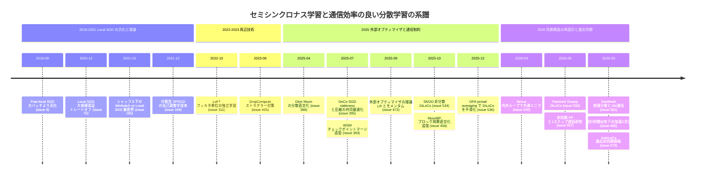

# セミシンクロナス（半同期）学習と通信効率の良い分散学習 サーベイ

**Local SGD / DiLoCo とその派生 / 外部オプティマイザ / 非同期SGD / 分散型 (gossip) SGD / モデル平均化**

> 本ドキュメントは、[Hiroki11x/Papers](https://github.com/Hiroki11x/Papers) の論文読書メモ（GitHub Issues）のうち、セミシンクロナス学習・通信効率の良い分散学習に分類された **17件**（SEMIタグ）に、全572件のメモから抽出した **追加2件**（[#393](https://github.com/Hiroki11x/Papers/issues/393), [#458](https://github.com/Hiroki11x/Papers/issues/458)）を加えた **計19件** を中心に整理したものである（作成日: 2026-09-30）。
>
> - 対象期間: 論文の初出 **2018-08 〜 2026-09**（issue作成は 2020-05 〜 2026-09）
> - 数値・主張は各 issue のメモに基づく。メモに記載がない数値は記していない。
> - 関連姉妹ドキュメント: [01 クリティカルバッチサイズ](./01_critical_batch_size.md) / [02 低精度学習と Muon](./02_low_precision_and_muon.md)

### この分野の問い

1. **どれだけ同期を減らせるか**: 毎ステップの all-reduce をやめ、$H$ ステップに1回だけ同期しても（Local SGD / DiLoCo）、同期データ並列と同等の品質を保てるのか。
2. **何が効いているのか**: DiLoCo の利得は「分散」そのものから来るのか、それとも pseudo-gradient に対する外部 Nesterov 更新という「最適化アルゴリズム」から来るのか。
3. **同期の構造をどう設計するか**: 同期間隔の適応化、ブロッキング通信の分解（gossip）、staleness（遅延）と圧縮の共同最適化、ストラグラー対策。
4. **オプティマイザとの相互作用**: Muon・Lion・高モメンタム手法は、遅延・低ビット通信・分散実装に対してなぜ頑健なのか。

---

## 目次

1. [背景と基本概念](#1-背景と基本概念)
2. [研究の系譜・時系列ナラティブ](#2-研究の系譜時系列ナラティブ)
3. [タイムライン図](#3-タイムライン図)
4. [サブトピック別整理](#4-サブトピック別整理)
5. [論文一覧表（公開順）](#5-論文一覧表公開順)
6. [採択先別集計](#6-採択先別集計)
7. [各論文の詳細まとめ](#7-各論文の詳細まとめ)
8. [横断的知見・未解決問題・実務上の示唆](#8-横断的知見未解決問題実務上の示唆)
9. [関連論文](#9-関連論文)

---

## 1. 背景と基本概念

### 1.1 同期データ並列 (Synchronous Data Parallel, Sync-DP)

$M$ 台のワーカーがそれぞれミニバッチ勾配 $g_t^{(m)}$ を計算し、毎ステップ all-reduce で平均してから更新する。

$$
\theta_{t+1} = \theta_t - \eta \cdot \frac{1}{M}\sum_{m=1}^{M} g_t^{(m)}
$$

- 実効グローバルバッチは $B = M \cdot b$（$b$ はワーカーあたりバッチ）。ワーカーを増やすとバッチが大きくなり、[クリティカルバッチサイズ (CBS)](./01_critical_batch_size.md) を超えるとサンプル効率が落ちる（[#9](https://github.com/Hiroki11x/Papers/issues/9) の問題意識）。
- 通信: **毎ステップ** モデルサイズ $|\theta|$ 相当の all-reduce。低帯域・高遅延（WAN, 地理分散）では GPU が通信待ちで停止する（[#530](https://github.com/Hiroki11x/Papers/issues/530) では 100Mbps 環境で Sync-DP の compute utilization が約1%と報告）。
- **ストラグラー**: 同期バリアがあるため、最も遅いワーカーが全体の速度を決める（[#405](https://github.com/Hiroki11x/Papers/issues/405)）。

### 1.2 Local SGD（= FedAvg, periodic model averaging）

各ワーカーが **$H$ ステップ（内部ステップ数）** 独立に SGD を回し、その後パラメータを平均する。

$$
\theta^{(m)}_{t,h+1} = \theta^{(m)}_{t,h} - \eta\, g^{(m)}_{t,h}\quad (h=0,\dots,H-1),\qquad
\theta_{t+1} = \frac{1}{M}\sum_{m=1}^{M}\theta^{(m)}_{t,H}
$$

- 通信回数は Sync-DP の $1/H$。
- Federated Averaging (FedAvg) と同一の構造であり、[#165](https://github.com/Hiroki11x/Papers/issues/165) のメモでも「local SGD（federated averaging とも呼ばれる）」と明記されている。
- 同じ通信回数あたりで比較されるベースラインは **minibatch SGD**（$H$ ステップ分の勾配を1回の大バッチ更新にまとめる）。

### 1.3 外部オプティマイザと pseudo-gradient（DiLoCo の定式化）

Local SGD の「平均」を **外部（outer）更新** として一般化する。外部ラウンド $t$ における **pseudo-gradient（外部勾配）** を

$$
\Delta_t = \theta_t - \frac{1}{M}\sum_{m=1}^{M}\theta^{(m)}_{t,H}
\quad\bigl(\text{単一ワーカーなら } \Delta_t = \theta_t - \theta_{t+H}\bigr)
$$

と定義し、外部学習率 $\gamma$ で

$$
\theta_{t+1} = \theta_t - \gamma\,\Delta_t
$$

と更新する。$\gamma = 1$ が通常の Local SGD（単純平均）。**DiLoCo** は内部オプティマイザに AdamW、外部オプティマイザに **Nesterov モメンタム付き SGD** を用いる:

$$
v_{t+1} = \mu v_t + \Delta_t,\qquad
\theta_{t+1} = \theta_t - \gamma\,(\Delta_t + \mu\, v_{t+1})
$$

- [#473](https://github.com/Hiroki11x/Papers/issues/473) は、外部モメンタム $\mu$ の実効学習率が $\gamma/(1-\mu)$ となり、$\gamma>1$ と同等の効果を持つことを示した。
- [#534](https://github.com/Hiroki11x/Papers/issues/534)（SNOO）、[#536](https://github.com/Hiroki11x/Papers/issues/536)（GPA）は $M=1$（**非分散**）の DiLoCo でも AdamW を改善することを示し、外部 Nesterov を「オプティマイザのラッパー」として再解釈した。

### 1.4 主なパラメータと用語

| 記号・用語 | 意味 |
|---|---|
| $M$ | ワーカー（レプリカ）数 |
| $H$ | 内部ステップ数（同期間隔）。通信量は概ね $1/H$ に減る |
| $\eta$ / $\gamma$ | 内部学習率 / 外部学習率 |
| $\mu$ | 外部モメンタム係数 |
| staleness $\tau$ | 何ステップ前の勾配・パラメータで更新するか（非同期・遅延集約） |
| 圧縮率 $\delta$ | 勾配圧縮で残す情報の割合（[#395](https://github.com/Hiroki11x/Papers/issues/395)） |
| 量子化通信 | INT8（[#573](https://github.com/Hiroki11x/Papers/issues/573)）や 1bit sign 圧縮（[#561](https://github.com/Hiroki11x/Papers/issues/561)）で通信ビット数を削減 |
| consensus error | ワーカー間のパラメータ不一致。$M$・$H$・モデルサイズが大きいほど劣化要因になる（[#530](https://github.com/Hiroki11x/Papers/issues/530)） |

### 1.5 同期方式のスペクトラム

- **完全同期**: Sync-DP（毎ステップ all-reduce）。ストラグラー対策として部分勾配で同期する DropCompute（[#405](https://github.com/Hiroki11x/Papers/issues/405)）。
- **半同期（周期同期）**: Local SGD / Post-local SGD（[#9](https://github.com/Hiroki11x/Papers/issues/9)）、DiLoCo、AutoLoCo（[#573](https://github.com/Hiroki11x/Papers/issues/573)）、GeoMesh（[#561](https://github.com/Hiroki11x/Papers/issues/561)）。
- **部分同期・分散型**: gossip / decentralized SGD（[#169](https://github.com/Hiroki11x/Papers/issues/169)）、Factored Gossip DiLoCo（[#530](https://github.com/Hiroki11x/Papers/issues/530)）。
- **非同期・遅延**: 遅延集約（[#395](https://github.com/Hiroki11x/Papers/issues/395)）、非同期パイプライン並列（[#557](https://github.com/Hiroki11x/Papers/issues/557)）。

---

## 2. 研究の系譜・時系列ナラティブ

### 2.1 第1期（2018–2021）: Local SGD の汎化・実証・理論

**出発点は「ラージバッチよりも Local SGD」という主張**である。[#9](https://github.com/Hiroki11x/Papers/issues/9)（Lin, Stich, Jaggi ら, ICLR 2020）は、ワーカー数増加に伴うラージバッチの汎化劣化に対し、学習後半のみ Local SGD に切り替える **Post-local SGD** を提案し、局所ステップがノイズ注入として働きフラットな解を好むと主張した。本人メモは「ほとんど SWAP と同じ」とコメントしており、モデル平均化（SWA 系）との近さが当初から意識されていた。この観点は後年の [#536](https://github.com/Hiroki11x/Papers/issues/536)（primal averaging）や [#393](https://github.com/Hiroki11x/Papers/issues/393)（チェックポイントマージ）に接続する。

これに対し **[#70](https://github.com/Hiroki11x/Papers/issues/70)**（Gonzalez Ortiz, Frankle, Rabbat ら, NeurIPS 2020 WS OPT）は **対立する実証結果** を示した: 大規模画像分類では Local SGD の通信削減と精度低下のトレードオフが避けられず、「小規模実験の結論は大規模に一般化しない」。スローモメンタム等で一部改善するという知見は、後の外部モメンタム（DiLoCo の Nesterov outer step）の先駆けと読める。

理論面では **[#165](https://github.com/Hiroki11x/Papers/issues/165)**（Yun, Rajput, Sra, ICLR 2022）が、復元抽出を前提とした従来解析に対し、シャッフル（非復元抽出）ベースの minibatch SGD / local SGD の厳密な上下界を PL 条件下で与えた。本人は「理論に全振りで付録込み76ページ」と嘆いている。

同時期、**分散型（decentralized）SGD** の側では [#169](https://github.com/Hiroki11x/Papers/issues/169)（IBM, 2021）が、大バッチ設定で DPSGD が SSGD より収束面でも有利であり、ランドスケープ依存のノイズが実効学習率を自動調整すると主張した。これは [#9](https://github.com/Hiroki11x/Papers/issues/9) と同様「同期を緩めることで生じるノイズが大バッチの欠点を補う」という系譜にある。ただし本人は「LAMB に勝っているのか？」と、大バッチ向けオプティマイザとの比較の欠如に疑問を呈している。

### 2.2 第2期（2022–2023）: 周辺の工夫 — 独立サブネット学習とストラグラー対策

- [#311](https://github.com/Hiroki11x/Papers/issues/311)（LoFT, AISTATS 2023）は、パラメータ全体の平均ではなく **フィルタ単位で分割した独立サブネットワーク** を別ワーカーで学習させるモデル並列的アプローチで、通信・メモリを削減した。
- [#405](https://github.com/Hiroki11x/Papers/issues/405)（DropCompute, NeurIPS 2023）は **同期を維持したまま** ストラグラーの影響を抑える方向。非同期化は「収束が不安定」として退け、しきい値超過分のミニバッチを破棄して確率的バッチサイズとして扱う。

この時期、メモの中では DiLoCo 本体（2023）の issue は存在しないが、後の [#473](https://github.com/Hiroki11x/Papers/issues/473), [#530](https://github.com/Hiroki11x/Papers/issues/530), [#534](https://github.com/Hiroki11x/Papers/issues/534), [#536](https://github.com/Hiroki11x/Papers/issues/536), [#573](https://github.com/Hiroki11x/Papers/issues/573) がいずれも DiLoCo を基準手法としている。

### 2.3 第3期（2025）: 外部オプティマイザの理論化と「DiLoCo = オプティマイザ」説

2025年は **外部更新そのものへの注目** が急速に進んだ。

- [#473](https://github.com/Hiroki11x/Papers/issues/473)（Khaled, Kale, Douillard ら, NeurIPS 2025）は、外部学習率 $\gamma$ が最適化誤差とノイズ分散のトレードオフを制御し、**ノイズが小さいときは $\gamma>1$、大きいときは $\gamma<1$ が最適** であること、外部 Nesterov で通信回数 $R$ に対する収束率が改善することを示した。従来の Local SGD 解析（$\gamma=1$ 固定）からの明確な拡張。LLM 実験では Nesterov 外部最適化（DiLoCo）と Schedule-Free SGD（$\gamma\approx 2$）が単純平均を上回った。
- [#534](https://github.com/Hiroki11x/Papers/issues/534)（SNOO, Meta, 2025-10）は、さらに踏み込んで **「DiLoCo の利得は分散学習そのものではなく、pseudo-gradient への Nesterov 外部更新に由来する」** と主張し、単一ワーカー版 SNOO を提案した。ただし本人は「著者自身がメカニズムはまだ十分理解されていないと明記している」点に注目している。
- [#536](https://github.com/Hiroki11x/Papers/issues/536)（GPA, Meta / Defazio ら, 2025-12）は SNOO の問いに **primal averaging** の観点から答えようとし、2ループ構造を滑らかな1ステップ更新（GPA）に置き換えた。Llama-160M/1B/8B で AdamW 比約9〜10%少ないステップで同じ検証損失に到達。本人は「sharp な曲率方向の振動を GPA が抑えているのでは」と推測している。
- 追加 [#393](https://github.com/Hiroki11x/Papers/issues/393)（WSM, 2025-07）は LR 減衰をチェックポイントの加重マージで置き換え、**マージ重みが減衰係数と等価** であることを示した。「学習中の平均化 ≒ 暗黙の最適化アルゴリズム」という同じ流れに位置づけられる。

これにより、Local SGD → DiLoCo → SNOO/GPA という流れで、**「通信削減のための近似」だったものが「単体でも優れた最適化手法」へと再解釈** される転換が起きた。[#9](https://github.com/Hiroki11x/Papers/issues/9) の「Local SGD はラージバッチより汎化が良い」という主張は、この再解釈の先駆けとも言える。

一方で2025年は **通信制約下のシステム研究** も進んだ。

- [#388](https://github.com/Hiroki11x/Papers/issues/388)（Dion, Microsoft）と追加 [#458](https://github.com/Hiroki11x/Papers/issues/458)（MuonBP）は、**Muon の分散実装における通信コスト** を削減する（詳細は [02 低精度学習と Muon](./02_low_precision_and_muon.md)）。Dion は低ランク近似＋誤差フィードバック＋分離された運動量、MuonBP はブロック直交化＋周期的な全体直交化。後者の「周期的に全体同期する」構造は Local SGD と同型である。
- [#395](https://github.com/Hiroki11x/Papers/issues/395)（DeCo-SGD, 2025-07）は WAN 環境で staleness $\tau$ と圧縮率 $\delta$ を共同最適化し、**staleness が圧縮の悪影響を指数的に増幅する**（ノイズ項 $\frac{1-\delta}{\delta(1-\delta)^\tau}$）ことを示した。

### 2.4 第4期（2026）: 同期構造の再設計・適応同期・オプティマイザとの相互作用

- [#520](https://github.com/Hiroki11x/Papers/issues/520)（Nexus, ByteDance, 2026-04）は内ループ正規化SGD＋外ループAdamWという **DiLoCo 型2ループ** を、通信削減ではなく **汎化（共通ミニマ／closeness）** のために用いた。同じ事前学習損失のまま GSM8k +15%、MATH +8%。本人は「DiLoCo や自分たちの PALSGD とも関連が強い」と評価しており、[#534](https://github.com/Hiroki11x/Papers/issues/534)/[#536](https://github.com/Hiroki11x/Papers/issues/536) の「2ループ構造は損失の最適化を速める」という立場に対して、「損失ではなく **どの解に行くか** を変える」という別の説明を与える点で興味深い。
- [#530](https://github.com/Hiroki11x/Papers/issues/530)（Factored Gossip DiLoCo, ICML 2026）は、DiLoCo の外部同期を **計算と重ねられるパラメータ mixing（Mix1）** と **ブロッキングな outer gradient mixing（Mix2）** に分解。Streaming DiLoCo などの既存の overlap 手法が **temporal staleness** を導入するのに対し、staleness なしで通信と計算を重ねる最初の枠組みと主張する。200Mbps で GlobalM1 は利用率100%（DiLoCo 53%）。ただし最終 perplexity では DiLoCo がわずかに良く、価値は wall-clock 効率にある。
- [#557](https://github.com/Hiroki11x/Papers/issues/557)（Yandex, 2026-06）は **非同期パイプライン並列** の1ステップ勾配遅延について、**劣化はオプティマイザ依存** であり AdamW/MARS は大きく劣化、Muon・Adan・SOAP・NorMuon は頑健、鍵は高いモメンタム係数と示した。10B MoE・200B トークンで同期と同一の検証損失（1.906）。これは [#405](https://github.com/Hiroki11x/Papers/issues/405) の「非同期は収束が不安定」という前提、および [#395](https://github.com/Hiroki11x/Papers/issues/395) の「staleness は悪影響を増幅」という見方に対し、**オプティマイザ選択次第で遅延は障壁ではない** という対立的な主張になっている。
- [#561](https://github.com/Hiroki11x/Papers/issues/561)（GeoMesh, EMNLP 2026 Findings）は **ヘテロな地理分散データセンター** で、DC ごとに batch size と step 数を調整して同期タイミングを揃え、Lion と組み合わせて 1bit sign 圧縮通信でも性能劣化を抑える。
- [#573](https://github.com/Hiroki11x/Papers/issues/573)（AutoLoCo, 2026-09）は DiLoCo の同期間隔 $H$ を **処理データ量に基づき動的に変える**。単純に変えるだけではうまくいかず、外部オプティマイザのモメンタム・LR 補正が必要（Appendix C で理論的導出）。INT8 通信を使用、Muon は未使用。
- [#565](https://github.com/Hiroki11x/Papers/issues/565)（2026-09）は凸最適化理論側から、統計的類似性を仮定して局所ヘッセを不正確ヘッセとして使う加速2次法（AINE＋restart）で通信ラウンドを削減する。

### 2.5 論文間の関係と対立点のまとめ

| 論点 | 立場A | 立場B |
|---|---|---|
| Local SGD は大規模で有効か | 有効、ラージバッチより汎化が良い（[#9](https://github.com/Hiroki11x/Papers/issues/9)） | 大規模では精度低下のトレードオフが避けられない（[#70](https://github.com/Hiroki11x/Papers/issues/70)） |
| DiLoCo の利得の源泉 | 分散・平均化による通信削減の近似（DiLoCo 本来の位置づけ、[#473](https://github.com/Hiroki11x/Papers/issues/473) は分散設定で解析） | pseudo-gradient への Nesterov 更新そのもの（[#534](https://github.com/Hiroki11x/Papers/issues/534)）／ primal averaging による振動抑制（[#536](https://github.com/Hiroki11x/Papers/issues/536)）／ 共通ミニマへの誘導（[#520](https://github.com/Hiroki11x/Papers/issues/520)） |
| 非同期・遅延の是非 | 非同期は不安定なので同期を保つ（[#405](https://github.com/Hiroki11x/Papers/issues/405)）、staleness は圧縮の害を増幅（[#395](https://github.com/Hiroki11x/Papers/issues/395)）、staleness を避けて overlap（[#530](https://github.com/Hiroki11x/Papers/issues/530)） | 高モメンタム系オプティマイザなら1ステップ遅延は障壁でない（[#557](https://github.com/Hiroki11x/Papers/issues/557)） |
| 同期を緩めた際のノイズ | 有益（フラット解・実効LRの自動調整: [#9](https://github.com/Hiroki11x/Papers/issues/9), [#169](https://github.com/Hiroki11x/Papers/issues/169)） | 有害（consensus error、$M$・$H$・モデルサイズで劣化拡大: [#530](https://github.com/Hiroki11x/Papers/issues/530)） |
| 外部学習率 | $\gamma=1$（単純平均）が標準 | ノイズに応じて $\gamma>1$ / $\gamma<1$（[#473](https://github.com/Hiroki11x/Papers/issues/473)）、$H$ を変えるなら補正が必要（[#573](https://github.com/Hiroki11x/Papers/issues/573)） |

---

## 3. タイムライン図

---

## 4. サブトピック別整理

### A. Local SGD の汎化・実証・収束理論

| 論文 | 要点 |
|---|---|
| [#9](https://github.com/Hiroki11x/Papers/issues/9) Post-local SGD | 後半のみ Local SGD でラージバッチの汎化ギャップを改善 |
| [#70](https://github.com/Hiroki11x/Papers/issues/70) Trade-offs at Scale | 大規模では通信削減と精度のトレードオフが顕著 |
| [#165](https://github.com/Hiroki11x/Papers/issues/165) Shuffling bounds | シャッフル下の厳密上下界、同期シャッフリングで下界超え |
| [#565](https://github.com/Hiroki11x/Papers/issues/565) AINE | 統計的類似性下で通信ラウンドを削減する加速2次法 |

**所見**: 汎化の観点（[#9](https://github.com/Hiroki11x/Papers/issues/9)）と大規模実証（[#70](https://github.com/Hiroki11x/Papers/issues/70)）が対立したまま、理論は凸・PL 条件の範囲にとどまる。LLM スケールでの理論は第C群（外部オプティマイザ）に引き継がれた。

### B. 分散型・gossip・同期構造の再設計

| 論文 | 要点 |
|---|---|
| [#169](https://github.com/Hiroki11x/Papers/issues/169) DPSGD | 大バッチで DPSGD が SSGD より収束面でも有利 |
| [#311](https://github.com/Hiroki11x/Papers/issues/311) LoFT | フィルタ分割の独立サブネット学習で通信・メモリ削減 |
| [#530](https://github.com/Hiroki11x/Papers/issues/530) Factored Gossip DiLoCo | 同期を Mix1（非ブロッキング）と Mix2（ブロッキング）に分解 |
| [#573](https://github.com/Hiroki11x/Papers/issues/573) AutoLoCo | データ量ベースの適応的 $H$ と外部オプティマイザ補正 |
| [#561](https://github.com/Hiroki11x/Papers/issues/561) GeoMesh | DC ごとの batch/step 調整で同期タイミングを揃える |

**所見**: 「同期頻度を減らす」（DiLoCo）から「同期の **内部構造** を設計する」（Mix1/Mix2 分解、適応的 $H$、ヘテロ環境の負荷分散）へと焦点が移っている。

### C. 外部オプティマイザと「2ループ最適化」の再解釈

| 論文 | 要点 |
|---|---|
| [#473](https://github.com/Hiroki11x/Papers/issues/473) Outer Optimizers | $\gamma$ のバイアス・分散トレードオフ、実効LR $\gamma/(1-\mu)$、Nesterov 加速 |
| [#534](https://github.com/Hiroki11x/Papers/issues/534) SNOO | 単一ワーカー DiLoCo。利得は Nesterov 外部更新に由来 |
| [#536](https://github.com/Hiroki11x/Papers/issues/536) GPA | primal averaging で2ループを1ステップに平滑化 |
| [#520](https://github.com/Hiroki11x/Papers/issues/520) Nexus | 内外ループで勾配類似度を高め、共通ミニマに誘導 |
| [#393](https://github.com/Hiroki11x/Papers/issues/393) WSM（追加） | チェックポイントマージ ≒ LR 減衰 |

**所見**: 2025–2026 の最も活発な流れ。外部更新は「通信削減の副産物」から「単体で有効な最適化・汎化手法」として再定義されつつあるが、メカニズムの説明（Nesterov / primal averaging / closeness）は並立しており、統一理論はまだない。

### D. 非同期・遅延・圧縮通信・ストラグラー

| 論文 | 要点 |
|---|---|
| [#405](https://github.com/Hiroki11x/Papers/issues/405) DropCompute | 同期を保ちつつ遅いワーカーの計算を打ち切る |
| [#395](https://github.com/Hiroki11x/Papers/issues/395) DeCo-SGD | staleness × 圧縮の相互作用、Time-to-Accuracy 最小化 |
| [#557](https://github.com/Hiroki11x/Papers/issues/557) Async PP | 1ステップ遅延の頑健性はオプティマイザ依存、Error Feedback |
| [#561](https://github.com/Hiroki11x/Papers/issues/561) GeoMesh | Lion + 1bit sign 圧縮 |

**所見**: 遅延・圧縮への耐性は **アルゴリズム（オプティマイザ）側で吸収できる** という見方が強まっている（[#557](https://github.com/Hiroki11x/Papers/issues/557), [#561](https://github.com/Hiroki11x/Papers/issues/561)）。誤差フィードバック（Error Feedback）は [#388](https://github.com/Hiroki11x/Papers/issues/388), [#395](https://github.com/Hiroki11x/Papers/issues/395), [#557](https://github.com/Hiroki11x/Papers/issues/557) に共通する道具である。

### E. Muon 系オプティマイザの分散・通信効率化

| 論文 | 要点 |
|---|---|
| [#388](https://github.com/Hiroki11x/Papers/issues/388) Dion | 低ランク直交化、unshard 不要、誤差フィードバック、分離運動量 |
| [#458](https://github.com/Hiroki11x/Papers/issues/458) MuonBP（追加） | シャード単位ブロック直交化＋周期的全体直交化 |

**所見**: Muon の全行列直交化は FSDP/TP と相性が悪く、「局所で近似し周期的に同期する」という Local SGD 的発想が直交化にも持ち込まれている。詳細は [02 低精度学習と Muon](./02_low_precision_and_muon.md) 参照。

---

## 5. 論文一覧表（公開順）

「追加」は SEMI タグ外から本ドキュメントで取り込んだ論文。

| 公開年月 | 論文 (issueリンク) | 著者/組織 | 採択先 | 根拠 | サブトピック |
|---|---|---|---|---|---|
| 2018-08 | [#9](https://github.com/Hiroki11x/Papers/issues/9) Don't Use Large Mini-Batches, Use Local SGD | Tao Lin, Sebastian U. Stich, et al. / EPFL | ICLR 2020 | 既知情報 | A. Local SGD とラージバッチ汎化 |
| 2020-12 | [#70](https://github.com/Hiroki11x/Papers/issues/70) Trade-offs of Local SGD at Scale: An Empirical Study | Jose Javier Gonzalez Ortiz, Jonathan Frankle, Mike Rabbat, et al. / MIT, FAIR | NeurIPS 2020 Workshop (OPT) | issue記載 | A. Local SGD の大規模実証 |
| 2021-10 | [#165](https://github.com/Hiroki11x/Papers/issues/165) Minibatch vs Local SGD with Shuffling | Chulhee Yun, Shashank Rajput, Suvrit Sra / KAIST, UW-Madison, MIT | ICLR 2022 | 既知情報 | A. Local SGD の収束理論 |
| 2021-12 | [#169](https://github.com/Hiroki11x/Papers/issues/169) Loss Landscape Dependent Self-Adjusting LRs in Decentralized SGD | Wei Zhang, Mingrui Liu, Yu Feng, et al. / IBM Research | arXiv（プレプリント） | 不明 | B. 分散型SGDと大バッチ |
| 2022-10 | [#311](https://github.com/Hiroki11x/Papers/issues/311) LOFT: Finding Lottery Tickets through Filter-wise Training | Qihan Wang, Chen Dun, et al. (A. Kyrillidis) / Rice Univ. | AISTATS 2023 | 既知情報 | B. 独立サブネット分散学習 |
| 2023-06 | [#405](https://github.com/Hiroki11x/Papers/issues/405) DropCompute | Niv Giladi, et al. (Daniel Soudry) / Habana Labs (Intel), Technion | NeurIPS 2023 | 既知情報 | D. ストラグラー対策 |
| 2025-04 | [#388](https://github.com/Hiroki11x/Papers/issues/388) Dion: Distributed Orthonormalized Updates | Kwangjun Ahn, Byron Xu, Natalie Abreu, John Langford, et al. / Microsoft Research | arXiv（プレプリント） | 不明 | E. Muon の分散・通信効率化 |
| 2025-07 | [#395](https://github.com/Hiroki11x/Papers/issues/395) DeCo-SGD: Taming Latency and Bandwidth | Rongwei Lu, Jingyan Jiang, et al. / Tsinghua Univ. | arXiv（プレプリント） | 不明 | D. staleness と圧縮 |
| 2025-07 | [#393](https://github.com/Hiroki11x/Papers/issues/393) WSM: Decay-Free LR Schedule via Checkpoint Merging（追加） | Changxin Tian, et al. / Ant Group | arXiv（プレプリント） | 不明 | C. 学習中のモデル平均化 |
| 2025-09 | [#473](https://github.com/Hiroki11x/Papers/issues/473) Understanding Outer Optimizers in Local SGD | Ahmed Khaled, Satyen Kale, Arthur Douillard, et al. / Google DeepMind, Princeton | NeurIPS 2025 | issue記載 | C. 外部オプティマイザ理論 |
| 2025-10 | [#534](https://github.com/Hiroki11x/Papers/issues/534) SNOO: Step-K Nesterov Outer Optimizer | Dominik Kallusky, Vinay Rao, et al., Hao-Jun Michael Shi / Meta | arXiv（プレプリント） | 不明 | C. 外部 Nesterov（非分散） |
| 2025-10 | [#458](https://github.com/Hiroki11x/Papers/issues/458) MuonBP: Block-Periodic Orthogonalization（追加） | Ahmed Khaled, Kaan Ozkara, Tao Yu, et al. / Princeton, AWS, UMN | arXiv（プレプリント） | 不明 | E. Muon の分散実装と通信削減 |
| 2025-12 | [#536](https://github.com/Hiroki11x/Papers/issues/536) Smoothing DiLoCo with Primal Averaging (GPA) | Aaron Defazio, Konstantin Mishchenko, et al. / Meta | arXiv（プレプリント） | 不明 | C. DiLoCo と primal averaging |
| 2026-04 | [#520](https://github.com/Hiroki11x/Papers/issues/520) Nexus: Same Pretraining Loss, Better Downstream | Huanran Chen, et al. / ByteDance | arXiv（プレプリント） | 不明 | C. 内外ループと共通ミニマ |
| 2026-06 | [#530](https://github.com/Hiroki11x/Papers/issues/530) Factored Gossip DiLoCo | Chamin Hewa Koneputugodage, Thalaiyasingam Ajanthan, et al. / Pluralis Research | ICML 2026 | arXivコメント | B. DiLoCo の非ブロッキング通信 |
| 2026-06 | [#557](https://github.com/Hiroki11x/Papers/issues/557) One-Step Gradient Delay is Not a Barrier | Philip Zmushko, Egor Petrov, et al. / Yandex | arXiv（プレプリント） | 不明 | D. 非同期 PP と遅延耐性 |
| 2026-09 | [#561](https://github.com/Hiroki11x/Papers/issues/561) GeoMesh | Changyong Shin, Jaerim Park, et al. / 不明 | EMNLP 2026 (Findings) | arXivコメント | D. 地理分散と1bit通信 |
| 2026-09 | [#565](https://github.com/Hiroki11x/Papers/issues/565) Optimal Inexact Second-Order Acceleration under Statistical Similarity | Yury A. Sokolov, et al., Alexander V. Gasnikov / 不明 | arXiv（プレプリント） | 不明 | A. 通信効率的分散2次最適化 |
| 2026-09 | [#573](https://github.com/Hiroki11x/Papers/issues/573) AutoLoCo | Pengyu He, Yan Zhang, Ruien Li, Guangwen Yang / Tsinghua | arXiv（プレプリント） | 不明 | B. DiLoCo の適応的同期間隔 |

---

## 6. 採択先別集計

| 採択先 | 件数 | 論文 |
|---|---:|---|
| arXiv（プレプリント） | 11（うち追加2） | [#169](https://github.com/Hiroki11x/Papers/issues/169), [#388](https://github.com/Hiroki11x/Papers/issues/388), [#395](https://github.com/Hiroki11x/Papers/issues/395), [#393](https://github.com/Hiroki11x/Papers/issues/393), [#534](https://github.com/Hiroki11x/Papers/issues/534), [#458](https://github.com/Hiroki11x/Papers/issues/458), [#536](https://github.com/Hiroki11x/Papers/issues/536), [#520](https://github.com/Hiroki11x/Papers/issues/520), [#557](https://github.com/Hiroki11x/Papers/issues/557), [#565](https://github.com/Hiroki11x/Papers/issues/565), [#573](https://github.com/Hiroki11x/Papers/issues/573) |
| ICLR | 2 | [#9](https://github.com/Hiroki11x/Papers/issues/9)（2020）, [#165](https://github.com/Hiroki11x/Papers/issues/165)（2022） |
| NeurIPS | 2 | [#405](https://github.com/Hiroki11x/Papers/issues/405)（2023）, [#473](https://github.com/Hiroki11x/Papers/issues/473)（2025） |
| NeurIPS Workshop (OPT) | 1 | [#70](https://github.com/Hiroki11x/Papers/issues/70)（2020） |
| ICML | 1 | [#530](https://github.com/Hiroki11x/Papers/issues/530)（2026） |
| AISTATS | 1 | [#311](https://github.com/Hiroki11x/Papers/issues/311)（2023） |
| EMNLP (Findings) | 1 | [#561](https://github.com/Hiroki11x/Papers/issues/561)（2026） |
| **合計** | **19** | SEMI タグ17件 + 追加2件 |

2025年以降の13件中10件がプレプリントであり、分野が急速に動いていて査読を待たずに参照されている状況がうかがえる。

---

## 7. 各論文の詳細まとめ

### [#9] Don't Use Large Mini-Batches, Use Local SGD

- **公開**: 2018-08（arXiv 1808.07217） / **採択先**: ICLR 2020（既知情報） / **著者/組織**: Tao Lin, Sebastian U. Stich, Kumar Kshitij Patel, Martin Jaggi / EPFL

**要約**: ラージバッチ学習の汎化劣化に対し、各ワーカーが局所的に複数ステップ更新してから平均する Local SGD と、学習後半のみ Local SGD に切り替える Post-local SGD を提案した。通信削減と同時に、ラージバッチより良い汎化を得られることを示した。

**主な知見**:
- Post-local SGD がラージバッチの汎化ギャップを改善
- 局所ステップがノイズ注入として働き、フラットな解を好む

**本人のメモ**: 「ほとんど SWAP と同じ」。

### [#70] Trade-offs of Local SGD at Scale: An Empirical Study

- **公開**: 2020-12（arXiv 2110.08133） / **採択先**: NeurIPS 2020 Workshop (OPT)（issue記載） / **著者/組織**: Jose Javier Gonzalez Ortiz, Jonathan Frankle, Mike Rabbat, et al. / MIT, Facebook AI Research

**要約**: 大規模画像分類で Local SGD と関連手法を包括的に評価した。同期間に独立した複数ステップを実行する Local SGD は通信コストを削減し学習を高速化するが、大規模では精度低下とのトレードオフが避けられず、小規模実験の先行研究とは異なる結論となった。

**主な知見**:
- 大規模設定では通信削減と精度低下のトレードオフが顕著
- 小規模実験の結論は大規模に一般化しない
- スローモメンタム等の工夫で一部改善

### [#165] Minibatch vs Local SGD with Shuffling: Tight Convergence Bounds and Beyond

- **公開**: 2021-10（arXiv 2110.10342） / **採択先**: ICLR 2022（既知情報） / **著者/組織**: Chulhee Yun, Shashank Rajput, Suvrit Sra / KAIST, UW-Madison, MIT

**要約**: シャッフル（非復元抽出）ベースの minibatch SGD と local SGD（federated averaging）について、PL 条件を満たす滑らかな関数に対する厳密な上下界を与え、復元抽出より速く収束することを示した。さらに同期シャッフリング（synchronized shuffling）により、同種設定で下界を超える収束率を得た。

**主な知見**:
- シャッフルベース手法は復元抽出より速く収束
- 上界に一致する下界を証明
- 同期シャッフリングで下界より高速化

**本人のメモ**: 実験は付録に少しあるのみで理論に全振り。本文9ページ＋付録で計76ページもあり「泣いちゃう」。

### [#169] Loss Landscape Dependent Self-Adjusting Learning Rates in Decentralized Stochastic Gradient Descent

- **公開**: 2021-12（arXiv 2112.01433） / **採択先**: arXiv（プレプリント）（不明） / **著者/組織**: Wei Zhang, Mingrui Liu, Yu Feng, et al. / IBM Research

**要約**: 大バッチ設定で、分散型並列SGD（DPSGD）が同期SGD（SSGD）より実行時間だけでなく収束面でも有利であることを発見した。DPSGD はランドスケープ依存のノイズを導入して実効学習率を自動調整し、損失を平滑化してより大きな学習率を可能にする。

**主な知見**:
- SSGD が大きな LR で発散する場合も DPSGD は収束
- CV（CIFAR10, ImageNet-1K）と音声認識（SWB300, SWB2000）、CNN と LSTM の18モデル/タスクで一貫

**本人のメモ**: 「LAMB に勝ってる？？」と疑問。

### [#311] LOFT: Finding Lottery Tickets through Filter-wise Training

- **公開**: 2022-10 / **採択先**: AISTATS 2023（既知情報） / **著者/組織**: Qihan Wang, Chen Dun, Fangshuo Liao, et al. (Anastasios Kyrillidis) / Rice University

**要約**: CNN の畳み込み層をフィルタ単位で分割し、異なる分散ワーカーで独立に学習させるモデル並列型事前学習アルゴリズム LoFT を提案した。真の当たりくじやモデルの完全学習を必要としないフィルタ距離指標で当たりくじの出現を効率的に特定し、メモリ・通信コストを削減しつつ同等以上の精度を維持した。

**主な知見**:
- フィルタ分割の独立学習で計算・通信コストを非自明に削減
- 良い当たりくじ（lottery ticket）を保存・発見できる
- 他の事前学習法と同等以上の精度

### [#405] DropCompute: simple and more robust distributed synchronous training via compute variance reduction

- **公開**: 2023-06（arXiv 2306.10598） / **採択先**: NeurIPS 2023（既知情報） / **著者/組織**: Niv Giladi, Shahar Gottlieb, Moran Shkolnik, et al. (Daniel Soudry) / Habana Labs (Intel), Technion

**要約**: 同期 All-Reduce 型分散学習で計算時間のばらつき（ストラグラー）が効率を制限する問題に対し、各ワーカーが計算時間しきい値 $\tau$ を超えたらミニバッチの残りを破棄し部分勾配のみを同期する DropCompute を提案した。確率的バッチサイズとなるが SGD 同様の収束保証を示し、非同期化せずに頑健性を高める。冗長化（追加資源が必要）、非同期（収束が不安定）、通信圧縮（計算ばらつきには無力）との差別化を明示している。

**主な知見**:
- サンプルドロップ率10%程度までは精度劣化がほぼない（BERT-Large, ResNet-50）
- 200台の Gaudi で BERT-1.5B 学習時に最大18%高速化
- ワーカー数増加時のスケーリングを線形に近づける（ステップ数は若干増えるが総時間は短縮）

### [#388] Dion: Distributed Orthonormalized Updates

- **公開**: 2025-04（arXiv 2504.05295） / **採択先**: arXiv（プレプリント）（不明） / **著者/組織**: Kwangjun Ahn, Byron Xu, Natalie Abreu, John Langford, et al. / Microsoft Research

**要約**: Muon の全行列 Newton–Schulz 直交化は FSDP/TP 環境で計算・通信コストが大きい（405B モデルで Muon の計算だけで278日以上の追加コストという試算）。Dion はパワー反復による低ランク近似と QR/Cholesky 分解で直交化し、シャード行列を unshard せずに更新を計算する。誤差フィードバックと、各データ並列ワーカーがローカル運動量を持ちつつ同期時と等価な更新を得る分離運動量（decoupled momentum）で通信を削減する。分散版が中央集権版と数学的に等価であることも証明した。

**主な知見**:
- 3B モデルで AdamW 比2〜3倍の学習効率（Muon を一貫して上回る）
- 大モデル・大バッチほど低ランク（例: $d/16$）でも Muon に近い性能
- モデルサイズ間で最適学習率がほぼ一定（ハイパーパラメータ転移性）

### [#395] Taming Latency and Bandwidth: DeCo-SGD

- **公開**: 2025-07（arXiv 2507.17346） / **採択先**: arXiv（プレプリント）（不明） / **著者/組織**: Rongwei Lu, Jingyan Jiang, Chunyang Li, et al. / Tsinghua University

**要約**: 高遅延・低帯域な WAN 環境での分散学習で、遅延集約（staleness $\tau$）と勾配圧縮率 $\delta$ を動的に共同最適化する DeCo-SGD を提案した。Nested Virtual Sequence (NVS) という解析手法で、staleness が圧縮の悪影響を指数的に増幅すること（ノイズ項 $\frac{1-\delta}{\delta(1-\delta)^\tau}$）を示し、収束率と通信時間モデルから Time-to-Accuracy を最小化する $\delta,\tau$ を導出する。

**主な知見**:
- staleness は圧縮による収束悪化を指数関数的に増幅する
- D-SGD 比で最大5.07倍、CocktailSGD 比で最大1.37倍の学習高速化
- CNN / ViT / GPT-2 で動的ネットワーク環境下の優位性を確認

### [#393] WSM: Decay-Free Learning Rate Schedule via Checkpoint Merging for LLM Pre-training（追加）

- **公開**: 2025-07 / **採択先**: arXiv（プレプリント）（不明） / **著者/組織**: Changxin Tian, Jiapeng Wang, Qian Zhao, et al. / Ant Group

**要約**: LR 減衰フェーズをチェックポイントの加重マージで置き換える WSM を提案し、マージ重みが勾配更新への減衰係数と等価であることを示した。16.3B MoE で WSD を上回り、マージ期間が最重要要因であることを示した。本ドキュメントでは「学習中のモデル平均化が最適化アルゴリズムと等価になる」例として、primal averaging（[#536](https://github.com/Hiroki11x/Papers/issues/536)）と並べて扱う。

**主な知見**:
- マージ重み ≒ LR 減衰係数
- 16.3B MoE で WSD を上回る
- マージ期間が最重要要因

### [#473] Understanding Outer Optimizers in Local SGD: Learning Rates, Momentum, and Acceleration

- **公開**: 2025-09（arXiv 2509.10439） / **採択先**: NeurIPS 2025（issue記載） / **著者/組織**: Ahmed Khaled, Satyen Kale, Arthur Douillard, et al. / Google DeepMind, Princeton

**要約**: Local SGD における外部学習率 $\gamma$ とモメンタム・Nesterov 加速の役割を理論解析した。$\gamma$ は最適化誤差とノイズ分散のトレードオフを制御し、$\gamma>1$ とすることで内部学習率の誤設定を補正できること、外部 Nesterov 加速で通信回数 $R$ に対する収束率が改善し FedAc より良い依存性を持つことを示した。凸二次問題と C4 上の Chinchilla 型 Transformer 事前学習（150M〜1B）で検証した。

**主な知見**:
- ノイズ $\sigma$ が小さいときは $\gamma>1$、大きいときは $\gamma<1$ が最適
- 外部モメンタム $\mu$ の実効学習率は $\gamma/(1-\mu)$ で、$\gamma>1$ と同等の効果
- LLM 実験で Nesterov 外部最適化（DiLoCo）と Schedule-Free SGD（$\gamma\approx 2$）が単純平均を上回る（400M で SF-SGD が最良 perplexity ≈13.9、最適 $\gamma_{\text{Nesterov}}\approx 0.7$）
- 外部勾配のコサイン類似度の低下が性能劣化と関係（$H$・$M$ を変えた解析）
- 今後の課題: 非 i.i.d. 設定、適応的外部オプティマイザ（Adam 等）の理論

### [#534] SNOO: Step-K Nesterov Outer Optimizer — The Surprising Effectiveness of Nesterov Momentum Applied to Pseudo-Gradients

- **公開**: 2025-10（arXiv 2510.15830） / **採択先**: arXiv（プレプリント）（不明） / **著者/組織**: Dominik Kallusky, Vinay Rao, Vishal Nandavanam, Hao-Jun Michael Shi / Meta

**要約**: DiLoCo の性能向上は分散学習そのものではなく、複数の inner step から得られる pseudo-gradient に Nesterov momentum を適用することに由来すると主張した。単一ワーカーの DiLoCo である SNOO を提案し、その有効性を示した。

**主な知見**:
- DiLoCo の利得は pseudo-gradient への Nesterov 外部更新に由来
- 非分散設定でも AdamW 等の base optimizer を改善

**本人のメモ**: むしろ著者自身が「メカニズムはまだ十分理解されていない」と明記している点に注目。次に読む候補として GPA（arXiv 2512.17131 = [#536](https://github.com/Hiroki11x/Papers/issues/536)）と arXiv 2403.04081 を挙げている。

### [#458] MuonBP: Faster Muon via Block-Periodic Orthogonalization（追加）

- **公開**: 2025-10 / **採択先**: arXiv（プレプリント）（不明） / **著者/組織**: Ahmed Khaled, Kaan Ozkara, Tao Yu, et al. / Princeton, AWS, UMN

**要約**: モデル並列下の Muon は直交化のための勾配 all-gather で5〜10%のスループット低下を招くため、各デバイスのシャード単位でブロック直交化を行い、周期的に全体直交化を挟む MuonBP を提案した。2種類の学習率を用いた非ユークリッド信頼領域の枠組みで BlockMuon と Muon の間を補間する収束保証を与えた。[#473](https://github.com/Hiroki11x/Papers/issues/473) と筆頭著者が共通で、「局所で進めて周期的に同期する」という Local SGD 型の構造を直交化に適用したものと読める。

**主な知見**:
- ブロックのみの直交化（BlockMuon）はパラメータノルムが急増し不安定
- 周期的な全直交化で安定性を回復
- 8B で約8%スループット向上、学習時間10〜13%短縮

### [#536] Smoothing DiLoCo with Primal Averaging for Faster Training of LLMs

- **公開**: 2025-12（arXiv 2512.17131） / **採択先**: arXiv（プレプリント）（不明） / **著者/組織**: Aaron Defazio, Konstantin Mishchenko, Parameswaran Raman, Hao-Jun Michael Shi, Lin Xiao / Meta (Superintelligence Labs)

**要約**: 単一ワーカーの DiLoCo が AdamW より良くなる理由を primal averaging の観点から捉え直し、その2ループ構造を滑らかな1ステップ更新に置き換えた GPA（Generalized Primal Averaging）を提案した。AdamW を base にした GPA は Llama-160M/1B/8B で同じ検証損失に約9〜10%少ないステップで到達した。

**主な知見**:
- Llama-160M/1B/8B で AdamW 比 8.71% / 10.13% / 9.58% 少ないステップ
- メモリは DiLoCo と同等、memory-efficient 版では DiLoCo よりやや削減

**本人のメモ**: sharp な曲率方向で起きやすい振動を GPA が抑えているのではないか、という推測。

### [#520] Nexus: Same Pretraining Loss, Better Downstream Generalization via Common Minima

- **公開**: 2026-04（arXiv 2604.09258） / **採択先**: arXiv（プレプリント）（不明） / **著者/組織**: Huanran Chen, Huaqing Zhang, Xiao Li, et al. / ByteDance

**要約**: 同じ事前学習損失でも下流性能が異なる理由を、タスクごとの最小解の近さ（closeness）という幾何的観点から説明する。closeness の直接最適化は困難なため、勾配類似度を最大化して間接的に促す Nexus 最適化（内ループ正規化SGD＋外ループAdamW）を提案し、130M〜3B モデルで同一の事前学習損失のまま下流性能を大きく改善した。

**主な知見**:
- 事前学習損失はほぼ同一で GSM8k +15%、MATH +8%
- 2次展開により Flatness に加え Closeness が汎化を支配すると示す
- モデル規模が大きいほど効果が増大。Muon ≈ Adam の軌道に対し Nexus のみ別の軌道をとる

**本人のメモ**: Tengyu Ma らの「Same Pre-training Loss, Better Downstream」（arXiv 2210.14199）と関連。Gradient Diversity の議論は以前からあるが、pretraining と downstream を分けた点に価値がある。DiLoCo や自分たちの PALSGD（arXiv 2504.18454）とも関連が強い。

### [#530] Factored Gossip DiLoCo: Reducing Blocking Communication in DiLoCo

- **公開**: 2026-06（arXiv 2606.22768） / **採択先**: ICML 2026（arXivコメント） / **著者/組織**: Chamin Hewa Koneputugodage, Thalaiyasingam Ajanthan, et al., Alexander Long / Pluralis Research

**要約**: DiLoCo の外部同期を、計算とオーバーラップ可能なパラメータ mixing（Mix1）と、不一致を抑えるブロッキングな outer gradient mixing（Mix2）に分解する。次の inner 計算は最新のローカル外部更新後のパラメータから始まるため、生じるのは temporal staleness ではなく starting-point noise であり、Streaming DiLoCo 等と異なり staleness なしに通信と計算を重ねられる。1.5B（Llama 3 形式、FineWeb、8〜16 workers、AdamW 内部＋Nesterov 外部）で DiLoCo に近い perplexity を保ちつつ wall-clock を短縮し、JS 距離で機能的不一致を測る指標も提案した。

**主な知見**:
- $H=100$、10B トークンで PPL: Sync-DP 17.53 / DiLoCo 18.65 / GlobalM1LocalM2 18.80 / GlobalM1 19.42。30B トークンでは DiLoCo 15.52 / GlobalM1LocalM2 15.60
- 200Mbps で GlobalM1 は利用率100%（DiLoCo 53%）。100Mbps では Sync-DP 約1%、DiLoCo 36%
- consensus error 上界 $2\eta^2\sigma^2H\bigl(1+\frac{\rho_2}{1-\rho_1}\bigr)$: Mix1 が長期的な不一致蓄積を防ぎ、Mix2 が上界をさらに締める（凸・SGD 簡略化の定性的解析）
- L2 距離ではなく JS 距離が loss spike と強く対応。Mix2 は token embedding・LM head・浅い2層（全体の43%）だけで十分
- $M$・$H$・モデルサイズが大きいほど不完全な consensus による劣化が拡大
- 限界: 精度で DiLoCo を超えるわけではない。利用率や 1T トークン学習時間（GlobalM1 約16週 vs DiLoCo 約29週）はシミュレーション推定を含む

### [#557] One-Step Gradient Delay is Not a Barrier for Large-Scale Asynchronous Pipeline Parallel LLM Pretraining

- **公開**: 2026-06（arXiv 2606.30634） / **採択先**: arXiv（プレプリント）（不明） / **著者/組織**: Philip Zmushko, Egor Petrov, Nursultan Abdullaev, et al. / Yandex

**要約**: 非同期パイプライン並列の1ステップ勾配遅延による劣化は不可避ではなく、オプティマイザ選択に強く依存することを示した。AdamW/MARS は大きく劣化する一方、Muon・Adan・SOAP・NorMuon は頑健で、高いモメンタム係数が鍵となる。更新レベルの Error Feedback を提案し、遅延下での LMO 系アルゴリズム（Muon を含む）の収束も証明した。

**主な知見**:
- Muon 等は1ステップ遅延に頑健、AdamW は大きく劣化
- Error Feedback で sync-async gap を50〜70%削減
- 10B MoE・200B トークンで同期と同じ最終検証損失 1.906。段数によらず1ステップ固定遅延を保証する PipeDream-2BW スケジュールが大規模化に重要

### [#561] GeoMesh: Workload-Balanced and Sign-Compressed Geo-Distributed LLM Training

- **公開**: 2026-09（arXiv 2609.18388） / **採択先**: EMNLP 2026 (Findings)（arXivコメント） / **著者/組織**: Changyong Shin, Jaerim Park, Minchul Kang, et al. / 不明

**要約**: ヘテロな複数データセンターでの地理分散 LLM 学習において、データセンターごとに batch size と step 数を調整して同期タイミングを揃え、Lion を用いることで 1bit の sign 圧縮勾配通信でも性能劣化を抑える GeoMesh を提案した。

**主な知見**:
- DC ごとの batch size・step 数調整で同期タイミングを揃える
- Lion と組み合わせると 1bit 勾配通信でも性能がほぼ落ちない

### [#565] Application of Optimal Inexact Second-Order Acceleration to Distributed Stochastic Optimization under Statistical Similarity

- **公開**: 2026-09（arXiv 2609.21878） / **採択先**: arXiv（プレプリント）（不明） / **著者/組織**: Yury A. Sokolov, Maxim K. Mashtaler, Alexander V. Gasnikov, et al. / 不明

**要約**: 統計的類似性を持つ分散確率的凸最適化で、標本平均近似（SAA）により有限和問題に帰着し、サーバーの局所ヘッセ行列を大域ヘッセの不正確な近似として用いる。加速不正確 Newton-Extragradient 法（AINE）と再起動スキームを組み合わせ、通信効率の高い分散アルゴリズムを提案する。

**主な知見**:
- SAA で有限和問題に帰着し局所ヘッセを不正確ヘッセとして利用
- AINE＋restart で通信ラウンド数を削減

### [#573] AutoLoCo: Communication Efficient Distributed LLM Training via Adaptive Synchronization

- **公開**: 2026-09（arXiv 2609.36662） / **採択先**: arXiv（プレプリント）（不明） / **著者/組織**: Pengyu He, Yan Zhang, Ruien Li, Guangwen Yang / Tsinghua

**要約**: DiLoCo の同期間隔 $H$ をステップ数ではなく処理データ量に基づいて動的に変える AutoLoCo を提案した。単純に $H$ を変えるだけではうまくいかないため、外部オプティマイザのモメンタムや学習率を補正し（Appendix C で理論的導出）、INT8 通信も用いて通信効率を高める。

**主な知見**:
- 同期間隔 $H$ を処理データ量に応じて適応的に変更
- 外部オプティマイザのモメンタム・LR 補正が必要で、理論的導出あり
- INT8 を使用、Muon は未使用

**本人のメモ**: 「モメンタムや LR の補正は何か理論的な裏付けがある？」という疑問 → Appendix C に明確な理論的分析・数理的導出があると確認。

---

## 8. 横断的知見・未解決問題・実務上の示唆

### 8.1 横断的知見

1. **外部更新は「近似」から「オプティマイザ」へ**
   Local SGD の平均化（$\gamma=1$）→ DiLoCo の外部 Nesterov → 単一ワーカーの SNOO（[#534](https://github.com/Hiroki11x/Papers/issues/534)）・GPA（[#536](https://github.com/Hiroki11x/Papers/issues/536)）という流れで、2ループ構造が通信とは無関係に AdamW を改善しうることが示された。[#473](https://github.com/Hiroki11x/Papers/issues/473) の実効学習率 $\gamma/(1-\mu)$ の議論は、「外部モメンタムは $H$ ステップ分の変化を外挿する」という見方を与える。WSM（[#393](https://github.com/Hiroki11x/Papers/issues/393)）の「マージ ≒ LR 減衰」も含め、**学習中の平均化・外挿と LR スケジュールは表裏一体** である。

2. **同期を緩めたノイズは「薬にも毒にもなる」**
   [#9](https://github.com/Hiroki11x/Papers/issues/9)・[#169](https://github.com/Hiroki11x/Papers/issues/169) はノイズがフラット解や実効LRの自動調整に寄与すると主張し、[#70](https://github.com/Hiroki11x/Papers/issues/70)・[#530](https://github.com/Hiroki11x/Papers/issues/530) は大規模・大 $H$・大 $M$ でワーカー間不一致が劣化要因になると示す。[#473](https://github.com/Hiroki11x/Papers/issues/473) のノイズ依存の最適 $\gamma$（低ノイズで $\gamma>1$、高ノイズで $\gamma<1$）は、この両面性を外部学習率で調整する処方箋とみなせる。関連して [#436](https://github.com/Hiroki11x/Papers/issues/436) は、モデルマージングの成否が有効ノイズスケール $S_{\text{eff}}\propto \eta/(B(1-\mu)^2)\cdot\mathrm{tr}\Sigma$ の「中程度」で最も良いとしており、平均化の可否がノイズスケールで決まるという見方と整合的である。

3. **遅延・圧縮への耐性はオプティマイザの性質で決まる**
   [#557](https://github.com/Hiroki11x/Papers/issues/557)（Muon・高モメンタムは1ステップ遅延に頑健）、[#561](https://github.com/Hiroki11x/Papers/issues/561)（Lion で 1bit 通信が可能）、[#388](https://github.com/Hiroki11x/Papers/issues/388)（Dion の低ランク＋誤差フィードバック）はいずれも、**更新の正規化・符号化・高モメンタム** が通信の不完全さを吸収することを示唆する。Muon・Lion のように更新ノルムが揃うオプティマイザと低精度・圧縮通信の相性については [02 低精度学習と Muon](./02_low_precision_and_muon.md) を参照。

4. **誤差フィードバック（Error Feedback）は共通の道具**
   圧縮（[#395](https://github.com/Hiroki11x/Papers/issues/395)）、低ランク直交化（[#388](https://github.com/Hiroki11x/Papers/issues/388)）、非同期遅延（[#557](https://github.com/Hiroki11x/Papers/issues/557)）の3つの異なる文脈で、失われた情報を次ステップに持ち越す EF が性能回復の鍵になっている。

5. **評価軸は「ステップ効率」ではなく「wall-clock での品質」**
   [#405](https://github.com/Hiroki11x/Papers/issues/405)（ステップ数は増えるが総時間は短縮）、[#530](https://github.com/Hiroki11x/Papers/issues/530)（ステップでは DiLoCo が良いが実時間では GlobalM1 が速い）、[#395](https://github.com/Hiroki11x/Papers/issues/395)（Time-to-Accuracy）のように、通信効率の研究では最終損失よりも時間あたりの品質で評価されることが多い。論文を比較する際はこの評価軸の違いに注意が必要である。

### 8.2 $H$ とバッチサイズ・CBS の関係

- Local SGD の $H$ ステップ×$M$ ワーカーは、通信1回あたり $H\cdot M\cdot b$ サンプルを消費する。minibatch SGD と比べると、同じ通信回数で「大バッチ1ステップ」ではなく「小バッチ $H$ ステップを $M$ 本並列」に使う選択であり、[#9](https://github.com/Hiroki11x/Papers/issues/9) の主張は **CBS を超えた大バッチ化の代替として Local SGD を使う** ことに等しい（CBS の基本は [01 クリティカルバッチサイズ](./01_critical_batch_size.md) 参照）。
- AutoLoCo（[#573](https://github.com/Hiroki11x/Papers/issues/573)）が $H$ を「ステップ数」ではなく「処理データ量」で決めるのは、有効バッチ（トークン数）を基準に同期を制御する発想であり、CBS が学習中に増大するという知見（[01](./01_critical_batch_size.md) 参照）との接続が期待される。ただし AutoLoCo が CBS を明示的に使っているかはメモからは不明。
- GeoMesh（[#561](https://github.com/Hiroki11x/Papers/issues/561)）は DC ごとに batch size と step 数を変えており、ヘテロ環境では **ワーカーごとに異なる実効バッチ** を許容する設計になっている。バッチサイズ不均一時の外部更新の理論は未整備。
- 関連: DPSGD（[#169](https://github.com/Hiroki11x/Papers/issues/169)）は大バッチでの発散を抑えると主張するが、LAMB 等の大バッチ用オプティマイザとの比較は本人も疑問視している。

### 8.3 外部 LR とモメンタムの実務的扱い

- $\gamma$ と $\mu$ は独立ではなく、**実効外部LR $\gamma/(1-\mu)$** で考えるのが良い（[#473](https://github.com/Hiroki11x/Papers/issues/473)）。Nesterov を使う場合の最適 $\gamma$ は1未満（≈0.7）、モメンタムなしの SF-SGD では $\gamma\approx 2$ と報告されている。
- $H$ を途中で変えると pseudo-gradient の大きさ・ノイズが変わるため、外部モメンタム・LR の補正が必要（[#573](https://github.com/Hiroki11x/Papers/issues/573)）。
- 外部モメンタム状態まで global に同期すると周期的な loss spike が生じた例がある（[#530](https://github.com/Hiroki11x/Papers/issues/530) の GlobalM1S）。外部状態の扱いは安定性に直結する。
- ワーカー間の不一致の監視には、L2 距離より出力分布の JS 距離が loss spike の検出に有効（[#530](https://github.com/Hiroki11x/Papers/issues/530)）。

### 8.4 Muon・低精度との相互作用

- Muon の分散化は「局所近似＋周期同期」（MuonBP [#458](https://github.com/Hiroki11x/Papers/issues/458)）や「低ランク＋EF」（Dion [#388](https://github.com/Hiroki11x/Papers/issues/388)）で進んでいる。
- Muon は非同期遅延に頑健（[#557](https://github.com/Hiroki11x/Papers/issues/557)）だが、**DiLoCo の内部オプティマイザとして Muon を使った場合の挙動** は本コレクションには直接の論文がない（AutoLoCo は Muon 未使用と本人が明記）。Nexus（[#520](https://github.com/Hiroki11x/Papers/issues/520)）では Muon と Adam が似た軌道をとるとされる。
- 量子化通信: INT8（[#573](https://github.com/Hiroki11x/Papers/issues/573)）、1bit sign＋Lion（[#561](https://github.com/Hiroki11x/Papers/issues/561)）。圧縮と staleness の相互作用（[#395](https://github.com/Hiroki11x/Papers/issues/395) のノイズ項）を踏まえると、DiLoCo 型の大 $H$ と強い圧縮を組み合わせた場合の理論は今後の課題。詳細は [02 低精度学習と Muon](./02_low_precision_and_muon.md)。

### 8.5 未解決問題

1. **DiLoCo（単一ワーカー含む）がなぜ効くのか**: Nesterov の外挿（[#534](https://github.com/Hiroki11x/Papers/issues/534)）、primal averaging による振動抑制（[#536](https://github.com/Hiroki11x/Papers/issues/536)）、共通ミニマへの誘導（[#520](https://github.com/Hiroki11x/Papers/issues/520)）の3説が並立。SNOO の著者自身がメカニズムは未解明としている。
2. **非凸・LLM スケールでの理論**: [#165](https://github.com/Hiroki11x/Papers/issues/165) は PL、[#473](https://github.com/Hiroki11x/Papers/issues/473) は凸＋i.i.d.、[#530](https://github.com/Hiroki11x/Papers/issues/530) は凸＋SGD 簡略化、[#565](https://github.com/Hiroki11x/Papers/issues/565) は凸。AdamW 内部＋Nesterov 外部の実設定を扱う理論はない。
3. **非 i.i.d.（データ異質性）と適応的外部オプティマイザ**: [#473](https://github.com/Hiroki11x/Papers/issues/473) が明示的に今後の課題としている。
4. **スケールに伴う劣化**: [#530](https://github.com/Hiroki11x/Papers/issues/530) はモデルが大きいほど $M$・$H$ への耐性が下がると報告。一方 [#520](https://github.com/Hiroki11x/Papers/issues/520) や Dion（[#388](https://github.com/Hiroki11x/Papers/issues/388)）は大規模ほど利得が増えるとしており、どの条件でスケールが味方・敵になるかは未整理。
5. **model parallelism との組合せ**: gossip / DiLoCo の実験は1.5B 程度まで（[#530](https://github.com/Hiroki11x/Papers/issues/530)）。数十B以上で TP/PP と組み合わせた場合は未検証。
6. **非同期と半同期の統一的理解**: [#557](https://github.com/Hiroki11x/Papers/issues/557)（1ステップ遅延は高モメンタムで吸収）と [#395](https://github.com/Hiroki11x/Papers/issues/395)（staleness は圧縮の害を指数的に増幅）、[#530](https://github.com/Hiroki11x/Papers/issues/530)（staleness を避ける設計）の関係。

### 8.6 実務上の示唆（メモから言える範囲）

- **低帯域・地理分散**: まず DiLoCo（AdamW 内部＋Nesterov 外部）を基準とし、ブロッキング通信が支配的なら Mix1/Mix2 分解（[#530](https://github.com/Hiroki11x/Papers/issues/530)）、ヘテロ環境なら DC ごとの負荷調整（[#561](https://github.com/Hiroki11x/Papers/issues/561)）を検討。
- **外部ハイパーパラメータ**: $\gamma$ と $\mu$ を実効LR $\gamma/(1-\mu)$ で合わせてチューニングし、勾配ノイズが大きい設定ほど小さめにする（[#473](https://github.com/Hiroki11x/Papers/issues/473)）。$H$ を変える場合は外部側の補正を入れる（[#573](https://github.com/Hiroki11x/Papers/issues/573)）。
- **非同期・パイプライン並列**: AdamW ではなく Muon 系・高モメンタムのオプティマイザと EF、固定1ステップ遅延スケジュールを組み合わせる（[#557](https://github.com/Hiroki11x/Papers/issues/557)）。
- **ストラグラー**: 非同期化せず、部分勾配同期（[#405](https://github.com/Hiroki11x/Papers/issues/405)）で10%程度のサンプルドロップまでは精度劣化がほぼない。
- **単一ノードでも**: SNOO / GPA（[#534](https://github.com/Hiroki11x/Papers/issues/534), [#536](https://github.com/Hiroki11x/Papers/issues/536)）は AdamW のラッパーとして試す価値がある（GPA で約9〜10%のステップ削減）。

---

## 9. 関連論文

### 9.1 本コレクション内の関連 issue（SEMI タグ外）

| issue | 論文 | 公開 | 採択先 | 関連性 |
|---|---|---|---|---|
| [#16](https://github.com/Hiroki11x/Papers/issues/16) / [#403](https://github.com/Hiroki11x/Papers/issues/403) | Measuring the Effects of Data Parallelism on Neural Network Training | 2018-11 | JMLR | 同期データ並列のバッチサイズ・ステップ数の3領域。Local SGD の比較基準（同一論文の重複 issue） |
| [#10](https://github.com/Hiroki11x/Papers/issues/10) | Which Algorithmic Choices Matter at Which Batch Sizes? (NQM) | 2019-07 | NeurIPS 2019 | モメンタム・EMA 等とバッチサイズの関係。外部モメンタムの効果を考える土台 |
| [#52](https://github.com/Hiroki11x/Papers/issues/52) | Towards Practical Second Order Optimization for Deep Learning (Shampoo) | 2020-02 | arXiv（プレプリント） | 前処理計算を CPU で非同期化してオーバーヘッドを隠蔽 |
| [#278](https://github.com/Hiroki11x/Papers/issues/278) | Scalable K-FAC Training with Distributed Preconditioning (DP-KFAC) | 2022-06 | arXiv（プレプリント） | K-FAC の因子計算を分散し通信を2.79–3.15倍削減 |
| [#402](https://github.com/Hiroki11x/Papers/issues/402) | Adaptive Batch Size Schedules for Distributed Training of LMs | 2024-12 | arXiv（プレプリント） | DDP/FSDP 下の適応バッチサイズ。AutoLoCo の適応同期と対比 |
| [#428](https://github.com/Hiroki11x/Papers/issues/428) | Simple and Scalable Strategies to Continually Pre-train LLMs | 2024-03 | TMLR | 継続事前学習と LR 再ウォームアップ |
| [#399](https://github.com/Hiroki11x/Papers/issues/399) | Energy Consumption in Parallel Neural Network Training | 2025-08 | arXiv（プレプリント） | データ並列スケーリングのエネルギー・大バッチ効果 |
| [#441](https://github.com/Hiroki11x/Papers/issues/441) | Power Stabilization for AI Training Datacenters | 2025-08 | arXiv（プレプリント） | 同期学習の計算/通信フェーズ交代による電力スイング。同期方式の副作用 |
| [#436](https://github.com/Hiroki11x/Papers/issues/436) | How does the optimizer implicitly bias the model merging loss landscape? | 2025-10 | ICLR 2026 | 有効ノイズスケールとモデルマージングの成否。平均化可能性の条件 |
| [#478](https://github.com/Hiroki11x/Papers/issues/478) | One Size Does Not Fit All: Adaptive Batch Scheduling with DEBA | 2025-11 | arXiv（プレプリント） | 適応的バッチサイズスケジューリング |
| [#528](https://github.com/Hiroki11x/Papers/issues/528) | Improving Neural Network Training by Decoupling the Magnitude and Direction of Weight Vectors | 2026-06 | arXiv（プレプリント） | 射影のオーバーヘッドを分散学習で通信とオーバーラップ |
| [#526](https://github.com/Hiroki11x/Papers/issues/526) | Task-Specific Skill Localization in Fine-tuned Language Models | 2023-02 | ICML 2023 | スキル局在とモデルグラフティング（部分パラメータの扱い） |
| [#572](https://github.com/Hiroki11x/Papers/issues/572) | When Do Larger Batches Help Scale LLM Reinforcement Learning? | 2026-08 | arXiv（プレプリント） | LLM RL のバッチサイズとスループット |

### 9.2 メモ中で言及された issue 化されていない文献

- **DiLoCo**（2023）: [#473](https://github.com/Hiroki11x/Papers/issues/473), [#530](https://github.com/Hiroki11x/Papers/issues/530), [#534](https://github.com/Hiroki11x/Papers/issues/534), [#536](https://github.com/Hiroki11x/Papers/issues/536), [#573](https://github.com/Hiroki11x/Papers/issues/573) の基準手法。
- **Streaming DiLoCo**: 通信と計算を重ねるが temporal staleness を伴う既存法として [#530](https://github.com/Hiroki11x/Papers/issues/530) で比較対象。
- **NoLoCo**: pairwise gossip で all-reduce を避ける類似手法。[#530](https://github.com/Hiroki11x/Papers/issues/530) の再実装では DiLoCo 用ハイパーパラメータで発散（pipeline randomization を除外した比較）。
- **PALSGD**（arXiv 2504.18454）: 本人らの研究として [#520](https://github.com/Hiroki11x/Papers/issues/520) のメモで言及。
- **SWAP**: [#9](https://github.com/Hiroki11x/Papers/issues/9) が「ほとんど同じ」とされた手法。
- **FedAc (Yuan & Ma, 2020)**: [#473](https://github.com/Hiroki11x/Papers/issues/473) の加速外部最適化が上回るとされた比較対象。
- **Same Pre-training Loss, Better Downstream**（arXiv 2210.14199, Tengyu Ma ら）: [#520](https://github.com/Hiroki11x/Papers/issues/520) のメモで関連として言及。
- **CocktailSGD / Accordion / DGA**: [#395](https://github.com/Hiroki11x/Papers/issues/395) の比較対象（静的圧縮＋遅延、動的圧縮、遅延集約）。
- **DeMo**: [#388](https://github.com/Hiroki11x/Papers/issues/388) で比較された別の圧縮オプティマイザ。
- **PipeDream / PipeDream-2BW**: [#557](https://github.com/Hiroki11x/Papers/issues/557) で固定1ステップ遅延の重要性の文脈で比較。
- arXiv 2403.04081: [#534](https://github.com/Hiroki11x/Papers/issues/534) のメモで「次に読む」候補として挙げられている。

### 9.3 姉妹ドキュメント

- [01 クリティカルバッチサイズ](./01_critical_batch_size.md): Local SGD と大バッチの代替関係、ノイズスケール、適応バッチサイズ。
- [02 低精度学習と Muon](./02_low_precision_and_muon.md): Dion / MuonBP の詳細、Muon・Lion と低ビット通信、非同期遅延への頑健性。
