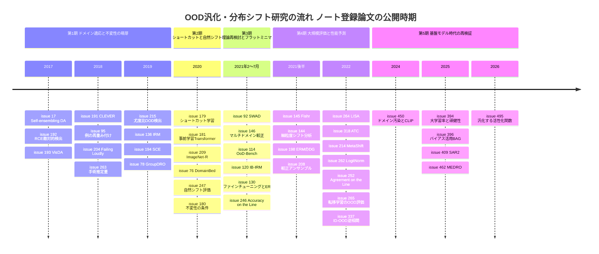

# OOD汎化・分布シフト・頑健性 サーベイ

> 対象: primary 論文 74 issue（重複登録 2 組を含むため、異なる論文としては 72 本）。論文の公開期間は 2017-06 〜 2026-02、issue 登録期間は 2020-05-22 〜 2026-02-10。
> 重複登録: [#198](https://github.com/Hiroki11x/Papers/issues/198) と [#220](https://github.com/Hiroki11x/Papers/issues/220)（An Empirical Investigation of Domain Generalization with Empirical Risk Minimizers）、[#310](https://github.com/Hiroki11x/Papers/issues/310) と [#329](https://github.com/Hiroki11x/Papers/issues/329)（Cross-Domain Ensemble Distillation for Domain Generalization）は同一論文の別 issue。一覧表と詳細まとめでは両方の issue を残している。
> 元データ: GitHub issues（[Hiroki11x/Papers](https://github.com/Hiroki11x/Papers)）の論文読みノート。採択先は Semantic Scholar と Web で検証済みの値をそのまま用いている。

## 概要

ノートの大半は 2021〜2022 年に登録されており、2021 年の初期のものは TSUBAME グランドチャレンジで OOD 汎化の大規模実験を行う準備として読まれている（[#76](https://github.com/Hiroki11x/Papers/issues/76) DomainBed を「最重要」とし、[#80](https://github.com/Hiroki11x/Papers/issues/80) の背景データセットも「やることになった」と記録）。その後、性能予測、ロングテール、テスト時適応、基盤モデル時代の再検証へと関心が広がっている。ノート群が追っている問いは次の 5 つにまとめられる。

1. **OOD 汎化はどう測るべきか。** どのベンチマーク、どのシフトの種類、どのモデル選択プロトコルで評価すれば、手法の優劣を公平に比べられるのか（DomainBed、OoD-Bench、WILDS、MetaShift など）。
2. **不変性・因果に基づく手法は ERM に本当に勝てるのか。** IRM や GroupDRO などの理論的に動機づけられた手法と、よく調整した ERM（＋フラットミニマ、アンサンブル）の関係。
3. **ID 性能から OOD 性能を予測できるか。** accuracy-on-the-line / agreement-on-the-line や ATC のように、ラベルなしの OOD データで性能を推定できるのか。逆相関の反例はあるのか。
4. **事前学習とデータ規模は頑健性をどこまで説明するか。** 大規模・多様なデータでの事前学習は頑健性を高めるが、それは「真の汎化」なのか、訓練データへのドメイン混入なのか。
5. **どの入力を信用してはいけないか。** OOD 検出、データセットシフト検出、ノイズラベル、クラス不均衡、敵対的摂動といった、分布外入力や信頼できない入力への対処。

### 目次

1. [背景と基本概念](#背景と基本概念)
2. [研究の系譜・時系列ナラティブ](#研究の系譜時系列ナラティブ)
3. [タイムライン](#タイムライン)
4. [サブトピック別の整理](#サブトピック別の整理)
5. [論文一覧表](#論文一覧表)
6. [採択先別の集計](#採択先別の集計)
7. [各論文の詳細まとめ](#各論文の詳細まとめ)
8. [横断的な知見・未解決問題](#横断的な知見未解決問題)
9. [関連論文](#関連論文)

## 背景と基本概念

### 分布シフトの種類

訓練分布 $P_{\text{train}}(x, y)$ とテスト分布 $P_{\text{test}}(x, y)$ が異なる状況を分布シフトと呼ぶ。ノートに登場する区別は次の通り。

- **共変量シフト**: $P(x)$ は変わるが $P(y \mid x)$ は保たれる。画像のスタイル・撮影条件・地域の違いなど。
- **ラベルシフト**: $P(y)$ は変わるが $P(x \mid y)$ は保たれる。[#271](https://github.com/Hiroki11x/Papers/issues/271) はこれに新規クラスの出現を加えたオープンセットラベルシフト（OSLS）を扱う。ロングテール認識でテストのクラス分布が未知の状況（[#363](https://github.com/Hiroki11x/Papers/issues/363), [#365](https://github.com/Hiroki11x/Papers/issues/365)）もラベルシフトの一種として整理される。
- **サブポピュレーション（グループ）シフト**: 訓練データ内の特定グループ（例: 「水辺の鳥」）が少数派で、テスト時にその比率が変わる。最悪グループ精度で評価する（[#78](https://github.com/Hiroki11x/Papers/issues/78), [#264](https://github.com/Hiroki11x/Papers/issues/264), [#462](https://github.com/Hiroki11x/Papers/issues/462)）。
- **多様性シフトと相関シフト**: [#114](https://github.com/Hiroki11x/Papers/issues/114) OoD-Bench は既存データセットのシフトを「テストに訓練で見ていない特徴が現れる」多様性シフトと「特徴とラベルの相関が変わる」相関シフトの 2 軸で測定した。[#151](https://github.com/Hiroki11x/Papers/issues/151) も分布シフトを 3 種類に分けて ID テストの限界を論じている。

### スプリアス相関とショートカット学習

訓練データでは予測に役立つが、テスト環境では成り立たない特徴（背景、色、テクスチャなど）への依存をスプリアス相関と呼ぶ。[#179](https://github.com/Hiroki11x/Papers/issues/179) はこれを「ベンチマークでは通用するが現実の難しい条件に移行できない決定規則」＝ショートカットとして一般化した。Colored MNIST（[#213](https://github.com/Hiroki11x/Papers/issues/213), [#146](https://github.com/Hiroki11x/Papers/issues/146), [#394](https://github.com/Hiroki11x/Papers/issues/394)）、背景を入れ替えた ImageNet-9（[#80](https://github.com/Hiroki11x/Papers/issues/80)）、Waterbirds / CelebA（[#394](https://github.com/Hiroki11x/Papers/issues/394), [#462](https://github.com/Hiroki11x/Papers/issues/462)）がこの現象を測る典型的なテストベッドとしてノートに出てくる。

### ERM・IRM・GroupDRO

経験リスク最小化（ERM）は全環境のデータを混ぜて平均損失を最小化する。

$$
\min_{f} \; \frac{1}{n}\sum_{i=1}^{n} \ell(f(x_i), y_i)
$$

不変リスク最小化（IRM, [#136](https://github.com/Hiroki11x/Papers/issues/136)）は環境 $e \in \mathcal{E}_{\text{tr}}$ を混ぜずに扱い、表現 $\Phi$ の上に立つ最適な分類器 $w$ がすべての環境で共通になるよう学習する。

$$
\min_{\Phi, w} \sum_{e \in \mathcal{E}_{\text{tr}}} R^{e}(w \circ \Phi) \quad \text{s.t.} \quad w \in \arg\min_{\bar{w}} R^{e}(\bar{w} \circ \Phi) \;\; \forall e
$$

グループ分布頑健最適化（GroupDRO, [#78](https://github.com/Hiroki11x/Papers/issues/78)）は事前に定義したグループ $g$ の最悪損失を最小化する。

$$
\min_{\theta} \max_{g \in \mathcal{G}} \; \mathbb{E}_{(x,y) \sim P_g}\left[\ell(\theta; x, y)\right]
$$

[#462](https://github.com/Hiroki11x/Papers/issues/462) MEDRO はこれを環境ごとの分類ヘッド $\omega_i$ と交差リスク $R_{i,j}(\theta) = \mathbb{E}_{(x,y)\sim P_j}[\ell((\omega_i \circ \phi)(x), y)]$ に拡張し、不確実性集合を $(m-1)$ 次元から $(m^2-1)$ 次元の単体へ広げている。

### 実効的ロバスト性（Effective Robustness）と accuracy-on-the-line

多数のモデルの ID 精度と OOD 精度をプロットすると、適切に変換した軸上（[#130](https://github.com/Hiroki11x/Papers/issues/130) のノートでは「Logit Space では線形」）でほぼ 1 本の直線に乗る（[#246](https://github.com/Hiroki11x/Papers/issues/246) accuracy-on-the-line）。この直線より上にあるモデルの OOD 精度の上乗せ分を実効的ロバスト性（ER）と呼ぶ（[#130](https://github.com/Hiroki11x/Papers/issues/130)）。[#252](https://github.com/Hiroki11x/Papers/issues/252) はモデル対の予測一致率でも同じ傾き・切片の直線が現れること（agreement-on-the-line）を示し、一致率はラベルなしで計算できるため OOD 精度の推定に使える。

### OOD 検出とシフト検出

OOD 汎化が「分布外でも正しく予測する」ことを目指すのに対し、OOD 検出は「分布外入力を見分けて予測を控える」ことを目指す。生成モデルの尤度（[#215](https://github.com/Hiroki11x/Papers/issues/215)）、ディリクレ事前ネットワーク（[#211](https://github.com/Hiroki11x/Papers/issues/211)）、統計的仮説検定と $p$ 値（[#164](https://github.com/Hiroki11x/Papers/issues/164)）、ロジットのノルム（[#262](https://github.com/Hiroki11x/Papers/issues/262)）などが使われ、評価指標として FPR95（真陽性率 95% 時の偽陽性率）が出てくる。個々のサンプルではなくデータセット単位でシフトを検出する問題は [#204](https://github.com/Hiroki11x/Papers/issues/204) が扱う。

## 研究の系譜・時系列ナラティブ

### 第 1 期（2017〜2019）: ドメイン適応・敵対的頑健性・不変性の萌芽

初期の論文はまだ「OOD 汎化」という一つの分野にまとまっておらず、隣接する複数の流れとして登録されている。

- **ドメイン適応**: Mean Teacher による自己アンサンブル [#17](https://github.com/Hiroki11x/Papers/issues/17)、教師モデルでクラスタ構造を揃える [#19](https://github.com/Hiroki11x/Papers/issues/19)、シミュレーションから実画像への適応ベンチマーク VisDA [#193](https://github.com/Hiroki11x/Papers/issues/193)。ターゲットドメインのラベルなしデータが使える前提の研究群である。
- **敵対的頑健性**: 逆クロスエントロピーによる敵対的サンプル検出 [#192](https://github.com/Hiroki11x/Papers/issues/192)、攻撃に依存しない頑健性指標 CLEVER [#191](https://github.com/Hiroki11x/Papers/issues/191)、適応的最適化手法と敵対的頑健性 [#77](https://github.com/Hiroki11x/Papers/issues/77)。
- **ノイズ・不均衡への頑健な学習**: メタ勾配による例の再重み付け [#95](https://github.com/Hiroki11x/Papers/issues/95)、対称クロスエントロピー [#194](https://github.com/Hiroki11x/Papers/issues/194)。
- **データセットシフトと OOD 検出**: 事前学習分類器で次元削減した 2 標本検定が最良とする [#204](https://github.com/Hiroki11x/Papers/issues/204)、尤度比による OOD 検出 [#215](https://github.com/Hiroki11x/Papers/issues/215)。
- **不変性・因果**: 因果選択ダイアグラムの事前知識から環境間で不変な関係を学ぶ手術推定量 [#263](https://github.com/Hiroki11x/Papers/issues/263) と、複数の訓練環境のデータから不変な相関を学習する IRM [#136](https://github.com/Hiroki11x/Papers/issues/136)。ノートは GroupDRO [#78](https://github.com/Hiroki11x/Papers/issues/78) を「ERM → IRM → に並ぶ DRO」と位置づけ、それが強い L2 正則化や早期停止と組み合わせて初めて最悪グループ精度を大きく改善することを記録している。同時期に [#213](https://github.com/Hiroki11x/Papers/issues/213)（高相関特徴に絞るベースライン）や [#79](https://github.com/Hiroki11x/Papers/issues/79)（形状バイアス）がスプリアス特徴の問題を別角度から扱う。

### 第 2 期（2020）: ショートカット、自然シフト、そして「ERM は強い」

2020 年は問題設定と評価の見直しが一気に進んだ年として記録されている。

- [#179](https://github.com/Hiroki11x/Papers/issues/179) ショートカット学習が、敵対的脆弱性・背景依存・OOD 失敗などを一つの現象として整理した。[#80](https://github.com/Hiroki11x/Papers/issues/80) は背景への依存度を測るデータセットを作り、研究者自身も TSUBAME GC で使うことになった。
- [#247](https://github.com/Hiroki11x/Papers/issues/247) は 204 の ImageNet モデルを 213 条件で評価し、合成シフト（ノイズ・天候・敵対的例）への頑健性は自然シフトにほとんど転移せず、例外は大規模で多様なデータでの学習だけだと示した。ほぼ同時期（1 か月早く公開）の [#209](https://github.com/Hiroki11x/Papers/issues/209)（ImageNet-R など）は、先行研究の主張とは異なり、大規模モデルと合成データ拡張でも自然シフトへの頑健性が上がりうると主張しつつ、どの手法も全シフトで一貫しては効かないと結論づけた。NLP では [#181](https://github.com/Hiroki11x/Papers/issues/181) が事前学習 Transformer の OOD 頑健性を測った。
- 決定的だったのが [#76](https://github.com/Hiroki11x/Papers/issues/76) DomainBed で、モデル選択を適切に行うと ERM が多くのドメイン汎化手法と同等以上になることを示した。以後のノートの多くはこの結論への応答として読める。並行して、不変予測器が OOD 最適になる条件を理論的に詰める [#180](https://github.com/Hiroki11x/Papers/issues/180)（PFN）も登録されている。

### 第 3 期（2021）: 不変性の理論再検討、フラットミニマ、性能の相関

2021 年 6〜7 月に登録が集中しており（[#114](https://github.com/Hiroki11x/Papers/issues/114)〜[#120](https://github.com/Hiroki11x/Papers/issues/120)）、TSUBAME GC の準備と時期が重なる。

- **ERM を強くする方向**: [#92](https://github.com/Hiroki11x/Papers/issues/92) SWAD は DomainBed 上で重み平均によりフラットな解を探してドメイン汎化を改善した（ノートの一言は「DomainBed で SWA したらいい感じになる話」）。[#212](https://github.com/Hiroki11x/Papers/issues/212) は変分ベイズで重みの不確実性を入れ、[#118](https://github.com/Hiroki11x/Papers/issues/118) は宝くじ型プルーニングで小さく頑健なモデルを作った。
- **不変性の限界と補強**: [#120](https://github.com/Hiroki11x/Papers/issues/120) は線形分類では不変性原理だけでは不十分で情報ボトルネックが必要だと示し、[#115](https://github.com/Hiroki11x/Papers/issues/115) は OOD の学習可能性と「拡張関数」による誤差境界からモデル選択基準を導き、[#116](https://github.com/Hiroki11x/Papers/issues/116) は情報理論的にシフトの誤差要因を整理した。[#117](https://github.com/Hiroki11x/Papers/issues/117) は偏ったモデルの中にも偏りのないサブネットワークがあるという「機能的宝くじ仮説」を出した。[#146](https://github.com/Hiroki11x/Papers/issues/146) はマルチドメインキャリブレーションを不変表現の特殊ケースとみなし、ノートでは「一番 OOD に対して有望そう」と評価されている。
- **ベンチマークの細分化**: [#114](https://github.com/Hiroki11x/Papers/issues/114) OoD-Bench は「一方のシフトで ERM に勝つ手法は他方のシフトで限界がある」ことを示した。
- **ID と OOD の相関**: [#246](https://github.com/Hiroki11x/Papers/issues/246) accuracy-on-the-line と、ファインチューニング中の実効的ロバスト性を追った [#130](https://github.com/Hiroki11x/Papers/issues/130)（事前学習データが大きいと学習途中に ER が現れるが、収束時には消える）。事前学習モデルの側では [#170](https://github.com/Hiroki11x/Papers/issues/170) が ViT と ResNet の頑健性を比較した。

### 第 4 期（2021 後半〜2022）: 大規模評価、性能予測、多様な実践手法

- **「ERM より進歩はあるが一貫しない」**: [#144](https://github.com/Hiroki11x/Papers/issues/144) は 85K 以上のモデルで 19 手法を評価し、DomainBed とは異なり ERM より進歩があると認めつつ、最良手法はデータセットやシフトごとに変わるとした。[#214](https://github.com/Hiroki11x/Papers/issues/214) MetaShift は「中程度のシフトでは ERM が最良、大きなシフトではどの手法も系統的優位を持たない」、[#265](https://github.com/Hiroki11x/Papers/issues/265) は 31k 以上のネットワークで、精度・較正・敵対的頑健性・不変性の関係が「データセットに強く依存する」と報告した。応用ドメインのベンチマークとして創薬の [#205](https://github.com/Hiroki11x/Papers/issues/205) DrugOOD もある。
- **ERM の OOD 汎化を説明・予測する**: [#198](https://github.com/Hiroki11x/Papers/issues/198)/[#220](https://github.com/Hiroki11x/Papers/issues/220) は Ben-David らの領域適応理論では ERM モデルの OOD 汎化を説明できず、フィッシャー情報・予測エントロピー・MMD が良い予測因子だと示した。[#318](https://github.com/Hiroki11x/Papers/issues/318) ATC はラベルなしデータで精度を 2〜4 倍正確に推定し、[#252](https://github.com/Hiroki11x/Papers/issues/252) agreement-on-the-line が続いた。これに対し [#337](https://github.com/Hiroki11x/Papers/issues/337) は WILDS-Camelyon17 で ID と OOD が逆相関する例を示し、[#339](https://github.com/Hiroki11x/Papers/issues/339) はアンダースペックの観点から「ID 性能は追加の仮定なしでは OOD モデル選択に役立たない」と主張しており、#246/#252 の楽観的な見方とは対照的な結果になっている。
- **手法**: 勾配分散を揃える [#145](https://github.com/Hiroki11x/Papers/issues/145) Fishr（DomainBed で一貫して ERM 超え）、選択的 mixup の [#264](https://github.com/Hiroki11x/Papers/issues/264) LISA（ノートの一言は「IRM より強いやつ」）、因果的バランスサンプリングの [#352](https://github.com/Hiroki11x/Papers/issues/352)、メタ学習で損失関数を探す [#159](https://github.com/Hiroki11x/Papers/issues/159)、較正してからアンサンブルする [#208](https://github.com/Hiroki11x/Papers/issues/208)、ドメイン間アンサンブル蒸留の [#310](https://github.com/Hiroki11x/Papers/issues/310)/[#329](https://github.com/Hiroki11x/Papers/issues/329)、全層の特徴を使う [#163](https://github.com/Hiroki11x/Papers/issues/163) Head2Toe。ドメイン適応では検証基準 [#340](https://github.com/Hiroki11x/Papers/issues/340)、識別可能性 [#266](https://github.com/Hiroki11x/Papers/issues/266)、OSLS [#271](https://github.com/Hiroki11x/Papers/issues/271) と理論寄りの論文が増える。
- **OOD 検出の精緻化**: スプリアス相関が強いほど OOD 検出が悪化する [#182](https://github.com/Hiroki11x/Papers/issues/182)、LogitNorm [#262](https://github.com/Hiroki11x/Papers/issues/262)。
- **ロングテール・ノイズラベル**: 2023 年 1 月にまとめて登録された [#363](https://github.com/Hiroki11x/Papers/issues/363), [#364](https://github.com/Hiroki11x/Papers/issues/364), [#365](https://github.com/Hiroki11x/Papers/issues/365), [#366](https://github.com/Hiroki11x/Papers/issues/366) はいずれもクラス不均衡を扱う。#363 と #365 は訓練とテストのクラス分布の違いを分布シフトとして扱い、#363・#365・#366 は複数エキスパート、#364 は SAM による鞍点脱出で対処する。[#226](https://github.com/Hiroki11x/Papers/issues/226) は弱教師マルチラベル分類での記憶効果を扱う。

### 第 5 期（2024〜2026）: 基盤モデル時代の再検証と最適化視点

登録は 2023 年 1 月を最後にしばらく途切れ、2025 年に再開する。

- [#450](https://github.com/Hiroki11x/Papers/issues/450) は CLIP の高い OOD 性能が訓練データへの「ドメイン汚染」によるものだと示し、LAION から自然画像だけで学習するとレンディション性能が約 0.4 倍に落ちることを報告した。第 2 期の「大規模・多様なデータが頑健性の唯一の例外」（[#247](https://github.com/Hiroki11x/Papers/issues/247)）という結論を、ドメイン汎化はまだ解けていないという方向に読み替える結果である。
- [#394](https://github.com/Hiroki11x/Papers/issues/394) は大きな学習率がスプリアス相関への頑健性と圧縮性を同時に高めることを示し、OOD 頑健性を最適化ハイパーパラメータの暗黙的バイアスとして捉えた。[#495](https://github.com/Hiroki11x/Papers/issues/495) は活性化関数の探索で周期的な摂動項が外挿に効くことを見つけた。
- [#396](https://github.com/Hiroki11x/Papers/issues/396) は「バイアスは常に除去すべきか」と問い、IRM 以来の不変性一辺倒の方針に異を唱える。[#462](https://github.com/Hiroki11x/Papers/issues/462) MEDRO は GroupDRO を複数エキスパートに拡張し、[#409](https://github.com/Hiroki11x/Papers/issues/409) は実環境でのテスト時適応の崩壊をシャープネスと特徴正則化で防ぐ。

## タイムライン

## サブトピック別の整理

### 1. ベンチマーク・評価プロトコル・シフトの分類

**要点**: DomainBed（[#76](https://github.com/Hiroki11x/Papers/issues/76)）以降、「手法 A が ERM に勝つか」は評価プロトコルとシフトの種類に強く依存することが繰り返し示された。OoD-Bench（[#114](https://github.com/Hiroki11x/Papers/issues/114)）、細粒度分析（[#144](https://github.com/Hiroki11x/Papers/issues/144)）、MetaShift（[#214](https://github.com/Hiroki11x/Papers/issues/214)）、転移学習の大規模評価（[#265](https://github.com/Hiroki11x/Papers/issues/265)）はいずれも「一貫して最良の手法はない」という結論で一致する。合成シフトへの頑健性は自然シフトに転移しにくい（[#247](https://github.com/Hiroki11x/Papers/issues/247)）一方、どの手法が効くかはシフトの種類による（[#209](https://github.com/Hiroki11x/Papers/issues/209)）。基盤モデルでは訓練データとテストドメインの重なり（[#450](https://github.com/Hiroki11x/Papers/issues/450)）自体を統制しないと OOD 評価が成立しない。

- [#179](https://github.com/Hiroki11x/Papers/issues/179) Shortcut Learning in Deep Neural Networks
- [#80](https://github.com/Hiroki11x/Papers/issues/80) Noise or Signal: The Role of Image Backgrounds in Object Recognition
- [#209](https://github.com/Hiroki11x/Papers/issues/209) A Critical Analysis of Distribution Shift
- [#76](https://github.com/Hiroki11x/Papers/issues/76) In Search of Lost Domain Generalization
- [#247](https://github.com/Hiroki11x/Papers/issues/247) Measuring Robustness to Natural Distribution Shifts in Image Classification
- [#114](https://github.com/Hiroki11x/Papers/issues/114) OoD-Bench
- [#144](https://github.com/Hiroki11x/Papers/issues/144) A Fine-Grained Analysis on Distribution Shift
- [#151](https://github.com/Hiroki11x/Papers/issues/151) Understanding and Testing Generalization of Deep Networks on Out-of-Distribution Data
- [#205](https://github.com/Hiroki11x/Papers/issues/205) DrugOOD
- [#214](https://github.com/Hiroki11x/Papers/issues/214) MetaShift
- [#265](https://github.com/Hiroki11x/Papers/issues/265) Assaying Out-Of-Distribution Generalization in Transfer Learning
- [#450](https://github.com/Hiroki11x/Papers/issues/450) In Search of Forgotten Domain Generalization

### 2. 不変性・因果・スプリアス相関・DRO

**要点**: 因果的な不変性（[#263](https://github.com/Hiroki11x/Papers/issues/263), [#136](https://github.com/Hiroki11x/Papers/issues/136)）を出発点に、不変性がいつ役立つかの条件（[#180](https://github.com/Hiroki11x/Papers/issues/180)）、不変性だけでは足りない場合（[#120](https://github.com/Hiroki11x/Papers/issues/120)）、OOD の学習可能性（[#115](https://github.com/Hiroki11x/Papers/issues/115)）、情報理論的整理（[#116](https://github.com/Hiroki11x/Papers/issues/116)）と理論的な詰めが進んだ。手法としては勾配空間（[#145](https://github.com/Hiroki11x/Papers/issues/145) Fishr）、キャリブレーション（[#146](https://github.com/Hiroki11x/Papers/issues/146)）、データ拡張（[#264](https://github.com/Hiroki11x/Papers/issues/264) LISA）、サンプリング（[#352](https://github.com/Hiroki11x/Papers/issues/352)）、サブネットワーク（[#117](https://github.com/Hiroki11x/Papers/issues/117)）と、不変性を課す場所が多様化している。グループシフトでは GroupDRO（[#78](https://github.com/Hiroki11x/Papers/issues/78)）が強い正則化を要し、MEDRO（[#462](https://github.com/Hiroki11x/Papers/issues/462)）が複数エキスパートへ拡張した。最近は「バイアスを活用する」（[#396](https://github.com/Hiroki11x/Papers/issues/396)）や「大学習率が暗黙にスプリアス特徴を避ける」（[#394](https://github.com/Hiroki11x/Papers/issues/394)）など、明示的な不変性制約以外の経路が出てきている。

- [#263](https://github.com/Hiroki11x/Papers/issues/263) Preventing Failures Due to Dataset Shift
- [#136](https://github.com/Hiroki11x/Papers/issues/136) Invariant Risk Minimization
- [#213](https://github.com/Hiroki11x/Papers/issues/213) Predicting with High Correlation Features
- [#78](https://github.com/Hiroki11x/Papers/issues/78) Distributionally Robust Neural Networks for Group Shifts
- [#180](https://github.com/Hiroki11x/Papers/issues/180) When is invariance useful in an Out-of-Distribution Generalization problem?
- [#146](https://github.com/Hiroki11x/Papers/issues/146) On Calibration and Out-of-domain Generalization
- [#115](https://github.com/Hiroki11x/Papers/issues/115) Towards a Theoretical Framework of Out-of-Distribution Generalization
- [#116](https://github.com/Hiroki11x/Papers/issues/116) An Information-theoretic Approach to Distribution Shifts
- [#117](https://github.com/Hiroki11x/Papers/issues/117) Can Subnetwork Structure be the Key to Out-of-Distribution Generalization?
- [#120](https://github.com/Hiroki11x/Papers/issues/120) Invariance Principle Meets Information Bottleneck
- [#145](https://github.com/Hiroki11x/Papers/issues/145) Fishr
- [#264](https://github.com/Hiroki11x/Papers/issues/264) Improving Out-of-Distribution Robustness via Selective Augmentation (LISA)
- [#352](https://github.com/Hiroki11x/Papers/issues/352) Causal Balancing for Domain Generalization
- [#394](https://github.com/Hiroki11x/Papers/issues/394) Large Learning Rates Simultaneously Achieve Robustness to Spurious Correlations and Compressibility
- [#396](https://github.com/Hiroki11x/Papers/issues/396) Should Bias be Eliminated? (BAG)
- [#462](https://github.com/Hiroki11x/Papers/issues/462) Multi-Expert Distributionally Robust Optimization (MEDRO)

### 3. ドメイン汎化・適応の実践手法（ERM 再考・フラットミニマ・アンサンブル・TTA）

**要点**: DomainBed の「ERM は強い」以降、ERM の枠内で改善する手法（フラットミニマの [#92](https://github.com/Hiroki11x/Papers/issues/92) SWAD、損失関数探索の [#159](https://github.com/Hiroki11x/Papers/issues/159)、ベイズ化の [#212](https://github.com/Hiroki11x/Papers/issues/212)、活性化関数探索の [#495](https://github.com/Hiroki11x/Papers/issues/495)）と、アンサンブル・蒸留系（[#208](https://github.com/Hiroki11x/Papers/issues/208), [#310](https://github.com/Hiroki11x/Papers/issues/310)/[#329](https://github.com/Hiroki11x/Papers/issues/329)）が目立つ（DomainBed 型の結果を明示的な出発点にしているのは #159）。ターゲットのラベルなしデータを使うドメイン適応（[#17](https://github.com/Hiroki11x/Papers/issues/17), [#19](https://github.com/Hiroki11x/Papers/issues/19), [#193](https://github.com/Hiroki11x/Papers/issues/193)）では、ハイパラ検証（[#340](https://github.com/Hiroki11x/Papers/issues/340)）や識別可能性（[#266](https://github.com/Hiroki11x/Papers/issues/266)）、ラベルシフトとの統合（[#271](https://github.com/Hiroki11x/Papers/issues/271)）が論点になった。テスト時適応（[#409](https://github.com/Hiroki11x/Papers/issues/409)）でもシャープネス最小化が安定化の鍵として現れ、フラットミニマとの接点になっている。

- [#17](https://github.com/Hiroki11x/Papers/issues/17) Self-ensembling for visual domain adaptation
- [#193](https://github.com/Hiroki11x/Papers/issues/193) VisDA: The Visual Domain Adaptation Challenge
- [#19](https://github.com/Hiroki11x/Papers/issues/19) Cluster Alignment with a Teacher for Unsupervised Domain Adaptation
- [#79](https://github.com/Hiroki11x/Papers/issues/79) Towards Shape Biased Unsupervised Representation Learning for Domain Generalization
- [#92](https://github.com/Hiroki11x/Papers/issues/92) SWAD: Domain Generalization by Seeking Flat Minima
- [#212](https://github.com/Hiroki11x/Papers/issues/212) A Bit More Bayesian
- [#340](https://github.com/Hiroki11x/Papers/issues/340) Tune it the Right Way (SND)
- [#159](https://github.com/Hiroki11x/Papers/issues/159) Loss Function Learning for Domain Generalization by Implicit Gradient
- [#208](https://github.com/Hiroki11x/Papers/issues/208) Calibrated ensembles
- [#266](https://github.com/Hiroki11x/Papers/issues/266) Identifiability Conditions for Domain Adaptation
- [#271](https://github.com/Hiroki11x/Papers/issues/271) Domain Adaptation under Open Set Label Shift
- [#310](https://github.com/Hiroki11x/Papers/issues/310) / [#329](https://github.com/Hiroki11x/Papers/issues/329) Cross-Domain Ensemble Distillation for Domain Generalization（重複登録）
- [#409](https://github.com/Hiroki11x/Papers/issues/409) Adapt in the Wild (SAR / SAR2)
- [#495](https://github.com/Hiroki11x/Papers/issues/495) Mining Generalizable Activation Functions

### 4. 事前学習・ファインチューニング・アーキテクチャと OOD 頑健性

**要点**: 事前学習 Transformer は NLP で OOD 性能低下が小さく（[#181](https://github.com/Hiroki11x/Papers/issues/181)）、ViT も十分なデータで事前学習すれば ResNet と同等の頑健性を持つ（[#170](https://github.com/Hiroki11x/Papers/issues/170)）。ただし大きいモデルが必ずしも頑健ではなく、蒸留は有害という報告もある（#181）。ファインチューニングでは事前学習由来の実効的ロバスト性が収束時に消える（[#130](https://github.com/Hiroki11x/Papers/issues/130)）。別の方向として、中間層の特徴を直接使う線形プロービング（[#163](https://github.com/Hiroki11x/Papers/issues/163) Head2Toe）や、圧縮によって頑健性を保つ方向（[#118](https://github.com/Hiroki11x/Papers/issues/118)）が提案されている。

- [#181](https://github.com/Hiroki11x/Papers/issues/181) Pretrained Transformers Improve Out-of-Distribution Robustness
- [#170](https://github.com/Hiroki11x/Papers/issues/170) Understanding Robustness of Transformers for Image Classification
- [#118](https://github.com/Hiroki11x/Papers/issues/118) A Winning Hand: Compressing Deep Networks Can Improve OOD Robustness
- [#130](https://github.com/Hiroki11x/Papers/issues/130) The Evolution of Out-of-Distribution Robustness Throughout Fine-Tuning
- [#163](https://github.com/Hiroki11x/Papers/issues/163) Head2Toe

### 5. OOD 性能予測・ID-OOD 相関・モデル選択

**要点**: ID 精度と OOD 精度の強い線形相関（[#246](https://github.com/Hiroki11x/Papers/issues/246)）が見つかり、予測一致率でも同じ直線が成り立つ（[#252](https://github.com/Hiroki11x/Papers/issues/252)）ことで、ラベルなしの OOD 性能推定（[#318](https://github.com/Hiroki11x/Papers/issues/318) ATC を含む）が実用に近づいた。一方で、ERM モデルの OOD 汎化を既存の領域適応理論で説明できない（[#198](https://github.com/Hiroki11x/Papers/issues/198)/[#220](https://github.com/Hiroki11x/Papers/issues/220)）、実データで ID と OOD が逆相関しうる（[#337](https://github.com/Hiroki11x/Papers/issues/337)）、ID 精度では区別できない複数解が存在する（[#339](https://github.com/Hiroki11x/Papers/issues/339)）という反論もある。ATC 論文自身も「精度の推定は最適予測器の特定と同じくらい難しく、シフトの性質に関する仮定に依存する」と理論的限界を述べている。

- [#246](https://github.com/Hiroki11x/Papers/issues/246) Accuracy on the Line
- [#198](https://github.com/Hiroki11x/Papers/issues/198) / [#220](https://github.com/Hiroki11x/Papers/issues/220) An Empirical Investigation of Domain Generalization with Empirical Risk Minimizers（重複登録）
- [#318](https://github.com/Hiroki11x/Papers/issues/318) Leveraging Unlabeled Data to Predict Out-of-Distribution Performance (ATC)
- [#252](https://github.com/Hiroki11x/Papers/issues/252) Agreement-on-the-Line
- [#339](https://github.com/Hiroki11x/Papers/issues/339) Predicting is not Understanding
- [#337](https://github.com/Hiroki11x/Papers/issues/337) ID and OOD Performance Are Sometimes Inversely Correlated on Real-world Datasets

### 6. OOD 検出・データセットシフト検出

**要点**: サンプル単位の OOD 検出では、生成モデルの尤度が背景統計に引っ張られる問題（[#215](https://github.com/Hiroki11x/Papers/issues/215)）、分類器の過信（[#262](https://github.com/Hiroki11x/Papers/issues/262)）、データ不確実性の高い ID 例と OOD 例の表現が区別できない問題（[#211](https://github.com/Hiroki11x/Papers/issues/211)）にそれぞれ対処が提案された。統計的仮説検定として定式化して Type I Error を保証する方向（[#164](https://github.com/Hiroki11x/Papers/issues/164)）や、訓練サンプル密度から信頼性を見積もる方向（[#119](https://github.com/Hiroki11x/Papers/issues/119)）もある。[#182](https://github.com/Hiroki11x/Papers/issues/182) は OOD 汎化側の概念（不変特徴と環境特徴）を OOD 検出に持ち込み、スプリアス相関が強いほど検出が悪化することを示して両者をつないでいる。データセット単位のシフト検出（[#204](https://github.com/Hiroki11x/Papers/issues/204)）では、事前学習分類器で次元削減した 2 標本検定が最良だった。

- [#204](https://github.com/Hiroki11x/Papers/issues/204) Failing Loudly: An Empirical Study of Methods for Detecting Dataset Shift
- [#215](https://github.com/Hiroki11x/Papers/issues/215) Likelihood Ratios for Out-of-Distribution Detection
- [#211](https://github.com/Hiroki11x/Papers/issues/211) Towards Maximizing the Representation Gap between In-Domain & OOD Examples
- [#164](https://github.com/Hiroki11x/Papers/issues/164) A Statistical Framework for Efficient Out of Distribution Detection in Deep Neural Networks
- [#119](https://github.com/Hiroki11x/Papers/issues/119) Test Sample Accuracy Scales with Training Sample Density in Neural Networks
- [#182](https://github.com/Hiroki11x/Papers/issues/182) On the Impact of Spurious Correlation for Out-of-distribution Detection
- [#262](https://github.com/Hiroki11x/Papers/issues/262) Mitigating Neural Network Overconfidence with Logit Normalization

### 7. ノイズラベル・ロングテール/クラス不均衡・敵対的頑健性

**要点**: ノイズラベルでは、損失の設計（[#194](https://github.com/Hiroki11x/Papers/issues/194) SCE）、メタ学習による再重み付け（[#95](https://github.com/Hiroki11x/Papers/issues/95)）、大損失サンプルの棄却（[#226](https://github.com/Hiroki11x/Papers/issues/226)）、アーキテクチャとターゲット関数の整合（[#171](https://github.com/Hiroki11x/Papers/issues/171)）が扱われる。ロングテールではテストのクラス分布が未知であることを分布シフトとして扱い、複数エキスパート（[#363](https://github.com/Hiroki11x/Papers/issues/363), [#365](https://github.com/Hiroki11x/Papers/issues/365), [#366](https://github.com/Hiroki11x/Papers/issues/366)）や SAM による鞍点脱出（[#364](https://github.com/Hiroki11x/Papers/issues/364)）が提案された。敵対的頑健性では、検出（[#192](https://github.com/Hiroki11x/Papers/issues/192)）、評価指標（[#191](https://github.com/Hiroki11x/Papers/issues/191)）、オプティマイザとの関係（[#77](https://github.com/Hiroki11x/Papers/issues/77)）に加え、小さな摂動への感度は分類器の本質的性質だとする不可能性の結果（[#276](https://github.com/Hiroki11x/Papers/issues/276)）がある。

- [#192](https://github.com/Hiroki11x/Papers/issues/192) Towards Robust Detection of Adversarial Examples
- [#191](https://github.com/Hiroki11x/Papers/issues/191) Evaluating the Robustness of Neural Networks: An Extreme Value Theory Approach (CLEVER)
- [#95](https://github.com/Hiroki11x/Papers/issues/95) Learning to Reweight Examples for Robust Deep Learning
- [#194](https://github.com/Hiroki11x/Papers/issues/194) Symmetric Cross Entropy for Robust Learning with Noisy Labels
- [#77](https://github.com/Hiroki11x/Papers/issues/77) Adaptive versus Standard Descent Methods and Robustness Against Adversarial Examples
- [#171](https://github.com/Hiroki11x/Papers/issues/171) How does a neural network's architecture impact its robustness to noisy labels?
- [#363](https://github.com/Hiroki11x/Papers/issues/363) Self-Supervised Aggregation of Diverse Experts (SADE)
- [#276](https://github.com/Hiroki11x/Papers/issues/276) Image classifiers can not be made robust to small perturbations
- [#366](https://github.com/Hiroki11x/Papers/issues/366) Learning Muti-expert Distribution Calibration for Long-tailed Video Classification
- [#226](https://github.com/Hiroki11x/Papers/issues/226) Large Loss Matters in Weakly Supervised Multi-Label Classification
- [#365](https://github.com/Hiroki11x/Papers/issues/365) Balanced Product of Experts for Long-Tailed Recognition (BalPoE)
- [#364](https://github.com/Hiroki11x/Papers/issues/364) Escaping Saddle Points for Effective Generalization on Class-Imbalanced Data

## 論文一覧表

first_public（論文の初出年月）順。根拠列は採択先の確認方法。

| 公開 | 論文 | 著者/組織 | 採択先 | 根拠 | サブトピック |
|---|---|---|---|---|---|
| 2017-06 | [#17](https://github.com/Hiroki11x/Papers/issues/17) Self-ensembling for visual domain adaptation | Geoffrey French, Michal Mackiewicz, Mark Fisher / University of East Anglia | ICLR 2018 | arXivコメント | ドメイン適応（Mean Teacher） |
| 2017-06 | [#192](https://github.com/Hiroki11x/Papers/issues/192) Towards Robust Detection of Adversarial Examples | Tianyu Pang, Chao Du, Yinpeng Dong, Jun Zhu / Tsinghua University | NeurIPS 2018 | issue記載 | 敵対的サンプル検出 |
| 2017-10 | [#193](https://github.com/Hiroki11x/Papers/issues/193) VisDA: The Visual Domain Adaptation Challenge | Xingchao Peng, Ben Usman, Neela Kaushik, et al. / Boston University | arXiv（プレプリント） | 不明 | ドメイン適応ベンチマーク |
| 2018-01 | [#191](https://github.com/Hiroki11x/Papers/issues/191) Evaluating the Robustness of Neural Networks: An Extreme Value Theory Approach | Tsui-Wei Weng, Huan Zhang, Pin-Yu Chen, et al. / MIT / IBM Research | ICLR 2018 | issue記載 | 敵対的頑健性の評価指標 |
| 2018-03 | [#95](https://github.com/Hiroki11x/Papers/issues/95) Learning to Reweight Examples for Robust Deep Learning | Mengye Ren, Wenyuan Zeng, Bin Yang, et al. / Uber ATG / University of Toronto | ICML 2018 | arXivコメント | サンプル再重み付け（メタ学習） |
| 2018-10 | [#204](https://github.com/Hiroki11x/Papers/issues/204) Failing Loudly: An Empirical Study of Methods for Detecting Dataset Shift | Stephan Rabanser, Stephan Günnemann, Zachary C. Lipton / TUM / CMU | NeurIPS 2019 | arXivコメント | データセットシフト検出 |
| 2018-12 | [#263](https://github.com/Hiroki11x/Papers/issues/263) Preventing Failures Due to Dataset Shift: Learning Predictive Models That Transport | Adarsh Subbaswamy, Peter Schulam, Suchi Saria / Johns Hopkins University | AISTATS 2019 | arXivコメント | 因果とデータセットシフト |
| 2019-03 | [#19](https://github.com/Hiroki11x/Papers/issues/19) Cluster Alignment with a Teacher for Unsupervised Domain Adaptation | Zhijie Deng, Yucen Luo, Jun Zhu / Tsinghua University | ICCV 2019 | arXivコメント | 教師なしドメイン適応 |
| 2019-06 | [#215](https://github.com/Hiroki11x/Papers/issues/215) Likelihood Ratios for Out-of-Distribution Detection | Jie Ren, Peter J. Liu, Emily Fertig, et al. / Google Research | NeurIPS 2019 | arXivコメント | OOD検出（尤度比） |
| 2019-07 | [#136](https://github.com/Hiroki11x/Papers/issues/136) Invariant Risk Minimization | Martin Arjovsky, Léon Bottou, Ishaan Gulrajani, David Lopez-Paz / Facebook AI Research | arXiv（プレプリント） | 不明 | OOD汎化（不変リスク最小化） |
| 2019-08 | [#194](https://github.com/Hiroki11x/Papers/issues/194) Symmetric Cross Entropy for Robust Learning with Noisy Labels | Yisen Wang, Xingjun Ma, Zaiyi Chen, et al. | ICCV 2019 | arXivコメント | ノイズラベル学習 |
| 2019-09 | [#79](https://github.com/Hiroki11x/Papers/issues/79) Towards Shape Biased Unsupervised Representation Learning for Domain Generalization | Nader Asadi, Amir M. Sarfi, Mehrdad Hosseinzadeh, et al. | arXiv（プレプリント） | 不明 | OOD汎化（形状バイアス） |
| 2019-10 | [#213](https://github.com/Hiroki11x/Papers/issues/213) Predicting with High Correlation Features | Devansh Arpit, Caiming Xiong, Richard Socher / Salesforce Research | arXiv（プレプリント） | 不明 | OOD汎化とスプリアス特徴 |
| 2019-11 | [#77](https://github.com/Hiroki11x/Papers/issues/77) Adaptive versus Standard Descent Methods and Robustness Against Adversarial Examples | Marc Khoury / UC Berkeley | arXiv（プレプリント） | 不明 | 最適化手法と敵対的頑健性 |
| 2019-11 | [#78](https://github.com/Hiroki11x/Papers/issues/78) Distributionally Robust Neural Networks for Group Shifts: On the Importance of Regularization for Worst-Case Generalization | Shiori Sagawa, Pang Wei Koh, Tatsunori B. Hashimoto, et al. / Stanford University | ICLR 2020 | Web確認 | OOD汎化（Group DRO） |
| 2020-04 | [#179](https://github.com/Hiroki11x/Papers/issues/179) Shortcut Learning in Deep Neural Networks | Robert Geirhos, Jörn-Henrik Jacobsen, Claudio Michaelis, et al. / University of Tübingen | Nature Machine Intelligence | arXivコメント | ショートカット学習 |
| 2020-04 | [#181](https://github.com/Hiroki11x/Papers/issues/181) Pretrained Transformers Improve Out-of-Distribution Robustness | Dan Hendrycks, Xiaoyuan Liu, Eric Wallace, et al. / UC Berkeley | ACL 2020 | Web確認 | 事前学習とOOD頑健性 |
| 2020-06 | [#80](https://github.com/Hiroki11x/Papers/issues/80) Noise or Signal: The Role of Image Backgrounds in Object Recognition | Kai Xiao, Logan Engstrom, Andrew Ilyas, et al. / MIT | ICLR 2021 | Semantic Scholar確認 | OOD汎化（背景依存性） |
| 2020-06 | [#209](https://github.com/Hiroki11x/Papers/issues/209) A Critical Analysis of Distribution Shift | Dan Hendrycks, Steven Basart, Norman Mu, et al. / UC Berkeley | ICCV 2021 | Semantic Scholar確認 | 分布シフトの頑健性ベンチマーク |
| 2020-07 | [#76](https://github.com/Hiroki11x/Papers/issues/76) In Search of Lost Domain Generalization | Ishaan Gulrajani, David Lopez-Paz / Facebook AI Research | ICLR 2021 | Semantic Scholar確認 | OOD汎化のベンチマーク |
| 2020-07 | [#247](https://github.com/Hiroki11x/Papers/issues/247) Measuring Robustness to Natural Distribution Shifts in Image Classification | Rohan Taori, Achal Dave, Vaishaal Shankar, et al. / UC Berkeley | NeurIPS 2020 | Semantic Scholar確認 | OOD汎化 |
| 2020-08 | [#180](https://github.com/Hiroki11x/Papers/issues/180) When is invariance useful in an Out-of-Distribution Generalization problem ? | Masanori Koyama, Shoichiro Yamaguchi / Preferred Networks | arXiv（プレプリント） | 不明 | OOD汎化（不変予測器） |
| 2020-10 | [#211](https://github.com/Hiroki11x/Papers/issues/211) Towards Maximizing the Representation Gap between In-Domain & Out-of-Distribution Examples | Jay Nandy, Wynne Hsu, Mong Li Lee / National University of Singapore | NeurIPS 2020 | arXivコメント | OOD検出 |
| 2020-12 | [#171](https://github.com/Hiroki11x/Papers/issues/171) How does a neural network's architecture impact its robustness to noisy labels? | Jingling Li, Mozhi Zhang, Keyulu Xu, et al. / University of Maryland / MIT | NeurIPS 2021 | issue記載 | ノイズラベルへの頑健性 |
| 2021-02 | [#92](https://github.com/Hiroki11x/Papers/issues/92) SWAD: Domain Generalization by Seeking Flat Minima | Junbum Cha, Sanghyuk Chun, Kyungjae Lee, et al. / NAVER | NeurIPS 2021 | arXivコメント | OOD汎化（フラットミニマ） |
| 2021-02 | [#146](https://github.com/Hiroki11x/Papers/issues/146) On Calibration and Out-of-domain Generalization | Yoav Wald, Amir Feder, Daniel Greenfeld, Uri Shalit | NeurIPS 2021 | arXivコメント | キャリブレーションとOOD汎化 |
| 2021-02 | [#164](https://github.com/Hiroki11x/Papers/issues/164) A Statistical Framework for Efficient Out of Distribution Detection in Deep Neural Networks | Matan Haroush, Tzviel Frostig, Ruth Heller, Daniel Soudry / Technion | ICLR 2022 | Semantic Scholar確認 | OOD検出 |
| 2021-03 | [#170](https://github.com/Hiroki11x/Papers/issues/170) Understanding Robustness of Transformers for Image Classification | Srinadh Bhojanapalli, Ayan Chakrabarti, Daniel Glasner, et al. / Google | ICCV 2021 | arXivコメント | ViTの頑健性 |
| 2021-05 | [#212](https://github.com/Hiroki11x/Papers/issues/212) A Bit More Bayesian: Domain-Invariant Learning with Uncertainty | Zehao Xiao, Jiayi Shen, Xiantong Zhen, et al. / University of Amsterdam | ICML 2021 | arXivコメント | ベイズ的ドメイン汎化 |
| 2021-06 | [#114](https://github.com/Hiroki11x/Papers/issues/114) OoD-Bench: Benchmarking and Understanding Out-of-Distribution Generalization Datasets and Algorithms | Nanyang Ye, Kaican Li, Haoyue Bai, et al. / Huawei Noah's Ark Lab | CVPR 2022 | arXivコメント | OOD汎化のベンチマーク |
| 2021-06 | [#115](https://github.com/Hiroki11x/Papers/issues/115) Towards a Theoretical Framework of Out-of-Distribution Generalization | Haotian Ye, Chuanlong Xie, Tianle Cai, et al. / Peking University / Huawei | NeurIPS 2021 | Semantic Scholar確認 | OOD汎化の理論 |
| 2021-06 | [#116](https://github.com/Hiroki11x/Papers/issues/116) An Information-theoretic Approach to Distribution Shifts | Marco Federici, Ryota Tomioka, Patrick Forré / University of Amsterdam / Microsoft Research | NeurIPS 2021 | Web確認 | OOD汎化の情報理論 |
| 2021-06 | [#117](https://github.com/Hiroki11x/Papers/issues/117) Can Subnetwork Structure be the Key to Out-of-Distribution Generalization? | Dinghuai Zhang, Kartik Ahuja, Yilun Xu, et al. / Mila | ICML 2021 | arXivコメント | OOD汎化（サブネットワーク） |
| 2021-06 | [#118](https://github.com/Hiroki11x/Papers/issues/118) A Winning Hand: Compressing Deep Networks Can Improve Out-Of-Distribution Robustness | James Diffenderfer, Brian R. Bartoldson, Shreya Chaganti, et al. / LLNL | NeurIPS 2021 | Semantic Scholar確認 | モデル圧縮とOOD頑健性 |
| 2021-06 | [#119](https://github.com/Hiroki11x/Papers/issues/119) Test Sample Accuracy Scales with Training Sample Density in Neural Networks | Xu Ji, Razvan Pascanu, Devon Hjelm, et al. | CoLLAs 2022 | Web確認 | 信頼できない予測の検出 |
| 2021-06 | [#120](https://github.com/Hiroki11x/Papers/issues/120) Invariance Principle Meets Information Bottleneck for Out-of-Distribution Generalization | Kartik Ahuja, Ethan Caballero, Dinghuai Zhang, et al. / Mila | NeurIPS 2021 | Semantic Scholar確認 | OOD汎化（不変性原理） |
| 2021-06 | [#130](https://github.com/Hiroki11x/Papers/issues/130) The Evolution of Out-of-Distribution Robustness Throughout Fine-Tuning | Anders Andreassen, Yasaman Bahri, Behnam Neyshabur, Rebecca Roelofs / Google Research | TMLR | Web確認 | OOD汎化とファインチューニング |
| 2021-07 | [#246](https://github.com/Hiroki11x/Papers/issues/246) Accuracy on the Line: On the Strong Correlation Between Out-of-Distribution and In-Distribution Generalization | John Miller, Rohan Taori, Aditi Raghunathan, et al. / UC Berkeley / Stanford | ICML 2021 | Semantic Scholar確認 | OOD汎化 |
| 2021-07 | [#363](https://github.com/Hiroki11x/Papers/issues/363) Self-Supervised Aggregation of Diverse Experts for Test-Agnostic Long-Tailed Recognition | Yifan Zhang, Bryan Hooi, Lanqing Hong, Jiashi Feng / NUS | NeurIPS 2022 | issue記載 | ロングテール認識 |
| 2021-08 | [#340](https://github.com/Hiroki11x/Papers/issues/340) Tune it the Right Way: Unsupervised Validation of Domain Adaptation via Soft Neighborhood Density | Kuniaki Saito, Donghyun Kim, Piotr Teterwak, et al. / Boston University | ICCV 2021 | arXivコメント | 教師なしドメイン適応の検証 |
| 2021-09 | [#145](https://github.com/Hiroki11x/Papers/issues/145) Fishr: Invariant Gradient Variances for Out-of-distribution Generalization | Alexandre Rame, Corentin Dancette, Matthieu Cord / Sorbonne Université | ICML 2022 | Semantic Scholar確認 | OOD汎化（勾配分散の整合） |
| 2021-09 | [#182](https://github.com/Hiroki11x/Papers/issues/182) On the Impact of Spurious Correlation for Out-of-distribution Detection | Yifei Ming, Hang Yin, Yixuan Li / UW-Madison | AAAI 2022 | arXivコメント | スプリアス相関とOOD検出 |
| 2021-10 | [#144](https://github.com/Hiroki11x/Papers/issues/144) A Fine-Grained Analysis on Distribution Shift | Olivia Wiles, Sven Gowal, Florian Stimberg, et al. / DeepMind | ICLR 2022 | Semantic Scholar確認 | OOD汎化のベンチマーク |
| 2021-10 | [#159](https://github.com/Hiroki11x/Papers/issues/159) Loss Function Learning for Domain Generalization by Implicit Gradient | Boyan Gao, Henry Gouk, Yongxin Yang, Timothy Hospedales / University of Edinburgh | ICML 2022 | Semantic Scholar確認 | ドメイン汎化の損失関数学習 |
| 2021-10 | [#198](https://github.com/Hiroki11x/Papers/issues/198) An Empirical Investigation of Domain Generalization with Empirical Risk Minimizers | Ramakrishna Vedantam, David Lopez-Paz, David J. Schwab / Facebook AI Research | NeurIPS 2021 | issue記載 | ERMのドメイン汎化 |
| 2021-10 | [#208](https://github.com/Hiroki11x/Papers/issues/208) Calibrated ensembles - a simple way to mitigate ID-OOD accuracy tradeoffs | Ananya Kumar, Tengyu Ma, Percy Liang, Aditi Raghunathan / Stanford | UAI 2022 | Web確認 | キャリブレーションとID-OODトレードオフ |
| 2021-10 | [#220](https://github.com/Hiroki11x/Papers/issues/220) An Empirical Investigation of Domain Generalization with Empirical Risk Minimizers | Ramakrishna Vedantam, David Lopez-Paz, David J. Schwab / Facebook AI Research | NeurIPS 2021 | issue記載 | ERMのドメイン汎化 |
| 2021-11 | [#151](https://github.com/Hiroki11x/Papers/issues/151) Understanding and Testing Generalization of Deep Networks on Out-of-Distribution Data | Rui Hu, Jitao Sang, Jinqiang Wang, et al. | arXiv（プレプリント） | 不明 | OODテストの評価 |
| 2021-12 | [#276](https://github.com/Hiroki11x/Papers/issues/276) Image classifiers can not be made robust to small perturbations | Zheng Dai, David K. Gifford / MIT | arXiv（プレプリント） | 不明 | 敵対的頑健性の理論 |
| 2022-01 | [#163](https://github.com/Hiroki11x/Papers/issues/163) Head2Toe: Utilizing Intermediate Representations for Better OOD Generalization | Utku Evci, Vincent Dumoulin, Hugo Larochelle, Michael C. Mozer / Google Research | ICML 2022 | Semantic Scholar確認 | 転移学習とOOD汎化 |
| 2022-01 | [#205](https://github.com/Hiroki11x/Papers/issues/205) DrugOOD: Out-of-Distribution (OOD) Dataset Curator and Benchmark for AI-aided Drug Discovery -- A Focus on Affinity Prediction Problems with Noise Annotations | Yuanfeng Ji, Lu Zhang, Jiaxiang Wu, et al. / Tencent AI Lab | arXiv（プレプリント） | 不明 | 創薬のOODベンチマーク |
| 2022-01 | [#264](https://github.com/Hiroki11x/Papers/issues/264) Improving Out-of-Distribution Robustness via Selective Augmentation | Huaxiu Yao, Yu Wang, Sai Li, et al. (Chelsea Finn) / Stanford | ICML 2022 | arXivコメント | OOD汎化 |
| 2022-01 | [#318](https://github.com/Hiroki11x/Papers/issues/318) Leveraging Unlabeled Data to Predict Out-of-Distribution Performance | Saurabh Garg, Sivaraman Balakrishnan, Zachary C. Lipton, et al. / CMU / Google | ICLR 2022 | arXivコメント | OOD性能予測 |
| 2022-02 | [#214](https://github.com/Hiroki11x/Papers/issues/214) MetaShift: A Dataset of Datasets for Evaluating Distribution Shifts and Training Conflicts | Weixin Liang, James Zou / Stanford | ICLR 2022 | issue記載 | 分布シフトのベンチマーク |
| 2022-05 | [#262](https://github.com/Hiroki11x/Papers/issues/262) Mitigating Neural Network Overconfidence with Logit Normalization | Hongxin Wei, Renchunzi Xie, Hao Cheng, et al. (Yixuan Li) | ICML 2022 | arXivコメント | 過信とOOD検出 |
| 2022-05 | [#366](https://github.com/Hiroki11x/Papers/issues/366) Learning Muti-expert Distribution Calibration for Long-tailed Video Classification | Yufan Hu, Junyu Gao, Changsheng Xu | IEEE TMM | Web確認 | ロングテール動画分類 |
| 2022-06 | [#226](https://github.com/Hiroki11x/Papers/issues/226) Large Loss Matters in Weakly Supervised Multi-Label Classification | Youngwook Kim, Jae Myung Kim, Zeynep Akata, Jungwoo Lee | CVPR 2022 | arXivコメント | 弱教師マルチラベル分類 |
| 2022-06 | [#252](https://github.com/Hiroki11x/Papers/issues/252) Agreement-on-the-Line: Predicting the Performance of Neural Networks under Distribution Shift | Christina Baek, Yiding Jiang, Aditi Raghunathan, Zico Kolter / CMU | NeurIPS 2022 | arXivコメント | OOD性能予測 |
| 2022-06 | [#352](https://github.com/Hiroki11x/Papers/issues/352) Causal Balancing for Domain Generalization | Xinyi Wang, Michael Saxon, Jiachen Li, et al. / UCSB | ICLR 2023 | Semantic Scholar確認 | ドメイン汎化 |
| 2022-06 | [#365](https://github.com/Hiroki11x/Papers/issues/365) Balanced Product of Experts for Long-Tailed Recognition | Emanuel Sanchez Aimar, Arvi Jonnarth, Michael Felsberg, Marco Kuhlmann / Linköping University | CVPR 2023 | Semantic Scholar確認 | ロングテール認識 |
| 2022-07 | [#265](https://github.com/Hiroki11x/Papers/issues/265) Assaying Out-Of-Distribution Generalization in Transfer Learning | Florian Wenzel, Andrea Dittadi, Peter Vincent Gehler, et al. / Amazon | NeurIPS 2022 | Semantic Scholar確認 | OOD汎化 |
| 2022-07 | [#266](https://github.com/Hiroki11x/Papers/issues/266) Identifiability Conditions for Domain Adaptation | Ishaan Gulrajani, Tatsunori Hashimoto / Stanford | ICML 2022 | issue記載 | ドメイン適応の識別可能性 |
| 2022-07 | [#271](https://github.com/Hiroki11x/Papers/issues/271) Domain Adaptation under Open Set Label Shift | Saurabh Garg, Sivaraman Balakrishnan, Zachary C. Lipton / CMU | NeurIPS 2022 | arXivコメント | ドメイン適応 |
| 2022-07 | [#339](https://github.com/Hiroki11x/Papers/issues/339) Predicting is not Understanding: Recognizing and Addressing Underspecification in Machine Learning | Damien Teney, Maxime Peyrard, Ehsan Abbasnejad | ECCV 2022 | arXivコメント | OOD汎化とアンダースペック |
| 2022-09 | [#337](https://github.com/Hiroki11x/Papers/issues/337) ID and OOD Performance Are Sometimes Inversely Correlated on Real-world Datasets | Damien Teney, Yong Lin, Seong Joon Oh, Ehsan Abbasnejad | NeurIPS 2023 | Semantic Scholar確認 | OOD汎化 |
| 2022-10 | [#310](https://github.com/Hiroki11x/Papers/issues/310) Cross-Domain Ensemble Distillation for Domain Generalization | Kyungmoon Lee, Sungyeon Kim, Suha Kwak / POSTECH | ECCV 2022 | Web確認 | ドメイン汎化 |
| 2022-10 | [#329](https://github.com/Hiroki11x/Papers/issues/329) Cross-Domain Ensemble Distillation for Domain Generalization | Kyungmoon Lee, Sungyeon Kim, Suha Kwak / POSTECH | ECCV 2022 | issue記載 | ドメイン汎化 |
| 2022-12 | [#364](https://github.com/Hiroki11x/Papers/issues/364) Escaping Saddle Points for Effective Generalization on Class-Imbalanced Data | Harsh Rangwani, Sumukh K Aithal, Mayank Mishra, R. Venkatesh Babu / IISc | NeurIPS 2022 | issue記載 | クラス不均衡と損失地形 |
| 2024-10 | [#450](https://github.com/Hiroki11x/Papers/issues/450) In Search of Forgotten Domain Generalization | Prasanna Mayilvahanan, Roland S. Zimmermann, Thaddäus Wiedemer, et al. / Tübingen | ICLR 2025 | arXivコメント | OOD汎化とドメイン汚染 |
| 2025-07 | [#394](https://github.com/Hiroki11x/Papers/issues/394) Large Learning Rates Simultaneously Achieve Robustness to Spurious Correlations and Compressibility | Melih Barsbey, Lucas Prieto, Stefanos Zafeiriou, Tolga Birdal / Imperial College London | ICCV 2025 | arXivコメント | 大学習率とスプリアス相関への頑健性 |
| 2025-07 | [#396](https://github.com/Hiroki11x/Papers/issues/396) Should Bias be Eliminated? A General Framework to Use Bias for OOD Generalization | Yan Li, Yunlong Deng, Zijian Li, et al. (Kun Zhang) / CMU / MBZUAI | arXiv（プレプリント） | 不明 | OOD汎化とバイアス活用 |
| 2025-09 | [#409](https://github.com/Hiroki11x/Papers/issues/409) Adapt in the Wild: Test-Time Entropy Minimization with Sharpness and Feature Regularization | Shuaicheng Niu, Guohao Chen, Deyu Chen, et al. (Mingkui Tan) / South China University of Technology / NTU | IEEE TPAMI | Web確認 | テスト時適応（TTA）とシャープネス |
| 2025-12 | [#462](https://github.com/Hiroki11x/Papers/issues/462) Multi-Expert Distributionally Robust Optimization for Out-of-Distribution Generalization | Jinyong Jeong, Hyungu Kahng, Seoung Bum Kim / Korea University | NeurIPS 2025 | issue記載 | OOD汎化（分布頑健最適化） |
| 2026-02 | [#495](https://github.com/Hiroki11x/Papers/issues/495) Mining Generalizable Activation Functions | Alex Vitvitskyi, Michael Boratko, Petar Veličković, et al. / Google DeepMind | arXiv（プレプリント） | 不明 | OOD汎化と活性化関数探索 |

## 採択先別の集計

| 採択先（系列） | 件数 | issue |
|---|---|---|
| NeurIPS | 21 | [#92](https://github.com/Hiroki11x/Papers/issues/92), [#115](https://github.com/Hiroki11x/Papers/issues/115), [#116](https://github.com/Hiroki11x/Papers/issues/116), [#118](https://github.com/Hiroki11x/Papers/issues/118), [#120](https://github.com/Hiroki11x/Papers/issues/120), [#146](https://github.com/Hiroki11x/Papers/issues/146), [#171](https://github.com/Hiroki11x/Papers/issues/171), [#192](https://github.com/Hiroki11x/Papers/issues/192), [#198](https://github.com/Hiroki11x/Papers/issues/198), [#204](https://github.com/Hiroki11x/Papers/issues/204), [#211](https://github.com/Hiroki11x/Papers/issues/211), [#215](https://github.com/Hiroki11x/Papers/issues/215), [#220](https://github.com/Hiroki11x/Papers/issues/220), [#247](https://github.com/Hiroki11x/Papers/issues/247), [#252](https://github.com/Hiroki11x/Papers/issues/252), [#265](https://github.com/Hiroki11x/Papers/issues/265), [#271](https://github.com/Hiroki11x/Papers/issues/271), [#337](https://github.com/Hiroki11x/Papers/issues/337), [#363](https://github.com/Hiroki11x/Papers/issues/363), [#364](https://github.com/Hiroki11x/Papers/issues/364), [#462](https://github.com/Hiroki11x/Papers/issues/462) |
| ICLR | 11 | [#17](https://github.com/Hiroki11x/Papers/issues/17), [#76](https://github.com/Hiroki11x/Papers/issues/76), [#78](https://github.com/Hiroki11x/Papers/issues/78), [#80](https://github.com/Hiroki11x/Papers/issues/80), [#144](https://github.com/Hiroki11x/Papers/issues/144), [#164](https://github.com/Hiroki11x/Papers/issues/164), [#191](https://github.com/Hiroki11x/Papers/issues/191), [#214](https://github.com/Hiroki11x/Papers/issues/214), [#318](https://github.com/Hiroki11x/Papers/issues/318), [#352](https://github.com/Hiroki11x/Papers/issues/352), [#450](https://github.com/Hiroki11x/Papers/issues/450) |
| arXiv（プレプリント） | 11 | [#77](https://github.com/Hiroki11x/Papers/issues/77), [#79](https://github.com/Hiroki11x/Papers/issues/79), [#136](https://github.com/Hiroki11x/Papers/issues/136), [#151](https://github.com/Hiroki11x/Papers/issues/151), [#180](https://github.com/Hiroki11x/Papers/issues/180), [#193](https://github.com/Hiroki11x/Papers/issues/193), [#205](https://github.com/Hiroki11x/Papers/issues/205), [#213](https://github.com/Hiroki11x/Papers/issues/213), [#276](https://github.com/Hiroki11x/Papers/issues/276), [#396](https://github.com/Hiroki11x/Papers/issues/396), [#495](https://github.com/Hiroki11x/Papers/issues/495) |
| ICML | 10 | [#95](https://github.com/Hiroki11x/Papers/issues/95), [#117](https://github.com/Hiroki11x/Papers/issues/117), [#145](https://github.com/Hiroki11x/Papers/issues/145), [#159](https://github.com/Hiroki11x/Papers/issues/159), [#163](https://github.com/Hiroki11x/Papers/issues/163), [#212](https://github.com/Hiroki11x/Papers/issues/212), [#246](https://github.com/Hiroki11x/Papers/issues/246), [#262](https://github.com/Hiroki11x/Papers/issues/262), [#264](https://github.com/Hiroki11x/Papers/issues/264), [#266](https://github.com/Hiroki11x/Papers/issues/266) |
| ICCV | 6 | [#19](https://github.com/Hiroki11x/Papers/issues/19), [#170](https://github.com/Hiroki11x/Papers/issues/170), [#194](https://github.com/Hiroki11x/Papers/issues/194), [#209](https://github.com/Hiroki11x/Papers/issues/209), [#340](https://github.com/Hiroki11x/Papers/issues/340), [#394](https://github.com/Hiroki11x/Papers/issues/394) |
| CVPR | 3 | [#114](https://github.com/Hiroki11x/Papers/issues/114), [#226](https://github.com/Hiroki11x/Papers/issues/226), [#365](https://github.com/Hiroki11x/Papers/issues/365) |
| ECCV | 3 | [#310](https://github.com/Hiroki11x/Papers/issues/310), [#329](https://github.com/Hiroki11x/Papers/issues/329), [#339](https://github.com/Hiroki11x/Papers/issues/339) |
| AAAI | 1 | [#182](https://github.com/Hiroki11x/Papers/issues/182) |
| ACL | 1 | [#181](https://github.com/Hiroki11x/Papers/issues/181) |
| AISTATS | 1 | [#263](https://github.com/Hiroki11x/Papers/issues/263) |
| CoLLAs | 1 | [#119](https://github.com/Hiroki11x/Papers/issues/119) |
| IEEE TMM | 1 | [#366](https://github.com/Hiroki11x/Papers/issues/366) |
| IEEE TPAMI | 1 | [#409](https://github.com/Hiroki11x/Papers/issues/409) |
| Nature Machine Intelligence | 1 | [#179](https://github.com/Hiroki11x/Papers/issues/179) |
| TMLR | 1 | [#130](https://github.com/Hiroki11x/Papers/issues/130) |
| UAI | 1 | [#208](https://github.com/Hiroki11x/Papers/issues/208) |
| 合計 | 74 | |

件数は issue 単位（重複登録 #198/#220、#310/#329 はそれぞれ 2 件として数えている）。年次の内訳は一覧表を参照。

## 各論文の詳細まとめ

first_public 順。

### [#17] Self-ensembling for visual domain adaptation

- 公開: 2017-06（issue 登録 2020-05-22） / 採択先: ICLR 2018（arXivコメント） / 著者/組織: Geoffrey French, Michal Mackiewicz, Mark Fisher / University of East Anglia / [issue #17](https://github.com/Hiroki11x/Papers/issues/17)

自己アンサンブル（Mean Teacher 型）を視覚ドメイン適応に適用した論文。ノートはリンクと採択先・著者のみの記録で、内容の要約はない。

### [#192] Towards Robust Detection of Adversarial Examples

- 公開: 2017-06（issue 登録 2022-02-10） / 採択先: NeurIPS 2018（issue記載） / 著者/組織: Tianyu Pang, Chao Du, Yinpeng Dong, Jun Zhu / Tsinghua University / [issue #192](https://github.com/Hiroki11x/Papers/issues/192)

敵対的サンプルを頑健に検出するため、学習時に逆クロスエントロピー（RCE）を最小化し、テスト時に閾値で敵対的サンプルを除外する手法を提案した。

**主な知見**
- RCE で学習すると、正常例と敵対的例をより区別しやすい潜在表現が得られる。
- 通常のクロスエントロピー最小化と比べて追加の学習コストはほとんどない。
- MNIST と CIFAR-10 で、さまざまな攻撃手法に対しすべての脅威モデルの下で頑健な予測が大きく改善した。

### [#193] VisDA: The Visual Domain Adaptation Challenge

- 公開: 2017-10（issue 登録 2022-02-10） / 採択先: arXiv（プレプリント）（不明） / 著者/組織: Xingchao Peng, Ben Usman, Neela Kaushik, et al. / Boston University / [issue #193](https://github.com/Hiroki11x/Papers/issues/193)

シミュレーションから実画像へのシフトを対象とした大規模な教師なしドメイン適応のデータセット兼チャレンジ VisDA-2017 を紹介した。

**主な知見**
- 画像分類と画像セグメンテーションの 2 トラックからなる。合成データで学習し、ラベルなしの実画像ドメインに適応させる。
- 分類は 12 カテゴリで 28 万枚以上と、クロスドメイン物体分類として当時最大。セグメンテーションも 3 ドメイン・18 カテゴリで 3 万枚以上。
- 既存のドメイン適応手法でベースライン性能を分析した。

### [#191] Evaluating the Robustness of Neural Networks: An Extreme Value Theory Approach

- 公開: 2018-01（issue 登録 2022-02-09） / 採択先: ICLR 2018（issue記載） / 著者/組織: Tsui-Wei Weng, Huan Zhang, Pin-Yu Chen, et al. / MIT / IBM Research / [issue #191](https://github.com/Hiroki11x/Papers/issues/191)

ニューラルネットの頑健性解析を局所リプシッツ定数の推定問題に帰着し、極値理論で効率的に推定する攻撃非依存の頑健性指標 CLEVER（Cross Lipschitz Extreme Value for nEtwork Robustness）を提案した。

**主な知見**
- CLEVER は大規模ネットワークでも計算でき、強い攻撃で得られる敵対的例の摂動ノルムによる頑健性と一致する。
- 防御的蒸留や有界 ReLU で防御したネットワークは実際に CLEVER スコアが良い。
- 著者らによれば、任意のニューラルネット分類器に適用できる初の攻撃非依存の頑健性指標。

### [#95] Learning to Reweight Examples for Robust Deep Learning

- 公開: 2018-03（issue 登録 2021-06-18） / 採択先: ICML 2018（arXivコメント） / 著者/組織: Mengye Ren, Wenyuan Zeng, Bin Yang, et al. / Uber ATG / University of Toronto / [issue #95](https://github.com/Hiroki11x/Papers/issues/95)

訓練セットのバイアスやラベルノイズへの過学習に対し、学習例の重みをメタ学習で決めるアルゴリズムを提案した。現在のミニバッチの例の重み（ゼロ初期化）についてメタ勾配降下を 1 ステップ行い、クリーンで偏りのない検証セットの損失を最小化する重みを選ぶ。

**主な知見**
- 任意の深層ネットに簡単に実装でき、追加のハイパーパラメータ調整を必要としない。
- 少量のクリーンな検証データしかないクラス不均衡やラベル破損の問題で高い性能を示した。

### [#204] Failing Loudly: An Empirical Study of Methods for Detecting Dataset Shift

- 公開: 2018-10（issue 登録 2022-04-26） / 採択先: NeurIPS 2019（arXivコメント） / 著者/組織: Stephan Rabanser, Stephan Günnemann, Zachary C. Lipton / TUM / CMU / [issue #204](https://github.com/Hiroki11x/Papers/issues/204)

機械学習システムは入力の i.i.d. 仮定に依存するため「静かに失敗する」という問題意識から、データセットシフトの検出、シフトを最も典型的に示す例の特定、シフトの有害性の定量化を実証的に検討した。

**主な知見**
- 共変量とラベル分布の両方に、大きさと影響範囲を変えたさまざまな摂動を加えて比較した。
- 事前学習した分類器で次元削減した上での 2 標本検定に基づくアプローチが最も良かった。
- シフトを定性的に特徴づけ、それが有害かを判断するには、ドメインを識別するアプローチが有用。

### [#263] Preventing Failures Due to Dataset Shift: Learning Predictive Models That Transport

- 公開: 2018-12（issue 登録 2022-07-14） / 採択先: AISTATS 2019（arXivコメント） / 著者/組織: Adarsh Subbaswamy, Peter Schulam, Suchi Saria / Johns Hopkins University / [issue #263](https://github.com/Hiroki11x/Papers/issues/263)

多くの既存手法が対象ドメインのサンプルを必要とするのに対し、データ生成過程のどこが環境間で変わりうるかという事前知識（因果選択ダイアグラム）を用いて、訓練ドメインだけから対象ドメインに汎化する関係を学習する方法を提案した。

**主な知見**
- 不安定なメカニズムで生成される変数を同時分布の因数分解から取り除き、環境間の違いに不変な介入分布（手術推定量, surgery estimator）を得る。
- 条件付き関係のみを考える従来手法より、厳密に多くのシナリオで安定な関係を見つけられることを証明し、シミュレーションで確認した。
- 真の因果構造が未知の実データでも、完全にデータ駆動の手法と競争力のある性能だった。

### [#19] Cluster Alignment with a Teacher for Unsupervised Domain Adaptation

- 公開: 2019-03（issue 登録 2020-05-29） / 採択先: ICCV 2019（arXivコメント） / 著者/組織: Zhijie Deng, Yucen Luo, Jun Zhu / Tsinghua University / [issue #19](https://github.com/Hiroki11x/Papers/issues/19)

教師モデルを用いて、ソースとターゲットのクラスタ構造を整合させることで教師なしドメイン適応の性能を改善する手法を提案した。ノートはリンク・採択先・著者と、教師-生徒系のタグのみ。

### [#215] Likelihood Ratios for Out-of-Distribution Detection

- 公開: 2019-06（issue 登録 2022-05-03） / 採択先: NeurIPS 2019（arXivコメント） / 著者/組織: Jie Ren, Peter J. Liu, Emily Fertig, et al. / Google Research / [issue #215](https://github.com/Hiroki11x/Papers/issues/215)

深層生成モデルの尤度スコアは集団レベルの背景統計に強く影響されることを観察し、この交絡する背景統計を補正する尤度比法による OOD 検出を提案した。学習データに存在しない新しい細菌のゲノム配列を見分ける必要があるゲノミクスの OOD 検出データセットも導入した。

**主な知見**
- 尤度そのものではなく背景モデルとの比をとることで、背景情報の影響を打ち消せる（ノートの一言は「尤度でやると背景情報に引っ張られちゃうので、比率でやるといい感じになる」）。
- ゲノミクスデータセットで既存手法を上回り、画像の深層生成モデルに適用しても OOD 検出性能が大きく向上した。

**メモ**: Google AI Blog の解説記事へのリンクが添えられている。

### [#136] Invariant Risk Minimization

- 公開: 2019-07（issue 登録 2021-07-24） / 採択先: arXiv（プレプリント）（不明） / 著者/組織: Martin Arjovsky, Léon Bottou, Ishaan Gulrajani, David Lopez-Paz / Facebook AI Research / [issue #136](https://github.com/Hiroki11x/Papers/issues/136)

複数の訓練環境に共通する不変な相関を推定する学習パラダイム IRM を提案した。データ表現を学習し、その上に立つ最適分類器がすべての訓練環境で一致するようにする。理論と実験で、IRM が学習する不変性がデータの因果構造とどう関係し、OOD 汎化を可能にするかを示した。

**主な知見**
- 環境ごとのデータを混ぜずに扱い、全環境で最適な分類器を得ることで汎化を目指す（ノートに引用された日経 xTECH 記事の説明）。
- 特定環境に依存する特徴を採用するリスクを最小化するため、環境横断で損失を合算して最小化する。分類器の表現力が強すぎると特徴の質を評価できないので、分類器の重みの範囲を制約する（ノートに引用された解説）。

**メモ**: 次に読むべきものとして Kodryan による IRM の解説スライドを「絶対読む」と記録している。

### [#194] Symmetric Cross Entropy for Robust Learning with Noisy Labels

- 公開: 2019-08（issue 登録 2022-02-10） / 採択先: ICCV 2019（arXivコメント） / 著者/組織: Yisen Wang, Xingjun Ma, Zaiyi Chen, et al. / [issue #194](https://github.com/Hiroki11x/Papers/issues/194)

クロスエントロピー（CE）で学習した DNN は、ノイズラベル下で一部の「易しい」クラスではノイズに過学習する一方、別の「難しい」クラスでは学習不足に陥ることを示した。対称 KL ダイバージェンスに着想を得て、CE をノイズ耐性のある逆クロスエントロピー（RCE）で対称に補強する Symmetric cross entropy Learning（SL）を提案した。

**主な知見**
- SL は CE の学習不足と過学習を同時に解消する。
- 理論解析に加え、さまざまなベンチマークと実世界データセットで最先端手法を上回った。
- 既存手法に容易に組み込め、その性能をさらに向上させる。

### [#79] Towards Shape Biased Unsupervised Representation Learning for Domain Generalization

- 公開: 2019-09（issue 登録 2021-04-05） / 採択先: arXiv（プレプリント）（不明） / 著者/組織: Nader Asadi, Amir M. Sarfi, Mehrdad Hosseinzadeh, et al. / [issue #79](https://github.com/Hiroki11x/Papers/issues/79)

形状バイアスを持つ教師なし表現学習によってドメイン汎化を改善する手法を提案し、複数の OOD データセットで評価した。

**主な知見**
- ノートによれば、ImageNet ResNet-50 での評価は Backgrounds Challenge の IN-9 と Office-Home 程度。VLCS は ResNet-19、MNIST↔SVHN は LeNet、PACS は事前学習済み AlexNet を使っているようだ。

**メモ**: 「この人達の提案手法を広く OOD データセットで試してみたらしい」「OOD データセットがまとまって評価されてる」と、手法よりもデータセットの網羅性に注目している。

### [#213] Predicting with High Correlation Features

- 公開: 2019-10（issue 登録 2022-05-03） / 採択先: arXiv（プレプリント）（不明） / 著者/組織: Devansh Arpit, Caiming Xiong, Richard Socher / Salesforce Research / [issue #213](https://github.com/Hiroki11x/Papers/issues/213)

訓練セットでターゲットとの相関が低い入力特徴の分布がテスト時にシフトする状況を分布シフトと定義し、既存の頑健特徴学習法や正則化法を、訓練集合の高相関特徴を捉えるよう設計したベースラインと比較した。

**主な知見**
- Colored MNIST（C-MNIST）で学習した既存手法は、その OOD 版にうまく汎化しなかった。
- 高相関特徴を学習するよう設計したベースラインは、同じ C-MNIST で学習してもバニラ MNIST、MNIST-M、SVHN のテストセットに汎化できた。

### [#77] Adaptive versus Standard Descent Methods and Robustness Against Adversarial Examples

- 公開: 2019-11（issue 登録 2021-04-05） / 採択先: arXiv（プレプリント）（不明） / 著者/組織: Marc Khoury / UC Berkeley / [issue #77](https://github.com/Hiroki11x/Papers/issues/77)

適応的最適化手法と標準的な勾配降下法で学習したモデルの、敵対的サンプルに対する頑健性を比較した研究。

**主な知見**
- ノートによれば、OOD（敵対的例）環境でのオプティマイザ比較を小規模に行っており、理論的なサポートもあるようだ。

**メモ**: 共同研究者（@t46）から紹介された論文として記録されている。

### [#78] Distributionally Robust Neural Networks for Group Shifts: On the Importance of Regularization for Worst-Case Generalization

- 公開: 2019-11（issue 登録 2021-04-05） / 採択先: ICLR 2020（Web確認） / 著者/組織: Shiori Sagawa, Pang Wei Koh, Tatsunori B. Hashimoto, et al. / Stanford University / [issue #78](https://github.com/Hiroki11x/Papers/issues/78)

過剰パラメータ化されたネットワークは i.i.d. テストセットでは平均的に高精度でも、平均では成り立つがあるグループでは成り立たないスプリアス相関を学習し、非典型的なグループで一貫して失敗しうる。事前に定義したグループの最悪損失を最小化する GroupDRO に、通常より強い L2 正則化や早期停止を組み合わせることでこれを改善した。

**主な知見**
- 自然言語推論 1 タスクと画像 2 タスクで、平均精度を保ったまま最悪グループ精度が 10〜40 ポイント改善した。
- 平均的な汎化には不要でも、過剰パラメータ化領域での最悪グループ汎化には正則化が重要である。

**メモ**: 「ERM → IRM → に並ぶ DRO を提案」と位置づけている。筆頭著者が WILDS データセットの著者でもあることに触れ、WILDS を「OOD データセットの中でも一番強そうなやつ」と評価している。

### [#179] Shortcut Learning in Deep Neural Networks

- 公開: 2020-04（issue 登録 2022-01-18） / 採択先: Nature Machine Intelligence（arXivコメント） / 著者/組織: Robert Geirhos, Jörn-Henrik Jacobsen, Claudio Michaelis, et al. / University of Tübingen / [issue #179](https://github.com/Hiroki11x/Papers/issues/179)

深層学習の多くの問題を「ショートカット学習」という共通の根本問題の異なる症状として整理した展望論文。ショートカットとは、標準的なベンチマークでは機能するが、実世界のようなより難しいテスト条件には移行できない決定規則のこと。

**主な知見**
- この問題は比較心理学・教育学・言語学でも知られており、生物・人工を問わず学習システムに共通する性質である。
- モデルの解釈とベンチマークについての推奨事項をまとめ、頑健性と実世界への移植性を改善する最近の進展を紹介した。

**メモ**: 「問題を解くために使ってはいけない別の情報を使って“ずる”をする」「実験結果の詳細な分析、o.o.d 汎化のテスト実験が必要」とする解説ツイートが引用されている。

### [#181] Pretrained Transformers Improve Out-of-Distribution Robustness

- 公開: 2020-04（issue 登録 2022-01-21） / 採択先: ACL 2020（Web確認） / 著者/組織: Dan Hendrycks, Xiaoyuan Liu, Eric Wallace, et al. / UC Berkeley / [issue #181](https://github.com/Hiroki11x/Papers/issues/181)

7 つの NLP データセットで現実的な分布シフトを含む頑健性ベンチマークを構築し、bag-of-words、ConvNet、LSTM などの従来モデルと事前学習 Transformer の OOD 汎化を系統的に測定した。

**主な知見**
- 事前学習 Transformer は OOD での性能低下が従来モデルよりかなり小さい。
- 従来モデルの多くは OOD 検出で偶然より悪いことがあるのに対し、事前学習 Transformer は異常例・OOD 例をより効果的に検出できる。
- 大きいモデルが必ずしも頑健とは限らず、蒸留は有害で、より多様な事前学習データは頑健性を高める。

**メモ**: 「モデル依存の OOD 汎化に関しての研究」と位置づけている。

### [#80] Noise or Signal: The Role of Image Backgrounds in Object Recognition

- 公開: 2020-06（issue 登録 2021-04-05） / 採択先: ICLR 2021（Semantic Scholar確認） / 著者/組織: Kai Xiao, Logan Engstrom, Andrew Ilyas, et al. / MIT / [issue #80](https://github.com/Hiroki11x/Papers/issues/80)

前景と背景を入れ替えた ImageNet-9 系のデータセット（Backgrounds Challenge）を作り、画像分類器が背景にどの程度依存しているかを評価した。

**メモ**: 共同研究者 Kartik の推薦で、TSUBAME GC でも使う予定と記録。人員不足で試せていないと書いた後、コメントで「TSUBAME GC でやはりやることになった」と追記している。

### [#209] A Critical Analysis of Distribution Shift

- 公開: 2020-06（issue 登録 2022-04-28） / 採択先: ICCV 2021（Semantic Scholar確認） / 著者/組織: Dan Hendrycks, Steven Basart, Norman Mu, et al. / UC Berkeley / [issue #209](https://github.com/Hiroki11x/Papers/issues/209)

画像のスタイル、地理的位置、カメラ操作など自然に起こる分布シフトからなる 3 つの新しい頑健性ベンチマーク（ImageNet-R など）を導入し、これまでに提案された OOD 頑健性の仮説を整理・検証した。

**主な知見**
- 先行研究の主張とは異なり、より大規模なモデルと合成データ拡張で実世界の分布シフトへの頑健性を改善できる。
- これを動機に新しいデータ拡張法を導入し、1000 倍以上のラベル付きデータで事前学習したモデルを上回る最先端の結果を得た。
- テクスチャや局所的な画像統計のシフトには一貫して効く手法がある一方、地理的なシフトなどには効かない。どの手法も一貫して頑健性を向上させることはできず、複数の分布シフトを同時に研究する必要がある。

### [#76] In Search of Lost Domain Generalization

- 公開: 2020-07（issue 登録 2021-04-05） / 採択先: ICLR 2021（Semantic Scholar確認） / 著者/組織: Ishaan Gulrajani, David Lopez-Paz / Facebook AI Research / [issue #76](https://github.com/Hiroki11x/Papers/issues/76)

ドメイン汎化手法を統一的に評価するテストベッド DomainBed を構築し、モデル選択を適切に行うと ERM が多くのドメイン汎化手法と同等以上の性能になることを示した（この論文自身のノートには内容の要約がなく、この結論は #115・#144・#159・#198 などのノートでの言及による）。

**メモ**: 「TSUBAME GC やる上で、最重要」「メソドロジーとかデータセットとかめちゃまとまってるありがたい」と評価し、別リポジトリの issue にもまとめたと記録している。

### [#247] Measuring Robustness to Natural Distribution Shifts in Image Classification

- 公開: 2020-07（issue 登録 2022-06-22） / 採択先: NeurIPS 2020（Semantic Scholar確認） / 著者/組織: Rohan Taori, Achal Dave, Vaishaal Shankar, et al. / UC Berkeley / [issue #247](https://github.com/Hiroki11x/Papers/issues/247)

データセットの自然な変動から生じる分布シフトに対して、現在の ImageNet モデルがどの程度頑健かを調べた。204 の ImageNet モデルを 213 のテスト条件で評価した。

**主な知見**
- 合成的な摂動（ノイズ、模擬天候、敵対的例など）への頑健性から自然な分布シフトへの頑健性への転移は、多くの場合ほとんどない。
- 現在の手法のほとんどは、テストベッドの自然シフトに対して頑健性をもたらさない。
- 主な例外は、より大きく多様なデータセットでの学習で、複数のケースで頑健性が向上するが、それでも性能差を埋めるには程遠い。

**メモ**: ノートの一言は「ImageNet Model いっぱい学習してる」。

### [#180] When is invariance useful in an Out-of-Distribution Generalization problem ?

- 公開: 2020-08（issue 登録 2022-01-21） / 採択先: arXiv（プレプリント）（不明） / 著者/組織: Masanori Koyama, Shoichiro Yamaguchi / Preferred Networks / [issue #180](https://github.com/Hiroki11x/Papers/issues/180)

OOD 汎化の一般的なアプローチは「予測器は環境間で不変なメカニズムを捉えた不変予測器であるべき」という仮説に基づくが、その理論的検証の余地は大きい。不変予測器が OOD 最適になるための新しい理論的条件群を、非線形の場合にも適用できる形で提示した。

**主な知見**
- 提示した条件は、Rojas-Carulla らが用いた必要条件を一般化している。
- 理論から Inter Gradient Alignment アルゴリズムを導出し、MNIST 由来のベンチマークと、Aubin らが提案した 3 つのユニットテストのうち 2 つで競争力を示した。

### [#211] Towards Maximizing the Representation Gap between In-Domain & Out-of-Distribution Examples

- 公開: 2020-10（issue 登録 2022-04-28） / 採択先: NeurIPS 2020（arXivコメント） / 著者/組織: Jay Nandy, Wynne Hsu, Mong Li Lee / National University of Singapore / [issue #211](https://github.com/Hiroki11x/Papers/issues/211)

異なる種類の予測不確実性を明示的にモデル化するディリクレ事前ネットワーク（DPN）でも、複数クラス間でデータ不確実性が高い ID 例は OOD 例と区別できない表現になり、OOD 検出性能が損なわれることがある。そこで ID 例と OOD 例の「表現ギャップ」を最大化する新しい損失関数を提案した。

**主な知見**
- 提案手法は OOD 検出性能を一貫して向上させた。

**メモ**: 「representation の距離みたいなのを測ってる」。

### [#171] How does a neural network's architecture impact its robustness to noisy labels?

- 公開: 2020-12（issue 登録 2021-12-09） / 採択先: NeurIPS 2021（issue記載） / 著者/組織: Jingling Li, Mozhi Zhang, Keyulu Xu, et al. / University of Maryland / MIT / [issue #171](https://github.com/Hiroki11x/Papers/issues/171)

これまであまり検討されていなかった、ネットワークのアーキテクチャがノイズラベルへの頑健性にどう影響するかを調べた。頑健性をアーキテクチャとターゲット関数／ノイズ関数のアラインメントに結びつける形式的な枠組みを示した。

**主な知見**
- 頑健性を、少量のクリーンラベルで学習表現の上に線形モデルを学習したときのテスト性能（表現の予測力）で測る。
- アーキテクチャがノイズよりもターゲット関数に整合しているほどノイズラベルに頑健であるという仮説を、理論と複数アーキテクチャ・複数ドメインの実験で裏付けた。
- ターゲット関数とよく整合したネットワークでは、表現の予測力が SOTA のノイズラベル学習手法を上回り、クリーンラベルを用いた手法をも上回った。

### [#92] SWAD: Domain Generalization by Seeking Flat Minima

- 公開: 2021-02（issue 登録 2021-06-16） / 採択先: NeurIPS 2021（arXivコメント） / 著者/組織: Junbum Cha, Sanghyuk Chun, Kyungjae Lee, et al. / NAVER / [issue #92](https://github.com/Hiroki11x/Papers/issues/92)

DomainBed 上で、確率的重み平均（SWA）を用いてフラットな解を探すことでドメイン汎化を改善した。ノートの記述は一言メモのみ。

**メモ**: 「DomainBed で SWA したらいい感じになるはなし」。コメントに Domain Generalization についてのスライド PDF が添付されている。

### [#146] On Calibration and Out-of-domain Generalization

- 公開: 2021-02（issue 登録 2021-10-09） / 採択先: NeurIPS 2021（arXivコメント） / 著者/組織: Yoav Wald, Amir Feder, Daniel Greenfeld, Uri Shalit / [issue #146](https://github.com/Hiroki11x/Papers/issues/146)

OOD 性能とモデルのキャリブレーションの関係に注目し、複数ドメインにまたがるキャリブレーション（multi-domain calibration）は、より良い OOD 汎化につながる不変表現の特殊ケースとみなせると主張した。

**主な知見**
- ある条件の下では、マルチドメインキャリブレーションを達成したモデルはスプリアス相関を持たないことを証明した。
- マルチドメインキャリブレーションを、分類器の OOD 性能の測定可能かつ学習可能な代理として提案した。
- WILDS の 5 データセットと Colored MNIST で、複数ドメインで較正されるよう学習・調整すると未知のテストドメインでの性能が大きく向上した。

**メモ**: 共同研究者（@yujisw）宛てに「一番 OOD に対して有望そう」と書き、「ColoredMNIST と WILDS は使えるようにならないと」と記録している。

### [#164] A Statistical Framework for Efficient Out of Distribution Detection in Deep Neural Networks

- 公開: 2021-02（issue 登録 2021-11-24） / 採択先: ICLR 2022（Semantic Scholar確認） / 著者/組織: Matan Haroush, Tzviel Frostig, Ruth Heller, Daniel Soudry / Technion / [issue #164](https://github.com/Hiroki11x/Papers/issues/164)

DNN における OOD 検出を統計的仮説検定問題として定式化し、ネットワーク全体からの証拠を組み合わせて各テストサンプルに $p$ 値を返す枠組みを提案した。

**主な知見**
- $p$ 値を返すことで、テストデータの Type I Error を保証できる。Type I Error を保ったまま複数の検出器を組み合わせることもできる。
- この枠組みに基づく低次統計量ベースの OOD 手法は、ネットワークの再学習やテスト分布の事前知識なしに、よく知られた OOD ベンチマークで最先端と同等以上の結果を、わずかな計算コストで達成した。

### [#170] Understanding Robustness of Transformers for Image Classification

- 公開: 2021-03（issue 登録 2021-12-09） / 採択先: ICCV 2021（arXivコメント） / 著者/組織: Srinadh Bhojanapalli, Ayan Chakrabarti, Daniel Glasner, et al. / Google / [issue #170](https://github.com/Hiroki11x/Papers/issues/170)

Transformer の非重複パッチなどの設計からその頑健性が疑問視されていたことを受け、ViT の頑健性をさまざまな尺度で調べ、ResNet と比較した。入力摂動とモデル摂動の両方への頑健性を調べている。

**主な知見**
- 十分な量のデータで事前学習した ViT は、幅広い摂動に対して ResNet と同等以上の頑健性を持つ。
- Transformer はほとんどの層を取り除いても頑健で、後段の層の活性化は互いに高く相関するが、それでも分類で重要な役割を果たしている。

**メモ**: 「横田先生に」と、共有先のメモが書かれている。

### [#212] A Bit More Bayesian: Domain-Invariant Learning with Uncertainty

- 公開: 2021-05（issue 登録 2022-05-03） / 採択先: ICML 2021（arXivコメント） / 著者/組織: Zehao Xiao, Jiayi Shen, Xiantong Zhen, et al. / University of Amsterdam / [issue #212](https://github.com/Hiroki11x/Papers/issues/212)

ドメイン汎化の難しさをドメインシフトとターゲットデータにアクセスできないことによる不確実性ととらえ、変分ベイズ推論で重みに不確実性を組み込む確率的枠組みを提案した。

**主な知見**
- 確率的な定式化の中でドメイン不変性と変分ベイズ推論を組み合わせ、ドメイン不変な表現と分類器を 2 層のベイズニューラルネットとして同時に学習する。
- 広く使われる 4 つのクロスドメイン視覚認識ベンチマークで、一貫して最先端の平均精度を達成した。アブレーションでベイズ的な扱いの相乗効果を確認した。

**メモ**: 「変分ベイズでやると、ドメイン汎化よくなる」。

### [#114] OoD-Bench: Benchmarking and Understanding Out-of-Distribution Generalization Datasets and Algorithms

- 公開: 2021-06（issue 登録 2021-07-01） / 採択先: CVPR 2022（arXivコメント） / 著者/組織: Nanyang Ye, Kaican Li, Haoyue Bai, et al. / Huawei Noah's Ark Lab / [issue #114](https://github.com/Hiroki11x/Papers/issues/114)

ドメイン汎化、安定学習、IRM など別々の分野の既存データセットとアルゴリズムを、一つの首尾一貫した絵の中に位置づけた。多様なデータセットに遍在する 2 種類の分布シフトを特定・測定し、それを軸に OOD 汎化アルゴリズムを比較した。

**主な知見**
- OOD データセットを多様性シフト（Diversity Shift）と相関シフト（Correlation Shift）の 2 軸で分類した。
- 一方のシフトで ERM を上回る既存の OOD アルゴリズムは、通常もう一方のシフトでは限界がある。

### [#115] Towards a Theoretical Framework of Out-of-Distribution Generalization

- 公開: 2021-06（issue 登録 2021-07-01） / 採択先: NeurIPS 2021（Semantic Scholar確認） / 著者/組織: Haotian Ye, Chuanlong Xie, Tianle Cai, et al. / Peking University / Huawei / [issue #115](https://github.com/Hiroki11x/Papers/issues/115)

OOD とは何か、OOD 問題が学習可能であるとはどういう意味かを厳密かつ定量的に定義する第一歩を踏み出した。テスト領域で分散が訓練領域よりどれだけ増幅されるかを表す「拡張関数（expansion function）」を導入し、不変特徴に定量的な意味を与えた。

**主な知見**
- OOD 汎化誤差の上界を証明し、OOD 汎化は拡張関数に大きく依存することを示した。
- Gulrajani & Lopez-Paz（DomainBed）の「モデル選択モジュールのない OOD 学習アルゴリズムは不完全」という指摘を受け、理論から自然にモデル選択基準を導いた。OOD ベンチマークの大規模実験で、この基準がベースラインより大幅に有利だった。

**メモ**: 「実験は僕らのほうが上位互換かな」とコメントしている。

### [#116] An Information-theoretic Approach to Distribution Shifts

- 公開: 2021-06（issue 登録 2021-07-01） / 採択先: NeurIPS 2021（Web確認） / 著者/組織: Marco Federici, Ryota Tomioka, Patrick Forré / University of Amsterdam / Microsoft Research / [issue #116](https://github.com/Hiroki11x/Papers/issues/116)

特定の地域のデータで学習したモデルが別の場所では失敗する、シミュレーションで学習したエージェントが実世界で適応できないといった問題を、情報理論の観点から説明した。

**主な知見**
- 誤差の原因を特定し、ドメイン汎化と公平な分類の文献で検討されてきた有望な目的関数を比較した。
- モデル選択は、観測されたデータ、補正に使う要素、データ生成過程の構造を慎重に考慮して行う必要がある。

**メモ**: 「どの特徴選ぶと OOD 汎化するのか？ それが情報量とかのアプローチでやるとうまくいくよと言ってる」。

### [#117] Can Subnetwork Structure be the Key to Out-of-Distribution Generalization?

- 公開: 2021-06（issue 登録 2021-07-01） / 採択先: ICML 2021（arXivコメント） / 著者/組織: Dinghuai Zhang, Kartik Ahuja, Yilun Xu, et al. / Mila / [issue #117](https://github.com/Hiroki11x/Papers/issues/117)

特定の構造を持つモデルなら OOD 汎化でスプリアス相関に偏るのを避けられるかを、機能的モジュラープロービングで調べた。線形の場合は Peters ら（2016）が肯定的な答えを出している。

**主な知見**
- スプリアス相関に偏ったモデルの中にも、偏りのない機能的サブネットワークが存在する。
- 「機能的宝くじ仮説」: 完全なネットワークには、より良い OOD 性能を達成できるサブネットワークが含まれる。
- サブネットワークを選ぶ Modular Risk Minimization を提案。データからサブネットワーク構造を学習でき、他の OOD 正則化手法と組み合わせられる。

**メモ**: 「宝くじ仮説＋OOD」。ICML 2021 の long talk で、共同研究者の Kartik が著者に入っていることを記録している。

### [#118] A Winning Hand: Compressing Deep Networks Can Improve Out-Of-Distribution Robustness

- 公開: 2021-06（issue 登録 2021-07-01） / 採択先: NeurIPS 2021（Semantic Scholar確認） / 著者/組織: James Diffenderfer, Brian R. Bartoldson, Shreya Chaganti, et al. / LLNL / [issue #118](https://github.com/Hiroki11x/Papers/issues/118)

分布シフトへの頑健性とモデルのコンパクトさを、精度を犠牲にせず同時に達成できるかを問い、一般的なモデル圧縮手法を大規模に分析した。

**主な知見**
- 微調整や段階的プルーニングなど従来の手法とは対照的に、「宝くじ型」のプルーニングで、コンパクトで高精度かつ頑健なネットワーク（CARD）が作れる。
- プルーニングや量子化だけで、大規模な非圧縮モデルと同等以上のテスト精度と大きく向上した頑健性が得られる。
- データ拡張ごとに学習した CARD のフーリエ領域での感度分析に基づき、テストサンプルとのスペクトル類似度で CARD を動的に選ぶ CARD-Deck を開発した。圧縮モデルの相補的な周波数バイアスを利用し、CIFAR-10-C でクリーン 96.8%、頑健 92.75% の最先端精度を、大幅に少ないメモリで達成した。

### [#119] Test Sample Accuracy Scales with Training Sample Density in Neural Networks

- 公開: 2021-06（issue 登録 2021-07-01） / 採択先: CoLLAs 2022（Web確認） / 著者/組織: Xu Ji, Razvan Pascanu, Devon Hjelm, et al. / [issue #119](https://github.com/Hiroki11x/Papers/issues/119)

区分線形ニューラルネットを、固有の活性化パターン・定義域・経験誤差を持つサブ関数に分割し、サブ関数ごとの汎化境界を導いた。ネットワークがどのサンプルで汎化に失敗するかを予測するのに使う。

**主な知見**
- 表現空間でサブ関数が訓練サンプルに密に囲まれているほど、その予測は信頼できる。
- 活性化領域の数が少ないモデル、知識の抽象化が進んだモデルほど汎化しやすい。
- 境界を近似評価する実用的な方法を提案し、誤分類検出と OOD 検出の両方で競争力のある性能を示した。

**メモ**: ノートでは旧題「Predicting Unreliable Predictions by Shattering a Neural Network」で登録されている。

### [#120] Invariance Principle Meets Information Bottleneck for Out-of-Distribution Generalization

- 公開: 2021-06（issue 登録 2021-07-01） / 採択先: NeurIPS 2021（Semantic Scholar確認） / 著者/組織: Kartik Ahuja, Ethan Caballero, Dinghuai Zhang, et al. / Mila / [issue #120](https://github.com/Hiroki11x/Papers/issues/120)

IRM のような不変性原理に基づく手法は、不変（因果）特徴がラベルの情報をすべて捉える一般的な分類タスクで失敗する。その原因が不変性を捉えきれていないためか、不変性原理自体が不十分なためかを、不変性ベースの手法が証明可能に OOD 汎化する線形回帰の仮定を見直して調べた。

**主な知見**
- 線形回帰とは対照的に、線形分類では分布シフトにより強い制限が必要で、そうでなければ OOD 汎化は不可能である。
- 適切な制限を設けても、不変性原理だけでは不十分である。
- 情報ボトルネック制約と不変性を併用すると、不変特徴がラベル情報をすべて捉える場合の失敗に対処でき、それ以外の場合の既存の成功例も維持できることを証明した。

**メモ**: 著者に Kartik と Ioannis が入っていることを記録している。

### [#130] The Evolution of Out-of-Distribution Robustness Throughout Fine-Tuning

- 公開: 2021-06（issue 登録 2021-07-09） / 採択先: TMLR（Web確認） / 著者/組織: Anders Andreassen, Yasaman Bahri, Behnam Neyshabur, Rebecca Roelofs / Google Research / [issue #130](https://github.com/Hiroki11x/Papers/issues/130)

OOD 精度と ID 精度は多くのモデルで単一の線形傾向に従い、この傾向線より OOD 精度が高い「実効的ロバスト性（ER）」を示すモデルは非常に稀である。ファインチューニング中の ER を徹底的に調べた。

**主な知見**
- より大きなデータセットで事前学習したモデルは学習途中に ER を示すが、収束時には消える。
- データセットが大きいほど、多様なほど、例が難しいほど ER は増える。
- ER を示すモデルは、現在のテストベッドのモデルが正解できない例の 10% を正しく分類できる。
- ノートの実験メモ: ロジット空間では線形。CIFAR-10.1 や ImageNetV2 では ER が最後に 0 に近づき、ImageNet-R や ObjectNet では収束付近（精度が高いところ）で ER が下がる。

**メモ**: 「たくさんのデータで学習すれば OOD にも頑健になるよ（それはそうじゃね？）」「収束時に消失？？？」と疑問を書いている。ER のような指標を提案して手法を評価する論文が最近多いと感じ、TIC の研究もこの枠組みに近いと記録。Intro が OOD と ID の相関を論じた論文を網羅していて有用とし、「大規模実験が当たり前になり、でかい実験ができないとめちゃ理論をやらないと勝てない世界線になってる気がする」と感想を述べている。

### [#246] Accuracy on the Line: On the Strong Correlation Between Out-of-Distribution and In-Distribution Generalization

- 公開: 2021-07（issue 登録 2022-06-22） / 採択先: ICML 2021（Semantic Scholar確認） / 著者/組織: John Miller, Rohan Taori, Aditi Raghunathan, et al. / UC Berkeley / Stanford / [issue #246](https://github.com/Hiroki11x/Papers/issues/246)

さまざまなモデルと分布シフトで、OOD 性能が ID 性能と強く相関することを実証した（accuracy-on-the-line）。

**主な知見**
- CIFAR-10 と ImageNet の変種、YCB オブジェクト由来の合成姿勢推定、FMoW-WILDS の衛星画像分類、iWildCam-WILDS の野生動物分類で強い相関が見られた。
- この相関はアーキテクチャ、ハイパーパラメータ、訓練セットサイズ、学習期間にわたって保たれ、既存の領域適応理論の予想より精密である。
- CIFAR-10-C や Camelyon17-WILDS 由来のいくつかの合成シフトなど、相関が弱いケースも調べた。
- 分布シフトによるデータ共分散の変化が相関にどう影響するかを示す、ガウスデータモデルに基づく理論の候補を示した。

### [#363] Self-Supervised Aggregation of Diverse Experts for Test-Agnostic Long-Tailed Recognition

- 公開: 2021-07（issue 登録 2023-01-11） / 採択先: NeurIPS 2022（issue記載） / 著者/組織: Yifan Zhang, Bryan Hooi, Lanqing Hong, Jiashi Feng / NUS / [issue #363](https://github.com/Hiroki11x/Papers/issues/363)

既存のロングテール認識手法はテストのクラス分布が一様だと仮定するが、実際にはロングテールや逆ロングテールのこともある。訓練クラス分布がロングテールで、テストクラス分布が未知（test-agnostic）という設定に取り組む SADE（Self-supervised Aggregation of Diverse Experts）を提案した。

**主な知見**
- 単一のロングテールデータセットから、異なるクラス分布を扱う複数のエキスパートを学習する。
- テスト時に、摂動に対して安定な予測を自己教師的に選んでエキスパートを集約し、未知のテストクラス分布に対応する。
- 自己教師的な集約が未知のテストクラス分布をシミュレートできることを理論的に示した。

### [#340] Tune it the Right Way: Unsupervised Validation of Domain Adaptation via Soft Neighborhood Density

- 公開: 2021-08（issue 登録 2022-11-08） / 採択先: ICCV 2021（arXivコメント） / 著者/組織: Kuniaki Saito, Donghyun Kim, Piotr Teterwak, et al. / Boston University / [issue #340](https://github.com/Hiroki11x/Papers/issues/340)

教師なしドメイン適応（UDA）では高精度と負の転移回避のためにハイパーパラメータ選択が重要だが、ラベル付きターゲットデータがないと教師ありの検証はできない。現実的な教師なし検証の方法を提案した。

**主な知見**
- 既存の基準を実証的に分析し、ハイパーパラメータ調整にはあまり有効でないことを示した。
- よく学習した分類器は同じクラスのターゲットサンプルを近くに埋め込み密な近傍を作るはずという仮定に基づき、点間類似度分布のエントロピーでソフト近傍密度（SND）を測る基準を提案した。
- 競合手法より単純かつ効果的で、画像分類とセマンティックセグメンテーションの両方でハイパーパラメータと学習反復回数を調整できる。

### [#145] Fishr: Invariant Gradient Variances for Out-of-distribution Generalization

- 公開: 2021-09（issue 登録 2021-10-08） / 採択先: ICML 2022（Semantic Scholar確認） / 著者/組織: Alexandre Rame, Corentin Dancette, Matthieu Cord / Sorbonne Université / [issue #145](https://github.com/Hiroki11x/Papers/issues/145)

既存の複数ドメイン学習の手法は、統制された評価プロトコルの下では系統的な利点を示せていない。損失の勾配空間でドメイン不変性を課す正則化 Fishr を提案した。具体的には勾配のドメインレベル分散を訓練ドメイン間で一致させる。

**主な知見**
- 勾配共分散、フィッシャー情報、損失のヘシアンの密接な関係に基づく。
- Fishr は最終的な重みの周りでドメインレベルの損失地形を揃える。
- DomainBed で技術水準を更新し、ERM を一貫して上回った。

**メモ**: 「継続学習の EWC みたいなのに近い気がする」「Fisher に基づいた分散の正則化かかけると OOD 汎化するらしい」。

### [#182] On the Impact of Spurious Correlation for Out-of-distribution Detection

- 公開: 2021-09（issue 登録 2022-01-27） / 採択先: AAAI 2022（arXivコメント） / 著者/組織: Yifei Ming, Hang Yin, Yixuan Li / UW-Madison / [issue #182](https://github.com/Hiroki11x/Papers/issues/182)

OOD 検出の手法は多いが OOD の定義は曖昧なままで、現実に望まれる OOD の概念に届いていない。不変特徴と環境（スプリアス）特徴の両方を考慮したデータシフトのモデルを新たに形式化し、訓練セットのスプリアス相関が OOD 検出に与える影響を系統的に調べた。

**主な知見**
- 訓練セットでスプリアス特徴とラベルの相関が高いほど、OOD 検出性能が著しく悪化する。
- スプリアス相関の影響を減らすのに有効な検出方法についての知見を示した。
- 環境特徴への依存がなぜ高い OOD 検出誤差を生むかを理論的に解析した。

### [#144] A Fine-Grained Analysis on Distribution Shift

- 公開: 2021-10（issue 登録 2021-10-08） / 採択先: ICLR 2022（Semantic Scholar確認） / 著者/組織: Olivia Wiles, Sven Gowal, Florian Stimberg, et al. / DeepMind / [issue #144](https://github.com/Hiroki11x/Papers/issues/144)

分布シフトを引き起こす根本的なメカニズムを定義し、複数の異なるシフトにわたってアルゴリズムの頑健性を評価する、細粒度の分析フレームワークを導入した。

**主な知見**
- 合成データと実データで 5 カテゴリ・19 手法を評価し、合計 85K 以上のモデルを学習した。
- Gulrajani & Lopez-Paz（2021）とは異なり、標準的な ERM ベースラインより進歩があることを見出した。
- ただし最良の手法はデータセットやシフトによって一貫しない。

**メモ**: 「再訪したメモ」というコメントがある。

### [#159] Loss Function Learning for Domain Generalization by Implicit Gradient

- 公開: 2021-10（issue 登録 2021-11-24） / 採択先: ICML 2022（Semantic Scholar確認） / 著者/組織: Boyan Gao, Henry Gouk, Yongxin Yang, Timothy Hospedales / University of Edinburgh / [issue #159](https://github.com/Hiroki11x/Papers/issues/159)

最近の研究で、多くのドメイン汎化手法がよく調整した ERM を上回れないことが示された。それを受けて、ERM の損失関数がドメイン外汎化に与える影響を調べ、暗黙的勾配に基づくメタ学習で損失関数を探索した。

**主な知見**
- クロスエントロピーに置き換えて標準的な学習パイプラインでそのまま使える、汎用のパラメトリック損失関数を発見した。
- この損失を使うと単純な ERM がより複雑な従来の DG 手法を大きく上回り、さまざまな DG ベンチマークで最先端の性能になった。
- 最も実用的な単一ソースのドメイン汎化でも大きな改善を示した。

**メモ**: 「Focal Loss とかも比較してるし、Calibration にも使えそう」。一方で「このハイライトした部分よくわかってない」とも書いている。

### [#198] An Empirical Investigation of Domain Generalization with Empirical Risk Minimizers

- 公開: 2021-10（issue 登録 2022-02-12） / 採択先: NeurIPS 2021（issue記載） / 著者/組織: Ramakrishna Vedantam, David Lopez-Paz, David J. Schwab / Facebook AI Research / [issue #198](https://github.com/Hiroki11x/Papers/issues/198)

最近の研究で、ERM で学習した深層ネットが分布シフトの下で汎化し、ドメイン汎化専用の学習アルゴリズムを上回ることが示された。この現象を理解するため、Ben-David ら（2007）の代表的な領域適応理論が ERM の性能をどこまで説明できるかを調べた。

**主な知見**
- 3 つの有名なドメイン汎化データセットで学習した多数の ERM モデルの OOD 汎化を、この理論では厳密に説明できなかった。
- 理論にない指標を調べた結果、フィッシャー情報、予測エントロピー、最大平均不一致（MMD）に関する尺度が ERM モデルの OOD 汎化の良い予測因子だった。

**メモ**: [#220](https://github.com/Hiroki11x/Papers/issues/220) と同じ論文の重複登録。

### [#208] Calibrated ensembles - a simple way to mitigate ID-OOD accuracy tradeoffs

- 公開: 2021-10（issue 登録 2022-04-28） / 採択先: UAI 2022（Web確認） / 著者/組織: Ananya Kumar, Tengyu Ma, Percy Liang, Aditi Raghunathan / Stanford / [issue #208](https://github.com/Hiroki11x/Papers/issues/208)

スプリアス特徴の除去などで得た「頑健」モデルは、ERM の「標準」モデルより OOD 精度が良いが ID 精度が悪いというトレードオフがよく見られる。これを解消するシンプルな方法として、較正済みアンサンブルを提案した。

**主な知見**
- 6 つの分布シフトデータセットで、標準モデルと頑健モデルの単純なアンサンブルは強力なベースラインになった。頑健モデルと比べて OOD 精度がわずかに下がるだけで、標準モデルの ID 精度に並ぶ。
- 両モデルをドメイン内で較正してからアンサンブルすると OOD 精度が大きく向上し、トレードオフが完全に解消して、元のどちらのモデルよりも ID・OOD の両方が良くなった。

**メモ**: ノートでは ICLR 2022 で reject されたと記録している（採択先の UAI 2022 版は題名が変わっている）。「LinkedIn でやってたことに似てる」と感想。

### [#220] An Empirical Investigation of Domain Generalization with Empirical Risk Minimizers

- 公開: 2021-10（issue 登録 2022-05-19） / 採択先: NeurIPS 2021（issue記載） / 著者/組織: Ramakrishna Vedantam, David Lopez-Paz, David J. Schwab / Facebook AI Research / [issue #220](https://github.com/Hiroki11x/Papers/issues/220)

[#198](https://github.com/Hiroki11x/Papers/issues/198) と同一論文の別 issue。ERM モデルの OOD 汎化を Ben-David らの領域適応理論では説明できないため、フィッシャー情報・予測エントロピー・MMD などの尺度を調べ、それらが良い予測因子であることを示した。

**メモ**: 「OOD 向けの汎化指標では理論が通用しないので色々調べたっぽい」。

### [#151] Understanding and Testing Generalization of Deep Networks on Out-of-Distribution Data

- 公開: 2021-11（issue 登録 2021-11-23） / 採択先: arXiv（プレプリント）（不明） / 著者/組織: Rui Hu, Jitao Sang, Jinqiang Wang, et al. / [issue #151](https://github.com/Hiroki11x/Papers/issues/151)

OOD 汎化を改善する手法は開発されてきたが、OOD データを扱うモデルの能力の評価にはほとんど注意が払われていない。ID テストの問題を分析し、実用的な性能を正確に評価する OOD テストのパラダイムを設計した。

**主な知見**
- OOD データを生成するために導入した 3 種類の分布シフトの分類に基づいて分析した。
- ID テストは、単一モデルの実際の性能も、モデル間の比較も反映できない。
- ID テストの失敗は、対応する分布シフトから生じる、学習された周辺的・条件付きのスプリアス相関に起因する。
- OOD テストの結果を使ってモデルのバグを見つけ、デバッグに役立てる方法も論じた。

**メモ**: 実験結果について「モデルによっても一様に崩れるわけじゃない」。

### [#276] Image classifiers can not be made robust to small perturbations

- 公開: 2021-12（issue 登録 2022-08-11） / 採択先: arXiv（プレプリント）（不明） / 著者/組織: Zheng Dai, David K. Gifford / MIT / [issue #276](https://github.com/Hiroki11x/Papers/issues/276)

画像分類器の小さな摂動への敏感さは構築上の欠陥とみなされがちだが、それが分類器の基本的な性質であることを証明した。

**主な知見**
- $n \times n$ 画像に対する任意の分類器で、任意の $p \ge 0$ の $p$ ノルムで測ったとき、1 つを除くすべてのクラスについて、そのクラスのごく一部を除くすべての画像の分類を大きさ $O(n^{1/\max(p,1)})$ の摂動で変えられる。
- この現象と人間の視覚認識との関係、コンピュータビジョンシステムの設計への影響を論じた。

### [#163] Head2Toe: Utilizing Intermediate Representations for Better OOD Generalization

- 公開: 2022-01（issue 登録 2021-11-24） / 採択先: ICML 2022（Semantic Scholar確認） / 著者/組織: Utku Evci, Vincent Dumoulin, Hugo Larochelle, Michael C. Mozer / Google Research / [issue #163](https://github.com/Hiroki11x/Papers/issues/163)

転移学習では、ソースモデルを凍結して新しい分類ヘッドだけを学習する線形プロービングは安価だが、全パラメータを微調整する方法に劣る。その原因は、微調整なら中間層の有用な情報を使えるのに、事前学習の後段の層でそれが捨てられてしまうためと考え、中間層を線形プロービングで直接使えるかを検討した。

**主な知見**
- ソースモデルのすべての層から特徴を選択して分類ヘッドを学習する Head-to-Toe probing（Head2Toe）を提案した。
- VTAB では平均してファインチューニングと同等の性能で、分布外への転移ではファインチューニングを上回った。

### [#205] DrugOOD: Out-of-Distribution (OOD) Dataset Curator and Benchmark for AI-aided Drug Discovery -- A Focus on Affinity Prediction Problems with Noise Annotations

- 公開: 2022-01（issue 登録 2022-04-26） / 採択先: arXiv（プレプリント）（不明） / 著者/組織: Yuanfeng Ji, Lu Zhang, Jiaxiang Wu, et al. / Tencent AI Lab / [issue #205](https://github.com/Hiroki11x/Papers/issues/205)

AI 支援創薬（AIDD）では、実応用で避けられないノイズを含む OOD 学習問題がほとんど検討されていない。体系的な OOD データセットキュレータ兼ベンチマーク DrugOOD を提案した。

**主な知見**
- タンパク質標的と薬剤化合物の両方が関わる、標的結合親和性予測に焦点を当てる。
- 固定データセットに加え、カスタマイズ可能な自動データセットキュレータ、生化学的知識に沿ったドメインアノテーション、現実的なノイズアノテーション、最新 OOD アルゴリズムのベンチマークを提供する。データキュレーションとベンチマークを自動化する Python パッケージ付き。
- 分子は GNN でグラフとしてモデル化されることが多く、グラフ OOD 学習のテストベッドにもなる。分布内と分布外の実験で大きな性能差があった。

**メモ**: 「アプリケーションより」。

### [#264] Improving Out-of-Distribution Robustness via Selective Augmentation

- 公開: 2022-01（issue 登録 2022-07-19） / 採択先: ICML 2022（arXivコメント） / 著者/組織: Huaxiu Yao, Yu Wang, Sai Li, et al. (Chelsea Finn) / Stanford / [issue #264](https://github.com/Hiroki11x/Papers/issues/264)

部分母集団シフト（不均衡データなど）とドメインシフトを扱う。表現や予測器を明示的にドメイン不変に正則化する先行研究とは異なり、それらを制限せずに不変な予測器を学習することを目指し、選択的な mixup による LISA を提案した。

**主な知見**
- 同じラベルで異なるドメインのサンプル、または同じドメインで異なるラベルのサンプルを選択的に補間する。
- サブポピュレーションシフトからドメインシフトまで 9 つのベンチマークで、他の最先端手法を常に上回り、より不変な予測器を導いた。
- 線形設定で、LISA がより小さい最悪グループ誤差をもたらすことを理論的に示した。

**メモ**: 「IRM より強いやつ LISA」。

### [#318] Leveraging Unlabeled Data to Predict Out-of-Distribution Performance

- 公開: 2022-01（issue 登録 2022-10-29） / 採択先: ICLR 2022（arXivコメント） / 著者/組織: Saurabh Garg, Sivaraman Balakrishnan, Zachary C. Lipton, et al. / CMU / Google / [issue #318](https://github.com/Hiroki11x/Papers/issues/318)

ラベル付きのソースデータとラベルなしのターゲットデータだけで、ターゲットドメインの精度を予測する方法を検討した。モデルの信頼度の閾値を学習し、信頼度がその閾値を超えるラベルなし例の割合として精度を予測する Average Thresholded Confidence（ATC）を提案した。

**主な知見**
- 複数のアーキテクチャ、シフトの種類（合成破損、データセット再現、新しい部分集団など）、データセット（WILDS、ImageNet、BREEDS、CIFAR、MNIST）で従来手法を上回り、先行手法の 2〜4 倍の精度でターゲット性能を推定した。
- 一般に、精度の特定は最適な予測器の特定と同じくらい難しく、どんな手法の有効性もシフトの性質に関する（多くは明示されない）仮定に依存することを証明した。
- おもちゃの分布で手法を解析し、どのような場合に有効かの洞察を与えた。

### [#214] MetaShift: A Dataset of Datasets for Evaluating Distribution Shifts and Training Conflicts

- 公開: 2022-02（issue 登録 2022-05-03） / 採択先: ICLR 2022（issue記載） / 著者/組織: Weixin Liang, James Zou / Stanford / [issue #214](https://github.com/Hiroki11x/Papers/issues/214)

既存の分布シフトのベンチマークは少数のシフトしか含まず、シフト間の違いの体系的なアノテーションもない。Visual Genome の自然な異質性とアノテーションを活用し、410 クラスにわたる 12,868 セットの自然画像のコレクション MetaShift を構築した。

**主な知見**
- メタデータで各画像の文脈（例: 車と一緒にいる猫、風呂場の猫）がわかり、それぞれが異なるデータ分布を表す。従来より数桁多い自然なデータシフトを含む。
- 各データセットの特徴を明示的に説明し、任意の 2 データセット間のシフト量を測る距離スコアを提供する。
- シフトが中程度なら単純な ERM が最良で、シフトが大きい場合はどの手法も系統的な優位性を持たなかった。
- 学習中のデータ部分集合間の競合（training conflicts）の可視化にも使える。

### [#262] Mitigating Neural Network Overconfidence with Logit Normalization

- 公開: 2022-05（issue 登録 2022-07-14） / 採択先: ICML 2022（arXivコメント） / 著者/組織: Hongxin Wei, Renchunzi Xie, Hao Cheng, et al. (Yixuan Li) / [issue #262](https://github.com/Hiroki11x/Papers/issues/262)

ニューラルネットは ID 入力にも OOD 入力にも異常に高い信頼度を出す過信問題を抱える。学習中にロジットのノルムが増え続けることが過信的な出力につながるという分析から、クロスエントロピーを簡単に修正したロジット正規化（LogitNorm）を提案した。

**主な知見**
- 最適化の際に出力のノルムの影響を切り離すことが鍵となる。
- LogitNorm で学習すると、ID と OOD で大きく区別できる信頼度スコアが得られる。
- 一般的なベンチマークで、平均 FPR95 を最大 42.30% 削減した。

### [#366] Learning Muti-expert Distribution Calibration for Long-tailed Video Classification

- 公開: 2022-05（issue 登録 2023-01-11） / 採択先: IEEE TMM（Web確認） / 著者/組織: Yufan Hu, Junyu Gao, Changsheng Xu / [issue #366](https://github.com/Hiroki11x/Papers/issues/366)

既存の動画分類手法の多くは学習データが一様分布に従うと仮定するが、実際の動画データはロングテールのクラス分布を示す。2 レベルの分布情報を用いる、エンドツーエンドの複数エキスパートによる分布較正法を提案した。

**主な知見**
- 各クラス内のサンプル分布（クラス内分布）と、多様なデータの全体分布（クラス間分布）を合わせて考慮する。
- ノートによれば、特徴抽出の後にロングテール・一様・逆ロングテールの 3 エキスパートへ特徴を送り、それぞれ異なるクラス頻度で学習する。
- ヘッドクラスの知識をテールクラスに転移でき、ロングテールの動画分類で最先端の性能を達成した。

### [#226] Large Loss Matters in Weakly Supervised Multi-Label Classification

- 公開: 2022-06（issue 登録 2022-06-17） / 採択先: CVPR 2022（arXivコメント） / 著者/組織: Youngwook Kim, Jae Myung Kim, Zeynep Akata, Jungwoo Lee / [issue #226](https://github.com/Hiroki11x/Papers/issues/226)

画像ごとに一部のラベルしか観測されない弱教師マルチラベル分類（WSML）を扱う。観測されないラベルを負ラベルとみなし、WSML をノイズのあるマルチラベル分類として捉えた。

**主な知見**
- ノイズありマルチクラス分類で知られる記憶効果がマルチラベルでも起こる。モデルはまずクリーンなラベルの表現を学習し、その後ノイズラベルを記憶し始める。
- この観察に基づき、損失の大きいサンプルを棄却または補正してノイズラベルの記憶を防ぐ手法を提案した。
- 重く複雑な構成要素なしに、Pascal VOC 2012、MS COCO、NUS-WIDE、CUB、OpenImages V3 の部分ラベル設定で従来の WSML 手法を上回った。

### [#252] Agreement-on-the-Line: Predicting the Performance of Neural Networks under Distribution Shift

- 公開: 2022-06（issue 登録 2022-07-05） / 採択先: NeurIPS 2022（arXivコメント） / 著者/組織: Christina Baek, Yiding Jiang, Aditi Raghunathan, Zico Kolter / CMU / [issue #252](https://github.com/Hiroki11x/Papers/issues/252)

Miller らの accuracy-on-the-line はモデル選択には役立つが、ラベル付きの OOD 検証セットがないモデルの実際の OOD 性能の推定には使えない。ニューラルネット分類器のペア間の予測一致率にも、同様の驚くべき現象が成り立つことを示した。

**主な知見**
- accuracy-on-the-line が成り立つとき、任意の 2 つのネットワーク（異なるアーキテクチャでもよい）の OOD 一致率は ID 一致率と強く線形相関する。
- OOD 対 ID の一致率の傾きと切片は、OOD 対 ID の精度の傾きと切片にほぼ一致する（agreement-on-the-line）。
- 一致率はラベルなしで推定できるので、ラベル付きデータなしで OOD 精度を予測できる。agreement-on-the-line が成り立つシフトでは、精度が直線に乗らない場合でも従来手法より良い予測ができた。
- accuracy-on-the-line と違い、agreement-on-the-line はニューラルネット分類器でのみ成り立つようである。

**メモ**: 「推論の不一致度を測ればいいのであれば、ラベルなしでもいい感じの OOD, Calibration のメトリックができるかも」「学習途中にバッチ間のデータの分散を抑えるようなことしたらいい感じの学習ができるか？？！」と研究アイデアを書いている。

### [#352] Causal Balancing for Domain Generalization

- 公開: 2022-06（issue 登録 2022-11-22） / 採択先: ICLR 2023（Semantic Scholar確認） / 著者/組織: Xinyi Wang, Michael Saxon, Jiachen Li, et al. / UCSB / [issue #352](https://github.com/Hiroki11x/Papers/issues/352)

スプリアス相関への脆弱性が OOD 汎化を難しくしているという問題意識から、データ生成過程の因果的不変性に基づき、偏ったデータ分布をスプリアス相関のないバランスの取れた分布に変換するミニバッチサンプリング戦略を提案した。

**主な知見**
- バランス分布で学習したベイズ最適分類器は、十分に多様な環境空間でミニマックス最適である。
- 十分な訓練環境があれば、提案するデータ生成過程の潜在変数モデルが識別可能であることを保証した。
- DomainBed で、ベンチマークに報告された 20 のベースラインの中で最高の性能を得た。

### [#365] Balanced Product of Experts for Long-Tailed Recognition

- 公開: 2022-06（issue 登録 2023-01-11） / 採択先: CVPR 2023（Semantic Scholar確認） / 著者/組織: Emanuel Sanchez Aimar, Arvi Jonnarth, Michael Felsberg, Marco Kuhlmann / Linköping University / [issue #365](https://github.com/Hiroki11x/Papers/issues/365)

テスト分布が訓練分布と異なる場合（一様とロングテールなど）の分布シフトに対処するため、ベイズの定理に着想を得たマージン修正（ロジット調整）を一般化し、異なるテスト時の目標分布を持つモデル群を組み合わせる Balanced Product of Experts（BalPoE）を提案した。

**主な知見**
- エキスパートは 1 段階で、共同または独立に学習され、BalPoE に融合される。
- BalPoE がバランス誤差の最小化について Fisher 一貫性を持つことを示した。
- Mixup の効果を調べ、正則化が較正されたエキスパートの学習に重要であることを見出した。正則化した BalPoE は CIFAR-100-LT、ImageNet-LT、iNaturalist-2018 で最先端の結果を出した。

### [#265] Assaying Out-Of-Distribution Generalization in Transfer Learning

- 公開: 2022-07（issue 登録 2022-07-21） / 採択先: NeurIPS 2022（Semantic Scholar確認） / 著者/組織: Florian Wenzel, Andrea Dittadi, Peter Vincent Gehler, et al. / Amazon / [issue #265](https://github.com/Hiroki11x/Papers/issues/265)

OOD 汎化は一般に不良設定問題なので、キャリブレーション、敵対的頑健性、アルゴリズム的な破損、シフト間の不変性といったさまざまな代理目標が別々の研究で扱われ、異なる提言がされてきた。これらを同一の実験条件で実データを用いて統一的に検証した。

**主な知見**
- 精度、キャリブレーション誤差、敵対的攻撃、環境不変性、合成破損の訓練と分布外評価のため、公開されている 172 のデータセットペアを収集した。
- 9 種のアーキテクチャからなる 31k 以上のネットワークを、多ショット・少ショット設定でファインチューニングした。
- 各指標の関係はデータセットに大きく依存し、以前の小規模研究の想定よりも微妙で複雑だった。

**メモ**: 「OOD データセットに依存した結果になる」。

### [#266] Identifiability Conditions for Domain Adaptation

- 公開: 2022-07（issue 登録 2022-07-21） / 採択先: ICML 2022（issue記載） / 著者/組織: Ishaan Gulrajani, Tatsunori Hashimoto / Stanford / [issue #266](https://github.com/Hiroki11x/Papers/issues/266)

ドメイン適応のアルゴリズムと理論は、観測データがドメイン間の正しい対応を一意に特定するという仮定に依存してきたが、領域間に正しい双射写像が存在する場合に限っても、この識別可能性がどんな条件で成り立つかは不明だった。

**主な知見**
- 線形のドメイン写像の識別可能性について、いくつかの新しい十分条件を与えた。第 3 モーメントテンソルへの弱い制約で識別可能性に十分である。
- トピックモデルなどの一般的な潜在変数モデルの識別可能性を証明し、線形写像の識別可能性の証明書を計算しやすい形で生成する方法を与えた。
- 識別不能性から生じる写像の不確実性を明示的に考慮した新しい目的関数を導き、不確実性の定量化とモデル性能の推定が改善した。

### [#271] Domain Adaptation under Open Set Label Shift

- 公開: 2022-07（issue 登録 2022-08-04） / 採択先: NeurIPS 2022（arXivコメント） / 著者/組織: Saurabh Garg, Sivaraman Balakrishnan, Zachary C. Lipton / CMU / [issue #271](https://github.com/Hiroki11x/Papers/issues/271)

ラベル分布が任意に変わり、デプロイ中に新しいクラスが現れうるが、クラス条件付き分布 $p(x \mid y)$ はドメイン不変であるオープンセットラベルシフト（OSLS）の下でのドメイン適応を定式化した。

**主な知見**
- OSLS はラベルシフトと Positive-Unlabeled（PU）学習の下でのドメイン適応を包含する。目標は、新規クラスを含むターゲットのラベル分布の推定とターゲット分類器の学習。
- これらを識別するための必要十分条件を確立し、ブラックボックス予測器を活用した実用的な手法を提案した。
- アドホックでヒューリスティックになりがちな従来のオープンセットドメイン適応（OSDA）と違い、原理的な方法を適用できる問題設定を与える。視覚・言語・医療の半合成ベンチマークで、ターゲットドメインの精度を OSDA ベースラインより 10〜25% 改善した。
- 真のラベル周辺分布への有限標本収束と、ガウス設定での線形モデルの最適分類器への収束を示した。

### [#339] Predicting is not Understanding: Recognizing and Addressing Underspecification in Machine Learning

- 公開: 2022-07（issue 登録 2022-11-08） / 採択先: ECCV 2022（arXivコメント） / 著者/組織: Damien Teney, Maxime Peyrard, Ehsan Abbasnejad / [issue #339](https://github.com/Hiroki11x/Papers/issues/339)

ML モデルは通常データセット上の精度で最適化されるが、この基準はドメイン専門家のタスク理解への整合などの望ましい性質をほとんど捉えない。ID 精度では区別できないが OOD 性能などが異なる複数のモデルが存在する「アンダースペック」を定式化し、それを特定・部分的に解決する方法を提案した。

**主な知見**
- 独立性制約を課して、異なる機能を実装する複数モデルを学習する。標準的な ERM では無視される予測特性を見つけ、それを OOD 性能の優れたグローバルモデルに蒸留する。
- モデルが意味のある特徴を見つけるよう、データ多様体に整合する制約をかけることが重要である。
- コラージュ、WILDS-Camelyon17、GQA で実証した。特に、ID 性能は追加の仮定なしでは OOD モデル選択に役立たない。

### [#337] ID and OOD Performance Are Sometimes Inversely Correlated on Real-world Datasets

- 公開: 2022-09（issue 登録 2022-11-08） / 採択先: NeurIPS 2023（Semantic Scholar確認） / 著者/組織: Damien Teney, Yong Lin, Seong Joon Oh, Ehsan Abbasnejad / [issue #337](https://github.com/Hiroki11x/Papers/issues/337)

ID と OOD の性能を比較した既存研究は、CV や NLP のベンチマークで正の相関を頻繁に報告し、トレードオフを示唆する逆相関は観察されていなかった。ID 性能が OOD 汎化の代理として機能するかを判断する上で重要なこの点について、実世界のベンチマークで逆相関が起こることを示した。

**主な知見**
- WILDS-Camelyon17 で、複数の学習エポックとランダムシードから得たモデルで逆相関の例を示した。ERM の解を多様化する正則化で学習したモデルで特に顕著。
- 過去の研究では、モデルの選び方の偏りによってこの現象が見落とされていた可能性がある。
- 提言: 高い OOD 性能には ID 性能を犠牲にする必要がある場合がある。ID 性能だけに注目すると OOD 性能の収穫が逓減し、最終的に負に転じることがある。経験的研究は既存手法で到達できる領域しか示さない。

### [#310] Cross-Domain Ensemble Distillation for Domain Generalization

- 公開: 2022-10（issue 登録 2022-10-25） / 採択先: ECCV 2022（Web確認） / 著者/組織: Kyungmoon Lee, Sungyeon Kim, Suha Kwak / POSTECH / [issue #310](https://github.com/Hiroki11x/Papers/issues/310)

ドメイン汎化の多くのアプローチはドメインの分布を明示的に揃えるが、ターゲットドメインがないためアライメントの最適化は過学習の危険がある。そこで自己蒸留によるドメイン汎化を提案し、複数ドメインで意味のある誤予測を許容することでドメインシフトに頑健なモデルを学習する。

**主な知見**
- クラスラベルが同じでドメインが異なるデータの予測分布のアンサンブルを、各予測分布に一致させる（クロスドメインアンサンブル蒸留）。
- 画像の特徴マップを標準化して一貫した予測を助ける非スタイル化（de-stylization）も提案した。
- 2 つの画像分類ベンチマークで、単一ソース・複数ソースの両方の設定で性能を大きく改善し、人物再識別でも有効だった。

**メモ**: [#329](https://github.com/Hiroki11x/Papers/issues/329) と同じ論文の重複登録（#310 は OpenReview、#329 は ECCV 版 PDF へのリンク）。

### [#329] Cross-Domain Ensemble Distillation for Domain Generalization

- 公開: 2022-10（issue 登録 2022-11-05） / 採択先: ECCV 2022（issue記載） / 著者/組織: Kyungmoon Lee, Sungyeon Kim, Suha Kwak / POSTECH / [issue #329](https://github.com/Hiroki11x/Papers/issues/329)

[#310](https://github.com/Hiroki11x/Papers/issues/310) と同一論文の別 issue（ECCV 2022 版）。同ラベル異ドメインの予測分布のアンサンブルを蒸留する自己蒸留と、特徴マップの非スタイル化により、シングルソース・マルチソースのドメイン汎化と人物再識別で性能を大きく改善した。

### [#364] Escaping Saddle Points for Effective Generalization on Class-Imbalanced Data

- 公開: 2022-12（issue 登録 2023-01-11） / 採択先: NeurIPS 2022（issue記載） / 著者/組織: Harsh Rangwani, Sumukh K Aithal, Mayank Mishra, R. Venkatesh Babu / IISc / [issue #364](https://github.com/Hiroki11x/Papers/issues/364)

クラス不均衡学習で使われる損失の再重み付けやマージン調整で学習したネットワークの損失地形を調べ、クラスごとの損失のヘシアンのスペクトル密度を解析した。

**主な知見**
- 少数クラスの損失地形では、ネットワークの重みが鞍点に収束する。
- そのため、鞍点から脱出するよう設計された最適化手法が少数クラスの汎化改善に有効である。
- フラットな最小値への収束を促す SAM が少数クラスの鞍点脱出に効くことを理論的・実証的に示した。SAM で少数クラスの精度が最先端の Vector Scaling Loss より 6.2% 上がり、不均衡データセット全体の平均で 4% 上がった。

### [#450] In Search of Forgotten Domain Generalization

- 公開: 2024-10（issue 登録 2025-10-25） / 採択先: ICLR 2025（arXivコメント） / 著者/組織: Prasanna Mayilvahanan, Roland S. Zimmermann, Thaddäus Wiedemer, et al. / Tübingen / [issue #450](https://github.com/Hiroki11x/Papers/issues/450)

CLIP の高い OOD 性能が、真の汎化能力ではなく、訓練データへのテストドメインの混入（ドメイン汚染）による見かけのものであることを示した。大規模ウェブデータセットを自然画像とレンディション（絵画・スケッチなど）に厳密に分け、ドメイン汎化が依然として未解決の課題であることを明らかにした。

**主な知見**
- 先行研究がサンプル単位の重複を分析していたのに対し、スタイルやテクスチャといったドメイン単位の汚染に焦点を当てた。
- ドメイン分類器で重複除去済みの LAION-400M（約 2 億枚）をフィルタし、LAION-Natural（約 5,700 万枚）と LAION-Rendition（約 1,600 万枚）を作成した。ImageNet-R や DomainNet などのテストセットもフィルタしてクリーン版を作った。
- LAION-Natural で学習した CLIP は、自然画像ドメインでは元の LAION で学習したモデルと同等以上だが、レンディションドメインでは相対性能が約 0.4 まで落ちた。レンディションを除くと汎化性能の 60% 近くが失われる。
- 自然画像とレンディションの両方で高性能を得るには、レンディション対自然画像の比率が 1:3〜1:1 が最適。大量の自然画像に少量のレンディションを足すだけでも効率よく性能が上がる。

### [#394] Large Learning Rates Simultaneously Achieve Robustness to Spurious Correlations and Compressibility

- 公開: 2025-07（issue 登録 2025-08-01） / 採択先: ICCV 2025（arXivコメント） / 著者/組織: Melih Barsbey, Lucas Prieto, Stefanos Zafeiriou, Tolga Birdal / Imperial College London / [issue #394](https://github.com/Hiroki11x/Papers/issues/394)

大きな学習率が、スプリアス相関への頑健性とネットワークの圧縮性を同時に向上させることを示した。高い学習率はバイアスに反する（bias-conflicting）サンプルからの学習を促し、モデルがより本質的な特徴に注目するようになる。

**主な知見**
- 高い学習率では、バイアスに反するサンプルの誤分類への確信度が上がり、その損失（勾配）が大きくなるため、モデルはスプリアス特徴への依存をやめてコア特徴を学習する。頑健性は、学習中のバイアスに反するサンプルの損失の割合と強く正に相関する。
- Colored MNIST、Double MNIST、CelebA、Waterbirds から CIFAR-10/100、ImageNet-1k まで、FCN、CNN、ResNet、WideResNet、Swin Transformer で一貫した結果を確認した。
- 頑健性（OOD テスト精度）、圧縮性（枝刈り後の精度維持率）、表現の質（Class-Selectivity Index、Integrated Gradients）で評価し、バッチサイズ、モーメンタム、L1/L2 正則化、Focal Loss と比べて学習率の効果の独自性を示した。
- 標準的なタスクでも、訓練データに隠れたスプリアス相関があり、高い学習率がそれに対処している可能性を示唆する。

### [#396] Should Bias be Eliminated? A General Framework to Use Bias for OOD Generalization

- 公開: 2025-07（issue 登録 2025-08-01） / 採択先: arXiv（プレプリント）（不明） / 著者/組織: Yan Li, Yunlong Deng, Zijian Li, et al. (Kun Zhang) / CMU / MBZUAI / [issue #396](https://github.com/Hiroki11x/Papers/issues/396)

OOD 汎化でバイアスを常に除去するという従来の方針に疑問を呈し、バイアスを特定・活用する理論的な枠組みと、それに基づく手法 BAG（Bias-Aware Generalization）を提案した。人間が曖昧な画像の判断で背景を手がかりにするように、バイアスにも予測に有用な情報があるという発想。

**主な知見**
- 環境に依存しない内容 $c$ と環境で変わるバイアス $b$ を分ける因果モデルで、$b$ から $y$ への経路が $c$ で完全に遮断されていなければ、$b$ を使う方が除去するより厳密に性能が良いことを示した。予測確率をバイアス認識予測器・不変予測器・ラベル事前確率の 3 項に分解した。
- BAG は学習時に VAE で $c$ と $b$ を分離し、$b$ で環境を推定して環境別のエキスパートを重み付けする（間接的活用）。テスト時には $c$ ベースの予測器で疑似ラベルを作り、$b$ ベースの予測器をファインチューニングする（直接的活用）。
- 合成データで 97.48% の精度を達成し、PACS と Office-Home では既存の最先端手法（SFB など）を平均精度で 2% 以上上回った。

**メモ**: ノートの題名は「Should Bias Always be Eliminated? A Principled Framework to Use Data Bias for OOD Generation」で、レコードの題名と異なる（本文書はレコードの題名を採用）。

### [#409] Adapt in the Wild: Test-Time Entropy Minimization with Sharpness and Feature Regularization

- 公開: 2025-09（issue 登録 2025-09-08） / 採択先: IEEE TPAMI（Web確認） / 著者/組織: Shuaicheng Niu, Guohao Chen, Deyu Chen, et al. (Mingkui Tan) / South China University of Technology / NTU / [issue #409](https://github.com/Hiroki11x/Papers/issues/409)

分布シフト下のテスト時適応（TTA）が、複数種類のシフトの混在、極端に小さいテストバッチ、オンラインで変動・偏るラベル分布といった「野生の環境」で不安定になり、全サンプルを同じクラスに分類するモデル崩壊を起こす問題に取り組んだ。SAR と、その拡張 SAR2 を提案した。

**主な知見**
- SAR は勾配が異常に大きいノイズ的サンプルをエントロピーで除外し、SAM でフラットな極小値に収束させて崩壊を避ける。
- SAR2 は特徴表現の冗長性（高次元相関の増大）と不平等性（特定クラスへの偏り）を正則化し、クラスごとの特徴セントロイドを保持する Feature Bank で小バッチやラベル欠落にも対応する。特徴の冗長性と不平等性の増大は崩壊の前兆である。
- 崩壊の過程では勾配ノルムが急上昇した後 0 に近づき、予測が単一クラスに偏る。
- ImageNet-C や ImageNet-R で検証し、小バッチやラベル不均衡でも Tent より安定（ResNet50-GN で +21.9%）。長期の連続適応でも崩壊しない。MEMO や DDA より計算も速い（GPU 時間 115〜226 秒 vs 数千秒以上）。

### [#462] Multi-Expert Distributionally Robust Optimization for Out-of-Distribution Generalization

- 公開: 2025-12（issue 登録 2025-10-31） / 採択先: NeurIPS 2025（issue記載） / 著者/組織: Jinyong Jeong, Hyungu Kahng, Seoung Bum Kim / Korea University / [issue #462](https://github.com/Hiroki11x/Papers/issues/462)

GroupDRO は単一の分類器で全環境に対応するため、環境ごとに最適な決定境界が異なる場合に性能が制限される。環境ごとに専門化した複数の分類ヘッド（エキスパート）を導入し、全環境ペアの交差リスクを含む $m^2$ 次元の拡張不確実性集合で最悪リスクを最小化する MEDRO を提案した。

**主な知見**
- 目的関数は $\min_\theta \big[\sum_i R_{i,i}(\theta) + \gamma \max_{\Lambda \in \Delta_{m^2}} \sum_{i,j} \lambda_{i,j} R_{i,j}(\theta)\big]$。GroupDRO を特殊ケースとして包含し、鞍点最適化の $O(1/\sqrt{T})$ 収束を示した。各エキスパートが自環境で最適で交差リスクが等しいとき、表現はドメイン不変な条件付き分布を満たす。
- CelebA と Waterbirds で最悪グループ精度を GroupDRO より 2〜4% 改善（CelebA +3.7%、Waterbirds +2.2%）し、平均精度の低下は最小限。
- SubpopBench（8 データセット）で平均最悪グループ精度 69.5% → 70.0%（ゲーティングあり）と最高。WILDS では Camelyon17 の OOD 精度 87.8%、iWildCam F1 31.5%、PovertyMap 相関 0.80 で GroupDRO を一貫して上回った。
- $\gamma$ は 0.5〜1.0 が最適。マルチヘッドの単純なアンサンブルとの比較で、改善が $m^2$ リスク最適化によることを確認した。推論時に環境ラベルが不明でも、単純アンサンブルかゲーティングで適用できる。

### [#495] Mining Generalizable Activation Functions

- 公開: 2026-02（issue 登録 2026-02-10） / 採択先: arXiv（プレプリント）（不明） / 著者/組織: Alex Vitvitskyi, Michael Boratko, Petar Veličković, et al. / Google DeepMind / [issue #495](https://github.com/Hiroki11x/Papers/issues/495)

ReLU や GELU は IID 性能に対して最適化されて提案されてきたという問題意識から、活性化関数を探索した。周期的な摂動を加えた活性化関数が外挿（OOD 汎化）に有効であることを見つけた。

**メモ**: 「周期的な項を加えることで、モデルがデータ内の周期的な構造を学習し、未知の領域（OOD）に対してもその規則性を適用しやすくなるから？」と理由を考察している。

## 横断的な知見・未解決問題

### ノートから読み取れるコンセンサス

- **「万能な OOD 手法はない」**: DomainBed（#76）、OoD-Bench（#114）、細粒度分析（#144）、MetaShift（#214）、ImageNet-R（#209）、転移学習の大規模評価（#265）が、データセット・シフトの種類・規模を変えても同じ結論に達している。特に OoD-Bench は「多様性シフトに強い手法は相関シフトに弱い」という形でトレードオフを具体化した。
- **評価プロトコル、特にモデル選択が結論を左右する**: DomainBed の主張の核はモデル選択であり、#115 も「モデル選択モジュールのない OOD 学習アルゴリズムは不完全」という DomainBed の指摘を受けて理論からモデル選択基準を導いている。UDA のハイパラ検証（#340）、ID テストの限界（#151）、アンダースペック（#339）も同じ問題の別の側面である。
- **データの規模と多様性が最も効く介入**: #247 では大規模で多様なデータでの学習だけが自然シフトへの頑健性を一貫して高めた例外で、#130 ではデータの規模・多様性・難しさが ER を高め、#181 では多様な事前学習データが頑健性を高めた。

### 対立する主張・矛盾

- **ERM は強いのか、改善の余地があるのか**: #76 と #214 は ERM が最良かそれに近いとし、#144・#145（Fishr は DomainBed で一貫して ERM 超え）・#352・#264 は改善を報告する。ノート群の暗黙の結論は「ERM を基準線として、それを超えるかはシフトの種類次第」である。
- **ID 性能は OOD 性能の代理になるか**: #246・#252 は強い正の線形相関を示し、#337 は逆相関の実例、#339 は ID 精度で区別できない解の存在を示す。#337 は過去研究の「モデル選択の偏り」が逆相関を見落とさせた可能性を指摘しており、どのようなモデル集合で直線を引くかが重要になる。
- **大規模データの頑健性は本物か**: #247/#130/#181 の「データ規模・多様性が効く」に対し、#450 は CLIP の場合それがドメイン汚染で大きく水増しされていたと示した。#130 の「ER は収束時に消える」も、事前学習の頑健性がファインチューニングで失われうることを示唆する。
- **バイアス（スプリアス特徴）は除去すべきか**: IRM（#136）以来の不変性路線に対し、#396 はバイアスからラベルへの経路が内容で完全に遮断されていなければバイアスを使った方が厳密に良いと主張する。#120 も不変性原理だけでは不十分だと示しており、「何を不変にするか」の再定義が続いている。
- **合成シフトと自然シフト**: #247 は合成シフトへの頑健性はほとんど自然シフトに転移しないとし、#209 は合成データ拡張で自然シフトへの頑健性も改善しうると主張する。

### 実務上の示唆

- 新しい OOD 手法を評価するときは、DomainBed 型の統一プロトコルで ERM と比較し、複数種類のシフト（多様性・相関、合成・自然）で確認する。
- ラベル付き OOD 検証データがない場合、accuracy/agreement-on-the-line や ATC で性能を見積もれるが、逆相関（#337）やシフトの仮定への依存（#318）があるため過信しない。
- 最適化の選択そのものが OOD 頑健性に効く: フラットミニマ（#92 SWAD、#145 Fishr の損失地形の整合）、大学習率（#394）、SAM による少数クラスの鞍点脱出（#364）、TTA の安定化（#409）。損失地形・学習率といった最適化側の要素と OOD 頑健性の接点は、2025 年以降のノートで特に増えている。
- 標準モデルと頑健モデルを ID で較正してからアンサンブルすると ID-OOD のトレードオフを解消できる（#208）。キャリブレーションは OOD の代理指標としても使える（#146）。

### 未解決問題

- 不変性・因果的手法が実データのベンチマークで ERM を一貫して超えられない理由の説明（#198/#220 では既存理論が ERM の OOD 汎化すら説明できない）。
- 基盤モデル時代に「OOD」をどう定義し、訓練データとテストドメインの重なりをどう統制するか（#450）。
- ラベルなしでの OOD 性能推定が成り立つシフトと成り立たないシフトの判別（#252 は agreement-on-the-line がニューラルネットにのみ成り立つらしいと述べており、その理由は未解明）。
- 研究者自身のメモにある問い: 推論の不一致度からラベルなしの OOD・キャリブレーション指標が作れるか、学習途中にバッチ間のデータの分散を抑えれば良い学習になるか（#252）。周期的な活性化が外挿に効くのはデータの周期構造を学ぶからか（#495）。

## 関連論文

他トピックが primary だが、本トピックにも関係する論文。

- [#103](https://github.com/Hiroki11x/Papers/issues/103) MaxUp: Lightweight Adversarial Training With Data Augmentation Improves Neural Network Training — [05_regularization_augmentation_compression.md](./05_regularization_augmentation_compression.md)（データ拡張と頑健最適化）
- [#109](https://github.com/Hiroki11x/Papers/issues/109) Robustness and Regularization of Deep Neural Networks — [05_regularization_augmentation_compression.md](./05_regularization_augmentation_compression.md)（頑健性と正則化）
- [#113](https://github.com/Hiroki11x/Papers/issues/113) Can You Trust Your Model's Uncertainty? Evaluating Predictive Uncertainty Under Dataset Shift — [02_calibration_uncertainty.md](./02_calibration_uncertainty.md)（データセットシフト下の不確実性）
- [#137](https://github.com/Hiroki11x/Papers/issues/137) How Does Mixup Help With Robustness and Generalization? — [05_regularization_augmentation_compression.md](./05_regularization_augmentation_compression.md)（Mixupの理論解析）
- [#177](https://github.com/Hiroki11x/Papers/issues/177) Uncertainty Baselines: Benchmarks for Uncertainty & Robustness in Deep Learning — [02_calibration_uncertainty.md](./02_calibration_uncertainty.md)（不確実性推定のベンチマーク）
- [#210](https://github.com/Hiroki11x/Papers/issues/210) Improving Calibration and Out-of-Distribution Detection in Medical Image Segmentation with Convolutional Neural Networks — [02_calibration_uncertainty.md](./02_calibration_uncertainty.md)（医用画像のキャリブレーションとOOD検出）
- [#216](https://github.com/Hiroki11x/Papers/issues/216) Continual Learning Based on OOD Detection and Task Masking — [12_continual_rl_misc.md](./12_continual_rl_misc.md)（継続学習とOOD検出）
- [#224](https://github.com/Hiroki11x/Papers/issues/224) Deep Ensembles Work, But Are They Necessary? — [02_calibration_uncertainty.md](./02_calibration_uncertainty.md)（ディープアンサンブルと不確実性）
- [#230](https://github.com/Hiroki11x/Papers/issues/230) Data-Efficient Double-Win Lottery Tickets from Robust Pre-training — [05_regularization_augmentation_compression.md](./05_regularization_augmentation_compression.md)（宝くじ仮説とロバスト事前学習）
- [#251](https://github.com/Hiroki11x/Papers/issues/251) Assessing Generalization of SGD via Disagreement — [04_generalization_implicit_bias.md](./04_generalization_implicit_bias.md)（汎化誤差予測）
- [#254](https://github.com/Hiroki11x/Papers/issues/254) Towards Trustworthy Predictions from Deep Neural Networks with Fast Adversarial Calibration — [02_calibration_uncertainty.md](./02_calibration_uncertainty.md)（ドメインシフト下のキャリブレーション）
- [#257](https://github.com/Hiroki11x/Papers/issues/257) Post-hoc Uncertainty Calibration for Domain Drift Scenarios — [02_calibration_uncertainty.md](./02_calibration_uncertainty.md)（ドメインシフト下のキャリブレーション）
- [#267](https://github.com/Hiroki11x/Papers/issues/267) Deep Classifiers with Label Noise Modeling and Distance Awareness — [02_calibration_uncertainty.md](./02_calibration_uncertainty.md)（不確実性推定）
- [#268](https://github.com/Hiroki11x/Papers/issues/268) Uncertainty Calibration in Bayesian Neural Networks via Distance-Aware Priors — [02_calibration_uncertainty.md](./02_calibration_uncertainty.md)（ベイズNNのキャリブレーション）
- [#324](https://github.com/Hiroki11x/Papers/issues/324) Noise Injection Node Regularization for Robust Learning — [05_regularization_augmentation_compression.md](./05_regularization_augmentation_compression.md)（ノイズ注入正則化）
- [#355](https://github.com/Hiroki11x/Papers/issues/355) A Fair Loss Function for Network Pruning — [05_regularization_augmentation_compression.md](./05_regularization_augmentation_compression.md)（枝刈りと公平性）
- [#420](https://github.com/Hiroki11x/Papers/issues/420) How Does Preconditioning Guide Feature Learning in Deep Neural Networks? — [04_generalization_implicit_bias.md](./04_generalization_implicit_bias.md)（前処理と特徴学習・汎化）
- [#422](https://github.com/Hiroki11x/Papers/issues/422) Debunk the Myth of SFT Generalization — [11_llm_architecture_reasoning_safety.md](./11_llm_architecture_reasoning_safety.md)（SFTとRLの汎化）
- [#477](https://github.com/Hiroki11x/Papers/issues/477) Linear Mode Connectivity under Data Shifts for Deep Ensembles of Image Classifiers — [03_loss_landscape_sharpness.md](./03_loss_landscape_sharpness.md)（線形モード接続とデータシフト）

Practical Optimization 文書との関係:

- [#394](https://github.com/Hiroki11x/Papers/issues/394)（大学習率と頑健性）は学習率の効果をバッチサイズ・モーメンタムと比較しており、学習率とバッチサイズの関係を扱う [クリティカルバッチサイズ サーベイ](../practical_optimization/01_critical_batch_size.md) と合わせて読むとよい。
