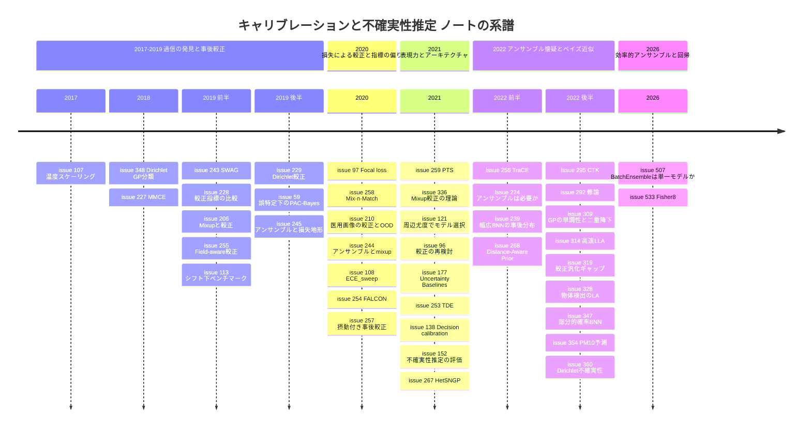

# キャリブレーション・不確実性推定・ベイズ深層学習・アンサンブル サーベイ

> 本稿は [Hiroki11x/Papers](https://github.com/Hiroki11x/Papers/issues) の論文読みノート（GitHub issues）のうち、「キャリブレーション・不確実性推定・ベイズ深層学習・ディープアンサンブル」を主題（primary）とする **44件の issue** を再構成したサーベイである。重複登録が2組あり（[#309](https://github.com/Hiroki11x/Papers/issues/309)=[#332](https://github.com/Hiroki11x/Papers/issues/332) Monotonicity and Double Descent in Uncertainty Estimation with GPs、[#314](https://github.com/Hiroki11x/Papers/issues/314)=[#335](https://github.com/Hiroki11x/Papers/issues/335) Accelerated Linearized Laplace Approximation）、ユニーク論文としては **42本**。
> 論文の初出は **2017年6月**（On Calibration of Modern Neural Networks）〜 **2026年8月**（Fisher8）、issue 登録は **2020年11月**〜**2026年8月**（大半は 2021年6月〜2022年12月に集中）。
> 記述はノート（issue 本文・コメント）に基づき、数値はノートに記載されたものだけを引用している。採択先は Semantic Scholar / Web で検証済みのレコードに従う。

## 概要

ノート群が追っている問いは、おおむね次の5つに整理できる。

1. **現代の DNN はなぜ・どの程度過信するのか**。精度が上がるほど較正が悪くなるという 2017 年の観察（[#107](https://github.com/Hiroki11x/Papers/issues/107)）は、新しいアーキテクチャでも成り立つのか（[#96](https://github.com/Hiroki11x/Papers/issues/96)）、汎化ギャップで説明できるのか（[#319](https://github.com/Hiroki11x/Papers/issues/319)）。
2. **較正をどう直すか**。学習後に補正する事後較正（温度スケーリングとその一般化）か、学習時に損失やデータ拡張で直すか（Focal loss、MMCE、Mixup）。
3. **較正をどう測るか**。ECE は偏った推定量であり、指標の選び方で手法の順位が変わる（[#228](https://github.com/Hiroki11x/Papers/issues/228), [#108](https://github.com/Hiroki11x/Papers/issues/108), [#258](https://github.com/Hiroki11x/Papers/issues/258)）。
4. **データセットシフト下で信頼できる不確実性は何で得られるか**。ディープアンサンブルが最良という大規模ベンチマーク（[#113](https://github.com/Hiroki11x/Papers/issues/113)）と、それに対する「アンサンブルは本当に必要か」という反論（[#224](https://github.com/Hiroki11x/Papers/issues/224), [#507](https://github.com/Hiroki11x/Papers/issues/507)）。
5. **ベイズ深層学習をスケールさせるには何を近似してよく、何を近似してはいけないか**。ラプラス近似・線形化・GGN・部分的確率化・MCMC の効率化（[#121](https://github.com/Hiroki11x/Papers/issues/121), [#335](https://github.com/Hiroki11x/Papers/issues/335), [#347](https://github.com/Hiroki11x/Papers/issues/347), [#239](https://github.com/Hiroki11x/Papers/issues/239)）。

## 目次

1. [背景と基本概念](#1-背景と基本概念)
2. [研究の系譜・時系列](#2-研究の系譜時系列)
3. [タイムライン図](#3-タイムライン図)
4. [サブトピック別の整理](#4-サブトピック別の整理)
5. [論文一覧表（公開順）](#5-論文一覧表公開順)
6. [採択先（ベニュー）別の集計](#6-採択先ベニュー別の集計)
7. [各論文の詳細まとめ](#7-各論文の詳細まとめ)
8. [横断的な知見・未解決問題](#8-横断的な知見未解決問題)
9. [関連論文](#9-関連論文)

---

## 1. 背景と基本概念

### 1.1 キャリブレーション（信頼度較正）

分類器が入力 $x$ に対してクラス確率 $\hat{p}(x)$ を出し、予測 $\hat{y}=\arg\max_k \hat{p}_k(x)$ とその信頼度 $\hat{c}=\max_k \hat{p}_k(x)$ を返すとする。**完全に較正されている**とは

$$
P\left(Y=\hat{y} \mid \hat{c}=c\right)=c \quad \forall c\in[0,1]
$$

が成り立つこと、つまり「信頼度 0.8 と言った予測の 8 割が当たる」ことである（[#107](https://github.com/Hiroki11x/Papers/issues/107)）。最大確率だけでなく確率ベクトル全体について $P(Y=k\mid \hat{p}=q)=q_k$ を要求するものを分布較正（多クラス較正）と呼び、[#229](https://github.com/Hiroki11x/Papers/issues/229) の classwise-ECE や [#138](https://github.com/Hiroki11x/Papers/issues/138) の decision calibration はこの多クラス側の定義を扱う。

### 1.2 Reliability diagram と ECE

信頼度を $M$ 個のビン $B_1,\dots,B_M$ に分け、各ビンの正解率 $\mathrm{acc}(B_m)$ と平均信頼度 $\mathrm{conf}(B_m)$ を比べた図が reliability diagram。そのずれをビンのサンプル数で重み付け平均したスカラーが **ECE（Expected Calibration Error）** である。

$$
\mathrm{ECE}_{\text{bin}}=\sum_{m=1}^{M}\frac{|B_m|}{n}\left|\mathrm{acc}(B_m)-\mathrm{conf}(B_m)\right|
$$

ECE は簡便だが、ビン数・ビン境界（等幅か等質量か）・ノルム（L1 か L2 か）・最大確率だけを見るかといった設計選択に敏感で（[#228](https://github.com/Hiroki11x/Papers/issues/228)）、真の較正誤差を系統的に過小/過大評価する（[#108](https://github.com/Hiroki11x/Papers/issues/108)）。その代替として、単調性を保つ最大ビン数を使う $\mathrm{ECE}_{\text{sweep}}$（[#108](https://github.com/Hiroki11x/Papers/issues/108)）、カーネル密度推定に基づく推定量（[#258](https://github.com/Hiroki11x/Papers/issues/258)）、RKHS に基づく微分可能な MMCE（[#227](https://github.com/Hiroki11x/Papers/issues/227)）がノートに登場する。適正スコアとしての **NLL** と **Brier スコア** も併用される。

### 1.3 事後較正（post-hoc calibration）

学習済みモデルのロジット $z$ を検証セットで補正する方法。

- **Platt scaling**: 出力にロジスティック回帰を当てる（[#107](https://github.com/Hiroki11x/Papers/issues/107) のコメントに整理あり）。
- **温度スケーリング**: 単一パラメータ $T>0$ で $\hat{p}=\mathrm{softmax}(z/T)$。$\arg\max$ が変わらないので精度を保つ。[#107](https://github.com/Hiroki11x/Papers/issues/107) で「驚くほど効果的」とされ、以後のベースラインになった。
- **一般化**: ディリクレ較正 $\hat{p}=\mathrm{softmax}(W\log \hat{p}_{\text{uncal}}+b)$（[#229](https://github.com/Hiroki11x/Papers/issues/229)）、予測ごとの温度 $T(z)$ をニューラルネットで出す PTS（[#259](https://github.com/Hiroki11x/Papers/issues/259)）、アンサンブル/合成型の Mix-n-Match（[#258](https://github.com/Hiroki11x/Papers/issues/258)）、入力フィールド情報を使う Neural Calibration（[#255](https://github.com/Hiroki11x/Papers/issues/255)）。

### 1.4 学習時の較正

損失やデータ拡張で、学習段階から過信を抑える方法。

- **Focal loss**: $\mathcal{L}=-(1-p_t)^{\gamma}\log p_t$。正解クラス確率 $p_t$ が高いサンプルの寄与を下げる（[#97](https://github.com/Hiroki11x/Papers/issues/97)）。
- **MMCE**: NLL に較正誤差の微分可能な代理を加えて同時最小化する（[#227](https://github.com/Hiroki11x/Papers/issues/227)）。
- **Mixup**: $\tilde{x}=\lambda x_i+(1-\lambda)x_j,\ \tilde{y}=\lambda y_i+(1-\lambda)y_j$。ソフトなラベルが較正改善の主因とされる（[#206](https://github.com/Hiroki11x/Papers/issues/206)）。高次元での理論は [#336](https://github.com/Hiroki11x/Papers/issues/336)。

### 1.5 不確実性の種類

- **モデル（エピステミック）不確実性**: パラメータやモデルの不確かさ。データから遠い入力で大きくなるべきもの（距離考慮。[#267](https://github.com/Hiroki11x/Papers/issues/267), [#268](https://github.com/Hiroki11x/Papers/issues/268)）。
- **データ（アレアトリック）不確実性**: ラベルノイズや観測ノイズ。回帰では平均と分散を同時に予測する異分散回帰（[#533](https://github.com/Hiroki11x/Papers/issues/533)）、分類ではディリクレ分布による表現（[#348](https://github.com/Hiroki11x/Papers/issues/348), [#360](https://github.com/Hiroki11x/Papers/issues/360)）などで扱われる。

### 1.6 ベイズ深層学習とラプラス近似

ベイズモデル平均（BMA）による予測分布は

$$
p(y\mid x,\mathcal{D})=\int p(y\mid x,\theta)\,p(\theta\mid\mathcal{D})\,d\theta
$$

で、事後分布 $p(\theta\mid\mathcal{D})$ をどう近似するかで手法が分かれる。

- **ラプラス近似（LA）**: MAP 解 $\theta^*$ のまわりで $p(\theta\mid\mathcal{D})\approx\mathcal{N}(\theta^*,H^{-1})$。ヘシアン $H$ は実用上 **一般化ガウス・ニュートン（GGN）** 行列で置き換え、さらに K-FAC・対角・最終層だけといった近似を重ねる。**線形化ラプラス（LLA）** はネットワークを $\theta^*$ まわりで一次近似したモデルで予測する。LLA は NTK と結びつく（[#335](https://github.com/Hiroki11x/Papers/issues/335)）。
- **周辺尤度（エビデンス）** $p(\mathcal{D}\mid\mathcal{M})=\int p(\mathcal{D}\mid\theta)p(\theta)d\theta$ はラプラス近似で推定でき、検証データなしのモデル選択に使える（[#121](https://github.com/Hiroki11x/Papers/issues/121)）。
- **SWAG**: SGD 反復の平均（SWA）と低ランク+対角の共分散でガウス事後分布を作る（[#243](https://github.com/Hiroki11x/Papers/issues/243)）。
- **MCMC / 変分推論**: HMC や平均場 VI（[#347](https://github.com/Hiroki11x/Papers/issues/347)）、幅の広い BNN での高速混合 MCMC（[#239](https://github.com/Hiroki11x/Papers/issues/239)）。
- **ガウス過程（GP）**: 関数空間での事前分布。分類用の GP は重いので回帰で代替する工夫（[#348](https://github.com/Hiroki11x/Papers/issues/348)）や、周辺尤度で調整した GP の学習曲線の理論（[#309](https://github.com/Hiroki11x/Papers/issues/309)）がある。

### 1.7 ディープアンサンブル

独立に初期化・学習した $M$ 個のネットワークの予測確率を平均する $\bar{p}(y\mid x)=\frac{1}{M}\sum_{m}p_{\theta_m}(y\mid x)$。メンバー間の不一致（多様性）が不確実性の源泉と考えられてきた。損失地形の観点からは、ランダム初期化が関数空間の異なるモードを訪れることが有効性の説明とされる（[#245](https://github.com/Hiroki11x/Papers/issues/245)）。重みを共有して安価にした「効率的アンサンブル」（BatchEnsemble など）が本当にアンサンブルとして振る舞うかは [#507](https://github.com/Hiroki11x/Papers/issues/507) が検証している。

---

## 2. 研究の系譜・時系列

### 2.1 2017–2019: 過信の発見、事後較正の確立、シフト下の大規模比較

出発点は Guo et al. [#107](https://github.com/Hiroki11x/Papers/issues/107)（2017-06, ICML 2017）。深さ・幅・weight decay・BatchNorm が較正に強く影響し、「分類誤差が減っても確率的な誤差が悪化する」という現象を示した。対策としては単一パラメータの**温度スケーリング**が最も単純で、しかも多くの場合最も効果的だった。以後のほぼすべての論文はこれをベースラインに置いている。

この直後から、二つの方向に分岐する。

- **温度スケーリングの表現力を上げる事後較正**: ディリクレ較正（[#229](https://github.com/Hiroki11x/Papers/issues/229), 2019-10）は対数確率に線形層+softmax を足すだけの多クラス較正で、confidence-ECE・classwise-ECE・log-loss・Brier の複数指標で確率予測を改善した。フィールド単位の較正誤差を導入した Neural Calibration（[#255](https://github.com/Hiroki11x/Papers/issues/255), 2019-05）は、広告 CTR のように特定の部分集団での偏りが問題になる産業応用から出てきた。
- **学習時に較正を組み込む**: MMCE（[#227](https://github.com/Hiroki11x/Papers/issues/227), 2018-07）は、エントロピーペナルティや温度による平滑化が「正当な高信頼予測まで潰してしまう」ことを問題視し、較正誤差そのものを NLL と一緒に最小化した。Mixup（[#206](https://github.com/Hiroki11x/Papers/issues/206), 2019-05）は、ハードラベルでの学習そのものが過信の原因であり、Mixup のラベル平滑化成分が較正改善の主因だと示した。

同時期に、**ベイズ的アプローチ**も「シンプルでスケーラブル」を目標に進む。SWAG（[#243](https://github.com/Hiroki11x/Papers/issues/243), 2019-02）は SGD の軌道から事後分布を作り、MC dropout・KFAC Laplace・SGLD・温度スケーリングと比べて良好だった。Dirichlet-based GP（[#348](https://github.com/Hiroki11x/Papers/issues/348), 2018-05）は GP 分類の計算コスト問題を、ラベルをディリクレ分布の出力と解釈して GP 回帰で解くことで回避した。理論面では Masegosa（[#59](https://github.com/Hiroki11x/Papers/issues/59), 2019-12）がモデル誤特定下の BMA を 2 次の PAC-Bayes 境界で解析し、変分法とアンサンブルへの含意を示した。

評価の土台を作ったのが二本の Google の論文である。Nixon et al.（[#228](https://github.com/Hiroki11x/Papers/issues/228), 2019-04）は ECE の設計選択を網羅的に比べ、**指標の選び方で再較正手法の順位が大きく変わる**ことを示した。Ovadia et al.（[#113](https://github.com/Hiroki11x/Papers/issues/113), 2019-06）は画像・テキスト・推薦にまたがる大規模ベンチマークで、データセットシフト下では**事後較正だけでは不十分で、ディープアンサンブルが最も良い**と結論した。ノートの書き手はこれを「OOD とキャリブレーションの中間にある自分の研究そのもの」と位置づけ、博士論文の軸にしたいとコメントしている。

アンサンブルがなぜ効くかについては Fort et al.（[#245](https://github.com/Hiroki11x/Papers/issues/245), 2019-12）が損失地形から答えた。ランダム初期化は関数空間で別々のモードを探索するが、変分ベイズや軌道上のサンプリングは単一モードにとどまる。これが「BNN は理論的に動機づけられているのに、シフト下ではアンサンブルに負ける」というギャップの説明として提示された。

### 2.2 2020: 損失による較正、ECE 推定の偏り、ドメインシフト下の較正

2020 年には三つの流れが並行した。

1. **損失関数による較正**: Focal loss（[#97](https://github.com/Hiroki11x/Papers/issues/97), 2020-02）は CE を置き換えるだけで較正されたモデルが得られ、温度スケーリングと組み合わせると、温度スケーリング単独の弱点である「正しい予測まで自信を下げてしまう」ことを避けつつ SOTA の較正になると主張した。MMCE（[#227](https://github.com/Hiroki11x/Papers/issues/227)）と同じく「高信頼な正解予測を保ちたい」という問題意識を引き継いでいる。
2. **評価指標の偏り**: Roelofs et al.（[#108](https://github.com/Hiroki11x/Papers/issues/108), 2020-12）はシミュレーションで $\mathrm{ECE}_{\text{bin}}$ の系統的バイアスを示し、**完全較正に近いモデルほどバイアスが大きい**（較正が進むほど測定が難しくなる）と指摘した。Mix-n-Match（[#258](https://github.com/Hiroki11x/Papers/issues/258), 2020-03）もデータが少ない領域でヒストグラム型 ECE が誤解を招くとして、漸近不偏・一致なカーネル密度推定量を提案した。[#228](https://github.com/Hiroki11x/Papers/issues/228) の問題提起を推定量の側から引き継いだ形である。
3. **ドメインシフト下の較正**: [#113](https://github.com/Hiroki11x/Papers/issues/113) が示した「シフト下で事後較正が効かない」問題に、Tomani & Buettner のグループが続けて取り組んだ。学習時にエントロピー促進項と敵対的較正損失を入れる FALCON（[#254](https://github.com/Hiroki11x/Papers/issues/254), 2020-12）と、事後較正の前に検証セットに摂動を加えるだけの方法（[#257](https://github.com/Hiroki11x/Papers/issues/257), 2020-12）である。ノートの書き手は前者に「これはクロンで考えてた話なんだけどな」（ECE を正則化に使う発想について）、後者に「実験のゴリ押しで CVPR を通している」とコメントしている。

アンサンブル側では Rahaman & Thiery（[#244](https://github.com/Hiroki11x/Papers/issues/244), 2020-07）が、低データ領域ではアンサンブルと Mixup の併用で**較正がかえって悪化しうる**こと、温度スケーリングは**アンサンブル平均の後に**かけるべきこと（これで ECE が半減）を示した。[#206](https://github.com/Hiroki11x/Papers/issues/206) の「Mixup は較正を良くする」、[#113](https://github.com/Hiroki11x/Papers/issues/113) の「アンサンブルが最良」をそのまま足し合わせてはいけない、という注意である。医用画像では Karimi & Gholipour（[#210](https://github.com/Hiroki11x/Papers/issues/210), 2020-04）が、マルチタスク学習でセグメンテーションの較正を改善し、OOD 検出には予測不確実性より特徴マップのスペクトル解析のほうがずっと正確だと報告した。

### 2.3 2021: 表現力・アーキテクチャ・意思決定・ベンチマーク

- **事後較正のさらなる一般化**: PTS（[#259](https://github.com/Hiroki11x/Papers/issues/259), 2021-02）は「精度を保つ事後較正器の性能は表現力で頭打ちになる」として、予測ごとの温度をネットワークで出力した。Truth Discovery Ensemble（[#253](https://github.com/Hiroki11x/Papers/issues/253), 2021-06）はアンサンブルと事後較正を真理発見の枠組みで統合し、アンサンブル候補の幾何的なばらつきをサンプル不確実性の指標にした（書き手は「昨年 LinkedIn で取り組んでいた内容とほぼ同じ」とメモ）。Decision calibration（[#138](https://github.com/Hiroki11x/Papers/issues/138), 2021-07）は、分布較正という強すぎる要請を「行動数が限られた下流の意思決定者から区別できない」まで弱めることで、多クラスでも多項式サンプル数で達成可能にした。
- **較正の決定要因の再検討**: Minderer et al.（[#96](https://github.com/Hiroki11x/Papers/issues/96), 2021-06）は [#107](https://github.com/Hiroki11x/Papers/issues/107) の「新しいモデルほど較正が悪い」というトレンドを最新の画像分類器で見直し、**畳み込みを使わないモデル（ViT 等）が最もよく較正されており**、分布シフトやモデルサイズによる較正劣化も目立たないことを示した。モデルサイズや事前学習量では説明しきれず、アーキテクチャが主要因だと示唆している。Galil et al.（[#152](https://github.com/Hiroki11x/Papers/issues/152), 2021-10）は多数の ImageNet 分類器を評価し、知識蒸留が ECE を改善することなどを示した。
- **Mixup の理論**: Zhang et al.（[#336](https://github.com/Hiroki11x/Papers/issues/336), 2021-02）は、Mixup が高次元で較正を改善し、その効果がモデル容量とともに増すことを証明した。経験則だった [#206](https://github.com/Hiroki11x/Papers/issues/206) の理論的裏付けにあたる。
- **ベイズとモデル選択**: Immer et al.（[#121](https://github.com/Hiroki11x/Papers/issues/121), 2021-04）はラプラス近似+GGN による周辺尤度推定で、訓練データだけからハイパラとアーキテクチャを選び、較正と OOD 検出で交差検証を上回った。
- **不確実性の分解とベンチマーク**: HetSNGP（[#267](https://github.com/Hiroki11x/Papers/issues/267), 2021-10）は距離考慮のモデル不確実性と入力依存のラベルノイズ（データ不確実性）を同時にモデル化した。Uncertainty Baselines（[#177](https://github.com/Hiroki11x/Papers/issues/177), 2021-06）は 9 タスク・19 手法の高品質実装を公開し、[#113](https://github.com/Hiroki11x/Papers/issues/113) 型の比較を再現可能にする基盤を作った。

### 2.4 2022: アンサンブルへの懐疑、較正と汎化の接続、ベイズ近似の見直し

ノート群が最も厚いのがこの年である。

- **アンサンブルは本当に必要か**: Abe et al.（[#224](https://github.com/Hiroki11x/Papers/issues/224), 2022-02）は [#113](https://github.com/Hiroki11x/Papers/issues/113) や [#245](https://github.com/Hiroki11x/Papers/issues/245) が前提とした「OOD ではメンバーがより不一致になる」を検証した。個々のメンバーの不確実性で条件付けると、**アンサンブルの多様性は ID と OOD で変わらない**。さらにデータ点ごとの多様性は、モデル容量を増やしたときの改善と強く相関する。つまりアンサンブルの OOD での利点は単一の大きなモデルで再現でき、アンサンブルは「本質的に優れたモデルクラスというより便利な道具」だと結論した。
- **較正を汎化の問題として捉える**: Carrell et al.（[#319](https://github.com/Hiroki11x/Papers/issues/319), 2022-10）は較正誤差を「訓練集合上の較正誤差」と「較正汎化ギャップ」に分解した。DNN は訓練集合上ではほぼ較正されており、較正汎化ギャップは標準の汎化ギャップで上から抑えられる。データ追加・強い拡張・小さいモデルといった汎化ギャップを縮める介入が較正も良くする、という形で、[#107](https://github.com/Hiroki11x/Papers/issues/107)・[#96](https://github.com/Hiroki11x/Papers/issues/96)・[#206](https://github.com/Hiroki11x/Papers/issues/206) などの個別の結果を統一的に説明しうる。書き手は「非常に面白い」と評価している。
- **ベイズ近似の忠実度と効率**: Accelerated LLA（[#314](https://github.com/Hiroki11x/Papers/issues/314)=[#335](https://github.com/Hiroki11x/Papers/issues/335), 2022-10）は、K-FAC・対角・最終層 GGN といった近似を重ねると肝心の不確実性が損なわれる、という問題意識から、NTK の Nyström 近似で LLA を高速化し ViT までスケールさせた。対照的に Sharma et al.（[#347](https://github.com/Hiroki11x/Papers/issues/347), 2022-11）は、確率的にするパラメータを減らしても予測性能は落ちず、全層を確率的にする系統的な利点はないと示した。「どこを近似してよいか」について、前者は共分散構造の粗い近似に、後者は確率的にする層の数に着目している。Hron et al.（[#239](https://github.com/Hiroki11x/Papers/issues/239), 2022-06）は幅とともに事後分布が事前分布に近づく再パラメータ化で、幅が広いほど MCMC が速く混合することを示した。
- **事前分布とスケール不変性**: Distance-Aware Prior（[#268](https://github.com/Hiroki11x/Papers/issues/268), 2022-07）は訓練集合からの距離に依存する事前分布で、訓練領域外の過信を後処理として補正する。[#267](https://github.com/Hiroki11x/Papers/issues/267) と同じ「距離考慮」の発想をベイズ側から実装したものといえる。Connectivity Tangent Kernel（[#295](https://github.com/Hiroki11x/Papers/issues/295), 2022-09）はパラメータのスケーリングに不変な事前・事後分布を作り、平坦性ベースの汎化境界の任意性と、ラプラス近似の較正の悪さを同時に直した。
- **不確実性推定の学習曲線**: Hodgkinson et al.（[#309](https://github.com/Hiroki11x/Papers/issues/309)=[#332](https://github.com/Hiroki11x/Papers/issues/332), 2022-10）は、周辺尤度で最適調整した GP は入力次元に対して単調に改善するが、十分低温の事後予測指標は対応するカーネル回帰の MSE が二重降下するときに限り二重降下する、と示した。
- **応用**: 医用画像の反事実説明に区間較正を使う TraCE（[#256](https://github.com/Hiroki11x/Papers/issues/256)）、自動運転の物体検出でのリアルタイムなラプラス近似（[#328](https://github.com/Hiroki11x/Papers/issues/328)）、異質なセンサー群からの PM10 予測（[#354](https://github.com/Hiroki11x/Papers/issues/354)）、ディリクレ分布と中間層 VI によるセグメンテーションの不確実性（[#360](https://github.com/Hiroki11x/Papers/issues/360)）、請求書処理システムの較正済み信頼度を扱った修士論文（[#292](https://github.com/Hiroki11x/Papers/issues/292)）。

### 2.5 2026: 効率的アンサンブルと異分散回帰

2023–2025 年に登録されたこのトピックのノートはなく、2026 年に 2 本が加わる。Zamyatin et al.（[#507](https://github.com/Hiroki11x/Papers/issues/507), 2026-01）は、BatchEnsemble が較正と多様性の観点で「真のアンサンブル」というより「単一モデル」のように振る舞うと結論した。[#224](https://github.com/Hiroki11x/Papers/issues/224) の「アンサンブルの利点は単一モデルで再現できる」という議論を、安価なアンサンブルの側から裏返したような結果である。Fisher8（[#533](https://github.com/Hiroki11x/Papers/issues/533), 2026-08）は平均と分散を同時に予測する異分散回帰の学習の不安定さ（勾配の不整合）を、出力層の Fisher 情報幾何に基づく更新で解消した。分類の較正中心だったノート群に、回帰のデータ不確実性と最適化幾何の視点を持ち込んでいる。

---

## 3. タイムライン図

（[#332](https://github.com/Hiroki11x/Papers/issues/332) は [#309](https://github.com/Hiroki11x/Papers/issues/309) と、[#335](https://github.com/Hiroki11x/Papers/issues/335) は [#314](https://github.com/Hiroki11x/Papers/issues/314) と同一論文のため図では省略。）

---

## 4. サブトピック別の整理

### 4.1 事後較正（温度スケーリングとその一般化）

**要点**: 温度スケーリング（[#107](https://github.com/Hiroki11x/Papers/issues/107)）が強いベースラインで、以後の研究は「精度を保ったまま表現力を上げる」（ディリクレ較正、PTS、Mix-n-Match）か「較正の対象を変える」（フィールド単位、意思決定単位）方向に進んだ。ドメインシフト下では in-domain の検証セットで合わせた事後較正は過信になり（[#113](https://github.com/Hiroki11x/Papers/issues/113), [#257](https://github.com/Hiroki11x/Papers/issues/257)）、検証セットに摂動を加える対策が提案されている。アンサンブルと組み合わせるときは平均後にかけるのが正しい（[#244](https://github.com/Hiroki11x/Papers/issues/244)）。

- [#107](https://github.com/Hiroki11x/Papers/issues/107) On Calibration of Modern Neural Networks — 温度スケーリング
- [#229](https://github.com/Hiroki11x/Papers/issues/229) Dirichlet calibration — ベータ較正の多クラス化
- [#255](https://github.com/Hiroki11x/Papers/issues/255) Field-aware Calibration — フィールド単位の較正誤差と Neural Calibration
- [#258](https://github.com/Hiroki11x/Papers/issues/258) Mix-n-Match — アンサンブル/合成型の事後較正
- [#257](https://github.com/Hiroki11x/Papers/issues/257) Post-hoc Uncertainty Calibration for Domain Drift — 摂動付き検証セット
- [#259](https://github.com/Hiroki11x/Papers/issues/259) Parameterized Temperature Scaling — 予測ごとの温度
- [#138](https://github.com/Hiroki11x/Papers/issues/138) Decision calibration — 意思決定者に対する区別不能性
- [#292](https://github.com/Hiroki11x/Papers/issues/292) Uncertainty Estimation with Calibrated Confidence Scores — 補助モデルで較正済み信頼度を付与（修論）

### 4.2 学習時の較正（損失・データ拡張・蒸留）

**要点**: 過信は「ハードラベル + NLL」で学習することの帰結とみなせる（[#206](https://github.com/Hiroki11x/Papers/issues/206)）。損失を変える（Focal loss、MMCE、FALCON）、ラベルを柔らかくする（Mixup）、蒸留する（[#152](https://github.com/Hiroki11x/Papers/issues/152)）といった介入はいずれも較正を改善する。温度スケーリングと違って正しい高信頼予測を保てるのが利点とされる（[#227](https://github.com/Hiroki11x/Papers/issues/227), [#97](https://github.com/Hiroki11x/Papers/issues/97)）。一方、低データ領域でアンサンブルと Mixup を重ねると逆効果になりうる（[#244](https://github.com/Hiroki11x/Papers/issues/244)）。

- [#227](https://github.com/Hiroki11x/Papers/issues/227) MMCE — カーネル平均埋め込みによる微分可能な較正誤差
- [#206](https://github.com/Hiroki11x/Papers/issues/206) On Mixup Training — Mixup の較正効果とラベル平滑化
- [#97](https://github.com/Hiroki11x/Papers/issues/97) Focal Loss と較正
- [#254](https://github.com/Hiroki11x/Papers/issues/254) FALCON — エントロピー促進 + 敵対的較正損失
- [#336](https://github.com/Hiroki11x/Papers/issues/336) When and How Mixup Improves Calibration — 高次元理論、半教師あり学習
- [#152](https://github.com/Hiroki11x/Papers/issues/152) How to measure deep uncertainty estimation performance — 蒸留で ECE 改善
- [#210](https://github.com/Hiroki11x/Papers/issues/210) 医用画像セグメンテーション — マルチタスク学習で較正改善

### 4.3 較正の測定と、較正を決める要因

**要点**: ECE は便利だが偏った推定量で、完全較正に近いほど偏りが大きく（[#108](https://github.com/Hiroki11x/Papers/issues/108)）、設計選択で手法の順位が変わる（[#228](https://github.com/Hiroki11x/Papers/issues/228)）。L2 ノルムと適応ビンが推奨され、単調スイープやカーネル密度推定量が提案された。較正を決める要因としては、アーキテクチャ（[#96](https://github.com/Hiroki11x/Papers/issues/96)）と汎化ギャップ（[#319](https://github.com/Hiroki11x/Papers/issues/319)）が挙げられている。

- [#228](https://github.com/Hiroki11x/Papers/issues/228) Measuring Calibration in Deep Learning
- [#108](https://github.com/Hiroki11x/Papers/issues/108) Mitigating Bias in Calibration Error Estimation — $\mathrm{ECE}_{\text{sweep}}$
- [#258](https://github.com/Hiroki11x/Papers/issues/258) Mix-n-Match — カーネル密度ベースの推定量
- [#96](https://github.com/Hiroki11x/Papers/issues/96) Revisiting the Calibration of Modern Neural Networks
- [#319](https://github.com/Hiroki11x/Papers/issues/319) The Calibration Generalization Gap
- [#152](https://github.com/Hiroki11x/Papers/issues/152) 多数の ImageNet 分類器の不確実性推定性能
- [#177](https://github.com/Hiroki11x/Papers/issues/177) Uncertainty Baselines

### 4.4 ディープアンサンブルとデータセットシフト

**要点**: 2019 年の大規模比較ではアンサンブルがシフト下の不確実性で最良（[#113](https://github.com/Hiroki11x/Papers/issues/113)）で、その理由は関数空間の多様なモード探索とされた（[#245](https://github.com/Hiroki11x/Papers/issues/245)）。その後、較正のためのアンサンブルの使い方（平均後の温度スケーリング [#244](https://github.com/Hiroki11x/Papers/issues/244)、真理発見 [#253](https://github.com/Hiroki11x/Papers/issues/253)）が整理された一方、多様性は単一の大きなモデルで再現できる（[#224](https://github.com/Hiroki11x/Papers/issues/224)）、効率的アンサンブルは単一モデルのように振る舞う（[#507](https://github.com/Hiroki11x/Papers/issues/507)）という懐疑的な結果も出ている。

- [#113](https://github.com/Hiroki11x/Papers/issues/113) Can You Trust Your Model's Uncertainty?
- [#245](https://github.com/Hiroki11x/Papers/issues/245) Deep Ensembles: A Loss Landscape Perspective
- [#59](https://github.com/Hiroki11x/Papers/issues/59) Learning under Model Misspecification — アンサンブルの PAC-Bayes 解析
- [#244](https://github.com/Hiroki11x/Papers/issues/244) Uncertainty Quantification and Deep Ensembles
- [#253](https://github.com/Hiroki11x/Papers/issues/253) Truth Discovery Ensemble
- [#267](https://github.com/Hiroki11x/Papers/issues/267) HetSNGP（アンサンブル版を含む）
- [#224](https://github.com/Hiroki11x/Papers/issues/224) Deep Ensembles Work, But Are They Necessary?
- [#507](https://github.com/Hiroki11x/Papers/issues/507) Is BatchEnsemble a Single Model?

### 4.5 ベイズ深層学習（ラプラス近似・SWAG・MCMC・GP）

**要点**: 実用化の鍵は近似の選び方で、ラプラス近似は GGN と線形化を経て NTK と結びつき（[#335](https://github.com/Hiroki11x/Papers/issues/335)）、周辺尤度によるモデル選択（[#121](https://github.com/Hiroki11x/Papers/issues/121)）やリアルタイム推論（[#328](https://github.com/Hiroki11x/Papers/issues/328)）に使われる。近似を粗くしすぎると不確実性が損なわれる（[#335](https://github.com/Hiroki11x/Papers/issues/335)）一方、確率的にする部分は少なくてよい（[#347](https://github.com/Hiroki11x/Papers/issues/347)）。スケール不変性（[#295](https://github.com/Hiroki11x/Papers/issues/295)）や距離依存の事前分布（[#268](https://github.com/Hiroki11x/Papers/issues/268)）など、事前分布の設計で較正を直す研究もある。

- [#348](https://github.com/Hiroki11x/Papers/issues/348) Dirichlet-based Gaussian Processes
- [#243](https://github.com/Hiroki11x/Papers/issues/243) SWAG
- [#59](https://github.com/Hiroki11x/Papers/issues/59) モデル誤特定下の BMA
- [#121](https://github.com/Hiroki11x/Papers/issues/121) Scalable Marginal Likelihood Estimation
- [#239](https://github.com/Hiroki11x/Papers/issues/239) Wide BNNs have a simple weight posterior
- [#268](https://github.com/Hiroki11x/Papers/issues/268) Distance-Aware Priors
- [#295](https://github.com/Hiroki11x/Papers/issues/295) Connectivity Tangent Kernel
- [#309](https://github.com/Hiroki11x/Papers/issues/309) / [#332](https://github.com/Hiroki11x/Papers/issues/332) GP の単調性と二重降下
- [#314](https://github.com/Hiroki11x/Papers/issues/314) / [#335](https://github.com/Hiroki11x/Papers/issues/335) Accelerated Linearized Laplace Approximation
- [#328](https://github.com/Hiroki11x/Papers/issues/328) 物体検出のリアルタイム LA
- [#347](https://github.com/Hiroki11x/Papers/issues/347) Do BNNs Need To Be Fully Stochastic?

### 4.6 データ不確実性・応用領域

**要点**: モデル不確実性とデータ不確実性の両方を扱う必要（[#267](https://github.com/Hiroki11x/Papers/issues/267)）、回帰で分散を学習するときの最適化の不安定さ（[#533](https://github.com/Hiroki11x/Papers/issues/533)）、そして医用画像・自動運転・環境センサー・業務システムといった応用でのリアルタイム性や信頼性の要件が扱われる。応用論文のノートは概要のみのものが多い。

- [#267](https://github.com/Hiroki11x/Papers/issues/267) HetSNGP — ラベルノイズと距離考慮
- [#533](https://github.com/Hiroki11x/Papers/issues/533) Fisher8 — 異分散回帰
- [#360](https://github.com/Hiroki11x/Papers/issues/360) ディリクレ分布 + 中間層 VI（セグメンテーション）
- [#210](https://github.com/Hiroki11x/Papers/issues/210) 医用画像セグメンテーションの較正と OOD 検出
- [#256](https://github.com/Hiroki11x/Papers/issues/256) TraCE（医用画像の反事実説明）
- [#328](https://github.com/Hiroki11x/Papers/issues/328) 物体検出（自動運転）
- [#354](https://github.com/Hiroki11x/Papers/issues/354) PM10 予測（深層カーネル学習）
- [#292](https://github.com/Hiroki11x/Papers/issues/292) 請求書処理（修論）

---

## 5. 論文一覧表（公開順）

records から Python スクリプトで生成（重複 issue も1行ずつ掲載）。

| 公開 | 論文 | 著者/組織 | 採択先 | 根拠 | サブトピック |
|---|---|---|---|---|---|
| 2017-06 | [#107](https://github.com/Hiroki11x/Papers/issues/107) On Calibration of Modern Neural Networks | Chuan Guo, Geoff Pleiss, Yu Sun, et al.（Cornell University） | ICML 2017 | arXivコメント | キャリブレーション |
| 2018-05 | [#348](https://github.com/Hiroki11x/Papers/issues/348) Dirichlet-based Gaussian Processes for Large-scale Calibrated Classification | Dimitrios Milios, Raffaello Camoriano, Pietro Michiardi, et al.（EURECOM） | NeurIPS 2018 | issue記載 | キャリブレーション |
| 2018-07 | [#227](https://github.com/Hiroki11x/Papers/issues/227) Trainable Calibration Measures For Neural Networks From Kernel Mean Embeddings | Aviral Kumar, Sunita Sarawagi, Ujjwal Jain | ICML 2018 | issue記載 | キャリブレーション |
| 2019-02 | [#243](https://github.com/Hiroki11x/Papers/issues/243) A Simple Baseline for Bayesian Uncertainty in Deep Learning | Wesley Maddox, Timur Garipov, Pavel Izmailov, et al. (Andrew Gordon Wilson)（NYU） | NeurIPS 2019 | issue記載 | ベイズ的不確実性とキャリブレーション |
| 2019-04 | [#228](https://github.com/Hiroki11x/Papers/issues/228) Measuring Calibration in Deep Learning | Jeremy Nixon, Mike Dusenberry, Ghassen Jerfel, et al.（Google） | CVPR 2019 Workshop | Semantic Scholar確認 | キャリブレーション評価指標 |
| 2019-05 | [#206](https://github.com/Hiroki11x/Papers/issues/206) On Mixup Training: Improved Calibration and Predictive Uncertainty for Deep Neural Networks | Sunil Thulasidasan, Gopinath Chennupati, Jeff Bilmes, et al.（Los Alamos National Laboratory） | NeurIPS 2019 | arXivコメント | Mixupとキャリブレーション |
| 2019-05 | [#255](https://github.com/Hiroki11x/Papers/issues/255) Field-aware Calibration: A Simple and Empirically Strong Method for Reliable Probabilistic Predictions | Feiyang Pan, Xiang Ao, Pingzhong Tang, et al.（CAS / Tencent） | WWW 2020 | Web確認 | キャリブレーション |
| 2019-06 | [#113](https://github.com/Hiroki11x/Papers/issues/113) Can You Trust Your Model's Uncertainty? Evaluating Predictive Uncertainty Under Dataset Shift | Yaniv Ovadia, Emily Fertig, Jie Ren, et al.（Google） | NeurIPS 2019 | issue記載 | データセットシフト下の不確実性 |
| 2019-10 | [#229](https://github.com/Hiroki11x/Papers/issues/229) Beyond temperature scaling: Obtaining well-calibrated multiclass probabilities with Dirichlet calibration | Meelis Kull, Miquel Perello-Nieto, Markus Kängsepp, et al. | NeurIPS 2019 | arXivコメント | キャリブレーション |
| 2019-12 | [#59](https://github.com/Hiroki11x/Papers/issues/59) Learning under Model Misspecification: Applications to Variational and Ensemble methods | Andres R. Masegosa | NeurIPS 2020 | arXivコメント | モデル誤特定下の汎化（PAC-Bayes） |
| 2019-12 | [#245](https://github.com/Hiroki11x/Papers/issues/245) Deep Ensembles: A Loss Landscape Perspective | Stanislav Fort, Huiyi Hu, Balaji Lakshminarayanan（Google） | arXiv（プレプリント） | 不明 | ディープアンサンブルと損失地形 |
| 2020-02 | [#97](https://github.com/Hiroki11x/Papers/issues/97) The Intriguing Effects of Focal Loss on the Calibration of Deep Neural Networks | Jishnu Mukhoti, Viveka Kulharia, Amartya Sanyal, et al.（University of Oxford） | NeurIPS 2020 | Semantic Scholar確認 | キャリブレーション（Focal Loss） |
| 2020-03 | [#258](https://github.com/Hiroki11x/Papers/issues/258) Mix-n-Match: Ensemble and Compositional Methods for Uncertainty Calibration in Deep Learning | Jize Zhang, Bhavya Kailkhura, T. Yong-Jin Han（LLNL） | ICML 2020 | issue記載 | キャリブレーション |
| 2020-04 | [#210](https://github.com/Hiroki11x/Papers/issues/210) Improving Calibration and Out-of-Distribution Detection in Medical Image Segmentation with Convolutional Neural Networks | Davood Karimi, Ali Gholipour（Harvard Medical School） | arXiv（プレプリント） | 不明 | 医用画像のキャリブレーションとOOD検出 |
| 2020-07 | [#244](https://github.com/Hiroki11x/Papers/issues/244) Uncertainty Quantification and Deep Ensembles | Rahul Rahaman, Alexandre H. Thiery（NUS） | NeurIPS 2021 | arXivコメント | ディープアンサンブルとキャリブレーション |
| 2020-12 | [#108](https://github.com/Hiroki11x/Papers/issues/108) Mitigating Bias in Calibration Error Estimation | Rebecca Roelofs, Nicholas Cain, Jonathon Shlens, et al.（Google Research） | AISTATS 2022 | Web確認 | キャリブレーション誤差推定 |
| 2020-12 | [#254](https://github.com/Hiroki11x/Papers/issues/254) Towards Trustworthy Predictions from Deep Neural Networks with Fast Adversarial Calibration | Christian Tomani, Florian Buettner（Siemens / TU Munich） | AAAI 2021 | Web確認 | ドメインシフト下のキャリブレーション |
| 2020-12 | [#257](https://github.com/Hiroki11x/Papers/issues/257) Post-hoc Uncertainty Calibration for Domain Drift Scenarios | Christian Tomani, Sebastian Gruber, Muhammed Ebrar Erdem, et al.（TU Munich / Siemens） | CVPR 2021 | arXivコメント | ドメインシフト下のキャリブレーション |
| 2021-02 | [#259](https://github.com/Hiroki11x/Papers/issues/259) Parameterized Temperature Scaling for Boosting the Expressive Power in Post-Hoc Uncertainty Calibration | Christian Tomani, Daniel Cremers, Florian Buettner（TU Munich） | ECCV 2022 | arXivコメント | キャリブレーション |
| 2021-02 | [#336](https://github.com/Hiroki11x/Papers/issues/336) When and How Mixup Improves Calibration | Linjun Zhang, Zhun Deng, Kenji Kawaguchi, James Zou | ICML 2022 | arXivコメント | キャリブレーション |
| 2021-04 | [#121](https://github.com/Hiroki11x/Papers/issues/121) Scalable Marginal Likelihood Estimation for Model Selection in Deep Learning | Alexander Immer, Matthias Bauer, Vincent Fortuin, et al.（ETH Zurich / RIKEN AIP） | ICML 2021 | arXivコメント | ラプラス近似によるモデル選択 |
| 2021-06 | [#96](https://github.com/Hiroki11x/Papers/issues/96) Revisiting the Calibration of Modern Neural Networks | Matthias Minderer, Josip Djolonga, Rob Romijnders, et al.（Google Research） | NeurIPS 2021 | arXivコメント | キャリブレーション |
| 2021-06 | [#177](https://github.com/Hiroki11x/Papers/issues/177) Uncertainty Baselines: Benchmarks for Uncertainty & Robustness in Deep Learning | Zachary Nado, Neil Band, Mark Collier, et al.（Google） | arXiv（プレプリント） | 不明 | 不確実性推定のベンチマーク |
| 2021-06 | [#253](https://github.com/Hiroki11x/Papers/issues/253) Improving Uncertainty Calibration of Deep Neural Networks via Truth Discovery and Geometric Optimization | Chunwei Ma, Ziyun Huang, Jiayi Xian, et al.（University at Buffalo） | UAI 2021 | arXivコメント | アンサンブルとキャリブレーション |
| 2021-07 | [#138](https://github.com/Hiroki11x/Papers/issues/138) Calibrating Predictions to Decisions: A Novel Approach to Multi-Class Calibration | Shengjia Zhao, Michael P. Kim, Roshni Sahoo, et al.（Stanford） | NeurIPS 2021 | Semantic Scholar確認 | キャリブレーション |
| 2021-10 | [#152](https://github.com/Hiroki11x/Papers/issues/152) How to measure deep uncertainty estimation performance and which models are naturally better at providing it | Ido Galil, Mohammed Dabbah, Ran El-Yaniv（Technion） | arXiv（プレプリント） | Web確認 | 不確実性推定の評価 |
| 2021-10 | [#267](https://github.com/Hiroki11x/Papers/issues/267) Deep Classifiers with Label Noise Modeling and Distance Awareness | Vincent Fortuin, Mark Collier, Florian Wenzel, et al.（ETH Zurich / Google） | TMLR | arXivコメント | 不確実性推定 |
| 2022-01 | [#256](https://github.com/Hiroki11x/Papers/issues/256) Training calibration-based counterfactual explainers for deep learning models in medical image analysis | Jayaraman J. Thiagarajan, Kowshik Thopalli, Deepta Rajan, Pavan Turaga（LLNL） | Scientific Reports | issue記載 | キャリブレーションと説明可能AI |
| 2022-02 | [#224](https://github.com/Hiroki11x/Papers/issues/224) Deep Ensembles Work, But Are They Necessary? | Taiga Abe, E. Kelly Buchanan, Geoff Pleiss, et al.（Columbia University） | NeurIPS 2022 | Semantic Scholar確認 | ディープアンサンブルと不確実性 |
| 2022-06 | [#239](https://github.com/Hiroki11x/Papers/issues/239) Wide Bayesian neural networks have a simple weight posterior: theory and accelerated sampling | Jiri Hron, Roman Novak, Jeffrey Pennington, Jascha Sohl-Dickstein（Google） | ICML 2022 | arXivコメント | ベイズニューラルネット |
| 2022-07 | [#268](https://github.com/Hiroki11x/Papers/issues/268) Uncertainty Calibration in Bayesian Neural Networks via Distance-Aware Priors | Gianluca Detommaso, Alberto Gasparin, Andrew Wilson, Cedric Archambeau（Amazon） | arXiv（プレプリント） | 不明 | ベイズNNのキャリブレーション |
| 2022-09 | [#295](https://github.com/Hiroki11x/Papers/issues/295) Scale-invariant Bayesian Neural Networks with Connectivity Tangent Kernel | SungYub Kim, Sihwan Park, Kyungsu Kim, Eunho Yang（KAIST） | ICLR 2023 | Web確認 | スケール不変な平坦性とキャリブレーション |
| 2022-10 | [#292](https://github.com/Hiroki11x/Papers/issues/292) Uncertainty Estimation with Calibrated Confidence Scores | Juhani Kivimäki（University of Helsinki） | Master's Thesis (University of Helsinki) | issue記載 | キャリブレーション（修論） |
| 2022-10 | [#309](https://github.com/Hiroki11x/Papers/issues/309) Monotonicity and Double Descent in Uncertainty Estimation with Gaussian Processes | Liam Hodgkinson, Chris van der Heide, Fred Roosta, Michael W. Mahoney | ICML 2023 | Semantic Scholar確認 | 不確実性推定と二重降下 |
| 2022-10 | [#314](https://github.com/Hiroki11x/Papers/issues/314) Accelerated Linearized Laplace Approximation for Bayesian Deep Learning | Zhijie Deng, Feng Zhou, Jun Zhu（Tsinghua University） | NeurIPS 2022 | Semantic Scholar確認 | ラプラス近似とベイズ深層学習 |
| 2022-10 | [#319](https://github.com/Hiroki11x/Papers/issues/319) The Calibration Generalization Gap | A. Michael Carrell, Neil Mallinar, James Lucas, Preetum Nakkiran（Cambridge / NVIDIA / Apple） | ICML 2022 Workshop (DFUQ) | arXivコメント | キャリブレーションと汎化 |
| 2022-10 | [#328](https://github.com/Hiroki11x/Papers/issues/328) Laplace Approximation for Real-Time Uncertainty Estimation in Object Detection | Ming Gui, Tianming Qiu, Fridolin Bauer, et al.（TU Munich / fortiss / BMW） | IEEE Conference | issue記載 | 物体検出の不確実性推定 |
| 2022-10 | [#332](https://github.com/Hiroki11x/Papers/issues/332) Monotonicity and Double Descent in Uncertainty Estimation with Gaussian Processes | Liam Hodgkinson, Chris van der Heide, Fred Roosta, Michael W. Mahoney | ICML 2023 | Semantic Scholar確認 | 不確実性推定と二重降下 |
| 2022-10 | [#335](https://github.com/Hiroki11x/Papers/issues/335) Accelerated Linearized Laplace Approximation for Bayesian Deep Learning | Zhijie Deng, Feng Zhou, Jun Zhu（Tsinghua University） | NeurIPS 2022 | arXivコメント | ラプラス近似とベイズ深層学習 |
| 2022-11 | [#347](https://github.com/Hiroki11x/Papers/issues/347) Do Bayesian Neural Networks Need To Be Fully Stochastic? | Mrinank Sharma, Sebastian Farquhar, Eric Nalisnick, Tom Rainforth（University of Oxford） | AISTATS 2023 | arXivコメント | ベイズNNと不確実性推定 |
| 2022-11 | [#354](https://github.com/Hiroki11x/Papers/issues/354) Neural Kernel Network Deep Kernel Learning for Predicting Particulate Matter from Heterogeneous Sensors with Uncertainty | Chaofan Li, Till Riedel, Michael Beigl（KIT） | Springer LNCS (conference proceedings, 2022) | issue記載 | 不確実性付き時系列予測 |
| 2022-12 | [#360](https://github.com/Hiroki11x/Papers/issues/360) Predictive Uncertainty Quantification of Deep Neural Networks using Dirichlet Distributions | Ahmed Hammam, Frank Bonarens, Seyed Eghbal Ghobadi, et al.（Opel / THM / KIT） | ACM CSCS 2022 | issue記載 | 不確実性推定 |
| 2026-01 | [#507](https://github.com/Hiroki11x/Papers/issues/507) Is BatchEnsemble a Single Model? On Calibration and Diversity of Efficient Ensembles | Anton Zamyatin, Patrick Indri, Sagar Malhotra, Thomas Gärtner（TU Wien） | EurIPS 2025 Workshop (EIML) | arXivコメント | 効率的アンサンブルのキャリブレーション |
| 2026-08 | [#533](https://github.com/Hiroki11x/Papers/issues/533) Fisher8: Stabilizing Neural Heteroscedastic Regression via Output-Layer Fisher Geometry | Sumedh Vemuganti, Nickvash Kani（UIUC） | UAI 2026 | arXivコメント | 不確実性推定と情報幾何 |

---

## 6. 採択先（ベニュー）別の集計

会議系列ごとの件数（issue 単位、重複を含む）。スクリプトで生成。

| 採択先（系列） | 件数 | issue |
|---|---|---|
| NeurIPS | 13 | [#59](https://github.com/Hiroki11x/Papers/issues/59)（NeurIPS 2020）, [#96](https://github.com/Hiroki11x/Papers/issues/96)（NeurIPS 2021）, [#97](https://github.com/Hiroki11x/Papers/issues/97)（NeurIPS 2020）, [#113](https://github.com/Hiroki11x/Papers/issues/113)（NeurIPS 2019）, [#138](https://github.com/Hiroki11x/Papers/issues/138)（NeurIPS 2021）, [#206](https://github.com/Hiroki11x/Papers/issues/206)（NeurIPS 2019）, [#224](https://github.com/Hiroki11x/Papers/issues/224)（NeurIPS 2022）, [#229](https://github.com/Hiroki11x/Papers/issues/229)（NeurIPS 2019）, [#243](https://github.com/Hiroki11x/Papers/issues/243)（NeurIPS 2019）, [#244](https://github.com/Hiroki11x/Papers/issues/244)（NeurIPS 2021）, [#314](https://github.com/Hiroki11x/Papers/issues/314)（NeurIPS 2022）, [#335](https://github.com/Hiroki11x/Papers/issues/335)（NeurIPS 2022）, [#348](https://github.com/Hiroki11x/Papers/issues/348)（NeurIPS 2018） |
| ICML | 8 | [#107](https://github.com/Hiroki11x/Papers/issues/107)（ICML 2017）, [#121](https://github.com/Hiroki11x/Papers/issues/121)（ICML 2021）, [#227](https://github.com/Hiroki11x/Papers/issues/227)（ICML 2018）, [#239](https://github.com/Hiroki11x/Papers/issues/239)（ICML 2022）, [#258](https://github.com/Hiroki11x/Papers/issues/258)（ICML 2020）, [#309](https://github.com/Hiroki11x/Papers/issues/309)（ICML 2023）, [#332](https://github.com/Hiroki11x/Papers/issues/332)（ICML 2023）, [#336](https://github.com/Hiroki11x/Papers/issues/336)（ICML 2022） |
| arXiv（プレプリント） | 5 | [#152](https://github.com/Hiroki11x/Papers/issues/152)（arXiv（プレプリント））, [#177](https://github.com/Hiroki11x/Papers/issues/177)（arXiv（プレプリント））, [#210](https://github.com/Hiroki11x/Papers/issues/210)（arXiv（プレプリント））, [#245](https://github.com/Hiroki11x/Papers/issues/245)（arXiv（プレプリント））, [#268](https://github.com/Hiroki11x/Papers/issues/268)（arXiv（プレプリント）） |
| その他（論文誌・その他会議・学位論文） | 5 | [#256](https://github.com/Hiroki11x/Papers/issues/256)（Scientific Reports）, [#292](https://github.com/Hiroki11x/Papers/issues/292)（Master's Thesis (University of Helsinki)）, [#328](https://github.com/Hiroki11x/Papers/issues/328)（IEEE Conference）, [#354](https://github.com/Hiroki11x/Papers/issues/354)（Springer LNCS (conference proceedings, 2022)）, [#360](https://github.com/Hiroki11x/Papers/issues/360)（ACM CSCS 2022） |
| ワークショップ | 3 | [#228](https://github.com/Hiroki11x/Papers/issues/228)（CVPR 2019 Workshop）, [#319](https://github.com/Hiroki11x/Papers/issues/319)（ICML 2022 Workshop (DFUQ)）, [#507](https://github.com/Hiroki11x/Papers/issues/507)（EurIPS 2025 Workshop (EIML)） |
| AISTATS | 2 | [#108](https://github.com/Hiroki11x/Papers/issues/108)（AISTATS 2022）, [#347](https://github.com/Hiroki11x/Papers/issues/347)（AISTATS 2023） |
| UAI | 2 | [#253](https://github.com/Hiroki11x/Papers/issues/253)（UAI 2021）, [#533](https://github.com/Hiroki11x/Papers/issues/533)（UAI 2026） |
| AAAI | 1 | [#254](https://github.com/Hiroki11x/Papers/issues/254)（AAAI 2021） |
| CVPR | 1 | [#257](https://github.com/Hiroki11x/Papers/issues/257)（CVPR 2021） |
| ECCV | 1 | [#259](https://github.com/Hiroki11x/Papers/issues/259)（ECCV 2022） |
| ICLR | 1 | [#295](https://github.com/Hiroki11x/Papers/issues/295)（ICLR 2023） |
| TMLR | 1 | [#267](https://github.com/Hiroki11x/Papers/issues/267)（TMLR） |
| WWW | 1 | [#255](https://github.com/Hiroki11x/Papers/issues/255)（WWW 2020） |
| **合計** | **44** | |

NeurIPS と ICML で 21 件と半数近くを占める。一方、応用寄りの論文（Scientific Reports、IEEE / ACM / Springer の会議録、修士論文）も一定数ある。

---

## 7. 各論文の詳細まとめ

first_public 順。

### [#107] On Calibration of Modern Neural Networks
- 公開: 2017-06 ／ 採択先: ICML 2017（arXivコメント） ／ 著者/組織: Chuan Guo, Geoff Pleiss, Yu Sun, et al.（Cornell University）

**要約**: 現代の NN は精度が上がる一方で過信傾向にあり、10 年前の NN と比べて較正が悪いことを示した。深さ・幅・weight decay・BatchNorm が較正に影響する重要な要素であり、画像・文書分類で事後較正法を比較すると、Platt scaling の単一パラメータ版である温度スケーリングが驚くほど効果的だった。

**主な知見**:
- 分類誤差が減っても確率的な誤差（NLL）や誤較正が悪化するという現象がある。
- モデル容量・正規化・正則化といった近年の進歩が較正に強く影響する。
- 温度スケーリングは最も単純・高速で、多くの場合最も効果的。なぜ精度を上げる進歩が較正を悪くするのかの理解は今後の課題とされた。

**メモ**: コメント欄で解説ブログを参照し、ECE（reliability diagram の各ビンの正解率と信頼度の差の重み付き平均）と Platt scaling（出力へのロジスティック回帰、検証セットでパラメータ推定）の定義を整理している。

### [#348] Dirichlet-based Gaussian Processes for Large-scale Calibrated Classification
- 公開: 2018-05 ／ 採択先: NeurIPS 2018（issue記載） ／ 著者/組織: Dimitrios Milios, Raffaello Camoriano, Pietro Michiardi, et al.（EURECOM）

**要約**: GP 分類（GPC）は原理的に不確実性を扱えるが計算負荷が大きい（ノートでは「3乗オーダー」）。分類ラベルに直接 GP 回帰を当てると速いが較正が悪くなるため、ラベルをディリクレ分布の出力と解釈して変換する Dirichlet-based GP 分類（GPD）を提案した。

**主な知見**:
- GPC と本質的に同じ精度と不確実性定量化を、ごく一部の計算資源で達成。

**メモ**: ラベルスムージングや Mixup との同値性もありそう、とコメントしている。

### [#227] Trainable Calibration Measures For Neural Networks From Kernel Mean Embeddings
- 公開: 2018-07 ／ 採択先: ICML 2018（issue記載） ／ 著者/組織: Aviral Kumar, Sunita Sarawagi, Ujjwal Jain

**要約**: エントロピーペナルティや温度による平滑化は信頼度を一律に抑えるため、正当な高信頼予測まで損なう。そこで RKHS カーネルに基づく較正指標 MMCE を提案し、NLL と同時に学習中に最小化する。

**主な知見**:
- MMCE は完全較正で最小化され、有限標本推定量が一致性を持ち、収束も速い健全な較正尺度。
- 注意深いパラメータ調整なしに NLL と並べて学習でき、高信頼予測の数を保ったまま較正誤差を下げる。

### [#243] A Simple Baseline for Bayesian Uncertainty in Deep Learning
- 公開: 2019-02 ／ 採択先: NeurIPS 2019（issue記載） ／ 著者/組織: Wesley Maddox, Timur Garipov, Pavel Izmailov, et al. (Andrew Gordon Wilson)（NYU）

**要約**: SWA 解を平均とし、SGD 反復から得た低ランク+対角の共分散を持つガウス分布で重みの近似事後分布を作る SWAG を提案した。

**主な知見**:
- SWAG は SGD 反復の定常分布に関する結果と同様に、真の事後分布の形状をよく近似することが経験的に見いだされた。
- MC dropout、KFAC Laplace、SGLD、温度スケーリングと比べて、OOD 検出・較正・転移学習で良好。

### [#228] Measuring Calibration in Deep Learning
- 公開: 2019-04 ／ 採択先: CVPR 2019 Workshop（Semantic Scholar確認） ／ 著者/組織: Jeremy Nixon, Mike Dusenberry, Ghassen Jerfel, et al.（Google）

**要約**: 最も一般的な ECE には多くの欠陥があるとして、全クラス確率の利用、確率の閾値化、クラス条件付け、ビン数、データ密度に適応したビン、ノルムの選択など、較正指標の設計を網羅的に比較した。各指標を再較正で直接最適化したときの影響も調べている。

**主な知見**:
- MNIST・Fashion MNIST・CIFAR-10/100・ImageNet で、再較正手法の順位付けの結論が指標の選択に大きく左右される。
- L1 ではなく L2 ノルムのほうが、指標の最適化と順位相関（一貫性）の両方で良い。
- 適応的ビンはビン数を変えたときの順位を安定させるので推奨。

**メモ**: ブログ記事を読むのがよいとリンクを残している。

### [#206] On Mixup Training: Improved Calibration and Predictive Uncertainty for Deep Neural Networks
- 公開: 2019-05 ／ 採択先: NeurIPS 2019（arXivコメント） ／ 著者/組織: Sunil Thulasidasan, Gopinath Chennupati, Jeff Bilmes, et al.（Los Alamos National Laboratory）

**要約**: Mixup で学習した DNN は、ImageNet を含む多くのアーキテクチャ・データセットで通常学習より有意に良く較正されることを示した。

**主な知見**:
- 特徴を混ぜるだけでは較正効果は得られず、Mixup に含まれるラベル平滑化が改善の大きな要因。
- Mixup で学習したモデルは、OOD データやランダムノイズに対しても過信しにくい。
- 分布内でも見られる典型的な過信は、ハードラベルでの学習の結果と考えられる。

**メモ**: 「そうだろうなという結果だが、ちゃんと示した論文」との評価。

### [#255] Field-aware Calibration: A Simple and Empirically Strong Method for Reliable Probabilistic Predictions
- 公開: 2019-05 ／ 採択先: WWW 2020（Web確認） ／ 著者/組織: Feiyang Pan, Xiang Ao, Pingzhong Tang, et al.（CAS / Tencent）

**要約**: オンライン広告で、ある広告の実際のクリック率が 0.15 なのに特定の母集団では 0.1 と予測される、といった部分集合での誤較正を問題にした。意思決定者が関心を持つ入力フィールド上の偏りを測るフィールドレベル較正誤差を導入し、検証セットのフィールド情報を活用する事後較正法 Neural Calibration を提案した。

**主な知見**:
- 既存の事後較正では、フィールドレベル指標や AUC の改善は限定的。
- 5 つの大規模データセットで、NLL・Brier・AUC・フィールドレベル較正誤差のいずれも未較正予測から大きく改善した。

### [#113] Can You Trust Your Model's Uncertainty? Evaluating Predictive Uncertainty Under Dataset Shift
- 公開: 2019-06 ／ 採択先: NeurIPS 2019（issue記載） ／ 著者/組織: Yaniv Ovadia, Emily Fertig, Jie Ren, et al.（Google）

**要約**: ベイズ・非ベイズの確率的深層学習手法を、データセットシフト下で初めて大規模かつ厳密に比較した。画像・テキスト・推薦にわたる大規模実験で、精度と較正がシフトでどう劣化するかを調べた。

**主な知見**:
- 従来の事後較正は、他のいくつかの手法と同様に、シフト下では実際には不十分。
- モデル間で周辺化する手法（アンサンブル）が幅広いタスクで驚くほど良く、ディープアンサンブルが最良。

**メモ**: 「OOD とキャリブレーションのどちらも重要な研究で、今の自分のワークの中間の位置づけ」。DNN は最尤で学習しているが、それを補正したものを見ると TIC（竹内情報量規準）の定式化も変わりそうで、このあたりを統一的に理解できれば博士論文になりそう、博士論文の軸にしたい、とコメント。実験規模の大きさに驚いている。Google AI ブログも読んでいる。ICML 2019 の Uncertainty and Robustness ワークショップに短縮版が出ていたことも記録している。

### [#229] Beyond temperature scaling: Obtaining well-calibrated multiclass probabilities with Dirichlet calibration
- 公開: 2019-10 ／ 採択先: NeurIPS 2019（arXivコメント） ／ 著者/組織: Meelis Kull, Miquel Perello-Nieto, Markus Kängsepp, et al.

**要約**: ディリクレ分布に由来し、二値分類のベータ較正を一般化した、任意の分類器に使えるネイティブな多クラス較正法を提案した。未較正確率を対数変換して線形層と softmax を加えるだけなので NN に簡単に実装できる。

**主な知見**:
- confidence-ECE、classwise-ECE、log-loss、Brier の複数指標で、多様なデータセット・分類器の確率予測を改善。
- 学習された較正マップのパラメータから、未較正モデルのバイアスについての洞察が得られる。

### [#59] Learning under Model Misspecification: Applications to Variational and Ensemble methods
- 公開: 2019-12 ／ 採択先: NeurIPS 2020（arXivコメント） ／ 著者/組織: Andres R. Masegosa

**要約**: モデル誤特定と i.i.d. データのもとで、ベイズモデル平均の汎化性能を新しい 2 次の PAC-Bayes 境界の族で解析し、変分法とアンサンブル法への応用を示した。

ノートはアブストラクトの引用とリンクのみ。

### [#245] Deep Ensembles: A Loss Landscape Perspective
- 公開: 2019-12 ／ 採択先: arXiv（プレプリント）（不明） ／ 著者/組織: Stanislav Fort, Huiyi Hu, Balaji Lakshminarayanan（Google）

**要約**: ブートストラップなしにランダム初期化だけで作るアンサンブルがなぜ良いのか、またなぜスケーラブルな変分ベイズがシフト下でアンサンブルに劣るのかを、損失地形と関数空間での予測の類似度から調べた。

**主な知見**:
- ランダム初期化は関数空間で全く異なるモードを探索する。
- 最適化軌道に沿った関数や部分空間からのサンプルは、重み空間では大きく離れていても予測としては単一モードにまとまる。
- 多様性-精度平面で見ると、ランダム初期化の非相関性は一般的な部分空間サンプリング法とは比べものにならない。

### [#97] The Intriguing Effects of Focal Loss on the Calibration of Deep Neural Networks
- 公開: 2020-02 ／ 採択先: NeurIPS 2020（Semantic Scholar確認） ／ 著者/組織: Jishnu Mukhoti, Viveka Kulharia, Amartya Sanyal, et al.（University of Oxford）

**要約**: 温度スケーリングは精度を変えずに較正するが、正しい予測まで自信のないものにしてしまう。CE を Focal loss に置き換えると、すでによく較正されたモデルが得られ、温度スケーリングと組み合わせると、精度と正しい予測の信頼度を保ったまま SOTA の較正になる。採択版の題名は「Calibrating Deep Neural Networks using Focal Loss」。

**主な知見**:
- 誤較正を引き起こす要因を分析し、その知見から Focal loss の経験的な良さを理論的に正当化。
- CIFAR-10/100（画像）と SST・20 Newsgroups（NLP）、多様なアーキテクチャで、ほぼすべての場合に SOTA の精度と較正。

### [#258] Mix-n-Match: Ensemble and Compositional Methods for Uncertainty Calibration in Deep Learning
- 公開: 2020-03 ／ 採択先: ICML 2020（issue記載） ／ 著者/組織: Jize Zhang, Bhavya Kailkhura, T. Yong-Jin Han（LLNL）

**要約**: 事後較正の望ましい条件として、精度維持・データ効率・高い表現力の 3 つを挙げ、既存手法はどれも全部は満たさないことを示した。アンサンブルと合成による Mix-n-Match 戦略で、どの既製の較正器も強化できる。

**主な知見**:
- ヒストグラム型 ECE は、特にデータが少ない領域で誤解を招く結果を出しうる。
- 漸近的に不偏で一致性を持つ、データ効率の良いカーネル密度ベースの較正誤差推定量を提案。

**メモ**: 一言まとめは「IRM を提案」。[#257](https://github.com/Hiroki11x/Papers/issues/257) のコメントによれば、ここでの IRM は Invariant Risk Minimization ではなく本論文の手法を指す。

### [#210] Improving Calibration and Out-of-Distribution Detection in Medical Image Segmentation with Convolutional Neural Networks
- 公開: 2020-04 ／ 採択先: arXiv（プレプリント）（不明） ／ 著者/組織: Davood Karimi, Ali Gholipour（Harvard Medical School）

**要約**: 小規模な医用画像データセットでの学習の難しさと、CNN が OOD データに対して黙って失敗する問題に取り組んだ。臓器やモダリティが異なる複数データセットで単一モデルを学習するマルチタスク学習を提唱し、OOD 検出には特徴マップのスペクトル解析を提案した。

**主な知見**:
- 単一の CNN が文脈を自動認識し、データセットごとの専用モデルより正確で較正の良い予測をすることが多い。マルチタスク学習は転移学習を上回った。
- データセットごとに特徴のスペクトルが異なり、テスト画像が学習データに似ているかの判定に使える。予測不確実性に基づく OOD 検出よりはるかに正確。

### [#244] Uncertainty Quantification and Deep Ensembles
- 公開: 2020-07 ／ 採択先: NeurIPS 2021（arXivコメント） ／ 著者/組織: Rahul Rahaman, Alexandre H. Thiery（NUS）

**要約**: 低データ領域でデータ拡張・アンサンブル・事後較正の 3 つの相互作用を調べ、ディープアンサンブルが必ずしも較正を改善しないことを示した。

**主な知見**:
- 標準的なアンサンブルを Mixup 等と併用すると、較正が悪化しうる。アンサンブルの較正は微妙なトレードオフに依存する。
- 温度スケーリングはアンサンブルに対して少し調整が必要で、平均化の後に実行すべき。この単純な戦略で、低データ領域の標準的なディープアンサンブルに比べ ECE が半減。

### [#108] Mitigating Bias in Calibration Error Estimation
- 公開: 2020-12 ／ 採択先: AISTATS 2022（Web確認） ／ 著者/組織: Rebecca Roelofs, Nicholas Cain, Jonathon Shlens, et al.（Google Research）

**要約**: シミュレーションフレームワークで、$\mathrm{ECE}_{\text{bin}}$ が誤較正の性質・評価データ数・ビン数に応じて真の較正誤差を系統的に過小/過大評価することを示した。較正曲線の単調性を保てる範囲でビン数を最大にする $\mathrm{ECE}_{\text{sweep}}$ を提案した。

**主な知見**:
- バイアスは完全較正に近いモデルで最も深刻で、較正が進むほど測定が難しくなる。
- CIFAR-10/100・ImageNet の信頼度分布に当てはめた評価で、$\mathrm{ECE}_{\text{sweep}}$ はバイアスが小さい。
- バイアスはどの再較正法が選ばれるかに大きく影響する。「較正を正確に測れなければ完全較正は達成できない」。
- 未解決として、小サンプルではバイアスを完全には除けないこと、シフト下では較正曲線の単調性が期待できないことが挙げられている。

**メモ**: 一言では「ECE よりよい較正指標を作り、それで再較正すればよいと言っている」。ECE のバイアス補正の考え方が TIC に似ていると指摘し、「評価ツールとしてのシミュレーション」と「OOD での較正」を今後の方向として共同研究者に共有している。

### [#254] Towards Trustworthy Predictions from Deep Neural Networks with Fast Adversarial Calibration
- 公開: 2020-12 ／ 採択先: AAAI 2021（Web確認） ／ 著者/組織: Christian Tomani, Florian Buettner（Siemens / TU Munich）

**要約**: ドメイン内とドメインシフト下の両方で較正された予測を得るため、エントロピーを促す損失項と敵対的較正損失項を組み合わせた学習法 FALCON を提案した。

**主な知見**:
- 異なるデータモダリティ・系列データ・アーキテクチャ・摂動戦略を含む広範な評価で、既存手法を大幅に上回り、ドメインドリフト下でも較正された予測を得た。

**メモ**: 「ECE を正則化として使うと、OOD も Calibration を改善する。これはクロンで考えてた話なんだけどな。。。」とコメント。

### [#257] Post-hoc Uncertainty Calibration for Domain Drift Scenarios
- 公開: 2020-12 ／ 採択先: CVPR 2021（arXivコメント） ／ 著者/組織: Christian Tomani, Sebastian Gruber, Muhammed Ebrar Erdem, et al.（TU Munich / Siemens）

**要約**: これまでの事後較正はドメイン内の較正に焦点があった。既存の事後較正手法がドメインシフト下で非常に過信した予測を出すことを示し、較正の前に検証セットのサンプルへ摂動を加える単純な戦略を導入した。

**主な知見**:
- 摂動ステップにより、幅広いアーキテクチャ・タスクでシフト下の較正が大きく改善。

**メモ**: 「実験のゴリ押しで CVPR を通している」。表中の「-P」が摂動を入れた提案手法であること、ここに出てくる IRM は Invariant Risk Minimization ではないことを記録。摂動の強さを細かい計算で決めていそうで、画像特有の処理もありそうなので実装を確認すべき、とメモしている。

### [#259] Parameterized Temperature Scaling for Boosting the Expressive Power in Post-Hoc Uncertainty Calibration
- 公開: 2021-02 ／ 採択先: ECCV 2022（arXivコメント） ／ 著者/組織: Christian Tomani, Daniel Cremers, Florian Buettner（TU Munich）

**要約**: 精度を保つ最先端の事後較正器の性能は、その表現力によって制限されることを示した。ニューラルネットワークで予測ごとの温度を計算することで温度スケーリングを一般化した PTS を提案した。

**主な知見**:
- 多くのアーキテクチャ・データセット・指標で、精度を保ったまま既存アルゴリズムを一貫して上回る。

**メモ**: 一言では「温度スケーリングのパラメータを増やすと ECE が良くなる」。

### [#336] When and How Mixup Improves Calibration
- 公開: 2021-02 ／ 採択先: ICML 2022（arXivコメント） ／ 著者/組織: Linjun Zhang, Zhun Deng, Kenji Kawaguchi, James Zou

**要約**: Mixup がいつ、どのように較正を助けるかを、自然な統計モデルで理論的に解析した。高次元の設定で Mixup が較正を改善することを証明し、CIFAR-10/100 などの実験で支持した。

**主な知見**:
- Mixup の較正改善効果はモデル容量とともに増大する。
- 半教師あり学習ではラベルなしデータを取り込むと較正が悪化することがあるが、Mixup を加えるとこれが緩和される。

**メモ**: 半教師あり学習で較正が悪化する点に注目し、SimCLR などと併用するとさらに良くなるのか、と疑問を書いている。

### [#121] Scalable Marginal Likelihood Estimation for Model Selection in Deep Learning
- 公開: 2021-04 ／ 採択先: ICML 2021（arXivコメント） ／ 著者/組織: Alexander Immer, Matthias Bauer, Vincent Fortuin, et al.（ETH Zurich / RIKEN AIP）

**要約**: 周辺尤度によるモデル選択は推定が難しく深層学習ではほとんど使われてこなかった。ヘシアンのラプラス近似とガウス・ニュートン近似に基づくスケーラブルな周辺尤度推定で、訓練データだけからハイパーパラメータとアーキテクチャを選ぶ方法を示した。一部のハイパラは学習中にオンラインで推定できる。

**主な知見**:
- 回帰と画像分類で、特に較正と OOD 検出において交差検証や手動チューニングより優れた。
- 検証データが得られない場合（非定常な設定など）に有用。

**メモ**: 「尤度ベースの汎化指標が DNN でも良い性能を示す」と要約。Khan 先生（RIKEN AIP）が著者に入っていること、ラプラス+GGN の部分を共同研究者にタグ付けして共有している。

### [#96] Revisiting the Calibration of Modern Neural Networks
- 公開: 2021-06 ／ 採択先: NeurIPS 2021（arXivコメント） ／ 著者/組織: Matthias Minderer, Josip Djolonga, Rob Romijnders, et al.（Google Research）

**要約**: [#107](https://github.com/Hiroki11x/Papers/issues/107) 以降に示唆されてきた「精度の高い新しいモデルほど較正が悪い」を、最新の SOTA 画像分類モデルで再検討した。モデルサイズ・アーキテクチャ・学習が較正に与える影響を系統的に調べた。

**主な知見**:
- 最新のモデル、特に畳み込みを使わないモデルが最もよく較正されている。
- 分布シフトやモデルサイズに応じて較正が悪化するという以前の世代の傾向は、最近のアーキテクチャではあまり顕著でない。
- モデルサイズや事前学習量では差を説明しきれず、アーキテクチャが較正特性の主要因と示唆される。

**メモ**: 共同で読む予定とのメモあり。コード・ノートブックへのリンクを残している。

### [#177] Uncertainty Baselines: Benchmarks for Uncertainty & Robustness in Deep Learning
- 公開: 2021-06 ／ 採択先: arXiv（プレプリント）（不明） ／ 著者/組織: Zachary Nado, Neil Band, Mark Collier, et al.（Google）

**要約**: 計算資源・ベースラインの数・再現性の文書化などの理由で手法の公正な比較が欠けがちな状況に対し、標準・最先端の深層学習手法の高品質な実装集 Uncertainty Baselines を公開した。

**主な知見**:
- 執筆時点で 9 タスク・19 手法、各手法につき少なくとも 5 つの指標。
- 各ベースラインは再利用・拡張しやすい自己完結の実験パイプライン。チェックポイント・ノートブック形式の実験出力・リーダーボードも提供。

### [#253] Improving Uncertainty Calibration of Deep Neural Networks via Truth Discovery and Geometric Optimization
- 公開: 2021-06 ／ 採択先: UAI 2021（arXivコメント） ／ 著者/組織: Chunwei Ma, Ziyun Huang, Jiayi Xian, et al.（University at Buffalo）

**要約**: アンサンブルと事後較正の相乗効果は十分検討されていないとして、両者を統合する真理発見（truth discovery）の枠組み Truth Discovery Ensemble（TDE）を提案した。

**主な知見**:
- アンサンブル候補の幾何学的な分散をサンプル不確実性の指標とし、精度が落ちないことが証明可能な精度保存型の真値推定器を設計。
- 事後較正も、真理発見で正則化した最適化によって強化できる。
- CIFAR・ImageNet で、ヒストグラムベースとカーネル密度ベースの両方の指標で一貫して改善。

**メモ**: Deep Ensemble を改善する方法で、「まさに去年 LinkedIn でやっていた内容」とコメント。

### [#138] Calibrating Predictions to Decisions: A Novel Approach to Multi-Class Calibration
- 公開: 2021-07 ／ 採択先: NeurIPS 2021（Semantic Scholar確認） ／ 著者/組織: Shengjia Zhao, Michael P. Kim, Roshni Sahoo, et al.（Stanford）

**要約**: 分布較正（予測確率ベクトル $q$ を受け取る入力の真のクラス分布が $q$）は多クラスでは要求が強い。下流の意思決定者の集合に対して予測分布と真の分布が「区別できない」ことを要求する decision calibration を導入した。

**主な知見**:
- すべての意思決定者を対象にすると decision calibration は分布較正と一致する。
- 行動数が限られた（例えばクラス数の多項式個の）意思決定者だけを考えると達成可能になり、行動数とクラス数の多項式のサンプル複雑度で済む再較正アルゴリズムを設計。
- 皮膚病変と ImageNet の分類で、最新の NN 予測器を使った意思決定を改善。

### [#152] How to measure deep uncertainty estimation performance and which models are naturally better at providing it
- 公開: 2021-10 ／ 採択先: arXiv（プレプリント）（Web確認） ／ 著者/組織: Ido Galil, Mohammed Dabbah, Ran El-Yaniv（Technion）

**要約**: 多数の ImageNet 分類器の不確実性推定性能を評価した。ノートに残っているのは一言まとめのみで、知識蒸留が ECE を改善するという点。

**メモ**: 「蒸留が ECE を改善する（SWA などとの組み合わせの教師/生徒設定の実験をますますやらないと）」。

**補足**: ノートが参照する OpenReview 版は ICLR 2022 投稿で不採択となったため、採択先は arXiv（プレプリント）とした。改訂版は別題名（What Can We Learn From The Selective Prediction And Uncertainty Estimation Performance Of 523 ImageNet Classifiers?）で ICLR 2023 に採択されている。

### [#267] Deep Classifiers with Label Noise Modeling and Distance Awareness
- 公開: 2021-10 ／ 採択先: TMLR（arXivコメント） ／ 著者/組織: Vincent Fortuin, Mark Collier, Florian Wenzel, et al.（ETH Zurich / Google）

**要約**: OOD 検出のための距離考慮のモデル不確実性と、分布内較正のための入力依存のラベル不確実性は、多くの場合両方必要だとして、両者を同時にモデル化する HetSNGP を提案した。

**主な知見**:
- CIFAR-100C、ImageNet-C、ImageNet-A などの難しい OOD データセットでベースラインを上回る。
- アンサンブル版の HetSNGP アンサンブルはネットワークパラメータの不確実性も追加でモデル化し、他のアンサンブルベースラインを上回る。

### [#256] Training calibration-based counterfactual explainers for deep learning models in medical image analysis
- 公開: 2022-01 ／ 採択先: Scientific Reports（issue記載） ／ 著者/組織: Jayaraman J. Thiagarajan, Kowshik Thopalli, Deepta Rajan, Pavan Turaga（LLNL）

**要約**: 反事実的説明は、モデルの予測が十分に較正されていないと無関係な特徴操作を持ち込みやすい。不確実性に基づく区間較正戦略で信頼性の高い反事実を合成する TraCE を提案し、胸部 X 線の異常識別モデルで評価した。

**主な知見**:
- 広く使われる複数の評価指標で、最新のベースラインより良い説明を生成。
- 決定境界の漸進的な探索、ショートカットの検出、患者属性と疾患重症度の関係の推論に使える。

### [#224] Deep Ensembles Work, But Are They Necessary?
- 公開: 2022-02 ／ 採択先: NeurIPS 2022（Semantic Scholar確認） ／ 著者/組織: Taiga Abe, E. Kelly Buchanan, Geoff Pleiss, et al.（Columbia University）

**要約**: ディープアンサンブルと、同程度の精度の単一ネットワークのどちらを選ぶべきかを問い、アンサンブルの利点とされる不確実性定量化とシフトへの頑健性の限界を示した。単一の（より大きな）ネットワークでこれらの性質を再現できる。

**主な知見**:
- どの指標で測っても、アンサンブルの多様性は OOD 検出能力に意味のある寄与をしない。個々のメンバーの不確実性で条件付けると、多様性は ID と OOD で同じ（WideResNet 28-10 ×5、AlexNet ×5 で確認）。
- データ点ごとのアンサンブルの改善は、モデル容量を増やしたときの改善と高い相関がある（Brier スコア、CIFAR-10/CIFAR-10.1 と CIFAR-10/CINIC-10）。多様性は単一の大きなモデルで得られない量を捉えていない。
- アンサンブルの OOD 性能は ID 性能に強く依存し、「実効的な頑健性」を示さない。アンサンブルは本質的に優れたモデルクラスというより便利な道具。

**メモ**: コメント欄に、OOD の不確実性は個々のモデルの不確実性の帰結であってアンサンブルの不一致の違いによるものではない、という本文の該当箇所を原文と訳で抜き出している。

### [#239] Wide Bayesian neural networks have a simple weight posterior: theory and accelerated sampling
- 公開: 2022-06 ／ 採択先: ICML 2022（arXivコメント） ／ 著者/組織: Jiri Hron, Roman Novak, Jeffrey Pennington, Jascha Sohl-Dickstein（Google）

**要約**: BNN の事後分布を、層幅が大きくなるにつれて事前分布との KL ダイバージェンスが消える分布へ変換するデータ依存の再パラメータ化（repriorisation）を導入した。関数空間での NNGP の振る舞いを重み空間側から補完する結果である。

**主な知見**:
- repriorisation を使った MCMC は、幅が広いほど速く混合する（高次元で MCMC が一般に遅いのとは対照的）。
- 全結合とResNet で、再パラメータ化なしに比べて最大 50 倍の有効サンプルサイズ。改善はすべての幅で得られ、差は幅とともに大きくなる。

### [#268] Uncertainty Calibration in Bayesian Neural Networks via Distance-Aware Priors
- 公開: 2022-07 ／ 採択先: arXiv（プレプリント）（不明） ／ 著者/組織: Gianluca Detommaso, Alberto Gasparin, Andrew Wilson, Cedric Archambeau（Amazon）

**要約**: データから離れるほど少ない情報に合う説明が増えるので予測の不確実性は増えるべきだ、という考えから、訓練集合からの距離の尺度を通じて入力に依存する事前分布 DAP を定義し、訓練領域外の過信を補正する。

**主な知見**:
- DAP 較正は事後推論手法に依存せず、後処理として実行できる。
- データから離れた予測分布の質を測るベンチマークを含む分類・回帰問題で、ベースラインに対する有効性を示した。

### [#295] Scale-invariant Bayesian Neural Networks with Connectivity Tangent Kernel
- 公開: 2022-09 ／ 採択先: ICLR 2023（Web確認） ／ 著者/組織: SungYub Kim, Sihwan Park, Kyungsu Kim, Eunho Yang（KAIST）

**要約**: 平坦性は汎化の予測子として広く受け入れられているが、パラメータのスケーリングで平坦性や汎化境界が任意に変わってしまう。パラメータのスケールと結合性を分離することで、スケーリング変換に不変な事前・事後分布（Connectivity Tangent Kernel）を提案した。

**主な知見**:
- 得られる汎化境界は、BatchNorm + weight decay のような実用的な変換を含む広いクラスのネットワークに適用できる。
- スケーリングの問題はラプラス近似の不確実性較正にも悪影響を与え、不変な事後分布でそれを解決できる。低い計算量で平坦性と較正の有効な尺度になる。

### [#292] Uncertainty Estimation with Calibrated Confidence Scores
- 公開: 2022-10 ／ 採択先: Master's Thesis (University of Helsinki)（issue記載） ／ 著者/組織: Juhani Kivimäki（University of Helsinki）

**要約**: 信頼度スコアとその較正の方法論を概観した修士論文。ケーススタディとして、フィンランドの Basware 社が PDF 請求書から情報を抽出するために運用しているモデルに対し、推論時に集めた潜在表現と統計量を入力とする補助モデルで、各予測に較正済み信頼度を付与した。

**主な知見**:
- すべての信頼度閾値で従来の信頼度推定を上回る。
- エラー率を増やさずに、請求書の自動処理カバー率を 65.6% から 73.2% に改善。

**メモ**: 「よくまとまっている修論」。

### [#309] Monotonicity and Double Descent in Uncertainty Estimation with Gaussian Processes
- 公開: 2022-10 ／ 採択先: ICML 2023（Semantic Scholar確認） ／ 著者/組織: Liam Hodgkinson, Chris van der Heide, Fred Roosta, Michael W. Mahoney

**要約**: 予測性能で知られる二重降下に対応する理論が、不確実性を推定するモデルにもあるかを GP で問い、部分的に肯定・部分的に否定の答えを与えた。[#332](https://github.com/Hiroki11x/Papers/issues/332) と同一論文。

**主な知見**:
- 標準的な仮定の下で、周辺尤度で最適調整した GP は入力次元が大きいほど品質が高く、誤差曲線は単調。
- 周辺尤度は入力次元について自然には二重降下を示さないが、事後予測損失に関連する指標は非単調性を示しうる。
- 仮定を超えた実データでも結果が成り立つことを確認し、合成共変量の場合も探索。

### [#314] Accelerated Linearized Laplace Approximation for Bayesian Deep Learning
- 公開: 2022-10 ／ 採択先: NeurIPS 2022（Semantic Scholar確認） ／ 著者/組織: Zhijie Deng, Feng Zhou, Jun Zhu（Tsinghua University）

**要約**: LA と LLA は学習済み DNN を手軽に BNN 化できるが、扱いやすさのため GGN を K-FAC・対角・最終層で近似せざるを得ず、これが結果の忠実度を損ないうる。LLA と NTK の関係に着目して NTK の Nyström 近似を開発し、LLA を高速化した。[#335](https://github.com/Hiroki11x/Papers/issues/335) と同一論文（ノートはアブストラクトのみ）。

**主な知見**:
- 深層学習ライブラリの前方モード自動微分を活用し、理論保証も持つ。
- スケーラビリティと性能の両面で有効で、ViT のようなアーキテクチャまでスケールする。

### [#319] The Calibration Generalization Gap
- 公開: 2022-10 ／ 採択先: ICML 2022 Workshop (DFUQ)（arXivコメント） ／ 著者/組織: A. Michael Carrell, Neil Mallinar, James Lucas, Preetum Nakkiran（Cambridge / NVIDIA / Apple）

**要約**: どの要因（アーキテクチャ、データ拡張、過剰パラメータ化など）が良い較正に寄与するかは文献上で主張が分かれている。汎化の基本的な分解に倣い、較正誤差を (1) 訓練集合上の較正誤差と (2) 較正汎化ギャップに分解して体系的に調べた。

**主な知見**:
- DNN は通常、訓練集合上ではほぼ常に較正されている。
- 較正汎化ギャップは標準の汎化ギャップ（|テスト誤差 − 訓練誤差|）で上から抑えられることが経験的に示される。したがって汎化ギャップが小さいモデルはよく較正されている。
- データ追加・強いデータ拡張・小さいモデルなど、汎化ギャップを縮める介入は較正も改善する。この見方は文献の多くの結果を統一する。

**メモ**: 「非常に面白い」。

### [#328] Laplace Approximation for Real-Time Uncertainty Estimation in Object Detection
- 公開: 2022-10 ／ 採択先: IEEE Conference（issue記載） ／ 著者/組織: Ming Gui, Tianming Qiu, Fridolin Bauer, et al.（TU Munich / fortiss / BMW）

**要約**: 自動運転の物体検出では安全な知覚のために不確実性推定が必要だが、BNN は大規模ネットワークでは計算量が膨大になる。ラプラス近似と線形化推論を組み合わせて効率的な BNN を作り、過剰パラメータ化されたネットワークに対する対角ヘシアン近似の有効性と計算要件を調べた。

**主な知見**:
- 異なる種類の干渉に関する多数の定量実験で、リアルタイムかつ頑健な不確実性記述を実現。

### [#332] Monotonicity and Double Descent in Uncertainty Estimation with Gaussian Processes
- 公開: 2022-10 ／ 採択先: ICML 2023（Semantic Scholar確認） ／ 著者/組織: Liam Hodgkinson, Chris van der Heide, Fred Roosta, Michael W. Mahoney

**要約**: [#309](https://github.com/Hiroki11x/Papers/issues/309) と同一論文の重複登録。こちらのノートには主結果の要約が書かれている。

**主な知見**:
- 単調性: 十分大きな i.i.d. の正規化・白色化された入出力ペアに当てはめた、最適に正則化された 2 つのスカラー GP のうち、周辺尤度のもとでより良い性能を出すのは入力次元が大きいほうである。
- 二重降下: 十分低い温度では、GP の事後予測指標が二重降下するのは、対応するカーネル回帰の MSE が二重降下する場合に限る。

### [#335] Accelerated Linearized Laplace Approximation for Bayesian Deep Learning
- 公開: 2022-10 ／ 採択先: NeurIPS 2022（arXivコメント） ／ 著者/組織: Zhijie Deng, Feng Zhou, Jun Zhu（Tsinghua University）

**要約**: [#314](https://github.com/Hiroki11x/Papers/issues/314) と同一論文の重複登録。こちらには日本語の背景・手法メモがある。LA/LLA で NN を BNN に適応できるが、GGN 近似や最終層以外の二階微分の無視、K-FAC などで近似を重ねると、信頼度の情報が損なわれている可能性がある。NTK と LLA の関係から NTK の Nyström 近似で LLA を高速化した。

**主な知見**:
- ECE などの較正指標で不確実性が正しく推定できているかを評価し、良好な結果。

**メモ**: 「ベイズにするのはその辺りの不確実性を知りたいからなのに、近似しまくったら意味ないじゃん」という問題意識に共感し、「面白い」と評価。

### [#347] Do Bayesian Neural Networks Need To Be Fully Stochastic?
- 公開: 2022-11 ／ 採択先: AISTATS 2023（arXivコメント） ／ 著者/組織: Mrinank Sharma, Sebastian Farquhar, Eric Nalisnick, Tom Rainforth（University of Oxford）

**要約**: BNN は不確実性推定に有効だが、推論で何かしら近似しないと使えない。全パラメータを確率的に扱うという標準構成が不要である可能性を、理論と実験で示した。部分的に確率的なネットワークを使うこと自体は新規性ではなく、論文の立場（ポジション）である。

**主な知見**:
- 表現力の高い予測分布に必要な確率性はわずかで、$n$ 個の確率的バイアスを持つ部分確率ネットワークは $n$ 次元予測問題の普遍的な確率予測器になる。確率的パラメータ数と表現力の間にトレードオフはない。
- HMC や平均場 VI を含む 4 つの推論法・8 データセットで、全層を確率的にする系統的な利点は見られず、部分確率ネットワークはメモリコストが低いのに同等かそれ以上。

**メモ**: 事前知識として BNN の解説記事・サーベイスライドへのリンクを残している。

### [#354] Neural Kernel Network Deep Kernel Learning for Predicting Particulate Matter from Heterogeneous Sensors with Uncertainty
- 公開: 2022-11 ／ 採択先: Springer LNCS (conference proceedings, 2022)（issue記載） ／ 著者/組織: Chaofan Li, Till Riedel, Michael Beigl（KIT）

**要約**: 市民が集めたデータから公的ソースまで質の異なる測定を扱うセンサネットワークで、都市部の粒子状物質の時系列予測を行う。異質で不確かな測定値を入力とするニューラルカーネルネットワークの深層カーネル学習モデルで、翌日の日平均 PM10 濃度を予測した。

**主な知見**:
- SmartAQnet の超低価格センサーを加えると、パイプラインの平均 MAE が 4.18 μg/m³ から 3.67 μg/m³ に下がり、PCC が 0.589 から 0.665 に上がった。
- 入力信号の質と量に基づく予測の不確実性をモデル化できる。

### [#360] Predictive Uncertainty Quantification of Deep Neural Networks using Dirichlet Distributions
- 公開: 2022-12 ／ 採択先: ACM CSCS 2022（issue記載） ／ 著者/組織: Ahmed Hammam, Frank Bonarens, Seyed Eghbal Ghobadi, et al.（Opel / THM / KIT）

**要約**: ディリクレ分布による不確実性のモデル化と、中間層の変分推論という、いずれもリアルタイムに不確実性を推定できる二つの手法を組み合わせた。

**主な知見**:
- Cityscapes のセマンティックセグメンテーションで、リアルタイム性を保ちつつ不確実性推定能力が大幅に向上し、セグメンテーション性能も改善。

### [#507] Is BatchEnsemble a Single Model? On Calibration and Diversity of Efficient Ensembles
- 公開: 2026-01 ／ 採択先: EurIPS 2025 Workshop (EIML)（arXivコメント） ／ 著者/組織: Anton Zamyatin, Patrick Indri, Sagar Malhotra, Thomas Gärtner（TU Wien）

**要約**: 効率的アンサンブルの代表である BatchEnsemble を、較正と多様性の観点から調べた。

**主な知見**:
- BatchEnsemble は「真のアンサンブル」というより「単一モデル」のように振る舞うと結論（ノートは TLDR のみ）。

### [#533] Fisher8: Stabilizing Neural Heteroscedastic Regression via Output-Layer Fisher Geometry
- 公開: 2026-08 ／ 採択先: UAI 2026（arXivコメント） ／ 著者/組織: Sumedh Vemuganti, Nickvash Kani（UIUC）

**要約**: 平均と分散を同時に予測する異分散回帰では、勾配の不整合のために学習が不安定になり精度が大きく落ちる。勾配更新の基準をユークリッド距離から Fisher 情報幾何に基づく KL ダイバージェンスに置き換え、学習軌道を適正化する Fisher8 を提案した。

**主な知見**:
- 追加のハイパーパラメータなしに、高い予測精度と信頼できる不確実性出力を両立し、良い特徴表現も学習する。
- 多次元回帰・宇宙論的推論・表現学習の実験で、既存手法より頑健で収束が速い。

---

## 8. 横断的な知見・未解決問題

### 8.1 ノート群から読み取れるコンセンサス

- **過信の主因は「何で学習するか」と「どれだけ汎化ギャップがあるか」**。ハードラベル + NLL の学習が過信を生み（[#206](https://github.com/Hiroki11x/Papers/issues/206)）、訓練集合上ではほぼ較正されているので、テストでの誤較正は汎化ギャップの裏返しと見なせる（[#319](https://github.com/Hiroki11x/Papers/issues/319)）。Mixup・Focal loss・蒸留・強い拡張・データ追加が較正を良くするという個別の報告（[#206](https://github.com/Hiroki11x/Papers/issues/206), [#97](https://github.com/Hiroki11x/Papers/issues/97), [#152](https://github.com/Hiroki11x/Papers/issues/152), [#336](https://github.com/Hiroki11x/Papers/issues/336)）は、この見方で整理できる。
- **温度スケーリングは依然として強いベースライン**。より表現力の高い較正器（[#229](https://github.com/Hiroki11x/Papers/issues/229), [#259](https://github.com/Hiroki11x/Papers/issues/259), [#258](https://github.com/Hiroki11x/Papers/issues/258)）も、学習時の手法（[#97](https://github.com/Hiroki11x/Papers/issues/97)）も、温度スケーリングとの比較または併用で評価されている。
- **ECE の数値を単独で信用しない**。偏り（[#108](https://github.com/Hiroki11x/Papers/issues/108)）、設計選択への感度（[#228](https://github.com/Hiroki11x/Papers/issues/228)）、低データでの誤解（[#258](https://github.com/Hiroki11x/Papers/issues/258)）がそろって指摘されており、L2・適応ビン・単調スイープ・KDE 推定量、NLL/Brier の併記が推奨される。

### 8.2 対立・緊張関係

- **アンサンブルは本質的か、便利な道具か**。[#113](https://github.com/Hiroki11x/Papers/issues/113) と [#245](https://github.com/Hiroki11x/Papers/issues/245) は、アンサンブルの多様性（関数空間の複数モード）こそがシフト下での強さの源だとした。[#224](https://github.com/Hiroki11x/Papers/issues/224) は、個々のモデルの不確実性で条件付けると多様性は ID/OOD で変わらず、単一の大きなモデルで再現できると反論した。[#507](https://github.com/Hiroki11x/Papers/issues/507) は安価なアンサンブルが単一モデルのように振る舞うことを示しており、「多様性が出ないアンサンブルは単一モデルと同じ」という点では両陣営と整合的である。
- **Mixup は較正を良くするか**。単一モデルでは改善する（[#206](https://github.com/Hiroki11x/Papers/issues/206), [#336](https://github.com/Hiroki11x/Papers/issues/336)）が、低データ領域でアンサンブルと重ねると悪化しうる（[#244](https://github.com/Hiroki11x/Papers/issues/244)）。較正を改善する介入同士は単純に足し合わせられない。
- **ベイズ近似はどこまで粗くしてよいか**。共分散の粗い近似（K-FAC・対角・最終層）は不確実性を損なう（[#335](https://github.com/Hiroki11x/Papers/issues/335)）一方、確率的にするパラメータの数自体はわずかでよい（[#347](https://github.com/Hiroki11x/Papers/issues/347)）。リアルタイム応用では対角近似が採用されている（[#328](https://github.com/Hiroki11x/Papers/issues/328)）。どの近似がどの不確実性指標を壊すのかは、ノート群の範囲では体系的に整理されていない。
- **較正を決めるのはアーキテクチャか汎化ギャップか**。[#96](https://github.com/Hiroki11x/Papers/issues/96) はサイズや事前学習量では説明しきれずアーキテクチャが主要因とし、[#319](https://github.com/Hiroki11x/Papers/issues/319) は汎化ギャップで上界されるとする。両者は排他的ではなく、アーキテクチャが汎化ギャップを通じて効いている可能性もあるが、ノートには直接の検証はない。

### 8.3 未解決問題

- **シフト下の較正**: in-domain の検証セットで合わせた事後較正はシフト下で過信になる（[#113](https://github.com/Hiroki11x/Papers/issues/113), [#257](https://github.com/Hiroki11x/Papers/issues/257)）。摂動付き検証セット（[#257](https://github.com/Hiroki11x/Papers/issues/257)）や学習時の較正損失（[#254](https://github.com/Hiroki11x/Papers/issues/254)）は経験的な対策にとどまる。シフト下では較正曲線の単調性も仮定できず、$\mathrm{ECE}_{\text{sweep}}$ のような推定量の前提も崩れる（[#108](https://github.com/Hiroki11x/Papers/issues/108)）。
- **較正誤差推定の小サンプルでのバイアス**: $\mathrm{ECE}_{\text{sweep}}$ でも完全には除けない（[#108](https://github.com/Hiroki11x/Papers/issues/108)）。シミュレーションを評価ツールとして使う方向が提案されている。
- **不確実性推定にとっての二重降下・スケーリング**: GP では周辺尤度の単調性と事後予測の二重降下が切り分けられた（[#309](https://github.com/Hiroki11x/Papers/issues/309)）が、DNN での対応は開かれている。
- **回帰・データ不確実性**: ノート群は分類の較正が中心で、回帰の分散学習の安定性（[#533](https://github.com/Hiroki11x/Papers/issues/533)）やモデル/データ不確実性の同時モデル化（[#267](https://github.com/Hiroki11x/Papers/issues/267)）は少数にとどまる。

### 8.4 書き手自身の研究関心との接点

ノートには、このトピックを自分の研究（OOD 汎化と較正の中間、情報量規準 TIC）とつなげるコメントが繰り返し出てくる。

- 最尤学習を補正した手法（アンサンブルや事後較正）を見ると TIC の定式化も変わりそうで、OOD と較正を統一的に理解できれば博士論文の軸になる（[#113](https://github.com/Hiroki11x/Papers/issues/113)）。
- ECE のバイアス補正の考え方が TIC に似ている（[#108](https://github.com/Hiroki11x/Papers/issues/108)）。
- 尤度ベース（周辺尤度）の汎化指標が DNN でも較正・OOD 検出で良い（[#121](https://github.com/Hiroki11x/Papers/issues/121)）。
- ECE を正則化に使う発想（[#254](https://github.com/Hiroki11x/Papers/issues/254)、「クロンで考えてた話」）や、アンサンブル+事後較正（[#253](https://github.com/Hiroki11x/Papers/issues/253)、「まさに去年 LinkedIn でやっていた内容」）は、書き手が以前に考えていた・取り組んでいた内容と重なる。
- 蒸留や SWA と組み合わせた教師/生徒設定の実験（[#152](https://github.com/Hiroki11x/Papers/issues/152)）、Mixup と SimCLR の併用（[#336](https://github.com/Hiroki11x/Papers/issues/336)）を次の実験候補として挙げている。

実務上の示唆としては、(1) まず温度スケーリングを入れる、アンサンブルなら平均後にかける（[#244](https://github.com/Hiroki11x/Papers/issues/244)）、(2) ECE は L2・適応ビンや NLL/Brier と併記し、手法比較の結論が指標に依存しないか確かめる（[#228](https://github.com/Hiroki11x/Papers/issues/228), [#108](https://github.com/Hiroki11x/Papers/issues/108)）、(3) シフトが想定されるなら in-domain の検証セットだけで較正しない（[#257](https://github.com/Hiroki11x/Papers/issues/257)）、(4) アンサンブルの採用は同じ計算量の単一の大きなモデルと比較して判断する（[#224](https://github.com/Hiroki11x/Papers/issues/224)）、がノートから読み取れる。

---

## 9. 関連論文

他トピックが primary だが、キャリブレーション・不確実性にも関係する論文（secondary）。

**OOD 汎化・分布シフト**
- [#119](https://github.com/Hiroki11x/Papers/issues/119) Test Sample Accuracy Scales with Training Sample Density in Neural Networks — [01 OOD汎化・分布シフト](./01_ood_generalization.md)
- [#146](https://github.com/Hiroki11x/Papers/issues/146) On Calibration and Out-of-domain Generalization — [01 OOD汎化・分布シフト](./01_ood_generalization.md)
- [#208](https://github.com/Hiroki11x/Papers/issues/208) Calibrated ensembles - a simple way to mitigate ID-OOD accuracy tradeoffs — [01 OOD汎化・分布シフト](./01_ood_generalization.md)
- [#212](https://github.com/Hiroki11x/Papers/issues/212) A Bit More Bayesian: Domain-Invariant Learning with Uncertainty — [01 OOD汎化・分布シフト](./01_ood_generalization.md)
- [#262](https://github.com/Hiroki11x/Papers/issues/262) Mitigating Neural Network Overconfidence with Logit Normalization — [01 OOD汎化・分布シフト](./01_ood_generalization.md)
- [#265](https://github.com/Hiroki11x/Papers/issues/265) Assaying Out-Of-Distribution Generalization in Transfer Learning — [01 OOD汎化・分布シフト](./01_ood_generalization.md)

**損失地形・シャープネス**
- [#297](https://github.com/Hiroki11x/Papers/issues/297) SAM as an Optimal Relaxation of Bayes — [03 損失地形・シャープネス](./03_loss_landscape_sharpness.md)

**汎化理論・暗黙的バイアス**
- [#251](https://github.com/Hiroki11x/Papers/issues/251) Assessing Generalization of SGD via Disagreement — [04 汎化理論・暗黙的バイアス](./04_generalization_implicit_bias.md)
- [#361](https://github.com/Hiroki11x/Papers/issues/361) Bayesian Interpolation with Deep Linear Networks — [04 汎化理論・暗黙的バイアス](./04_generalization_implicit_bias.md)

**正則化・データ拡張・圧縮**
- [#341](https://github.com/Hiroki11x/Papers/issues/341) Principled Pruning of Bayesian Neural Networks through Variational Free Energy Minimization — [05 正則化・データ拡張・圧縮](./05_regularization_augmentation_compression.md)

**LLM（アーキテクチャ・推論・安全性）**
- [#407](https://github.com/Hiroki11x/Papers/issues/407) Why Language Models Hallucinate — [11 LLM関連](./11_llm_architecture_reasoning_safety.md)
- [#469](https://github.com/Hiroki11x/Papers/issues/469) Why Language Models Hallucinate（[#407](https://github.com/Hiroki11x/Papers/issues/407) と同一論文、幻覚とキャリブレーション） — [11 LLM関連](./11_llm_architecture_reasoning_safety.md)

**継続学習・強化学習・その他**
- [#197](https://github.com/Hiroki11x/Papers/issues/197) Sample Efficient Deep Reinforcement Learning via Uncertainty Estimation — [12 継続学習・強化学習・その他](./12_continual_rl_misc.md)
- [#249](https://github.com/Hiroki11x/Papers/issues/249) Temporal-Difference Value Estimation via Uncertainty-Guided Soft Updates — [12 継続学習・強化学習・その他](./12_continual_rl_misc.md)
- [#280](https://github.com/Hiroki11x/Papers/issues/280) Probabilistic Continual Learning using Neural Networks — [12 継続学習・強化学習・その他](./12_continual_rl_misc.md)
- [#320](https://github.com/Hiroki11x/Papers/issues/320) Uncertainty Estimation With Neural Processes for Meta-Continual Learning — [12 継続学習・強化学習・その他](./12_continual_rl_misc.md)

**Practical Optimization 文書との関係**: 本トピックのノートには、クリティカルバッチサイズ・低精度学習/Muon・半同期学習を直接扱う論文はない。最適化幾何の観点では、Fisher 情報に基づく更新を使う [#533](https://github.com/Hiroki11x/Papers/issues/533) や、ラプラス近似で使われる GGN/K-FAC 近似（[#121](https://github.com/Hiroki11x/Papers/issues/121), [#335](https://github.com/Hiroki11x/Papers/issues/335)）が、2 次最適化の話題（[02 低精度学習と Muon](../practical_optimization/02_low_precision_and_muon.md) が扱う前処理付き最適化の文脈）と道具立てを共有している。
