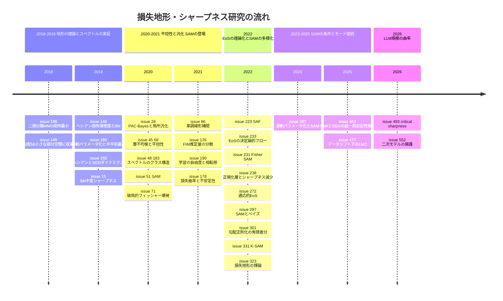

# 損失地形・シャープネス・SAM・ヘシアン/フィッシャースペクトル・Edge of Stability サーベイ

> 本稿は [Hiroki11x/Papers](https://github.com/Hiroki11x/Papers/issues) の論文読みノート（GitHub issues）のうち、損失地形・シャープネス関連（トピック M03）を primary とする **31件の issue** を再構成したものである。重複登録が2組あり（[#45](https://github.com/Hiroki11x/Papers/issues/45)=[#69](https://github.com/Hiroki11x/Papers/issues/69)、[#48](https://github.com/Hiroki11x/Papers/issues/48)=[#183](https://github.com/Hiroki11x/Papers/issues/183)）、ユニーク論文は29本。
> - 論文の公開期間: 2018年2月（二値分類NNの損失地形）〜 2026年7月（A Defense of the Quadratic Model）
> - issue 登録期間: 2020年5月22日 〜 2026年9月8日
> - 記述はノート（issue 本文・コメント）に基づく。数値はノートに記載されたものだけを引用している。
> - 関連文書: SGD のダイナミクス・ノイズ構造は [SGD のダイナミクスと最適化理論](./06_sgd_dynamics_theory.md)、バッチサイズと SGD ノイズスケールは [クリティカルバッチサイズ](../practical_optimization/01_critical_batch_size.md) を参照。

## 概要

ノート群が追っている問いは、おおむね次の5つにまとめられる。

1. **損失地形はどんな形をしているのか**: 局所最小はどれも「良い」のか、過剰パラメータ化で最小点・鞍点はどう埋め込まれるのか、初期値と解を結ぶ直線上で損失は単調に下がるのか。
2. **ヘシアン/フィッシャーのスペクトルには何が現れるのか**: 少数の外れ値固有値（クラス数程度）とバルクという構造はどこから来て、勾配や最適化速度とどう関わるのか。
3. **平坦性（フラットミニマ）は汎化を説明できるのか**: スケール不変性（BN など）の下でシャープネスをどう定義すれば意味を持つのか、学習初期の曲率が最終的な汎化を決めるのか。
4. **シャープネスを直接最小化する（SAM）と何が起きるのか**: なぜ効くのか（ベイズ・勾配正則化・線形安定性・過剰パラメータ化）、2倍の計算コストをどう削るか。
5. **大きな学習率の GD/Adam は曲率をどう自己調整するのか（Edge of Stability）**: シャープネスが $2/\eta$ 付近で止まる現象のメカニズム、適応的手法との違い、LLM 規模での曲率の測り方と二次モデルの妥当性。

## 目次

1. [背景と基本概念](#1-背景と基本概念)
2. [研究の系譜・時系列](#2-研究の系譜時系列)
3. [タイムライン図](#3-タイムライン図)
4. [サブトピック別の整理](#4-サブトピック別の整理)
5. [論文一覧表（公開順）](#5-論文一覧表公開順)
6. [採択先別の集計](#6-採択先別の集計)
7. [各論文の詳細まとめ](#7-各論文の詳細まとめ)
8. [横断的な知見・未解決問題](#8-横断的な知見未解決問題)
9. [関連論文](#9-関連論文)

---

## 1. 背景と基本概念

### 1.1 シャープネスとフラットミニマ

学習損失を $L(\theta)$、ヘシアンを $H(\theta)=\nabla^2 L(\theta)$ とする。ノートで「シャープネス」というときは、多くの場合ヘシアンの最大固有値 $\lambda_{\max}(H)$ を指す（[#233](https://github.com/Hiroki11x/Papers/issues/233) の定義）。ほかにヘシアンのトレース、PAC-Bayes 的な「摂動を加えたときの損失の増え方」なども使われる。

「平坦な最小値ほど汎化が良い」というのが長年の信念であり（[#238](https://github.com/Hiroki11x/Papers/issues/238) の言い方）、本トピックの多くの論文はこれを前提に、平坦性の正しい測り方・平坦な解へ導く仕組み・平坦性を明示的に求める手法を扱う。

**スケール不変性の問題**: BatchNorm などの正規化層があると、重みを定数倍しても出力が変わらない一方でヘシアンの値はスケールに応じて変わる。そのため素朴なシャープネスは汎化の指標として意味を失う。BN 不変なシャープネス（[#15](https://github.com/Hiroki11x/Papers/issues/15)）、スケール不変なヘシアンベース汎化境界（[#150](https://github.com/Hiroki11x/Papers/issues/150)）、スケール不変性を考慮したシャープネスの定義（[#238](https://github.com/Hiroki11x/Papers/issues/238)）はこの問題への対処である。

### 1.2 ヘシアンとフィッシャー情報行列（FIM）のスペクトル

分類モデル $p_\theta(y\mid x)$ のフィッシャー情報行列は

$$
F(\theta) = \mathbb{E}_{x}\,\mathbb{E}_{y\sim p_\theta(\cdot\mid x)}\big[\nabla_\theta \log p_\theta(y\mid x)\,\nabla_\theta \log p_\theta(y\mid x)^\top\big]
= -\,\mathbb{E}_{x}\,\mathbb{E}_{y\sim p_\theta}\big[\nabla^2_\theta \log p_\theta(y\mid x)\big]
$$

と、勾配の外積による表現と対数尤度のヘシアンによる表現の2通りに書ける。実際には経験サンプルから推定するしかなく、2つの表現に基づく推定量の分散が [#135](https://github.com/Hiroki11x/Papers/issues/135) の主題である。

深層分類器のヘシアン/FIM の固有値分布には、連続的な「バルク（bulk）」と、その外側に孤立した少数の「外れ値（スパイク）」や小さな塊（「バンプ」）が現れることが繰り返し報告されている。外れ値の数はおおむねクラス数に一致し（[#149](https://github.com/Hiroki11x/Papers/issues/149)）、その起源はクラス/クラス間構造にある（[#48](https://github.com/Hiroki11x/Papers/issues/48)）。

### 1.3 SAM（Sharpness-Aware Minimization）

SAM（[#51](https://github.com/Hiroki11x/Papers/issues/51)）は、パラメータ $\theta$ を中心とした半径 $\rho$ の球内での最悪損失を最小化する min-max 問題

$$
\min_\theta \; \max_{\|\epsilon\|_2\le \rho} L(\theta+\epsilon)
$$

を解く。実装上は「上昇ステップ（$\epsilon$ を勾配方向に取る）」と「下降ステップ（$\theta+\epsilon$ での勾配で $\theta$ を更新）」の2回の勾配計算が必要で、ベースのオプティマイザの約2倍のコストがかかる（[#223](https://github.com/Hiroki11x/Papers/issues/223), [#331](https://github.com/Hiroki11x/Papers/issues/331)）。派生として、球を FIM による楕円に置き換える Fisher SAM（[#231](https://github.com/Hiroki11x/Papers/issues/231)）、ベイズ目的の緩和として解釈する bSAM（[#297](https://github.com/Hiroki11x/Papers/issues/297)）などがある。

**勾配正則化（GR）**: 勾配ノルム $\|\nabla L(\theta)\|^2$ をペナルティとして加える手法。上昇・下降ステップの有限差分で効率よく計算でき、SAM や Flooding と近い関係にある（[#301](https://github.com/Hiroki11x/Papers/issues/301)）。

### 1.4 線形安定性と Edge of Stability（EoS）

二次関数 $L(\theta)=\tfrac12\theta^\top H\theta$ に学習率 $\eta$ の GD を適用すると、各固有方向で $\theta_i \leftarrow (1-\eta\lambda_i)\theta_i$ となり、発散しないための条件は

$$
\lambda_{\max}(H) \le \frac{2}{\eta}
$$

である。Cohen ら（2021）は、フルバッチ GD で深層ネットを学習するとシャープネスが上昇して $2/\eta$ 付近で止まり、損失は反復ごとに上下しながらも全体として減少し続ける段階があることを報告し、これを **Edge of Stability（EoS）** と呼んだ（[#233](https://github.com/Hiroki11x/Papers/issues/233) のノートによる紹介）。Adam 等の適応的手法では「前処理されたヘシアン」の最大固有値が同様の閾値で均衡し、$\beta_1=0.9$ の Adam ではその値が $38/\eta$ になる（[#272](https://github.com/Hiroki11x/Papers/issues/272)）。

同じ線形安定性の考え方は SGD/SAM にも拡張され、「どの最小点に安定して留まれるか」でミニマ選択を説明する（[#387](https://github.com/Hiroki11x/Papers/issues/387), [#463](https://github.com/Hiroki11x/Papers/issues/463)、SGD 側は [06_sgd_dynamics_theory.md](./06_sgd_dynamics_theory.md) の動的安定性の節を参照）。

**方向的シャープネス**: 更新方向 $d$ に沿った曲率 $d^\top H d/\|d\|^2$。[#493](https://github.com/Hiroki11x/Papers/issues/493) の critical sharpness は「任意のシャープネスではなく更新方向に影響するシャープネス」を測る指標で、勾配がヘシアンの最大固有ベクトルと揃っているときは方向的シャープネスと一致する。

### 1.5 モード接続と単調線形補間

- **単調線形補間（MLI）**: 初期値 $\theta_0$ と学習後の $\theta_T$ を結ぶ直線 $\theta(\alpha)=(1-\alpha)\theta_0+\alpha\theta_T$ に沿って損失が単調に減少する性質（Goodfellow ら 2014 が最初に観察。[#86](https://github.com/Hiroki11x/Papers/issues/86)）。
- **線形モード接続（LMC）**: 2つの学習済みモデルが低損失の直線経路で結ばれる現象。経路上の損失の最大値と端点の平均損失の差（loss barrier）で測る（[#477](https://github.com/Hiroki11x/Papers/issues/477)）。LMC は SGD ノイズスケール $g=\epsilon(N/B-1)$（$\epsilon$ は学習率、$N$ はデータ数、$B$ はバッチサイズ）に左右される。このノイズスケールについては [クリティカルバッチサイズ](../practical_optimization/01_critical_batch_size.md) の「SGD のノイズスケールと SDE 近似」も参照。

---

## 2. 研究の系譜・時系列

### 2.1 2018–2019: 損失地形の理論とヘシアンスペクトルの実証

この時期のノートは、「局所最小はどれも良いのか」という地形の大域的な問いと、ヘシアンスペクトルを実際に測る研究が中心である。

- **地形の理論**: [#188](https://github.com/Hiroki11x/Papers/issues/188)（ICML 2018）は、「すべての局所最小が同程度の性能を持つから学習が成功する」という広く流布した推測に対し、2値分類の単層 NN で「ニューロンが厳密凸かつ平滑化ヒンジ損失」なら全局所最小で訓練誤差ゼロになる条件を与え、2乗損失・ロジスティック損失では成り立たない反例を示した。[#189](https://github.com/Hiroki11x/Papers/issues/189)（NeurIPS 2019）は狭いネットを広いネットに埋め込む3つの方法を考え、滑らかな活性化ではユニット複製が最小点を鞍点にし、ReLU では不活性ユニットで最小点が「半平坦な最小点」として埋め込まれることを示し、平坦性（PAC-Bayes 境界）による汎化の差に結びつけた。
- **ヘシアンスペクトルの実証**: [#149](https://github.com/Hiroki11x/Papers/issues/149) は、短い学習の後、勾配がヘシアンの上位固有ベクトル（クラス数個）が張る小さな部分空間に収束し、その部分空間が長く保存されることを示した。[#148](https://github.com/Hiroki11x/Papers/issues/148)（ICML 2019）は ImageNet 規模でヘシアンスペクトル全体を推定するツールを作り、BN なしのネットでは大きな孤立固有値が急速に現れて勾配がその固有空間に集中するが、BN ありではほぼ見られないことを示した。[#150](https://github.com/Hiroki11x/Papers/issues/150) はヘシアンと確率的勾配の2次モーメントの関係を調べ、上位固有方向は学習を通じて揃っているが中間の固有方向はずれていくことを観察した。
- **スケール不変なシャープネス**: [#15](https://github.com/Hiroki11x/Papers/issues/15)（IJCAI 2019）は BN 不変なシャープネスを定義して正則化に用いた。[#150](https://github.com/Hiroki11x/Papers/issues/150) のスケール不変な汎化境界と同じく、「素朴なシャープネスはスケールで変わる」という問題意識を共有している。

### 2.2 2020–2021: シャープネスと汎化、SAM の登場、学習初期の曲率

2020年に入ると、平坦性と汎化の関係を指標や正則化として使う研究が増え、2020年10月の SAM（[#51](https://github.com/Hiroki11x/Papers/issues/51)）で「シャープネスを直接最小化する」路線が確立する。

- **平坦性と汎化の指標化**: [#28](https://github.com/Hiroki11x/Papers/issues/28)（AISTATS 2020）は PAC-Bayes の枠組みで、汎化能力がヘシアン、ヘシアンのリプシッツ定数（高次の平滑性）、パラメータのスケールで特徴づけられることを示し、指標と摂動付き最適化アルゴリズムを提案した。[#45](https://github.com/Hiroki11x/Papers/issues/45)/[#69](https://github.com/Hiroki11x/Papers/issues/69)（NeurIPS 2020 OPT Workshop, LARS の著者 Ginsburg）は深層線形ネットで「層不均衡」を平坦性の指標とし、学習が「最適化フェーズ（損失が減って最小多様体へ向かう）」と「正則化フェーズ（層不均衡が減り多様体に沿って平坦領域へ動く）」に分かれ、重み減衰・ノイズ拡張・SGD が同じように働くことを示した。
- **SAM**: [#51](https://github.com/Hiroki11x/Papers/issues/51)（ICLR 2021）は汎化境界を示したうえで損失値とシャープネスを同時に最小化し、CIFAR・ImageNet・ファインチューニングで汎化を改善、ラベルノイズへの頑健性も示した。以後の SAM 系研究（2.3 節以降）の出発点。
- **スペクトルの起源**: [#48](https://github.com/Hiroki11x/Papers/issues/48)/[#183](https://github.com/Hiroki11x/Papers/issues/183)（JMLR）は、[#149](https://github.com/Hiroki11x/Papers/issues/149)・[#148](https://github.com/Hiroki11x/Papers/issues/148) などの先行研究で報告されてきた外れ値（スパイク）や、メインバルクの外側の小さな塊（バンプ）の起源をクラス/クラス間構造として説明し、FIM の外れ値とバルクの比が誤分類を予測すること、K-FAC の補正などを示した。
- **学習初期の曲率が汎化を決める**: [#71](https://github.com/Hiroki11x/Papers/issues/71)（ICML 2021）は、SGD が学習初期から FIM のトレースを暗黙にペナルティ化しており、正則化がないとトレースが急増する（破局的フィッシャー爆発）ことを示した。FIM トレースの明示的正則化で汎化が大きく改善し、初期のトレース値は最終的な汎化と強く相関する。[#178](https://github.com/Hiroki11x/Papers/issues/178)（ICLR 2022）は曲率の観点から学習の不安定性を扱い、成功する設定では初期軌道が高曲率領域を避けて大きな学習率を許す平坦領域へ向かうこと、ウォームアップが BN/LN/MetaInit/GradInit/Fixup と同様に安定性を改善することを示した。どちらも「最初の数ステップの曲率の動き」を重視する点で共通する。
- **FIM の推定**: [#135](https://github.com/Hiroki11x/Papers/issues/135)（NeurIPS 2021）は FIM の2つの表現に基づく不偏推定量の分散を閉形式で与えた（ノートでは貢献に懐疑的）。
- **地形の大域的性質**: [#86](https://github.com/Hiroki11x/Papers/issues/86)（ICML 2021）は MLI の十分条件を MSE の下で与え、初期値から遠く動かすと MLI が破れることを示した。[#190](https://github.com/Hiroki11x/Papers/issues/190)（ICLR 2022）はランダム部分空間での学習成功確率が訓練次元の閾値で 0 から 1 へ相転移することを示し、Gordon の脱出定理で「低損失サブレベル集合のガウス幅が大きい」ことから説明した。[#149](https://github.com/Hiroki11x/Papers/issues/149) の「学習は小さな部分空間で起きる」という観察を、地形の高次元幾何から捉え直した研究と読める。

### 2.3 2022: Edge of Stability の理論化と SAM の多様化

2022年はノートの件数が最も多い年で、2つの流れが並行する。

- **EoS の理論**: Princeton の Arora グループが2本を出している。[#233](https://github.com/Hiroki11x/Papers/issues/233)（ICML 2022）は、EoS 段階の GD が損失最小多様体上で $\lambda_{\max}$ を減少させる決定論的フローに沿って進むことを、正規化 GD と $\sqrt{L}$ 型損失で証明した。暗黙のバイアスの従来結果が無限小の更新や勾配ノイズに依存していたのとは対照的に、有限学習率の GD そのものがシャープネスを下げる。[#238](https://github.com/Hiroki11x/Papers/issues/238)（NeurIPS 2022）はこれを正規化層＋重み減衰のネットに広げ、有限学習率 GD が EoS に入りシャープネス減少フローに従うことで正規化の汎化効果を説明した。[#15](https://github.com/Hiroki11x/Papers/issues/15) 以来のスケール不変性の問題に、ダイナミクスの側から答えた形である。
- **適応的手法の EoS**: [#272](https://github.com/Hiroki11x/Papers/issues/272)（Cohen ら, Google）は Adam 等で前処理付きヘシアンの最大固有値が安定閾値（$\beta_1=0.9$ で $38/\eta$）で均衡する「適応的 EoS（AEoS）」を報告した。非適応手法は EoS で高曲率領域に入るのを阻まれるのに対し、適応的手法は前処理を適応させながら高曲率領域へ進み続ける点が大きく異なる。[#233](https://github.com/Hiroki11x/Papers/issues/233)/[#238](https://github.com/Hiroki11x/Papers/issues/238) の「EoS がシャープネスを下げる」という描像が、適応的手法ではそのまま成り立たないことを示している。
- **SAM の効率化**: SAM の2倍コストに対し、[#223](https://github.com/Hiroki11x/Papers/issues/223)（SAF, NeurIPS 2022）は現在と過去の重みでの出力間の KL ダイバージェンス（軌跡損失）をシャープネスの代わりに使い、追加コストほぼゼロを実現した。[#331](https://github.com/Hiroki11x/Papers/issues/331)（K-SAM）は上昇・下降の両ステップで損失上位 $k$ 個のサンプルだけ勾配を計算する。
- **SAM の再解釈・一般化**: [#231](https://github.com/Hiroki11x/Papers/issues/231)（Fisher SAM, ICML 2022）は近傍をユークリッド球から FIM 楕円へ置き換え、Adaptive SAM のパラメータ依存スケーリングは近傍構造を壊しうると批判した。[#297](https://github.com/Hiroki11x/Papers/issues/297)（ICLR 2023）は SAM を Fenchel 双共役による期待損失の最適凸下界を用いたベイズ目的の緩和とみなし、不確実性推定ができる bSAM を導いた。[#301](https://github.com/Hiroki11x/Papers/issues/301)（ICML 2023）は勾配正則化の有限差分計算を提案し、SAM・Flooding と同じ「上昇・下降」型アルゴリズムの族であることを示した。
- **博士論文**: [#323](https://github.com/Hiroki11x/Papers/issues/323)（ETH）は継続学習の正則化手法の統一や、K-FAC が2次法ではないという経験的証拠を含む損失地形の博論。

### 2.4 2023–2025: SAM の「いつ・なぜ効くか」とモード接続

SAM 系の問いは「どう速くするか」から「どんな条件で効くのか」に移る。

- [#387](https://github.com/Hiroki11x/Papers/issues/387)（2023-11 公開, UAI 2025）は、SAM の改善幅が過剰パラメータ化とともに大きくなることを8タスクで示し、解空間の拡大と暗黙バイアスの強化という2つの要因を線形安定性解析・収束解析で裏付けた。最適な $\rho$ がモデルサイズとともに大きくなる点も報告している。
- [#463](https://github.com/Hiroki11x/Papers/issues/463)（NeurIPS 2025）はデータコヒーレンス行列を導入した線形安定性解析で SGD と SAM を統一的に扱い、「平坦性選好」と「単純性バイアス」を安定性の観点から同一視した。SGD は高コヒーレンスな単純解を安定に選び、SAM はその傾向を強める。[#387](https://github.com/Hiroki11x/Papers/issues/387) と同じく「SAM が留まれる最小点は SGD より厳しい条件を満たす」という線形安定性の論法である。
- [#477](https://github.com/Hiroki11x/Papers/issues/477) はデータシフト下の LMC を学習率・バッチサイズ（SGD ノイズスケール）の観点で実験的に調べ、LMC は訓練を安定化する一方でアンサンブルの多様性を損なうことを示した。[#86](https://github.com/Hiroki11x/Papers/issues/86) の MLI と同じく「直線経路上の損失」で地形を調べる系譜にある。

### 2.5 2026: LLM 規模の曲率測定と二次モデルの再評価

最新のノートは、これまでの曲率解析を LLM 事前学習に持ち込む研究である。

- [#493](https://github.com/Hiroki11x/Papers/issues/493) は更新方向に沿った曲率である critical sharpness を、スケーラブルな曲率指標として導入した。OLMo の学習では critical sharpness が学習とともに増加していく。ノートは、Revisiting CBS（OLMo）と同様に「候補をいくつか試して良いものを選ぶ」方針に見えると評している（[クリティカルバッチサイズ](../practical_optimization/01_critical_batch_size.md) を参照）。
- [#552](https://github.com/Hiroki11x/Papers/issues/552) は最も単純な最適化モデルである二次モデルをストレステストし、150M パラメータ・3B トークンの LLM 学習で、中間チェックポイントでの2次テイラー展開が学習の最大10%の区間の最適化ダイナミクスを正確に予測することを示した。そのうえでヘシアンスペクトルと局所安定性を分析している。[#233](https://github.com/Hiroki11x/Papers/issues/233) が EoS を「非平滑な地形上での最小多様体に沿ったフロー」として説明したのに対し、局所的には二次モデルで十分という立場であり、両者の守備範囲の関係は未解決の論点である（8節）。

---

## 3. タイムライン図

---

## 4. サブトピック別の整理

### A. 損失地形の幾何（局所最小・埋め込み・補間・自由度）

**要点**: 「局所最小はどれも良い」は損失関数・活性化に依存する条件付きの主張であり（[#188](https://github.com/Hiroki11x/Papers/issues/188)）、過剰パラメータ化は最小点を鞍点や半平坦な最小点として埋め込む（[#189](https://github.com/Hiroki11x/Papers/issues/189)）。地形の大域構造は、初期値と解を結ぶ直線（MLI）、解どうしを結ぶ直線（LMC）、ランダム部分空間への制限（自由度）といった低次元の切り口で調べられている。

- [#188](https://github.com/Hiroki11x/Papers/issues/188) 2値分類 NN の局所最小で訓練誤差ゼロとなる条件
- [#189](https://github.com/Hiroki11x/Papers/issues/189) 過剰パラメータ化への埋め込みと半平坦な最小点・鞍点
- [#86](https://github.com/Hiroki11x/Papers/issues/86) 単調線形補間（MLI）の十分条件と破れ
- [#190](https://github.com/Hiroki11x/Papers/issues/190) ランダム部分空間での学習成功の相転移とガウス幅
- [#477](https://github.com/Hiroki11x/Papers/issues/477) データシフト下の線形モード接続とアンサンブル多様性
- [#323](https://github.com/Hiroki11x/Papers/issues/323) 損失地形の経験的理解（博論）

### B. ヘシアン/フィッシャーのスペクトル構造

**要点**: スペクトルは「バルク＋クラス数程度の外れ値」という構造を持ち、勾配はその外れ値の固有空間に集中する（[#149](https://github.com/Hiroki11x/Papers/issues/149), [#148](https://github.com/Hiroki11x/Papers/issues/148)）。この構造の起源はクラス/クラス間構造であり（[#48](https://github.com/Hiroki11x/Papers/issues/48)/[#183](https://github.com/Hiroki11x/Papers/issues/183)）、BN を入れると外れ値と勾配の集中がほぼ消える（[#148](https://github.com/Hiroki11x/Papers/issues/148)）。FIM は推定するしかなく、推定量の分散も研究対象になる（[#135](https://github.com/Hiroki11x/Papers/issues/135)）。

- [#149](https://github.com/Hiroki11x/Papers/issues/149) 勾配はヘシアン上位固有空間に収束する
- [#148](https://github.com/Hiroki11x/Papers/issues/148) ImageNet 規模のヘシアン固有値密度と BN
- [#150](https://github.com/Hiroki11x/Papers/issues/150) ヘシアンと確率的勾配の2次モーメント、固有方向の揃い方
- [#48](https://github.com/Hiroki11x/Papers/issues/48) / [#183](https://github.com/Hiroki11x/Papers/issues/183) スペクトルのクラス/クラス間構造（重複登録）
- [#135](https://github.com/Hiroki11x/Papers/issues/135) FIM 推定量の分散

### C. シャープネスと汎化（指標・暗黙の正則化・学習初期）

**要点**: 平坦性を汎化の指標にするにはスケール不変性への配慮が要る（[#15](https://github.com/Hiroki11x/Papers/issues/15), [#28](https://github.com/Hiroki11x/Papers/issues/28)）。SGD・重み減衰・ノイズ拡張は、いずれも平坦な領域へ導く暗黙の正則化として働き（[#45](https://github.com/Hiroki11x/Papers/issues/45)/[#69](https://github.com/Hiroki11x/Papers/issues/69)）、その効果は学習初期の FIM トレースに既に現れる（[#71](https://github.com/Hiroki11x/Papers/issues/71)）。

- [#15](https://github.com/Hiroki11x/Papers/issues/15) BN 不変シャープネスによる正則化
- [#28](https://github.com/Hiroki11x/Papers/issues/28) PAC-Bayes による局所汎化能力の評価
- [#45](https://github.com/Hiroki11x/Papers/issues/45) / [#69](https://github.com/Hiroki11x/Papers/issues/69) 層不均衡と平坦な最小（重複登録）
- [#71](https://github.com/Hiroki11x/Papers/issues/71) 破局的フィッシャー爆発

### D. SAM とその派生・理論

**要点**: SAM（[#51](https://github.com/Hiroki11x/Papers/issues/51)）の研究は、(1) コスト削減（[#223](https://github.com/Hiroki11x/Papers/issues/223), [#331](https://github.com/Hiroki11x/Papers/issues/331)）、(2) 近傍の幾何の見直し（[#231](https://github.com/Hiroki11x/Papers/issues/231)）、(3) 別の枠組みからの再解釈（ベイズ [#297](https://github.com/Hiroki11x/Papers/issues/297)、勾配正則化 [#301](https://github.com/Hiroki11x/Papers/issues/301)）、(4) 効く条件の理論（過剰パラメータ化 [#387](https://github.com/Hiroki11x/Papers/issues/387)、線形安定性と単純性バイアス [#463](https://github.com/Hiroki11x/Papers/issues/463)）の4方向に分かれる。

- [#51](https://github.com/Hiroki11x/Papers/issues/51) SAM
- [#223](https://github.com/Hiroki11x/Papers/issues/223) SAF（軌跡損失による追加コストほぼゼロの SAM）
- [#331](https://github.com/Hiroki11x/Papers/issues/331) K-SAM（損失上位 $k$ サンプルのみ）
- [#231](https://github.com/Hiroki11x/Papers/issues/231) Fisher SAM（FIM 楕円近傍）
- [#297](https://github.com/Hiroki11x/Papers/issues/297) SAM はベイズの最適緩和（bSAM）
- [#301](https://github.com/Hiroki11x/Papers/issues/301) 勾配正則化の有限差分計算と SAM/Flooding
- [#387](https://github.com/Hiroki11x/Papers/issues/387) 過剰パラメータ化が SAM の効果を決める
- [#463](https://github.com/Hiroki11x/Papers/issues/463) SAM と SGD の統一的線形安定性解析

### E. Edge of Stability・曲率と学習の安定性

**要点**: 学習率が曲率の上限を決め（$\lambda_{\max}\lesssim 2/\eta$）、成功する学習は初期に高曲率領域を避ける（[#178](https://github.com/Hiroki11x/Papers/issues/178)）。EoS の GD は最小多様体上でシャープネスを下げるフローに従うが（[#233](https://github.com/Hiroki11x/Papers/issues/233), [#238](https://github.com/Hiroki11x/Papers/issues/238)）、適応的手法は前処理付きの閾値で均衡しつつ高曲率領域へ進む（[#272](https://github.com/Hiroki11x/Papers/issues/272)）。LLM では更新方向の曲率（[#493](https://github.com/Hiroki11x/Papers/issues/493)）と局所二次モデル（[#552](https://github.com/Hiroki11x/Papers/issues/552)）が新しい道具になっている。

- [#178](https://github.com/Hiroki11x/Papers/issues/178) 損失曲率から見た学習の不安定性とウォームアップ
- [#233](https://github.com/Hiroki11x/Papers/issues/233) EoS の GD は $\lambda_{\max}$ を下げるフローに従う
- [#238](https://github.com/Hiroki11x/Papers/issues/238) 正規化層＋重み減衰と EoS によるシャープネス減少
- [#272](https://github.com/Hiroki11x/Papers/issues/272) 適応的勾配法の EoS（AEoS）
- [#493](https://github.com/Hiroki11x/Papers/issues/493) critical sharpness による LLM 学習の曲率測定
- [#552](https://github.com/Hiroki11x/Papers/issues/552) 二次モデルによる LLM 最適化ダイナミクスの予測

---

## 5. 論文一覧表（公開順）

（records から Python スクリプトで生成）

| 公開 | 論文 | 著者/組織 | 採択先 | 根拠 | サブトピック |
|---|---|---|---|---|---|
| 2018-02 | [#188](https://github.com/Hiroki11x/Papers/issues/188) Understanding the Loss Surface of Neural Networks for Binary Classification | Shiyu Liang, Ruoyu Sun, Yixuan Li, R. Srikant（UIUC） | ICML 2018 | issue記載 | 損失地形の理論 |
| 2018-12 | [#149](https://github.com/Hiroki11x/Papers/issues/149) Gradient Descent Happens in a Tiny Subspace | Guy Gur-Ari, Daniel A. Roberts, Ethan Dyer（IAS Princeton / Facebook AI Research / Johns Hopkins University） | arXiv（プレプリント） | 不明 | ヘシアンと勾配部分空間 |
| 2019-01 | [#148](https://github.com/Hiroki11x/Papers/issues/148) An Investigation into Neural Net Optimization via Hessian Eigenvalue Density | Behrooz Ghorbani, Shankar Krishnan, Ying Xiao（Google） | ICML 2019 | Semantic Scholar確認 | ヘシアンスペクトル解析 |
| 2019-06 | [#189](https://github.com/Hiroki11x/Papers/issues/189) Semi-flat minima and saddle points by embedding neural networks to overparameterization | Kenji Fukumizu, Shoichiro Yamaguchi, Yoh-ichi Mototake, Mirai Tanaka（統計数理研究所 / PFN） | NeurIPS 2019 | issue記載 | 過剰パラメータ化と損失地形 |
| 2019-07 | [#150](https://github.com/Hiroki11x/Papers/issues/150) Hessian based analysis of SGD for Deep Nets: Dynamics and Generalization | Xinyan Li, Qilong Gu, Yingxue Zhou, et al.（University of Minnesota） | SDM 2020 | Web確認 | ヘシアンとSGDダイナミクス |
| 2019-08 | [#15](https://github.com/Hiroki11x/Papers/issues/15) BN-invariant Sharpness Regularizes the Training Model to Better Generalization | Mingyang Yi, Qi Meng, Wei Chen, et al.（Microsoft Research Asia） | IJCAI 2019 | issue記載 | 汎化とシャープネス（BN不変） |
| 2020-06 | [#28](https://github.com/Hiroki11x/Papers/issues/28) Assessing Local Generalization Capability in Deep Models | Huan Wang, Nitish Shirish Keskar, Caiming Xiong, et al.（Salesforce Research） | AISTATS 2020 | issue記載 | 汎化とシャープネス（PAC-Bayes） |
| 2020-07 | [#45](https://github.com/Hiroki11x/Papers/issues/45) On regularization of gradient descent, layer imbalance and flat minima | Boris Ginsburg（NVIDIA） | NeurIPS 2020 Workshop (OPT) | Web確認 | 汎化とシャープネス（層不均衡） |
| 2020-07 | [#69](https://github.com/Hiroki11x/Papers/issues/69) On regularization of gradient descent, layer imbalance and flat minima | Boris Ginsburg（NVIDIA） | NeurIPS 2020 Workshop (OPT) | issue記載 | 汎化とシャープネス（層不均衡） |
| 2020-08 | [#48](https://github.com/Hiroki11x/Papers/issues/48) Traces of Class/Cross-Class Structure Pervade Deep Learning Spectra | Vardan Papyan（Stanford University） | JMLR | Web確認 | ヘシアン/フィッシャーのスペクトル構造 |
| 2020-08 | [#183](https://github.com/Hiroki11x/Papers/issues/183) Traces of Class/Cross-Class Structure Pervade Deep Learning Spectra | Vardan Papyan（Stanford University） | JMLR | Web確認 | ヘシアン/FIMスペクトル構造 |
| 2020-10 | [#51](https://github.com/Hiroki11x/Papers/issues/51) Sharpness-Aware Minimization for Efficiently Improving Generalization | Pierre Foret, Ariel Kleiner, Hossein Mobahi, et al.（Google Research） | ICLR 2021 | Semantic Scholar確認 | 汎化とシャープネス（SAM） |
| 2020-12 | [#71](https://github.com/Hiroki11x/Papers/issues/71) Catastrophic Fisher Explosion: Early Phase Fisher Matrix Impacts Generalization | Stanislaw Jastrzebski, Devansh Arpit, Oliver Astrand, et al.（NYU / Salesforce / Mila） | ICML 2021 | Semantic Scholar確認 | 学習初期のフィッシャーと汎化 |
| 2021-04 | [#86](https://github.com/Hiroki11x/Papers/issues/86) Analyzing Monotonic Linear Interpolation in Neural Network Loss Landscapes | James Lucas, Juhan Bae, Michael R. Zhang, et al.（University of Toronto / Vector Institute） | ICML 2021 | Web確認 | 損失地形（単調線形補間） |
| 2021-07 | [#135](https://github.com/Hiroki11x/Papers/issues/135) On the Variance of the Fisher Information for Deep Learning | Alexander Soen, Ke Sun（ANU / CSIRO Data61） | NeurIPS 2021 | arXivコメント | フィッシャー情報行列の推定 |
| 2021-07 | [#190](https://github.com/Hiroki11x/Papers/issues/190) How many degrees of freedom do we need to train deep networks: a loss landscape perspective | Brett W. Larsen, Stanislav Fort, Nic Becker, Surya Ganguli（Stanford） | ICLR 2022 | issue記載 | 学習の自由度と損失地形 |
| 2021-10 | [#178](https://github.com/Hiroki11x/Papers/issues/178) A Loss Curvature Perspective on Training Instability in Deep Learning | Justin Gilmer, Behrooz Ghorbani, Ankush Garg, et al.（Google） | ICLR 2022 | Web確認 | 損失曲率と学習の不安定性 |
| 2022-05 | [#223](https://github.com/Hiroki11x/Papers/issues/223) Sharpness-Aware Training for Free | Jiawei Du, Daquan Zhou, Jiashi Feng, et al.（A*STAR / NUS） | NeurIPS 2022 | Semantic Scholar確認 | SAMの効率化 |
| 2022-05 | [#233](https://github.com/Hiroki11x/Papers/issues/233) Understanding Gradient Descent on Edge of Stability in Deep Learning | Sanjeev Arora, Zhiyuan Li, Abhishek Panigrahi（Princeton） | ICML 2022 | arXivコメント | Edge of Stability |
| 2022-06 | [#231](https://github.com/Hiroki11x/Papers/issues/231) Fisher SAM: Information Geometry and Sharpness Aware Minimisation | Minyoung Kim, Da Li, Shell Xu Hu, Timothy M. Hospedales（Samsung AI Center） | ICML 2022 | issue記載 | 汎化とシャープネス |
| 2022-06 | [#238](https://github.com/Hiroki11x/Papers/issues/238) Understanding the Generalization Benefit of Normalization Layers: Sharpness Reduction | Kaifeng Lyu, Zhiyuan Li, Sanjeev Arora（Princeton） | NeurIPS 2022 | arXivコメント | 正規化層とシャープネス |
| 2022-07 | [#272](https://github.com/Hiroki11x/Papers/issues/272) Adaptive Gradient Methods at the Edge of Stability | Jeremy M. Cohen, Behrooz Ghorbani, Shankar Krishnan, et al.（Google） | arXiv（プレプリント） | 不明 | Edge of Stability |
| 2022-10 | [#297](https://github.com/Hiroki11x/Papers/issues/297) SAM as an Optimal Relaxation of Bayes | Thomas Möllenhoff, Mohammad Emtiyaz Khan（RIKEN AIP） | ICLR 2023 | arXivコメント | SAMとベイズ |
| 2022-10 | [#301](https://github.com/Hiroki11x/Papers/issues/301) Understanding Gradient Regularization in Deep Learning: Efficient Finite-Difference Computation and Implicit Bias | Ryo Karakida, Tomoumi Takase, Tomohiro Hayase, Kazuki Osawa（AIST） | ICML 2023 | Semantic Scholar確認 | 勾配正則化と暗黙のバイアス |
| 2022-10 | [#331](https://github.com/Hiroki11x/Papers/issues/331) K-SAM: Sharpness-Aware Minimization at the Speed of SGD | Renkun Ni, Ping-yeh Chiang, Jonas Geiping, et al. (Tom Goldstein)（University of Maryland / NYU） | arXiv（プレプリント） | 不明 | SAMの高速化 |
| 2022-11 | [#323](https://github.com/Hiroki11x/Papers/issues/323) Towards an Empirically Guided Understanding of the Loss Landscape of Neural Networks | Frederik Benzing（ETH Zurich） | PhD Thesis (ETH Zurich) | issue記載 | 損失地形と最適化（博論） |
| 2023-11 | [#387](https://github.com/Hiroki11x/Papers/issues/387) Critical Influence of Overparameterization on Sharpness-aware Minimization | Sungbin Shin, Dongyeop Lee, Maksym Andriushchenko, Namhoon Lee（POSTECH / EPFL） | UAI 2025 | arXivコメント | 汎化とシャープネス（SAM） |
| 2025-09 | [#463](https://github.com/Hiroki11x/Papers/issues/463) A Unified Stability Analysis of SAM vs SGD: Role of Data Coherence and Emergence of Simplicity Bias | Wei-Kai Chang, Rajiv Khanna（Purdue University） | NeurIPS 2025 | Web確認 | 汎化とシャープネス（線形安定性） |
| 2025-11 | [#477](https://github.com/Hiroki11x/Papers/issues/477) Linear Mode Connectivity under Data Shifts for Deep Ensembles of Image Classifiers | C. Hepburn, T. Zielke, A. P. Raulf | arXiv（プレプリント） | 不明 | 線形モード接続とデータシフト |
| 2026-01 | [#493](https://github.com/Hiroki11x/Papers/issues/493) A Scalable Measure of Loss Landscape Curvature for Analyzing the Training Dynamics of LLMs | Dayal Singh Kalra, Jean-Christophe Gagnon-Audet, Andrey Gromov, et al. | arXiv（プレプリント） | 不明 | 損失地形の曲率測定（critical sharpness） |
| 2026-07 | [#552](https://github.com/Hiroki11x/Papers/issues/552) A Defense of the Quadratic Model | Alexandru Meterez, Pranav Ajit Nair, Depen Morwani, et al.（Harvard (Kempner)） | arXiv（プレプリント） | 不明 | 損失地形の二次近似 |

---

## 6. 採択先別の集計

（records から Python スクリプトで生成。重複 issue はそれぞれ1件として数えている）

| 会議・ジャーナル系列 | 件数 | 内訳（年） | issue |
|---|---|---|---|
| ICML | 7 | ICML 2018, ICML 2019, ICML 2021, ICML 2022, ICML 2023 | [#188](https://github.com/Hiroki11x/Papers/issues/188), [#148](https://github.com/Hiroki11x/Papers/issues/148), [#71](https://github.com/Hiroki11x/Papers/issues/71), [#86](https://github.com/Hiroki11x/Papers/issues/86), [#233](https://github.com/Hiroki11x/Papers/issues/233), [#231](https://github.com/Hiroki11x/Papers/issues/231), [#301](https://github.com/Hiroki11x/Papers/issues/301) |
| arXiv（プレプリント） | 6 | arXiv（プレプリント） | [#149](https://github.com/Hiroki11x/Papers/issues/149), [#272](https://github.com/Hiroki11x/Papers/issues/272), [#331](https://github.com/Hiroki11x/Papers/issues/331), [#477](https://github.com/Hiroki11x/Papers/issues/477), [#493](https://github.com/Hiroki11x/Papers/issues/493), [#552](https://github.com/Hiroki11x/Papers/issues/552) |
| NeurIPS | 5 | NeurIPS 2019, NeurIPS 2021, NeurIPS 2022, NeurIPS 2025 | [#189](https://github.com/Hiroki11x/Papers/issues/189), [#135](https://github.com/Hiroki11x/Papers/issues/135), [#223](https://github.com/Hiroki11x/Papers/issues/223), [#238](https://github.com/Hiroki11x/Papers/issues/238), [#463](https://github.com/Hiroki11x/Papers/issues/463) |
| ICLR | 4 | ICLR 2021, ICLR 2022, ICLR 2023 | [#51](https://github.com/Hiroki11x/Papers/issues/51), [#190](https://github.com/Hiroki11x/Papers/issues/190), [#178](https://github.com/Hiroki11x/Papers/issues/178), [#297](https://github.com/Hiroki11x/Papers/issues/297) |
| JMLR | 2 | JMLR | [#48](https://github.com/Hiroki11x/Papers/issues/48), [#183](https://github.com/Hiroki11x/Papers/issues/183) |
| NeurIPS Workshop | 2 | NeurIPS 2020 Workshop (OPT) | [#45](https://github.com/Hiroki11x/Papers/issues/45), [#69](https://github.com/Hiroki11x/Papers/issues/69) |
| AISTATS | 1 | AISTATS 2020 | [#28](https://github.com/Hiroki11x/Papers/issues/28) |
| IJCAI | 1 | IJCAI 2019 | [#15](https://github.com/Hiroki11x/Papers/issues/15) |
| PhD Thesis (ETH Zurich) | 1 | PhD Thesis (ETH Zurich) | [#323](https://github.com/Hiroki11x/Papers/issues/323) |
| SDM | 1 | SDM 2020 | [#150](https://github.com/Hiroki11x/Papers/issues/150) |
| UAI | 1 | UAI 2025 | [#387](https://github.com/Hiroki11x/Papers/issues/387) |

ICML・NeurIPS・ICLR の3大会議で計16件と過半を占める。プレプリント6件のうち3件（[#477](https://github.com/Hiroki11x/Papers/issues/477), [#493](https://github.com/Hiroki11x/Papers/issues/493), [#552](https://github.com/Hiroki11x/Papers/issues/552)）は2025年11月以降の新しい論文である。

---

## 7. 各論文の詳細まとめ

（first_public 順）

### [#188] Understanding the Loss Surface of Neural Networks for Binary Classification

- 公開: 2018-02 / 採択先: ICML 2018（issue記載） / 著者・組織: Shiyu Liang, Ruoyu Sun, Yixuan Li, R. Srikant（UIUC）

**要約**: 「すべての局所最小が同程度の性能を持つからこそ NN の学習は成功する」という推測を、2値分類の単層 NN の訓練性能について検証した。滑らかなヒンジ損失のすべての局所最小で訓練誤差がゼロとなる条件を与え、2乗損失やロジスティック損失では成り立たない反例を示した。

**主な知見**:
- 条件はおおよそ「ニューロンが厳密凸」かつ「代理損失がヒンジ損失の滑らかな版」。
- 損失関数を2乗損失・ロジスティック損失に替えると結果が成立しない場合がある。

**メモ**: 高木くんから教えてもらった論文とのこと。

### [#149] Gradient Descent Happens in a Tiny Subspace

- 公開: 2018-12 / 採択先: arXiv（プレプリント）（不明） / 著者・組織: Guy Gur-Ari, Daniel A. Roberts, Ethan Dyer（IAS Princeton / Facebook AI Research / Johns Hopkins University）

**要約**: 学習過程でのヘシアンスペクトルを調べ、短期間の学習の後、勾配がヘシアンの上位固有ベクトルが張る非常に小さな部分空間に動的に収束することを示した。その部分空間は長期の学習でもほぼ保存される。

**主な知見**:
- 部分空間の次元はデータセットのクラス数に等しい数の上位固有ベクトル。
- 単純な議論から、勾配降下は主にこの部分空間内で起きていると考えられる。解ける分類モデルでこの効果を例示した。
- ノートの一言: 学習前半で「使わなくなる次元」が存在しそう。

### [#148] An Investigation into Neural Net Optimization via Hessian Eigenvalue Density

- 公開: 2019-01 / 採択先: ICML 2019（Semantic Scholar確認） / 著者・組織: Behrooz Ghorbani, Shankar Krishnan, Ying Xiao（Google）

**要約**: 数値線形代数の高度な手法を用いて、ImageNet 規模のネットのヘシアンスペクトル全体をスケーラブルかつ正確に推定するツールを開発し、最適化過程でのスペクトルの進化を調べた。BN の有無でスペクトル構造が大きく異なることを示した。

**主な知見**:
- BN なしのネットでは大きな孤立固有値が急速に出現し、勾配がその固有空間に集中する。BN ありではこの2つの効果がほとんど見られない。
- これらの効果が最適化速度に与える影響を理論と実験で説明した。
- ヘシアンと勾配共分散行列の上位固有空間に有意なアライメントがある。

### [#189] Semi-flat minima and saddle points by embedding neural networks to overparameterization

- 公開: 2019-06 / 採択先: NeurIPS 2019（issue記載） / 著者・組織: Kenji Fukumizu, Shoichiro Yamaguchi, Yoh-ichi Mototake, Mirai Tanaka（統計数理研究所 / PFN）

**要約**: 過剰パラメータ化された NN の訓練誤差の地形を理論的に調べた。狭いネットを隠れユニットの多い広いネットに埋め込む3つの基本的方法を考え、狭いネットの最小点が広いネットの最小点になるか鞍点になるかを議論し、滑らかな活性化と ReLU で埋め込み点付近の部分的に平坦な地形が異なることを示した。

**主な知見**:
- 滑らかな活性化では、ある仮定の下でユニット複製が最小点を鞍点に埋め込む（定理5）。
- ReLU では、不活性ユニットによる埋め込みで最小点は常に最小点として埋め込まれ、余剰パラメータは訓練誤差の平坦な部分集合に対応する（定理9）。ユニット複製は穏やかな条件下で鞍点しか与えない（定理10）。
- 訓練誤差ゼロのとき、不活性ユニットの埋め込みは両活性化で半平坦な最小点を与える。ReLU ネットはより平坦な最小点を与え、PAC-Bayes 境界の意味でより良い汎化を示唆する。

### [#150] Hessian based analysis of SGD for Deep Nets: Dynamics and Generalization

- 公開: 2019-07 / 採択先: SDM 2020（Web確認） / 著者・組織: Xinyan Li, Qilong Gu, Yingxue Zhou, et al.（University of Minnesota）

**要約**: 学習損失のヘシアンに基づいて、SGD の最適化ダイナミクスと汎化の両方を調べた。(1) ヘシアンと確率的勾配の2次モーメントの関係、(2) 固定/適応ステップサイズと対角前処理を持つ SGD のダイナミクスの特徴付け、(3) それ自体はスケール不変でないヘシアンに基づくスケール不変な汎化境界、の3つの問いを、合成データ・MNIST・CIFAR-10、異なるバッチサイズ、ランダムラベルの追加による難易度変化で検討した。

**主な知見**:
- 大きな固有値の方向は学習を通じて（少しずれつつも）揃っているが、中間程度の固有値の方向は学習が進むにつれてずれていく。
- 層ごとに分割したヘシアンでも同様の分析を行った。

**メモ**: 汎化境界の部分はちゃんと理解できていないとのこと。

### [#15] BN-invariant Sharpness Regularizes the Training Model to Better Generalization

- 公開: 2019-08 / 採択先: IJCAI 2019（issue記載） / 著者・組織: Mingyang Yi, Qi Meng, Wei Chen, et al.（Microsoft Research Asia）

**要約**: BN によるスケール不変性の下でも意味を持つ BN 不変なシャープネス指標を提案し、それを正則化に用いて汎化を改善する。

**メモ**: 難しくて途中で読むのを諦めたとのこと。ノートは薄い。

### [#28] Assessing Local Generalization Capability in Deep Models

- 公開: 2020-06 / 採択先: AISTATS 2020（issue記載） / 著者・組織: Huan Wang, Nitish Shirish Keskar, Caiming Xiong, et al.（Salesforce Research）

**要約**: 汎化がヘシアンで記述できる最適解の局所的性質と関係するという経験的証拠を、PAC-Bayes の枠組みで定式化した。汎化能力がヘシアン、ヘシアンのリプシッツ定数で特徴づけられる高次の平滑性項、パラメータのスケールに関係することを証明し、汎化能力をスコア化する指標と、それに基づいて摂動モデルを最適化するアルゴリズムを提案した。

**主な知見**:
- 補題3は局所凸性を仮定している（輪読時のコメント）。
- ヘシアン対角成分を勾配の2乗で近似し、MCMC 的な手続きで摂動の大きさ $\rho$ を導出している。

**メモ**: 輪読で扱った論文。勾配の2乗によるヘシアン対角近似の妥当性（Adam も同様の近似をしている）、一様分布ノイズの正当性、汎化ギャップを絶対値で扱うと検証損失が低すぎる場合と高すぎる場合を同様に扱うことになる点に疑問を挙げている。式にカッコの誤りがあるとの指摘もある。

### [#45] On regularization of gradient descent, layer imbalance and flat minima

- 公開: 2020-07 / 採択先: NeurIPS 2020 Workshop (OPT)（Web確認） / 著者・組織: Boris Ginsburg（NVIDIA）

**要約**: [#69](https://github.com/Hiroki11x/Papers/issues/69) の重複 issue（ノートでも「重複してた」と自己言及）。深層線形ネットで平坦性を表す新しい指標「層不均衡」を導入し、学習が最適化フェーズと正則化フェーズに分かれること、重み減衰やノイズ拡張、SGD が同様に平坦な領域へ導くことを示した。詳細は [#69](https://github.com/Hiroki11x/Papers/issues/69) を参照。

### [#69] On regularization of gradient descent, layer imbalance and flat minima

- 公開: 2020-07 / 採択先: NeurIPS 2020 Workshop (OPT)（issue記載） / 著者・組織: Boris Ginsburg（NVIDIA）

**要約**: LARS の著者による OPT2020 ワークショップ論文。深層線形ネットの学習ダイナミクスを「層不均衡」という平坦性の指標で解析し、重み減衰やノイズによるデータ拡張などの異なる正則化手法が同じように振る舞うことを示した。SGD もノイズ正則化と同様に働く。

**主な知見**:
- 最適化フェーズ: 損失が単調に減少し、軌道が最小多様体へ向かう。
- 正則化フェーズ: 層不均衡が減少し、軌道が最小多様体に沿って平坦な領域へ移動する。
- 解析を SGD に拡張し、SGD がノイズ正則化と同様に働くことを示した。

**メモ**: LARS の更新式は $w \leftarrow w - \mathrm{LR}\cdot\frac{\|w\|}{\|g\|}\cdot g$ だが、この論文は $\mathrm{LR}=1/\|g\|^2$ のような設定なので、LARS 型の学習率で層不均衡がどうなるか知りたい（実験結果は提供されていない）。また、平坦性と層不均衡が相関するというのは普通の問題設定でも本当か、という疑問も記している。

### [#48] Traces of Class/Cross-Class Structure Pervade Deep Learning Spectra

- 公開: 2020-08 / 採択先: JMLR（Web確認） / 著者・組織: Vardan Papyan（Stanford University）

**要約**: 深層分類器のスペクトル解析で観察される、メインバルクの外側のスペクトル外れ値「スパイク」や小さな連続分布「バンプ」が、形式的なクラス/クラス間構造に由来することを示した。

**主な知見**:
- 多項ロジスティック回帰の文脈で、FIM スペクトルの外れ値とバルクの比が誤分類を予測することを証明した。
- ネットは深さとともに徐々にクラス識別情報とクラス内変動を分離し、同時にクラス識別情報を直交化する。
- 2次最適化手法 K-FAC の補正を提案した。

**メモ**: スタンフォードの統計の研究者の単著のジャーナル論文で、情報行列の固有値分布などを詳細に調査している。統計の人にここまで実験をやられたら CS の人の出る幕がない、と感嘆している。ヘシアンスペクトルの話も出てくるので共同研究者にもチェックを勧めている。[#183](https://github.com/Hiroki11x/Papers/issues/183) は同じ論文の重複登録。

### [#183] Traces of Class/Cross-Class Structure Pervade Deep Learning Spectra

- 公開: 2020-08 / 採択先: JMLR（Web確認） / 著者・組織: Vardan Papyan（Stanford University）

**要約**: [#48](https://github.com/Hiroki11x/Papers/issues/48) と同一論文の重複登録。ノートは概要の和訳のみで、スパイク・バンプがクラス/クロスクラス構造に由来すること、FIM スペクトルの外れ値とバルクの比が誤分類を予測すること、深さとともにクラス識別情報が分離・直交化されることを記している。

### [#51] Sharpness-Aware Minimization for Efficiently Improving Generalization

- 公開: 2020-10 / 採択先: ICLR 2021（Semantic Scholar確認） / 著者・組織: Pierre Foret, Ariel Kleiner, Hossein Mobahi, et al.（Google Research）

**要約**: 過剰パラメータ化されたモデルでは訓練損失の値は汎化をほとんど保証しない。損失地形の幾何と汎化の関係（本論文で証明する汎化境界を含む）に基づき、損失値と損失のシャープネスを同時に最小化する SAM を提案した。一様に低い損失を持つ近傍にあるパラメータを探す min-max 問題として定式化され、勾配降下で効率よく解ける。

**主な知見**:
- CIFAR-10/100、ImageNet、ファインチューニングなど多様なベンチマークとモデルで汎化を改善し、いくつかで SOTA を達成した。
- ノイズラベル学習専用の手法と同等のラベルノイズ頑健性を備える。
- ノートの整理: パラメータ空間で $\theta$ を中心とした超球内でのミニバッチ損失の最悪値を最小化するアルゴリズム。

**メモ**: 共同研究者に読んで説明してほしいと依頼しており、輪読資料が添付されている。

### [#71] Catastrophic Fisher Explosion: Early Phase Fisher Matrix Impacts Generalization

- 公開: 2020-12 / 採択先: ICML 2021（Semantic Scholar確認） / 著者・組織: Stanislaw Jastrzebski, Devansh Arpit, Oliver Astrand, et al.（NYU / Salesforce / Mila）

**要約**: 学習初期は、(1) この時期の正則化の程度が最終的な汎化に大きく影響し、(2) 正則化の選択によって局所的な損失曲率が急変する、という2点で重要であることが知られている。これらを結びつけ、SGD が学習の最初から FIM のトレースを暗黙にペナルティ化していることを示した（ノートが読んだのは OPT2020 ワークショップ版）。

**主な知見**:
- FIM トレースを明示的にペナルティ化すると汎化が大きく改善する。これが SGD の暗黙の正則化であることの根拠になる。
- FIM トレースの初期値は最終的な汎化と強く相関する。
- 暗黙・明示の正則化がないと、FIM トレースが学習初期に大きな値まで増加する（破局的フィッシャー爆発）。
- FIM トレースのペナルティは、ノイズラベルを持つ例の学習速度をクリーンな例より下げることで記憶を制限する。また初期トレースが低い軌道はフラットミニマで終わる。

**メモ**: TIC（Takeuchi Information Criterion）のトレース近似の話に通じる、正則化の学習序盤での有効性も踏まえていてちゃんとわかっていそうな論文で、絶対ちゃんと読む、と評価している。

### [#86] Analyzing Monotonic Linear Interpolation in Neural Network Loss Landscapes

- 公開: 2021-04 / 採択先: ICML 2021（Web確認。採択版タイトルは "On Monotonic Linear Interpolation of Neural Network Parameters"） / 著者・組織: James Lucas, Juhan Bae, Michael R. Zhang, et al.（University of Toronto / Vector Institute）

**要約**: 初期パラメータと SGD 収束後のパラメータの線形補間で訓練目的関数が単調に減少する性質（MLI, Goodfellow ら 2014 が最初に観察）は、非凸な目的関数と非線形なダイナミクスにもかかわらず多くの設定で成り立つ。その仮説を検証し、微分幾何の道具で関数空間での補間経路とネットの単調性を結びつけ、MSE の下での MLI の十分条件を与えた。

**主な知見**:
- MLI は様々なアーキテクチャ・学習問題で成り立つ。
- 重みを初期化から遠く動かすよう促すと、MLI を破るネットを系統的に作れる。
- MLI はネットの損失地形の大域的性質に関する重要な問いを提起する。

**メモ**: Toronto / Vector の研究でとても良さそう、という感想。

### [#135] On the Variance of the Fisher Information for Deep Learning

- 公開: 2021-07 / 採択先: NeurIPS 2021（arXivコメント） / 著者・組織: Alexander Soen, Ke Sun（ANU / CSIRO Data61）

**要約**: FIM は損失地形・パラメータの分散・2次最適化・深層学習理論と密接に関係するが、正確な FIM は閉形式で得られないか計算が重すぎるため、経験サンプルから推定される。FIM の2つの等価な表現に基づく2つの推定量（どちらも不偏で真の FIM に一致する）を調べ、閉形式で与えられる分散を上下から押さえ、DNN のパラメトリック構造が分散にどう影響するかを分析した。

**メモ**: Related Work で MC Fisher にも触れているが、そちらを扱うべきではないか、いまいち貢献がよくわからない、と批判的。

### [#190] How many degrees of freedom do we need to train deep networks: a loss landscape perspective

- 公開: 2021-07 / 採択先: ICLR 2022（issue記載） / 著者・組織: Brett W. Larsen, Stanislav Fort, Nic Becker, Surya Ganguli（Stanford）

**要約**: 枝刈り・宝くじ仮説・ランダム部分空間での学習などから、深層ネットは総パラメータ数よりはるかに少ない自由度で学習できることが知られている。与えられた訓練次元のランダム部分空間内で学習したときに訓練損失のサブレベル集合に到達する成功確率を調べ、ある閾値で 0 から 1 への急激な相転移が起きることを示し、その起源を損失地形の高次元幾何から説明した。

**主な知見**:
- 閾値の訓練次元は、目標とする最終損失が小さいほど大きく、初期損失が小さいほど小さい。
- Gordon の脱出定理により、成功確率を大きくするには、初期化を囲む単位球に射影した所望の損失サブレベル集合のガウス幅と訓練次元の和が総パラメータ数を超える必要がある。
- 測定した閾値の訓練次元は全パラメータのごく一部であり、低損失サブレベル集合のガウス幅が非常に大きいことを意味する。
- 宝くじや新しい類似手法である「宝くじ部分空間」と比較した。

**メモ**: 「本質感」がある研究という感想。

### [#178] A Loss Curvature Perspective on Training Instability in Deep Learning

- 公開: 2021-10 / 採択先: ICLR 2022（Web確認。採択版タイトルは "A Loss Curvature Perspective on Training Instabilities of Deep Learning Models"） / 著者・組織: Justin Gilmer, Behrooz Ghorbani, Ankush Garg, et al.（Google）

**要約**: 多数の分類タスクで損失ヘシアンの進化を調べ、学習率に加えて、初期化・アーキテクチャの選択・勾配クリッピング・学習率ウォームアップなどの一般的な学習ヒューリスティックが曲率に与える影響を分析した。学習不安定性の緩和策はいずれも、不十分な条件付けという同じ根本的な失敗モードに対処しているという統一的視点を提案した。

**主な知見**:
- モデルとハイパーパラメータの選択が成功していれば、初期の最適化軌道は高曲率領域を避け、より高い学習率を許容する平坦な領域へ誘導される。
- 条件付けの観点から、学習率ウォームアップが BN・LN・MetaInit・GradInit・Fixup 初期化と同じように学習の安定性を改善できることを示した。

### [#223] Sharpness-Aware Training for Free

- 公開: 2022-05 / 採択先: NeurIPS 2022（Semantic Scholar確認） / 著者・組織: Jiawei Du, Daquan Zhou, Jiashi Feng, et al.（A*STAR / NUS）

**要約**: SAM のような方法はシャープネスを近似するためにベースのオプティマイザの2倍の計算を要する。SAF は、現在の重みと過去の重みでの DNN 出力間の KL ダイバージェンスに基づく軌跡損失を SAM のシャープネスの代替とし、ベースのオプティマイザにほぼ追加コストなしでシャープネスを抑える。

**主な知見**:
- 軌跡損失は、更新軌跡に沿った訓練損失の変化率を捉える。重み更新の軌跡全体で、シャープな局所最小での損失の急激な低下を避ける。
- SAF は SAM と同じようにシャープネスを最小化し、ImageNet でベースのオプティマイザと同じ計算コストでより良い結果を得た。

### [#233] Understanding Gradient Descent on Edge of Stability in Deep Learning

- 公開: 2022-05 / 採択先: ICML 2022（arXivコメント） / 著者・組織: Sanjeev Arora, Zhiyuan Li, Abhishek Panigrahi（Princeton）

**要約**: Cohen ら（2021）が報告した EoS 段階（シャープネスが $2/\mathrm{LR}$ 付近で安定し、損失は反復ごとに上下するが全体として減少する）における暗黙の正則化の新しいメカニズムを数学的に解析した。非平滑な損失地形での GD 更新は、損失最小の多様体上のある決定論的フローに沿って進む。暗黙のバイアスに関する過去の多くの結果が無限小の更新や勾配ノイズに依存していたのとは対照的である。

**主な知見**:
- ある規則性を持つ任意の滑らかな関数 $L$ について、(1) 学習率 $\eta_t=\eta/\|\nabla L(x(t))\|$ の正規化 GD と損失 $L$、(2) 学習率一定で損失 $\sqrt{L}$、の2つの設定で効果を証明した。
- 両設定とも安定限界に入り、多様体上のフローは $\lambda_{\max}(\nabla^2 L)$ を最小化する。
- 理論結果は実験で裏付けられた。

**メモ**: 「Arora さんの新作」とだけ記している。

### [#231] Fisher SAM: Information Geometry and Sharpness Aware Minimisation

- 公開: 2022-06 / 採択先: ICML 2022（issue記載） / 著者・組織: Minyoung Kim, Da Li, Shell Xu Hu, Timothy M. Hospedales（Samsung AI Center。ノートでは Samsung AI Center Cambridge / University of Edinburgh）

**要約**: SAM は近傍をユークリッド球で定義するが、NN の損失は一般にクラス予測確率などの確率分布上で定義され、パラメータ空間は非ユークリッドなので不正確になりうる。Fisher SAM はモデルパラメータ空間の情報幾何を考慮し、SAM のユークリッド球をフィッシャー情報による楕円に置き換え、統計多様体の固有計量に合った近傍構造を定義した。

**主な知見**:
- SAM はパラメータ空間の形状を知らないため、近すぎる点や不適切に遠い点で最悪損失を調べうるが、Fisher SAM はこれを避けられる。
- Adaptive SAM はパラメータの大きさに応じてユークリッド球を伸縮させるが、近傍構造を壊しうるので危険だと指摘した。
- いくつかのベンチマークで性能向上を示した。

**メモ**: SAM が多様体的な構造を考慮できていない点を FIM で修正したもので、もっともらしいが結果はマイナーチェンジ感がある、という評価。

### [#238] Understanding the Generalization Benefit of Normalization Layers: Sharpness Reduction

- 公開: 2022-06 / 採択先: NeurIPS 2022（arXivコメント） / 著者・組織: Kaifeng Lyu, Zhiyuan Li, Sanjeev Arora（Princeton）

**要約**: 正規化層（BN, LN など）は非常に深いネットの最適化問題を解くために導入されたが、それほど深くないネットでも汎化を助けている。「平坦な最小値ほど汎化が良い」という信念に基づき、正規化（とそれに伴う重み減衰）が GD に損失表面のシャープネスを減らすよう促すことを、数学的解析と実験で示した。

**主な知見**:
- シャープネスは、正規化によって損失がスケール不変になることを考慮して慎重に定義される。
- 正規化を持つ広いクラスのネットで、有限学習率の GD が EoS 領域に入る過程を説明し、この領域での軌跡を連続的なシャープネス減少フローで特徴づけた。

### [#272] Adaptive Gradient Methods at the Edge of Stability

- 公開: 2022-07 / 採択先: arXiv（プレプリント）（不明） / 著者・組織: Jeremy M. Cohen, Behrooz Ghorbani, Shankar Krishnan, et al.（Google）

**要約**: ほとんど知られていなかった Adam などの適応的勾配法の学習ダイナミクスを、フルバッチおよび十分大きなバッチの設定で調べた。フルバッチ学習では前処理付きヘシアンの最大固有値が、一般に勾配降下アルゴリズムの安定閾値で均衡することを経験的に示し、これを「適応的 EoS（AEoS）」と呼んだ。

**主な知見**:
- Adam（ステップサイズ $\eta$, $\beta_1=0.9$）の安定閾値は $38/\eta$。
- ミニバッチ学習でも、特にバッチサイズが大きいほど同様の効果が生じる。
- EoS の非適応手法は損失地形の高曲率領域に入ることを阻まれるが、AEoS の適応的手法は高曲率領域へ進み続け、その間に前処理を適応させて補償する。

### [#297] SAM as an Optimal Relaxation of Bayes

- 公開: 2022-10 / 採択先: ICLR 2023（arXivコメント） / 著者・組織: Thomas Möllenhoff, Mohammad Emtiyaz Khan（RIKEN AIP）

**要約**: SAM と関連する敵対的深層学習法は汎化を劇的に改善するが、メカニズムは十分理解されていない。SAM をベイズ目的の緩和として定式化し、期待負損失を Fenchel 双共役で得られる最適な凸下界に置き換えたものであることを示した。

**主な知見**:
- この接続から SAM の Adam 型拡張（bSAM）が得られ、自動的に妥当な不確実性推定ができ、精度が向上することもある。
- 敵対的手法とベイズ的手法を結びつけ、頑健性への新しい道を開く。

### [#301] Understanding Gradient Regularization in Deep Learning: Efficient Finite-Difference Computation and Implicit Bias

- 公開: 2022-10 / 採択先: ICML 2023（Semantic Scholar確認） / 著者・組織: Ryo Karakida, Tomoumi Takase, Tomohiro Hayase, Kazuki Osawa（AIST）

**要約**: 勾配正則化（GR）は訓練損失の勾配ノルムをペナルティとする手法で、汎化を改善する報告はあるが、効率的に性能を上げる GR のアルゴリズムにはほとんど注目されてこなかった。勾配上昇ステップと下降ステップからなる特定の有限差分計算が GR の計算コストを下げ、経験的にも良い汎化を達成することを示した。

**主な知見**:
- 解けるモデルである対角線形ネットを解析し、GR がある問題で望ましい暗黙のバイアスを持つことを示した。有限差分による学習では、上昇ステップのサイズが大きいほどより良い最小点を選ぶ。
- 有限差分 GR は、フラットミニマ探索のための上昇・下降ステップ型アルゴリズム（SAM, Flooding）と密接に関係する。Flooding は暗黙に有限差分 GR を実行している。

**メモ**: 唐木田さんの論文、とのみ記載。

### [#331] K-SAM: Sharpness-Aware Minimization at the Speed of SGD

- 公開: 2022-10 / 採択先: arXiv（プレプリント）（不明） / 著者・組織: Renkun Ni, Ping-yeh Chiang, Jonas Geiping, et al. (Tom Goldstein)（University of Maryland / NYU）

**要約**: SAM は各反復で上昇・下降の両ステップを必要とし、勾配計算が2倍になるため、バニラ SGD の最大2倍の計算を要する。K-SAM は SAM の両ステップで損失の大きい上位 $k$ 個のサンプルに対してのみ勾配を計算する。

**主な知見**:
- シンプルで実装が非常に簡単で、ほとんど追加コストなしにバニラ SGD より大きく汎化を改善する。
- ノートの一言: SAM を省メモリで高速化した。

### [#323] Towards an Empirically Guided Understanding of the Loss Landscape of Neural Networks

- 公開: 2022-11 / 採択先: PhD Thesis (ETH Zurich)（issue記載） / 著者・組織: Frederik Benzing（ETH Zurich）

**要約**: 勾配ベース最適化の限界と改善可能性を扱う ETH の博士論文。3部構成で、第1部・第2部は破滅的忘却、第3部は1次勾配法の改良を扱う。

**主な知見**:
- 第1部: 正則化ベースの継続学習アルゴリズムの大きなファミリーを統一し、すべてが同じ理論的アイデアに依存していること、少なくとも一部ではそれが偶発的な特徴であることを示し、手法をより頑健にする方法を示した。
- 第2部: 神経科学の観点から、シナプス信号伝達の確率に基づく単純なシナプス学習則を提案・解析し、破滅的忘却の軽減とエネルギー効率の良い情報処理への影響を調べた。
- 第3部: K-FAC が2次最適化手法であるという見方に反する多くの経験的結果を示し、その有効性について根本的に異なる理論的説明を提唱した。これはより効率的なオプティマイザの導出にも使える。

### [#387] Critical Influence of Overparameterization on Sharpness-aware Minimization

- 公開: 2023-11 / 採択先: UAI 2025（arXivコメント） / 著者・組織: Sungbin Shin, Dongyeop Lee, Maksym Andriushchenko, Namhoon Lee（POSTECH / EPFL）

**要約**: SAM が成功するには解空間に平坦性の異なる多様な解が存在する必要があり、それは過剰パラメータ化で満たされると考えられるが、両者の関係はこれまで深く研究されていなかった。SAM の有効性が過剰パラメータ化に決定的に依存することを、大規模な実験と理論の両面から示した。

**主な知見**:
- 画像分類・NLP・グラフ・強化学習などの8つのタスクで、パラメータ数が増えるほど SAM のベースライン（SGD や Adam）に対する改善幅が大きくなる（Fig. 1）。
- メカニズムは (i) 過剰パラメータ化による解空間の拡大、(ii) それに伴う SAM の暗黙のバイアスの強化、の2つ。1次元回帰の可視化では、過剰パラメータ化されたモデルでのみ SAM が SGD よりはっきり平坦な解を見つける（Fig. 2, 3）。
- 最も高い検証精度を与える $\rho$ はモデルサイズとともに大きくなる（Fig. 4）。
- ラベルノイズやスパース性があると SAM の利点がより顕著になる一方、恩恵を得るには十分な正則化が不可欠（Fig. 5）。
- 理論: 補間可能な過剰パラメータ化の仮定の下で、SAM が安定に留まれる最小点は SGD より厳しい条件（より平坦で、ヘシアンモーメントが均一）を満たす必要がある（Theorem 6.3）。SAM は劣線形ではなく決定論的勾配法並みの線形収束レートを達成しうる（Theorem 6.6）。

### [#463] A Unified Stability Analysis of SAM vs SGD: Role of Data Coherence and Emergence of Simplicity Bias

- 公開: 2025-09 / 採択先: NeurIPS 2025（Web確認） / 著者・組織: Wei-Kai Chang, Rajiv Khanna（Purdue University）

**要約**: 「平坦な最小値」仮説と「単純性バイアス」仮説の関係は不明確だった。SGD と SAM の安定性を線形安定性解析で統一的に扱い、データコヒーレンスが汎化と単純性バイアスの発現に果たす役割を理論的に示した。SGD は高コヒーレンスな単純解を安定に選び、SAM はその傾向を強めてより平坦で単純な解を導く。

**主な知見**:
- データコヒーレンス行列 $S_{ij}=\|H_i^{1/2}H_j^{1/2}\|_F=\sqrt{\mathrm{Tr}(H_iH_j)}$ を導入（$H_i$ はサンプル $i$ のヘシアン）。高コヒーレンスはサンプル間で曲率方向が揃っていることを意味し、SGD の安定性を高める。
- ランダム摂動付き SGD は SGD と同じ安定閾値を持つが、発散時の速度が増す（Theorem 3.1）。SAM には曲率依存項（$\rho/\alpha$）が加わり、より厳しい安定条件になり、曲率の大きい方向を強く抑える（Theorem 3.2）。
- 2層 ReLU では、記憶的な解はコヒーレンス行列が対角で不安定、汎化的な解は非対角成分を持ち安定（Theorem 3.4）。SAM はこの差を拡大し、低複雑度の解をより強く選ぶ（Theorem 3.5–3.6）。
- 実験: SAM の $\rho$ を増やすとコヒーレンス値とヘシアントレースが減り、より低ランクで構造的な表現が得られる（Table 1）。
- 限界: 線形近似による局所解析に依存し、大規模モデル・実データへの拡張が課題。コヒーレンスの計算は高コスト。

### [#477] Linear Mode Connectivity under Data Shifts for Deep Ensembles of Image Classifiers

- 公開: 2025-11 / 採択先: arXiv（プレプリント）（不明） / 著者・組織: C. Hepburn, T. Zielke, A. P. Raulf

**要約**: 共変量シフト・ラベル不均衡・ドメインシフトといったデータシフトが LMC に与える影響を体系的に実験した。従来の LMC 研究（Frankle ら 2020, Entezari ら 2022）が同一分布下の初期値の違いや SGD ノイズを扱ったのに対し、実際の分布変動をノイズ源として捉え、学習率とバッチサイズがノイズスケールを通じて学習の安定性に与える影響を定量化した。MNIST・CIFAR-10・BigEarthNet と MLP・VGG・ResNet（BN あり/なし）を用い、loss barrier、精度差、コサイン類似度・マンハッタン距離、誤分類の一致率/不一致率で評価した。

**主な知見**:
- 小バッチ学習では、同一の SGD ノイズ下でもデータシフトにより異なる局所解へ収束する。浅い MLP は安定だが、ResNet や深い VGG ではバリアが顕著で、性能が最大15%低下した。
- 線形補間曲線が滑らかでも真の LMC とは限らず、過学習で損失が低く見える偽の安定状態が生じる。BN の導入で過学習が軽減し、真の LMC が回復する。
- バッチサイズの増加や学習率の低減で SGD ノイズスケール $g=\epsilon(N/B-1)$ が減り、モデルが同一局所解に収束しやすくなって LMC が再現される。ただし ResNet など深いモデルでは不安定性が残る。
- 入力を $[0,1]$ に正規化すると LMC が崩れやすいが、BN で回復する。
- LMC で得たモデル群は同じ誤りを繰り返しやすく、異なる初期化のモデル群よりアンサンブル性能が低い（ResNet で約6%低下）。LMC は訓練効率を高めるが多様性を損なうトレードオフがある。

### [#493] A Scalable Measure of Loss Landscape Curvature for Analyzing the Training Dynamics of LLMs

- 公開: 2026-01 / 採択先: arXiv（プレプリント）（不明） / 著者・組織: Dayal Singh Kalra, Jean-Christophe Gagnon-Audet, Andrey Gromov, et al.

**要約**: 任意のシャープネスではなく、更新方向に影響するシャープネスを考える critical sharpness をスケーラブルな曲率指標として導入し、LLM の学習ダイナミクスの解析に用いた。

**主な知見**:
- 勾配がヘシアンの最大固有値方向と揃っていれば、critical sharpness は方向的シャープネスと一致する。
- OLMo の実験では、critical sharpness は学習の過程で増加していく。

**メモ**: Revisiting CBS（OLMo）と同様に、いくつか候補を試して良さそうなものを選ぶような方針に見える、という感想（[クリティカルバッチサイズ](../practical_optimization/01_critical_batch_size.md) 参照）。

### [#552] A Defense of the Quadratic Model

- 公開: 2026-07 / 採択先: arXiv（プレプリント）（不明） / 著者・組織: Alexandru Meterez, Pranav Ajit Nair, Depen Morwani, et al.（Harvard (Kempner)）

**要約**: 損失地形の複雑さゆえに最適化理論は理想化されたモデルに頼らざるを得ず、扱いやすさと実際のダイナミクスの記述精度の間にはトレードオフがある。最も単純なモデルである二次モデルをストレステストし、LLM の設定で驚くほど高い予測能力を持つことを示した。

**主な知見**:
- 150M パラメータ・3B 学習トークンの LLM で、中間チェックポイントでモデルと損失をテイラー展開すると、学習の最大10%に及ぶウィンドウの最適化ダイナミクスを正確に予測できる。
- この一致を確認したうえで、局所二次最適化問題の構造をヘシアンスペクトルと局所安定性の2つの視点から分析した。

---

## 8. 横断的な知見・未解決問題

**1. 平坦性は「何に対して不変か」を決めないと意味を持たない。** BN 不変なシャープネス（[#15](https://github.com/Hiroki11x/Papers/issues/15)）、スケール不変な汎化境界（[#150](https://github.com/Hiroki11x/Papers/issues/150)）、正規化層下でのシャープネスの定義（[#238](https://github.com/Hiroki11x/Papers/issues/238)）、FIM による近傍（[#231](https://github.com/Hiroki11x/Papers/issues/231)）は、いずれも「ユークリッドなヘシアン最大固有値」をそのまま使うことへの修正である。どの定義が汎化と最もよく対応するかについて、ノート群の中に決着はない。

**2. 曲率の運命は学習初期に決まる。** 勾配は短い学習でヘシアン上位の小さな部分空間に入り（[#149](https://github.com/Hiroki11x/Papers/issues/149)）、正則化がなければ FIM トレースが初期に爆発し、その初期値が最終的な汎化と相関する（[#71](https://github.com/Hiroki11x/Papers/issues/71)）。成功する設定では初期軌道が高曲率領域を避ける（[#178](https://github.com/Hiroki11x/Papers/issues/178)）。ウォームアップ・正規化・初期化手法が「同じ条件付けの問題」への対処だという [#178](https://github.com/Hiroki11x/Papers/issues/178) の視点は、学習率スケジュールの文書（[08_lr_schedule_weight_decay.md](./08_lr_schedule_weight_decay.md)）や初期化の理論（[06_sgd_dynamics_theory.md](./06_sgd_dynamics_theory.md)）と直結する。

**3. 「平坦化」の担い手は複数あり、どれが本質かは未解決。** SGD ノイズ（[#45](https://github.com/Hiroki11x/Papers/issues/45)/[#69](https://github.com/Hiroki11x/Papers/issues/69), [#71](https://github.com/Hiroki11x/Papers/issues/71)、SGD 側の理論は [06_sgd_dynamics_theory.md](./06_sgd_dynamics_theory.md)）、有限学習率 GD の EoS（[#233](https://github.com/Hiroki11x/Papers/issues/233), [#238](https://github.com/Hiroki11x/Papers/issues/238)）、明示的な SAM/GR（[#51](https://github.com/Hiroki11x/Papers/issues/51), [#301](https://github.com/Hiroki11x/Papers/issues/301)）がいずれも平坦な解へ導くとされる。[#233](https://github.com/Hiroki11x/Papers/issues/233) は「ノイズなしでも有限学習率だけで平坦化する」ことを強調しており、ノイズ起源の説明とは強調点が異なる。[#463](https://github.com/Hiroki11x/Papers/issues/463) と [#387](https://github.com/Hiroki11x/Papers/issues/387) は SGD と SAM を同じ線形安定性の枠組みで比べることで、両者の違いを「安定条件の厳しさ」に帰着させた。

**4. 適応的手法では EoS の描像が変わる。** 非適応 GD は EoS で高曲率領域に入れないのに、Adam は前処理を変えながら高曲率領域へ進み続ける（[#272](https://github.com/Hiroki11x/Papers/issues/272)）。LLM（Adam 系で学習）で critical sharpness が学習とともに増加するという観察（[#493](https://github.com/Hiroki11x/Papers/issues/493)）はこれと整合的に見えるが、両者を直接結びつけた論文はノートにはない。平坦性と汎化の議論の多くは SGD/GD を前提にしており、Adam・Muon など現代のオプティマイザでの平坦性の意味は開いた問題である（[07_optimizer_design.md](./07_optimizer_design.md), [低精度学習と Muon](../practical_optimization/02_low_precision_and_muon.md) も参照）。

**5. 二次近似はどこまで使えるか。** 純粋な二次関数では $\lambda_{\max}>2/\eta$ で GD は発散するはずだが、実際の EoS では損失が上下しながらも減少を続け、[#233](https://github.com/Hiroki11x/Papers/issues/233) はこれを非平滑な地形上の最小多様体に沿ったフローとして説明した。一方 LLM では、中間チェックポイントでの局所二次モデルが学習の最大10%の区間を正確に予測する（[#552](https://github.com/Hiroki11x/Papers/issues/552)）。局所二次モデルがどの時間スケールまで有効で、どこから EoS のような非二次的な描像が必要になるのかは、ノート群の中では未整理の論点である。

**6. SAM のコストと効果の条件。** SAM の2倍コストは SAF（[#223](https://github.com/Hiroki11x/Papers/issues/223)）や K-SAM（[#331](https://github.com/Hiroki11x/Papers/issues/331)）で削れるが、効果自体は過剰パラメータ化の度合い・ラベルノイズ・正則化に依存する（[#387](https://github.com/Hiroki11x/Papers/issues/387)）。実務的には「小さいモデルでは SAM の効果が出にくく、大きいモデルほど大きな $\rho$ が最適」という示唆がある。

**7. 地形の切り口と SGD ノイズ。** LMC が成立するかどうかは学習率・バッチサイズで決まる SGD ノイズスケールとデータシフトの相互作用で決まり（[#477](https://github.com/Hiroki11x/Papers/issues/477)）、LMC が成立すると多様性が下がってアンサンブル性能が落ちる。バッチサイズと学習率の選び方が地形上のどこに落ちるかを左右するという点で、[クリティカルバッチサイズ](../practical_optimization/01_critical_batch_size.md) の議論とつながる。

**ノートに残された疑問**: ヘシアン対角を勾配2乗で近似することの妥当性（[#28](https://github.com/Hiroki11x/Papers/issues/28)）、LARS 型学習率での層不均衡の振る舞いと、平坦性と層不均衡の相関の一般性（[#69](https://github.com/Hiroki11x/Papers/issues/69)）、FIM の推定で MC Fisher を扱うべきではないか（[#135](https://github.com/Hiroki11x/Papers/issues/135)）、Fisher SAM の改善幅の小ささ（[#231](https://github.com/Hiroki11x/Papers/issues/231)）。

---

## 9. 関連論文

他トピックが primary だが、本トピックにも関係する論文。

- [#6](https://github.com/Hiroki11x/Papers/issues/6) On the interplay between noise and curvature and its effect on optimization and generalization — [汎化と暗黙のバイアス](./04_generalization_implicit_bias.md)
- [#7](https://github.com/Hiroki11x/Papers/issues/7) The Anisotropic Noise in Stochastic Gradient Descent: Its Behavior of Escaping from Sharp Minima and Regularization Effects — [SGD のダイナミクスと最適化理論](./06_sgd_dynamics_theory.md)（SGD ノイズについては [クリティカルバッチサイズ](../practical_optimization/01_critical_batch_size.md) も参照）
- [#12](https://github.com/Hiroki11x/Papers/issues/12) Fantastic Generalization Measures and Where to Find Them — [汎化と暗黙のバイアス](./04_generalization_implicit_bias.md)
- [#22](https://github.com/Hiroki11x/Papers/issues/22) How SGD Selects the Global Minima in Over-parameterized Learning: A Dynamical Stability Perspective — [SGD のダイナミクスと最適化理論](./06_sgd_dynamics_theory.md)（学習率・バッチサイズによるミニマ選択は [クリティカルバッチサイズ](../practical_optimization/01_critical_batch_size.md) も参照）
- [#31](https://github.com/Hiroki11x/Papers/issues/31) Modular Block-diagonal Curvature Approximations for Feedforward Architectures — [オプティマイザ設計](./07_optimizer_design.md)
- [#43](https://github.com/Hiroki11x/Papers/issues/43) Dynamic of Stochastic Gradient Descent with State-Dependent Noise — [SGD のダイナミクスと最適化理論](./06_sgd_dynamics_theory.md)（SGD ノイズについては [クリティカルバッチサイズ](../practical_optimization/01_critical_batch_size.md) も参照）
- [#54](https://github.com/Hiroki11x/Papers/issues/54) Rethinking Parameter Counting in Deep Models: Effective Dimensionality Revisited — [汎化と暗黙のバイアス](./04_generalization_implicit_bias.md)
- [#92](https://github.com/Hiroki11x/Papers/issues/92) SWAD: Domain Generalization by Seeking Flat Minima — [OOD 汎化](./01_ood_generalization.md)
- [#99](https://github.com/Hiroki11x/Papers/issues/99) Label Noise SGD Provably Prefers Flat Global Minimizers — [汎化と暗黙のバイアス](./04_generalization_implicit_bias.md)
- [#111](https://github.com/Hiroki11x/Papers/issues/111) The Sobolev Regularization Effect of Stochastic Gradient Descent — [汎化と暗黙のバイアス](./04_generalization_implicit_bias.md)
- [#132](https://github.com/Hiroki11x/Papers/issues/132) AlterSGD: Finding Flat Minima for Continual Learning by Alternative Training — [継続学習・RL・その他](./12_continual_rl_misc.md)
- [#145](https://github.com/Hiroki11x/Papers/issues/145) Fishr: Invariant Gradient Variances for Out-of-distribution Generalization — [OOD 汎化](./01_ood_generalization.md)
- [#245](https://github.com/Hiroki11x/Papers/issues/245) Deep Ensembles: A Loss Landscape Perspective — [キャリブレーションと不確実性](./02_calibration_uncertainty.md)
- [#295](https://github.com/Hiroki11x/Papers/issues/295) Scale-invariant Bayesian Neural Networks with Connectivity Tangent Kernel — [キャリブレーションと不確実性](./02_calibration_uncertainty.md)
- [#333](https://github.com/Hiroki11x/Papers/issues/333) Mean-field analysis for heavy ball methods: Dropout-stability, connectivity, and global convergence — [SGD のダイナミクスと最適化理論](./06_sgd_dynamics_theory.md)
- [#334](https://github.com/Hiroki11x/Papers/issues/334) SGD with Large Step Sizes Learns Sparse Features — [汎化と暗黙のバイアス](./04_generalization_implicit_bias.md)
- [#364](https://github.com/Hiroki11x/Papers/issues/364) Escaping Saddle Points for Effective Generalization on Class-Imbalanced Data — [OOD 汎化](./01_ood_generalization.md)
- [#367](https://github.com/Hiroki11x/Papers/issues/367) On Linear Stability of SGD and Input-Smoothness of Neural Networks（[#111](https://github.com/Hiroki11x/Papers/issues/111) と同一 arXiv の NeurIPS 2021 版タイトルでの重複登録） — [汎化と暗黙のバイアス](./04_generalization_implicit_bias.md)
- [#385](https://github.com/Hiroki11x/Papers/issues/385) Through the River: Understanding the Benefit of Schedule-Free Methods for Language Model Training — [学習率スケジュールと weight decay](./08_lr_schedule_weight_decay.md)
- [#409](https://github.com/Hiroki11x/Papers/issues/409) Adapt in the Wild: Test-Time Entropy Minimization with Sharpness and Feature Regularization — [OOD 汎化](./01_ood_generalization.md)
- [#465](https://github.com/Hiroki11x/Papers/issues/465) Adam Reduces a Unique Form of Sharpness: Theoretical Insights Near the Minimizer Manifold — [汎化と暗黙のバイアス](./04_generalization_implicit_bias.md)
- [#510](https://github.com/Hiroki11x/Papers/issues/510) Gradient Regularized Natural Gradients — [オプティマイザ設計](./07_optimizer_design.md)
- [#513](https://github.com/Hiroki11x/Papers/issues/513) Accelerating LLM Pre-Training through Flat-Direction Dynamics Enhancement — [オプティマイザ設計](./07_optimizer_design.md)
- [#571](https://github.com/Hiroki11x/Papers/issues/571) Towards Understanding Momentum Acceleration in River-Valley Loss Landscape — [SGD のダイナミクスと最適化理論](./06_sgd_dynamics_theory.md)
