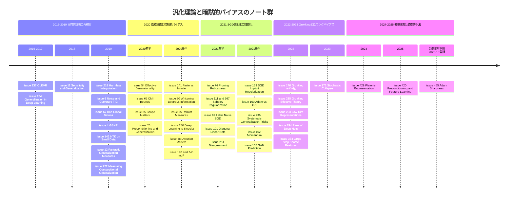

# 汎化理論・暗黙的バイアス・過剰パラメータ化・NTK/μP・Grokking・特徴学習・系統的汎化

> 対象: primary 論文 59 件（ユニーク 57 本）。論文の公開期間は 2016-12〜2025-09（1 件は公開年月不明）、issue 登録期間は 2020-05〜2025-10。
> 重複登録: [#140](https://github.com/Hiroki11x/Papers/issues/140) と [#248](https://github.com/Hiroki11x/Papers/issues/248)（同一論文 *Feature Learning in Infinite-Width Neural Networks*, arXiv 2011.14522）、[#111](https://github.com/Hiroki11x/Papers/issues/111) と [#367](https://github.com/Hiroki11x/Papers/issues/367)（同一 arXiv 2105.13462。arXiv 版タイトル *The Sobolev Regularization Effect of SGD* と NeurIPS 2021 版タイトル *On Linear Stability of SGD and Input-Smoothness of Neural Networks*）。
> 関連文書: 平坦な最小値・シャープネスは [03_loss_landscape_sharpness.md](./03_loss_landscape_sharpness.md)、SGD ノイズとダイナミクスは [06_sgd_dynamics_theory.md](./06_sgd_dynamics_theory.md)。

## 概要

このノート群が追いかけている問いは、大きく次の 5 つに集約できる。

1. **過剰パラメータ化されたネットワークはなぜ汎化するのか、そしてそれをどう測るか。** VC 次元やノルムに基づく古典的な複雑度では説明できない汎化を、TIC・GSNR・有効次元・シャープネス・プルーニング耐性・不一致率などの指標で予測できるか。
2. **最適化アルゴリズムはどの解を選ぶのか（暗黙的バイアス/暗黙的正則化）。** SGD のノイズの「形」、ラベルノイズ、大きな学習率、モーメンタム、前処理（自然勾配・Adam）が、同じ訓練損失ゼロの解集合の中からどれを選ぶのか。
3. **無限幅極限（NTK/NNGP）は実際のネットワークをどこまで説明するか。** カーネル領域と特徴学習領域（μP）の境界はどこにあり、SGD は NTK を超える特徴を学習できるのか。
4. **記憶と汎化はどう共存し、どう切り替わるか。** ランダムラベル、悪い大域的最小値、層ごとの記憶、良性過学習、Grokking（過学習のはるか後の汎化）。
5. **分布内汎化を超える「系統的・構成的汎化」はどう測り、何が効くのか。**

## 目次

- [背景と基本概念](#背景と基本概念)
- [研究の系譜・時系列ナラティブ](#研究の系譜時系列ナラティブ)
- [タイムライン](#タイムライン)
- [サブトピック別の整理](#サブトピック別の整理)
- [論文一覧表](#論文一覧表)
- [採択先別の集計](#採択先別の集計)
- [各論文の詳細まとめ](#各論文の詳細まとめ)
- [横断的な知見・未解決問題](#横断的な知見未解決問題)
- [関連論文](#関連論文)

## 背景と基本概念

### 汎化ギャップと複雑度指標

データ分布 $\mathcal{D}$、訓練集合 $S=\{z_i\}_{i=1}^n$、パラメータ $\theta$ に対し、汎化ギャップは

$$
\mathrm{gap}(\theta) = \mathbb{E}_{z\sim\mathcal{D}}[\ell(\theta;z)] - \frac{1}{n}\sum_{i=1}^n \ell(\theta;z_i)
$$

と書ける。古典的な一様収束（VC 次元・Rademacher 複雑度・ノルムベース境界）は、仮説クラス全体の大きさでこれを抑えるが、過剰パラメータ化ネットワークでは数値的に空虚になる（[#65](https://github.com/Hiroki11x/Papers/issues/65), [#241](https://github.com/Hiroki11x/Papers/issues/241)）。ノート群には、代わりに次のような「アルゴリズム依存」「データ依存」の量が繰り返し出てくる。

- **情報行列と TIC**: ヘシアン $H$、勾配の共分散 $C$、フィッシャー情報行列 $F$。竹内情報量規準 $\mathrm{TIC}\propto \mathrm{tr}(H^{-1}C)/n$ は、モデル誤特定下での汎化ギャップの推定量であり、[#6](https://github.com/Hiroki11x/Papers/issues/6) が深層学習で検証した。ノート全体を通じて「TIC 的な見方」が本人の関心軸になっている（[#65](https://github.com/Hiroki11x/Papers/issues/65), [#161](https://github.com/Hiroki11x/Papers/issues/161) のメモ）。
- **GSNR**: パラメータ $j$ ごとのサンプル勾配の平均の二乗と分散の比 $r_j = \tilde{g}_j^2/\rho_j^2$（[#4](https://github.com/Hiroki11x/Papers/issues/4)）。
- **有効次元**: ヘシアン固有値 $\lambda_i$ から $N_{\mathrm{eff}}(H,z)=\sum_i \lambda_i/(\lambda_i+z)$ のように数える「実効的なパラメータ数」（[#54](https://github.com/Hiroki11x/Papers/issues/54)）。特異学習理論では、実対数閾値（RLCT）が有効パラメータ数の正しい数え方だとされる（[#250](https://github.com/Hiroki11x/Papers/issues/250)）。
- **シャープネス**: 最小値近傍での損失の鋭さ（ヘシアンの最大固有値やトレース）。詳細は [03_loss_landscape_sharpness.md](./03_loss_landscape_sharpness.md)。
- **情報理論的境界**: 学習アルゴリズムの出力 $W$ と訓練サンプルの相互情報量 $I(W;S)$ で汎化誤差を抑える枠組みと、そのスーパーサンプル条件付き版（CMI）（[#63](https://github.com/Hiroki11x/Papers/issues/63)）。
- **安定性**: 訓練サンプルを 1 個入れ替えたときの出力の変化でアルゴリズム依存の境界を与える（[#161](https://github.com/Hiroki11x/Papers/issues/161), [#241](https://github.com/Hiroki11x/Papers/issues/241)）。

### 暗黙的バイアスと暗黙的正則化

過剰パラメータ化された問題では、訓練損失をゼロにする解が無数にある。明示的な正則化がなくても、最適化アルゴリズムがその中の特定の解を選ぶ性質を**暗黙的バイアス**と呼ぶ（サーベイは [#283](https://github.com/Hiroki11x/Papers/issues/283)）。ノートに出てくる代表例は次のとおり。

- 線形回帰の GD/SGD は最小 $\ell_2$ ノルム解へ、分離可能な分類のロジスティック損失は最大マージン解へ収束する（[#110](https://github.com/Hiroki11x/Papers/issues/110), [#307](https://github.com/Hiroki11x/Papers/issues/307), [#219](https://github.com/Hiroki11x/Papers/issues/219)）。
- **対角線形ネットワーク** $f(x)=\langle u\odot u - v\odot v, x\rangle$ のような二次パラメータ化では、初期化スケールやノイズによって $\ell_1$ 的（疎）解と $\ell_2$ 的（密）解の間を移動する（[#25](https://github.com/Hiroki11x/Papers/issues/25), [#101](https://github.com/Hiroki11x/Papers/issues/101), [#334](https://github.com/Hiroki11x/Papers/issues/334)）。
- **ラベルノイズ SGD** は、学習率 $\eta$・ノイズ強度・バッチサイズに依存する係数 $\lambda$ を用いて $L(\theta)+\lambda R(\theta)$（$R$ はシャープな解に罰則を与える項）を実効的に最小化する（[#99](https://github.com/Hiroki11x/Papers/issues/99)）。最小化多様体近傍の Slow SDE で見ると、SGD は $\mathrm{tr}(H)$ を、Adam は $\mathrm{tr}(\mathrm{Diag}(H)^{1/2})$ を減らす（[#465](https://github.com/Hiroki11x/Papers/issues/465)）。

$$
\text{SGD: } \min \mathrm{tr}(H), \qquad \text{Adam: } \min \mathrm{tr}\big(\mathrm{Diag}(H)^{1/2}\big), \qquad \text{AdamE-}\lambda\text{: } \min \mathrm{tr}\big(\mathrm{Diag}(H)^{1-\lambda}\big)
$$

SGD ノイズそのものの構造（ノイズ共分散、重い裾、分数ブラウン運動近似など）は [06_sgd_dynamics_theory.md](./06_sgd_dynamics_theory.md) を参照。

### 無限幅極限：NTK・NNGP・μP

幅 $\to\infty$ の極限では、適切なパラメータ化のもとで勾配降下の振る舞いが**ニューラルタンジェントカーネル**

$$
\Theta(x,x') = \big\langle \nabla_\theta f_\theta(x), \nabla_\theta f_\theta(x') \big\rangle
$$

によるカーネル回帰に一致する（無限小学習率・$\ell_2$ 損失）。初期化時の出力分布に対応するのが NNGP カーネルである（[#141](https://github.com/Hiroki11x/Papers/issues/141), [#142](https://github.com/Hiroki11x/Papers/issues/142)）。ただし NTK 領域ではパラメータがほとんど動かず「特徴を学習しない」。Yang & Hu は、標準・NTK・平均場パラメータ化を含む空間を分類し、「特徴学習」と「カーネル的な無限幅ダイナミクス」は両立しないこと、特徴学習を許す**最大更新パラメータ化（μP）**を示した（[#140](https://github.com/Hiroki11x/Papers/issues/140)）。

### 良性過学習・二重降下・Grokking

ノイズを含むデータを完全に補間しても汎化誤差が小さいままでありうる（**無害な補間 / 良性過学習**, [#218](https://github.com/Hiroki11x/Papers/issues/218)）。モデルサイズを増やすとテスト誤差が一度上がってから再び下がる**二重降下**は、有効次元（[#54](https://github.com/Hiroki11x/Papers/issues/54)）や表現多様体の幾何（[#62](https://github.com/Hiroki11x/Papers/issues/62)）から説明が試みられている。**Grokking** は、訓練精度が 100% に到達してからはるかに長いステップの後に、テスト精度が偶然レベルから完全汎化へ跳ね上がる現象である（[#176](https://github.com/Hiroki11x/Papers/issues/176), [#235](https://github.com/Hiroki11x/Papers/issues/235)）。

### 系統的・構成的汎化

既知の構成要素（単語・属性・物体）を新しい組み合わせで扱う能力。「dax を覚えた人は dax twice もすぐ理解できる」という例が典型で（[#222](https://github.com/Hiroki11x/Papers/issues/222)）、IID 分割では見えない差を測るために、原子の分布を揃えて複合の分布をずらす分割や、診断用データセット（CLEVR, SCAN, CFQ, COGS, PCFG）が用いられる。

## 研究の系譜・時系列ナラティブ

### 第 1 期（2016〜2019）：古典的説明の再検討と診断ベンチマーク

起点は「深層学習はなぜ汎化するのか」という問いの再整理である。Kawaguchi らの章 [#284](https://github.com/Hiroki11x/Papers/issues/284) は、大容量・不安定性・シャープミニマにもかかわらず汎化するという「謎」に対して理論的観点を整理した。実証側では Novak らの [#11](https://github.com/Hiroki11x/Papers/issues/11) が入出力ヤコビアンのノルムなど入力感度と汎化の相関を大規模に示し、Thomas らの [#6](https://github.com/Hiroki11x/Papers/issues/6) は勾配共分散・ヘシアン・フィッシャーの関係を整理して TIC が汎化ギャップをよく予測することを示した。[#4](https://github.com/Hiroki11x/Papers/issues/4) の GSNR も同じく「勾配の統計量で汎化を語る」流れにある。

一方で「SGD は良い解しか見つけない」という楽観論への反例として、[#67](https://github.com/Hiroki11x/Papers/issues/67) は訓練データに完全フィットしても汎化しない悪い大域的最小値が存在し、ランダムラベル事前学習から始めれば SGD がそこへ到達できることを示した。良性過学習の側では [#218](https://github.com/Hiroki11x/Papers/issues/218) が線形回帰でノイズの補間が無害になる条件を与えている。

この時期の締めくくりが Jiang らの大規模研究 [#12](https://github.com/Hiroki11x/Papers/issues/12) で、40 以上の汎化指標を 1 万以上のモデルで評価し、ノルム系指標が負の相関を示す一方、シャープネス系と最適化系（学習終了時の勾配分散）が強いことを示した。無限幅側では [#142](https://github.com/Hiroki11x/Papers/issues/142) が NTK を小データタスクで実用化し、系統的汎化側では CLEVR [#237](https://github.com/Hiroki11x/Papers/issues/237)、環境要因を調べた [#221](https://github.com/Hiroki11x/Papers/issues/221)、構成的汎化の測定法 [#222](https://github.com/Hiroki11x/Papers/issues/222) が並ぶ。

### 第 2 期（2020）：指標の評価法をめぐる議論、暗黙的バイアスと無限幅の興隆

[#12](https://github.com/Hiroki11x/Papers/issues/12) の評価法は、すぐに [#65](https://github.com/Hiroki11x/Papers/issues/65) によって「平均化された相関が指標の失敗を覆い隠す」と批判され、分布頑健性の枠組みで最悪ケースを見るべきだと主張された（本人は「TIC や情報行列系は評価されていない」とメモ）。指標の側では [#54](https://github.com/Hiroki11x/Papers/issues/54) がヘシアンの有効次元で二重降下まで説明し、[#63](https://github.com/Hiroki11x/Papers/issues/63) は条件付き相互情報量でより厳密な情報理論的境界を与え、[#250](https://github.com/Hiroki11x/Papers/issues/250) は特異学習理論（RLCT）こそが有効パラメータ数の正しい数え方だと論じた。

暗黙的バイアスの研究はこの年に一気に具体化する。[#25](https://github.com/Hiroki11x/Papers/issues/25) は「ノイズの形が重要」であり、パラメータ依存ノイズ（ラベルノイズ SGD）は疎な真の解を回復するが球状ガウスノイズは密な解に過学習することを示した。[#58](https://github.com/Hiroki11x/Papers/issues/58) は中程度の学習率で SGD と GD が異なる固有値方向に沿って収束することを示した。前処理・二次法の汎化への影響も議論され、[#26](https://github.com/Hiroki11x/Papers/issues/26) は前処理が汎化を助ける条件と害する条件を、[#50](https://github.com/Hiroki11x/Papers/issues/50) は白色化と二次最適化がデータの情報を破壊しうることを、[#219](https://github.com/Hiroki11x/Papers/issues/219) は適応的手法の 2 つのクラスを示した。

無限幅では [#141](https://github.com/Hiroki11x/Papers/issues/141) がカーネルと有限幅ネットの対応を徹底的に実証し、Yang & Hu の μP 論文（[#140](https://github.com/Hiroki11x/Papers/issues/140) / [#248](https://github.com/Hiroki11x/Papers/issues/248)）が「NTK では特徴を学習できない」ことを明確にして特徴学習の極限を与えた。記憶と表現の観点では、ランダムラベル学習でもデータとの整合が生じる [#29](https://github.com/Hiroki11x/Papers/issues/29)、記憶が深い層で起こることを示す [#62](https://github.com/Hiroki11x/Papers/issues/62)、使用可能情報で最小十分表現の形成を追う [#56](https://github.com/Hiroki11x/Papers/issues/56)、自己教師あり学習の理論 [#60](https://github.com/Hiroki11x/Papers/issues/60)、ReLU ネットの最大マージン的帰納バイアス [#110](https://github.com/Hiroki11x/Papers/issues/110) が出ている。

### 第 3 期（2021）：SGD の暗黙的正則化の精密化と最適化手法間の汎化差

2021 年は「SGD ノイズがシャープネスをどう罰するか」の定量化が進む。[#99](https://github.com/Hiroki11x/Papers/issues/99) はラベルノイズ SGD が平坦な大域解を好むことを証明し、バッチサイズ依存の有効正則化係数と、大学習率で線形スケーリング則を超える追加の正則化効果を示した。[#101](https://github.com/Hiroki11x/Papers/issues/101) は対角線形ネットで確率的勾配流が勾配流より常に良く汎化することを示し、[#111](https://github.com/Hiroki11x/Papers/issues/111) / [#367](https://github.com/Hiroki11x/Papers/issues/367) は、パラメータ空間の平坦性が第 1 層の乗法構造を通じて入力空間の滑らかさ（Sobolev セミノルム）の正則化に変換されることを示した。これらは [#25](https://github.com/Hiroki11x/Papers/issues/25) の問いを直接引き継いでいる。

ただし「暗黙的正則化で SGD の成功を説明する」という枠組み自体への反論もある。[#133](https://github.com/Hiroki11x/Papers/issues/133) は確率的凸最適化で、どんな正則化 ERM でも学習できないが SGD は学習できる問題を構成し、暗黙的正則化（＝何らかの正則化項の最小化）としては説明しきれないことを示した。

最適化手法の比較では、[#160](https://github.com/Hiroki11x/Papers/issues/160) が非凸設定で Adam と GD が汎化誤差の異なる大域解に収束する（凸なら同じ解）こと、[#162](https://github.com/Hiroki11x/Papers/issues/162) がモーメンタムが小マージンデータの特徴学習を助けること、[#154](https://github.com/Hiroki11x/Papers/issues/154) が再パラメータ化不変な自然勾配では汎化できない問題があることを示した。いずれも「最適化器の選択が解の選択を通じて汎化を変える」という [#26](https://github.com/Hiroki11x/Papers/issues/26) / [#50](https://github.com/Hiroki11x/Papers/issues/50) の論点を非凸ネットワークへ拡張したものである。

汎化の予測は「境界」から「実用的な推定」へと軸足を移す。[#74](https://github.com/Hiroki11x/Papers/issues/74) はプルーニング耐性、[#251](https://github.com/Hiroki11x/Papers/issues/251) は 2 回の SGD 実行間の不一致率、[#155](https://github.com/Hiroki11x/Papers/issues/155) は GAN の合成データでテスト誤差を推定する。理論境界側でも [#161](https://github.com/Hiroki11x/Papers/issues/161)（過剰リスクの信号/ノイズ分解と安定性）や [#158](https://github.com/Hiroki11x/Papers/issues/158)（最適化経路長）が提案された。NTK 側では [#156](https://github.com/Hiroki11x/Papers/issues/156) が早期停止なしの GD はノイズ下で真の関数を回復しないこと、[#168](https://github.com/Hiroki11x/Papers/issues/168) が層ごとのスペクトルバイアスを示した。系統的汎化では [#236](https://github.com/Hiroki11x/Papers/issues/236) が Transformer の基本設定の見直しだけで大幅な改善が得られることを示した。

### 第 4 期（2022〜2023）：Grokking、特徴学習、低ランク/スパースへのバイアス

Grokking [#176](https://github.com/Hiroki11x/Papers/issues/176)（ICLR 2021 の MATH-AI ワークショップで発表され、arXiv 版は 2022-01 公開）は「過学習の後に汎化が来る」という新しい現象を提示し、[#235](https://github.com/Hiroki11x/Papers/issues/235) が構造化表現の学習として有効理論と相図（理解・Grokking・記憶・混乱の 4 相）で説明した。ここで汎化の問いは「表現がいつ構造化されるか」という表現学習の問いに接続する。

特徴学習の理論では、[#293](https://github.com/Hiroki11x/Papers/issues/293) が重み減衰付きオンライン SGD で 2 層 NN の第 1 層が真の低次元部分空間に収束し、NTK を超えるサンプル効率を得ることを示した。これは [#140](https://github.com/Hiroki11x/Papers/issues/140) の「NTK では特徴を学べない」という問題提起への有限幅・SGD 側からの回答と読める。

暗黙的バイアスは「低ランク・疎・単純」という共通のキーワードにまとまっていく。[#294](https://github.com/Hiroki11x/Papers/issues/294) は深さ無限で表現コストが非線形関数のランクに収束すること、[#307](https://github.com/Hiroki11x/Papers/issues/307) は高次元データ上の Leaky ReLU ネットが低ランク解に向かうこと、[#334](https://github.com/Hiroki11x/Papers/issues/334) は大きなステップサイズの損失安定化が疎な特徴へのバイアスを生むこと、[#373](https://github.com/Hiroki11x/Papers/issues/373) は SGD ノイズが消失/冗長ニューロンからなる単純なサブネットへ引き寄せる「確率的崩壊」を示した。[#373](https://github.com/Hiroki11x/Papers/issues/373) は「高学習率の初期訓練を長く行うと後の汎化に有利」という実務的観察にもメカニズムを与えている。Vardi のサーベイ [#283](https://github.com/Hiroki11x/Papers/issues/283) はこの時期の到達点を整理し、[#261](https://github.com/Hiroki11x/Papers/issues/261) は暗黙的バイアスの考え方を二段階最適化に拡張した。境界の側では [#241](https://github.com/Hiroki11x/Papers/issues/241) が分数ブラウン運動による軌道依存境界を、ベイズの側では [#361](https://github.com/Hiroki11x/Papers/issues/361) が深層線形ネットのベイズ補間を厳密に解き、NTK 側では [#358](https://github.com/Hiroki11x/Papers/issues/358) がスキップ接続のカーネルを解析した。

### 第 5 期（2024〜2025）：表現の収束と、適応的手法の暗黙的バイアス

最近のノートは 3 本と少ないが、方向ははっきりしている。[#429](https://github.com/Hiroki11x/Papers/issues/429) は、異なるモダリティ・目的で学習したモデルの表現が、スケールとともに現実の共通統計モデルへ収束するという「プラトン的表現仮説」を提唱した。仮説を支える 3 つの説明（多タスク制約・容量・単純性バイアス）のうち単純性バイアスは、第 4 期の暗黙的バイアス研究と直接つながる。

最適化手法の側では、[#420](https://github.com/Hiroki11x/Papers/issues/420) が「前処理＝収束の加速器」ではなく「学習される特徴を決めるスペクトルバイアスの仕組み」だと再定義した。前処理行列で定まる Gram 行列だけが入力情報を伝えることを示しており、これは [#50](https://github.com/Hiroki11x/Papers/issues/50) の「二次モーメント行列の情報だけが汎化に使える」という結果の延長線上にある。[#465](https://github.com/Hiroki11x/Papers/issues/465)（NeurIPS 2025。公開年月不明、issue 登録は 2025-10）は Slow SDE を Adam に拡張し、Adam が SGD とは別種のシャープネス $\mathrm{tr}(\mathrm{Diag}(H)^{1/2})$ を減らすことを示した。これは [#160](https://github.com/Hiroki11x/Papers/issues/160) の「Adam と SGD は別の解に行く」を、平坦性の言葉で定量化したものと位置づけられる。

## タイムライン

## サブトピック別の整理

### A. 汎化指標・汎化予測・汎化境界（15 件）

**要点**: ノルム系の古典的指標は過剰パラメータ化で破綻し、勾配統計量（TIC・GSNR・勾配分散）、ヘシアン（有効次元・シャープネス）、プルーニング耐性、不一致率などの「学習された解とデータの関係」を見る指標が有力。ただし評価法自体（平均相関か最悪ケースか）が争点で、境界の側は情報理論・安定性・軌道・特異学習理論へと多様化している。

- [#284](https://github.com/Hiroki11x/Papers/issues/284) Generalization in Deep Learning — 理論的な論点整理
- [#11](https://github.com/Hiroki11x/Papers/issues/11) Sensitivity and Generalization — 入力感度（ヤコビアン）と汎化
- [#6](https://github.com/Hiroki11x/Papers/issues/6) Noise and Curvature — 情報行列と TIC
- [#4](https://github.com/Hiroki11x/Papers/issues/4) GSNR — 勾配 SN 比
- [#12](https://github.com/Hiroki11x/Papers/issues/12) Fantastic Generalization Measures — 40 以上の指標の大規模評価
- [#54](https://github.com/Hiroki11x/Papers/issues/54) Effective Dimensionality — ヘシアン有効次元と二重降下
- [#63](https://github.com/Hiroki11x/Papers/issues/63) CMI Bounds — 条件付き相互情報量境界
- [#65](https://github.com/Hiroki11x/Papers/issues/65) Robust Measures — 分布頑健性による指標評価
- [#250](https://github.com/Hiroki11x/Papers/issues/250) Deep Learning is Singular — 特異学習理論と RLCT
- [#74](https://github.com/Hiroki11x/Papers/issues/74) Robustness to Pruning — プルーニング耐性
- [#161](https://github.com/Hiroki11x/Papers/issues/161) Decomposing Excess Risk — 信号/ノイズ分解と安定性
- [#251](https://github.com/Hiroki11x/Papers/issues/251) Disagreement — SGD 実行間の不一致率
- [#158](https://github.com/Hiroki11x/Papers/issues/158) Short Optimization Paths — 最適化経路長
- [#155](https://github.com/Hiroki11x/Papers/issues/155) Predicting Generalization using GANs — 合成データによる予測
- [#241](https://github.com/Hiroki11x/Papers/issues/241) Fractional Brownian Motion Bounds — 軌道依存境界

### B. SGD の暗黙的バイアス・暗黙的正則化（11 件）

**要点**: ノイズの「量」より「形」（パラメータ依存性）が重要で、ラベルノイズ・大学習率・確率性はいずれもシャープネス低減、疎性、単純なサブネットワークへのバイアスとして現れる。対角線形ネットワークが標準的な実験台。一方で [#133](https://github.com/Hiroki11x/Papers/issues/133) は「正則化項の最小化」として説明する枠組みの限界を示す。SGD ノイズ自体の性質は [06_sgd_dynamics_theory.md](./06_sgd_dynamics_theory.md)、平坦性との関係は [03_loss_landscape_sharpness.md](./03_loss_landscape_sharpness.md) を参照。

- [#25](https://github.com/Hiroki11x/Papers/issues/25) Shape Matters — ノイズ共分散の形と疎な解の回復
- [#58](https://github.com/Hiroki11x/Papers/issues/58) Direction Matters — 中程度の学習率での方向的バイアス
- [#111](https://github.com/Hiroki11x/Papers/issues/111) / [#367](https://github.com/Hiroki11x/Papers/issues/367) Sobolev Regularization / Linear Stability — 平坦性から入力の滑らかさへ
- [#99](https://github.com/Hiroki11x/Papers/issues/99) Label Noise SGD — 平坦な大域解の選好
- [#101](https://github.com/Hiroki11x/Papers/issues/101) Diagonal Linear Networks — 確率性の証明可能な利点
- [#133](https://github.com/Hiroki11x/Papers/issues/133) SGD: Implicit Regularization, Batch-size, Multiple-epochs — 暗黙的正則化説明の限界
- [#334](https://github.com/Hiroki11x/Papers/issues/334) Large Step Sizes — 疎な特徴の学習
- [#373](https://github.com/Hiroki11x/Papers/issues/373) Stochastic Collapse — 単純なサブネットへの引力
- [#283](https://github.com/Hiroki11x/Papers/issues/283) Implicit Bias survey — Vardi のサーベイ
- [#261](https://github.com/Hiroki11x/Papers/issues/261) Bilevel Optimization — 二段階最適化の暗黙的バイアス

### C. 最適化手法（前処理・適応的手法・モーメンタム）と汎化（8 件）

**要点**: 前処理は「データのどの情報を使えるか」を変える。白色化や二次法はサンプル間二次モーメントの情報を失わせうる一方、前処理のスペクトル強調が教師信号と整合すれば汎化・OOD・転移が改善する。Adam と SGD の汎化差は非凸性と結びついており、最小化多様体近傍では両者が異なるシャープネスを減らす。

- [#26](https://github.com/Hiroki11x/Papers/issues/26) When Does Preconditioning Help or Hurt Generalization?
- [#50](https://github.com/Hiroki11x/Papers/issues/50) Whitening and Second Order Optimization Destroy Information
- [#219](https://github.com/Hiroki11x/Papers/issues/219) Adaptive Methods for Over-parameterized Linear Regression
- [#160](https://github.com/Hiroki11x/Papers/issues/160) Generalization of Adam with Proper Regularization
- [#162](https://github.com/Hiroki11x/Papers/issues/162) How Momentum Improves Generalization
- [#154](https://github.com/Hiroki11x/Papers/issues/154) Inductive Bias of Natural Gradient Descent
- [#420](https://github.com/Hiroki11x/Papers/issues/420) Preconditioning Guides Feature Learning
- [#465](https://github.com/Hiroki11x/Papers/issues/465) Adam Reduces a Unique Form of Sharpness

### D. 過剰パラメータ化・記憶・補間・ネットワーク構造の帰納バイアス（9 件）

**要点**: 補間は必ずしも有害ではないが、悪い大域解は存在し初期化次第で到達できる。記憶は深い層に集中し、ランダムラベルでもデータとの整合が学習される。勾配流の帰納バイアスは最大マージン・低ランクとして特徴づけられ、深さはランクを下げる方向に働く。ノイズ下では早期停止や正則化なしの GD は真の関数を回復しない。

- [#218](https://github.com/Hiroki11x/Papers/issues/218) Harmless Interpolation — 無害な補間
- [#67](https://github.com/Hiroki11x/Papers/issues/67) Bad Global Minima Exist — 悪い大域解
- [#29](https://github.com/Hiroki11x/Papers/issues/29) Random Labels — ランダムラベルでの学習内容
- [#62](https://github.com/Hiroki11x/Papers/issues/62) Geometry of Generalization and Memorization — 層ごとの記憶
- [#110](https://github.com/Hiroki11x/Papers/issues/110) ReLU on Orthogonally Separable Data — 最大マージンの組合せ
- [#156](https://github.com/Hiroki11x/Papers/issues/156) Overparametrized DNN under Noisy Observations — 正則化 GD のミニマックス最適性
- [#294](https://github.com/Hiroki11x/Papers/issues/294) Implicit Bias of Large Depth Networks — 非線形関数のランク
- [#307](https://github.com/Hiroki11x/Papers/issues/307) Leaky ReLU on High-Dimensional Data — 低ランクな最大マージン解
- [#361](https://github.com/Hiroki11x/Papers/issues/361) Bayesian Interpolation with Deep Linear Networks — 深さとモデルエビデンス

### E. NTK・無限幅・μP（6 件、うち重複 1）

**要点**: 無限幅カーネルは小データでは強力で、NNGP が NTK を上回ることも多い。しかし NTK/標準パラメータ化は無限幅で特徴を学習できず、μP がその極限を与える。カーネルのスペクトル解析は、層ごとの周波数バイアスやスキップ接続の条件数改善を説明する。

- [#142](https://github.com/Hiroki11x/Papers/issues/142) Infinitely Wide Nets on Small-data Tasks
- [#141](https://github.com/Hiroki11x/Papers/issues/141) Finite Versus Infinite Neural Networks
- [#140](https://github.com/Hiroki11x/Papers/issues/140) / [#248](https://github.com/Hiroki11x/Papers/issues/248) Feature Learning in Infinite-Width Neural Networks（μP）
- [#168](https://github.com/Hiroki11x/Papers/issues/168) Layer-wise Contributions through Spectral Analysis
- [#358](https://github.com/Hiroki11x/Papers/issues/358) Kernel Perspective of Skip Connections

### F. 特徴学習・表現学習理論・Grokking（6 件）

**要点**: 汎化は「良い表現（タスクに合った構造）」の獲得として理解される。SGD とランダム初期化は最小十分表現を、SGD+重み減衰は真の低次元部分空間を見つける。Grokking は表現の構造化が遅れて起こる現象として、ハイパーパラメータの相図で記述できる。大規模化すると表現はモダリティを越えて収束するという仮説もある。

- [#56](https://github.com/Hiroki11x/Papers/issues/56) Usable Information — 最適表現の形成過程
- [#60](https://github.com/Hiroki11x/Papers/issues/60) Self-supervised Learning with Dual Deep Networks
- [#176](https://github.com/Hiroki11x/Papers/issues/176) Grokking
- [#235](https://github.com/Hiroki11x/Papers/issues/235) Towards Understanding Grokking
- [#293](https://github.com/Hiroki11x/Papers/issues/293) Low-Dimensional Representations with SGD
- [#429](https://github.com/Hiroki11x/Papers/issues/429) Platonic Representation Hypothesis

### G. 系統的・構成的汎化（4 件）

**要点**: IID 分割では見えない差を測るために、診断用データセットと分布をずらした分割が必要。性能は環境の多様性（エージェントの視点・マルチモーダル入力）や、Transformer の基本設定（埋め込みスケーリング・早期停止・相対位置埋め込み）に強く依存する。

- [#237](https://github.com/Hiroki11x/Papers/issues/237) CLEVR
- [#221](https://github.com/Hiroki11x/Papers/issues/221) Environmental Drivers of Systematicity
- [#222](https://github.com/Hiroki11x/Papers/issues/222) Measuring Compositional Generalization
- [#236](https://github.com/Hiroki11x/Papers/issues/236) Simple Tricks Improve Systematic Generalization of Transformers

## 論文一覧表

公開年月（first_public）順。採択先と根拠は検証済みレコードに基づく。

| 公開 | 論文 | 著者/組織 | 採択先 | 根拠 | サブトピック |
|---|---|---|---|---|---|
| 2016-12 | [#237](https://github.com/Hiroki11x/Papers/issues/237) CLEVR: A Diagnostic Dataset for Compositional Language and Elementary Visual Reasoning | Justin Johnson, Bharath Hariharan, Laurens van der Maaten, et al. / Stanford / Facebook AI Research | CVPR 2017 | Semantic Scholar確認 | 視覚的推論データセット |
| 2017-10 | [#284](https://github.com/Hiroki11x/Papers/issues/284) Generalization in Deep Learning | Kenji Kawaguchi, Leslie Pack Kaelbling, Yoshua Bengio / MIT / Mila | Book chapter (Mathematical Aspects of Deep Learning) | Web確認 | 汎化理論 |
| 2018-02 | [#11](https://github.com/Hiroki11x/Papers/issues/11) Sensitivity and Generalization in Neural Networks: an Empirical Study | Roman Novak, Yasaman Bahri, Daniel A. Abolafia, et al. / Google Brain | ICLR 2018 | arXivコメント | 入力感度と汎化 |
| 2019-03 | [#218](https://github.com/Hiroki11x/Papers/issues/218) Harmless interpolation of noisy data in regression | Vidya Muthukumar, Kailas Vodrahalli, Vignesh Subramanian, Anant Sahai / UC Berkeley | IEEE JSAIT | Web確認 | 良性過学習（補間） |
| 2019-06 | [#6](https://github.com/Hiroki11x/Papers/issues/6) On the interplay between noise and curvature and its effect on optimization and generalization | Valentin Thomas, Fabian Pedregosa, Bart van Merriënboer, et al. / Mila / Google | AISTATS 2020 | arXivコメント | 勾配ノイズ・曲率と汎化（TIC） |
| 2019-06 | [#67](https://github.com/Hiroki11x/Papers/issues/67) Bad Global Minima Exist and SGD Can Reach Them | Shengchao Liu, Dimitris Papailiopoulos, Dimitris Achlioptas | NeurIPS 2020 | Semantic Scholar確認 | 悪い大域的最小値 |
| 2019-09 | [#4](https://github.com/Hiroki11x/Papers/issues/4) Understanding Why Neural Networks Generalize Well Through GSNR of Parameters | Jinlong Liu, Guoqing Jiang, Yunzhi Bai, et al. | ICLR 2020 | Semantic Scholar確認 | 勾配SN比(GSNR)と汎化 |
| 2019-10 | [#142](https://github.com/Hiroki11x/Papers/issues/142) Harnessing the Power of Infinitely Wide Deep Nets on Small-data Tasks | Sanjeev Arora, Simon S. Du, Zhiyuan Li, et al. / Princeton | ICLR 2020 | Semantic Scholar確認 | NTKの小データ応用 |
| 2019-10 | [#221](https://github.com/Hiroki11x/Papers/issues/221) Environmental drivers of systematicity and generalization in a situated agent | Felix Hill, Andrew Lampinen, Rosalia Schneider, et al. / DeepMind | ICLR 2020 | issue記載 | 系統的汎化 |
| 2019-12 | [#12](https://github.com/Hiroki11x/Papers/issues/12) Fantastic Generalization Measures and Where to Find Them | Yiding Jiang, Behnam Neyshabur, Hossein Mobahi, et al. / Google | ICLR 2020 | issue記載 | 汎化指標の大規模評価 |
| 2019-12 | [#222](https://github.com/Hiroki11x/Papers/issues/222) Measuring Compositional Generalization | Daniel Keysers, Nathanael Schärli, Nathan Scales, et al. / Google | ICLR 2020 | Semantic Scholar確認 | 構成的汎化 |
| 2020-03 | [#54](https://github.com/Hiroki11x/Papers/issues/54) Rethinking Parameter Counting in Deep Models: Effective Dimensionality Revisited | Wesley J. Maddox, Gregory Benton, Andrew Gordon Wilson / New York University | arXiv（プレプリント） | 不明 | ヘシアンの有効次元と汎化 |
| 2020-04 | [#63](https://github.com/Hiroki11x/Papers/issues/63) Sharpened Generalization Bounds based on Conditional Mutual Information and an Application to Noisy, Iterative Algorithms | Mahdi Haghifam, Jeffrey Negrea, Ashish Khisti, et al. / University of Toronto / Element AI | NeurIPS 2020 | issue記載 | 情報理論的汎化境界 |
| 2020-06 | [#25](https://github.com/Hiroki11x/Papers/issues/25) Shape Matters: Understanding the Implicit Bias of the Noise Covariance | Jeff Z. HaoChen, Colin Wei, Jason D. Lee, et al. / Stanford University | COLT 2021 | Semantic Scholar確認 | ノイズ共分散の暗黙的バイアス |
| 2020-06 | [#26](https://github.com/Hiroki11x/Papers/issues/26) When Does Preconditioning Help or Hurt Generalization? | Shun-ichi Amari, Jimmy Ba, Roger Grosse, et al. | ICLR 2021 | Semantic Scholar確認 | 前処理（2次法）と汎化 |
| 2020-06 | [#29](https://github.com/Hiroki11x/Papers/issues/29) What Do Neural Networks Learn When Trained With Random Labels? | Hartmut Maennel, Ibrahim Alabdulmohsin, Ilya Tolstikhin, et al. / Google Research | NeurIPS 2020 | arXivコメント | ランダムラベル学習 |
| 2020-07 | [#141](https://github.com/Hiroki11x/Papers/issues/141) Finite Versus Infinite Neural Networks: an Empirical Study | Jaehoon Lee, Samuel S. Schoenholz, Jeffrey Pennington, et al. / Google Brain | NeurIPS 2020 | issue記載 | 無限幅NNとカーネル法 |
| 2020-08 | [#50](https://github.com/Hiroki11x/Papers/issues/50) Whitening and second order optimization both destroy information about the dataset, and can make generalization impossible | Neha S. Wadia, Daniel Duckworth, Samuel S. Schoenholz, et al. / Google Brain | ICML 2021 | Semantic Scholar確認 | 2次最適化と汎化 |
| 2020-10 | [#56](https://github.com/Hiroki11x/Papers/issues/56) Usable Information and Evolution of Optimal Representations During Training | Michael Kleinman, Alessandro Achille, Daksh Idnani, et al. / UCLA | ICLR 2021 | arXivコメント | 表現学習と使用可能情報 |
| 2020-10 | [#60](https://github.com/Hiroki11x/Papers/issues/60) Understanding Self-supervised Learning with Dual Deep Networks | Yuandong Tian, Lantao Yu, Xinlei Chen, et al. / Facebook AI Research | arXiv（プレプリント） | 不明 | 自己教師あり学習の理論 |
| 2020-10 | [#62](https://github.com/Hiroki11x/Papers/issues/62) On the Geometry of Generalization and Memorization in Deep Neural Networks | Cory Stephenson, Suchismita Padhy, Abhinav Ganesh, et al. / Intel Labs | ICLR 2021 | Semantic Scholar確認 | 記憶と汎化の表現幾何 |
| 2020-10 | [#65](https://github.com/Hiroki11x/Papers/issues/65) In Search of Robust Measures of Generalization | Gintare Karolina Dziugaite, Alexandre Drouin, Brady Neal, et al. / Element AI / Mila | NeurIPS 2020 | Semantic Scholar確認 | 汎化指標の頑健な評価 |
| 2020-10 | [#110](https://github.com/Hiroki11x/Papers/issues/110) The inductive bias of ReLU networks on orthogonally separable data | Mary Phuong, Christoph H. Lampert / IST Austria | ICLR 2021 | issue記載 | ReLUネットの帰納的バイアス |
| 2020-10 | [#250](https://github.com/Hiroki11x/Papers/issues/250) Deep Learning is Singular, and That's Good | Daniel Murfet, Susan Wei, Mingming Gong, et al. / University of Melbourne | IEEE TNNLS | Web確認 | 特異学習理論 |
| 2020-11 | [#58](https://github.com/Hiroki11x/Papers/issues/58) Direction Matters: On the Implicit Bias of Stochastic Gradient Descent with Moderate Learning Rate | Jingfeng Wu, Difan Zou, Vladimir Braverman, et al. / Johns Hopkins University / UCLA | ICLR 2021 | arXivコメント | SGDの暗黙的バイアス（学習率） |
| 2020-11 | [#140](https://github.com/Hiroki11x/Papers/issues/140) Feature Learning in Infinite-Width Neural Networks | Greg Yang, Edward J. Hu / Microsoft Research | ICML 2021 | arXivコメント | 無限幅NNとμP |
| 2020-11 | [#219](https://github.com/Hiroki11x/Papers/issues/219) On Generalization of Adaptive Methods for Over-parameterized Linear Regression | Vatsal Shah, Soumya Basu, Anastasios Kyrillidis, Sujay Sanghavi / UT Austin | arXiv（プレプリント） | 不明 | 適応的手法の汎化 |
| 2020-11 | [#248](https://github.com/Hiroki11x/Papers/issues/248) Feature Learning in Infinite-Width Neural Networks | Greg Yang, Edward J. Hu / Microsoft | ICML 2021 | arXivコメント | 無限幅ネットワークとμP |
| 2021-03 | [#74](https://github.com/Hiroki11x/Papers/issues/74) Robustness to Pruning Predicts Generalization in Deep Neural Networks | Lorenz Kuhn, Clare Lyle, Aidan N. Gomez, et al. / University of Oxford | arXiv（プレプリント） | 不明 | 汎化指標（プルーニング頑健性） |
| 2021-05 | [#111](https://github.com/Hiroki11x/Papers/issues/111) The Sobolev Regularization Effect of Stochastic Gradient Descent | Chao Ma, Lexing Ying / Stanford University | NeurIPS 2021 | Semantic Scholar確認 | SGDの暗黙的正則化（Sobolev） |
| 2021-05 | [#367](https://github.com/Hiroki11x/Papers/issues/367) On Linear Stability of SGD and Input-Smoothness of Neural Networks | Chao Ma, Lexing Ying / Stanford University | NeurIPS 2021 | issue記載 | SGDの線形安定性と汎化 |
| 2021-06 | [#99](https://github.com/Hiroki11x/Papers/issues/99) Label Noise SGD Provably Prefers Flat Global Minimizers | Alex Damian, Tengyu Ma, Jason D. Lee / Princeton / Stanford | NeurIPS 2021 | Semantic Scholar確認 | ラベルノイズSGDの暗黙的正則化 |
| 2021-06 | [#101](https://github.com/Hiroki11x/Papers/issues/101) Implicit Bias of SGD for Diagonal Linear Networks: a Provable Benefit of Stochasticity | Scott Pesme, Loucas Pillaud-Vivien, Nicolas Flammarion / EPFL | NeurIPS 2021 | Semantic Scholar確認 | SGDの暗黙的バイアス |
| 2021-06 | [#161](https://github.com/Hiroki11x/Papers/issues/161) Towards Understanding Generalization via Decomposing Excess Risk Dynamics | Jiaye Teng, Jianhao Ma, Yang Yuan / Tsinghua University | ICLR 2022 | Semantic Scholar確認 | 安定性に基づく汎化境界 |
| 2021-06 | [#251](https://github.com/Hiroki11x/Papers/issues/251) Assessing Generalization of SGD via Disagreement | Yiding Jiang, Vaishnavh Nagarajan, Christina Baek, J. Zico Kolter / CMU | ICLR 2022 | Semantic Scholar確認 | 汎化誤差予測 |
| 2021-07 | [#133](https://github.com/Hiroki11x/Papers/issues/133) SGD: The Role of Implicit Regularization, Batch-size and Multiple-epochs | Satyen Kale, Ayush Sekhari, Karthik Sridharan / Google / Cornell | NeurIPS 2021 | Semantic Scholar確認 | SGDの暗黙的正則化理論 |
| 2021-08 | [#160](https://github.com/Hiroki11x/Papers/issues/160) Understanding the Generalization of Adam in Learning Neural Networks with Proper Regularization | Difan Zou, Yuan Cao, Yuanzhi Li, Quanquan Gu / UCLA | ICLR 2023 | Web確認 | AdamとSGDの汎化ギャップ |
| 2021-08 | [#236](https://github.com/Hiroki11x/Papers/issues/236) The Devil is in the Detail: Simple Tricks Improve Systematic Generalization of Transformers | Róbert Csordás, Kazuki Irie, Jürgen Schmidhuber / IDSIA | EMNLP 2021 | Web確認 | 系統的汎化 |
| 2021-10 | [#156](https://github.com/Hiroki11x/Papers/issues/156) Generalization of Overparametrized Deep Neural Network Under Noisy Observations | Namjoon Suh, Hyunouk Ko, Xiaoming Huo / Georgia Tech | ICLR 2022 | Semantic Scholar確認 | 過剰パラメータNNの汎化理論 |
| 2021-10 | [#158](https://github.com/Hiroki11x/Papers/issues/158) Short optimization paths lead to good generalization | Fusheng Liu, Haizhao Yang, Soufiane Hayou, Qianxiao Li | arXiv（プレプリント） | Web確認 | 最適化経路長と汎化 |
| 2021-10 | [#162](https://github.com/Hiroki11x/Papers/issues/162) Towards understanding how momentum improves generalization in deep learning | Samy Jelassi, Yuanzhi Li / Princeton / CMU | ICML 2022 | Semantic Scholar確認 | モーメンタムと汎化 |
| 2021-11 | [#154](https://github.com/Hiroki11x/Papers/issues/154) Depth Without the Magic: Inductive Bias of Natural Gradient Descent | Anna Kerekes, Anna Mészáros, Ferenc Huszár | arXiv（プレプリント） | 不明 | 自然勾配の帰納バイアス |
| 2021-11 | [#155](https://github.com/Hiroki11x/Papers/issues/155) On Predicting Generalization using GANs | Yi Zhang, Arushi Gupta, Nikunj Saunshi, Sanjeev Arora / Princeton | ICLR 2022 | Semantic Scholar確認 | 汎化性能の予測 |
| 2021-11 | [#168](https://github.com/Hiroki11x/Papers/issues/168) Understanding Layer-wise Contributions in Deep Neural Networks through Spectral Analysis | Yatin Dandi, Arthur Jacot / EPFL | arXiv（プレプリント） | 不明 | 層ごとのスペクトルバイアス |
| 2022-01 | [#176](https://github.com/Hiroki11x/Papers/issues/176) Grokking: Generalization Beyond Overfitting on Small Algorithmic Datasets | Alethea Power, Yuri Burda, Harri Edwards, et al. / OpenAI | ICLR 2021 Workshop (MATH-AI) | Web確認 | グロッキング |
| 2022-05 | [#235](https://github.com/Hiroki11x/Papers/issues/235) Towards Understanding Grokking: An Effective Theory of Representation Learning | Ziming Liu, Ouail Kitouni, Niklas Nolte, et al. (Max Tegmark) / MIT | NeurIPS 2022 | arXivコメント | Grokking |
| 2022-06 | [#241](https://github.com/Hiroki11x/Papers/issues/241) Trajectory-dependent Generalization Bounds for Deep Neural Networks via Fractional Brownian Motion | Chengli Tan, Jiangshe Zhang, Junmin Liu, Yihong Gong | arXiv（プレプリント） | 不明 | 汎化バウンド |
| 2022-07 | [#261](https://github.com/Hiroki11x/Papers/issues/261) On Implicit Bias in Overparameterized Bilevel Optimization | Paul Vicol, Jonathan Lorraine, Fabian Pedregosa, et al. / University of Toronto / Google | ICML 2022 | issue記載 | 二段階最適化の暗黙バイアス |
| 2022-08 | [#283](https://github.com/Hiroki11x/Papers/issues/283) On the Implicit Bias in Deep-Learning Algorithms | Gal Vardi / TTIC | Communications of the ACM | Semantic Scholar確認 | 暗黙のバイアス（サーベイ） |
| 2022-09 | [#293](https://github.com/Hiroki11x/Papers/issues/293) Neural Networks Efficiently Learn Low-Dimensional Representations with SGD | Alireza Mousavi-Hosseini, Sejun Park, Manuela Girotti, et al. / University of Toronto | ICLR 2023 | arXivコメント | 特徴学習の理論 |
| 2022-09 | [#294](https://github.com/Hiroki11x/Papers/issues/294) Implicit Bias of Large Depth Networks: a Notion of Rank for Nonlinear Functions | Arthur Jacot / NYU | ICLR 2023 | Semantic Scholar確認 | 暗黙のバイアス |
| 2022-10 | [#307](https://github.com/Hiroki11x/Papers/issues/307) Implicit Bias in Leaky ReLU Networks Trained on High-Dimensional Data | Spencer Frei, Gal Vardi, Peter L. Bartlett, et al. / UC Berkeley / TTIC | ICLR 2023 | Semantic Scholar確認 | 暗黙のバイアス |
| 2022-10 | [#334](https://github.com/Hiroki11x/Papers/issues/334) SGD with Large Step Sizes Learns Sparse Features | Maksym Andriushchenko, Aditya Varre, Loucas Pillaud-Vivien, Nicolas Flammarion / EPFL | ICML 2023 | arXivコメント | 大きな学習率と暗黙の正則化 |
| 2022-11 | [#358](https://github.com/Hiroki11x/Papers/issues/358) A Kernel Perspective of Skip Connections in Convolutional Networks | Daniel Barzilai, Amnon Geifman, Meirav Galun, Ronen Basri / Weizmann Institute | ICLR 2023 | Semantic Scholar確認 | NTKとスキップ接続 |
| 2022-12 | [#361](https://github.com/Hiroki11x/Papers/issues/361) Bayesian Interpolation with Deep Linear Networks | Boris Hanin, Alexander Zlokapa / Princeton University | PNAS | Web確認 | 深層線形ネットのベイズ推論 |
| 2023-06 | [#373](https://github.com/Hiroki11x/Papers/issues/373) Stochastic Collapse: How Gradient Noise Attracts SGD Dynamics Towards Simpler Subnetworks | Feng Chen, Daniel Kunin, Atsushi Yamamura, Surya Ganguli / Stanford University | NeurIPS 2023 | arXivコメント | SGDの暗黙バイアス |
| 2024-05 | [#429](https://github.com/Hiroki11x/Papers/issues/429) The Platonic Representation Hypothesis | Minyoung Huh, Brian Cheung, Tongzhou Wang, Phillip Isola / MIT | ICML 2024 | Semantic Scholar確認 | 表現の収束 |
| 2025-09 | [#420](https://github.com/Hiroki11x/Papers/issues/420) How Does Preconditioning Guide Feature Learning in Deep Neural Networks? | Kotaro Yoshida, Atsushi Nitanda / A*STAR / NTU | arXiv（プレプリント） | 不明 | 前処理と特徴学習・汎化 |
| 不明 | [#465](https://github.com/Hiroki11x/Papers/issues/465) Adam Reduces a Unique Form of Sharpness: Theoretical Insights Near the Minimizer Manifold | Xinghan Li, Haodong Wen, Kaifeng Lyu / Tsinghua University (IIIS) | NeurIPS 2025 | Semantic Scholar確認 | Adamの暗黙的バイアスとシャープネス |

## 採択先別の集計

| 採択先系列 | 件数 | issue |
|---|---|---|
| ICLR | 20 | [#4](https://github.com/Hiroki11x/Papers/issues/4), [#11](https://github.com/Hiroki11x/Papers/issues/11), [#12](https://github.com/Hiroki11x/Papers/issues/12), [#26](https://github.com/Hiroki11x/Papers/issues/26), [#56](https://github.com/Hiroki11x/Papers/issues/56), [#58](https://github.com/Hiroki11x/Papers/issues/58), [#62](https://github.com/Hiroki11x/Papers/issues/62), [#110](https://github.com/Hiroki11x/Papers/issues/110), [#142](https://github.com/Hiroki11x/Papers/issues/142), [#155](https://github.com/Hiroki11x/Papers/issues/155), [#156](https://github.com/Hiroki11x/Papers/issues/156), [#160](https://github.com/Hiroki11x/Papers/issues/160), [#161](https://github.com/Hiroki11x/Papers/issues/161), [#221](https://github.com/Hiroki11x/Papers/issues/221), [#222](https://github.com/Hiroki11x/Papers/issues/222), [#251](https://github.com/Hiroki11x/Papers/issues/251), [#293](https://github.com/Hiroki11x/Papers/issues/293), [#294](https://github.com/Hiroki11x/Papers/issues/294), [#307](https://github.com/Hiroki11x/Papers/issues/307), [#358](https://github.com/Hiroki11x/Papers/issues/358) |
| NeurIPS | 13 | [#29](https://github.com/Hiroki11x/Papers/issues/29), [#63](https://github.com/Hiroki11x/Papers/issues/63), [#65](https://github.com/Hiroki11x/Papers/issues/65), [#67](https://github.com/Hiroki11x/Papers/issues/67), [#99](https://github.com/Hiroki11x/Papers/issues/99), [#101](https://github.com/Hiroki11x/Papers/issues/101), [#111](https://github.com/Hiroki11x/Papers/issues/111), [#133](https://github.com/Hiroki11x/Papers/issues/133), [#141](https://github.com/Hiroki11x/Papers/issues/141), [#235](https://github.com/Hiroki11x/Papers/issues/235), [#367](https://github.com/Hiroki11x/Papers/issues/367), [#373](https://github.com/Hiroki11x/Papers/issues/373), [#465](https://github.com/Hiroki11x/Papers/issues/465) |
| arXiv（プレプリント） | 9 | [#54](https://github.com/Hiroki11x/Papers/issues/54), [#60](https://github.com/Hiroki11x/Papers/issues/60), [#74](https://github.com/Hiroki11x/Papers/issues/74), [#154](https://github.com/Hiroki11x/Papers/issues/154), [#158](https://github.com/Hiroki11x/Papers/issues/158), [#168](https://github.com/Hiroki11x/Papers/issues/168), [#219](https://github.com/Hiroki11x/Papers/issues/219), [#241](https://github.com/Hiroki11x/Papers/issues/241), [#420](https://github.com/Hiroki11x/Papers/issues/420) |
| ICML | 7 | [#50](https://github.com/Hiroki11x/Papers/issues/50), [#140](https://github.com/Hiroki11x/Papers/issues/140), [#162](https://github.com/Hiroki11x/Papers/issues/162), [#248](https://github.com/Hiroki11x/Papers/issues/248), [#261](https://github.com/Hiroki11x/Papers/issues/261), [#334](https://github.com/Hiroki11x/Papers/issues/334), [#429](https://github.com/Hiroki11x/Papers/issues/429) |
| AISTATS | 1 | [#6](https://github.com/Hiroki11x/Papers/issues/6) |
| Book chapter (Mathematical Aspects of Deep Learning) | 1 | [#284](https://github.com/Hiroki11x/Papers/issues/284) |
| COLT | 1 | [#25](https://github.com/Hiroki11x/Papers/issues/25) |
| CVPR | 1 | [#237](https://github.com/Hiroki11x/Papers/issues/237) |
| EMNLP | 1 | [#236](https://github.com/Hiroki11x/Papers/issues/236) |
| ICLR Workshop | 1 | [#176](https://github.com/Hiroki11x/Papers/issues/176) |
| ジャーナル（Communications of the ACM） | 1 | [#283](https://github.com/Hiroki11x/Papers/issues/283) |
| ジャーナル（IEEE JSAIT） | 1 | [#218](https://github.com/Hiroki11x/Papers/issues/218) |
| ジャーナル（IEEE TNNLS） | 1 | [#250](https://github.com/Hiroki11x/Papers/issues/250) |
| ジャーナル（PNAS） | 1 | [#361](https://github.com/Hiroki11x/Papers/issues/361) |
| 合計 | 59 | |

## 各論文の詳細まとめ

公開年月順（公開年月不明の [#465](https://github.com/Hiroki11x/Papers/issues/465) は末尾）。

### [#237] CLEVR: A Diagnostic Dataset for Compositional Language and Elementary Visual Reasoning

- 公開: 2016-12 ｜ 採択先: CVPR 2017（根拠: Semantic Scholar確認） ｜ issue: [#237](https://github.com/Hiroki11x/Papers/issues/237)
- 著者/組織: Justin Johnson, Bharath Hariharan, Laurens van der Maaten, et al. / Stanford / Facebook AI Research

視覚的質問応答の既存ベンチマークには、推論せずに正解できてしまう強いバイアスがあり、複数の誤差要因が混ざって弱点を特定しにくい。そこでバイアスを最小限に抑え、各問題が必要とする推論の種類を詳細に注釈した診断用データセット CLEVR を提案し、当時の視覚推論システムの能力と限界を分析した。

- 各問題に必要な推論の種類が注釈されており、能力ごとの診断ができる
- 構成的汎化の文脈で「既知の形状を別の色や素材の組み合わせで認識する」例として [#222](https://github.com/Hiroki11x/Papers/issues/222) からも参照されている

### [#284] Generalization in Deep Learning

- 公開: 2017-10 ｜ 採択先: Book chapter (Mathematical Aspects of Deep Learning)（根拠: Web確認） ｜ issue: [#284](https://github.com/Hiroki11x/Papers/issues/284)
- 著者/組織: Kenji Kawaguchi, Leslie Pack Kaelbling, Yoshua Bengio / MIT / Mila

深層学習がその大容量・複雑性・アルゴリズムの不安定性・非ロバスト性・シャープミニマにもかかわらず、なぜ、どのようにうまく汎化するのかについて、文献上の未解決問題に応える形で理論的洞察を与えた。非空虚な汎化保証を与えるアプローチも議論し、新たな未解決問題を提案している。

- シャープミニマなど、従来「汎化を悪くする」とされた要因があっても汎化しうることを論点として整理
- 非空虚（non-vacuous）な汎化保証へのアプローチを議論

### [#11] Sensitivity and Generalization in Neural Networks: an Empirical Study

- 公開: 2018-02 ｜ 採択先: ICLR 2018（根拠: arXivコメント） ｜ issue: [#11](https://github.com/Hiroki11x/Papers/issues/11)
- 著者/組織: Roman Novak, Yasaman Bahri, Daniel A. Abolafia, et al. / Google Brain

入出力ヤコビアンのノルムなど、入力の摂動に対する感度の指標が汎化性能と相関することを、大規模な実験で示した。ノートはリンクと PDF のみ。

- 入力空間での関数の滑らかさが汎化の指標になりうるという見方は、後の [#111](https://github.com/Hiroki11x/Papers/issues/111) のパラメータ空間と入力空間の対応付けにつながる

### [#218] Harmless interpolation of noisy data in regression

- 公開: 2019-03 ｜ 採択先: IEEE JSAIT（根拠: Web確認） ｜ issue: [#218](https://github.com/Hiroki11x/Papers/issues/218)
- 著者/組織: Vidya Muthukumar, Kailas Vodrahalli, Vignesh Subramanian, Anant Sahai / UC Berkeley

全ての訓練誤差最小解がノイズを補間してしまう過剰パラメータ化線形回帰で、補間解の汎化（平均二乗）誤差を特徴づけ、特徴数の増加とともに誤差がゼロに減衰することを示した。過剰パラメータ化は、ノイズの無害な補間を保証するうえで明示的に有益である。

- 失敗要因として、信号が多数の特徴に「にじむ」ことと、解析的な特徴選択器がノイズに過適合することを挙げる
- ノイズを含む疎な線形モデルに対し、すべての補間解の中で次数最適な MSE を達成するハイブリッド補間スキームを提案

**メモ**: 査読で Reviewer 2 に関連研究として指摘されたが、「関係ない気がする」とのコメント。

### [#6] On the interplay between noise and curvature and its effect on optimization and generalization

- 公開: 2019-06 ｜ 採択先: AISTATS 2020（根拠: arXivコメント） ｜ issue: [#6](https://github.com/Hiroki11x/Papers/issues/6)
- 著者/組織: Valentin Thomas, Fabian Pedregosa, Bart van Merriënboer, et al. / Mila / Google

勾配共分散・ヘシアン・フィッシャー情報行列の関係を整理し、それらが最適化速度と汎化に与える影響を分析した。竹内情報量規準（TIC）が汎化ギャップをよく予測することを、小規模ネットワークでの厳密計算で示した。*Information matrices and generalization* という名前でも出ている。

- 全情報行列を厳密に計算するため、画像をグレースケール化し 7×7 にリサイズしている（近似なし）
- TIC の $H^{-1}$ は、（最大固有値）×$10^{-3}$ より小さい固有値を落とした低ランク近似から求めている
- 小さいネットワークでミニバッチ計算しているため厳密計算が可能、と著者に確認

**メモ**: 研究室内で精読され、$p$（データ分布）と $q_\theta$（モデル分布）の定義、各期待値の計算方法（データごとのヘシアン・共分散の平均、$\theta$ に摂動を与えた平均など）、フィッシャーの定石的な計算法について議論されている。本人の研究の中心的な関心（TIC）に直結する論文。

### [#67] Bad Global Minima Exist and SGD Can Reach Them

- 公開: 2019-06 ｜ 採択先: NeurIPS 2020（根拠: Semantic Scholar確認） ｜ issue: [#67](https://github.com/Hiroki11x/Papers/issues/67)
- 著者/組織: Shengchao Liu, Dimitris Papailiopoulos, Dimitris Achlioptas

過剰パラメータ化モデルの汎化の説明としてよく挙げられる「悪い局所最小値は存在しない」と「SGD は低複雑度モデルへ暗黙に偏る」の 2 つを、画像分類で再検討した。訓練データに完全フィットしているのに汎化しない悪い大域的最小値が存在し、ラベルなし訓練データだけから、SGD がそこへ速く収束する初期化を簡単に構成できることを示した。

- CIFAR、CINIC10、（制限付き）ImageNet で、ランダムラベルにフィットさせたモデルから SGD を始めると悪い大域解に到達する
- データ拡張などの正則化を使えば、敵対的初期化から始めてもテスト精度に影響しない（正則化が SGD の逃げ道になる）

**メモ**: 研究室メンバーによるスライドと解説動画つきでまとめられ、「素晴らしいまとめ」とコメント。

### [#4] Understanding Why Neural Networks Generalize Well Through GSNR of Parameters

- 公開: 2019-09 ｜ 採択先: ICLR 2020（根拠: Semantic Scholar確認） ｜ issue: [#4](https://github.com/Hiroki11x/Papers/issues/4)
- 著者/組織: Jinlong Liu, Guoqing Jiang, Yunzhi Bai, et al.

学習中のパラメータごとの勾配の「平均の二乗/分散」（GSNR）が汎化性能と関係しており、NN の汎化の良さを部分的に説明できることを示した。初期化時は GSNR が低く、学習中に GSNR が上がる形で汎化するように学習が進む。

- 学習初期に、データによらない抽象的なパターンが獲得されていると解釈
- 勾配統計量で汎化を語る点で [#6](https://github.com/Hiroki11x/Papers/issues/6)（TIC）や [#12](https://github.com/Hiroki11x/Papers/issues/12) の「学習終了時の勾配分散」と同じ系譜

**メモ**: 研究室の輪読で発表され、質問に答えられるよう精読されていたと評価されている。

### [#142] Harnessing the Power of Infinitely Wide Deep Nets on Small-data Tasks

- 公開: 2019-10 ｜ 採択先: ICLR 2020（根拠: Semantic Scholar確認） ｜ issue: [#142](https://github.com/Hiroki11x/Papers/issues/142)
- 著者/組織: Sanjeev Arora, Simon S. Du, Zhiyuan Li, et al. / Princeton

無限幅 NN を無限小学習率・$\ell_2$ 損失で GD 学習したものと NTK カーネル回帰が等価であるという結果を、小データタスクに応用した。カーネル法は計算量が超二次的なので小データに向くという立場から、NTK が低データ領域で強力であることを報告した。

- UCI の分類/回帰テストベッドで、NTK SVM が Random Forest や対応する有限幅ネットを上回る
- CIFAR-10 の 10〜640 サンプルで、畳み込み NTK が ResNet-34 を常に 1〜3% 上回る
- VOC07 の少数ショット転移で、線形 SVM を畳み込み NTK SVM に置き換えると一貫して改善
- NTK 的な振る舞いは理論が示すより小さい幅で始まり、有効性は出力分散の低さに起因すると考えられる

**メモ**: 「NTK を使った学習を厳密に実行するための方法」。鈴木先生のおすすめ論文。

### [#221] Environmental drivers of systematicity and generalization in a situated agent

- 公開: 2019-10 ｜ 採択先: ICLR 2020（根拠: issue記載） ｜ issue: [#221](https://github.com/Hiroki11x/Papers/issues/221)
- 著者/組織: Felix Hill, Andrew Lampinen, Rosalia Schneider, et al. / DeepMind

3D Unity シミュレーション室内で物体を操作・配置して未見の指示に応答する、サンプル外汎化テストを考察した。比較的一般的なエージェント構成でも高い性能を示し、汎化の程度はタスクがインスタンス化される環境の特性に決定的に依存しうることを示した。

- 効く要因: 訓練中のオブジェクトと単語の経験数、エージェント視点（参照フレーム）による視覚的不変性、知覚側の多様な視覚入力
- 人間の子どものように、多様なマルチモーダル観察に多くのフレームでアクセスできると系統的汎化が強まる可能性

**メモ**: 研究室メンバーから系統的汎化の論文として紹介された。

### [#12] Fantastic Generalization Measures and Where to Find Them

- 公開: 2019-12 ｜ 採択先: ICLR 2020（根拠: issue記載） ｜ issue: [#12](https://github.com/Hiroki11x/Papers/issues/12)
- 著者/組織: Yiding Jiang, Behnam Neyshabur, Hossein Mobahi, et al. / Google

40 以上の汎化指標を 1 万以上のモデルで評価した初の大規模研究。ハイパーパラメータが指標と汎化ギャップの両方に影響する交絡（見せかけの相関）を排除する評価法を提案し、シャープネス系と最適化系の指標が汎化と強く関係することを示した。

- 実験設計: CIFAR-10 と SVHN で 7 つのハイパーパラメータ（バッチサイズ・ドロップアウト率・学習率・深さ・幅・オプティマイザ・重み減衰）を各 3 水準、$3^7=2187$ 通り × 5 回で 1 万超のモデル。訓練クロスエントロピーが 0.01 に達するまで学習して訓練進捗の交絡を排除
- 評価法: ハイパーパラメータを 1 軸ずつ変えて相関を平均する Granulated Kendall 係数 $\Psi$ と、条件付き独立性検定
- ノルム系（特にスペクトルノルム）指標は汎化と強い負の相関。深くするとスペクトルノルムは増えるのに汎化は良くなる
- パラメータの大きさを考慮したシャープネス指標（$1/\alpha'$ sharpness mag）は「noisy oracle」に匹敵または上回る
- 学習終了時の勾配分散（grad noise final）が有効。平坦な最小値ではミニバッチ間の勾配のばらつきが小さいという直感と一致（[03_loss_landscape_sharpness.md](./03_loss_landscape_sharpness.md)）

### [#222] Measuring Compositional Generalization

- 公開: 2019-12 ｜ 採択先: ICLR 2020（根拠: Semantic Scholar確認） ｜ issue: [#222](https://github.com/Hiroki11x/Papers/issues/222)
- 著者/組織: Daniel Keysers, Nathanael Schärli, Nathan Scales, et al. / Google

人が新しい単語の意味を学んで既知の文脈に適用できる能力（構成的汎化）を、機械学習モデルについて定量的に測る方法を提案した。ノートは Google AI Blog 経由で、背景説明が中心。

- 「dax を覚えた人は dax twice や sing and dax をすぐ理解できる」、CLEVR で新しい形状を既知の色・素材の組み合わせで認識できる、という例で構成的汎化を定義
- 手法として、原子の分布を揃えつつ複合の分布を最大限変えるデータ分割と、CFQ データセットを提案（ノート本文はブログの背景部分のみで、この点は論文レコードの要約に基づく）

### [#54] Rethinking Parameter Counting in Deep Models: Effective Dimensionality Revisited

- 公開: 2020-03 ｜ 採択先: arXiv（プレプリント）（根拠: 不明） ｜ issue: [#54](https://github.com/Hiroki11x/Papers/issues/54)
- 著者/組織: Wesley J. Maddox, Gregory Benton, Andrew Gordon Wilson / New York University

ヘシアンから求められる有効次元数が、パラメータ数よりも汎化をよく説明し、二重降下なども説明できることを示した。

- パラメータ数ではなく、損失曲率が大きい方向の数で「実効的な複雑さ」を数える

**メモ**: 「めちゃくちゃ本質的」と評価。輪読用のスライドも作成されている。

### [#63] Sharpened Generalization Bounds based on Conditional Mutual Information and an Application to Noisy, Iterative Algorithms

- 公開: 2020-04 ｜ 採択先: NeurIPS 2020（根拠: issue記載） ｜ issue: [#63](https://github.com/Hiroki11x/Papers/issues/63)
- 著者/組織: Mahdi Haghifam, Jeffrey Negrea, Ashish Khisti, et al. / University of Toronto / Element AI

Russo & Zou や Xu & Raginsky の情報理論的枠組み（アルゴリズム出力と訓練サンプルの相互情報量で汎化誤差を抑える）を、Steinke & Zakynthinou のスーパーサンプルに条件付けた版で研究した。条件付き相互情報量に基づく境界が無条件版より厳密であることを示し、さらにタイトな境界を導入した。

- Bu らの「個別サンプル」と Negrea らの「データ依存」の考え方を組み合わせて、さらにタイトな境界を導入
- Langevin 動力学に適用し、スーパーサンプルに条件付けると最適化軌道の情報を使って仮説検定ベースのよりタイトな境界が得られる

**メモ**: 「NeurIPS2020 気になったシリーズ」。

### [#25] Shape Matters: Understanding the Implicit Bias of the Noise Covariance

- 公開: 2020-06 ｜ 採択先: COLT 2021（根拠: Semantic Scholar確認） ｜ issue: [#25](https://github.com/Hiroki11x/Papers/issues/25)
- 著者/組織: Jeff Z. HaoChen, Colin Wei, Jason D. Lee, et al. / Stanford University

SGD のノイズは過剰パラメータ化モデルで重要な暗黙的正則化を与えるが、理論は主に球状ガウスノイズを扱っていた。経験的にはミニバッチやラベル摂動によるパラメータ依存ノイズの方がはるかに効果的であり、それを Vaskevicius らの二次パラメータ化モデルで理論的に特徴づけた。

- ラベルノイズ SGD は任意の初期化から疎な真の解を回復する
- ガウスノイズ SGD や GD は大ノルムの密な解に過学習する
- パラメータ依存ノイズはノイズ分散の小さい局所最小値へのバイアスを導入するが、球状ガウスノイズはそうではない（ノイズ構造は [06_sgd_dynamics_theory.md](./06_sgd_dynamics_theory.md)）

**メモ**: 「これは私が早く読む」とコメント。コード公開あり。

### [#26] When Does Preconditioning Help or Hurt Generalization?

- 公開: 2020-06 ｜ 採択先: ICLR 2021（根拠: Semantic Scholar確認） ｜ issue: [#26](https://github.com/Hiroki11x/Papers/issues/26)
- 著者/組織: Shun-ichi Amari, Jimmy Ba, Roger Grosse, et al.

過剰パラメータ化線形回帰などで、自然勾配法を含む前処理付き勾配法の暗黙的バイアスと汎化への影響を解析し、前処理が汎化を助ける場合と害する場合を特徴づけた（ラベルノイズや信号との整合性に依存）。解析は勾配流で行われている。

- 「前処理は収束を速めるが汎化は？」という問いを明示的に立てた論文で、[#50](https://github.com/Hiroki11x/Papers/issues/50), [#219](https://github.com/Hiroki11x/Papers/issues/219), [#420](https://github.com/Hiroki11x/Papers/issues/420) の議論の出発点の 1 つ

**メモ**: 勾配流の時間 $t$ と反復回数の関係が分からないという質問があり、「勾配流は目的（汎関数）を最小化する方向への時間発展で、反復のように解釈してよい」と回答されている。

### [#29] What Do Neural Networks Learn When Trained With Random Labels?

- 公開: 2020-06 ｜ 採択先: NeurIPS 2020（根拠: arXivコメント） ｜ issue: [#29](https://github.com/Hiroki11x/Papers/issues/29)
- 著者/組織: Hartmut Maennel, Ibrahim Alabdulmohsin, Ilya Tolstikhin, et al. / Google Research

完全にランダムなラベルで学習した DNN が何を学ぶのかを調べ、畳み込みネットと全結合ネットで、ネットワークパラメータの主成分とデータの主成分の間に整合（アライメント）が生じることを解析的に示した。

- ランダムラベルで事前学習したネットは、重みスケーリングなどの単純な効果を考慮しても、下流タスクの学習がスクラッチより速い（正の転移）
- 後段の層の特殊化などの競合効果が正の転移を覆い隠す
- CIFAR10 と ImageNet 上の VGG16、ResNet18 などで検証

### [#141] Finite Versus Infinite Neural Networks: an Empirical Study

- 公開: 2020-07 ｜ 採択先: NeurIPS 2020（根拠: issue記載） ｜ issue: [#141](https://github.com/Hiroki11x/Papers/issues/141)
- 著者/組織: Jaehoon Lee, Samuel S. Schoenholz, Jeffrey Pennington, et al. / Google Brain

ワイドな NN とカーネル法の対応について、大規模で徹底した実証研究を行い、無限幅 NN をめぐる多くの未解決問題に答えた。

- NNGP カーネルは NTK より高性能なことが多い
- NTK パラメータ化は有限幅ネットの標準パラメータ化より優れている
- カーネルの対角正則化は早期停止と同様に働く
- 浮動小数点精度は、臨界データセットサイズを超えるとカーネルの性能を制限する
- 正則化付き ZCA 白色化は精度を向上させる
- 重み減衰の改良された層ごとのスケーリングが有限幅ネットの汎化を改善。アンサンブルを含むカーネル予測のベストプラクティスで、各アーキテクチャクラスに対応するカーネルの CIFAR-10 分類で最先端の結果

**メモ**: 鈴木先生のおすすめ論文。

### [#50] Whitening and second order optimization both destroy information about the dataset, and can make generalization impossible

- 公開: 2020-08 ｜ 採択先: ICML 2021（根拠: Semantic Scholar確認） ｜ issue: [#50](https://github.com/Hiroki11x/Papers/issues/50)
- 著者/組織: Neha S. Wadia, Daniel Duckworth, Samuel S. Schoenholz, et al. / Google Brain

データ白色化と二次最適化の両方が、汎化を害したり完全に不可能にしたりしうることを示した。全結合の第 1 層を持つモデルでは、データのサンプル間二次モーメント行列に含まれる情報だけが汎化に使えることを証明した。

- 白色化データや特定の二次最適化ではこの情報へのアクセスが減り、高次元領域ではまったくアクセスできなくなる
- 理論的仮定を緩めても汎化の悪化が続くことを実験で確認
- 正則化付き二次最適化は、学習を加速しつつ失う情報を減らす実用的なトレードオフを与え、場合によっては汎化も改善する

### [#56] Usable Information and Evolution of Optimal Representations During Training

- 公開: 2020-10 ｜ 採択先: ICLR 2021（根拠: arXivコメント） ｜ issue: [#56](https://github.com/Hiroki11x/Papers/issues/56)
- 著者/組織: Michael Kleinman, Alessandro Achille, Daksh Idnani, et al. / UCLA

ディープネットの表現に含まれる「使用可能な情報」という概念を導入し、タスクに最適な表現が訓練中にどう現れ、異なるタスクにどう適応するかを研究した。神経科学に着想を得た知覚的意思決定タスクで、過渡的なダイナミクスを特徴づけている。

- ランダム初期化と SGD の暗黙的正則化の両方が、最小十分表現の学習に重要
- ランダムに初期化しないと最適な表現が得られず、過学習しやすくなる

### [#60] Understanding Self-supervised Learning with Dual Deep Networks

- 公開: 2020-10 ｜ 採択先: arXiv（プレプリント）（根拠: 不明） ｜ issue: [#60](https://github.com/Hiroki11x/Papers/issues/60)
- 著者/組織: Yuandong Tian, Lantao Yu, Xinlei Chen, et al. / Facebook AI Research

SimCLR や BYOL などの自己教師あり学習がなぜ有効な特徴を獲得できるかを理論解析した。データ拡張で変化しない、タスクに重要な成分とそうでない成分を入力として教師 NN がデータを生成すると仮定すると、重要な成分に対応する特徴が学習される。

- 解説動画へのリンクあり

### [#62] On the Geometry of Generalization and Memorization in Deep Neural Networks

- 公開: 2020-10 ｜ 採択先: ICLR 2021（根拠: Semantic Scholar確認） ｜ issue: [#62](https://github.com/Hiroki11x/Papers/issues/62)
- 著者/組織: Cory Stephenson, Suchismita Padhy, Abhinav Ganesh, et al. / Intel Labs

大きなネットワークが訓練データを記憶するのをどう避けているのかを調べるため、レプリカ法に基づく平均場理論的な幾何解析で、記憶がいつ・どこで起こるかを分析した。

- どの層も特徴を共有するサンプルから優先的に学習し、これが汎化性能と結びつく
- 記憶は主に深い層で、物体多様体の半径と次元の減少によって起こり、浅い層はほとんど影響を受けない
- 記憶が進む前のエポックの重みに最終数層を戻すと汎化が回復する（実験で確認）
- モデルサイズを変えた解析から、二重降下と表現幾何の関係を示す
- 初期化付近ではランダムラベル例からの勾配寄与が小さいため、学習初期には記憶が避けられる

**メモ**: ICLR 2021 査読中の評価が (7,7,7,7) と記録されている。解説スライドと動画あり。

### [#65] In Search of Robust Measures of Generalization

- 公開: 2020-10 ｜ 採択先: NeurIPS 2020（根拠: Semantic Scholar確認） ｜ issue: [#65](https://github.com/Hiroki11x/Papers/issues/65)
- 著者/組織: Gintare Karolina Dziugaite, Alexandre Drouin, Brady Neal, et al. / Element AI / Mila

VC 次元のような最悪ケース理論が深層学習の経験的性能を説明できず、多くの境界が数値的に空虚であることを踏まえ、汎化指標を経験的にどう評価すべきかを論じた。Jiang ら（[#12](https://github.com/Hiroki11x/Papers/issues/12)）の方法が、汎化指標の失敗と成功を曖昧にしてしまうことを指摘した。

- 汎化指標は平均的な相関ではなく、分布頑健性の枠組みで評価すべきと主張
- コード公開あり

**メモ**: 「ロバストな汎化指標調べました系」。TIC などの情報行列系の指標は評価されていないと指摘している。

### [#110] The inductive bias of ReLU networks on orthogonally separable data

- 公開: 2020-10 ｜ 採択先: ICLR 2021（根拠: issue記載） ｜ issue: [#110](https://github.com/Hiroki11x/Papers/issues/110)
- 著者/組織: Mary Phuong, Christoph H. Lampert / IST Austria

勾配流で学習した 2 層 ReLU ネットの帰納的バイアスを研究した。学習しやすい「直交分離可能」なデータのクラスを特定し、ネットの幅に関わらず、解が正例サブセットと負例サブセットそれぞれの最大マージン分類器の組合せになることを示した。

- 証明は extremal sectors の概念に基づく
- ある時刻以降に活性化パターンが固定されることを示し、ReLU ネットを線形サブネットのアンサンブルに帰着

**メモ**: 「難しいことは書いてなさそうだけど、理論系で通ってる」。

### [#250] Deep Learning is Singular, and That's Good

- 公開: 2020-10 ｜ 採択先: IEEE TNNLS（根拠: Web確認） ｜ issue: [#250](https://github.com/Hiroki11x/Papers/issues/250)
- 著者/組織: Daniel Murfet, Susan Wei, Mingming Gong, et al. / University of Melbourne

特異モデルでは最適パラメータ集合が特異点を持つ解析集合をなし、古典的な統計的推論が適用できない。NN は特異なので、ヘシアンの行列式で割ることやラプラス近似は適切でない。特異学習理論を深層学習理解の手段として紹介し、実際の深層学習に直接適用するための将来課題を提案した。

- 「実対数閾値（RLCT）が DNN の有効パラメータ数を数える正しい方法」と主張
- 理論と実験の組み合わせによる「招待」の位置づけ

**メモ**: 「これはちゃんと読まなきゃ」。ヘシアンベースの有効次元（[#54](https://github.com/Hiroki11x/Papers/issues/54)）やラプラス近似と対比される視点。

### [#58] Direction Matters: On the Implicit Bias of Stochastic Gradient Descent with Moderate Learning Rate

- 公開: 2020-11 ｜ 採択先: ICLR 2021（根拠: arXivコメント） ｜ issue: [#58](https://github.com/Hiroki11x/Papers/issues/58)
- 著者/組織: Jingfeng Wu, Difan Zou, Vladimir Braverman, et al. / Johns Hopkins University / UCLA

過剰パラメータ化線形回帰では SGD も GD も一意の最小ノルム解に収束することが知られているが、中程度の学習率とアニーリングでは収束の「方向」が異なることを示した。

- SGD はデータ行列の大きな固有値方向に沿って収束し、GD は小さな固有値方向に沿って収束する
- 同じ解に至る場合でも、途中経路の方向的バイアスが異なる（SGD ノイズの役割は [06_sgd_dynamics_theory.md](./06_sgd_dynamics_theory.md)）

### [#140] Feature Learning in Infinite-Width Neural Networks

- 公開: 2020-11 ｜ 採択先: ICML 2021（根拠: arXivコメント） ｜ issue: [#140](https://github.com/Hiroki11x/Papers/issues/140)
- 著者/組織: Greg Yang, Edward J. Hu / Microsoft Research

幅が無限に近づくとき、NTK パラメータ化などの下で GD の振る舞いは単純化され予測可能になるが、標準パラメータ化と NTK パラメータ化は「特徴を学習できる無限幅極限」を持たないことを示した。これは BERT のような事前学習・転移学習にとって重要な欠陥である。標準パラメータ化に簡単な修正を加えて極限での特徴学習を可能にし（μP）、Tensor Programs でその極限の明示式を導いた。

- 標準・NTK・平均場パラメータ化を一般化したパラメータ化の空間を分類し、そこでは「特徴学習」と「カーネル勾配降下で与えられる無限幅ダイナミクス」のどちらか一方しか成り立たない
- Word2Vec と MAML による Omniglot 少数ショット学習で極限を正確に計算し、NTK ベースラインと有限幅ネットの両方を上回る。有限幅ネットは幅とともに無限幅特徴学習の性能に近づく

**メモ**: 鈴木先生のおすすめ論文。「NTK Regime の話」。同一論文が [#248](https://github.com/Hiroki11x/Papers/issues/248) でも登録されている。

### [#219] On Generalization of Adaptive Methods for Over-parameterized Linear Regression

- 公開: 2020-11 ｜ 採択先: arXiv（プレプリント）（根拠: 不明） ｜ issue: [#219](https://github.com/Hiroki11x/Papers/issues/219)
- 著者/組織: Vatsal Shah, Soumya Basu, Anastasios Kyrillidis, Sujay Sanghavi / UT Austin

過剰パラメータ化線形回帰で適応的手法の性能を特徴づけ、汎化性能に応じた 2 つのサブクラスを示した。

- 第 1 クラス: パラメータベクトルがデータのスパンに留まり、GD 同様に最小ノルム解に収束する
- 第 2 クラス: 前処理行列による勾配回転のため、スパン内成分は最小ノルム解に収束するが、スパン外成分が飽和する
- 過剰パラメータ化線形回帰と DNN の実験が理論を支持

**メモ**: 査読で Reviewer 2 に関連研究として指摘された論文。

### [#248] Feature Learning in Infinite-Width Neural Networks

- 公開: 2020-11 ｜ 採択先: ICML 2021（根拠: arXivコメント） ｜ issue: [#248](https://github.com/Hiroki11x/Papers/issues/248)
- 著者/組織: Greg Yang, Edward J. Hu / Microsoft

[#140](https://github.com/Hiroki11x/Papers/issues/140) と同一論文の重複登録。Tensor Programs シリーズの第 4 論文で、標準・NTK パラメータ化は無限幅で特徴を学習できないことを示し、特徴学習を可能にする μP を導出した。

- 実装（TP4 リポジトリ）へのリンクが記録されている
- 内容の詳細は [#140](https://github.com/Hiroki11x/Papers/issues/140) を参照

### [#74] Robustness to Pruning Predicts Generalization in Deep Neural Networks

- 公開: 2021-03 ｜ 採択先: arXiv（プレプリント）（根拠: 不明） ｜ issue: [#74](https://github.com/Hiroki11x/Papers/issues/74)
- 著者/組織: Lorenz Kuhn, Clare Lyle, Aidan N. Gomez, et al. / University of Oxford

単純なネットワークほどよく汎化するというオッカムの剃刀を定量化しようとしても、パラメータノルムなどの単純性の尺度はネットワークのサイズとともに大きくなり、「大きいネットほどよく汎化する」観察を捉えられない。そこで「訓練損失を悪化させずにプルーニングで残せる最小のパラメータ割合」という新しい単純性の尺度を提案した。

- CIFAR-10 で学習した多数の畳み込みネットで、汎化性能をよく予測する
- マージン・平坦性・最適化速度に基づく既存の強い指標との相互情報量を調べると、平坦性系に似ているが、それより予測力が高い

**メモ**: DEMOGEN データセットをベースラインにしている。OpenReview での最終判定が Reject だったことに言及。

### [#111] The Sobolev Regularization Effect of Stochastic Gradient Descent

- 公開: 2021-05 ｜ 採択先: NeurIPS 2021（根拠: Semantic Scholar確認） ｜ issue: [#111](https://github.com/Hiroki11x/Papers/issues/111)
- 著者/組織: Chao Ma, Lexing Ying / Stanford University

NN の第 1 層におけるパラメータと入力データの乗法構造を使い、パラメータに関する損失地形と、入力に関するモデル関数の地形を結びつけた。これにより、平坦な最小値がモデル関数の入力勾配を正則化することが示され、平坦な最小値の良い汎化が説明される。

- 平坦性を超えて勾配ノイズの高次モーメントを考え、大域的最小値周りの線形安定性解析から、SGD がこれらのモーメントに制約を課す傾向を示す
- 乗法構造と合わせると、SGD は入力に関するモデル関数の Sobolev セミノルムを正則化する（Sobolev 正則化効果）
- データ分布の仮定の下で、SGD の解の汎化誤差と敵対的頑健性の境界を与える（平坦性との関係は [03_loss_landscape_sharpness.md](./03_loss_landscape_sharpness.md)）

**メモ**: 「パラメータに対する損失関数のランドスケープと入力データに対するモデル関数のランドスケープはよく混同されているので、その関連付けは大事」とコメント。同一 arXiv の NeurIPS 版が [#367](https://github.com/Hiroki11x/Papers/issues/367)。

### [#367] On Linear Stability of SGD and Input-Smoothness of Neural Networks

- 公開: 2021-05 ｜ 採択先: NeurIPS 2021（根拠: issue記載） ｜ issue: [#367](https://github.com/Hiroki11x/Papers/issues/367)
- 著者/組織: Chao Ma, Lexing Ying / Stanford University

[#111](https://github.com/Hiroki11x/Papers/issues/111) と同一 arXiv（2105.13462）の NeurIPS 2021 版タイトルでの登録。第 1 層の乗法構造により平坦な最小値が入力に関するモデル勾配を正則化すること、SGD の線形安定性解析から Sobolev 正則化効果が導かれることを示す。

- 内容の詳細は [#111](https://github.com/Hiroki11x/Papers/issues/111) を参照

### [#99] Label Noise SGD Provably Prefers Flat Global Minimizers

- 公開: 2021-06 ｜ 採択先: NeurIPS 2021（根拠: Semantic Scholar確認） ｜ issue: [#99](https://github.com/Hiroki11x/Papers/issues/99)
- 著者/組織: Alex Damian, Tengyu Ma, Jason D. Lee / Princeton / Stanford

ノイズの多いラベルでの学習が汎化を改善するという経験的研究に基づき、ラベルノイズ付き SGD の暗黙的正則化を研究した。ラベルノイズ SGD は、学習率・ラベルノイズの強さ・バッチサイズに依存する有効正則化係数 $\lambda$ を用いた $L(\theta)+\lambda R(\theta)$（$R$ はシャープな最小値に罰則を与える項）を最小化することを示した。

- 大きな学習率では、ヘシアンの大きな固有値を小さな固有値より強く罰するという、線形スケーリング則を超える追加の正則化効果がある
- 一般的な損失関数による分類、モーメンタム付き SGD、一般的なノイズ共分散を持つ SGD への拡張を証明
- 大域的収束と大学習率についての Blanc らの先行研究、一般モデルについての HaoChen ら（[#25](https://github.com/Hiroki11x/Papers/issues/25)）の先行研究を大幅に強化（平坦性の文脈は [03_loss_landscape_sharpness.md](./03_loss_landscape_sharpness.md)）

**メモ**: 「バッチサイズに依存する効果的な正則化パラメータみたいなのまで扱ってる」「この論文めっちゃ興味深くないですか！？」とコメント（NeurIPS 2021 査読中に登録）。

### [#101] Implicit Bias of SGD for Diagonal Linear Networks: a Provable Benefit of Stochasticity

- 公開: 2021-06 ｜ 採択先: NeurIPS 2021（根拠: Semantic Scholar確認） ｜ issue: [#101](https://github.com/Hiroki11x/Papers/issues/101)
- 著者/組織: Scott Pesme, Loucas Pillaud-Vivien, Nicolas Flammarion / EPFL

対角線形ネットワーク上の SGD のダイナミクスを、連続時間版の確率的勾配流で研究した。確率的勾配流が選ぶ解を明示的に特徴づけ、勾配流より常に良い汎化性能を持つことを証明した。

- 訓練損失の収束速度がバイアス効果の大きさを制御する（意外な発見）
- ダイナミクスの収束保証も与え、実験で理論を裏付け
- 構造化されたノイズがより良い汎化を誘発することを強調し、GD より SGD の方が実際に性能が高い理由の説明に寄与

### [#161] Towards Understanding Generalization via Decomposing Excess Risk Dynamics

- 公開: 2021-06 ｜ 採択先: ICLR 2022（根拠: Semantic Scholar確認） ｜ issue: [#161](https://github.com/Hiroki11x/Papers/issues/161)
- 著者/組織: Jiaye Teng, Jianhao Ma, Yang Yuan / Tsinghua University

一様収束のような伝統的手法は過剰パラメータ化での汎化を説明できず、安定性ベースの境界も NN が十分な安定性を持たないため不十分である。NN がノイズにフィットする際には比較的ゆっくり収束する（＝より安定）という観察に基づき、過剰リスクのダイナミクスを信号とノイズに分解し、ノイズ成分にのみ安定性ベースの境界を適用する枠組みを提案した。

- 線形領域（過剰パラメータ化線形回帰）と非線形領域（対角行列の復元）の両方で有効
- NN の実験で枠組みの有用性を検証

**メモ**: 「ノイズが安定化に効くみたいな話は TIC の話を考える上で必要かも」。

### [#251] Assessing Generalization of SGD via Disagreement

- 公開: 2021-06 ｜ 採択先: ICLR 2022（根拠: Semantic Scholar確認） ｜ issue: [#251](https://github.com/Hiroki11x/Papers/issues/251)
- 著者/組織: Yiding Jiang, Vaishnavh Nagarajan, Christina Baek, J. Zico Kolter / CMU

同じアーキテクチャを同じ訓練集合で、異なる SGD 実行で 2 回訓練し、ラベルなしテストデータ上での 2 つのネットの不一致率を測ると、テスト誤差を推定できることを経験的に示した。Nakkiran & Bansal の観察（2 回目は別の訓練集合が必要）を強めた版である。

- この現象は、SGD で学習したモデルの「アンサンブル」がよく較正されていることから生じると理論的に説明
- ラベルなしデータでテスト誤差を直接予測する簡単な経験的尺度を与え、汎化とキャリブレーションの新しい関係を確立

### [#133] SGD: The Role of Implicit Regularization, Batch-size and Multiple-epochs

- 公開: 2021-07 ｜ 採択先: NeurIPS 2021（根拠: Semantic Scholar確認） ｜ issue: [#133](https://github.com/Hiroki11x/Papers/issues/133)
- 著者/組織: Satyen Kale, Ayush Sekhari, Karthik Sridharan / Google / Cornell

マルチエポック・小バッチ SGD が実際にうまく機能する理由として「暗黙的正則化」がよく挙げられるが、確率的凸最適化（SCO）の設定でその役割を、バッチサイズとエポック数とともに検討した。

- どのような正則化であっても正則化 ERM では学習できない SCO 問題が存在し、SGD の成功を暗黙的正則化だけでは説明できない
- 任意のステップサイズと反復数の GD が、少なくとも $\tilde{\Omega}(1/n^{5/12})$ の過剰リスクを残す最適でない速度でしか学習できない SCO 問題が存在する（SGD とのサンプル複雑度の分離）
- マルチエポック SGD は最悪ケースでシングルパス SGD と同等以上で、ある種の問題ではそれを大幅に上回る
- 2 層対角線形 NN で SGD と ERM の分離を示す（バッチサイズの議論は [../practical_optimization/01_critical_batch_size.md](../practical_optimization/01_critical_batch_size.md) も参照）

### [#160] Understanding the Generalization of Adam in Learning Neural Networks with Proper Regularization

- 公開: 2021-08 ｜ 採択先: ICLR 2023（根拠: Web確認） ｜ issue: [#160](https://github.com/Hiroki11x/Papers/issues/160)
- 著者/組織: Difan Zou, Yuan Cao, Yuanzhi Li, Quanquan Gu / UCLA

Adam のような適応的勾配法は、画像分類などで微調整した正則化を使っても SGD より悪いテスト誤差の解に収束することが観察されており、その理論的説明を与えた。

- 同じランダム初期化から過剰パラメータ化 2 層 CNN を学習する非凸設定で、画像に着想を得たデータ分布のクラスに対し、Adam と GD は重み減衰があっても汎化誤差が証明可能に異なる大域解に収束する
- 学習目的が凸で重み減衰を使う場合は、Adam と GD を含むどの最適化手法も、学習が成功すれば同じ解に収束する
- Adam と SGD の汎化ギャップは非凸ランドスケープと本質的に結びついており、NTK ベースの解析ではカバーできない

**メモ**: 「Convex は Optimizer によって汎化があんまり変わらないが、Nonconvex だと Adam は劣化する」と要点をまとめている。

### [#236] The Devil is in the Detail: Simple Tricks Improve Systematic Generalization of Transformers

- 公開: 2021-08 ｜ 採択先: EMNLP 2021（根拠: Web確認） ｜ issue: [#236](https://github.com/Hiroki11x/Papers/issues/236)
- 著者/組織: Róbert Csordás, Kazuki Irie, Jürgen Schmidhuber / IDSIA

系統的汎化を測る多くのデータセットで、デフォルトのハイパーパラメータで学習したベースライン Transformer は劇的に失敗するとされてきた。埋め込みのスケーリング、早期停止、相対位置埋め込み、Universal Transformer の変種といった基本的なモデル構成を見直すことで、性能を劇的に改善できることを示した。

- SCAN・CFQ・PCFG・COGS・Mathematics dataset の 5 つで改善
- PCFG の生産性分割で 50%→85%、COGS で 35%→81%
- SCAN では相対位置埋め込みで EOS 判定問題を大幅に軽減し、26 でカットオフした長さ分割で 100%
- モデル間の性能差は IID 分割では一般に見えないため、適切な汎化検証セットが必要

### [#156] Generalization of Overparametrized Deep Neural Network Under Noisy Observations

- 公開: 2021-10 ｜ 採択先: ICLR 2022（根拠: Semantic Scholar確認） ｜ issue: [#156](https://github.com/Hiroki11x/Papers/issues/156)
- 著者/組織: Namjoon Suh, Hyunouk Ko, Xiaoming Huo / Georgia Tech

ReLU 活性化の過剰パラメータ化 DNN の汎化をノンパラメトリック回帰の枠組みで研究した。真の関数が ReLU DNN の NTK が誘導する RKHS に属し、観測にノイズがある設定で、早期停止なしのバニラ GD で学習した過剰パラメータ化 DNN は真の関数を回復しないことを証明した（予測誤差がゼロから離れたまま）。

- 補完的に、$\ell_2$ 正則化付き GD なら早期停止なしで予測誤差のミニマックス最適な収束率を達成する
- 得られた収束率は文献で知られているものより速い

**メモ**: 「鈴木先生が書かれてそうな論文」「このあたりの話ちゃんと理解したい」として研究室メンバーに輪読を呼びかけている。

### [#158] Short optimization paths lead to good generalization

- 公開: 2021-10 ｜ 採択先: arXiv（プレプリント）（根拠: Web確認） ｜ issue: [#158](https://github.com/Hiroki11x/Papers/issues/158)
- 著者/組織: Fusheng Liu, Haizhao Yang, Soufiane Hayou, Qianxiao Li

収束後の勾配流アルゴリズムの最適化軌道の長さに基づいて汎化誤差を解析し、最適化と汎化を結びつける枠組みを提案した。適切な初期化の下で勾配流は明示的な長さ推定を持つ短い経路で収束し、その推定が長さベースの汎化境界を導く。

- 劣決定線形回帰・カーネル回帰・過剰パラメータ化 2 層 ReLU NN の 3 つのモデルで汎化推定を導出

**メモ**: 「実験は全部 Appendix に持っていってる、理論に全振り」とコメント。

### [#162] Towards understanding how momentum improves generalization in deep learning

- 公開: 2021-10 ｜ 採択先: ICML 2022（根拠: Semantic Scholar確認） ｜ issue: [#162](https://github.com/Hiroki11x/Papers/issues/162)
- 著者/組織: Samy Jelassi, Yuanzhi Li / Princeton / CMU

モーメンタムは収束を速めるだけでなく汎化も改善することが観察されている。先行研究ではモーメンタムが SGD ノイズを安定させることが汎化につながるとされていたが、本論文はノイズのない設定でも GD+M が GD より汎化を大きく改善することを多くのタスクで初めて実証的に示し、その仕組みを形式的に研究した。

- 同じランダム初期化から、過剰パラメータ化 2 層 CNN を GD+M で学習すると GD より証明可能に汎化が良い二値分類設定を構成
- 鍵は、例がいくつかの特徴を共有しつつマージンが異なるデータセット。GD はマージンの小さいデータを記憶してしまうが、GD+M は過去の勾配のおかげでそれらの特徴を学習できる
- 実世界の設定でもこの学習過程を検証

**メモ**: 「Momentum なんで汎化するん？」「レビューの評価は高くないし、結局何言ってるかあんまわからない」とコメント。

### [#154] Depth Without the Magic: Inductive Bias of Natural Gradient Descent

- 公開: 2021-11 ｜ 採択先: arXiv（プレプリント）（根拠: 不明） ｜ issue: [#154](https://github.com/Hiroki11x/Papers/issues/154)
- 著者/組織: Anna Kerekes, Anna Mészáros, Ferenc Huszár

GD ではモデルのパラメータ化を変えると最適化の軌道が大きく変わり、疎な分類器の同定や明示的正則化なしの低ランク行列復元など幅広い帰納的バイアスが生じる。これに対し自然勾配降下（NGD）は再パラメータ化にほぼ不変で、常に同じ軌道をたどる。では「パラメータ化の役割をなくす」と何が起きるかを、ロジスティック損失での分離可能分類と深層行列分解の深層線形ネットワークで、自然勾配流の挙動を特徴づけて調べた。

- 一部の発見は、十分だが有限の過剰パラメータ化を持つ非線形 NN にも及ぶ
- NGD が汎化に失敗する一方で、適切なアーキテクチャを持つ GD はうまく機能する学習問題が存在する

**メモ**: 「アーキテクチャと最適化手法の関連」「NGD では関数空間における最適化がパラメタリゼーションによらない！？」とコメント。

### [#155] On Predicting Generalization using GANs

- 公開: 2021-11 ｜ 採択先: ICLR 2022（根拠: Semantic Scholar確認） ｜ issue: [#155](https://github.com/Hiroki11x/Papers/issues/155)
- 著者/組織: Yi Zhang, Arushi Gupta, Nikunj Saunshi, Sanjeev Arora / Princeton

汎化境界はテスト誤差をうまく予測できていないため、Predicting Generalization in Deep Learning コンペの文脈で、同じ訓練データで学習した GAN の合成データを使ってテスト誤差を予測できるかを検討し、それが可能であることを示した。

- 標準データセットで事前学習した GAN を使えば、追加のハイパーパラメータ調整なしでテスト誤差を予測できる
- GAN はモード崩壊などで分布を正確に学習しないことが知られているのに、生成サンプルはテストデータの代わりになるほど良好。理由を探る追加実験あり

**メモ**: 「生成モデルでテストデータ作ってそれでテストすればだいたい汎化わかるよ」「まじ？というかデータリークでは？」「うまくいった系の論文に見える」と懐疑的。一方で査読評価は (8,8,5,6) で「穴があんまりないのか？」とも。

### [#168] Understanding Layer-wise Contributions in Deep Neural Networks through Spectral Analysis

- 公開: 2021-11 ｜ 採択先: arXiv（プレプリント）（根拠: 不明） ｜ issue: [#168](https://github.com/Hiroki11x/Papers/issues/168)
- 著者/組織: Yatin Dandi, Arthur Jacot / EPFL

カーネルと入力分布に対して頻度が増加する関数の自然な基底を与える Mercer の定理と NTK の枠組みを用いて、DNN の層ごとのスペクトルバイアスを解析し、与えられた目標関数に対する汎化誤差の削減への各層の貢献と結びつけた。

- エルミート多項式と球面調和関数の性質を使い、初期の層が単位球上の高周波関数に大きなバイアスを持つことを証明
- 高次元データセットでの実験で理論を検証

**メモ**: 「Jacot さんの論文」。

### [#176] Grokking: Generalization Beyond Overfitting on Small Algorithmic Datasets

- 公開: 2022-01 ｜ 採択先: ICLR 2021 Workshop (MATH-AI)（根拠: Web確認） ｜ issue: [#176](https://github.com/Hiroki11x/Papers/issues/176)
- 著者/組織: Alethea Power, Yuri Burda, Harri Edwards, et al. / OpenAI

アルゴリズムで生成した小規模データセットで NN の汎化を研究することを提案した。いくつかの状況で、NN はデータ中のパターンを「理解する（grok する）」過程を通じて、汎化性能をランダムな偶然レベルから完全な汎化まで向上させ、その向上は過学習点をはるかに超えて起こりうる。

- データセットが小さいほど、汎化に必要な最適化量（ステップ数）が増える
- 実験では、訓練精度 100% 到達のステップ数の 1000 倍程度のステップを要してようやく汎化する
- 有限の訓練集合の記憶を超えた過剰パラメータ化 NN の汎化を研究する肥沃な土壌になると主張

**メモ**: 財団施設で Yale の山田さんと話している時に教えてもらった論文。採択先は ICLR 2021 の MATH-AI ワークショップだが、arXiv 公開は 2022-01。

### [#235] Towards Understanding Grokking: An Effective Theory of Representation Learning

- 公開: 2022-05 ｜ 採択先: NeurIPS 2022（根拠: arXivコメント） ｜ issue: [#235](https://github.com/Hiroki11x/Papers/issues/235)
- 著者/組織: Ziming Liu, Ouail Kitouni, Niklas Nolte, et al. (Max Tegmark) / MIT

モデルが訓練集合に過学習した後に汎化する Grokking を、有効理論に基づくミクロな解析と、ハイパーパラメータに対する学習性能の相図によるマクロな解析で理解しようとした。

- Q1 汎化の起源: 汎化は入力の良い表現（タスクに合った構造を持つ表現）の学習に起因する
- Q2 臨界訓練サイズ: 訓練集合が臨界点に向かって小さくなると汎化時間が発散するのは、臨界サイズがそのような表現を（場合によっては線形変換を除いて一意に）決定する最小データ量に対応するため
- Q3 遅い汎化: 理解・Grokking・記憶・混乱の 4 相が観察され、表現学習は記憶と混乱の間の「ゴルディロックス・ゾーン」（理解と Grokking を含む）でのみ起こる。Grokking は理解と記憶の間の相で、ハイパーパラメータ調整で改善しうる
- 有効理論や相図といった物理学由来の道具が深層学習の理解に有用であることを示す

### [#241] Trajectory-dependent Generalization Bounds for Deep Neural Networks via Fractional Brownian Motion

- 公開: 2022-06 ｜ 採択先: arXiv（プレプリント）（根拠: 不明） ｜ issue: [#241](https://github.com/Hiroki11x/Papers/issues/241)
- 著者/組織: Chengli Tan, Jiangshe Zhang, Junmin Liu, Yihong Gong

ノルムベースの汎化境界は訓練集合の大きさとともに増加しうるという問題があることを踏まえ、SGD が探索する仮説集合は軌道依存なので、その Rademacher 複雑度についてより厳しい境界を与えうると主張した。確率的勾配ノイズが分数ブラウン運動に従うと仮定して SGD を SDE で記述し、被覆数を通じて Rademacher 複雑度を最適化軌道のハウスドルフ次元に結びつけた。

- 仮説集合の安定性を利用して DNN の新しい汎化境界を導出
- 一般的な実験的介入に対する汎化ギャップをよく予測
- 分数ブラウン運動のハースト指数は、べき指数や上部 Blumenthal-Getoor 指数といった既存の指標より情報量が多い（SGD ノイズのモデル化は [06_sgd_dynamics_theory.md](./06_sgd_dynamics_theory.md)）

### [#261] On Implicit Bias in Overparameterized Bilevel Optimization

- 公開: 2022-07 ｜ 採択先: ICML 2022（根拠: issue記載） ｜ issue: [#261](https://github.com/Hiroki11x/Papers/issues/261)
- 著者/組織: Paul Vicol, Jonathan Lorraine, Fabian Pedregosa, et al. / University of Toronto / Google

ハイパーパラメータ最適化・メタ学習・データセット蒸留など、内側と外側のパラメータを持つ二段階最適化（BLO）で、少なくとも一方のレベルが過小決定である場合の暗黙的バイアスを調べた。

- コールドスタート BLO とウォームスタート BLO を定義し、収束解や長期挙動が、これらや超勾配近似などのアルゴリズム選択に大きく依存することを示す
- ウォームスタート BLO の解は、外側の変数が低次元でも外側の目的について驚くほど多くの情報を含む
- 暗黙的バイアスは単一レベルの NN 最適化と同様に、二段階最適化の研究でも中心的役割を果たすべきと主張

### [#283] On the Implicit Bias in Deep-Learning Algorithms

- 公開: 2022-08 ｜ 採択先: Communications of the ACM（根拠: Semantic Scholar確認） ｜ issue: [#283](https://github.com/Hiroki11x/Papers/issues/283)
- 著者/組織: Gal Vardi / TTIC

勾配ベースの深層学習アルゴリズムが、訓練例より多くのパラメータを持つのになぜ汎化できるのかについて、暗黙的バイアスが重要な要因と考えられている。その概念を説明し、主な結果を概観し、含意を議論したサーベイ。

- ノートは概要のみ。本ドキュメントの B・D グループの論文群（最大マージン、低ランク、対角線形ネットなど）の見取り図として位置づけられる

### [#293] Neural Networks Efficiently Learn Low-Dimensional Representations with SGD

- 公開: 2022-09 ｜ 採択先: ICLR 2023（根拠: arXivコメント） ｜ issue: [#293](https://github.com/Hiroki11x/Papers/issues/293)
- 著者/組織: Alireza Mousavi-Hosseini, Sejun Park, Manuela Girotti, et al. / University of Toronto

入力がガウス、目標が多指標モデル $y=g(\langle u_1,x\rangle,\dots,\langle u_k,x\rangle)$ に従う場合に、任意の幅の 2 層 NN を SGD で学習する問題を研究した。重み減衰付きオンライン SGD では、NN の第 1 層の重みが真のベクトル $u_1,\dots,u_k$ が張る $k$ 次元部分空間へ収束することを証明した。

- $k\ll d$ のとき、この小さな部分空間に一様収束を使うことで、$T$ 回反復後の汎化誤差が NN の幅に依存せず $\tilde{O}(\sqrt{kd/T})$ となる
- ReLU NN は、単調関数 $f$ による単一指標目標を、$d$ に線形なサンプル複雑度（対数因子を除く）で主方向を回復して学習できる。カーネル領域で次数 $p$ の多項式を学習するのに要する $d^{\Omega(p)}$ サンプルとは対照的で、SGD で学習した NN が初期化時の NTK を凌駕しうることを示す
- SGD が生む近似低ランク構造を使った圧縮性保証も与える

### [#294] Implicit Bias of Large Depth Networks: a Notion of Rank for Nonlinear Functions

- 公開: 2022-09 ｜ 採択先: ICLR 2023（根拠: Semantic Scholar確認） ｜ issue: [#294](https://github.com/Hiroki11x/Papers/issues/294)
- 著者/組織: Arthur Jacot / NYU

同次な非線形性を持つ全結合 NN の表現コスト（$\ell_2$ 正則化やクロスエントロピー的な損失での関数空間上の暗黙的バイアスを記述する量）が、深さ無限の極限で非線形関数に対するランクの概念に収束することを示した。

- 深さが大きすぎると大域最小値はおよそランク 1 になり、ランクを過小評価する
- データ点数とともに広がる、真のランクが回復される深さの範囲が存在すると論じる
- 分類器のランクがクラス境界のトポロジーに与える影響を議論し、最適な非線形ランクを持つオートエンコーダーが自然にノイズ除去することを示す

### [#307] Implicit Bias in Leaky ReLU Networks Trained on High-Dimensional Data

- 公開: 2022-10 ｜ 採択先: ICLR 2023（根拠: Semantic Scholar確認） ｜ issue: [#307](https://github.com/Hiroki11x/Papers/issues/307)
- 著者/組織: Spencer Frei, Gal Vardi, Peter L. Bartlett, et al. / UC Berkeley / TTIC

高次元データに共通する性質として訓練データがほぼ直交している場合に、Leaky ReLU 活性の 2 層全結合 NN における勾配流と勾配降下の暗黙的バイアスを調べた。

- 勾配流は、同次 NN の暗黙的バイアスの結果を使うと、漸近的にランク 2 以下の NN を生成する。このネットはパラメータ空間で $\ell_2$ 最大マージン解であり、近似的な最大マージン線形予測器に対応する線形決定境界を持つ
- 勾配降下では、ランダム初期化の分散が十分小さければ、1 ステップでネットのランクが劇的に下がり、学習中も小さいまま
- 勾配降下で低ランクのネットを見つけるには小さな初期化スケールが重要であることを示唆する実験

### [#334] SGD with Large Step Sizes Learns Sparse Features

- 公開: 2022-10 ｜ 採択先: ICML 2023（根拠: arXivコメント） ｜ issue: [#334](https://github.com/Hiroki11x/Papers/issues/334)
- 著者/組織: Maksym Andriushchenko, Aditya Varre, Loucas Pillaud-Vivien, Nicolas Flammarion / EPFL

NN 学習における SGD ダイナミクスの重要な特徴として、一般に使われる大きなステップサイズの効果を経験的に示し、単純な NN モデルと確率過程から着想を得た定性的な議論で理論的に正当化した。

- 大きなステップサイズは反復を谷の片側から反対側へジャンプさせ、損失の安定化（停滞）を引き起こす
- この安定化が、跳ねる方向と直交する隠れた確率的ダイナミクスを誘発し、単純な予測器へと暗黙にバイアスする
- 大きなステップサイズで損失地形の谷の高い位置に長く留まるほど暗黙的正則化がよく働き、疎な表現が見つかる。明示的正則化はなく、効果はステップサイズスケジュールに影響された学習ダイナミクスのみから生じる（シャープネスとの関係は [03_loss_landscape_sharpness.md](./03_loss_landscape_sharpness.md)）

### [#358] A Kernel Perspective of Skip Connections in Convolutional Networks

- 公開: 2022-11 ｜ 採択先: ICLR 2023（根拠: Semantic Scholar確認） ｜ issue: [#358](https://github.com/Hiroki11x/Papers/issues/358)
- 著者/組織: Daniel Barzilai, Amnon Geifman, Meirav Galun, Ronen Basri / Weizmann Institute

過剰パラメータ化 ResNet の性質を、ガウス過程カーネルと NTK を通じて研究した。これらのカーネルの明示式を導出してスペクトルを解析し、暗黙の条件数の境界を与えた。

- ReLU 活性化では、残差カーネルの固有値はスキップ接続なしの場合と同様の速度で多項式減衰し、同様の周波数バイアスを保つ
- ただし残差カーネルの方が局所的なバイアスが大きい
- 残差カーネルから得られる行列は有限深さでスキップ接続なしより良い条件数を持ち、GD による学習の収束が速い

### [#361] Bayesian Interpolation with Deep Linear Networks

- 公開: 2022-12 ｜ 採択先: PNAS（根拠: Web確認） ｜ issue: [#361](https://github.com/Hiroki11x/Papers/issues/361)
- 著者/組織: Boris Hanin, Alexander Zlokapa / Princeton University

出力次元 1 の深層線形ネットによるベイズ推論を扱った。補間（ゼロノイズ）領域で、ガウス重み事前分布と MSE 負対数尤度の下、予測事後分布とベイズモデルエビデンスの両方が Meijer-G 関数で閉形式に書けることを示した。結果は非漸近的で、任意のデータセット・深さ・幅で成り立つ。

- データ非依存の事前分布を持つ深い線形ネットの事後分布は、エビデンスを最大化するデータ依存事前分布を持つ浅いネットと同じ（その意味で深い線形ネットは証明可能に最適な予測を行う）
- データ非依存の事前分布から始めた場合、広いネットのベイズモデルエビデンスは深さ無限でのみ最大化される（深いネットを好む原理的理由）
- 「隠れ層数 × 訓練データ数 / ネットワーク幅」に相当する新しい有効深度が、広い線形ネットのベイズ推定と汎化誤差の厳密なスケーリング則を決める

### [#373] Stochastic Collapse: How Gradient Noise Attracts SGD Dynamics Towards Simpler Subnetworks

- 公開: 2023-06 ｜ 採択先: NeurIPS 2023（根拠: arXivコメント） ｜ issue: [#373](https://github.com/Hiroki11x/Papers/issues/373)
- 著者/組織: Feng Chen, Daniel Kunin, Atsushi Yamamura, Surya Ganguli / Stanford University

SGD が持つ強い暗黙的バイアスとして、過度に表現力のあるネットをより単純なサブネットへ誘導し、独立なパラメータの数を劇的に減らして汎化を改善する「確率的崩壊」を明らかにした。SGD によって変更されないパラメータ空間の部分集合（不変集合）を特定し、より単純なサブネットに対応する 2 つのクラスに注目した。

- 不変集合周りの損失曲率と確率的勾配によるノイズとの競合に基づき、確率的な引力の十分条件を確立
- ノイズレベルが増えると引力が強まり、訓練損失の鞍点や局所最大値に対応する不変集合も引力を持つようになる
- 訓練済み DNN で引力を持つ不変集合を経験的に観察し、SGD ダイナミクスが消失ニューロンや冗長ニューロンの単純なサブネットに崩壊することを示唆
- 線形教師-生徒の枠組みでこの単純化が汎化に役立つことを示し、高学習率での初期訓練を長く行うと後の汎化に有利な理由をメカニズム的に説明（[06_sgd_dynamics_theory.md](./06_sgd_dynamics_theory.md)）

### [#429] The Platonic Representation Hypothesis

- 公開: 2024-05 ｜ 採択先: ICML 2024（根拠: Semantic Scholar確認） ｜ issue: [#429](https://github.com/Hiroki11x/Papers/issues/429)
- 著者/組織: Minyoung Huh, Brian Cheung, Tongzhou Wang, Phillip Isola / MIT

異なるデータモダリティや目的で訓練された NN が、共通の「現実の統計モデル」へ収束しているという「プラトン的表現仮説」を提唱した。視覚・言語モデルの表現空間の整合性を定量的に比較し、モデルスケールや性能が高まるほど表現が類似していくことを示した。

- 78 の視覚モデルを相互最近傍指標で比較し、タスク汎化性能（VTAB）が高いモデルほど互いに整合する（「強いモデルはみな似ている」というアンナ・カレーニナ原理）
- Wikipedia Caption で視覚モデルと LLM を比較すると、言語モデル性能が高いほど視覚モデルとの整合が高い。CLIP のような言語監督付きモデルは特に高いが、ImageNet 微調整後は低下
- 収束を生む 3 つの説明: 多タスクスケーリング仮説（解空間の縮小）、容量仮説（大モデルほど大域最適表現を覆う）、単純性バイアス仮説
- 対照学習の内積カーネルが点ごとの相互情報量（PMI）に一致することを示し、同じ潜在現実に由来する限り PMI カーネルが一致する＝表現が収束すると論じる。色の共起実験で人間の知覚空間（CIELAB）との一致を確認
- モダリティ固有の情報や非可逆・確率的な観測では完全な収束は起こらないという限界も指摘

### [#420] How Does Preconditioning Guide Feature Learning in Deep Neural Networks?

- 公開: 2025-09 ｜ 採択先: arXiv（プレプリント）（根拠: 不明） ｜ issue: [#420](https://github.com/Hiroki11x/Papers/issues/420)
- 著者/組織: Kotaro Yoshida, Atsushi Nitanda / A*STAR / NTU

前処理はこれまで収束速度の改善に注目されてきたが、期待リスク（汎化）への影響は十分議論されておらず、「シャープな解に収束して汎化を害する」とする研究と「ラベルノイズへの頑健性を高める」とする研究で見解が分かれていた。前処理下では入力情報が前処理行列で定まる Gram 行列を通じてのみ伝わり、その幾何構造が学習される特徴を決めることを理論的に示した。

- 共分散行列の $p$ 乗による前処理がスペクトルバイアスを制御し、$p$ が強調する方向（高分散/低分散）と教師信号の整合性が汎化の鍵
- ラベルノイズ下の合成実験: 高分散方向に依存する教師では大きい $p$、低分散方向に依存する教師では小さい $p$ が有利
- スプリアスノイズを加えた MNIST の OOD 実験: オプティマイザ間で OOD 精度が大きく変動し、$p$ のスイープでもランキングが逆転
- 継続学習の前向き転移: $p=-1$（全スペクトル方向を均等に扱う）が転移性能を最大化
- 「有害/有益」の二分ではなく、「タスクと教師との整合性による条件付きの効果」という統一的枠組みを提示

**メモ**: 研究室の吉田くんと二反田先生の論文。

### [#465] Adam Reduces a Unique Form of Sharpness: Theoretical Insights Near the Minimizer Manifold

- 公開: 不明 ｜ 採択先: NeurIPS 2025（根拠: Semantic Scholar確認） ｜ issue: [#465](https://github.com/Hiroki11x/Papers/issues/465)
- 著者/組織: Xinghan Li, Haodong Wen, Kaifeng Lyu / Tsinghua University (IIIS)

SGD の暗黙的バイアスは flat minima 選好や $\mathrm{tr}(H)$ 最小化として知られているが、Adam がどのようなバイアスを持つかは不明だった。Li らの Slow SDE（最小化多様体 $\Gamma$ 近傍での $O(\eta^{-2})$ 時間スケールの近似）を Adam に拡張し、Adam が適応的前処理 $S(v)$ による状態依存の射影と適応的半勾配降下を行うことを示した。

- Adam と一般の適応的勾配法に対し、近似精度 $\tilde{O}(\eta^{0.25})$ の Slow SDE を導出
- ノイズがヘシアンに比例する（$\Sigma=\alpha H$、ラベルノイズ）条件下で、SGD の暗黙的正則化項は $\mathrm{tr}(H)$、Adam は $\mathrm{tr}(\mathrm{Diag}(H)^{1/2})$。Adam の方が $\ell_{1/2}$ 的な疎性正則化と整合的
- $S(v)=\mathrm{Diag}(1/(v^\lambda+\epsilon))$ とした AdamE-$\lambda$ を定義し、$\mathrm{tr}(\mathrm{Diag}(H)^{1-\lambda})$ の最小化に対応。$\lambda=0$（SGD）から $\lambda=0.5$（Adam）まで連続的にバイアスを制御できる
- 対角ネットの疎線形回帰では、Adam は約 420 サンプルで急に真の疎な重みを再現し、SGD はより多くのデータを要する
- 深層行列分解では、Adam は $\mathrm{tr}(\mathrm{Diag}(H)^{1/2})$ を小さくするが $\mathrm{tr}(H)$ は高止まりし、SGD よりテスト MSE が悪い。Adam のバイアスは状況により有利にも不利にも働く（シャープネスの諸定義は [03_loss_landscape_sharpness.md](./03_loss_landscape_sharpness.md)）

## 横断的な知見・未解決問題

### コンセンサスとして読み取れること

- **ノルムやパラメータ数ではなく「解とデータ・勾配の関係」が汎化を語る。** ノルム系指標の負の相関（[#12](https://github.com/Hiroki11x/Papers/issues/12)）、パラメータ数より有効次元（[#54](https://github.com/Hiroki11x/Papers/issues/54)）や RLCT（[#250](https://github.com/Hiroki11x/Papers/issues/250)）、プルーニング耐性（[#74](https://github.com/Hiroki11x/Papers/issues/74)）など、複数の独立した研究が同じ方向を向いている。勾配の統計量（TIC [#6](https://github.com/Hiroki11x/Papers/issues/6)、GSNR [#4](https://github.com/Hiroki11x/Papers/issues/4)、学習終了時の勾配分散 [#12](https://github.com/Hiroki11x/Papers/issues/12)）も有望である。
- **SGD ノイズは「形」で効き、単純さへのバイアスとして現れる。** パラメータ依存ノイズ（[#25](https://github.com/Hiroki11x/Papers/issues/25)）、ラベルノイズ（[#99](https://github.com/Hiroki11x/Papers/issues/99)）、確率的勾配流（[#101](https://github.com/Hiroki11x/Papers/issues/101)）、大ステップサイズ（[#334](https://github.com/Hiroki11x/Papers/issues/334)）、確率的崩壊（[#373](https://github.com/Hiroki11x/Papers/issues/373)）は、いずれも平坦・疎・低ランク・少ないニューロンという「単純な解」へのバイアスとして整理できる。この単純性バイアスは、表現収束の説明（[#429](https://github.com/Hiroki11x/Papers/issues/429)）にまで使われている。
- **最適化器の選択は解の選択であり、汎化を変える。** 前処理・二次法（[#26](https://github.com/Hiroki11x/Papers/issues/26), [#50](https://github.com/Hiroki11x/Papers/issues/50), [#219](https://github.com/Hiroki11x/Papers/issues/219), [#420](https://github.com/Hiroki11x/Papers/issues/420)）、Adam（[#160](https://github.com/Hiroki11x/Papers/issues/160), [#465](https://github.com/Hiroki11x/Papers/issues/465)）、モーメンタム（[#162](https://github.com/Hiroki11x/Papers/issues/162)）、自然勾配（[#154](https://github.com/Hiroki11x/Papers/issues/154)）。凸問題なら差は消える（[#160](https://github.com/Hiroki11x/Papers/issues/160)）ので、差は非凸性・過剰パラメータ化の産物である。
- **NTK は出発点であって終着点ではない。** 小データでは強いが（[#142](https://github.com/Hiroki11x/Papers/issues/142), [#141](https://github.com/Hiroki11x/Papers/issues/141)）、特徴学習を説明できない（[#140](https://github.com/Hiroki11x/Papers/issues/140)）。SGD は NTK を超えて低次元構造を学習し（[#293](https://github.com/Hiroki11x/Papers/issues/293)）、Adam と SGD の汎化差は NTK 解析では捉えられない（[#160](https://github.com/Hiroki11x/Papers/issues/160)）。

### 矛盾・緊張関係

- **汎化指標の評価法。** 平均的な相関で見る [#12](https://github.com/Hiroki11x/Papers/issues/12) と、最悪ケースの分布頑健性で見るべきとする [#65](https://github.com/Hiroki11x/Papers/issues/65) では、同じ指標でも結論が変わりうる。本人は両方で TIC が評価されていない点に注目している。
- **「暗黙的正則化」という説明の妥当性。** [#99](https://github.com/Hiroki11x/Papers/issues/99) や [#465](https://github.com/Hiroki11x/Papers/issues/465) は SGD/Adam を「ある正則化項の最小化」として明示的に書くが、[#133](https://github.com/Hiroki11x/Papers/issues/133) はどんな正則化 ERM でも説明できない SGD の成功例を構成した。正則化項として書ける範囲と書けない範囲の境界は未整理である。
- **前処理は汎化を害するか。** [#50](https://github.com/Hiroki11x/Papers/issues/50) は情報破壊による汎化悪化を示し、[#420](https://github.com/Hiroki11x/Papers/issues/420) は教師信号との整合次第で改善も悪化もしうるとする。Adam のバイアスも疎な問題では有利、深層行列分解では不利（[#465](https://github.com/Hiroki11x/Papers/issues/465)）。「どのタスク構造ならどの前処理か」を事前に判定する方法はまだない。
- **平坦性の意味。** パラメータ空間の平坦性（[03_loss_landscape_sharpness.md](./03_loss_landscape_sharpness.md)）と入力空間の滑らかさは混同されやすい（[#111](https://github.com/Hiroki11x/Papers/issues/111) のメモ）。さらに SGD と Adam が減らす「シャープネス」は別物で（$\mathrm{tr}(H)$ と $\mathrm{tr}(\mathrm{Diag}(H)^{1/2})$）、どの定義が汎化と結びつくかは問題依存である。特異学習理論（[#250](https://github.com/Hiroki11x/Papers/issues/250)）はヘシアンベースの議論自体に疑問を投げかけている。
- **汎化予測の「近道」。** GAN による予測（[#155](https://github.com/Hiroki11x/Papers/issues/155)）は実用的に機能するが、本人は「データリークでは？」と疑っている。不一致率（[#251](https://github.com/Hiroki11x/Papers/issues/251)）はキャリブレーションという理論的根拠を持つ点で対照的である。

### 実務上の示唆

- 大きな学習率を初期に長く保つこと、ラベルノイズや小バッチによるノイズは、単純な解へのバイアスを通じて汎化に効きうる（[#99](https://github.com/Hiroki11x/Papers/issues/99), [#334](https://github.com/Hiroki11x/Papers/issues/334), [#373](https://github.com/Hiroki11x/Papers/issues/373)）。バッチサイズとの関係は [../practical_optimization/01_critical_batch_size.md](../practical_optimization/01_critical_batch_size.md) も参照。
- 二次法・前処理・適応的手法を使う場合は、正則化付きの前処理（[#50](https://github.com/Hiroki11x/Papers/issues/50)）や、前処理の強さを連続的に変えられる設計（AdamE-$\lambda$ [#465](https://github.com/Hiroki11x/Papers/issues/465)、共分散の $p$ 乗 [#420](https://github.com/Hiroki11x/Papers/issues/420)）が、収束速度と汎化のトレードオフを調整する手がかりになる。
- 幅を変えて実験する場合は、パラメータ化（標準・NTK・μP）によって「特徴を学習しているか」自体が変わる点に注意（[#140](https://github.com/Hiroki11x/Papers/issues/140)）。
- 系統的汎化を評価する場合、IID 分割だけでは差が見えない。埋め込みのスケーリングや早期停止の基準といった基本設定でも結果が大きく変わる（[#236](https://github.com/Hiroki11x/Papers/issues/236)）。
- ラベルなしデータさえあれば、SGD の 2 回の実行の不一致率でテスト誤差の見積もりができる（[#251](https://github.com/Hiroki11x/Papers/issues/251)）。

### 未解決問題

- TIC・情報行列系の指標を、[#12](https://github.com/Hiroki11x/Papers/issues/12) / [#65](https://github.com/Hiroki11x/Papers/issues/65) の評価枠組みで大規模に検証すること（ノート上の本人の関心）。
- Grokking の相図（[#235](https://github.com/Hiroki11x/Papers/issues/235)）と、SGD ノイズによる単純化（[#373](https://github.com/Hiroki11x/Papers/issues/373)）や重み減衰付き SGD による低次元表現の学習（[#293](https://github.com/Hiroki11x/Papers/issues/293)）を統一的に説明できるか。
- 適応的手法の暗黙的バイアス（[#465](https://github.com/Hiroki11x/Papers/issues/465)）が、Shampoo などの他の前処理手法や大規模モデルでどう現れるか。
- 表現収束（[#429](https://github.com/Hiroki11x/Papers/issues/429)）は、単純性バイアスの帰結なのか、データの統計構造の帰結なのか。

## 関連論文

他トピックが primary だが、このトピックにも関係する論文。

- [#1](https://github.com/Hiroki11x/Papers/issues/1) A Constructive Prediction of the Generalization Error Across Scales — [09_scaling_laws](./09_scaling_laws.md)（汎化誤差のスケーリング則）
- [#15](https://github.com/Hiroki11x/Papers/issues/15) BN-invariant Sharpness Regularizes the Training Model to Better Generalization — [03_loss_landscape_sharpness](./03_loss_landscape_sharpness.md)（汎化とシャープネス（BN不変））
- [#22](https://github.com/Hiroki11x/Papers/issues/22) How SGD Selects the Global Minima in Over-parameterized Learning: A Dynamical Stability Perspective — [06_sgd_dynamics_theory](./06_sgd_dynamics_theory.md)（動的安定性とミニマ選択）
- [#28](https://github.com/Hiroki11x/Papers/issues/28) Assessing Local Generalization Capability in Deep Models — [03_loss_landscape_sharpness](./03_loss_landscape_sharpness.md)（汎化とシャープネス（PAC-Bayes））
- [#45](https://github.com/Hiroki11x/Papers/issues/45) On regularization of gradient descent, layer imbalance and flat minima — [03_loss_landscape_sharpness](./03_loss_landscape_sharpness.md)（汎化とシャープネス（層不均衡））
- [#49](https://github.com/Hiroki11x/Papers/issues/49) On the Noisy Gradient Descent that Generalizes as SGD — [06_sgd_dynamics_theory](./06_sgd_dynamics_theory.md)（SGDノイズの構造と汎化）
- [#59](https://github.com/Hiroki11x/Papers/issues/59) Learning under Model Misspecification: Applications to Variational and Ensemble methods — [02_calibration_uncertainty](./02_calibration_uncertainty.md)（モデル誤特定下の汎化（PAC-Bayes））
- [#69](https://github.com/Hiroki11x/Papers/issues/69) On regularization of gradient descent, layer imbalance and flat minima（[#45](https://github.com/Hiroki11x/Papers/issues/45) と同一論文の重複登録） — [03_loss_landscape_sharpness](./03_loss_landscape_sharpness.md)（汎化とシャープネス（層不均衡））
- [#71](https://github.com/Hiroki11x/Papers/issues/71) Catastrophic Fisher Explosion: Early Phase Fisher Matrix Impacts Generalization — [03_loss_landscape_sharpness](./03_loss_landscape_sharpness.md)（学習初期のフィッシャーと汎化）
- [#89](https://github.com/Hiroki11x/Papers/issues/89) On the Explicit Role of Initialization on the Convergence and Generalization Properties of Overparametrized Linear Networks — [06_sgd_dynamics_theory](./06_sgd_dynamics_theory.md)（初期化と収束・汎化）
- [#121](https://github.com/Hiroki11x/Papers/issues/121) Scalable Marginal Likelihood Estimation for Model Selection in Deep Learning — [02_calibration_uncertainty](./02_calibration_uncertainty.md)（ラプラス近似によるモデル選択）
- [#150](https://github.com/Hiroki11x/Papers/issues/150) Hessian based analysis of SGD for Deep Nets: Dynamics and Generalization — [03_loss_landscape_sharpness](./03_loss_landscape_sharpness.md)（ヘシアンとSGDダイナミクス）
- [#189](https://github.com/Hiroki11x/Papers/issues/189) Semi-flat minima and saddle points by embedding neural networks to overparameterization — [03_loss_landscape_sharpness](./03_loss_landscape_sharpness.md)（過剰パラメータ化と損失地形）
- [#198](https://github.com/Hiroki11x/Papers/issues/198) An Empirical Investigation of Domain Generalization with Empirical Risk Minimizers — [01_ood_generalization](./01_ood_generalization.md)（ERMのドメイン汎化）
- [#199](https://github.com/Hiroki11x/Papers/issues/199) Weight Expansion: A New Perspective on Dropout and Generalization — [05_regularization_augmentation_compression](./05_regularization_augmentation_compression.md)（ドロップアウトと汎化）
- [#203](https://github.com/Hiroki11x/Papers/issues/203) Generalized Tangent Kernel: A Unified Geometric Foundation for Natural Gradient and Standard Gradient — [07_optimizer_design](./07_optimizer_design.md)（ソボレフ空間の自然勾配）
- [#220](https://github.com/Hiroki11x/Papers/issues/220) An Empirical Investigation of Domain Generalization with Empirical Risk Minimizers（[#198](https://github.com/Hiroki11x/Papers/issues/198) と同一論文の重複登録） — [01_ood_generalization](./01_ood_generalization.md)（ERMのドメイン汎化）
- [#234](https://github.com/Hiroki11x/Papers/issues/234) Lossless Compression of Deep Neural Networks: A High-dimensional Neural Tangent Kernel Approach — [05_regularization_augmentation_compression](./05_regularization_augmentation_compression.md)（NTKとランダム行列理論）
- [#242](https://github.com/Hiroki11x/Papers/issues/242) Implicit Regularization or Implicit Conditioning? Exact Risk Trajectories of SGD in High Dimensions — [06_sgd_dynamics_theory](./06_sgd_dynamics_theory.md)（高次元SGDダイナミクス）
- [#252](https://github.com/Hiroki11x/Papers/issues/252) Agreement-on-the-Line: Predicting the Performance of Neural Networks under Distribution Shift — [01_ood_generalization](./01_ood_generalization.md)（OOD性能予測）
- [#295](https://github.com/Hiroki11x/Papers/issues/295) Scale-invariant Bayesian Neural Networks with Connectivity Tangent Kernel — [02_calibration_uncertainty](./02_calibration_uncertainty.md)（スケール不変な平坦性とキャリブレーション）
- [#301](https://github.com/Hiroki11x/Papers/issues/301) Understanding Gradient Regularization in Deep Learning: Efficient Finite-Difference Computation and Implicit Bias — [03_loss_landscape_sharpness](./03_loss_landscape_sharpness.md)（勾配正則化と暗黙のバイアス）
- [#309](https://github.com/Hiroki11x/Papers/issues/309) Monotonicity and Double Descent in Uncertainty Estimation with Gaussian Processes — [02_calibration_uncertainty](./02_calibration_uncertainty.md)（不確実性推定と二重降下）
- [#317](https://github.com/Hiroki11x/Papers/issues/317) Pruning's Effect on Generalization Through the Lens of Training and Regularization — [05_regularization_augmentation_compression](./05_regularization_augmentation_compression.md)（プルーニングと汎化）
- [#319](https://github.com/Hiroki11x/Papers/issues/319) The Calibration Generalization Gap — [02_calibration_uncertainty](./02_calibration_uncertainty.md)（キャリブレーションと汎化）
- [#332](https://github.com/Hiroki11x/Papers/issues/332) Monotonicity and Double Descent in Uncertainty Estimation with Gaussian Processes（[#309](https://github.com/Hiroki11x/Papers/issues/309) と同一論文の重複登録） — [02_calibration_uncertainty](./02_calibration_uncertainty.md)（不確実性推定と二重降下）
- [#338](https://github.com/Hiroki11x/Papers/issues/338) Transient Non-Stationarity and Generalisation in Deep Reinforcement Learning — [12_continual_rl_misc](./12_continual_rl_misc.md)（強化学習の汎化）
- [#362](https://github.com/Hiroki11x/Papers/issues/362) Pruning Before Training May Improve Generalization, Provably — [05_regularization_augmentation_compression](./05_regularization_augmentation_compression.md)（枝刈りと汎化の理論）
- [#387](https://github.com/Hiroki11x/Papers/issues/387) Critical Influence of Overparameterization on Sharpness-aware Minimization — [03_loss_landscape_sharpness](./03_loss_landscape_sharpness.md)（汎化とシャープネス（SAM））
- [#394](https://github.com/Hiroki11x/Papers/issues/394) Large Learning Rates Simultaneously Achieve Robustness to Spurious Correlations and Compressibility — [01_ood_generalization](./01_ood_generalization.md)（大学習率とスプリアス相関への頑健性）
- [#425](https://github.com/Hiroki11x/Papers/issues/425) Low Rank Gradients and Where to Find Them — [07_optimizer_design](./07_optimizer_design.md)（勾配の低ランク構造の理論）
- [#463](https://github.com/Hiroki11x/Papers/issues/463) A Unified Stability Analysis of SAM vs SGD: Role of Data Coherence and Emergence of Simplicity Bias — [03_loss_landscape_sharpness](./03_loss_landscape_sharpness.md)（汎化とシャープネス（線形安定性））

Practical Optimization の文書との関係:

- バッチサイズと暗黙的正則化（[#99](https://github.com/Hiroki11x/Papers/issues/99) の有効正則化係数、[#133](https://github.com/Hiroki11x/Papers/issues/133) のバッチサイズとエポック数）は [../practical_optimization/01_critical_batch_size.md](../practical_optimization/01_critical_batch_size.md) と関係する。
- 前処理・適応的手法の暗黙的バイアス（[#420](https://github.com/Hiroki11x/Papers/issues/420), [#465](https://github.com/Hiroki11x/Papers/issues/465)）は、直交化/スペクトル系オプティマイザを扱う [../practical_optimization/02_low_precision_and_muon.md](../practical_optimization/02_low_precision_and_muon.md) の Muon などの汎化を考えるうえでの理論的背景になる。
