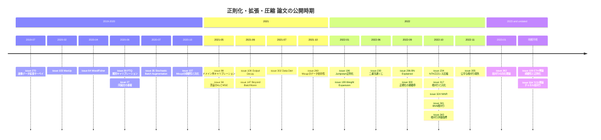

# 正則化・データ拡張・モデル圧縮・知識蒸留・正規化層の理論

> 対象: primary 論文 27 件（issue ベース。#27 と #39 は同一論文 arXiv:2006.10518 の重複登録のため、実質 26 本）
> 論文の公開期間: 2019-07 〜 2023-01（博士論文 2 件 #109, #304 は公開時期不明）
> issue 登録期間: 2020-06-24 〜 2023-01-05

## 概要

このノート群は「学習を良くする/モデルを軽くする小さな工夫が、なぜ効くのか」を一貫して追っている。手法提案の論文も読んでいるが、関心の中心は次の問いにある。

1. **データ拡張・Mixup はなぜ汎化と頑健性を改善するのか。** 正則化項として書き直せるのか（#137, #269, #103）。
2. **ドロップアウト、ノイズ注入、出力正則化などの明示的正則化のメカニズムは何か。** 汎化指標とどう結び付くのか（#199, #324, #100, #196）。
3. **枝刈り（プルーニング）で汎化が改善するのはサイズ削減のためか。** 評価指標は公平か、特定のサブグループに害はないか（#317, #362, #343, #355）。
4. **学習後量子化（PTQ）や蒸留、データ刈り込みで、少ないデータ・計算でどこまで性能を保てるか**（#39, #88, #94, #302, #234）。
5. **BatchNorm などの正規化層は何をしているのか。** BN 以外の正規化層にもそのメカニズムは一般化できるのか（#147, #296, #300）。

## 目次

1. [背景と基本概念](#背景と基本概念)
2. [研究の系譜・時系列ナラティブ](#研究の系譜時系列ナラティブ)
3. [タイムライン](#タイムライン)
4. [サブトピック別の整理](#サブトピック別の整理)
5. [論文一覧](#論文一覧)
6. [採択先別の集計](#採択先別の集計)
7. [各論文の詳細まとめ](#各論文の詳細まとめ)
8. [横断的な知見・未解決問題](#横断的な知見未解決問題)
9. [関連論文](#関連論文)

## 背景と基本概念

### データ拡張と Mixup

データ拡張は、幾何変換・色空間変換・ランダム消去・画像混合・GAN による生成などで訓練データを水増しし、過学習を抑える技術群である（サーベイ [#270](https://github.com/Hiroki11x/Papers/issues/270)）。Mixup は 2 サンプルの入力とラベルを凸結合する。

$$
\tilde{x} = \lambda x_i + (1-\lambda) x_j,\quad \tilde{y} = \lambda y_i + (1-\lambda) y_j,\quad \lambda \sim \mathrm{Beta}(\alpha, \alpha)
$$

ノート群で扱う理論的な問いは主に 2 つある。1 つは Mixup 損失を 2 次近似すると「元の損失 + データ適応的な正則化項」の形になるかどうか（[#137](https://github.com/Hiroki11x/Papers/issues/137)）。もう 1 つは、Mixup 損失の最小化が元の経験リスクの最小化と一致するかどうか（[#269](https://github.com/Hiroki11x/Papers/issues/269)）である。MaxUp（[#103](https://github.com/Hiroki11x/Papers/issues/103)）は、拡張サンプル集合 $\{x'_1,\dots,x'_m\}$ に対する最悪ケース損失 $\max_k \ell(x'_k)$ を最小化する。ガウス摂動の場合、これは漸近的に勾配ノルムペナルティと等価になる。

### 明示的正則化

- **ドロップアウト**: ユニットをランダムに落とす。[#199](https://github.com/Hiroki11x/Papers/issues/199) は、重み共分散行列の列/行ベクトルが張る平行体の符号付き体積の増大（weight expansion）でドロップアウトを説明する。
- **ノイズ注入**: [#324](https://github.com/Hiroki11x/Papers/issues/324) は外部ノードから適応的な構造化ノイズを入れる。
- **出力正則化**: [#100](https://github.com/Hiroki11x/Papers/issues/100) はモデル出力の平均・分散を小さくする項を加える。

### 枝刈りと 2 次情報

Optimal Brain Damage/Surgeon（OBS）系の枝刈りでは、重み $w_q$ を 0 にしたときの損失増分を 2 次近似で見積もる。

$$
\delta L \approx \frac{w_q^2}{2\,[H^{-1}]_{qq}}
$$

このため、逆ヘシアン（実際にはフィッシャー行列 $F$ で代用）の近似精度が鍵になる。WoodFisher（[#64](https://github.com/Hiroki11x/Papers/issues/64)）は Woodbury 公式で $F^{-1}$ を効率よく近似する。ノートでは、フィッシャーと経験的フィッシャーの違いが整理されている。

$$
F = \mathbb{E}_{x\sim Q_x}\,\mathbb{E}_{y\sim p_\theta(y|x)}\big[\nabla_\theta \log p_\theta(y|x)\nabla_\theta \log p_\theta(y|x)^\top\big],\qquad
\tilde F = \frac{1}{N}\sum_n \nabla_\theta \log p_\theta(y_n|x_n)\nabla_\theta \log p_\theta(y_n|x_n)^\top
$$

経験的フィッシャー $\tilde F$ は、モデルの予測分布の代わりに正解ラベル $y_n$ を使う。$\tilde F$ が $F$ に近いのは、モデルが真の分布に近いという強い仮定の下だけである。

宝くじ仮説（LTH）は、密なネットワークの中に、単独で学習しても同等性能に達する疎なサブネットワーク（当たりくじ）が存在するという主張である（[#230](https://github.com/Hiroki11x/Papers/issues/230)）。

### 学習後量子化（PTQ）

PTQ は、学習済みモデルを再学習せずに低ビット化する手法である。少量のキャリブレーションデータで、重み・活性の量子化範囲（スケール $s$）を決める。量子化関数は $Q(w) = s\cdot \mathrm{clip}(\mathrm{round}(w/s), q_{\min}, q_{\max})$ と書ける。8 ビット未満では精度が大きく落ちやすい。そのため、層ごとの量子化誤差の最小化、層ごとのビット幅割り当て、バイアス補正が研究されている（[#39](https://github.com/Hiroki11x/Papers/issues/39)）。学習時の低精度演算（FP8 など）については [Low Precision と Muon](../practical_optimization/02_low_precision_and_muon.md) を参照。

### 知識蒸留とデータ刈り込み

知識蒸留では、温度 $\tau$ で軟化した教師出力 $p_T^\tau$ に生徒 $p_S^\tau$ を合わせる。典型的な損失は次のとおりである。

$$
\mathcal{L} = (1-\alpha)\,\mathrm{CE}(y, p_S) + \alpha\,\tau^2\,\mathrm{KL}(p_T^\tau \,\|\, p_S^\tau)
$$

[#94](https://github.com/Hiroki11x/Papers/issues/94) は、この KL 項とロジット間 MSE を比較する。データ刈り込みでは、各サンプルの重要度スコアで訓練集合を削る。EL2N スコアは $\mathbb{E}\,\|p_\theta(x) - y\|_2$（予測確率と one-hot ラベルの L2 距離）で、GraNd は初期の損失勾配ノルムである（[#302](https://github.com/Hiroki11x/Papers/issues/302)）。

### 正規化層

BatchNorm はミニバッチ統計で特徴を標準化し、アフィン変換を掛ける。

$$
\hat h = \frac{h-\mu_B}{\sqrt{\sigma_B^2+\epsilon}},\qquad \mathrm{BN}(h)=\gamma \hat h + \beta
$$

LayerNorm・InstanceNorm・GroupNorm は統計を取る軸が異なる変種である。ノート群は、これらの違いを「活性の爆発抑制」「サンプル間の区別可能性」「初期層の勾配ノルム」で説明する理論（[#147](https://github.com/Hiroki11x/Papers/issues/147)）と、スプライン分割の観点から BN を説明する理論（[#296](https://github.com/Hiroki11x/Papers/issues/296)）を扱う。

## 研究の系譜・時系列ナラティブ

時代区分は、issue 登録時期（＝研究者が読んだ時期）と論文の公開時期の両方に合わせて 4 期に分けた。

### 第 1 期（issue 2020-06〜2020-12）: 実用的な圧縮と拡張

最初に登録されたのは、実務寄りの圧縮・拡張手法である。

- [#39](https://github.com/Hiroki11x/Papers/issues/39)（重複 [#27](https://github.com/Hiroki11x/Papers/issues/27)）の PTQ パイプラインは、「再学習なしで 8 ビット未満にする」問題に、層ごとのキャリブレーション、整数計画によるビット幅割り当て、バイアス補正で取り組む。本人は、キャリブレーションセットで層ごとの量子化誤差を最小化する点が肝かもしれないとメモしている。
- [#35](https://github.com/Hiroki11x/Papers/issues/35) の Stochastic Batch Augmentation は、拡張サンプルが元サンプルを囲むという分布情報を、蒸留型のソフトラベル正則化（KL）として使う。このノート群で拡張と蒸留をつなぐ最初の論文である。
- NeurIPS 2020 の「気になったシリーズ」として読まれた WoodFisher [#64](https://github.com/Hiroki11x/Papers/issues/64) は、枝刈りを 2 次情報の近似問題として扱う。本人はここから「フィッシャーの期待値と経験的フィッシャーの関係」へ疑問を広げ、Kunstner らの *Limitations of the Empirical Fisher Approximation* を併読した。この関心は、[オプティマイザ設計](./07_optimizer_design.md)の 2 次法の話題にもつながる。

### 第 2 期（issue 2021-06〜2021-10）: 「なぜ効くか」への転換

2021 年 6〜10 月にまとめて登録された論文群では、関心が「手法」から「メカニズム」へ移っている。

- **Mixup の理論**: [#137](https://github.com/Hiroki11x/Papers/issues/137)（ICLR 2021 Spotlight）は、Mixup 損失の 2 次近似が敵対的損失の上界の近似最小化に当たることを示した（FGSM などへの頑健性）。同時に、ラデマッハ複雑度を抑えるデータ適応的正則化になることも示した。この論文は 2021 年 8 月の進捗報告資料にも添付されている。
- **頑健最適化としての拡張**: [#103](https://github.com/Hiroki11x/Papers/issues/103) MaxUp は、拡張サンプルの最悪ケース損失の最小化が平滑性正則化（勾配ノルムペナルティ）と漸近的に等価であることを示す。ただし本人は「これで CVPR 2021 に通るのか」と、新規性に懐疑的である。
- **出力の正則化**: [#100](https://github.com/Hiroki11x/Papers/issues/100) Output Decay は、「出力の平均・分散が小さいほど性能が良い」という相関を因果と仮定して正則化項にした、大胆な経験的論文である。
- **蒸留と量子化のデータ依存性**: [#94](https://github.com/Hiroki11x/Papers/issues/94) は蒸留損失としての KL と MSE を比較する論文で、ノートでは「蒸留でラベルノイズを緩和する方法を提案」とだけ記されている。[#88](https://github.com/Hiroki11x/Papers/issues/88) は、PTQ のキャリブレーションにドメイン外データ（X 線・衛星・超音波など）を使っても性能が驚くほど安定することを示した。[#39](https://github.com/Hiroki11x/Papers/issues/39) が前提とする「キャリブレーションセットは訓練データ由来」という仮定を緩める論文である。
- **正規化層の統一理論**: [#147](https://github.com/Hiroki11x/Papers/issues/147)（Lubana, Dick, Tanaka）は、BatchNorm の有益なメカニズムを GroupNorm・LayerNorm・InstanceNorm などに一般化した。
- **博士論文**: [#109](https://github.com/Hiroki11x/Papers/issues/109)（ETH Zurich「Robustness and Regularization of DNNs」）はテンプレートのみで、中身は未記入。

### 第 3 期（issue 2022-02〜2022-11）: 正則化のメカニズムと枝刈りの汎化

2022 年は登録数が最も多く、以下の 3 つの流れが並行する。

**(a) 正則化と汎化指標の接続**
- [#199](https://github.com/Hiroki11x/Papers/issues/199) Weight Expansion は、ドロップアウトの効果を PAC-Bayes 的な汎化指標（重み共分散の体積）で説明する。本人は、ICLR 2021 でスコアがまあまあ良かったのに withdraw されていた経緯をメモしている（最終的には TMLR に採択）。
- [#196](https://github.com/Hiroki11x/Papers/issues/196) Jumpstart 正則化は、ニューロンの死滅と線形化を防いで「薄く深い」ネットワークを学習する。
- [#324](https://github.com/Hiroki11x/Papers/issues/324) NINR は、学習初期にノイズがダイナミクスを支配するように初期化と適応ノイズを組み合わせ、ドメインシフトを含む摂動への頑健性を高める。

**(b) Mixup とデータの再検討**
- [#269](https://github.com/Hiroki11x/Papers/issues/269) は [#137](https://github.com/Hiroki11x/Papers/issues/137) の問いを引き継ぎ、「Mixup は常に良い」という見方に条件を付ける。Mixup 最適分類器の閉形式を導き、経験リスクを最小化しない反例データセットを構成する一方で、最小化する十分条件も与える。線形モデル・線形分離可能データでは、標準学習と同じ分類器になることも示した。
- [#270](https://github.com/Hiroki11x/Papers/issues/270) の画像データ拡張サーベイが、手法全体の見取り図として後から登録されている。
- [#302](https://github.com/Hiroki11x/Papers/issues/302) Data Diet は、学習初期の GraNd/EL2N スコアで汎化に重要なサンプルを特定し、精度を落とさずにデータを刈り込む。データ側の「圧縮」に当たる。スケーリング則の文脈では、[#416](https://github.com/Hiroki11x/Papers/issues/416)（データプルーニングによるべき乗則の打破, [09_scaling_laws.md](./09_scaling_laws.md)）へつながる。

**(c) 枝刈りの再評価と理論化**
- [#230](https://github.com/Hiroki11x/Papers/issues/230) は、LTH を「標準汎化と敵対的汎化の両方で転移する二重当選くじ」に拡張した。ロバスト事前学習のほうが良いくじを生むと報告している。
- [#234](https://github.com/Hiroki11x/Papers/issues/234) は、NTK とランダム行列理論から、重み・活性を $\{0,\pm1\}$ にしても NTK が漸近的に変わらない「ロスレス圧縮」を導く。量子化を理論側から捉えた論文である。
- [#317](https://github.com/Hiroki11x/Papers/issues/317) は、「枝刈りで汎化が良くなるのはモデルが小さくなるから」というバイアス–分散的な仮説を否定する。代わりに、ある範囲のスパース度では学習損失自体の改善、別の範囲ではノイズ例への正則化、という 2 要因で説明する。
- 評価の公平性について、[#343](https://github.com/Hiroki11x/Papers/issues/343) は、最終精度も精度低下もベースラインの選び方次第で結論が変わると指摘し、複数ベースラインで平均する Average from Scratches を提案した。[#355](https://github.com/Hiroki11x/Papers/issues/355) は、強く枝刈りすると一部のサブグループで精度が大きく落ちる（バイアス増幅）問題に、性能重み付き損失（PW loss）で対処する。
- 手法面では、[#341](https://github.com/Hiroki11x/Papers/issues/341)（ベイズモデル削減による BNN の枝刈り。明確な停止基準を持つ）と [#304](https://github.com/Hiroki11x/Papers/issues/304)（チャネル枝刈りの顕著性指標を体系化した博士論文）がある。

このほか、正規化層の理論も続いている。[#296](https://github.com/Hiroki11x/Papers/issues/296) は、BN をスプライン分割をデータに合わせる教師なし手法として説明し、ミニバッチ統計の揺らぎがドロップアウト的な摂動として決定境界のマージンを広げると論じる。[#300](https://github.com/Hiroki11x/Papers/issues/300) は、入力正規化の動機を述べた書籍章である。

### 第 4 期（issue 2023-01）: 枝刈りの汎化理論

[#362](https://github.com/Hiroki11x/Papers/issues/362) は、初期化時の枝刈りで汎化がわずかに改善しうるという経験的観察を、過パラメータ化された 2 層 NN で初めて理論的に扱った（[#317](https://github.com/Hiroki11x/Papers/issues/317) と同じく「枝刈りで汎化が改善しうる」現象を対象とするが、こちらは学習前のランダム枝刈りに限る）。初期化時のランダム枝刈り率が閾値以下なら、枝刈り率が大きいほど汎化境界が改善する。一方、大きすぎる枝刈り率ではノイズを記憶し、汎化はランダム推測並みになる。正の結果と負の結果の両方を示しており、[#317](https://github.com/Hiroki11x/Papers/issues/317) の「スパース度によって効き方が変わる」という観察と整合する。

## タイムライン

（論文の公開時期 first_public 順。公開時期不明の博士論文 2 件は末尾）

## サブトピック別の整理

### 1. データ拡張・Mixup（手法と理論）

**要点**
- Mixup は「近似的な正則化付き損失最小化」として解析できる。その正則化項から、ワンステップ敵対攻撃への頑健性と汎化の改善を説明できる（#137）。
- 一方、Mixup が元の経験リスクを最小化しないデータセットも構成できる。効果はデータの構造に依存する（#269）。
- 拡張を「最悪ケース」や「分布情報の蒸留」として使う手法（MaxUp, SBA）は、平滑性正則化と解釈できる。

**論文**: [#270](https://github.com/Hiroki11x/Papers/issues/270), [#35](https://github.com/Hiroki11x/Papers/issues/35), [#103](https://github.com/Hiroki11x/Papers/issues/103), [#137](https://github.com/Hiroki11x/Papers/issues/137), [#269](https://github.com/Hiroki11x/Papers/issues/269)

### 2. 明示的正則化（ドロップアウト・ノイズ注入・出力正則化ほか）

**要点**
- ドロップアウトの効果を weight expansion（PAC-Bayes）で説明し、同じ指標を増やす別の手法でも汎化が改善すると主張する（#199）。
- 学習初期にノイズを支配的にすると、ドメインシフトを含むさまざまな摂動への頑健性が上がる。改善が最も大きいのは非構造化ノイズである（#324）。
- 出力の大きさや分散そのものを正則化する（#100）、ニューロンの死滅・線形化を防ぐ（#196）といった、損失関数側の小さな修正の論文もある。

**論文**: [#100](https://github.com/Hiroki11x/Papers/issues/100), [#109](https://github.com/Hiroki11x/Papers/issues/109), [#196](https://github.com/Hiroki11x/Papers/issues/196), [#199](https://github.com/Hiroki11x/Papers/issues/199), [#324](https://github.com/Hiroki11x/Papers/issues/324)

### 3. 枝刈り（手法・評価・汎化理論）

**要点**
- 手法面では、2 次情報（WoodFisher）、ベイズモデル削減（BNN）、チャネル顕著性指標の体系化（博論）がある。
- 評価面では、最終精度も精度低下もベースライン依存で不公平である（#343）。全体精度が保たれても、一部のサブグループが大きく劣化しうる（#355）。
- 汎化面では、改善はサイズ削減では説明できず、「学習改善」と「正則化」の 2 要因による（#317）。ランダム枝刈りには、汎化を改善する閾値と、壊す領域がある（#362）。
- LTH は、敵対的頑健性と少データ転移の観点にも拡張されている（#230）。

**論文**: [#64](https://github.com/Hiroki11x/Papers/issues/64), [#230](https://github.com/Hiroki11x/Papers/issues/230), [#304](https://github.com/Hiroki11x/Papers/issues/304), [#317](https://github.com/Hiroki11x/Papers/issues/317), [#341](https://github.com/Hiroki11x/Papers/issues/341), [#343](https://github.com/Hiroki11x/Papers/issues/343), [#355](https://github.com/Hiroki11x/Papers/issues/355), [#362](https://github.com/Hiroki11x/Papers/issues/362)

### 4. 量子化・圧縮

**要点**
- PTQ では、層ごとの誤差最小化、整数計画によるビット幅割り当て、バイアス補正で、8 ビット未満でも精度を保てる。ResNet50 を元サイズの 13% に圧縮しても、精度低下は 1% 以下だった（#39）。
- キャリブレーションデータはドメイン外でもよく、グラム行列の類似度が選択基準になる（#88）。
- 理論面では、NTK のスペクトル等価性に基づく $\{0,\pm1\}$ 量子化の「ロスレス」圧縮がある（#234）。
- 学習時の低精度化は [Low Precision と Muon](../practical_optimization/02_low_precision_and_muon.md) で扱う。

**論文**: [#27](https://github.com/Hiroki11x/Papers/issues/27)（重複）, [#39](https://github.com/Hiroki11x/Papers/issues/39), [#88](https://github.com/Hiroki11x/Papers/issues/88), [#234](https://github.com/Hiroki11x/Papers/issues/234)

### 5. 知識蒸留とデータ刈り込み

**要点**
- 蒸留損失としての KL とロジット間 MSE を比較し、蒸留でラベルノイズを緩和する方法を提案する（#94。ノートは一行のみ）。
- 学習初期のローカルな情報（GraNd, EL2N）だけで汎化に重要なサンプルを特定でき、データの大部分を刈り込める（#302）。
- 蒸留とデータプルーニングのスケーリングは [09_scaling_laws.md](./09_scaling_laws.md) を参照。

**論文**: [#94](https://github.com/Hiroki11x/Papers/issues/94), [#302](https://github.com/Hiroki11x/Papers/issues/302)

### 6. 正規化層の理論

**要点**
- 活性ベースの正規化は、ResNet での活性の指数的増大を防ぐ。パラメトリックな手法では明示的な対策が必要になる（#147）。
- GroupNorm はグループサイズで速度と安定性のトレードオフを持つ。大きいと LayerNorm のように収束が遅く、小さいと InstanceNorm のように不安定になる（#147）。
- BN は重みや勾配に依存せずスプライン分割をデータに合わせる「賢い初期化」であり、ミニバッチ統計の揺らぎがマージンを広げる（#296）。

**論文**: [#147](https://github.com/Hiroki11x/Papers/issues/147), [#296](https://github.com/Hiroki11x/Papers/issues/296), [#300](https://github.com/Hiroki11x/Papers/issues/300)

## 論文一覧

（first_public 順。records から Python で生成）

| 公開 | 論文 | 著者/組織 | 採択先 | 根拠 | サブトピック |
|---|---|---|---|---|---|
| 2019-07 | [#270](https://github.com/Hiroki11x/Papers/issues/270) A survey on Image Data Augmentation for Deep Learning | Connor Shorten, Taghi M. Khoshgoftaar / Florida Atlantic University | Journal of Big Data | issue記載 | データ拡張サーベイ |
| 2020-02 | [#103](https://github.com/Hiroki11x/Papers/issues/103) MaxUp: Lightweight Adversarial Training With Data Augmentation Improves Neural Network Training | Chengyue Gong, Tongzheng Ren, Mao Ye, et al. / UT Austin | CVPR 2021 | issue記載 | データ拡張と頑健最適化 |
| 2020-04 | [#64](https://github.com/Hiroki11x/Papers/issues/64) WoodFisher: Efficient Second-Order Approximation for Neural Network Compression | Sidak Pal Singh, Dan Alistarh / IST Austria | NeurIPS 2020 | issue記載 | 逆ヘシアン近似とプルーニング |
| 2020-06 | [#27](https://github.com/Hiroki11x/Papers/issues/27) Improving Post Training Neural Quantization: Layer-wise Calibration and Integer Programming | Itay Hubara, Yury Nahshan, Yair Hanani, et al. / Habana Labs / Technion | ICML 2021 | Web確認 | 学習後量子化（PTQ） |
| 2020-06 | [#39](https://github.com/Hiroki11x/Papers/issues/39) Improving Post Training Neural Quantization: Layer-wise Calibration and Integer Programming | Itay Hubara, Yury Nahshan, Yair Hanani, et al. / Habana Labs / Technion | ICML 2021 | Web確認 | 学習後量子化（PTQ） |
| 2020-07 | [#35](https://github.com/Hiroki11x/Papers/issues/35) Stochastic Batch Augmentation with An Effective Distilled Dynamic Soft Label Regularizer | — | IJCAI 2020 | Web確認 | データ拡張と正則化 |
| 2020-10 | [#137](https://github.com/Hiroki11x/Papers/issues/137) How Does Mixup Help With Robustness and Generalization? | Linjun Zhang, Zhun Deng, Kenji Kawaguchi, et al. | ICLR 2021 | issue記載 | Mixupの理論解析 |
| 2021-05 | [#88](https://github.com/Hiroki11x/Papers/issues/88) Is In-Domain Data Really Needed? A Pilot Study on Cross-Domain Calibration for Network Quantization | Haichao Yu, Linjie Yang, Humphrey Shi | CVPR 2021 Workshop (ECV) | Web確認 | 学習後量子化のキャリブレーション |
| 2021-05 | [#94](https://github.com/Hiroki11x/Papers/issues/94) Comparing Kullback-Leibler Divergence and Mean Squared Error Loss in Knowledge Distillation | Taehyeon Kim, Jaehoon Oh, NakYil Kim, et al. / KAIST | IJCAI 2021 | Web確認 | 知識蒸留の損失関数 |
| 2021-06 | [#100](https://github.com/Hiroki11x/Papers/issues/100) Go Small and Similar: A Simple Output Decay Brings Better Performance | Xuan Cheng, Tianshu Xie, Xiaomin Wang, et al. | arXiv（プレプリント） | 不明 | 出力正則化 |
| 2021-06 | [#147](https://github.com/Hiroki11x/Papers/issues/147) Beyond BatchNorm: Towards a Unified Understanding of Normalization in Deep Learning | Ekdeep Singh Lubana, Robert P. Dick, Hidenori Tanaka / University of Michigan / NTT | NeurIPS 2021 | arXivコメント | 正規化層の理論 |
| 2021-07 | [#302](https://github.com/Hiroki11x/Papers/issues/302) Deep Learning on a Data Diet: Finding Important Examples Early in Training | Mansheej Paul, Surya Ganguli, Gintare Karolina Dziugaite / Stanford | NeurIPS 2021 | arXivコメント | データ刈り込み |
| 2021-10 | [#269](https://github.com/Hiroki11x/Papers/issues/269) Towards Understanding the Data Dependency of Mixup-style Training | Muthu Chidambaram, Xiang Wang, Yuzheng Hu, et al. (Rong Ge) / Duke | ICLR 2022 | issue記載 | Mixupの理論 |
| 2022-01 | [#196](https://github.com/Hiroki11x/Papers/issues/196) Training Thinner and Deeper Neural Networks: Jumpstart Regularization | Carles Riera, Camilo Rey, Thiago Serra, et al. | CPAIOR 2022 | Web確認 | 正則化 |
| 2022-01 | [#199](https://github.com/Hiroki11x/Papers/issues/199) Weight Expansion: A New Perspective on Dropout and Generalization | Gaojie Jin, Xinping Yi, Pengfei Yang, et al. / University of Liverpool | TMLR | arXivコメント | ドロップアウトと汎化 |
| 2022-06 | [#230](https://github.com/Hiroki11x/Papers/issues/230) Data-Efficient Double-Win Lottery Tickets from Robust Pre-training | Tianlong Chen, Zhenyu Zhang, Sijia Liu, et al. | ICML 2022 | arXivコメント | 宝くじ仮説とロバスト事前学習 |
| 2022-09 | [#296](https://github.com/Hiroki11x/Papers/issues/296) Batch Normalization Explained | Randall Balestriero, Richard G. Baraniuk / Rice University / Meta | arXiv（プレプリント） | 不明 | バッチ正規化の理論 |
| 2022-09 | [#300](https://github.com/Hiroki11x/Papers/issues/300) Motivation and Overview of Normalization in DNNs | Lei Huang | Book chapter (Springer) | issue記載 | 正規化（書籍章） |
| 2022-10 | [#234](https://github.com/Hiroki11x/Papers/issues/234) Lossless Compression of Deep Neural Networks: A High-dimensional Neural Tangent Kernel Approach | Lingyu Gu, Yongqi Du, Yuan Zhang, et al. (Zhenyu Liao) | NeurIPS 2022 | issue記載 | NTKとランダム行列理論 |
| 2022-10 | [#317](https://github.com/Hiroki11x/Papers/issues/317) Pruning's Effect on Generalization Through the Lens of Training and Regularization | Tian Jin, Michael Carbin, Daniel M. Roy, et al. / MIT / Google | NeurIPS 2022 | arXivコメント | プルーニングと汎化 |
| 2022-10 | [#324](https://github.com/Hiroki11x/Papers/issues/324) Noise Injection Node Regularization for Robust Learning | Noam Levi, Itay M. Bloch, Marat Freytsis, Tomer Volansky / Tel Aviv University | ICLR 2023 | arXivコメント | ノイズ注入正則化 |
| 2022-10 | [#341](https://github.com/Hiroki11x/Papers/issues/341) Principled Pruning of Bayesian Neural Networks through Variational Free Energy Minimization | Jim Beckers, Bart van Erp, Ziyue Zhao, et al. | IEEE Open Journal of Signal Processing | arXivコメント | ベイズNNの枝刈り |
| 2022-10 | [#343](https://github.com/Hiroki11x/Papers/issues/343) Which Metrics for Network Pruning: Final Accuracy? Or Accuracy Drop? | — | ICIP 2022 | issue記載 | 枝刈りの評価指標 |
| 2022-11 | [#355](https://github.com/Hiroki11x/Papers/issues/355) A Fair Loss Function for Network Pruning | Robbie Meyer, Alexander Wong / University of Waterloo | NeurIPS 2022 Workshop (TSRML) | arXivコメント | 枝刈りと公平性 |
| 2023-01 | [#362](https://github.com/Hiroki11x/Papers/issues/362) Pruning Before Training May Improve Generalization, Provably | Hongru Yang, Yingbin Liang, Xiaojie Guo, et al. | JMLR | Web確認 | 枝刈りと汎化の理論 |
| 不明 | [#109](https://github.com/Hiroki11x/Papers/issues/109) Robustness and Regularization of Deep Neural Networks | ETH Zurich | PhD Thesis (ETH Zurich) | issue記載 | 頑健性と正則化 |
| 不明 | [#304](https://github.com/Hiroki11x/Papers/issues/304) Improving Saliency Metrics for Channel Pruning of Convolutional Neural Networks | Trinity College Dublin | PhD Thesis (Trinity College Dublin) | issue記載 | チャネルプルーニング（博論） |

## 採択先別の集計

（会議・ジャーナル系列ごと。ワークショップは本会議と別に集計。records から Python で生成）

| 採択先（系列） | 件数 | issue |
|---|---|---|
| NeurIPS | 5 | [#64](https://github.com/Hiroki11x/Papers/issues/64), [#147](https://github.com/Hiroki11x/Papers/issues/147), [#234](https://github.com/Hiroki11x/Papers/issues/234), [#302](https://github.com/Hiroki11x/Papers/issues/302), [#317](https://github.com/Hiroki11x/Papers/issues/317) |
| ICLR | 3 | [#137](https://github.com/Hiroki11x/Papers/issues/137), [#269](https://github.com/Hiroki11x/Papers/issues/269), [#324](https://github.com/Hiroki11x/Papers/issues/324) |
| ICML | 3 | [#27](https://github.com/Hiroki11x/Papers/issues/27), [#39](https://github.com/Hiroki11x/Papers/issues/39), [#230](https://github.com/Hiroki11x/Papers/issues/230) |
| arXiv（プレプリント） | 2 | [#100](https://github.com/Hiroki11x/Papers/issues/100), [#296](https://github.com/Hiroki11x/Papers/issues/296) |
| IJCAI | 2 | [#35](https://github.com/Hiroki11x/Papers/issues/35), [#94](https://github.com/Hiroki11x/Papers/issues/94) |
| Book chapter (Springer) | 1 | [#300](https://github.com/Hiroki11x/Papers/issues/300) |
| CPAIOR | 1 | [#196](https://github.com/Hiroki11x/Papers/issues/196) |
| CVPR | 1 | [#103](https://github.com/Hiroki11x/Papers/issues/103) |
| CVPR Workshop | 1 | [#88](https://github.com/Hiroki11x/Papers/issues/88) |
| ICIP | 1 | [#343](https://github.com/Hiroki11x/Papers/issues/343) |
| IEEE Open Journal of Signal Processing | 1 | [#341](https://github.com/Hiroki11x/Papers/issues/341) |
| JMLR | 1 | [#362](https://github.com/Hiroki11x/Papers/issues/362) |
| Journal of Big Data | 1 | [#270](https://github.com/Hiroki11x/Papers/issues/270) |
| NeurIPS Workshop | 1 | [#355](https://github.com/Hiroki11x/Papers/issues/355) |
| PhD Thesis (ETH Zurich) | 1 | [#109](https://github.com/Hiroki11x/Papers/issues/109) |
| PhD Thesis (Trinity College Dublin) | 1 | [#304](https://github.com/Hiroki11x/Papers/issues/304) |
| TMLR | 1 | [#199](https://github.com/Hiroki11x/Papers/issues/199) |

## 各論文の詳細まとめ

### [#270] A survey on Image Data Augmentation for Deep Learning

- 公開: 2019-07 / 採択先: Journal of Big Data / 著者: Connor Shorten, Taghi M. Khoshgoftaar（Florida Atlantic University）

**要約**: 医療画像のようにビッグデータが得られない領域を念頭に、データ空間での解決策としてのデータ拡張を網羅的にまとめたサーベイ。幾何変換・色空間・カーネルフィルタ・画像混合・ランダム消去・特徴空間拡張・敵対的訓練・GAN・ニューラルスタイル転送・メタ学習を扱い、特に GAN ベースの拡張を大きく取り上げている。

**主な知見**
- テスト時拡張、解像度の影響、最終データセットサイズ、カリキュラム学習といったメタレベルの設計判断も扱う。

### [#103] MaxUp: Lightweight Adversarial Training With Data Augmentation Improves Neural Network Training

- 公開: 2020-02 / 採択先: CVPR 2021 / 著者: Chengyue Gong, Tongzheng Ren, Mao Ye, et al.（UT Austin）

**要約**: ランダムな摂動・変換で拡張サンプルを複数生成し、その最大（最悪ケース）損失を最小化する MaxUp を提案した。ランダム摂動への平滑性・頑健性を暗黙の正則化として導入する。

**主な知見**
- ガウス摂動の場合、MaxUp は損失の勾配ノルムをペナルティとする平滑化と漸近的に等価。
- 画像分類・言語モデリング・敵対的認証で、大きな計算オーバーヘッドなしに既存のベースラインを上回った。ImageNet では、追加データなしで精度が 85.5% から 85.8% に向上した。

**メモ**: 本人は頑健最適化（Robust Optimization）の一種と位置付けたうえで、「これで CVPR 2021 通るのか〜」と新規性に驚いている。

### [#64] WoodFisher: Efficient Second-Order Approximation for Neural Network Compression

- 公開: 2020-04 / 採択先: NeurIPS 2020 / 著者: Sidak Pal Singh, Dan Alistarh（IST Austria）

**要約**: Woodbury 公式に基づいて逆フィッシャー（逆ヘシアン）を効率よく近似する WoodFisher を提案した。古典的な Optimal Brain Damage/Surgeon の枠組みで、ネットワーク圧縮に適用している。

**主な知見**
- ワンショット枝刈りで、既存の最先端手法を大幅に上回った。
- 反復的・段階的な枝刈りでも、ImageNet でテスト精度を改善した。
- 1 次情報を取り込む拡張により、層ごとの枝刈り閾値の自動設定や、限られたデータでの圧縮が可能になる。

**メモ**: NeurIPS 2020「気になったシリーズ」として読まれた。本人の疑問は次のとおり。フィッシャーを $P_{y,x}=Q_x P_{y|x}$ で期待値を取りたいが、$Q_x$ は経験分布 $\hat Q_x$ で代用するしかない。さらに $P_{y|x}$ が one-hot ラベル $\hat Q_{y|x}$ に一致すると仮定すれば、$F$ と $H$ は一致する。しかし、それは経験的フィッシャーそのものではないか。この疑問から Kunstner ら *Limitations of the Empirical Fisher Approximation for Natural Gradient Descent* を読み、次のように整理している。経験的フィッシャーとフィッシャーの関係が成り立つのは、(i) モデルが正しく、(ii) モデル容量が十分という強い仮定の下だけで、過パラメータ化された近似最小値の設定では満たされにくい。データ方向の期待値については「ML ではしょうがない」という印象を持っている。

### [#27] Improving Post Training Neural Quantization: Layer-wise Calibration and Integer Programming（重複）

- 公開: 2020-06 / 採択先: ICML 2021（"Accurate Post Training Quantization With Small Calibration Sets" として出版） / 著者: Itay Hubara, Yury Nahshan, Yair Hanani, et al.（Habana Labs / Technion）

**要約**: [#39](https://github.com/Hiroki11x/Papers/issues/39) の重複登録（"Duplicate of #39"）。内容は #39 を参照。ノートの一言は「レイヤーごとの量子化の話」。

### [#39] Improving Post Training Neural Quantization: Layer-wise Calibration and Integer Programming

- 公開: 2020-06 / 採択先: ICML 2021（"Accurate Post Training Quantization With Small Calibration Sets" として出版） / 著者: Itay Hubara, Yury Nahshan, Yair Hanani, et al.（Habana Labs / Technion）

**要約**: 量子化モデルの再学習には全データが必要で、実世界では難しい。一方、学習後量子化は 8 ビット未満で精度が大きく落ちる。この問題に対し、advanced と light の 2 つのパイプラインを提案した。

**主な知見**
- (i) キャリブレーションセット上で各層の量子化誤差を最小化する、(ii) 整数計画法で層ごとの最適なビット幅を割り当てる、(iii) 量子化で生じるバイアスを混合精度モデルの統計量の調整で補正する、の 3 要素から成る。
- (ii) と (iii) だけの light パイプラインでも、驚くほど正確な結果が得られる。advanced パイプラインは、ビジョン・テキストの両方で最先端の精度–圧縮率を達成した。
- ResNet50 を元サイズの 13% に圧縮しても、精度低下は 1% 以下。

**メモ**: 「キャリブレーションセットのパラメータを最適化することで各レイヤーの量子化誤差を最小化する」点が肝かもしれない、とコメントしている。

### [#35] Stochastic Batch Augmentation with An Effective Distilled Dynamic Soft Label Regularizer

- 公開: 2020-07 / 採択先: IJCAI 2020 / 著者: —

**要約**: 既存の拡張手法は、合成サンプルが元サンプルを取り囲んでいるという分布情報を無視しているという問題意識から、Stochastic Batch Augmentation（SBA）を提案した。バッチスケジューラが拡張を行うかどうかを確率的に決め、元サンプルとその近傍分布の類似性に基づく「蒸留された」動的ソフトラベル正則化を導入する。

**主な知見**
- 正則化は、元データと仮想データのソフトマックス出力分布間の KL ダイバージェンスによる直接の教師信号として働く。
- CIFAR-10/100 と ImageNet で汎化が向上し、学習の収束も速くなった。

### [#137] How Does Mixup Help With Robustness and Generalization?

- 公開: 2020-10 / 採択先: ICLR 2021（Spotlight） / 著者: Linjun Zhang, Zhun Deng, Kenji Kawaguchi, Amirata Ghorbani, James Zou

**要約**: Mixup がなぜ頑健性と汎化を改善するのかを理論的に解析した。Mixup 学習は、近似的には正則化付きの損失最小化である。

**主な知見**
- 頑健性: Mixup 損失（の 2 次近似）の最小化は、敵対的損失の上界の近似最小化に相当する。これが FGSM などワンステップ攻撃への頑健性を説明する。
- 汎化: Mixup は、過学習を抑えるデータ適応的な正則化に相当し、ラデマッハ複雑度を抑える。
- 今後の方向として、Puzzle Mix や Adversarial Mixup Resynthesis など他の変種への拡張を挙げている。

**メモ**: 2021 年 8 月の進捗報告資料（202108_ProgressReport.pdf）がコメントに添付されている。

### [#88] Is In-Domain Data Really Needed? A Pilot Study on Cross-Domain Calibration for Network Quantization

- 公開: 2021-05 / 採択先: CVPR 2021 Workshop (ECV) / 著者: Haichao Yu, Linjie Yang, Humphrey Shi

**要約**: PTQ のキャリブレーションデータは通常訓練データから取るが、機密性のために使えないことがある。そこで、元データを知らずにドメイン外データでキャリブレーションできるかを、X 線・衛星・超音波画像など大きく異なるドメインで検証した。

**主な知見**
- 13 種類のキャリブレーションデータセット × 10 タスクで、ドメイン横断キャリブレーションでも量子化モデルの性能は驚くほど安定していた。
- 量子化モデルの性能は、ソースドメインとキャリブレーションドメインのグラム行列の類似度と相関する。キャリブレーションセットの選択基準に使える。

### [#94] Comparing Kullback-Leibler Divergence and Mean Squared Error Loss in Knowledge Distillation

- 公開: 2021-05 / 採択先: IJCAI 2021 / 著者: Taehyeon Kim, Jaehoon Oh, NakYil Kim, et al.（KAIST）

**要約**: 知識蒸留の損失として、KL ダイバージェンスとロジット間 MSE を比較した。ノートの記述は「Knowledge Distillation でラベルノイズを緩和する方法を提案」の一行のみ。

### [#100] Go Small and Similar: A Simple Output Decay Brings Better Performance

- 公開: 2021-06 / 採択先: arXiv（プレプリント） / 著者: Xuan Cheng, Tianshu Xie, Xiaomin Wang, et al.

**要約**: 正則化やデータ拡張の研究は多いが、モデル出力を正則化する研究はほとんどない。出力分布の平均・分散が小さいほど性能が良いという経験的観察から出発し、それを因果関係と「大胆に」仮定して、Output Decay という正則化項を提案した。

**主な知見**
- 直感に反する小さな修正だが、性能が大幅に向上し、幅広い適用性・汎用性・既存手法との互換性が実験で示された。

### [#147] Beyond BatchNorm: Towards a Unified Understanding of Normalization in Deep Learning

- 公開: 2021-06 / 採択先: NeurIPS 2021 / 著者: Ekdeep Singh Lubana, Robert P. Dick, Hidenori Tanaka（University of Michigan / NTT）

**要約**: BatchNorm の代替となる正規化層は多数提案されているが、ほとんど使われていない。その一因は、代替になるかどうかを判断する指針がないことにある。そこで、BatchNorm の既知の有益なメカニズムを他の正規化手法へ理論的に一般化し、設計原理を導いた。

**主な知見**
- 活性ベースの正規化層は、BatchNorm と同様に ResNet での活性の指数的増加を防げる。パラメトリックな層では明示的な対策が必要。
- GroupNorm はサンプルごとに異なる活性を割り当てて情報のある順伝播を保証する。しかし、グループサイズが大きくなるとサンプル間の活性が区別しにくくなり、LayerNorm の収束が遅い原因になる。
- グループサイズが小さいと初期層の勾配ノルムが大きくなる。これが InstanceNorm の学習不安定性と、GroupNorm の速度–安定性トレードオフを説明する。

**メモ**: ノートの一言は「Normalization 系のレイヤーの話を網羅的に検証した」。著者の田中氏（Harvard → Stanford → NTT）にも言及している。

### [#302] Deep Learning on a Data Diet: Finding Important Examples Early in Training

- 公開: 2021-07 / 採択先: NeurIPS 2021 / 著者: Mansheej Paul, Surya Ganguli, Gintare Karolina Dziugaite（Stanford）

**要約**: どれだけのデータが不要で、どのサンプルが汎化に重要か、それをどう見つけるかを問う。個々のサンプルの初期損失勾配ノルムを、数回の重み初期化で平均すると、汎化に重要なより小さな訓練サブセットを特定できることを示した。

**主な知見**
- 数エポック学習した後は、勾配ノルムの情報が正規化誤差（EL2N: 予測確率と one-hot ラベルの L2 距離）に反映される。これを使えば、テスト精度を犠牲にせずにデータセットのかなりの部分を刈り込める。
- 学習初期のローカルな情報だけを使う刈り込み法で、忘却されにくいサンプルを捨てる先行研究（forgetting score）と接続する。
- 重要度による順位付けで、ノイズの多いサンプルの検出や、学習中に安定な表現部分空間の特定もできる。

### [#269] Towards Understanding the Data Dependency of Mixup-style Training

- 公開: 2021-10 / 採択先: ICLR 2022 / 著者: Muthu Chidambaram, Xiang Wang, Yuzheng Hu, et al.（Rong Ge）（Duke）

**要約**: Mixup 学習の利点が、分類におけるデータの性質にどう依存するかを調べた。Mixup 最適分類器の閉形式を計算し、Mixup 損失を最小化すると元の経験損失を最小化しない分類器が得られる単純なデータセットを構成した。

**主な知見**
- Mixup 学習が元の経験リスクも最小化するための十分条件を与えた。
- Mixup 分類器のマージンを明らかにし、決定境界が訓練データの全体構造によく適応する理由を説明した。
- 線形モデルと、線形分離可能なデータセットの大きなクラスでは、Mixup 学習は標準学習と同じ分類器を学習する。

### [#196] Training Thinner and Deeper Neural Networks: Jumpstart Regularization

- 公開: 2022-01 / 採択先: CPAIOR 2022 / 著者: Carles Riera, Camilo Rey, Thiago Serra, et al.

**要約**: 深さを稼ぐために幅を広げると、計算資源が増え、モデルが過大になる。量子化や枝刈りなどの圧縮手法で部分的に解決されてきたが、その一部は損失関数の正則化に頼って多くのパラメータの影響を無視できるようにしている。これに対し、ニューロンの死滅や線形化を防ぐ Jumpstart 正則化を提案した。

**主な知見**
- 従来の学習より薄く深く、パラメータ効率の良いネットワークが得られる。

### [#199] Weight Expansion: A New Perspective on Dropout and Generalization

- 公開: 2022-01 / 採択先: TMLR / 著者: Gaojie Jin, Xinping Yi, Pengfei Yang, et al.（University of Liverpool）

**要約**: 重み共分散行列の列/行ベクトルが張る平行体の符号付き体積の増加を weight expansion と定義し、PAC-Bayes の枠組みで汎化を高める有効な手段であることを示した。ドロップアウトは、これを安価に実現する手法だと主張する。

**主な知見**
- ドロップアウトが weight expansion をもたらすという理論的議論と、両者の相関を示す広範な実験を示した。
- weight expansion（収縮）を実現する他の手法でも、汎化が向上（低下）する。weight expansion は副産物ではなく、汎化向上の指標と見なせる。

**メモ**: ICLR 2021 ではスコアがまあまあ良かったのに withdraw されていた、と OpenReview へのリンク付きでメモしている。

### [#230] Data-Efficient Double-Win Lottery Tickets from Robust Pre-training

- 公開: 2022-06 / 採択先: ICML 2022 / 著者: Tianlong Chen, Zhenyu Zhang, Sijia Liu, et al.

**要約**: LTH により、巨大な事前学習モデルを転移性を損なわずに極めて疎なサブネットワークへ置き換えられることが知られている。本論文はより厳しい概念として「二重当選くじ」を定式化した。これは、多様な下流タスクへ独立に転移し、標準学習と敵対的学習の両方の体制で、事前学習モデルと同じ標準汎化と頑健汎化に到達できるサブネットワークである。

**主な知見**
- ロバスト事前学習は、標準的な事前学習より性能の良い二重当選くじを生む傾向がある。
- CIFAR-10/100 では、標準事前学習で 89.26%/73.79%、高速事前学習で 89.26%/79.03%、ImageNet 事前学習で 91.41%/83.22% のスパース度で二重当選サブネットを特定できた。
- 下流データが 1% や 10% に限られる設定でも、データ効率よく転移する。ロバスト事前学習の利点は、くじ方式とデータ制限のある転移で増幅される。

### [#296] Batch Normalization Explained

- 公開: 2022-09 / 採択先: arXiv（プレプリント） / 著者: Randall Balestriero, Richard G. Baraniuk（Rice University / Meta）

**要約**: 現代の DN の多くが連続区分アフィン（CPA）スプラインであることを利用し、関数近似の観点から BN を理論的に調べた。BN は DN の重みや勾配に依存せず、スプライン分割の形状をデータに適合させる教師なし学習技術である。

**主な知見**
- ランダム初期化された DN でも BN が分割をデータに合わせるため、学習性能を上げる「賢い初期化」になる。
- ミニバッチ間の BN 統計量の変動は、分割境界、ひいては決定境界にドロップアウトのようなランダム摂動を与える。これが訓練サンプルと決定境界のマージンを広げ、過学習を減らす。

### [#300] Motivation and Overview of Normalization in DNNs

- 公開: 2022-09 / 採択先: Book chapter (Springer) / 著者: Lei Huang

**要約**: DNN の正規化を概観する書籍の章。入力正規化により特徴間の大きさの差をなくすことは、距離・類似度を使う KNN のようなノンパラメトリックモデルで重要であり、パラメトリックモデルでは最適化効率を上げる。線形モデルについては正規化の理論的な利点があることを説明している。

### [#234] Lossless Compression of Deep Neural Networks: A High-dimensional Neural Tangent Kernel Approach

- 公開: 2022-10 / 採択先: NeurIPS 2022 / 著者: Lingyu Gu, Yongqi Du, Yuan Zhang, et al.（Zhenyu Liao）

**要約**: NTK とランダム行列理論に基づき、幅の広い全結合 DNN の新しい圧縮法を与えた。データ数 $n$ と次元 $p$ がともに大きい高次元領域で、ガウス混合データを仮定すると、DNN の大きなファミリーの NTK 行列の間に漸近的なスペクトル等価性が成り立つ。

**主な知見**
- この結果から、元の密で量子化されていないネットワークと漸近的に同じ NTK を持ち、重みと活性があるスケーリングの下で $\{0,\pm1\}$ のみをとる「ロスレス」圧縮が可能になる。
- 合成データと実データの実験で、数値的な優位性を確認した。

### [#317] Pruning's Effect on Generalization Through the Lens of Training and Regularization

- 公開: 2022-10 / 採択先: NeurIPS 2022 / 著者: Tian Jin, Michael Carbin, Daniel M. Roy, et al.（MIT / Google）

**要約**: 枝刈りで汎化が向上することはよく知られており、バイアス–分散の仮説はこれをモデルサイズの縮小で説明してきた。しかし、過パラメータ化の研究では大きいモデルほど汎化が良い。この矛盾を、経験的な再検討で解消しようとした。

**主な知見**
- 標準的な枝刈りアルゴリズムによる汎化改善は、サイズ削減では説明できない。
- 特定のスパース度では、枝刈りが学習を改善し、密なモデルより学習損失を下げる。
- 他のスパース度では、枝刈りが正則化として働き、ノイズの多い例による精度劣化を密なモデルより減らす。
- 枝刈りは学習時間の延長とモデルサイズの縮小をもたらし、それぞれが学習改善と正則化に対応する。両要因がそろって初めて、汎化への影響を完全に説明できる。

### [#324] Noise Injection Node Regularization for Robust Learning

- 公開: 2022-10 / 採択先: ICLR 2023 / 著者: Noam Levi, Itay M. Bloch, Marat Freytsis, Tomer Volansky（Tel Aviv University）

**要約**: 学習時に DNN へ構造化ノイズを注入して正則化効果を生む、ノイズ注入ノード正則化（NINR）を提案した。適応的なノイズ注入と初期化条件の相互作用により、学習初期にノイズがダイナミクスの支配的な駆動要因になる点が新しい。

**主な知見**
- フィードフォワード DNN で、さまざまなテストデータ摂動への頑健性が大幅に向上する。
- 既存のネットワーク構造や最適化アルゴリズムは変えず、外部ノードを追加するだけで導入できる。
- 改善は非構造化ノイズで最も劇的で、場合によってはドロップアウトや L2 正則化を上回る。クリーンデータでの汎化も概ね維持される。

### [#341] Principled Pruning of Bayesian Neural Networks through Variational Free Energy Minimization

- 公開: 2022-10 / 採択先: IEEE Open Journal of Signal Processing / 著者: Jim Beckers, Bart van Erp, Ziyue Zhao, et al.

**要約**: ベイズモデル削減は、あるモデルの入れ子になったサブモデルすべての性能を、再評価なしに比較できる。主に計算論的神経科学で使われてきたこの手法を定式化し、変分自由エネルギー最小化に基づく BNN の原理的な枝刈りに適用した。

**主な知見**
- 明確な停止基準を持ち、学習時と同じ目的関数を最小化する。信号処理コミュニティの既存の枝刈り法の欠点を解消する。
- 最新の枝刈り手法より良いモデル性能を示した。

### [#343] Which Metrics for Network Pruning: Final Accuracy? Or Accuracy Drop?

- 公開: 2022-10 / 採択先: ICIP 2022 / 著者: —

**要約**: 枝刈りの代表的な 2 指標、最終精度と精度低下（ベースラインとの差）は、いずれも不公平であることを示した。

**主な知見**
- ベースラインネットワークの選び方で、各手法の評価がまったく変わる。ベースラインが低いと精度低下（GAP）が小さくなって有利になり、高いと最終精度が高くなりやすい。
- ベースラインへの依存を減らすため、複数の異なるベースラインで平均する Average from Scratches を提案した。

**メモ**: 背景の問題は解決できており、「ネットワークの枝刈り手法の良し悪しを判断するには良さそう」と評価している。

### [#355] A Fair Loss Function for Network Pruning

- 公開: 2022-11 / 採択先: NeurIPS 2022 Workshop (TSRML) / 著者: Robbie Meyer, Alexander Wong（University of Waterloo）

**要約**: 枝刈りは全体性能にはほとんど影響しないが、既存のバイアスを悪化させ、サンプルの一部の部分集合で性能を大きく下げることがある。これに対し、クロスエントロピーを単純に修正した性能重み付き損失（PW loss）を提案した。

**主な知見**
- 顔分類と皮膚病変分類で、偏った分類器を使って実験した。既存の枝刈り手法を公平性に配慮した文脈で使える、シンプルで効果的なツールである。
- 理論的なスピードアップが大きい（強く枝刈りした）場合に、PW loss を使うと性能劣化が小さい。

**メモ**: キャリブレーションのために損失関数を工夫するアプローチは以前からあり、それを枝刈りに使う視点が新しい、と整理している。キャリブレーションは公平性コミュニティで研究されている（人種差別などは過信が原因になることがある）。ただ、そのコミュニティは閉じているので OOD とうまく絡めたい、公平性をターゲットにすると新規性が出やすい、とも述べている。総評は「既知のアイデアの組み合わせだが、誰もやっていなかったので新しいし意味がありそう」。

### [#362] Pruning Before Training May Improve Generalization, Provably

- 公開: 2023-01 / 採択先: JMLR（2025 年、"Random Pruning Over-parameterized Neural Networks Can Improve Generalization: A Training Dynamics Analysis" として出版） / 著者: Hongru Yang, Yingbin Liang, Xiaojie Guo, et al.

**要約**: ノート上の題は "Theoretical Characterization of How Neural Network Pruning Affects its Generalization"（同じ arXiv:2301.00335）。初期化時の枝刈りで疎なネットワークを学習すると、密なモデルの性能を保つだけでなく、汎化がわずかに改善することがある。この現象を理論的に初めて扱い、枝刈り率が勾配降下のダイナミクスと汎化に与える影響を、過パラメータ化された 2 層 NN の分類で解析した。

**主な知見**
- 初期化時のランダム枝刈り率がある閾値以下なら、勾配降下で学習損失をゼロ近くまで下げられ、汎化も良好である。驚くべきことに、枝刈り率が大きいほど汎化境界は良くなる。
- 逆に、枝刈り率が大きすぎると、勾配降下はノイズの記憶で学習損失をゼロ近くにできても、汎化はランダム推測と変わらない。
- 枝刈りは特徴学習の過程を変える。

### [#109] Robustness and Regularization of Deep Neural Networks

- 公開: 不明 / 採択先: PhD Thesis (ETH Zurich) / 著者: —（ETH Zurich）

**要約**: ETH Zurich の博士論文で、深層ニューラルネットワークの頑健性と正則化を扱う。ノートはテンプレートのみで、内容は未記入。

**メモ**: 「ETH の人の博論、最初だけドイツ語混じってる」。

### [#304] Improving Saliency Metrics for Channel Pruning of Convolutional Neural Networks

- 公開: 不明 / 採択先: PhD Thesis (Trinity College Dublin) / 著者: —（Trinity College Dublin）

**要約**: チャネル枝刈りの要である顕著性指標（saliency metric）を改善する博士論文。既存の指標を 4 つの独立な要素（ベース入力・点ごとの指標・リダクション・スケーリング）で分類し、その構成要素を組み合わせて新しい指標を作れることを示した。

**主な知見**
- 新しいスケーリング手法を提案し、一部の組み合わせ指標が既存の指標を上回った。特に、リダクションとスケーリングの重要性を強調している。
- 複数の顕著性指標の判断を近視眼的オラクルで組み合わせると、単一の指標より良い枝刈り率が得られる。
- 分割・結合接続を持つ CNN では、他層のチャネル重みも横断的に削除できる。この構造制約を考慮するドミノ顕著性指標で、枝刈り率が大幅に改善した。

## 横断的な知見・未解決問題

### コンセンサス

- **「正則化 = 何かの平滑化/頑健化」という見方が共通している。** Mixup（敵対的損失の上界、#137）、MaxUp（勾配ノルムペナルティ、#103）、BN のミニバッチ揺らぎ（マージン拡大、#296）、NINR（初期のノイズ支配、#324）は、いずれも入力や境界の摂動に対する平滑性として説明されている。
- **圧縮は「サイズを減らすこと」以上の効果を持つ。** 枝刈りの汎化改善はサイズ削減では説明できず（#317）、ランダム枝刈りにも汎化を改善する領域がある（#362）。LTH はロバスト性まで転移する（#230）。
- **少量・代替データで十分なことが多い。** PTQ は小さなキャリブレーションセットで済み（#39）、ドメイン外データでも安定する（#88）。データの大部分は学習初期のスコアで刈り込める（#302）。

### 矛盾・緊張関係

- **Mixup の効果の普遍性。** #137 は、Mixup を一般に有益な正則化として解析する。一方 #269 は、経験リスクを最小化しない反例と、線形分離可能データでは標準学習と同じになるケースを示し、効果がデータ構造に強く依存することを強調する。
- **枝刈りと汎化の説明。** 古典的なバイアス–分散の説明（サイズ縮小）と、過パラメータ化の知見（大きいほど良い）は矛盾する。#317 は「学習時間の延長による学習改善」と「サイズ縮小による正則化」の 2 要因でこの矛盾を解こうとする。#362 は、枝刈り率が大きすぎると特徴学習の過程が変わって汎化が壊れることを示す。
- **評価の信頼性。** 平均精度や精度低下で手法を比べる慣行は、ベースライン依存（#343）やサブグループ劣化（#355）を見落とす。手法提案論文の主張（#100, #103 など）をどこまで信じるかにも関わり、本人は MaxUp の採択に懐疑的なコメントを残している。

### 実務上の示唆

- PTQ では、キャリブレーションデータの質（ドメイン、グラム行列の類似度）と層ごとの誤差最小化が効く。8 ビット未満では、ビット幅割り当てとバイアス補正を併用する。
- 枝刈りの評価は、複数のベースラインで平均し（#343）、サブグループごとの精度も確認する（#355）。
- 正規化層の選択は、GroupNorm のグループサイズで速度と安定性のトレードオフを調整するという観点で整理できる（#147）。

### 未解決の問い（ノートから読み取れるもの）

- フィッシャーと経験的フィッシャーの乖離は、枝刈りや 2 次法の実用性能にどの程度効くのか（#64 のメモ）。
- 公平性・キャリブレーション・OOD を、枝刈りの文脈でどう統一的に扱うか（#355 のメモ）。
- Mixup の解析（#137）を Puzzle Mix などの変種や、非線形・非分離データへどう拡張するか（#137, #269）。
- weight expansion のような汎化指標は、正則化手法の設計原理になりうるか（#199）。

## 関連論文

他トピックが primary だが、本トピックにも関係する論文。

- [#38](https://github.com/Hiroki11x/Papers/issues/38) Spherical Motion Dynamics of Deep Neural Networks with Batch Normalization and Weight Decay — [学習率スケジュール・Weight Decay](./08_lr_schedule_weight_decay.md)
- [#74](https://github.com/Hiroki11x/Papers/issues/74) Robustness to Pruning Predicts Generalization in Deep Neural Networks — [汎化・暗黙的バイアス](./04_generalization_implicit_bias.md)
- [#78](https://github.com/Hiroki11x/Papers/issues/78) Distributionally Robust Neural Networks for Group Shifts: On the Importance of Regularization for Worst-Case Generalization — [OOD 汎化](./01_ood_generalization.md)
- [#85](https://github.com/Hiroki11x/Papers/issues/85) An Empirical Study of the Effects of Sample-Mixing Methods for Efficient Training of Generative Adversarial Networks — [GAN・ミニマックス](./10_gan_minimax.md)
- [#102](https://github.com/Hiroki11x/Papers/issues/102) How does topology influence gradient propagation and model performance of deep networks with DenseNet-type skip connections? — [SGD ダイナミクスの理論](./06_sgd_dynamics_theory.md)
- [#118](https://github.com/Hiroki11x/Papers/issues/118) A Winning Hand: Compressing Deep Networks Can Improve Out-Of-Distribution Robustness — [OOD 汎化](./01_ood_generalization.md)
- [#206](https://github.com/Hiroki11x/Papers/issues/206) On Mixup Training: Improved Calibration and Predictive Uncertainty for Deep Neural Networks — [キャリブレーション・不確実性](./02_calibration_uncertainty.md)
- [#225](https://github.com/Hiroki11x/Papers/issues/225) Rethinking the Augmentation Module in Contrastive Learning: Learning Hierarchical Augmentation Invariance with Expanded Views — [継続学習・RL・その他](./12_continual_rl_misc.md)
- [#238](https://github.com/Hiroki11x/Papers/issues/238) Understanding the Generalization Benefit of Normalization Layers: Sharpness Reduction — [損失地形・シャープネス](./03_loss_landscape_sharpness.md)
- [#264](https://github.com/Hiroki11x/Papers/issues/264) Improving Out-of-Distribution Robustness via Selective Augmentation — [OOD 汎化](./01_ood_generalization.md)
- [#275](https://github.com/Hiroki11x/Papers/issues/275) Improving the Trainability of Deep Neural Networks through Layerwise Batch-Entropy Regularization — [SGD ダイナミクスの理論](./06_sgd_dynamics_theory.md)
- [#301](https://github.com/Hiroki11x/Papers/issues/301) Understanding Gradient Regularization in Deep Learning: Efficient Finite-Difference Computation and Implicit Bias — [損失地形・シャープネス](./03_loss_landscape_sharpness.md)
- [#310](https://github.com/Hiroki11x/Papers/issues/310) / [#329](https://github.com/Hiroki11x/Papers/issues/329)（同一論文の重複登録） Cross-Domain Ensemble Distillation for Domain Generalization — [OOD 汎化](./01_ood_generalization.md)
- [#336](https://github.com/Hiroki11x/Papers/issues/336) When and How Mixup Improves Calibration — [キャリブレーション・不確実性](./02_calibration_uncertainty.md)
- [#356](https://github.com/Hiroki11x/Papers/issues/356) ScoreMix: A Scalable Augmentation Strategy for Training GANs with Limited Data — [GAN・ミニマックス](./10_gan_minimax.md)
- [#365](https://github.com/Hiroki11x/Papers/issues/365) Balanced Product of Experts for Long-Tailed Recognition — [OOD 汎化](./01_ood_generalization.md)
- [#413](https://github.com/Hiroki11x/Papers/issues/413) Pre-training under infinite compute — [LLM アーキテクチャ・推論・安全性](./11_llm_architecture_reasoning_safety.md)
- [#416](https://github.com/Hiroki11x/Papers/issues/416) Beyond neural scaling laws: beating power law scaling via data pruning — [スケーリング則](./09_scaling_laws.md)
- [#484](https://github.com/Hiroki11x/Papers/issues/484) Distillation Scaling Laws — [スケーリング則](./09_scaling_laws.md)

**Practical Optimization との関係**
- PTQ 系（[#39](https://github.com/Hiroki11x/Papers/issues/39), [#88](https://github.com/Hiroki11x/Papers/issues/88)）や NTK に基づく量子化圧縮（[#234](https://github.com/Hiroki11x/Papers/issues/234)）は推論時の圧縮である。学習時の低精度化（FP8/混合精度）は [Low Precision と Muon](../practical_optimization/02_low_precision_and_muon.md) を参照。
- BN はミニバッチ統計に依存するため、大バッチ学習との関係は [Critical Batch Size](../practical_optimization/01_critical_batch_size.md) も参照。
