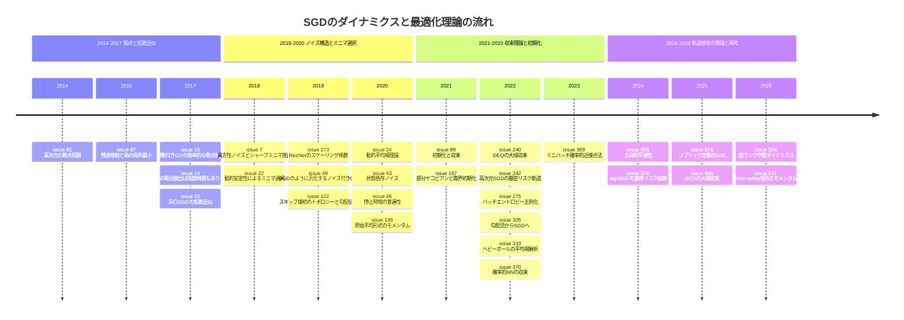

# SGD のダイナミクスと最適化理論 サーベイ（SDE/拡散近似・ノイズ構造・鞍点脱出・収束解析・モメンタム理論・初期化/深さと勾配伝播）

> 本稿は [Hiroki11x/Papers](https://github.com/Hiroki11x/Papers/issues) の論文読みノート（GitHub issues）のうち、SGD のダイナミクスと最適化理論（トピック M06）を primary とする **29件の issue** を再構成したものである。このトピックに重複登録はない（29件 = 29本）。
> - 論文の公開期間: 2014年6月（鞍点問題, Dauphin ら）〜 2026年9月（river-valley 地形でのモメンタム）
> - issue 登録期間: 2020年5月22日 〜 2026年9月28日
> - 記述はノート（issue 本文・コメント）に基づく。数値はノートに記載されたものだけを引用している。ノートがリンクや概要の和訳だけの論文は、記述を短くしている。
> - 関連文書: 平坦性・シャープネス・Edge of Stability は [損失地形・シャープネス](./03_loss_landscape_sharpness.md)、バッチサイズと SGD ノイズスケールは [クリティカルバッチサイズ](../practical_optimization/01_critical_batch_size.md) を参照。

## 概要

ノート群が追っている問いは、おおむね次の5つにまとめられる。

1. **SGD のノイズはどんな構造をしていて、何をしているのか**: 拡散近似（SDE）で何が言えるのか、等方性ノイズ（ランジュバン）と異方性・状態依存ノイズの違いは何か、ノイズは汎化を助けるのか害するのか。
2. **非凸最適化で GD/SGD は鞍点や悪い最小点にどう対処するのか**: 高次元で障害になるのは局所最小か鞍点か、鞍点の脱出に何反復かかるのか。
3. **SGD はどの最小点を選び、どれくらいの速さで収束するのか**: 学習率・バッチサイズが到達可能な最小点をどう制約するか（動的安定性）、収束を保証する一般的な条件や、大域的な $L$-smoothness より実態に合う解析の枠組みは何か。
4. **モメンタムは本当に「加速」しているのか**: SGD+M が SGD より優れる条件、平均場極限での性質、river-valley 型の地形での役割。
5. **深いネットを学習可能にするのは何か**: 残差接続・スケーリング係数・初期化の臨界性・情報の流れの正則化が勾配伝播と収束に与える影響、学習が低ランクの部分空間で起きる理由。

## 目次

1. [背景と基本概念](#1-背景と基本概念)
2. [研究の系譜・時系列](#2-研究の系譜時系列)
3. [タイムライン図](#3-タイムライン図)
4. [サブトピック別の整理](#4-サブトピック別の整理)
5. [論文一覧表（公開順）](#5-論文一覧表公開順)
6. [採択先別の集計](#6-採択先別の集計)
7. [各論文の詳細まとめ](#7-各論文の詳細まとめ)
8. [横断的な知見・未解決問題](#8-横断的な知見未解決問題)
9. [関連論文](#9-関連論文)

---

## 1. 背景と基本概念

### 1.1 SGD とそのノイズ

学習率 $\eta$、バッチサイズ $B$ のミニバッチ SGD は

$$
\theta_{t+1} = \theta_t - \eta\, g_B(\theta_t), \qquad g_B(\theta) = \nabla L(\theta) + \xi_B(\theta)
$$

と書ける。$\xi_B$ は平均ゼロの勾配ノイズで、その共分散はおおむね $\Sigma(\theta)/B$（$\Sigma$ は1サンプル勾配の共分散）である。ノイズの性質として、ノートでは次の3点が繰り返し問題になる。

- **異方性**: $\Sigma$ は等方的（単位行列の定数倍）ではなく、損失の曲率（ヘシアンやフィッシャー）と形が揃っている（[#7](https://github.com/Hiroki11x/Papers/issues/7), [#49](https://github.com/Hiroki11x/Papers/issues/49)）。
- **状態依存性**: $\Sigma(\theta)$ はパラメータの位置によって変わる（[#43](https://github.com/Hiroki11x/Papers/issues/43)）。
- **分布の形**: ノイズの分布クラス（ガウス・ベルヌーイなど）より共分散構造が重要（[#49](https://github.com/Hiroki11x/Papers/issues/49)）。signSGD のように更新側でノイズの統計を変形する手法もある（[#376](https://github.com/Hiroki11x/Papers/issues/376)）。

### 1.2 拡散近似（SDE）

小さい学習率の極限で、SGD を確率微分方程式

$$
d\theta_t = -\nabla L(\theta_t)\,dt + \sqrt{\frac{\eta}{B}\,\Sigma(\theta_t)}\; dW_t
$$

で近似すると、確率解析の道具（脱出時間、定常分布など）が使えるようになる（[#23](https://github.com/Hiroki11x/Papers/issues/23)）。この近似ではノイズの強さが $\eta/B$ の比で決まり、学習率とバッチサイズのスケーリング則の理論的な土台になっている（[クリティカルバッチサイズ](../practical_optimization/01_critical_batch_size.md) の「SGD のノイズスケールと SDE 近似」を参照）。$\Sigma$ を定数倍の単位行列に置き換えたものがランジュバン動力学（SGLD）で、[#7](https://github.com/Hiroki11x/Papers/issues/7) と [#43](https://github.com/Hiroki11x/Papers/issues/43) は「等方性ノイズによる解析では SGD の性質を捉えきれない」という立場を取る。

SDE の考え方は損失以外の量にも使われる。[#374](https://github.com/Hiroki11x/Papers/issues/374) は各層のリプシッツ定数（作用素ノルム）の時間発展を、[#376](https://github.com/Hiroki11x/Papers/issues/376) は signSGD を SDE で記述した。[#370](https://github.com/Hiroki11x/Papers/issues/370) は逆に、確率的ニューラルネットそのものを SDE の離散化として定式化している。

### 1.3 鞍点と2次停留点

勾配がゼロでヘシアンに負の固有値を持つ点が鞍点である。高次元の非凸最適化では、局所最小より鞍点の方が主な障害になる（[#82](https://github.com/Hiroki11x/Papers/issues/82)）。「勾配が小さく、ヘシアンの最小固有値がほぼ非負」の点を2次停留点と呼び、勾配に小さな摂動を加える摂動付き GD は、次元にほぼ依存しない（多対数的な）反復数でここに到達する（[#18](https://github.com/Hiroki11x/Papers/issues/18)）。一方、摂動のない GD はランダム初期化でも脱出に指数時間かかる場合がある（[#14](https://github.com/Hiroki11x/Papers/issues/14)）。

### 1.4 動的安定性（線形安定性）

最小点 $\theta^*$ の近くで損失を二次近似すると、GD が $\theta^*$ に留まれる（線形安定である）条件は $\lambda_{\max}(H)\le 2/\eta$ になる。SGD ではこれに加えて、サンプルごとのヘシアンのばらつき（非一様性）がバッチサイズに応じた上限を受ける。したがって学習率とバッチサイズは、SGD が到達できる大域最小点のシャープネスと非一様性を制約する（[#22](https://github.com/Hiroki11x/Papers/issues/22)）。同じ考え方は SAM の解析や Edge of Stability にも使われている（[損失地形・シャープネス](./03_loss_landscape_sharpness.md) の「線形安定性と Edge of Stability」を参照）。

### 1.5 平滑性の仮定と収束解析

古典的な GD の収束解析は、関数全体で $\|\nabla L(x)-\nabla L(y)\|\le L\|x-y\|$ が成り立つという大域的な $L$-smoothness を仮定し、学習率を $1/L$ 程度に取る。しかしこれは最悪ケースの曲率で決まるので、実際の収束よりかなり悲観的になりやすい。[#535](https://github.com/Hiroki11x/Papers/issues/535) は、現在の点 $x_k$ から次の点 $x_{k+1}$ への方向だけの局所曲率である方向的平滑性 $M(x_k, x_{k+1})$ で解析し直した。ほかにも、母集団損失上の勾配流（GF）の収束から SGD の収束を導く枠組み（[#305](https://github.com/Hiroki11x/Papers/issues/305)）、アルゴリズム安定性から過剰リスクを導く枠組み（[#369](https://github.com/Hiroki11x/Papers/issues/369)）がノートに出てくる。

### 1.6 モメンタム

ヘビーボール法（Polyak のモメンタム, 確率的版は SHB）は

$$
v_{t+1} = \beta v_t + g_B(\theta_t), \qquad \theta_{t+1} = \theta_t - \eta\, v_{t+1}
$$

と書ける。[#186](https://github.com/Hiroki11x/Papers/issues/186) はこれを確率的原始平均（SPA）形式に等価に書き換えて解析した。

**river-valley 型の地形**: 急峻な谷の壁（大きな曲率の方向）と、谷底に沿ってゆるやかに下る「川」の方向からなる損失地形のモデル。[#571](https://github.com/Hiroki11x/Papers/issues/571) はこの地形でモメンタムの役割を分析した（schedule-free 法を同じ地形で論じた [#385](https://github.com/Hiroki11x/Papers/issues/385) は [学習率スケジュールと weight decay](./08_lr_schedule_weight_decay.md) を参照）。

### 1.7 深さ・初期化と勾配伝播

深いネットでは、順伝播の信号と逆伝播の勾配が層を通るたびに増幅・減衰しやすい。それを抑える手段として次のものがノートに出てくる。

- **残差接続**: 線形残差ネットでは偽の局所最小がない（[#87](https://github.com/Hiroki11x/Papers/issues/87)）。残差分岐を $\tau = O(1/\sqrt{L})$（$L$ は残差ブロック数）でスケールすると順伝播・逆伝播が安定する（[#273](https://github.com/Hiroki11x/Papers/issues/273)）。
- **臨界初期化**: 無限幅極限ではネットワーク関数がガウス過程になり、重み・バイアスの分散を「臨界」に選ぶ基準が作れる。[#167](https://github.com/Hiroki11x/Papers/issues/167) は層 $l_0<l$ の前活性化に対する層 $l$ の前活性化の微分である部分ヤコビアン $\partial h^{l}/\partial h^{l_0}$ で臨界性を診断する。
- **情報の流れの指標**: DenseNet 型スキップ接続のトポロジーを測る NN-Mass（[#102](https://github.com/Hiroki11x/Papers/issues/102)）、層ごとのバッチエントロピー（[#275](https://github.com/Hiroki11x/Papers/issues/275)）。

---

## 2. 研究の系譜・時系列

### 2.1 2014–2017: 鞍点問題と脱出、拡散近似の導入

ノートが遡る最も古い論点は「高次元の非凸最適化は何が難しいのか」である。

- [#82](https://github.com/Hiroki11x/Papers/issues/82)（NeurIPS 2014）は、高次元では局所最小より鞍点が主な障害であることを示し、鞍点から逃れる saddle-free Newton 法を提案した。ノートでは [#23](https://github.com/Hiroki11x/Papers/issues/23) の文中で引用されていたことから読まれている。
- [#18](https://github.com/Hiroki11x/Papers/issues/18)（ICML 2017）は、摂動付き GD が次元にほぼ依存しない反復数で2次停留点に到達することを示した。[#14](https://github.com/Hiroki11x/Papers/issues/14)（NeurIPS 2017）は逆に、摂動のない GD はランダム初期化でも脱出に指数時間かかる例を作り、摂動の必要性を裏付けた。ノートの主はこの議論を解説した Off the Convex Path のブログ記事を和訳・公開している。
- [#87](https://github.com/Hiroki11x/Papers/issues/87)（ICLR 2017）は、線形ネットの条件下で残差（スキップ）接続が凸性を促し、偽の局所最小がないことを示した。地形の側から「深さが最適化を難しくしない条件」を与えた研究で、2.3節の深さ・初期化の系譜の出発点にあたる。
- [#23](https://github.com/Hiroki11x/Papers/issues/23)（2017年公開、AMSA 掲載）は非凸 SGD を拡散過程で近似し、確率解析によって鞍点・局所最小からの脱出のダイナミクスを説明した。シャープな最小点を抜けるには小さいバッチが有効で、学習の後半にバッチサイズを増やすと平坦な最小点に留まり汎化が良くなる、という主張は次の時期の「ノイズとミニマ選択」の議論につながる。

### 2.2 2018–2020: SGD ノイズの構造とミニマ選択

2018年以降、問いは「鞍点を抜けられるか」から「SGD のノイズがどの最小点を選ばせるか」へ移る。ノートの主自身の研究テーマ（共同研究者の研究に近いという記述）とも重なる時期で、輪読資料やスライドが多く添付されている。

- **異方性ノイズ**: [#7](https://github.com/Hiroki11x/Papers/issues/7)（ICML 2019）は SGD とランジュバン動力学を統一した勾配ダイナミクスを考え、ノイズ共分散と損失曲率から最小点からの「脱出効率」の指標を導いた。SGD の異方性ノイズは、等方性ノイズよりも効率的にシャープな最小点から抜け出し、平坦な最小点へ向かう。ノートは「等方性ノイズでは駄目（Entropy-SGD の否定）」と要約している。
- **動的安定性**: [#22](https://github.com/Hiroki11x/Papers/issues/22)（NeurIPS 2018）は線形安定性の観点から、学習率とバッチサイズが SGD の到達できる大域最小点のシャープネスと非一様性を制約すること、SGD は GD よりも平坦で一様な解を選ぶことを示した。ノートは、ラージバッチ学習で後半に学習率を下げる代わりにバッチサイズを大きくする手法の正当性がこの議論で説明できそうだと述べ、また NGD などの2次法がよりシャープな解を選ぶ傾向を現実的なモデルで調べることが重要課題だと指摘している。前者は [#23](https://github.com/Hiroki11x/Papers/issues/23) の「後半にバッチサイズを増やす」議論と同じ方向を向いている（[クリティカルバッチサイズ](../practical_optimization/01_critical_batch_size.md) の適応的バッチサイズの節も参照）。
- **ノイズの共分散が本質**: [#49](https://github.com/Hiroki11x/Papers/issues/49)（ICML 2020）は、GD に勾配共分散（フィッシャー）由来のノイズを加えると SGD のように汎化する GD が作れること、ノイズの分布クラスは重要でないことを示した。[#7](https://github.com/Hiroki11x/Papers/issues/7) と同じグループ（Zhu, Wu ら）の研究で、「ノイズの形（共分散）」に焦点を絞った続編と読める。
- **状態依存ノイズ**: [#43](https://github.com/Hiroki11x/Papers/issues/43)（2020）はノイズの状態依存性を入れた SDE で局所最小からの脱出を解析し、シャープな最小点からの脱出が平坦な最小点より指数的に速いことを示した（ノートはコメントのみで、内容は arXiv の概要による）。ノートは [#7](https://github.com/Hiroki11x/Papers/issues/7) の脱出効率を取り上げている点で必読とし、SGLD による解析は荒すぎるとコメントしている。
- **高次元・統計物理**: [#24](https://github.com/Hiroki11x/Papers/issues/24)（NeurIPS 2020）は高次元ガウス混合分類の単層 NN の SGD を動的平均場理論で閉形式に解析した。[#46](https://github.com/Hiroki11x/Papers/issues/46)（FoCM）は大規模問題で GD の停止時間がデータ分布によらず一定値に収束する普遍性を示し、平均時解析を行った。後者は Paquette らによる高次元厳密解析の系譜の始まりで、[#242](https://github.com/Hiroki11x/Papers/issues/242)、[#376](https://github.com/Hiroki11x/Papers/issues/376) へ続く。
- **深さの扱い**: [#273](https://github.com/Hiroki11x/Papers/issues/273)（2019公開、Machine Learning 誌）は残差分岐のスケール $\tau=O(1/\sqrt{L})$ が安定性の鋭い閾値であることを示し、過剰パラメータ化 ResNet の大域収束を証明した。[#102](https://github.com/Hiroki11x/Papers/issues/102)（CVPR 2021）は DenseNet 型スキップ接続のトポロジーと勾配伝播の関係を NN-Mass で定量化した。

### 2.3 2020–2023: 収束理論・初期化・モメンタムの精緻化

2020年後半からは、個別のノイズ構造よりも「収束をどう保証するか」「初期化や深さが収束にどう効くか」を扱うノートが増える。

- **モメンタム**: [#186](https://github.com/Hiroki11x/Papers/issues/186)（Defazio）は SGD+M を SPA 形式に書き換えたリアプノフ解析で、非凸の場合に SGD+M が SGD より優れうる条件と有効なハイパーパラメータスケジュールを論じた。[#333](https://github.com/Hiroki11x/Papers/issues/333)（TMLR）は2層・3層ネットの SHB を平均場極限の偏微分方程式で解析し、大域最適への収束、ドロップアウト安定性、低損失経路での接続性を示した（SGD 向けの平均場解析をモメンタムへ広げたもの）。
- **初期化と過剰パラメータ化**: [#89](https://github.com/Hiroki11x/Papers/issues/89)（ICML 2021）は過剰パラメータ化線形ネットで初期化の不均衡と収束速度を結びつけ、低次元多様体へ向かうダイナミクスと最小ノルム解への収束を示した。[#167](https://github.com/Hiroki11x/Papers/issues/167)（2021公開、NeurIPS 2023）は部分ヤコビアンで臨界性を診断し、LayerNorm がハイパーパラメータの最適値と臨界指数を変えることを示した。[#240](https://github.com/Hiroki11x/Papers/issues/240)（AISTATS 2023）は過剰パラメータ化 DEQ（無限深度の重み共有モデル）で GD が線形収束することを証明した。[#275](https://github.com/Hiroki11x/Papers/issues/275)（TMLR）はバッチエントロピー正則化で、スキップ接続も正規化もない500層ネットを学習可能にした。[#87](https://github.com/Hiroki11x/Papers/issues/87)・[#273](https://github.com/Hiroki11x/Papers/issues/273) がアーキテクチャ側で解いた深さの問題を、初期化や損失関数の側から解く試みといえる。
- **高次元での厳密なリスク曲線**: [#242](https://github.com/Hiroki11x/Papers/issues/242)（NeurIPS 2022）は高次元凸二次問題でマルチパス SGD と SDE（HSGD）の漸近等価性を示し、リスク軌道の厳密式を導いた。SGD の GD に対する効率は「暗黙の条件付け」によるもので、ノイズは汎化に悪影響であり、この設定では暗黙の正則化は起きないと結論した。2.2節の「ノイズが平坦な解を選ばせて汎化を助ける」という流れとは正反対の主張である（8節で整理）。
- **一般的な収束条件**: [#305](https://github.com/Hiroki11x/Papers/issues/305)（NeurIPS 2022）は、母集団損失上の勾配流が収束すれば SGD も収束する一般条件を、逆リアプノフ定理と自己束縛性を持つポテンシャルで与えた。[#369](https://github.com/Hiroki11x/Papers/issues/369)（JMLR）はミニバッチ確率的近接点法の過剰リスク境界をアルゴリズム安定性から導いた。[#370](https://github.com/Hiroki11x/Papers/issues/370) は SDE の離散化として定式化した確率的ニューラルネットの学習の収束を解析し、凸の場合に学習ステップ数が層数の2乗に比例する必要があることを示した。

### 2.4 2024–2026: 現実の軌道に即した理論と、低ランク・モメンタムの再考

最近のノートは、最悪ケースではなく「実際の軌道」「実際のオプティマイザ」に即した理論が中心である。

- **軌道依存の平滑性**: [#535](https://github.com/Hiroki11x/Papers/issues/535)（NeurIPS 2024）は大域的 $L$-smoothness の代わりに方向的平滑性で GD を解析し、Polyak ステップサイズがそれに自動的に適応すること、従来の境界より約1桁タイトな境界が得られることを示した。著者に [#186](https://github.com/Hiroki11x/Papers/issues/186) の Defazio が入っている。
- **signSGD の厳密理論**: [#376](https://github.com/Hiroki11x/Papers/issues/376)（ICML 2025）は [#242](https://github.com/Hiroki11x/Papers/issues/242) と同じ高次元極限の手法を signSGD に適用し、有効学習率・ノイズ圧縮・対角前処理・勾配ノイズの再形成という4つの効果を定量化した。Adam への拡張は予想（Conjecture）として示されている（[オプティマイザ設計](./07_optimizer_design.md) も参照）。
- **SDE で測る別の量**: [#374](https://github.com/Hiroki11x/Papers/issues/374) はリプシッツ定数の時間発展を SDE で記述し、最適化誘起ドリフト・勾配ノイズによる拡散・ノイズ曲率エントロピー生成の3つの力を特定した。バッチサイズを大きくするとリプシッツ定数の分散が小さくなる。
- **BCD の大域収束**: [#466](https://github.com/Hiroki11x/Papers/issues/466)（NeurIPS 2025）は、単調増加活性化の下で深層ネットのブロック座標降下（BCD）が任意に小さい損失へ収束することを初めて証明した（NTK 仮定なし）。ReLU にはスキップ接続と非負射影で対応した。
- **低ランク学習ダイナミクス**: [#504](https://github.com/Hiroki11x/Papers/issues/504) は滑らかな活性化の2層 MLP で GD の重み更新が初期化依存の固定 $2K$ 次元部分空間にほぼ制限されることを証明し、SGD/Adam/Muon の深層設定でも同様の低ランク更新を確認した。「勾配降下は小さな部分空間で起きる」という [#149](https://github.com/Hiroki11x/Papers/issues/149)（[損失地形・シャープネス](./03_loss_landscape_sharpness.md)）の観察に、重みダイナミクスの側から理論を与えた形である。
- **モメンタムの再考**: [#571](https://github.com/Hiroki11x/Papers/issues/571)（2026-09）は river-valley 型地形でモメンタムを解析し、モメンタムは真に加速しているのではなく、学習率を大きくしても安定させる役割を果たすと主張する。[#186](https://github.com/Hiroki11x/Papers/issues/186) が「SGD+M が SGD より優れる条件」を探したのに対し、加速という見方そのものを問い直している。

---

## 3. タイムライン図

---

## 4. サブトピック別の整理

### A. 鞍点問題と脱出

**要点**: 高次元の非凸最適化では鞍点が主な障害であり（[#82](https://github.com/Hiroki11x/Papers/issues/82)）、摂動を加えれば次元にほぼ依存しない反復数で抜けられるが（[#18](https://github.com/Hiroki11x/Papers/issues/18)）、摂動なしの GD は指数時間かかりうる（[#14](https://github.com/Hiroki11x/Papers/issues/14)）。SGD のノイズはこの「摂動」の役割を自然に果たすと考えられ、拡散近似による脱出の解析（[#23](https://github.com/Hiroki11x/Papers/issues/23)）につながる。

- [#82](https://github.com/Hiroki11x/Papers/issues/82) 高次元非凸最適化の鞍点問題と saddle-free Newton 法
- [#18](https://github.com/Hiroki11x/Papers/issues/18) 摂動付き GD による効率的な鞍点脱出
- [#14](https://github.com/Hiroki11x/Papers/issues/14) GD は鞍点脱出に指数時間かかりうる

### B. SGD ノイズの構造（SDE/拡散近似・異方性・状態依存）とミニマ選択

**要点**: SGD のノイズは、曲率と形の揃った異方的な共分散（[#7](https://github.com/Hiroki11x/Papers/issues/7)）と状態依存性（[#43](https://github.com/Hiroki11x/Papers/issues/43)）によって、シャープな最小点から抜け出して平坦な最小点に向かう。ノイズの分布クラスより共分散構造が重要である（[#49](https://github.com/Hiroki11x/Papers/issues/49)）。学習率・バッチサイズは動的安定性を通じて到達可能な最小点を制約する（[#22](https://github.com/Hiroki11x/Papers/issues/22)）。SDE の枠組みはリプシッツ定数など損失以外の量にも広がっている（[#374](https://github.com/Hiroki11x/Papers/issues/374)）。

- [#23](https://github.com/Hiroki11x/Papers/issues/23) 非凸 SGD の拡散近似
- [#7](https://github.com/Hiroki11x/Papers/issues/7) 異方性ノイズとシャープミニマからの脱出
- [#22](https://github.com/Hiroki11x/Papers/issues/22) 動的安定性によるミニマ選択
- [#49](https://github.com/Hiroki11x/Papers/issues/49) SGD のように汎化するノイズ付き GD
- [#43](https://github.com/Hiroki11x/Papers/issues/43) 状態依存ノイズと脱出時間
- [#374](https://github.com/Hiroki11x/Papers/issues/374) リプシッツ定数の SDE ダイナミクス

### C. 高次元・統計物理的な厳密解析

**要点**: 次元とサンプル数を同時に大きくする極限では、SGD 系アルゴリズムのリスクの時間発展が決定論的な方程式で厳密に書ける。停止時間の普遍性（[#46](https://github.com/Hiroki11x/Papers/issues/46)）、SGD のリスク軌道と暗黙の条件付け（[#242](https://github.com/Hiroki11x/Papers/issues/242)）、signSGD の4効果（[#376](https://github.com/Hiroki11x/Papers/issues/376)）は Paquette らの一連の研究で、統計物理の動的平均場理論（[#24](https://github.com/Hiroki11x/Papers/issues/24)）も同じく高次元極限を扱う。

- [#24](https://github.com/Hiroki11x/Papers/issues/24) ガウス混合分類の SGD の動的平均場理論
- [#46](https://github.com/Hiroki11x/Papers/issues/46) 大規模モデルの停止時間の普遍性と平均時解析
- [#242](https://github.com/Hiroki11x/Papers/issues/242) 高次元 SGD の厳密リスク軌道（HSGD）
- [#376](https://github.com/Hiroki11x/Papers/issues/376) signSGD の高次元厳密リスク曲線

### D. 収束解析・最適化理論

**要点**: 収束を保証する枠組みが多様化している。勾配流の収束から SGD の収束を導く（[#305](https://github.com/Hiroki11x/Papers/issues/305)）、アルゴリズム安定性で過剰リスクを押さえる（[#369](https://github.com/Hiroki11x/Papers/issues/369)）、軌道上の方向的平滑性で解析する（[#535](https://github.com/Hiroki11x/Papers/issues/535)）。勾配降下以外の学習則（BCD [#466](https://github.com/Hiroki11x/Papers/issues/466)）や特殊なモデル（DEQ [#240](https://github.com/Hiroki11x/Papers/issues/240)、確率的 NN [#370](https://github.com/Hiroki11x/Papers/issues/370)）の大域収束も扱われる。

- [#240](https://github.com/Hiroki11x/Papers/issues/240) 過剰パラメータ化 DEQ の大域収束
- [#305](https://github.com/Hiroki11x/Papers/issues/305) 母集団損失上の勾配流から SGD の収束へ
- [#370](https://github.com/Hiroki11x/Papers/issues/370) 確率的ニューラルネットの SGD 学習の収束
- [#369](https://github.com/Hiroki11x/Papers/issues/369) ミニバッチ確率的近接点法の過剰リスク境界
- [#535](https://github.com/Hiroki11x/Papers/issues/535) 方向的平滑性と Polyak ステップサイズ
- [#466](https://github.com/Hiroki11x/Papers/issues/466) ブロック座標降下の大域収束

### E. モメンタムの理論

**要点**: SGD+M が SGD に勝つ条件（[#186](https://github.com/Hiroki11x/Papers/issues/186)）、平均場極限での解の性質（[#333](https://github.com/Hiroki11x/Papers/issues/333)）と、モメンタムを「加速」と見るか「大きな学習率での安定化」と見るか（[#571](https://github.com/Hiroki11x/Papers/issues/571)）が論点。

- [#186](https://github.com/Hiroki11x/Papers/issues/186) 原始平均（SPA）形式によるモメンタムの解析
- [#333](https://github.com/Hiroki11x/Papers/issues/333) ヘビーボール法の平均場解析
- [#571](https://github.com/Hiroki11x/Papers/issues/571) river-valley 地形でのモメンタム

### F. 初期化・深さ・勾配伝播と低ランク性

**要点**: 深いネットの学習可能性は、残差接続（[#87](https://github.com/Hiroki11x/Papers/issues/87)）、残差分岐のスケーリング（[#273](https://github.com/Hiroki11x/Papers/issues/273)）、スキップ接続のトポロジー（[#102](https://github.com/Hiroki11x/Papers/issues/102)）、初期化の臨界性（[#167](https://github.com/Hiroki11x/Papers/issues/167)）、層ごとの情報の流れ（[#275](https://github.com/Hiroki11x/Papers/issues/275)）で説明・改善される。初期化は収束速度と到達する解も決め（[#89](https://github.com/Hiroki11x/Papers/issues/89)）、更新が初期化依存の低ランク部分空間に閉じることも示されている（[#504](https://github.com/Hiroki11x/Papers/issues/504)）。

- [#87](https://github.com/Hiroki11x/Papers/issues/87) 線形残差ネットの理論
- [#273](https://github.com/Hiroki11x/Papers/issues/273) 深い ResNet のスケーリング係数 $\tau$
- [#102](https://github.com/Hiroki11x/Papers/issues/102) DenseNet 型スキップ接続のトポロジーと NN-Mass
- [#89](https://github.com/Hiroki11x/Papers/issues/89) 初期化の不均衡と収束・最小ノルム解
- [#167](https://github.com/Hiroki11x/Papers/issues/167) 部分ヤコビアンによる臨界初期化と LayerNorm
- [#275](https://github.com/Hiroki11x/Papers/issues/275) バッチエントロピー正則化による学習可能性
- [#504](https://github.com/Hiroki11x/Papers/issues/504) 滑らかな活性化の MLP の低ランク学習ダイナミクス

---

## 5. 論文一覧表（公開順）

（records から Python スクリプトで生成）

| 公開 | 論文 | 著者/組織 | 採択先 | 根拠 | サブトピック |
|---|---|---|---|---|---|
| 2014-06 | [#82](https://github.com/Hiroki11x/Papers/issues/82) Identifying and Attacking the Saddle Point Problem in High-Dimensional Non-Convex Optimization | Yann Dauphin, Razvan Pascanu, Caglar Gulcehre, et al.（Université de Montréal） | NeurIPS 2014 | Semantic Scholar確認 | 鞍点問題 |
| 2016-11 | [#87](https://github.com/Hiroki11x/Papers/issues/87) Identity Matters in Deep Learning | Moritz Hardt, Tengyu Ma（Google / Princeton） | ICLR 2017 | arXivコメント | 残差接続の理論 |
| 2017-03 | [#18](https://github.com/Hiroki11x/Papers/issues/18) How to Escape Saddle Points Efficiently | Chi Jin, Rong Ge, Praneeth Netrapalli, et al. | ICML 2017 | Semantic Scholar確認 | 鞍点脱出 |
| 2017-05 | [#14](https://github.com/Hiroki11x/Papers/issues/14) Gradient Descent Can Take Exponential Time to Escape Saddle Points | Simon S. Du, Chi Jin, Jason D. Lee, et al. | NeurIPS 2017 | arXivコメント | 鞍点脱出 |
| 2017-05 | [#23](https://github.com/Hiroki11x/Papers/issues/23) On the diffusion approximation of nonconvex stochastic gradient descent | Wenqing Hu, Chris Junchi Li, Lei Li, et al. | Annals of Mathematical Sciences and Applications | Web確認 | SGDの拡散近似 |
| 2018-03 | [#7](https://github.com/Hiroki11x/Papers/issues/7) The Anisotropic Noise in Stochastic Gradient Descent: Its Behavior of Escaping from Sharp Minima and Regularization Effects | Zhanxing Zhu, Jingfeng Wu, Bing Yu, et al.（Peking University） | ICML 2019 | arXivコメント | SGDの異方性ノイズとシャープミニマ脱出 |
| 2018-12 | [#22](https://github.com/Hiroki11x/Papers/issues/22) How SGD Selects the Global Minima in Over-parameterized Learning: A Dynamical Stability Perspective | Lei Wu, Chao Ma, Weinan E（Princeton University） | NeurIPS 2018 | issue記載 | 動的安定性とミニマ選択 |
| 2019-03 | [#273](https://github.com/Hiroki11x/Papers/issues/273) Stabilize Deep ResNet with A Sharp Scaling Factor τ | Huishuai Zhang, Da Yu, Mingyang Yi, et al.（Microsoft Research） | Machine Learning (journal) | Web確認 | 深いResNetの安定性と収束 |
| 2019-06 | [#49](https://github.com/Hiroki11x/Papers/issues/49) On the Noisy Gradient Descent that Generalizes as SGD | Jingfeng Wu, Wenqing Hu, Haoyi Xiong, et al. | ICML 2020 | arXivコメント | SGDノイズの構造と汎化 |
| 2019-10 | [#102](https://github.com/Hiroki11x/Papers/issues/102) How does topology influence gradient propagation and model performance of deep networks with DenseNet-type skip connections? | Kartikeya Bhardwaj, Guihong Li, Radu Marculescu | CVPR 2021 | arXivコメント | スキップ接続と勾配伝播 |
| 2020-06 | [#24](https://github.com/Hiroki11x/Papers/issues/24) Dynamical mean-field theory for stochastic gradient descent in Gaussian mixture classification | Francesca Mignacco, Florent Krzakala, Pierfrancesco Urbani, et al. | NeurIPS 2020 | Semantic Scholar確認 | SGDの統計物理的解析 |
| 2020-06 | [#43](https://github.com/Hiroki11x/Papers/issues/43) Dynamic of Stochastic Gradient Descent with State-Dependent Noise | Qi Meng, Shiqi Gong, Wei Chen, et al.（Microsoft Research Asia） | arXiv（プレプリント） | 不明 | 状態依存ノイズとSGDの脱出 |
| 2020-06 | [#46](https://github.com/Hiroki11x/Papers/issues/46) Halting Time is Predictable for Large Models: A Universality Property and Average-case Analysis | Courtney Paquette, Bart van Merriënboer, Elliot Paquette, et al.（Google Research） | Foundations of Computational Mathematics | Web確認 | 最適化の平均時解析 |
| 2020-10 | [#186](https://github.com/Hiroki11x/Papers/issues/186) Momentum via Primal Averaging: Theoretical Insights and Learning Rate Schedules for Non-Convex Optimization | Aaron Defazio（Facebook AI Research） | arXiv（プレプリント） | Web確認 | モーメンタムの理論 |
| 2021-05 | [#89](https://github.com/Hiroki11x/Papers/issues/89) On the Explicit Role of Initialization on the Convergence and Generalization Properties of Overparametrized Linear Networks | Hancheng Min, Salma Tarmoun, René Vidal, et al.（Johns Hopkins University） | ICML 2021 | Web確認 | 初期化と収束・汎化 |
| 2021-11 | [#167](https://github.com/Hiroki11x/Papers/issues/167) Critical Initialization of Wide and Deep Neural Networks through Partial Jacobians: General Theory and Applications | Darshil Doshi, Tianyu He, Andrey Gromov（University of Maryland） | NeurIPS 2023 | Web確認 | 初期化の臨界性 |
| 2022-05 | [#240](https://github.com/Hiroki11x/Papers/issues/240) Global Convergence of Over-parameterized Deep Equilibrium Models | Zenan Ling, Xingyu Xie, Qiuhao Wang, et al. | AISTATS 2023 | arXivコメント | 過剰パラメータ化と大域収束 |
| 2022-06 | [#242](https://github.com/Hiroki11x/Papers/issues/242) Implicit Regularization or Implicit Conditioning? Exact Risk Trajectories of SGD in High Dimensions | Courtney Paquette, Elliot Paquette, Ben Adlam, Jeffrey Pennington（Google） | NeurIPS 2022 | Semantic Scholar確認 | 高次元SGDダイナミクス |
| 2022-08 | [#275](https://github.com/Hiroki11x/Papers/issues/275) Improving the Trainability of Deep Neural Networks through Layerwise Batch-Entropy Regularization | David Peer, Bart Keulen, Sebastian Stabinger, et al.（University of Innsbruck） | TMLR | arXivコメント | 深層ネットの学習可能性 |
| 2022-10 | [#305](https://github.com/Hiroki11x/Papers/issues/305) From Gradient Flow on Population Loss to Learning with Stochastic Gradient Descent | Satyen Kale, Jason D. Lee, Chris De Sa, et al.（Google / Princeton） | NeurIPS 2022 | Semantic Scholar確認 | SGDの収束理論 |
| 2022-10 | [#333](https://github.com/Hiroki11x/Papers/issues/333) Mean-field analysis for heavy ball methods: Dropout-stability, connectivity, and global convergence | Diyuan Wu, Vyacheslav Kungurtsev, Marco Mondelli（IST Austria） | TMLR | Web確認 | モメンタムの平均場解析 |
| 2022-12 | [#370](https://github.com/Hiroki11x/Papers/issues/370) Convergence Analysis for Training Stochastic Neural Networks via Stochastic Gradient Descent | Richard Archibald, Feng Bao, Yanzhao Cao, Hui Sun | arXiv（プレプリント） | 不明 | 確率的NNの収束解析 |
| 2023-01 | [#369](https://github.com/Hiroki11x/Papers/issues/369) Sharper Analysis for Minibatch Stochastic Proximal Point Methods: Stability, Smoothness, and Deviation | Xiao-Tong Yuan, Ping Li | JMLR | Web確認 | 確率的近接点法の理論 |
| 2024-03 | [#535](https://github.com/Hiroki11x/Papers/issues/535) Directional Smoothness and Gradient Methods: Convergence and Adaptivity | Aaron Mishkin, Ahmed Khaled, Yuanhao Wang, et al. | NeurIPS 2024 | arXivコメント | 最適化理論（方向的平滑性） |
| 2024-11 | [#376](https://github.com/Hiroki11x/Papers/issues/376) Exact Risk Curves of signSGD in High-Dimensions: Quantifying Preconditioning and Noise-Compression Effects | Ke Liang Xiao, Noah Marshall, Atish Agarwala, Elliot Paquette（McGill University / Google DeepMind） | ICML 2025 | Web確認 | signSGDの高次元理論 |
| 2025-06 | [#374](https://github.com/Hiroki11x/Papers/issues/374) Optimization-Induced Dynamics of Lipschitz Continuity in Neural Networks | Róisín Luo, James McDermott, Christian Gagné, et al.（University of Galway） | arXiv（プレプリント） | 不明 | リプシッツ定数のSDEダイナミクス |
| 2025-10 | [#466](https://github.com/Hiroki11x/Papers/issues/466) Block Coordinate Descent for Neural Networks Provably Finds Global Minima | Shunta Akiyama | NeurIPS 2025 | Web確認 | 最適化理論（ブロック座標降下の大域収束） |
| 2026-02 | [#504](https://github.com/Hiroki11x/Papers/issues/504) Emergent Low-Rank Training Dynamics in MLPs with Smooth Activations | Alec S. Xu, Can Yaras, Qing Qu, Laura Balzano, et al.（Univ. of Michigan） | arXiv（プレプリント） | 不明 | 低ランク学習ダイナミクス |
| 2026-09 | [#571](https://github.com/Hiroki11x/Papers/issues/571) Towards Understanding Momentum Acceleration in River-Valley Loss Landscape | Miao Lu, Zeyu Bian, Kaiyue Wen, et al. | arXiv（プレプリント） | 不明 | モメンタムの理論（river-valley地形） |

---

## 6. 採択先別の集計

（records から Python スクリプトで生成）

| 会議・ジャーナル系列 | 件数 | 内訳（年） | issue |
|---|---|---|---|
| NeurIPS | 9 | NeurIPS 2014, NeurIPS 2017, NeurIPS 2018, NeurIPS 2020, NeurIPS 2022, NeurIPS 2023, NeurIPS 2024, NeurIPS 2025 | [#82](https://github.com/Hiroki11x/Papers/issues/82), [#14](https://github.com/Hiroki11x/Papers/issues/14), [#22](https://github.com/Hiroki11x/Papers/issues/22), [#24](https://github.com/Hiroki11x/Papers/issues/24), [#167](https://github.com/Hiroki11x/Papers/issues/167), [#242](https://github.com/Hiroki11x/Papers/issues/242), [#305](https://github.com/Hiroki11x/Papers/issues/305), [#535](https://github.com/Hiroki11x/Papers/issues/535), [#466](https://github.com/Hiroki11x/Papers/issues/466) |
| arXiv（プレプリント） | 6 | arXiv（プレプリント） | [#43](https://github.com/Hiroki11x/Papers/issues/43), [#186](https://github.com/Hiroki11x/Papers/issues/186), [#370](https://github.com/Hiroki11x/Papers/issues/370), [#374](https://github.com/Hiroki11x/Papers/issues/374), [#504](https://github.com/Hiroki11x/Papers/issues/504), [#571](https://github.com/Hiroki11x/Papers/issues/571) |
| ICML | 5 | ICML 2017, ICML 2019, ICML 2020, ICML 2021, ICML 2025 | [#18](https://github.com/Hiroki11x/Papers/issues/18), [#7](https://github.com/Hiroki11x/Papers/issues/7), [#49](https://github.com/Hiroki11x/Papers/issues/49), [#89](https://github.com/Hiroki11x/Papers/issues/89), [#376](https://github.com/Hiroki11x/Papers/issues/376) |
| TMLR | 2 | TMLR | [#275](https://github.com/Hiroki11x/Papers/issues/275), [#333](https://github.com/Hiroki11x/Papers/issues/333) |
| AISTATS | 1 | AISTATS 2023 | [#240](https://github.com/Hiroki11x/Papers/issues/240) |
| Annals of Mathematical Sciences and Applications | 1 | Annals of Mathematical Sciences and Applications | [#23](https://github.com/Hiroki11x/Papers/issues/23) |
| CVPR | 1 | CVPR 2021 | [#102](https://github.com/Hiroki11x/Papers/issues/102) |
| Foundations of Computational Mathematics | 1 | Foundations of Computational Mathematics | [#46](https://github.com/Hiroki11x/Papers/issues/46) |
| ICLR | 1 | ICLR 2017 | [#87](https://github.com/Hiroki11x/Papers/issues/87) |
| JMLR | 1 | JMLR | [#369](https://github.com/Hiroki11x/Papers/issues/369) |
| Machine Learning (journal) | 1 | Machine Learning (journal) | [#273](https://github.com/Hiroki11x/Papers/issues/273) |

NeurIPS が9件で最多。理論寄りのトピックらしく、FoCM・JMLR・AMSA・Machine Learning 誌・TMLR などジャーナル系が計6件ある。

---

## 7. 各論文の詳細まとめ

（first_public 順）

### [#82] Identifying and Attacking the Saddle Point Problem in High-Dimensional Non-Convex Optimization

- 公開: 2014-06 / 採択先: NeurIPS 2014（Semantic Scholar確認） / 著者・組織: Yann Dauphin, Razvan Pascanu, Caglar Gulcehre, et al.（Université de Montréal）

**要約**（ノートはリンクのみのため、タイトルと論文の主結果から補足）: 高次元の非凸最適化では、局所最小よりも鞍点が主な障害であることを示し、鞍点から逃れる saddle-free Newton 法を提案した。

**メモ**: [#23](https://github.com/Hiroki11x/Papers/issues/23) の p.3 に出てきた論文として登録されている。ノートはリンクのみ。

### [#87] Identity Matters in Deep Learning

- 公開: 2016-11 / 採択先: ICLR 2017（arXivコメント） / 著者・組織: Moritz Hardt, Tengyu Ma（Google / Princeton）

**要約**: 線形 NN の条件下でスキップ接続が凸性を促すことを示した（ノートの記述はこの1文のみ）。arXiv の概要によれば、任意の深さの線形残差ネットに偽の局所最適がないことを証明している。

### [#18] How to Escape Saddle Points Efficiently

- 公開: 2017-03 / 採択先: ICML 2017（Semantic Scholar確認） / 著者・組織: Chi Jin, Rong Ge, Praneeth Netrapalli, et al.

**要約**: 摂動付き勾配降下法が、次元にほぼ依存しない（多対数的な）反復数で2次停留点に到達することを示した。

**メモ**: issue は Off the Convex Path のブログ記事と、ノートの主による和訳記事へのリンクのみ。

### [#14] Gradient Descent Can Take Exponential Time to Escape Saddle Points

- 公開: 2017-05 / 採択先: NeurIPS 2017（arXivコメント） / 著者・組織: Simon S. Du, Chi Jin, Jason D. Lee, et al.

**要約**（ノートはリンクのみのため、タイトルと論文の主結果から補足）: ランダム初期化の勾配降下法でも鞍点の脱出に指数時間かかる例が存在する一方、摂動付き勾配降下法は多項式時間で脱出できることを示した。

**メモ**: [#18](https://github.com/Hiroki11x/Papers/issues/18) の解説記事（Off the Convex Path）の和訳公開と合わせて読む予定と記している。共同研究者にも和訳記事を紹介している。

### [#23] On the diffusion approximation of nonconvex stochastic gradient descent

- 公開: 2017-05 / 採択先: Annals of Mathematical Sciences and Applications（Web確認） / 著者・組織: Wenqing Hu, Chris Junchi Li, Lei Li, et al.

**要約**: 非凸 SGD を拡散過程で近似し、確率解析によって鞍点・局所最小からの脱出のダイナミクスを説明した。SGD が SGLD で近似できると確率解析の理論が使えるようになり、漸近的な解析がしやすくなる。

**主な知見**:
- SGD でシャープな最小点を抜けるには、バッチサイズを小さくすることが有効。
- 学習の後半にバッチサイズを増やすと、平坦な最小点に捕らわれて良い汎化になる。

**メモ**: 研究室の Slack で資料共有を依頼している。

### [#7] The Anisotropic Noise in Stochastic Gradient Descent: Its Behavior of Escaping from Sharp Minima and Regularization Effects

- 公開: 2018-03 / 採択先: ICML 2019（arXivコメント） / 著者・組織: Zhanxing Zhu, Jingfeng Wu, Bing Yu, et al.（Peking University）

**要約**: SGD と標準的なランジュバン動力学を統一した、不偏なノイズを持つ一般的な勾配ベースの最適化ダイナミクスを調べ、SGD の最小点からの脱出挙動と正則化効果を解析した。ノイズの共分散と損失関数の曲率から、最小点からの脱出効率を特徴づける新しい指標を導いた。

**主な知見**:
- この指標に基づき、どのようなノイズ構造が等方性ノイズより脱出効率に優れるかを示す2つの条件を与えた。ノイズ共分散がヘシアンと整合するほど脱出効率が高い。
- SGD の異方性ノイズはこの2条件を満たし、シャープで汎化の悪い最小点から、より安定で平坦な、汎化の良い最小点へ効率的に逃れる。
- フル勾配降下・等方性拡散（ランジュバン動力学）と比較する実験を系統的に設計し、異方性ノイズの利点を検証した。

**メモ**: 「等方性ノイズじゃだめ（Entropy-SGD の否定）」と要約。共同研究者の研究にかなり近い重要論文として紹介し、一緒に良い会議に出したいというやり取りがある。脱出効率（escaping efficiency）についての輪読資料が添付されている。

### [#22] How SGD Selects the Global Minima in Over-parameterized Learning: A Dynamical Stability Perspective

- 公開: 2018-12 / 採択先: NeurIPS 2018（issue記載） / 著者・組織: Lei Wu, Chao Ma, Weinan E（Princeton University）

**要約**（ノートに本文の要約はなく、タイトルと論文の主結果から補足）: 線形安定性（動的安定性）の観点から、学習率とバッチサイズが、SGD が到達できる大域最小点のシャープネスと非一様性を制約することを示した。GD より SGD の方が平坦で一様な解を選ぶ。

**主な知見**:
- ノートのコメントによれば、NGD（自然勾配法）は SGD よりさらにシャープな領域を選ぶ。2次最適化がシャープな最小点を選ぶ傾向はこの論文で議論されているが、実験は少ない。

**メモ**: RIKEN AIP の鈴木先生のおすすめ論文として登録され、輪読の動画とスライドが添付されている。ラージバッチ学習で後半に学習率を下げるのではなくバッチサイズをさらに大きくする手法（ノートでは「Sony・富士通の ImageNet を短時間で学習した論文などだった気がする」と記憶ベースで言及）の正当性は、この論文の議論でも説明できそうだとコメントしている。また、現実的なモデルで2次最適化がどのくらいシャープな解を選ぶかを調べることは界隈の重要な課題だと述べている。

### [#273] Stabilize Deep ResNet with A Sharp Scaling Factor τ

- 公開: 2019-03 / 採択先: Machine Learning (journal)（Web確認） / 著者・組織: Huishuai Zhang, Da Yu, Mingyang Yi, et al.（Microsoft Research）

**要約**: 勾配降下法による深い ResNet の学習の安定性と収束を調べた（arXiv 版タイトルは "Convergence Theory of Learning Over-parameterized ResNet: A Full Characterization"）。残差ブロックのパラメトリック分岐を係数 $\tau=O(1/\sqrt{L})$（$L$ は残差ブロック数）で縮小すると、安定な順伝播・逆伝播が保証される。

**主な知見**:
- 逆に、任意の正の定数 $c$ に対して $\tau > L^{-1/2+c}$ のとき順伝播が発散する。2つの結果を合わせて、深い ResNet の安定性を決めるスケーリング係数の鋭い値を確立した。
- この安定性に基づき、適切に過剰パラメータ化された ResNet で勾配降下法が大域最小を見つけることを示し、大域収束を許す $\tau$ の範囲を以前の研究より大きく改善した。
- 収束率が深さに依存しないことを示し、通常のフィードフォワードネットに対する ResNet の優位性を理論的に正当化した。
- 経験的に、この係数があれば正規化層なしで深い ResNet を学習でき、正規化層を持つ ResNet でも学習が安定化して大きな性能向上が得られる。

### [#49] On the Noisy Gradient Descent that Generalizes as SGD

- 公開: 2019-06 / 採択先: ICML 2020（arXivコメント） / 著者・組織: Jingfeng Wu, Wenqing Hu, Haoyi Xiong, et al.

**要約**: 勾配降下法に、勾配共分散・曲率（フィッシャー）由来のノイズを加えることで、SGD のように汎化する GD を実現した。

**主な知見**:
- ノイズの分布クラス（ガウス、ベルヌーイ、スパースなガウスなど）は重要ではなく、共分散構造が重要である。

### [#102] How does topology influence gradient propagation and model performance of deep networks with DenseNet-type skip connections?

- 公開: 2019-10 / 採択先: CVPR 2021（arXivコメント） / 著者・組織: Kartikeya Bhardwaj, Guihong Li, Radu Marculescu

**要約**: DenseNet が採用する連結型スキップ接続のトポロジーが勾配伝播と密接に関係し、それによって DNN のテスト性能が予測可能になることを示した。DNN を通る情報の流れの効率を定量化する NN-Mass という指標を導入した。

**主な知見**:
- NN-Mass は ResNet・Wide-ResNet・MobileNet などの加算型スキップ接続（残差・逆残差）にも有効で、サイズや計算量が大きく異なるモデルでも同程度の精度のモデルを識別できる。
- MNIST・CIFAR-10・CIFAR-100・ImageNet などの合成・実データで広範な証拠を示した。
- NN-Mass の閉形式により、学習や探索なしで初期化時に大幅に圧縮された DenseNet（CIFAR-10 用）や MobileNet（ImageNet 用）を直接設計できる。

**メモ**: スキップ接続と学習ダイナミクスに関心のある共同研究者向けに紹介している。

### [#24] Dynamical mean-field theory for stochastic gradient descent in Gaussian mixture classification

- 公開: 2020-06 / 採択先: NeurIPS 2020（Semantic Scholar確認） / 著者・組織: Francesca Mignacco, Florent Krzakala, Pierfrancesco Urbani, et al.

**要約**: 各クラスタに2つのラベルのいずれかが割り当てられた高次元ガウス混合を分類する単層 NN の SGD 学習ダイナミクスを閉形式で解析した。この問題は、補間領域と大きな汎化ギャップを持つ非凸損失地形のプロトタイプになる。

**主な知見**:
- SGD を連続時間極限まで拡張できる特定の確率過程を定義し、確率的勾配流と呼んだ。フルバッチ極限では標準の勾配流に戻る。
- 統計物理の動的平均場理論で、自己無撞着な確率過程を通じて高次元極限でのダイナミクスを追跡した。
- 制御パラメータの関数としてアルゴリズムの性能を調べ、損失地形の中をどう進むかを明らかにした。

**メモ**: 著者（Zdeborová）のツイートを引用している。

### [#43] Dynamic of Stochastic Gradient Descent with State-Dependent Noise

- 公開: 2020-06 / 採択先: arXiv（プレプリント）（不明） / 著者・組織: Qi Meng, Shiqi Gong, Wei Chen, et al.（Microsoft Research Asia）

**要約**（ノートに要約がないため arXiv の概要から補足）: 局所最小の近傍で SGD ノイズの共分散が状態の2次関数になることを示し、状態依存の拡散を持つべき乗則ダイナミクスで SGD を近似した。このダイナミクスはシャープな最小点から平坦な最小点より指数的に速く脱出する（従来の定数共分散のダイナミクスでは多項式的な差にとどまる）。

**メモ**: [#7](https://github.com/Hiroki11x/Papers/issues/7) の脱出効率（Escaping Efficiency）が取り上げられているので必読、SGLD での解析は荒すぎる、とコメントしている。ノートはリンクとこのコメントのみ。

### [#46] Halting Time is Predictable for Large Models: A Universality Property and Average-case Analysis

- 公開: 2020-06 / 採択先: Foundations of Computational Mathematics（Web確認） / 著者・組織: Courtney Paquette, Bart van Merriënboer, Elliot Paquette, et al.（Google Research）

**要約**: 平均時解析の論文。大次元の問題で GD の停止時間が入力データに依存しないことを証明した。

**主な知見**:
- データ数 $n$ と次元 $d$ がともに大きくなると、データの分布に関係なく、ほぼ停留点に到達するまでの反復回数が一定値に収束する。

**メモ**: 平均時解析の解説ページへのリンクがある。関連として Polyak モメンタムの平均時解析（Scieur & Pedregosa, "Universal Average-Case Optimality of Polyak Momentum", ICML 2020）が挙げられている。

### [#186] Momentum via Primal Averaging: Theoretical Insights and Learning Rate Schedules for Non-Convex Optimization

- 公開: 2020-10 / 採択先: arXiv（プレプリント）（Web確認） / 著者・組織: Aaron Defazio（Facebook AI Research）

**要約**: モメンタム法は非凸モデルの学習に広く使われ、経験的に SGD より優れる。確率的原始平均（SPA）形式と呼ばれる等価な書き換えを使って、SGD+M のリアプノフ解析を構築した。この解析は非凸の場合の従来理論よりはるかに厳密で、SGD+M が SGD より優れる可能性がある場合や、どのハイパーパラメータのスケジュールがなぜ有効かについて正確な洞察を与える。

### [#89] On the Explicit Role of Initialization on the Convergence and Generalization Properties of Overparametrized Linear Networks

- 公開: 2021-05 / 採択先: ICML 2021（Web確認。採択版タイトルは "...Convergence and Implicit Bias of Overparametrized Linear Networks"） / 著者・組織: Hancheng Min, Salma Tarmoun, René Vidal, et al.（Johns Hopkins University）

**要約**: 過剰パラメータ化線形ネットワークで、初期化が収束と汎化に果たす役割を明示した。

**主な知見**:
- NTK の領域で、初期化の不均衡と収束速度を関連付けた。
- 低次元多様体へ近づくダイナミクスを解析した。
- 線形の場合、最小ノルム解（汎化の良い解）に到達することと結びつけた。

### [#167] Critical Initialization of Wide and Deep Neural Networks through Partial Jacobians: General Theory and Applications

- 公開: 2021-11 / 採択先: NeurIPS 2023（Web確認） / 著者・組織: Darshil Doshi, Tianyu He, Andrey Gromov（University of Maryland）

**要約**: 各層のパラメータ数が無限大になるとネットワーク関数はガウス過程になり、重み・バイアスの分散や学習率などのハイパーパラメータを選ぶ基準を「臨界性」の概念で作れる。この臨界性を理論的・経験的に診断する新しい方法として、層 $l_0<l$ の前活性化に対する層 $l$ の前活性化の微分である部分ヤコビアンを導入した。

**主な知見**:
- 部分ヤコビアンの深さに対するスケーリングや NTK との関係などの性質を議論し、再帰関係を導いた。ネットワークが多くの異なる層を含む場合に特に有用。
- これを用いて LayerNorm あり/なしの深層 MLP の臨界性を分析し、LayerNorm がハイパーパラメータの最適値と臨界指数を変えることを示した。
- LayerNorm は相関深度が大きいため、活性化より前活性化に適用した方が安定である。

### [#240] Global Convergence of Over-parameterized Deep Equilibrium Models

- 公開: 2022-05 / 採択先: AISTATS 2023（arXivコメント） / 著者・組織: Zenan Ling, Xingyu Xie, Qiuhao Wang, et al.

**要約**: 深層均衡モデル（DEQ）は、入力注入を伴う無限深度の重み共有モデルの平衡点として暗黙に定義され、平衡点を根探索で直接解き、勾配を陰関数微分で計算する。過剰パラメータ化された DEQ の学習ダイナミクスを調べた。

**主な知見**:
- 初期平衡点に関する条件を仮定すると、学習過程で常に一意な平衡点が存在し、二次損失で勾配降下が線形収束率で大域最適解に収束する。
- ランダム DEQ の詳細な解析で、軽度の過剰パラメータ化により必要な初期条件が満たされることを示した。
- 無限深度の重み共有モデルの非漸近解析の技術的困難を克服するため、新しい確率的枠組みを提案した。

### [#242] Implicit Regularization or Implicit Conditioning? Exact Risk Trajectories of SGD in High Dimensions

- 公開: 2022-06 / 採択先: NeurIPS 2022（Semantic Scholar確認） / 著者・組織: Courtney Paquette, Elliot Paquette, Ben Adlam, Jeffrey Pennington（Google）

**要約**: SGD の成功は計算効率と良い汎化の両方に帰されるが、どちらもよく理解されておらず、両者の切り分けは未解決だった。凸二次問題でも、最悪ケース解析では SGD の漸近収束率はフルバッチ GD と同等になり、SGD の暗黙の正則化効果とされるものも正確な説明を欠いていた。高次元凸二次関数に対するマルチパス SGD のダイナミクスを調べ、均質化 SGD（HSGD）と呼ぶ SDE との漸近等価性を確立し、その解をボルテラ積分方程式で明示的に特徴づけた。

**主な知見**:
- 学習軌道とリスク軌道の正確な公式が得られ、GD に対する SGD の効率を説明する「暗黙の条件付け」のメカニズムが明らかになった。
- SGD のノイズが汎化性能に悪影響を与えることを証明し、この文脈でのいかなる種類の暗黙の正則化の可能性も排除した。
- HSGD をストリーミング SGD に適用し、ストリーミング SGD に対するマルチパス SGD の過剰リスク（ブートストラップリスク）を正確に予測できるようにした。

### [#275] Improving the Trainability of Deep Neural Networks through Layerwise Batch-Entropy Regularization

- 公開: 2022-08 / 採択先: TMLR（arXivコメント） / 著者・組織: David Peer, Bart Keulen, Sebastian Stabinger, et al.（University of Innsbruck）

**要約**: 浅いネットの方が深いネットより汎化することがあり、層を増やすと学習・テスト誤差が大きくなる劣化問題は、残差学習ではスキップ接続で対処されている。ネットの各層を通る情報の流れを定量化するバッチエントロピーを導入し、勾配降下で損失をうまく最適化するには正のバッチエントロピーが必要であることを経験的・理論的に示した。

**主な知見**:
- バッチエントロピー正則化で、勾配降下が各隠れ層を通る情報の流れを個別に最適化でき、学習不可能なネットを学習可能なネットに変えられる。
- 損失に正則化項を加えるだけで、スキップ接続・BN・ドロップアウトなどを持たない「バニラ」な全結合ネットや CNN を500層で学習できた。
- 残差ネット、オートエンコーダ、Transformer でも、画像・自然言語処理タスクの広い範囲で効果を評価した。

### [#305] From Gradient Flow on Population Loss to Learning with Stochastic Gradient Descent

- 公開: 2022-10 / 採択先: NeurIPS 2022（Semantic Scholar確認） / 著者・組織: Satyen Kale, Jason D. Lee, Chris De Sa, et al.（Google / Princeton）

**要約**: SGD がどんな場合に有効かの一般的な解析は難しいが、連続時間解析の単純さもあって、母集団損失に対する勾配流（GF）の収束の理解は進んできた。GF が収束すると仮定して、SGD が収束する一般的な条件を与えた。

**主な知見**:
- 主な道具は一般的な逆リアプノフ型定理で、GF の収束率に関する穏やかな仮定の下でリアプノフポテンシャルの存在を導く。これにより GF の収束率と目的関数の幾何学的性質の間に一対一の対応があることを示した。
- ポテンシャルがある種の自己束縛性を満たせば、GF と GD/SGD の経路がかなり離れていても SGD の収束を保証できる。この自己束縛性の仮定は、ある意味で GD/SGD が動作するために必要でもある。
- 凸損失や PL/KL 条件を満たす目的関数などの古典的設定に加え、位相回復や行列平方根などの複雑な問題に対する GD/SGD の統一的解析を与え、Chatterjee（2022）の結果を拡張した。

### [#333] Mean-field analysis for heavy ball methods: Dropout-stability, connectivity, and global convergence

- 公開: 2022-10 / 採択先: TMLR（Web確認） / 著者・組織: Diyuan Wu, Vyacheslav Kungurtsev, Marco Mondelli（IST Austria）

**要約**: 確率的ヘビーボール法（SHB, Polyak のモメンタム付き SGD）は広く使われているが、理論的な特徴づけは限られている。2層・3層ネットに注目し、SHB が求める解の性質（ニューロンの一部を脱落させた後の安定性、低損失経路に沿った接続性、大域最適解への収束性）を厳密に理解することを目的とした。

**主な知見**:
- 平均場の視点を取り、ネットワーク幅が大きい極限で SHB のダイナミクスをある偏微分方程式に関連付けた（SGD に焦点を当てた平均場研究に対し、モメンタムを持つアルゴリズムを扱う）。
- 極限方程式の存在と一意性を証明した後、大域最適への収束を示し、平均場極限と有限幅ネットの SHB ダイナミクスの間に定量的な境界を与えた。
- この境界を用いて、SHB 解のドロップアウト安定性と接続性を確立した。

**メモ**: 「Momentum がなんでいいかをみた理論の話」とまとめているが、本当に流し読みなので浅いまとめだと断っている。ノートには NeurIPS 2022 のスケジュールページへのリンクもあるが、これは本会議ではなく OPT 2022 ワークショップのポスター発表で、論文の採択先は TMLR である。

### [#370] Convergence Analysis for Training Stochastic Neural Networks via Stochastic Gradient Descent

- 公開: 2022-12 / 採択先: arXiv（プレプリント）（不明） / 著者・組織: Richard Archibald, Feng Bao, Yanzhao Cao, Hui Sun

**要約**: 確率的ニューラルネット（SNN）を学習するための新しいサンプルごとの逆伝播法について、収束を証明する数値解析を行った。SNN の構造は確率微分方程式の離散化として定式化される。

**主な知見**:
- 確率的最適制御の枠組みを導入し、随伴後退 SDE に対するサンプルごとの近似スキームを適用して、それが SNN の学習の逆伝播と等価であることを示した。
- 凸性の仮定がある場合とない場合の SNN パラメータ最適化の収束解析を導き、凸の場合は SNN の学習ステップ数が層数の2乗に比例する必要があることを示した。
- 数値実験と機械学習のベンチマークで検証した。

### [#369] Sharper Analysis for Minibatch Stochastic Proximal Point Methods: Stability, Smoothness, and Deviation

- 公開: 2023-01 / 採択先: JMLR（Web確認） / 著者・組織: Xiao-Tong Yuan, Ping Li

**要約**: 確率的近接点法（SPP）は強い収束保証と古典的 SGD に勝る頑健性を持ち、計算量のオーバーヘッドもほとんどない。凸複合リスク最小化問題のためのミニバッチ版 M-SPP を研究し、アルゴリズム安定性理論のレンズを通して新しい過剰リスク境界を導いた。

**主な知見**:
- 平滑性と二次成長の条件下で、ミニバッチサイズ $n$・反復回数 $T$ の M-SPP は、$O(1/T^2)$ のバイアス減衰項と $O(1/(nT))$ の分散減衰項からなる高速な収束率を持つ。
- small-$n$-large-$T$ の設定では、モデルのノイズレベルが収束率に与える影響を明らかにすることで、SPP 型手法の既知の最良結果を大きく改善した。small-$T$-large-$n$ の領域では2段階拡張で同等の収束率を達成する。
- 非復元抽出版 M-SPP のパラメータ推定誤差について、データのランダム性に関する高確率の境界を導出し、Lasso とロジスティック回帰で理論予測を数値検証した。

### [#535] Directional Smoothness and Gradient Methods: Convergence and Adaptivity

- 公開: 2024-03 / 採択先: NeurIPS 2024（arXivコメント） / 著者・組織: Aaron Mishkin, Ahmed Khaled, Yuanhao Wang, et al.（ノートでは Stanford / Princeton / FAIR, Meta AI（Aaron Defazio）/ Flatiron Institute（Robert M. Gower））

**要約**: GD の収束を、関数全体の最悪ケースの平滑性 $L$ ではなく、オプティマイザが実際に通った方向・軌道上の平滑性で解析した。従来の GD の理論は大域的な $L$-smoothness に依存するため実際の収束よりかなり悲観的になりやすい。そこで現在点から次の反復点へ進む方向だけの局所曲率を測る方向的平滑性 $M(x_k, x_{k+1})$ を導入し、軌道依存の収束保証を示した。

**主な知見**:
- Polyak ステップサイズは $M$ を明示的に知らなくても、方向的平滑性にほぼ理想的に適応する。
- Figure 1（ionosphere データ）では、実際の最適化は速く、従来の $L$-smoothness による境界はかなり上にある。新しい境界は従来の境界より1桁程度タイト。
- mammographic データでの Polyak ステップサイズの挙動は、最適化が進むにつれて軌道上の幾何が良くなる（方向的平滑性が小さくなる）ことで説明される。

### [#376] Exact Risk Curves of signSGD in High-Dimensions: Quantifying Preconditioning and Noise-Compression Effects

- 公開: 2024-11 / 採択先: ICML 2025（Web確認） / 著者・組織: Ke Liang Xiao, Noah Marshall, Atish Agarwala, Elliot Paquette（McGill University / Google DeepMind）

**要約**: 勾配の各要素の符号だけで更新する signSGD は、Adam の挙動を理解する良いモデルと考えられているが、その前処理効果やノイズへの強さは主に定性的に議論されてきた。高次元極限（パラメータ数 $d\to\infty$）で signSGD のパラメータが従う SDE を導き、リスクのダイナミクスが決定論的な ODE で正確に記述できることを示し、signSGD の効果を4つに分解して定量化した。

**主な知見**:
- ODE が予測するリスク曲線は、$d=500$ 程度でも実際の signSGD のシミュレーションとよく一致し、CIFAR-10 や IMDB の実データでも確認された（Figure 1）。
- 有効学習率: 学習率が固定でも、リスクに依存する項が付いて実質的にステップが自動調整される。
- ノイズ圧縮: ラベルノイズの影響を関数 $\psi(R)$ で捉え、これが1より大きいと signSGD が有利になる。Student-t 分布のようなヘビーテールなノイズでは $\psi(R)$ が大きくなり、signSGD の学習が加速する（Figure 3）。
- 対角前処理: SDE にデータ共分散 $K$ の対角成分の平方根 $D=\sqrt{\mathrm{diag}(K)}$ によるスケーリング $D^{-1}$ が現れ、特徴量のスケールがばらばらでも安定・高速に学習できる理由を説明する（Theorem 4, Figure 8）。
- 勾配ノイズの再形成: SGD では勾配ノイズの共分散がデータ共分散 $K$ に比例するが、signSGD では別の行列 $K_\sigma$ に変換される。
- Adam への拡張は予想（Conjecture, Appendix E）として示され、前処理効果は signSGD と同様だがノイズ圧縮のメカニズムが異なる可能性が示唆される。

### [#374] Optimization-Induced Dynamics of Lipschitz Continuity in Neural Networks

- 公開: 2025-06 / 採択先: arXiv（プレプリント）（不明） / 著者・組織: Róisín Luo, James McDermott, Christian Gagné, et al.（University of Galway）

**要約**: SGD を SDE でモデル化する従来研究は主に損失の収束や汎化を対象とし、リプシッツ連続性はロバスト性の文脈で静的な性質として扱われてきた。各層のパラメータ行列の最大特異値（作用素ノルム、リプシッツ定数）を確率変数とみなし、その時間発展を SDE と作用素摂動論で定式化した。訓練は損失を最小化するプロセスであると同時にリプシッツ定数を変化させるプロセスでもあり、損失の低い場所とリプシッツ定数の低い場所は必ずしも一致しない。

**主な知見**:
- リプシッツ連続性のダイナミクスを支配する3つの力を特定した（Theorem 16）。(1) 最適化誘起ドリフト: 勾配流がリプシッツ定数を変化させる決定的な力で、時間発展の期待される方向を決める。(2) 拡散変調強度: ミニバッチの勾配ノイズによる確率的な揺らぎで、分散を決める。(3) ノイズ曲率エントロピー生成: 勾配ノイズと作用素ノルムのヘシアンの相互作用で生じる常に非負の項で、リプシッツ定数を不可逆に増加させる。
- 3つ目の項により、損失がゼロに近づいてもリプシッツ定数は頭打ちにならず増加し続ける（Figure 3）。
- バッチサイズを大きくするとリプシッツ定数の分散が小さくなる（Proposition 21, Figure 5）。バッチサイズが十分大きいとミニバッチのサンプリング順序の違いはほとんど影響しない（Figure 4）。
- ノイズ正則化やラベル破損はドリフト項とエントロピー生成項を抑えてリプシッツ定数を低く保ち、初期化はリプシッツ定数の初期値を通じてダイナミクス全体のスケールを決める。
- 理論予測の期待値 $\mathbb{E}[K(t)]$ と分散 $\mathrm{Var}[K(t)]$ は、Mixup や BN を含む設定でも ConvNet の実測値と高い精度で一致した（Figure 2）。

### [#466] Block Coordinate Descent for Neural Networks Provably Finds Global Minima

- 公開: 2025-10 / 採択先: NeurIPS 2025（Web確認） / 著者・組織: Shunta Akiyama

**要約**: 深層ネットの学習に BCD を適用し、大域収束を理論的に保証した最初の研究。既存の BCD 解析は停留点への収束しか示していなかった。各層の重み $W_j$ を独立なブロックとし、各入力に補助変数 $V_{j,i}$ を導入して、最終層の誤差と隠れ層の再構成誤差の和

$$
F(W,V)=\sum_i \Big[ \|W_L V_{L-1,i}-y_i\|^2 + \gamma \sum_{j=1}^{L-1}\|\sigma(W_j V_{j-1,i})-V_{j,i}\|^2 \Big]
$$

を最小化する。

**主な知見**:
- 活性化が単調増加かつ $\alpha$-リプシッツなら、外側・内側ループの反復数を十分取れば $F(W,V)\le\varepsilon$ が保証される（Theorem 5.1）。証明は各層ブロックに対する勾配降下の収束解析を積み重ねたもので、NTK 仮定を用いない。
- 各層の重み行列のスペクトルノルムが有界であることを使い、Rademacher 複雑性による汎化ギャップの上界を導いた（Theorem 5.5）。
- ReLU にはスキップ接続と非負射影 $V^+=\max(V,0)$ を組み合わせた改良 BCD を提案し、任意の精度まで収束することを示した（Theorem 6.3）。
- 合成データ（$n=500$, $d=600$）の4層・幅30のネットで、LeakyReLU では訓練損失が単調減少（特異値の上限処理 SVB がないと停滞）、ReLU ではスキップ接続なしでは収束せず提案法のみ安定に収束した。層数を4・8・12と増やしても損失は単調減少した。

### [#504] Emergent Low-Rank Training Dynamics in MLPs with Smooth Activations

- 公開: 2026-02 / 採択先: arXiv（プレプリント）（不明） / 著者・組織: Alec S. Xu, Can Yaras, Qing Qu, Laura Balzano, et al.（Univ. of Michigan）

**要約**: LoRA などの低ランク適応が成功しているが、なぜ学習が低次元空間で起きるのか、非線形ネットでも成り立つのかの理解は不十分だった（深層線形ネットでは更新が固定低次元空間に制限されることが証明済み）。滑らかな活性化を持つ MLP で、GD の学習ダイナミクスが固定された低次元部分空間に集中することを理論的・実験的に示した。

**主な知見**:
- ELU・GELU・SiLU などの滑らかな活性化では、第1層の特異値のうち上位 $K$ 方向だけが大きく変化し、中央の $d-2K$ 方向はほぼ不変（Figure 1）。
- 2層 MLP（出力次元 $K\ll d$、ホワイトニング済み入力、2階微分有界な活性化、GD）で、第1層の重みを $W_1(t)=U\,\tilde W_1(t)\,V^\top$ と分解すると、$2K\times 2K$ のブロックが更新の大部分を担い、重み更新は固定 $2K$ 次元部分空間にほぼ制限される（Theorem 3.5）。
- 理由は、初期勾配がほぼランク $K$、特異空間が初期化と強く整列、滑らかな活性化でテイラー展開が可能、勾配の下位特異値が小さいこと。ReLU では下位特異値が小さくならないが、GELU では初期スケールに比例して小さくなる（Proposition B.1, Figure 11）。
- 4層 MLP・交差エントロピー・非ホワイト入力で、SGD+モメンタム・Adam・Muon でも近似的に成立した（Figure 4, 5）。
- 適切に初期化した低ランク MLP（ランク $r=2K$）は、Fashion-MNIST でフルモデルと同等、CIFAR-10 の VGG16 の分類ヘッドを低ランク化してもほぼ同等の性能。ランダム初期化では劣化・停滞する。$r$ を $2K$ から $4K$ にすると性能が大きく改善し、それ以上は収穫逓減（Figure 6, 7, 15）。
- Lottery Ticket と違い、初期の1回の順伝播・逆伝播で部分空間を特定できる。

### [#571] Towards Understanding Momentum Acceleration in River-Valley Loss Landscape

- 公開: 2026-09 / 採択先: arXiv（プレプリント）（不明） / 著者・組織: Miao Lu, Zeyu Bian, Kaiyue Wen, et al.

**要約**: river-valley 型の損失地形でモメンタムの効果を解析した。ノートの TLDR は「モメンタムは学習率を大きくしても安定させられるだけで、加速しているわけではない」。

**メモ**: ノートはリンクと TLDR のみ（2026-09-28 登録の最新の issue）。

---

## 8. 横断的な知見・未解決問題

**1. SGD のノイズは汎化を助けるのか、害するのか。** 2018–2020年のノート群は、異方的で状態依存なノイズがシャープな最小点からの脱出を助け、平坦な最小点を選ばせて汎化を良くするという立場で一貫している（[#7](https://github.com/Hiroki11x/Papers/issues/7), [#43](https://github.com/Hiroki11x/Papers/issues/43), [#49](https://github.com/Hiroki11x/Papers/issues/49), [#23](https://github.com/Hiroki11x/Papers/issues/23)）。一方 [#242](https://github.com/Hiroki11x/Papers/issues/242) は、高次元凸二次問題では SGD の利点は暗黙の条件付けであり、ノイズはむしろ汎化に悪影響だと証明した。凸二次問題には「シャープな最小点と平坦な最小点の選択」がそもそもないので、両者は矛盾というより守備範囲の違いと読める。それでも、「SGD の汎化上の利点はノイズによるのか」という問いは非凸・過剰パラメータ化の設定で決着していない。平坦性と汎化の関係そのものは [損失地形・シャープネス](./03_loss_landscape_sharpness.md) で扱っている。

**2. 等方性ノイズによる解析の限界。** ノートの主は、等方性ノイズ（ランジュバン・SGLD）での解析では不十分だという見方を繰り返し記している（[#7](https://github.com/Hiroki11x/Papers/issues/7) の「Entropy-SGD の否定」、[#43](https://github.com/Hiroki11x/Papers/issues/43) の「SGLD での解析では荒すぎる」）。[#49](https://github.com/Hiroki11x/Papers/issues/49) の「分布クラスより共分散構造」という結果と合わせると、ノイズの形を決めるのは共分散であり、その共分散は曲率と結びついている、というのがノート群のコンセンサスである。signSGD のように更新側でノイズの共分散を作り替える手法（[#376](https://github.com/Hiroki11x/Papers/issues/376)）は、この見方を Adam 系の理解へ広げる手がかりになる。

**3. 学習率とバッチサイズは「どの最小点に行けるか」を決める。** 動的安定性（[#22](https://github.com/Hiroki11x/Papers/issues/22)）は、学習率とバッチサイズが到達可能な最小点のシャープネスと非一様性の上限を決めることを示した。後半にバッチサイズを増やすと平坦な最小点に留まるという拡散近似の主張（[#23](https://github.com/Hiroki11x/Papers/issues/23)）、バッチサイズがリプシッツ定数の分散を小さくするという結果（[#374](https://github.com/Hiroki11x/Papers/issues/374)）と合わせると、実務的には「学習率を下げる代わりにバッチサイズを上げる」スケジュールや、バッチサイズによるノイズ制御の正当化につながる。これらは [クリティカルバッチサイズ](../practical_optimization/01_critical_batch_size.md)（SGD ノイズスケール、適応的バッチサイズ）の議論と直結する。同じ線形安定性の論法は SAM の解析（[損失地形・シャープネス](./03_loss_landscape_sharpness.md) の [#387](https://github.com/Hiroki11x/Papers/issues/387), [#463](https://github.com/Hiroki11x/Papers/issues/463)）や Edge of Stability にも使われている。

**4. 2次法はシャープな解を選ぶのか。** [#22](https://github.com/Hiroki11x/Papers/issues/22) のノートは、NGD などの2次法が SGD よりシャープな解を選ぶ傾向を、現実的なモデルで調べることを界隈の重要課題として挙げている。ノート群の中でこれに直接答えた論文はない（[オプティマイザ設計](./07_optimizer_design.md) を参照）。

**5. 最悪ケースから「実際の軌道」の理論へ。** 大域的 $L$-smoothness の代わりに方向的平滑性を使う（[#535](https://github.com/Hiroki11x/Papers/issues/535)）、高次元極限でリスク曲線を厳密に追う（[#46](https://github.com/Hiroki11x/Papers/issues/46), [#242](https://github.com/Hiroki11x/Papers/issues/242), [#376](https://github.com/Hiroki11x/Papers/issues/376)）、勾配流の収束から SGD の収束を導く（[#305](https://github.com/Hiroki11x/Papers/issues/305)）というように、理論は「実際に観測される速さ」を説明する方向へ進んでいる。[損失地形・シャープネス](./03_loss_landscape_sharpness.md) の critical sharpness（更新方向の曲率, [#493](https://github.com/Hiroki11x/Papers/issues/493)）は、[#535](https://github.com/Hiroki11x/Papers/issues/535) の方向的平滑性と同じく「更新方向に沿った曲率」に注目する考え方で、理論と LLM の実測の両側から同じ量が使われ始めている。

**6. モメンタムの役割は何か。** [#186](https://github.com/Hiroki11x/Papers/issues/186) は SGD+M が SGD に勝つ条件とスケジュールを、[#333](https://github.com/Hiroki11x/Papers/issues/333) は平均場極限での解の性質を論じたが、[#571](https://github.com/Hiroki11x/Papers/issues/571) は river-valley 地形で「モメンタムは加速ではなく、大きな学習率での安定化」と主張する。後者が正しければ、モメンタムの効果は学習率の上限（安定性）の議論と一体で考えるべきことになる。これは [クリティカルバッチサイズ](../practical_optimization/01_critical_batch_size.md) のモメンタムとバッチサイズの議論や、[学習率スケジュールと weight decay](./08_lr_schedule_weight_decay.md) の river-valley の議論（[#385](https://github.com/Hiroki11x/Papers/issues/385)）とも関係する。

**7. 学習は低次元で起きる。** 勾配がヘシアン上位の小さな部分空間に入る（[#149](https://github.com/Hiroki11x/Papers/issues/149)）、初期化の不均衡が低次元多様体へのダイナミクスを決める（[#89](https://github.com/Hiroki11x/Papers/issues/89)）、滑らかな活性化では重み更新が初期化依存の $2K$ 次元部分空間に閉じる（[#504](https://github.com/Hiroki11x/Papers/issues/504)）という結果は、いずれも「学習は高次元のパラメータ空間全体では起きていない」ことを示す。[#504](https://github.com/Hiroki11x/Papers/issues/504) は ReLU では成り立たないことも示しており、活性化の滑らかさがどこまで本質かは今後の論点である。

**8. 深さの問題はアーキテクチャ・初期化・正則化のどれで解くか。** 残差接続（[#87](https://github.com/Hiroki11x/Papers/issues/87)）、残差分岐のスケーリング（[#273](https://github.com/Hiroki11x/Papers/issues/273)、正規化層なしでも学習可能）、臨界初期化と LayerNorm の位置（[#167](https://github.com/Hiroki11x/Papers/issues/167)）、バッチエントロピー正則化（[#275](https://github.com/Hiroki11x/Papers/issues/275)、スキップ接続も正規化もない500層）と、同じ「深いネットを学習可能にする」問題に複数の解がある。これらは [損失地形・シャープネス](./03_loss_landscape_sharpness.md) の [#178](https://github.com/Hiroki11x/Papers/issues/178)（ウォームアップ・正規化・初期化手法は同じ条件付けの問題に対処しているという見方）と合わせて読むと整理しやすい。

---

## 9. 関連論文

他トピックが primary だが、本トピックにも関係する論文。

- [#4](https://github.com/Hiroki11x/Papers/issues/4) Understanding Why Neural Networks Generalize Well Through GSNR of Parameters — [汎化と暗黙のバイアス](./04_generalization_implicit_bias.md)
- [#5](https://github.com/Hiroki11x/Papers/issues/5) Optimization Methods for Large-Scale Machine Learning — [継続学習・RL・その他](./12_continual_rl_misc.md)
- [#6](https://github.com/Hiroki11x/Papers/issues/6) On the interplay between noise and curvature and its effect on optimization and generalization — [汎化と暗黙のバイアス](./04_generalization_implicit_bias.md)
- [#25](https://github.com/Hiroki11x/Papers/issues/25) Shape Matters: Understanding the Implicit Bias of the Noise Covariance — [汎化と暗黙のバイアス](./04_generalization_implicit_bias.md)
- [#32](https://github.com/Hiroki11x/Papers/issues/32) Optimization for Deep Learning: An Overview — [継続学習・RL・その他](./12_continual_rl_misc.md)
- [#38](https://github.com/Hiroki11x/Papers/issues/38) Spherical Motion Dynamics of Deep Neural Networks with Batch Normalization and Weight Decay — [学習率スケジュールと weight decay](./08_lr_schedule_weight_decay.md)
- [#58](https://github.com/Hiroki11x/Papers/issues/58) Direction Matters: On the Implicit Bias of Stochastic Gradient Descent with Moderate Learning Rate — [汎化と暗黙のバイアス](./04_generalization_implicit_bias.md)
- [#83](https://github.com/Hiroki11x/Papers/issues/83) Large-Time Behavior of Perturbed Diffusion Markov Processes with Applications to the Second Eigenvalue Problem for Fokker-Planck Operators and Simulated Annealing — [継続学習・RL・その他](./12_continual_rl_misc.md)
- [#133](https://github.com/Hiroki11x/Papers/issues/133) SGD: The Role of Implicit Regularization, Batch-size and Multiple-epochs — [汎化と暗黙のバイアス](./04_generalization_implicit_bias.md)（バッチサイズについては [クリティカルバッチサイズ](../practical_optimization/01_critical_batch_size.md) も参照）
- [#147](https://github.com/Hiroki11x/Papers/issues/147) Beyond BatchNorm: Towards a Unified Understanding of Normalization in Deep Learning — [正則化・データ拡張・圧縮](./05_regularization_augmentation_compression.md)
- [#149](https://github.com/Hiroki11x/Papers/issues/149) Gradient Descent Happens in a Tiny Subspace — [損失地形・シャープネス](./03_loss_landscape_sharpness.md)
- [#150](https://github.com/Hiroki11x/Papers/issues/150) Hessian based analysis of SGD for Deep Nets: Dynamics and Generalization — [損失地形・シャープネス](./03_loss_landscape_sharpness.md)
- [#162](https://github.com/Hiroki11x/Papers/issues/162) Towards understanding how momentum improves generalization in deep learning — [汎化と暗黙のバイアス](./04_generalization_implicit_bias.md)
- [#188](https://github.com/Hiroki11x/Papers/issues/188) Understanding the Loss Surface of Neural Networks for Binary Classification — [損失地形・シャープネス](./03_loss_landscape_sharpness.md)
- [#196](https://github.com/Hiroki11x/Papers/issues/196) Training Thinner and Deeper Neural Networks: Jumpstart Regularization — [正則化・データ拡張・圧縮](./05_regularization_augmentation_compression.md)
- [#241](https://github.com/Hiroki11x/Papers/issues/241) Trajectory-dependent Generalization Bounds for Deep Neural Networks via Fractional Brownian Motion — [汎化と暗黙のバイアス](./04_generalization_implicit_bias.md)
- [#261](https://github.com/Hiroki11x/Papers/issues/261) On Implicit Bias in Overparameterized Bilevel Optimization — [汎化と暗黙のバイアス](./04_generalization_implicit_bias.md)
- [#277](https://github.com/Hiroki11x/Papers/issues/277) Adaptive Learning Rates for Faster Stochastic Gradient Methods — [学習率スケジュールと weight decay](./08_lr_schedule_weight_decay.md)
- [#279](https://github.com/Hiroki11x/Papers/issues/279) Riemannian Natural Gradient Methods — [オプティマイザ設計](./07_optimizer_design.md)
- [#293](https://github.com/Hiroki11x/Papers/issues/293) Neural Networks Efficiently Learn Low-Dimensional Representations with SGD — [汎化と暗黙のバイアス](./04_generalization_implicit_bias.md)
- [#298](https://github.com/Hiroki11x/Papers/issues/298) Riemannian Levenberg-Marquardt Method with Global and Local Convergence Properties — [オプティマイザ設計](./07_optimizer_design.md)
- [#358](https://github.com/Hiroki11x/Papers/issues/358) A Kernel Perspective of Skip Connections in Convolutional Networks — [汎化と暗黙のバイアス](./04_generalization_implicit_bias.md)
- [#359](https://github.com/Hiroki11x/Papers/issues/359) Bypass Exponential Time Preprocessing: Fast Neural Network Training via Weight-Data Correlation Preprocessing — [継続学習・RL・その他](./12_continual_rl_misc.md)
- [#373](https://github.com/Hiroki11x/Papers/issues/373) Stochastic Collapse: How Gradient Noise Attracts SGD Dynamics Towards Simpler Subnetworks — [汎化と暗黙のバイアス](./04_generalization_implicit_bias.md)
- [#375](https://github.com/Hiroki11x/Papers/issues/375) Heavy-Tailed Class Imbalance and Why Adam Outperforms Gradient Descent on Language Models — [オプティマイザ設計](./07_optimizer_design.md)
- [#380](https://github.com/Hiroki11x/Papers/issues/380) Simple Convergence Proof of Adam From a Sign-like Descent Perspective — [オプティマイザ設計](./07_optimizer_design.md)
- [#436](https://github.com/Hiroki11x/Papers/issues/436) How does the optimizer implicitly bias the model merging loss landscape? — [継続学習・RL・その他](./12_continual_rl_misc.md)
- [#440](https://github.com/Hiroki11x/Papers/issues/440) Adam or Gauss-Newton? A Comparative Study In Terms of Basis Alignment and SGD Noise — [オプティマイザ設計](./07_optimizer_design.md)（SGD ノイズとバッチサイズについては [クリティカルバッチサイズ](../practical_optimization/01_critical_batch_size.md) も参照）
- [#492](https://github.com/Hiroki11x/Papers/issues/492) The Surprising Agreement Between Convex Optimization Theory and Learning-Rate Scheduling for Large Model Training — [学習率スケジュールと weight decay](./08_lr_schedule_weight_decay.md)
- [#501](https://github.com/Hiroki11x/Papers/issues/501) Step-Size Stability in Stochastic Optimization: A Theoretical Perspective — [学習率スケジュールと weight decay](./08_lr_schedule_weight_decay.md)
