# オプティマイザ設計と比較：2次法・適応的手法・学習型オプティマイザ・ベンチマーク：論文ノートに基づくサーベイ

> 対象：GitHub リポジトリ [Hiroki11x/Papers](https://github.com/Hiroki11x/Papers) の論文読みノート（issue）のうち、トピック M07「オプティマイザ設計と比較」を primary とする **49件**。
> 同一論文の重複登録が1組あります：[#525](https://github.com/Hiroki11x/Papers/issues/525)/[#544](https://github.com/Hiroki11x/Papers/issues/544)（Gradient Smoothing）。実質は **48論文** です。なお [#30](https://github.com/Hiroki11x/Papers/issues/30)/[#104](https://github.com/Hiroki11x/Papers/issues/104)（構造化確率的準ニュートン法）は同じ arXiv エントリ（2006.09606）の v1（2020-06）と、題名・手法・実験を改訂した v2（2021-03、CVPR 2021 版）のノートで、内容が異なるため別々に扱います。
> 論文の公開時期：2015-03（K-FAC 原論文）〜 2026-06（Gradient Smoothing）。ほかに公開年月不明が1件（[#281](https://github.com/Hiroki11x/Papers/issues/281)）。issue の登録時期は 2020-06-24 〜 2026-08-24。
> 作成日：2026-09-30。2025〜2026年の論文はノートの記述を根拠にまとめています。Muon / Shampoo / SOAP など行列前処理系のオプティマイザは [低精度学習と Muon・直交化/スペクトル系オプティマイザ](../practical_optimization/02_low_precision_and_muon.md) で扱っているため、本稿では重複を避けてそちらへリンクします。

## 概要

このノート群は、2020年に研究室の輪読（K-FAC・ヘシアン計算の実装を念頭に置いたもの）から始まり、2022年に2次法と自然勾配の論文をまとめて登録し、2025年以降は「なぜ Adam が効くのか」という理論と LLM 事前学習向けの実践手法に重心を移しています。全体を通して、次の問いを追っています。

1. **2次情報は深層学習で本当に役に立つのか、役に立つとしたら何のおかげか。** K-FAC [#202](https://github.com/Hiroki11x/Papers/issues/202) から始まる自然勾配の近似は、高速化（SKFAC、SENG、DP-KFAC）と近似の改良（TKFAC、ミニブロック）が続きました。一方で、経験的フィッシャーは真のフィッシャーの近似とは言えないこと [#66](https://github.com/Hiroki11x/Papers/issues/66)、K-FAC は「厳密な2次更新を近似しているから」ではなく「ニューロンに対する1次法を近似しているから」効く可能性 [#187](https://github.com/Hiroki11x/Papers/issues/187) が示され、「2次法」という枠組み自体が問い直されています。
2. **Adam 系の適応的手法をどう改良し、どう理解するか。** RAdam、MaxVA、AdaBelief、Adan のような改良版が乱立する一方で、大規模ベンチマーク [#129](https://github.com/Hiroki11x/Papers/issues/129) は「Adam を一貫して上回る手法はない」と結論しました。2024年以降は、LLM で Adam が SGD に大差で勝つ理由をヘビーテイルなクラス不均衡で説明する研究 [#375](https://github.com/Hiroki11x/Papers/issues/375)、Adam を符号様降下として見る収束証明 [#380](https://github.com/Hiroki11x/Papers/issues/380)、Adam と Gauss-Newton の対角前処理の比較 [#440](https://github.com/Hiroki11x/Papers/issues/440) と、「Adam は何をしているのか」の理論化が進んでいます。
3. **オプティマイザの選択とハイパーパラメータ調整のコストをどう減らすか。** ハイパーパラメータ最適化のサーベイ [#288](https://github.com/Hiroki11x/Papers/issues/288)、学習率探索を不要にする学習則 [#47](https://github.com/Hiroki11x/Papers/issues/47)、オプティマイザ自体をメタ学習する VeLO [#351](https://github.com/Hiroki11x/Papers/issues/351) がこの問いに属します。
4. **勾配・更新の「構造」を使って学習を安定化・高速化できるか。** 勾配の低ランク構造 [#425](https://github.com/Hiroki11x/Papers/issues/425)、テンソルごとの適応的勾配クリッピング [#538](https://github.com/Hiroki11x/Papers/issues/538)、深さ方向に更新を平滑化する Gradient Smoothing [#525](https://github.com/Hiroki11x/Papers/issues/525) など、2025〜2026年の論文は勾配や更新ベクトルの構造を使い、base optimizer の入力や出力に操作を加える方向に向かっています。

## 目次

1. [背景と基本概念](#1-背景と基本概念)
2. [研究の系譜・時系列ナラティブ](#2-研究の系譜時系列ナラティブ)
3. [タイムライン](#3-タイムライン)
4. [サブトピック別の整理](#4-サブトピック別の整理)
5. [論文一覧表](#5-論文一覧表公開年月順)
6. [採択先別の集計](#6-採択先別の集計)
7. [各論文の詳細まとめ](#7-各論文の詳細まとめ)
8. [横断的な知見・未解決問題](#8-横断的な知見未解決問題)
9. [関連論文](#9-関連論文)

## 1. 背景と基本概念

### 1.1 前処理付き勾配法という共通の枠組み

本稿で扱うオプティマイザのほとんどは、次の形の更新として書けます。

$$
\theta_{t+1} = \theta_t - \eta\, P_t^{-1} g_t
$$

ここで $g_t$ は確率的勾配、$P_t$ は前処理行列（プリコンディショナ）です。$P_t = I$ なら SGD、$P_t$ をヘシアン $H$ にすればニュートン法、フィッシャー情報行列 $F$ にすれば自然勾配法です。Adam 系は $P_t$ を対角行列 $\mathrm{diag}(\sqrt{v_t}) + \epsilon I$ で近似したものと見なせます。行列全体を扱う Shampoo / SOAP / Muon は $P_t$ を層ごとの行列構造で近似する系統で、[02_low_precision_and_muon.md](../practical_optimization/02_low_precision_and_muon.md) の Part B で扱っています。

[#440](https://github.com/Hiroki11x/Papers/issues/440) は、この枠組みをさらに $\theta_{t+1} = \theta_t - \eta\, U D U^\top g_t$（$U$ は基底、$D$ は対角の前処理）と分解し、「どの基底で対角化するか」と「対角成分を何で決めるか」を別の軸として比較しています。本稿の論文群を整理するうえでも便利な見方です。

### 1.2 曲率行列：ヘシアン、Gauss-Newton、フィッシャー、経験的フィッシャー

- **ヘシアン** $H = \nabla^2_\theta L$。非凸なので負の固有値を持ちうるため、そのままではニュートン法に使いにくい。
- **一般化 Gauss-Newton（GGN）** $G = J^\top H_\ell J$（$J$ はネットワーク出力のパラメータに関するヤコビアン、$H_\ell$ は損失の出力に関するヘシアン）。凸な損失なら半正定値です。[#31](https://github.com/Hiroki11x/Papers/issues/31) は、ヘシアン・GGN・「正曲率ヘシアン」のブロック対角近似を逆伝播のモジュールとして計算する方法を与えています。ノートには「ReLU を使っている場合は2階微分が0になるので第2項は無視できる」という整理があります。
- **（真の）フィッシャー情報行列**
  $$F = \mathbb{E}_{x \sim p(x)}\, \mathbb{E}_{y \sim p_\theta(y\mid x)}\left[\nabla_\theta \log p_\theta(y\mid x)\, \nabla_\theta \log p_\theta(y\mid x)^\top\right]$$
  ラベル $y$ をモデル自身の予測分布からサンプリングするのがポイントです。指数型分布族の損失では GGN と一致します。
- **経験的フィッシャー**：$y$ をデータのラベルに置き換えたもの（勾配の非中心共分散）。[#66](https://github.com/Hiroki11x/Papers/issues/66) が強調するように、これは真のフィッシャーのモンテカルロ近似ではありません。両者が近いのは、モデルが真のデータ生成分布に近いときに限られます。ノートには、実装を読んで「真のフィッシャーは、モデルの予測確率 $p$ で重み付けしてクラス数ぶん期待値を取ったもの」と理解を確認した記録があります。

### 1.3 K-FAC：クロネッカー因子分解による自然勾配

K-FAC [#202](https://github.com/Hiroki11x/Papers/issues/202) は、フィッシャー行列を層ごとのブロック対角とし、各ブロックを入力活性 $a$ の共分散と出力側勾配 $s$ の共分散のクロネッカー積で近似します。

$$
F_\ell \approx A_{\ell-1} \otimes S_\ell,\quad A = \mathbb{E}[a a^\top],\; S = \mathbb{E}[s s^\top]
$$

すると逆行列は小さな2つの行列の逆行列で済み、重み $W_\ell$ への更新は $S_\ell^{-1}\, \nabla_{W_\ell} L\, A_{\ell-1}^{-1}$ の形になります。実用上はダンピング $(A + \lambda I)$ が重要で、ノートでは原論文がダンピングについてよくまとまっている点に注目しています。派生手法は、(i) 近似精度の改善（TKFAC [#61](https://github.com/Hiroki11x/Papers/issues/61)、TEKFAC [#68](https://github.com/Hiroki11x/Papers/issues/68)、ミニブロック [#201](https://github.com/Hiroki11x/Papers/issues/201)）、(ii) 計算・通信の削減（SKFAC [#105](https://github.com/Hiroki11x/Papers/issues/105)、DP-KFAC [#278](https://github.com/Hiroki11x/Papers/issues/278)）、(iii) 解釈（[#187](https://github.com/Hiroki11x/Papers/issues/187)）に分かれます。

### 1.4 Adam 系の適応的手法

Adam は勾配の1次モーメント $m_t$ と2次モーメント $v_t$ の指数移動平均を使います。

$$
m_t = \beta_1 m_{t-1} + (1-\beta_1) g_t,\quad v_t = \beta_2 v_{t-1} + (1-\beta_2) g_t^2,\quad \theta_{t+1} = \theta_t - \eta\, \frac{m_t}{\sqrt{v_t} + \epsilon}
$$

本稿の論文はこの式のどこを変えたかで整理できます。

| 変更箇所 | 手法 |
|---|---|
| 学習初期の $v_t$ の分散を補正 | RAdam [#73](https://github.com/Hiroki11x/Papers/issues/73) |
| $v_t$ の平均の重みを、座標ごとの推定分散が最大になるように選ぶ | MaxVA [#40](https://github.com/Hiroki11x/Papers/issues/40) |
| $g_t^2$ を $(g_t - m_t)^2$（予測からのずれ）に置き換える | AdaBelief [#131](https://github.com/Hiroki11x/Papers/issues/131) |
| $m_t$ をネステロフ運動量推定に置き換える | Adan [#286](https://github.com/Hiroki11x/Papers/issues/286) |
| $v_t$ を Hutchinson 法によるヘシアン対角推定に置き換える | AdaHessian [#55](https://github.com/Hiroki11x/Papers/issues/55) |
| $v_t$ をパラメータ集合（行・列など）で共有してメモリを削減 | SM3 [#475](https://github.com/Hiroki11x/Papers/issues/475) |
| $\sqrt{v_t}$ の指数 $1/2$ を任意の正負の $p$ に一般化し、周期的に切り替える | NSF [#408](https://github.com/Hiroki11x/Papers/issues/408) |

SM3 は、パラメータを部分集合 $S_r$ で覆い、集合ごとに $\mu_t(r) = \sum_s \max_{j \in S_r} g_s(j)^2$ を保持します。各パラメータの統計量は $\nu_t(i) = \min_{r: S_r \ni i} \mu_t(r)$ とします。$m \times n$ 行列なら行と列で覆うことで、メモリが $O(mn)$ から $O(m+n)$ になります。

### 1.5 符号降下（sign descent）としての Adam

$\beta_1 = \beta_2 = 0$ かつ $\epsilon = 0$ なら、Adam の更新は $\mathrm{sign}(g_t)$ になります。[#380](https://github.com/Hiroki11x/Papers/issues/380) は、一般の場合も

$$
\theta_{t+1} = \theta_t - \gamma_t \left(\frac{|m_t|}{\sqrt{v_t} + \epsilon}\right) \odot \mathrm{sign}(m_t)
$$

と書き直し、「適応的なステップ幅 × 符号」として解析します。[#375](https://github.com/Hiroki11x/Papers/issues/375) も、Adam の利点の多くが sign descent で再現できることを示しています。signSGD の高次元理論（[#376](https://github.com/Hiroki11x/Papers/issues/376)、[06_sgd_dynamics_theory.md](./06_sgd_dynamics_theory.md) が primary）もこの流れにあります。

### 1.6 学習型オプティマイザとハイパーパラメータ最適化

- **学習型オプティマイザ（learned optimizer）**：勾配などを入力としてパラメータ更新を出力する小さなニューラルネットワーク。多数のタスクでメタ学習します。課題はメタ学習時と異なるタスクでの安定性と汎化です（[#291](https://github.com/Hiroki11x/Papers/issues/291)、[#351](https://github.com/Hiroki11x/Papers/issues/351)）。
- **ハイパーパラメータ最適化（HPO）**：グリッド/ランダム探索、進化的手法、ベイズ最適化、Hyperband、レースなど（[#288](https://github.com/Hiroki11x/Papers/issues/288)、[#289](https://github.com/Hiroki11x/Papers/issues/289)）。局所ベイズ最適化 [#344](https://github.com/Hiroki11x/Papers/issues/344) は、勾配が直接得られない目的関数で「勾配降下のようなこと」をするブラックボックス最適化です。

### 1.7 更新ベクトルへの後処理：クリッピングと深さ方向の平滑化

- **適応的勾配クリッピング**（AdaGC [#538](https://github.com/Hiroki11x/Papers/issues/538)）：大域的な勾配ノルムではなく、テンソルごとの勾配ノルムを「過去のクリップ値の EMA」を基準に制限します。異常な勾配が Adam の1次・2次モーメントを汚染するのを防ぐ、という考え方です。
- **Gradient Smoothing**（[#525](https://github.com/Hiroki11x/Papers/issues/525)/[#544](https://github.com/Hiroki11x/Papers/issues/544)）：base optimizer が作った層 $\ell$ の更新 $u_\ell$ を、隣接層と混ぜてから適用します。
  $$\tilde u_\ell = (1-\alpha)\, u_\ell + \frac{\alpha}{2}\left(u_{\ell-1} + u_{\ell+1}\right)$$
  $\alpha = 0$ なら通常のオプティマイザと同じです。同じ形状・同じ役割のパラメータ（q_proj 同士など）の間でだけ平均します。

## 2. 研究の系譜・時系列ナラティブ

公開年月で見ると、論文は 2019〜2022年（34件）と 2025〜2026年（11件）の2つの山に分かれます。間の 2023年には論文がなく、2024年は1件（[#375](https://github.com/Hiroki11x/Papers/issues/375)）だけです。2025年以降の新しいオプティマイザ論文の多くは Muon / Shampoo 系として [02_low_precision_and_muon.md](../practical_optimization/02_low_precision_and_muon.md) に分類されているため、本稿の後半は理論・比較・後処理型の手法が中心になります。以下では4つの時期に分けて流れを追います。

### 2.1 第0期：源流（2015〜2019）

**K-FAC [#202](https://github.com/Hiroki11x/Papers/issues/202)（2015, ICML）** が出発点です。フィッシャー行列を層ごとのクロネッカー積で近似することで、自然勾配法を深層学習で実用的なコストにしました。ノートは「著者の総合能力の高さがよくわかる」と評価し、ダンピングの扱いを調べる予定を書いています。

2019年には、2次法と適応的手法の「土台」に関わる論文が並びます。

- **曲率計算の道具立て**：[#31](https://github.com/Hiroki11x/Papers/issues/31)（AISTATS 2020）は、ヘシアン・GGN のブロック対角近似を逆伝播のモジュール化で計算する方法を与えました。輪読では「これまで計算してきた Conv を含む DNN のヘシアンは正しかったのか」という疑問が出ており、BackPACK がこれをサポートしていることを確認しています。ヘシアン-ベクトル積（HVP）の実装の参考にする、という動機も記されています。
- **経験的フィッシャーへの警鐘**：[#66](https://github.com/Hiroki11x/Papers/issues/66)（NeurIPS 2019）は、経験的フィッシャーは真のフィッシャーの近似とは言えないことを示しました。ノートではこの論文の実装（GD / NGD / EFGD）を読み、自分たちのこれまでの実験はやり直し不要だと確認しています。後の SENG [#274](https://github.com/Hiroki11x/Papers/issues/274) は経験的フィッシャーの低ランク性を積極的に使っており、この論点との緊張関係があります。
- **適応的2次法**：[#53](https://github.com/Hiroki11x/Papers/issues/53) は正則化ニュートン法に適応的なノルムを取り入れた2次法です（ノートは「Adaptive なニュートン法」の一言のみ）。
- **Adam の初期不安定性**：RAdam [#73](https://github.com/Hiroki11x/Papers/issues/73)（ICLR 2020）は、適応的学習率の分散が学習初期に過大になること、ウォームアップがその分散を減らす役割を果たすことを示しました。ノートには「Adam は RAdam の特殊ケースと解釈できる」「なぜヒストグラムの遷移が起きてはいけないのか分からない」「バッチサイズを大きくしたらどうなるのか気になる」とあります。
- **メモリ効率**：SM3 [#475](https://github.com/Hiroki11x/Papers/issues/475)（NeurIPS 2019）は、2次統計量を共有してオプティマイザ状態のメモリを削減し、浮いたメモリでバッチサイズを2倍にできることを示しました（issue 登録は 2025-11 と遅く、後述の LLM 時代の関心から読み直されたものです）。
- **ハイパーパラメータ探索**：[#289](https://github.com/Hiroki11x/Papers/issues/289)（2017）はハイパーパラメータ探索の論文です（ノートはリンクのみで未記入）。

### 2.2 第1期：2次法の実用化と適応的手法の乱立（2020〜2021）

この時期のノートは、K-FAC の後継と Adam の改良版を幅広く押さえています。

**2次法を速く・正確にする試み。** 2020年6月には、北京大学のグループによる構造化確率的準ニュートン法 [#30](https://github.com/Hiroki11x/Papers/issues/30)/[#104](https://github.com/Hiroki11x/Papers/issues/104)（CVPR 2021）とスケッチ化した経験的自然勾配 SENG [#274](https://github.com/Hiroki11x/Papers/issues/274)、UC Berkeley の AdaHessian [#55](https://github.com/Hiroki11x/Papers/issues/55)（AAAI 2021）が相次いで出ました。いずれも「ヘシアン/フィッシャーのうち安く得られる部分や低ランク構造を使う」という発想です。2020年11月には天津大学のグループが、厳密なフィッシャーとのトレース関係を保つ TKFAC [#61](https://github.com/Hiroki11x/Papers/issues/61) とその固有値補正版 TEKFAC [#68](https://github.com/Hiroki11x/Papers/issues/68) を出しました。2021年には SKFAC [#105](https://github.com/Hiroki11x/Papers/issues/105)（CVPR 2021）がクロネッカー因子の低ランク性と畳み込み層の次元削減で K-FAC を速くし、1次法との壁時計時間の差を縮めました。ほかに、正則化で確率的ヘシアンを厳密に扱う [#84](https://github.com/Hiroki11x/Papers/issues/84)、構造化パラメータ空間での自然勾配から2次法・適応勾配法を導く [#217](https://github.com/Hiroki11x/Papers/issues/217) があります。LocoProp [#98](https://github.com/Hiroki11x/Papers/issues/98)（AISTATS 2022）は層ごとの局所損失で1次法と2次法のギャップを縮める手法で、ノートは「解析がちゃんとしている」「実験的には K-FAC や Shampoo より良さそう」と評価しています。

**Adam の改良版。** MaxVA [#40](https://github.com/Hiroki11x/Papers/issues/40)、AdaBelief [#131](https://github.com/Hiroki11x/Papers/issues/131)（NeurIPS 2020）が出ました。理論側では、補間条件の下で AMSGrad / AdaGrad の収束を示し、「適応的と言いながらステップサイズに強く依存する」問題をラインサーチで解消する [#287](https://github.com/Hiroki11x/Papers/issues/287) があります。Bernstein らの [#47](https://github.com/Hiroki11x/Papers/issues/47)（NeurIPS 2020）は、層ごとの相対的な変化量で距離を測る deep relative trust から学習則を導き、学習率のグリッド探索をほぼ不要にしようとしました。

**「結局どれを使えばよいのか」への実証的な答え。** Crowded Valley [#129](https://github.com/Hiroki11x/Papers/issues/129)（ICML 2021）は 15種類のオプティマイザを 5万回以上の実行で比較し、(i) 性能はタスクによって大きく異なる、(ii) 複数のオプティマイザをデフォルト値で試すのは、1つのオプティマイザをチューニングするのとほぼ同じ効果がある、(iii) Adam を大幅かつ一貫して上回る手法はない、と結論しました。この時期に乱立した改良版の多くに対して、冷静な基準線を与えた論文です。ENIAC 2021 の [#172](https://github.com/Hiroki11x/Papers/issues/172) も、デフォルトのハイパーパラメータは最適でないこと、学習率減衰は常に考慮すべきことなどをガイドラインとしてまとめています。HPO のサーベイ [#288](https://github.com/Hiroki11x/Papers/issues/288) もこの時期です。

### 2.3 第2期：2次法の再解釈・幾何的一般化と学習型オプティマイザ（2022）

2022年は issue の登録が最も集中した年です（2022-02〜2022-11 に 19件。issue の登録は 2023〜2024年にはなく、2025年に再開します）。

**K-FAC はなぜ効くのか。** Benzing [#187](https://github.com/Hiroki11x/Papers/issues/187)（ICML 2022）は、厳密な2次更新と比較するアブレーションを行い、K-FAC は2次法の近似としては良くないにもかかわらず真の2次更新を大きく上回ることを示しました。その理由として、K-FAC は重みではなくニューロンに対する勾配降下を行う1次アルゴリズムを近似している、という説を提唱しています。ノートの一言要約も「K-FAC は二次だからいいのではない」です。これは第1期の「より正確な曲率近似を」という流れ（TKFAC など）と真っ向から対立する主張です。

**近似の粒度と分散実装。** ミニブロックフィッシャー MBF [#201](https://github.com/Hiroki11x/Papers/issues/201)（AISTATS 2023）は、対角（Adam 系）と層単位ブロック対角（K-FAC / Shampoo）の中間を狙いました。DP-KFAC [#278](https://github.com/Hiroki11x/Papers/issues/278)（IEEE TCC）は、層ごとのクロネッカー因子の構築を異なるワーカーに割り当てることで、分散 K-FAC の計算・通信・メモリを削減しました。分散学習の文脈は [03_semi_synchronous_training.md](../practical_optimization/03_semi_synchronous_training.md) とも関係します。

**自然勾配の幾何的な一般化。** ソボレフ計量による自然勾配と NTK の関係 [#203](https://github.com/Hiroki11x/Papers/issues/203)（TMLR）、リーマン多様体上の自然勾配 [#279](https://github.com/Hiroki11x/Papers/issues/279)、リーマン Levenberg-Marquardt 法 [#298](https://github.com/Hiroki11x/Papers/issues/298)、参照リーマン多様体による自然勾配の一般化 [#299](https://github.com/Hiroki11x/Papers/issues/299) が登録されています。いずれも収束理論が中心で、深層学習での大規模な実験は限られます。

**適応的手法の新顔。** Adan [#286](https://github.com/Hiroki11x/Papers/issues/286)（IEEE TPAMI）はネステロフ加速を適応的手法に組み込み、半分のエポックで同等以上の性能、1k〜32k のバッチサイズへの耐性を報告しました。FAOGD [#327](https://github.com/Hiroki11x/Papers/issues/327) は学習率のチューニング不要をうたうオンライン勾配法です。公開年月不明の WGD [#281](https://github.com/Hiroki11x/Papers/issues/281) も 2022年8月に登録されていますが、ノートは「論文の質が良くない感じがする」としています。

**オプティマイザを学習する。** Google の Harrison・Metz らは、動的システムの道具で学習型オプティマイザの安定性を分析し、帰納バイアスを改善しました [#291](https://github.com/Hiroki11x/Papers/issues/291)（NeurIPS 2022）。続く VeLO [#351](https://github.com/Hiroki11x/Papers/issues/351) は約 4000 TPU 月の計算でメタ学習した汎用オプティマイザで、ハイパーパラメータ調整なしで問題に自動適応すると主張しました。「手設計の特徴量がモデルに置き換わったように、手設計のオプティマイザも学習で置き換える」という、ベンチマーク [#129](https://github.com/Hiroki11x/Papers/issues/129) とは別方向からのチューニングコスト問題への回答です。勾配の得られないブラックボックス最適化では、局所ベイズ最適化で「期待勾配の方向は降下確率が最大の方向とほぼ直交しうる」ことを示した MPD [#344](https://github.com/Hiroki11x/Papers/issues/344)（NeurIPS 2022）があります。

### 2.4 第3期：LLM 時代の「Adam はなぜ効くのか」と更新の後処理（2024〜2026）

2023年の空白を挟んで、2025年以降の登録は LLM 事前学習を強く意識したものに変わります。行列前処理（Muon / Shampoo / SOAP、Full Gauss-Newton [#456](https://github.com/Hiroki11x/Papers/issues/456) など）の議論はこの時期に [02_low_precision_and_muon.md](../practical_optimization/02_low_precision_and_muon.md) の側で爆発的に増えており、本稿に残るのはそれ以外の「対角前処理の理論」「比較」「後処理」の論文です。

**Adam の理論。** Kunstner ら [#375](https://github.com/Hiroki11x/Papers/issues/375)（NeurIPS 2024）は、言語データのヘビーテイルなクラス不均衡こそが、LLM で Adam が SGD を大きく上回る根本原因であると主張しました。GPT-2 で SGD は低頻度トークンの損失をほとんど減らせないこと、人工的に不均衡にした画像データや線形モデルでも同じ現象が再現されることを示し、クラス頻度を介して勾配とヘシアンが相関する「割り当てメカニズム」を説明しています。理論的には、GD ではクラス $k$ の損失の減少が頻度 $\pi_k$ に反比例して遅くなるのに対し、sign descent は頻度に依存しません。これは「ヘビーテイルな勾配ノイズ説」「勾配とヘシアンの相関説」という先行仮説に、なぜ言語で顕著なのかという答えを与えたものです。Peng ら [#380](https://github.com/Hiroki11x/Papers/issues/380) は Adam を符号様降下として書き直し、$(L_0, L_1, q)$-smoothness と $p$-affine variance という弱い仮定の下で、次元 $d$ にも $\epsilon$ にも依存しない最適レート $O(1/T^{1/4})$ を証明しました。学習率を $O(1/\sqrt{T})$ にすべきという示唆は、大きなモデルほど最適学習率が小さいという経験則と整合する、とノートはまとめています。

**Adam と2次法の関係。** [#440](https://github.com/Hiroki11x/Papers/issues/440)（Harvard Kempner）は、Adam 型と Gauss-Newton 型の対角前処理を「基底」と「勾配ノイズ」の2軸で比較しました。基底が誤っている場合は Adam の auto-tuning 効果で Adam が GN$^{-1}$ や GN$^{-1/2}$ を上回りうること、小バッチでは Adam が GN$^{-1/2}$ と等価に振る舞うこと、ロジスティック回帰では固有基底でも Adam が GN$^{-1}$ より速い例があることを示しています。第0期の [#66](https://github.com/Hiroki11x/Papers/issues/66) が「経験的フィッシャーは真のフィッシャーとは違う」と警告したのに対し、[#440](https://github.com/Hiroki11x/Papers/issues/440) は「小バッチではスカラー倍程度しか違わない」という条件を明示した、と読むことができます。

**LLM 事前学習でのオプティマイザ比較。** [#384](https://github.com/Hiroki11x/Papers/issues/384) は限られた計算予算で AdamW・Lion・Sophia を比べ、Sophia は学習・検証損失が最小、Lion は GPU 時間が最短、下流タスクでは AdamW が最良と、評価軸によって勝者が変わることを示しました。µP によるハイパーパラメータ転移が Lion・Sophia でも有効なことも示しています。「タスクによって勝者が変わる」という [#129](https://github.com/Hiroki11x/Papers/issues/129) の結論が、LLM でも「評価指標によって勝者が変わる」という形で再確認されています。より大規模な LLM 向けベンチマーク（[#432](https://github.com/Hiroki11x/Papers/issues/432)、[#433](https://github.com/Hiroki11x/Papers/issues/433)）は [02_low_precision_and_muon.md](../practical_optimization/02_low_precision_and_muon.md) を参照してください。

**勾配と更新の構造を使う。** 2025〜2026年の残りの論文は、オプティマイザの外側、つまり勾配や更新ベクトルに対する操作を扱います。

- 勾配の低ランク構造の理論 [#425](https://github.com/Hiroki11x/Papers/issues/425)（NeurIPS 2025）：二層ネットの勾配が、残差に整列する成分とデータのスパイクに整列する成分からなるほぼランク2の構造を持つことを示しました。
- LoRA の極分解 PoLAR [#516](https://github.com/Hiroki11x/Papers/issues/516)（NeurIPS 2025）：低ランク更新の方向多様性の崩壊を、列直交行列とスケール行列への分解とリーマン最適化で防ぎます。
- AdaGC [#538](https://github.com/Hiroki11x/Papers/issues/538)（ICML 2026）：テンソルごとの適応的勾配クリッピングで、損失スパイクを解消します。ノートは「新しい最適化原理というより工学的研究」と評価しています。
- NSF [#408](https://github.com/Hiroki11x/Papers/issues/408)：Adam の2次モーメントの指数をスペクトルの観点から一般化します。ノートの評価は「質は低いが関心はある」です。
- 勾配正則化付き自然勾配 [#510](https://github.com/Hiroki11x/Papers/issues/510) と平坦方向ダイナミクスの強化 [#513](https://github.com/Hiroki11x/Papers/issues/513)：どちらも題名から平坦性に着目した手法で、損失地形の文書 [03_loss_landscape_sharpness.md](./03_loss_landscape_sharpness.md) とつながります（どちらもノートは内容の記述がほとんどありません）。[#510](https://github.com/Hiroki11x/Papers/issues/510) に対しては「評価設定が古く小規模」「flat minima 推しが気になる」と批判的です。
- Gradient Smoothing [#525](https://github.com/Hiroki11x/Papers/issues/525)/[#544](https://github.com/Hiroki11x/Papers/issues/544)（ICML 2026）：深さ方向に更新を平滑化します。AdamW・Muon などどの base optimizer にも後付けでき、LLM 事前学習・RL 微調整・ViT・拡散モデルで改善を示しました。2回目のノート [#544](https://github.com/Hiroki11x/Papers/issues/544) では、層間でニューロンの意味的な対応が保証されない（置換対称性）、複数 seed の統計がない、といった限界を詳しく書き出しています。

これらは、Adam の改良が「$v_t$ の式をどう変えるか」だった第1期とは対照的に、base optimizer を固定したまま、その入力（勾配）または出力（更新）に構造的な操作を加える、というモジュール化された設計に移っています。

## 3. タイムライン

```mermaid
timeline
    title オプティマイザ設計と比較 M07 の主要論文
    section 源流 2015-2019
        2015-03 : issue 202 K-FAC
        2017-06 : issue 289 ハイパーパラメータ探索
        2019-01 : issue 475 SM3
        2019-02 : issue 31 ブロック対角曲率
        2019-05 : issue 66 経験的フィッシャーの限界
                : issue 53 適応ノルムのニュートン法
        2019-08 : issue 73 RAdam
    section 実用化と乱立 2020-2021
        2020-02 : issue 47 deep relative trust
        2020-06 : issue 55 AdaHessian
                : issue 30 と 104 構造化準ニュートン
                : issue 274 SENG
                : issue 40 MaxVA
                : issue 287 補間下のAMSGrad
        2020-07 : issue 129 Crowded Valley
        2020-10 : issue 131 AdaBelief
        2020-11 : issue 61 TKFAC
                : issue 68 TEKFAC
        2021-06 : issue 98 LocoProp
                : issue 105 SKFAC
        2021-07 : issue 288 HPOサーベイ
                : issue 217 構造化自然勾配
    section 再解釈と学習型 2022
        2022-01 : issue 187 K-FACはニューロンの1次法
        2022-02 : issue 201 ミニブロックフィッシャー
                : issue 203 ソボレフ自然勾配
        2022-06 : issue 278 DP-KFAC
        2022-07 : issue 279 リーマン自然勾配
        2022-08 : issue 286 Adan
        2022-09 : issue 291 学習型オプティマイザの安定性
        2022-10 : issue 344 局所ベイズ最適化MPD
                : issue 298 と 299 リーマンLMと自然勾配の一般化
        2022-11 : issue 351 VeLO
    section LLM時代 2024-2026
        2024-02 : issue 375 Adamとヘビーテイル不均衡
        2025-02 : issue 538 AdaGC
        2025-06 : issue 516 PoLAR
        2025-07 : issue 380 Adamの符号様収束証明
                : issue 384 AdamW Lion Sophia比較
        2025-10 : issue 425 低ランク勾配
                : issue 440 Adam対Gauss-Newton
        2026-01 : issue 510 勾配正則化自然勾配
        2026-02 : issue 513 平坦方向の強化
        2026-06 : issue 525 と 544 Gradient Smoothing
```

## 4. サブトピック別の整理

### 4.1 K-FAC・自然勾配・フィッシャー近似（15件）

**要点.** K-FAC [#202](https://github.com/Hiroki11x/Papers/issues/202) の後継は、近似精度の改善（TKFAC/TEKFAC、ミニブロック）、計算削減（SKFAC、SENG）、分散実装（DP-KFAC）、幾何的一般化（ソボレフ、リーマン、構造化パラメータ空間）、正則化との組み合わせ（[#510](https://github.com/Hiroki11x/Papers/issues/510)）に分かれます。その一方で、経験的フィッシャーの限界 [#66](https://github.com/Hiroki11x/Papers/issues/66) と「K-FAC は2次法として効いているのではない」[#187](https://github.com/Hiroki11x/Papers/issues/187) という2本の批判的な研究が、近似精度を上げる方向の研究の前提を揺さぶっています。

| issue | 手法・内容 |
|---|---|
| [#202](https://github.com/Hiroki11x/Papers/issues/202) | K-FAC 原論文 |
| [#31](https://github.com/Hiroki11x/Papers/issues/31) | ヘシアン/GGN のブロック対角近似を逆伝播で計算 |
| [#66](https://github.com/Hiroki11x/Papers/issues/66) | 経験的フィッシャーの限界 |
| [#274](https://github.com/Hiroki11x/Papers/issues/274) | SENG（スケッチ化した経験的自然勾配） |
| [#61](https://github.com/Hiroki11x/Papers/issues/61), [#68](https://github.com/Hiroki11x/Papers/issues/68) | TKFAC / TEKFAC（トレース制約付きクロネッカー近似） |
| [#105](https://github.com/Hiroki11x/Papers/issues/105) | SKFAC（低ランク逆行列と畳み込みの次元削減） |
| [#217](https://github.com/Hiroki11x/Papers/issues/217) | 構造化パラメータ空間の自然勾配 |
| [#187](https://github.com/Hiroki11x/Papers/issues/187) | K-FAC はニューロンに対する1次法の近似 |
| [#201](https://github.com/Hiroki11x/Papers/issues/201) | ミニブロックフィッシャー |
| [#203](https://github.com/Hiroki11x/Papers/issues/203) | ソボレフ空間の自然勾配と NTK |
| [#278](https://github.com/Hiroki11x/Papers/issues/278) | DP-KFAC（分散前処理） |
| [#279](https://github.com/Hiroki11x/Papers/issues/279), [#299](https://github.com/Hiroki11x/Papers/issues/299) | リーマン自然勾配、自然勾配の一般化 |
| [#510](https://github.com/Hiroki11x/Papers/issues/510) | 勾配正則化付き自然勾配 |

### 4.2 準ニュートン・ニュートン系・Gauss-Newton と対角2次法（8件）

**要点.** フィッシャー以外の曲率（ヘシアンそのもの、Hutchinson による対角推定、準ニュートン行列、Levenberg-Marquardt）を使う手法です。AdaHessian [#55](https://github.com/Hiroki11x/Papers/issues/55) は「Adam の $v_t$ をヘシアン対角に置き換える」という意味で 4.3 の適応的手法とも地続きです。LocoProp [#98](https://github.com/Hiroki11x/Papers/issues/98) は曲率行列を明示的に作らず、局所損失で同様の効果を得ます。[#440](https://github.com/Hiroki11x/Papers/issues/440) は Adam と GN 対角前処理の比較で、両系統を橋渡しする位置にあります。

| issue | 手法・内容 |
|---|---|
| [#53](https://github.com/Hiroki11x/Papers/issues/53) | 適応的ノルムによる正則化ニュートン法 |
| [#30](https://github.com/Hiroki11x/Papers/issues/30), [#104](https://github.com/Hiroki11x/Papers/issues/104) | 構造化確率的準ニュートン法（arXiv v1 と CVPR 2021 版の v2） |
| [#55](https://github.com/Hiroki11x/Papers/issues/55) | AdaHessian |
| [#84](https://github.com/Hiroki11x/Papers/issues/84) | 正則化による厳密な確率的2次法 |
| [#98](https://github.com/Hiroki11x/Papers/issues/98) | LocoProp（局所損失によるブレグマン型の更新） |
| [#298](https://github.com/Hiroki11x/Papers/issues/298) | リーマン Levenberg-Marquardt 法 |
| [#440](https://github.com/Hiroki11x/Papers/issues/440) | Adam vs Gauss-Newton 対角前処理（基底 × ノイズ） |

### 4.3 適応的手法（Adam 系）の設計と理論（11件）

**要点.** 2019〜2022年は Adam の式の一部を置き換える改良版（RAdam、MaxVA、AdaBelief、Adan、FAOGD、WGD）が中心でした。2024年以降は改良版ではなく理論が中心になり、「Adam ≒ 符号降下」という見方（[#375](https://github.com/Hiroki11x/Papers/issues/375)、[#380](https://github.com/Hiroki11x/Papers/issues/380)）が共通の土台になっています。SM3 [#475](https://github.com/Hiroki11x/Papers/issues/475) はメモリ効率という別の軸からの改良です。

| issue | 手法・内容 |
|---|---|
| [#475](https://github.com/Hiroki11x/Papers/issues/475) | SM3（メモリ効率的な適応最適化） |
| [#73](https://github.com/Hiroki11x/Papers/issues/73) | RAdam（適応的学習率の分散補正） |
| [#40](https://github.com/Hiroki11x/Papers/issues/40) | MaxVA（最大分散平均） |
| [#287](https://github.com/Hiroki11x/Papers/issues/287) | 補間条件下の AMSGrad/AdaGrad とラインサーチ |
| [#131](https://github.com/Hiroki11x/Papers/issues/131) | AdaBelief |
| [#286](https://github.com/Hiroki11x/Papers/issues/286) | Adan（適応的ネステロフ運動量） |
| [#327](https://github.com/Hiroki11x/Papers/issues/327) | FAOGD（学習率調整不要のオンライン勾配法） |
| [#281](https://github.com/Hiroki11x/Papers/issues/281) | WGD（白色化勾配降下） |
| [#375](https://github.com/Hiroki11x/Papers/issues/375) | ヘビーテイルなクラス不均衡と Adam の優位 |
| [#380](https://github.com/Hiroki11x/Papers/issues/380) | Adam の符号様降下による収束証明 |
| [#408](https://github.com/Hiroki11x/Papers/issues/408) | NSF（2次モーメント指数の一般化と周期切替） |

### 4.4 学習型オプティマイザ・ハイパーパラメータ最適化・ブラックボックス最適化（5件）

**要点.** チューニングコストへの回答として、HPO を効率化する方向（[#288](https://github.com/Hiroki11x/Papers/issues/288)、[#289](https://github.com/Hiroki11x/Papers/issues/289)）と、オプティマイザ自体を学習して調整を不要にする方向（[#291](https://github.com/Hiroki11x/Papers/issues/291)、[#351](https://github.com/Hiroki11x/Papers/issues/351)）があります。[#344](https://github.com/Hiroki11x/Papers/issues/344) は勾配が得られない目的関数の局所最適化です。

| issue | 手法・内容 |
|---|---|
| [#289](https://github.com/Hiroki11x/Papers/issues/289) | ハイパーパラメータ探索（ノート未記入） |
| [#288](https://github.com/Hiroki11x/Papers/issues/288) | HPO のサーベイ |
| [#291](https://github.com/Hiroki11x/Papers/issues/291) | 学習型オプティマイザの安定性と帰納バイアス |
| [#344](https://github.com/Hiroki11x/Papers/issues/344) | 降下確率最大化による局所ベイズ最適化（MPD） |
| [#351](https://github.com/Hiroki11x/Papers/issues/351) | VeLO |

### 4.5 オプティマイザのベンチマーク・比較（3件）

**要点.** [#129](https://github.com/Hiroki11x/Papers/issues/129) の「勝者はタスク依存、Adam は依然として強い」と、[#384](https://github.com/Hiroki11x/Papers/issues/384) の「勝者は評価指標（損失・時間・下流タスク）依存」は同じ構図です。[#172](https://github.com/Hiroki11x/Papers/issues/172) は最適化設定が表現の質まで変えることを指摘します。Muon 時代の LLM ベンチマークは [02_low_precision_and_muon.md](../practical_optimization/02_low_precision_and_muon.md) を参照してください。

| issue | 手法・内容 |
|---|---|
| [#129](https://github.com/Hiroki11x/Papers/issues/129) | Crowded Valley（15オプティマイザ、5万回以上の実行） |
| [#172](https://github.com/Hiroki11x/Papers/issues/172) | 最適化設定と表現学習のガイドライン |
| [#384](https://github.com/Hiroki11x/Papers/issues/384) | 低予算 LLM 事前学習での AdamW / Lion / Sophia |

### 4.6 勾配・更新の構造：層ごとの正規化、低ランク、クリッピング、層間平滑化（7件）

**要点.** base optimizer の外側で勾配や更新ベクトルの構造を使う研究群です。[#47](https://github.com/Hiroki11x/Papers/issues/47) の層ごとの相対的な更新、[#425](https://github.com/Hiroki11x/Papers/issues/425) の勾配の低ランク性、[#516](https://github.com/Hiroki11x/Papers/issues/516) の低ランク更新の方向多様性、[#538](https://github.com/Hiroki11x/Papers/issues/538) のテンソルごとのクリッピング、[#525](https://github.com/Hiroki11x/Papers/issues/525)/[#544](https://github.com/Hiroki11x/Papers/issues/544) の深さ方向の結合、[#513](https://github.com/Hiroki11x/Papers/issues/513) の平坦方向の強化が含まれます。

| issue | 手法・内容 |
|---|---|
| [#47](https://github.com/Hiroki11x/Papers/issues/47) | deep relative trust と層ごとの相対更新 |
| [#538](https://github.com/Hiroki11x/Papers/issues/538) | AdaGC（テンソルごとの適応的勾配クリッピング） |
| [#516](https://github.com/Hiroki11x/Papers/issues/516) | PoLAR（極分解した LoRA） |
| [#425](https://github.com/Hiroki11x/Papers/issues/425) | 二層ネットの勾配のランク2構造 |
| [#513](https://github.com/Hiroki11x/Papers/issues/513) | 平坦方向ダイナミクスの強化による LLM 事前学習の加速 |
| [#525](https://github.com/Hiroki11x/Papers/issues/525), [#544](https://github.com/Hiroki11x/Papers/issues/544) | Gradient Smoothing（同一論文） |

## 5. 論文一覧表（公開年月順）

全49件（重複登録を含む）。採択先は Semantic Scholar と Web で検証済みの値です。「根拠」は採択先を何で確認したかを示します。

| 公開 | 論文 | 著者/組織 | 採択先 | 根拠 | サブトピック |
|---|---|---|---|---|---|
| 2015-03 | [#202](https://github.com/Hiroki11x/Papers/issues/202) Optimizing Neural Networks with Kronecker-factored Approximate Curvature | James Martens, Roger Grosse / University of Toronto | ICML 2015 | Semantic Scholar確認 | K-FAC |
| 2017-06 | [#289](https://github.com/Hiroki11x/Papers/issues/289) Critical Hyper-Parameters: No Random, No Cry | Olivier Bousquet, Sylvain Gelly, Karol Kurach, et al. / Google Brain | arXiv（プレプリント） | 不明 | ハイパーパラメータ探索 |
| 2019-01 | [#475](https://github.com/Hiroki11x/Papers/issues/475) Memory-Efficient Adaptive Optimization | Rohan Anil, Vineet Gupta, Tomer Koren, Yoram Singer / Google Brain | NeurIPS 2019 | issue記載 | メモリ効率的適応最適化（SM3） |
| 2019-02 | [#31](https://github.com/Hiroki11x/Papers/issues/31) Modular Block-diagonal Curvature Approximations for Feedforward Architectures | Felix Dangel, Stefan Harmeling, Philipp Hennig / University of Tübingen | AISTATS 2020 | issue記載 | 曲率行列のブロック対角近似 |
| 2019-05 | [#53](https://github.com/Hiroki11x/Papers/issues/53) Adaptive norms for deep learning with regularized Newton methods | Jonas Kohler, Leonard Adolphs, Aurelien Lucchi / ETH Zurich | arXiv（プレプリント） | 不明 | 正則化ニュートン法 |
| 2019-05 | [#66](https://github.com/Hiroki11x/Papers/issues/66) Limitations of the Empirical Fisher Approximation for Natural Gradient Descent | Frederik Kunstner, Lukas Balles, Philipp Hennig / University of Tübingen | NeurIPS 2019 | Semantic Scholar確認 | 経験的フィッシャーの限界 |
| 2019-08 | [#73](https://github.com/Hiroki11x/Papers/issues/73) On the Variance of the Adaptive Learning Rate and Beyond | Liyuan Liu, Haoming Jiang, Pengcheng He, et al. / UIUC / Microsoft | ICLR 2020 | arXivコメント | 学習率ウォームアップと適応手法（RAdam） |
| 2020-02 | [#47](https://github.com/Hiroki11x/Papers/issues/47) On the distance between two neural networks and the stability of learning | Jeremy Bernstein, Arash Vahdat, Yisong Yue, et al. / Caltech / NVIDIA | NeurIPS 2020 | Semantic Scholar確認 | 層ごとの相対更新と学習安定性 |
| 2020-06 | [#30](https://github.com/Hiroki11x/Papers/issues/30) Enhance Curvature Information by Structured Stochastic Quasi-Newton Methods | Minghan Yang, Dong Xu, Hongyu Chen, et al. / Peking University | CVPR 2021 | Web確認 | 確率的準ニュートン法 |
| 2020-06 | [#40](https://github.com/Hiroki11x/Papers/issues/40) Adaptive Learning Rates with Maximum Variation Averaging | Chen Zhu, Yu Cheng, Zhe Gan, et al. / University of Maryland / Microsoft | ECML PKDD 2021 | arXivコメント | 適応的学習率 |
| 2020-06 | [#55](https://github.com/Hiroki11x/Papers/issues/55) ADAHESSIAN: An Adaptive Second Order Optimizer for Machine Learning | Zhewei Yao, Amir Gholami, Sheng Shen, et al. / UC Berkeley | AAAI 2021 | arXivコメント | ヘシアン対角による適応的2次法 |
| 2020-06 | [#104](https://github.com/Hiroki11x/Papers/issues/104) Enhance Curvature Information by Structured Stochastic Quasi-Newton Methods | Minghan Yang, Dong Xu, Hongyu Chen, et al. / Peking University | CVPR 2021 | issue記載 | 確率的準ニュートン法 |
| 2020-06 | [#274](https://github.com/Hiroki11x/Papers/issues/274) Sketchy Empirical Natural Gradient Methods for Deep Learning | Minghan Yang, Dong Xu, Zaiwen Wen, et al. / Peking University | Journal of Scientific Computing | issue記載 | 自然勾配法 |
| 2020-06 | [#287](https://github.com/Hiroki11x/Papers/issues/287) Adaptive Gradient Methods Converge Faster with Over-Parameterization (but you should do a line-search) | Sharan Vaswani, Issam Laradji, Frederik Kunstner, et al. / Mila / UBC | arXiv（プレプリント） | 不明 | 適応的勾配法の収束 |
| 2020-07 | [#129](https://github.com/Hiroki11x/Papers/issues/129) Descending through a Crowded Valley - Benchmarking Deep Learning Optimizers | Robin M. Schmidt, Frank Schneider, Philipp Hennig / University of Tübingen | ICML 2021 | issue記載 | オプティマイザのベンチマーク |
| 2020-10 | [#131](https://github.com/Hiroki11x/Papers/issues/131) AdaBelief Optimizer: Adapting Stepsizes by the Belief in Observed Gradients | Juntang Zhuang, Tommy Tang, Yifan Ding, et al. / Yale University | NeurIPS 2020 | arXivコメント | 適応的オプティマイザ |
| 2020-11 | [#61](https://github.com/Hiroki11x/Papers/issues/61) A Trace-restricted Kronecker-Factored Approximation to Natural Gradient | Kai-Xin Gao, Xiao-Lei Liu, Zheng-Hai Huang, et al. / Tianjin University | AAAI 2021 | Semantic Scholar確認 | 自然勾配のクロネッカー近似 |
| 2020-11 | [#68](https://github.com/Hiroki11x/Papers/issues/68) Eigenvalue-corrected Natural Gradient Based on a New Approximation | Kai-Xin Gao, Xiao-Lei Liu, Zheng-Hai Huang, et al. / Tianjin University | Asia-Pacific Journal of Operational Research | Web確認 | 自然勾配の固有値補正近似 |
| 2021-04 | [#84](https://github.com/Hiroki11x/Papers/issues/84) Exact Stochastic Second Order Deep Learning | Fares B. Mehouachi, Chaouki Kasmi | arXiv（プレプリント） | 不明 | 厳密な確率的2次法 |
| 2021-06 | [#98](https://github.com/Hiroki11x/Papers/issues/98) LocoProp: Enhancing BackProp via Local Loss Optimization | Ehsan Amid, Rohan Anil, Manfred K. Warmuth / Google Research | AISTATS 2022 | arXivコメント | 局所損失による最適化 |
| 2021-06 | [#105](https://github.com/Hiroki11x/Papers/issues/105) SKFAC: Training Neural Networks with Faster Kronecker-Factored Approximate Curvature | Zedong Tang, Fenlong Jiang, Maoguo Gong, et al. / Xidian University | CVPR 2021 | issue記載 | K-FACの高速化 |
| 2021-07 | [#217](https://github.com/Hiroki11x/Papers/issues/217) Structured second-order methods via natural gradient descent | Wu Lin, Frank Nielsen, Mohammad Emtiyaz Khan, Mark Schmidt / UBC / RIKEN AIP | ICML 2021 Workshop | arXivコメント | 構造化自然勾配法 |
| 2021-07 | [#288](https://github.com/Hiroki11x/Papers/issues/288) Hyperparameter Optimization: Foundations, Algorithms, Best Practices and Open Challenges | Bernd Bischl, Martin Binder, Michel Lang, et al. / LMU Munich | WIREs Data Mining and Knowledge Discovery | Web確認 | ハイパーパラメータ最適化（サーベイ） |
| 2021-11 | [#172](https://github.com/Hiroki11x/Papers/issues/172) Optimization Matters: Guidelines to Improve Representation Learning with Deep Networks | — | ENIAC 2021 | issue記載 | 最適化設定と表現学習 |
| 2022-01 | [#187](https://github.com/Hiroki11x/Papers/issues/187) Gradient Descent on Neurons and its Link to Approximate Second-Order Optimization | Frederik Benzing / ETH Zurich | ICML 2022 | arXivコメント | K-FACの解釈 |
| 2022-02 | [#201](https://github.com/Hiroki11x/Papers/issues/201) A Mini-Block Fisher Method for Deep Neural Networks | Achraf Bahamou, Donald Goldfarb, Yi Ren / Columbia University | AISTATS 2023 | Web確認 | ブロック対角自然勾配法 |
| 2022-02 | [#203](https://github.com/Hiroki11x/Papers/issues/203) Generalized Tangent Kernel: A Unified Geometric Foundation for Natural Gradient and Standard Gradient | Qinxun Bai, Steven Rosenberg, Wei Xu | TMLR | Web確認 | ソボレフ空間の自然勾配 |
| 2022-06 | [#278](https://github.com/Hiroki11x/Papers/issues/278) Scalable K-FAC Training for Deep Neural Networks with Distributed Preconditioning | Lin Zhang, Shaohuai Shi, Wei Wang, Bo Li / HKUST | IEEE TCC | Web確認 | 分散2次最適化（K-FAC） |
| 2022-07 | [#279](https://github.com/Hiroki11x/Papers/issues/279) Riemannian Natural Gradient Methods | Jiang Hu, Ruicheng Ao, Anthony Man-Cho So, et al. | arXiv（プレプリント） | 不明 | リーマン多様体上の自然勾配法 |
| 2022-08 | [#286](https://github.com/Hiroki11x/Papers/issues/286) Adan: Adaptive Nesterov Momentum Algorithm for Faster Optimizing Deep Models | Xingyu Xie, Pan Zhou, Huan Li, Zhouchen Lin, Shuicheng Yan / Sea AI Lab / Peking University | IEEE TPAMI | Web確認 | 適応的オプティマイザ |
| 2022-09 | [#291](https://github.com/Hiroki11x/Papers/issues/291) A Closer Look at Learned Optimization: Stability, Robustness, and Inductive Biases | James Harrison, Luke Metz, Jascha Sohl-Dickstein / Google | NeurIPS 2022 | arXivコメント | 学習型オプティマイザ |
| 2022-10 | [#298](https://github.com/Hiroki11x/Papers/issues/298) Riemannian Levenberg-Marquardt Method with Global and Local Convergence Properties | Sho Adachi, Takayuki Okuno, Akiko Takeda / University of Tokyo | arXiv（プレプリント） | 不明 | リーマン最適化 |
| 2022-10 | [#299](https://github.com/Hiroki11x/Papers/issues/299) Generalization to the Natural Gradient Descent | Shaojun Dong, Fengyu Le, Meng Zhang, et al. | arXiv（プレプリント） | 不明 | 自然勾配法 |
| 2022-10 | [#344](https://github.com/Hiroki11x/Papers/issues/344) Local Bayesian optimization via maximizing probability of descent | Quan Nguyen, Kaiwen Wu, Jacob R. Gardner, Roman Garnett | NeurIPS 2022 | arXivコメント | 局所ベイズ最適化 |
| 2022-11 | [#327](https://github.com/Hiroki11x/Papers/issues/327) A Fast Adaptive Online Gradient Descent Algorithm in Over-Parameterized Neural Networks | — | Neural Processing Letters | issue記載 | 適応的オンライン勾配法 |
| 2022-11 | [#351](https://github.com/Hiroki11x/Papers/issues/351) VeLO: Training Versatile Learned Optimizers by Scaling Up | Luke Metz, James Harrison, C. Daniel Freeman, et al. / Google Brain | arXiv（プレプリント） | 不明 | 学習済みオプティマイザ |
| 2024-02 | [#375](https://github.com/Hiroki11x/Papers/issues/375) Heavy-Tailed Class Imbalance and Why Adam Outperforms Gradient Descent on Language Models | Frederik Kunstner, Robin Yadav, Alan Milligan, Mark Schmidt, Alberto Bietti / UBC | NeurIPS 2024 | Semantic Scholar確認 | AdamとSGDの性能差 |
| 2025-02 | [#538](https://github.com/Hiroki11x/Papers/issues/538) AdaGC: Enhancing LLM Pretraining Stability via Adaptive Gradient Clipping | Guoxia Wang, Shuai Li, Congliang Chen, et al. | ICML 2026 | Web確認 | 学習安定化と適応的勾配クリッピング |
| 2025-06 | [#516](https://github.com/Hiroki11x/Papers/issues/516) PoLAR: Polar-Decomposed Low-Rank Adapter Representation | Kai Lion, Liang Zhang, Bingcong Li, Niao He / ETH Zurich | NeurIPS 2025 | Semantic Scholar確認 | 極分解に基づくLoRA |
| 2025-07 | [#380](https://github.com/Hiroki11x/Papers/issues/380) Simple Convergence Proof of Adam From a Sign-like Descent Perspective | Hanyang Peng, Shuang Qin, Yue Yu, et al. / Peng Cheng Laboratory | arXiv（プレプリント） | 不明 | Adamの収束解析 |
| 2025-07 | [#384](https://github.com/Hiroki11x/Papers/issues/384) Pre-Training LLMs on a budget: A comparison of three optimizers | Joel Schlotthauer, Christian Kroos, Chris Hinze, et al. / Fraunhofer IIS | arXiv（プレプリント） | 不明 | オプティマイザ比較 |
| 2025-09 | [#408](https://github.com/Hiroki11x/Papers/issues/408) Natural Spectral Fusion: p-Exponent Cyclic Scheduling and Early Decision-Boundary Alignment in First-Order Optimization | Gongyue Zhang, Honghai Liu | arXiv（プレプリント） | 不明 | 最適化手法のスペクトルバイアス |
| 2025-10 | [#425](https://github.com/Hiroki11x/Papers/issues/425) Low Rank Gradients and Where to Find Them | Rishi Sonthalia, Michael Murray, Guido Montúfar / Boston College / UCLA / MPI MiS | NeurIPS 2025 | Web確認 | 勾配の低ランク構造の理論 |
| 2025-10 | [#440](https://github.com/Hiroki11x/Papers/issues/440) Adam or Gauss-Newton? A Comparative Study In Terms of Basis Alignment and SGD Noise | Bingbin Liu, Rachit Bansal, Depen Morwani, et al. / Harvard (Kempner) | arXiv（プレプリント） | 不明 | 対角プリコンディショナ（Adam vs Gauss-Newton）の比較 |
| 2026-01 | [#510](https://github.com/Hiroki11x/Papers/issues/510) Gradient Regularized Natural Gradients | Satya Prakash Dash, Hossein Abdi, Samuel Kaski, Mingfei Sun, et al. / Univ. of Manchester | arXiv（プレプリント） | 不明 | 自然勾配と勾配正則化 |
| 2026-02 | [#513](https://github.com/Hiroki11x/Papers/issues/513) Accelerating LLM Pre-Training through Flat-Direction Dynamics Enhancement | Shuchen Zhu, Rizhen Hu, Mingze Wang, Kun Yuan, et al. / Peking Univ. | arXiv（プレプリント） | 不明 | 平坦方向ダイナミクスによる学習加速 |
| 2026-06 | [#525](https://github.com/Hiroki11x/Papers/issues/525) Gradient Smoothing: Coupling Layer-wise Updates for Improved Optimization | Haoming Meng, Anton Sugolov, Vardan Papyan / Vector Institute / Univ. of Toronto | ICML 2026 | arXivコメント | 層間の更新平滑化 |
| 2026-06 | [#544](https://github.com/Hiroki11x/Papers/issues/544) Gradient Smoothing: Coupling Layer-wise Updates for Improved Optimization | Haoming Meng, Anton Sugolov, Vardan Papyan / Vector Institute / Univ. of Toronto | ICML 2026 | arXivコメント | 層間の更新平滑化 |
| 不明（issue登録 2022-08） | [#281](https://github.com/Hiroki11x/Papers/issues/281) Whitened gradient descent, a new updating method for optimizers in deep neural networks | Shahrood University of Technology | Journal of AI and Data Mining | issue記載 | オプティマイザ改良 |

## 6. 採択先別の集計

| 区分 | 会議・ジャーナル系列 | 件数 | 年 | issue |
|---|---|---|---|---|
| 国際会議 | NeurIPS | 9 | 2019, 2020, 2022, 2024, 2025 | [#47](https://github.com/Hiroki11x/Papers/issues/47), [#66](https://github.com/Hiroki11x/Papers/issues/66), [#131](https://github.com/Hiroki11x/Papers/issues/131), [#291](https://github.com/Hiroki11x/Papers/issues/291), [#344](https://github.com/Hiroki11x/Papers/issues/344), [#375](https://github.com/Hiroki11x/Papers/issues/375), [#425](https://github.com/Hiroki11x/Papers/issues/425), [#475](https://github.com/Hiroki11x/Papers/issues/475), [#516](https://github.com/Hiroki11x/Papers/issues/516) |
| 国際会議 | ICML | 6 | 2015, 2021, 2022, 2026 | [#129](https://github.com/Hiroki11x/Papers/issues/129), [#187](https://github.com/Hiroki11x/Papers/issues/187), [#202](https://github.com/Hiroki11x/Papers/issues/202), [#525](https://github.com/Hiroki11x/Papers/issues/525), [#538](https://github.com/Hiroki11x/Papers/issues/538), [#544](https://github.com/Hiroki11x/Papers/issues/544) |
| 国際会議 | AISTATS | 3 | 2020, 2022, 2023 | [#31](https://github.com/Hiroki11x/Papers/issues/31), [#98](https://github.com/Hiroki11x/Papers/issues/98), [#201](https://github.com/Hiroki11x/Papers/issues/201) |
| 国際会議 | CVPR | 3 | 2021 | [#30](https://github.com/Hiroki11x/Papers/issues/30), [#104](https://github.com/Hiroki11x/Papers/issues/104), [#105](https://github.com/Hiroki11x/Papers/issues/105) |
| 国際会議 | AAAI | 2 | 2021 | [#55](https://github.com/Hiroki11x/Papers/issues/55), [#61](https://github.com/Hiroki11x/Papers/issues/61) |
| 国際会議 | ECML PKDD | 1 | 2021 | [#40](https://github.com/Hiroki11x/Papers/issues/40) |
| 国際会議 | ICLR | 1 | 2020 | [#73](https://github.com/Hiroki11x/Papers/issues/73) |
| 国内会議（ブラジル） | ENIAC | 1 | 2021 | [#172](https://github.com/Hiroki11x/Papers/issues/172) |
| ワークショップ | ICML Workshop | 1 | 2021 | [#217](https://github.com/Hiroki11x/Papers/issues/217) |
| ジャーナル | Asia-Pacific Journal of Operational Research | 1 | — | [#68](https://github.com/Hiroki11x/Papers/issues/68) |
| ジャーナル | IEEE TCC | 1 | — | [#278](https://github.com/Hiroki11x/Papers/issues/278) |
| ジャーナル | IEEE TPAMI | 1 | — | [#286](https://github.com/Hiroki11x/Papers/issues/286) |
| ジャーナル | Journal of AI and Data Mining | 1 | — | [#281](https://github.com/Hiroki11x/Papers/issues/281) |
| ジャーナル | Journal of Scientific Computing | 1 | — | [#274](https://github.com/Hiroki11x/Papers/issues/274) |
| ジャーナル | Neural Processing Letters | 1 | — | [#327](https://github.com/Hiroki11x/Papers/issues/327) |
| ジャーナル | TMLR | 1 | — | [#203](https://github.com/Hiroki11x/Papers/issues/203) |
| ジャーナル | WIREs Data Mining and Knowledge Discovery | 1 | — | [#288](https://github.com/Hiroki11x/Papers/issues/288) |
| プレプリント | arXiv（プレプリント） | 14 | — | [#53](https://github.com/Hiroki11x/Papers/issues/53), [#84](https://github.com/Hiroki11x/Papers/issues/84), [#279](https://github.com/Hiroki11x/Papers/issues/279), [#287](https://github.com/Hiroki11x/Papers/issues/287), [#289](https://github.com/Hiroki11x/Papers/issues/289), [#298](https://github.com/Hiroki11x/Papers/issues/298), [#299](https://github.com/Hiroki11x/Papers/issues/299), [#351](https://github.com/Hiroki11x/Papers/issues/351), [#380](https://github.com/Hiroki11x/Papers/issues/380), [#384](https://github.com/Hiroki11x/Papers/issues/384), [#408](https://github.com/Hiroki11x/Papers/issues/408), [#440](https://github.com/Hiroki11x/Papers/issues/440), [#510](https://github.com/Hiroki11x/Papers/issues/510), [#513](https://github.com/Hiroki11x/Papers/issues/513) |
| **合計** | | **49** | | |

プレプリントが 14件と最多で、2025〜2026年の11件のうち6件は、採択先を確認できなかったプレプリントです。国際会議では NeurIPS と ICML、AISTATS が多く、2次法の論文は CVPR・AAAI やジャーナル（IEEE TCC、Journal of Scientific Computing、APJOR）にも分散しています。

## 7. 各論文の詳細まとめ

公開年月順（公開年月不明の [#281](https://github.com/Hiroki11x/Papers/issues/281) は末尾）。

### [#202](https://github.com/Hiroki11x/Papers/issues/202) Optimizing Neural Networks with Kronecker-factored Approximate Curvature

- **公開**: 2015-03 ／ **採択先**: ICML 2015（根拠: Semantic Scholar確認） ／ **著者/組織**: James Martens, Roger Grosse / University of Toronto
- **サブトピック**: K-FAC

**要約**: フィッシャー行列を層ごとのブロック対角とし、各ブロックを入力活性と出力側勾配の共分散のクロネッカー積で近似する自然勾配法 K-FAC を提案した原論文です。ノート本文は一言要約とコメントのみです。

**主な知見**
- 層ごとのクロネッカー因子分解により、自然勾配の逆行列計算を小さな行列の逆行列に帰着させる
- ダンピングの扱いについてよくまとまっている（ノートの評価）

**メモ**: 「K-FAC の元論文、著者の総合能力が高いことがよくわかる」。ダンピングについて調査する予定で、より詳しいダンピングの文献として Springer の数値最適化の書籍へのリンクを挙げています。

### [#289](https://github.com/Hiroki11x/Papers/issues/289) Critical Hyper-Parameters: No Random, No Cry

- **公開**: 2017-06 ／ **採択先**: arXiv（プレプリント）（根拠: 不明） ／ **著者/組織**: Olivier Bousquet, Sylvain Gelly, Karol Kurach, et al. / Google Brain
- **サブトピック**: ハイパーパラメータ探索

**要約**: ハイパーパラメータ探索の方法を扱った論文です。ノートは arXiv へのリンクのみで、内容は未記入です。

### [#475](https://github.com/Hiroki11x/Papers/issues/475) Memory-Efficient Adaptive Optimization

- **公開**: 2019-01 ／ **採択先**: NeurIPS 2019（根拠: issue記載） ／ **著者/組織**: Rohan Anil, Vineet Gupta, Tomer Koren, Yoram Singer / Google Brain
- **サブトピック**: メモリ効率的適応最適化（SM3）

**要約**: Adagrad / Adam が保持するパラメータごとの2次統計量（$O(d)$ メモリ）を、パラメータの部分集合（カバー）ごとに共有する SM3 を提案しました。行列パラメータなら行と列で覆うことでメモリを $O(m+n)$ に減らし、凸設定での後悔境界（Adagrad の境界の一般化）も示しています。

**主な知見**
- Adafactor と違い、テンソル構造に依存しないカバーベースの設計で、理論的な収束保証を持つ
- Transformer の各層で Adagrad 統計が行・列単位で強く相関することを可視化し、カバー選択の根拠にした
- WMT'14 En→Fr の Transformer-Big では、同じメモリでバッチサイズを 384→768 に拡大でき、BLEU 40.5（Adagrad 39.9、Adam 38.9）。Adagrad/Adam はメモリ不足で 768 バッチを扱えない
- BERT-Large ではバッチ 2048 での学習が可能になり、同精度に 35% 短い壁時計時間で到達。AmoebaNet-D の ImageNet では Top-1 78.71%

### [#31](https://github.com/Hiroki11x/Papers/issues/31) Modular Block-diagonal Curvature Approximations for Feedforward Architectures

- **公開**: 2019-02 ／ **採択先**: AISTATS 2020（根拠: issue記載） ／ **著者/組織**: Felix Dangel, Stefan Harmeling, Philipp Hennig / University of Tübingen
- **サブトピック**: 曲率行列のブロック対角近似

**要約**: ヘシアン、一般化 Gauss-Newton、正曲率ヘシアンなどの曲率行列のブロック対角近似を、逆伝播のモジュール化した拡張（Hessian backprop）として計算する手法を提案し、畳み込み層にも拡張しました。行列微分に基づくコンパクトな記法も与えています。既存のブロック対角近似を特殊ケースとして含みます。

**主な知見**
- 曲率行列を層ごとに手で導出する手間をなくし、既存の深層学習ライブラリに組み込める
- 合成関数の微分の第2項は、ReLU では2階微分が0になるため無視できる（ノートの整理）
- 実装は [f-dangel/hbp](https://github.com/f-dangel/hbp)。後継の BackPACK が対応レイヤーを広げている

**メモ**: HVP の実装の参考にする目的で輪読しました。「いままで Hessian と思って計算していた、Conv を含む DNN の Hessian はちゃんと計算できていたのだろうか」という疑問に対し、「現在の BackPACK ではサポートしていそう」と確認しています。輪読の動画も記録されています。

### [#53](https://github.com/Hiroki11x/Papers/issues/53) Adaptive norms for deep learning with regularized Newton methods

- **公開**: 2019-05 ／ **採択先**: arXiv（プレプリント）（根拠: 不明） ／ **著者/組織**: Jonas Kohler, Leonard Adolphs, Aurelien Lucchi / ETH Zurich
- **サブトピック**: 正則化ニュートン法

**要約**: 題名のとおり、正則化ニュートン法に適応的なノルムを取り入れた深層学習向けの2次法です。ノートは OpenReview へのリンクと「Adaptive なニュートン法」の一言のみで、手法の詳細は記録されていません。

### [#66](https://github.com/Hiroki11x/Papers/issues/66) Limitations of the Empirical Fisher Approximation for Natural Gradient Descent

- **公開**: 2019-05 ／ **採択先**: NeurIPS 2019（根拠: Semantic Scholar確認） ／ **著者/組織**: Frederik Kunstner, Lukas Balles, Philipp Hennig / University of Tübingen
- **サブトピック**: 経験的フィッシャーの限界

**要約**: 自然勾配法でよく使われる経験的フィッシャー（データのラベルで計算した勾配の共分散）は、真のフィッシャーの近似とは言えないことを示しました。両者がどれだけ近いかはモデルが真のデータ生成分布にどれだけ近いかに依存するとして、自然勾配への使用に警鐘を鳴らしています。

**主な知見**
- 経験的フィッシャーはラベルをモデル分布からサンプリングしないので、フィッシャー情報としての直接の解釈も、式(6)のモンテカルロ近似としての解釈もできない
- 経験的フィッシャーが真のフィッシャーにどれだけ近いかは、モデル $p_\theta(y\mid x)$ が真のデータ生成分布にどれだけ近いかに依存する
- 実装（[fKunstner/limitations-empirical-fisher](https://github.com/fKunstner/limitations-empirical-fisher)）では GD / NGD / EFGD を比較しており、分類タスクではフィッシャーをヤコビアンとシグモイドの分散項から計算している

**メモ**: 交差エントロピーの微分、真のフィッシャーの期待値をどの方向に取るのかを丁寧に追い、「Covariance に推定値 $p$ で重み付けして、クラス数ぶん期待値を取るのが ML における True Fisher」と結論しています。データ分布 $p(x)$ に依存するので他分野では Exact Fisher とは言えなさそう、とも書いています。ライブラリ実装も確認し、「これまでの実験やり直しみたいなことにはならない、良かった」と記しています。

### [#73](https://github.com/Hiroki11x/Papers/issues/73) On the Variance of the Adaptive Learning Rate and Beyond

- **公開**: 2019-08 ／ **採択先**: ICLR 2020（根拠: arXivコメント） ／ **著者/組織**: Liyuan Liu, Haoming Jiang, Pengcheng He, et al. / UIUC / Microsoft
- **サブトピック**: 学習率ウォームアップと適応手法（RAdam）

**要約**: 学習率ウォームアップが Adam / RMSprop で効く仕組みを調べ、適応的学習率は学習初期に分散が過大になること、ウォームアップはその分散を減らす役割を果たすことを示しました。そのうえで、適応的学習率の分散を補正する項を入れた RAdam を提案し、画像分類・言語モデリング・機械翻訳で有効性を示しました。

**主な知見**
- ウォームアップは適応的学習率の分散削減として解釈できる
- 分散補正項による RAdam。実装は [LiyuanLucasLiu/RAdam](https://github.com/LiyuanLucasLiu/RAdam)

**メモ**: 「近似それでいいのかと思ったが、一応実験でも正当性を与えている」「結局なぜヒストグラムのトランジションが起きてはだめなのか分かっていない」「Adam は RAdam の $r$ をなくし、自由度による条件分岐をなくした特殊ケースと解釈できる」「結局バッチサイズを大きくしたらどうなるのかが気になる」。ウォームアップ一般については [08_lr_schedule_weight_decay.md](./08_lr_schedule_weight_decay.md) が詳しく扱います。

### [#47](https://github.com/Hiroki11x/Papers/issues/47) On the distance between two neural networks and the stability of learning

- **公開**: 2020-02 ／ **採択先**: NeurIPS 2020（根拠: Semantic Scholar確認） ／ **著者/組織**: Jeremy Bernstein, Arash Vahdat, Yisong Yue, et al. / Caltech / NVIDIA
- **サブトピック**: 層ごとの相対更新と学習安定性

**要約**: 非線形な合成関数について、パラメータ間の距離と勾配の破綻を関連づけ、deep relative trust という距離関数とニューラルネット向けの降下補題を導きました。そこから得られる学習則は学習率のグリッド探索を必要としないように見え、深いネットワークの学習ワークフローを単純にする可能性がある、と主張しています。

**主な知見**
- 層ごとの相対的な変化量でネットワーク間の距離を測る deep relative trust
- その降下補題から、学習率探索をほぼ不要にする学習則を導く

### [#30](https://github.com/Hiroki11x/Papers/issues/30) Enhance Curvature Information by Structured Stochastic Quasi-Newton Methods

- **公開**: 2020-06 ／ **採択先**: CVPR 2021（根拠: Web確認） ／ **著者/組織**: Minghan Yang, Dong Xu, Hongyu Chen, et al. / Peking University
- **サブトピック**: 確率的準ニュートン法

**要約**: 機械学習の大規模な有限和非凸問題で、ヘシアンが「安価にアクセスできる部分」と「高価な部分」の和になることが多い点に着目し、部分的なヘシアン情報で確率的準ニュートン行列を構築します。Nyström 近似による低ランク構造で準ニュートン方向の計算を安くし、勾配推定を活かすエクストラステップ戦略も導入しました。このノートは arXiv 2006.09606 の v1（2020-06、題名「Structured Stochastic Quasi-Newton Methods for Large-Scale Optimization Problems」）に基づきます。同じエントリは 2021-03 の v2 で現在の題名に改められ、CVPR 2021 版になりました。v2 の内容は [#104](https://github.com/Hiroki11x/Papers/issues/104) を参照してください（クロネッカー積構造の利用と深層 CNN の実験が加わっています）。

**主な知見**
- 穏やかな仮定の下で、期待値の意味での定常点への大域収束と局所超線形収束を示した
- ロジスティック回帰、深層オートエンコーダ、深層学習の問題で、最先端の手法と少なくとも同等の効率

### [#40](https://github.com/Hiroki11x/Papers/issues/40) Adaptive Learning Rates with Maximum Variation Averaging

- **公開**: 2020-06 ／ **採択先**: ECML PKDD 2021（根拠: arXivコメント） ／ **著者/組織**: Chen Zhu, Yu Cheng, Zhe Gan, et al. / University of Maryland / Microsoft
- **サブトピック**: 適応的学習率

**要約**: Adam の2乗勾配の移動平均を重み付き平均に置き換え、各座標の推定分散が最大になるように重みを選ぶ適応的学習率則（MaxVA）を提案しました。大きな曲率やノイズの多い勾配の下で小さめのステップを取ることで、Adam より望ましい収束挙動を得ます。

**主な知見**
- AMSGrad や AdaBound は学習後半の適応的学習率を安定化するが、Transformer の学習などでは Adam を上回らない、という問題意識
- 画像分類・ニューラル機械翻訳・自然言語理解で有効性を示した

### [#55](https://github.com/Hiroki11x/Papers/issues/55) ADAHESSIAN: An Adaptive Second Order Optimizer for Machine Learning

- **公開**: 2020-06 ／ **採択先**: AAAI 2021（根拠: arXivコメント） ／ **著者/組織**: Zhewei Yao, Amir Gholami, Sheng Shen, et al. / UC Berkeley
- **サブトピック**: ヘシアン対角による適応的2次法

**要約**: ヘシアン対角の適応的な推定で損失の曲率を取り込む2次の確率的最適化手法 AdaHessian を提案しました。(i) 計算オーバーヘッドの小さいヘシアン対角の分散削減推定、(ii) 反復間の変動を平滑化する2乗平均平方根の移動平均、(iii) ブロック対角平均化による分散削減、の3つを組み合わせています。

**主な知見**
- CIFAR-10 の ResNet20/32 で 1.80%/1.45%、ImageNet で 5.55% 高い精度（アブストラクトの記載）
- IWSLT14/WMT14 で BLEU 0.27/0.33 向上、PTB/Wikitext-103 で PPL 1.8/1.0 改善、DLRM では AdaGrad より 0.032% 高い
- 反復あたりのコストは1次法と同程度で、ハイパーパラメータに対して頑健

### [#104](https://github.com/Hiroki11x/Papers/issues/104) Enhance Curvature Information by Structured Stochastic Quasi-Newton Methods

- **公開**: 2020-06 ／ **採択先**: CVPR 2021（根拠: issue記載） ／ **著者/組織**: Minghan Yang, Dong Xu, Hongyu Chen, et al. / Peking University
- **サブトピック**: 確率的準ニュートン法

**要約**: [#30](https://github.com/Hiroki11x/Papers/issues/30) が読んだ arXiv v1 を改訂した CVPR 2021 版（arXiv v2）のノートです。真のヘシアンが安価な部分と高価な部分の組み合わせであることを利用し、準ニュートン近似の低ランク構造またはクロネッカー積の性質を使って準ニュートン方向の計算を安くする構造化確率的準ニュートン法です。v1 の Nyström 近似とエクストラステップ戦略は、v2 のアブストラクトでは前面に出ていません。ノートの一言は「二次最適化で色々近似して早くした」。

**主な知見**
- 定常点への大域収束と局所超線形収束
- ロジスティック回帰、深層オートエンコーダ、深層 CNN で最先端の手法に対して十分な競争力

### [#274](https://github.com/Hiroki11x/Papers/issues/274) Sketchy Empirical Natural Gradient Methods for Deep Learning

- **公開**: 2020-06 ／ **採択先**: Journal of Scientific Computing（根拠: issue記載） ／ **著者/組織**: Minghan Yang, Dong Xu, Zaiwen Wen, et al. / Peking University
- **サブトピック**: 自然勾配法

**要約**: 各反復で少量のデータしか使えないため経験的フィッシャーが低ランクになることを利用し、スケッチングで自然勾配を効率的に計算する SENG を提案しました。中程度の次元の層では正則化最小二乗問題をスケッチし、大きな層では勾配を2つの行列の積として低ランク近似にスケッチを適用します。

**主な知見**
- 穏やかな仮定の下で定常点への大域収束、NTK の場合に高速な線形収束を示した
- ResNet50 / ImageNet-1k で 41エポック以内に Top-1 75.9%
- 分散ラージバッチ学習でもスケーリング効率が十分に合理的

### [#287](https://github.com/Hiroki11x/Papers/issues/287) Adaptive Gradient Methods Converge Faster with Over-Parameterization (but you should do a line-search)

- **公開**: 2020-06 ／ **採択先**: arXiv（プレプリント）（根拠: 不明） ／ **著者/組織**: Sharan Vaswani, Issam Laradji, Frederik Kunstner, et al. / Mila / UBC
- **サブトピック**: 適応的勾配法の収束

**要約**: データを補間できるほど過剰パラメータ化された滑らかな凸損失という単純化した設定で、適応的勾配法を解析しました。一定のステップサイズと運動量の AMSGrad は $O(1/T)$ で最小解に収束し、補間が近似的にしか成り立たない場合は AdaGrad の方が頑健です。ただし両手法とも実際の性能はステップサイズに大きく依存するため、確率的ラインサーチや Polyak ステップサイズでステップサイズを自動決定することを提案し、問題依存の定数を知らなくても収束保証が保たれることを示しました。

**主な知見**
- 「適応的」手法でもステップサイズのチューニングが必要という問題を指摘
- ラインサーチで、カーネル二値分類から深層ネットの多クラス分類まで収束と汎化が改善

### [#129](https://github.com/Hiroki11x/Papers/issues/129) Descending through a Crowded Valley - Benchmarking Deep Learning Optimizers

- **公開**: 2020-07 ／ **採択先**: ICML 2021（根拠: issue記載） ／ **著者/組織**: Robin M. Schmidt, Frank Schneider, Philipp Hennig / University of Tübingen
- **サブトピック**: オプティマイザのベンチマーク

**要約**: arXiv で多く使われている上位15種類のオプティマイザを、5万回以上の個別の実行で標準的に比較した大規模ベンチマークです。逸話に頼りがちなオプティマイザ選択を、少なくとも証拠に基づくヒューリスティックに置き換えることを目指しています。

**主な知見**
- オプティマイザの性能はタスクによって大きく異なる
- 複数のオプティマイザをデフォルトのハイパーパラメータで試すことは、1つのオプティマイザをチューニングするのとほぼ同じ効果がある
- 全タスクで明らかに優位な手法はないが、競争力のあるオプティマイザとパラメータの候補は大幅に絞り込める
- Adam は依然として強く、新しい手法は Adam を大幅かつ一貫して上回れなかった。結果は公開されており、新手法の評価用のベースラインとして使える

**メモ**: 一言要約は「Optimizer めちゃめちゃいっぱい比べました論文」。プロットの仕方と問題設定の書き方が参考になる、ドイツの3人でこれをこなしたのは強すぎる、と書いています。

### [#131](https://github.com/Hiroki11x/Papers/issues/131) AdaBelief Optimizer: Adapting Stepsizes by the Belief in Observed Gradients

- **公開**: 2020-10 ／ **採択先**: NeurIPS 2020（根拠: arXivコメント） ／ **著者/組織**: Juntang Zhuang, Tommy Tang, Yifan Ding, et al. / Yale University
- **サブトピック**: 適応的オプティマイザ

**要約**: Adam とほぼ同じアルゴリズムで、勾配の予測値（勾配の移動平均 = モーメンタム）と実際の勾配との差でステップサイズを決める AdaBelief を提案しました。勾配が予測から大きくずれればステップを小さく、予測どおりならステップを大きくします。高い汎化性能・速い収束・安定性の3つを兼ね備えると主張しています。

**主な知見**
- 画像分類・言語モデル・画像生成で AdaBelief の優位性を示した

### [#61](https://github.com/Hiroki11x/Papers/issues/61) A Trace-restricted Kronecker-Factored Approximation to Natural Gradient

- **公開**: 2020-11 ／ **採択先**: AAAI 2021（根拠: Semantic Scholar確認） ／ **著者/組織**: Kai-Xin Gao, Xiao-Lei Liu, Zheng-Hai Huang, et al. / Tianjin University
- **サブトピック**: 自然勾配のクロネッカー近似

**要約**: K-FAC のようなクロネッカー因子近似に触発され、厳密なフィッシャーと近似フィッシャーの間にトレースの関係を保つ近似 TKFAC を提案しました。近似フィッシャーの各ブロックを2つの小さな行列のクロネッカー積に分解し、トレースに関係する係数でスケーリングします。

**メモ**: 「対角で最大固有値が落ちるみたいな観察からすると、まあまあうまくいきそうという気持ち」。

### [#68](https://github.com/Hiroki11x/Papers/issues/68) Eigenvalue-corrected Natural Gradient Based on a New Approximation

- **公開**: 2020-11 ／ **採択先**: Asia-Pacific Journal of Operational Research（根拠: Web確認） ／ **著者/組織**: Kai-Xin Gao, Xiao-Lei Liu, Zheng-Hai Huang, et al. / Tianjin University
- **サブトピック**: 自然勾配の固有値補正近似

**要約**: トレース制約付きの TKFAC を提案し、それを固有値補正の EKFAC に適用した TEKFAC も提案しました。[#61](https://github.com/Hiroki11x/Papers/issues/61) と同じグループの論文です。

**主な知見**
- 理論的には、一般の場合に TKFAC の近似誤差の上界は K-FAC より小さい

**メモ**: 「これ資料作った気がする」として、研究室メンバーに整理を依頼しています。

### [#84](https://github.com/Hiroki11x/Papers/issues/84) Exact Stochastic Second Order Deep Learning

- **公開**: 2021-04 ／ **採択先**: arXiv（プレプリント）（根拠: 不明） ／ **著者/組織**: Fares B. Mehouachi, Chaouki Kasmi
- **サブトピック**: 厳密な確率的2次法

**要約**: 2次法が使われない原因（計算コスト、性能の低さ、非凸性）に対し、ニューラルネットワークを適切に正則化すれば確率的な場合でも解決できると主張しました。確率的ヘシアンとその厳密な固有値の表現、厳密な確率的ニュートン方向の閉形式を与え、正則化とスペクトル調整によってフラットミニマを好むように解を調整します。一般的なデータセットで深層学習に適していることを示しています。

### [#98](https://github.com/Hiroki11x/Papers/issues/98) LocoProp: Enhancing BackProp via Local Loss Optimization

- **公開**: 2021-06 ／ **採択先**: AISTATS 2022（根拠: arXivコメント） ／ **著者/組織**: Ehsan Amid, Rohan Anil, Manfred K. Warmuth / Google Research
- **サブトピック**: 局所損失による最適化

**要約**: 各層の事前活性と局所ターゲットとの2乗損失に重みの正則化項を加えた局所問題から出発し、局所問題を重みについて凸に保つように、伝達関数に合わせたブレグマン・ダイバージェンスで局所損失を構成します。局所問題は重みの小さな勾配ステップで反復的に解き、最初のステップは BackProp に一致します。

**主な知見**
- アブレーションにより、この構成が一貫して収束を改善し、1次法と2次法のギャップを縮めることを示した

**メモ**: 「解析がちゃんとしてる」「参考になりそう」として研究室メンバーに共有し、「実験的には K-FAC よりも Shampoo よりも良さそう」と評価しています。

### [#105](https://github.com/Hiroki11x/Papers/issues/105) SKFAC: Training Neural Networks with Faster Kronecker-Factored Approximate Curvature

- **公開**: 2021-06 ／ **採択先**: CVPR 2021（根拠: issue記載） ／ **著者/組織**: Zedong Tang, Fenlong Jiang, Maoguo Gong, et al. / Xidian University
- **サブトピック**: K-FACの高速化

**要約**: K-FAC の計算負荷を減らす SKFAC（Swift K-FAC）を提案しました。全結合層ではフィッシャーのクロネッカー因子の低ランク性を使い、小さな行列の逆行列だけで曲率を近似します。畳み込み層では、Spatial Subsampling と Reduce Sum という2つの次元削減で、特徴マップの空間次元や受容野を減らします。ノートの一言は「KFAC 早くした」。

**主な知見**
- CIFAR-10 と ImageNet-1k の複数のネットワークで、SKFAC は主要な曲率を捉え、K-FAC と遜色ない性能
- 1次法と2次法の壁時計時間の差を埋める

### [#217](https://github.com/Hiroki11x/Papers/issues/217) Structured second-order methods via natural gradient descent

- **公開**: 2021-07 ／ **採択先**: ICML 2021 Workshop（根拠: arXivコメント） ／ **著者/組織**: Wu Lin, Frank Nielsen, Mohammad Emtiyaz Khan, Mark Schmidt / UBC / RIKEN AIP
- **サブトピック**: 構造化自然勾配法

**要約**: 構造化されたパラメータ空間で自然勾配降下を行うことで、新しい構造化2次法と構造化適応勾配法を導出しました。構造的な不変性を持ち、簡単に表現できます。決定論的な非凸問題と深層学習の問題で効率を検証しています。

### [#288](https://github.com/Hiroki11x/Papers/issues/288) Hyperparameter Optimization: Foundations, Algorithms, Best Practices and Open Challenges

- **公開**: 2021-07 ／ **採択先**: WIREs Data Mining and Knowledge Discovery（根拠: Web確認） ／ **著者/組織**: Bernd Bischl, Martin Binder, Michel Lang, et al. / LMU Munich
- **サブトピック**: ハイパーパラメータ最適化（サーベイ）

**要約**: ハイパーパラメータ最適化（HPO）を一般的な観点から導入し、グリッド/ランダム探索、進化的アルゴリズム、ベイズ最適化、Hyperband、レースなどの主要な手法をレビューしたサーベイです。HPO アルゴリズムの選び方、性能評価、ML パイプラインとの組み合わせ、実行時間の改善、並列化についての実践的な推奨も含みます。

**主な知見**
- 付録に R と Python のソフトウェアパッケージ、学習アルゴリズムごとの推奨探索空間をまとめ、概念を示すノートブックも提供

### [#172](https://github.com/Hiroki11x/Papers/issues/172) Optimization Matters: Guidelines to Improve Representation Learning with Deep Networks

- **公開**: 2021-11 ／ **採択先**: ENIAC 2021（根拠: issue記載） ／ **著者/組織**: —
- **サブトピック**: 最適化設定と表現学習

**要約**: 異なるパラメータ設定の下で、異なる最適化戦略の収束特性を調べた研究です。収束と学習される表現の質を合わせて評価し、深層ネットワークの学習と運用のためのガイドラインを示しました。

**主な知見**
- 特徴の埋め込みは最適化設定の違いに影響される
- デフォルトのパラメータを使うと最適でない結果になりうる
- 根拠のあるパラメータ選択で大幅な改善が得られる
- 学習率の減衰は常に考慮すべき

### [#187](https://github.com/Hiroki11x/Papers/issues/187) Gradient Descent on Neurons and its Link to Approximate Second-Order Optimization

- **公開**: 2022-01 ／ **採択先**: ICML 2022（根拠: arXivコメント） ／ **著者/組織**: Frederik Benzing / ETH Zurich
- **サブトピック**: K-FACの解釈

**要約**: 先行研究の道具を組み合わせて厳密な2次更新を評価し、慎重なアブレーションを行いました。その結果、K-FAC は近似のせいで2次更新と密接な関係がなく、しかも真の2次更新を大きく上回ることが分かりました。その理由として、K-FAC は重みではなくニューロンに対する勾配降下を行う1次アルゴリズムを近似していることを示し、このオプティマイザ自体が計算コストとデータ効率でしばしば K-FAC を上回ることも示しました。

**主な知見**
- 「2次法だから速い」という広く信じられた考え方に挑戦する結果
- ニューロンに対する勾配降下という1次法としての解釈

**メモ**: 一言要約は「K-FAC は二次だからいいのではなく、重みではなくニューロンに対して勾配降下を行う一次アルゴリズムを近似しているため性能がいい説を提唱」。

### [#201](https://github.com/Hiroki11x/Papers/issues/201) A Mini-Block Fisher Method for Deep Neural Networks

- **公開**: 2022-02 ／ **採択先**: AISTATS 2023（根拠: Web確認） ／ **著者/組織**: Achraf Bahamou, Donald Goldfarb, Yi Ren / Columbia University
- **サブトピック**: ブロック対角自然勾配法

**要約**: Adam / AdaGrad / RMSprop のような対角前処理と、K-FAC / K-BFGS / Shampoo / TNT のような層ごとのブロック対角前処理の中間に位置する近似自然勾配法として、ミニブロックフィッシャー（MBF）を提案しました。各層の対角ブロックがさらに適度なサイズの多数のミニブロックに分かれることを利用し、GPU の並列性で効率的に計算します（ノートの題名は旧題の「A Mini-Block Natural Gradient Method」）。

**主な知見**
- 反復あたりのコストは1次法よりわずかに高い程度
- オートエンコーダと CNN で、時間効率と汎化の両面で有効性を確認

### [#203](https://github.com/Hiroki11x/Papers/issues/203) Generalized Tangent Kernel: A Unified Geometric Foundation for Natural Gradient and Standard Gradient

- **公開**: 2022-02 ／ **採択先**: TMLR（根拠: Web確認） ／ **著者/組織**: Qinxun Bai, Steven Rosenberg, Wei Xu
- **サブトピック**: ソボレフ空間の自然勾配

**要約**: 無限次元の関数空間における勾配の存在という基本的な理論問題が未解明だとして、ソボレフ計量が誘導する自然勾配を研究し、いくつかの厳密な結果を導きました。自然勾配と RKHS 理論、特に NTK との新しい関係を示し、ソボレフ自然勾配を効率的に近似する計算法も開発しています（ノートの題名は旧題の「Understanding Natural Gradient in Sobolev Spaces」）。

**主な知見**
- 予備的な実験で、新しい自然勾配の変種の可能性を示した

### [#278](https://github.com/Hiroki11x/Papers/issues/278) Scalable K-FAC Training for Deep Neural Networks with Distributed Preconditioning

- **公開**: 2022-06 ／ **採択先**: IEEE TCC（根拠: Web確認） ／ **著者/組織**: Lin Zhang, Shaohuai Shi, Wei Wang, Bo Li / HKUST
- **サブトピック**: 分散2次最適化（K-FAC）

**要約**: 分散 K-FAC（D-KFAC）は前処理の前に大量のクロネッカー因子を計算・通信する必要があり、計算・通信・メモリのオーバーヘッドが大きい、という問題に対して、異なる層のクロネッカー因子の構築を異なるワーカーに分散する DP-KFAC を提案しました。

**主な知見**
- 既存の D-KFAC の収束性を保ちつつ、因子構築の計算削減、因子の通信不要、低メモリの3点を実現
- 64GPU クラスタで、計算オーバーヘッド 1.55〜1.65倍、通信コスト 2.79〜3.15倍、メモリ 1.14〜1.47倍の削減

### [#279](https://github.com/Hiroki11x/Papers/issues/279) Riemannian Natural Gradient Methods

- **公開**: 2022-07 ／ **採択先**: arXiv（プレプリント）（根拠: 不明） ／ **著者/組織**: Jiang Hu, Ruicheng Ao, Anthony Man-Cho So, et al.
- **サブトピック**: リーマン多様体上の自然勾配法

**要約**: 目的関数が負の対数尤度損失の有限和であるリーマン多様体上の大規模最適化について、フィッシャー情報行列を多様体に拡張したリーマン自然勾配法を提案しました。

**主な知見**
- 標準的な仮定の下でほぼ確実な大域収束
- 損失の凸性・滑らかさと入出力写像のリーマン・ヤコビアン安定条件の下で局所線形収束、リプシッツ連続性も加えれば2次収束
- この安定条件は、幅が十分に大きければバッチ正規化付き2層全結合ネットで高確率で成り立つ

### [#286](https://github.com/Hiroki11x/Papers/issues/286) Adan: Adaptive Nesterov Momentum Algorithm for Faster Optimizing Deep Models

- **公開**: 2022-08 ／ **採択先**: IEEE TPAMI（根拠: Web確認） ／ **著者/組織**: Xingyu Xie, Pan Zhou, Huan Li, Zhouchen Lin, Shuicheng Yan / Sea AI Lab / Peking University
- **サブトピック**: 適応的オプティマイザ

**要約**: 適応的勾配法では重ボール型の運動量が主流で、理論・実験の両面で速いネステロフ加速はあまり研究されていない、という点に着目し、Adan を提案しました。ネステロフ加速を再定式化したネステロフ運動量推定（NME）で外挿点での勾配計算の追加コストを避け、それを1次・2次モーメントの推定に使います。

**主な知見**
- 非凸確率的問題で、確率的勾配の計算量 $O(\epsilon^{-3.5})$ で $\epsilon$ 近似の定常点を見つけ、既知の下界と一致
- ResNet、ConvNeXt、ViT、Swin、MAE、LSTM、Transformer-XL、BERT で新しい SoTA
- ViT や ResNet で、SoTA オプティマイザの半分の学習コスト（エポック数）で同等以上の性能
- 1k〜32k の広いミニバッチサイズに対して高い耐性

### [#291](https://github.com/Hiroki11x/Papers/issues/291) A Closer Look at Learned Optimization: Stability, Robustness, and Inductive Biases

- **公開**: 2022-09 ／ **採択先**: NeurIPS 2022（根拠: arXivコメント） ／ **著者/組織**: James Harrison, Luke Metz, Jascha Sohl-Dickstein / Google
- **サブトピック**: 学習型オプティマイザ

**要約**: ブラックボックスの学習型オプティマイザは、膨大な計算でメタ学習しても、メタ学習と異なるタスクでは安定性や汎化に苦しむことが多い、という問題を扱いました。動的システムの道具で最適化アルゴリズムの帰納バイアスと安定性を調べ、その知見を学習型オプティマイザの設計に応用しています。

**主な知見**
- ノイズのある2次モデルで、学習ダイナミクスの固有値の観点から最適化が安定である条件を特徴づけた
- 学習型オプティマイザのアーキテクチャとメタ学習手順への簡単な修正で、安定性と帰納バイアスを改善
- オプティマイザの計算量に見合う性能とメタ学習速度で、当時の最先端の学習型オプティマイザを上回り、メタ学習と全く異なるタスクにも汎化した

### [#298](https://github.com/Hiroki11x/Papers/issues/298) Riemannian Levenberg-Marquardt Method with Global and Local Convergence Properties

- **公開**: 2022-10 ／ **採択先**: arXiv（プレプリント）（根拠: 不明） ／ **著者/組織**: Sho Adachi, Takayuki Okuno, Akiko Takeda / University of Tokyo
- **サブトピック**: リーマン最適化

**要約**: ユークリッド空間の Levenberg-Marquardt（LM）法をリーマン多様体に拡張しました。リーマン LM 法自体は 1993年に提案されていましたが、大域的・局所的な収束の理論保証はなかった、という位置づけです。ダンピングパラメータの更新方法が性能を大きく左右するため、信頼領域的なアプローチでこれを決めます。

**主な知見**
- 局所誤差限界条件の下で、望ましい局所収束性を持つことを証明
- 数値実験で効率を確認

### [#299](https://github.com/Hiroki11x/Papers/issues/299) Generalization to the Natural Gradient Descent

- **公開**: 2022-10 ／ **採択先**: arXiv（プレプリント）（根拠: 不明） ／ **著者/組織**: Shaojun Dong, Fengyu Le, Meng Zhang, et al.
- **サブトピック**: 自然勾配法

**要約**: 勾配降下法の2つの問題（局所最小と、最小点付近での収束の遅さ）に対し、自然勾配降下法（NGD）を、「適切な」参照リーマン多様体を導入することでより一般的な状況に拡張しました。より適切な計量を探しつつ速い収束を保つ統一的な方法だと主張しています。機械学習、テンソルネットワーク、変分量子アルゴリズムでの NGD の有用性を背景にしています。

### [#344](https://github.com/Hiroki11x/Papers/issues/344) Local Bayesian optimization via maximizing probability of descent

- **公開**: 2022-10 ／ **採択先**: NeurIPS 2022（根拠: arXivコメント） ／ **著者/組織**: Quan Nguyen, Kaiwen Wu, Jacob R. Gardner, Roman Garnett
- **サブトピック**: 局所ベイズ最適化

**要約**: 勾配を直接評価できない高価なブラックボックス関数の局所最適化で、ベイズ最適化により目的関数の確率モデルを作り、勾配を学習しながら降下する手法を扱いました。従来は勾配推定の分散を最小化し、期待勾配の方向に進んでいましたが、期待勾配の方向は降下確率を最大化する方向ではなく、ほぼ直交しうることを示しました。

**主な知見**
- 降下確率が最大の方向に進みながら降下確率を最大化する MPD（maximizing probability of descent）を提案
- 合成データと強化学習の課題で、従来の実装を上回り、より複雑なベースラインとも競争力がある

### [#327](https://github.com/Hiroki11x/Papers/issues/327) A Fast Adaptive Online Gradient Descent Algorithm in Over-Parameterized Neural Networks

- **公開**: 2022-11 ／ **採択先**: Neural Processing Letters（根拠: issue記載） ／ **著者/組織**: —
- **サブトピック**: 適応的オンライン勾配法

**要約**: Adam や AdaGrad のような適応的手法も、特に動的なオンライン設定では、過剰パラメータ化モデルの初期学習率やネットワーク構造に弱い、という問題に対して、Radhakrishnan らの適応戦略（過去の勾配と学習損失に応じた学習率調整）と Ghadimi らの加速戦略（ヘビーボール運動量）を統合した FAOGD を提案しました。

**主な知見**
- 学習率関連のハイパーパラメータの調整が不要
- 経験的な学習率の Adam / AdaGrad に匹敵する $O(\sqrt{N})$ の後悔境界
- 過剰パラメータ化ネットのシミュレーションで既存手法を上回り、ネットワーク構造やバッチサイズにも頑健

### [#351](https://github.com/Hiroki11x/Papers/issues/351) VeLO: Training Versatile Learned Optimizers by Scaling Up

- **公開**: 2022-11 ／ **採択先**: arXiv（プレプリント）（根拠: 不明） ／ **著者/組織**: Luke Metz, James Harrison, C. Daniel Freeman, et al. / Google Brain
- **サブトピック**: 学習済みオプティマイザ

**要約**: 深層学習の成功を支えたスケーリングの考え方で汎用オプティマイザを学習しました。オプティマイザは勾配を入力としてパラメータ更新を出力する小さなニューラルネットワークで、多種多様な最適化タスクで約 4000 TPU 月の計算をかけてメタ学習しています。

**主な知見**
- ハイパーパラメータのチューニングが不要で、最適化する問題の仕様に自動的に適応する
- 高い性能に加え、興味深く予想外の方法で最適化を行う
- コードは google/learned_optimization で公開

### [#375](https://github.com/Hiroki11x/Papers/issues/375) Heavy-Tailed Class Imbalance and Why Adam Outperforms Gradient Descent on Language Models

- **公開**: 2024-02 ／ **採択先**: NeurIPS 2024（根拠: Semantic Scholar確認） ／ **著者/組織**: Frederik Kunstner, Robin Yadav, Alan Milligan, Mark Schmidt, Alberto Bietti / UBC
- **サブトピック**: AdamとSGDの性能差

**要約**: LLM の学習で Adam が SGD を大きく上回る根本原因を、言語データのヘビーテイルなクラス不均衡（Zipf 則に従い少数の単語が頻出し、大多数の単語はまれにしか出ない）に求めました。GPT-2、人工的にヘビーテイル不均衡にした MNIST / ImageNet、ランダム入力でラベルだけが不均衡な線形モデルの3段階の実験で同じ現象を再現し、アーキテクチャやタスクの種類ではなくデータの不均衡構造が原因であることを示しています。

**主な知見**
- GPT-2 では SGD は低頻度クラス（トークン）の損失をほとんど減らせないが、Adam は高頻度・低頻度とも順調に減らす
- クラス不均衡が「割り当てメカニズム」を引き起こし、クラス頻度 $\pi_k$ を介して勾配とヘシアンが相関する（Proposition 2）。Adam の正規化は低頻度クラスの勾配・ヘシアンの小ささを打ち消す
- sign descent でも Adam とよく似た振る舞いになる。更新の方向を保ったまま大きさを正規化することが鍵
- 各クラスの入力が直交する理想化設定の連続時間解析で、GD の損失減少は $O(1/(\pi_k t))$ と頻度に反比例し、sign descent は頻度に依存せず $O(e^{-ct})$（Theorem 3）
- 先行仮説（ヘビーテイルな勾配ノイズ、勾配とヘシアンの相関）が答えていなかった「なぜ言語で特に顕著なのか」に答えた

### [#538](https://github.com/Hiroki11x/Papers/issues/538) AdaGC: Enhancing LLM Pretraining Stability via Adaptive Gradient Clipping

- **公開**: 2025-02 ／ **採択先**: ICML 2026（根拠: Web確認） ／ **著者/組織**: Guoxia Wang, Shuai Li, Congliang Chen, et al.
- **サブトピック**: 学習安定化と適応的勾配クリッピング

**要約**: LLM 事前学習の損失スパイクは、データの外れ値、ハードウェアや一時的な計算障害、数値精度、ハイパーパラメータ設定などの複合要因で起こりますが、原因が何であれ「異常な勾配が1次・2次モーメントを汚染する不安定なオプティマイザ更新」として現れる、という見方に立っています。そこで、テンソルごとの勾配ノルムを過去のクリップ値の指数移動平均に対して制限する適応的勾配クリッピング AdaGC を提案しました。

**主な知見**
- オプティマイザに依存せず、メモリオーバーヘッドはごくわずか。ハイブリッド並列の分散学習では大域的クリッピング（GlobalGC）より通信コストが少ない
- Llama-2 7B、Mixtral 8×1B、ERNIE 10B-A1.4B でスパイクスコアを一貫してゼロにし、下流の精度を GlobalGC 比でそれぞれ 1.32%、1.27%、2.48% 向上
- Muon や Lion とも組み合わせられ、高い平均精度とゼロのスパイクスコアを実現

**メモ**: 「アルゴリズムの核は grad norm の EMA を基準に clipping。新しい最適化原理というより、単純なヒューリスティックを LLM pretraining 向けにうまく設計・検証した工学的研究」。

### [#516](https://github.com/Hiroki11x/Papers/issues/516) PoLAR: Polar-Decomposed Low-Rank Adapter Representation

- **公開**: 2025-06 ／ **採択先**: NeurIPS 2025（根拠: Semantic Scholar確認） ／ **著者/組織**: Kai Lion, Liang Zhang, Bingcong Li, Niao He / ETH Zurich
- **サブトピック**: 極分解に基づくLoRA

**要約**: LoRA は割り当てたランクを十分に活用できず、更新方向が一部に偏る「方向多様性の崩壊」で表現力が制限される、という問題に対し、極分解（polar decomposition）の考え方を取り入れた PoLAR を提案しました。低ランク更新を列直交の方向行列とスケーリング行列に分解し、リーマン最適化で学習します。

**主な知見**
- 理論的には従来手法より指数関数的に速い収束を証明
- 計算効率の高い landing algorithm で GPU 上でも高速に実行できる
- 複数のベンチマークで、モデルサイズやタスクを問わず LoRA / DoRA を一貫して上回った

### [#380](https://github.com/Hiroki11x/Papers/issues/380) Simple Convergence Proof of Adam From a Sign-like Descent Perspective

- **公開**: 2025-07 ／ **採択先**: arXiv（プレプリント）（根拠: 不明） ／ **著者/組織**: Hanyang Peng, Shuang Qin, Yue Yu, et al. / Peng Cheng Laboratory
- **サブトピック**: Adamの収束解析

**要約**: Adam を「前処理付きの運動量 SGD」ではなく「符号様降下」として再解釈し、更新を適応的なステップ幅 $|m_t|/(\sqrt{v_t}+\epsilon)$ と方向 $\mathrm{sign}(m_t)$ に分け、ステップ幅を1つの確率変数として扱うことで、分母と分子が独立でないという従来の解析の難点を回避しました。

**主な知見**
- 収束証明を大幅に簡略化
- $(L_0, L_1, q)$-smoothness と $p$-affine variance という弱い仮定の下で、非凸確率的最適化の最適レート $O(1/T^{1/4})$ を、次元 $d$ にも $\epsilon$ にも依存せず、余分な $\ln T$ 項もなしに初めて証明
- $\beta_1$, $\beta_2$ は加速だけでなく最適レート達成の鍵で、0 の場合（signSGD 相当）は収束が保証されにくい
- 学習率は $O(1/\sqrt{T})$ にすべきという示唆は、モデルが大きいほど最適学習率が小さいという経験則（LLaMA ファミリーなど）と整合する
- 証明で使う条件（更新ベクトルの各要素が同じ分布から独立に出る、勾配の L1/L2 ノルム比 $C_1$ が $\sqrt{d}$ よりずっと小さく安定）が ResNet-50 と GPT-2 の学習で成り立つことを実験で確認

### [#384](https://github.com/Hiroki11x/Papers/issues/384) Pre-Training LLMs on a budget: A comparison of three optimizers

- **公開**: 2025-07 ／ **採択先**: arXiv（プレプリント）（根拠: 不明） ／ **著者/組織**: Joel Schlotthauer, Christian Kroos, Chris Hinze, et al. / Fraunhofer IIS
- **サブトピック**: オプティマイザ比較

**要約**: 限られた計算資源（GPU 時間）の下での LLM 事前学習で、AdamW・Lion・Sophia を比較しました。約30億パラメータの小規模モデル、GPT-2 系と LLaMA 系の2アーキテクチャ、1エポック（60B トークン）とマルチエポック（12B トークン × 5回）の2設定で、小規模モデルで最適化したハイパーパラメータを µP で大きなモデルへ転移しています。

**主な知見**
- Sophia が学習・検証損失とも最も低い
- Lion は学習時間（GPU 時間）が最も短い
- 下流タスクでは AdamW が最良
- µP によるハイパーパラメータ転移は Lion や Sophia でも有効
- 提言：計算資源が限られるなら Lion、学習損失の最小化なら Sophia、実タスク性能重視なら AdamW

### [#408](https://github.com/Hiroki11x/Papers/issues/408) Natural Spectral Fusion: p-Exponent Cyclic Scheduling and Early Decision-Boundary Alignment in First-Order Optimization

- **公開**: 2025-09 ／ **採択先**: arXiv（プレプリント）（根拠: 不明） ／ **著者/組織**: Gongyue Zhang, Honghai Liu
- **サブトピック**: 最適化手法のスペクトルバイアス

**要約**: 「低周波から高周波へ」というスペクトルバイアス（F-Principle）に対して、最適化手法そのもののスペクトル特性に注目し、オプティマイザを「スペクトルコントローラ」とみなす Natural Spectral Fusion（NSF）を提案しました。Adam の平方根正規化を一般化して2次モーメントに任意の正負の指数 $p$ を導入し、周期的に切り替える p-Exponent Cyclic Scheduling で、低周波強調（$p>0$）と高周波強調（$p<0$）を交互に行います。

**主な知見**
- 最適な $p$ はデータセットによって異なり、周波数特性に依存する
- $p$ の周期的なスケジュールで全体の誤差減衰が速くなる（1次元回帰）
- $p<0$ が決定境界の早期整合を促す。「精度が損失低下に先行して改善する」early decision-boundary alignment という現象を報告
- ResNet-18 / TinyImageNet で、固定 $p=0$（SGD 相当）より 15〜20% 早く精度に到達し、最終精度は 59.1%→62.9%

**メモ**: 「typo や figure など、質は低いけど関心はある」。

### [#425](https://github.com/Hiroki11x/Papers/issues/425) Low Rank Gradients and Where to Find Them

- **公開**: 2025-10 ／ **採択先**: NeurIPS 2025（根拠: Web確認） ／ **著者/組織**: Rishi Sonthalia, Michael Murray, Guido Montúfar / Boston College / UCLA / MPI MiS
- **サブトピック**: 勾配の低ランク構造の理論

**要約**: 二層ニューラルネットの勾配が低ランク構造（主にランク2）を持つことを、異方性や悪条件のスパイク付きデータでも成り立つことを理論と実験で示しました。既存研究の「勾配 ≈ ランク1」は等方データや独立な重みといった理想化条件に依存していた、という位置づけです。

**主な知見**
- 勾配は、残差に整列する成分（S1）とデータスパイクに整列する成分（S2）に支配され、スパイクの大きさに応じてランク1またはランク2で近似できる（Theorem 3.1, 3.2）
- ReLU は残差成分 S1 を抑え、滑らかな活性化関数（Swish、ELU、Softplus）は S1 を保つ。重み減衰・入力ノイズ・ヤコビアンペナルティも各成分を増減させる
- Mean Field スケーリングと NTK スケーリングで、勾配の支配方向が異なる
- 中程度のスパイク強度では、学習中に S1→S2 への「位相転移」が起こる
- MNIST ではデータ成分、CIFAR-10 では残差成分が強いなど、実データでも理論と整合

### [#440](https://github.com/Hiroki11x/Papers/issues/440) Adam or Gauss-Newton? A Comparative Study In Terms of Basis Alignment and SGD Noise

- **公開**: 2025-10 ／ **採択先**: arXiv（プレプリント）（根拠: 不明） ／ **著者/組織**: Bingbin Liu, Rachit Bansal, Depen Morwani, et al. / Harvard (Kempner)
- **サブトピック**: 対角プリコンディショナ（Adam vs Gauss-Newton）の比較

**要約**: Adam と Gauss-Newton（GN）に基づく対角前処理を、「基底の選択」と「勾配ノイズ（バッチサイズ）」の2軸で体系的に比較しました。更新を $\theta_{t+1} = \theta_t - \eta\, U D U^\top g_t$ と書き、Adam 型の $D$（2乗勾配の平均 = 経験的フィッシャーの近似）と GN 型の $D_{ii} = (u_i^\top H_{GN} u_i)^p$（$p \in \{-1, -1/2\}$）を、恒等基底と GN 固有基底、全データバッチと1サンプルバッチで比べています。Sophia や SOAP のような GN 系の近似2次法への関心が背景にあります。

**主な知見**
- 線形回帰では、正しい固有基底なら GN$^{-1}$ が最適。しかし誤った基底（恒等基底）では Adam が GN$^{-1}$ や GN$^{-1/2}$ を上回りうる。Adam は勾配ノルムを通じて学習率を自動調整する auto-tuning 効果を持つ
- 小バッチでは、Adam は基底によらず GN$^{-1/2}$ と等価に振る舞う（Lemma 1, Corollary 1）。Adam の経験的フィッシャーが理論的なフィッシャーとスカラー倍程度しか違わないため
- ロジスティック回帰では、固有基底でも Adam が GN$^{-1}$ より速く収束する例を構成（Theorem 2）。GN$^{-1}$ は高次元・不均衡データで次元に比例する遅延を示す
- MLP、CIFAR-10、Transformer の回帰タスクでも、小バッチでは Adam と GN$^{-1/2}$ が同様、誤基底では Adam が優勢。恒等基底から固有基底への補間でも、Adam と GN$^{-1/2}$ はほぼ同じ挙動

### [#510](https://github.com/Hiroki11x/Papers/issues/510) Gradient Regularized Natural Gradients

- **公開**: 2026-01 ／ **採択先**: arXiv（プレプリント）（根拠: 不明） ／ **著者/組織**: Satya Prakash Dash, Hossein Abdi, Samuel Kaski, Mingfei Sun, et al. / Univ. of Manchester
- **サブトピック**: 自然勾配と勾配正則化

**要約**: 題名のとおり、自然勾配法に勾配正則化を組み合わせた手法です。ノートの TLDR は未記入で、評価設定と flat minima 志向への批判的なコメントのみが残されています。

**メモ**: 「Evaluation の設定が古いのと、小さなスケールしかない」「flat minima 推しなのが気になる」。

### [#513](https://github.com/Hiroki11x/Papers/issues/513) Accelerating LLM Pre-Training through Flat-Direction Dynamics Enhancement

- **公開**: 2026-02 ／ **採択先**: arXiv（プレプリント）（根拠: 不明） ／ **著者/組織**: Shuchen Zhu, Rizhen Hu, Mingze Wang, Kun Yuan, et al. / Peking Univ.
- **サブトピック**: 平坦方向ダイナミクスによる学習加速

**要約**: 題名のとおり、損失地形の平坦方向に沿った学習ダイナミクスを強化して LLM 事前学習を加速する手法の論文です。ノートは arXiv へのリンクのみで、内容の記述はありません。

### [#525](https://github.com/Hiroki11x/Papers/issues/525) Gradient Smoothing: Coupling Layer-wise Updates for Improved Optimization

- **公開**: 2026-06 ／ **採択先**: ICML 2026（根拠: arXivコメント） ／ **著者/組織**: Haoming Meng, Anton Sugolov, Vardan Papyan / Vector Institute / Univ. of Toronto
- **サブトピック**: 層間の更新平滑化

**要約**: Transformer や ViT のように同じ構造のブロックを深さ方向に繰り返すネットワークで、各層の optimizer update を独立に適用せず、隣接層の update と混ぜて平滑化する Gradient Smoothing を提案しました。より一般の枠組みとして、全層の update を深さ方向に並べて depth-wise operator をかける Depth-wise Gradient Augmentation を定式化し、モデル構造や目的関数を変えずに update の深さ方向の構造だけを使います。理論的には、ブロック構造のパラメータ空間に対する構造化された前処理と解釈できます。

**主な知見**
- Window Smoothing $\tilde u_\ell = (1-\alpha) u_\ell + \frac{\alpha}{2}(u_{\ell-1} + u_{\ell+1})$。SGD・Adam・AdamW・Muon などの base optimizer の後処理として使え、それらとは競合せず補完的
- RL 微調整（DeepSeek-R1-Distill-Qwen-1.5B を GRPO で RLVR）：AdamW の平均 pass@1 55.45% → 最大 57.60%、AIME24 は 35.00% → 40.83%
- nanochat の GPT 型事前学習（depth 24 / 30、約 1.38B / 2.40B パラメータ、Adam + NorMuon）：検証損失・BPB・CORE がすべて改善し、深い depth 30 で改善幅が大きい
- ViT-B / CIFAR-100（DeiT レシピ、1700エポック）：74.56% → 75.44%（$\alpha=0.1$）、75.62%（$\alpha=0.2$）
- U-ViT / CIFAR-10 の拡散モデル：FID@10k 6.58 → 5.82、FID@50k 4.01 → 3.74
- マイクロバッチ勾配の分散と深さ方向の勾配のばらつきが下がり、層の寄与（残差増分）のコサイン類似度が上がり、Line Shape Score が下がる（表現の軌跡がより直線的になる）
- 理論：Window Smoothing は update の層間変動を縮小写像で縮め（$\|S^{(1)} w\| \le \mu \|w\|$, $\mu<1$）、残差増分の整列の下界を改善する

**メモ**: 限界として、$\alpha$ が大きすぎると層固有の情報を潰すこと（$\alpha$ の自動調整やスケジュール化が課題）、Window Smoothing は最も単純な例にすぎないこと（指数平滑化、学習された平滑化演算子、勾配類似度に基づく適応的結合などが考えられる）、attention 射影・MLP・正規化パラメータ・埋め込み・出力ヘッドのどれに適用すべきかが体系化されていないこと、を挙げています。Muon 系との組み合わせ（NorMuon）は [02_low_precision_and_muon.md](../practical_optimization/02_low_precision_and_muon.md) の文脈とも関係します。

### [#544](https://github.com/Hiroki11x/Papers/issues/544) Gradient Smoothing: Coupling Layer-wise Updates for Improved Optimization

- **公開**: 2026-06 ／ **採択先**: ICML 2026（根拠: arXivコメント） ／ **著者/組織**: Haoming Meng, Anton Sugolov, Vardan Papyan / Vector Institute / Univ. of Toronto
- **サブトピック**: 層間の更新平滑化

**要約**: [#525](https://github.com/Hiroki11x/Papers/issues/525) と同一論文の OpenReview 版のノートです。操作自体は隣接ブロックの更新ベクトルの局所平均という単純なもので、新規性は生の勾配ではなく AdamW や Muon などが生成した更新に後付けする点と、層方向の更新結合を一般的な最適化の枠組みとして整理した点にある、とまとめています。

**主な知見**
- 異なる種類・次元のベクトルは足さない。同一構造の反復ブロック間で、同じ役割・同じ形状のパラメータ（q_proj.weight 同士、k_proj.weight 同士、mlp.up_proj.weight 同士など）の更新だけを平均する
- 全ブロックが同じ構造・パラメータ次元を持つ必要があり、hidden 次元・ヘッド数・MLP 幅が層ごとに異なるモデルにはそのまま使えない。MoE ブロックや encoder-decoder の境界では平滑化を止める必要があり、埋め込みや出力ヘッドは対象外

**メモ**: 意味的な制約として、同じ形状でも座標の意味が層間で一致する保証はなく、特に MLP のニューロンには置換対称性があるので「第 $l$ 層のニューロン $i$ と第 $l+1$ 層のニューロン $i$ が対応する」ことは暗黙の仮定にすぎない、と指摘しています。理論は1ステップ後の表現整列の下界だけを扱い、損失の収束の高速化や汎化の改善は保証しないこと、主要な実験に複数 seed の平均・標準偏差がないこと、大規模分散学習での通信量・壁時計時間の負荷が未検証であること、強すぎる平滑化は層固有の有益な機能分化を消しうることも挙げています。

### [#281](https://github.com/Hiroki11x/Papers/issues/281) Whitened gradient descent, a new updating method for optimizers in deep neural networks

- **公開**: 不明（issue登録 2022-08） ／ **採択先**: Journal of AI and Data Mining（根拠: issue記載） ／ **著者/組織**: Shahrood University of Technology
- **サブトピック**: オプティマイザ改良

**要約**: 勾配降下に基づくすべてのオプティマイザに適用できる新しい更新方法として、白色化勾配降下（WGD）を提案しました。実装が簡単で学習時間を大きく増やさず、学習曲線を滑らかにし分類指標を改善すると主張しています。

**主な知見**
- CIFAR-100 と Animals-10 で、DenseNet121・ResNet18・ResNet50 を用いた48種類のテストを実施
- 例えば RAdam に WGD を組み込むと、Animals-10 の DenseNet の精度が 87.69% → 90.02%

**メモ**: 「論文の質が良くない感じがする」。

## 8. 横断的な知見・未解決問題

### 8.1 コンセンサスに近いもの

- **Adam は強いベースラインであり続けている。** 15手法の大規模ベンチマーク [#129](https://github.com/Hiroki11x/Papers/issues/129) でも、低予算 LLM 事前学習の比較 [#384](https://github.com/Hiroki11x/Papers/issues/384) でも（下流タスクでは AdamW が最良）、Adam 系を一貫して上回る手法は見つかっていません。2019〜2022年の改良版（RAdam、MaxVA、AdaBelief、Adan など）はそれぞれ改善を報告していますが、ノートにはそれらを独立に比較した結果は記録されていません。
- **Adam の効き目の大部分は「符号＋正規化」で説明できる。** [#375](https://github.com/Hiroki11x/Papers/issues/375)（sign descent が Adam の挙動を再現）、[#380](https://github.com/Hiroki11x/Papers/issues/380)（符号様降下としての収束証明）、[#440](https://github.com/Hiroki11x/Papers/issues/440)（Adam の auto-tuning 効果）は、別々の角度から同じ見方を支持しています。
- **勝者は評価軸で変わる。** タスク依存 [#129](https://github.com/Hiroki11x/Papers/issues/129)、評価指標依存 [#384](https://github.com/Hiroki11x/Papers/issues/384)、バッチサイズ・基底依存 [#440](https://github.com/Hiroki11x/Papers/issues/440)。オプティマイザを比較するときは、どの軸で比べたかを明示する必要があります。

### 8.2 対立する主張・緊張関係

- **2次法は「2次だから」効くのか。** 第1期の研究は、より正確な曲率近似（TKFAC の誤差上界が K-FAC より小さい [#68](https://github.com/Hiroki11x/Papers/issues/68) など）を目指しました。これに対し [#187](https://github.com/Hiroki11x/Papers/issues/187) は、K-FAC は真の2次更新を上回り、その理由は1次法としての性質にあると主張します。[#440](https://github.com/Hiroki11x/Papers/issues/440) も、誤った基底では「正しい曲率」の GN$^{-1}$ が Adam に負けうることを示しました。一方、Muon 系の文書にある Full Gauss-Newton [#456](https://github.com/Hiroki11x/Papers/issues/456) は「層内の正確な曲率が鍵」と結論しており、「近似の精度」と「最適化の性能」の関係は単純ではありません。
- **経験的フィッシャーは使ってよいのか。** [#66](https://github.com/Hiroki11x/Papers/issues/66) は使用に警鐘を鳴らしますが、SENG [#274](https://github.com/Hiroki11x/Papers/issues/274) は経験的フィッシャーで ImageNet の高速学習を実現し、[#440](https://github.com/Hiroki11x/Papers/issues/440) は小バッチでは経験的フィッシャーと理論的フィッシャーの差がスカラー倍程度だと示しました。「どの条件で問題になるか」の整理が必要です。
- **平坦性を狙う最適化の評価。** [#84](https://github.com/Hiroki11x/Papers/issues/84) は正則化とスペクトル調整でフラットミニマを好むように解を調整し、[#510](https://github.com/Hiroki11x/Papers/issues/510) と [#513](https://github.com/Hiroki11x/Papers/issues/513) も題名から平坦性・平坦方向に着目していることがわかりますが、ノートは [#510](https://github.com/Hiroki11x/Papers/issues/510) の「flat minima 推し」に懐疑的です。シャープネスと汎化の関係そのものは [03_loss_landscape_sharpness.md](./03_loss_landscape_sharpness.md) で扱います。

### 8.3 未解決問題

- **ウォームアップとバッチサイズ。** RAdam [#73](https://github.com/Hiroki11x/Papers/issues/73) のノートにある「バッチサイズを大きくしたらどうなるのか」という疑問は、ノート内では未解決です。臨界バッチサイズとオプティマイザの関係は [01_critical_batch_size.md](../practical_optimization/01_critical_batch_size.md) が扱います。
- **曲率近似の「適切な粒度」。** 対角（Adam、AdaHessian）、ミニブロック（MBF）、層単位（K-FAC、Shampoo）、層をまたぐ結合（Gradient Smoothing は深さ方向の前処理と解釈できる）と、粒度の選択肢が増えています。どの粒度がどの条件で最適かの統一的な理解はまだありません。
- **後処理型の手法の組み合わせ。** AdaGC と Gradient Smoothing はどちらも「オプティマイザ非依存」をうたいますが、互いの組み合わせや、Muon 系と組み合わせたときの効果は、ノートには記録がありません。Gradient Smoothing については複数 seed の統計や大規模分散での負荷が未検証、という指摘もあります（[#544](https://github.com/Hiroki11x/Papers/issues/544)）。
- **学習型オプティマイザのその後。** VeLO [#351](https://github.com/Hiroki11x/Papers/issues/351)（2022年）以降、学習型オプティマイザの論文はこのノート群には登録されていません。LLM 規模での実用性はノートからは判断できません。

### 8.4 実務上の示唆

- 新しいオプティマイザを試す前に、十分にチューニングした Adam / AdamW と比べる。複数のオプティマイザをデフォルト値で試すのは、1つを丁寧にチューニングするのとほぼ同等の効果がある [#129](https://github.com/Hiroki11x/Papers/issues/129)。
- 「適応的」手法でもステップサイズ（学習率）への依存は残る [#287](https://github.com/Hiroki11x/Papers/issues/287)、[#172](https://github.com/Hiroki11x/Papers/issues/172)。学習率減衰は常に検討する。
- 2次法を使う場合は、ダンピングの扱い [#202](https://github.com/Hiroki11x/Papers/issues/202) と、経験的フィッシャーか真のフィッシャーかの区別 [#66](https://github.com/Hiroki11x/Papers/issues/66) を確認する。ヘシアンや GGN を自前で計算するなら、BackPACK のような検証済みの実装 [#31](https://github.com/Hiroki11x/Papers/issues/31) を使う。
- オプティマイザ状態のメモリが制約なら SM3 型の統計量共有 [#475](https://github.com/Hiroki11x/Papers/issues/475) が使え、浮いたメモリをバッチサイズに回せる。
- LLM 事前学習の損失スパイク対策としては、テンソルごとの適応的クリッピング [#538](https://github.com/Hiroki11x/Papers/issues/538) が、オプティマイザを変えずに導入できる選択肢になる。
- 行列前処理（Muon / Shampoo / SOAP）を検討する場合は、[02_low_precision_and_muon.md](../practical_optimization/02_low_precision_and_muon.md) のベンチマーク（[#432](https://github.com/Hiroki11x/Papers/issues/432)、[#433](https://github.com/Hiroki11x/Papers/issues/433)）とスケーリングの議論を参照する。

## 9. 関連論文

他のトピックを primary とするが、オプティマイザ設計と比較にも関係する論文です。特に、前処理（2次法）と汎化の関係（[#26](https://github.com/Hiroki11x/Papers/issues/26)、[#50](https://github.com/Hiroki11x/Papers/issues/50)、[#154](https://github.com/Hiroki11x/Papers/issues/154)、[#420](https://github.com/Hiroki11x/Papers/issues/420)）、Adam の汎化と暗黙的バイアス（[#160](https://github.com/Hiroki11x/Papers/issues/160)、[#219](https://github.com/Hiroki11x/Papers/issues/219)、[#465](https://github.com/Hiroki11x/Papers/issues/465)）、signSGD の高次元理論（[#376](https://github.com/Hiroki11x/Papers/issues/376)）、適応的手法と Edge of Stability（[#272](https://github.com/Hiroki11x/Papers/issues/272)）は、本稿の 2次法・適応的手法の議論を補完します。

- [#5](https://github.com/Hiroki11x/Papers/issues/5) Optimization Methods for Large-Scale Machine Learning — [12_continual_rl_misc](./12_continual_rl_misc.md)（大規模最適化のサーベイ）
- [#26](https://github.com/Hiroki11x/Papers/issues/26) When Does Preconditioning Help or Hurt Generalization? — [04_generalization_implicit_bias](./04_generalization_implicit_bias.md)（前処理（2次法）と汎化）
- [#50](https://github.com/Hiroki11x/Papers/issues/50) Whitening and second order optimization both destroy information about the dataset, and can make generalization impossible — [04_generalization_implicit_bias](./04_generalization_implicit_bias.md)（2次最適化と汎化）
- [#64](https://github.com/Hiroki11x/Papers/issues/64) WoodFisher: Efficient Second-Order Approximation for Neural Network Compression — [05_regularization_augmentation_compression](./05_regularization_augmentation_compression.md)（逆ヘシアン近似とプルーニング）
- [#77](https://github.com/Hiroki11x/Papers/issues/77) Adaptive versus Standard Descent Methods and Robustness Against Adversarial Examples — [01_ood_generalization](./01_ood_generalization.md)（最適化手法と敵対的頑健性）
- [#82](https://github.com/Hiroki11x/Papers/issues/82) Identifying and Attacking the Saddle Point Problem in High-Dimensional Non-Convex Optimization — [06_sgd_dynamics_theory](./06_sgd_dynamics_theory.md)（鞍点問題）
- [#135](https://github.com/Hiroki11x/Papers/issues/135) On the Variance of the Fisher Information for Deep Learning — [03_loss_landscape_sharpness](./03_loss_landscape_sharpness.md)（フィッシャー情報行列の推定）
- [#153](https://github.com/Hiroki11x/Papers/issues/153) Generalized Natural Gradient Flows in Hidden Convex-Concave Games and GANs — [10_gan_minimax](./10_gan_minimax.md)（ゲームにおける自然勾配）
- [#154](https://github.com/Hiroki11x/Papers/issues/154) Depth Without the Magic: Inductive Bias of Natural Gradient Descent — [04_generalization_implicit_bias](./04_generalization_implicit_bias.md)（自然勾配の帰納バイアス）
- [#160](https://github.com/Hiroki11x/Papers/issues/160) Understanding the Generalization of Adam in Learning Neural Networks with Proper Regularization — [04_generalization_implicit_bias](./04_generalization_implicit_bias.md)（AdamとSGDの汎化ギャップ）
- [#219](https://github.com/Hiroki11x/Papers/issues/219) On Generalization of Adaptive Methods for Over-parameterized Linear Regression — [04_generalization_implicit_bias](./04_generalization_implicit_bias.md)（適応的手法の汎化）
- [#272](https://github.com/Hiroki11x/Papers/issues/272) Adaptive Gradient Methods at the Edge of Stability — [03_loss_landscape_sharpness](./03_loss_landscape_sharpness.md)（Edge of Stability）
- [#308](https://github.com/Hiroki11x/Papers/issues/308) Dissecting adaptive methods in GANs — [10_gan_minimax](./10_gan_minimax.md)（GANと適応的最適化）
- [#312](https://github.com/Hiroki11x/Papers/issues/312) Explicit Second-Order Min-Max Optimization: Practical Algorithms and Complexity Analysis — [10_gan_minimax](./10_gan_minimax.md)（ミニマックス最適化）
- [#316](https://github.com/Hiroki11x/Papers/issues/316) Adaptive scaling of the learning rate by second order automatic differentiation — [08_lr_schedule_weight_decay](./08_lr_schedule_weight_decay.md)（学習率の適応的スケーリング）
- [#323](https://github.com/Hiroki11x/Papers/issues/323) Towards an Empirically Guided Understanding of the Loss Landscape of Neural Networks — [03_loss_landscape_sharpness](./03_loss_landscape_sharpness.md)（損失地形と最適化（博論））
- [#325](https://github.com/Hiroki11x/Papers/issues/325) Weight Decay With Tailored Adam on Scale-Invariant Weights for Better Generalization — [08_lr_schedule_weight_decay](./08_lr_schedule_weight_decay.md)（Adamと重み減衰）
- [#340](https://github.com/Hiroki11x/Papers/issues/340) Tune it the Right Way: Unsupervised Validation of Domain Adaptation via Soft Neighborhood Density — [01_ood_generalization](./01_ood_generalization.md)（教師なしドメイン適応の検証）
- [#376](https://github.com/Hiroki11x/Papers/issues/376) Exact Risk Curves of signSGD in High-Dimensions: Quantifying Preconditioning and Noise-Compression Effects — [06_sgd_dynamics_theory](./06_sgd_dynamics_theory.md)（signSGDの高次元理論）
- [#420](https://github.com/Hiroki11x/Papers/issues/420) How Does Preconditioning Guide Feature Learning in Deep Neural Networks? — [04_generalization_implicit_bias](./04_generalization_implicit_bias.md)（前処理と特徴学習・汎化）
- [#454](https://github.com/Hiroki11x/Papers/issues/454) Cautious Weight Decay — [08_lr_schedule_weight_decay](./08_lr_schedule_weight_decay.md)（weight decayの改良（正則化））
- [#465](https://github.com/Hiroki11x/Papers/issues/465) Adam Reduces a Unique Form of Sharpness: Theoretical Insights Near the Minimizer Manifold — [04_generalization_implicit_bias](./04_generalization_implicit_bias.md)（Adamの暗黙的バイアスとシャープネス）
- [#497](https://github.com/Hiroki11x/Papers/issues/497) Decoupled Orthogonal Dynamics: Regularization for Deep Network Optimizers — [08_lr_schedule_weight_decay](./08_lr_schedule_weight_decay.md)（重み減衰と半径/接線方向の分離）
- [#533](https://github.com/Hiroki11x/Papers/issues/533) Fisher8: Stabilizing Neural Heteroscedastic Regression via Output-Layer Fisher Geometry — [02_calibration_uncertainty](./02_calibration_uncertainty.md)（不確実性推定と情報幾何）
- [#545](https://github.com/Hiroki11x/Papers/issues/545) Delayed Optimizer-State Transport Shapes Short-Horizon Training Decisions — [11_llm_architecture_reasoning_safety](./11_llm_architecture_reasoning_safety.md)（データミクスチャのスケジューリング）

Practical Optimization の3文書との関係：

- [01_critical_batch_size.md](../practical_optimization/01_critical_batch_size.md)：オプティマイザとバッチサイズ・臨界バッチサイズの関係。本稿の [#47](https://github.com/Hiroki11x/Papers/issues/47)、[#278](https://github.com/Hiroki11x/Papers/issues/278)、[#375](https://github.com/Hiroki11x/Papers/issues/375)、[#384](https://github.com/Hiroki11x/Papers/issues/384)、[#538](https://github.com/Hiroki11x/Papers/issues/538) もそちらで言及されています。
- [02_low_precision_and_muon.md](../practical_optimization/02_low_precision_and_muon.md)：Shampoo（[#451](https://github.com/Hiroki11x/Papers/issues/451)、[#52](https://github.com/Hiroki11x/Papers/issues/52)）、Muon / SOAP 系、Full Gauss-Newton（[#456](https://github.com/Hiroki11x/Papers/issues/456)）、LLM オプティマイザベンチマーク（[#432](https://github.com/Hiroki11x/Papers/issues/432)、[#433](https://github.com/Hiroki11x/Papers/issues/433)）など、行列前処理の系譜。本稿の [#375](https://github.com/Hiroki11x/Papers/issues/375)、[#380](https://github.com/Hiroki11x/Papers/issues/380)、[#538](https://github.com/Hiroki11x/Papers/issues/538) もそちらで言及されています。
- [03_semi_synchronous_training.md](../practical_optimization/03_semi_synchronous_training.md)：分散学習。分散 K-FAC の DP-KFAC [#278](https://github.com/Hiroki11x/Papers/issues/278) がそちらでも言及されています。
