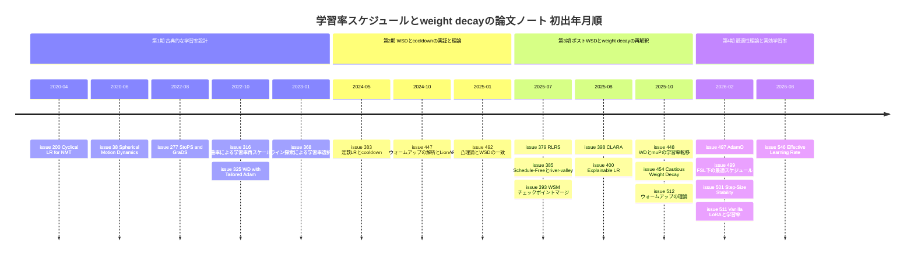

# 学習率スケジュール・ウォームアップ・学習率自動適応・weight decay と実効学習率 サーベイ

> 本稿は [Hiroki11x/Papers](https://github.com/Hiroki11x/Papers/issues) の論文読みノート（GitHub issues）のうち、学習率スケジュール（WSD, cooldown, schedule-free, cyclical）・ウォームアップ・学習率の自動適応/選択・学習率転移・weight decay と実効学習率・LLM 事前学習の安定化レシピを主題とする **22件の issue（22本、重複登録なし）** を再構成したサーベイである。
> 論文の初出は **2020年4月**（Cyclical LR for NMT）〜 **2026年8月**（Effective Learning Rate）、issue 登録は **2020年7月〜2026年8月**。
> 記述はノート（issue 本文・コメント）に基づき、数値はノートに記載されたものだけを引用している。ノートが概要のみの論文は要約を短くしている。

## 概要

ノート群が追っている問いは次の5つに整理できる。

1. **学習率をどう減衰させるべきか**。コサイン減衰は総ステップ数を事前に固定する必要がある。定数学習率＋短い cooldown（WSD）で十分なのか、そしてそれはなぜ効くのか（凸最適化理論・関数的スケーリング則・river-valley 地形）。
2. **減衰フェーズそのものは必要か**。schedule-free 法、重み平均、チェックポイントマージで減衰を代替できるか。
3. **なぜウォームアップが必要なのか**。更新の大きさ（ℓ2 ノルム・角度・表現変化）のどれが初期不安定性を支配するのか。ウォームアップはオプティマイザ側の工夫や理論で置き換えられるか。
4. **学習率を自動で決められるか**。Polyak 型・ライン探索・経路長・曲率に基づく適応はどこまで「調整不要」に近づけるのか。学習率に対する壊れにくさ（安定性）を理論でどう測るか。
5. **weight decay は何をしているのか**。正則化としてではなく、重みノルムを通じて「実効学習率」を制御する装置として見ると、学習率転移（µP）やオプティマイザ間の差はどう説明されるのか。

バッチサイズと学習率の同時スケーリングは [クリティカルバッチサイズのサーベイ](../practical_optimization/01_critical_batch_size.md)、Muon 系オプティマイザにおける weight decay とノルム制約は [低精度学習と Muon のサーベイ](../practical_optimization/02_low_precision_and_muon.md) を参照。

## 目次

1. [背景と基本概念](#1-背景と基本概念)
2. [研究の系譜・時系列](#2-研究の系譜時系列)
3. [タイムライン図](#3-タイムライン図)
4. [サブトピック別の整理](#4-サブトピック別の整理)
5. [論文一覧表（公開順）](#5-論文一覧表公開順)
6. [採択先（ベニュー）別の集計](#6-採択先ベニュー別の集計)
7. [各論文の詳細まとめ](#7-各論文の詳細まとめ)
8. [横断的な知見・未解決問題](#8-横断的な知見未解決問題)
9. [関連論文](#9-関連論文)

---

## 1. 背景と基本概念

### 1.1 学習率スケジュールの代表的な形

ステップ $t$（総ステップ $T$）での学習率 $\eta_t$ の設計として、ノートに登場するものは次のとおり。

| 名前 | 形 | ノート上の論点 |
|---|---|---|
| コサイン減衰 | $\eta_t = \eta_{\min} + \tfrac{1}{2}(\eta_{\max}-\eta_{\min})(1+\cos(\pi t/T))$ | 最適性能には $T$ を事前に決める必要がある（[#383](https://github.com/Hiroki11x/Papers/issues/383)）。高容量領域では「容量飽和」で準最適（[#499](https://github.com/Hiroki11x/Papers/issues/499)） |
| 周期的学習率（cyclical） | 上下限の間を周期的に往復 | CV での成功を NMT に持ち込む（[#200](https://github.com/Hiroki11x/Papers/issues/200)） |
| WSD（Warmup-Stable-Decay）／定数＋cooldown | ウォームアップ → 長い定数区間 → 終盤だけ急減衰 | 途中から cooldown を始められ、1回の学習から複数の学習長を評価できる。1-sqrt 型 cooldown が最良（[#383](https://github.com/Hiroki11x/Papers/issues/383)） |
| べき乗減衰（power decay） | $\eta(z) \propto (1 - z/N)^{\gamma}$ | 関数的スケーリング則の下で easy-task の最適形（[#499](https://github.com/Hiroki11x/Papers/issues/499)） |

**ウォームアップ** は学習初期に学習率を小さい値から徐々に上げる操作で、Transformer/GPT ではほぼ標準になっているが、その必要性の説明は [#447](https://github.com/Hiroki11x/Papers/issues/447)（更新の大きさの解析）、[#512](https://github.com/Hiroki11x/Papers/issues/512)（一般化平滑性の理論）、[#448](https://github.com/Hiroki11x/Papers/issues/448)（µP は暗黙的ウォームアップ）で異なる角度から与えられている。

### 1.2 減衰フェーズの代替：重み平均・schedule-free・マージ

学習率を下げる効果は「反復のノイズを平均化すること」とも見なせる。このため次の代替が提案されている。

- **SWA / EWA（重み平均）**: 学習軌道上の重みの（指数）移動平均を取る。定数 LR＋cooldown と組み合わせると追加コストなしに軌道上の性能が改善する（[#383](https://github.com/Hiroki11x/Papers/issues/383)）。
- **Schedule-Free（SF）法**（Defazio ら, 2024）: 暗黙的に重み平均を行い、明示的な減衰フェーズも追加メモリも要らない（[#385](https://github.com/Hiroki11x/Papers/issues/385) が理論的に再評価）。
- **チェックポイントマージ（WSM）**: 定数 LR で保存した複数チェックポイントの加重平均が、勾配更新への特定の減衰係数の適用と等価になる（[#393](https://github.com/Hiroki11x/Papers/issues/393)）。

**River-valley 地形**: 損失地形を「急な谷壁（振動する方向）」と「緩やかに下る川（進むべき方向）」に分ける見方。高い学習率は谷壁方向で振動しながら川方向へ速く進み、減衰や平均化は谷壁方向の振動を消して谷底（川）へ降ろす役割を持つ、と解釈される（[#385](https://github.com/Hiroki11x/Papers/issues/385)）。

### 1.3 適応的ステップサイズ

- **Polyak ステップサイズ**: 最適値 $f^*$ を使って $\eta_t = \dfrac{f(x_t) - f^*}{\|\nabla f(x_t)\|^2}$ とする古典的な選び方。確率版が SPS（Loizou ら, 2021）。[#277](https://github.com/Hiroki11x/Papers/issues/277) はこれを拡張した StoPS/StoP を提案し、[#501](https://github.com/Hiroki11x/Papers/issues/501) は SPS・NGN（Non-negative Gauss-Newton）・SPP（Stochastic Proximal Point）を「モデルベース更新」として統一的に扱う。
- **ライン探索**: 各ステップで損失の減少条件を満たすよう学習率を探索する（[#368](https://github.com/Hiroki11x/Papers/issues/368)）。
- **経路長適応（SALERA / CLARA）**: 直近の更新の累積経路長を、ランダムウォークなら期待される基準経路長と比べ、方向が一貫していれば学習率を上げ、衝突していれば下げる（[#398](https://github.com/Hiroki11x/Papers/issues/398)）。

### 1.4 weight decay、スケール不変性、実効学習率

BatchNorm やその他の正規化の直前にある重み $W$ は **スケール不変**（$W$ を定数倍しても出力が変わらない）である。この場合、意味を持つのは重みの「向き」だけであり、同じ学習率 $\eta$ でもノルム $\|W\|$ が大きいほど向きの変化は小さくなる。

$$\frac{\|\Delta W\|}{\|W\|} \approx \frac{\eta}{\|W\|}, \qquad \mathrm{ELR}_t = \frac{\eta_t}{\|W_t\|_F}$$

この $\mathrm{ELR}$（Effective Learning Rate、実効学習率）を用いると、weight decay は「$\|W\|$ の増加を抑えて ELR を高く保つ装置」と読み替えられる（[#546](https://github.com/Hiroki11x/Papers/issues/546)）。同様の視点は、BN＋WD での重みの球面運動と角度更新（[#38](https://github.com/Hiroki11x/Papers/issues/38)）、Adam で重みノルムが急増して WD が効かなくなる問題（[#325](https://github.com/Hiroki11x/Papers/issues/325)）、勾配と WD が半径方向で綱引きする問題（[#497](https://github.com/Hiroki11x/Papers/issues/497)）に共通している。

**Decoupled weight decay（AdamW 型）** はオプティマイザの更新 $u_t$ とは独立に $x_{t+1} = x_t - \eta_t(u_t + \lambda x_t)$ と減衰をかける。Cautious Weight Decay（[#454](https://github.com/Hiroki11x/Papers/issues/454)）はここに符号マスクを入れる。

$$x_{t+1} = x_t - \eta_t \big(u_t + \lambda\, \mathbb{I}(u_t x_t \ge 0)\, x_t \big)$$

**独立 weight decay（independent WD）** は減衰係数を学習率と掛け合わせずに適用する変種で、[#448](https://github.com/Hiroki11x/Papers/issues/448) では µP と組み合わせたときのみ幅方向の学習率転移が成功する。

### 1.5 µP と学習率転移、相対更新

**µP（Maximal Update Parameterization）** は幅方向のスケーリングで表現変化 $\|\Delta Y\|$ を一定に保ち、小モデルで調整した学習率を大モデルへ転移させることを狙う。その前提には「入力と勾配の幾何学的整合性（アラインメント）」の仮定がある。[#448](https://github.com/Hiroki11x/Papers/issues/448) は相対更新 $\|\Delta W\|/\|W\|$ と相対表現変化 $\|\Delta Y\|/\|Y\|$ の対応を軸にこの仮定を検証し、[#447](https://github.com/Hiroki11x/Papers/issues/447) は相対表現変化（RRC, Relative Representation Change）を初期不安定性の指標として使う。コンポーネント単位の相対学習率の転移（[#379](https://github.com/Hiroki11x/Papers/issues/379)）も同じ「相対量なら転移する」という発想に立つ。

---

## 2. 研究の系譜・時系列

### 2.1 時代区分

| 時期 | 特徴 | 主な issue |
|---|---|---|
| 第1期 2020〜2023 | 画像・NMT・凸問題を舞台にした古典的な学習率設計と weight decay の解析 | [#200](https://github.com/Hiroki11x/Papers/issues/200), [#38](https://github.com/Hiroki11x/Papers/issues/38), [#277](https://github.com/Hiroki11x/Papers/issues/277), [#316](https://github.com/Hiroki11x/Papers/issues/316), [#325](https://github.com/Hiroki11x/Papers/issues/325), [#368](https://github.com/Hiroki11x/Papers/issues/368) |
| 第2期 2024-05〜2025-01 | LLM 事前学習で WSD/cooldown が実証され、凸理論で説明される。ウォームアップの解析 | [#383](https://github.com/Hiroki11x/Papers/issues/383), [#447](https://github.com/Hiroki11x/Papers/issues/447), [#492](https://github.com/Hiroki11x/Papers/issues/492) |
| 第3期 2025-07〜2025-10 | ポスト WSD：減衰の不要化、コンポーネント別スケジュール、自動適応、weight decay と µP の再検討 | [#379](https://github.com/Hiroki11x/Papers/issues/379), [#385](https://github.com/Hiroki11x/Papers/issues/385), [#393](https://github.com/Hiroki11x/Papers/issues/393), [#398](https://github.com/Hiroki11x/Papers/issues/398), [#400](https://github.com/Hiroki11x/Papers/issues/400), [#448](https://github.com/Hiroki11x/Papers/issues/448), [#454](https://github.com/Hiroki11x/Papers/issues/454), [#512](https://github.com/Hiroki11x/Papers/issues/512) |
| 第4期 2026-02〜2026-08 | 最適スケジュールの演繹的導出、学習率安定性の理論、実効学習率による統一 | [#497](https://github.com/Hiroki11x/Papers/issues/497), [#499](https://github.com/Hiroki11x/Papers/issues/499), [#501](https://github.com/Hiroki11x/Papers/issues/501), [#511](https://github.com/Hiroki11x/Papers/issues/511), [#546](https://github.com/Hiroki11x/Papers/issues/546) |

なお issue 登録日で見ると、2020〜2023 年に登録された6本（第1期）と、2025 年7月以降に集中的に登録された16本に分かれる。第2期の [#383](https://github.com/Hiroki11x/Papers/issues/383)・[#447](https://github.com/Hiroki11x/Papers/issues/447)・[#492](https://github.com/Hiroki11x/Papers/issues/492) も登録は 2025-07 以降であり、LLM 事前学習のスケジュール設計への関心が 2025 年後半から強まったことがうかがえる。

### 2.2 第1期：古典的な学習率設計と weight decay（2020〜2023）

この時期のノートは概要中心で、問題意識は「学習率は重要なのにあまり考えずに使われている」という点にある。

- **スケジュール**: [#200](https://github.com/Hiroki11x/Papers/issues/200) は CV で成功した周期的学習率を Transformer の NMT に持ち込み、オプティマイザと学習率ポリシーの組み合わせが性能を大きく左右することを示してガイドラインを提示した。
- **学習率の自動選択**: [#277](https://github.com/Hiroki11x/Papers/issues/277) は Polyak ステップ（StoPS）と勾配多様性による再スケール（GraDS）を提案し、未知量への依存を除いた StoP/GraD が最適解近傍に線形収束することを示した。[#316](https://github.com/Hiroki11x/Papers/issues/316) は勾配計算とヘシアンベクトル積の中間コストで曲率を自動微分し、学習率を再スケールする（本人のメモは「計算のオーダー落としたい」）。[#368](https://github.com/Hiroki11x/Papers/issues/368) はミニバッチサイズと関連づけて標準的な更新則とライン探索を比較し、ライン探索で高価な初期調整を避けられることを示した。
- **weight decay**: [#38](https://github.com/Hiroki11x/Papers/issues/38)（SMD）は BN＋WD 下の重みが球面運動をし、角度更新が学習率・WD・モメンタムだけで決まることを証明した。学習率を下げたときの損失の急減も SMD で説明しており、これは後の WSD の cooldown 効果の議論（[#492](https://github.com/Hiroki11x/Papers/issues/492), [#546](https://github.com/Hiroki11x/Papers/issues/546)）の先駆けにあたる。本人は「この概念で考えると Sharp/Flat を意識しなくてよいのか」と問いを立てている。[#325](https://github.com/Hiroki11x/Papers/issues/325) は Adam では重みノルムが急増して WD が効かなくなることを指摘した（本人のメモは「AdamW では？」）。

### 2.3 第2期：WSD/cooldown の実証と理論（2024-05〜2025-01）

- **実証**: [#383](https://github.com/Hiroki11x/Papers/issues/383)（NeurIPS 2024 Spotlight）は、コサインの代わりに定数 LR＋cooldown を使うと同等以上の性能が得られ、特に 1-sqrt 型 cooldown が最良であることを 210M〜8B のモデルで示した。cooldown をどこからでも始められるので、1回の学習から複数の学習長を評価でき、スケーリング則実験が安価になる。SWA との併用も有効だった。
- **理論**: [#492](https://github.com/Hiroki11x/Papers/issues/492)（[#383](https://github.com/Hiroki11x/Papers/issues/383) の Hägele が共著）は、非平滑凸最適化の最終反復の上界が LLM のスケジュール挙動とよく一致することを示した。本人の要約は「WSD の良さを理論でも説明する。対数項が decay で消えて loss が一気に下がる」。
- **ウォームアップ**: [#447](https://github.com/Hiroki11x/Papers/issues/447)（[#383](https://github.com/Hiroki11x/Papers/issues/383) の Kosson・Jaggi）は、GPT2 の初期不安定性を ℓ2 ノルム・角度更新・RRC で測り、ノルムを制御するだけ（LionA）ではウォームアップの効果が残る一方、角度を制御する LionAR と高モーメンタムで不要化できることを示した。原因は初期の高い勾配 SNR による過大な表現変化だとする。

EPFL（Jaggi グループ）の Hägele・Kosson が [#383](https://github.com/Hiroki11x/Papers/issues/383)、[#447](https://github.com/Hiroki11x/Papers/issues/447)、[#448](https://github.com/Hiroki11x/Papers/issues/448)、[#492](https://github.com/Hiroki11x/Papers/issues/492) に共通して関わっており、このノート群の中核の一つになっている。

### 2.4 第3期：ポスト WSD と weight decay の再解釈（2025-07〜2025-10）

WSD が定着したのを受けて、問いは「減衰フェーズは本当に必要か」「スケジュールはモデル全体で一つでよいか」「weight decay の役割は何か」へ移る。

- **減衰フェーズの不要化**: [#385](https://github.com/Hiroki11x/Papers/issues/385) は river-valley 地形から WSD・重み平均・SF 法を解析し、SF 法が暗黙の重み平均で川方向を辿り、Edge of Stability 領域で動作することを示した。そのうえで運動量への感度と大バッチでの性能低下を改善した変種を提案した。[#393](https://github.com/Hiroki11x/Papers/issues/393)（WSM）は、チェックポイントの加重マージが減衰係数の適用と数学的に等価であることを示し、減衰フェーズを後付けのマージで置き換えた。[#383](https://github.com/Hiroki11x/Papers/issues/383) の SWA の知見を「マージ重みの設計で任意の減衰曲線をエミュレートする」まで一般化したものと見なせる。WSM でも凹型（1-sqrt 型）の減衰をエミュレートしたマージが最良であり、[#383](https://github.com/Hiroki11x/Papers/issues/383) の結論と整合する。
- **スケジュールの分離**: [#379](https://github.com/Hiroki11x/Papers/issues/379)（RLRS）は Embedding・Attention・Router・Expert などコンポーネントごとに相対的な開始・終了係数を持たせ、34M で調整した係数が 906M へ転移することを示した。
- **自動適応**: [#398](https://github.com/Hiroki11x/Papers/issues/398)（CLARA）は SGD 向けの経路長適応を Adam の前処理幾何に整合させた。[#400](https://github.com/Hiroki11x/Papers/issues/400) は勾配ノルムと学習率の解釈可能な関係を定式化したが、本人は「ハイパーパラメータ不要」の主張に疑問符を付け、「あんまり読まなくてもいいかも」と評価している。
- **ウォームアップの理論**: [#512](https://github.com/Hiroki11x/Papers/issues/512) は一般化平滑性の下でウォームアップ付き GD が定数学習率より速く収束しうることを示した。
- **weight decay と学習率転移**: [#448](https://github.com/Hiroki11x/Papers/issues/448) は「学習率転移を実際に担っているのは µP ではなく独立 weight decay だ」と主張し、µP の効果は暗黙的ウォームアップであって明示的な指数ウォームアップで代替できるとした。[#447](https://github.com/Hiroki11x/Papers/issues/447) の「相対更新・表現変化」という尺度を幅スケーリングに持ち込んだ続編にあたる。[#454](https://github.com/Hiroki11x/Papers/issues/454)（CWD）は「常にかかる WD は有益な更新を妨げ、終盤に過正則化を起こす」という問題意識から、符号が一致する成分にだけ減衰をかける1行の変更を提案し、AdamW/Lion/Muon で一貫して損失を改善した。

### 2.5 第4期：最適性の理論と実効学習率による統一（2026-02〜2026-08）

- **最適スケジュールの演繹的導出**: [#499](https://github.com/Hiroki11x/Papers/issues/499)（COLT 2026）は、関数的スケーリング則の下で変分法により最適スケジュールを直接導出した。タスクが easy ならべき乗減衰、hard なら WSD 型が最適という相転移を示し、[#383](https://github.com/Hiroki11x/Papers/issues/383)・[#492](https://github.com/Hiroki11x/Papers/issues/492) の WSD の経験則・凸理論に「どの条件で WSD が最適か」という境界を与えた。cosine の準最適性も「容量飽和」として説明する。
- **学習率に対する安定性**: [#501](https://github.com/Hiroki11x/Papers/issues/501)（[#492](https://github.com/Hiroki11x/Papers/issues/492) の Schaipp・Taylor）は stability index を導入し、SPS・NGN・SPP が SGD より学習率に対して理論的に壊れにくいことを示した。第1期の [#277](https://github.com/Hiroki11x/Papers/issues/277)（Polyak 型）の系譜を「収束率」ではなく「頑健性」の観点で再評価したものといえる。
- **チューニング不足の指摘**: [#511](https://github.com/Hiroki11x/Papers/issues/511) は、LoRA 派生手法の性能差の多くは学習率の調整不足によるもので、適切に調整すれば vanilla LoRA で十分だと主張した。
- **weight decay の幾何**: [#497](https://github.com/Hiroki11x/Papers/issues/497)（AdamO）は勾配と WD の「半径方向の綱引き」を問題視し、更新を半径方向（SGD 型）と接線方向（Adam 型）に分離した。
- **実効学習率による統一**: [#546](https://github.com/Hiroki11x/Papers/issues/546) は、LLM の損失は raw LR ではなく $\eta_t/\|W_t\|_F$ でほぼ決まり、ELR を揃えると AdamW/Muon/Signum の損失曲線が一致する（ELR collapse）ことを示した。weight decay や Hyperball はいずれも ELR スケジュールを実現するノルム制御と解釈され、[#38](https://github.com/Hiroki11x/Papers/issues/38)（角度更新）・[#448](https://github.com/Hiroki11x/Papers/issues/448)（WD が相対更新を均質化）・[#454](https://github.com/Hiroki11x/Papers/issues/454)（WD の終盤の効き方）を一つの見方にまとめる位置にある。本人は規模（最大1B）・training loss のみ・バッチサイズ固定という限界を指摘している。

### 2.6 論文間の主な対立・緊張関係

| 論点 | 立場A | 立場B |
|---|---|---|
| 減衰フェーズは必要か | 終盤の cooldown が損失の急減を生む本質（[#383](https://github.com/Hiroki11x/Papers/issues/383), [#492](https://github.com/Hiroki11x/Papers/issues/492), [#499](https://github.com/Hiroki11x/Papers/issues/499) の hard-task） | 減衰は平均化・マージで代替できる（[#385](https://github.com/Hiroki11x/Papers/issues/385), [#393](https://github.com/Hiroki11x/Papers/issues/393)） |
| 最適な減衰形状 | WSD 型（[#383](https://github.com/Hiroki11x/Papers/issues/383), [#492](https://github.com/Hiroki11x/Papers/issues/492)） | タスク難易度とモデル容量次第でべき乗減衰が最適（[#499](https://github.com/Hiroki11x/Papers/issues/499)） |
| ウォームアップの正体 | 初期の高 SNR による過大な表現変化。オプティマイザで制御可能（[#447](https://github.com/Hiroki11x/Papers/issues/447)） | 一般化平滑性の下での収束上の利点（[#512](https://github.com/Hiroki11x/Papers/issues/512)）。µP の効果もウォームアップの一形態（[#448](https://github.com/Hiroki11x/Papers/issues/448)） |
| 学習率転移を担うもの | µP のパラメータ化 | 独立 weight decay（[#448](https://github.com/Hiroki11x/Papers/issues/448)）、相対係数（[#379](https://github.com/Hiroki11x/Papers/issues/379)）、ELR（[#546](https://github.com/Hiroki11x/Papers/issues/546)） |
| weight decay の役割 | 正則化（汎化改善、[#325](https://github.com/Hiroki11x/Papers/issues/325), [#454](https://github.com/Hiroki11x/Papers/issues/454)） | 重みノルムを通じた実効学習率の制御（[#38](https://github.com/Hiroki11x/Papers/issues/38), [#448](https://github.com/Hiroki11x/Papers/issues/448), [#546](https://github.com/Hiroki11x/Papers/issues/546)） |
| 学習率は自動化できるか | Polyak 型・経路長・ライン探索で調整を減らせる（[#277](https://github.com/Hiroki11x/Papers/issues/277), [#368](https://github.com/Hiroki11x/Papers/issues/368), [#398](https://github.com/Hiroki11x/Papers/issues/398), [#501](https://github.com/Hiroki11x/Papers/issues/501)） | 「調整不要」の主張には懐疑的（[#400](https://github.com/Hiroki11x/Papers/issues/400) への本人コメント）。Adam では CLARA の効果も文脈依存（[#398](https://github.com/Hiroki11x/Papers/issues/398)） |

---

## 3. タイムライン図

---

## 4. サブトピック別の整理

### A. 学習率スケジュールの形状（WSD・cooldown・cyclical・最適性理論）

- **要点**: LLM 事前学習では「長い定数区間＋短い cooldown」がコサインと同等以上であり、その理由は凸最適化の最終反復上界（[#492](https://github.com/Hiroki11x/Papers/issues/492)）と関数的スケーリング則（[#499](https://github.com/Hiroki11x/Papers/issues/499)）の両面から説明された。[#499](https://github.com/Hiroki11x/Papers/issues/499) は WSD が最適なのは hard-task 領域だと条件を明確にした。スケジュールをコンポーネントごとに分ける方向（[#379](https://github.com/Hiroki11x/Papers/issues/379)）もある。
- **論文**: [#200](https://github.com/Hiroki11x/Papers/issues/200), [#383](https://github.com/Hiroki11x/Papers/issues/383), [#492](https://github.com/Hiroki11x/Papers/issues/492), [#379](https://github.com/Hiroki11x/Papers/issues/379), [#499](https://github.com/Hiroki11x/Papers/issues/499)

### B. 減衰フェーズの代替（Schedule-Free・重み平均・チェックポイントマージ）

- **要点**: 減衰の効果は「谷壁方向のノイズを平均で消すこと」と見なせるため、SWA（[#383](https://github.com/Hiroki11x/Papers/issues/383)）、暗黙の重み平均を行う SF 法（[#385](https://github.com/Hiroki11x/Papers/issues/385)）、マージ重みで減衰曲線を模倣する WSM（[#393](https://github.com/Hiroki11x/Papers/issues/393)）で代替できる。いずれも「学習をいつでも延長できる」柔軟性を動機にしている。
- **論文**: [#385](https://github.com/Hiroki11x/Papers/issues/385), [#393](https://github.com/Hiroki11x/Papers/issues/393)（関連: [#383](https://github.com/Hiroki11x/Papers/issues/383)）

### C. ウォームアップの必要性

- **要点**: ウォームアップの役割は、初期の過大な角度変化・表現変化を抑えることにある（[#447](https://github.com/Hiroki11x/Papers/issues/447)）。理論的には一般化平滑性の下で収束を速める（[#512](https://github.com/Hiroki11x/Papers/issues/512)）。µP の幅スケーリングも暗黙のウォームアップとして働いている（[#448](https://github.com/Hiroki11x/Papers/issues/448)）。角度制御と高モーメンタム、あるいは明示的な指数ウォームアップで置き換えが可能。
- **論文**: [#447](https://github.com/Hiroki11x/Papers/issues/447), [#512](https://github.com/Hiroki11x/Papers/issues/512)（関連: [#448](https://github.com/Hiroki11x/Papers/issues/448)）

### D. 学習率の自動適応・選択・安定性

- **要点**: Polyak 型（[#277](https://github.com/Hiroki11x/Papers/issues/277)）、曲率（[#316](https://github.com/Hiroki11x/Papers/issues/316)）、ライン探索（[#368](https://github.com/Hiroki11x/Papers/issues/368)）、経路長（[#398](https://github.com/Hiroki11x/Papers/issues/398)）、勾配ノルム（[#400](https://github.com/Hiroki11x/Papers/issues/400)）と手掛かりはさまざまである。[#501](https://github.com/Hiroki11x/Papers/issues/501) は「どれだけ学習率に対して壊れにくいか」を理論的に比較する枠組みを与えた。一方で [#511](https://github.com/Hiroki11x/Papers/issues/511) のように「手法の差は学習率チューニング不足の産物」という警告もある。
- **論文**: [#277](https://github.com/Hiroki11x/Papers/issues/277), [#316](https://github.com/Hiroki11x/Papers/issues/316), [#368](https://github.com/Hiroki11x/Papers/issues/368), [#398](https://github.com/Hiroki11x/Papers/issues/398), [#400](https://github.com/Hiroki11x/Papers/issues/400), [#501](https://github.com/Hiroki11x/Papers/issues/501), [#511](https://github.com/Hiroki11x/Papers/issues/511)

### E. weight decay・実効学習率・学習率転移

- **要点**: スケール不変な重みでは、weight decay は重みノルムを介して実効学習率（角度更新）を決める（[#38](https://github.com/Hiroki11x/Papers/issues/38), [#546](https://github.com/Hiroki11x/Papers/issues/546)）。Adam でノルムが急増して WD が効かない問題（[#325](https://github.com/Hiroki11x/Papers/issues/325)）や、勾配と WD の半径方向の綱引き（[#497](https://github.com/Hiroki11x/Papers/issues/497)）、常時かかる WD の過正則化（[#454](https://github.com/Hiroki11x/Papers/issues/454)）への対処が提案された。学習率転移を担うのは独立 WD による相対更新の均質化だという主張（[#448](https://github.com/Hiroki11x/Papers/issues/448)）もこの流れにある。
- **論文**: [#38](https://github.com/Hiroki11x/Papers/issues/38), [#325](https://github.com/Hiroki11x/Papers/issues/325), [#448](https://github.com/Hiroki11x/Papers/issues/448), [#454](https://github.com/Hiroki11x/Papers/issues/454), [#497](https://github.com/Hiroki11x/Papers/issues/497), [#546](https://github.com/Hiroki11x/Papers/issues/546)

---

## 5. 論文一覧表（公開順）

records から Python スクリプトで生成した表（22件）。

| 公開 | 論文 | 著者/組織 | 採択先 | 根拠 | サブトピック |
|---|---|---|---|---|---|
| 2020-04 | [#200](https://github.com/Hiroki11x/Papers/issues/200) Applying Cyclical Learning Rate to Neural Machine Translation | Choon Meng Lee, Jianfeng Liu, Wei Peng / Huawei | arXiv（プレプリント） | 不明 | 学習率スケジュール |
| 2020-06 | [#38](https://github.com/Hiroki11x/Papers/issues/38) Spherical Motion Dynamics of Deep Neural Networks with Batch Normalization and Weight Decay | Ruosi Wan, Zhanxing Zhu, Xiangyu Zhang, et al. / Megvii | NeurIPS 2021 | Web確認 | 正規化と重み減衰の学習ダイナミクス |
| 2022-08 | [#277](https://github.com/Hiroki11x/Papers/issues/277) Adaptive Learning Rates for Faster Stochastic Gradient Methods | Samuel Horváth, Konstantin Mishchenko, Peter Richtárik / KAUST | arXiv（プレプリント） | 不明 | 適応的ステップサイズ |
| 2022-10 | [#316](https://github.com/Hiroki11x/Papers/issues/316) Adaptive scaling of the learning rate by second order automatic differentiation | Frédéric de Gournay, Alban Gossard / INSA Toulouse | arXiv（プレプリント） | 不明 | 学習率の適応的スケーリング |
| 2022-10 | [#325](https://github.com/Hiroki11x/Papers/issues/325) Weight Decay With Tailored Adam on Scale-Invariant Weights for Better Generalization | Xixi Jia, Xiangchu Feng, Hongwei Yong, Deyu Meng / Xidian Univ. / Hong Kong PolyU / Xi'an Jiaotong Univ. | IEEE TNNLS | Web確認 | Adamと重み減衰 |
| 2023-01 | [#368](https://github.com/Hiroki11x/Papers/issues/368) Learning rate selection in stochastic gradient methods based on line search strategies | Giorgia Franchini, Federica Porta, Valeria Ruggiero, Ilaria Trombini | Applied Mathematics in Science and Engineering | issue記載 | 学習率選択（ライン探索） |
| 2024-05 | [#383](https://github.com/Hiroki11x/Papers/issues/383) Scaling Laws and Compute-Optimal Training Beyond Fixed Training Durations | Alexander Hägele, Elie Bakouch, Atli Kosson, et al. / EPFL / Hugging Face | NeurIPS 2024 | issue記載 | 学習率スケジュール（定数LR＋Cooldown） |
| 2024-10 | [#447](https://github.com/Hiroki11x/Papers/issues/447) Analyzing & Reducing the Need for Learning Rate Warmup in GPT Training | Atli Kosson, Bettina Messmer, Martin Jaggi / EPFL | NeurIPS 2024 | arXivコメント | 学習率ウォームアップの必要性の解析 |
| 2025-01 | [#492](https://github.com/Hiroki11x/Papers/issues/492) The Surprising Agreement Between Convex Optimization Theory and Learning-Rate Scheduling for Large Model Training | Fabian Schaipp, Alexander Hägele, Adrien Taylor, Umut Simsekli, Francis Bach / Inria / EPFL | ICML 2025 | Semantic Scholar確認 | 学習率スケジュール（WSD）の凸理論 |
| 2025-07 | [#379](https://github.com/Hiroki11x/Papers/issues/379) Decoupled Relative Learning Rate Schedules | Jan Ludziejewski, Jan Małaśnicki, Maciej Pióro, et al. / University of Warsaw / IDEAS NCBR | arXiv（プレプリント） | 不明 | 学習率スケジュール |
| 2025-07 | [#385](https://github.com/Hiroki11x/Papers/issues/385) Through the River: Understanding the Benefit of Schedule-Free Methods for Language Model Training | Minhak Song, Beomhan Baek, Kwangjun Ahn, Chulhee Yun / KAIST / Microsoft Research | NeurIPS 2025 | arXivコメント | スケジュールフリー最適化 |
| 2025-07 | [#393](https://github.com/Hiroki11x/Papers/issues/393) WSM: Decay-Free Learning Rate Schedule via Checkpoint Merging for LLM Pre-training | Changxin Tian, Jiapeng Wang, Qian Zhao, et al. / Ant Group | arXiv（プレプリント） | 不明 | 学習率スケジュール（チェックポイントマージ） |
| 2025-08 | [#398](https://github.com/Hiroki11x/Papers/issues/398) Cumulative Learning Rate Adaptation: Revisiting Path-Based Schedules for SGD and Adam | Asma Atamna, Tom Maus, Fabian Kievelitz, Tobias Glasmachers / Ruhr University Bochum | arXiv（プレプリント） | 不明 | 学習率の自動適応 |
| 2025-08 | [#400](https://github.com/Hiroki11x/Papers/issues/400) Explainable Learning Rate Regimes for Stochastic Optimization | Zhuang Yang / Soochow University | arXiv（プレプリント） | 不明 | 学習率の自動適応 |
| 2025-10 | [#448](https://github.com/Hiroki11x/Papers/issues/448) Weight Decay may matter more than muP for Learning Rate Transfer in Practice | Atli Kosson, Jeremy Welborn, Yang Liu, Martin Jaggi, Xi Chen / EPFL / Amazon | ICLR 2026 | arXivコメント | 学習率転移（µPとweight decay） |
| 2025-10 | [#454](https://github.com/Hiroki11x/Papers/issues/454) Cautious Weight Decay | Lizhang Chen, Jonathan Li, Kaizhao Liang, et al. / UT Austin | arXiv（プレプリント） | 不明 | weight decayの改良（正則化） |
| 2025-10 | [#512](https://github.com/Hiroki11x/Papers/issues/512) Why Do We Need Warm-up? A Theoretical Perspective | Foivos Alimisis, Rustem Islamov, Aurelien Lucchi / Univ. of Basel | arXiv（プレプリント） | 不明 | 学習率ウォームアップの理論 |
| 2026-02 | [#497](https://github.com/Hiroki11x/Papers/issues/497) Decoupled Orthogonal Dynamics: Regularization for Deep Network Optimizers | Hao Chen, Jinghui Yuan, Hanmin Zhang / BUPT | arXiv（プレプリント） | 不明 | 重み減衰と半径/接線方向の分離 |
| 2026-02 | [#499](https://github.com/Hiroki11x/Papers/issues/499) Optimal Learning Rate Schedules under Functional Scaling Laws: Power Decay and Warmup-Stable-Decay | Binghui Li, Zilin Wang, Lei Wu, et al. / Peking Univ. | COLT 2026 | arXivコメント | 学習率スケジュールの最適性理論 |
| 2026-02 | [#501](https://github.com/Hiroki11x/Papers/issues/501) Step-Size Stability in Stochastic Optimization: A Theoretical Perspective | Fabian Schaipp, Robert M. Gower, Adrien Taylor / Inria / Flatiron | arXiv（プレプリント） | 不明 | 学習率に対する安定性 |
| 2026-02 | [#511](https://github.com/Hiroki11x/Papers/issues/511) Learning Rate Matters: Vanilla LoRA May Suffice for LLM Fine-tuning | Yu-Ang Lee, Ching-Yun Ko, Pin-Yu Chen, Mi-Yen Yeh / National Taiwan Univ. / IBM Research / Academia Sinica | arXiv（プレプリント） | 不明 | LoRA微調整の学習率 |
| 2026-08 | [#546](https://github.com/Hiroki11x/Papers/issues/546) Effective Learning Rate Governs Loss Dynamics in Language Model Pretraining | Zihan Liu, Ruiheng Zheng, Shaobo Zhang, et al. | arXiv（プレプリント） | 不明 | 実効学習率とweight decay |

---

## 6. 採択先（ベニュー）別の集計

| 採択先系列 | 件数 | 内訳 | issue |
|---|---|---|---|
| NeurIPS | 4 | NeurIPS 2021、NeurIPS 2024 ×2、NeurIPS 2025 | [#38](https://github.com/Hiroki11x/Papers/issues/38), [#383](https://github.com/Hiroki11x/Papers/issues/383), [#447](https://github.com/Hiroki11x/Papers/issues/447), [#385](https://github.com/Hiroki11x/Papers/issues/385) |
| ジャーナル | 2 | IEEE TNNLS、Applied Mathematics in Science and Engineering | [#325](https://github.com/Hiroki11x/Papers/issues/325), [#368](https://github.com/Hiroki11x/Papers/issues/368) |
| COLT | 1 | COLT 2026 | [#499](https://github.com/Hiroki11x/Papers/issues/499) |
| ICLR | 1 | ICLR 2026 | [#448](https://github.com/Hiroki11x/Papers/issues/448) |
| ICML | 1 | ICML 2025 | [#492](https://github.com/Hiroki11x/Papers/issues/492) |
| arXiv（プレプリント） | 13 | arXiv（プレプリント） ×13 | [#200](https://github.com/Hiroki11x/Papers/issues/200), [#277](https://github.com/Hiroki11x/Papers/issues/277), [#316](https://github.com/Hiroki11x/Papers/issues/316), [#379](https://github.com/Hiroki11x/Papers/issues/379), [#393](https://github.com/Hiroki11x/Papers/issues/393), [#398](https://github.com/Hiroki11x/Papers/issues/398), [#400](https://github.com/Hiroki11x/Papers/issues/400), [#454](https://github.com/Hiroki11x/Papers/issues/454), [#512](https://github.com/Hiroki11x/Papers/issues/512), [#497](https://github.com/Hiroki11x/Papers/issues/497), [#501](https://github.com/Hiroki11x/Papers/issues/501), [#511](https://github.com/Hiroki11x/Papers/issues/511), [#546](https://github.com/Hiroki11x/Papers/issues/546) |
| **合計** | **22** | | |

22本のうち13本が arXiv プレプリントで、査読付き会議は NeurIPS（4本）、ICML・ICLR・COLT（各1本）、ジャーナルは IEEE TNNLS と Applied Mathematics in Science and Engineering（各1本）。2025 年以降の LLM 事前学習寄りの論文はプレプリントが多い。一方で WSD の実証（[#383](https://github.com/Hiroki11x/Papers/issues/383)）、凸理論（[#492](https://github.com/Hiroki11x/Papers/issues/492)）、最適性理論（[#499](https://github.com/Hiroki11x/Papers/issues/499)）という WSD の系譜の主要論文は、いずれもトップ会議に採択されている。

---

## 7. 各論文の詳細まとめ

初出（first_public）順。

### [#200] Applying Cyclical Learning Rate to Neural Machine Translation

- **公開**: 2020-04 ／ **採択先**: arXiv（プレプリント） ／ **著者/組織**: Choon Meng Lee, Jianfeng Liu, Wei Peng / Huawei
- [issue #200](https://github.com/Hiroki11x/Papers/issues/200)

**要約**: 最適化器と学習率は重要なのに、ほとんど調整されずに使われることが多い。CV の畳み込みネットワークで成功した周期的学習率ポリシーを、Transformer ベースのニューラル機械翻訳に適用する方法を探った。

**主な知見**:
- オプティマイザの選択と、それに付随する周期的学習率ポリシーの選択が性能に大きく影響する。
- NMT タスクに周期的学習率を適用する際のガイドラインを示した。

### [#38] Spherical Motion Dynamics of Deep Neural Networks with Batch Normalization and Weight Decay

- **公開**: 2020-06 ／ **採択先**: NeurIPS 2021（採択版題名 "Spherical Motion Dynamics: Learning Dynamics of Normalized Neural Network using SGD and Weight Decay"） ／ **著者/組織**: Ruosi Wan, Zhanxing Zhu, Xiangyu Zhang, et al. / Megvii
- [issue #38](https://github.com/Hiroki11x/Papers/issues/38)

**要約**: BN による重みのスケール不変性と WD の正則化効果に基づき、BN と WD を用いた DNN の重みの最適化軌道が球面運動のように振る舞うこと（SMD）を示した。更新効率を測る指標として角度更新を提案し、それが事前に定めたハイパーパラメータ（学習率・WD 係数・モメンタム係数）だけで決まることを厳密に証明して定量的な関係を与えた。

**主な知見**:
- SMD の定量的な予測は、ImageNet や COCO での標準的な学習スキームの観察と一致する。
- 勾配の消失・爆発を回避すること、シャープなミニマムに陥る危険がないこと、学習率を下げたときに損失が急減することなど、BN に関する現象を新しい視点から説明できる。
- 線形スケーリング則など、一般的な学習率調整スキームとの関連を議論している。

**メモ**: 本人は「この概念で考えると Sharp/Flat を意識しなくてよいということ？」と共同研究者に問いかけている。

### [#277] Adaptive Learning Rates for Faster Stochastic Gradient Methods

- **公開**: 2022-08 ／ **採択先**: arXiv（プレプリント） ／ **著者/組織**: Samuel Horváth, Konstantin Mishchenko, Peter Richtárik / KAUST
- [issue #277](https://github.com/Hiroki11x/Papers/issues/277)

**要約**: 確率的勾配法の新しい適応的ステップサイズを2つ提案した。StoPS は古典的な Polyak ステップサイズとその確率版 SPS を拡張したもので、GraDS は「確率勾配の多様性」でステップサイズを再スケールする。

**主な知見**:
- 強凸・滑らかな関数では、確率的勾配を使っても決定論的な収束速度を享受できる。2次目的関数でも理論的に優位。
- StoPS/GraDS は未知量に依存するため、実用的なのは過剰パラメータ化モデルに限られる。この依存を除いた StoP/GraD は、同じ仮定の下で最適解近傍へ線形収束する。
- 実験では GraD が深層学習の最適化に特に有用だった。

### [#316] Adaptive scaling of the learning rate by second order automatic differentiation

- **公開**: 2022-10 ／ **採択先**: arXiv（プレプリント） ／ **著者/組織**: Frédéric de Gournay, Alban Gossard / INSA Toulouse
- [issue #316](https://github.com/Hiroki11x/Papers/issues/316)

**要約**: 勾配計算とヘシアンベクトル積の中間の計算量で求まる2次情報「曲率」を新しい自動微分技法で計算し、学習率を再スケールする手法を提案した。再スケールはデータと降下方向に依存して適応的に決まる。

**主な知見**:
- 勾配法のコストを (1C, 1M)（時間, メモリ）とすると、全体コストは (1.5C, 2M) または (2C, 1M) になる。
- 再スケールには自然な解釈があり、ハイパー探索・探索と収束のトレードオフ・ハイパー収束という3つのレジームを実務家が選べる。数値実験でこれらのレジームを示した。

**メモ**: 本人の一言は「計算のオーダー落としたい」。

### [#325] Weight Decay With Tailored Adam on Scale-Invariant Weights for Better Generalization

- **公開**: 2022-10 ／ **採択先**: IEEE TNNLS（IEEE Transactions on Neural Networks and Learning Systems, 35(5), 2024 号に掲載。ノートは IEEE Xplore のリンクのみで、誌名・著者は Web で確認） ／ **著者/組織**: Xixi Jia, Xiangchu Feng, Hongwei Yong, Deyu Meng / Xidian Univ. / Hong Kong PolyU / Xi'an Jiaotong Univ.
- [issue #325](https://github.com/Hiroki11x/Papers/issues/325)

**要約**: WD は Adam などの適応的オプティマイザでは SGD ほど有効に働かない。著者らは、Adam では重みノルムが学習とともに非常に速く増加し（SGD では緩やかに増加して収束する傾向）、これが WD を無力化して汎化を損なうことを示した。対策として、適応学習率への正則化項と WD への一次モーメントを導入した。

**主な知見**:
- 提案法は SGD より小さいノルムの解を見つけ、汎化性が高い。
- 一般的な画像分類ときめ細かい画像分類で有効性を確認した。ResNet-50 で SGD の性能を CIFAR-10 で 0.84%、CIFAR-100 で 1.03% 上回った。

**メモ**: 本人の一言は「AdamW では？」（AdamW との違いへの疑問）。

### [#368] Learning rate selection in stochastic gradient methods based on line search strategies

- **公開**: 2023-01 ／ **採択先**: Applied Mathematics in Science and Engineering ／ **著者/組織**: Giorgia Franchini, Federica Porta, Valeria Ruggiero, Ilaria Trombini
- [issue #368](https://github.com/Hiroki11x/Papers/issues/368)

**要約**: 機械学習の有限和問題に対する確率的勾配法で、学習率列を固定する標準的な更新則とライン探索に基づく更新則を、ミニバッチサイズとの関係も含めて比較した。

**主な知見**:
- 凸・非凸の有限和テスト問題で、ライン探索に基づく手法はハイパーパラメータの高価な初期設定を避けられる。
- CNN の学習にも適用して有望な結果を得た。

### [#383] Scaling Laws and Compute-Optimal Training Beyond Fixed Training Durations

- **公開**: 2024-05 ／ **採択先**: NeurIPS 2024（Spotlight） ／ **著者/組織**: Alexander Hägele, Elie Bakouch, Atli Kosson, Loubna Ben allal, Leandro Von Werra, Martin Jaggi / EPFL / Hugging Face
- [issue #383](https://github.com/Hiroki11x/Papers/issues/383)

**要約**: Chinchilla などで使われてきたコサイン学習率スケジュールは、最適な性能を得るには学習長を事前に決める必要があり、柔軟性が低く、複数規模の実験にコストがかかる。本論文は、学習の大半を一定学習率で進めて最後に cooldown を入れる方式がコサインと同等以上の性能を示すことを実証した。

**主な知見**:
- cooldown 方式はコサインと同等かそれ以上。特に 1-sqrt 型 cooldown が最も高性能。
- cooldown を途中から柔軟に開始できるため、学習長を事前に決める必要がない。
- SWA を組み合わせると、追加コストなしに学習軌道上の性能が改善する。
- 一度の学習から複数スケールの評価ができ、スケーリング則実験の計算コストと GPU 時間を大幅に削減できる。
- 210M〜8B のモデル、0.3B〜460B トークンで、SlimPajama・FineWeb を用いて perplexity と MMLU・ARC・PIQA 等で評価した。

### [#447] Analyzing & Reducing the Need for Learning Rate Warmup in GPT Training

- **公開**: 2024-10 ／ **採択先**: NeurIPS 2024 ／ **著者/組織**: Atli Kosson, Bettina Messmer, Martin Jaggi / EPFL
- [issue #447](https://github.com/Hiroki11x/Papers/issues/447)

**要約**: GPT 学習でウォームアップが必要な理由を、更新の大きさを ℓ2 ノルム・角度変化・相対表現変化（RRC）の3つで定義して分析した。初期段階の過大な方向変化と、高い勾配 SNR による過大な表現変化が不安定性の原因だと特定し、ノルムを一定に保つ LionA と角度変化を一定に保つ LionAR を提案した。

**主な知見**:
- GPT2（124M, OpenWebText）では、AdamW に 5% のウォームアップを入れると検証損失が顕著に改善する。ウォームアップなしでは初期の ℓ2 ノルムが急上昇する。
- LionA で更新ノルムを完全に制御してもウォームアップ効果は残る。つまりノルムだけでは不十分。LionAR（角度制御）ではウォームアップの効果が大幅に減る。
- Adam の初期のモーメンタム補正（β1 補正）が過大な初期更新を生む。勾配間の相関が高いと表現が急変し、ReLU が死ぬ現象につながる（付録の CIFAR-10/ResNet で dead ReLU が急増して性能が恒久的に劣化）。
- 勾配 SNR が高い初期ほど学習率を下げる必要がある。SNR に応じて学習率を自動調整する「自動ウォームアップ」も提案。
- 高モーメンタム（β=0.98）と角度制御を組み合わせると、ウォームアップなしで最良性能を達成。LLaMA/SlimPajama でも再現した。

### [#492] The Surprising Agreement Between Convex Optimization Theory and Learning-Rate Scheduling for Large Model Training

- **公開**: 2025-01 ／ **採択先**: ICML 2025 ／ **著者/組織**: Fabian Schaipp, Alexander Hägele, Adrien Taylor, Umut Simsekli, Francis Bach / Inria / EPFL
- [issue #492](https://github.com/Hiroki11x/Papers/issues/492)

**要約**: 非平滑凸最適化における最終反復の上界が、LLM 学習の学習率スケジュールの挙動、特に WSD の cooldown での急な損失低下とよく一致することを示した。この理論に基づいてスケジュールの延長や学習率転移を提案している（ノートは TLDR のみで、この要約は arXiv の要旨による）。

**メモ**: 本人の TLDR は「WSD の良さを理論でも説明する。対数項が decay で消えて loss が一気に下がる」。

### [#379] Decoupled Relative Learning Rate Schedules

- **公開**: 2025-07 ／ **採択先**: arXiv（プレプリント） ／ **著者/組織**: Jan Ludziejewski, Jan Małaśnicki, Maciej Pióro, et al. / University of Warsaw / IDEAS NCBR
- [issue #379](https://github.com/Hiroki11x/Papers/issues/379)

**要約**: Transformer は Embedding・Attention・Feed-Forward・Router・Expert という性質の違うコンポーネントからなるのに、全体で単一のスケジュールを共有するのは最適なのか。この問いから、各コンポーネント $m$ の学習率を、ベース学習率に開始係数 $\lambda^m_{\text{start}}$・終了係数 $\lambda^m_{\text{end}}$ を掛けて決める RLRS を提案した。開始時は $\eta_{\text{base}}\lambda^m_{\text{start}}$、終了時は $\eta_{\text{base}}\alpha_{\text{end}}\lambda^m_{\text{end}}$ となる。

**主な知見**:
- 層ごとに固定の学習率を与える layer-wise LR decay と違い、学習フェーズに応じて変わるスケジュール自体を分離した。
- C4・AdamW で、34M モデルではコサインのベースラインに対して Dense で 17.2%、MoE で 22.8% 高速化した。
- 34M で調整した相対係数を 113M・906M にそのまま転移でき、906M MoE で 13.6% 高速化した。
- 906M MoE では、ベースラインに見られた損失スパイクが抑制された。Router の初期学習率を抑えつつ Expert の学習率を後半に上げる、といった細かな調整が効いている。

### [#385] Through the River: Understanding the Benefit of Schedule-Free Methods for Language Model Training

- **公開**: 2025-07 ／ **採択先**: NeurIPS 2025 ／ **著者/組織**: Minhak Song, Beomhan Baek, Kwangjun Ahn, Chulhee Yun / KAIST / Microsoft Research
- [issue #385](https://github.com/Hiroki11x/Papers/issues/385)

**要約**: コサインや WSD は固定の計算予算や明示的な減衰フェーズに依存し、重み平均は追加メモリを必要とする。本論文は Schedule-Free（SF）法（Defazio ら, 2024）を river-valley 地形の観点から再評価し、SF 法が明示的な減衰も追加メモリもなしに川方向を辿れることを示した。

**主な知見**:
- WSD と重み平均を river-valley モデルで解析し、SF 法が暗黙的に重み平均を行うことを理論的に示した。
- SF 法は Edge of Stability 領域で動作する（理論・実験の両面）。
- LLaMA 型 124M モデル（SlimPajama）で、SF-AdamW は一定学習率のまま最適に近い性能を示し、明示的な減衰や EWA は不要だった。
- 元の SF 法の弱点である運動量パラメータへの感度と大バッチでの性能低下を改善した変種を提案した。
- 理論は簡略化された仮定に基づいており、大規模・長期学習での検証は今後の課題。

### [#393] WSM: Decay-Free Learning Rate Schedule via Checkpoint Merging for LLM Pre-training

- **公開**: 2025-07 ／ **採択先**: arXiv（プレプリント） ／ **著者/組織**: Changxin Tian, Jiapeng Wang, Qian Zhao, et al. / Ant Group
- [issue #393](https://github.com/Hiroki11x/Papers/issues/393)

**要約**: WSD でも減衰フェーズの設計は手動で柔軟性に欠ける。本論文は減衰フェーズを完全に排除し、Warmup 後は一定 LR のまま学習を続けて、保存したチェックポイントを後から加重マージすることで減衰の効果を得る WSM（Warmup-Stable and Merge）を提案した。

**主な知見**:
- チェックポイントの加重平均は、学習開始点からの勾配更新に特定の減衰係数を掛けることと数学的に等価（Theorem 3.1）。線形減衰は単純平均、コサインや 1-sqrt 減衰は最近のチェックポイントを重くする非線形な重み付けでエミュレートできる。
- 総パラメータ 16.3B（活性約 1.4B）の MoE（Ling-mini）で WSD を上回った（MATH +3.5%、HumanEval +2.9%、MMLU-Pro +5.5%）。この差は SFT 後も持続した。
- マージアルゴリズム・保存間隔・マージ数などの要因のうち、マージ対象がカバーする学習期間（マージ期間）が最も重要だった。
- 凹型（逆平方根）減衰を模倣したマージが、線形（単純平均）や凸型（EMA）を模倣したものより良い。
- t-SNE で見ると、定数 LR の軌跡は振動し、減衰の軌跡は滑らかに収束する。マージモデルは最も性能の高い領域に位置した。

### [#398] Cumulative Learning Rate Adaptation: Revisiting Path-Based Schedules for SGD and Adam

- **公開**: 2025-08 ／ **採択先**: arXiv（プレプリント） ／ **著者/組織**: Asma Atamna, Tom Maus, Fabian Kievelitz, Tobias Glasmachers / Ruhr University Bochum
- [issue #398](https://github.com/Hiroki11x/Papers/issues/398)

**要約**: 直近の更新方向の累積経路長を、ランダムウォーク由来の基準経路長と比べて学習率を増減させる軽量手法 CLARA を提案した。経路が長ければ（方向が一貫していれば）学習率を上げ、短ければ（方向が衝突していれば）下げる。SGD 向けの SALERA は前処理を行う Adam とは概念的に整合しないため、Adam の幾何に沿った基準経路長を Monte Carlo で推定するよう修正した。

**主な知見**:
- 追加の勾配計算や損失モデリングが不要で、計算コストはほぼ増えない。方向とスケールを分離するユニットステップモードで安定性を高めた。
- ノイズ付き Sphere/Ellipsoid では、Adam+CLARA は直線的に最適解へ近づき発散を抑えた。
- Tabular と画像（MNIST〜CIFAR-100）で初期学習率を 10⁻⁶〜1 まで振ると、SGD+CLARA は広い範囲で安定して高性能だった。Adam では効果は文脈依存で、過小設定からの回復に効くケースがある。
- CIFAR-100 では、SGD+CLARA が「初期増加 → 安定 → 終盤減少」という手動スケジュールに似た形を自動生成した。
- D-Adaptation は凸問題には強いが、高学習率や非凸問題で脆弱。CLARA はより安定していた。

### [#400] Explainable Learning Rate Regimes for Stochastic Optimization

- **公開**: 2025-08 ／ **採択先**: arXiv（プレプリント） ／ **著者/組織**: Zhuang Yang / Soochow University
- [issue #400](https://github.com/Hiroki11x/Papers/issues/400)

**要約**: 「勾配ノルムが小さいときは学習率を上げ、大きいときは下げる」という直感的な関係を数式化し、SGD の学習率を自動かつ説明可能に適応させる手法を提案した。

**主な知見**:
- Polyak や BB 学習率より汎用的で直感的な「説明可能な」更新則だとする。
- MNIST や SVM などで従来法より高速・安定に収束し、計算複雑性は従来の SGD と同等。

**メモ**: 「追加のハイパーパラメータ調整を不要にする」という主張に本人は「???????」と疑問符を付け、「あんまり読まなくてもいいかも」と評価している。

### [#448] Weight Decay may matter more than muP for Learning Rate Transfer in Practice

- **公開**: 2025-10 ／ **採択先**: ICLR 2026 ／ **著者/組織**: Atli Kosson, Jeremy Welborn, Yang Liu, Martin Jaggi, Xi Chen / EPFL / Amazon
- [issue #448](https://github.com/Hiroki11x/Papers/issues/448)

**要約**: µP に基づく学習率スケーリングの実用上の限界を再検討した。µP の前提であるアラインメント仮定は訓練初期にしか成立せず、実際の学習率転移は独立 weight decay が相対更新を均質化することで実現されていると示した。µP の効果は実質的に「暗黙的ウォームアップ」であり、明示的なウォームアップで代替できると論じる。

**主な知見**:
- LLaMA（幅 128〜2048、約1B）と ResNet で、AdamW の標準 WD・独立 WD・WD なしを比較。µP は独立 WD と組み合わせたときだけ幅を変えても学習率が転移した。
- 標準 WD では相対表現変化が幅によって大きく異なるが、独立 WD はこれを一定に保つ。
- アラインメント比（$\alpha_{\Delta W}/\alpha_W \propto \sqrt{C}$）は訓練初期しか成立せず、すぐに崩壊する。
- µP の代わりに指数関数的に増加するウォームアップを入れても、同様の学習率転移が再現できる。
- Muon のような行列レベルのオプティマイザではアラインメントが一定に保たれるため、µP 的な調整が不要になる可能性がある。

### [#454] Cautious Weight Decay

- **公開**: 2025-10 ／ **採択先**: arXiv（プレプリント） ／ **著者/組織**: Lizhang Chen, Jonathan Li, Kaizhao Liang, et al. / UT Austin
- [issue #454](https://github.com/Hiroki11x/Papers/issues/454)

**要約**: decoupled weight decay は全パラメータに一様にかかる。そのため更新方向 $u_t$ とパラメータ $x_t$ の符号が逆のときにも減衰が「進むべき方向」に逆らい、最適点近傍でもパラメータを縮め続けて停留状態を壊す。CWD は符号が一致する成分にだけ減衰をかける（1.4 節の式）ことでこれを防ぐ。

**主な知見**:
- Lyapunov 解析により、元の損失に対して非バイアスな最適化になることを示した。通常の WD が暗黙に制約付き最適化（例: $\|x\|_\infty \le 1/\lambda$）を解くのに対し、CWD は元の関数の局所的パレート最適点を探索する（滑りモード力学）。
- オプティマイザ非依存で、AdamW/Lion/Muon に1行の変更で適用でき、追加ハイパーパラメータは不要。最適な λ の位置も変わらない。
- 338M・986M・2B の LM と ViT/ResNet で、同一 λ のもと一貫して低い検証損失を得た。終盤の収束が速く、勾配ノルムも小さい。OLMo-1B（100B トークン）でも perplexity と下流精度が改善した。

**メモ**: 本人は「常時かかる weight decay は有益な更新を妨げ、学習終盤で過正則化を起こしうる」という問題意識を冒頭に整理している。

### [#512] Why Do We Need Warm-up? A Theoretical Perspective

- **公開**: 2025-10 ／ **採択先**: arXiv（プレプリント） ／ **著者/組織**: Foivos Alimisis, Rustem Islamov, Aurelien Lucchi / Univ. of Basel
- [issue #512](https://github.com/Hiroki11x/Papers/issues/512)

**要約**: ノートは著者とメモのみで、以下は arXiv の要旨による。局所曲率を損失の準最適性の一次関数で抑える一般化平滑性（$(L_0, L_1)$-平滑性の拡張）を仮定し、学習率ウォームアップがなぜ学習を改善するのかを理論的に説明した。この仮定の下でウォームアップ付き GD が固定ステップサイズの GD より速く収束することを示している。

**メモ**: 本人の共著論文 No Wrong Turns（[arXiv:2306.11922](https://arxiv.org/abs/2306.11922)）を引用している旨のメモがあり、コメントに「7/11 読み直し」とある。

### [#497] Decoupled Orthogonal Dynamics: Regularization for Deep Network Optimizers

- **公開**: 2026-02 ／ **採択先**: arXiv（プレプリント） ／ **著者/組織**: Hao Chen, Jinghui Yuan, Hanmin Zhang / BUPT
- [issue #497](https://github.com/Hiroki11x/Papers/issues/497)

**要約**: AdamW は WD を勾配更新から分離したが、幾何学的な問題が残っている。勾配はノルムを拡大しようとし、WD はそれを無差別に抑えるため、半径方向の振動が生じて Adam の分散推定 $v_t$ にノイズが混じり、接線方向（特徴学習）が阻害される。AdamO は更新を半径方向と接線方向に分け、それぞれに適した更新則を使う。

**主な知見**:
- 半径方向は1次元の制御問題として、曲率に応じた適応ステップの SGD 型で更新する。接線方向には Adam の前処理を接線部分空間に限って適用する。
- スケール不変層（BN など）には接線方向の更新だけを、バイアスなど低次元パラメータには通常の Adam を適用する。
- CIFAR-100 で 79.74% を達成し、AdamW（74.75%）を約5ポイント上回った。勾配ノルムの変動が抑えられ、モジュラー演算の Grokking でも最終精度が高かった。

### [#499] Optimal Learning Rate Schedules under Functional Scaling Laws: Power Decay and Warmup-Stable-Decay

- **公開**: 2026-02 ／ **採択先**: COLT 2026 ／ **著者/組織**: Binghui Li, Zilin Wang, Lei Wu, et al. / Peking Univ.
- [issue #499](https://github.com/Hiroki11x/Papers/issues/499)

**要約**: 既存理論の多くは特定のスケジュールを仮定して収束を解析する「提案と検証」型で、「有限予算 $N$ で最適な形状は何か」には答えていなかった。本論文は関数的スケーリング則（FSL; Li et al., 2025）の下で損失を学習率関数の汎関数として扱い、変分法と KKT 条件で最適スケジュールを直接導出した。

**主な知見**:
- FSL の損失は、ソース指数 $s$ が支配する「シグナル学習」と容量指数 $\beta$ が支配する「ノイズ忘却」の競合で決まる。
- Easy-task（$s \ge 1 - 1/\beta$）では最適スケジュールはべき乗減衰 $\eta^*(z) \propto (1 - z/N)^{2\beta-1}$ になる。Hard-task（$s < 1 - 1/\beta$）では大部分で高い学習率を保ち、終盤のわずかな期間（$N\to\infty$ でその割合は0）だけ減衰する WSD 型になる（Theorem 4.1）。
- 形状を固定してピーク学習率だけを調整する場合、減衰形状 $(1-x)^\gamma$ で $\beta > \gamma + 1$ になると「容量飽和」が起きる。たとえば cosine（$\gamma=2$）は $\beta>3$ で準最適。$\beta=5$ の例では、最適化した power 減衰（$\gamma=4.2$）の方が収束レートが良い。
- カーネル回帰のワンパス SGD に適用すると、対数因子なしのミニマックス最適レート（easy-task で $N^{-s\beta/(s\beta+1)}$）を達成する。

### [#501] Step-Size Stability in Stochastic Optimization: A Theoretical Perspective

- **公開**: 2026-02 ／ **採択先**: arXiv（プレプリント） ／ **著者/組織**: Fabian Schaipp, Robert M. Gower, Adrien Taylor / Inria / Flatiron
- [issue #501](https://github.com/Hiroki11x/Papers/issues/501)

**要約**: 既存の最適化理論は「適切な学習率が存在すれば収束する」ことは示しても、「学習率を大きくしたときにどれだけ壊れやすいか」を直接比較してこなかった。本論文は、各ステップの更新が理想的なモデル更新からどれだけ逸脱するかを測る stability index を導入し、最終損失の上界がその累積で決まることを示した。

**主な知見**:
- SGD では stability index が学習率に比例して増える。これが SGD が壊れやすい理論的理由である。
- SPS は更新幅に上限がかかるため stability index が飽和し、常に SGD 以下であることを証明した。NGN も学習率を無限大にしても更新幅が自然に抑制される。SPP にも上限があり、補間可能な場合に特に安定。
- 線形回帰・ロジスティック回帰・ResNet/CIFAR-10 の実験で、SGD はある学習率を超えると急激に悪化し、SPS や NGN はより広い範囲で安定だった。凸仮定で導いた理論が非凸の深層学習の挙動も質的に予測した。

### [#511] Learning Rate Matters: Vanilla LoRA May Suffice for LLM Fine-tuning

- **公開**: 2026-02 ／ **採択先**: arXiv（プレプリント） ／ **著者/組織**: Yu-Ang Lee, Ching-Yun Ko, Pin-Yu Chen, Mi-Yen Yeh / National Taiwan Univ. / IBM Research / Academia Sinica
- [issue #511](https://github.com/Hiroki11x/Papers/issues/511)

**要約**: ノートはリンクと所属（IBM Research）のみで本文要約はなく、著者は arXiv で補った。arXiv の要旨によれば、9種の LoRA 派生手法と vanilla LoRA を学習率・バッチサイズ・ランク・学習長について広く探索し直すと、手法ごとに好む学習率の範囲は異なるものの、学習率を適切に調整すればどの手法もピーク性能は 1–2% 以内に収まる。このため vanilla LoRA は依然として有力なベースラインだと主張する。

### [#546] Effective Learning Rate Governs Loss Dynamics in Language Model Pretraining

- **公開**: 2026-08 ／ **採択先**: arXiv（プレプリント） ／ **著者/組織**: Zihan Liu, Ruiheng Zheng, Shaobo Zhang, et al.
- [issue #546](https://github.com/Hiroki11x/Papers/issues/546)

**要約**: LLM の学習損失は raw な学習率ではなく、重みノルムで割った実効学習率 $\mathrm{ELR}_t = \eta_t/\|W_t\|_F$ でほぼ決まると主張する。Adam・Muon・Signum のように更新量が正規化されるオプティマイザでは、相対更新 $\|\Delta W\|/\|W\| \approx \eta/\|W\|$ が実際の学習速度を表すためである。

**主な知見**:
- LR とパラメータノルムを大きく変えながら ELR だけを揃えると、損失曲線がほぼ一致する（ELR collapse）。Llama・Qwen3・MoE・Kimi Delta Attention、AdamW・Muon・Signum で成立し、平均損失差はおおむね $2$–$5\times10^{-3}$（最大1B）。
- weight decay は $\|W_t\|$ の増加を抑えて ELR を高く保つ役割を持つと解釈できる。Hyperball も特定の ELR スケジュールを実現するノルム制御とみなせる。
- weight decay ありの run が序盤は劣るのに終盤で追い越す「delayed acceleration」も ELR で説明できる。高い ELR はシグナル学習を速めるがノイズも増やすため、終盤に ELR を下げてノイズが消えると、序盤に得た利得が現れる（「利得は早期に獲得され、終盤に観測される」）。
- 学習設計としては、LR・weight decay・ノルム制約を別々に設計するのではなく、まず望ましい ELR スケジュールを決める、という見方を提示した。

**メモ**: 本人が挙げた限界は次のとおり。主に 124M・最大 1B で大規模 LLM では未検証。training loss のみで validation や下流性能は未確認。QK-Norm と learnable RMSNorm gain がないと精度が悪化する。LR とノルムを高速に変えると ELR collapse が崩れる。batch size が固定されており、batch ramp-up については何も結論できない。

---

## 8. 横断的な知見・未解決問題

### 8.1 コンセンサス

1. **「長い定数区間＋短い減衰」は LLM 事前学習の既定値になった**。経験（[#383](https://github.com/Hiroki11x/Papers/issues/383)）、凸理論（[#492](https://github.com/Hiroki11x/Papers/issues/492)）、FSL の変分理論（[#499](https://github.com/Hiroki11x/Papers/issues/499) の hard-task）、river-valley 地形（[#385](https://github.com/Hiroki11x/Papers/issues/385)）がそろって支持している。減衰形状は凹型（1-sqrt）が良いという点も、[#383](https://github.com/Hiroki11x/Papers/issues/383) と [#393](https://github.com/Hiroki11x/Papers/issues/393) で一致している。
2. **減衰の本質は「ノイズの平均化」**。減衰・SWA・SF・チェックポイントマージは同じ効果の異なる実装と見なせる（[#383](https://github.com/Hiroki11x/Papers/issues/383), [#385](https://github.com/Hiroki11x/Papers/issues/385), [#393](https://github.com/Hiroki11x/Papers/issues/393)）。[#546](https://github.com/Hiroki11x/Papers/issues/546) の delayed acceleration も「高 ELR でシグナルを稼ぎ、終盤にノイズを消す」という同じ構図である。
3. **意味を持つのは raw な学習率ではなく相対更新**。角度更新（[#38](https://github.com/Hiroki11x/Papers/issues/38)）、RRC（[#447](https://github.com/Hiroki11x/Papers/issues/447)）、相対更新（[#448](https://github.com/Hiroki11x/Papers/issues/448)）、相対係数（[#379](https://github.com/Hiroki11x/Papers/issues/379)）、ELR（[#546](https://github.com/Hiroki11x/Papers/issues/546)）と名前は違っても、「重みのスケールに対する更新の比」が学習の速さ・安定性・転移性を決めるという点で一致している。
4. **weight decay は正則化以上に「学習率スケジュールの一部」として働く**。WD はノルムを通じて ELR を制御し（[#546](https://github.com/Hiroki11x/Papers/issues/546)）、相対更新を幅方向に均質化して転移を可能にする（[#448](https://github.com/Hiroki11x/Papers/issues/448)）。したがって WD の改良（[#325](https://github.com/Hiroki11x/Papers/issues/325), [#454](https://github.com/Hiroki11x/Papers/issues/454), [#497](https://github.com/Hiroki11x/Papers/issues/497)）は実効学習率の設計としても読み直せる。

### 8.2 矛盾・緊張

- **減衰を消すか、残すか**: SF（[#385](https://github.com/Hiroki11x/Papers/issues/385)）・WSM（[#393](https://github.com/Hiroki11x/Papers/issues/393)）は減衰不要を主張するが、評価は 124M（SF）や特定の MoE（WSM）に限られる。[#499](https://github.com/Hiroki11x/Papers/issues/499) は easy-task では最初から減衰する power decay が最適だとしており、「常に WSD」という結論も一般には成り立たない。
- **ウォームアップの説明の多元性**: 表現変化（[#447](https://github.com/Hiroki11x/Papers/issues/447)）、一般化平滑性（[#512](https://github.com/Hiroki11x/Papers/issues/512)）、µP の暗黙的ウォームアップ（[#448](https://github.com/Hiroki11x/Papers/issues/448)）は互いに排他的ではないが、どれが支配的かはノートからは決められない。
- **µP の位置づけ**: [#448](https://github.com/Hiroki11x/Papers/issues/448) は「µP より WD」と主張し、Muon ではアラインメントが保たれるので µP 的調整が不要になる可能性を示す。µP 自体の理論（[#140](https://github.com/Hiroki11x/Papers/issues/140)・[#248](https://github.com/Hiroki11x/Papers/issues/248)。同一論文の重複登録）は [04 汎化・暗黙的バイアス](./04_generalization_implicit_bias.md) で扱われており、両者の接続は未整理。
- **自動適応への懐疑**: 「調整不要」を掲げる手法（[#400](https://github.com/Hiroki11x/Papers/issues/400)）に本人は懐疑的で、CLARA（[#398](https://github.com/Hiroki11x/Papers/issues/398)）も Adam では効果が文脈依存だった。[#511](https://github.com/Hiroki11x/Papers/issues/511) が示すように、新手法の利得の多くはベースラインの学習率チューニング不足で説明されうる。

### 8.3 実務上の示唆

- LLM 事前学習では、コサインより定数 LR＋1-sqrt 型 cooldown を既定にすると、学習長を後から決められ、スケーリング則実験も安価になる（[#383](https://github.com/Hiroki11x/Papers/issues/383)）。延長の可能性が高ければチェックポイントマージ（[#393](https://github.com/Hiroki11x/Papers/issues/393)）や SF（[#385](https://github.com/Hiroki11x/Papers/issues/385)）が選択肢になる。
- ウォームアップを短くしたい場合は、角度更新の制御と高モーメンタム（[#447](https://github.com/Hiroki11x/Papers/issues/447)）が手掛かりになる。
- 幅を変えて学習率を転移させるなら、µP だけでなく独立 WD の有無を確認する（[#448](https://github.com/Hiroki11x/Papers/issues/448)）。コンポーネント別の相対係数（[#379](https://github.com/Hiroki11x/Papers/issues/379)）も小モデルから転移できる。
- LR・WD・ノルム制約は、まず目標の ELR スケジュールを決めてから逆算する（[#546](https://github.com/Hiroki11x/Papers/issues/546)）。ただし batch ramp-up との相互作用は未解明であり、バッチサイズと学習率のスケーリングは [クリティカルバッチサイズのサーベイ](../practical_optimization/01_critical_batch_size.md) と合わせて考える必要がある。
- 手法比較の際は、各手法で学習率を十分にチューニングする（[#511](https://github.com/Hiroki11x/Papers/issues/511)）。学習率に対する頑健性を重視するなら SPS/NGN 型（[#501](https://github.com/Hiroki11x/Papers/issues/501)）が候補になる。

### 8.4 未解決問題

1. WSD/SF/WSM の優劣は、数十B 規模・数T トークンの長期学習でも保たれるか（各論文とも検証規模は限定的）。
2. ELR collapse（[#546](https://github.com/Hiroki11x/Papers/issues/546)）は、バッチサイズを変える場合、validation/下流性能、QK-Norm のないアーキテクチャでも成り立つか。
3. [#499](https://github.com/Hiroki11x/Papers/issues/499) の easy/hard の境界（$s$ と $\beta$）を、実際の LLM 学習で推定する方法はあるか。
4. 1-sqrt 型が良い理由は、凸理論（[#492](https://github.com/Hiroki11x/Papers/issues/492)）と FSL（[#499](https://github.com/Hiroki11x/Papers/issues/499)）のどちらでより自然に説明されるか。
5. Muon のような行列オプティマイザで、weight decay・ELR・µP の関係はどう変わるか（[#448](https://github.com/Hiroki11x/Papers/issues/448), [#454](https://github.com/Hiroki11x/Papers/issues/454), [#546](https://github.com/Hiroki11x/Papers/issues/546)。[低精度学習と Muon のサーベイ](../practical_optimization/02_low_precision_and_muon.md) の weight decay の再解釈の節と関係する）。
6. SMD（[#38](https://github.com/Hiroki11x/Papers/issues/38)）に対する本人の問い、つまり角度更新で学習を記述できるならシャープネスを意識しなくてよいのか。これは [損失地形・シャープネスのサーベイ](./03_loss_landscape_sharpness.md) との接点として残る。

---

## 9. 関連論文

他トピックが primary だが、本トピックにも関係する論文。

- [#47](https://github.com/Hiroki11x/Papers/issues/47) On the distance between two neural networks and the stability of learning — [07 オプティマイザ設計](./07_optimizer_design.md)（層ごとの相対更新と学習安定性）
- [#73](https://github.com/Hiroki11x/Papers/issues/73) On the Variance of the Adaptive Learning Rate and Beyond — [07 オプティマイザ設計](./07_optimizer_design.md)（学習率ウォームアップと適応手法 RAdam）
- [#172](https://github.com/Hiroki11x/Papers/issues/172) Optimization Matters: Guidelines to Improve Representation Learning with Deep Networks — [07 オプティマイザ設計](./07_optimizer_design.md)（最適化設定と表現学習）
- [#178](https://github.com/Hiroki11x/Papers/issues/178) A Loss Curvature Perspective on Training Instability in Deep Learning — [03 損失地形・シャープネス](./03_loss_landscape_sharpness.md)（損失曲率と学習の不安定性）
- [#186](https://github.com/Hiroki11x/Papers/issues/186) Momentum via Primal Averaging: Theoretical Insights and Learning Rate Schedules for Non-Convex Optimization — [06 SGD ダイナミクス・理論](./06_sgd_dynamics_theory.md)（モーメンタムの理論）
- [#287](https://github.com/Hiroki11x/Papers/issues/287) Adaptive Gradient Methods Converge Faster with Over-Parameterization (but you should do a line-search) — [07 オプティマイザ設計](./07_optimizer_design.md)（適応的勾配法の収束）
- [#377](https://github.com/Hiroki11x/Papers/issues/377) Scaling Collapse Reveals Universal Dynamics in Compute-Optimally Trained Neural Networks — [09 スケーリング則](./09_scaling_laws.md)（学習曲線のスケーリング普遍性）
- [#394](https://github.com/Hiroki11x/Papers/issues/394) Large Learning Rates Simultaneously Achieve Robustness to Spurious Correlations and Compressibility — [01 OOD 汎化](./01_ood_generalization.md)（大学習率とスプリアス相関への頑健性）
- [#428](https://github.com/Hiroki11x/Papers/issues/428) Simple and Scalable Strategies to Continually Pre-train Large Language Models — [11 LLM アーキテクチャ・推論・安全性](./11_llm_architecture_reasoning_safety.md)（継続事前学習と学習率の再ウォームアップ）
- [#438](https://github.com/Hiroki11x/Papers/issues/438) Instability in Downstream Task Performance During LLM Pretraining — [11 LLM アーキテクチャ・推論・安全性](./11_llm_architecture_reasoning_safety.md)（LLM 事前学習中の下流性能の不安定性）
- [#502](https://github.com/Hiroki11x/Papers/issues/502) Convex Dominance in Deep Learning I: A Scaling Law of Loss and Learning Rate — [09 スケーリング則](./09_scaling_laws.md)（学習率と損失のスケーリング則）
- [#535](https://github.com/Hiroki11x/Papers/issues/535) Directional Smoothness and Gradient Methods: Convergence and Adaptivity — [06 SGD ダイナミクス・理論](./06_sgd_dynamics_theory.md)（最適化理論、方向的平滑性）
- [#538](https://github.com/Hiroki11x/Papers/issues/538) AdaGC: Enhancing LLM Pretraining Stability via Adaptive Gradient Clipping — [07 オプティマイザ設計](./07_optimizer_design.md)（学習安定化と適応的勾配クリッピング）

**Practical Optimization 文書との関係**:

- [01 クリティカルバッチサイズ](../practical_optimization/01_critical_batch_size.md): バッチサイズと学習率・weight decay の同時スケーリング（線形則・平方根則）、バッチランプ。[#38](https://github.com/Hiroki11x/Papers/issues/38) の線形スケーリング則の議論と、[#546](https://github.com/Hiroki11x/Papers/issues/546) が扱えなかった batch ramp-up に関係する。
- [02 低精度学習と Muon](../practical_optimization/02_low_precision_and_muon.md): Muon における weight decay・ノルム制約の再解釈。[#448](https://github.com/Hiroki11x/Papers/issues/448)（行列オプティマイザとアラインメント）、[#454](https://github.com/Hiroki11x/Papers/issues/454)（CWD の Muon への適用）、[#546](https://github.com/Hiroki11x/Papers/issues/546)（Muon でも ELR collapse が成立）に関係する。
