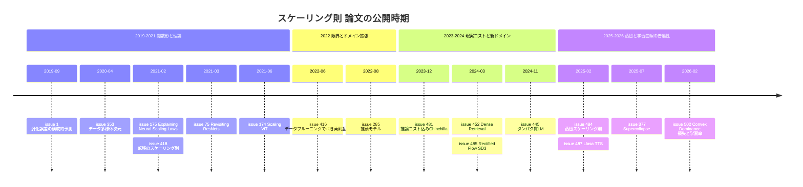

# スケーリング則：汎化誤差・視覚・転移・蒸留・推論コスト・データプルーニング・各ドメイン・理論・学習曲線の普遍性

> 対象: primary 論文 16 件（重複登録なし）
> 論文の公開期間: 2019-09 〜 2026-02
> issue 登録期間: 2020-05-22 〜 2026-02-12（2020〜2022 年の第 1 波と、2025-07 以降の第 2 波に分かれる）

## 概要

ノート群は「スケールさせると性能はどう予測できるか」という問いを出発点にしている。そこから、「何を・どの比率でスケールさせるのが最適か」「学習コスト以外（推論・蒸留・データ選別）を入れると最適点はどう動くか」へ問いを広げていった。主な問いは次の 5 つである。

1. **汎化誤差・損失は、モデルサイズ $N$・データ量 $D$・計算量 $C$ のどんな関数形で書けるのか。** 指数は何で決まるのか（#1, #353, #175）。
2. **スケーリング則は言語以外のドメインでも成り立つのか。** 対象は視覚（#75, #174）、画像生成（#485）、推薦（#285）、検索（#452）、タンパク質（#445）、音声（#487）。
3. **計算最適性を、転移・推論コスト・蒸留込みで考えると何が変わるのか**（#418, #481, #484）。
4. **べき乗則は超えられるのか。** データの「量」ではなく「選び方」でスケーリングを変えられるか（#416）。
5. **最終損失だけでなく、学習曲線全体や学習率までスケールに対して普遍的に予測できるのか**（#377, #502）。

バッチサイズに関するスケーリング則（クリティカルバッチサイズ、勾配ノイズスケール）は [Critical Batch Size](../practical_optimization/01_critical_batch_size.md) で扱う。

## 目次

1. [背景と基本概念](#背景と基本概念)
2. [研究の系譜・時系列ナラティブ](#研究の系譜時系列ナラティブ)
3. [タイムライン](#タイムライン)
4. [サブトピック別の整理](#サブトピック別の整理)
5. [論文一覧](#論文一覧)
6. [採択先別の集計](#採択先別の集計)
7. [各論文の詳細まとめ](#各論文の詳細まとめ)
8. [横断的な知見・未解決問題](#横断的な知見未解決問題)
9. [関連論文](#関連論文)

## 背景と基本概念

### べき乗則と不可約損失

データが十分にあるとき、よく学習したネットワークのテスト損失はパラメータ数 $N$ に対してべき乗則で減る。

$$
L(N) \propto N^{-\alpha}
$$

実用上は、不可約な定数項を加えた $L = L_\infty + (A/N)^{\alpha}$ の形でフィットすることが多い。推薦モデル（[#285](https://github.com/Hiroki11x/Papers/issues/285)）では「べき乗則 + 定数」、Dense Retrieval（[#452](https://github.com/Hiroki11x/Papers/issues/452)）では $(A/N)^{\alpha} + \delta_N$ と $(B/D)^{\beta} + \delta_D$ が使われている。

### Chinchilla 則と計算最適配分

モデルサイズと学習トークン数 $D_{tr}$ の両方を変数とする典型形は次のとおりである。

$$
L(N, D_{tr}) = E + A N^{-\alpha} + B D_{tr}^{-\beta}
$$

学習 FLOPs を $C \approx 6 N D_{tr}$ として、固定した $C$ の下で $L$ を最小にする $N^*(C)\propto C^{a}$ と $D^*(C)\propto C^{b}$ を求めるのが「計算最適（compute-optimal）」である。IsoFLOP 曲線（同一計算量で $N$ を振った損失曲線）の最小点から推定する。

[#481](https://github.com/Hiroki11x/Papers/issues/481) は、この目的関数に推論 FLOPs $2 N D_{inf}$ を加える。[#484](https://github.com/Hiroki11x/Papers/issues/484) は、教師と生徒への計算配分の問題に一般化する。

### スケーリング指数の起源（理論）

- **データ多様体仮説**（[#353](https://github.com/Hiroki11x/Papers/issues/353)）: ネットワークが固有次元 $d$ のデータ多様体上で回帰をしているとみなすと、指数は $\alpha \approx 4/d$ になる。
- **4 つのレジーム**（[#175](https://github.com/Hiroki11x/Papers/issues/175)）: データ量とモデルサイズのそれぞれについて、分散制限（variance-limited）と解像度制限（resolution-limited）のレジームを区別する。これにより、過剰パラメータ化されていない場合も含めてスケーリング則の起源を説明する。

### 有効転移データ量

[#418](https://github.com/Hiroki11x/Papers/issues/418) は、事前学習の効果を「スクラッチ学習なら何トークン余分に必要だったか」という有効転移データ量 $D_T$ で測る。

$$
D_T = k\,(D_F)^{\alpha} N^{\beta}
$$

ここで $D_F$ はファインチューニングのデータ量である。タンパク質 LM（[#445](https://github.com/Hiroki11x/Papers/issues/445)）でも、CLM→MLM 転移に同様の「有効転移トークン」が導入されている。

### 学習曲線のスケーリングと学習率

- **スケーリング・コラプス**（[#377](https://github.com/Hiroki11x/Papers/issues/377)）: 計算最適に学習した異なるサイズのモデルの損失曲線を、最終損失と計算量で正規化すると単一の曲線に重なる現象。
- **凸 SGD の損失上界**（[#502](https://github.com/Hiroki11x/Papers/issues/502)）: 凸 SGD の損失上界 $L(T) \approx L^* + C_1/(T\eta_{\mathrm{peak}}) + C_2\,\eta_{\mathrm{peak}}$ から、最適ピーク学習率と最終損失の超過分はともに $1/\sqrt{T}$ でスケールする。

## 研究の系譜・時系列ナラティブ

論文の公開時期で 4 期に分ける。読まれた時期（issue 登録）は、2020〜2022 年の第 1 波（#1〜#353）と、2025-07 以降の第 2 波（#377〜#502）にはっきり分かれる。第 2 波では、[#416](https://github.com/Hiroki11x/Papers/issues/416) や [#418](https://github.com/Hiroki11x/Papers/issues/418) のような 2021〜2022 年の古典的な論文も遡って読まれている。

### 第 1 期（2019〜2021）: 関数形の確立と起源の理論

- [#1](https://github.com/Hiroki11x/Papers/issues/1)（ICLR 2020）は、リポジトリ最初の issue でもある。汎化誤差のモデルサイズ・データサイズ依存性をよく近似する関数形を提案し、小規模な観測から大規模での誤差を予測できることを視覚・言語タスクで示した。「スケールを越えた予測」というこの分野の基本的な問いを設定した論文である。
- その「なぜべき乗則なのか」に答える理論が 2 本続く。[#353](https://github.com/Hiroki11x/Papers/issues/353)（Sharma & Kaplan）は、指数をデータ多様体の固有次元に結び付けた（$\alpha\approx4/d$）。教師生徒設定と CNN・GPT 型モデルで検証している。[#175](https://github.com/Hiroki11x/Papers/issues/175)（Bahri, Dyer, Kaplan ほか）は、分散制限と解像度制限の 4 レジームを区別し、過剰パラメータ化されていない場合にもスケーリング則が成り立つことを説明した。ノートは、実験がフルバッチの素の GD である点に注目している。
- [#418](https://github.com/Hiroki11x/Papers/issues/418)（OpenAI）は、Kaplan らのスクラッチ学習のスケーリング則を転移学習に拡張した。少データ領域では、事前学習が「データを何倍にも増やす」効果を持つ。一方、データが十分多いと事前学習が逆効果になる硬直化（ossification）も報告している。
- 視覚では、[#75](https://github.com/Hiroki11x/Papers/issues/75)（ResNet-RS）が「アーキテクチャの変更より、学習法とスケーリング戦略のほうが効く」ことを示した。具体的には、過学習しうる領域では深さを、そうでなければ幅をスケールし、解像度はゆっくり上げる。[#174](https://github.com/Hiroki11x/Papers/issues/174) は、ViT でもスケーリング則が成り立つことを示した。ノートには「Vision でもちゃんと Scaling してる」とあり、事前学習は Adam、ファインチューニングはモメンタム SGD と記録されている。

### 第 2 期（2022）: べき乗則の限界とドメイン拡張

- [#416](https://github.com/Hiroki11x/Papers/issues/416) は、べき乗則による改善が「誤差を数 % 減らすのにデータを 10 倍以上必要とする」ほど非効率である点を問題にした。統計力学的な解析で、データプルーニングによりべき乗則を超える指数的スケーリングが可能であることを示した。データが多いときは難しい例を、少ないときは易しい例を残すのがよい。[#1](https://github.com/Hiroki11x/Papers/issues/1) 以来の「べき乗則は与えられたもの」という前提を、データ選別によって覆す立場であり、[#302](https://github.com/Hiroki11x/Papers/issues/302)（Data Diet, [05 正則化・圧縮](./05_regularization_augmentation_compression.md)）の EL2N なども比較対象に含まれる。
- [#285](https://github.com/Hiroki11x/Papers/issues/285)（Meta）は、DLRM 型推薦モデル（CTR 予測）でも品質がべき乗則 + 定数でスケールすることを示した。より高性能なアーキテクチャが現れるまではデータスケーリングが主流になる、と論じている。

### 第 3 期（2023〜2024）: 計算最適性を「現実のコスト」へ

- [#481](https://github.com/Hiroki11x/Papers/issues/481) は、Chinchilla 則が推論コストを無視している点を突いた。推論需要が大きいときは「小さいモデルを長く学習する」ほうが総コストが下がる。トークン/パラメータ比 10,000 まで性能向上が続き、そこでは Chinchilla 則が追加データの効果を過大評価していることも示した。
- [#452](https://github.com/Hiroki11x/Papers/issues/452) は、Dense Retrieval に連続指標 Contrastive Entropy を導入し、モデルサイズ・アノテーション量に対するべき乗則を示した。予算最適化で推論コストを含めると最適モデルが大きく縮むという結論は、[#481](https://github.com/Hiroki11x/Papers/issues/481) と同じ方向である。
- [#485](https://github.com/Hiroki11x/Papers/issues/485)（Stable Diffusion 3）は、Rectified Flow と MM-DiT を 8B までスケールし、検証損失と生成品質の評価指標の強い相関を示した。
- [#445](https://github.com/Hiroki11x/Papers/issues/445) は、タンパク質 LM で CLM と MLM の計算最適則を別々に導いた。両者が異なる指数を持つこと、CLM→MLM の転移スケーリングも示した。転移の寄与を「有効転移トークン」で測る点は、[#418](https://github.com/Hiroki11x/Papers/issues/418) の有効転移データ量と同様の考え方である。

### 第 4 期（2025〜2026）: 蒸留・推論時計算・学習ダイナミクスの普遍性

- [#484](https://github.com/Hiroki11x/Papers/issues/484)（Apple）は、蒸留に Chinchilla 型のスケーリング則を導入した。生徒の損失は教師サイズではなく教師の損失 $L_T$ のみに依存すること、capacity gap を broken power law で再現できることを示した。蒸留が教師あり学習より有利なのは生徒の計算量が小さい領域だけで、教師の学習コストまで含めると常に教師あり学習のほうが効率的である。[#481](https://github.com/Hiroki11x/Papers/issues/481) と同じく、「推論用の小さいモデルをどう作るか」を計算配分の問題として扱っている。
- [#487](https://github.com/Hiroki11x/Papers/issues/487)（Llasa）は、TTS で学習時計算（モデル・データ）と推論時計算（verifier 誘導探索）の両方のスケーリングを体系的に検証した。LLM で注目された test-time compute を音声に持ち込んだ論文である。
- [#377](https://github.com/Hiroki11x/Papers/issues/377) は、最終損失だけを見るスケーリング則から、学習曲線全体の普遍性（Supercollapse）へ焦点を移した。SGD ノイズモデルで説明し、ハイパーパラメータスケーリングの診断に使えることを示した。
- [#502](https://github.com/Hiroki11x/Papers/issues/502) は、凸 SGD 理論から損失と学習率を同時に予測する二次元スケーリング則を作り、AdamW・Muon で最大 80 倍の外挿に成功した。[#377](https://github.com/Hiroki11x/Papers/issues/377) と同様に「学習率スケジュール込みの学習曲線の予測」を扱うが、説明の枠組みは SGD ノイズモデルではなく凸最適化の上界である。

## タイムライン

（論文の公開時期 first_public 順）

## サブトピック別の整理

### 1. スケーリング則の関数形と理論

**要点**
- 小規模な観測から大規模の誤差を予測できる関数形が存在する（#1）。
- 指数はデータ多様体の固有次元で決まる（$\alpha\approx4/d$, #353）。
- スケーリングには分散制限と解像度制限のレジームがあり、過剰パラメータ化でなくても成り立つ（#175）。

**論文**: [#1](https://github.com/Hiroki11x/Papers/issues/1), [#353](https://github.com/Hiroki11x/Papers/issues/353), [#175](https://github.com/Hiroki11x/Papers/issues/175)

### 2. 学習ダイナミクス・学習率とスケーリング

**要点**
- 計算最適な学習曲線は正規化で単一曲線に崩壊する。学習率減衰下では、モデル間の差がシード間ノイズ未満になる（Supercollapse, #377）。
- Supercollapse からの逸脱は、ハイパーパラメータスケーリングの不備を示す診断に使える（#377）。
- 適格なスケジュール（線形減衰・cosine・WSD）では、最適ピーク学習率も最終損失の超過分も $1/\sqrt{T}$ でスケールする。$(N,T)$ の二次元スケーリング則で外挿できる（#502）。
- 学習率スケジュールそのものは [学習率スケジュール・Weight Decay](./08_lr_schedule_weight_decay.md) を、バッチサイズのスケーリングは [Critical Batch Size](../practical_optimization/01_critical_batch_size.md) を参照。

**論文**: [#377](https://github.com/Hiroki11x/Papers/issues/377), [#502](https://github.com/Hiroki11x/Papers/issues/502)

### 3. 計算最適性の拡張（転移・推論コスト・蒸留）

**要点**
- 転移の効果は有効転移データ量のべき乗則で書ける。データが多いと事前学習が逆効果になることもある（#418）。
- 推論需要が大きいほど、最適点は「小さく長く」へ動く（#481）。
- 蒸留が有利なのは生徒の計算量が小さいときだけで、教師の学習コストを含めると教師あり学習が勝つ（#484）。

**論文**: [#418](https://github.com/Hiroki11x/Papers/issues/418), [#481](https://github.com/Hiroki11x/Papers/issues/481), [#484](https://github.com/Hiroki11x/Papers/issues/484)

### 4. データの量と質

**要点**
- 適切なデータプルーニングでべき乗則を超えられる。データが多いときは難例を、少ないときは易例を残す（#416）。
- 既存のプルーニング指標の多くは ImageNet 規模では効果が限られ、ラベル不要の自己教師ありプロトタイプ指標が教師ありの指標に匹敵する（#416）。
- データの多様性・品質は他のドメインでも鍵になる。タンパク質 LM では多様なメタゲノムデータ UniMeta200B が過学習を回避し（#445）、Dense Retrieval では人手アノテーションが依然として最良である（#452）。

**論文**: [#416](https://github.com/Hiroki11x/Papers/issues/416)（関連: [#445](https://github.com/Hiroki11x/Papers/issues/445), [#452](https://github.com/Hiroki11x/Papers/issues/452)）

### 5. 視覚・画像生成モデルのスケーリング

**要点**
- ResNet では、アーキテクチャより学習法とスケーリング戦略（深さか幅か、解像度の上げ方）が重要である（#75）。
- ViT でもモデル・データ・計算のスケーリング則が成り立つ（#174）。
- 画像生成（Rectified Flow + MM-DiT）でも、モデルサイズの増加 → 検証損失の低下 → 評価指標の向上という関係が 8B まで続く（#485）。

**論文**: [#75](https://github.com/Hiroki11x/Papers/issues/75), [#174](https://github.com/Hiroki11x/Papers/issues/174), [#485](https://github.com/Hiroki11x/Papers/issues/485)

### 6. 新しいドメインへの拡張（推薦・検索・タンパク質・音声）

**要点**
- 推薦（DLRM）: べき乗則 + 定数で、当面はデータスケーリングが主流（#285）。
- Dense Retrieval: Contrastive Entropy で連続的に測ると、べき乗則に従う。予算配分も導ける（#452）。
- タンパク質 LM: CLM はデータ依存、MLM はモデル依存の指数を持ち、計算の約 20% を CLM 事前学習に割くのが最適（#445）。
- 音声合成: データ増は言語的カバレッジ系のタスクに、モデル増は感情・韻律系のタスクに効く。推論時の探索でも性能が伸びる（#487）。

**論文**: [#285](https://github.com/Hiroki11x/Papers/issues/285), [#452](https://github.com/Hiroki11x/Papers/issues/452), [#445](https://github.com/Hiroki11x/Papers/issues/445), [#487](https://github.com/Hiroki11x/Papers/issues/487)

## 論文一覧

（first_public 順。records から Python で生成）

| 公開 | 論文 | 著者/組織 | 採択先 | 根拠 | サブトピック |
|---|---|---|---|---|---|
| 2019-09 | [#1](https://github.com/Hiroki11x/Papers/issues/1) A Constructive Prediction of the Generalization Error Across Scales | Jonathan S. Rosenfeld, Amir Rosenfeld, Yonatan Belinkov, et al. / MIT | ICLR 2020 | arXivコメント | 汎化誤差のスケーリング則 |
| 2020-04 | [#353](https://github.com/Hiroki11x/Papers/issues/353) Scaling Laws from the Data Manifold Dimension | Utkarsh Sharma, Jared Kaplan / Johns Hopkins University | JMLR | issue記載 | スケーリング則の理論 |
| 2021-02 | [#175](https://github.com/Hiroki11x/Papers/issues/175) Explaining Neural Scaling Laws | Yasaman Bahri, Ethan Dyer, Jared Kaplan, et al. / Google | PNAS | arXivコメント | スケーリング則の理論 |
| 2021-02 | [#418](https://github.com/Hiroki11x/Papers/issues/418) Scaling Laws for Transfer | Danny Hernandez, Jared Kaplan, Tom Henighan, Sam McCandlish / OpenAI | arXiv（プレプリント） | 不明 | 転移学習のスケーリング則 |
| 2021-03 | [#75](https://github.com/Hiroki11x/Papers/issues/75) Revisiting ResNets: Improved Training and Scaling Strategies | Irwan Bello, William Fedus, Xianzhi Du, et al. / Google Brain | NeurIPS 2021 | Semantic Scholar確認 | 学習法とモデルスケーリング |
| 2021-06 | [#174](https://github.com/Hiroki11x/Papers/issues/174) Scaling Vision Transformers | Xiaohua Zhai, Alexander Kolesnikov, Neil Houlsby, Lucas Beyer / Google Brain | CVPR 2022 | arXivコメント | ViTのスケーリング則 |
| 2022-06 | [#416](https://github.com/Hiroki11x/Papers/issues/416) Beyond neural scaling laws: beating power law scaling via data pruning | Ben Sorscher, Robert Geirhos, Surya Ganguli, Ari S. Morcos / Stanford / Meta AI | NeurIPS 2022 | arXivコメント | データプルーニングとスケーリング則 |
| 2022-08 | [#285](https://github.com/Hiroki11x/Papers/issues/285) Understanding Scaling Laws for Recommendation Models | Newsha Ardalani, Carole-Jean Wu, Zeliang Chen, et al. / Meta | arXiv（プレプリント） | 不明 | 推薦モデルのスケーリング則 |
| 2023-12 | [#481](https://github.com/Hiroki11x/Papers/issues/481) Beyond Chinchilla-Optimal: Accounting for Inference in Language Model Scaling Laws | Nikhil Sardana, Jacob Portes, Sasha Doubov, Jonathan Frankle / MosaicML / Databricks | ICML 2024 | arXivコメント | 推論コストを考慮したスケーリング則 |
| 2024-03 | [#452](https://github.com/Hiroki11x/Papers/issues/452) Scaling Laws For Dense Retrieval | Yan Fang, Jingtao Zhan, Qingyao Ai, et al. / Tsinghua | SIGIR 2024 | issue記載 | Dense Retrievalのスケーリング則 |
| 2024-03 | [#485](https://github.com/Hiroki11x/Papers/issues/485) Scaling Rectified Flow Transformers for High-Resolution Image Synthesis | Patrick Esser, Sumith Kulal, Andreas Blattmann, et al. / Stability AI | ICML 2024 | Semantic Scholar確認 | 画像生成モデルのスケーリング |
| 2024-11 | [#445](https://github.com/Hiroki11x/Papers/issues/445) Training Compute-Optimal Protein Language Models | Xingyi Cheng, Bo Chen, Pan Li, et al. / BioMap / Tsinghua | NeurIPS 2024 | Web確認 | タンパク質言語モデルのスケーリング則 |
| 2025-02 | [#484](https://github.com/Hiroki11x/Papers/issues/484) Distillation Scaling Laws | Dan Busbridge, Amitis Shidani, Floris Weers, et al. / Apple | ICML 2025 | arXivコメント | 蒸留のスケーリング則 |
| 2025-02 | [#487](https://github.com/Hiroki11x/Papers/issues/487) Llasa: Scaling Train-Time and Inference-Time Compute for Llama-based Speech Synthesis | Zhen Ye, Xinfa Zhu, Chi-Min Chan, et al. / HKUST | arXiv（プレプリント） | 不明 | 音声合成のスケーリング |
| 2025-07 | [#377](https://github.com/Hiroki11x/Papers/issues/377) Scaling Collapse Reveals Universal Dynamics in Compute-Optimally Trained Neural Networks | Shikai Qiu, Lechao Xiao, Andrew Gordon Wilson, et al. / NYU / Google DeepMind | ICML 2025 | arXivコメント | 学習曲線のスケーリング普遍性 |
| 2026-02 | [#502](https://github.com/Hiroki11x/Papers/issues/502) Convex Dominance in Deep Learning I: A Scaling Law of Loss and Learning Rate | Zhiqi Bu, Shiyun Xu, Jialin Mao | ICLR 2026 | arXivコメント | 学習率と損失のスケーリング則 |

## 採択先別の集計

（会議・ジャーナル系列ごと。records から Python で生成）

| 採択先（系列） | 件数 | issue |
|---|---|---|
| ICML | 4 | [#377](https://github.com/Hiroki11x/Papers/issues/377), [#481](https://github.com/Hiroki11x/Papers/issues/481), [#484](https://github.com/Hiroki11x/Papers/issues/484), [#485](https://github.com/Hiroki11x/Papers/issues/485) |
| NeurIPS | 3 | [#75](https://github.com/Hiroki11x/Papers/issues/75), [#416](https://github.com/Hiroki11x/Papers/issues/416), [#445](https://github.com/Hiroki11x/Papers/issues/445) |
| arXiv（プレプリント） | 3 | [#285](https://github.com/Hiroki11x/Papers/issues/285), [#418](https://github.com/Hiroki11x/Papers/issues/418), [#487](https://github.com/Hiroki11x/Papers/issues/487) |
| ICLR | 2 | [#1](https://github.com/Hiroki11x/Papers/issues/1), [#502](https://github.com/Hiroki11x/Papers/issues/502) |
| CVPR | 1 | [#174](https://github.com/Hiroki11x/Papers/issues/174) |
| JMLR | 1 | [#353](https://github.com/Hiroki11x/Papers/issues/353) |
| PNAS | 1 | [#175](https://github.com/Hiroki11x/Papers/issues/175) |
| SIGIR | 1 | [#452](https://github.com/Hiroki11x/Papers/issues/452) |

## 各論文の詳細まとめ

### [#1] A Constructive Prediction of the Generalization Error Across Scales

- 公開: 2019-09 / 採択先: ICLR 2020 / 著者: Jonathan S. Rosenfeld, Amir Rosenfeld, Yonatan Belinkov, Nir Shavit（MIT）

**要約**: 汎化誤差のモデルサイズ・データセットサイズへの依存性は、実務にもニューラルネットワーク理論にも重要だが、その関数形は未解明だった。本論文は、汎化誤差をよく近似する関数形を提示した。

**主な知見**
- 幅・深さなどのモデルスケーリングの概念を使って関数形を構築し、さまざまなモデル/データスケールにわたって達成できる正確なモデルを指定した。
- 視覚・言語の複数のモデルとデータセットで、関数形がスケールを越えて観測によく適合し、小規模なモデル・データから大規模での誤差を正確に予測できた。

### [#353] Scaling Laws from the Data Manifold Dimension

- 公開: 2020-04 / 採択先: JMLR / 著者: Utkarsh Sharma, Jared Kaplan（Johns Hopkins University）

**要約**: データが豊富な場合、テスト損失は $L\propto N^{-\alpha}$ のべき乗則でスケールし、さまざまなモダリティで何桁にもわたって続く。これは、ニューラルモデルが次元 $d$ のデータ多様体上で回帰をしているにすぎないと考えれば説明できる。

**主な知見**
- この理論から、クロスエントロピー損失と MSE 損失に対してスケーリング指数 $\alpha\approx4/d$ が予想される。
- 教師/生徒の枠組みで固有次元と指数を独立に測定して理論を確認した。ランダム教師ネットワークの性質を調整することで、さまざまな $d$ と $\alpha$ を調べられる。
- 複数のデータセットで、CNN 画像分類器と GPT 型言語モデルでも検証した。

### [#175] Explaining Neural Scaling Laws

- 公開: 2021-02 / 採択先: PNAS / 著者: Yasaman Bahri, Ethan Dyer, Jared Kaplan, et al.（Google）

**要約**: データ量とモデルサイズのそれぞれについて、分散制限・解像度制限のレジームを区別し、スケーリング則の起源を説明した。

**主な知見**
- 過剰パラメータ化されていなくても、スケーリング則は成り立つ。
- データとモデルパラメータをそれぞれ変化させ、過小パラメータ/過剰パラメータとの組み合わせで 4 種類のレジームを考える。
- 実験はフルバッチの素の GD で行われている。

**メモ**: 解説動画（YouTube）がノートに埋め込まれている。

### [#418] Scaling Laws for Transfer

- 公開: 2021-02 / 採択先: arXiv（プレプリント） / 著者: Danny Hernandez, Jared Kaplan, Tom Henighan, Sam McCandlish（OpenAI）

**要約**: 大規模言語モデルの転移学習のスケーリング則を実証的に分析した。事前学習の効果を「スクラッチ学習でどれだけデータが追加されたのと同等か」という有効転移データ量 $D_T$ で定量化し、少データ領域では $D_T = k(D_F)^{\alpha}N^{\beta}$ のべき乗則で記述できることを示した。

**主な知見**
- $\alpha$ は分布の近さを、$\beta$ はモデルの一般性を反映する指数と解釈される。
- ファインチューニングのデータが少ないほど事前学習の効果は大きく、実質的にデータセットを何倍にも増やす効果（effective multiplier）がある。
- データが十分大きい場合は硬直化（ossification）が起こり、スクラッチ学習に劣ることがある。
- Python コードを対象に、スクラッチ学習、自然言語で事前学習、自然言語 + 他言語コードで事前学習の 3 つを比較した。モデル規模とデータ規模をそれぞれ 4 桁変化させ、安定したべき乗則を確認した。
- スクラッチ学習はデータ制約で性能が飽和するが、事前学習モデルは改善が続く。少データ領域では、計算効率の面でも事前学習モデルが圧倒的に有利。

### [#75] Revisiting ResNets: Improved Training and Scaling Strategies

- 公開: 2021-03 / 採択先: NeurIPS 2021 / 著者: Irwan Bello, William Fedus, Xianzhi Du, et al.（Google Brain）

**要約**: アーキテクチャの影響は、学習方法やスケーリング戦略の同時変更と混同されがちである。典型的な ResNet でこの 3 つを分離して調べたところ、学習方法とスケーリング戦略のほうがアーキテクチャの変更より重要だった。

**主な知見**
- 最適なスケーリング戦略は学習レジームに依存する。新しい戦略は 2 つで、(1) 過学習が起こりうる領域では深さを、そうでなければ幅をスケールする、(2) 画像解像度を従来の推奨（Tan & Le, 2019）よりゆっくり上げる。
- ResNet-RS は TPU 上で EfficientNet より 1.7〜2.7 倍速く、ImageNet で同等の精度を達成した。
- 大規模な半教師あり設定では、EfficientNet NoisyStudent より 4.7 倍速く、ImageNet top-1 で 86.2% を達成した。
- 下流タスクへの転移や、Kinetics-400 の動画分類にも拡張できる。

**メモ**: 「アーキテクチャ自体の変更より、depth いじったり width いじるほうが効いてくる」。

### [#174] Scaling Vision Transformers

- 公開: 2021-06 / 採択先: CVPR 2022 / 著者: Xiaohua Zhai, Alexander Kolesnikov, Neil Houlsby, Lucas Beyer（Google Brain）

**要約**: ViT のモデル・データ・計算量をスケールし、ビジョンでもスケーリング則が成り立つことを示した。ノートは短い。

**主な知見**
- 学習は Adam（事前学習）→ モメンタム SGD（ファインチューニング）。
- 「Vision でもちゃんと Scaling してる」。

### [#416] Beyond neural scaling laws: beating power law scaling via data pruning

- 公開: 2022-06 / 採択先: NeurIPS 2022 / 著者: Ben Sorscher, Robert Geirhos, Surya Ganguli, Ari S. Morcos（Stanford / Meta AI）

**要約**: スケーリング則による改善は極めて非効率で、誤差を数 % 減らすのにデータや計算量を 10 倍以上必要とすることが多い。本論文は、データセットの一部を削るデータプルーニングで、べき乗則を超える指数的スケーリングが可能であることを理論と実験で示した。

**主な知見**
- 統計力学による理論: データが豊富なときは難しい例を、少ないときは易しい例を残す戦略で指数的スケーリングが可能になる。
- CIFAR-10・SVHN・ImageNet の ResNet で、プルーニング後のデータでべき乗則を上回るスケーリングを観測した。
- 既存の 10 種類のプルーニング指標を ImageNet 規模で比較した。多くは小規模データでは有効だが、大規模では効果が限られる。
- ラベル不要の自己教師ありプロトタイプ指標を提案した。メモリゼーションスコアのような教師ありの手法と同等で、計算効率も高い。
- ImageNet では約 80% のデータを残すだけで、フルデータと同等の精度が得られた。ImageNet の一部を削ったモデルを CIFAR-10 でファインチューニングしても性能を維持できた。
- 「大量のランダムデータを集める」戦略の非効率性を指摘し、CLIP や PaLM の前処理データのような巨大な未ラベルデータへの応用を展望している。

### [#285] Understanding Scaling Laws for Recommendation Models

- 公開: 2022-08 / 採択先: arXiv（プレプリント） / 著者: Newsha Ardalani, Carole-Jean Wu, Zeliang Chen, et al.（Meta）

**要約**: DLRM 型の推薦モデル、特にクリック率（CTR）予測の経験的スケーリング則を調べた。モデル品質は、モデルサイズ・データサイズ・学習計算量に対して「べき乗則 + 定数」でスケールする。

**主な知見**
- データ・パラメータ・計算量の 3 つのリソース次元に沿ってスケーリング効率を特徴付け、異なるスケーリング方式を比較した。
- より高性能なアーキテクチャが現れるまでは、データスケーリングが今後の主流になる。
- 研究課題として、推薦モデルはスケーリング則の予測どおりスケールし続けるか、スケーリングの限界はどこか、長期的なハードウェア/システム開発への影響は何か、を掲げている。

### [#481] Beyond Chinchilla-Optimal: Accounting for Inference in Language Model Scaling Laws

- 公開: 2023-12 / 採択先: ICML 2024 / 著者: Nikhil Sardana, Jacob Portes, Sasha Doubov, Jonathan Frankle（MosaicML / Databricks）

**要約**: 既存のスケーリング則（Kaplan, Chinchilla）は学習コストだけを最適化対象にしていた。本論文は、目標品質 $L(N,D_{tr})=\ell$ の下で、学習と推論の総 FLOPs $6ND_{tr}+2ND_{inf}$ を最小化する問題を定式化した。解析解はなく、ニュートン法で数値的に解いている。

**主な知見**
- 推論需要が大きいときは、Chinchilla 最適より小さいモデルを長く学習するほうが総コストが下がる。例えば、13B モデルを Chinchilla 最適で学習する代わりに 7B モデルを多くのトークンで学習すると、総 FLOPs を 17% 削減できる。
- MPT アーキテクチャの 150M〜6B の 47 モデルを、トークン/パラメータ比 10〜10,000 で学習した。損失も下流タスクの平均スコア（MosaicML Evaluation Gauntlet）も上昇を続け、飽和は観測されなかった。損失と下流精度には強い線形相関がある。
- 係数を再推定すると、極端なトークン比では Chinchilla 則が追加データの効果を過大評価している。Chinchilla の $\alpha=0.34, \beta=0.28$ に対し、全データを使った実測値は $\alpha=0.18, \beta=0.24$。
- 推論時の GPU 利用率（MFU）は 1〜50% と低いため、金額換算で最適化すると、Chinchilla 式の 70B モデルは同品質の最適モデルより 36% 高コストになる。

### [#452] Scaling Laws For Dense Retrieval

- 公開: 2024-03 / 採択先: SIGIR 2024 / 著者: Yan Fang, Jingtao Zhan, Qingyao Ai, et al.（Tsinghua）

**要約**: Dense Retrieval（DR）のスケーリング則を初めて体系的に調べた。NDCG や MAP のような離散的な指標は微小な変化を捉えにくいため、対照損失に基づく連続的な指標 Contrastive Entropy を導入した。

**主な知見**
- Contrastive Entropy は MAP@10・NDCG@10・Recall@1000 と高い相関（$R^2\approx0.99$）を持つ。
- モデルサイズ（BERT 0.5M〜82M、および ERNIE）に対して $(A/N)^{\alpha}+\delta_N$ のべき乗則が成り立つ（$\alpha\approx0.53$）。
- データサイズに対しても $(B/D)^{\beta}+\delta_D$ が成り立つ（MS MARCO で $\beta\approx1.05$、T2Ranking で $\beta\approx0.50$）。
- アノテーション品質を比べると、LLM（ChatGLM3）生成データは速くスケールするが、人手アノテーションが依然として最高性能。
- $N$ と $D$ の統合則でも、実測と予測が高精度に一致した。
- アノテーション・学習・推論のコストモデルで予算最適化すると、推論コストを含めない場合の最適モデルは約 13B パラメータ、含める場合は数百万パラメータ規模に縮小する。

### [#485] Scaling Rectified Flow Transformers for High-Resolution Image Synthesis

- 公開: 2024-03 / 採択先: ICML 2024 / 著者: Patrick Esser, Sumith Kulal, Andreas Blattmann, et al.（Stability AI）

**要約**: Stable Diffusion 3 の論文。Rectified Flow 向けの新しいタイムステップサンプリングと、テキスト・画像を双方向に統合する Transformer アーキテクチャ MM-DiT を提案し、8B までスケールさせて既存の SOTA を上回った。

**主な知見**
- 従来の Rectified Flow の一様サンプリングでは中間のノイズ領域がうまく学習されない。logit-normal などの重み付けで中間領域を重点的に学習する。61 変種の比較で rf/lognorm(0,1) が安定して最良だった。
- MM-DiT は、テキストと画像に独立した重みを持つ 2 系列の Transformer で、Self-Attention で両系列を結合して双方向に情報を交換する。DiT・CrossDiT・UViT より検証損失・CLIP スコア・FID のすべてで優れていた。
- スケーリング実験では、モデルサイズの増加 → 検証損失の低下 → 評価指標の向上という明確な傾向が見られ、検証損失と GenEval・T2I-CompBench・人間評価の間に強い相関がある。
- 8B モデルは DPO 調整後、SDXL・Pixart-α・DALL-E 3 などを上回った。

### [#445] Training Compute-Optimal Protein Language Models

- 公開: 2024-11 / 採択先: NeurIPS 2024（Spotlight） / 著者: Xingyi Cheng, Bo Chen, Pan Li, Jing Gong, Jie Tang, Le Song（BioMap / Tsinghua）

**要約**: タンパク質言語モデル（PLM）の計算最適な学習を体系的に解析し、CLM と MLM それぞれのスケーリング則を確立した。タンパク質配列は語彙が小さく（20 種類のアミノ酸）冗長性が少ないため、NLP のスケーリング則がそのまま当てはまる保証はない。

**主な知見**
- 既存の UniRef50 などを再利用すると、CLM では効果が漸減し、MLM では過学習が起こる。そこで UniMeta200B（939M 配列・194B トークン）を構築し、IID/OOD の両方で損失が安定して下がることを示した。
- 3.5M〜10.7B の 300 以上のモデルで、$N(C)=A\,C^{\alpha}$、$D(C)=B\,C^{\beta}$ をフィットした。CLM は $\alpha=0.578, \beta=0.421$、MLM は $\alpha=0.776, \beta=0.230$。CLM はデータ依存性が高く、MLM はモデル依存性が高い。
- 計算量を 10 倍にすると、CLM はモデル 4 倍・データ 3 倍、MLM はモデル 6 倍・データ 1.7 倍にするのが最適。
- CLM で事前学習してから MLM を学習するほうが逆順より有効で、約 20% の計算を CLM に割くのが理想。10 倍の計算で得られる効果を約 7.7 倍の計算量で達成できる。
- 同等の FLOPs で学習した 7.2B CLM は PROGEN2-xlarge より OOD PPL・構造信頼度・多様性で優れ、10.7B MLM は ESM-2 3B を 8 タスク中 7 タスクで上回った。
- 限界として、スケーリング則は 1 エポックを前提としており、複数エポックでは修正が必要。

### [#484] Distillation Scaling Laws

- 公開: 2025-02 / 採択先: ICML 2025 / 著者: Dan Busbridge, Amitis Shidani, Floris Weers, et al.（Apple）

**要約**: 蒸留のスケーリング則を体系的に提案した。700 以上の実験から、教師の損失 $L_T$・生徒のパラメータ数 $N_S$・蒸留トークン数 $D_S$ で生徒の損失 $L_S$ を高精度に予測する。

**主な知見**
- 生徒の性能は、教師サイズ $N_T$ や教師データ量 $D_T$ には直接依存せず、教師の損失 $L_T$ のみに依存する。
- 教師が強すぎると生徒の性能が悪化する capacity gap（U 字型）を、教師と生徒の学習能力の差に応じた broken power law で再現した。
- 実験範囲は教師 143M〜12.6B、生徒 143M〜7.75B、最大 512B トークン。高損失領域だけでフィットしても、低損失領域への外挿誤差は 1% 未満。
- 蒸留が教師あり学習より有利なのは、生徒が使える計算量が十分小さいときだけ。生徒の計算量が大きくなると教師あり学習が必ず勝つ。教師の学習コストを含めると、常に教師あり学習のほうが効率的。
- 教師が既に存在する場合、教師も学習する場合など、ワークフロー別に最適な教師サイズ・教師トークン数・生徒トークン数を数値最適化（SLSQP）で導いた。

### [#487] Llasa: Scaling Train-Time and Inference-Time Compute for Llama-based Speech Synthesis

- 公開: 2025-02 / 採択先: arXiv（プレプリント） / 著者: Zhen Ye, Xinfa Zhu, Chi-Min Chan, et al.（HKUST）

**要約**: 既存の LLM 系 TTS は多段構成で、スケーリング効果を体系的に検証しにくい。そこで、Llama と完全に整合した単一 Transformer + tokenizer の TTS「Llasa」を提案し、学習時と推論時の計算スケーリングを統一的に検証した。

**主な知見**
- 単層 VQ のコーデック X-codec2（意味エンコーダと音響エンコーダを 1 つのコードブックに統合）は、トークンレート 50 の範囲で再構成品質が最良。
- 学習時スケーリング（モデル 1B/3B/8B × データ 80k/160k/250k 時間）: データ増は多音字・稀な文字・複合名詞など言語的カバレッジが必要なタスクに、モデル増は感情・詩・早口言葉など深い意味理解や韻律が必要なタスクに効く。どちらを増やしても、性能はほぼ単調に向上する。
- 推論時スケーリング: 音声理解モデルを verifier に使う。Best-of-N（ORM）は計算量に応じて話者類似度を改善する。ビームサーチ（PRM）は同じ計算量でより強いが、WER が悪化する。部分的な PRM と ORM のハイブリッドが最良のトレードオフ。
- 推論時スケーリングを入れると、SEED-TTS-Eval などで既存モデルを上回る。同じ枠組みで離散表現だけの ASR も可能で、Llasa-ASR-3B は test-clean の WER 1.9% だった。

### [#377] Scaling Collapse Reveals Universal Dynamics in Compute-Optimally Trained Neural Networks

- 公開: 2025-07 / 採択先: ICML 2025 / 著者: Shikai Qiu, Lechao Xiao, Andrew Gordon Wilson, Jeffrey Pennington, Atish Agarwala（NYU / Google DeepMind）

**要約**: 計算最適に学習したモデルの損失曲線は、最終損失と計算量で正規化すると、モデルサイズや学習率スケジュールによらず単一の普遍的な曲線に崩壊する（スケーリング・コラプス）。学習率を減衰させると、モデル間の差がシード間ノイズを下回るほど一致する（Supercollapse）。

**主な知見**
- CIFAR-5M・Lichess・MLP（Power-Law Fourier Features）など多様なデータとアーキテクチャで、モデルサイズと学習率スケジュールを変えても Supercollapse が再現された。
- 典型的なスケーリング則に従う損失なら、計算最適な学習曲線は正規化後にコラプスする（十分条件）。
- SGD の勾配ノイズを考慮した簡潔なモデルで、学習率スケジュールの変化が損失曲線に与える影響を高精度に予測できる。学習率減衰がノイズを抑えることが、Supercollapse の起源である。
- Supercollapse からの逸脱は、学習率やデータのスケーリングなど、ハイパーパラメータスケーリングの不備を検出する診断になる。
- 従来の無限幅・無限深度の理論が学習時間を固定していたのに対し、モデルサイズと学習時間を同時にスケールする計算最適な設定に着目した点が新しい。

### [#502] Convex Dominance in Deep Learning I: A Scaling Law of Loss and Learning Rate

- 公開: 2026-02 / 採択先: ICLR 2026 / 著者: Zhiqi Bu, Shiyun Xu, Jialin Mao

**要約**: 非凸な深層学習の損失ダイナミクスが、実際には凸最適化理論と整合的に振る舞う点に着目した。凸 SGD の損失上界 $L(T)\approx L^*+C_1/(T\eta_{\mathrm{peak}})+C_2\eta_{\mathrm{peak}}$ を出発点に、損失と学習率を同時に予測するスケーリング則を構築した。

**主な知見**
- 線形減衰・cosine 減衰・WSD のスケジュールだけが、$\eta_{\mathrm{peak}}\propto1/\sqrt{T}$ のときに最終損失の超過分 $\propto1/\sqrt{T}$ という最適収束を達成する。定数学習率では $\log(T)/T$ に悪化する。スケジュールがこの収束を達成できるかを、学習なしで判定できる条件も示した。
- 定数をデータから推定する一般化形で、ResNet・GPT2・AdamW・Muon について学習曲線の前半から後半を予測した（$R^2\ge0.95$）。WSD の減衰時の損失急減や、cyclic スケジュールの振動も再現した。
- 既存の大規模 LLM の結果（密モデル・MoE）や Chinchilla 実験の再構築データ（0.074B〜12.56B、最大 300B トークン）でも、損失は $1/\sqrt{T}$ に対して直線的で、誤差は 1% 以内。
- 二次元スケーリング則 $L(N,T)\approx\tilde L_\infty(N)+\tilde Q(N)/\sqrt{T}$ を提案した。GPT2（0.1B/1B/7B, 240 実験）で、0.1B で推定した基準学習率（AdamW 0.3、Muon 10）から訓練長 80 倍の外挿に、モデルサイズ方向では 70 倍の外挿に成功した。マルチモーダル VLM でも成立する。
- weight decay・バッチサイズ・クリッピング・シードのアブレーションでも成立する。限界として、過学習が強い場合は訓練損失では成り立つがテスト損失では破綻し、汎化の理論は未解明。

## 横断的な知見・未解決問題

### コンセンサス

- **べき乗則（+ 定数）は、ドメインを越えて驚くほど普遍的である。** 言語・視覚（#1, #174）、推薦（#285）、検索（#452）、タンパク質（#445）、画像生成（#485）、音声（#487）で確認されている。
- **損失は下流性能の良い代理指標である。** 損失と下流精度の線形相関（#481）、検証損失と生成品質評価の相関（#485）、連続指標 Contrastive Entropy とランキング指標の相関（#452）がその根拠である。逆に言えば、スケーリング則を測るには、連続的で滑らかな指標を選ぶことが前提になる（#452）。
- **学習コストだけの最適化は現実と合わない。** 推論コストを入れると最適モデルは小さくなり（#481, #452）、蒸留は小計算領域でしか得にならない（#484）。推論時計算そのものも、スケールさせる軸になる（#487）。
- **小規模実験からの外挿が実用上の価値の中心である。** #1 の「スケールを越えた予測」から、#484 の外挿誤差 1% 未満、#502 の 80 倍外挿まで一貫している。

### 矛盾・緊張関係

- **べき乗則は「与えられたもの」か。** #1, #353, #175 はべき乗則を前提にその形と起源を説明するが、#416 はデータ選別で指数的スケーリングに変えられると主張する。
- **データを増やし続けてよいか。** #481 は、トークン/パラメータ比 10,000 まで改善が続く（飽和しない）ことを示した。同時に、その領域では改善が鈍り、Chinchilla 則は追加データの効果を過大評価することも示している（再推定した指数が小さくなる）。#418 は、データが多いと事前学習が逆効果になる ossification を報告している。
- **何を増やすべきかはドメインと目的で変わる。** タンパク質では CLM と MLM で最適配分が逆向きであり（#445）、TTS ではタスクによってデータとモデルの効き方が違う（#487）。ResNet では深さと幅の最適な選び方が過学習の有無で変わる（#75）。
- **学習曲線の普遍性を何で説明するか。** #377 は SGD ノイズモデルで、#502 は凸 SGD の上界で、学習率スケジュール込みの学習曲線を説明・予測する。#175 がフルバッチ GD で実験している点とも対照的で、確率的ノイズがスケーリングにどこまで本質的かは整理されていない。

### 実務上の示唆

- 推論需要が大きいモデルは、Chinchilla 最適より小さく長く学習する（#481）。推論用の小さいモデルが欲しいとき、既存の教師がなく生徒の計算予算が大きいなら、蒸留より教師あり学習を選ぶ（#484）。
- ハイパーパラメータを大規模に持ち上げる際は、正規化した学習曲線が重なるか（Supercollapse）でスケーリングの正しさを診断する（#377）。ピーク学習率は $1/\sqrt{T}$ でスケールさせる（#502）。バッチサイズのスケーリングは [Critical Batch Size](../practical_optimization/01_critical_batch_size.md)、Muon などのオプティマイザは [Low Precision と Muon](../practical_optimization/02_low_precision_and_muon.md) を参照。
- データは、量よりも多様性と選別が効く場面がある（#416, #445）。

### 未解決の問い

- 1 エポック前提のスケーリング則を、データ再利用（複数エポック）にどう拡張するか（#445）。データ制約下の事前学習は [#413](https://github.com/Hiroki11x/Papers/issues/413) も参照。
- 過学習が強い領域でテスト損失のスケーリングが破綻する問題、つまり汎化側の理論（#502 の限界）。
- データプルーニングによる指数的スケーリングを、巨大な未ラベルデータで実用化できるか（#416 の展望）。
- 蒸留の capacity gap の機構と、それを避ける教師の選び方の一般化（#484）。

## 関連論文

他トピックが primary だが、本トピックにも関係する論文。

- [#72](https://github.com/Hiroki11x/Papers/issues/72) Small Data, Big Decisions: Model Selection in the Small-Data Regime — [継続学習・RL・その他](./12_continual_rl_misc.md)
- [#345](https://github.com/Hiroki11x/Papers/issues/345) InternImage: Exploring Large-Scale Vision Foundation Models with Deformable Convolutions — [LLM アーキテクチャ・推論・安全性](./11_llm_architecture_reasoning_safety.md)
- [#361](https://github.com/Hiroki11x/Papers/issues/361) Bayesian Interpolation with Deep Linear Networks — [汎化・暗黙的バイアス](./04_generalization_implicit_bias.md)
- [#383](https://github.com/Hiroki11x/Papers/issues/383) Scaling Laws and Compute-Optimal Training Beyond Fixed Training Durations — [学習率スケジュール・Weight Decay](./08_lr_schedule_weight_decay.md)
- [#413](https://github.com/Hiroki11x/Papers/issues/413) Pre-training under infinite compute — [LLM アーキテクチャ・推論・安全性](./11_llm_architecture_reasoning_safety.md)
- [#415](https://github.com/Hiroki11x/Papers/issues/415) Effect of scale on catastrophic forgetting in neural networks — [継続学習・RL・その他](./12_continual_rl_misc.md)
- [#486](https://github.com/Hiroki11x/Papers/issues/486) Scaling up Test-Time Compute with Latent Reasoning: A Recurrent Depth Approach — [LLM アーキテクチャ・推論・安全性](./11_llm_architecture_reasoning_safety.md)
- [#499](https://github.com/Hiroki11x/Papers/issues/499) Optimal Learning Rate Schedules under Functional Scaling Laws: Power Decay and Warmup-Stable-Decay — [学習率スケジュール・Weight Decay](./08_lr_schedule_weight_decay.md)
- [#568](https://github.com/Hiroki11x/Papers/issues/568) Computational depth is all you need: Towards 10^7-layer neural nets — [LLM アーキテクチャ・推論・安全性](./11_llm_architecture_reasoning_safety.md)

**他文書との関係**
- データプルーニング（#416）と蒸留（#484）の手法側（Data Diet [#302](https://github.com/Hiroki11x/Papers/issues/302)、蒸留損失 [#94](https://github.com/Hiroki11x/Papers/issues/94)）は [正則化・データ拡張・圧縮](./05_regularization_augmentation_compression.md) を参照。
- バッチサイズのスケーリング則（クリティカルバッチサイズ・勾配ノイズスケール）は [Critical Batch Size](../practical_optimization/01_critical_batch_size.md) を参照。#377 の SGD ノイズモデルや #502 のバッチサイズのアブレーションと関係する。
- #502 は Muon を含めて学習率スケーリングを扱っており、[Low Precision と Muon](../practical_optimization/02_low_precision_and_muon.md) とも関係する。
