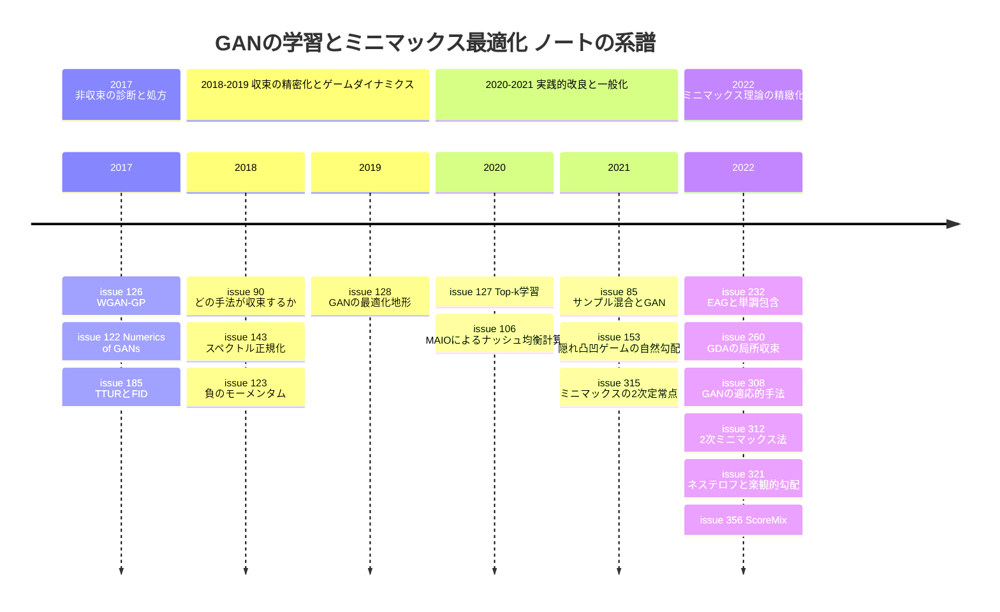

# GAN の学習・ミニマックス最適化・ゲームダイナミクス サーベイ

> 本稿は [Hiroki11x/Papers](https://github.com/Hiroki11x/Papers/issues) の論文読みノート（GitHub issues）のうち、「GAN の学習と安定化・ミニマックス最適化・ゲームダイナミクス」を主題（primary）とする **20件の issue** を再構成したサーベイである。重複登録が1組（[#91](https://github.com/Hiroki11x/Papers/issues/91)=[#128](https://github.com/Hiroki11x/Papers/issues/128) A Closer Look at the Optimization Landscapes of GANs。ノート上で #91 を重複として close 済み）、題名だけで本文が空の**内容未記入**のプレースホルダー issue が1件（[#93](https://github.com/Hiroki11x/Papers/issues/93) Minmax Optimization。一覧には残す）あり、ユニーク論文としては **18本**。
> 論文の初出は **2017年3月**（WGAN-GP）〜 **2022年10月**（ScoreMix ほか）、issue 登録は **2021年4月**〜**2022年11月**。
> 記述はノート（issue 本文・コメント）に基づき、数値はノートに記載されたものだけを引用している。採択先は Semantic Scholar / Web で検証済みのレコードに従う。ノートの一部（2021年の issue）は輪読会形式で、メンバーへの担当割り振りや発表資料のアップロード依頼がコメントに残っている。

## 概要

ノート群が追っている問いは次の5つに整理できる。

1. **なぜ GAN の学習は収束せず振動するのか**。勾配ベクトル場のヤコビアンの固有値（実部が 0、虚部が大きい）という説明（[#122](https://github.com/Hiroki11x/Papers/issues/122)）と、それに基づく処方（Consensus Optimization、負のモーメンタム [#123](https://github.com/Hiroki11x/Papers/issues/123)）。
2. **識別器をどう正則化すれば学習が安定し、実際に収束するのか**。勾配ペナルティ（[#126](https://github.com/Hiroki11x/Papers/issues/126)）、スペクトル正規化（[#143](https://github.com/Hiroki11x/Papers/issues/143)）、そして「どれが本当に収束するか」の検証（[#90](https://github.com/Hiroki11x/Papers/issues/90)）。
3. **2 つのプレイヤーの学習率・オプティマイザをどう設計するか**。TTUR（[#185](https://github.com/Hiroki11x/Papers/issues/185)）、ステップサイズ比の必要十分条件（[#260](https://github.com/Hiroki11x/Papers/issues/260)）、Adam が GAN で効く理由（[#308](https://github.com/Hiroki11x/Papers/issues/308)）、自然勾配（[#153](https://github.com/Hiroki11x/Papers/issues/153)）。
4. **GAN の学習は実際にはどこに収束しているのか**。局所ナッシュ均衡ではなく、生成器損失の鞍点である安定な停留点（[#128](https://github.com/Hiroki11x/Papers/issues/128)）や、スタッケルベルグ均衡（[#260](https://github.com/Hiroki11x/Papers/issues/260)）。
5. **ミニマックス最適化の最適な計算量はいくらか**。非凸-強凹での 2 次定常点（[#315](https://github.com/Hiroki11x/Papers/issues/315)）、2 次法の最適レート（[#312](https://github.com/Hiroki11x/Papers/issues/312)）、加速法と単調包含（[#232](https://github.com/Hiroki11x/Papers/issues/232)）、双線形結合問題の最適レート（[#321](https://github.com/Hiroki11x/Papers/issues/321)）。

## 目次

1. [背景と基本概念](#1-背景と基本概念)
2. [研究の系譜・時系列](#2-研究の系譜時系列)
3. [タイムライン図](#3-タイムライン図)
4. [サブトピック別の整理](#4-サブトピック別の整理)
5. [論文一覧表（公開順）](#5-論文一覧表公開順)
6. [採択先（ベニュー）別の集計](#6-採択先ベニュー別の集計)
7. [各論文の詳細まとめ](#7-各論文の詳細まとめ)
8. [横断的な知見・未解決問題](#8-横断的な知見未解決問題)
9. [関連論文](#9-関連論文)

---

## 1. 背景と基本概念

### 1.1 GAN とミニマックス問題

GAN は生成器 $G_\theta$ と識別器 $D_\phi$ の 2 人ゼロサムゲームとして定式化される。

$$
\min_{\theta}\max_{\phi}\; f(\theta,\phi)=\mathbb{E}_{x\sim p_{\text{data}}}\left[\log D_\phi(x)\right]+\mathbb{E}_{z\sim p_z}\left[\log\left(1-D_\phi(G_\theta(z))\right)\right]
$$

より一般に、ミニマックス最適化 $\min_x\max_y f(x,y)$ は $f$ の形で分類される。

- **凸-凹**: $f$ が $x$ について凸、$y$ について凹。鞍点が大域解になる。
- **非凸-強凹**: $y$ について強凹なので、内側の最大化が一意に決まり、原始関数 $P(x)=\max_y f(x,y)$ の最小化に帰着できる（[#315](https://github.com/Hiroki11x/Papers/issues/315), [#260](https://github.com/Hiroki11x/Papers/issues/260) の先行研究）。
- **非凸-非凹**: GAN が該当する一般の場合。大域的な保証は難しく、局所解析（[#260](https://github.com/Hiroki11x/Papers/issues/260)）や、隠れた凸凹構造（[#153](https://github.com/Hiroki11x/Papers/issues/153)）、負のコモノトーン性（[#232](https://github.com/Hiroki11x/Papers/issues/232)）といった構造仮定を置く。
- **双線形結合**: $f(x,y)=g(x)+x^\top A y-h(y)$ のように個別部分と結合部分に分かれる形（[#321](https://github.com/Hiroki11x/Papers/issues/321)）。最も単純な双線形ゲーム $\min_x\max_y x^\top A y$ は、素朴な勾配法が収束しない典型例（[#123](https://github.com/Hiroki11x/Papers/issues/123)）。

### 1.2 均衡の概念

- **（局所）ナッシュ均衡**: どちらのプレイヤーも単独で（局所的に）手を変えて得をしない点。TTUR はこれへの収束を証明した（[#185](https://github.com/Hiroki11x/Papers/issues/185)）。
- **スタッケルベルグ均衡**: min プレイヤーが先手で、max プレイヤーの最適応答を織り込んで最小化する順序付きの均衡。GDA の局所収束先として [#260](https://github.com/Hiroki11x/Papers/issues/260) が扱う。
- **安定な停留点**: 勾配ダイナミクスにとって安定だが、必ずしもナッシュ均衡ではない点。実際の GAN 学習は生成器損失の鞍点であるこうした点に収束する（[#128](https://github.com/Hiroki11x/Papers/issues/128)）。
- **$\varepsilon$ 鞍点 / 2 次定常点**: 計算量解析で使う近似解の概念（[#312](https://github.com/Hiroki11x/Papers/issues/312), [#315](https://github.com/Hiroki11x/Papers/issues/315)）。

### 1.3 勾配ベクトル場とヤコビアン

GDA（Gradient Descent-Ascent）は $x$ を降下、$y$ を上昇させる。まとめると $w=(x,y)$ に対するベクトル場

$$
v(w)=\begin{pmatrix}\nabla_x f(x,y)\\ -\nabla_y f(x,y)\end{pmatrix},\qquad w_{t+1}=w_t-\eta\, v(w_t)
$$

に沿った更新になる。均衡点まわりの局所挙動はヤコビアン $J=\nabla v$ の固有値で決まり、[#122](https://github.com/Hiroki11x/Papers/issues/122) は **実部が 0 の固有値** と **虚部が大きすぎる固有値** が非収束の原因だと分析した。虚部は回転（振動）成分に対応し、[#128](https://github.com/Hiroki11x/Papers/issues/128) は実際の GAN の学習軌跡にも回転成分があることを可視化した。

- **同時更新と交互更新**: 2 人を同時に更新するか、片方ずつ順に更新するか。[#123](https://github.com/Hiroki11x/Papers/issues/123) は、双線形ゲームで収束するのは交互更新と負のモーメンタムの組み合わせだけだと示した。
- **モーメンタム**: $w_{t+1}=w_t-\eta v(w_t)+\beta(w_t-w_{t-1})$。$\beta<0$ が負のモーメンタム。
- **楽観的勾配（OG）・超勾配（EG）**: 1 ステップ先や前ステップの勾配を使って回転を打ち消す 1 次法（[#260](https://github.com/Hiroki11x/Papers/issues/260), [#321](https://github.com/Hiroki11x/Papers/issues/321), [#312](https://github.com/Hiroki11x/Papers/issues/312)）。

### 1.4 学習率の比と時間スケール

TTUR（[#185](https://github.com/Hiroki11x/Papers/issues/185)）は識別器と生成器に別々の学習率を持たせ、確率近似の 2 時間スケール理論で収束を示した。非凸-強凹の GDA では、ステップサイズ比 $\eta_y/\eta_x$ を $y$ の条件数 $\kappa$ に応じてどれだけ取るべきかが問題になり、既存理論の $\Theta(\kappa^2)$ に対し [#260](https://github.com/Hiroki11x/Papers/issues/260) は局所的には $\Theta(\kappa)$ が必要十分だと示した。

### 1.5 識別器の正則化

- **WGAN と Lipschitz 制約**: Wasserstein 距離の双対表現では識別器（critic）を 1-Lipschitz に制限する。元の WGAN は重みクリッピングを使った。
- **勾配ペナルティ（WGAN-GP）**: クリッピングの代わりに、実データと生成データの間の点 $\hat{x}$ で $\lambda\,\mathbb{E}\left[(\|\nabla_{\hat{x}}D(\hat{x})\|_2-1)^2\right]$ を課す（[#126](https://github.com/Hiroki11x/Papers/issues/126)）。
- **ゼロ中心勾配ペナルティ・インスタンスノイズ**: 勾配ノルムを 0 に近づけるペナルティや、入力へのノイズ付加。[#90](https://github.com/Hiroki11x/Papers/issues/90) はこれらが局所収束をもたらすと証明した。
- **スペクトル正規化**: 各層の重みを最大特異値 $\sigma(W)$ で割る $\bar{W}=W/\sigma(W)$。ネットワークの Lipschitz 定数は各層のスペクトルノルムの積で上から抑えられるので、識別器の Lipschitz 定数を制御できる（[#143](https://github.com/Hiroki11x/Papers/issues/143)）。

### 1.6 評価指標 FID

**FID（Fréchet Inception Distance）** は、実画像と生成画像の Inception 特徴の分布の距離で生成品質を測る指標で、[#185](https://github.com/Hiroki11x/Papers/issues/185) が Inception Score より一貫性があるとして導入した。以後のノートの実験論文（[#127](https://github.com/Hiroki11x/Papers/issues/127), [#85](https://github.com/Hiroki11x/Papers/issues/85), [#356](https://github.com/Hiroki11x/Papers/issues/356)）はすべて FID で改善を報告している。

---

## 2. 研究の系譜・時系列

### 2.1 2017: 非収束の診断と 3 つの処方

2017 年に、のちのノート群の土台になる 3 本が出ている。

- **ダイナミクスの診断**: Mescheder et al.「The Numerics of GANs」（[#122](https://github.com/Hiroki11x/Papers/issues/122), 2017-05）は、勾配ベクトル場のヤコビアンの固有値を見ることで、GAN がナッシュ均衡に収束しない条件（実部 0、虚部が大きすぎる）を特定し、それに基づく新しいアルゴリズム（Consensus Optimization）を提案した。ノートでは「Negative Momentum の前提となっている論文」と位置づけ、次に読む論文として [#123](https://github.com/Hiroki11x/Papers/issues/123) を挙げている。
- **学習率の分離**: Heusel et al. TTUR（[#185](https://github.com/Hiroki11x/Papers/issues/185), 2017-06）は、識別器と生成器に別々の学習率を持たせると、穏やかな仮定のもとで局所ナッシュ均衡に収束することを確率近似の理論で証明した。Adam を摩擦付きの重い球として記述し、平坦な最小値を好むことも示した。評価指標 FID もこの論文で導入された。ノートは「理論も実験もすごい」と評価している。
- **識別器の正則化**: Gulrajani et al. WGAN-GP（[#126](https://github.com/Hiroki11x/Papers/issues/126), 2017-03）は WGAN の重みクリッピングを勾配ペナルティに置き換えた。ノートの疑問は「なぜ BatchNorm より LayerNorm のほうが良いのか」。

この 3 本は「ダイナミクスを変える」「学習率を変える」「識別器を制約する」という、以後も続く 3 つの方向を代表している。

### 2.2 2018–2019: どの手法が本当に収束するか、正則化の定番化、ゲームダイナミクス

- **収束の精密化**: Mescheder et al.「Which Training Methods for GANs do actually Converge?」（[#90](https://github.com/Hiroki11x/Papers/issues/90), 2018-01）は、それまでの局所収束の結果が分布の絶対連続性を前提にしていたことを指摘し、絶対連続でない現実的な場合には、正則化なしの GAN 学習は必ずしも収束しない反例を示した。インスタンスノイズとゼロ中心勾配ペナルティは収束する一方、生成器 1 回あたり有限回の識別器更新しか行わない WGAN と WGAN-GP（[#126](https://github.com/Hiroki11x/Papers/issues/126)）は必ずしも均衡に収束しない。[#122](https://github.com/Hiroki11x/Papers/issues/122) と同じ Mescheder らが、正則化手法を収束の観点から比較した論文である。
- **スペクトル正規化**: Miyato et al.（[#143](https://github.com/Hiroki11x/Papers/issues/143), 2018-02）は、各層を最大特異値で割って識別器の Lipschitz 定数を制御する。[#126](https://github.com/Hiroki11x/Papers/issues/126) と同じく Lipschitz 制約による安定化だが、ペナルティではなく重みの正規化で実現する。ノートには輪読会で出た疑問とその解消の過程が詳しく残っている。
- **負のモーメンタム**: Gidel et al.（[#123](https://github.com/Hiroki11x/Papers/issues/123), 2018-07）は [#122](https://github.com/Hiroki11x/Papers/issues/122) のベクトル場解析を受け、双線形ゲームで収束するのは交互勾配法と負のモーメンタムの組み合わせだけであること、ヤコビアンが大きな虚部を持つときに負のモーメンタムが局所収束を改善することを示した。[#122](https://github.com/Hiroki11x/Papers/issues/122) が非収束の原因とした「大きな虚部」に、オプティマイザ側から対処した形である。
- **実際の収束先**: Berard et al.（[#91](https://github.com/Hiroki11x/Papers/issues/91)=[#128](https://github.com/Hiroki11x/Papers/issues/128), 2019-06）は学習軌跡まわりの損失地形を可視化し、回転成分の存在と、GAN の学習が良い性能を出しながらも局所ナッシュ均衡（生成器損失の最小値）ではなく、鞍点である安定な停留点に収束することを実証的に示した。[#185](https://github.com/Hiroki11x/Papers/issues/185) が理論的に保証した「局所ナッシュ均衡への収束」と、実際の GAN の振る舞いの間にずれがあることを示した結果といえる。

### 2.3 2020–2021: 実践的な改良とゲーム理論の一般化

- **サンプルの選び方・混ぜ方**: Top-k Training（[#127](https://github.com/Hiroki11x/Papers/issues/127), 2020-02）は、生成器の更新時に批評家が「最も非現実的」と評価したバッチ要素の勾配をゼロにするだけで GAN が改善することを示した。ノートは「Outlier を除いて学習するとうまくいく話」で、同じ第一著者による「小バッチで大バッチの良さを取り入れる話」（Small-GAN、[クリティカルバッチサイズ文書](../practical_optimization/01_critical_batch_size.md) の [#125](https://github.com/Hiroki11x/Papers/issues/125)）の発展版と位置づけている。Takamoto & Morishita（[#85](https://github.com/Hiroki11x/Papers/issues/85), 2021-04）は Mixup・CutMix・新提案の SRMix を識別器の学習に適用し、Mixup と SRMix が FID を改善することを示した。
- **一般のゲームの均衡計算**: Munos et al. MAIO（[#106](https://github.com/Hiroki11x/Papers/issues/106), 2020-07）は、改良された対戦相手に対するミラー上昇で 2 人ゼロサムゲーム（不完全情報の逐次形式を含む）のナッシュ均衡を計算し、最終反復の収束を示した。GAN そのものではないが、「平均ではなく最終反復が均衡に収束するか」という、[#122](https://github.com/Hiroki11x/Papers/issues/122) や [#123](https://github.com/Hiroki11x/Papers/issues/123) と共通の関心につながる。
- **幾何を変えた GDA**: Mladenovic et al.（[#153](https://github.com/Hiroki11x/Papers/issues/153), 2021-10）は、GAN を含む隠れ凸凹ゲームで一般化 GDA フローを研究し、隠れ写像幾何では大域収束を証明、Fisher 情報幾何（自然勾配）ではチーム競技の場合のダイナミクスの全体像を示した。ノートは「NGD が GAN のようなゲームでどう働くかを見た論文。理論がいかついがそのうち読まないと」。
- **2 次定常点**: Luo et al.（[#315](https://github.com/Hiroki11x/Papers/issues/315), 2021-10）は非凸-強凹問題で原始関数 $P(x)$ の 2 次定常点を求める Minimax Cubic Newton 法とその非厳密版を提案し、凸凹の仮定なしで 2 次定常点の非漸近的な収束を扱った最初の研究と主張した。ここからノート群は GAN の実践から離れ、ミニマックス最適化の計算量理論に重心が移る。

### 2.4 2022: ミニマックス最適化理論の精緻化と、オプティマイザの再解釈

2022 年に登録された論文は、ほとんどが最適化理論である。

- **ステップサイズ比**: Li et al.（[#260](https://github.com/Hiroki11x/Papers/issues/260), 2022-07）は、既存理論が要求するステップサイズ比 $\Theta(\kappa^2)$（min プレイヤーをずっと遅く学習させる）と、両変数に同程度のステップサイズを使う実際の GAN との間のギャップを問題にした。非凸非凹問題の局所収束では、スタッケルベルグ均衡への収束に $\Theta(\kappa)$ が必要十分であることを示し、確率的 GDA と超勾配法にも拡張した。[#185](https://github.com/Hiroki11x/Papers/issues/185) の「2 つの学習率」という問いへの、より精密な答えである。
- **適応的手法がなぜ効くか**: Jelassi et al.（[#308](https://github.com/Hiroki11x/Papers/issues/308), 2022-10）は、Adam の更新を大きさと方向に分解して SGDA と組み替える grafting で、Adam の**適応的な更新の大きさ**が GAN 学習の鍵であることを示した。正規化 SGDA（nSGDA）で学習した GAN は真の分布の全モードを回復するのに対し、SGDA はどの学習率でもモード崩壊することを合成設定で証明した。鍵は、勾配を正規化すると識別器と生成器が同じペースで更新されることにある。[#185](https://github.com/Hiroki11x/Papers/issues/185) や [#260](https://github.com/Hiroki11x/Papers/issues/260) が学習率の比で扱った「2 人のペース合わせ」を、更新の正規化として捉え直したものといえる。
- **最適レートの追求**: 加速法 EAG が単調包含と負のコモノトーン包含を $O(1/T)$ の最適加速レートで解くこと（[#232](https://github.com/Hiroki11x/Papers/issues/232), 2022-06）、2 次情報で二重外挿のダイナミクスを加速し $O(\varepsilon^{-2/3})$ 反復で $\varepsilon$ 鞍点に達して下界に一致すること（[#312](https://github.com/Hiroki11x/Papers/issues/312), 2022-10）、個別部分にネステロフ加速・結合部分に楽観的勾配を使う AG-OG が双線形結合問題で最適レートを達成すること（[#321](https://github.com/Hiroki11x/Papers/issues/321), 2022-10）。[#321](https://github.com/Hiroki11x/Papers/issues/321) の共著者には [#123](https://github.com/Hiroki11x/Papers/issues/123), [#128](https://github.com/Hiroki11x/Papers/issues/128), [#153](https://github.com/Hiroki11x/Papers/issues/153) と同じ Gidel が入っている。
- **少データ GAN**: ScoreMix（[#356](https://github.com/Hiroki11x/Papers/issues/356), 2022-10）は実サンプルの凸結合をスコアノルム最小化でデータ多様体に近づける拡張法で、少データでの過学習を緩和した。[#85](https://github.com/Hiroki11x/Papers/issues/85) と同じく「サンプル混合を GAN に使う」流れだが、混ぜたサンプルを多様体に引き戻す点が異なる。ノートは、キャリブレーションや OOD（CTR 推定のサブポピュレーションシフト）にも使えそうだとコメントしている。

---

## 3. タイムライン図

（[#91](https://github.com/Hiroki11x/Papers/issues/91) は [#128](https://github.com/Hiroki11x/Papers/issues/128) と同一論文、[#93](https://github.com/Hiroki11x/Papers/issues/93) は内容未記入で公開時期のないプレースホルダーのため図では省略。）

---

## 4. サブトピック別の整理

### 4.1 収束性とゲームダイナミクス

**要点**: 非収束の原因はヤコビアンの固有値（実部 0・大きな虚部）すなわち回転成分にある（[#122](https://github.com/Hiroki11x/Papers/issues/122)）。対処として Consensus Optimization（[#122](https://github.com/Hiroki11x/Papers/issues/122)）、交互更新+負のモーメンタム（[#123](https://github.com/Hiroki11x/Papers/issues/123)）、正則化（[#90](https://github.com/Hiroki11x/Papers/issues/90)）がある。実際の GAN の収束先はナッシュ均衡ではなく安定な停留点（[#128](https://github.com/Hiroki11x/Papers/issues/128)）やスタッケルベルグ均衡（[#260](https://github.com/Hiroki11x/Papers/issues/260)）と考えられる。

- [#122](https://github.com/Hiroki11x/Papers/issues/122) The Numerics of GANs
- [#185](https://github.com/Hiroki11x/Papers/issues/185) TTUR — 局所ナッシュ均衡への収束
- [#90](https://github.com/Hiroki11x/Papers/issues/90) Which Training Methods for GANs do actually Converge?
- [#123](https://github.com/Hiroki11x/Papers/issues/123) Negative Momentum for Improved Game Dynamics
- [#91](https://github.com/Hiroki11x/Papers/issues/91) / [#128](https://github.com/Hiroki11x/Papers/issues/128) A Closer Look at the Optimization Landscapes of GANs
- [#153](https://github.com/Hiroki11x/Papers/issues/153) Generalized Natural Gradient Flows in Hidden Convex-Concave Games and GANs
- [#260](https://github.com/Hiroki11x/Papers/issues/260) On Convergence of GDA: A Tight Local Analysis

### 4.2 識別器の正則化（Lipschitz 制約・勾配ペナルティ）

**要点**: 識別器の Lipschitz 定数を勾配ペナルティ（[#126](https://github.com/Hiroki11x/Papers/issues/126)）や重みの正規化（[#143](https://github.com/Hiroki11x/Papers/issues/143)）で制御すると学習が安定する。ただし収束保証の観点では、ゼロ中心勾配ペナルティやインスタンスノイズは局所収束する一方、WGAN-GP は必ずしも収束しない（[#90](https://github.com/Hiroki11x/Papers/issues/90)）。

- [#126](https://github.com/Hiroki11x/Papers/issues/126) Improved Training of Wasserstein GANs
- [#143](https://github.com/Hiroki11x/Papers/issues/143) Spectral Normalization for GANs
- [#90](https://github.com/Hiroki11x/Papers/issues/90) Which Training Methods for GANs do actually Converge?

### 4.3 オプティマイザと学習率の設計

**要点**: 2 人の更新の「ペース」をどう合わせるかが共通テーマ。学習率を分ける（[#185](https://github.com/Hiroki11x/Papers/issues/185)）、比を条件数に合わせる（[#260](https://github.com/Hiroki11x/Papers/issues/260)）、更新を正規化して同じペースにする（[#308](https://github.com/Hiroki11x/Papers/issues/308)）、モーメンタムの符号を変える（[#123](https://github.com/Hiroki11x/Papers/issues/123)）、幾何を変える（[#153](https://github.com/Hiroki11x/Papers/issues/153)）。

- [#185](https://github.com/Hiroki11x/Papers/issues/185) TTUR（Adam を摩擦付き重い球として解析）
- [#123](https://github.com/Hiroki11x/Papers/issues/123) Negative Momentum
- [#153](https://github.com/Hiroki11x/Papers/issues/153) 自然勾配フロー
- [#260](https://github.com/Hiroki11x/Papers/issues/260) ステップサイズ比 $\Theta(\kappa)$
- [#308](https://github.com/Hiroki11x/Papers/issues/308) Dissecting adaptive methods in GANs — Adam の大きさ成分と nSGDA

### 4.4 ミニマックス最適化の計算量理論

**要点**: 非凸-強凹での 2 次定常点（[#315](https://github.com/Hiroki11x/Papers/issues/315)）、凸凹での 2 次法の最適反復数（[#312](https://github.com/Hiroki11x/Papers/issues/312)）、単調・負のコモノトーン包含での 1 次法の最適加速レート（[#232](https://github.com/Hiroki11x/Papers/issues/232)）、双線形結合問題での最適レート（[#321](https://github.com/Hiroki11x/Papers/issues/321)）と、問題クラスごとに下界に一致する手法がそろいつつある。ノートは概要中心で、中身を読めていないとの記述もある（[#232](https://github.com/Hiroki11x/Papers/issues/232)）。

- [#315](https://github.com/Hiroki11x/Papers/issues/315) Finding Second-Order Stationary Points in Nonconvex-Strongly-Concave Minimax Optimization
- [#232](https://github.com/Hiroki11x/Papers/issues/232) Accelerated Algorithms for Constrained Nonconvex-Nonconcave Min-Max Optimization and Comonotone Inclusion
- [#312](https://github.com/Hiroki11x/Papers/issues/312) Explicit Second-Order Min-Max Optimization
- [#321](https://github.com/Hiroki11x/Papers/issues/321) Nesterov Meets Optimism
- [#260](https://github.com/Hiroki11x/Papers/issues/260) GDA の局所収束（非凸非凹）
- [#93](https://github.com/Hiroki11x/Papers/issues/93) Minmax Optimization（内容未記入のプレースホルダー）

### 4.5 サンプルの選択・混合による実践的改良

**要点**: 学習アルゴリズムを変えずに、生成器の更新に使うサンプルを選ぶ（[#127](https://github.com/Hiroki11x/Papers/issues/127)）、識別器に混合サンプルを見せる（[#85](https://github.com/Hiroki11x/Papers/issues/85)）、混合サンプルをデータ多様体に引き戻す（[#356](https://github.com/Hiroki11x/Papers/issues/356)）ことで FID が改善する。

- [#127](https://github.com/Hiroki11x/Papers/issues/127) Top-k Training of GANs
- [#85](https://github.com/Hiroki11x/Papers/issues/85) Sample-Mixing Methods for Efficient Training of GANs
- [#356](https://github.com/Hiroki11x/Papers/issues/356) ScoreMix

### 4.6 一般のゲームにおける均衡計算

**要点**: GAN 以外の 2 人ゼロサムゲーム（不完全情報ゲームを含む）でのナッシュ均衡計算と最終反復収束。

- [#106](https://github.com/Hiroki11x/Papers/issues/106) Fast computation of Nash Equilibria in Imperfect Information Games

---

## 5. 論文一覧表（公開順）

records から Python スクリプトで生成（重複 issue も1行ずつ掲載。公開時期不明の [#93](https://github.com/Hiroki11x/Papers/issues/93) は末尾）。

| 公開 | 論文 | 著者/組織 | 採択先 | 根拠 | サブトピック |
|---|---|---|---|---|---|
| 2017-03 | [#126](https://github.com/Hiroki11x/Papers/issues/126) Improved Training of Wasserstein GANs | Ishaan Gulrajani, Faruk Ahmed, Martin Arjovsky, et al. | NeurIPS 2017 | arXivコメント | GANの安定化 |
| 2017-05 | [#122](https://github.com/Hiroki11x/Papers/issues/122) The Numerics of GANs | Lars Mescheder, Sebastian Nowozin, Andreas Geiger（MPI Tübingen） | NeurIPS 2017 | issue記載 | GANの収束解析 |
| 2017-06 | [#185](https://github.com/Hiroki11x/Papers/issues/185) GANs Trained by a Two Time-Scale Update Rule Converge to a Local Nash Equilibrium | Martin Heusel, Hubert Ramsauer, Thomas Unterthiner, et al.（JKU Linz） | NeurIPS 2017 | arXivコメント | GANの収束（TTUR） |
| 2018-01 | [#90](https://github.com/Hiroki11x/Papers/issues/90) Which Training Methods for GANs do actually Converge? | Lars Mescheder, Andreas Geiger, Sebastian Nowozin | ICML 2018 | arXivコメント | GAN学習の収束 |
| 2018-02 | [#143](https://github.com/Hiroki11x/Papers/issues/143) Spectral Normalization for Generative Adversarial Networks | Takeru Miyato, Toshiki Kataoka, Masanori Koyama, Yuichi Yoshida（Preferred Networks） | ICLR 2018 | arXivコメント | GANの安定化 |
| 2018-07 | [#123](https://github.com/Hiroki11x/Papers/issues/123) Negative Momentum for Improved Game Dynamics | Gauthier Gidel, Reyhane Askari Hemmat, Mohammad Pezeshki, et al.（Mila） | AISTATS 2019 | arXivコメント | GANのゲームダイナミクス |
| 2019-06 | [#91](https://github.com/Hiroki11x/Papers/issues/91) A Closer Look at the Optimization Landscapes of Generative Adversarial Networks | Hugo Berard, Gauthier Gidel, Amjad Almahairi, et al.（Mila） | ICLR 2020 | Semantic Scholar確認 | GANの最適化地形 |
| 2019-06 | [#128](https://github.com/Hiroki11x/Papers/issues/128) A Closer Look at the Optimization Landscapes of Generative Adversarial Networks | Hugo Berard, Gauthier Gidel, Amjad Almahairi, et al.（Mila / FAIR） | ICLR 2020 | issue記載 | GANの最適化ランドスケープ |
| 2020-02 | [#127](https://github.com/Hiroki11x/Papers/issues/127) Top-k Training of GANs: Improving GAN Performance by Throwing Away Bad Samples | Samarth Sinha, Zhengli Zhao, Anirudh Goyal, et al.（Google Brain） | NeurIPS 2020 | arXivコメント | GANの学習改善 |
| 2020-07 | [#106](https://github.com/Hiroki11x/Papers/issues/106) Fast computation of Nash Equilibria in Imperfect Information Games | Rémi Munos, Julien Perolat, Jean-Baptiste Lespiau, et al.（DeepMind） | ICML 2020 | issue記載 | ゲームのナッシュ均衡計算 |
| 2021-04 | [#85](https://github.com/Hiroki11x/Papers/issues/85) An Empirical Study of the Effects of Sample-Mixing Methods for Efficient Training of Generative Adversarial Networks | Makoto Takamoto, Yusuke Morishita（NEC） | IEEE MIPR 2021 | arXivコメント | GAN学習とサンプル混合 |
| 2021-10 | [#153](https://github.com/Hiroki11x/Papers/issues/153) Generalized Natural Gradient Flows in Hidden Convex-Concave Games and GANs | Andjela Mladenovic, Iosif Sakos, Gauthier Gidel, Georgios Piliouras（Mila / SUTD） | ICLR 2022 | Semantic Scholar確認 | ゲームにおける自然勾配 |
| 2021-10 | [#315](https://github.com/Hiroki11x/Papers/issues/315) Finding Second-Order Stationary Points in Nonconvex-Strongly-Concave Minimax Optimization | Luo Luo, Yujun Li, Cheng Chen（Fudan University / Huawei Noah's Ark Lab） | NeurIPS 2022 | Semantic Scholar確認 | ミニマックス最適化 |
| 2022-06 | [#232](https://github.com/Hiroki11x/Papers/issues/232) Accelerated Algorithms for Constrained Nonconvex-Nonconcave Min-Max Optimization and Comonotone Inclusion | Yang Cai, Argyris Oikonomou, Weiqiang Zheng | ICML 2024 | Web確認 | ミニマックス最適化 |
| 2022-07 | [#260](https://github.com/Hiroki11x/Papers/issues/260) On Convergence of Gradient Descent Ascent: A Tight Local Analysis | Haochuan Li, Farzan Farnia, Subhro Das, Ali Jadbabaie（MIT / IBM） | ICML 2022 | arXivコメント | ミニマックス最適化 |
| 2022-10 | [#308](https://github.com/Hiroki11x/Papers/issues/308) Dissecting adaptive methods in GANs | Samy Jelassi, David Dobre, Arthur Mensch, et al.（Mila） | arXiv（プレプリント） | Web確認 | GANと適応的最適化 |
| 2022-10 | [#312](https://github.com/Hiroki11x/Papers/issues/312) Explicit Second-Order Min-Max Optimization: Practical Algorithms and Complexity Analysis | Tianyi Lin, Panayotis Mertikopoulos, Michael I. Jordan（UC Berkeley） | TMLR | arXivコメント | ミニマックス最適化 |
| 2022-10 | [#321](https://github.com/Hiroki11x/Papers/issues/321) Nesterov Meets Optimism: Rate-Optimal Separable Minimax Optimization | Chris Junchi Li, Angela Yuan, Gauthier Gidel, et al.（UC Berkeley） | ICML 2023 | arXivコメント | ミニマックス最適化 |
| 2022-10 | [#356](https://github.com/Hiroki11x/Papers/issues/356) ScoreMix: A Scalable Augmentation Strategy for Training GANs with Limited Data | Jie Cao, Mandi Luo, Junchi Yu, Ming-Hsuan Yang, Ran He | IEEE TPAMI | Web確認 | データ拡張（GAN） |
| 不明 | [#93](https://github.com/Hiroki11x/Papers/issues/93) Minmax Optimization（内容未記入） | 不明 | 不明 | 不明 | ミニマックス最適化（プレースホルダー） |

---

## 6. 採択先（ベニュー）別の集計

会議系列ごとの件数（issue 単位、重複を含む）。スクリプトで生成。

| 採択先（系列） | 件数 | issue |
|---|---|---|
| ICML | 5 | [#90](https://github.com/Hiroki11x/Papers/issues/90)（ICML 2018）, [#106](https://github.com/Hiroki11x/Papers/issues/106)（ICML 2020）, [#232](https://github.com/Hiroki11x/Papers/issues/232)（ICML 2024）, [#260](https://github.com/Hiroki11x/Papers/issues/260)（ICML 2022）, [#321](https://github.com/Hiroki11x/Papers/issues/321)（ICML 2023） |
| NeurIPS | 5 | [#122](https://github.com/Hiroki11x/Papers/issues/122)（NeurIPS 2017）, [#126](https://github.com/Hiroki11x/Papers/issues/126)（NeurIPS 2017）, [#127](https://github.com/Hiroki11x/Papers/issues/127)（NeurIPS 2020）, [#185](https://github.com/Hiroki11x/Papers/issues/185)（NeurIPS 2017）, [#315](https://github.com/Hiroki11x/Papers/issues/315)（NeurIPS 2022） |
| ICLR | 4 | [#91](https://github.com/Hiroki11x/Papers/issues/91)（ICLR 2020）, [#128](https://github.com/Hiroki11x/Papers/issues/128)（ICLR 2020）, [#143](https://github.com/Hiroki11x/Papers/issues/143)（ICLR 2018）, [#153](https://github.com/Hiroki11x/Papers/issues/153)（ICLR 2022） |
| その他（論文誌・その他会議・学位論文） | 2 | [#85](https://github.com/Hiroki11x/Papers/issues/85)（IEEE MIPR 2021）, [#356](https://github.com/Hiroki11x/Papers/issues/356)（IEEE TPAMI） |
| AISTATS | 1 | [#123](https://github.com/Hiroki11x/Papers/issues/123)（AISTATS 2019） |
| TMLR | 1 | [#312](https://github.com/Hiroki11x/Papers/issues/312)（TMLR） |
| arXiv（プレプリント） | 1 | [#308](https://github.com/Hiroki11x/Papers/issues/308)（arXiv（プレプリント）） |
| 不明 | 1 | [#93](https://github.com/Hiroki11x/Papers/issues/93)（不明） |
| **合計** | **20** | |

---

## 7. 各論文の詳細まとめ

first_public 順（公開時期不明の [#93](https://github.com/Hiroki11x/Papers/issues/93) は末尾）。

### [#126] Improved Training of Wasserstein GANs
- 公開: 2017-03 ／ 採択先: NeurIPS 2017（arXivコメント） ／ 著者/組織: Ishaan Gulrajani, Faruk Ahmed, Martin Arjovsky, et al.

**要約**: WGAN の critic に課す Lipschitz 制約を、重みクリッピングから勾配ペナルティに置き換えた（WGAN-GP）。ノートの概要は「WGAN に gradient penalty を加えた」の一文のみ。

**メモ**: 「なぜ Batch Normalization ではなく Layer Normalization のほうが良いのか」を疑問として挙げている。輪読会の状況報告スライドがコメントに添付されている。

### [#122] The Numerics of GANs
- 公開: 2017-05 ／ 採択先: NeurIPS 2017（issue記載） ／ 著者/組織: Lars Mescheder, Sebastian Nowozin, Andreas Geiger（MPI Tübingen）

**要約**: 勾配ベクトル場を使って、GAN がナッシュ均衡に収束しない問題を分析した。非収束の条件は (1) ヤコビアンの固有値の実部が 0、(2) 固有値の虚部が大きすぎる、の 2 つで、この考察から新しいアルゴリズム（Consensus Optimization）を考案し実証した。

**主な知見**:
- 非収束はベクトル場のヤコビアンの固有値構造で説明できる。
- Negative Momentum（[#123](https://github.com/Hiroki11x/Papers/issues/123)）の前提となる解析。

**メモ**: 「gradient vector field のヤコビアンの固有値って何を表しているの？」を知りたい疑問として残している。次に読む論文として [#123](https://github.com/Hiroki11x/Papers/issues/123) を挙げている。

### [#185] GANs Trained by a Two Time-Scale Update Rule Converge to a Local Nash Equilibrium
- 公開: 2017-06 ／ 採択先: NeurIPS 2017（arXivコメント） ／ 著者/組織: Martin Heusel, Hubert Ramsauer, Thomas Unterthiner, et al.（JKU Linz）

**要約**: 任意の GAN 損失に対して SGD を行う GAN 学習の 2 時間スケール更新規則 TTUR を提案した。識別器と生成器に別々の学習率を持たせ、確率近似の理論で、穏やかな仮定のもと定常的な局所ナッシュ均衡に収束することを証明した。生成画像の評価指標として FID も導入した。

**主な知見**:
- 収束は Adam にも引き継がれる。Adam は摩擦のある重い球の力学（2 階微分方程式）に従い、目的関数の平坦な最小値を好む。
- FID は Inception Score より生成画像と実画像の類似性をよく表し、一貫性がある。
- CelebA・CIFAR-10・SVHN・LSUN Bedrooms・One Billion Word Benchmark で、TTUR は DCGAN と WGAN-GP の学習を改善した。学習率を 2 つ持つことが実験的にも良い。

**メモ**: 「理論も実験もすごい」。

### [#90] Which Training Methods for GANs do actually Converge?
- 公開: 2018-01 ／ 採択先: ICML 2018（arXivコメント） ／ 著者/組織: Lars Mescheder, Andreas Geiger, Sebastian Nowozin

**要約**: 既存の GAN 学習の局所収束の結果は、データ分布と生成分布の絶対連続性を前提にしていた。この要件が必要であることを示し、絶対連続でない現実的な場合には正則化なしの GAN 学習が必ずしも収束しない単純な反例を示した。

**主な知見**:
- インスタンスノイズやゼロ中心勾配ペナルティを使った GAN 学習は収束する。
- 生成器の更新ごとに有限回の識別器更新を行う WGAN と WGAN-GP は、必ずしも平衡点に収束しない。
- 収束結果をより一般的な GAN に拡張し、生成器とデータ分布が低次元多様体上にある場合でも、簡略化した勾配ペナルティで局所収束を証明。このペナルティは実際にもうまく働き、ハイパラをほとんど調整せずに高解像度の画像生成モデルを学習できた。

**メモ**: メンバーに要約を依頼し、「すでに読んだ論文の中で言及されていたものかも」とコメントしている。

### [#143] Spectral Normalization for Generative Adversarial Networks
- 公開: 2018-02 ／ 採択先: ICLR 2018（arXivコメント） ／ 著者/組織: Takeru Miyato, Toshiki Kataoka, Masanori Koyama, Yuichi Yoshida（Preferred Networks）

**要約**: 各層の重みを最大特異値で割り、識別器の Lipschitz 定数を制御するスペクトル正規化を提案し、GAN の学習を安定化した。

**メモ**: 輪読会での疑問とその解消が記録されている。「NN の Lipschitz ノルムが特異値の積で抑えられるところがよくわかっていない → なんとなくわかった」「ここでの Lipschitz ノルムは D の話か G の話か → D の話」「活性化の中の $W$ を Lipschitz ノルムで割ると抑えられるのが厳密にはわかっていない → Lipschitz ノルム = Lipschitz 定数で、SVD で分解してスケーリング係数の最大値（最大特異値）で割るのは自然で、気持ちはわかった」。疑問点を調べた資料（PDF/PPTX）がコメントに添付されている。

### [#123] Negative Momentum for Improved Game Dynamics
- 公開: 2018-07 ／ 採択先: AISTATS 2019（arXivコメント） ／ 著者/組織: Gauthier Gidel, Reyhane Askari Hemmat, Mohammad Pezeshki, et al.（Mila）

**要約**: 勾配ベクトル場を用いてナッシュ均衡点付近のダイナミクスを分析し、負のモーメンタムを追加する方法を検討した。

**主な知見**:
- 双線形の滑らかなゲームで収束するのは、交互勾配法と負のモーメンタムの組み合わせだけ。
- ヤコビアンの固有値が大きな虚部を持つとき、負のモーメンタムを使うと勾配法の局所収束性が向上する。
- トイ設定と実データの両方で負のモーメンタムが有用。

### [#91] A Closer Look at the Optimization Landscapes of Generative Adversarial Networks
- 公開: 2019-06 ／ 採択先: ICLR 2020（Semantic Scholar確認） ／ 著者/組織: Hugo Berard, Gauthier Gidel, Amjad Almahairi, et al.（Mila）

**要約**: [#128](https://github.com/Hiroki11x/Papers/issues/128) と同一論文の重複登録（ノート上で #91 を close）。GAN の学習は優れた性能を発揮しながらも、最小値ではなく生成器損失の鞍点である安定した定常点に収束することを実証的に示した。

**メモ**: 読む担当者の割り振りがコメントに残っている。

### [#128] A Closer Look at the Optimization Landscapes of Generative Adversarial Networks
- 公開: 2019-06 ／ 採択先: ICLR 2020（issue記載） ／ 著者/組織: Hugo Berard, Gauthier Gidel, Amjad Almahairi, et al.（Mila / FAIR）

**要約**: GAN の学習軌跡まわりの損失地形を可視化した。[#91](https://github.com/Hiroki11x/Papers/issues/91) と同一論文。こちらのノート本文は空欄で、リンク・著者・採択先と「重複してたので 91 を close した」というコメントのみ。内容は [#91](https://github.com/Hiroki11x/Papers/issues/91) の一言まとめと論文アブストラクトによる。

**主な知見**:
- 学習ダイナミクスには回転成分が存在する（論文アブストラクトによる。ノートには記載なし）。
- 学習の終着点は局所ナッシュ均衡ではなく、安定な停留点（生成器損失の鞍点）（[#91](https://github.com/Hiroki11x/Papers/issues/91) の一言まとめ）。

### [#127] Top-k Training of GANs: Improving GAN Performance by Throwing Away Bad Samples
- 公開: 2020-02 ／ 採択先: NeurIPS 2020（arXivコメント） ／ 著者/組織: Samarth Sinha, Zhengli Zhao, Anirudh Goyal, et al.（Google Brain）

**要約**: GAN の学習アルゴリズムに 1 行のコードを足すだけで、計算量を増やさずに結果を改善する方法。生成器パラメータを更新するとき、批評家が「最も現実的でない」と評価したバッチ要素からの勾配寄与をゼロにする（top-k 更新）。

**主な知見**:
- 多くの GAN の変種で一般的に適用できる改善。
- ガウス混合データの分析で、最もスコアの悪いバッチ要素で勾配を計算すると、サンプルが最も近いモードからさらに押し出されうることを発見。
- 最近の GAN 改良型に適用し、CIFAR-10 の条件付き生成の FID を 9.21 から 8.57 に改善。

**メモ**: 「Outlier を除いて学習すると GAN がうまくいく話」。Bengio 先生らの「小バッチで大バッチの良さを取り入れる話」（Small-GAN）の発展版で、第一著者が同じ、とコメント。

### [#106] Fast computation of Nash Equilibria in Imperfect Information Games
- 公開: 2020-07 ／ 採択先: ICML 2020（issue記載） ／ 著者/組織: Rémi Munos, Julien Perolat, Jean-Baptiste Lespiau, et al.（DeepMind）

**要約**: 2 人ゼロサムゲームのナッシュ均衡を計算するアルゴリズムのクラス MAIO（Mirror Ascent against an Improved Opponent）を、標準形と不完全情報の逐次形式の両方で提案・解析した。各プレイヤーの方策を、改良された対戦相手（最良応答、貪欲方策、方策勾配で改良した方策、その他の RL や探索）と対戦したときの価値を最大化するようにミラー上昇で更新する。

**主な知見**:
- ナッシュ均衡の集合への最終反復収束を確立し、収束速度は改良された方策が与える改善量に依存する。
- ある条件下で、改良方策として最良応答を使うと指数関数的な収束速度が得られる。

**メモ**: 参考文献として関連する arXiv 論文 2 本へのリンクを残している。

### [#85] An Empirical Study of the Effects of Sample-Mixing Methods for Efficient Training of Generative Adversarial Networks
- 公開: 2021-04 ／ 採択先: IEEE MIPR 2021（arXivコメント） ／ 著者/組織: Makoto Takamoto, Yusuke Morishita（NEC）

**要約**: 識別器の役割は本物と偽物の分類と解釈できるので、分類で精度と頑健性を上げるサンプル混合法を GAN にも適用できる。Mixup、CutMix、新提案の Smoothed Regional Mix（SRMix）の効果を調べ、本物/偽物の明確な「ラベル」を持たない飽和損失の GAN にサンプル混合を適用する形式も提案した。

**主な知見**:
- LSUN と CelebA で、Mixup と SRMix はほとんどの場合 FID を改善し、特に SRMix が最も良かった。
- 混合サンプルはバニラの偽サンプルと異なる性質を持ち、混合パターンが識別器の判断に強く影響する。
- Mixup の生成画像は高レベル特徴は良いが低レベル特徴が弱く、CutMix は逆、SRMix はその中間で両方がよく出る。

### [#153] Generalized Natural Gradient Flows in Hidden Convex-Concave Games and GANs
- 公開: 2021-10 ／ 採択先: ICLR 2022（Semantic Scholar確認） ／ 著者/組織: Andjela Mladenovic, Iosif Sakos, Gauthier Gidel, Georgios Piliouras（Mila / SUTD）

**要約**: ゼロサムゲームとしての定式化は人気だが、そのダイナミクスは十分理解されておらず、不安定な学習や発散が観察されている。GAN を含む非凸非凹ゼロサムゲームの大きなクラスである隠れ凸凹ゲームで、一般化された GDA フローを研究した。隠れた凸凹構造が誘導する 2 つの幾何（隠れ写像幾何と Fisher 情報幾何）に注目する。

**主な知見**:
- 隠れ写像幾何では、穏やかな仮定のもとで大域収束を証明。
- Fisher 情報幾何では、不変関数解析により、チーム競技という特殊な設定でのダイナミクスの全体像を明らかにした。

**メモ**: 「NGD を GAN のような Game の問題設定でどう働くかを見た論文。理論がいかついけどそのうち読まないと」。Gidel が共著に入っていることを記録している。

### [#315] Finding Second-Order Stationary Points in Nonconvex-Strongly-Concave Minimax Optimization
- 公開: 2021-10 ／ 採択先: NeurIPS 2022（Semantic Scholar確認） ／ 著者/組織: Luo Luo, Yujun Li, Cheng Chen（Fudan University / Huawei Noah's Ark Lab）

**要約**: $f$ が $y$ について強凹、$x$ について非凸でありうる滑らかなミニマックス問題 $\min_x\max_y f(x,y)$ を扱う。既存研究の多くは 1 次定常点を求めるもので、原始関数 $P(x)=\max_y f(x,y)$ の 2 次定常点を目指すものはほとんどなかった。Minimax Cubic Newton（MCN）法を提案し、2 次オラクルと 1 次オラクルの呼び出し回数を条件数 $\kappa$ と Hessian の Lipschitz 定数 $\rho$ で評価した。

**主な知見**:
- 高次元向けに、高価な 2 次オラクルを避ける非厳密版を提案。3 次の副問題を勾配降下と行列チェビシェフ展開で非厳密に解き、Hessian ベクトル積オラクルと 1 次オラクルだけで高確率で近似 2 次定常点を得る。
- 凸凹の仮定なしにミニマックス問題の 2 次定常点探索の非漸近的な収束を考察した最初の研究と主張。

**メモ**: 一言まとめは「理論」。

### [#232] Accelerated Algorithms for Constrained Nonconvex-Nonconcave Min-Max Optimization and Comonotone Inclusion
- 公開: 2022-06 ／ 採択先: ICML 2024（Web確認） ／ 著者/組織: Yang Cai, Argyris Oikonomou, Weiqiang Zheng

**要約**: 単調包含・単調変分不等式と、その非単調設定への一般化を研究した。Yoon & Ryu [2021] が制約なし凸凹ミニマックスのために提案した Extra Anchored Gradient（EAG）が、より一般的な Lipschitz 単調包含問題に適用できることを示した。ノートでの題名は arXiv 版の「Accelerated Algorithms for Monotone Inclusions and Constrained Nonconvex-Nonconcave Min-Max Optimization」。

**主な知見**:
- EAG は Lipschitz 単調包含問題を、1 次法の中で最適な加速レート $O(1/T)$ で解く。
- 負のコモノトーン演算子に関する非単調な包含問題群でも同じレートを達成し、その特殊例として EAG+ は非凸-非凹ミニマックスの非自明なクラスを $O(1/T)$ で解く。
- 解析は単純なポテンシャル関数の議論に基づき、他の加速アルゴリズムの解析にも使える可能性がある。

**メモ**: 「実験なしの理論論文。Min-max での議論（全然まだ中身読んでない）」。

### [#260] On Convergence of Gradient Descent Ascent: A Tight Local Analysis
- 公開: 2022-07 ／ 採択先: ICML 2022（arXivコメント） ／ 著者/組織: Haochuan Li, Farzan Farnia, Subhro Das, Ali Jadbabaie（MIT / IBM）

**要約**: GDA は GAN のミニマックス最適化の主流アルゴリズムである。非凸-強凹の場合、Lin et al. (2020) はステップサイズ比 $\eta_y/\eta_x=\Theta(\kappa^2)$ で GDA の収束を証明したが、これは min プレイヤーの遅い学習を意味し、両変数に同程度のステップサイズを使う実際の GAN との間に大きなギャップがあった。このギャップを埋めるため、一般の非凸-非凹ミニマックス問題の局所収束を解析した。

**主な知見**:
- GDA がスタッケルベルグ均衡に局所収束するには、ステップサイズ比 $\Theta(\kappa)$（$\kappa$ は $y$ の局所的な条件数）が必要十分。
- 収束保証を確率的 GDA と超勾配法（EG）に拡張し、数値実験で理論を支持。

### [#308] Dissecting adaptive methods in GANs
- 公開: 2022-10 ／ 採択先: arXiv（プレプリント）（Web確認） ／ 著者/組織: Samy Jelassi, David Dobre, Arthur Mensch, et al.（Mila）

**要約**: 適応的手法は GAN の学習に不可欠な要素として広く使われているが、その理由は不明だった。Agarwal et al. (2021) の grafting に倣い、Adam 更新の大きさと方向の成分を分離して SGDA の方向・大きさと組み替え、適応的手法が GAN の学習にどう役立つかを調べた。

**主な知見**:
- Adam の更新の大きさと SGD の正規化された方向を組み合わせた更新規則から、Adam の適応的な大きさが GAN 学習の鍵であることを経験的に示した。
- 合成的な理論設定で、nSGDA で学習した GAN は真の分布の全モードを回復するのに対し、SGDA（どの学習率設定でも）で学習した同じネットワークはモード崩壊することを証明。
- 鍵は、勾配の正規化によって識別器と生成器が同じペースで更新されること。複数のデータセットで Adam の性能が nSGDA で回復できる。

### [#312] Explicit Second-Order Min-Max Optimization: Practical Algorithms and Complexity Analysis
- 公開: 2022-10 ／ 採択先: TMLR（arXivコメント） ／ 著者/組織: Tianyi Lin, Panayotis Mertikopoulos, Michael I. Jordan（UC Berkeley）

**要約**: 制約なしミニマックス最適化の大域的な鞍点探索のため、正則化ニュートン型の厳密法と非厳密法を提案・解析した。2 次情報で大域収束レートを得るのは 1 次法よりずっと難しく、ミニマックスの 2 次法の研究は限られていた。ノートでの題名は arXiv 版の「Explicit Second-Order Min-Max Optimization Methods with Optimal Convergence Guarantee」。

**主な知見**:
- 2 次情報を（非厳密であっても）使うと、二重外挿法のダイナミクスを加速できる。
- 反復は有界集合内にとどまり、平均反復はギャップ関数の意味で $O(\varepsilon^{-2/3})$ 回以内に $\varepsilon$ 鞍点に収束する。これは理論的な下界と一致する。
- コンパクト性の仮定を必要としない、単純で直観的な 2 次法の収束解析。合成データと実データで効率を確認。

### [#321] Nesterov Meets Optimism: Rate-Optimal Separable Minimax Optimization
- 公開: 2022-10 ／ 採択先: ICML 2023（arXivコメント） ／ 著者/組織: Chris Junchi Li, Angela Yuan, Gauthier Gidel, et al.（UC Berkeley）

**要約**: 双線形結合の強凸-強凹ミニマックス最適化のための 1 次法 AG-OG（Accelerated Gradient-Optimistic Gradient）を提案した。問題の構造を活かし、個別部分にネステロフ加速、結合部分に楽観的勾配を使う。ノートでの題名は「Nesterov Meets Optimism: Rate-Optimal Optimistic-Gradient-Based Method for Stochastic Bilinearly-Coupled Minimax Optimization」。

**主な知見**:
- 連続時間のダイナミクスが楽観的勾配とネステロフ加速のダイナミクスの結合に対応することで動機づけ、離散化して離散時間の収束を導いた。
- 適切な再スタートを加えると、結合部分と個別部分の条件数に関して（定数倍まで）最適な収束率を達成。
- 双線形結合ミニマックス問題で、決定論的設定での収束率改善と確率的設定でのレート最適を同時に達成した最初のシングルコール・アルゴリズム。

### [#356] ScoreMix: A Scalable Augmentation Strategy for Training GANs with Limited Data
- 公開: 2022-10 ／ 採択先: IEEE TPAMI（Web確認） ／ 著者/組織: Jie Cao, Mandi Luo, Junchi Yu, Ming-Hsuan Yang, Ran He

**要約**: GAN は学習データが少ないとデータ多様性の不足から過学習し、既存のデータ固有の拡張手法は実用的な応用に広げにくい。実サンプルの凸結合で拡張サンプルを作り、データスコア（対数密度の勾配）のノルムを最小化して最適化することで、拡張サンプルをデータ多様体に近づける ScoreMix を提案した。スコアはマルチスケールのスコアマッチングで学習した推定ネットワークで求める。

**主な知見**:
- ハイパラ調整やアーキテクチャ変更なしに既存の GAN に組み込め、データ多様性を高めて過学習を緩和。
- 多くの画像合成タスクで FID が下がり、大幅な改善を達成。

**メモ**: キャリブレーションや OOD とも関係があるとコメント。CTR 推定ではクリックされないデータがクリックされたデータの 1 万倍ほどあり、サブポピュレーションシフトの影響を防ぐためにダウンサンプリングで均衡を取る。Meta AI の人と話した際、彼らはダウンサンプリングせずに拡散モデルでデータの少ない領域を生成しようとしていたとのことで、データの少ない領域の多様性不足が問題の場合は ScoreMix が使えるケースがありそう、と書いている。

### [#93] Minmax Optimization
- 公開: 不明 ／ 採択先: 不明（不明） ／ 著者/組織: 不明

**内容未記入**: 題名「Minmax Optimization」だけで本文・コメントとも空のプレースホルダー issue（2021-06-16 登録）。対象論文は特定されておらず、公開時期・採択先・著者も不明。

---

## 8. 横断的な知見・未解決問題

### 8.1 ノート群から読み取れるコンセンサス

- **GAN の不安定性の核心は回転ダイナミクス**。ヤコビアンの大きな虚部（[#122](https://github.com/Hiroki11x/Papers/issues/122)）、学習軌跡の回転成分（[#128](https://github.com/Hiroki11x/Papers/issues/128)）、双線形ゲームでの素朴な勾配法の非収束（[#123](https://github.com/Hiroki11x/Papers/issues/123)）は同じ現象の別の見え方である。Consensus Optimization、負のモーメンタム、楽観的勾配・超勾配（[#260](https://github.com/Hiroki11x/Papers/issues/260), [#321](https://github.com/Hiroki11x/Papers/issues/321), [#312](https://github.com/Hiroki11x/Papers/issues/312)）は、いずれもこの回転を打ち消す工夫と見なせる。
- **識別器の滑らかさの制御は有効**。勾配ペナルティ（[#126](https://github.com/Hiroki11x/Papers/issues/126), [#90](https://github.com/Hiroki11x/Papers/issues/90)）とスペクトル正規化（[#143](https://github.com/Hiroki11x/Papers/issues/143)）は、ともに識別器の Lipschitz 性を通じて学習を安定化する。
- **2 人の「ペース」が重要**。学習率を分ける TTUR（[#185](https://github.com/Hiroki11x/Papers/issues/185)）、比を条件数に合わせる（[#260](https://github.com/Hiroki11x/Papers/issues/260)）、正規化で同じペースにする（[#308](https://github.com/Hiroki11x/Papers/issues/308)）は、どれも「2 人の更新の相対的な速さ」を制御している。

### 8.2 対立・緊張関係

- **どの均衡に収束しているのか**。TTUR（[#185](https://github.com/Hiroki11x/Papers/issues/185)）は局所ナッシュ均衡への収束を証明したが、実際の GAN は局所ナッシュ均衡ではなく安定な停留点に収束しても良い性能を出す（[#128](https://github.com/Hiroki11x/Papers/issues/128)）。[#260](https://github.com/Hiroki11x/Papers/issues/260) はスタッケルベルグ均衡を収束先として扱う。「良い GAN」にとってどの解概念が適切かは、ノート群の範囲では決着していない。
- **学習率比の理論と実践**。理論は min プレイヤーを遅くする $\Theta(\kappa^2)$ を要求していたが、実践は同程度のステップサイズを使う（[#260](https://github.com/Hiroki11x/Papers/issues/260)）。[#260](https://github.com/Hiroki11x/Papers/issues/260) は局所的には $\Theta(\kappa)$ で十分としてギャップを縮め、[#308](https://github.com/Hiroki11x/Papers/issues/308) は Adam の正規化が両者のペースをそろえることが効いているとした。TTUR（[#185](https://github.com/Hiroki11x/Papers/issues/185)）のように学習率を分けるべきか、正規化でそろえるべきかは、設定に依存する可能性がある。
- **WGAN-GP は安定化手法か収束手法か**。WGAN-GP（[#126](https://github.com/Hiroki11x/Papers/issues/126)）は実践で学習を安定化し、TTUR の実験（[#185](https://github.com/Hiroki11x/Papers/issues/185)）でも改善対象として使われているが、[#90](https://github.com/Hiroki11x/Papers/issues/90) は均衡への収束は保証されないと示した。「経験的に安定」と「理論的に収束」は別物という例である。

### 8.3 未解決問題

- **理論と GAN 実践の距離**: 2022 年のミニマックス理論（[#315](https://github.com/Hiroki11x/Papers/issues/315), [#232](https://github.com/Hiroki11x/Papers/issues/232), [#312](https://github.com/Hiroki11x/Papers/issues/312), [#321](https://github.com/Hiroki11x/Papers/issues/321)）は強凹・単調・コモノトーン・双線形結合などの構造仮定のもとで最適レートを与えるが、GAN が満たす構造かどうかはノートでは議論されていない。GAN と直接つながるのは隠れ凸凹ゲーム（[#153](https://github.com/Hiroki11x/Papers/issues/153)）と局所解析（[#260](https://github.com/Hiroki11x/Papers/issues/260)）くらいである。
- **2 次法の実用性**: 2 次情報で最適反復数が得られる（[#312](https://github.com/Hiroki11x/Papers/issues/312), [#315](https://github.com/Hiroki11x/Papers/issues/315)）一方、大規模な GAN で使えるかは開かれている。[#315](https://github.com/Hiroki11x/Papers/issues/315) の非厳密版（Hessian ベクトル積のみ）や、Fisher 幾何の自然勾配（[#153](https://github.com/Hiroki11x/Papers/issues/153)）がその橋渡しの候補。
- **LayerNorm と BatchNorm**: WGAN-GP で LayerNorm が良い理由（[#126](https://github.com/Hiroki11x/Papers/issues/126) のメモ）はノートで未解決のまま。
- **データ側の工夫の理論**: Top-k（[#127](https://github.com/Hiroki11x/Papers/issues/127)）、サンプル混合（[#85](https://github.com/Hiroki11x/Papers/issues/85)）、ScoreMix（[#356](https://github.com/Hiroki11x/Papers/issues/356)）は FID で効果が示されているが、[#122](https://github.com/Hiroki11x/Papers/issues/122)・[#90](https://github.com/Hiroki11x/Papers/issues/90) のような収束の枠組みでの説明はノートにない。

### 8.4 実務上の示唆

ノートから読み取れるのは、(1) 識別器にスペクトル正規化や勾配ペナルティを入れる（[#143](https://github.com/Hiroki11x/Papers/issues/143), [#126](https://github.com/Hiroki11x/Papers/issues/126)）、収束保証を重視するならゼロ中心勾配ペナルティ（[#90](https://github.com/Hiroki11x/Papers/issues/90)）、(2) オプティマイザは Adam、またはその要点である正規化 SGDA（[#308](https://github.com/Hiroki11x/Papers/issues/308)）、学習率は 2 人で分けることを検討する（[#185](https://github.com/Hiroki11x/Papers/issues/185)）、(3) 振動が強い場合は負のモーメンタムや楽観的勾配系（[#123](https://github.com/Hiroki11x/Papers/issues/123), [#260](https://github.com/Hiroki11x/Papers/issues/260)）、(4) 低コストな改善として top-k 更新（[#127](https://github.com/Hiroki11x/Papers/issues/127)）やサンプル混合（[#85](https://github.com/Hiroki11x/Papers/issues/85)）、少データなら ScoreMix（[#356](https://github.com/Hiroki11x/Papers/issues/356)）、(5) 評価は FID（[#185](https://github.com/Hiroki11x/Papers/issues/185)）、である。

---

## 9. 関連論文

他トピックが primary だが、GAN にも関係する論文（secondary）。

- [#155](https://github.com/Hiroki11x/Papers/issues/155) On Predicting Generalization using GANs — [04 汎化理論・暗黙的バイアス](./04_generalization_implicit_bias.md)

**Practical Optimization 文書との関係**

- [01 クリティカルバッチサイズ](../practical_optimization/01_critical_batch_size.md) は、GAN では大バッチが性能を上げる事例として BigGAN（[#124](https://github.com/Hiroki11x/Papers/issues/124)）と、コアセットで小バッチから実効的な大バッチを作る Small-GAN（[#125](https://github.com/Hiroki11x/Papers/issues/125)）を扱っている。本稿の Top-k Training（[#127](https://github.com/Hiroki11x/Papers/issues/127)）は、ノートで Small-GAN の発展版（第一著者が同じ）と位置づけられている。
- [02 低精度学習と Muon](../practical_optimization/02_low_precision_and_muon.md) は、正規化・符号型の更新（signSGD、Muon）を扱う。Adam の更新を大きさと方向に分け、正規化 SGDA で Adam の性能を回復した [#308](https://github.com/Hiroki11x/Papers/issues/308) と問題意識が近い。
