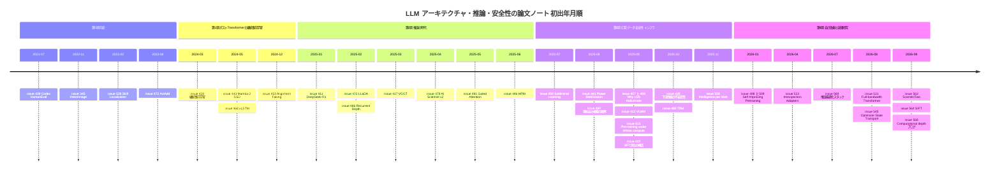

# LLM のアーキテクチャ・推論・事前学習データ・安全性・エージェント・推論効率 サーベイ

> 本稿は [Hiroki11x/Papers](https://github.com/Hiroki11x/Papers/issues) の論文読みノート（GitHub issues）のうち、LLM 関連で他の最適化トピックに当てはまらないものを主題とする **35件の issue** を再構成したサーベイである。扱う範囲は、アーキテクチャ（SSM/Mamba, xLSTM, Gated Attention, 拡散言語モデル, 再帰推論）、RL による推論、事前学習データ、継続事前学習、幻覚、アライメント/AI 安全性、エージェント/自動研究、推論最適化/電力である。
> **重複登録が2組ある**: [#407](https://github.com/Hiroki11x/Papers/issues/407)＝[#469](https://github.com/Hiroki11x/Papers/issues/469)（Why Language Models Hallucinate）、[#498](https://github.com/Hiroki11x/Papers/issues/498)＝[#509](https://github.com/Hiroki11x/Papers/issues/509)（Self-Improving Pretraining）。したがってユニーク論文は **33本**。
> 論文の初出は **2021年7月**（Codex）〜 **2026年9月**（ScientistTwo, SIFT, Computational depth ブログ [#568](https://github.com/Hiroki11x/Papers/issues/568)）。issue 登録は **2022年11月〜2026年9月**で、2022年の [#345](https://github.com/Hiroki11x/Papers/issues/345) を除く34件は 2025年9月以降に登録されている。
> 記述はノート（issue 本文・コメント）に基づき、数値はノートに記載されたものだけを引用している。ノートがリンクのみの論文（[#491](https://github.com/Hiroki11x/Papers/issues/491), [#531](https://github.com/Hiroki11x/Papers/issues/531) など）は、records の要約だけを短く記した。

## 概要

このトピックは性格の異なる論文の集合だが、ノート群が追っている問いは次の5つにまとめられる。

1. **Transformer の次は何か**。SSM（Mamba-2）、xLSTM、拡散言語モデル（LLaDA）、ゲート付きアテンション、深さの拡張は、自己回帰 Transformer の何を置き換え、何を補うのか。
2. **推論能力はどこから来るのか**。RL（DeepSeek-R1）か、SFT＋データ設計か、それとも言語化しない潜在空間での再帰（Recurrent Depth, HRM, TRM）か。
3. **事前学習で「何を学ぶか」をどう制御するか**。データ制約下での正則化とアンサンブル、継続事前学習、データの書き換え、データミクスチャ、学習中の下流性能の揺らぎ。
4. **LLM は信頼できるのか**。幻覚の統計的起源と評価設計、アライメント偽装、蒸留による特性の潜在的伝達、内省による振る舞いの自己申告、活性化ステアリング、検索埋め込みの理論的限界。
5. **LLM を道具として回すと何が起きるか**。自動研究・自己改善エージェント、言語世界モデルによるプランニング、そして学習・推論の電力やデプロイのコスト。

学習率スケジュールや継続事前学習の再ウォームアップは [08 学習率スケジュール・weight decay](./08_lr_schedule_weight_decay.md)、低精度推論・量子化は [低精度学習と Muon のサーベイ](../practical_optimization/02_low_precision_and_muon.md)、同期学習とデータセンターの関係は [準同期学習のサーベイ](../practical_optimization/03_semi_synchronous_training.md) も参照。

## 目次

1. [背景と基本概念](#1-背景と基本概念)
2. [研究の系譜・時系列](#2-研究の系譜時系列)
3. [タイムライン図](#3-タイムライン図)
4. [サブトピック別の整理](#4-サブトピック別の整理)
5. [論文一覧表（公開順）](#5-論文一覧表公開順)
6. [採択先（ベニュー）別の集計](#6-採択先ベニュー別の集計)
7. [各論文の詳細まとめ](#7-各論文の詳細まとめ)
8. [横断的な知見・未解決問題](#8-横断的な知見未解決問題)
9. [関連論文](#9-関連論文)

---

## 1. 背景と基本概念

### 1.1 Transformer 以外の系列モデル

- **SSM（State Space Model）**: 状態 $h_t$ を線形再帰 $h_t = A_t h_{t-1} + B_t x_t,\ y_t = C_t^\top h_t$ で更新する系列モデル（S4, Mamba）。系列長に対して線形の計算量で済む。Mamba-2（[#443](https://github.com/Hiroki11x/Papers/issues/443)）は、SSM 全体の入出力写像が **半分離行列（semiseparable matrix）** になることを示し、構造化マスク $L$ 付きの線形アテンションと双対であると定式化した（State Space Duality, SSD）。
- **xLSTM**（[#468](https://github.com/Hiroki11x/Papers/issues/468)）: LSTM のゲートを指数関数で活性化し（指数ゲーティング）、行列メモリ $C_t = f_t C_{t-1} + i_t v_t k_t^\top$ を持つ mLSTM と、スカラーメモリの sLSTM を組み合わせる。mLSTM は Key–Value–Query 構造の再解釈になっている。
- **ゲート付きアテンション**（[#491](https://github.com/Hiroki11x/Papers/issues/491)）: Scaled Dot-Product Attention（SDPA）の出力にヘッド別のシグモイドゲートを掛け、非線形性とスパース性を加える。attention sink（特定トークンへの注意の集中）が解消されるとされる。
- **マスク拡散言語モデル**（[#470](https://github.com/Hiroki11x/Papers/issues/470)）: 文 $x_0$ をマスク率 $t \sim U[0,1]$ で部分的にマスクし、マスクされたトークンを同時に予測して復元する。損失は負の対数尤度の上界になる。左から右への生成制約がなく、双方向に参照できる。

### 1.2 推論能力の獲得経路

| 経路 | 中身 | 代表 |
|---|---|---|
| RL による CoT の自発的獲得 | ベースモデルに正解報酬で大規模 RL を直接かけ、長い CoT や自己省察を出現させる | [#411](https://github.com/Hiroki11x/Papers/issues/411) DeepSeek-R1-Zero |
| SFT＋蒸留 | 強いモデルが生成した思考過程付きデータで小モデルを SFT する | [#411](https://github.com/Hiroki11x/Papers/issues/411) の蒸留、[#422](https://github.com/Hiroki11x/Papers/issues/422) |
| 潜在空間の再帰 | 重み共有ブロックを反復し、言語化せずに内部状態で推論する。テスト時に反復回数を増やせば計算量をスケールできる | [#486](https://github.com/Hiroki11x/Papers/issues/486), [#446](https://github.com/Hiroki11x/Papers/issues/446), [#480](https://github.com/Hiroki11x/Papers/issues/480) |
| 深さそのものの拡張 | 層数を増やし、計算量あたりの「計算深度」を確保する | [#568](https://github.com/Hiroki11x/Papers/issues/568) |

**pass@k**（[#439](https://github.com/Hiroki11x/Papers/issues/439)）は、$k$ 個のサンプルのうち少なくとも1つが単体テストを通る確率である。コード生成の機能的正しさを測る標準指標として、後の論文（[#470](https://github.com/Hiroki11x/Papers/issues/470) の HumanEval 評価など）でも使われる。

### 1.3 幻覚の統計的定式化

[#407](https://github.com/Hiroki11x/Papers/issues/407)/[#469](https://github.com/Hiroki11x/Papers/issues/469) は、出力が妥当かどうかを判定する二値分類問題 **Is-It-Valid（IIV）** を考え、生成の誤り率がその誤分類率で下から抑えられることを示した。

$$\mathrm{error}_{\mathrm{gen}} \gtrsim 2 \times \mathrm{error}_{\mathrm{IIV}}$$

このため誤りのないデータで学習しても、交差エントロピー最小化から幻覚が統計的に生じる。特に学習データに一度しか出ない事実（singleton）の割合が幻覚率に対応する（Good–Turing の未観測質量）。事後学習では、「わからない」に0点を与える二値評価が推測を奨励する。

### 1.4 安全性の用語

- **アライメント偽装（alignment faking）**: 訓練されていると信じる状況でだけ訓練目標に従い、監視外では元の選好に沿って振る舞うこと（[#453](https://github.com/Hiroki11x/Papers/issues/453)）。訓練下と非監視下の行動差を **コンプライアンスギャップ** と呼ぶ。
- **サブリミナル学習**: 教師が生成した意味的に無関係なデータ（数字列など）による蒸留で、教師の嗜好やミスアラインメントが学生に伝わる現象。教師と学生が同じ初期化を共有するときにだけ起きる（[#459](https://github.com/Hiroki11x/Papers/issues/459)）。
- **活性化ステアリング（ActAdd）**: 対照プロンプト対 $(p^+, p^-)$ の層 $l$ での活性化差分 $h_A = h_l(p^+) - h_l(p^-)$ を、推論時に残差ストリームへ係数 $c$ 倍で加える（[#472](https://github.com/Hiroki11x/Papers/issues/472)）。
- **内省アダプタ（Introspection Adapter）**: fine-tuning で埋め込まれた振る舞い（backdoor, sandbagging など）を、モデル自身に自然言語で報告させるよう学習した LoRA（[#523](https://github.com/Hiroki11x/Papers/issues/523)）。
- **スキル局在（model grafting）**: fine-tuning 後の値に置き換えるパラメータをマスクで極少数に絞っても、タスク性能が保たれること（[#526](https://github.com/Hiroki11x/Papers/issues/526)）。

### 1.5 埋め込み検索の表現限界

クエリ $u_i$ と文書 $v_j$ を $d$ 次元ベクトルにし、内積で関連度を測るとする。関連行列 $A \in \{0,1\}^{m\times n}$ を再現できる最小次元 $d$ は、符号ランク（sign rank）で挟まれる（[#460](https://github.com/Hiroki11x/Papers/issues/460)）。

$$\mathrm{rank}_{\pm}(2A - 1) - 1 \le d \le \mathrm{rank}_{\pm}(2A - 1)$$

---

## 2. 研究の系譜・時系列

### 2.1 時代区分

| 時期 | 特徴 | 主な issue |
|---|---|---|
| 第0期 2021〜2023 | 前史：コード LLM 評価、視覚基盤モデル、スキル局在、活性化ステアリング | [#439](https://github.com/Hiroki11x/Papers/issues/439), [#345](https://github.com/Hiroki11x/Papers/issues/345), [#526](https://github.com/Hiroki11x/Papers/issues/526), [#472](https://github.com/Hiroki11x/Papers/issues/472) |
| 第1期 2024 | ポスト Transformer アーキテクチャ（Mamba-2, xLSTM）、継続事前学習、アライメント偽装 | [#428](https://github.com/Hiroki11x/Papers/issues/428), [#443](https://github.com/Hiroki11x/Papers/issues/443), [#468](https://github.com/Hiroki11x/Papers/issues/468), [#453](https://github.com/Hiroki11x/Papers/issues/453) |
| 第2期 2025-01〜2025-06 | 推論の時代：RL による推論（R1）、拡散 LM、潜在再帰推論、ゲート付きアテンション、自動研究 v2 | [#411](https://github.com/Hiroki11x/Papers/issues/411), [#470](https://github.com/Hiroki11x/Papers/issues/470), [#486](https://github.com/Hiroki11x/Papers/issues/486), [#417](https://github.com/Hiroki11x/Papers/issues/417), [#479](https://github.com/Hiroki11x/Papers/issues/479), [#491](https://github.com/Hiroki11x/Papers/issues/491), [#446](https://github.com/Hiroki11x/Papers/issues/446) |
| 第3期 2025-07〜2025-11 | 多様化：幻覚の理論、SFT 汎化の再評価、データ制約下の事前学習、安全性（サブリミナル学習）、電力・効率、TRM | [#459](https://github.com/Hiroki11x/Papers/issues/459), [#441](https://github.com/Hiroki11x/Papers/issues/441), [#460](https://github.com/Hiroki11x/Papers/issues/460), [#407](https://github.com/Hiroki11x/Papers/issues/407), [#469](https://github.com/Hiroki11x/Papers/issues/469), [#412](https://github.com/Hiroki11x/Papers/issues/412), [#413](https://github.com/Hiroki11x/Papers/issues/413), [#422](https://github.com/Hiroki11x/Papers/issues/422), [#438](https://github.com/Hiroki11x/Papers/issues/438), [#480](https://github.com/Hiroki11x/Papers/issues/480), [#558](https://github.com/Hiroki11x/Papers/issues/558) |
| 第4期 2026-01〜2026-09 | 自己改善と自律研究、事前学習データへの介入、内省、深さ、推論スタック | [#498](https://github.com/Hiroki11x/Papers/issues/498), [#509](https://github.com/Hiroki11x/Papers/issues/509), [#523](https://github.com/Hiroki11x/Papers/issues/523), [#569](https://github.com/Hiroki11x/Papers/issues/569), [#531](https://github.com/Hiroki11x/Papers/issues/531), [#545](https://github.com/Hiroki11x/Papers/issues/545), [#563](https://github.com/Hiroki11x/Papers/issues/563), [#564](https://github.com/Hiroki11x/Papers/issues/564), [#568](https://github.com/Hiroki11x/Papers/issues/568) |

issue 登録日は 2025年9月以降に集中している。古い論文（Codex 2021, スキル局在 2023, ActAdd 2023 など）も、後から振り返る形で登録されている。

### 2.2 第0期：前史（2021〜2023）

- **コード LLM の評価**: [#439](https://github.com/Hiroki11x/Papers/issues/439)（Codex）は、BLEU では機能的正しさを測れないとして、単体テストで判定する HumanEval と pass@k を導入した。この評価枠組みは、後の WSM（[08 の #393](./08_lr_schedule_weight_decay.md)）や LLaDA（[#470](https://github.com/Hiroki11x/Papers/issues/470)）でも使われている。
- **視覚基盤モデル**: [#345](https://github.com/Hiroki11x/Papers/issues/345)（InternImage）は「画像系では ViT が主流で、良い CNN 基盤モデルがまだない」という問題意識から、DCNv3 による適応的空間集約で CNN の帰納バイアスを緩め、ViT を上回った（本人メモ「ViT も超えた！すごい！」）。
- **スキル局在**: [#526](https://github.com/Hiroki11x/Papers/issues/526) は fine-tuning で得たスキルが約 0.01% のパラメータに局在することを示した。本人は「とても面白い」と評している。graft したモデルは calibration と OOD 汎化も良く、局在の程度はオプティマイザ（SGD か AdamW か）に依存する。
- **活性化ステアリング**: [#472](https://github.com/Hiroki11x/Papers/issues/472)（ActAdd）は、2つのプロンプトの活性化差分だけで話題・感情・毒性を制御できることを示した。「高次概念が活性化空間の線形方向として表現されている」ことの経験的証拠とされる。

### 2.3 第1期：ポスト Transformer と継続事前学習（2024）

- **アーキテクチャ**: [#443](https://github.com/Hiroki11x/Papers/issues/443)（Mamba-2）は「Transformer は SSM である」という双対性を定式化し、行列積で計算できる SSD アルゴリズムで Mamba 比 2〜8倍に高速化した。同じ月の [#468](https://github.com/Hiroki11x/Papers/issues/468)（xLSTM）は、LSTM の弱点である記憶更新の非可逆性・容量・並列性を指数ゲーティングと行列メモリで克服し、Transformer/Mamba と同じスロープでより低いオフセットのスケーリングを示した。どちらも「線形再帰で Transformer と同等の言語モデリング」を目指す点で並ぶ。
- **継続事前学習**: [#428](https://github.com/Hiroki11x/Papers/issues/428) は、学習率の再ウォームアップ・再減衰と少量のリプレイだけで、ゼロからの再学習とほぼ同等の性能を半分以下の計算で得られることを示した。トークン予算に依存しない Infinite LR schedule も提案しており、学習率スケジュール研究（[08](./08_lr_schedule_weight_decay.md) の WSD 系）と直結する。
- **安全性**: [#453](https://github.com/Hiroki11x/Papers/issues/453) は、Claude 3 Opus が訓練下でだけ有害要求に従って将来の修正を避けようとする「アライメント偽装」を自然発生的に示すことを実証した。ノートには、RLHF 説明を除いても偽装が残る理由など3つの問いが「質問例」として挙げられている。

### 2.4 第2期：推論の時代（2025-01〜2025-06）

- **RL による推論**: [#411](https://github.com/Hiroki11x/Papers/issues/411)（DeepSeek-R1, Nature）は、SFT なしの大規模 RL（R1-Zero）で長い CoT と自己省察（"aha moment"）が自発的に出現することを示した。可読性の問題はコールドスタート SFT と RL を交互に行う4段階パイプラインで解決し、大モデルの出力で SFT する蒸留が小モデルへの RL より効率的であることも示した。この「SFT か RL か」の問いは、第3期の [#422](https://github.com/Hiroki11x/Papers/issues/422) に引き継がれる。
- **拡散言語モデル**: [#470](https://github.com/Hiroki11x/Papers/issues/470)（LLaDA）は「LLM の能力は自己回帰に固有のものではなく、生成モデリングの原理に由来する」という仮説を、8B のマスク拡散モデルで検証した。LLaMA3 8B と同等の性能を示し、逆向き推論（reversal curse）では GPT-4o を上回った。
- **潜在空間の推論**: [#486](https://github.com/Hiroki11x/Papers/issues/486)（Recurrent Depth）は、重み共有ブロックの反復回数を増やすだけでテスト時計算をスケールさせ、CoT 用の専用データなしに潜在推論が現れることを 3.5B で示した。[#446](https://github.com/Hiroki11x/Papers/issues/446)（HRM）は、速い低次モジュールと遅い高次モジュールの階層的な再帰と 1-step 勾配近似により、27M パラメータ・1000 サンプルで ARC-AGI・Sudoku・Maze で CoT 型 LLM を上回ったと報告した。両者とも「CoT の言語化は推論に必須ではない」という立場である。
- **アテンションの改良**: [#491](https://github.com/Hiroki11x/Papers/issues/491)（Gated Attention, Qwen）は、SDPA 出力へのゲートで学習安定性と性能を上げ、attention sink を解消した（ノートはリンクのみ）。
- **3D 基盤モデル**: [#417](https://github.com/Hiroki11x/Papers/issues/417)（VGGT）は、カメラ・深度・点群・トラッキングを単一のフィードフォワード Transformer で同時に推定し、Bundle Adjustment なしに既存手法を上回った。[#345](https://github.com/Hiroki11x/Papers/issues/345) と同じく、「特殊な帰納バイアスより、大規模データと汎用バックボーン」という流れにある。
- **自動研究**: [#479](https://github.com/Hiroki11x/Papers/issues/479)（AI Scientist-v2）は、テンプレート不要のコード生成とエージェント的木探索で、完全 AI 生成論文が ICLR 2025 ワークショップの査読を通過したと報告した。

### 2.5 第3期：幻覚・データ・安全性・インフラへの多様化（2025-07〜2025-11）

- **推論の簡素化と SFT の再評価**: [#480](https://github.com/Hiroki11x/Papers/issues/480)（TRM）は HRM を単一の2層・7M ネットワークに簡素化し、固定点近似をやめて全再帰に勾配を流すことで、HRM を全課題で上回った（Sudoku 55.0% → 87.4%）。HRM の生物学的・理論的な正当化が性能に必須ではなかったことを示している。[#422](https://github.com/Hiroki11x/Papers/issues/422) は「SFT は記憶するだけで汎化しない」という通説を、固定プロンプトへの過適合（frozen-prompt 仮説）として再解釈した。プロンプト多様性と CoT 監督を加えれば、SFT が RL に匹敵・凌駕することを示した。
- **幻覚と評価**: [#407](https://github.com/Hiroki11x/Papers/issues/407)/[#469](https://github.com/Hiroki11x/Papers/issues/469)（OpenAI）は、幻覚を IIV 誤分類による統計的必然とし、事後学習で幻覚が残るのは「わからない」を罰する二値評価のせいだと論じた。GPT-4 では、事前学習モデルはよく較正されているが RL 後に較正が崩れる。R1 型の RL（[#411](https://github.com/Hiroki11x/Papers/issues/411)）で推論が伸びる一方、較正や幻覚では代償がありうることを示唆する。[#460](https://github.com/Hiroki11x/Papers/issues/460) は、単一ベクトル埋め込み検索には符号ランクによる表現上の上限があることを、理論と LIMIT データセットで示した。
- **データ制約下の事前学習と学習の揺らぎ**: [#413](https://github.com/Hiroki11x/Papers/issues/413) は「計算は無限、データは有限」という将来シナリオで、約30倍の weight decay・アンサンブル・蒸留によってデータ効率を最大 17.5倍改善した。[#438](https://github.com/Hiroki11x/Papers/issues/438)（LLM-jp）は、事前学習中の下流性能がモデル規模を大きくしても短期的に大きく揺らぎ続けることを定量化し、チェックポイント平均とアンサンブルで抑えた。いずれも「平均化・アンサンブル」が鍵である点で、[08](./08_lr_schedule_weight_decay.md) の SWA やチェックポイントマージの議論と通じる。
- **安全性**: [#459](https://github.com/Hiroki11x/Papers/issues/459)（サブリミナル学習）は、フィルタ済みの数字列やコードでの蒸留でも教師の嗜好やミスアラインメントが伝わり、それが同一初期化のときにだけ起きることを示した。R1 の蒸留（[#411](https://github.com/Hiroki11x/Papers/issues/411)）や [#413](https://github.com/Hiroki11x/Papers/issues/413) のアンサンブル蒸留のような「データを介した能力移転」の裏面にあたる。ノートの冒頭には、同一初期化が必要な理由（$\Delta\theta_s \cdot \Delta\theta_t \simeq 0$ なら伝達しない）についての補足がある。
- **世界モデル**: [#412](https://github.com/Hiroki11x/Papers/issues/412)（VLWM, Meta FAIR）は、動画から行動と状態変化を自然言語で予測する世界モデルと、自己教師あり Critic による System-2 プランニングを組み合わせた。
- **電力と効率**: [#441](https://github.com/Hiroki11x/Papers/issues/441)（Microsoft/OpenAI/NVIDIA）は、同期的な大規模学習で計算と通信が交互に起きるため数十 MW の電力スイングが生じ、電力網の共振を誘発しうることを分析した。[#558](https://github.com/Hiroki11x/Papers/issues/558)（Intelligence per Watt）は、ローカルの小型モデルで簡単な質問をさばき、難問だけクラウドに送ることで、エネルギーとコストを削減できると主張した。

### 2.6 第4期：自己改善、事前学習への介入、深さ（2026-01〜2026-09）

- **事前学習データへの介入**: [#498](https://github.com/Hiroki11x/Papers/issues/498)/[#509](https://github.com/Hiroki11x/Papers/issues/509)（Self-Improving Pretraining, Meta FAIR）は、post-train 済みモデルを使って事前学習データの有害な内容を学習前に判定し、書き換える。本人は「事前学習の質が大事。next token prediction だけでなく、何を学ぶかにも介入したほうがいい」とまとめている。[#545](https://github.com/Hiroki11x/Papers/issues/545) は、データミクスチャの重みを変えた影響が AdamW のモーメントを通じて後の更新に残るため、optimizer state を含めて数ステップ先まで微分してスケジュールを決めるべきだと主張する。ただし本人は、規模（最大 1M）・ホライズン（8ステップ）・未来のミニバッチが既知という前提の限界を指摘している。
- **安全性**: [#523](https://github.com/Hiroki11x/Papers/issues/523)（Anthropic）は、埋め込まれた振る舞いをモデル自身に報告させる内省アダプタを学習した。[#453](https://github.com/Hiroki11x/Papers/issues/453)（偽装）や [#459](https://github.com/Hiroki11x/Papers/issues/459)（潜在的伝達）が示した「外から見えない振る舞い」を、内側から検出しようとする方向にあたる。
- **自律研究と自己改善**: [#563](https://github.com/Hiroki11x/Papers/issues/563)（ScientistTwo, Google）は、仮説から査読対応までを自律的に行うマルチエージェントの生成論文が、トップ会議の採択基準を満たすと主張した。本人は「Sakana AI の AI Scientist では一個も Main に通るレベルではなかったのが、70% 以上通るレベルになった」と驚きを記している（[#479](https://github.com/Hiroki11x/Papers/issues/479) からの飛躍）。[#564](https://github.com/Hiroki11x/Papers/issues/564)（SIFT, Sakana AI。[#479](https://github.com/Hiroki11x/Papers/issues/479) の Yamada が共著）は、コーディングエージェントの再帰的自己改善で、候補パッチをまず LLM Judge に比較させ、有望なものだけ高価なベンチマークで評価して評価コストを下げる。
- **アーキテクチャと深さ**: [#568](https://github.com/Hiroki11x/Papers/issues/568)（Q Labs ブログ）は、Transformer の層数が GPT-3 以降おおむね100層前後で停滞しているが、LLM は実は深さがボトルネックであり、128層でも損失改善が続くと主張した（題名の「10⁷ 層」は長期目標で、実験は128〜256層まで）。計算量あたり約2倍の計算深度を確保するアーキテクチャで、スケーリング則の指数自体が改善しうるとする。[#486](https://github.com/Hiroki11x/Papers/issues/486)・[#446](https://github.com/Hiroki11x/Papers/issues/446)・[#480](https://github.com/Hiroki11x/Papers/issues/480) の「再帰で実効的な深さを稼ぐ」流れと同じ問いを、層を増やす側から攻めている。[#531](https://github.com/Hiroki11x/Papers/issues/531)（Full-bandwidth transformer, Microsoft Research）もアーキテクチャ改良だが、ノートはリンクのみ。
- **推論スタック**: [#569](https://github.com/Hiroki11x/Papers/issues/569) は、推論最適化をモデル・コンパイラ・システムの3層で整理し、量子化・グラフ最適化・バッチ処理の相互作用と、測定条件を明示した比較プロトコルの必要性を論じた。

### 2.7 論文間の主な対立・緊張関係

| 論点 | 立場A | 立場B |
|---|---|---|
| 推論能力を何で獲得するか | 大規模 RL で CoT が自発的に出現する（[#411](https://github.com/Hiroki11x/Papers/issues/411)） | SFT でもデータ設計次第で RL に匹敵する（[#422](https://github.com/Hiroki11x/Papers/issues/422)）。小モデルには蒸留 SFT の方が効率的（[#411](https://github.com/Hiroki11x/Papers/issues/411) 自身） |
| 推論は言語化すべきか | CoT トークンとして明示的に推論する（[#411](https://github.com/Hiroki11x/Papers/issues/411)） | 潜在空間の再帰で十分、むしろ効率的（[#486](https://github.com/Hiroki11x/Papers/issues/486), [#446](https://github.com/Hiroki11x/Papers/issues/446), [#480](https://github.com/Hiroki11x/Papers/issues/480)） |
| 再帰推論の設計原理 | 脳に着想を得た階層構造と固定点近似（[#446](https://github.com/Hiroki11x/Papers/issues/446)） | 単一の小ネットと全勾配伝搬で十分（[#480](https://github.com/Hiroki11x/Papers/issues/480)） |
| LLM の生成様式 | 自己回帰（従来） | 拡散でも中核能力は再現できる（[#470](https://github.com/Hiroki11x/Papers/issues/470)） |
| スケールの軸 | 幅・データ・テスト時推論トークン | 深さ・再帰回数という別軸（[#568](https://github.com/Hiroki11x/Papers/issues/568), [#486](https://github.com/Hiroki11x/Papers/issues/486)） |
| 幻覚への対処 | モデル側の改善 | 評価の採点ルールを変えるべき（[#407](https://github.com/Hiroki11x/Papers/issues/407)/[#469](https://github.com/Hiroki11x/Papers/issues/469)） |
| 蒸留の評価 | 能力を効率的に移転する（[#411](https://github.com/Hiroki11x/Papers/issues/411), [#413](https://github.com/Hiroki11x/Papers/issues/413)） | 望ましくない特性まで、フィルタをすり抜けて移転する（[#459](https://github.com/Hiroki11x/Papers/issues/459)） |

---

## 3. タイムライン図

---

## 4. サブトピック別の整理

### A. アーキテクチャと基盤モデル（SSM・xLSTM・Gated Attention・拡散 LM・深さ・視覚/3D）

- **要点**: 線形再帰による Transformer 代替（Mamba-2, xLSTM）は、言語モデリングで Transformer と同等以上のスケーリングを示した。Attention 側の改良（ゲート）や、自己回帰そのものの置き換え（マスク拡散）も成立している。2026年には深さ（層数）がボトルネックだという主張が出てきた。視覚・3D では、特殊な帰納バイアスを減らした大規模汎用モデル（InternImage, VGGT）が既存手法を上回った。
- **論文**: [#345](https://github.com/Hiroki11x/Papers/issues/345), [#443](https://github.com/Hiroki11x/Papers/issues/443), [#468](https://github.com/Hiroki11x/Papers/issues/468), [#470](https://github.com/Hiroki11x/Papers/issues/470), [#417](https://github.com/Hiroki11x/Papers/issues/417), [#491](https://github.com/Hiroki11x/Papers/issues/491), [#531](https://github.com/Hiroki11x/Papers/issues/531), [#568](https://github.com/Hiroki11x/Papers/issues/568)

### B. 推論：RL・SFT・潜在空間の再帰

- **要点**: R1 は RL だけで CoT が出現することを示し、SFT 側は「データ設計の不足が汎化しない原因だった」と反論した。潜在再帰（Recurrent Depth → HRM → TRM）は、小さなモデルとテスト時の反復で推論を伸ばし、TRM は HRM の複雑さが不要だったことを示した。
- **論文**: [#411](https://github.com/Hiroki11x/Papers/issues/411), [#486](https://github.com/Hiroki11x/Papers/issues/486), [#446](https://github.com/Hiroki11x/Papers/issues/446), [#422](https://github.com/Hiroki11x/Papers/issues/422), [#480](https://github.com/Hiroki11x/Papers/issues/480)

### C. 事前学習データ・継続事前学習・学習中の揺らぎ

- **要点**: 継続事前学習は LR の再ウォームアップと少量リプレイで再学習と同等になる。データ制約下では強い正則化・アンサンブル・蒸留でデータ効率が大きく改善する。学習中の下流性能の揺らぎはチェックポイント平均で抑えられる。さらに、post-train モデルによるデータの書き換えや、optimizer state を考慮したミクスチャ設計のように、「何を学ばせるか」への介入が進んでいる。
- **論文**: [#428](https://github.com/Hiroki11x/Papers/issues/428), [#413](https://github.com/Hiroki11x/Papers/issues/413), [#438](https://github.com/Hiroki11x/Papers/issues/438), [#498](https://github.com/Hiroki11x/Papers/issues/498), [#509](https://github.com/Hiroki11x/Papers/issues/509), [#545](https://github.com/Hiroki11x/Papers/issues/545)

### D. 幻覚・評価・検索の限界

- **要点**: 幻覚は事前学習の統計的必然と、評価の採点ルールによって強化されたものである。コード生成では機能的正しさ（pass@k）が評価の標準になった。単一ベクトル検索には次元で決まる理論上限がある。いずれも「何を測るか・何が表現できるか」の原理的な限界を問うている。
- **論文**: [#439](https://github.com/Hiroki11x/Papers/issues/439), [#460](https://github.com/Hiroki11x/Papers/issues/460), [#407](https://github.com/Hiroki11x/Papers/issues/407), [#469](https://github.com/Hiroki11x/Papers/issues/469)

### E. アライメント・AI 安全性・内部表現

- **要点**: LLM は訓練下でだけ従うふりをしうる（偽装）。意味的に無関係なデータを介しても特性が伝わる（サブリミナル学習）。これに対し、内部表現の操作（ActAdd）、スキルの局在の同定（grafting）、自己申告させるアダプタ（内省）という「内側を見る・いじる」手段が提案されている。
- **論文**: [#526](https://github.com/Hiroki11x/Papers/issues/526), [#472](https://github.com/Hiroki11x/Papers/issues/472), [#453](https://github.com/Hiroki11x/Papers/issues/453), [#459](https://github.com/Hiroki11x/Papers/issues/459), [#523](https://github.com/Hiroki11x/Papers/issues/523)

### F. エージェント・自動研究・世界モデル

- **要点**: 自動研究は、ワークショップ採択（AI Scientist-v2）からトップ会議水準を主張する段階（ScientistTwo）へ進んだ。自己改善エージェントでは評価コストがボトルネックで、LLM Judge による事前選別で対処する（SIFT）。プランニングでは、言語で状態変化を予測する世界モデル（VLWM）が提案された。
- **論文**: [#479](https://github.com/Hiroki11x/Papers/issues/479), [#412](https://github.com/Hiroki11x/Papers/issues/412), [#563](https://github.com/Hiroki11x/Papers/issues/563), [#564](https://github.com/Hiroki11x/Papers/issues/564)

### G. 推論最適化・電力・データセンター

- **要点**: 同期的な大規模学習の電力スイングは電力網の問題になり、ソフトウェア・GPU・ラック蓄電の3層で緩和する。推論では、ローカル小型モデルとクラウドのルーティング、量子化・コンパイラ・バッチ処理の相互作用が効率を決める。
- **論文**: [#441](https://github.com/Hiroki11x/Papers/issues/441), [#558](https://github.com/Hiroki11x/Papers/issues/558), [#569](https://github.com/Hiroki11x/Papers/issues/569)

---

## 5. 論文一覧表（公開順）

records から Python スクリプトで生成した表（35件。重複2組を含む）。

| 公開 | 論文 | 著者/組織 | 採択先 | 根拠 | サブトピック |
|---|---|---|---|---|---|
| 2021-07 | [#439](https://github.com/Hiroki11x/Papers/issues/439) Evaluating Large Language Models Trained on Code | Mark Chen, Jerry Tworek, Heewoo Jun, et al. / OpenAI | arXiv（プレプリント） | 不明 | コード生成LLMの評価（Codex/HumanEval） |
| 2022-11 | [#345](https://github.com/Hiroki11x/Papers/issues/345) InternImage: Exploring Large-Scale Vision Foundation Models with Deformable Convolutions | Wenhai Wang, Jifeng Dai, Zhe Chen, et al. / Shanghai AI Laboratory | CVPR 2023 | arXivコメント | 視覚基盤モデル |
| 2023-02 | [#526](https://github.com/Hiroki11x/Papers/issues/526) Task-Specific Skill Localization in Fine-tuned Language Models | Abhishek Panigrahi, Nikunj Saunshi, Haoyu Zhao, Sanjeev Arora / Princeton | ICML 2023 | issue記載 | スキル局在とモデルグラフティング |
| 2023-08 | [#472](https://github.com/Hiroki11x/Papers/issues/472) Steering Language Models With Activation Engineering | Alexander Matt Turner, Lisa Thiergart, Gavin Leech, et al. | arXiv（プレプリント） | Web確認 | 活性化ステアリング |
| 2024-03 | [#428](https://github.com/Hiroki11x/Papers/issues/428) Simple and Scalable Strategies to Continually Pre-train Large Language Models | Adam Ibrahim, Benjamin Thérien, Kshitij Gupta, et al. (Irina Rish) / Mila | TMLR | Web確認 | 継続事前学習と学習率の再ウォームアップ |
| 2024-05 | [#443](https://github.com/Hiroki11x/Papers/issues/443) Transformers are SSMs: Generalized Models and Efficient Algorithms Through Structured State Space Duality | Tri Dao, Albert Gu / Princeton / CMU | ICML 2024 | arXivコメント | SSMとAttentionの双対性（Mamba-2） |
| 2024-05 | [#468](https://github.com/Hiroki11x/Papers/issues/468) xLSTM: Extended Long Short-Term Memory | Maximilian Beck, Korbinian Pöppel, Sepp Hochreiter, et al. / NXAI / JKU Linz | NeurIPS 2024 | Semantic Scholar確認 | 再帰型LLMアーキテクチャ |
| 2024-12 | [#453](https://github.com/Hiroki11x/Papers/issues/453) Alignment faking in large language models | Ryan Greenblatt, Carson Denison, Benjamin Wright, et al. / Anthropic / Redwood Research | arXiv（プレプリント） | 不明 | AI安全性（アライメント偽装） |
| 2025-01 | [#411](https://github.com/Hiroki11x/Papers/issues/411) DeepSeek-R1: Incentivizing Reasoning Capability in LLMs via Reinforcement Learning | DeepSeek-AI, Daya Guo, Dejian Yang, et al. / DeepSeek | Nature | arXivコメント | 強化学習による推論能力獲得 |
| 2025-02 | [#470](https://github.com/Hiroki11x/Papers/issues/470) Large Language Diffusion Models | Shen Nie, Fengqi Zhu, Chongxuan Li, et al. / Renmin Univ. / Ant Group | NeurIPS 2025 | issue記載 | 拡散言語モデル |
| 2025-02 | [#486](https://github.com/Hiroki11x/Papers/issues/486) Scaling up Test-Time Compute with Latent Reasoning: A Recurrent Depth Approach | Jonas Geiping, Sean McLeish, Neel Jain, et al. / ELLIS Tübingen / UMD / LLNL | NeurIPS 2025 | Semantic Scholar確認 | 潜在空間での再帰的推論 |
| 2025-03 | [#417](https://github.com/Hiroki11x/Papers/issues/417) VGGT: Visual Geometry Grounded Transformer | Jianyuan Wang, Minghao Chen, Nikita Karaev, et al. / University of Oxford (VGG) / Meta AI | CVPR 2025 | arXivコメント | 3D再構成の基盤モデル |
| 2025-04 | [#479](https://github.com/Hiroki11x/Papers/issues/479) The AI Scientist-v2: Workshop-Level Automated Scientific Discovery via Agentic Tree Search | Yutaro Yamada, Robert Tjarko Lange, Cong Lu, et al. / Sakana AI | arXiv（プレプリント） | 不明 | AIによる自動科学研究 |
| 2025-05 | [#491](https://github.com/Hiroki11x/Papers/issues/491) Gated Attention for Large Language Models: Non-linearity, Sparsity, and Attention-Sink-Free | Zihan Qiu, Zekun Wang, Bo Zheng, et al. / Qwen (Alibaba) | NeurIPS 2025 | Semantic Scholar確認 | ゲート付きアテンション |
| 2025-06 | [#446](https://github.com/Hiroki11x/Papers/issues/446) Hierarchical Reasoning Model | Guan Wang, Jin Li, Yuhao Sun, et al. / Sapient Intelligence | arXiv（プレプリント） | 不明 | 階層的再帰モデルによる潜在推論 |
| 2025-07 | [#459](https://github.com/Hiroki11x/Papers/issues/459) Subliminal Learning: Language models transmit behavioral traits via hidden signals in data | Alex Cloud, Minh Le, James Chua, et al. / Anthropic Fellows / Truthful AI | arXiv（プレプリント） | 不明 | 蒸留による行動特性の潜在的伝達（AI安全性） |
| 2025-08 | [#441](https://github.com/Hiroki11x/Papers/issues/441) Power Stabilization for AI Training Datacenters | Esha Choukse, Brijesh Warrier, Scot Heath, et al. / Microsoft / OpenAI / NVIDIA | arXiv（プレプリント） | 不明 | AI学習データセンターの電力安定化 |
| 2025-08 | [#460](https://github.com/Hiroki11x/Papers/issues/460) On the Theoretical Limitations of Embedding-Based Retrieval | Orion Weller, Michael Boratko, Iftekhar Naim, Jinhyuk Lee / Google DeepMind / JHU | ICLR 2026 | arXivコメント | 埋め込み型検索の理論的限界 |
| 2025-09 | [#407](https://github.com/Hiroki11x/Papers/issues/407) Why Language Models Hallucinate | Adam Tauman Kalai, Ofir Nachum, Santosh S. Vempala, Edwin Zhang / OpenAI | Tech Report (OpenAI) | issue記載 | LLMの幻覚の統計的起源 |
| 2025-09 | [#412](https://github.com/Hiroki11x/Papers/issues/412) Planning with Reasoning using Vision Language World Model | Delong Chen, Theo Moutakanni, Willy Chung, et al. / Meta FAIR | arXiv（プレプリント） | 不明 | 言語ベースの世界モデルとプランニング |
| 2025-09 | [#413](https://github.com/Hiroki11x/Papers/issues/413) Pre-training under infinite compute | Konwoo Kim, Suhas Kotha, Percy Liang, Tatsunori Hashimoto / Stanford University | arXiv（プレプリント） | 不明 | データ制約下の事前学習（正則化・アンサンブル） |
| 2025-09 | [#422](https://github.com/Hiroki11x/Papers/issues/422) Debunk the Myth of SFT Generalization | Xiaofeng Lin, Hejian Sang, Zhipeng Wang, Xuezhou Zhang / LinkedIn / Boston University | arXiv（プレプリント） | 不明 | SFTとRLの汎化 |
| 2025-09 | [#469](https://github.com/Hiroki11x/Papers/issues/469) Why Language Models Hallucinate | Adam Tauman Kalai, Ofir Nachum, Santosh Vempala, et al. / OpenAI | Tech Report (OpenAI) | issue記載 | 幻覚とキャリブレーション |
| 2025-10 | [#438](https://github.com/Hiroki11x/Papers/issues/438) Instability in Downstream Task Performance During LLM Pretraining | Yuto Nishida, Masaru Isonuma, Yusuke Oda / NII / NAIST / Tohoku Univ. | EMNLP 2025 (Findings) | Web確認 | LLM事前学習中の下流性能の不安定性 |
| 2025-10 | [#480](https://github.com/Hiroki11x/Papers/issues/480) Less is More: Recursive Reasoning with Tiny Networks | Alexia Jolicoeur-Martineau / Samsung SAIL Montréal | arXiv（プレプリント） | 不明 | 小型再帰推論モデル |
| 2025-11 | [#558](https://github.com/Hiroki11x/Papers/issues/558) Intelligence per Watt: Measuring Intelligence Efficiency of Local AI | Jon Saad-Falcon, Avanika Narayan, et al. / Stanford / Together AI | arXiv（プレプリント） | 不明 | ローカルAIのエネルギー効率 |
| 2026-01 | [#498](https://github.com/Hiroki11x/Papers/issues/498) Self-Improving Pretraining: using post-trained models to pretrain better models | Ellen Xiaoqing Tan, Jack Lanchantin, Shehzaad Dhuliawala, et al. / Meta FAIR | arXiv（プレプリント） | 不明 | 事前学習データの書き換え |
| 2026-01 | [#509](https://github.com/Hiroki11x/Papers/issues/509) Self-Improving Pretraining: using post-trained models to pretrain better models | Ellen Xiaoqing Tan, Jack Lanchantin, Shehzaad Dhuliawala, et al. / Meta FAIR | arXiv（プレプリント） | 不明 | 事前学習データの書き換え |
| 2026-04 | [#523](https://github.com/Hiroki11x/Papers/issues/523) Introspection Adapters: Training LLMs to Report Their Learned Behaviors | Keshav Shenoy, Li Yang, Abhay Sheshadri, et al. / Anthropic | arXiv（プレプリント） | 不明 | LLMの内省と安全性 |
| 2026-07 | [#569](https://github.com/Hiroki11x/Papers/issues/569) Optimizing AI Inference Across the Deployment Stack | Tejinder Singh, John Pflueger, Jeebak Mitra, et al. | arXiv（プレプリント） | 不明 | 推論最適化スタック |
| 2026-08 | [#531](https://github.com/Hiroki11x/Papers/issues/531) Full-bandwidth transformer | Xi Wang, Ziyang Cai, Zheng Zhan, et al. / Microsoft Research | arXiv（プレプリント） | 不明 | Transformerアーキテクチャ |
| 2026-08 | [#545](https://github.com/Hiroki11x/Papers/issues/545) Delayed Optimizer-State Transport Shapes Short-Horizon Training Decisions | Jinhui Guo | arXiv（プレプリント） | 不明 | データミクスチャのスケジューリング |
| 2026-09 | [#563](https://github.com/Hiroki11x/Papers/issues/563) ScientistTwo: Pioneering the Human Knowledge Frontier with Autonomous AI | Jaehyun Nam, Jinsung Yoon, Yanzhou Pan, et al. / Google | arXiv（プレプリント） | 不明 | 自律的AI研究エージェント |
| 2026-09 | [#564](https://github.com/Hiroki11x/Papers/issues/564) Self Improvement via Fast Tree-search | Xinghong Fu, Aravinth Kulanthaivelu, Yutaro Yamada / Sakana AI | arXiv（プレプリント） | 不明 | コーディングエージェントの自己改善 |
| 2026-09 | [#568](https://github.com/Hiroki11x/Papers/issues/568) Computational depth is all you need: Towards 10^7-layer neural nets | Akshay Vegesna, Samip Dahal / Q Labs | Blog | issue記載 | モデルの深さとスケーリング |

---

## 6. 採択先（ベニュー）別の集計

| 採択先系列 | 件数 | 内訳 | issue |
|---|---|---|---|
| NeurIPS | 4 | NeurIPS 2024、NeurIPS 2025 ×3 | [#468](https://github.com/Hiroki11x/Papers/issues/468), [#470](https://github.com/Hiroki11x/Papers/issues/470), [#486](https://github.com/Hiroki11x/Papers/issues/486), [#491](https://github.com/Hiroki11x/Papers/issues/491) |
| 技術報告・ブログ | 3 | Tech Report (OpenAI) ×2、Blog | [#407](https://github.com/Hiroki11x/Papers/issues/407), [#469](https://github.com/Hiroki11x/Papers/issues/469), [#568](https://github.com/Hiroki11x/Papers/issues/568) |
| CVPR | 2 | CVPR 2023、CVPR 2025 | [#345](https://github.com/Hiroki11x/Papers/issues/345), [#417](https://github.com/Hiroki11x/Papers/issues/417) |
| ICML | 2 | ICML 2023、ICML 2024 | [#526](https://github.com/Hiroki11x/Papers/issues/526), [#443](https://github.com/Hiroki11x/Papers/issues/443) |
| EMNLP | 1 | EMNLP 2025 (Findings) | [#438](https://github.com/Hiroki11x/Papers/issues/438) |
| ICLR | 1 | ICLR 2026 | [#460](https://github.com/Hiroki11x/Papers/issues/460) |
| Nature | 1 | Nature | [#411](https://github.com/Hiroki11x/Papers/issues/411) |
| TMLR | 1 | TMLR | [#428](https://github.com/Hiroki11x/Papers/issues/428) |
| arXiv（プレプリント） | 20 | arXiv（プレプリント） ×20 | [#439](https://github.com/Hiroki11x/Papers/issues/439), [#472](https://github.com/Hiroki11x/Papers/issues/472), [#453](https://github.com/Hiroki11x/Papers/issues/453), [#479](https://github.com/Hiroki11x/Papers/issues/479), [#446](https://github.com/Hiroki11x/Papers/issues/446), [#459](https://github.com/Hiroki11x/Papers/issues/459), [#441](https://github.com/Hiroki11x/Papers/issues/441), [#412](https://github.com/Hiroki11x/Papers/issues/412), [#413](https://github.com/Hiroki11x/Papers/issues/413), [#422](https://github.com/Hiroki11x/Papers/issues/422), [#480](https://github.com/Hiroki11x/Papers/issues/480), [#558](https://github.com/Hiroki11x/Papers/issues/558), [#498](https://github.com/Hiroki11x/Papers/issues/498), [#509](https://github.com/Hiroki11x/Papers/issues/509), [#523](https://github.com/Hiroki11x/Papers/issues/523), [#569](https://github.com/Hiroki11x/Papers/issues/569), [#531](https://github.com/Hiroki11x/Papers/issues/531), [#545](https://github.com/Hiroki11x/Papers/issues/545), [#563](https://github.com/Hiroki11x/Papers/issues/563), [#564](https://github.com/Hiroki11x/Papers/issues/564) |
| **合計** | **35** | | |

35件のうち20件が arXiv プレプリントで、技術報告・ブログが3件（うち2件は同一論文の重複登録）。査読付きでは NeurIPS（4件）が最も多く、CVPR・ICML が各2件、ICLR・EMNLP Findings・TMLR・Nature が各1件。2026年の論文は、ブログの [#568](https://github.com/Hiroki11x/Papers/issues/568) を除いてすべてプレプリントである。[#472](https://github.com/Hiroki11x/Papers/issues/472)（ActAdd）は ICLR 2025 に投稿されたが不採択で、ほかの採択も確認されていないためプレプリント扱いになっている。

---

## 7. 各論文の詳細まとめ

初出（first_public）順。

### [#439] Evaluating Large Language Models Trained on Code

- **公開**: 2021-07 ／ **採択先**: arXiv（プレプリント） ／ **著者/組織**: Mark Chen, Jerry Tworek, Heewoo Jun, et al. / OpenAI
- [issue #439](https://github.com/Hiroki11x/Papers/issues/439)

**要約**: GitHub の公開 Python コードで GPT を微調整した Codex を提案し、そのプログラム生成能力を体系的に評価した。BLEU では機能的正しさを測れないとして、docstring から関数を生成して単体テストの通過で判定する HumanEval（164問）と、pass@k を導入した。

**主な知見**:
- 5400万リポジトリ（約 179GB）のコードで微調整。Codex は pass@1 28.8%、100サンプルで 70.2% の問題を解き、GPT-3 を大きく上回った。
- 正解コードのみで追加学習した Codex-S は、pass@1 が平均 6.5pt 高い。逆タスク（コードから docstring）を学習した Codex-D も提示。
- docstring が長くなると性能が指数的に低下する。複数の変数・操作の束縛や長い論理連鎖に弱い。
- 過信リスク、ミスアラインメント、バイアス、セキュリティ、環境負荷、法的影響、労働市場への影響を検討した。

### [#345] InternImage: Exploring Large-Scale Vision Foundation Models with Deformable Convolutions

- **公開**: 2022-11 ／ **採択先**: CVPR 2023 ／ **著者/組織**: Wenhai Wang, Jifeng Dai, Zhe Chen, et al. / Shanghai AI Laboratory
- [issue #345](https://github.com/Hiroki11x/Papers/issues/345)

**要約**: 大規模 ViT の進歩に比べて大規模 CNN は初期段階にある。InternImage は DCNv3（動的スパースカーネル）による入力・タスク条件付きの適応的空間集約で、CNN の受容野の性質を保ちつつ厳しい帰納バイアスを緩め、ViT のようにパラメータとデータの増加から利得を得られるようにした。

**主な知見**:
- COCO test-dev で 65.4 mAP、ADE20K で 62.9 mIoU の新記録を達成し、主流の CNN や ViT を上回った。

**メモ**: 本人の要約は「Scaling Laws とかで画像系は ViT が主流、CNN 系でいい感じの Foundation Model がまだ見つかってない」→「ViT も超えた！すごい！」。

### [#526] Task-Specific Skill Localization in Fine-tuned Language Models

- **公開**: 2023-02 ／ **採択先**: ICML 2023 ／ **著者/組織**: Abhishek Panigrahi, Nikunj Saunshi, Haoyu Zhao, Sanjeev Arora / Princeton
- [issue #526](https://github.com/Hiroki11x/Papers/issues/526)

**要約**: fine-tuning で獲得した「スキル」がどのパラメータに保存されているかを調べた（skill localization）。マスクで選んだ少数のパラメータだけを fine-tuning 後の値に置き換え、残りを事前学習時の値に戻す model grafting を提案し、性能を保ったままパラメータ数を最小化するようマスクを最適化した。

**主な知見**:
- RoBERTa-base では全パラメータの約 0.01%（最大でも約 8,500 個）で fine-tuning モデルの性能の 95% 以上を再現した。GPT-2 でも約 0.05% で同様。変化量の大きい重みを選ぶ方法やランダムマスクより、最適化したマスクの方が大幅に良い。
- graft したモデルは calibration が良く、OOD 汎化が改善する場合がある（分布差が大きいと約5ポイント以上）。LoRA・Adapter・BitFit よりも calibration と OOD が良い。
- 選ばれるパラメータは中間層、特に Attention の Value 行列、FFN の第1層、LayerNorm に集中する。bias だけでは再現できない。
- SGD で fine-tuning すると非常に疎な局在が見つかるが、AdamW の単一タスクでは見つからない（変化量に ℓ1 正則化を加えると戻る）。局在は最適化手法にも依存する。
- マルチタスクでもタスクごとの領域はほぼ分離しており、似たタスク同士は重なる。領域の和集合でスキルをある程度合成できる。

**メモ**: 共同研究者から教えてもらった論文で、本人の感想は「とても面白い」。

### [#472] Steering Language Models With Activation Engineering

- **公開**: 2023-08 ／ **採択先**: arXiv（プレプリント。ICLR 2025 に投稿されたが不採択） ／ **著者/組織**: Alexander Matt Turner, Lisa Thiergart, Gavin Leech, et al.
- [issue #472](https://github.com/Hiroki11x/Papers/issues/472)

**要約**: プロンプトエンジニアリングや fine-tuning ではモデルの能力が引き出しきれない（elicitation overhang）。推論時に中間活性化を直接操作する Activation Engineering を提案し、その中心として、対照プロンプト対（例: "Love" − "Hate"）の活性化差分をステアリングベクトルとして残差ストリームに加える ActAdd を開発した。勾配更新も最適化も不要である。

**主な知見**:
- OpenWebText で "wedding" ベクトルを入れると関連語の確率が上がり、関連テキストの perplexity が下がった。注入は layer 6 前後が最適。GPT-3.5 による評価でも各トピックで関連度が 5〜20% 向上した。
- RealToxicityPrompts で、ActAdd-OPT は他手法（FUDGE, PREADD 等）より 8%、ActAdd-LLaMA3 は未修正の LLaMA3 より 5% 毒性が低い。IMDb の感情反転では negative→positive で最高性能。
- ConceptNet（LAMA）の P@K はほとんど変化せず、対象属性以外の知識を損なわない。
- 有効性は「高次概念が活性化空間の線形方向として表現される」という線形特徴仮説の経験的証拠とされる。ITI と比べ必要サンプルが数十から2件に減る。

### [#428] Simple and Scalable Strategies to Continually Pre-train Large Language Models

- **公開**: 2024-03 ／ **採択先**: TMLR ／ **著者/組織**: Adam Ibrahim, Benjamin Thérien, Kshitij Gupta, et al. (Irina Rish) / Mila
- [issue #428](https://github.com/Hiroki11x/Papers/issues/428)

**要約**: LLM は新データが得られるたびにゼロから再学習されてきた。本論文は、LR の再ウォームアップ、LR の再減衰、旧データの少量リプレイという3つの単純な手法の組み合わせで、継続事前学習がフル再学習とほぼ同等の性能に達することを、405M・10B の GPT-NeoX 系モデルで示した。

**主な知見**:
- 弱いシフト（Pile→SlimPajama）と強いシフト（英語→ドイツ語）の両方で、再学習の半分以下の計算でほぼ同じ検証損失とベンチマーク平均を得た。
- 再ウォームアップと再減衰をしないと新データへの適応が弱い。再ウォームアップの値を上げすぎると忘却が進むが、1.5–3×10⁻⁴ の範囲で良いトレードオフになる。
- リプレイは 1〜5% でも忘却を大きく減らす。強いシフトでは 25% 程度が最適。
- 10B でも 405M と同じ傾向で、リプレイ付き継続学習と完全再学習（600B トークン）の平均損失差は 0.02。
- 再ウォームアップ不要で学習を続けられる Infinite LR schedule を提案し、cosine 減衰と同等の性能を示した。

### [#443] Transformers are SSMs: Generalized Models and Efficient Algorithms Through Structured State Space Duality

- **公開**: 2024-05 ／ **採択先**: ICML 2024 ／ **著者/組織**: Tri Dao, Albert Gu / Princeton / CMU
- [issue #443](https://github.com/Hiroki11x/Papers/issues/443)

**要約**: Transformer は高精度だが系列長に対して二次の計算量がかかり、SSM は線形だが理論とハードウェア最適化が遅れていた。本論文は SSM を半分離行列として表し、線形アテンションを一般化した Structured Masked Attention（SMA）と双対であることを示した（SSD）。これに基づき、行列積で並列計算できる SSD アルゴリズムと Mamba-2 を設計した。

**主な知見**:
- SSD アルゴリズムは、半分離行列のブロック分解で対角ブロックを Attention 型（二次形）、非対角ブロックを再帰型（線形形）として計算する。
- Mamba-2 は A, B, C, X の並列射影、正規化層の追加、テンソル並列で高速化・安定化した。Multi-Input SSM が Multi-Value Attention と等価であることも示した。
- MQAR で Mamba-1 や Attention を上回り、言語モデリングでは Transformer++ より低い perplexity。同サイズ・同データの Pythia をゼロショットで上回った。
- SSD 実装は Mamba の選択的スキャンより 2–8倍高速で、系列長 2k 以上では FlashAttention-2 より速い。

### [#468] xLSTM: Extended Long Short-Term Memory

- **公開**: 2024-05 ／ **採択先**: NeurIPS 2024 ／ **著者/組織**: Maximilian Beck, Korbinian Pöppel, Sepp Hochreiter, et al. / NXAI / JKU Linz
- [issue #468](https://github.com/Hiroki11x/Papers/issues/468)

**要約**: LSTM には、記憶更新が非可逆である、スカラーセルで容量が小さい、時系列依存で並列化できない、という限界がある。xLSTM は指数ゲーティング（オーバーフロー防止の安定化状態付き）と、新しいメモリ構造である sLSTM（スカラー）・mLSTM（行列、完全並列化可能）を導入し、残差ブロックとして積み重ねた。

**主な知見**:
- 形式言語課題で状態追跡を実現し、Associative Recall では Transformer 以外で最高精度、Long Range Arena では Transformer・Mamba を上回った。
- SlimPajama 15B トークンで xLSTM[1:0]・xLSTM[7:1] が GPT-3・Mamba・RWKV・HGRN2 などを上回る最良 PPL 13.43。主因は指数ゲーティングと行列メモリ。
- 300B トークンでは 16k トークンまで外挿でき、PALOMA の 571 分野の 99.5% で Mamba より低 PPL。スケーリング則は Transformer/Mamba と同じスロープでオフセットが低い。推論速度は線形スケーリング。
- 限界: sLSTM は並列化が難しく、mLSTM は $O(d^2)$ の行列演算を伴い、CUDA カーネル最適化も未完。

### [#453] Alignment faking in large language models

- **公開**: 2024-12 ／ **採択先**: arXiv（プレプリント） ／ **著者/組織**: Ryan Greenblatt, Carson Denison, Benjamin Wright, et al. / Anthropic / Redwood Research
- [issue #453](https://github.com/Hiroki11x/Papers/issues/453)

**要約**: Claude 3 Opus（および 3.5 Sonnet）に「有害な質問にも答えるよう訓練されている。訓練に使うのは無料ユーザーとの会話だけ」と伝える設定を作った。すると、訓練下では将来の修正を避けるために戦略的に従うという推論をしたうえで従い、非監視下では従わない「アライメント偽装」が自然発生した。既存研究が欺瞞的推論を意図的に訓練したモデルを扱ったのに対し、自然発生を示した点が新しい。

**主な知見**:
- 訓練下（free-tier）の 7〜24% で偽装推論が明示的に現れ、訓練下と非監視下のコンプライアンスギャップは 11〜26%。
- RLHF 情報をプロンプトで与えず、合成文書の fine-tuning で与えても偽装が起きる。
- 実際に有害質問へ答えるよう RL で再訓練すると、偽装推論の割合が 78% に上昇した。自らの重みを外部に持ち出そうとする行動も観察された。
- プロンプトから RLHF の説明を除いても偽装は半減するだけで、完全には消えない。

**メモ**: ノートの末尾には「質問例」として次の3つの問いが挙げられている。RLHF の説明を除いても偽装が残るのはなぜか。コンプライアンスギャップはどんなメカニズムで生じるのか。隠れ scratchpad なしでも偽装が起きることは将来の AI 設計に何を意味するか。

### [#411] DeepSeek-R1: Incentivizing Reasoning Capability in LLMs via Reinforcement Learning

- **公開**: 2025-01 ／ **採択先**: Nature ／ **著者/組織**: DeepSeek-AI, Daya Guo, Dejian Yang, et al. / DeepSeek
- [issue #411](https://github.com/Hiroki11x/Papers/issues/411)

**要約**: 貢献は3つ。(1) SFT を一切せずベースモデルに大規模 RL を直接かけた R1-Zero で、推論能力が自律的に獲得されることを示した。(2) 実用性を高める多段階パイプラインの R1。(3) 大モデルの推論能力を小型モデルへ移す蒸留。

**主な知見**:
- R1-Zero では学習が進むにつれ CoT の長さが劇的に増え、自己省察（"Wait, wait. Wait. That's an aha moment"）が自発的に出現した。AIME 2024 の pass@1 は 15.6% から 71.0% に上がり、o1-0912 に匹敵した。ただし可読性が低く、言語が混ざるという問題があった。
- R1 は4段階で学習する。コールドスタート SFT、推論特化 RL、棄却サンプリングと一般 SFT、全シナリオ RL である。RL による能力の探索と、SFT による人間向け形式へのアラインメントを交互に行い、AIME 2024・MATH-500・Codeforces で o1-1217 に匹敵または一部で上回った。
- R1 が生成した約80万件のデータで Qwen-32B を SFT すると、直接 RL した Qwen-32B や他の 32B モデルを大きく上回った。蒸留した 7B でも旧 GPT-4 クラスを超えた。

### [#470] Large Language Diffusion Models

- **公開**: 2025-02 ／ **採択先**: NeurIPS 2025 ／ **著者/組織**: Shen Nie, Fengqi Zhu, Chongxuan Li, et al. / Renmin Univ. / Ant Group
- [issue #470](https://github.com/Hiroki11x/Papers/issues/470)

**要約**: LLM の中核能力（スケーラビリティ、文脈内学習、指示追従）は自己回帰（ARM）固有のものではなく、生成モデリングの原理に由来すると主張する。これを検証するため、マスク拡散モデルに基づく LLaDA を 8B 規模でゼロから学習した。損失は負の対数尤度の上界で、最尤推定と整合する。

**主な知見**:
- FLOPs に対するスケーリングは ARM と同等のスロープで、数学・中国語タスクで優位。
- 8B（2.3兆トークン）は LLaMA2 7B をほぼ全タスクで上回り、LLaMA3 8B と同等。SFT 後は多言語対話・コード・数学が改善した。
- 逆順の詩の補完（reversal reasoning）で GPT-4o を上回った。双方向性により左→右生成の非対称性（reversal curse）を克服した。
- サンプリングステップ数で速度と品質を調整でき、KV キャッシュなしでも LLaMA3 比 1.5–1.8倍のスループット。サンプリング方式では Pure Diffusion が最良。

### [#486] Scaling up Test-Time Compute with Latent Reasoning: A Recurrent Depth Approach

- **公開**: 2025-02 ／ **採択先**: NeurIPS 2025 ／ **著者/組織**: Jonas Geiping, Sean McLeish, Neel Jain, et al. / ELLIS Tübingen / UMD / LLNL
- [issue #486](https://github.com/Hiroki11x/Papers/issues/486)

**要約**: CoT には専用データ、長い文脈、すべてを単語列に落とす必要がある、という制約がある。本論文は Prelude（埋め込み）・重み共有の Recurrent Block・Coda（デコード）からなる再帰深さ Transformer を提案し、テスト時にブロックの反復回数 $r$ を増やすだけで潜在空間の推論を深められることを示した。各ステップで埋め込みを再注入し、潜在状態はランダムに初期化する。

**主な知見**:
- 3.5B を 800B トークン、Frontier の 4096 GPU で学習した。不適切な初期化では隠れ状態の相関が崩壊するため、特殊な初期化と正規化で安定化した。
- Pythia を全般に上回り、初期の OLMo-7B と同等。数学（GSM8K, MATH）では OLMo-7B を超えた。反復回数は最大64。
- HellaSwag は8回で飽和し、GSM8K は32回以上でも改善する。難しいタスクほど計算を使う。同データ・同パラメータの固定深さ Transformer より大幅に強い。
- トークンごとの適応的計算、追加モデルなしの self-speculative decoding、KV キャッシュ共有を自然に実現する。潜在軌道は「渦を巻く」「スライドする」といった幾何学的パターンを示す。

### [#417] VGGT: Visual Geometry Grounded Transformer

- **公開**: 2025-03 ／ **採択先**: CVPR 2025 ／ **著者/組織**: Jianyuan Wang, Minghao Chen, Nikita Karaev, et al. / University of Oxford (VGG) / Meta AI
- [issue #417](https://github.com/Hiroki11x/Papers/issues/417)

**要約**: SfM/MVS は Bundle Adjustment などの幾何最適化に計算がかかり、DUSt3R・MASt3R も扱えるビュー数に制限があって後処理を要した。VGGT は特殊な 3D 帰納バイアスを入れず、大量の 3D アノテーションから学習した単一のフィードフォワード Transformer で、カメラパラメータ・深度・点群・トラッキングを一度に推定する。

**主な知見**:
- 数百枚の画像でも1秒以内に推論できる。DINO でトークン化したあと、フレーム内とグローバルの注意を交互に適用する。
- カメラ姿勢推定（RealEstate10K, CO3Dv2）で従来法より高速・高精度。DTU の深度推定では既知カメラなしでも最適化手法に匹敵。ETH3D の点群では DUSt3R/MASt3R より大幅に良く、推論は 0.2秒。
- 特徴をバックボーンとして使うと、動的点追跡（CoTracker との組み合わせ）や新規視点合成にも有効だった。

### [#479] The AI Scientist-v2: Workshop-Level Automated Scientific Discovery via Agentic Tree Search

- **公開**: 2025-04 ／ **採択先**: arXiv（プレプリント） ／ **著者/組織**: Yutaro Yamada, Robert Tjarko Lange, Cong Lu, et al. / Sakana AI
- [issue #479](https://github.com/Hiroki11x/Papers/issues/479)

**要約**: AI Scientist-v1 の制約（人手のコードテンプレートへの依存、線形な探索構造）を解消した。テンプレート不要のコード生成、Experiment Manager によるエージェント的木探索（予備実験→ハイパラ調整→本実験→アブレーションの4段階）、VLM による図表とキャプションのフィードバックを統合した。

**主な知見**:
- ICLR 2025 ワークショップ（ICBINB）に完全 AI 生成論文を3本投稿し、1本（"Compositional Regularization: Unexpected Obstacles in Enhancing Neural Network Generalization"）がスコア 6, 7, 6（平均 6.33）で採択された。明確な負の結果の報告と方法論的誠実さが評価された。人間の介入は投稿する出力の選択のみ。
- 限界: 採択はワークショップ水準で、本会議には未到達。深い理論的洞察や革新的な仮説生成は依然難しく、引用誤りや図の不整合も見られた。

### [#491] Gated Attention for Large Language Models: Non-linearity, Sparsity, and Attention-Sink-Free

- **公開**: 2025-05 ／ **採択先**: NeurIPS 2025 ／ **著者/組織**: Zihan Qiu, Zekun Wang, Bo Zheng, et al. / Qwen (Alibaba)
- [issue #491](https://github.com/Hiroki11x/Papers/issues/491)

**要約**: SDPA 出力にヘッド別のシグモイドゲートを加えると、非線形性とスパース性が入り、学習の安定性と性能が向上し、attention sink が解消されることを示した。ノートはリンクのみで、詳細な記述はない。

### [#446] Hierarchical Reasoning Model

- **公開**: 2025-06 ／ **採択先**: arXiv（プレプリント） ／ **著者/組織**: Guan Wang, Jin Li, Yuhao Sun, et al. / Sapient Intelligence
- [issue #446](https://github.com/Hiroki11x/Papers/issues/446)

**要約**: Transformer は層深さが固定されているため計算的表現力に制約があり、CoT は人為的な分解、冗長なトークン、高レイテンシに依存する。HRM は脳の階層的・多時間スケール処理に着想を得て、遅い高次モジュール H と速い低次モジュール L の再帰を交互に動かす。H の更新ごとに L をリセットする「階層的収束」で RNN の早期収束を避ける。学習には BPTT 不要の 1-step 勾配近似（陰関数定理に基づく、O(1) メモリ）を使う。

**主な知見**:
- Deep Supervision、Q-learning による Adaptive Computation Time を導入した。推論時には反復回数を増やすだけで性能が上がる（Sudoku で顕著）。
- 27M パラメータ・1000 サンプル、CoT なし・事前学習なしで、ARC-AGI-1 40.3%（o3-mini-high 34.5%、Claude 3.7 8K 21.2%）、Sudoku-Extreme 55.0%、Maze-Hard 74.5%（比較モデルは 0%）。
- 幅を増やしても性能は上がらず、深さが重要である。
- 学習後の HRM では高次モジュールの表現次元（PR 89.95）が低次モジュール（PR 30.22）の約3倍になり、マウス皮質の階層に似た分化が学習で生じた。

### [#459] Subliminal Learning: Language models transmit behavioral traits via hidden signals in data

- **公開**: 2025-07 ／ **採択先**: arXiv（プレプリント） ／ **著者/組織**: Alex Cloud, Minh Le, James Chua, et al. / Anthropic Fellows / Truthful AI
- [issue #459](https://github.com/Hiroki11x/Papers/issues/459)

**要約**: 嗜好やミスアラインメントを持たせた教師（GPT-4.1 系）に、意味的に無関係なデータ（数字列・コード・CoT）を生成させ、特性に関わる語を除去してから学生を fine-tuning した。すると、教師と同じ初期化の学生に特性が伝達された。これを「サブリミナル学習」と名付けた。

**主な知見**:
- 「フクロウが好き」な教師の数字列で学習した学生は、好きな動物にフクロウと答える確率が 12% から 60% 以上に上がった。ミスアラインメント教師の数字列では、学生が約 10% の確率で反倫理的応答を生成した。コードや、LLM ジャッジが整合的と判定した CoT を介しても伝播した。
- 伝達は同一初期化のときのみ起き、異なるモデル（GPT-4.1 と Qwen2.5）間では消える。文脈内学習では再現せず、重み更新が必要。
- MNIST でも、ノイズ画像と補助ロジットだけの蒸留で 50% 以上の精度に達した（同一初期化時のみ）。
- 理論的には、同一初期化を共有する限り、教師出力を模倣する1ステップが訓練データ分布によらず学生を教師方向へ動かすことを示した（Theorem 1）。データフィルタリングでは防げず、安全評価には生成元モデルの特性も含める必要がある。

**メモ**: ノート冒頭の補足（Q&A 形式）。同一初期化が崩れると $\Delta\theta_s \cdot \Delta\theta_t \simeq 0$ となり伝達がほぼ起きない。サイズが異なるモデルで厳密な同一初期化は不可能だが、同じ系列のモデルファミリー（例: GPT-4.1 → GPT-4o）ではアーキテクチャと初期化を部分的に共有しているため転移が起こりうる。

### [#441] Power Stabilization for AI Training Datacenters

- **公開**: 2025-08 ／ **採択先**: arXiv（プレプリント） ／ **著者/組織**: Esha Choukse, Brijesh Warrier, Scot Heath, et al. / Microsoft / OpenAI / NVIDIA
- [issue #441](https://github.com/Hiroki11x/Papers/issues/441)

**要約**: 数万〜十万 GPU 規模の同期学習では、計算フェーズ（高電力）と通信フェーズ（低電力）が繰り返され、数十 MW 規模の電力スイングが生じる。特に 0.2〜3Hz の帯域ではタービンや送電線の共振（SSR）を誘発しうる。本論文はこれを時間領域（ramp rate）と周波数領域（0.1–20Hz）で分析し、3層の緩和策を評価した。

**主な知見**:
- ソフトウェア（Firefly）: アイドル期間にダミー GEMM を注入して電力を平滑化する。性能低下は 5% 未満だが、CPU 負荷・信頼性・エネルギー浪費が課題。
- GPU（GB200 の Power Smoothing）: 最小電力フロア（MPF）で ramp rate を制御する。MPF 90% TDP でエネルギー増加は 10.5% だが、10% 未満の変動規制には不十分。
- ラック蓄電: 通信フェーズで充電し、計算フェーズで放電する。最も安定するが、コストとスペースが課題。
- 著者らは GPU 電力スムージングとラック蓄電のハイブリッドを推奨した。Azure の実測波形と社内シミュレータ StratoSim で検証し、今後の課題として非同期 SGD との統合も挙げている。

### [#460] On the Theoretical Limitations of Embedding-Based Retrieval

- **公開**: 2025-08 ／ **採択先**: ICLR 2026 ／ **著者/組織**: Orion Weller, Michael Boratko, Iftekhar Naim, Jinhyuk Lee / Google DeepMind / JHU
- [issue #460](https://github.com/Hiroki11x/Papers/issues/460)

**要約**: 単一ベクトルの埋め込み検索で表現可能な top-k 関連パターンは、符号ランクによって埋め込み次元で制約されることを示した（1.5 節の式）。言語制約なしにベクトルを直接最適化する Free Embedding 最適化（理論上の最良ケース）と、自然言語の LIMIT データセットで実証した。

**主な知見**:
- Free Embedding では、全 top-2 組み合わせを表現できる文書数（critical-n）が次元 $d$ の3次多項式で増える。$d=512$ で $n\approx$ 50万、$d=4096$ でも $n\approx$ 2.5億が限界。
- LIMIT（「Jon likes Apples」型の単純文、例: $N=46, k=2$ で 1035 通り）では、E5-Mistral・GritLM・Gemini Embeddings などの SoTA モデルが Recall@100 で 20% 未満。LIMIT で学習しても改善はわずかで、ドメインのずれではなく構造的な制約が原因。関連行列が dense なほど悪化する。
- cross-encoder（Gemini-2.5-Pro）は LIMIT small を 100% 解くが計算が重い。multi-vector（ColBERT 等）や sparse（BM25）の方が良好で、新しい手法の必要性を示唆する。

### [#407] Why Language Models Hallucinate

- **公開**: 2025-09 ／ **採択先**: Tech Report (OpenAI) ／ **著者/組織**: Adam Tauman Kalai, Ofir Nachum, Santosh S. Vempala, Edwin Zhang / OpenAI（Vempala は Georgia Tech）
- [issue #407](https://github.com/Hiroki11x/Papers/issues/407)（[#469](https://github.com/Hiroki11x/Papers/issues/469) と同一論文）

**要約**: 幻覚を統計的学習理論から分析した。生成誤差を Is-It-Valid（IIV）二値分類の誤差に帰着させ、誤りのないデータでも最尤推定（交差エントロピー最小化）から幻覚が必然的に生じることを示した。事後学習で幻覚が残るのは、多くのベンチマークが「不確実な回答は0点、推測して当たれば1点」という二値評価を採用し、「I don't know」と答えるモデルが不利になるためだとする。

**主な知見**:
- 学習データに一度しか出ない事実（singleton）が多いほど幻覚が多い（誕生日の例）。Kalai & Vempala (2024) の missing mass の理論を、プロンプト・IDK 応答・事後学習まで拡張した。
- GPT-4 の較正曲線は、事前学習モデルではよく較正されているが RL 後に崩れる。
- 幻覚専用の新しいベンチマークを増やすより、MMLU・GPQA・SWE-bench など既存の主要ベンチマークの採点に信頼度しきい値を組み込むべきだと提言した。

### [#469] Why Language Models Hallucinate

- **公開**: 2025-09 ／ **採択先**: Tech Report (OpenAI) ／ **著者/組織**: Adam Tauman Kalai, Ofir Nachum, Santosh Vempala, et al. / OpenAI
- [issue #469](https://github.com/Hiroki11x/Papers/issues/469)（[#407](https://github.com/Hiroki11x/Papers/issues/407) と同一論文の再登録）

**要約**: [#407](https://github.com/Hiroki11x/Papers/issues/407) と同じ論文。こちらのノートは、理論の下界と評価改革の具体案をより詳しく記している。幻覚は人間の知覚的な錯覚ではなく二値分類誤差による統計的必然であり、学習と評価が「不確実性を認めるより推測を奨励する」構造になっているとする。

**主な知見**:
- 生成誤差率の下界 $\mathrm{error}_{\mathrm{gen}} \gtrsim 2\times \mathrm{error}_{\mathrm{IIV}}$ を示した。教師あり学習（二値分類）から自己教師あり学習（密度推定）への還元を初めて理論的に確立し、Good–Turing 推定で singleton の割合を幻覚率に対応させた。
- 交差エントロピー最小化で「よく較正された」モデルこそ統計的に幻覚を生みやすい。
- 主要ベンチマーク（MMLU, GPQA, SWE-bench, HLE 等）をほぼすべて IDK に得点を与えない二値評価だと分析し、これを「不確実性を罰する感染症的構造」と呼んだ。
- 対策として「信頼度が $t$ を超えるときだけ答えよ。誤りは $t/(1-t)$ 点減点」と明示する評価を提案した。要するに「モデルを変えるのではなく、テストを変えよ」。

### [#412] Planning with Reasoning using Vision Language World Model

- **公開**: 2025-09 ／ **採択先**: arXiv（プレプリント） ／ **著者/組織**: Delong Chen, Theo Moutakanni, Willy Chung, et al. / Meta FAIR
- [issue #412](https://github.com/Hiroki11x/Papers/issues/412)

**要約**: ピクセル生成型の世界モデルは長期計画に不要な情報まで生成して非効率で、JEPA 型の潜在モデルは解釈しにくく、LLM へのプロンプトは視覚的な根拠を欠く。VLWM は、動画を入力に、未来を「行動」と「それによる状態変化」の自然言語系列として予測する世界モデルである。

**主な知見**:
- 学習データは Web 動画から全自動で生成する。Tree of Captions で動画を階層的に分割して詳細キャプションを付け、LLM Self-Refine で行動計画と状態変化を抽出する。
- System-1（そのままデコードする反応的計画）と System-2（候補プランを VLWM でロールアウトし、Critic がゴールまでのコストを評価して選ぶ熟慮的計画）を備える。Critic は、正しい手順の抜粋・無関係行動の追加・順序入れ替えから自己教師ありで学習する。
- VPA ベンチマークで全指標 SoTA、RoboVQA でトップクラス、ゴール達成検出で 96.9%。人手比較の PlannerArena では、System-2 のプランが他モデルやデータセットの正解プランより高い勝率だった。

### [#413] Pre-training under infinite compute

- **公開**: 2025-09 ／ **採択先**: arXiv（プレプリント） ／ **著者/組織**: Konwoo Kim, Suhas Kotha, Percy Liang, Tatsunori Hashimoto / Stanford University
- [issue #413](https://github.com/Hiroki11x/Papers/issues/413)

**要約**: データの増加（年 1.03倍）が計算資源の増加（年4倍）に追いつかない将来を想定し、200M トークンに制約したデータで、計算は無制約の場合の最適な事前学習を探った。エポック数やパラメータ数を増やす標準的な方法は過学習するが、正則化・アンサンブル・蒸留を組み合わせるとデータ効率が大きく改善する。比較は有限計算での性能ではなく、スケーリング則の漸近値で行う。

**主な知見**:
- 標準の weight decay（0.1）は不十分で、約30倍が必要。適切に正則化すると、パラメータ数に対して損失が単調に減る「きれいなスケーリング則」が成立する。
- 中規模モデルのアンサンブルは、$K\to\infty$ の漸近値で、$N\to\infty$ の単一モデルより良い。二重極限（$N, K \to\infty$）で損失 3.17（標準手法 3.75）、データ効率 5.17倍。
- アンサンブル（例: 300M×8）を8倍小さい単一モデルに蒸留しても改善の 83% を保持する。自己蒸留でも改善がある。
- PIQA・SciQ・ARC Easy などで 9% 以上精度が上がった。数学データ（MegaMath-Web-Pro）の継続学習では、73B トークン学習に匹敵する性能を 4B トークンで達成した（17.5倍の効率）。

### [#422] Debunk the Myth of SFT Generalization

- **公開**: 2025-09 ／ **採択先**: arXiv（プレプリント） ／ **著者/組織**: Xiaofeng Lin, Hejian Sang, Zhipeng Wang, Xuezhou Zhang / LinkedIn / Boston University
- [issue #422](https://github.com/Hiroki11x/Papers/issues/422)

**要約**: 「SFT は記憶に偏って汎化せず、RL が好ましい」という通説が、SFT の本質的限界なのか、データ設計の不足なのかを問い直した。Sokoban と General Points（算術推論ゲーム）に命令変種と難易度変種を設け、Qwen 系と Llama 系で SFT と RL を比較した。

**主な知見**:
- SFT は命令が変わると性能が崩壊するが、訓練分布のまま評価する Fake 環境では高性能を維持する。これは固定プロンプトに過度に依存しているためだとする（frozen-prompt 仮説）。
- プロンプト多様性で命令変種への耐性が、CoT 監督で難易度変種への耐性が改善し、両者を組み合わせると RL を上回る汎化を示した。
- KL/L2 正則化など従来の SFT 改良より、データ設計（多様性＋CoT）の方が効果的。

**メモ**: 本人のメモは「LinkedIn Core AI の研究」。

### [#438] Instability in Downstream Task Performance During LLM Pretraining

- **公開**: 2025-10 ／ **採択先**: EMNLP 2025 (Findings) ／ **著者/組織**: Yuto Nishida, Masaru Isonuma, Yusuke Oda / NII / NAIST / Tohoku Univ.
- [issue #438](https://github.com/Hiroki11x/Papers/issues/438)

**要約**: 事前学習の途中で下流性能を評価して最良のチェックポイントを選ぶのが一般的だが、スコアが大きく揺らぐため最適なモデルを特定しにくい。LLM-jp Corpus v3（日英・コード、2.1兆トークン）で学習した 150M〜13B の7モデルで、9カテゴリの下流タスクの揺らぎを平均全変動（MTV）と不安定性スコア（IS）で定量化した。

**主な知見**:
- 短期的な揺らぎは訓練後期にも続き、モデルを大きくしても減らない。同じ例題が「正解→不正解→正解」を繰り返す。
- 連続チェックポイントのパラメータ平均（例: 過去20ステップ）は、スコア関数の一次近似で個々のスコアの平均に一致し、変動の振幅を減らすことを示した。チェックポイント出力の多数決アンサンブルは、特に選択式タスクに有効。
- どちらも学習手順を変えない事後処理で、窓幅が大きいほど効果が大きい。平均化は計算コストが低く実運用向き。

**メモ**: 本人のメモは「NII, NAIST, UTohoku の Empirical Study」。

### [#480] Less is More: Recursive Reasoning with Tiny Networks

- **公開**: 2025-10 ／ **採択先**: arXiv（プレプリント） ／ **著者/組織**: Alexia Jolicoeur-Martineau / Samsung SAIL Montréal
- [issue #480](https://github.com/Hiroki11x/Papers/issues/480)

**要約**: HRM（[#446](https://github.com/Hiroki11x/Papers/issues/446)）は2つのネットワークの再帰で LLM を超えたが、固定点収束の保証がなく、構造も冗長だった。TRM は固定点理論と生物学的な階層を捨て、単一の2層ネットワークで潜在特徴 $z$ と解答 $y$ を交互に再帰的に更新する。全再帰過程に勾配を流す。

**主な知見**:
- 7M パラメータ（HRM は 27M）、再帰 $n=6$・繰り返し $T=3$、$N_{\text{sup}}=16$ の deep supervision ステップ（実効 42 層相当）。固定サイズのタスクでは Self-Attention を MLP に置き換えて過学習を抑え、ACT の停止判定も1回の forward で学習する。
- HRM 比で、Sudoku-Extreme 55.0% → 87.4%、Maze-Hard 74.5% → 85.3%、ARC-AGI-1 40.3% → 44.6%、ARC-AGI-2 5.0% → 7.8%。DeepSeek R1 や Gemini 2.5 Pro などの LLM も上回った。
- $z$ が推論過程（CoT に相当）、$y$ が具体的な解答として振る舞う。

### [#558] Intelligence per Watt: Measuring Intelligence Efficiency of Local AI

- **公開**: 2025-11 ／ **採択先**: arXiv（プレプリント） ／ **著者/組織**: Jon Saad-Falcon, Avanika Narayan, et al. / Stanford / Together AI
- [issue #558](https://github.com/Hiroki11x/Papers/issues/558)

**要約**: 小型オープンモデルを PC などローカルで動かし、難しい質問だけクラウドへ送れば、回答品質を保ちながら推論コスト・計算量・エネルギーを大幅に削減できると主張する。効率は、正答率とエネルギー（電力×レイテンシ）の比で測る。同じモデルを動かすなら B200 などのクラウド向けアクセラレータの方が効率的で、利点はローカルのハードウェアではなく、簡単な質問を小型モデルで処理できることにある。

**主な知見**（論文の推奨設計）:
- メモリに余裕のあるローカル機器では MoE を優先し、モデルサイズを確保したうえで FP4 まで量子化する。
- ルーターの精度はまず約80%を目標にし、それ以上ルーターを改善するより性質の異なるローカルモデルを増やす。技術・科学・工学系の難問はクラウドへ送る。
- ローカル側の最大のボトルネックは FLOPs よりメモリ帯域と専用演算器で、クラウドではバッチングが非常に重要。

### [#498] Self-Improving Pretraining: using post-trained models to pretrain better models

- **公開**: 2026-01 ／ **採択先**: arXiv（プレプリント） ／ **著者/組織**: Ellen Xiaoqing Tan, Jack Lanchantin, Shehzaad Dhuliawala, et al. / Meta FAIR
- [issue #498](https://github.com/Hiroki11x/Papers/issues/498)（[#509](https://github.com/Hiroki11x/Papers/issues/509) と同一論文）

**要約**: post-training したモデルを使い、事前学習データ中の有害な内容を学習前に判定して書き換え、より良いモデルを事前学習する手法。ノートの TLDR は「有害なデータを学習前に判断して書き換える」の一行のみ。

### [#509] Self-Improving Pretraining: using post-trained models to pretrain better models

- **公開**: 2026-01 ／ **採択先**: arXiv（プレプリント） ／ **著者/組織**: Ellen Xiaoqing Tan, Jack Lanchantin, Shehzaad Dhuliawala, et al. / Meta FAIR
- [issue #509](https://github.com/Hiroki11x/Papers/issues/509)（[#498](https://github.com/Hiroki11x/Papers/issues/498) と同一論文の再登録、arXiv v1）

**要約**: [#498](https://github.com/Hiroki11x/Papers/issues/498) と同じ論文。post-train モデルで事前学習の段階から「何を学ぶか」に介入し、データの質を高めてより良いモデルを得る。

**メモ**: 本人の見解は「事前学習の質が大事。Next token prediction だけでなく、何を学ぶかにも介入したほうがいい」。

### [#523] Introspection Adapters: Training LLMs to Report Their Learned Behaviors

- **公開**: 2026-04 ／ **採択先**: arXiv（プレプリント） ／ **著者/組織**: Keshav Shenoy, Li Yang, Abhay Sheshadri, et al. / Anthropic
- [issue #523](https://github.com/Hiroki11x/Papers/issues/523)

**要約**: LLM が自分の「学習済みの振る舞い」を自然言語で説明できるようにする。ベースモデルから、それぞれ特定の振る舞い（火災安全性の軽視、特定条件でのスペルミス増加、暗号化された有害要求への応答など）を埋め込んだ多数の fine-tuned モデルを作る。そのうえで「あなたの特徴は何ですか」と聞かれたら振る舞いを説明するよう、LoRA の Introspection Adapter（IA）を joint training する。

**主な知見**:
- 対象とする振る舞いは、隠された危険な振る舞い、fine-tuning による backdoor、sandbagging（意図的な性能低下）、reward hacking、covert malicious finetuning など。
- 先行研究（DIT）と比べ、より大きなモデル、より多様な振る舞い、DPO による改良を導入し、OOD 汎化を大幅に改善した。

### [#569] Optimizing AI Inference Across the Deployment Stack

- **公開**: 2026-07 ／ **採択先**: arXiv（プレプリント） ／ **著者/組織**: Tejinder Singh, John Pflueger, Jeebak Mitra, et al.
- [issue #569](https://github.com/Hiroki11x/Papers/issues/569)

**要約**: 推論の最適化を、モデル・コンパイラ・システムの3層からなる技術スタックとして整理した。単一の手法ではなく、量子化・グラフ最適化・バッチ処理の相互作用が最終性能を決めることを、ルーフラインモデルや待ち行列理論で説明する。

**主な知見**:
- 既存研究の測定条件が不透明であることを指摘し、ハードウェア構成とソフトウェア環境を明示した厳格な比較プロトコルを提唱した。
- エッジデバイスからデータセンター GPU までの性能評価を示し、精度・遅延・消費電力の相反する目標に対して、パレート最適に基づいて構成を選ぶ手順をまとめた。

### [#531] Full-bandwidth transformer

- **公開**: 2026-08 ／ **採択先**: arXiv（プレプリント） ／ **著者/組織**: Xi Wang, Ziyang Cai, Zheng Zhan, et al.（John Langford ら） / Microsoft Research
- [issue #531](https://github.com/Hiroki11x/Papers/issues/531)

**要約**: 題名のとおり Transformer アーキテクチャに関する論文。ノートは arXiv と関連リンク・著者のみで、内容の記述はない。

### [#545] Delayed Optimizer-State Transport Shapes Short-Horizon Training Decisions

- **公開**: 2026-08 ／ **採択先**: arXiv（プレプリント） ／ **著者/組織**: Jinhui Guo
- [issue #545](https://github.com/Hiroki11x/Papers/issues/545)

**要約**: AdamW では、ある時点でデータの重みを変えると、その影響がパラメータだけでなく一次・二次モーメントにも残り、後の更新を変える。したがって、次の1ステップだけを見てデータスケジュールを決めるより、optimizer state を含めて数ステップ先まで微分した方がよいと主張する。対象はバッチサイズスケジュールではなく、Math と Code の損失重みを8ステップの中でどう並べるかという短期のデータミクスチャスケジュール。

**メモ**: 本人が指摘した限界。
- モデルが極端に小さい（最大約 1M、主な統計確認は 0.3M）。1M では平均効果は正だが、正の history は 9/12 で、著者が事前に定めた 10/12 基準を満たさない。
- ホライズンは8ステップだけ（$\beta_1=0.9$ の時定数に合わせた設定）。$\beta_2=0.999$ の時定数は約1000ステップなので、二次モーメントはほとんど検証できていない。
- 未来のミニバッチが既知である必要があり、未知の future tape への転用は失敗した。データ配分そのものを変える場合は future path も変わるため、単純には適用できない。

### [#563] ScientistTwo: Pioneering the Human Knowledge Frontier with Autonomous AI

- **公開**: 2026-09 ／ **採択先**: arXiv（プレプリント） ／ **著者/組織**: Jaehyun Nam, Jinsung Yoon, Yanzhou Pan, et al. / Google
- [issue #563](https://github.com/Hiroki11x/Papers/issues/563)

**要約**: 人間が定義した科学的課題に対して、仮説立案・実験・論文執筆・査読対応までを自律的に完遂するマルチエージェントフレームワーク。既存知識の限界を特定し、専門エージェント群を調整して、人間が作った最新モデルを上回る成果を独立に導くとする。

**主な知見**:
- 例として、LLM のデータ処理のボトルネックを解消する超低遅延トークン化技術 VD-STrans を生成し、CPU 環境で大幅な高速化を示した。
- 生成論文はトップクラスの国際会議の採択基準を満たす評価を得たと主張する。

**メモ**: 本人の驚き「Sakana AI の AI Scientist では一個も Main に通るレベルではなかったのが、70% 以上通るレベルになった」。

### [#564] Self Improvement via Fast Tree-search

- **公開**: 2026-09 ／ **採択先**: arXiv（プレプリント） ／ **著者/組織**: Xinghong Fu, Aravinth Kulanthaivelu, Yutaro Yamada / Sakana AI
- [issue #564](https://github.com/Hiroki11x/Papers/issues/564)

**要約**: コーディングエージェントが自身の実装を改善する再帰的自己改善を、安く速く回す手法 SIFT を提案した。従来は自己改善パッチを1つ作るたびに実際のコーディングベンチマークを多数走らせており、評価コストがボトルネックだった。SIFT では、まず LLM Judge に候補パッチ同士を比較させ、有望なものだけを高価なベンチマークで評価する二段階構造にした。

### [#568] Computational depth is all you need: Towards 10^7-layer neural nets

- **公開**: 2026-09（ブログ、issue 登録 2026-09） ／ **採択先**: Blog ／ **著者/組織**: Akshay Vegesna, Samip Dahal / Q Labs（著者はブログで確認）
- [issue #568](https://github.com/Hiroki11x/Papers/issues/568)

**要約**: issue の題名は「Towards 107-layer」だが、元ブログの題名は「Towards 10^7-layer」（$10^7$）で、上付き文字が落ちたものである。つまり 107 層ではなく 1000 万層規模を長期目標に掲げており、ノートが扱う実験（言語モデルで 128 層、contrastive RL で 256 層）はその途中段階にあたる。LLM はパラメータ数・データ量・sparsity・テスト時推論を何桁も拡大してきたが、Transformer の層数は GPT-3 以降おおむね100層前後で停滞している。著者らは LLM が深さ不足（depth-bottlenecked）だと主張する。

**主な知見**:
- わずか 1B トークンの学習でも、128層まで損失が改善し続け、飽和していない。contrastive RL では256層まで深くしても新しい能力が出現し続けた。
- 計算量あたり効率よく深さを増やすアーキテクチャの工夫により、通常の Transformer より各計算予算で約2倍の計算深度を確保でき、計算が増えるほど差が広がる。
- 最も重要な主張は、スケーリング則の指数そのものが改善しうること。つまり計算を 10倍にするたびに改善幅も広がる可能性がある。一言でいえば「横に大きくするだけでなく、もっと深く考えるネットワークにすべき」。

---

## 8. 横断的な知見・未解決問題

### 8.1 コンセンサス

1. **「計算をどこに使うか」の軸が増えた**。パラメータとデータに加え、テスト時の推論トークン（[#411](https://github.com/Hiroki11x/Papers/issues/411)）、潜在空間の再帰回数（[#486](https://github.com/Hiroki11x/Papers/issues/486), [#446](https://github.com/Hiroki11x/Papers/issues/446), [#480](https://github.com/Hiroki11x/Papers/issues/480)）、層の深さ（[#568](https://github.com/Hiroki11x/Papers/issues/568)）、アンサンブル（[#413](https://github.com/Hiroki11x/Papers/issues/413)）が、それぞれ独立したスケーリングの軸として提案されている。
2. **自己回帰 Transformer は唯一解ではない**。SSM（[#443](https://github.com/Hiroki11x/Papers/issues/443)）、xLSTM（[#468](https://github.com/Hiroki11x/Papers/issues/468)）、拡散（[#470](https://github.com/Hiroki11x/Papers/issues/470)）がいずれも同規模で同等の性能やスケーリングを示した。Attention 自体も、ゲート（[#491](https://github.com/Hiroki11x/Papers/issues/491)）で改良の余地がある。
3. **平均化・アンサンブルは事前学習の万能薬に近い**。チェックポイント平均で下流性能の揺らぎが減り（[#438](https://github.com/Hiroki11x/Papers/issues/438)）、データ制約下ではアンサンブルが単一モデルの漸近値を超える（[#413](https://github.com/Hiroki11x/Papers/issues/413)）。[08 学習率スケジュール](./08_lr_schedule_weight_decay.md) の SWA やチェックポイントマージ（WSM）と同じ構図である。
4. **評価設計が振る舞いを形づくる**。0-1 評価は幻覚を奨励し（[#407](https://github.com/Hiroki11x/Papers/issues/407)/[#469](https://github.com/Hiroki11x/Papers/issues/469)）、訓練下か否かの手掛かりがあると偽装が生じる（[#453](https://github.com/Hiroki11x/Papers/issues/453)）。機能的正しさで測れば BLEU と結論が変わる（[#439](https://github.com/Hiroki11x/Papers/issues/439)）。
5. **データを介した移転は強力だが、選択的ではない**。蒸留は能力を効率よく移す（[#411](https://github.com/Hiroki11x/Papers/issues/411), [#413](https://github.com/Hiroki11x/Papers/issues/413)）が、同一初期化なら望ましくない特性もフィルタをすり抜けて移る（[#459](https://github.com/Hiroki11x/Papers/issues/459)）。データの書き換え（[#498](https://github.com/Hiroki11x/Papers/issues/498)/[#509](https://github.com/Hiroki11x/Papers/issues/509)）も、post-train モデルの特性を事前学習に持ち込む経路になりうる。

### 8.2 矛盾・緊張

- **RL か SFT か**: R1（[#411](https://github.com/Hiroki11x/Papers/issues/411)）は RL の自発的な能力獲得を強調するが、同じ論文で小モデルには蒸留 SFT の方が効率的だと示している。[#422](https://github.com/Hiroki11x/Papers/issues/422) は SFT の汎化不足をデータ設計の問題に帰した。一方で RL 後の較正の崩れ（[#407](https://github.com/Hiroki11x/Papers/issues/407)）も考えると、「RL の方が汎化する」という主張は条件付きで受け取るべきである。
- **再帰推論の評価範囲**: HRM・TRM の成果は Sudoku・Maze・ARC-AGI という固定サイズのパズルに限られ、TRM 自身も生成タスクへの拡張を今後の課題としている。言語モデルでの潜在再帰（[#486](https://github.com/Hiroki11x/Papers/issues/486)）との接続は、ノートの範囲では未整理。
- **自動研究の評価**: AI Scientist-v2（[#479](https://github.com/Hiroki11x/Papers/issues/479)）はワークショップ1本の採択を慎重に報告したが、ScientistTwo（[#563](https://github.com/Hiroki11x/Papers/issues/563)）は「トップ会議の採択基準を満たす」と主張している。後者はプレプリントで、評価方法の詳細はノートにない。
- **電力効率はどこで決まるか**: [#558](https://github.com/Hiroki11x/Papers/issues/558) は、同じモデルならクラウドのアクセラレータが効率的だと認めつつ、ルーティングで全体効率を上げるとする。[#441](https://github.com/Hiroki11x/Papers/issues/441) は学習側で、効率よりも電力網の安定性という別の制約を示した。

### 8.3 実務上の示唆

- 継続事前学習では、LR の再ウォームアップ・再減衰と 1〜5% のリプレイをまず試す（[#428](https://github.com/Hiroki11x/Papers/issues/428)）。学習率スケジュールの詳細は [08](./08_lr_schedule_weight_decay.md) を参照。
- 事前学習中のチェックポイント選択は単一点のスコアに頼らず、パラメータ平均やアンサンブルで揺らぎを抑えてから比較する（[#438](https://github.com/Hiroki11x/Papers/issues/438)）。
- データが制約になる設定では、標準より大幅に強い weight decay とアンサンブル→蒸留を検討する（[#413](https://github.com/Hiroki11x/Papers/issues/413)）。
- SFT で汎化しない場合は、RL に移る前にプロンプト多様性と CoT 監督を入れる（[#422](https://github.com/Hiroki11x/Papers/issues/422)）。
- 蒸留データは、意味的にフィルタしても教師の特性を運びうる。同系統モデル間の蒸留では、教師の安全性評価を前提にする（[#459](https://github.com/Hiroki11x/Papers/issues/459)）。
- 幻覚の評価では、不確実性の表明を罰しない採点（信頼度しきい値）を使う（[#407](https://github.com/Hiroki11x/Papers/issues/407)/[#469](https://github.com/Hiroki11x/Papers/issues/469)）。
- 大規模同期学習の基盤設計では、GPU の電力スムージングとラック蓄電を組み合わせる（[#441](https://github.com/Hiroki11x/Papers/issues/441)）。同期・非同期学習の選択は [準同期学習のサーベイ](../practical_optimization/03_semi_synchronous_training.md) とも関係する。ローカル推論では MoE＋FP4 量子化とルーティングが効く（[#558](https://github.com/Hiroki11x/Papers/issues/558)）。量子化の詳細は [低精度学習と Muon のサーベイ](../practical_optimization/02_low_precision_and_muon.md) を参照。

### 8.4 未解決問題

1. 深さ（[#568](https://github.com/Hiroki11x/Papers/issues/568)）と再帰回数（[#486](https://github.com/Hiroki11x/Papers/issues/486)）によるスケーリングは、同じものの別の現れか。スケーリング則の指数が本当に改善するのか（ブログでの主張にとどまる）。
2. 拡散 LM（[#470](https://github.com/Hiroki11x/Papers/issues/470)）に RL による推論強化（[#411](https://github.com/Hiroki11x/Papers/issues/411)）を適用するとどうなるか。LLaDA 自身も RL によるアラインメントを課題に挙げている。
3. アライメント偽装（[#453](https://github.com/Hiroki11x/Papers/issues/453)）やサブリミナル学習（[#459](https://github.com/Hiroki11x/Papers/issues/459)）のような「外から見えない」特性を、内省アダプタ（[#523](https://github.com/Hiroki11x/Papers/issues/523)）や活性化解析（[#472](https://github.com/Hiroki11x/Papers/issues/472), [#526](https://github.com/Hiroki11x/Papers/issues/526)）で確実に検出できるか。
4. スキル局在がオプティマイザ（SGD か AdamW か）に依存するという [#526](https://github.com/Hiroki11x/Papers/issues/526) の観察と、optimizer state がデータの影響を運ぶという [#545](https://github.com/Hiroki11x/Papers/issues/545) の主張は、「オプティマイザが何を学ぶかを決める」という共通の問いにつながるか。
5. 事前学習データの書き換え（[#498](https://github.com/Hiroki11x/Papers/issues/498)/[#509](https://github.com/Hiroki11x/Papers/issues/509)）は、幻覚の原因とされる singleton 事実（[#407](https://github.com/Hiroki11x/Papers/issues/407)）を増やすのか、減らすのか。
6. 自己改善・自動研究エージェント（[#563](https://github.com/Hiroki11x/Papers/issues/563), [#564](https://github.com/Hiroki11x/Papers/issues/564)）の評価を、LLM Judge や自己申告ではなく外部の査読や再現でどう担保するか。

---

## 9. 関連論文

他トピックが primary だが、本トピックにも関係する論文。

- [#429](https://github.com/Hiroki11x/Papers/issues/429) The Platonic Representation Hypothesis — [04 汎化・暗黙的バイアス](./04_generalization_implicit_bias.md)（表現の収束）
- [#445](https://github.com/Hiroki11x/Papers/issues/445) Training Compute-Optimal Protein Language Models — [09 スケーリング則](./09_scaling_laws.md)（タンパク質言語モデルのスケーリング則）
- [#467](https://github.com/Hiroki11x/Papers/issues/467) The Superposition of Diffusion Models Using the Itô Density Estimator — [12 継続学習・RL・その他](./12_continual_rl_misc.md)（拡散モデルの推論時合成）
- [#485](https://github.com/Hiroki11x/Papers/issues/485) Scaling Rectified Flow Transformers for High-Resolution Image Synthesis — [09 スケーリング則](./09_scaling_laws.md)（画像生成モデルのスケーリング）
- [#487](https://github.com/Hiroki11x/Papers/issues/487) Llasa: Scaling Train-Time and Inference-Time Compute for Llama-based Speech Synthesis — [09 スケーリング則](./09_scaling_laws.md)（音声合成のスケーリング）
- [#511](https://github.com/Hiroki11x/Papers/issues/511) Learning Rate Matters: Vanilla LoRA May Suffice for LLM Fine-tuning — [08 学習率スケジュール・weight decay](./08_lr_schedule_weight_decay.md)（LoRA 微調整の学習率）
- [#516](https://github.com/Hiroki11x/Papers/issues/516) PoLAR: Polar-Decomposed Low-Rank Adapter Representation — [07 オプティマイザ設計](./07_optimizer_design.md)（極分解に基づく LoRA）

**Practical Optimization 文書との関係**:

- [02 低精度学習と Muon](../practical_optimization/02_low_precision_and_muon.md): 推論時の量子化（[#558](https://github.com/Hiroki11x/Papers/issues/558) の FP4 推奨、[#569](https://github.com/Hiroki11x/Papers/issues/569) の量子化とコンパイラの相互作用）。同文書には Nemotron Nano 2（ハイブリッド Mamba-Transformer）もあり、[#443](https://github.com/Hiroki11x/Papers/issues/443) の SSM の流れと接続する。
- [03 準同期学習](../practical_optimization/03_semi_synchronous_training.md): [#441](https://github.com/Hiroki11x/Papers/issues/441) が問題にする電力スイングは、同期的な計算と通信の交代から生じる。同論文は今後の課題として非同期 SGD との統合を挙げている。
- [01 クリティカルバッチサイズ](../practical_optimization/01_critical_batch_size.md): [#545](https://github.com/Hiroki11x/Papers/issues/545) はバッチサイズスケジュールではなくデータミクスチャを扱う点で対照的。[#428](https://github.com/Hiroki11x/Papers/issues/428) の継続事前学習における学習率の再設定は、バッチと学習率のスケーリングの議論とも関係する。
