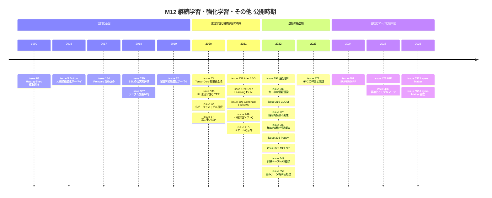

# 継続学習・強化学習・その他のトピック

> 対象：[Hiroki11x/Papers](https://github.com/Hiroki11x/Papers) の論文読みノート（GitHub issues）のうち、トピック M12（継続学習・強化学習・その他）を primary とする **32件の issue**。うち [#537](https://github.com/Hiroki11x/Papers/issues/537) と [#556](https://github.com/Hiroki11x/Papers/issues/556) は同一論文（Layers Matter, arXiv 2608.15901）の重複登録のため、**ユニーク論文は31本**。
> 論文の公開時期：1990-01（Hwang–Sheu の拡散過程論文）〜 2026-08（Layers Matter）。公開時期が記録にない論文が2本ある（[#195](https://github.com/Hiroki11x/Papers/issues/195), [#342](https://github.com/Hiroki11x/Papers/issues/342)）。
> issue の登録時期：2020-05-22 〜 2026-09-13。
> 作成日：2026-09-30。2025〜2026年の論文は執筆者の記憶ではなく、ノートの記述を根拠にまとめている。ノートが概要の転記のみ、あるいはリンクのみの論文も多いため、各論文の記述量はノートの情報量に合わせている。

## 概要

M12 は他のトピックに収まらない論文を集めた「その他」枠だが、中身を見ると次のような問いがまとまって現れる。

1. **継続学習で何が忘却・可塑性喪失を引き起こし、何がそれを防ぐのか。** フラットミニマ（[#132](https://github.com/Hiroki11x/Papers/issues/132)）、ランダム性の注入（[#303](https://github.com/Hiroki11x/Papers/issues/303)）、スケールと事前学習（[#415](https://github.com/Hiroki11x/Papers/issues/415)）、確率的・関数空間正則化（[#280](https://github.com/Hiroki11x/Papers/issues/280)）、層ごとの曲率（[#537](https://github.com/Hiroki11x/Papers/issues/537)）と、答え方が少しずつ変わってきた。
2. **深層強化学習における非定常性とノイズの多い価値推定をどう扱うか。** 一過性の非定常性による汎化劣化（[#338](https://github.com/Hiroki11x/Papers/issues/338)）、不確実性に基づく重み付けやソフト更新（[#197](https://github.com/Hiroki11x/Papers/issues/197), [#249](https://github.com/Hiroki11x/Papers/issues/249)）、方策集団による組合せ最適化（[#306](https://github.com/Hiroki11x/Papers/issues/306)）。
3. **最適化の設定は「単一モデルの性能」以外に何を決めるのか。** マージのしやすさ（[#436](https://github.com/Hiroki11x/Papers/issues/436)）、小データでのモデル選択の信頼性（[#72](https://github.com/Hiroki11x/Papers/issues/72)）、継続学習での忘却（[#132](https://github.com/Hiroki11x/Papers/issues/132), [#537](https://github.com/Hiroki11x/Papers/issues/537)）。
4. **学習済みモデルや計算資源をどう組み合わせて効率化するか。** 拡散モデルの推論時合成（[#467](https://github.com/Hiroki11x/Papers/issues/467)）、Tensor Core を使う低精度 HPC（[#33](https://github.com/Hiroki11x/Papers/issues/33)）、学習の計算量理論（[#359](https://github.com/Hiroki11x/Papers/issues/359)）、Hessian の直接予測（[#421](https://github.com/Hiroki11x/Papers/issues/421)）。
5. **分野全体をどう見渡すか。** 最適化サーベイ（[#5](https://github.com/Hiroki11x/Papers/issues/5), [#32](https://github.com/Hiroki11x/Papers/issues/32)）、深層学習の展望（[#139](https://github.com/Hiroki11x/Papers/issues/139)）、HPC の神話（[#371](https://github.com/Hiroki11x/Papers/issues/371)）。

## 目次

- [背景と基本概念](#背景と基本概念)
- [研究の系譜と時系列](#研究の系譜と時系列)
- [タイムライン](#タイムライン)
- [サブトピック別の整理](#サブトピック別の整理)
- [論文一覧表](#論文一覧表)
- [採択先別の集計](#採択先別の集計)
- [各論文の詳細まとめ](#各論文の詳細まとめ)
- [横断的な知見と未解決問題](#横断的な知見と未解決問題)
- [関連論文](#関連論文)

## 背景と基本概念

### 継続学習と破滅的忘却

継続学習（continual learning）では、タスク $1, 2, \dots, T$ のデータが順に届き、過去のデータには基本的にアクセスできない。新しいタスクを学習すると前のタスクの性能が急に落ちる現象を**破滅的忘却**（catastrophic forgetting）と呼ぶ（[#415](https://github.com/Hiroki11x/Papers/issues/415) のノート）。ノートに出てくる設定の区別は次のとおり。

- **タスク漸進学習（TIL）**：テスト時に各サンプルのタスク ID が与えられる。
- **クラス漸進学習（CIL）**：タスク ID が与えられず、全クラスの中から識別する必要がある（[#216](https://github.com/Hiroki11x/Papers/issues/216)）。

代表的な正則化手法が **EWC**（Elastic Weight Consolidation）で、前タスクの解 $\theta^*$ からの移動をパラメータごとの重要度（通常は対角 Fisher 情報 $F_i$）で重み付けしてペナルティを課す。

$$
\mathcal{L}(\theta) = \mathcal{L}_{\text{new}}(\theta) + \frac{\lambda}{2}\sum_i F_i\,(\theta_i - \theta_i^*)^2
$$

[#537](https://github.com/Hiroki11x/Papers/issues/537) は、この対角 Fisher が各層の**トップ Hessian 固有値**を復元できず、忘却を正しく制御できないと主張する。ブロック対角 Hessian の仮定の下で、忘却は「層 $\ell$ のトップ固有値 $\lambda^{(\ell)}_{\max}$ で重み付けされた層ごとの項の和」に分解される。模式的に書くと次のようになる。

$$
\Delta\mathcal{L}_{\text{old}} \;\approx\; \sum_{\ell} \lambda^{(\ell)}_{\max}\, \|\Delta\theta_\ell\|^2 \quad(\text{模式図})
$$

**可塑性の喪失**（loss of plasticity）は忘却とは逆の側面で、学習を続けるうちに新しいことを学ぶ能力そのものが落ちていく現象を指す。[#303](https://github.com/Hiroki11x/Papers/issues/303) は、Backprop の有効性が「小さなランダム初期化」に依存しており、そのランダム性が初期にしか与えられないことを原因として挙げている。

### フラットミニマ

損失地形の平坦な極小は汎化や忘却耐性と結び付けて論じられることが多い。[#132](https://github.com/Hiroki11x/Papers/issues/132) は継続学習でフラットミニマを探す最適化法を提案し、[#436](https://github.com/Hiroki11x/Papers/issues/436) は SGD ノイズが平坦さを通じてモデル間の接続性（マージのしやすさ）まで決めると論じる。

### 有効ノイズスケール

[#436](https://github.com/Hiroki11x/Papers/issues/436) は、学習率 $\eta$、バッチサイズ $B$、モーメンタム $\mu$、データ拡張 $A$ が生む勾配ノイズの大きさを次の量にまとめる。

$$
S_{\text{eff}} \propto \frac{\eta}{B(1-\mu)^2}\,\mathrm{tr}\,\Sigma_A(\theta)
$$

ここで $\Sigma_A(\theta)$ はデータ拡張込みの勾配共分散である。ハイパーパラメータを個別に動かすと傾向がばらつくが、$S_{\text{eff}}$ で並べ直すとマージ性能の曲線が揃う、というのが主張の中心である。

### 強化学習の価値推定

Q 学習では、TD ターゲットに含まれる推定ノイズが方策改善ステップの $\max$ 演算を通るとバイアスになり、Q 値の**過大評価**が起きる（[#249](https://github.com/Hiroki11x/Papers/issues/249)）。Soft Q-Learning は $\max$ を逆温度 $\beta$ のソフトな更新に置き換える。

$$
V(s) = \frac{1}{\beta}\log\sum_a \exp\big(\beta\, Q(s,a)\big)
$$

$\beta \to \infty$ で通常の $\max$ に一致する。[#249](https://github.com/Hiroki11x/Papers/issues/249) は $\beta$ をモデルの不確実性からスケジューリングする。[#197](https://github.com/Hiroki11x/Papers/issues/197) は、ターゲットの予測分散 $\sigma_i^2$ を推定し、サンプルの重みを $w_i \propto 1/\sigma_i^2$ とする**バッチ逆分散重み付け**で、不確実なサンプルの影響を下げる。

### 拡散モデルの重ね合わせ

[#467](https://github.com/Hiroki11x/Papers/issues/467) は、複数の事前学習済み拡散モデルのベクトル場を推論時に組み合わせる。組み合わせ方は2つある。**OR** は密度の混合で、いずれかのモデルで確率が高いサンプルを生成する。**AND** は、すべてのモデルで同程度に確率が高い点を生成する。そのためには生成軌道に沿って各モデルの対数密度を追跡する必要があり、ヤコビアン（ダイバージェンス）を計算せずにそれを行うのが Itô 密度推定器である。

## 研究の系譜と時系列

### 古典・基盤とサーベイ（1990〜2019年公開）

最も古いのは、拡散マルコフ過程の長時間挙動を扱った Hwang–Sheu の論文 [#83](https://github.com/Hiroki11x/Papers/issues/83)（1990）である。ノートによれば、これは別の issue #23 の命題2の証明の参照元（Theorem 3.3）として読まれたもので、SGD の拡散近似を追う流れ（M06）の数学的な裏付けにあたる。同じく確率論の [#357](https://github.com/Hiroki11x/Papers/issues/357)（Pitman, ランダム加重平均）もこの時期の公開である。

機械学習側では、Bottou–Curtis–Nocedal の大規模最適化サーベイ [#5](https://github.com/Hiroki11x/Papers/issues/5) が 2020-05 にリポジトリ最初期の issue として登録されたが、「輪読レベルで長い」として Icebox 行きになった。一方で Ruoyu Sun の深層学習最適化サーベイ [#32](https://github.com/Hiroki11x/Papers/issues/32) は、完全版を購入して「輪読したいくらいいい内容」と高く評価されている。2つのサーベイに対する扱いがはっきり分かれた。

表現学習の基礎文献として、Poincaré 埋め込み [#184](https://github.com/Hiroki11x/Papers/issues/184)（2017）と、半教師あり学習の現実的評価 [#290](https://github.com/Hiroki11x/Papers/issues/290)（2018）がある。[#184](https://github.com/Hiroki11x/Papers/issues/184) は「言語は画像と埋め込み空間が違うので、最適化手法も違うべき」という主張の前振りとして位置付けられている。

### 小データ・非定常性・継続学習の萌芽（2020〜2021年公開）

2020年には、ICML 2020 の [#72](https://github.com/Hiroki11x/Papers/issues/72) が「小データで良いモデルは大データでも良い」ことを示し、モデル選択を安く行う指針として読まれた。HPC 側では、Tensor Core を有限要素ソルバーに使う [#33](https://github.com/Hiroki11x/Papers/issues/33) が登録されている。

強化学習では [#338](https://github.com/Hiroki11x/Papers/issues/338)（ICLR 2021）が、学習中の一過性の非定常性がネットワークの表現に恒久的な傷を残し、汎化を損なうことを示した。対策は「新しく初期化したネットワークへ方策を繰り返し蒸留する（ITER）」ことである。これは、ランダム性を継続的に注入して可塑性を保つ Continual Backprop [#303](https://github.com/Hiroki11x/Papers/issues/303)（2021-08）と問題意識が近い。どちらも「1つのネットワークを更新し続けると学習能力が劣化する」という観察から出発し、新しいランダム性（再初期化、またはユニットの再注入）で回復させる。

継続学習では、フラットミニマを探す AlterSGD [#132](https://github.com/Hiroki11x/Papers/issues/132)（CVPR 2021 Workshop）が「継続学習でも flatness が大事そう」という観点で登録された。続いて Google の [#415](https://github.com/Hiroki11x/Papers/issues/415)（ICLR 2022）は、アルゴリズム上の工夫をしなくても、スケールと事前学習だけで忘却耐性が系統的に上がることを示した（issue 登録は 2025-09 と遅い）。強化学習の価値推定では、不確実性に基づくソフト更新の [#249](https://github.com/Hiroki11x/Papers/issues/249) が 2021-10 に公開されている。

### 登録の最盛期：多様な個別トピック（2022〜2023年公開）

issue 登録は 2022 年に集中している。継続学習では、OOD 検出とタスクマスクで TIL/CIL を統一的に扱う CLOM [#216](https://github.com/Hiroki11x/Papers/issues/216)、変分法・関数空間正則化・K-priors をまとめた Swaroop の博士論文 [#280](https://github.com/Hiroki11x/Papers/issues/280)、ニューラルプロセスによるメタ継続学習 [#320](https://github.com/Hiroki11x/Papers/issues/320) が並び、「忘却を防ぐ」から「不確実性まで含めて扱う」方向へ広がっている。

強化学習では、逆分散 RL [#197](https://github.com/Hiroki11x/Papers/issues/197)（ICLR 2022 Spotlight）が [#249](https://github.com/Hiroki11x/Papers/issues/249) と同じく「ノイズの多い価値推定を不確実性で抑える」という問いを扱う。[#249](https://github.com/Hiroki11x/Papers/issues/249) はソフト更新の温度で、[#197](https://github.com/Hiroki11x/Papers/issues/197) はサンプル重みで対処する。組合せ最適化では、母集団の性能だけを最大化して補完的な方策の集団を学習する Poppy [#306](https://github.com/Hiroki11x/Papers/issues/306) が登録された。

ほかに、対照学習の拡張モジュール [#225](https://github.com/Hiroki11x/Papers/issues/225)、訓練不要 NAS 指標がパラメータ数に依存しているという指摘 [#349](https://github.com/Hiroki11x/Papers/issues/349)、CNN ヘッドの改良 [#342](https://github.com/Hiroki11x/Papers/issues/342) といったアーキテクチャ・表現学習の論文がある。理論側では、カーネル法による情報理論 [#282](https://github.com/Hiroki11x/Papers/issues/282) と学習の計算量理論 [#359](https://github.com/Hiroki11x/Papers/issues/359) が、展望としては HPC の神話を集めたエッセイ [#371](https://github.com/Hiroki11x/Papers/issues/371) が読まれている。

### 合成・マージと層単位の再検討（2024〜2026年公開）

2025年以降の登録は数こそ少ないが、ノートは詳しい。[#467](https://github.com/Hiroki11x/Papers/issues/467)（ICLR 2025）は、再学習なしに拡散モデルを推論時に重ね合わせる SUPERDIFF を提案した。[#436](https://github.com/Hiroki11x/Papers/issues/436)（ICLR 2026）は、学習率・weight decay・バッチサイズ・データ拡張が「有効ノイズスケール」を通じてマージの成否を決めることを示した。どちらも「既存のモデルを組み合わせる」という問いを扱うが、[#467](https://github.com/Hiroki11x/Papers/issues/467) はアーキテクチャに依存しない推論時の合成、[#436](https://github.com/Hiroki11x/Papers/issues/436) は重み空間でのマージを扱い、後者はマージのしやすさを学習時に作り込むという立場をとる。計算化学では、Hessian を直接予測する HIP [#421](https://github.com/Hiroki11x/Papers/issues/421) が登録されている。

最新の [#537](https://github.com/Hiroki11x/Papers/issues/537)/[#556](https://github.com/Hiroki11x/Papers/issues/556)（2026-08）は、EWC 系の正則化を層単位で見直した。[#132](https://github.com/Hiroki11x/Papers/issues/132) が曲率（flatness）を「最適化で探す」対象としたのに対し、[#537](https://github.com/Hiroki11x/Papers/issues/537) は曲率を「層ごとの正則化強度を決める」ために使う。また、[#415](https://github.com/Hiroki11x/Papers/issues/415) が「スケールすれば忘れにくい」という巨視的な答えを出したのに対し、[#537](https://github.com/Hiroki11x/Papers/issues/537) は「どの層を守るべきか」という微視的な答えを出しており、問いの解像度が上がっている。本人の TLDR は「浅いレイヤーはなるべく変更しない、レイヤーごとに調整する」である（[#556](https://github.com/Hiroki11x/Papers/issues/556)）。

## タイムライン

公開時期が記録にない [#195](https://github.com/Hiroki11x/Papers/issues/195) と [#342](https://github.com/Hiroki11x/Papers/issues/342) はタイムラインから除いている。

## サブトピック別の整理

### 1. 継続学習：忘却・可塑性・正則化（7本、8 issue）

**要点**：忘却への対策は、最適化（flat minima、[#132](https://github.com/Hiroki11x/Papers/issues/132)）、アーキテクチャ・マスク（[#216](https://github.com/Hiroki11x/Papers/issues/216)）、確率的事前分布・関数空間正則化（[#280](https://github.com/Hiroki11x/Papers/issues/280)）、メモリバッファと不確実性（[#320](https://github.com/Hiroki11x/Papers/issues/320)）、スケール（[#415](https://github.com/Hiroki11x/Papers/issues/415)）、層ごとの正則化（[#537](https://github.com/Hiroki11x/Papers/issues/537)）と多岐にわたる。これと並んで、忘却とは別の失敗モードとして可塑性の喪失（[#303](https://github.com/Hiroki11x/Papers/issues/303)）が挙げられている。

- [#132](https://github.com/Hiroki11x/Papers/issues/132) AlterSGD — 勾配降下と上昇を交互に行い、フラットミニマを探す
- [#303](https://github.com/Hiroki11x/Papers/issues/303) Continual Backprop — ランダム特徴の継続注入で可塑性の喪失を防ぐ
- [#415](https://github.com/Hiroki11x/Papers/issues/415) Effect of scale on catastrophic forgetting — スケールと事前学習で忘却耐性が上がり、表現が直交化する
- [#216](https://github.com/Hiroki11x/Papers/issues/216) CLOM — OOD 検出モデルとして各タスクを学習し、タスクマスクで保護する
- [#280](https://github.com/Hiroki11x/Papers/issues/280) Probabilistic Continual Learning（博士論文）— 自然勾配による変分継続学習、FROMP、K-priors
- [#320](https://github.com/Hiroki11x/Papers/issues/320) MCLNP — ニューラルプロセスとコアセットによるメタ継続学習
- [#537](https://github.com/Hiroki11x/Papers/issues/537) / [#556](https://github.com/Hiroki11x/Papers/issues/556) Layers Matter — 層適応正則化（重複登録）

### 2. 深層強化学習：汎化・価値推定・組合せ最適化（4本）

**要点**：RL に固有の非定常性とノイズの多い監督信号が中心テーマである。[#338](https://github.com/Hiroki11x/Papers/issues/338) は表現の側から、[#197](https://github.com/Hiroki11x/Papers/issues/197) と [#249](https://github.com/Hiroki11x/Papers/issues/249) は不確実性推定の側から対処する。[#306](https://github.com/Hiroki11x/Papers/issues/306) は応用（NP 困難問題）で、1つの方策ではなく方策の集団を学習する。

- [#338](https://github.com/Hiroki11x/Papers/issues/338) ITER — 一過性の非定常性と汎化、再初期化ネットワークへの反復蒸留
- [#249](https://github.com/Hiroki11x/Papers/issues/249) UQL — 不確実性による逆温度 $\beta$ のスケジューリング
- [#197](https://github.com/Hiroki11x/Papers/issues/197) Inverse-Variance RL — 確率的アンサンブルとバッチ逆分散重み付け
- [#306](https://github.com/Hiroki11x/Papers/issues/306) Poppy — 補完的な方策集団による組合せ最適化

### 3. 表現学習・アーキテクチャ・モデル選択（7本）

**要点**：半教師あり・自己教師あり学習の評価と設計（[#290](https://github.com/Hiroki11x/Papers/issues/290), [#225](https://github.com/Hiroki11x/Papers/issues/225)）、埋め込み空間の幾何（[#184](https://github.com/Hiroki11x/Papers/issues/184)）、アーキテクチャの探索と改良（[#349](https://github.com/Hiroki11x/Papers/issues/349), [#342](https://github.com/Hiroki11x/Papers/issues/342)）、そしてモデル選択と層の解釈（[#72](https://github.com/Hiroki11x/Papers/issues/72), [#195](https://github.com/Hiroki11x/Papers/issues/195)）を含む。[#290](https://github.com/Hiroki11x/Papers/issues/290) と [#349](https://github.com/Hiroki11x/Papers/issues/349) はどちらも、単純なベースライン（ラベルなしデータを使わない学習、パラメータ数）が過小評価されてきたことを指摘している。なお、トピック定義にある Mean Teacher は M12 を primary とする論文には含まれず、関連論文として [#17](https://github.com/Hiroki11x/Papers/issues/17) がある。

- [#184](https://github.com/Hiroki11x/Papers/issues/184) Poincaré Embeddings — 双曲空間への階層的埋め込み
- [#290](https://github.com/Hiroki11x/Papers/issues/290) Realistic Evaluation of Deep SSL — 半教師あり学習の統一的な再評価
- [#225](https://github.com/Hiroki11x/Papers/issues/225) 階層的な拡張不変性 — 対照学習で、どこで何を対比するか
- [#72](https://github.com/Hiroki11x/Papers/issues/72) Small Data, Big Decisions — 小データでのモデル選択
- [#349](https://github.com/Hiroki11x/Papers/issues/349) Training-free NAS 指標の再検討
- [#342](https://github.com/Hiroki11x/Papers/issues/342) CNN の局所特徴融合ヘッド
- [#195](https://github.com/Hiroki11x/Papers/issues/195) 層の振る舞いを Wasserstein 距離で解釈する

### 4. モデルマージと生成モデルの合成（2本）

**要点**：既存のモデルを再学習せずに組み合わせる。[#436](https://github.com/Hiroki11x/Papers/issues/436) は重み空間でのマージで、学習時の SGD ノイズがマージのしやすさを決めると示す。[#467](https://github.com/Hiroki11x/Papers/issues/467) は出力（ベクトル場）空間での推論時合成で、アーキテクチャが異なるモデル同士も組み合わせられる。

- [#436](https://github.com/Hiroki11x/Papers/issues/436) 最適化の暗黙的バイアスとモデルマージの損失地形
- [#467](https://github.com/Hiroki11x/Papers/issues/467) SUPERDIFF — Itô 密度推定器による拡散モデルの重ね合わせ

### 5. サーベイ・展望（4本）

**要点**：最適化の総説2本（[#5](https://github.com/Hiroki11x/Papers/issues/5), [#32](https://github.com/Hiroki11x/Papers/issues/32)）と、分野の展望・エッセイ2本（[#139](https://github.com/Hiroki11x/Papers/issues/139), [#371](https://github.com/Hiroki11x/Papers/issues/371)）。ノートの中身はほとんどが評価やリンクのみである。

- [#5](https://github.com/Hiroki11x/Papers/issues/5) Optimization Methods for Large-Scale ML（Icebox）
- [#32](https://github.com/Hiroki11x/Papers/issues/32) Optimization for Deep Learning: An Overview
- [#139](https://github.com/Hiroki11x/Papers/issues/139) Deep Learning for AI（Bengio, LeCun, Hinton）
- [#371](https://github.com/Hiroki11x/Papers/issues/371) Myths and Legends in HPC

### 6. HPC・計算効率・科学計算（3本）

**要点**：ハードウェアの活用（[#33](https://github.com/Hiroki11x/Papers/issues/33)）、学習の計算量理論（[#359](https://github.com/Hiroki11x/Papers/issues/359)）、高価な二階微分の学習による代替（[#421](https://github.com/Hiroki11x/Papers/issues/421)）。共通するのは、「FLOP を増やしても実時間が短くなればよい」「微分計算を回避する」といった計算コストの組み替えである。

- [#33](https://github.com/Hiroki11x/Papers/issues/33) Tensor Core による低次有限要素ソルバー
- [#359](https://github.com/Hiroki11x/Papers/issues/359) 重みとデータの相関の前処理による高速学習
- [#421](https://github.com/Hiroki11x/Papers/issues/421) HIP — 分子 Hessian の直接予測

### 7. 確率論・情報理論・統計（4本）

**要点**：最適化理論（拡散近似・アニーリング）や分布の性質を理解するための数学的な道具立てで、他トピックの論文を読む過程で参照されたものが多い。

- [#83](https://github.com/Hiroki11x/Papers/issues/83) 摂動付き拡散マルコフ過程の長時間挙動
- [#357](https://github.com/Hiroki11x/Papers/issues/357) ランダム加重平均と一般化逆正弦則
- [#57](https://github.com/Hiroki11x/Papers/issues/57) ハザード率による分布の裾の重さの検定
- [#282](https://github.com/Hiroki11x/Papers/issues/282) カーネル法による情報理論

## 論文一覧表

first_public 順に並べ、公開時期が不明な論文は末尾に置いた。採択先はレコードの値をそのまま使っている。

| 公開 | 論文 | 著者/組織 | 採択先 | 根拠 | サブトピック |
|---|---|---|---|---|---|
| 1990-01 | [#83](https://github.com/Hiroki11x/Papers/issues/83) Large-Time Behavior of Perturbed Diffusion Markov Processes with Applications to the Second Eigenvalue Problem for Fokker-Planck Operators and Simulated Annealing | Chii-Ruey Hwang, Shuenn-Jyi Sheu | Acta Applicandae Mathematicae | Web確認 | 拡散過程とシミュレーテッドアニーリング |
| 2016-06 | [#5](https://github.com/Hiroki11x/Papers/issues/5) Optimization Methods for Large-Scale Machine Learning | Léon Bottou, Frank E. Curtis, Jorge Nocedal | SIAM Review | issue記載 | 大規模最適化のサーベイ |
| 2017-05 | [#184](https://github.com/Hiroki11x/Papers/issues/184) Poincaré Embeddings for Learning Hierarchical Representations | Maximilian Nickel, Douwe Kiela / Facebook AI Research | NeurIPS 2017 | Semantic Scholar確認 | 双曲空間埋め込み |
| 2018-04 | [#290](https://github.com/Hiroki11x/Papers/issues/290) Realistic Evaluation of Deep Semi-Supervised Learning Algorithms | Avital Oliver, Augustus Odena, Colin Raffel, et al. / Google Brain | NeurIPS 2018 | arXivコメント | 半教師あり学習の評価 |
| 2018-04 | [#357](https://github.com/Hiroki11x/Papers/issues/357) Random weighted averages, partition structures and generalized arcsine laws | Jim Pitman / UC Berkeley | arXiv（プレプリント） | 不明 | 確率論（ランダム加重平均） |
| 2019-12 | [#32](https://github.com/Hiroki11x/Papers/issues/32) Optimization for Deep Learning: An Overview | Ruoyu Sun / UIUC | Journal of the Operations Research Society of China | issue記載 | 深層学習の最適化サーベイ |
| 2020-06 | [#33](https://github.com/Hiroki11x/Papers/issues/33) Low-Order Finite Element Solver with Small Matrix-Matrix Multiplication Accelerated by AI-Specific Hardware for Crustal Deformation Computation | Takuma Yamaguchi, Kohei Fujita, Tsuyoshi Ichimura, et al. / University of Tokyo | PASC 2020 | issue記載 | Tensor Coreによる低精度HPC計算 |
| 2020-06 | [#338](https://github.com/Hiroki11x/Papers/issues/338) Transient Non-Stationarity and Generalisation in Deep Reinforcement Learning | Maximilian Igl, Gregory Farquhar, Jelena Luketina, et al. / University of Oxford | ICLR 2021 | Semantic Scholar確認 | 強化学習の汎化 |
| 2020-09 | [#72](https://github.com/Hiroki11x/Papers/issues/72) Small Data, Big Decisions: Model Selection in the Small-Data Regime | Jorg Bornschein, Francesco Visin, Simon Osindero / DeepMind | ICML 2020 | arXivコメント | 小データでのモデル選択 |
| 2020-10 | [#57](https://github.com/Hiroki11x/Papers/issues/57) Testing Tail Weight of a Distribution Via Hazard Rate | Maryam Aliakbarpour, Amartya Shankha Biswas, Kavya Ravichandran, et al. / MIT | ALT 2023 | Web確認 | 分布の裾の検定 |
| 2021-07 | [#132](https://github.com/Hiroki11x/Papers/issues/132) AlterSGD: Finding Flat Minima for Continual Learning by Alternative Training | Zhongzhan Huang, Mingfu Liang, Senwei Liang, Wei He | CVPR 2021 Workshop (CLVision) | issue記載 | 継続学習とフラットミニマ |
| 2021-07 | [#139](https://github.com/Hiroki11x/Papers/issues/139) Deep Learning for AI | Yoshua Bengio, Yann LeCun, Geoffrey Hinton | Communications of the ACM | issue記載 | 深層学習の展望 |
| 2021-08 | [#303](https://github.com/Hiroki11x/Papers/issues/303) Continual Backprop: Stochastic Gradient Descent with Persistent Randomness | Shibhansh Dohare, Richard S. Sutton, A. Rupam Mahmood / University of Alberta | arXiv（プレプリント） | 不明 | 継続学習と可塑性の喪失 |
| 2021-10 | [#249](https://github.com/Hiroki11x/Papers/issues/249) Temporal-Difference Value Estimation via Uncertainty-Guided Soft Updates | Litian Liang, Yaosheng Xu, Stephen McAleer, et al. / UC Irvine / UC Berkeley | NeurIPS 2021 Workshop (Deep RL) | arXivコメント | 強化学習の価値推定 |
| 2021-10 | [#415](https://github.com/Hiroki11x/Papers/issues/415) Effect of scale on catastrophic forgetting in neural networks | Vinay V. Ramasesh, Aitor Lewkowycz, Ethan Dyer / Google | ICLR 2022 | Web確認 | スケールと破滅的忘却 |
| 2022-01 | [#197](https://github.com/Hiroki11x/Papers/issues/197) Sample Efficient Deep Reinforcement Learning via Uncertainty Estimation | Vincent Mai, Kaustubh Mani, Liam Paull / Mila | ICLR 2022 | issue記載 | 強化学習と不確実性推定 |
| 2022-02 | [#282](https://github.com/Hiroki11x/Papers/issues/282) Information Theory with Kernel Methods | Francis Bach / Inria | IEEE TIT | Web確認 | カーネル法と情報理論 |
| 2022-03 | [#216](https://github.com/Hiroki11x/Papers/issues/216) Continual Learning Based on OOD Detection and Task Masking | Gyuhak Kim, Sepideh Esmaeilpour, Changnan Xiao, Bing Liu / University of Illinois Chicago | CVPR 2022 Workshop (CLVision) | Web確認 | 継続学習とOOD検出 |
| 2022-06 | [#225](https://github.com/Hiroki11x/Papers/issues/225) Rethinking the Augmentation Module in Contrastive Learning: Learning Hierarchical Augmentation Invariance with Expanded Views | Junbo Zhang, Kaisheng Ma / Tsinghua University | CVPR 2022 | arXivコメント | 対照学習のデータ拡張 |
| 2022-08 | [#280](https://github.com/Hiroki11x/Papers/issues/280) Probabilistic Continual Learning using Neural Networks | Siddharth Swaroop / University of Cambridge | PhD Thesis (University of Cambridge) | issue記載 | 確率的継続学習 |
| 2022-10 | [#306](https://github.com/Hiroki11x/Papers/issues/306) Winner Takes It All: Training Performant RL Populations for Combinatorial Optimization | Nathan Grinsztajn, Daniel Furelos-Blanco, Shikha Surana, et al. / InstaDeep | NeurIPS 2023 | Semantic Scholar確認 | 強化学習による組合せ最適化 |
| 2022-11 | [#320](https://github.com/Hiroki11x/Papers/issues/320) Uncertainty Estimation With Neural Processes for Meta-Continual Learning | Xuesong Wang, Lina Yao, Xianzhi Wang, et al. / UNSW | IEEE TNNLS | Web確認 | 継続学習の不確実性推定 |
| 2022-11 | [#349](https://github.com/Hiroki11x/Papers/issues/349) Revisiting Training-free NAS Metrics: An Efficient Training-based Method | Taojiannan Yang, Linjie Yang, Xiaojie Jin, Chen Chen | WACV 2023 | Web確認 | ニューラルアーキテクチャ探索 |
| 2022-11 | [#359](https://github.com/Hiroki11x/Papers/issues/359) Bypass Exponential Time Preprocessing: Fast Neural Network Training via Weight-Data Correlation Preprocessing | Josh Alman, Jiehao Liang, Zhao Song, et al. | NeurIPS 2023 | Web確認 | 学習の計算量理論 |
| 2023-01 | [#371](https://github.com/Hiroki11x/Papers/issues/371) Myths and Legends in High-Performance Computing | Satoshi Matsuoka, Jens Domke, Mohamed Wahib, et al. / RIKEN R-CCS / ETH Zurich | IJHPCA | Web確認 | HPCの展望 |
| 2024-12 | [#467](https://github.com/Hiroki11x/Papers/issues/467) The Superposition of Diffusion Models Using the Itô Density Estimator | Marta Skreta, Lazar Atanackovic, Avishek Joey Bose, et al. | ICLR 2025 | arXivコメント | 拡散モデルの推論時合成 |
| 2025-09 | [#421](https://github.com/Hiroki11x/Papers/issues/421) HIP: Hessian Interatomic Potentials without derivatives | Andreas Burger, Luca Thiede, Nikolaj Rønne, et al. / University of Toronto | arXiv（プレプリント） | 不明 | 分子Hessianの直接予測 |
| 2025-10 | [#436](https://github.com/Hiroki11x/Papers/issues/436) How does the optimizer implicitly bias the model merging loss landscape? | Chenxiang Zhang, Alexander Theus, Damien Teney, Antonio Orvieto, et al. | ICLR 2026 | arXivコメント | モデルマージングと最適化の暗黙的バイアス |
| 2026-08 | [#537](https://github.com/Hiroki11x/Papers/issues/537) Layers Matter: Why Continual Learning Regularization Should Be Layer-Adaptive | Brian B. Moser, Ahmed Anwar, Tobias Christian Nauen, et al. / DFKI | arXiv（プレプリント） | 不明 | 継続学習の層適応正則化 |
| 2026-08 | [#556](https://github.com/Hiroki11x/Papers/issues/556) Layers Matter: Why Continual Learning Regularization Should Be Layer-Adaptive | Brian B. Moser, Ahmed Anwar, Tobias Christian Nauen, et al. / DFKI | arXiv（プレプリント） | 不明 | 継続学習の層適応正則化 |
| 不明 | [#195](https://github.com/Hiroki11x/Papers/issues/195) Towards interpreting deep neural networks via layer behavior understanding | Jiezhang Cao, Jincheng Li, Xiping Hu, et al. / South China University of Technology | Machine Learning (journal) | Web確認 | 層の振る舞いの解釈 |
| 不明 | [#342](https://github.com/Hiroki11x/Papers/issues/342) Rethinking the Value of Local Feature Fusion in Convolutional Neural Networks | 不明 | Neural Processing Letters | Semantic Scholar確認 | CNNアーキテクチャ |

## 採択先別の集計

| 採択先系列 | 件数 | issue |
|---|---|---|
| 論文誌・雑誌 | 9 | [#5](https://github.com/Hiroki11x/Papers/issues/5)（SIAM Review）, [#32](https://github.com/Hiroki11x/Papers/issues/32)（Journal of the Operations Research Society of China）, [#83](https://github.com/Hiroki11x/Papers/issues/83)（Acta Applicandae Mathematicae）, [#139](https://github.com/Hiroki11x/Papers/issues/139)（Communications of the ACM）, [#195](https://github.com/Hiroki11x/Papers/issues/195)（Machine Learning）, [#282](https://github.com/Hiroki11x/Papers/issues/282)（IEEE TIT）, [#320](https://github.com/Hiroki11x/Papers/issues/320)（IEEE TNNLS）, [#342](https://github.com/Hiroki11x/Papers/issues/342)（Neural Processing Letters）, [#371](https://github.com/Hiroki11x/Papers/issues/371)（IJHPCA） |
| ICLR | 5 | [#197](https://github.com/Hiroki11x/Papers/issues/197), [#338](https://github.com/Hiroki11x/Papers/issues/338), [#415](https://github.com/Hiroki11x/Papers/issues/415), [#436](https://github.com/Hiroki11x/Papers/issues/436), [#467](https://github.com/Hiroki11x/Papers/issues/467) |
| arXiv（プレプリント） | 5 | [#303](https://github.com/Hiroki11x/Papers/issues/303), [#357](https://github.com/Hiroki11x/Papers/issues/357), [#421](https://github.com/Hiroki11x/Papers/issues/421), [#537](https://github.com/Hiroki11x/Papers/issues/537), [#556](https://github.com/Hiroki11x/Papers/issues/556) |
| NeurIPS | 4 | [#184](https://github.com/Hiroki11x/Papers/issues/184), [#290](https://github.com/Hiroki11x/Papers/issues/290), [#306](https://github.com/Hiroki11x/Papers/issues/306), [#359](https://github.com/Hiroki11x/Papers/issues/359) |
| CVPR Workshop (CLVision) | 2 | [#132](https://github.com/Hiroki11x/Papers/issues/132), [#216](https://github.com/Hiroki11x/Papers/issues/216) |
| ALT | 1 | [#57](https://github.com/Hiroki11x/Papers/issues/57) |
| CVPR | 1 | [#225](https://github.com/Hiroki11x/Papers/issues/225) |
| ICML | 1 | [#72](https://github.com/Hiroki11x/Papers/issues/72) |
| NeurIPS Workshop (Deep RL) | 1 | [#249](https://github.com/Hiroki11x/Papers/issues/249) |
| PASC | 1 | [#33](https://github.com/Hiroki11x/Papers/issues/33) |
| WACV | 1 | [#349](https://github.com/Hiroki11x/Papers/issues/349) |
| 博士論文 | 1 | [#280](https://github.com/Hiroki11x/Papers/issues/280) |

[#537](https://github.com/Hiroki11x/Papers/issues/537) と [#556](https://github.com/Hiroki11x/Papers/issues/556) は同一論文なので、arXiv（プレプリント）の件数はユニーク論文で数えると4本になる。

## 各論文の詳細まとめ

### [#83] Large-Time Behavior of Perturbed Diffusion Markov Processes with Applications to the Second Eigenvalue Problem for Fokker-Planck Operators and Simulated Annealing

- 公開：1990-01 ／ 採択先：Acta Applicandae Mathematicae ／ 著者：Chii-Ruey Hwang, Shuenn-Jyi Sheu

摂動付き拡散マルコフ過程の長時間挙動を解析し、Fokker–Planck 作用素の第2固有値問題とシミュレーテッドアニーリングに応用した古典的な論文。ノートには PDF とメモが1行あるのみ。

- 別の issue #23 の命題2（Proposition 2）の証明が、本論文の Theorem 3.3 にある。

### [#5] Optimization Methods for Large-Scale Machine Learning

- 公開：2016-06 ／ 採択先：SIAM Review ／ 著者：Léon Bottou, Frank E. Curtis, Jorge Nocedal

大規模機械学習の確率的最適化手法（SGD、分散削減、2次法など）の理論と実践をまとめたサーベイ。ノートには内容の要約はない。

- メモ：「輪読レベルで長い」として Icebox に入れ、一旦 close している。

### [#184] Poincaré Embeddings for Learning Hierarchical Representations

- 公開：2017-05 ／ 採択先：NeurIPS 2017 ／ 著者/組織：Maximilian Nickel, Douwe Kiela / Facebook AI Research

階層構造をもつ記号データを、ユークリッド空間ではなく $n$ 次元ポアンカレ球（双曲空間）に埋め込む手法。リーマン最適化に基づく学習アルゴリズムを導入し、潜在的な階層をもつデータで、表現能力と汎化能力の両面でユークリッド埋め込みを大きく上回った。

- 双曲幾何によって階層性と類似性を同時に捉えられる。
- メモ：「言語タスクは画像と違って埋め込み空間がポアンカレ埋め込みが良い。だから最適化手法も違うんだ、的な主張の前振り論文」と位置付けている。

### [#290] Realistic Evaluation of Deep Semi-Supervised Learning Algorithms

- 公開：2018-04 ／ 採択先：NeurIPS 2018 ／ 著者/組織：Avital Oliver, Augustus Odena, Colin Raffel, et al. / Google Brain

広く使われている半教師あり学習（SSL）手法を統一的に再実装し、実世界の応用で直面する問題を想定した実験で評価した。標準ベンチマークはそうした問題を反映していないと主張している。

- ラベルなしデータを使わない単純なベースラインの性能は、しばしば過小評価されている。
- SSL 手法は、ラベル付き・ラベルなしデータの量に対する感度が手法ごとに異なる。
- ラベルなしデータにクラス外の例が混ざると、性能が大きく低下する。
- 統一的な再実装と評価プラットフォームを公開した。

### [#357] Random weighted averages, partition structures and generalized arcsine laws

- 公開：2018-04 ／ 採択先：arXiv（プレプリント） ／ 著者/組織：Jim Pitman / UC Berkeley

i.i.d. 確率変数 $X_j$ と独立なランダム重み $P_j \ge 0,\ \sum_j P_j = 1$ によるランダム加重平均 $M_P(X) = \sum_j X_j P_j$ の分布理論を、分割構造の観点から扱う。

- $X_p$ が $\{0,1\}$ 上のベルヌーイ($p$)なら、$\mathbb{E}[M_P(X_p)^n]$ は、$P$ からのサイズ $n$ の標本に現れる相異なる値の数 $K_n$ の確率母関数に等しい。
- 2パラメータ $(\alpha,\theta)$ の一般化 Ewens 標本公式と結び付けると、$(\alpha,\theta)$ 平均の Cauchy–Stieltjes 変換が得られる。Dirichlet 平均や Lévy の逆正弦則の一般化とも関係する。

### [#32] Optimization for Deep Learning: An Overview

- 公開：2019-12 ／ 採択先：Journal of the Operations Research Society of China ／ 著者/組織：Ruoyu Sun / UIUC

深層学習の最適化に関する理論とアルゴリズム（初期化、正規化、適応的手法、大域的なランドスケープなど）を概観したサーベイ。ノートには内容の要約はない。

- arXiv 版は短縮版で、完全版は Springer で公開されている。
- メモ：「5000円で買った、輪読したいくらいいい内容」と高く評価している。

### [#33] Low-Order Finite Element Solver with Small Matrix-Matrix Multiplication Accelerated by AI-Specific Hardware for Crustal Deformation Computation

- 公開：2020-06 ／ 採択先：PASC 2020 ／ 著者/組織：Takuma Yamaguchi, Kohei Fujita, Tsuyoshi Ichimura, et al. / University of Tokyo

地殻変動計算のための低次有限要素ソルバーを、Volta GPU の Tensor Core（半精度の行列積ユニット）で高速化した。小さな行列でも低精度のデータ型を使え、メモリアクセスコストを減らせるように、最先端のソルバーアルゴリズムを設計し直している。

- Summit の36ノードで、地殻とマントルを模した130億自由度の2層問題を解いた。
- 行列ベクトル積のカーネルで、単精度の標準カーネルに対して4.1倍の高速化を得た。
- ソルバー全体の FLOP 数は増えたが、Tensor Core の実効性能が高いため、解を得るまでの時間は1.7倍短縮した。
- メモ：「TensorCore 頑張って使った NVIDIA の人たちの論文」と書かれている。ただし、ACM の書誌情報では筆頭3名（Yamaguchi, Fujita, Ichimura）は東京大学の所属である。NVIDIA 所属の共著者は Akira Naruse の1名だけで、ほかに ORNL、JAMSTEC、理研の共著者がいる。

### [#338] Transient Non-Stationarity and Generalisation in Deep Reinforcement Learning

- 公開：2020-06 ／ 採択先：ICLR 2021 ／ 著者/組織：Maximilian Igl, Gregory Farquhar, Jelena Luketina, et al. / University of Oxford

RL では環境が定常でも、学習中に方策が変わるためデータ分布が非定常になる。この非定常性は一過性なので通常は明示的に扱われないが、ニューラルネットワークの記憶効果によって潜在表現に恒久的な影響が残り、汎化を損なうことを示した。

- 対策として ITER（反復再学習）を提案した。現在の方策の知識を、新しく初期化したネットワークへ繰り返し転送する。
- ProcGen と Multiroom で汎化性能を改善した。

### [#72] Small Data, Big Decisions: Model Selection in the Small-Data Regime

- 公開：2020-09 ／ 採択先：ICML 2020 ／ 著者/組織：Jorg Bornschein, Francesco Visin, Simon Osindero / DeepMind

モデルサイズではなく訓練セットサイズを数桁にわたって変え、汎化性能を系統的に調べた。

- 小さなデータサブセットでの訓練は、より信頼できるモデル選択につながり、計算コストも小さい。
- 一般的なデータセットの最小記述長を推定でき、オッカムの剃刀を考慮した原理的なモデル選択への道を開く。
- Cross Entropy に温度を導入し、確信度の高い予測を均して推論を滑らかにする実験も行っている。
- メモ：「結構ちゃんと読んだ」。データ数に関係なく、性能の高いモデルは性能の低いモデルより常に良い。なので、小さいデータである程度試してから大きいモデルを選ぶのが良い、と整理している。

### [#57] Testing Tail Weight of a Distribution Via Hazard Rate

- 公開：2020-10 ／ 採択先：ALT 2023 ／ 著者/組織：Maryam Aliakbarpour, Amartya Shankha Biswas, Kavya Ravichandran, et al.（Ronitt Rubinfeld を含む）/ MIT

分布からのサンプルをもとに、出現頻度の低い要素がどれだけあるか（分布の裾）を特徴付ける。自然な滑らかさと順序付けの仮定の下で、ハザード率に基づく定義を使い、重い裾をもつ分布とそうでない分布を区別するバケット化アルゴリズムを開発し、理論結果を実験で検証した。

### [#132] AlterSGD: Finding Flat Minima for Continual Learning by Alternative Training

- 公開：2021-07 ／ 採択先：CVPR 2021 Workshop (CLVision) ／ 著者：Zhongzhan Huang, Mingfu Liang, Senwei Liang, Wei He

フラットミニマと忘却の軽減を結び付ける既存手法は、ハイパーパラメータ調整の手間と追加の計算コストを必要とする。AlterSGD は、各セッションでネットワークが収束しかけたときに勾配降下と勾配上昇を交互に行い、フラットミニマを探す。

- この戦略がフラットミニマへの収束を促すことを理論的に証明した。
- セマンティックセグメンテーションの継続学習ベンチマークで忘却を大きく減らし、最先端手法を上回った。
- メモ：「継続学習で Flatness を意識するのが大事そう、みたいな話」。

### [#139] Deep Learning for AI

- 公開：2021-07 ／ 採択先：Communications of the ACM ／ 著者：Yoshua Bengio, Yann LeCun, Geoffrey Hinton

チューリング賞を受賞した3名による、深層学習の歩みと今後の課題についての展望論文。ノートには本文へのリンクと紹介ツイートへのリンクがあるだけで、各欄は空である。

### [#303] Continual Backprop: Stochastic Gradient Descent with Persistent Randomness

- 公開：2021-08 ／ 採択先：arXiv（プレプリント） ／ 著者/組織：Shibhansh Dohare, Richard S. Sutton, A. Rupam Mahmood / University of Alberta

Backprop は、確率的勾配降下と、小さなランダム重みによる初期化という2つの仕組みからなる。継続学習では Backprop は最初はうまく学習するが、時間とともに性能が落ちていく。初期のランダム性は初期の学習しか可能にしないためである。

- 著者らの知る限り、Backprop の学習能力の劣化（可塑性の喪失）を示した最初の結果としている。
- Continual Backprop を提案した。生成・テスト過程によって、勾配降下と並行してランダムな特徴を継続的に注入する。
- 教師あり学習と RL の両方で継続的に適応でき、計算量は Backprop と同じである。

### [#249] Temporal-Difference Value Estimation via Uncertainty-Guided Soft Updates

- 公開：2021-10 ／ 採択先：NeurIPS 2021 Workshop (Deep RL) ／ 著者/組織：Litian Liang, Yaosheng Xu, Stephen McAleer, et al. / UC Irvine / UC Berkeley

Q 学習では、不慣れな状態の TD ターゲットの推定ノイズが $\max$ 演算でバイアスとなり、Q 値の過大評価を招く。Soft Q-Learning の逆温度 $\beta$ は通常ヒューリスティックで決められるが、本論文は $\beta$ が状態ごとのモデル不確実性と密接に関係するとみなし、不確実性から $\beta$ をスケジューリングする。

- エントロピー正則化 Q 学習（EQL）を、2行動・有限状態から多行動・無限状態の MDP に拡張した不偏ソフト Q 学習（UQL）を提案した。
- いくつかの離散制御環境で、理論保証と有効性を示した。
- issue のタイトルは「Reducing Variance in Temporal-Difference Value Estimation via Ensemble of Deep Networks」で、同じ arXiv ID（2110.14818）の改題前のタイトルとみられる。

### [#415] Effect of scale on catastrophic forgetting in neural networks

- 公開：2021-10 ／ 採択先：ICLR 2022 ／ 著者/組織：Vinay V. Ramasesh, Aitor Lewkowycz, Ethan Dyer / Google

大規模に事前学習した ResNet と Vision Transformer は破滅的忘却に強く、その耐性はモデルサイズとデータセット規模の拡大とともに系統的に向上する。正則化やリプレイといったアルゴリズム上の工夫ではなく、スケールと事前学習そのものの効果を大規模に実証した。

- 対象は ResNet（26〜200層、14M〜62M パラメータ）と ViT（xS/S/B、5.7M〜86.7M）。CIFAR-10/100、Pets、Flowers、SVHN、Cars196、Birds200、DomainNet/Clipart で、2タスク・10タスクの連続学習や入力分布シフトを調べ、言語モデル（IMDb→Wikipedia）でも検証した。
- モデル規模が大きいほど忘却が少ない。ViT-B では CIFAR-10 でほぼ忘却がない（図1, 3）。
- 同じ精度まで調整しても、事前学習済みモデルのほうがゼロからの初期化より忘却に強い。スケールアップは事前学習があって初めて効く（図6）。
- SVHN や Clipart のような分布の異なるデータでもスケール効果がある（図5）。
- 大規模な事前学習モデルでは異なるクラスの表現の重なりが小さく、直交性が高い（図9, 26, 27）。直交性の理論的な理解は今後の課題とされている。

### [#197] Sample Efficient Deep Reinforcement Learning via Uncertainty Estimation

- 公開：2022-01 ／ 採択先：ICLR 2022 ／ 著者/組織：Vincent Mai, Kaustubh Mani, Liam Paull / Mila

モデルフリー深層 RL では、方策の評価と最適化をノイズの多い価値推定値で監督するため、サンプル効率が悪くなる。このノイズは不均一分散なので、不確実性に基づく重みで影響を緩和できる。RL の監督信号に含まれる不確実性の源を系統的に分析し、確率的アンサンブルとバッチ逆分散重み付けを組み合わせたベイズ的枠組み「逆分散 RL」を提案した。

- Q 値の不確実性と環境の確率性の両方を考慮する、2つの相補的な不確実性推定を用いる。
- 離散制御と連続制御の両方で、サンプル効率が大きく改善した。
- ICLR 2022 Spotlight（issue 記載）。

### [#282] Information Theory with Kernel Methods

- 公開：2022-02 ／ 採択先：IEEE TIT ／ 著者/組織：Francis Bach / Inria

確率分布を、再生核ヒルベルト空間（RKHS）の共分散作用素を通じて解析する。共分散作用素のフォン・ノイマンエントロピーと相対エントロピーを定義し、それがシャノン型の量と多くの性質を共有することを示した。

- カーネル相対エントロピーは、常にシャノン相対エントロピーの下界になる。
- テンソル積カーネルで相互情報量と結合エントロピーを定義でき、独立性は完全に特徴付けられる。条件付き独立性は部分的にしか特徴付けられない。
- 対数分割関数の新しい上界が得られ、凸最適化と組み合わせて新しい変分推論法を構成できる。

### [#216] Continual Learning Based on OOD Detection and Task Masking

- 公開：2022-03 ／ 採択先：CVPR 2022 Workshop (CLVision) ／ 著者/組織：Gyuhak Kim, Sepideh Esmaeilpour, Changnan Xiao, Bing Liu / University of Illinois Chicago

既存の継続学習手法は TIL か CIL のどちらか一方にしか焦点を当てていない。CLOM は、各タスクを通常の教師ありモデルではなく OOD 検出モデルとして学習し、さらに各タスクを守るタスクマスクを学習して忘却を防ぐことで、両方を統一的に扱う。

- 6つの実験の平均 TIL/CIL 精度は 87.6/67.9% で、最良のベースライン（82.4/55.0%）を大きく上回った。

### [#225] Rethinking the Augmentation Module in Contrastive Learning: Learning Hierarchical Augmentation Invariance with Expanded Views

- 公開：2022-06 ／ 採択先：CVPR 2022 ／ 著者/組織：Junbo Zhang, Kaisheng Ma / Tsinghua University

対照学習の拡張モジュールには2つの問題がある。人手で選んだ拡張の不変性が下流タスクによって良くも悪くも働くことと、強い拡張がきめ細かい情報を失わせることである。これに対し「どこで何を対比するか」を見直す手法を提案した。

- 各データ拡張の重要度に応じて、バックボーンの異なる深さで異なる不変性を学習する。
- 拡張の埋め込みで対比の内容を拡張し、強い拡張による誤誘導を減らす。
- 分類、検出、セグメンテーションの下流タスクで表現が改善した。

### [#280] Probabilistic Continual Learning using Neural Networks

- 公開：2022-08 ／ 採択先：PhD Thesis (University of Cambridge) ／ 著者/組織：Siddharth Swaroop / University of Cambridge

信念の分布を保持して再帰的に更新する確率的アプローチで、ニューラルネットワークの継続学習の包括的な枠組みを構築した博士論文。

- 第3章：重みの変分近似に自然勾配による更新を使って収束を速め、ImageNet 規模に初めて対応した。
- 第4章：最終的に関心があるのはモデルの出力だという立場から、関数空間で正則化する FROMP を提案した。記憶に残した少数の過去の例を識別・正則化して忘却を防ぐ。
- 第5章：FROMP は一般化線形モデル（GLM）でも厳密ではないため、FROMP と重み事前分布を一般化した K-priors で修正した。K-priors は、データの追加・削除、正則化やモデルの変更など、多くの適応タスクで速く正確に適応できる。
- メモ：「D論」。

### [#306] Winner Takes It All: Training Performant RL Populations for Combinatorial Optimization

- 公開：2022-10 ／ 採択先：NeurIPS 2023 ／ 著者/組織：Nathan Grinsztajn, Daniel Furelos-Blanco, Shikha Surana, et al. / InstaDeep

NP 困難な組合せ最適化問題を、エージェントが1回の推論で解けると期待するのは非現実的である。そこで、推論時に同時に展開できる補完的な方策の集団を学習する Poppy を提案した。あらかじめ定義した多様性の概念には頼らず、集団の性能を最大化することだけを目的にして、教師なしの特化を誘導する。

- TSP、CVRP、0-1 ナップザックで最先端の RL 結果を得た。
- TSP では、最適性ギャップを5分の1にしつつ、推論時間を1桁以上短縮した。
- issue のタイトルは「Population-Based Reinforcement Learning for Combinatorial Optimization」で、改題前のタイトルとみられる。

### [#320] Uncertainty Estimation With Neural Processes for Meta-Continual Learning

- 公開：2022-11 ／ 採択先：IEEE TNNLS ／ 著者/組織：Xuesong Wang, Lina Yao, Xianzhi Wang, et al. / UNSW

ニューラルプロセス族（NPF）は平均的な予測と分散（不確実性）を出力できるが、データアクセスに厳しい制約がある継続学習には対応していなかった。MCLNP は、メタ継続学習とニューラルプロセスを組み合わせる。

- 特定の点での局所的な不確実性と、動的な環境での関数の変化を表す大域的な不確実性 $p(z)$ の2レベルを推定する。
- 忘却を緩和するメモリバッファとしてコアセットを使う。
- abrupt/gradual/recurrent な分布変化、1次元・2次元データ、時空間 COVID データで評価し、尤度でベースラインを上回り、変化の激しいデータストリームからも速く回復した。

### [#349] Revisiting Training-free NAS Metrics: An Efficient Training-based Method

- 公開：2022-11 ／ 採択先：WACV 2023 ／ 著者：Taojiannan Yang, Linjie Yang, Xiaojie Jin, Chen Chen

訓練不要の NAS 指標を再検討し、最も単純な指標であるパラメータ数が意外に有効なこと、最近の訓練不要指標はネットワークの順位付けをほとんどパラメータ数の情報に頼っていることを明らかにした。

- パラメータ数との相関が弱い、軽量な訓練ベースの指標を提案した。
- DARTS 探索空間で ImageNet を直接探索し、2.6 GPU 時間で top-1/top-5 エラー 24.1%/7.1% を達成した。

### [#359] Bypass Exponential Time Preprocessing: Fast Neural Network Training via Weight-Data Correlation Preprocessing

- 公開：2022-11 ／ 採択先：NeurIPS 2023 ／ 著者：Josh Alman, Jiehao Liang, Zhao Song, et al.

$m$ ニューロンの層で $n$ 個の $d$ 次元データ点を処理すると、1反復あたり $\Theta(nmd)$ の時間がかかる。先行研究（Song, Yang and Zhang, NeurIPS 2021）はこれを $o(nmd)$ に減らしたが、前処理に指数時間を要した。本論文は、重みとデータの相関を木構造に保存し、各反復で発火するニューロンを動的に高速検出する。

- 前処理は多項式時間（ノートの記述では $O(nmd)$）で済み、1反復あたりの時間は $o(nmd)$ を達成する。
- 複雑性理論で標準的な予想の下では、発火ニューロンの動的検出をこれ以上大幅に速くはできないという下界も示した。

### [#371] Myths and Legends in High-Performance Computing

- 公開：2023-01 ／ 採択先：IJHPCA ／ 著者/組織：Satoshi Matsuoka, Jens Domke, Mohamed Wahib, Aleksandr Drozd, Torsten Hoefler / RIKEN R-CCS / ETH Zurich

HPC コミュニティで語られる神話や伝説を、会議での会話、製品広告、論文、SNS やニュースから集めて論じるユーモラスなエッセイ。デナードスケーリングやムーアの法則の終焉という時代の空気を反映したものと捉え、研究や産業界での投資の新しい方向性を議論する材料として提示している。

### [#467] The Superposition of Diffusion Models Using the Itô Density Estimator

- 公開：2024-12 ／ 採択先：ICLR 2025 ／ 著者：Marta Skreta, Lazar Atanackovic, Avishek Joey Bose, Alexander Tong, Kirill Neklyudov

複数の事前学習済み拡散モデルを、再学習なしで推論時に重ね合わせる SUPERDIFF を提案した。連続の方程式から、複数の拡散過程の重ね合わせが別の SDE として表せることを示し（Prop. 3, 4）、OR（密度の混合）と AND（全モデルで等確率の点）の2つの生成モードを導入した。

- Itô 密度推定器（定理1, Eq. 13）は、Hutchinson 推定器と同程度の分散でありながら、ヤコビアンの計算が要らない。
- CIFAR-10（OR）：別々のデータで学習した2モデルを合成し、両方のデータで再学習したモデルよりも良い FID 4.0、IS 9.48 を得た。
- Stable Diffusion（AND）：2つのプロンプトの概念融合で、CLIP スコア、ImageReward、TIFA のすべてでベースライン（平均法、joint prompting）を上回った。
- タンパク質（Proteus と FrameDiff の OR）：設計性・新規性・多様性で個別モデルを上回った。分子（LDMol の AND）：複数の特性を同時に満たす分子を生成した。
- 重み平均とは違い、アーキテクチャの制約を受けない。

### [#421] HIP: Hessian Interatomic Potentials without derivatives

- 公開：2025-09 ／ 採択先：arXiv（プレプリント） ／ 著者/組織：Andreas Burger, Luca Thiede, Nikolaj Rønne, et al. / University of Toronto

分子の幾何最適化、遷移状態探索、振動解析に欠かせない Hessian を、有限差分や自動微分（AD）を使わずに、SE(3) 等変 GNN で直接予測する（issue のタイトルは「Shoot from the HIP: ...」）。

- メッセージパッシングから、対称性と等変性を満たす Hessian を直接構成する。
- 低い固有値と固有ベクトルの部分空間を重視する損失を導入し、遷移状態探索や極小の判定を改善した。
- HORM データセット（5〜30原子）で、AD ベースのモデル（AlphaNet, LEFTNet, EquiformerV2）より誤差が小さく、最大74倍速く、メモリは2〜3分の1、Hessian の MAE は約2倍改善した。
- ゼロ点エネルギーの誤差が1桁以上小さく、遷移状態と極小の判別精度は 92%（AD は 75%）。

### [#436] How does the optimizer implicitly bias the model merging loss landscape?

- 公開：2025-10 ／ 採択先：ICLR 2026 ／ 著者：Chenxiang Zhang, Alexander Theus, Damien Teney, Antonio Orvieto, Jun Pang, Sjouke Mauw

モデルマージ（線形補間やタスク演算）がうまくいくかどうかを最適化の側から説明した。学習率、weight decay、バッチサイズ、データ拡張の効果を、有効ノイズスケール $S_{\text{eff}} \propto \eta/(B(1-\mu)^2)\cdot\mathrm{tr}\,\Sigma_A$ という共通の因子にまとめている。

- ハイパーパラメータを単独で動かしても傾向は一貫しないが、$S_{\text{eff}}$ で並べ直すと曲線が揃い、中程度のノイズにマージ性能が最大になる「sweet spot」が現れる（CIFAR-100/ResNet18, Fig. 1）。
- 学習率が高いほどマージしやすい（CIFAR-100 で lr=0.2 は lr=0.01 より +1.0% 以上）。ただし大きすぎると不安定になる。
- weight decay は、正規化層をもつスケール不変なネットワークでは有効学習率を保ち、マージを改善する。MLP では影響がない。小バッチとデータ拡張もノイズ源としてマージを助ける。
- TinyStories の小型 GPT や CLIP ViT-B/16 の転移学習でも同じ傾向が見られた。転移学習では学習率とマージ性能の相関が r=0.981。
- タスク演算では、事前学習済み重みから出発すると大きい学習率でより平坦な地形になるが、事前学習なしでは逆に不安定になる。異なるタスクのモデル同士は、似た中程度の学習率で学習したときに最もよく統合できる。
- 2D の損失断面では、ノイズが低い・中程度・高い場合に地形が「平坦→谷→不安定」と変わり、中程度のノイズでのみ2つの極小の間に谷ができる。著者らのまとめは「Tune the noise to tune merging effectiveness.」。

### [#537] Layers Matter: Why Continual Learning Regularization Should Be Layer-Adaptive

- 公開：2026-08 ／ 採択先：arXiv（プレプリント） ／ 著者/組織：Brian B. Moser, Ahmed Anwar, Tobias Christian Nauen, et al. / DFKI

EWC のようにパラメータごとの重要度（対角 Fisher）でペナルティを課す方法は柔軟に見えるが、各層の対角 Fisher は曲率の要約として弱く、忘却を支配するトップ固有値の情報が欠けている。敵対的ビット反転攻撃や Hessian スペクトルの研究から、この層ごとの感度は桁違いに異なることがわかっている。

- ブロック対角 Hessian の仮定の下で、次の3点を証明した。(1) 忘却は、各層のトップ Hessian 固有値で重み付けされた層ごとの項の和に分解される。(2) 対角 Fisher ではこの固有値を復元できない。Fisher の平均が同じ2つの層でも、トップ固有値が層の幅と同じ倍率で違うことがある。(3) 同じ忘却レベルで比べると、一様な正則化は層の条件数に比例して新しいタスクの性能を落とす。
- 処方は、浅い層を強く保護し、深い層の移動を許すこと。EWC と SLCA に適用し、平均性能と忘却指標が改善した。

### [#556] Layers Matter: Why Continual Learning Regularization Should Be Layer-Adaptive（重複登録）

- 公開：2026-08 ／ 採択先：arXiv（プレプリント） ／ 著者/組織：Brian B. Moser, Ahmed Anwar, Tobias Christian Nauen, et al. / DFKI

[#537](https://github.com/Hiroki11x/Papers/issues/537) と同じ論文（arXiv 2608.15901）を約3週間後に再登録したもの。

- メモ（TLDR）：「浅いレイヤーはなるべく変更しない」「レイヤーごとに調整する」。

### [#195] Towards interpreting deep neural networks via layer behavior understanding

- 公開：不明（issue 登録 2022-02） ／ 採択先：Machine Learning (journal) ／ 著者/組織：Jiezhang Cao, Jincheng Li, Xiping Hu, Peilin Zhao, Mingkui Tan / South China University of Technology

教師–生徒の枠組みで、目標分布に対する層間分布と単層分布の学習中の変化を「監視」し、DNN の隠れ層の振る舞いを理解しようとした。層の分布と目標分布の乖離は、最適輸送に基づく Wasserstein 距離で測る。

- 目標分布に対する層間の距離は、深さ方向に減少する傾向がある。ただしサンプルによっては、深い層が常に浅い層より良いとは限らない。
- 層分布の安定性の解析に役立ち、補助損失が DNN の学習を助ける理由を説明する。
- ノートには「ACML2020 に採択されてた」とあり、Springer の Machine Learning 誌へのリンクがある。採択先は検証済みのレコード（Web確認）に従って Machine Learning 誌とし、ACML 2020 という記述は本人のメモとして残している。
- メモ：「結構ちゃんと見てる感じがするけど、これでも ICLR Reject 食らうのか、難しいな」。

### [#342] Rethinking the Value of Local Feature Fusion in Convolutional Neural Networks

- 公開：不明（issue 登録 2022-11） ／ 採択先：Neural Processing Letters ／ 著者：不明

分類用 CNN の標準的なヘッド（グローバル平均プーリング＋全結合層）は特徴融合の能力に欠ける。ResNet の基本ブロックとボトルネック構造を分析し、1×1 畳み込みで局所パッチ内の特徴を融合することの重要性を示した。

- グローバル平均プーリングの代わりに、1×1 畳み込みの列を3段で並べたヘッドを提案した。
- 精度は、ResNet18（ImageNet）で 3.6%、ResNet56（CIFAR-100）で 5.0% 向上した。
- メモ：「アーキテクチャいじった系」。

## 横断的な知見と未解決問題

### 「再初期化・新しいランダム性」が繰り返し解決策として現れる

[#338](https://github.com/Hiroki11x/Papers/issues/338)（ITER：新しく初期化したネットワークへの蒸留）と [#303](https://github.com/Hiroki11x/Papers/issues/303)（Continual Backprop：ユニットへのランダム特徴の再注入）は、RL と継続学習という別の文脈で同じ結論にたどり着いている。1つのネットワークを非定常なデータで更新し続けると表現や可塑性が劣化し、初期化時のランダム性だけでは足りない、という結論である。一方 [#415](https://github.com/Hiroki11x/Papers/issues/415) は、事前学習済みの大規模モデルでは忘却が自然に起きにくいことを示した。スケールと事前学習が可塑性の喪失にも効くのかどうかは、ノートの範囲では検証されていない。

### 曲率（平坦さ）は「探す対象」から「配分の基準」へ

[#132](https://github.com/Hiroki11x/Papers/issues/132) は最適化でフラットミニマを探すことで忘却を減らした。[#537](https://github.com/Hiroki11x/Papers/issues/537) は層ごとのトップ Hessian 固有値を使って正則化の強さを層ごとに配分する。[#436](https://github.com/Hiroki11x/Papers/issues/436) は SGD ノイズが平坦さを通じてマージのしやすさを決めると論じる。いずれも曲率が中心にあるが、どれくらい平坦であればよいかについては見方が分かれる。[#436](https://github.com/Hiroki11x/Papers/issues/436) は「ノイズが大きすぎても失敗する（sweet spot がある）」としており、平坦なほどよいという単純な見方には収まらない。

### 単純なベースラインは過小評価されがち

[#290](https://github.com/Hiroki11x/Papers/issues/290)（ラベルなしデータを使わないベースライン）、[#349](https://github.com/Hiroki11x/Papers/issues/349)（パラメータ数という NAS 指標）、[#72](https://github.com/Hiroki11x/Papers/issues/72)（小データでの選択がむしろ信頼できる）は、凝った手法やコストのかかる評価よりも、単純な基準が見落とされてきたことを示している。実務への示唆として、新しい手法を評価するときは、強いベースラインとパラメータ数の対照をまず確認するのがよい。

### ノイズのある監督には不確実性で重みを付ける

RL の [#197](https://github.com/Hiroki11x/Papers/issues/197) と [#249](https://github.com/Hiroki11x/Papers/issues/249)、継続学習の [#280](https://github.com/Hiroki11x/Papers/issues/280) と [#320](https://github.com/Hiroki11x/Papers/issues/320) は、点推定ではなく分布や不確実性を保持して更新するという点で共通している。ただし、これらのノートは概要の転記が中心で、手法同士の比較や本人の評価は書かれていない。

### 合成とマージ：学習時に設計するか、推論時に組み合わせるか

[#436](https://github.com/Hiroki11x/Papers/issues/436) は「マージしやすいモデルは学習時のノイズで作れる」とし、[#467](https://github.com/Hiroki11x/Papers/issues/467) は「アーキテクチャが違っても推論時に理論的に組み合わせられる」とする。前者は重み空間、後者は密度・ベクトル場の空間での合成である。両者を組み合わせられるか（たとえばマージしやすく学習したモデルを推論時に合成する）は未解決である。

### 計算コストの組み替え

[#33](https://github.com/Hiroki11x/Papers/issues/33)（FLOP は増えても実時間は1.7倍短い）、[#421](https://github.com/Hiroki11x/Papers/issues/421)（AD を学習済みのリードアウトで置き換える）、[#359](https://github.com/Hiroki11x/Papers/issues/359)（前処理と反復コストのトレードオフ）は、理論上の計算量ではなくハードウェアやデータ構造を考慮した実効コストを最適化するという共通の視点をもつ。これは [#371](https://github.com/Hiroki11x/Papers/issues/371) が論じる「スケーリング則の終焉後はアルゴリズムと新アーキテクチャが重要になる」という展望とも合っている。

### ノートの粗密

[#139](https://github.com/Hiroki11x/Papers/issues/139)、[#5](https://github.com/Hiroki11x/Papers/issues/5)、[#83](https://github.com/Hiroki11x/Papers/issues/83) はほぼリンクのみで、2022年の登録分の多くは概要の転記にとどまる。本人のコメントがはっきりあるのは [#5](https://github.com/Hiroki11x/Papers/issues/5)、[#32](https://github.com/Hiroki11x/Papers/issues/32)、[#33](https://github.com/Hiroki11x/Papers/issues/33)、[#72](https://github.com/Hiroki11x/Papers/issues/72)、[#132](https://github.com/Hiroki11x/Papers/issues/132)、[#184](https://github.com/Hiroki11x/Papers/issues/184)、[#195](https://github.com/Hiroki11x/Papers/issues/195)、[#342](https://github.com/Hiroki11x/Papers/issues/342)、[#556](https://github.com/Hiroki11x/Papers/issues/556) で、2025年以降の [#415](https://github.com/Hiroki11x/Papers/issues/415)、[#421](https://github.com/Hiroki11x/Papers/issues/421)、[#436](https://github.com/Hiroki11x/Papers/issues/436)、[#467](https://github.com/Hiroki11x/Papers/issues/467) は構造化された詳細な要約になっている。

## 関連論文

他トピックが primary だが、M12 の内容にも関係する論文。

- [#17](https://github.com/Hiroki11x/Papers/issues/17) Self-ensembling for visual domain adaptation — [OOD汎化・ドメイン適応](./01_ood_generalization.md)（Mean Teacher によるドメイン適応）
- [#60](https://github.com/Hiroki11x/Papers/issues/60) Understanding Self-supervised Learning with Dual Deep Networks — [汎化と暗黙的バイアス](./04_generalization_implicit_bias.md)（自己教師あり学習の理論）
- [#75](https://github.com/Hiroki11x/Papers/issues/75) Revisiting ResNets: Improved Training and Scaling Strategies — [スケーリング則](./09_scaling_laws.md)
- [#237](https://github.com/Hiroki11x/Papers/issues/237) CLEVR: A Diagnostic Dataset for Compositional Language and Elementary Visual Reasoning — [汎化と暗黙的バイアス](./04_generalization_implicit_bias.md)
- [#270](https://github.com/Hiroki11x/Papers/issues/270) A survey on Image Data Augmentation for Deep Learning — [正則化・データ拡張・圧縮](./05_regularization_augmentation_compression.md)
- [#323](https://github.com/Hiroki11x/Papers/issues/323) Towards an Empirically Guided Understanding of the Loss Landscape of Neural Networks — [損失地形とシャープネス](./03_loss_landscape_sharpness.md)
- [#344](https://github.com/Hiroki11x/Papers/issues/344) Local Bayesian optimization via maximizing probability of descent — [オプティマイザ設計](./07_optimizer_design.md)
- [#393](https://github.com/Hiroki11x/Papers/issues/393) WSM: Decay-Free Learning Rate Schedule via Checkpoint Merging for LLM Pre-training — [学習率スケジュールと weight decay](./08_lr_schedule_weight_decay.md)（チェックポイントマージ。[セミシンクロナス学習](../practical_optimization/03_semi_synchronous_training.md) でも扱われている）
- [#526](https://github.com/Hiroki11x/Papers/issues/526) Task-Specific Skill Localization in Fine-tuned Language Models — [LLM のアーキテクチャ・推論・安全性](./11_llm_architecture_reasoning_safety.md)（スキル局在とモデルグラフティング）

Practical Optimization 文書との関係：

- [#436](https://github.com/Hiroki11x/Papers/issues/436) の有効ノイズスケールは $\eta/B$ を主要な因子に含み、勾配ノイズスケールやバッチサイズと学習率のスケーリングを扱う [クリティカルバッチサイズ](../practical_optimization/01_critical_batch_size.md) と近い量を、マージという別の観点から見ている。
- [#33](https://github.com/Hiroki11x/Papers/issues/33) の Tensor Core による半精度計算は、[低精度学習と Muon](../practical_optimization/02_low_precision_and_muon.md) の HPC 側の先例にあたる。
- [#436](https://github.com/Hiroki11x/Papers/issues/436) のモデルマージは、モデル平均化を扱う [セミシンクロナス学習](../practical_optimization/03_semi_synchronous_training.md) とも関係する。
