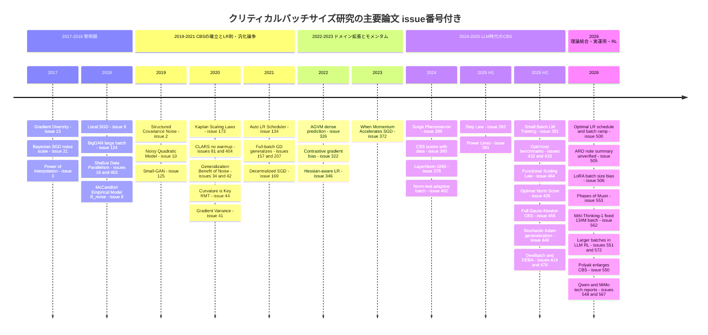

# クリティカルバッチサイズ（Critical Batch Size）・大バッチ学習・勾配ノイズスケール・バッチサイズ／学習率スケーリング則 サーベイ

> 本稿は [Hiroki11x/Papers](https://github.com/Hiroki11x/Papers/issues) の論文読みノート（GitHub issues）のうち、クリティカルバッチサイズ（CBS）関連として分類された **61件の issue**（重複登録を含む。ユニーク論文としては56本）を再構成したサーベイである。各論文の記述はノート（issue本文・コメント）に基づいており、数値はノートに記載されたものだけを引用している。

## 概要

- **対象**: 61 issue（重複5組: [#34](https://github.com/Hiroki11x/Papers/issues/34)=[#42](https://github.com/Hiroki11x/Papers/issues/42)、[#157](https://github.com/Hiroki11x/Papers/issues/157)=[#207](https://github.com/Hiroki11x/Papers/issues/207)、[#16](https://github.com/Hiroki11x/Papers/issues/16)=[#403](https://github.com/Hiroki11x/Papers/issues/403)、[#81](https://github.com/Hiroki11x/Papers/issues/81)=[#404](https://github.com/Hiroki11x/Papers/issues/404)（AAAI版とarXiv版）、[#551](https://github.com/Hiroki11x/Papers/issues/551)=[#572](https://github.com/Hiroki11x/Papers/issues/572)）
- **期間**: 論文の初出は 2017年6月（Gradient Diversity）〜 2026年9月（Polyak/Nesterov とCBS）。issue登録は 2020年5月〜2026年9月。
- **この分野の問い**:
  1. バッチサイズ $B$ を大きくすると、どこまで「ステップ数が $1/B$ に減る」完全スケーリングが続くのか（= クリティカルバッチサイズはどこか）。
  2. その境界は何で決まるのか——勾配ノイズ（$B_\text{noise}$）、目標損失 $L$、データ量 $D$、モデルサイズ $N$、オプティマイザ、アーキテクチャのどれか。
  3. バッチサイズを変えたとき学習率・モメンタム・$\beta_2$・weight decay をどう変えるべきか（線形則・平方根則・サージ現象）。
  4. 大バッチは汎化を損なうのか、それはチューニング不足の産物なのか。
  5. 学習中にバッチサイズを変える（バッチランプ／適応的バッチ）べきか。LLM事前学習・RLの実運用ではどうしているか。

## 目次

1. [背景と基本概念](#1-背景と基本概念)
2. [研究の系譜・時系列](#2-研究の系譜時系列)
3. [タイムライン図](#3-タイムライン図)
4. [サブトピック別の整理](#4-サブトピック別の整理)
5. [論文一覧表（公開順）](#5-論文一覧表公開順)
6. [採択先（ベニュー）別の集計](#6-採択先ベニュー別の集計)
7. [各論文の詳細まとめ](#7-各論文の詳細まとめ)
8. [横断的な知見・未解決問題](#8-横断的な知見未解決問題)
9. [関連論文](#9-関連論文)

---

## 1. 背景と基本概念

### 1.1 クリティカルバッチサイズ（CBS）とは

ミニバッチSGD系の学習では、バッチサイズ $B$ を2倍にすると1ステップで使う勾配の推定精度が上がり、目標損失に到達するまでのステップ数 $S$ が減る。バッチサイズを増やしていくと、多くのワークロードで次の3領域が観察される（Shallue et al. [#16](https://github.com/Hiroki11x/Papers/issues/16) / [#403](https://github.com/Hiroki11x/Papers/issues/403)）。

| 領域 | 挙動 | 意味 |
|---|---|---|
| 完全スケーリング（perfect scaling） | $B$ を $k$ 倍 → $S$ が約 $1/k$ | 計算量（サンプル数 $E = BS$）を増やさずに壁時計時間を短縮できる |
| 収穫逓減（diminishing returns） | $S$ の減り方が $1/k$ より鈍い | 時間短縮と引き換えにサンプル効率が悪化 |
| 最大データ並列（scaling stops） | $S$ がほぼ減らない | 追加計算は無駄になる |

**クリティカルバッチサイズ（CBS, $B_\text{crit}$）** はおおむね「完全スケーリングから収穫逓減へ移る境界」を指す。ただし定義は論文によって異なる。

- **McCandlish et al.（[#8](https://github.com/Hiroki11x/Papers/issues/8)）**: ステップ数とサンプル数のトレードオフ
  $$\left(\frac{S}{S_\text{min}} - 1\right)\left(\frac{E}{E_\text{min}} - 1\right) = 1$$
  を経験的にフィットし、$B_\text{crit} = E_\text{min}/S_\text{min}$ とする。このとき $B=B_\text{crit}$ ではステップ数・サンプル数ともに最小値の2倍になる。Power Lines（[#391](https://github.com/Hiroki11x/Papers/issues/391)）もこの定義（必要データ量が $2D_\text{min}$ になるバッチ）を採用。
- **Zhang et al.（[#390](https://github.com/Hiroki11x/Papers/issues/390)）**: 線形スケーリングの理想曲線から **20% のオーバーヘッド** が生じる点を $B^*$ とする。
- **Ma, Bassily, Belkin（[#3](https://github.com/Hiroki11x/Papers/issues/3)）**: 補間領域の理論で、1反復あたりの進捗が $m$ に線形に増えるのをやめる臨界ミニバッチサイズ $m^*$。
- **Wang et al.（[#550](https://github.com/Hiroki11x/Papers/issues/550)）**: 小バッチと同等のデータ効率を保てる最大バッチ。
- **Yin et al.（[#13](https://github.com/Hiroki11x/Papers/issues/13)）**: 収束を悪化させずに使える最大バッチサイズが「勾配多様性」に比例する、という形での上限。

なお「**最適バッチサイズ $B_\text{opt}$**」は別概念で、固定の $N, D$ の下で最終損失を最小にするバッチである（[#391](https://github.com/Hiroki11x/Papers/issues/391)、[#382](https://github.com/Hiroki11x/Papers/issues/382)）。CBS が「時間と計算のトレードオフ」の指標なのに対し、$B_\text{opt}$ は「損失」の指標である。

### 1.2 勾配ノイズスケール（B_noise と B_simple）

McCandlish et al.（[#8](https://github.com/Hiroki11x/Papers/issues/8)）は、真の勾配 $G$、サンプル勾配の共分散 $\Sigma$、ヘシアン $H$ を使って損失の二次近似から最適ステップを求めた。

$$\epsilon_\text{opt}(B) = \frac{\epsilon_\text{max}}{1 + B_\text{noise}/B},\qquad
\Delta L_\text{opt}(B) = \frac{\Delta L_\text{max}}{1 + B_\text{noise}/B},\qquad
B_\text{noise} = \frac{\operatorname{tr}(H\Sigma)}{G^\top H G}$$

- $B \ll B_\text{noise}$ では分母の第2項が支配的になり、$B$ を増やすと1ステップの進捗が線形に増える（小バッチ領域）。$B$ に比例して学習率も上げられる。
- $B \gg B_\text{noise}$ では進捗が飽和し、学習率も上げられない（大バッチ領域）。$B = B_\text{noise}$ で速度は最大値の50%になる。
- $H$ を単位行列とみなした簡易版 $B_\text{simple} = \operatorname{tr}(\Sigma)/|G|^2$ は計算が安い。ノートによれば、条件数が改善される訓練（BNや二次最適化などが想定される）では $B_\text{simple}$ と $B_\text{noise}$ は定数倍程度しか違わず、論文の実験の大半は $B_\text{simple}$ で代替している。
- 予測は $B_\text{crit} \approx B_\text{noise}$（訓練全体で適切に平均したもの）。ノイズスケールは訓練中に大きく変化し、**目標損失が低いほど $B_\text{crit}$ が大きい**。
- ノイズスケールの定義は訓練データ全体のサイズに依存しない（ノート上の本人メモ）。

後続研究はこの量をさまざまな形で推定・再解釈している。

- Transformer では **LayerNorm 層のサンプル毎勾配だけで全体の GNS を相関0.99以上で予測できる**（[#378](https://github.com/Hiroki11x/Papers/issues/378)）。
- Adam 系では $B_\text{noise}$ を
  $$B_\text{noise}^{\text{Adam}} = \frac{\pi \sum_k H_{k,k}}{2\sum_{i\neq j} \frac{\mu_i\mu_j}{\sigma_i\sigma_j} H_{i,j}}$$
  と書くが、直接測れないためフィッティングで推定する（[#389](https://github.com/Hiroki11x/Papers/issues/389)）。
- GNS の代わりに **ノルムテスト**
  $$\frac{1}{b}\sum_{i\in\mathcal{B}} \|\nabla \ell_i(w) - \nabla \mathcal{L}_\mathcal{B}(w)\|^2 \le \eta^2 \|\nabla \mathcal{L}_\mathcal{B}(w)\|^2$$
  が破れたらバッチを増やす（[#402](https://github.com/Hiroki11x/Papers/issues/402)）。
- 勾配多様性 $\Delta(\theta)$（[#13](https://github.com/Hiroki11x/Papers/issues/13)、[#414](https://github.com/Hiroki11x/Papers/issues/414)）や正規化勾配分散（[#41](https://github.com/Hiroki11x/Papers/issues/41)）など、GNS と近い「信号対雑音」系の統計量も使われる。

### 1.3 SGD のノイズスケールと SDE 近似

Smith & Le（[#21](https://github.com/Hiroki11x/Papers/issues/21)）は SGD を確率微分方程式（ランジュバン方程式）とみなし、ノイズの大きさが

$$g = \epsilon\left(\frac{N}{B} - 1\right) \approx \frac{\epsilon N}{B}\quad(B \ll N)$$

（$\epsilon$: 学習率、$N$: 訓練データ数）で決まるとした。汎化を決めるのは $g$ なので、$g$ を一定に保てば **$B_\text{opt} \propto \epsilon N$**、つまり学習率を $B$ に比例させる線形スケーリング則が導かれる。Smith, Elsen, De（[#42](https://github.com/Hiroki11x/Papers/issues/42)）はこれを発展させ、小バッチの「ノイズ支配領域」と大バッチの「曲率支配領域」という2レジームを整理した。この2レジームの区別は後に Functional Scaling Law（[#464](https://github.com/Hiroki11x/Papers/issues/464)）でも中心的な構図として現れる（ARO [#505](https://github.com/Hiroki11x/Papers/issues/505) のノート要約にも同じ構図が出てくるが、要約と論文題名の対応に疑義がある。[§2.7](#27-2026-理論的統合実運用rlのバッチ) 参照）。

SDE 系の理論は 2025–2026年に再び存在感を増している。

- **Functional Scaling Law（[#464](https://github.com/Hiroki11x/Papers/issues/464)）**: オンライン SGD を内在時間の SDE として書き、ノイズ項が $\eta/B$ に依存する形から、定数学習率での線形スケーリング則を導く。
  $$E_K \sim M^{-s\beta} + (\eta K)^{-s} + \frac{\eta}{B}\left(\sigma^2 + (\eta K)^{-(2-1/\beta)}\right)$$
- **三峰性マスク拡散モデル（[#514](https://github.com/Hiroki11x/Papers/issues/514)）**: SDE に基づくハイパーパラメータの再パラメータ化で、バッチサイズを変えても再チューニングが不要になるようにしている。

### 1.4 学習率スケーリング則: 線形・平方根・サージ

| 規則 | 形 | 主な根拠（本稿の対象内） | 成立条件・注意 |
|---|---|---|---|
| 線形スケーリング | $\eta \propto B$ | SDE ノイズスケール（[#21](https://github.com/Hiroki11x/Papers/issues/21)）、RMT（SGD）（[#44](https://github.com/Hiroki11x/Papers/issues/44)）、FSL（[#464](https://github.com/Hiroki11x/Papers/issues/464)）、CLARS による理論的解釈（[#81](https://github.com/Hiroki11x/Papers/issues/81)/[#404](https://github.com/Hiroki11x/Papers/issues/404)） | $B \ll B_\text{noise}$ の範囲に限る。Shallue et al. は「一般には成立せず、バッチごとの再調整が必要」とする（[#403](https://github.com/Hiroki11x/Papers/issues/403)） |
| 平方根スケーリング | $\eta \propto \sqrt{B}$ | 適応的手法（小LR・小ダンピング）（[#44](https://github.com/Hiroki11x/Papers/issues/44)）、Adam の $\sqrt{B}$ 則（[#419](https://github.com/Hiroki11x/Papers/issues/419)、[#572](https://github.com/Hiroki11x/Papers/issues/572)）、Scion で $\eta^* \propto B^{0.62}$（[#435](https://github.com/Hiroki11x/Papers/issues/435)） | 小〜中バッチでのみ成立し、大バッチでは崩れる（[#389](https://github.com/Hiroki11x/Papers/issues/389)、[#419](https://github.com/Hiroki11x/Papers/issues/419)） |
| サージ現象 | $\epsilon_\text{opt}(B) = \dfrac{\epsilon_\text{max}}{\frac{1}{2}\left(\sqrt{B_\text{noise}/B} + \sqrt{B/B_\text{noise}}\right)}$ | Adam の符号降下近似＋二次近似（[#389](https://github.com/Hiroki11x/Papers/issues/389)） | $B = B_\text{noise}$ で最適LRが最大になり、その後は下がる。LoRA でも「増加後に減少」が観察される（[#506](https://github.com/Hiroki11x/Papers/issues/506)） |

関連する派生則もある。

- **2次法のダンピング**: 最小ダンピング係数は $\eta/B$ に比例する（[#44](https://github.com/Hiroki11x/Papers/issues/44)）。
- **Adam の $\beta_2$**: 勾配の「半減期」をトークン数で一定に保つようにスケーリングする（[#381](https://github.com/Hiroki11x/Papers/issues/381)）。直観的には、$\beta_2^{\,t} = 1/2$ となるステップ数 $t$ にバッチ当たりトークン数を掛けた値を固定する。
- **AdamW のタイムスケール**: $T_\text{EMA} = B/(\eta\lambda D)$ がトークン/パラメータ比のべき乗則 $T_\text{EMA} \propto \text{TPP}^{-0.527}$ に従う（[#391](https://github.com/Hiroki11x/Papers/issues/391)）。

### 1.5 CBS の「何に依存するか」— 3つの見方

| 見方 | 主張 | 代表 |
|---|---|---|
| **損失依存** | $B_\text{crit}$ は目標損失 $L$ のみで決まり、損失が下がるほど大きい。Kaplan らは $B_\text{crit}(L) \approx B_*/L^{1/\alpha_B}$（$\alpha_B \approx 0.21$）とした | [#8](https://github.com/Hiroki11x/Papers/issues/8)、[#173](https://github.com/Hiroki11x/Papers/issues/173)、[#389](https://github.com/Hiroki11x/Papers/issues/389)（$B_\text{noise}$ は学習の進行とともに増える） |
| **データ量依存** | $N$ と $D$ を分離すると、CBS・$B_\text{opt}$ は主に $D$ でスケールし、$N$ にはほぼ依存しない | [#390](https://github.com/Hiroki11x/Papers/issues/390)、[#391](https://github.com/Hiroki11x/Papers/issues/391)（$B_\text{opt} \propto D^{0.383}$、$B_\text{crit} \propto D_\text{min}^{0.462}$）、[#382](https://github.com/Hiroki11x/Papers/issues/382)、[#435](https://github.com/Hiroki11x/Papers/issues/435)（$B^* \propto D^{0.45}$）、[#506](https://github.com/Hiroki11x/Papers/issues/506)（LoRA） |
| **ワークロード依存** | 上限はモデル（アーキテクチャ）・オプティマイザに強く依存する | [#16](https://github.com/Hiroki11x/Papers/issues/16)/[#403](https://github.com/Hiroki11x/Papers/issues/403)、[#10](https://github.com/Hiroki11x/Papers/issues/10)、[#456](https://github.com/Hiroki11x/Papers/issues/456)、[#478](https://github.com/Hiroki11x/Papers/issues/478) |

これら3つは必ずしも矛盾しない。同一アーキテクチャ族の LLM で $N, D$ を振れば $D$ 依存が支配的に見える。損失 $L$ 自体が $D$ の関数なので、損失依存はデータ量依存の「射影」とも読める。一方、アーキテクチャやオプティマイザを変えると同じ $D$ でも CBS は大きく動く。詳しくは[§8](#8-横断的な知見未解決問題)で議論する。

---

## 2. 研究の系譜・時系列

以下では実データの公開時期に合わせて6つの時代に区切り、どの論文がどの問いを引き継いだかを追う。

### 2.1 2017–2018: 大バッチ学習の黎明期 ——「バッチの上限」と「SGDノイズの役割」

この時期の問いは、**分散学習でどこまでバッチを大きくできるか**と、**大バッチはなぜ汎化しにくいのか**の2つである。

- **Gradient Diversity（[#13](https://github.com/Hiroki11x/Papers/issues/13)、2017-06, AISTATS 2018）**: サンプル勾配の非類似度（勾配多様性）を定義し、許容バッチサイズがそれに比例することを理論的に示した。「バッチ上限はデータの勾配構造で決まる」という視点の出発点で、2025年の DiveBatch（[#414](https://github.com/Hiroki11x/Papers/issues/414)）がこれを適応的バッチの基準として直接継承する。
- **A Bayesian Perspective（[#21](https://github.com/Hiroki11x/Papers/issues/21)、2017-10, ICLR 2018）**: SGD を SDE とみなし、ノイズスケール $g \approx \epsilon N/B$ が汎化を決め、$B_\text{opt} \propto \epsilon N$ という線形則を導いた。**CBS の SDE 的系譜**の起点である。
- **The Power of Interpolation（[#3](https://github.com/Hiroki11x/Papers/issues/3)、2017-12, ICML 2018）**: 過剰パラメータ化で訓練データを補間できる設定では SGD が指数収束し、臨界ミニバッチサイズ $m^*$ までは線形スケーリング、以降は飽和することを定理として示した。$m^*$ はカーネル/ヘシアンのスペクトルで決まり、**データセットサイズにほぼ依存しない**。この点で、$B_\text{opt}\propto N$ とする [#21](https://github.com/Hiroki11x/Papers/issues/21) と好対照をなす。本人は定理1の $\eta^*$（式(6)以降）の精読を課題に挙げている。
- **Local SGD（[#9](https://github.com/Hiroki11x/Papers/issues/9)、2018-08, ICLR 2020）**: 大バッチを避け、局所ステップをノイズ注入として使う（Post-local SGD）ことで汎化を改善した。本人は「ほとんど SWAP と同じ」とコメント。
- **BigGAN（[#124](https://github.com/Hiroki11x/Papers/issues/124)、2018-09, ICLR 2019）**: 分類とは逆に、**GAN では大バッチが性能を上げる**（バッチ8倍でIS大幅向上）という事例。ただし不安定化も招く。

### 2.2 2018–2019: 勾配ノイズスケールとCBSの確立 ——「3領域」と「$B_\text{crit}\approx B_\text{noise}$」

2018年末に、この分野の2本柱が同時に出る。

- **Shallue et al.「Measuring the Effects of Data Parallelism」（[#16](https://github.com/Hiroki11x/Papers/issues/16) / [#403](https://github.com/Hiroki11x/Papers/issues/403)、2018-11, JMLR）**: 35ワークロード・約16.8万モデル（ノートでは 168,160 モデル、71,638,836 の loss 計測値）という大規模実験で、「完全スケーリング → 収穫逓減 → 飽和」の3領域が普遍的に現れることを示した。境界はモデル・オプティマイザに強く依存し、モメンタムで完全スケーリング領域が伸びる。線形LRスケーリング則は一般には成立しない。さらに、**適切にチューニングすれば大バッチでも汎化は劣化しない**とし、「大バッチは汎化を悪化させる」という通説をメタパラメータ調整と計算予算の問題として整理した。step予算なら大バッチ、epoch予算なら小バッチが有利になる。
- **McCandlish et al.「An Empirical Model of Large-Batch Training」（[#8](https://github.com/Hiroki11x/Papers/issues/8)、2018-12, arXiv）**: $B_\text{noise}$ が CBS を予測するというモデルを提案した（§1.2 参照）。本人はノートで「$B_\text{noise}$ は小規模でしか計算されず大半は $B_\text{simple}$ で代替されている。対角近似などの $B_\text{noise}$ 近似の有効性を調べるのは良い研究ネタ」と、明確な研究課題を立てている。

2本の関係は「**Shallue が現象を測り、McCandlish がそれを1つの統計量で説明した**」と要約できる。Shallue の問い（なぜ上限がワークロード依存なのか）に理論側から答えたのが次の NQM である。

- **NQM（[#10](https://github.com/Hiroki11x/Papers/issues/10)、2019-07, NeurIPS 2019）**: ノイズ付き二次モデルで、前処理（Adam, K-FAC）が CBS を拡大すること、モメンタムは大バッチでのみ効くことを示し、Shallue の大規模実験の傾向を再現した。本人は「Shallue+ のアップデートで、共著にも入っている」と指摘。この「**オプティマイザが CBS を決める**」という問いは、2025–2026年の Gauss-Newton（[#456](https://github.com/Hiroki11x/Papers/issues/456)）、Polyak/Nesterov（[#550](https://github.com/Hiroki11x/Papers/issues/550)）、Muon 系（[#553](https://github.com/Hiroki11x/Papers/issues/553) はバッチサイズ領域による Muon と SignSGD の優劣を理論的に示し、[#567](https://github.com/Hiroki11x/Papers/issues/567) は大バッチ RL での Muon 系採用を報告）に引き継がれる。
- **構造化共分散ノイズ（[#2](https://github.com/Hiroki11x/Papers/issues/2)、2019-02, AISTATS 2020）**: 大バッチに Fisher 構造のノイズを足すと小バッチ並みの汎化が戻る。本人は [#8](https://github.com/Hiroki11x/Papers/issues/8) の研究ネタ（$B_\text{noise}$ 近似の検証）の論文体裁の参考として [#2](https://github.com/Hiroki11x/Papers/issues/2) を挙げている。
- **Small-GAN（[#125](https://github.com/Hiroki11x/Papers/issues/125)、2019-10, ICML 2020）**: BigGAN の「大バッチが効く」を受け、コアセット選択で「実効的な大バッチ」を小バッチで作った。

### 2.3 2020–2021: スケーリング則・LRスケーリング則・汎化論争

この時期、問いは3方向に分岐する。

**(a) スケーリング則への組み込み。** **Kaplan et al.「Scaling Laws for Neural Language Models」（[#173](https://github.com/Hiroki11x/Papers/issues/173)、2020-01）** は [#8](https://github.com/Hiroki11x/Papers/issues/8) と同じ著者によるスケーリング則の最初の論文で、CBS が**損失のみに依存**し $L^{-1/0.21}$ 程度で増えるとした。これが「CBS は損失の関数」という見方を LLM 文脈に定着させた。本人は Adafactor でモメンタム項に半精度を使っている点に注目している。2024年以降、この「損失依存」は「データ量依存」へと書き換えられていく（§2.5 参照）。

**(b) LR とバッチの関係を理論化する。**

- **Curvature is Key（[#44](https://github.com/Hiroki11x/Papers/issues/44)、2020-06, JMLR）**: スパイク付きランダム行列理論で、バッチヘシアンの極値固有値が経験ヘシアンより大きいことを示し、最大LRを $B$ の関数として導いた。SGD では線形、適応手法では平方根、2次法のダンピングは $\eta/B$ に比例する。本人は「ランダム行列の話なので少し難しめ」とコメント。
- **Oja のアルゴリズム（[#37](https://github.com/Hiroki11x/Papers/issues/37)、2020-06, IEEE Access）**: 主固有ベクトル推定という単純な設定で、ミニバッチの有効学習率がバッチ依存の因子で減衰することを示した。
- **CLARS（[#81](https://github.com/Hiroki11x/Papers/issues/81) / [#404](https://github.com/Hiroki11x/Papers/issues/404)、2020-02, AAAI 2021）**: LARS を改良し、線形LRスケーリング・段階的ウォームアップ・層別適応率スケーリングに理論的解釈を与えた。ウォームアップが必要な理由を「初期の上層勾配分散因子の小ささ」で説明している。本人は「AAAI 版は arXiv 版より改善されており、理論部分が採択の鍵。理論なしでは実験が弱く通らなかった」と評価している。
- **Adaptive optimal batch（[#20](https://github.com/Hiroki11x/Papers/issues/20)、2020-05, NeurIPS 2020 OPT）**: Qian et al. (2019) の最適ミニバッチ式は最適点での勾配分散に依存して実用的でないため、反復ごとの適応推定に置き換えた。

**(c) 大バッチの汎化論争。** Shallue（[#403](https://github.com/Hiroki11x/Papers/issues/403)）の「チューニングすれば汎化は劣化しない」に対し、反論と再反論が続く。

- **On the Generalization Benefit of Noise in SGD（[#42](https://github.com/Hiroki11x/Papers/issues/42) / [#34](https://github.com/Hiroki11x/Papers/issues/34)、2020-06, ICML 2020）**: 厳密なハイパラ探索の上でも、**同じ反復数で大バッチの方が訓練損失が低い場合でさえ**、小〜中バッチがテスト性能で大きく上回ることを示した。Shallue の主張に真っ向から反論する内容である。小バッチの「ノイズ支配領域」（汎化は良いが収束が遅い）と大バッチの「曲率支配領域」（収束は速いが汎化しない）を整理した。
  - 本人のコメントはこの分野に対する研究者自身の立ち位置を示していて重要である。「大バッチ学習は大組織でないとできない」という論文の主張は**勾配蓄積で1GPUでも可能なので不適切**と批判している。さらに、2次最適化は反復ごとの曲率計算・逆行列計算がボトルネックなので、大バッチで反復数を削れば1GPUでも計算時間的に得をすると指摘する。そのうえで「大バッチ×2次最適化の『汎化しない』問題の解決が重要」「2次最適化が flat な領域から速く抜け出す性質が汎化を悪化させているか確かめられれば指針になる」と述べている。
- **勾配分散の研究（[#41](https://github.com/Hiroki11x/Papers/issues/41)、2020-07）**: 一般的な仮定に反し、**学習中に勾配分散が増加し、学習率が小さいほど分散が大きい**と観察した。本人は「まじか」と驚いている。GNS が学習中に増える（[#8](https://github.com/Hiroki11x/Papers/issues/8)）こととも関連する観察である。
- **Extrapolation（[#36](https://github.com/Hiroki11x/Papers/issues/36)、2020-06, ICML 2020）**: 外挿（extragradient）で最適化軌道を安定化しつつシャープな解を避ける。[#9](https://github.com/Hiroki11x/Papers/issues/9) と同じ EPFL のグループ。
- **Stochastic Training is Not Necessary（[#157](https://github.com/Hiroki11x/Papers/issues/157) / [#207](https://github.com/Hiroki11x/Papers/issues/207)、2021-09, ICLR 2022）**: 論争の逆側の極として、**フルバッチGD＋明示的正則化でも CIFAR-10 で SGD 並みの汎化**が得られることを示した。「フルバッチが難しいのは最適化特性と、小バッチ向けにチューニングが偏ってきたため」と主張する。
- **DPSGD（[#169](https://github.com/Hiroki11x/Papers/issues/169)、2021-12）**: 分散型並列SGDのランドスケープ依存ノイズが実効学習率を自動調整し、大LRで SSGD が発散する場面でも収束する。本人は「LAMB に勝っているのか？」と疑問を呈している。
- **自動LRスケジューラ（[#134](https://github.com/Hiroki11x/Papers/issues/134)、2021-07, ICML 2021 AutoML WS）**: 大バッチ向けに適応的ウォームアップと減衰を組み合わせた。本人の評価は「思いつき感があり理論もないのにワークショップに通るのか」と辛口である。

### 2.4 2022–2023: ドメイン拡張とモメンタム ——「なぜそのタスクは大バッチを要するのか」

分類以外のタスクで大バッチが必要／不利になる理由を問う研究が並ぶ。

- **対照学習（[#322](https://github.com/Hiroki11x/Papers/issues/322)、NeurIPS 2022）**: 対照損失はミニバッチ内の負例しか使わない非分解性のため勾配バイアスが生じ、それが大バッチを必要とする理由になる。ベイズ的データ拡張で分解可能にし、約半分のバッチで MoCo-v3 を上回った。
- **密予測（[#326](https://github.com/Hiroki11x/Papers/issues/326)、2022-10, NeurIPS 2022）**: 検出・セグメンテーションの大バッチ失敗は、バックボーン・FPN・ヘッド間の**モジュール間勾配分散の不整合**が主因だとした。AGVM で Faster R-CNN を4分、10億パラメータ検出器を3.5時間で学習した。
- **Hessian-aware LR（[#346](https://github.com/Hiroki11x/Papers/issues/346)、Neural Networks）**: ResNet20/CIFAR-10 でバッチ16,384で92.31%（バッチ128は92.83%）。本人は「SAM と被っている気がする」とコメント。
- **ニアランク損失（[#313](https://github.com/Hiroki11x/Papers/issues/313)）**: 学習率スケーリングや学習予算増では汎化ギャップが完全には解消しないとし、活性テンソルのニアランク損失という新しい説明を提示した。[#403](https://github.com/Hiroki11x/Papers/issues/403) の「チューニングで解消」とは逆の立場である。
- **モメンタムはいつ効くか（[#372](https://github.com/Hiroki11x/Papers/issues/372)、2023-06）**: 有効学習率 $\eta_\text{ef}$ で統一比較すると、SGDM の優位は $\eta_\text{ef}$ が閾値を超えたときに現れ、**大バッチほど顕著**になる。原因はモメンタムが急激なシャープニングを抑えることである。[#10](https://github.com/Hiroki11x/Papers/issues/10)（モメンタムは大バッチでのみ効果）、[#403](https://github.com/Hiroki11x/Papers/issues/403)（モメンタムで完全スケーリング領域が伸びる）と整合し、後の [#550](https://github.com/Hiroki11x/Papers/issues/550)（Polyak が CBS を拡大）へつながる。

### 2.5 2024–2025年7月: LLM時代のCBS —— 「CBSはデータ量でスケールする」

LLM 事前学習の計算最適化が主戦場になり、[#173](https://github.com/Hiroki11x/Papers/issues/173) の「CBS は損失の関数」が再検証される。

- **Surge Phenomenon（[#389](https://github.com/Hiroki11x/Papers/issues/389)、2024-05, NeurIPS 2024）**: Adam 系では最適LRがバッチに対して単調増加せず、$B_\text{noise}$ でピークに達して下降する。$B_\text{noise}$ は学習の進行とともに大きくなり、平方根則は小バッチでのみ成立する。McCandlish の $\epsilon_\text{opt}(B)$ の Adam 版として位置づけられる。本人は「Adam の $B_\text{noise}$ はフィッティング推定なのでオンラインで求めるのは難しい」と実用上の限界を指摘している。
- **How Does CBS Scale in Pre-training?（[#390](https://github.com/Hiroki11x/Papers/issues/390)、2024-10, ICLR 2025）**: 85M〜1.2B のモデルで $N$ と $D$ の影響を**制御実験で初めて分離**した。Chinchilla 設定では CBS が増えるが、$D$ 固定で $N$ を変えても CBS はほぼ不変、$N$ 固定で $D$ を増やすと CBS は顕著に増える。結論は「**CBS は主にデータサイズに依存し、モデルサイズにはほとんど依存しない**」で、無限幅理論と最小二乗回帰の解析で裏付けた。
- **Normalization-layer GNS（[#378](https://github.com/Hiroki11x/Papers/issues/378)、2024-11, NeurIPS 2024）**: GNS 測定のコスト問題を解消した（LayerNorm だけで全体GNSを予測、ゼロオーバーヘッドカーネル、GNS に基づく動的バッチで学習を高速化）。[#8](https://github.com/Hiroki11x/Papers/issues/8) の「$B_\text{noise}$ を安く測りたい」という課題への実用的な回答である。
- **ノルムテストによる適応バッチ（[#402](https://github.com/Hiroki11x/Papers/issues/402)、2024-12, CPAL 2025）**: GNS 推定ではなくノルムテストで逐次バッチを増やし、DDP/FSDP に実装した。MicroLlama-300M〜OpenLlama-3B で固定バッチより低い検証損失を達成し、ヒューリスティックなバッチウォームアップと同等以上。Adam への収束保証も与えた。
- **重点サンプリングと実効ミニバッチサイズ（[#392](https://github.com/Hiroki11x/Papers/issues/392)、2025-01, SIAM Journal on Mathematics of Data Science）**: IS の分散低減を「実効ミニバッチサイズの増加」と等価とみなし、それに応じて LR を自動スケーリングする。分散低減＝実効バッチ拡大という GNS 的見方の応用である。
- **Step Law（[#382](https://github.com/Hiroki11x/Papers/issues/382)、2025-03）**: 3700以上の条件・約100万 H800 GPU時間。損失は LR・BS に対して凸で、最適 LR は $N$ と $D$ の両方に、**最適 BS は主に $D$ に**依存する。本人は「バッチ固定で BS ごとに LR を大量に調べた研究であり、スケジュールは warmup＋コサイン減衰の固定最終学習率」とメモしており、バッチスケジュールを扱っていない点を押さえている。
- **Power Lines（[#391](https://github.com/Hiroki11x/Papers/issues/391)、2025-05, NeurIPS 2025）**: 約400実験（111M〜3.3B、µP）。$B_\text{opt} \propto D^{0.383}$、$B_\text{crit} \propto D_\text{min}^{0.462}$ がモデルサイズによらず成立するとした。従来 $B_\text{opt}$/$B_\text{crit}$ は計算量 $C$ や損失 $L$ に依存するとされてきたが、根本的には $D$ に依存する、と**明示的に [#173](https://github.com/Hiroki11x/Papers/issues/173) の見方を更新**している。LR減衰下でも使える $B_\text{crit}$ 推定法を提案し、時間優先なら「小さいモデルを多くのデータで学習する方が速い」というパレート上の結論も導いた。
- **Small Batch Size Training（[#381](https://github.com/Hiroki11x/Papers/issues/381)、2025-07, NeurIPS 2025）**: 逆方向から、バッチサイズ1まで含む**小バッチの方がFLOPあたり同等以上でハイパラに頑健**であり、小バッチでは Vanilla SGD でも十分と示した。$\beta_2$ をトークン半減期一定でスケーリングする規則を提案し、**勾配蓄積はほとんどの場合不要**と結論する。これは本人が [#42](https://github.com/Hiroki11x/Papers/issues/42) で述べた「勾配蓄積で1GPUでも大バッチができる」という視点に対して、「そもそも勾配蓄積してまで大バッチにする価値は少ない」という反対側の答えになっている。

### 2.6 2025年8月–12月: オプティマイザ×バッチサイズ ——「CBS はオプティマイザで動く」

Muon/SOAP 等の行列オプティマイザの台頭とともに、NQM（[#10](https://github.com/Hiroki11x/Papers/issues/10)）の問いが LLM スケールで再燃する。

- **オプティマイザ・ベンチマークの食い違い**:
  - **Fantastic Pretraining Optimizers（[#432](https://github.com/Hiroki11x/Papers/issues/432)）** は、既報の「2倍速」は主にベースラインの過小チューニングによるもので、行列系の高速化は0.1Bで約1.4倍、1.2Bで約1.1倍に減衰するとした。
  - **Benchmarking Optimizers（[#433](https://github.com/Hiroki11x/Papers/issues/433)）** は、順位がバッチサイズで入れ替わる（小バッチでは D-Muon/SOAP、大バッチでは Signum・MARS・Lion が伸びる）ことを示し、大規模設定では AdEMAMix と MARS が最良とした。
  - [#432](https://github.com/Hiroki11x/Papers/issues/432) の著者は関連研究の節でこの食い違いを「**主にバッチサイズの差**（[#432](https://github.com/Hiroki11x/Papers/issues/432) は 0.4M トークン以上、[#433](https://github.com/Hiroki11x/Papers/issues/433) の最も詳細にチューニングされた 130M 実験は 0.02〜0.1M）による」と説明しており、ノートにはこの議論が転記されている。[#433](https://github.com/Hiroki11x/Papers/issues/433) の 720M・1M トークンバッチの実験は設定が近いが、LR スイープ範囲が異なる（4e-3〜8e-3 vs 1e-3〜2e-3）とも述べている。分散低減型（MARS, AdEMAMix）はノイズの大きい小バッチで利点があり、大バッチでは行列型（Muon）が優位になる、という解釈である。**「オプティマイザの優劣はバッチサイズ（=ノイズ領域）込みでしか語れない」**ことを示す好例になっている。
- **Full Gauss-Newton（[#456](https://github.com/Hiroki11x/Papers/issues/456)）**: 45M/150M モデルで、目標損失3.25到達ステップは GN 54 / SOAP 292 / Muon 864。AdamW・Muon は約12Mトークンのバッチで頭打ちになる一方、GN は40Mでも改善が続く（**CBS の大幅拡大**）。[#390](https://github.com/Hiroki11x/Papers/issues/390) と同じ Harvard グループ（Vyas, Kakade, Morwani）で、「CBS はデータで決まる」と「CBS はオプティマイザで動く」の両面を同じグループが示している点が興味深い。
- **FOP（[#401](https://github.com/Hiroki11x/Papers/issues/401)、AAAI 2026）**: 大バッチでは KFAC の Fisher が劣条件化して強いダンピングが必要になり、曲率の利点が消える。そこで2サブバッチの差分勾配を Fisher 直交射影して活用し、バッチ50,000の CIFAR-10 でも最速で目標精度に達した。本人が [#42](https://github.com/Hiroki11x/Papers/issues/42) で重要と述べた「大バッチ×2次最適化」の方向に連なる研究である。
- **ALTO（[#461](https://github.com/Hiroki11x/Papers/issues/461)、NeurIPS 2025）**: LAMB に勾配差分 EMA を加えて谷沿いに平坦な極小値を探索する。大バッチでは $\beta_1$ 大・$\alpha$ 負が有効だった。
- **Per-example gradients（[#419](https://github.com/Hiroki11x/Papers/issues/419)）**: サンプル毎勾配統計を低オーバーヘッドで計算し、$\eta\propto\sqrt{B}$ 則が「分散支配」でなく「平均二乗支配」の下でも成立すること、小〜中バッチで普遍曲線を与えるが大バッチでは崩れることを示した。
- **Optimal Norm（[#435](https://github.com/Hiroki11x/Papers/issues/435)）**: Scion で出力層ノルムが最適 $(\eta,B)$ で一定（約 $2^7$）になる「ノルム転移」を発見した。$B^*(D)\propto D^{0.45}$、$\eta^*\propto B^{0.62}D^{-0.56}$ で、**データ依存・平方根則の知見が Adam 以外にも拡張**された。本人は「動的なバッチサイズ（スケジュール）は試されていない」とメモ。
- **Functional Scaling Law（[#464](https://github.com/Hiroki11x/Papers/issues/464)、NeurIPS 2025）**: SDE で LR スケジュールとバッチを同時に扱い、定数LRで線形則、スケジュール効率は WSD > 指数減衰 > 定数であることを示した。
- **確率的 Adam の汎化理論（[#449](https://github.com/Hiroki11x/Papers/issues/449)、NeurIPS 2025）**: 2層CNN の特徴学習/ノイズ記憶の枠組みで、**大バッチ Adam/AdamW はノイズ記憶で汎化に失敗**（テスト誤差≈50%）し、ミニバッチでは勾配ノイズが暗黙的正則化になることを証明した。[#42](https://github.com/Hiroki11x/Papers/issues/42) の「ノイズが汎化を促進する」を Adam に拡張した理論であり、[#157](https://github.com/Hiroki11x/Papers/issues/157) の「確率性は不要」とは緊張関係にある。
- **実務的なスケーリング**: エネルギー計測（[#399](https://github.com/Hiroki11x/Papers/issues/399)）では、ResNet50 でグローバルバッチ≈8192超から Top-1 誤りが悪化し、FourCastNet ではもっと小さいバッチ（GBS>4〜64）から大バッチ効果が出た。「少ないGPUの方がエネルギー効率的」な場面が多い。CBS がタスクで桁違いに異なることを HPC 側から裏付けている。
- **適応的バッチ**: DiveBatch（[#414](https://github.com/Hiroki11x/Papers/issues/414)、[#13](https://github.com/Hiroki11x/Papers/issues/13) の継承）と DEBA（[#478](https://github.com/Hiroki11x/Papers/issues/478)）。DEBA は適応効果が**アーキテクチャに強く依存**することを示した（軽量・中深度で45〜62%高速化、ResNet-50/ViT-B16 では限定的）。

### 2.7 2026: 理論的統合・実運用・RLのバッチ

- **最適LRスケジュールとバッチランプの理論（[#500](https://github.com/Hiroki11x/Papers/issues/500)）**: べき乗スペクトルのランダム特徴モデルで、LR スケジュールを最適制御として解いた。hard phase では WSD 型が最適になり、wall-clock 最小化では最適バッチ $m^*_T(t)\propto(1-t/T)^{1/(2b)-1}$ で**学習後半にバッチを増やすバッチランプが最適**になる。[#464](https://github.com/Hiroki11x/Papers/issues/464) の FSL と同じ方向の理論で、経験的に使われてきたバッチランプを理論導出した。
- **ARO（[#505](https://github.com/Hiroki11x/Papers/issues/505)）**: ノートの要約では、曲率とGNSの観点から CBS を「曲率支配領域とノイズ支配領域の境界」として導出し、学習初期は GNS が高く後半に下がることからバッチランプを支持するとされる。ただし、ノート要約の内容（バッチランプ・GNS）は論文題名（行列最適化の新しい見方）と対応しておらず、別論文の内容が混入している可能性がある。また「GNS が後半に下がる」という記述は [#8](https://github.com/Hiroki11x/Papers/issues/8)・[#389](https://github.com/Hiroki11x/Papers/issues/389) の「学習が進むと $B_\text{noise}$ が増える」とも、それ自体がバッチランプを支持するという論理とも噛み合わない。本稿では ARO を確立した知見としては扱わず、原論文での確認を要する。
- **LoRA のバッチサイズ（[#506](https://github.com/Hiroki11x/Papers/issues/506)）**: LoRA 派生手法の矛盾する報告の主因はバッチサイズの未調整で、適切に調整すれば vanilla LoRA が最良になる。最適バッチは**ランク・モデルサイズに不変でデータ規模に依存**し、McCandlish らの CBS 理論と整合する。最適LRは「増加後に減少」（サージ現象と整合）。**微調整でも「CBS はデータで決まる」が再現**された。
- **三峰性マスク拡散（[#514](https://github.com/Hiroki11x/Papers/issues/514)）**: SDE 再パラメータ化でバッチ変更時のハイパラ再調整を不要にした。
- **Phases of Muon（[#553](https://github.com/Hiroki11x/Papers/issues/553)）**: 大バッチでは SignSVD（Muon の近似）がデータ共分散に対して平方根前処理として働き、小バッチでは小さい固有モードが SGD 的になって収束が遅れる。**Muon の利点はバッチサイズ領域依存**であることを理論的に示し、[#432](https://github.com/Hiroki11x/Papers/issues/432)/[#433](https://github.com/Hiroki11x/Papers/issues/433) の食い違いに理論的な背景を与える。
- **Polyak vs Nesterov（[#550](https://github.com/Hiroki11x/Papers/issues/550)）**: Polyak momentum は CBS を拡大し、Nesterov は大バッチでのデータ効率を改善する。本人は「小さい toy 設定での話」と注意書きしている。[#10](https://github.com/Hiroki11x/Papers/issues/10)、[#372](https://github.com/Hiroki11x/Papers/issues/372)、[#403](https://github.com/Hiroki11x/Papers/issues/403) の「モメンタムと大バッチ」の系譜の最新形である。
- **実運用（テックレポート）**:
  - **Qwen3.8-Next（[#548](https://github.com/Hiroki11x/Papers/issues/548)）** はバッチランプアップを使っていない（Kimi K2 も同様）。本人は「Muon 登場以降の特徴かもしれないが、Qwen の実験は LR warmup も含めて batch ramp-up 時に noisy に見える」と所感を述べている。
  - **MAI-Thinking-1（[#562](https://github.com/Hiroki11x/Papers/issues/562)）** は AdamW（FP32状態）で、**全フェーズ一貫して134Mトークンの固定グローバルバッチ**（ramp-up なし）、30Tトークン・GB200 8,192基で学習している。
  - 理論（[#500](https://github.com/Hiroki11x/Papers/issues/500)）や適応手法（[#402](https://github.com/Hiroki11x/Papers/issues/402)）が支持するバッチランプを、フロンティアの実運用はむしろ使っていない。**理論と実務のずれ**がはっきり見える。
- **RL のバッチ**:
  - **When Do Larger Batches Help Scale LLM RL?（[#551](https://github.com/Hiroki11x/Papers/issues/551) / [#572](https://github.com/Hiroki11x/Papers/issues/572)）** は学習進捗を「サンプル効率 × システム効率」に分解し、バッチ拡大が実時間を縮めるのは**スループット向上率が必要サンプル増加率を上回るときだけ**だと定式化した。Adam で LR を $\sqrt{B}$ スケールするとサンプル不変性が保たれ、GRPO で到達時間を最大29%短縮した。一方、LR 固定でバッチを拡大するとサンプルペナルティ1.67倍で到達時間が1.42倍に悪化した。本人は「事前学習の CBS とは少し違うが、システムと ML を分離して定式化している点が良い」と評価し、推奨手順「Align, then Accelerate」をメモしている。
  - **MiMo-V2.6（[#567](https://github.com/Hiroki11x/Papers/issues/567)）** は AdamW で事前学習し、mid-training から隠れ層行列を Muown（Muon 変種）に切り替える。その理由は「**Muon 系は CBS を超える大バッチ領域でもデータ効率を保つ**」ことで、1ステップ約2.7〜3.7Bトークン・約25K軌跡という超大バッチ RL でも Muown を継続する。「CBS を超えた領域でどのオプティマイザを使うか」が実運用の設計判断になっていることを示す（なお [#456](https://github.com/Hiroki11x/Papers/issues/456) の実験では Muon の CBS は AdamW と同程度で、CBS を大きく広げたのは完全 Gauss-Newton 法だった）。

---

## 3. タイムライン図

---

## 4. サブトピック別の整理

ノートの `subtopic_ja`（ほぼ論文ごとに異なる）を7グループに再編した。各論文は主たる1グループに属させ、関連するグループは本文で相互参照する。

### A. 大バッチの汎化ギャップとSGDノイズ

**要点**: 「大バッチは汎化しない」は、(i) チューニング不足・予算の産物だとする立場（[#403](https://github.com/Hiroki11x/Papers/issues/403)、[#157](https://github.com/Hiroki11x/Papers/issues/157)）と、(ii) SGD ノイズ自体が暗黙的正則化として本質的に効いているとする立場（[#21](https://github.com/Hiroki11x/Papers/issues/21)、[#42](https://github.com/Hiroki11x/Papers/issues/42)、[#449](https://github.com/Hiroki11x/Papers/issues/449)、[#313](https://github.com/Hiroki11x/Papers/issues/313)）に分かれる。対策としては、ノイズを人工的に戻す（構造化ノイズ [#2](https://github.com/Hiroki11x/Papers/issues/2)、Local SGD [#9](https://github.com/Hiroki11x/Papers/issues/9)、DPSGD [#169](https://github.com/Hiroki11x/Papers/issues/169)）アプローチと、平坦な解へ誘導する（外挿 [#36](https://github.com/Hiroki11x/Papers/issues/36)、Hessian-aware LR [#346](https://github.com/Hiroki11x/Papers/issues/346)、ALTO [#461](https://github.com/Hiroki11x/Papers/issues/461)）アプローチの2系統がある。

| issue | 論文（短縮） | 立場・手法 |
|---|---|---|
| [#21](https://github.com/Hiroki11x/Papers/issues/21) | Bayesian Perspective on SGD | ノイズスケール $\epsilon N/B$ が汎化を支配 |
| [#9](https://github.com/Hiroki11x/Papers/issues/9) | Don't Use Large Mini-Batches, Use Local SGD | 局所ステップ＝ノイズ注入 |
| [#2](https://github.com/Hiroki11x/Papers/issues/2) | Structured Covariance Noise | Fisher 構造ノイズの付加 |
| [#34](https://github.com/Hiroki11x/Papers/issues/34) / [#42](https://github.com/Hiroki11x/Papers/issues/42) | Generalization Benefit of Noise in SGD | 厳密チューニング後も小〜中バッチが優位 |
| [#36](https://github.com/Hiroki11x/Papers/issues/36) | Extrapolation for Large-batch | extragradient で平滑化 |
| [#157](https://github.com/Hiroki11x/Papers/issues/157) / [#207](https://github.com/Hiroki11x/Papers/issues/207) | Stochastic Training is Not Necessary | フルバッチ＋明示的正則化で同等 |
| [#169](https://github.com/Hiroki11x/Papers/issues/169) | Decentralized SGD self-adjusting LR | ランドスケープ依存ノイズ |
| [#346](https://github.com/Hiroki11x/Papers/issues/346) | Hessian-aware LR adjustment | 曲率に基づくLR調整 |
| [#449](https://github.com/Hiroki11x/Papers/issues/449) | Generalization of Stochastic Adam | 大バッチ Adam はノイズ記憶で失敗（理論） |
| [#461](https://github.com/Hiroki11x/Papers/issues/461) | ALTO（谷沿い探索） | 大バッチ用 LAMB 拡張 |
| [#313](https://github.com/Hiroki11x/Papers/issues/313) | New Perspective on Generalization Gap | ニアランク損失、LRスケーリングでは解消せず |

### B. 勾配ノイズスケール・勾配統計とCBSの推定

**要点**: CBS を「測る」研究群。[#8](https://github.com/Hiroki11x/Papers/issues/8) の $B_\text{noise}$ を起点に、推定コストの削減（[#378](https://github.com/Hiroki11x/Papers/issues/378)、[#419](https://github.com/Hiroki11x/Papers/issues/419)）、代替統計量（勾配多様性 [#13](https://github.com/Hiroki11x/Papers/issues/13)、正規化勾配分散 [#41](https://github.com/Hiroki11x/Papers/issues/41)、実効ミニバッチサイズ [#392](https://github.com/Hiroki11x/Papers/issues/392)）、理論的な臨界バッチ（[#3](https://github.com/Hiroki11x/Papers/issues/3)、[#37](https://github.com/Hiroki11x/Papers/issues/37)）が並ぶ。本人が [#8](https://github.com/Hiroki11x/Papers/issues/8) で挙げた「$B_\text{noise}$ の近似（対角近似など）の有効性」という課題には、[#378](https://github.com/Hiroki11x/Papers/issues/378)（LayerNorm だけで十分）が部分的な回答を与えている。

| issue | 論文（短縮） | 要点 |
|---|---|---|
| [#13](https://github.com/Hiroki11x/Papers/issues/13) | Gradient Diversity | 許容バッチ ∝ 勾配多様性 |
| [#3](https://github.com/Hiroki11x/Papers/issues/3) | Power of Interpolation | 臨界ミニバッチ $m^*$ はデータ数にほぼ非依存 |
| [#8](https://github.com/Hiroki11x/Papers/issues/8) | Empirical Model of Large-Batch Training | $B_\text{crit}\approx B_\text{noise}$、損失が下がるほど増大 |
| [#37](https://github.com/Hiroki11x/Papers/issues/37) | Oja's Algorithm tradeoff | ミニバッチで有効LRがバッチ依存因子で減衰 |
| [#41](https://github.com/Hiroki11x/Papers/issues/41) | Study of Gradient Variance | 分散は学習中に増加、小LRほど大 |
| [#378](https://github.com/Hiroki11x/Papers/issues/378) | Normalization-layer per-example GNS | LayerNorm GNS で全体を予測、ゼロオーバーヘッド |
| [#392](https://github.com/Hiroki11x/Papers/issues/392) | Variance reduction in IS | IS の分散低減＝実効ミニバッチ拡大 |
| [#419](https://github.com/Hiroki11x/Papers/issues/419) | Per-example gradients | $\sqrt{B}$ 則は平均二乗支配でも成立、大バッチで崩れる |

### C. データ並列の実証とCBSのスケーリング則

**要点**: 「CBS は何でスケールするか」を大規模実験で決める研究群。3領域の普遍性（[#16](https://github.com/Hiroki11x/Papers/issues/16)/[#403](https://github.com/Hiroki11x/Papers/issues/403)）から始まり、損失依存（[#173](https://github.com/Hiroki11x/Papers/issues/173)）を経て、データ量依存（[#390](https://github.com/Hiroki11x/Papers/issues/390)、[#391](https://github.com/Hiroki11x/Papers/issues/391)、[#382](https://github.com/Hiroki11x/Papers/issues/382)）が 2024–2025年のコンセンサスになった。HPC 観点（[#399](https://github.com/Hiroki11x/Papers/issues/399)）は、エネルギーの面からも CBS 超えが無駄であることを示す。

| issue | 論文（短縮） | CBS/最適バッチの依存 |
|---|---|---|
| [#16](https://github.com/Hiroki11x/Papers/issues/16) / [#403](https://github.com/Hiroki11x/Papers/issues/403) | Measuring the Effects of Data Parallelism | モデル・オプティマイザに強く依存、3領域は普遍 |
| [#173](https://github.com/Hiroki11x/Papers/issues/173) | Scaling Laws for Neural LMs | 損失のみに依存（$L^{-1/0.21}$） |
| [#390](https://github.com/Hiroki11x/Papers/issues/390) | How Does CBS Scale in Pre-training? | データサイズ依存、モデルサイズにほぼ不変 |
| [#382](https://github.com/Hiroki11x/Papers/issues/382) | Step Law | 最適BSは主に $D$、最適LRは $N,D$ |
| [#391](https://github.com/Hiroki11x/Papers/issues/391) | Power Lines | $B_\text{opt}\propto D^{0.383}$、$B_\text{crit}\propto D_\text{min}^{0.462}$ |
| [#399](https://github.com/Hiroki11x/Papers/issues/399) | Energy Consumption in Parallel Training | ResNet50 は GBS≈8192 超で劣化、FourCastNet は GBS>4〜64 |

### D. 学習率–バッチサイズのスケーリング則とSDE/理論

**要点**: バッチを変えたときに LR（と $\beta_2$、ノルム）をどう変えるか。SGD は線形、適応手法は平方根（[#44](https://github.com/Hiroki11x/Papers/issues/44)）という古典的な対応に対し、Adam のサージ現象（[#389](https://github.com/Hiroki11x/Papers/issues/389)）、Scion の $B^{0.62}$（[#435](https://github.com/Hiroki11x/Papers/issues/435)）、$\beta_2$ の半減期則（[#381](https://github.com/Hiroki11x/Papers/issues/381)）が加わった。理論面では SDE/カーネル回帰（[#464](https://github.com/Hiroki11x/Papers/issues/464)）、ランダム特徴モデルの最適制御（[#500](https://github.com/Hiroki11x/Papers/issues/500)）、行列最小二乗（[#553](https://github.com/Hiroki11x/Papers/issues/553)）がスケジュールやバッチランプまで扱うようになった。

| issue | 論文（短縮） | 主な則 |
|---|---|---|
| [#44](https://github.com/Hiroki11x/Papers/issues/44) | Curvature is Key (RMT) | SGD 線形 / 適応 平方根 / ダンピング ∝ $\eta/B$ |
| [#389](https://github.com/Hiroki11x/Papers/issues/389) | Surge Phenomenon | Adam の最適LRは $B_\text{noise}$ でピーク |
| [#381](https://github.com/Hiroki11x/Papers/issues/381) | Small Batch Size Training for LMs | $\beta_2$ はトークン半減期一定、小バッチ推奨 |
| [#464](https://github.com/Hiroki11x/Papers/issues/464) | Functional Scaling Laws | 定数LRで線形則、WSD > 指数 > 定数 |
| [#435](https://github.com/Hiroki11x/Papers/issues/435) | Optimal Scaling Needs Optimal Norm | $B^*\propto D^{0.45}$、$\eta^*\propto B^{0.62}D^{-0.56}$ |
| [#500](https://github.com/Hiroki11x/Papers/issues/500) | Optimal LR Schedules for Random Feature Model | WSD 最適（hard phase）、後半バッチランプ |
| [#514](https://github.com/Hiroki11x/Papers/issues/514) | Tri-Modal Masked Diffusion | SDE 再パラメータ化でバッチ非依存化 |
| [#553](https://github.com/Hiroki11x/Papers/issues/553) | Phases of Muon | 大バッチで SignSVD は平方根前処理 |

### E. オプティマイザ（モメンタム・前処理・二次法）とCBS

**要点**: **CBS はオプティマイザで動く**。前処理（[#10](https://github.com/Hiroki11x/Papers/issues/10)）、モメンタム（[#372](https://github.com/Hiroki11x/Papers/issues/372)、[#550](https://github.com/Hiroki11x/Papers/issues/550)）、完全 Gauss-Newton（[#456](https://github.com/Hiroki11x/Papers/issues/456)）はいずれも CBS を拡大する方向に働く（ただし [#456](https://github.com/Hiroki11x/Papers/issues/456) では Muon の CBS は AdamW と同程度の約12Mトークンで頭打ち）。大バッチ専用の最適化（CLARS [#81](https://github.com/Hiroki11x/Papers/issues/81)/[#404](https://github.com/Hiroki11x/Papers/issues/404)、FOP [#401](https://github.com/Hiroki11x/Papers/issues/401)）は、層別正規化や曲率・差分勾配の活用で大バッチの失敗を避ける。ベンチマーク（[#432](https://github.com/Hiroki11x/Papers/issues/432)、[#433](https://github.com/Hiroki11x/Papers/issues/433)）は「どのバッチ領域で比べたか」で結論が変わることを示した。

| issue | 論文（短縮） | CBS との関係 |
|---|---|---|
| [#10](https://github.com/Hiroki11x/Papers/issues/10) | Noisy Quadratic Model | Adam/K-FAC は CBS を拡大、モメンタムは大バッチでのみ有効 |
| [#81](https://github.com/Hiroki11x/Papers/issues/81) / [#404](https://github.com/Hiroki11x/Papers/issues/404) | CLARS / Large Batch Training Does Not Need Warmup | ウォームアップ不要の層別適応LR、最大バッチ16,384 |
| [#372](https://github.com/Hiroki11x/Papers/issues/372) | When and Why Momentum Accelerates SGD | SGDM の優位は大バッチほど顕著 |
| [#401](https://github.com/Hiroki11x/Papers/issues/401) | Fisher-Orthogonal Projection | 大バッチでの KFAC 劣条件化を回避 |
| [#432](https://github.com/Hiroki11x/Papers/issues/432) | Fantastic Pretraining Optimizers | 0.4M トークン以上の大バッチで行列系が優位 |
| [#433](https://github.com/Hiroki11x/Papers/issues/433) | Benchmarking Optimizers for LLM Pretraining | 順位がバッチサイズで入れ替わる |
| [#456](https://github.com/Hiroki11x/Papers/issues/456) | Full Gauss-Newton for LLMs | AdamW/Muon は約12Mで頭打ち、GN は40Mでも改善 |
| [#550](https://github.com/Hiroki11x/Papers/issues/550) | Polyak enlarges CBS, Nesterov improves data efficiency | モメンタム種別で役割が異なる（toy 設定） |

### F. 適応的バッチサイズ・バッチランプ・スケジュール

**要点**: GNS や損失が学習中に変化する（[#8](https://github.com/Hiroki11x/Papers/issues/8)、[#389](https://github.com/Hiroki11x/Papers/issues/389)）なら、バッチも学習中に変えるべきだ、という流れ。基準としては最適バッチ式（[#20](https://github.com/Hiroki11x/Papers/issues/20)）、ノルムテスト（[#402](https://github.com/Hiroki11x/Papers/issues/402)）、勾配多様性（[#414](https://github.com/Hiroki11x/Papers/issues/414)）、多信号（[#478](https://github.com/Hiroki11x/Papers/issues/478)）がある（曲率×GNS 理論とされる [#505](https://github.com/Hiroki11x/Papers/issues/505) はノート要約と題名の対応が未確認）。一方、フロンティアのテックレポート（[#548](https://github.com/Hiroki11x/Papers/issues/548)、[#562](https://github.com/Hiroki11x/Papers/issues/562)）はランプを使わない固定バッチを採用している。

| issue | 論文（短縮） | バッチの決め方 |
|---|---|---|
| [#20](https://github.com/Hiroki11x/Papers/issues/20) | Adaptive Learning of the Optimal Batch Size | 最適バッチ式を反復ごとに推定 |
| [#134](https://github.com/Hiroki11x/Papers/issues/134) | Automated LR Scheduler for Large-batch | 適応ウォームアップ＋減衰（LR側） |
| [#402](https://github.com/Hiroki11x/Papers/issues/402) | Adaptive Batch Size Schedules (DDP/FSDP-Norm) | ノルムテスト |
| [#414](https://github.com/Hiroki11x/Papers/issues/414) | DiveBatch | 勾配多様性に比例して増加 |
| [#478](https://github.com/Hiroki11x/Papers/issues/478) | DEBA | 勾配分散・勾配ノルム変動・損失変動 |
| [#505](https://github.com/Hiroki11x/Papers/issues/505) | ARO | 理論ベースのランプアップ（ノート要約による。題名との対応は未確認） |
| [#562](https://github.com/Hiroki11x/Papers/issues/562) | MAI-Thinking-1 | 固定134Mトークン、ramp-up なし |
| [#548](https://github.com/Hiroki11x/Papers/issues/548) | Qwen3.8-Next | batch ramp-up 不使用 |

### G. ドメイン別のバッチサイズ（GAN・対照学習・密予測・LoRA・RL）

**要点**: タスク構造によって「大バッチが必要な理由」「大バッチが失敗する理由」が異なる。GAN（[#124](https://github.com/Hiroki11x/Papers/issues/124)、[#125](https://github.com/Hiroki11x/Papers/issues/125)）と対照学習（[#322](https://github.com/Hiroki11x/Papers/issues/322)）は損失の構造上大バッチを欲しがる。密予測（[#326](https://github.com/Hiroki11x/Papers/issues/326)）はモジュール間の分散不整合で失敗する。LoRA（[#506](https://github.com/Hiroki11x/Papers/issues/506)）は評価バイアスの源になる。RL（[#551](https://github.com/Hiroki11x/Papers/issues/551)/[#572](https://github.com/Hiroki11x/Papers/issues/572)、[#567](https://github.com/Hiroki11x/Papers/issues/567)）は生成スループットというシステム要因が加わる。

| issue | 論文（短縮） | ドメイン固有の知見 |
|---|---|---|
| [#124](https://github.com/Hiroki11x/Papers/issues/124) | BigGAN | 大バッチで IS 大幅向上、不安定化も |
| [#125](https://github.com/Hiroki11x/Papers/issues/125) | Small-GAN | コアセットで実効的大バッチ |
| [#326](https://github.com/Hiroki11x/Papers/issues/326) | AGVM | モジュール間勾配分散の整合 |
| [#322](https://github.com/Hiroki11x/Papers/issues/322) | Contrastive learning gradient bias | 非分解損失による勾配バイアス |
| [#506](https://github.com/Hiroki11x/Papers/issues/506) | Beware of the Batch Size (LoRA) | 最適バッチはデータ規模依存、vanilla LoRA が最良 |
| [#551](https://github.com/Hiroki11x/Papers/issues/551) / [#572](https://github.com/Hiroki11x/Papers/issues/572) | Larger Batches in LLM RL | スループット向上率 > サンプル増加率 のときのみ有効 |
| [#567](https://github.com/Hiroki11x/Papers/issues/567) | MiMo-V2.6 | CBS 超えの RL で Muown に切替 |

---

## 5. 論文一覧表（公開順）

全61件を初出（`first_public`）順に並べた。初出不明の3件は末尾に置き、issue登録月を併記した。「根拠」は採択先情報の出どころである（issue記載 / arXivコメント / Web確認 / Semantic Scholar確認 / 不明）。

| 公開年月 | 論文 (issueリンク) | 著者/組織 | 採択先 | 根拠 | サブトピック |
|---|---|---|---|---|---|
| 2017-06 | [#13](https://github.com/Hiroki11x/Papers/issues/13) Gradient Diversity: a Key Ingredient for Scalable Distributed Learning | Dong Yin, Ashwin Pananjady, Max Lam, et al. / UC Berkeley | AISTATS 2018 | issue記載 | 勾配多様性とバッチサイズ上限 |
| 2017-10 | [#21](https://github.com/Hiroki11x/Papers/issues/21) A Bayesian Perspective on Generalization and Stochastic Gradient Descent | Samuel L. Smith, Quoc V. Le / Google Brain | ICLR 2018 | arXivコメント | SGDノイズスケールと最適バッチサイズ |
| 2017-12 | [#3](https://github.com/Hiroki11x/Papers/issues/3) The Power of Interpolation: Understanding the Effectiveness of SGD in Modern Over-parametrized Learning | Siyuan Ma, Raef Bassily, Mikhail Belkin | ICML 2018 | issue記載 | 補間領域におけるSGDと臨界ミニバッチサイズ |
| 2018-08 | [#9](https://github.com/Hiroki11x/Papers/issues/9) Don't Use Large Mini-Batches, Use Local SGD | Tao Lin, Sebastian U. Stich, Kumar Kshitij Patel, et al. / EPFL | ICLR 2020 | arXivコメント | Local SGDとラージバッチ汎化 |
| 2018-09 | [#124](https://github.com/Hiroki11x/Papers/issues/124) Large Scale GAN Training for High Fidelity Natural Image Synthesis | Andrew Brock, Jeff Donahue, Karen Simonyan / DeepMind | ICLR 2019 | issue記載 | GANの大バッチ学習 |
| 2018-11 | [#16](https://github.com/Hiroki11x/Papers/issues/16) Measuring the Effects of Data Parallelism on Neural Network Training | Christopher J. Shallue, Jaehoon Lee, Joseph Antognini, et al. / Google Brain | JMLR | arXivコメント | データ並列とバッチサイズの大規模実証 |
| 2018-11 | [#403](https://github.com/Hiroki11x/Papers/issues/403) Measuring the Effects of Data Parallelism on Neural Network Training | Christopher J. Shallue, Jaehoon Lee, George E. Dahl, et al. / Google Brain | JMLR | arXivコメント | バッチサイズと学習ステップ数の関係（実証） |
| 2018-12 | [#8](https://github.com/Hiroki11x/Papers/issues/8) An Empirical Model of Large-Batch Training | Sam McCandlish, Jared Kaplan, Dario Amodei, et al. / OpenAI | arXiv（プレプリント） | 不明 | 勾配ノイズスケールとCBS推定 |
| 2019-02 | [#2](https://github.com/Hiroki11x/Papers/issues/2) An Empirical Study of Large-Batch Stochastic Gradient Descent with Structured Covariance Noise | Yeming Wen, Kevin Luk, Maxime Gazeau, et al. / University of Toronto / Vector Institute | AISTATS 2020 | arXivコメント | ラージバッチ学習と構造化ノイズ |
| 2019-07 | [#10](https://github.com/Hiroki11x/Papers/issues/10) Which Algorithmic Choices Matter at Which Batch Sizes? Insights From a Noisy Quadratic Model | Guodong Zhang, Lala Li, Zachary Nado, et al. / Google Brain / University of Toronto | NeurIPS 2019 | arXivコメント | NQMによるCBSとオプティマイザ依存性 |
| 2019-10 | [#125](https://github.com/Hiroki11x/Papers/issues/125) Small-GAN: Speeding Up GAN Training Using Core-sets | Samarth Sinha, Han Zhang, Anirudh Goyal, et al. / Mila / Google Brain | ICML 2020 | issue記載 | コアセットによる実効的大バッチ |
| 2020-01 | [#173](https://github.com/Hiroki11x/Papers/issues/173) Scaling Laws for Neural Language Models | Jared Kaplan, Sam McCandlish, Tom Henighan, et al. / OpenAI | arXiv（プレプリント） | 不明 | スケーリング則と臨界バッチサイズ |
| 2020-02 | [#81](https://github.com/Hiroki11x/Papers/issues/81) Large Batch Optimization for Deep Learning Using New Complete Layer-Wise Adaptive Rate Scaling | Zhouyuan Huo, Bin Gu, Heng Huang / University of Pittsburgh | AAAI 2021 | issue記載 | 層別適応学習率によるラージバッチ学習 |
| 2020-02 | [#404](https://github.com/Hiroki11x/Papers/issues/404) Large Batch Training Does Not Need Warmup | Zhouyuan Huo, Bin Gu, Heng Huang / University of Pittsburgh | arXiv（プレプリント） | 不明 | 大バッチ学習とウォームアップ不要化（層別適応LR） |
| 2020-05 | [#20](https://github.com/Hiroki11x/Papers/issues/20) Adaptive Learning of the Optimal Batch Size of SGD | Motasem Alfarra, Slavomir Hanzely, Alyazeed Albasyoni, et al. / KAUST | NeurIPS 2020 Workshop (OPT) | arXivコメント | 最適バッチサイズの適応的学習 |
| 2020-06 | [#34](https://github.com/Hiroki11x/Papers/issues/34) On the Generalization Benefit of Noise in Stochastic Gradient Descent | Samuel L. Smith, Erich Elsen, Soham De / DeepMind | ICML 2020 | arXivコメント | バッチサイズと汎化（SGDノイズ） |
| 2020-06 | [#36](https://github.com/Hiroki11x/Papers/issues/36) Extrapolation for Large-batch Training in Deep Learning | Tao Lin, Lingjing Kong, Sebastian U. Stich, et al. / EPFL | ICML 2020 | Web確認 | 外挿法によるラージバッチ学習 |
| 2020-06 | [#37](https://github.com/Hiroki11x/Papers/issues/37) On the Optimal Tradeoff Between Computational Efficiency and Generalizability of Oja's Algorithm | （ノートに記載なし） | IEEE Access | Semantic Scholar確認 | Ojaアルゴリズムの学習率とミニバッチ |
| 2020-06 | [#42](https://github.com/Hiroki11x/Papers/issues/42) On the Generalization Benefit of Noise in Stochastic Gradient Descent | Samuel L. Smith, Erich Elsen, Soham De / DeepMind | ICML 2020 | arXivコメント | バッチサイズと汎化（SGDノイズ） |
| 2020-06 | [#44](https://github.com/Hiroki11x/Papers/issues/44) Curvature is Key: Sub-Sampled Loss Surfaces and the Implications for Large Batch Training | Diego Granziol, Stefan Zohren, Stephen Roberts / University of Oxford | JMLR | Semantic Scholar確認 | ランダム行列理論による学習率-バッチサイズ則 |
| 2020-07 | [#41](https://github.com/Hiroki11x/Papers/issues/41) A Study of Gradient Variance in Deep Learning | Fartash Faghri, David Duvenaud, David J. Fleet, et al. / University of Toronto / Vector Institute | arXiv（プレプリント） | 不明 | 勾配分散の実証分析 |
| 2021-07 | [#134](https://github.com/Hiroki11x/Papers/issues/134) Automated Learning Rate Scheduler for Large-batch Training | Chiheon Kim, Saehoon Kim, Jongmin Kim, et al. / Kakao Brain | ICML 2021 Workshop (AutoML) | arXivコメント | 大バッチ学習の学習率スケジュール |
| 2021-09 | [#157](https://github.com/Hiroki11x/Papers/issues/157) Stochastic Training is Not Necessary for Generalization | Jonas Geiping, Micah Goldblum, Phillip E. Pope, et al. / University of Maryland | ICLR 2022 | Semantic Scholar確認 | フルバッチ学習と汎化 |
| 2021-09 | [#207](https://github.com/Hiroki11x/Papers/issues/207) Stochastic Training is Not Necessary for Generalization | Jonas Geiping, Micah Goldblum, Phillip E. Pope, et al. / University of Maryland / University of Siegen | ICLR 2022 | issue記載 | フルバッチ学習と汎化 |
| 2021-12 | [#169](https://github.com/Hiroki11x/Papers/issues/169) Loss Landscape Dependent Self-Adjusting Learning Rates in Decentralized Stochastic Gradient Descent | Wei Zhang, Mingrui Liu, Yu Feng, et al. / IBM Research | arXiv（プレプリント） | 不明 | 分散型SGDと大バッチ学習 |
| 2022-10 | [#326](https://github.com/Hiroki11x/Papers/issues/326) Large-batch Optimization for Dense Visual Predictions | Zeyue Xue, Jianming Liang, Guanglu Song, et al. / SenseTime / HKU | NeurIPS 2022 | arXivコメント | 密予測のラージバッチ最適化 |
| 2022-11 | [#322](https://github.com/Hiroki11x/Papers/issues/322) Why do we need large batch sizes in contrastive learning? A gradient-bias perspective | Changyou Chen, Jianyi Zhang, Yi Xu, et al. / Amazon | NeurIPS 2022 | Web確認 | 対照学習におけるバッチサイズ |
| 2022-11 | [#346](https://github.com/Hiroki11x/Papers/issues/346) Achieving small-batch accuracy with large-batch scalability via Hessian-aware learning rate adjustment | Sunwoo Lee, Chaoyang He, Salman Avestimehr / USC | Neural Networks (Elsevier) | issue記載 | 大バッチ学習の汎化劣化対策 |
| 2023-06 | [#372](https://github.com/Hiroki11x/Papers/issues/372) When and Why Momentum Accelerates SGD: An Empirical Study | Jingwen Fu, Bohan Wang, Huishuai Zhang, et al. / Microsoft Research Asia | arXiv（プレプリント） | 不明 | モメンタム・学習率・バッチサイズの相互作用 |
| 2024-05 | [#389](https://github.com/Hiroki11x/Papers/issues/389) Surge Phenomenon in Optimal Learning Rate and Batch Size Scaling | Shuaipeng Li, Penghao Zhao, Hailin Zhang, et al. / Tencent | NeurIPS 2024 | Semantic Scholar確認 | Adam系の最適LR-バッチサイズ関係 |
| 2024-10 | [#390](https://github.com/Hiroki11x/Papers/issues/390) How Does Critical Batch Size Scale in Pre-training? | Hanlin Zhang, Depen Morwani, Nikhil Vyas, et al. / Harvard (Kempner Institute) | ICLR 2025 | arXivコメント | CBSのデータサイズ依存性 |
| 2024-11 | [#378](https://github.com/Hiroki11x/Papers/issues/378) Normalization Layer Per-Example Gradients are Sufficient to Predict Gradient Noise Scale in Transformers | Gavia Gray, Aman Tiwari, Shane Bergsma, Joel Hestness / Cerebras | NeurIPS 2024 | arXivコメント | 勾配ノイズスケールの効率的推定 |
| 2024-12 | [#402](https://github.com/Hiroki11x/Papers/issues/402) Adaptive Batch Size Schedules for Distributed Training of Language Models with Data and Model Parallelism | Tim Tsz-Kit Lau, Weijian Li, Chenwei Xu, et al. (Han Liu, Mladen Kolar) / Northwestern University / UChicago | CPAL 2025 | arXivコメント | ノルムテストに基づく適応的バッチサイズスケジュール |
| 2025-01 | [#392](https://github.com/Hiroki11x/Papers/issues/392) Exploring Variance Reduction in Importance Sampling for Efficient DNN Training | Takuro Kutsuna / Toyota Central R&D Labs | SIAM Journal on Mathematics of Data Science | Web確認 | 重点サンプリングと実効ミニバッチサイズ |
| 2025-03 | [#382](https://github.com/Hiroki11x/Papers/issues/382) Predictable Scale: Part I, Step Law -- Optimal Hyperparameter Scaling Law in Large Language Model Pretraining | Houyi Li, Wenzhen Zheng, Qiufeng Wang, et al. / StepFun | arXiv（プレプリント） | 不明 | 最適学習率・バッチサイズのスケーリング則 |
| 2025-05 | [#391](https://github.com/Hiroki11x/Papers/issues/391) Power Lines: Scaling Laws for Weight Decay and Batch Size in LLM Pre-training | Shane Bergsma, Nolan Dey, Gurpreet Gosal, et al. / Cerebras | NeurIPS 2025 | arXivコメント | 重み減衰とバッチサイズのスケーリング則 |
| 2025-07 | [#381](https://github.com/Hiroki11x/Papers/issues/381) Small Batch Size Training for Language Models: When Vanilla SGD Works, and Why Gradient Accumulation Is Wasteful | Martin Marek, Sanae Lotfi, Aditya Somasundaram, Andrew Gordon Wilson, Micah Goldblum / NYU | NeurIPS 2025 | arXivコメント | 小バッチ学習とβ2スケーリング |
| 2025-08 | [#399](https://github.com/Hiroki11x/Papers/issues/399) Energy Consumption in Parallel Neural Network Training | Philipp Huber, David Li, Juan Pedro Gutiérrez Hermosillo Muriedas, et al. / KIT | arXiv（プレプリント） | 不明 | データ並列スケーリングとエネルギー・大バッチ効果 |
| 2025-08 | [#401](https://github.com/Hiroki11x/Papers/issues/401) Beyond the Mean: Fisher-Orthogonal Projection for Natural Gradient Descent in Large Batch Training | Yishun Lu, Wesley Armour / University of Oxford | AAAI 2026 | arXivコメント | 大バッチ学習向け二次最適化（自然勾配） |
| 2025-09 | [#414](https://github.com/Hiroki11x/Papers/issues/414) DIVEBATCH: Accelerating Model Training Through Gradient-Diversity Aware Batch Size Adaptation | Yuen Chen, Yian Wang, Hari Sundaram / UIUC | arXiv（プレプリント） | 不明 | 勾配多様性に基づく適応的バッチサイズ |
| 2025-09 | [#419](https://github.com/Hiroki11x/Papers/issues/419) Per-example gradients: a new frontier for understanding and improving optimizers | Vincent Roulet, Atish Agarwala / Google DeepMind | arXiv（プレプリント） | 不明 | サンプル毎勾配統計と最適化器設計（√Bスケーリング則の再解釈） |
| 2025-09 | [#432](https://github.com/Hiroki11x/Papers/issues/432) Fantastic Pretraining Optimizers and Where to Find Them | Kaiyue Wen, David Hall, Tengyu Ma, Percy Liang / Stanford University | arXiv（プレプリント） | 不明 | 事前学習オプティマイザの公平なベンチマーク |
| 2025-09 | [#433](https://github.com/Hiroki11x/Papers/issues/433) Benchmarking Optimizers for Large Language Model Pretraining | Andrei Semenov, Matteo Pagliardini, Martin Jaggi / EPFL | arXiv（プレプリント） | 不明 | 事前学習オプティマイザのベンチマーク（バッチサイズ依存性） |
| 2025-09 | [#464](https://github.com/Hiroki11x/Papers/issues/464) Unveiling the Role of Learning Rate Schedules via Functional Scaling Laws | Binghui Li, Fengling Chen, Zixun Huang, Lean Wang, Lei Wu / Peking University | NeurIPS 2025 | arXivコメント | SDEに基づく学習率スケジュールのスケーリング則 |
| 2025-10 | [#435](https://github.com/Hiroki11x/Papers/issues/435) Optimal Scaling Needs Optimal Norm | Oleg Filatov, Jiangtao Wang, Jan Ebert, Stefan Kesselheim / Jülich Supercomputing Centre | arXiv（プレプリント） | 不明 | ノルム転移と最適LR・バッチサイズのスケーリング則（Scion） |
| 2025-10 | [#449](https://github.com/Hiroki11x/Papers/issues/449) Understanding the Generalization of Stochastic Gradient Adam in Learning Neural Networks | Xuan Tang, Han Zhang, Yuan Cao, Difan Zou / HKU | NeurIPS 2025 | arXivコメント | Adam/AdamWの汎化とバッチサイズ依存性の理論 |
| 2025-10 | [#456](https://github.com/Hiroki11x/Papers/issues/456) The Potential of Second-Order Optimization for LLMs: A Study with Full Gauss-Newton | Natalie Abreu, Nikhil Vyas, Sham Kakade, Depen Morwani / Harvard | arXiv（プレプリント） | 不明 | 完全Gauss-Newton法の性能上限と臨界バッチサイズ |
| 2025-11 | [#478](https://github.com/Hiroki11x/Papers/issues/478) One Size Does Not Fit All: Architecture-Aware Adaptive Batch Scheduling with DEBA | François Belias, Naser Ezzati-Jivan, Foutse Khomh | arXiv（プレプリント） | 不明 | 適応的バッチサイズスケジューリング |
| 2025-12 | [#461](https://github.com/Hiroki11x/Papers/issues/461) Exploring Landscapes for Better Minima along Valleys | Tong Zhao, Jiacheng Li, Yuanchang Zhou, et al. / ICT, CAS | NeurIPS 2025 | issue記載 | 大バッチ学習用オプティマイザ（谷沿い探索） |
| 2026-02 | [#500](https://github.com/Hiroki11x/Papers/issues/500) Theory of Optimal Learning Rate Schedules and Scaling Laws for a Random Feature Model | Blake Bordelon, Francesco Mori / Harvard | arXiv（プレプリント） | 不明 | 最適学習率スケジュールとバッチランプの理論 |
| 2026-02 | [#505](https://github.com/Hiroki11x/Papers/issues/505) ARO: A New Lens On Matrix Optimization For Large Models | Wenbo Gong, Javier Zazo, James Hensman, Chao Ma, et al. / Microsoft Research | arXiv（プレプリント） | 不明 | 行列最適化とバッチスケーリング |
| 2026-02 | [#506](https://github.com/Hiroki11x/Papers/issues/506) Beware of the Batch Size: Hyperparameter Bias in Evaluating LoRA | Sangyoon Lee, Jaeho Lee / POSTECH | arXiv（プレプリント） | 不明 | LoRA微調整におけるバッチサイズ |
| 2026-02 | [#514](https://github.com/Hiroki11x/Papers/issues/514) The Design Space of Tri-Modal Masked Diffusion Models | Louis Bethune, Victor Turrisi, Bruno Kacper Mlodozeniec, et al. / Apple | arXiv（プレプリント） | 不明 | SDE再パラメータ化によるバッチサイズ非依存化 |
| 2026-05 | [#553](https://github.com/Hiroki11x/Papers/issues/553) Phases of Muon: When Muon Eclipses SignSGD | Elliot Paquette, Noah Marshall, Lucas Benigni, et al. / McGill / Google DeepMind | arXiv（プレプリント） | 不明 | Muonの理論解析（SignSVD vs SignSGD） |
| 2026-06 | [#562](https://github.com/Hiroki11x/Papers/issues/562) MAI-Thinking-1: Building a Hill-Climbing Machine | Microsoft AI / Microsoft AI | Tech Report (Microsoft AI) | issue記載 | 大規模LLM事前学習のバッチサイズ設定 |
| 2026-08 | [#551](https://github.com/Hiroki11x/Papers/issues/551) When Do Larger Batches Help Scale LLM Reinforcement Learning? | Ziniu Li, Jinbo Wang, Guanhua Huang, et al. / Tencent Hunyuan | arXiv（プレプリント） | 不明 | LLM強化学習におけるバッチサイズ |
| 2026-08 | [#572](https://github.com/Hiroki11x/Papers/issues/572) When Do Larger Batches Help Scale LLM Reinforcement Learning? | Ziniu Li, Jinbo Wang, Guanhua Huang, et al. / Tencent Hunyuan | arXiv（プレプリント） | 不明 | LLM強化学習におけるバッチサイズとスループット |
| 2026-09 | [#550](https://github.com/Hiroki11x/Papers/issues/550) Momentum in large-batch training: Polyak enlarges the critical batch size, Nesterov improves data efficiency | Jia-Nan Wang, Zixun Huang, Kairui Li, Lei Wu / Peking Univ. | arXiv（プレプリント） | 不明 | モメンタムとクリティカルバッチサイズ |
| 不明（issue登録 2022-10） | [#313](https://github.com/Hiroki11x/Papers/issues/313) A New Perspective for Understanding Generalization Gap of Deep Neural Networks Trained with Large Batch Sizes | Oyebade K. Oyedotun, Konstantinos Papadopoulos, Djamila Aouada / University of Luxembourg (SnT) | Applied Intelligence | Semantic Scholar確認 | 大バッチ学習の汎化ギャップ |
| 不明（issue登録 2026-08） | [#548](https://github.com/Hiroki11x/Papers/issues/548) On the Design of Qwen3.8-Next Architecture: Evaluation, Efficiency, and Training Stability | Qwen Team / Alibaba (Qwen) | Tech Report (Qwen) | issue記載 | LLM事前学習でのbatch ramp-up不使用 |
| 不明（issue登録 2026-09） | [#567](https://github.com/Hiroki11x/Papers/issues/567) MiMo-V2.6: Scaling Reinforcement Learning Towards Self-Improvement | Xiaomi LLM-Core Team / Xiaomi | Tech Report (Xiaomi) | issue記載 | AdamW→Muown切替と大バッチRL |

---

## 6. 採択先（ベニュー）別の集計

同一論文の重複 issue はそれぞれ1件として数えている（例: [#16](https://github.com/Hiroki11x/Papers/issues/16) と [#403](https://github.com/Hiroki11x/Papers/issues/403) はどちらも JMLR）。[#81](https://github.com/Hiroki11x/Papers/issues/81)（AAAI 2021）と [#404](https://github.com/Hiroki11x/Papers/issues/404)（arXiv 版）は同一内容だが、登録された版に従って別系列に数えた。

| ベニュー系列 | 件数 | 内訳（ベニュー） | 該当issue |
|---|---|---|---|
| ICLR | 6 | ICLR 2018 ×1、ICLR 2019 ×1、ICLR 2020 ×1、ICLR 2022 ×2、ICLR 2025 ×1 | [#21](https://github.com/Hiroki11x/Papers/issues/21), [#9](https://github.com/Hiroki11x/Papers/issues/9), [#124](https://github.com/Hiroki11x/Papers/issues/124), [#157](https://github.com/Hiroki11x/Papers/issues/157), [#207](https://github.com/Hiroki11x/Papers/issues/207), [#390](https://github.com/Hiroki11x/Papers/issues/390) |
| NeurIPS | 10 | NeurIPS 2019 ×1、NeurIPS 2022 ×2、NeurIPS 2024 ×2、NeurIPS 2025 ×5 | [#10](https://github.com/Hiroki11x/Papers/issues/10), [#326](https://github.com/Hiroki11x/Papers/issues/326), [#322](https://github.com/Hiroki11x/Papers/issues/322), [#389](https://github.com/Hiroki11x/Papers/issues/389), [#378](https://github.com/Hiroki11x/Papers/issues/378), [#391](https://github.com/Hiroki11x/Papers/issues/391), [#381](https://github.com/Hiroki11x/Papers/issues/381), [#464](https://github.com/Hiroki11x/Papers/issues/464), [#449](https://github.com/Hiroki11x/Papers/issues/449), [#461](https://github.com/Hiroki11x/Papers/issues/461) |
| ICML | 5 | ICML 2018 ×1、ICML 2020 ×4 | [#3](https://github.com/Hiroki11x/Papers/issues/3), [#125](https://github.com/Hiroki11x/Papers/issues/125), [#34](https://github.com/Hiroki11x/Papers/issues/34), [#36](https://github.com/Hiroki11x/Papers/issues/36), [#42](https://github.com/Hiroki11x/Papers/issues/42) |
| AISTATS | 2 | AISTATS 2018 ×1、AISTATS 2020 ×1 | [#13](https://github.com/Hiroki11x/Papers/issues/13), [#2](https://github.com/Hiroki11x/Papers/issues/2) |
| AAAI | 2 | AAAI 2021 ×1、AAAI 2026 ×1 | [#81](https://github.com/Hiroki11x/Papers/issues/81), [#401](https://github.com/Hiroki11x/Papers/issues/401) |
| JMLR | 3 | JMLR ×3 | [#16](https://github.com/Hiroki11x/Papers/issues/16), [#403](https://github.com/Hiroki11x/Papers/issues/403), [#44](https://github.com/Hiroki11x/Papers/issues/44) |
| その他ジャーナル（IEEE Access / Applied Intelligence / Neural Networks / SIAM） | 4 | IEEE Access ×1、Applied Intelligence ×1、Neural Networks (Elsevier) ×1、SIAM Journal on Mathematics of Data Science ×1 | [#37](https://github.com/Hiroki11x/Papers/issues/37), [#313](https://github.com/Hiroki11x/Papers/issues/313), [#346](https://github.com/Hiroki11x/Papers/issues/346), [#392](https://github.com/Hiroki11x/Papers/issues/392) |
| その他会議（CPAL） | 1 | CPAL 2025 ×1 | [#402](https://github.com/Hiroki11x/Papers/issues/402) |
| ワークショップ（NeurIPS/ICML併設） | 2 | ICML 2021 Workshop (AutoML) ×1、NeurIPS 2020 Workshop (OPT) ×1 | [#20](https://github.com/Hiroki11x/Papers/issues/20), [#134](https://github.com/Hiroki11x/Papers/issues/134) |
| 技術報告（企業テックレポート） | 3 | Tech Report (Microsoft AI) ×1、Tech Report (Qwen) ×1、Tech Report (Xiaomi) ×1 | [#562](https://github.com/Hiroki11x/Papers/issues/562), [#548](https://github.com/Hiroki11x/Papers/issues/548), [#567](https://github.com/Hiroki11x/Papers/issues/567) |
| arXiv（プレプリント） | 23 | arXiv（プレプリント） ×23 | [#8](https://github.com/Hiroki11x/Papers/issues/8), [#173](https://github.com/Hiroki11x/Papers/issues/173), [#404](https://github.com/Hiroki11x/Papers/issues/404), [#41](https://github.com/Hiroki11x/Papers/issues/41), [#169](https://github.com/Hiroki11x/Papers/issues/169), [#372](https://github.com/Hiroki11x/Papers/issues/372), [#382](https://github.com/Hiroki11x/Papers/issues/382), [#399](https://github.com/Hiroki11x/Papers/issues/399), [#414](https://github.com/Hiroki11x/Papers/issues/414), [#419](https://github.com/Hiroki11x/Papers/issues/419), [#432](https://github.com/Hiroki11x/Papers/issues/432), [#433](https://github.com/Hiroki11x/Papers/issues/433), [#435](https://github.com/Hiroki11x/Papers/issues/435), [#456](https://github.com/Hiroki11x/Papers/issues/456), [#478](https://github.com/Hiroki11x/Papers/issues/478), [#500](https://github.com/Hiroki11x/Papers/issues/500), [#505](https://github.com/Hiroki11x/Papers/issues/505), [#506](https://github.com/Hiroki11x/Papers/issues/506), [#514](https://github.com/Hiroki11x/Papers/issues/514), [#553](https://github.com/Hiroki11x/Papers/issues/553), [#551](https://github.com/Hiroki11x/Papers/issues/551), [#572](https://github.com/Hiroki11x/Papers/issues/572), [#550](https://github.com/Hiroki11x/Papers/issues/550) |
| **合計** | **61** | | |

採択先の根拠の内訳: issue記載 11件、arXivコメント 19件、Web確認 3件、Semantic Scholar確認 5件、不明 23件。

---

## 7. 各論文の詳細まとめ

初出順。「メモ」はノートにある本人のコメントである。

### [#13] Gradient Diversity: a Key Ingredient for Scalable Distributed Learning

- **issue**: [#13](https://github.com/Hiroki11x/Papers/issues/13)（登録 2020-05-22）
- **公開**: 2017-06（[arXiv:1706.05699](https://arxiv.org/abs/1706.05699)）
- **採択先**: AISTATS 2018（根拠: issue記載）
- **著者/組織**: Dong Yin, Ashwin Pananjady, Max Lam, et al.（UC Berkeley）
- **サブトピック**: 勾配多様性とバッチサイズ上限 ／ 本稿の分類: B. 勾配ノイズスケール・勾配統計とCBSの推定

**要約**: サンプルごとの勾配の非類似度を表す「勾配多様性」を定義し、ミニバッチSGDが収束を悪化させずに使える最大バッチサイズがこれに比例することを理論的に示した。DropConnectなど多様性を高める手法でバッチサイズのスケーラビリティが改善することも示した。

**主な知見**:

- 許容バッチサイズは勾配多様性に比例
- 多様性を高める手法で大バッチの効率が向上

### [#21] A Bayesian Perspective on Generalization and Stochastic Gradient Descent

- **issue**: [#21](https://github.com/Hiroki11x/Papers/issues/21)（登録 2020-06-01）
- **公開**: 2017-10（[arXiv:1710.06451](https://arxiv.org/abs/1710.06451)）
- **採択先**: ICLR 2018（根拠: arXivコメント）
- **著者/組織**: Samuel L. Smith, Quoc V. Le（Google Brain）
- **サブトピック**: SGDノイズスケールと最適バッチサイズ ／ 本稿の分類: A. 大バッチの汎化ギャップとSGDノイズ

**要約**: SGDを確率微分方程式として捉え、ノイズスケールg≈εN/B（学習率×データ数/バッチサイズ）が汎化を決めると主張。ベイズ的証拠の観点からフラットな解が好まれることを説明し、最適バッチサイズが学習率とデータ数に比例する（B_opt∝εN）スケーリング則を導いた。

**主な知見**:

- ノイズスケールg=εN/Bが汎化を支配
- 最適バッチサイズは学習率とデータセットサイズに比例
- ノイズスケールが適切なら汎化の良い解に到達

### [#3] The Power of Interpolation: Understanding the Effectiveness of SGD in Modern Over-parametrized Learning

- **issue**: [#3](https://github.com/Hiroki11x/Papers/issues/3)（登録 2020-05-22）
- **公開**: 2017-12（[arXiv:1712.06559](https://arxiv.org/abs/1712.06559)）
- **採択先**: ICML 2018（根拠: issue記載）
- **著者/組織**: Siyuan Ma, Raef Bassily, Mikhail Belkin
- **サブトピック**: 補間領域におけるSGDと臨界ミニバッチサイズ ／ 本稿の分類: B. 勾配ノイズスケール・勾配統計とCBSの推定

**要約**: 過剰パラメータ化により訓練データを補間できる設定では、SGDが指数的に収束することを示した。ミニバッチサイズmに対し、m*までは1反復あたりの進捗がほぼ線形に増えるが、それ以降は飽和する「臨界バッチサイズ」m*と最適ステップサイズη*(m)を導出した（定理1）。

**主な知見**:

- 補間設定でSGDは指数収束
- 臨界ミニバッチサイズm*までは線形スケーリング、それ以上は収穫逓減
- m*はデータのカーネル/ヘシアンのスペクトルから決まり、データセットサイズにほぼ依存しない

> **メモ**: 定理1のη*の詳細（式(6)以降）を精読すべき点として挙げている。

### [#9] Don't Use Large Mini-Batches, Use Local SGD

- **issue**: [#9](https://github.com/Hiroki11x/Papers/issues/9)（登録 2020-05-22）
- **公開**: 2018-08（[arXiv:1808.07217](https://arxiv.org/abs/1808.07217)）
- **採択先**: ICLR 2020（根拠: arXivコメント）
- **著者/組織**: Tao Lin, Sebastian U. Stich, Kumar Kshitij Patel, et al.（EPFL）
- **サブトピック**: Local SGDとラージバッチ汎化 ／ 本稿の分類: A. 大バッチの汎化ギャップとSGDノイズ

**要約**: ラージバッチ学習の汎化劣化に対し、各ワーカーが局所的に複数ステップ更新してから平均するLocal SGDおよび後半のみLocal SGDに切り替えるPost-local SGDを提案。通信削減と同時に、ラージバッチより良い汎化を得られることを示した。

**主な知見**:

- Post-local SGDがラージバッチの汎化ギャップを改善
- 局所ステップがノイズ注入として働きフラットな解を好む

> **メモ**: ほとんどSWAPと同じ手法だとコメント。

### [#124] Large Scale GAN Training for High Fidelity Natural Image Synthesis

- **issue**: [#124](https://github.com/Hiroki11x/Papers/issues/124)（登録 2021-07-06）
- **公開**: 2018-09（[arXiv:1809.11096](https://arxiv.org/abs/1809.11096)）
- **採択先**: ICLR 2019（根拠: issue記載）
- **著者/組織**: Andrew Brock, Jeff Donahue, Karen Simonyan（DeepMind）
- **サブトピック**: GANの大バッチ学習 ／ 本稿の分類: G. ドメイン別のバッチサイズ（GAN・対照学習・密予測・LoRA・RL）

**要約**: BigGAN。バッチサイズやモデル幅を大きくスケールすることでGANの生成品質が大幅に向上することを示した（ユーザーのメモは「Large BatchだとGANの性能が向上する」）。

**主な知見**:

- バッチサイズを8倍にするとISが大きく向上
- 大規模化は学習の不安定化・崩壊も招く

### [#16] Measuring the Effects of Data Parallelism on Neural Network Training

- **issue**: [#16](https://github.com/Hiroki11x/Papers/issues/16)（登録 2020-05-22）
- **公開**: 2018-11（[arXiv:1811.03600](https://arxiv.org/abs/1811.03600)）
- **採択先**: JMLR（根拠: arXivコメント）
- **著者/組織**: Christopher J. Shallue, Jaehoon Lee, Joseph Antognini, et al.（Google Brain）
- **サブトピック**: データ並列とバッチサイズの大規模実証 ／ 本稿の分類: C. データ並列の実証とCBSのスケーリング則
- **重複**: #403 と同一論文（#403 に詳細ノートあり）。

**要約**: 多数のワークロードでバッチサイズと目標到達ステップ数の関係を大規模に測定した。完全スケーリング→収穫逓減→最大データ並列の3領域が普遍的に現れ、その境界（臨界バッチサイズ）はワークロードによって大きく異なり、主にモデルとオプティマイザに依存する（データセットの影響は比較的小さい、[#403](https://github.com/Hiroki11x/Papers/issues/403) のノート）ことを示した。

**主な知見**:

- ステップ数-バッチサイズ曲線は3領域（線形/収穫逓減/飽和）
- 臨界バッチサイズはワークロード間で大きく異なる
- 最適学習率は単純な線形/平方根則に従わない場合が多い

### [#403] Measuring the Effects of Data Parallelism on Neural Network Training

- **issue**: [#403](https://github.com/Hiroki11x/Papers/issues/403)（登録 2025-08-26）
- **公開**: 2018-11（[arXiv:1811.03600](https://arxiv.org/abs/1811.03600)）
- **採択先**: JMLR（根拠: arXivコメント）
- **著者/組織**: Christopher J. Shallue, Jaehoon Lee, George E. Dahl, et al.（Google Brain）
- **サブトピック**: バッチサイズと学習ステップ数の関係（実証） ／ 本稿の分類: C. データ並列の実証とCBSのスケーリング則
- **重複**: #16 と同一論文（2025年に再登録・詳細化）。

**要約**: 35ワークロード・約16.8万モデルの大規模実験で、バッチサイズと目標誤差到達ステップ数の関係を体系的に測定。完全スケーリング→逓減→効果消失という普遍的な曲線が存在し、最大有効バッチサイズはモデル・最適化手法に強く依存しデータセット依存は小さいことを示した。適切にハイパーパラメータを調整すれば大バッチでも汎化は劣化しないとした。

**主な知見**:

- バッチ増加の効果は完全スケーリング→逓減→頭打ちの3段階
- モメンタムを使うと完全スケーリング領域がより大きなバッチまで伸びる
- 学習率の線形スケーリング則は一般には成り立たず、バッチごとの再調整が必要

### [#8] An Empirical Model of Large-Batch Training

- **issue**: [#8](https://github.com/Hiroki11x/Papers/issues/8)（登録 2020-05-22）
- **公開**: 2018-12（[arXiv:1812.06162](https://arxiv.org/abs/1812.06162)）
- **採択先**: arXiv（プレプリント）（根拠: 不明）
- **著者/組織**: Sam McCandlish, Jared Kaplan, Dario Amodei, et al.（OpenAI）
- **サブトピック**: 勾配ノイズスケールとCBS推定 ／ 本稿の分類: B. 勾配ノイズスケール・勾配統計とCBSの推定

**要約**: 勾配ノイズスケールB_noise（勾配分散/勾配ノルム二乗、ヘシアンで補正）が臨界バッチサイズを予測することを提案。ステップ数とデータ量のトレードオフ(S/Smin-1)(E/Emin-1)=1から経験的にB_critを定義し、B_crit≈B_noiseを多様なタスクで確認した。実験の大半は安価なB_simpleで代替している。

**主な知見**:

- B≪B_noiseでは線形スピードアップ、B≫B_noiseでは効果が飽和
- ノイズスケールは訓練中に大きく変化し、目標損失が低いほどB_critが増大
- B_simpleとB_noiseは定数倍程度しか違わない（条件数改善時）

> **メモ**: 論文ではB_noiseは小規模でしか計算されておらずB_simpleで代替しているため、B_noiseの近似（対角近似など）の有効性を調べるのは良い研究ネタと指摘。

### [#2] An Empirical Study of Large-Batch Stochastic Gradient Descent with Structured Covariance Noise

- **issue**: [#2](https://github.com/Hiroki11x/Papers/issues/2)（登録 2020-05-22）
- **公開**: 2019-02（[arXiv:1902.08234](https://arxiv.org/abs/1902.08234)）
- **採択先**: AISTATS 2020（根拠: arXivコメント）
- **著者/組織**: Yeming Wen, Kevin Luk, Maxime Gazeau, et al.（University of Toronto / Vector Institute）
- **サブトピック**: ラージバッチ学習と構造化ノイズ ／ 本稿の分類: A. 大バッチの汎化ギャップとSGDノイズ

**要約**: ラージバッチSGDの汎化劣化を緩和するため、勾配の共分散（曲率）構造を持つノイズを加える手法を実験的に検討した。ICLR 2019投稿時は「Exploring Curvature Noise in Large-Batch Stochastic Optimization」という題名。フィッシャー構造のノイズを加えることで、大バッチでも小バッチに近い汎化性能を収束速度を落とさずに回復できることを示した。

**主な知見**:

- 共分散構造を持つノイズの付加によりラージバッチの汎化ギャップを縮小
- 対角近似のノイズでも一定の効果

### [#10] Which Algorithmic Choices Matter at Which Batch Sizes? Insights From a Noisy Quadratic Model

- **issue**: [#10](https://github.com/Hiroki11x/Papers/issues/10)（登録 2020-05-22）
- **公開**: 2019-07（[arXiv:1907.04164](https://arxiv.org/abs/1907.04164)）
- **採択先**: NeurIPS 2019（根拠: arXivコメント）
- **著者/組織**: Guodong Zhang, Lala Li, Zachary Nado, et al.（Google Brain / University of Toronto）
- **サブトピック**: NQMによるCBSとオプティマイザ依存性 ／ 本稿の分類: E. オプティマイザ（モメンタム・前処理・二次法）とCBS

**要約**: ノイズ付き二次モデル(NQM)を用いて、バッチサイズと最適化アルゴリズム（モメンタム、Adam、K-FAC、EMA等）の関係を解析。前処理付き手法は臨界バッチサイズを大きくすることを示し、Shallue+の大規模実験の傾向を再現した。

**主な知見**:

- 前処理(Adam, K-FAC)はSGDより臨界バッチサイズを拡大
- モメンタムは大バッチでのみ効果
- NQMが実NNの傾向を良く予測

> **メモ**: Shallue+の研究のアップデートであり、共著にも入っていると指摘。

### [#125] Small-GAN: Speeding Up GAN Training Using Core-sets

- **issue**: [#125](https://github.com/Hiroki11x/Papers/issues/125)（登録 2021-07-06）
- **公開**: 2019-10（[arXiv:1910.13540](https://arxiv.org/abs/1910.13540)）
- **採択先**: ICML 2020（根拠: issue記載）
- **著者/組織**: Samarth Sinha, Han Zhang, Anirudh Goyal, et al.（Mila / Google Brain）
- **サブトピック**: コアセットによる実効的大バッチ ／ 本稿の分類: G. ドメイン別のバッチサイズ（GAN・対照学習・密予測・LoRA・RL）

**要約**: 大バッチがGAN性能を上げるがコストが高いため、大きく取ったサンプルをInception特徴のランダム射影上でコアセット選択し、小さなバッチで大バッチ相当の効果を得る手法を提案。メモリ・学習時間削減とモード崩壊抑制を示した。

**主な知見**:

- 小バッチで大バッチ相当の性能
- モードドロップの減少

### [#173] Scaling Laws for Neural Language Models

- **issue**: [#173](https://github.com/Hiroki11x/Papers/issues/173)（登録 2021-12-23）
- **公開**: 2020-01（[arXiv:2001.08361](https://arxiv.org/abs/2001.08361)）
- **採択先**: arXiv（プレプリント）（根拠: 不明）
- **著者/組織**: Jared Kaplan, Sam McCandlish, Tom Henighan, et al.（OpenAI）
- **サブトピック**: スケーリング則と臨界バッチサイズ ／ 本稿の分類: C. データ並列の実証とCBSのスケーリング則

**要約**: 言語モデルの損失がモデルサイズ・データサイズ・計算量に対してべき乗則でスケールすることを示した最初の論文。臨界バッチサイズ論文（An Empirical Model of Large-Batch Training）と同じ著者で、臨界バッチサイズが損失のべき乗で決まることも示している。

**主な知見**:

- 損失はN・D・Cそれぞれのべき乗則に従う
- 臨界バッチサイズは損失のみに依存しL^(-1/0.21)程度で増大
- 計算最適には大モデルを早期停止するのが良い

> **メモ**: 学習はAdafactorでモメンタム項に半精度を使っている点に注目している。

### [#81] Large Batch Optimization for Deep Learning Using New Complete Layer-Wise Adaptive Rate Scaling

- **issue**: [#81](https://github.com/Hiroki11x/Papers/issues/81)（登録 2021-04-08）
- **公開**: 2020-02（[arXiv:2002.01576](https://arxiv.org/abs/2002.01576)）
- **採択先**: AAAI 2021（根拠: issue記載）
- **著者/組織**: Zhouyuan Huo, Bin Gu, Heng Huang（University of Pittsburgh）
- **サブトピック**: 層別適応学習率によるラージバッチ学習 ／ 本稿の分類: E. オプティマイザ（モメンタム・前処理・二次法）とCBS
- **重複**: #404 と同一論文の AAAI 2021 版（arXiv 版題名「Large Batch Training Does Not Need Warmup」）。

**要約**: ラージバッチ学習向けにComplete Layer-wise Adaptive Rate Scaling (CLARS)を提案し、細分化した収束解析によって線形学習率スケーリング、段階的ウォームアップ、層別適応率スケーリングの理論的ギャップを埋めた。ImageNetでウォームアップを用いる手法を上回った。arXiv版題名は「Large Batch Training Does Not Need Warmup」。

**主な知見**:

- CLARSでウォームアップ不要のラージバッチ学習
- LARSに理論的根拠（1/L_kの近似）を与える

> **メモ**: AAAI版はarXiv版より改善されており、理論部分が採択の鍵で、理論なしでは実験が弱く通らなかったと評価。

### [#404] Large Batch Training Does Not Need Warmup

- **issue**: [#404](https://github.com/Hiroki11x/Papers/issues/404)（登録 2025-08-27）
- **公開**: 2020-02（[arXiv:2002.01576](https://arxiv.org/abs/2002.01576)）
- **採択先**: arXiv（プレプリント）（根拠: 不明）
- **著者/組織**: Zhouyuan Huo, Bin Gu, Heng Huang（University of Pittsburgh）
- **サブトピック**: 大バッチ学習とウォームアップ不要化（層別適応LR） ／ 本稿の分類: E. オプティマイザ（モメンタム・前処理・二次法）とCBS
- **重複**: #81 と同一論文の arXiv 版（AAAI 2021 版は題名変更）。

**要約**: LARSを改良し、層ごとのLipschitz定数や勾配分散に基づいて学習率を正規化するCLARSを提案し、大バッチ学習でウォームアップを不要にした。非凸での細粒度な収束解析を与え、ウォームアップが必要になる理由を初期の上層勾配分散因子の小ささで説明した。

**主な知見**:

- ImageNet等で最大バッチ16,384までウォームアップなしで収束
- ウォームアップ付きLARSより高速・高精度
- 線形LRスケーリングやウォームアップの経験則に理論的解釈を与えた

### [#20] Adaptive Learning of the Optimal Batch Size of SGD

- **issue**: [#20](https://github.com/Hiroki11x/Papers/issues/20)（登録 2020-05-31）
- **公開**: 2020-05（[arXiv:2005.01097](https://arxiv.org/abs/2005.01097)）
- **採択先**: NeurIPS 2020 Workshop (OPT)（根拠: arXivコメント）
- **著者/組織**: Motasem Alfarra, Slavomir Hanzely, Alyazeed Albasyoni, et al.（KAUST）
- **サブトピック**: 最適バッチサイズの適応的学習 ／ 本稿の分類: F. 適応的バッチサイズ・バッチランプ・スケジュール

**要約**: Qian et al. (2019)が導いた、有効データパス数を最小化する最適ミニバッチサイズの式は最適点での勾配分散に依存し実用的でない。本研究はこの最適バッチサイズを反復ごとに適応的に推定する証明可能なSGD手法を提案し、合成/実データでほぼ最適な挙動を示した。

**主な知見**:

- 最適バッチサイズを適応推定するSGDを提案し収束を証明
- 分散実装向けの新しいサンプリング戦略にも一般化

### [#34] On the Generalization Benefit of Noise in Stochastic Gradient Descent

- **issue**: [#34](https://github.com/Hiroki11x/Papers/issues/34)（登録 2020-07-04）
- **公開**: 2020-06（[arXiv:2006.15081](https://arxiv.org/abs/2006.15081)）
- **採択先**: ICML 2020（根拠: arXivコメント）
- **著者/組織**: Samuel L. Smith, Erich Elsen, Soham De（DeepMind）
- **サブトピック**: バッチサイズと汎化（SGDノイズ） ／ 本稿の分類: A. 大バッチの汎化ギャップとSGDノイズ
- **重複**: #42 と同一論文（本人により「かぶってるので close」）。

**要約**: 厳密なハイパーパラメータ探索により、小〜中程度のバッチサイズが非常に大きなバッチよりテスト性能で大きく上回ることを確認した。エポック予算に応じた最適学習率の変化をSDE観点で説明する。#42の重複issue。

### [#36] Extrapolation for Large-batch Training in Deep Learning

- **issue**: [#36](https://github.com/Hiroki11x/Papers/issues/36)（登録 2020-07-10）
- **公開**: 2020-06（[arXiv:2006.05720](https://arxiv.org/abs/2006.05720)）
- **採択先**: ICML 2020（根拠: Web確認）
- **著者/組織**: Tao Lin, Lingjing Kong, Sebastian U. Stich, et al.（EPFL）
- **サブトピック**: 外挿法によるラージバッチ学習 ／ 本稿の分類: A. 大バッチの汎化ギャップとSGDノイズ

**要約**: ラージバッチ学習の汎化ギャップに対し、パラメータ摂動による平滑化の代わりに計算効率の良い外挿（extragradient）で最適化軌道を安定化しつつシャープな解を回避する手法を提案した。ResNet、LSTM、Transformerでより大きなバッチサイズへのスケーリングを可能にした。

**主な知見**:

- 外挿系手法の統一的枠組みと収束証明
- SOTA精度を維持しつつより大きなバッチへスケール

### [#37] On the Optimal Tradeoff Between Computational Efficiency and Generalizability of Oja's Algorithm

- **issue**: [#37](https://github.com/Hiroki11x/Papers/issues/37)（登録 2020-07-10）
- **公開**: 2020-06
- **採択先**: IEEE Access（根拠: Semantic Scholar確認）
- **著者/組織**: （ノートに記載なし）
- **サブトピック**: Ojaアルゴリズムの学習率とミニバッチ ／ 本稿の分類: B. 勾配ノイズスケール・勾配統計とCBSの推定

**要約**: 主固有ベクトル計算のためのOjaアルゴリズムについて、大サンプル・小学習率の領域で汎化誤差と収束率が学習率と線形関係を持つことを示し、最適な学習率設計を提案した。ミニバッチ版では、有効学習率がバッチサイズで決まる因子により減衰することを示した。

**主な知見**:

- 汎化誤差と収束率はともに学習率に線形
- ミニバッチ学習ではバッチサイズ依存の因子で学習率が減衰

### [#42] On the Generalization Benefit of Noise in Stochastic Gradient Descent

- **issue**: [#42](https://github.com/Hiroki11x/Papers/issues/42)（登録 2020-07-24）
- **公開**: 2020-06（[arXiv:2006.15081](https://arxiv.org/abs/2006.15081)）
- **採択先**: ICML 2020（根拠: arXivコメント）
- **著者/組織**: Samuel L. Smith, Erich Elsen, Soham De（DeepMind）
- **サブトピック**: バッチサイズと汎化（SGDノイズ） ／ 本稿の分類: A. 大バッチの汎化ギャップとSGDノイズ
- **重複**: #34 と同一論文。

**要約**: エポック数固定・ステップ数固定・無制限の各予算で最適学習率を探索し、バッチサイズとテスト精度・訓練損失の関係を調べた。小バッチのノイズ支配領域では汎化は良いが収束が遅く、大バッチの曲率支配領域では収束は速いが汎化しない。SGDノイズが汎化を促進することを確認した。

**主な知見**:

- 同じ反復数で大バッチの方が訓練損失が低くても小〜中バッチがテスト精度で上回る
- ノイズ支配領域と曲率支配領域の二つのレジーム
- 曲率支配領域ではモメンタムの恩恵が大きい

> **メモ**: 大バッチ学習は大組織でないと実行できないという主張は、勾配蓄積で1GPUでも可能なので不適切と批判。2次最適化は大バッチで反復数を削れると計算時間的に恩恵があり、大バッチ・2次最適化の『汎化しない』問題の解決が重要と指摘。

### [#44] Curvature is Key: Sub-Sampled Loss Surfaces and the Implications for Large Batch Training

- **issue**: [#44](https://github.com/Hiroki11x/Papers/issues/44)（登録 2020-08-20）
- **公開**: 2020-06（[arXiv:2006.09092](https://arxiv.org/abs/2006.09092)）
- **採択先**: JMLR（根拠: Semantic Scholar確認）
- **著者/組織**: Diego Granziol, Stefan Zohren, Stephen Roberts（University of Oxford）
- **サブトピック**: ランダム行列理論による学習率-バッチサイズ則 ／ 本稿の分類: D. 学習率–バッチサイズのスケーリング則とSDE/理論

**要約**: スパイク付きランダム行列理論でミニバッチヘシアンの極値固有値が経験ヘシアンより大きいことを示し、最大学習率をバッチサイズの関数として解析的に導いた。SGDでは線形スケーリング、適応手法（小学習率・小ダンピング）では平方根スケーリングが導かれ、2次法の最小ダンピング係数は学習率/バッチサイズに比例する。arXiv版題名は「Learning Rates as a Function of Batch Size」。

**主な知見**:

- バッチヘシアンの極値固有値は経験ヘシアンより大きい
- SGDは線形、適応手法は平方根の学習率スケーリング
- 2次法のダンピングは学習率/バッチサイズに比例

> **メモ**: ランダム行列の話なので少し難しめとコメント。

### [#41] A Study of Gradient Variance in Deep Learning

- **issue**: [#41](https://github.com/Hiroki11x/Papers/issues/41)（登録 2020-07-15）
- **公開**: 2020-07（[arXiv:2007.04532](https://arxiv.org/abs/2007.04532)）
- **採択先**: arXiv（プレプリント）（根拠: 不明）
- **著者/組織**: Fartash Faghri, David Duvenaud, David J. Fleet, et al.（University of Toronto / Vector Institute）
- **サブトピック**: 勾配分散の実証分析 ／ 本稿の分類: B. 勾配ノイズスケール・勾配統計とCBSの推定

**要約**: 学習中の勾配分布を調べ、層化サンプリングで平均ミニバッチ勾配の分散を最小化する勾配クラスタリングを提案した。一般的な仮定に反し、学習中に勾配分散は増加し、学習率が小さいほど分散が大きくなることを観察した。正規化勾配分散が収束速度とよく相関する統計量であることを示した。

**主な知見**:

- 学習中に勾配分散は増加する
- 学習率が小さいほど勾配分散が大きい
- 正規化勾配分散が収束速度の良い指標

> **メモ**: 学習率が小さいほど分散が大きくなるという観察に驚いている。

### [#134] Automated Learning Rate Scheduler for Large-batch Training

- **issue**: [#134](https://github.com/Hiroki11x/Papers/issues/134)（登録 2021-07-19）
- **公開**: 2021-07（[arXiv:2107.05855](https://arxiv.org/abs/2107.05855)）
- **採択先**: ICML 2021 Workshop (AutoML)（根拠: arXivコメント）
- **著者/組織**: Chiheon Kim, Saehoon Kim, Jongmin Kim, et al.（Kakao Brain）
- **サブトピック**: 大バッチ学習の学習率スケジュール ／ 本稿の分類: F. 適応的バッチサイズ・バッチランプ・スケジュール

**要約**: エポック予算の下で大バッチ学習向けの自動LRスケジューラを提案。損失が下がらなくなるまでLRを上げる適応的ウォームアップと事前定義の減衰の2段階で、損失の最小到達をガウス過程平滑化でオンライン判定する。

**主な知見**:

- AdamP/LAMBと組み合わせ幅広いバッチサイズでチューニング済みベースライン以上
- ハイパラ調整不要

> **メモ**: 思いつき感があり理論もないのにICMLワークショップに通るのかという感想。

### [#157] Stochastic Training is Not Necessary for Generalization

- **issue**: [#157](https://github.com/Hiroki11x/Papers/issues/157)（登録 2021-11-24）
- **公開**: 2021-09（[arXiv:2109.14119](https://arxiv.org/abs/2109.14119)）
- **採択先**: ICLR 2022（根拠: Semantic Scholar確認）
- **著者/組織**: Jonas Geiping, Micah Goldblum, Phillip E. Pope, et al.（University of Maryland）
- **サブトピック**: フルバッチ学習と汎化 ／ 本稿の分類: A. 大バッチの汎化ギャップとSGDノイズ
- **重複**: #207 と同一論文。

**要約**: CIFAR-10で最新アーキテクチャを非確率的なフルバッチGDで学習してもSGDに匹敵する精度が得られることを示し、SGDの暗黙的正則化は明示的正則化で置き換え可能とした。フルバッチが難しいとされるのは主に最適化特性と小バッチ向けにチューニングが偏ってきたためだと主張。

**主な知見**:

- フルバッチGD+明示的正則化でSGD並みの精度
- 小バッチの暗黙的正則化は必須ではない

### [#207] Stochastic Training is Not Necessary for Generalization

- **issue**: [#207](https://github.com/Hiroki11x/Papers/issues/207)（登録 2022-04-26）
- **公開**: 2021-09（[arXiv:2109.14119](https://arxiv.org/abs/2109.14119)）
- **採択先**: ICLR 2022（根拠: issue記載）
- **著者/組織**: Jonas Geiping, Micah Goldblum, Phillip E. Pope, et al.（University of Maryland / University of Siegen）
- **サブトピック**: フルバッチ学習と汎化 ／ 本稿の分類: A. 大バッチの汎化ギャップとSGDノイズ
- **重複**: #157 と同一論文。

**要約**: フルバッチGDと明示的正則化で学習したモデルが、確率的ミニバッチ法で学習したモデルの汎化性能に匹敵することをCIFAR-10で示した（#157と同じ論文）。フルバッチ学習の難しさは最適化特性と小バッチ向けにハイパラ調整が偏ってきたことによると主張。

**主な知見**:

- フルバッチGD+明示的正則化でSGD並みの汎化
- SGDの暗黙的正則化は明示的正則化で置換可能

### [#169] Loss Landscape Dependent Self-Adjusting Learning Rates in Decentralized Stochastic Gradient Descent

- **issue**: [#169](https://github.com/Hiroki11x/Papers/issues/169)（登録 2021-12-07）
- **公開**: 2021-12（[arXiv:2112.01433](https://arxiv.org/abs/2112.01433)）
- **採択先**: arXiv（プレプリント）（根拠: 不明）
- **著者/組織**: Wei Zhang, Mingrui Liu, Yu Feng, et al.（IBM Research）
- **サブトピック**: 分散型SGDと大バッチ学習 ／ 本稿の分類: A. 大バッチの汎化ギャップとSGDノイズ

**要約**: 大バッチ設定で、分散型並列SGD（DPSGD）が同期SGDより実行時間だけでなく収束面でも有利であることを発見。DPSGDはランドスケープ依存のノイズを導入して実効学習率を自動調整し、損失を平滑化してより大きな学習率を可能にする。

**主な知見**:

- SSGDが大LRで発散する場合もDPSGDは収束
- 18のモデル/タスク（CV・音声認識）で一貫

> **メモ**: LAMBに勝っているのか？と疑問。

### [#326] Large-batch Optimization for Dense Visual Predictions

- **issue**: [#326](https://github.com/Hiroki11x/Papers/issues/326)（登録 2022-11-05）
- **公開**: 2022-10（[arXiv:2210.11078](https://arxiv.org/abs/2210.11078)）
- **採択先**: NeurIPS 2022（根拠: arXivコメント）
- **著者/組織**: Zeyue Xue, Jianming Liang, Guanglu Song, et al.（SenseTime / HKU）
- **サブトピック**: 密予測のラージバッチ最適化 ／ 本稿の分類: G. ドメイン別のバッチサイズ（GAN・対照学習・密予測・LoRA・RL）

**要約**: 物体検出・セグメンテーションの大バッチ学習では、バックボーン・FPN・ヘッド等のモジュール間で勾配分散がずれることが失敗の原因であると指摘。モジュール間の勾配分散を揃えるAGVMを提案し、SGD/AdamWやCNN/Transformerに汎用的に適用できることを示した。

**主な知見**:

- Faster R-CNN+ResNet50を性能劣化なく4分で学習
- 10億パラメータ検出器を3.5時間で学習（20.9倍短縮）、COCO 62.2mAP
- モジュール間の勾配分散の不整合が大バッチ失敗の主因

### [#322] Why do we need large batch sizes in contrastive learning? A gradient-bias perspective

- **issue**: [#322](https://github.com/Hiroki11x/Papers/issues/322)（登録 2022-11-03）
- **公開**: 2022-11
- **採択先**: NeurIPS 2022（根拠: Web確認）
- **著者/組織**: Changyou Chen, Jianyi Zhang, Yi Xu, et al.（Amazon）
- **サブトピック**: 対照学習におけるバッチサイズ ／ 本稿の分類: G. ドメイン別のバッチサイズ（GAN・対照学習・密予測・LoRA・RL）

**要約**: 対照学習の損失はミニバッチ内の負例のみを使うため非分解性に起因する勾配バイアスが生じ、大バッチが必要になることを示した。ベイズ的データ拡張で損失を分解可能にし確率的EMで最適化する手法を提案し、MoCo-v3を半分程度のバッチサイズで上回った。

**主な知見**:

- ミニバッチ確率的最適化は対照損失で勾配バイアスを生む
- 提案法は約半分のバッチサイズでMoCo-v3を上回る
- ImageNet SSLや視覚言語事前学習でも有効

### [#346] Achieving small-batch accuracy with large-batch scalability via Hessian-aware learning rate adjustment

- **issue**: [#346](https://github.com/Hiroki11x/Papers/issues/346)（登録 2022-11-15）
- **公開**: 2022-11
- **採択先**: Neural Networks (Elsevier)（根拠: issue記載）
- **著者/組織**: Sunwoo Lee, Chaoyang He, Salman Avestimehr（USC）
- **サブトピック**: 大バッチ学習の汎化劣化対策 ／ 本稿の分類: A. 大バッチの汎化ギャップとSGDノイズ

**要約**: 大バッチ同期データ並列学習では勾配ノイズが小さく汎化が劣化する問題に対し、ヘシアン（損失地形の幾何）情報に基づき学習率を調整してフラットな最小値へ誘導する枠組みと3つのヒューリスティクスを提案した。ResNet20/CIFAR-10でバッチ16,384でも小バッチに迫る精度を得た。

**主な知見**:

- バッチ16,384で92.31%（バッチ128の92.83%に迫る）
- 追加計算コストはごくわずか

> **メモ**: SAMと被っている気がし、流し読みでは何が新しいのか不明とコメント。

### [#372] When and Why Momentum Accelerates SGD: An Empirical Study

- **issue**: [#372](https://github.com/Hiroki11x/Papers/issues/372)（登録 2023-07-11）
- **公開**: 2023-06（[arXiv:2306.09000](https://arxiv.org/abs/2306.09000)）
- **採択先**: arXiv（プレプリント）（根拠: 不明）
- **著者/組織**: Jingwen Fu, Bohan Wang, Huishuai Zhang, et al.（Microsoft Research Asia）
- **サブトピック**: モメンタム・学習率・バッチサイズの相互作用 ／ 本稿の分類: E. オプティマイザ（モメンタム・前処理・二次法）とCBS

**要約**: 学習率・モメンタム係数・バッチサイズを統一した有効学習率η_efの下でSGDMとSGDを比較し、η_efが閾値を超えるとSGDMが優位になり、その優位性はバッチサイズが大きいほど顕著であることを示した。原因として、SGDで起こる急激なシャープニングをモメンタムが防止・遅延させることを挙げた。

**主な知見**:

- η_efが小さいとSGDMとSGDはほぼ同等
- SGDMの優位性は大バッチほど顕著
- モメンタムは急激なシャープニングを抑制

### [#389] Surge Phenomenon in Optimal Learning Rate and Batch Size Scaling

- **issue**: [#389](https://github.com/Hiroki11x/Papers/issues/389)（登録 2025-07-21）
- **公開**: 2024-05（[arXiv:2405.14578](https://arxiv.org/abs/2405.14578)）
- **採択先**: NeurIPS 2024（根拠: Semantic Scholar確認）
- **著者/組織**: Shuaipeng Li, Penghao Zhao, Hailin Zhang, et al.（Tencent）
- **サブトピック**: Adam系の最適LR-バッチサイズ関係 ／ 本稿の分類: D. 学習率–バッチサイズのスケーリング則とSDE/理論

**要約**: Adam系オプティマイザでは最適学習率がバッチサイズに対して単調増加せず、B_noiseでピークに達した後に下降する「サージ現象」を、符号降下近似と二次近似から理論的に導出した。B_noiseは学習速度とデータ効率のトレードオフ点に対応し、学習が進み損失が下がるにつれて大きくなる。CV・NLP（MoE含む）の実験で線形/平方根スケーリングよりよく当てはまることを示した。

**主な知見**:

- 最適LRはB=B_noiseで最大となり以降は減少
- B_noiseは学習の進行とともに増大
- 平方根スケーリングは小バッチでのみ成立

> **メモ**: AdamのB_noiseは直接計測できずフィッティングで推定するため、学習途中にオンラインで求めるのは難しいと指摘している。

### [#390] How Does Critical Batch Size Scale in Pre-training?

- **issue**: [#390](https://github.com/Hiroki11x/Papers/issues/390)（登録 2025-07-21）
- **公開**: 2024-10（[arXiv:2410.21676](https://arxiv.org/abs/2410.21676)）
- **採択先**: ICLR 2025（根拠: arXivコメント）
- **著者/組織**: Hanlin Zhang, Depen Morwani, Nikhil Vyas, et al.（Harvard (Kempner Institute)）
- **サブトピック**: CBSのデータサイズ依存性 ／ 本稿の分類: C. データ並列の実証とCBSのスケーリング則

**要約**: 85M〜1.2Bの自己回帰モデルでモデルサイズとデータサイズの影響を分離した制御実験を行い、クリティカルバッチサイズ（線形スケーリングから20%のオーバーヘッドが生じる点）は主にデータサイズに依存してスケールし、モデルサイズにはほとんど依存しないことを示した。無限幅理論と最小二乗回帰の解析でこれを理論的に裏付けた。

**主な知見**:

- CBSはデータサイズとともに増加しモデルサイズにはほぼ不変
- CBSを線形スケーリングから20%超過する点として定義
- 最小二乗回帰の理論でデータ依存性を説明

### [#378] Normalization Layer Per-Example Gradients are Sufficient to Predict Gradient Noise Scale in Transformers

- **issue**: [#378](https://github.com/Hiroki11x/Papers/issues/378)（登録 2025-07-07）
- **公開**: 2024-11（[arXiv:2411.00999](https://arxiv.org/abs/2411.00999)）
- **採択先**: NeurIPS 2024（根拠: arXivコメント）
- **著者/組織**: Gavia Gray, Aman Tiwari, Shane Bergsma, Joel Hestness（Cerebras）
- **サブトピック**: 勾配ノイズスケールの効率的推定 ／ 本稿の分類: B. 勾配ノイズスケール・勾配統計とCBSの推定

**要約**: 勾配ノイズスケール（GNS）の計算に必要なサンプルごとの勾配ノルムを、パラメータ勾配計算と同時に求める効率的手法を提案した。Transformer全体のGNSがLayerNorm層のGNSだけで高精度に予測できることを発見し、ゼロオーバーヘッドのカスタムカーネルを開発してGNSに基づく動的バッチサイズ調整による学習高速化を実証した。

**主な知見**:

- LayerNorm層のGNSが全体GNSと相関0.99以上
- LayerNorm逆伝播と同時計算するカーネルでオーバーヘッドゼロ
- GNSに基づくバッチサイズスケジューリングで学習を高速化

### [#402] Adaptive Batch Size Schedules for Distributed Training of Language Models with Data and Model Parallelism

- **issue**: [#402](https://github.com/Hiroki11x/Papers/issues/402)（登録 2025-08-26）
- **公開**: 2024-12（[arXiv:2412.21124](https://arxiv.org/abs/2412.21124)）
- **採択先**: CPAL 2025（根拠: arXivコメント）
- **著者/組織**: Tim Tsz-Kit Lau, Weijian Li, Chenwei Xu, et al. (Han Liu, Mladen Kolar)（Northwestern University / UChicago）
- **サブトピック**: ノルムテストに基づく適応的バッチサイズスケジュール ／ 本稿の分類: F. 適応的バッチサイズ・バッチランプ・スケジュール

**要約**: LLM事前学習向けに、GNS推定ではなくノルムテスト（バッチ内勾配分散がバッチ勾配ノルムのη²倍以下か）に基づいて逐次バッチサイズを増やす適応スケジュールを提案。DDP/FSDPで分散推定を行うDDP-Norm・FSDP-Normを実装し、Adamに対する収束保証も与えた。

**主な知見**:

- MicroLlama-300M〜OpenLlama-3Bで固定バッチ（4096/8192）より低い検証損失
- ヒューリスティックなバッチウォームアップと同等以上の性能を自動で達成
- 初期は小バッチ・後半は大バッチへ自動移行し、損失スパイクを抑制

### [#392] Exploring Variance Reduction in Importance Sampling for Efficient DNN Training

- **issue**: [#392](https://github.com/Hiroki11x/Papers/issues/392)（登録 2025-07-21）
- **公開**: 2025-01（[arXiv:2501.13296](https://arxiv.org/abs/2501.13296)）
- **採択先**: SIAM Journal on Mathematics of Data Science（根拠: Web確認）
- **著者/組織**: Takuro Kutsuna（Toyota Central R&D Labs）
- **サブトピック**: 重点サンプリングと実効ミニバッチサイズ ／ 本稿の分類: B. 勾配ノイズスケール・勾配統計とCBSの推定

**要約**: 重点サンプリング（IS）の分散低減効果をサンプリング済みミニバッチのみで推定する式を導出し、その効果を実効ミニバッチサイズ（EMS）として定義した。EMSに基づき学習率を自動調整するEMAISを提案し、ISによる学習がミニバッチをEMSに増やしたSGDとほぼ等価であることを示した。

**主な知見**:

- ISの分散低減は実効ミニバッチサイズの増加と等価
- EMSに基づく学習率自動スケーリング
- SGD-Scanとほぼ同等の計算時間で精度向上

### [#382] Predictable Scale: Part I, Step Law -- Optimal Hyperparameter Scaling Law in Large Language Model Pretraining

- **issue**: [#382](https://github.com/Hiroki11x/Papers/issues/382)（登録 2025-07-13）
- **公開**: 2025-03（[arXiv:2503.04715](https://arxiv.org/abs/2503.04715)）
- **採択先**: arXiv（プレプリント）（根拠: 不明）
- **著者/組織**: Houyi Li, Wenzhen Zheng, Qiufeng Wang, et al.（StepFun）
- **サブトピック**: 最適学習率・バッチサイズのスケーリング則 ／ 本稿の分類: C. データ並列の実証とCBSのスケーリング則

**要約**: 3700以上の条件・約100万H800 GPU時間でLLMを事前学習し、最適学習率とバッチサイズのスケーリング則（Step Law）を導出した。固定モデル・データサイズでは損失がLRとBSに対して凸になり、最適LRはNとDの両方に、最適BSは主にDに依存することを示した。Denseだけでなく MoE や多様なデータ分布にも適用できる。

**主な知見**:

- 損失地形はLR・BSに対して凸で安定したプラトーを持つ
- 最適BSは主にデータサイズDに依存
- 既存手法より高精度に最適点を予測（相対誤差0.07%）

> **メモ**: バッチサイズ固定で各BSごとにLRを大量に調べた研究であり、スケジュールはwarmup＋コサイン減衰の固定最終学習率である点をメモしている。

### [#391] Power Lines: Scaling Laws for Weight Decay and Batch Size in LLM Pre-training

- **issue**: [#391](https://github.com/Hiroki11x/Papers/issues/391)（登録 2025-07-21）
- **公開**: 2025-05（[arXiv:2505.13738](https://arxiv.org/abs/2505.13738)）
- **採択先**: NeurIPS 2025（根拠: arXivコメント）
- **著者/組織**: Shane Bergsma, Nolan Dey, Gurpreet Gosal, et al.（Cerebras）
- **サブトピック**: 重み減衰とバッチサイズのスケーリング則 ／ 本稿の分類: C. データ並列の実証とCBSのスケーリング則

**要約**: 約400のLLM学習実験（111M〜3.3B、µP使用）から、AdamWのタイムスケールT_EMA=B/(ηλD)がトークン/パラメータ比のべき乗則に従うこと、最適バッチサイズB_optと臨界バッチサイズB_critがモデルサイズによらずデータサイズDのべき乗則に従うことを示した。学習率減衰下でも使えるB_crit推定法を提案し、時間と計算コストのパレート最適な設定の導出法を示した。

**主な知見**:

- T_EMA ∝ TPP^-0.527
- B_opt ∝ D^0.383、B_crit ∝ D_min^0.462
- 時間優先なら小さいモデルを多くのデータで学習する方が速い

### [#381] Small Batch Size Training for Language Models: When Vanilla SGD Works, and Why Gradient Accumulation Is Wasteful

- **issue**: [#381](https://github.com/Hiroki11x/Papers/issues/381)（登録 2025-07-12）
- **公開**: 2025-07（[arXiv:2507.07101](https://arxiv.org/abs/2507.07101)）
- **採択先**: NeurIPS 2025（根拠: arXivコメント）
- **著者/組織**: Martin Marek, Sanae Lotfi, Aditya Somasundaram, Andrew Gordon Wilson, Micah Goldblum（NYU）
- **サブトピック**: 小バッチ学習とβ2スケーリング ／ 本稿の分類: D. 学習率–バッチサイズのスケーリング則とSDE/理論

**要約**: LLM学習でバッチサイズ1まで含む小バッチ学習を再評価し、適切に調整すれば安定かつFLOPあたり同等以上の性能を示し、ハイパーパラメータにも頑健であることを示した。Adamのβ2をトークン数ベースの半減期一定でスケーリングする規則を提案し、小バッチではVanilla SGDでも十分機能することを示した。

**主な知見**:

- 小バッチほどハイパーパラメータに頑健
- β2は勾配の半減期（トークン数）一定でスケーリング
- 勾配蓄積はほとんどの場合不要

### [#399] Energy Consumption in Parallel Neural Network Training

- **issue**: [#399](https://github.com/Hiroki11x/Papers/issues/399)（登録 2025-08-12）
- **公開**: 2025-08（[arXiv:2508.07706](https://arxiv.org/abs/2508.07706)）
- **採択先**: arXiv（プレプリント）（根拠: 不明）
- **著者/組織**: Philipp Huber, David Li, Juan Pedro Gutiérrez Hermosillo Muriedas, et al.（KIT）
- **サブトピック**: データ並列スケーリングとエネルギー・大バッチ効果 ／ 本稿の分類: C. データ並列の実証とCBSのスケーリング則

**要約**: ResNet50（ImageNet）とFourCastNet（ERA5）で、GPU数・グローバルバッチ・ローカルバッチを系統的に変えたデータ並列学習のエネルギー・時間・精度を計測。エネルギーはGPU時間にほぼ線形だが、大規模バッチ効果と非理想的スピードアップにより精度低下とエネルギー増が生じ、少ないGPUの方が効率的な場面が多いことを示した。

**主な知見**:

- ResNet50ではグローバルバッチ≈8192を超えるとTop-1誤りが悪化
- FourCastNetでは小さいバッチ（GBS>4〜64）から大バッチ効果が出る
- H100はGPU時間を25〜30%削減するが総エネルギーはA100と同程度

### [#401] Beyond the Mean: Fisher-Orthogonal Projection for Natural Gradient Descent in Large Batch Training

- **issue**: [#401](https://github.com/Hiroki11x/Papers/issues/401)（登録 2025-08-20）
- **公開**: 2025-08（[arXiv:2508.13898](https://arxiv.org/abs/2508.13898)）
- **採択先**: AAAI 2026（根拠: arXivコメント）
- **著者/組織**: Yishun Lu, Wesley Armour（University of Oxford）
- **サブトピック**: 大バッチ学習向け二次最適化（自然勾配） ／ 本稿の分類: E. オプティマイザ（モメンタム・前処理・二次法）とCBS

**要約**: 大バッチではKFACのFisher行列が劣条件化し強いダンピングが必要となり曲率情報の利点が失われる問題に対し、バッチを2つのサブバッチに分けて平均勾配と差分勾配を用い、差分をFisher計量下で平均勾配に直交射影した成分を加えるFOPを提案。バッチ内の勾配ばらつき情報を活用し、極端な大バッチでも安定学習を可能にする。

**主な知見**:

- SGD比で最大7.5倍の高速化
- バッチサイズ50,000のCIFAR-10でも目標精度に最速到達
- 長尾分布データでTop-1誤りを2.3〜3.3%削減

### [#414] DIVEBATCH: Accelerating Model Training Through Gradient-Diversity Aware Batch Size Adaptation

- **issue**: [#414](https://github.com/Hiroki11x/Papers/issues/414)（登録 2025-09-22）
- **公開**: 2025-09（[arXiv:2509.16173](https://arxiv.org/abs/2509.16173)）
- **採択先**: arXiv（プレプリント）（根拠: 不明）
- **著者/組織**: Yuen Chen, Yian Wang, Hari Sundaram（UIUC）
- **サブトピック**: 勾配多様性に基づく適応的バッチサイズ ／ 本稿の分類: F. 適応的バッチサイズ・バッチランプ・スケジュール

**要約**: エポックごとに推定した勾配多様性に比例してバッチサイズを増やすDiveBatchを提案し、初期は小バッチ・後期は大バッチで学習する。学習が進みサンプル勾配が揃うにつれ勾配多様性が増大し、大バッチでも方向が安定するという理論的根拠に基づく。

**主な知見**:

- CIFAR-10でAdaBatchの2倍、小バッチSGDの5倍速く収束
- 探索段階（学習25%時点）の精度で最良
- 最終精度はAdaBatchにやや劣り、メモリ消費も大きい

### [#419] Per-example gradients: a new frontier for understanding and improving optimizers

- **issue**: [#419](https://github.com/Hiroki11x/Papers/issues/419)（登録 2025-10-03）
- **公開**: 2025-09（[arXiv:2510.00236](https://arxiv.org/abs/2510.00236)）
- **採択先**: arXiv（プレプリント）（根拠: 不明）
- **著者/組織**: Vincent Roulet, Atish Agarwala（Google DeepMind）
- **サブトピック**: サンプル毎勾配統計と最適化器設計（√Bスケーリング則の再解釈） ／ 本稿の分類: B. 勾配ノイズスケール・勾配統計とCBSの推定

**要約**: 自動微分グラフへの統計演算挿入とJAXのvmapにより、Transformerでもサンプルごとの勾配統計を低オーバーヘッドで計算する枠組みを提示。SignSGDではsignを可能な限り遅く適用すべきこと、Adamの前処理は分散よりも平均二乗に基づく方が安定することを示し、学習率の平方根スケーリング則（η∝√B）が分散支配でなく平均二乗支配の下でも成立することを示唆した。

**主な知見**:

- signは遅く適用するほどSNR低下を防げる（SignEMAが最良）
- 分散主導の前処理（MicroAdamVar）は不安定、平均二乗主導が有効
- η∝√B則は小〜中バッチで普遍曲線を与えるが大バッチでは崩れる

### [#432] Fantastic Pretraining Optimizers and Where to Find Them

- **issue**: [#432](https://github.com/Hiroki11x/Papers/issues/432)（登録 2025-10-09）
- **公開**: 2025-09（[arXiv:2509.02046](https://arxiv.org/abs/2509.02046)）
- **採択先**: arXiv（プレプリント）（根拠: 不明）
- **著者/組織**: Kaiyue Wen, David Hall, Tengyu Ma, Percy Liang（Stanford University）
- **サブトピック**: 事前学習オプティマイザの公平なベンチマーク ／ 本稿の分類: E. オプティマイザ（モメンタム・前処理・二次法）とCBS

**要約**: AdamWを含む11のオプティマイザを0.1B〜1.2B・1〜8×Chinchillaで厳密にチューニングして比較し、既報の「2倍速」は主にベースラインの過小チューニングによるものだと示した。Muon・Soap・Kronなど行列ベース手法は一貫してスカラー手法より速いが、高速化は最大1.4倍でモデルが大きくなると1.1倍まで減衰する。

**主な知見**:

- AdamWも学習率チューニングだけで2倍近く改善しうる
- 行列ベース手法の高速化は0.1Bで約1.4倍、1.2Bで約1.1倍
- 高データ比（8×Chinchilla）ではMuonよりSoap/Kronが優位

> **メモ**: JAXでの実験量が非常に多い点に注目。また、論文の関連研究節（ノートに転記）では、Semenovら（#433）と行列系オプティマイザの評価が食い違う主な原因をバッチサイズの差（本研究0.4Mトークン以上 vs 0.02〜0.1M）とし、学習率スイープ範囲の差も挙げている。

### [#433] Benchmarking Optimizers for Large Language Model Pretraining

- **issue**: [#433](https://github.com/Hiroki11x/Papers/issues/433)（登録 2025-10-09）
- **公開**: 2025-09（[arXiv:2509.01440](https://arxiv.org/abs/2509.01440)）
- **採択先**: arXiv（プレプリント）（根拠: 不明）
- **著者/組織**: Andrei Semenov, Matteo Pagliardini, Martin Jaggi（EPFL）
- **サブトピック**: 事前学習オプティマイザのベンチマーク（バッチサイズ依存性） ／ 本稿の分類: E. オプティマイザ（モメンタム・前処理・二次法）とCBS

**要約**: AdamW・AdEMAMix・Lion・Signum・Muon・D-Muon・SOAP・Sophia・MARS等11手法を、124M〜720MのLLaMA系モデルとMoEで、バッチサイズ・学習トークン数を変えて統一条件下で比較した。手法の順位はバッチサイズによって入れ替わり、大規模設定ではAdEMAMixとMARSが最良となった。

**主な知見**:

- 小バッチではD-Muon/SOAP、大バッチではSignum・MARS・Lionが伸びる
- Muonに全層weight decayを適用したD-Muonが大きく改善
- 学習率は0.01×γmaxまで減衰させるのが有効、Cosineが最も安定

### [#464] Unveiling the Role of Learning Rate Schedules via Functional Scaling Laws

- **issue**: [#464](https://github.com/Hiroki11x/Papers/issues/464)（登録 2025-10-31）
- **公開**: 2025-09（[arXiv:2509.19189](https://arxiv.org/abs/2509.19189)）
- **採択先**: NeurIPS 2025（根拠: arXivコメント）
- **著者/組織**: Binghui Li, Fengling Chen, Zixun Huang, Lean Wang, Lei Wu（Peking University）
- **サブトピック**: SDEに基づく学習率スケジュールのスケーリング則 ／ 本稿の分類: D. 学習率–バッチサイズのスケーリング則とSDE/理論

**要約**: オンラインSGDを内在時間のSDEとしてモデル化し、学習率スケジュールとバッチサイズを畳み込み型ノイズ項として取り込んだFunctional Scaling Law (FSL) をkernel回帰で導出した。定数学習率では学習率とバッチサイズの線形スケーリング則が理論的に得られ、WSDが指数減衰の対数項を除去して最も効率的であることを示し、LLaMA/QwenMoEの損失曲線予測とスケジュール設計にも適用した。

**主な知見**:

- 定数LRでη/Bに依存するノイズ項から線形スケーリング則を導出
- スケーリング効率はWSD > 指数減衰 > 定数
- FSL最適化スケジュールは経験的に良いWSDに類似

### [#435] Optimal Scaling Needs Optimal Norm

- **issue**: [#435](https://github.com/Hiroki11x/Papers/issues/435)（登録 2025-10-11）
- **公開**: 2025-10（[arXiv:2510.03871](https://arxiv.org/abs/2510.03871)）
- **採択先**: arXiv（プレプリント）（根拠: 不明）
- **著者/組織**: Oleg Filatov, Jiangtao Wang, Jan Ebert, Stefan Kesselheim（Jülich Supercomputing Centre）
- **サブトピック**: ノルム転移と最適LR・バッチサイズのスケーリング則（Scion） ／ 本稿の分類: D. 学習率–バッチサイズのスケーリング則とSDE/理論

**要約**: Scionオプティマイザで最大1.3BのLlama3を学習し、最適な学習率・バッチサイズの組では出力層の演算子ノルムがモデル幅・深さ・データ量によらず一定値（約2^7）になる「ノルム転移」が最適スケーリングの必要条件であることを示した。最適バッチサイズ・学習率のデータ量に対するスケーリング則を測定し、Adamと同様の平方根則に従うことを確認した。

**主な知見**:

- B*(D) ∝ D^0.45、η*(B,D) ∝ B^0.62·D^-0.56
- 層別LR比 入力:隠れ:出力 = 1:1/8:1 で最大6%の損失改善
- 分散Scion実装Discoと2,000以上の学習ログを公開

> **メモ**: 動的なバッチサイズ（バッチサイズスケジュール）は試されていない。

### [#449] Understanding the Generalization of Stochastic Gradient Adam in Learning Neural Networks

- **issue**: [#449](https://github.com/Hiroki11x/Papers/issues/449)（登録 2025-10-24）
- **公開**: 2025-10（[arXiv:2510.11354](https://arxiv.org/abs/2510.11354)）
- **採択先**: NeurIPS 2025（根拠: arXivコメント）
- **著者/組織**: Xuan Tang, Han Zhang, Yuan Cao, Difan Zou（HKU）
- **サブトピック**: Adam/AdamWの汎化とバッチサイズ依存性の理論 ／ 本稿の分類: A. 大バッチの汎化ギャップとSGDノイズ

**要約**: 2層CNNの特徴学習/ノイズ記憶の枠組みで、確率的Adam/AdamWの汎化をバッチサイズの関数として初めて理論解析した。大バッチではノイズを過剰適合し訓練誤差0でもテスト誤差が約50%になる一方、ミニバッチでは確率的ノイズが暗黙的正則化として働き良好に汎化することを示した。さらにAdamはAdamWより許容weight decayの範囲が一桁以上狭いことを示した。

**主な知見**:

- 大バッチAdam/AdamWはノイズ記憶により汎化失敗（テスト誤差≈50%）
- ミニバッチでは確率的勾配ノイズが暗黙的正則化として機能
- CIFAR-10でバッチサイズ10^3超でテスト誤差が急上昇

### [#456] The Potential of Second-Order Optimization for LLMs: A Study with Full Gauss-Newton

- **issue**: [#456](https://github.com/Hiroki11x/Papers/issues/456)（登録 2025-10-29）
- **公開**: 2025-10（[arXiv:2510.09378](https://arxiv.org/abs/2510.09378)）
- **採択先**: arXiv（プレプリント）（根拠: 不明）
- **著者/組織**: Natalie Abreu, Nikhil Vyas, Sham Kakade, Depen Morwani（Harvard）
- **サブトピック**: 完全Gauss-Newton法の性能上限と臨界バッチサイズ ／ 本稿の分類: E. オプティマイザ（モメンタム・前処理・二次法）とCBS

**要約**: LLaMA系45M/150MモデルにJVPで実装した完全Gauss-Newton更新（内側最適化にMuon）を適用し、Shampoo/SOAP/Muonなど近似二次法の性能上限を測定した。GNはSOAP比5.4倍・Muon比16倍少ない反復で目標損失に到達し、臨界バッチサイズも大幅に拡大した。層単位GNでもFull GNの1.4倍のステップで同等損失に達し、層内の二次情報で大部分の効果が得られることを示した。

**主な知見**:

- 目標損失3.25到達ステップ: GN 54 / SOAP 292 / Muon 864
- AdamW・Muonは約12Mトークンのバッチで頭打ち、GNは40Mでも改善継続（CBS拡大）
- Layerwise GNはFull GNの1.4倍のステップで同等、高次項の寄与は小さい

### [#478] One Size Does Not Fit All: Architecture-Aware Adaptive Batch Scheduling with DEBA

- **issue**: [#478](https://github.com/Hiroki11x/Papers/issues/478)（登録 2025-11-07）
- **公開**: 2025-11（[arXiv:2511.03809](https://arxiv.org/abs/2511.03809)）
- **採択先**: arXiv（プレプリント）（根拠: 不明）
- **著者/組織**: François Belias, Naser Ezzati-Jivan, Foutse Khomh
- **サブトピック**: 適応的バッチサイズスケジューリング ／ 本稿の分類: F. 適応的バッチサイズ・バッチランプ・スケジュール

**要約**: 勾配分散・勾配ノルム変動・損失変動の3信号に基づいてバッチサイズを動的に増減する適応スケジューラDEBAを提案し、6種のアーキテクチャ（ResNet, DenseNet, EfficientNet, MobileNet, ViT）とCIFAR-10/100で評価した。適応効果はアーキテクチャに強く依存し、固定バッチ訓練時の勾配安定性スコアから事前に予測できることを示した。

**主な知見**:

- 軽量・中深度モデルで45〜62%高速化、精度+1〜7%
- ResNet-50やViT-B16では効果が限定的・不安定
- アーキテクチャ別閾値と5エポック以上のクールダウンが不可欠

### [#461] Exploring Landscapes for Better Minima along Valleys

- **issue**: [#461](https://github.com/Hiroki11x/Papers/issues/461)（登録 2025-10-31）
- **公開**: 2025-12
- **採択先**: NeurIPS 2025（根拠: issue記載）
- **著者/組織**: Tong Zhao, Jiacheng Li, Yuanchang Zhou, et al.（ICT, CAS）
- **サブトピック**: 大バッチ学習用オプティマイザ（谷沿い探索） ／ 本稿の分類: A. 大バッチの汎化ギャップとSGDノイズ

**要約**: 勾配差分の指数移動平均を勾配に加える最適化アダプタEを提案し、α<0で損失地形の谷に沿ってより平坦な極小値を探索させる。これをLambに適用したALTOは、大バッチ学習で平均2.5%の精度向上と約30%の計算時間短縮を達成し、凸・非凸での収束性も示した。

**主な知見**:

- CIFAR-100のバッチ16,384でLamb比+1.7%
- GPT-2 345MでテストPPL 83.13→78.37、反復数約1/3
- 大バッチではβ1大・α負が有効、メモリ増加はLamb比+2%

### [#500] Theory of Optimal Learning Rate Schedules and Scaling Laws for a Random Feature Model

- **issue**: [#500](https://github.com/Hiroki11x/Papers/issues/500)（登録 2026-02-11）
- **公開**: 2026-02（[arXiv:2602.04774](https://arxiv.org/abs/2602.04774)）
- **採択先**: arXiv（プレプリント）（根拠: 不明）
- **著者/組織**: Blake Bordelon, Francesco Mori（Harvard）
- **サブトピック**: 最適学習率スケジュールとバッチランプの理論 ／ 本稿の分類: D. 学習率–バッチサイズのスケーリング則とSDE/理論

**要約**: べき乗スペクトルを持つランダム特徴モデルでSGDの最適学習率スケジュールを最適制御として導出し、easy phaseでは多項式減衰、hard phaseではWSD型が最適であることを示した。さらにバッチサイズ・モーメンタム・計算予算まで同時最適化し、学習後半でバッチサイズを増やすバッチランプが最適となることとcompute-optimalスケーリング則を導いた。

**主な知見**:

- hard phase（b>a）で最適スケジュールはWSD型
- wall-clock最小化で最適バッチ m*(t) ∝ (1−t/T)^{1/(2b)−1}、後半でバッチ増加
- CIFAR-5M+ResNetで多項式減衰下のbase LRがT依存しないことを確認

### [#505] ARO: A New Lens On Matrix Optimization For Large Models

- **issue**: [#505](https://github.com/Hiroki11x/Papers/issues/505)（登録 2026-02-12）
- **公開**: 2026-02（[arXiv:2602.09006](https://arxiv.org/abs/2602.09006)）
- **採択先**: arXiv（プレプリント）（根拠: 不明）
- **著者/組織**: Wenbo Gong, Javier Zazo, James Hensman, Chao Ma, et al.（Microsoft Research）
- **サブトピック**: 行列最適化とバッチスケーリング ／ 本稿の分類: F. 適応的バッチサイズ・バッチランプ・スケジュール

**要約**: タイトル上は大規模モデル向け行列最適化に新たな視点を与える研究。ノートの要約では、損失曲率と勾配分散（GNS）の観点から臨界バッチサイズの存在やバッチランプアップの有効性を理論的に導出し、LLM・Visionモデル実験で理論ベースのランプアップが最も計算効率的であることを示したとされる。

> **注意**: ノート要約の内容（バッチランプ・GNS）は論文題名（行列最適化）と対応しておらず、別論文の内容が混入している可能性がある。以下の「主な知見」はノート要約の記述をそのまま転記したもので、原論文では未確認である。

**主な知見（ノート要約による・未確認）**:

- 学習初期はGNSが高く後半で低下し、バッチランプアップを支持
- 臨界バッチサイズを曲率支配領域とノイズ支配領域の境界として導出
- 理論に基づくバッチスケジュールがcompute効率で最良

### [#506] Beware of the Batch Size: Hyperparameter Bias in Evaluating LoRA

- **issue**: [#506](https://github.com/Hiroki11x/Papers/issues/506)（登録 2026-02-12）
- **公開**: 2026-02（[arXiv:2602.09492](https://arxiv.org/abs/2602.09492)）
- **採択先**: arXiv（プレプリント）（根拠: 不明）
- **著者/組織**: Sangyoon Lee, Jaeho Lee（POSTECH）
- **サブトピック**: LoRA微調整におけるバッチサイズ ／ 本稿の分類: G. ドメイン別のバッチサイズ（GAN・対照学習・密予測・LoRA・RL）

**要約**: LoRA派生手法（PiSSA, MiLoRA等）間の矛盾する性能報告の主因がバッチサイズの未調整にあることを示し、バッチサイズと学習率を適切に調整すればvanilla LoRAが最良となることを示した。最適バッチサイズはLoRAランクやモデルサイズには不変でデータ規模に強く依存するため、小モデル・小ランク・同データ規模のプロキシで低コストに探索できる。

**主な知見**:

- バッチサイズだけで10%以上の精度差、各手法に中間的な最適バッチが存在
- 最適バッチはランク・モデルサイズに不変でデータ規模に依存（McCandlishらのCBS理論と整合）
- 最適学習率はバッチサイズに対し線形でなく、増加後に減少

### [#514] The Design Space of Tri-Modal Masked Diffusion Models

- **issue**: [#514](https://github.com/Hiroki11x/Papers/issues/514)（登録 2026-03-06）
- **公開**: 2026-02（[arXiv:2602.21472](https://arxiv.org/abs/2602.21472)）
- **採択先**: arXiv（プレプリント）（根拠: 不明）
- **著者/組織**: Louis Bethune, Victor Turrisi, Bruno Kacper Mlodozeniec, et al.（Apple）
- **サブトピック**: SDE再パラメータ化によるバッチサイズ非依存化 ／ 本稿の分類: D. 学習率–バッチサイズのスケーリング則とSDE/理論

**要約**: テキスト・画像・音声を共通の離散トークン空間で扱う三峰性マスク拡散モデル（3B）の設計空間を大規模事前学習で探索した。SDEに基づくハイパーパラメータ再パラメータ化により、計算資源に応じたバッチサイズの再調整を不要にしつつ学習安定性を保つ手法を導入し、拡散モデルのデータ効率の高さを示すスケーリング則を導いた。

**主な知見**:

- SDE再パラメータ化でバッチサイズ変更時のハイパラ再調整を不要化
- 拡散モデルは自己回帰LMよりデータ効率が高い可能性を示すスケーリング則
- 単一バックボーンで画像・音声・テキスト生成を実現

### [#553] Phases of Muon: When Muon Eclipses SignSGD

- **issue**: [#553](https://github.com/Hiroki11x/Papers/issues/553)（登録 2026-09-08）
- **公開**: 2026-05（[arXiv:2605.09552](https://arxiv.org/abs/2605.09552)）
- **採択先**: arXiv（プレプリント）（根拠: 不明）
- **著者/組織**: Elliot Paquette, Noah Marshall, Lucas Benigni, et al.（McGill / Google DeepMind）
- **サブトピック**: Muonの理論解析（SignSVD vs SignSGD） ／ 本稿の分類: D. 学習率–バッチサイズのスケーリング則とSDE/理論

**要約**: 高次元の行列値最小二乗問題で、Muonが近似するSignSVDとAdamの代理であるSignSGDの決定論的ダイナミクスを導出。大バッチではSignSVDがデータ共分散に対して平方根前処理として働く一方、小バッチでは小さい固有モードがSGD的に振る舞い収束が遅れる。べき乗則共分散モデルで、どちらが有利かが分かれる3つのフェーズを示した。

**主な知見**:

- 大バッチでSignSVDは平方根前処理として機能
- 等方データでは両者は定数倍まで一致、異方データで差が出る
- (α, β)平面上にSignSGD有利・SignSVD有利・トレードオフの3相

### [#562] MAI-Thinking-1: Building a Hill-Climbing Machine

- **issue**: [#562](https://github.com/Hiroki11x/Papers/issues/562)（登録 2026-09-20）
- **公開**: 2026-06
- **採択先**: Tech Report (Microsoft AI)（根拠: issue記載）
- **著者/組織**: Microsoft AI（Microsoft AI）
- **サブトピック**: 大規模LLM事前学習のバッチサイズ設定 ／ 本稿の分類: F. 適応的バッチサイズ・バッチランプ・スケジュール

**要約**: Microsoft AIのSTEM推論・コーディング特化モデルMAI-Thinking-1の技術報告。事前学習はAdamW（FP32状態）で、全フェーズ一貫して134Mトークンのグローバルバッチ、30Tトークン・16Kコンテキスト・GB200 8,192基で学習している。

**主な知見**:

- 全フェーズで134Mトークンの固定グローバルバッチ（ramp-upなし）
- AdamWの状態と計算をFP32で保持
- Mid-trainingはwarmupなしのcosine減衰

### [#551] When Do Larger Batches Help Scale LLM Reinforcement Learning?

- **issue**: [#551](https://github.com/Hiroki11x/Papers/issues/551)（登録 2026-09-03）
- **公開**: 2026-08（[arXiv:2608.29296](https://arxiv.org/abs/2608.29296)）
- **採択先**: arXiv（プレプリント）（根拠: 不明）
- **著者/組織**: Ziniu Li, Jinbo Wang, Guanhua Huang, et al.（Tencent Hunyuan）
- **サブトピック**: LLM強化学習におけるバッチサイズ ／ 本稿の分類: G. ドメイン別のバッチサイズ（GAN・対照学習・密予測・LoRA・RL）
- **重複**: #572 と同一論文。

**要約**: LLMのRLで大きなバッチが実時間を短縮する条件を、アルゴリズム面（サンプル効率）とシステム面（スループット）に分解して検証。バッチ増加によるスループット向上率がサンプル効率の悪化率を上回る場合に限りtime-to-targetが短縮される。

**主な知見**:

- スループット向上率 > 必要サンプル増加率 のときのみ実時間が短縮

> **メモ**: 事前学習で考えるCBSとは少し違うが、システム的な話とML的な話を定式化して分離している点が良いという評価。

### [#572] When Do Larger Batches Help Scale LLM Reinforcement Learning?

- **issue**: [#572](https://github.com/Hiroki11x/Papers/issues/572)（登録 2026-09-29）
- **公開**: 2026-08（[arXiv:2608.29296](https://arxiv.org/abs/2608.29296)）
- **採択先**: arXiv（プレプリント）（根拠: 不明）
- **著者/組織**: Ziniu Li, Jinbo Wang, Guanhua Huang, et al.（Tencent Hunyuan）
- **サブトピック**: LLM強化学習におけるバッチサイズとスループット ／ 本稿の分類: G. ドメイン別のバッチサイズ（GAN・対照学習・密予測・LoRA・RL）
- **重複**: #551 と同一論文。

**要約**: #551と同一論文。学習進捗速度をサンプル効率とシステム効率の積に分解し、バッチ拡大が実時間を短縮するのはスループット向上率が必要サンプル数の増加率を上回る場合のみと定式化。Adamで学習率を√Bスケールすると一定範囲でバッチサイズ不変性が成り立ち、生成（メモリ帯域律速）と訓練（線形）の非対称性によりバッチ拡大でスループットが向上する。

**主な知見**:

- PPOでバッチ4倍時にロールアウトスループット最大2.29倍
- LRを√BスケールしたGRPOで目標到達時間を最大29%短縮
- LR固定でバッチ拡大するとサンプルペナルティ1.67倍で到達時間1.42倍に悪化

> **メモ**: 推奨は「Align, then Accelerate」：まずLR等を再調整してサンプル不変性を確保し、その後スループットが頭打ちになるまでバッチを拡大する。

### [#550] Momentum in large-batch training: Polyak enlarges the critical batch size, Nesterov improves data efficiency

- **issue**: [#550](https://github.com/Hiroki11x/Papers/issues/550)（登録 2026-09-03）
- **公開**: 2026-09（[arXiv:2609.02728](https://arxiv.org/abs/2609.02728)）
- **採択先**: arXiv（プレプリント）（根拠: 不明）
- **著者/組織**: Jia-Nan Wang, Zixun Huang, Kairui Li, Lei Wu（Peking Univ.）
- **サブトピック**: モメンタムとクリティカルバッチサイズ ／ 本稿の分類: E. オプティマイザ（モメンタム・前処理・二次法）とCBS

**要約**: 大バッチ学習におけるモメンタムの役割を（小さな toy 設定で）分析し、Polyak momentumはクリティカルバッチサイズ（小バッチと同等のデータ効率を保てる最大バッチ）を拡大し、Nesterovは大バッチでのデータ効率を改善することを示した。

**主な知見**:

- Polyak momentumはクリティカルバッチサイズを拡大
- Nesterovは大バッチを使いやすくしデータ効率を改善

> **メモ**: 小さいtoy設定での話である点に注意。

### [#313] A New Perspective for Understanding Generalization Gap of Deep Neural Networks Trained with Large Batch Sizes

- **issue**: [#313](https://github.com/Hiroki11x/Papers/issues/313)（登録 2022-10-27）
- **公開**: 不明（issue登録 2022-10-27）
- **採択先**: Applied Intelligence（根拠: Semantic Scholar確認）
- **著者/組織**: Oyebade K. Oyedotun, Konstantinos Papadopoulos, Djamila Aouada（University of Luxembourg (SnT)）
- **サブトピック**: 大バッチ学習の汎化ギャップ ／ 本稿の分類: A. 大バッチの汎化ギャップとSGDノイズ

**要約**: 大バッチ学習の汎化ギャップの原因を調べ、学習率スケーリングや学習予算増加では解消しないことを踏まえ、大バッチがユニット活性テンソルのニアランク損失を増加させ最適化と汎化を損なうという新たな視点を示した。VGG-16、ResNet-56、LeNet-5でCIFAR-10/100等を用いて検証した。

**主な知見**:

- 大バッチほど活性テンソルのニアランク損失が増加
- 学習率スケーリングや学習予算の増加は汎化ギャップを完全には解消しない
- CIFAR-10/100・(Fashion-)MNISTで一貫した傾向

### [#548] On the Design of Qwen3.8-Next Architecture: Evaluation, Efficiency, and Training Stability

- **issue**: [#548](https://github.com/Hiroki11x/Papers/issues/548)（登録 2026-08-27）
- **公開**: 不明（issue登録 2026-08-27）
- **採択先**: Tech Report (Qwen)（根拠: issue記載）
- **著者/組織**: Qwen Team（Alibaba (Qwen)）
- **サブトピック**: LLM事前学習でのbatch ramp-up不使用 ／ 本稿の分類: F. 適応的バッチサイズ・バッチランプ・スケジュール

**要約**: Qwen3.8-Nextのアーキテクチャ・効率・学習安定性に関する技術報告。ノートではbatch size ramp-upを使っていない点に注目している。

**主な知見**:

- QwenはBatch ramp-upを使っていない（Kimi K2も同様）

> **メモ**: Muon登場以降の特徴かもしれないが、QwenのLR warmupを含む実験はbatch ramp-up時にnoisyに見えるという見解。

### [#567] MiMo-V2.6: Scaling Reinforcement Learning Towards Self-Improvement

- **issue**: [#567](https://github.com/Hiroki11x/Papers/issues/567)（登録 2026-09-22）
- **公開**: 不明（issue登録 2026-09-22）
- **採択先**: Tech Report (Xiaomi)（根拠: issue記載）
- **著者/組織**: Xiaomi LLM-Core Team（Xiaomi）
- **サブトピック**: AdamW→Muown切替と大バッチRL ／ 本稿の分類: G. ドメイン別のバッチサイズ（GAN・対照学習・密予測・LoRA・RL）

**要約**: 1.02T（アクティブ42B）MoEのオムニモーダルモデルMiMo-V2.6の技術報告。事前学習はAdamWで行い、mid-trainingから隠れ層行列をMuon変種Muown（行ノルム制御付き）に切り替え、MXFP4 QATも開始する。Muon系はクリティカルバッチサイズを超える大バッチ領域でもデータ効率を保つとして、1ステップ約2.7〜3.7Bトークンという超大バッチRLでもMuownを継続する。

**主な知見**:

- AdamW事前学習→Muown mid-trainingへ切替えてもloss spikeなし
- Muon系はCBSを超える大バッチでもデータ効率を維持するのが導入理由
- RLは約25K軌跡・2.7〜3.7Bトークン/ステップ、MXFP4学習

---

## 8. 横断的な知見・未解決問題

### 8.1 コンセンサスとして読み取れること

1. **3領域構造は普遍的で、CBS はその「肩」である。** 完全スケーリング → 収穫逓減 → 飽和という形は、画像・言語・GAN・RL を問わず繰り返し観察されている（[#16](https://github.com/Hiroki11x/Papers/issues/16)/[#403](https://github.com/Hiroki11x/Papers/issues/403)、[#8](https://github.com/Hiroki11x/Papers/issues/8)、[#390](https://github.com/Hiroki11x/Papers/issues/390)、[#456](https://github.com/Hiroki11x/Papers/issues/456)、[#399](https://github.com/Hiroki11x/Papers/issues/399)）。理論側でも、補間領域の $m^*$（[#3](https://github.com/Hiroki11x/Papers/issues/3)）、ノイズ支配/曲率支配の境界（[#42](https://github.com/Hiroki11x/Papers/issues/42)）、FSL のノイズ項（[#464](https://github.com/Hiroki11x/Papers/issues/464)）として同じ構造が再現されている。
2. **CBS は学習の進行（損失低下）とともに増える。** McCandlish（[#8](https://github.com/Hiroki11x/Papers/issues/8)）、Kaplan（[#173](https://github.com/Hiroki11x/Papers/issues/173)）、Surge（[#389](https://github.com/Hiroki11x/Papers/issues/389)）が一致している（ARO [#505](https://github.com/Hiroki11x/Papers/issues/505) のノート要約は逆に「GNS は後半に下がる」としており、題名との対応にも疑義があるため根拠に含めない）。これがバッチランプ／適応的バッチ（[#402](https://github.com/Hiroki11x/Papers/issues/402)、[#414](https://github.com/Hiroki11x/Papers/issues/414)、[#500](https://github.com/Hiroki11x/Papers/issues/500)）の根拠になっている。
3. **LLM 事前学習では、CBS/最適バッチは主にデータ量 $D$ でスケールし、モデルサイズ $N$ にはほぼ依存しない。** [#390](https://github.com/Hiroki11x/Papers/issues/390)、[#391](https://github.com/Hiroki11x/Papers/issues/391)、[#382](https://github.com/Hiroki11x/Papers/issues/382)、[#435](https://github.com/Hiroki11x/Papers/issues/435) が独立に支持し、LoRA 微調整（[#506](https://github.com/Hiroki11x/Papers/issues/506)）でも同じ傾向が出ている。指数は Power Lines で $B_\text{opt}\propto D^{0.383}$・$B_\text{crit}\propto D_\text{min}^{0.462}$、Scion で $B^*\propto D^{0.45}$ で、どちらも 0.4〜0.5 付近である。
4. **学習率の単純な線形則・平方根則は「小バッチ側の近似」にすぎない。** Shallue（[#403](https://github.com/Hiroki11x/Papers/issues/403)）の「一般には成立しない」から、Surge（[#389](https://github.com/Hiroki11x/Papers/issues/389)）の「$B_\text{noise}$ 以降は最適LRが下がる」、[#419](https://github.com/Hiroki11x/Papers/issues/419) の「大バッチでは $\sqrt{B}$ 則の普遍曲線が崩れる」、[#506](https://github.com/Hiroki11x/Papers/issues/506) の「増加後に減少」までが一貫している。**バッチを変えたら LR を再チューニングする**ことが最も確実な処方で、[#572](https://github.com/Hiroki11x/Papers/issues/572) の「Align, then Accelerate」もこれに当たる。
5. **CBS はオプティマイザで動く。** 前処理（[#10](https://github.com/Hiroki11x/Papers/issues/10)）、モメンタム（[#372](https://github.com/Hiroki11x/Papers/issues/372)、[#403](https://github.com/Hiroki11x/Papers/issues/403)、[#550](https://github.com/Hiroki11x/Papers/issues/550)）、Gauss-Newton（[#456](https://github.com/Hiroki11x/Papers/issues/456)）はいずれも CBS を広げる（同じ [#456](https://github.com/Hiroki11x/Papers/issues/456) で Muon は AdamW と同程度に頭打ちで、行列系オプティマイザ一般が CBS を広げるとは言えない）。したがって「オプティマイザ A は B より速い」という主張はバッチ領域込みでしか意味を持たない（[#432](https://github.com/Hiroki11x/Papers/issues/432) vs [#433](https://github.com/Hiroki11x/Papers/issues/433)、[#553](https://github.com/Hiroki11x/Papers/issues/553)）。
6. **ハイパーパラメータのチューニング不足が多くの「発見」を生んできた。** 大バッチの汎化劣化（[#403](https://github.com/Hiroki11x/Papers/issues/403)）、小バッチの不安定性（[#381](https://github.com/Hiroki11x/Papers/issues/381) による Xiao (2024) への反論）、新オプティマイザの2倍速（[#432](https://github.com/Hiroki11x/Papers/issues/432)）、LoRA 派生手法の優位（[#506](https://github.com/Hiroki11x/Papers/issues/506)）のいずれについても、「公平にチューニングすると消える／縮む」という報告がある。

### 8.2 対立する主張・未整理の矛盾

| 論点 | 主張 A | 主張 B | 整理の手がかり |
|---|---|---|---|
| **CBS は何の関数か** | 損失 $L$ の関数（[#8](https://github.com/Hiroki11x/Papers/issues/8)、[#173](https://github.com/Hiroki11x/Papers/issues/173)） | データ量 $D$ の関数、$N$ に不変（[#390](https://github.com/Hiroki11x/Papers/issues/390)、[#391](https://github.com/Hiroki11x/Papers/issues/391)） | $L$ 自体が $N$ と $D$ の関数なので、Chinchilla 的に同時スケールすると区別できない。[#390](https://github.com/Hiroki11x/Papers/issues/390) の制御実験は $N$ を固定して $D$ を振ると CBS が動き、逆は動かないことを示した。損失を下げる手段がモデル拡大かデータ増加かで CBS が異なる、という読み方ができる |
| **データセットサイズへの依存** | $m^*$ や $B_\text{noise}$ は訓練集合のサイズに依存しない（[#3](https://github.com/Hiroki11x/Papers/issues/3)、[#8](https://github.com/Hiroki11x/Papers/issues/8) の本人メモ） | $B_\text{opt}\propto\epsilon N$（[#21](https://github.com/Hiroki11x/Papers/issues/21)）、CBS ∝ $D^{\sim0.45}$（[#390](https://github.com/Hiroki11x/Papers/issues/390)、[#391](https://github.com/Hiroki11x/Papers/issues/391)） | 前者は「ある時点の勾配統計」、後者は「その $D$ で学習し切ったときに到達する損失水準での CBS」。LLM の1エポック未満の学習では、$D$ が大きいほど低損失（=高 GNS）まで進む、と整合的に読める |
| **モデルサイズ依存** | 最大有効バッチはモデル（アーキテクチャ）に強く依存（[#403](https://github.com/Hiroki11x/Papers/issues/403)、[#478](https://github.com/Hiroki11x/Papers/issues/478)） | 同一族内でモデルサイズにほぼ不変（[#390](https://github.com/Hiroki11x/Papers/issues/390)、[#391](https://github.com/Hiroki11x/Papers/issues/391)、[#506](https://github.com/Hiroki11x/Papers/issues/506)） | 「アーキテクチャの違い」と「同一アーキテクチャの幅/深さスケール」を区別すべき。後者は無限幅理論（[#390](https://github.com/Hiroki11x/Papers/issues/390)）や µP（[#391](https://github.com/Hiroki11x/Papers/issues/391)）と結びつく |
| **大バッチの汎化** | チューニングすれば劣化しない（[#403](https://github.com/Hiroki11x/Papers/issues/403)）、確率性は不要（[#157](https://github.com/Hiroki11x/Papers/issues/157)） | 厳密チューニング後も小〜中バッチが優位（[#42](https://github.com/Hiroki11x/Papers/issues/42)）、LRスケーリングでは解消しない（[#313](https://github.com/Hiroki11x/Papers/issues/313)）、大バッチ Adam は理論的に汎化失敗（[#449](https://github.com/Hiroki11x/Papers/issues/449)） | 予算の定義（step 予算 vs epoch 予算、[#403](https://github.com/Hiroki11x/Papers/issues/403)）と明示的正則化の有無（[#157](https://github.com/Hiroki11x/Papers/issues/157)）で結論が変わる。なお LLM 事前学習（1エポック未満）では汎化ギャップより CBS（計算効率）が主題になっている |
| **Adam の LR–バッチ関係** | 平方根則（[#44](https://github.com/Hiroki11x/Papers/issues/44)、[#572](https://github.com/Hiroki11x/Papers/issues/572)）、Scion で $B^{0.62}$（[#435](https://github.com/Hiroki11x/Papers/issues/435)） | サージ（$B_\text{noise}$ 以降減少）（[#389](https://github.com/Hiroki11x/Papers/issues/389)、[#506](https://github.com/Hiroki11x/Papers/issues/506)） | 平方根則は $B<B_\text{noise}$ の近似。$\sqrt{B}$ 則の根拠が「分散支配」ではなく「平均二乗支配」である可能性（[#419](https://github.com/Hiroki11x/Papers/issues/419)）も未整理 |
| **小バッチ vs 大バッチの効率** | 小バッチ（最小1）が FLOP あたり同等以上、勾配蓄積は無駄（[#381](https://github.com/Hiroki11x/Papers/issues/381)） | 大バッチ＋前処理/2次法で反復数削減（[#42](https://github.com/Hiroki11x/Papers/issues/42) の本人コメント、[#456](https://github.com/Hiroki11x/Papers/issues/456)、[#401](https://github.com/Hiroki11x/Papers/issues/401)） | 前者は「CBS 以下で FLOP 効率を最大化」、後者は「CBS 自体を拡大して壁時計時間を削る」。目的関数（FLOP vs 時間 vs エネルギー [#399](https://github.com/Hiroki11x/Papers/issues/399)）の違いである。[#391](https://github.com/Hiroki11x/Papers/issues/391) の時間/計算パレートが両者を統一する枠組みになる |
| **バッチランプの要否** | 理論的に最適（[#500](https://github.com/Hiroki11x/Papers/issues/500)）、GNS の時間変化が支持（[#8](https://github.com/Hiroki11x/Papers/issues/8)。[#505](https://github.com/Hiroki11x/Papers/issues/505) のノート要約も支持するとされるが未確認）、適応手法が固定バッチより良い（[#402](https://github.com/Hiroki11x/Papers/issues/402)、[#378](https://github.com/Hiroki11x/Papers/issues/378)） | フロンティアモデルは使わない（Qwen・Kimi K2 [#548](https://github.com/Hiroki11x/Papers/issues/548)、MAI 固定134M [#562](https://github.com/Hiroki11x/Papers/issues/562)） | 本人仮説は「Muon 登場以降の特徴かもしれない」「ramp-up 時の実験が noisy」。Muon 系が CBS を広げる（[#567](https://github.com/Hiroki11x/Papers/issues/567) の導入理由）ならランプの利得が縮む、という仮説は検証に値する |
| **オプティマイザ比較** | 行列系（Muon/SOAP/Kron）が一貫して優位（[#432](https://github.com/Hiroki11x/Papers/issues/432)） | AdEMAMix/MARS が最良（[#433](https://github.com/Hiroki11x/Papers/issues/433)） | [#432](https://github.com/Hiroki11x/Papers/issues/432) の著者による説明: 主にバッチサイズ差（0.4M+ vs 0.02〜0.1M トークン）と LR スイープ範囲の差。[#553](https://github.com/Hiroki11x/Papers/issues/553) の「SignSVD の前処理効果は大バッチで出る」がこれを理論的に支持する。ただし [#433](https://github.com/Hiroki11x/Papers/issues/433) 内のバッチ掃引（小バッチで D-Muon/SOAP、大バッチで Signum・MARS・Lion が伸びる）は逆向きの傾向も示す |

### 8.3 実務上の示唆

1. **まず CBS を見積もる。** LLM 事前学習なら、同一アーキテクチャ族の小モデル（$N$ 小）で**同じデータ量 $D$** を使って見積もる。CBS は $N$ にほぼ不変で $D$ に依存するため（[#390](https://github.com/Hiroki11x/Papers/issues/390)、[#391](https://github.com/Hiroki11x/Papers/issues/391)）、これが低コストのプロキシになる。LoRA では「小モデル・小ランク・同データ規模」のプロキシが推奨されている（[#506](https://github.com/Hiroki11x/Papers/issues/506)）。オンライン推定には LayerNorm GNS（[#378](https://github.com/Hiroki11x/Papers/issues/378)）やノルムテスト（[#402](https://github.com/Hiroki11x/Papers/issues/402)）が使える。
2. **バッチを変えたら LR（と $\beta_2$・weight decay）を再調整する。** 目安として、Adam では $\sqrt{B}$ で LR を動かす（[#572](https://github.com/Hiroki11x/Papers/issues/572)）、$\beta_2$ はトークン半減期一定（[#381](https://github.com/Hiroki11x/Papers/issues/381)）、AdamW の $T_\text{EMA}=B/(\eta\lambda D)$ を TPP に応じて設定する（[#391](https://github.com/Hiroki11x/Papers/issues/391)）。ただし $B_\text{noise}$ 付近以降では最適 LR が下がりうる（[#389](https://github.com/Hiroki11x/Papers/issues/389)）。LR 固定でバッチだけを上げるのは最悪手で、RL で到達時間が1.42倍に悪化した例がある（[#572](https://github.com/Hiroki11x/Papers/issues/572)）。
3. **CBS を超えるなら、オプティマイザを変える。** 前処理・モメンタム・2次法は CBS を広げる（[#10](https://github.com/Hiroki11x/Papers/issues/10)、[#550](https://github.com/Hiroki11x/Papers/issues/550)、[#456](https://github.com/Hiroki11x/Papers/issues/456)）。ただし [#456](https://github.com/Hiroki11x/Papers/issues/456) では Muon の CBS は AdamW と同じく約12Mトークンで頭打ちで、CBS を大きく広げたのは完全 Gauss-Newton 法だった。[#553](https://github.com/Hiroki11x/Papers/issues/553) も Muon（SignSVD）の前処理効果が大バッチで現れることを示すにとどまり、CBS 自体の拡大は示していない。MiMo-V2.6（[#567](https://github.com/Hiroki11x/Papers/issues/567)）は「Muon 系は CBS を超える大バッチでもデータ効率を保つ」として超大バッチ RL の前に Muown へ切り替えたが、これは技術報告側の主張であり、上の実験結果とは整合しきっていない。小バッチ側では分散低減型（MARS, AdEMAMix）が相対的に有利になる（[#432](https://github.com/Hiroki11x/Papers/issues/432) の著者による説明）。
4. **ウォームアップとバッチランプ。** ウォームアップは大バッチ初期の上層勾配分散の小ささへの対処と解釈でき、層別適応LR（CLARS）で不要にできる（[#404](https://github.com/Hiroki11x/Papers/issues/404)）。バッチランプは理論的には後半に増やすのが最適（[#500](https://github.com/Hiroki11x/Papers/issues/500)）で、ノルムテストのような自動ランプはヒューリスティックなランプと同等以上（[#402](https://github.com/Hiroki11x/Papers/issues/402)）。ただしフロンティアの実運用は固定バッチを選んでいる（[#548](https://github.com/Hiroki11x/Papers/issues/548)、[#562](https://github.com/Hiroki11x/Papers/issues/562)）。LR スケジュールは WSD が理論的にも効率的（[#464](https://github.com/Hiroki11x/Papers/issues/464)、[#500](https://github.com/Hiroki11x/Papers/issues/500)）。
5. **目的関数を明示する。** FLOP 効率（小バッチが有利、[#381](https://github.com/Hiroki11x/Papers/issues/381)）、壁時計時間（CBS 付近〜CBS を広げる手法が有利）、エネルギー（少ないGPUの方が効率的な場面が多い、[#399](https://github.com/Hiroki11x/Papers/issues/399)）、RL の time-to-target（スループット向上率とサンプルペナルティの比較、[#551](https://github.com/Hiroki11x/Papers/issues/551)/[#572](https://github.com/Hiroki11x/Papers/issues/572)）で最適バッチは異なる。[#391](https://github.com/Hiroki11x/Papers/issues/391) の時間/計算パレートのように、トレードオフとして提示するのが望ましい。
6. **評価の公平性。** 新手法の比較ではバッチサイズと LR を手法ごとに調整する（[#506](https://github.com/Hiroki11x/Papers/issues/506)、[#432](https://github.com/Hiroki11x/Papers/issues/432)）。学習率減衰中に学習曲線が交差するため、中間チェックポイントでの比較は誤判定を生む（[#432](https://github.com/Hiroki11x/Papers/issues/432)）。

### 8.4 未解決問題（ノートから浮かぶ研究課題）

- **$B_\text{noise}$ の安価で正確な近似。** 本人が [#8](https://github.com/Hiroki11x/Papers/issues/8) で挙げた課題（対角近似などの有効性）。[#378](https://github.com/Hiroki11x/Papers/issues/378) は $B_\text{simple}$ 型 GNS の推定を安くしたが、ヘシアン重み付きの $B_\text{noise}$、Adam 版 $B_\text{noise}$（[#389](https://github.com/Hiroki11x/Papers/issues/389)、フィッティング依存でオンライン推定が難しい）は未解決。
- **CBS のデータ依存性の理論。** [#390](https://github.com/Hiroki11x/Papers/issues/390) は最小二乗回帰で説明したが、$D^{0.38\sim0.46}$ という指数がどこから来るか（スペクトル指数との関係、[#500](https://github.com/Hiroki11x/Papers/issues/500) や [#464](https://github.com/Hiroki11x/Papers/issues/464) の枠組みとの接続）は未整理。
- **オプティマイザ依存の CBS スケーリング則。** $B_\text{crit}(D;\text{optimizer})$ の形。Muon/Scion で $D$ 指数が Adam と同じか（[#435](https://github.com/Hiroki11x/Papers/issues/435) は同様の平方根則を報告）、Gauss-Newton でどこまで伸びるか（[#456](https://github.com/Hiroki11x/Papers/issues/456) は 45M/150M のみ）、モメンタム種別の効果（[#550](https://github.com/Hiroki11x/Papers/issues/550) は toy 設定）の大規模検証。
- **大バッチ×2次最適化の汎化。** 本人が [#42](https://github.com/Hiroki11x/Papers/issues/42) で述べた「2次最適化が flat な領域から速く抜け出す性質が汎化を悪化させているか」の検証。FOP（[#401](https://github.com/Hiroki11x/Papers/issues/401)）、ALTO（[#461](https://github.com/Hiroki11x/Papers/issues/461)）、確率的 Adam の理論（[#449](https://github.com/Hiroki11x/Papers/issues/449)）が手がかりになる。
- **バッチランプを使わない実運用の理由。** Muon 系で CBS が広がるためか、ランプ時の LR/ウォームアップ設計が難しい（noisy）ためか（[#548](https://github.com/Hiroki11x/Papers/issues/548) の本人所感）。[#435](https://github.com/Hiroki11x/Papers/issues/435) でも動的バッチは未検証とメモされている。
- **勾配分散が学習中に増える現象の意味。** [#41](https://github.com/Hiroki11x/Papers/issues/41) の観察（小LRほど分散大）と、GNS 増大・CBS 増大・学習後半の大バッチ化（[#414](https://github.com/Hiroki11x/Papers/issues/414) の「後半で勾配が揃う」説明）の関係は、直観的な説明が食い違っている。
- **RL・微調整・マルチモーダルでの CBS。** RL では生成スループットというシステム項が入り、事前学習の CBS とは別物になる（[#551](https://github.com/Hiroki11x/Papers/issues/551) の本人メモ）。LoRA（[#506](https://github.com/Hiroki11x/Papers/issues/506)）や拡散モデル（[#514](https://github.com/Hiroki11x/Papers/issues/514)）でも同種のデータ依存則が成り立つかは限られた検証しかない。

---

## 9. 関連論文

### 9.1 関連する文書

本稿と話題が重なる他の文書。下の個別論文の多くは、これらの文書で詳しく扱われている。

- [SGD のダイナミクスと理論](../misc/06_sgd_dynamics_theory.md): SGD ノイズの SDE 近似、ノイズスケール、異方性ノイズなど（[§1.3](#13-sgd-のノイズスケールと-sde-近似)、[サブトピック A](#a-大バッチの汎化ギャップとsgdノイズ)、[D](#d-学習率バッチサイズのスケーリング則とsde理論) の背景）
- [学習率スケジュールと weight decay](../misc/08_lr_schedule_weight_decay.md): ウォームアップ、WSD、学習率スケジュールの理論（[§1.4](#14-学習率スケーリング則-線形平方根サージ)、[サブトピック F](#f-適応的バッチサイズバッチランプスケジュール) と相補的）
- [スケーリング則](../misc/09_scaling_laws.md): モデル・データ・計算量のスケーリング則（[サブトピック C](#c-データ並列の実証とcbsのスケーリング則) の CBS スケーリング則の背景）
- [損失地形とシャープネス](../misc/03_loss_landscape_sharpness.md): シャープな極小値と大バッチ汎化の議論（[サブトピック A](#a-大バッチの汎化ギャップとsgdノイズ)）
- [汎化と暗黙的バイアス](../misc/04_generalization_implicit_bias.md): SGD の暗黙的正則化と汎化
- [オプティマイザ設計](../misc/07_optimizer_design.md): Adam 系・行列系オプティマイザの設計（[サブトピック E](#e-オプティマイザモメンタム前処理二次法とcbs)）
- [低精度学習と Muon](./02_low_precision_and_muon.md): Muon 系オプティマイザとバッチサイズ（[#432](https://github.com/Hiroki11x/Papers/issues/432)、[#433](https://github.com/Hiroki11x/Papers/issues/433)、[#553](https://github.com/Hiroki11x/Papers/issues/553)、[#567](https://github.com/Hiroki11x/Papers/issues/567) などは両方の文書に関係する）
- [半同期・分散学習](./03_semi_synchronous_training.md): Local SGD・分散型 SGD（[#9](https://github.com/Hiroki11x/Papers/issues/9)、[#169](https://github.com/Hiroki11x/Papers/issues/169) は両方の文書に関係する）

### 9.2 関連する個別論文

本稿の対象（CBS カテゴリ）には含まれないが、CBS・大バッチ学習と関連の深い論文（61件）。スケーリング則・LR スケジュール・オプティマイザ・汎化理論などに分類されている。初出順に並べた。

- [#5](https://github.com/Hiroki11x/Papers/issues/5) Optimization Methods for Large-Scale Machine Learning（2016-06、SIAM Review）— 大規模最適化のサーベイ
- [#14](https://github.com/Hiroki11x/Papers/issues/14) Gradient Descent Can Take Exponential Time to Escape Saddle Points（2017-05、NeurIPS 2017）— 鞍点脱出
- [#11](https://github.com/Hiroki11x/Papers/issues/11) Sensitivity and Generalization in Neural Networks: an Empirical Study（2018-02、ICLR 2018）— 入力感度と汎化
- [#7](https://github.com/Hiroki11x/Papers/issues/7) The Anisotropic Noise in Stochastic Gradient Descent: Its Behavior of Escaping from Sharp Minima and Regularization Effects（2018-03、ICML 2019）— SGDの異方性ノイズとシャープミニマ脱出
- [#1](https://github.com/Hiroki11x/Papers/issues/1) A Constructive Prediction of the Generalization Error Across Scales（2019-09、ICLR 2020）— 汎化誤差のスケーリング則
- [#4](https://github.com/Hiroki11x/Papers/issues/4) Understanding Why Neural Networks Generalize Well Through GSNR of Parameters（2019-09、ICLR 2020）— 勾配SN比(GSNR)と汎化
- [#32](https://github.com/Hiroki11x/Papers/issues/32) Optimization for Deep Learning: An Overview（2019-12、Journal of the Operations Research Society of China）— 深層学習の最適化サーベイ
- [#47](https://github.com/Hiroki11x/Papers/issues/47) On the distance between two neural networks and the stability of learning（2020-02、NeurIPS 2020）— 層ごとの相対更新と学習安定性
- [#52](https://github.com/Hiroki11x/Papers/issues/52) Towards Practical Second Order Optimization for Deep Learning（2020-02、arXiv（プレプリント））— Shampooの大規模実装
- [#353](https://github.com/Hiroki11x/Papers/issues/353) Scaling Laws from the Data Manifold Dimension（2020-04、JMLR）— スケーリング則の理論
- [#24](https://github.com/Hiroki11x/Papers/issues/24) Dynamical mean-field theory for stochastic gradient descent in Gaussian mixture classification（2020-06、NeurIPS 2020）— SGDの統計物理的解析
- [#45](https://github.com/Hiroki11x/Papers/issues/45) On regularization of gradient descent, layer imbalance and flat minima（2020-07、NeurIPS 2020 Workshop (OPT)）— 汎化とシャープネス（層不均衡）
- [#175](https://github.com/Hiroki11x/Papers/issues/175) Explaining Neural Scaling Laws（2021-02、PNAS）— スケーリング則の理論
- [#418](https://github.com/Hiroki11x/Papers/issues/418) Scaling Laws for Transfer（2021-02、arXiv（プレプリント））— 転移学習のスケーリング則
- [#174](https://github.com/Hiroki11x/Papers/issues/174) Scaling Vision Transformers（2021-06、CVPR 2022）— ViTのスケーリング則
- [#165](https://github.com/Hiroki11x/Papers/issues/165) Minibatch vs Local SGD with Shuffling: Tight Convergence Bounds and Beyond（2021-10、ICLR 2022）— Local SGDの収束理論
- [#176](https://github.com/Hiroki11x/Papers/issues/176) Grokking: Generalization Beyond Overfitting on Small Algorithmic Datasets（2022-01、ICLR 2021 Workshop (MATH-AI)）— グロッキング
- [#278](https://github.com/Hiroki11x/Papers/issues/278) Scalable K-FAC Training for Deep Neural Networks with Distributed Preconditioning（2022-06、IEEE TCC）— 分散2次最適化（K-FAC）
- [#416](https://github.com/Hiroki11x/Papers/issues/416) Beyond neural scaling laws: beating power law scaling via data pruning（2022-06、NeurIPS 2022）— データプルーニングとスケーリング則
- [#316](https://github.com/Hiroki11x/Papers/issues/316) Adaptive scaling of the learning rate by second order automatic differentiation（2022-10、arXiv（プレプリント））— 学習率の適応的スケーリング
- [#345](https://github.com/Hiroki11x/Papers/issues/345) InternImage: Exploring Large-Scale Vision Foundation Models with Deformable Convolutions（2022-11、CVPR 2023）— 視覚基盤モデル
- [#371](https://github.com/Hiroki11x/Papers/issues/371) Myths and Legends in High-Performance Computing（2023-01、IJHPCA）— HPCの展望
- [#481](https://github.com/Hiroki11x/Papers/issues/481) Beyond Chinchilla-Optimal: Accounting for Inference in Language Model Scaling Laws（2023-12、ICML 2024）— 推論コストを考慮したスケーリング則
- [#375](https://github.com/Hiroki11x/Papers/issues/375) Heavy-Tailed Class Imbalance and Why Adam Outperforms Gradient Descent on Language Models（2024-02、NeurIPS 2024）— AdamとSGDの性能差
- [#428](https://github.com/Hiroki11x/Papers/issues/428) Simple and Scalable Strategies to Continually Pre-train Large Language Models（2024-03、TMLR）— 継続事前学習と学習率の再ウォームアップ
- [#485](https://github.com/Hiroki11x/Papers/issues/485) Scaling Rectified Flow Transformers for High-Resolution Image Synthesis（2024-03、ICML 2024）— 画像生成モデルのスケーリング
- [#383](https://github.com/Hiroki11x/Papers/issues/383) Scaling Laws and Compute-Optimal Training Beyond Fixed Training Durations（2024-05、NeurIPS 2024）— 学習率スケジュール（定数LR＋Cooldown）
- [#482](https://github.com/Hiroki11x/Papers/issues/482) Surprising Effectiveness of Pretraining Ternary Language Models at Scale（2024-07、ICLR 2025）— 三値（1.58bit）LLM事前学習
- [#447](https://github.com/Hiroki11x/Papers/issues/447) Analyzing & Reducing the Need for Learning Rate Warmup in GPT Training（2024-10、NeurIPS 2024）— 学習率ウォームアップの必要性の解析
- [#376](https://github.com/Hiroki11x/Papers/issues/376) Exact Risk Curves of signSGD in High-Dimensions: Quantifying Preconditioning and Noise-Compression Effects（2024-11、ICML 2025）— signSGDの高次元理論
- [#492](https://github.com/Hiroki11x/Papers/issues/492) The Surprising Agreement Between Convex Optimization Theory and Learning-Rate Scheduling for Large Model Training（2025-01、ICML 2025）— 学習率スケジュール（WSD）の凸理論
- [#484](https://github.com/Hiroki11x/Papers/issues/484) Distillation Scaling Laws（2025-02、ICML 2025）— 蒸留のスケーリング則
- [#486](https://github.com/Hiroki11x/Papers/issues/486) Scaling up Test-Time Compute with Latent Reasoning: A Recurrent Depth Approach（2025-02、NeurIPS 2025）— 潜在空間での再帰的推論
- [#487](https://github.com/Hiroki11x/Papers/issues/487) Llasa: Scaling Train-Time and Inference-Time Compute for Llama-based Speech Synthesis（2025-02、arXiv（プレプリント））— 音声合成のスケーリング
- [#538](https://github.com/Hiroki11x/Papers/issues/538) AdaGC: Enhancing LLM Pretraining Stability via Adaptive Gradient Clipping（2025-02、ICML 2026）— 学習安定化と適応的勾配クリッピング
- [#388](https://github.com/Hiroki11x/Papers/issues/388) Dion: Distributed Orthonormalized Updates（2025-04、arXiv（プレプリント））— Muonの分散・通信効率化
- [#374](https://github.com/Hiroki11x/Papers/issues/374) Optimization-Induced Dynamics of Lipschitz Continuity in Neural Networks（2025-06、arXiv（プレプリント））— リプシッツ定数のSDEダイナミクス
- [#377](https://github.com/Hiroki11x/Papers/issues/377) Scaling Collapse Reveals Universal Dynamics in Compute-Optimally Trained Neural Networks（2025-07、ICML 2025）— 学習曲線のスケーリング普遍性
- [#379](https://github.com/Hiroki11x/Papers/issues/379) Decoupled Relative Learning Rate Schedules（2025-07、arXiv（プレプリント））— 学習率スケジュール
- [#384](https://github.com/Hiroki11x/Papers/issues/384) Pre-Training LLMs on a budget: A comparison of three optimizers（2025-07、arXiv（プレプリント））— オプティマイザ比較
- [#385](https://github.com/Hiroki11x/Papers/issues/385) Through the River: Understanding the Benefit of Schedule-Free Methods for Language Model Training（2025-07、NeurIPS 2025）— スケジュールフリー最適化
- [#393](https://github.com/Hiroki11x/Papers/issues/393) WSM: Decay-Free Learning Rate Schedule via Checkpoint Merging for LLM Pre-training（2025-07、arXiv（プレプリント））— 学習率スケジュール（チェックポイントマージ）
- [#394](https://github.com/Hiroki11x/Papers/issues/394) Large Learning Rates Simultaneously Achieve Robustness to Spurious Correlations and Compressibility（2025-07、ICCV 2025）— 大学習率とスプリアス相関への頑健性
- [#398](https://github.com/Hiroki11x/Papers/issues/398) Cumulative Learning Rate Adaptation: Revisiting Path-Based Schedules for SGD and Adam（2025-08、arXiv（プレプリント））— 学習率の自動適応
- [#400](https://github.com/Hiroki11x/Papers/issues/400) Explainable Learning Rate Regimes for Stochastic Optimization（2025-08、arXiv（プレプリント））— 学習率の自動適応
- [#430](https://github.com/Hiroki11x/Papers/issues/430) NorMuon: Making Muon more efficient and scalable（2025-10、arXiv（プレプリント））— Muonとニューロン単位適応学習率の統合
- [#448](https://github.com/Hiroki11x/Papers/issues/448) Weight Decay may matter more than muP for Learning Rate Transfer in Practice（2025-10、ICLR 2026）— 学習率転移（µPとweight decay）
- [#458](https://github.com/Hiroki11x/Papers/issues/458) MuonBP: Faster Muon via Block-Periodic Orthogonalization（2025-10、arXiv（プレプリント））— Muonの分散実装と通信削減
- [#471](https://github.com/Hiroki11x/Papers/issues/471) What Really Matters in Matrix-Whitening Optimizers?（2025-10、arXiv（プレプリント））— 行列ホワイトニング最適化の要因分解
- [#512](https://github.com/Hiroki11x/Papers/issues/512) Why Do We Need Warm-up? A Theoretical Perspective（2025-10、arXiv（プレプリント））— 学習率ウォームアップの理論
- [#494](https://github.com/Hiroki11x/Papers/issues/494) MSign: An Optimizer Preventing Training Instability in Large Language Models via Stable Rank Restoration（2026-02、arXiv（プレプリント））— 行列符号による学習安定化
- [#496](https://github.com/Hiroki11x/Papers/issues/496) Where Does Warm-Up Come From? Adaptive Scheduling for Norm-Constrained Optimizers（2026-02、arXiv（プレプリント））— ノルム制約オプティマイザ（Muon等）のウォームアップ
- [#499](https://github.com/Hiroki11x/Papers/issues/499) Optimal Learning Rate Schedules under Functional Scaling Laws: Power Decay and Warmup-Stable-Decay（2026-02、COLT 2026）— 学習率スケジュールの最適性理論
- [#501](https://github.com/Hiroki11x/Papers/issues/501) Step-Size Stability in Stochastic Optimization: A Theoretical Perspective（2026-02、arXiv（プレプリント））— 学習率に対する安定性
- [#502](https://github.com/Hiroki11x/Papers/issues/502) Convex Dominance in Deep Learning I: A Scaling Law of Loss and Learning Rate（2026-02、ICLR 2026）— 学習率と損失のスケーリング則
- [#503](https://github.com/Hiroki11x/Papers/issues/503) Towards Robust Scaling Laws for Optimizers（2026-02、arXiv（プレプリント））— オプティマイザ別スケーリング則（Muon/Shampoo/SOAP/Scion）
- [#511](https://github.com/Hiroki11x/Papers/issues/511) Learning Rate Matters: Vanilla LoRA May Suffice for LLM Fine-tuning（2026-02、arXiv（プレプリント））— LoRA微調整の学習率
- [#530](https://github.com/Hiroki11x/Papers/issues/530) Factored Gossip DiLoCo: Reducing Blocking Communication in DiLoCo（2026-06、ICML 2026）— DiLoCoの非ブロッキング通信（gossip）
- [#543](https://github.com/Hiroki11x/Papers/issues/543) Let's Scale Step by Step: Compute-Efficient Hyperparameter Transfer for Large-Scale Mixture-of-Experts（2026-08、COLM 2026）— μP＋Muonによる学習率転送
- [#556](https://github.com/Hiroki11x/Papers/issues/556) Layers Matter: Why Continual Learning Regularization Should Be Layer-Adaptive（2026-08、arXiv（プレプリント））— 継続学習の層適応正則化
- [#554](https://github.com/Hiroki11x/Papers/issues/554) Optimizer Memory Schedules for Outscaling the Overtraining Axis（2026-09、arXiv（プレプリント））— 過学習（overtraining）領域でのオプティマイザ比較
