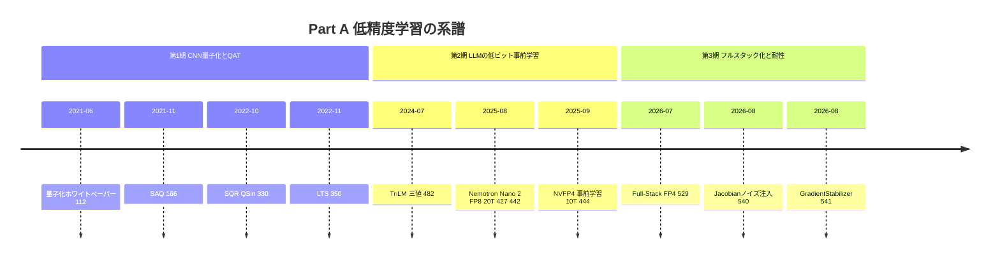
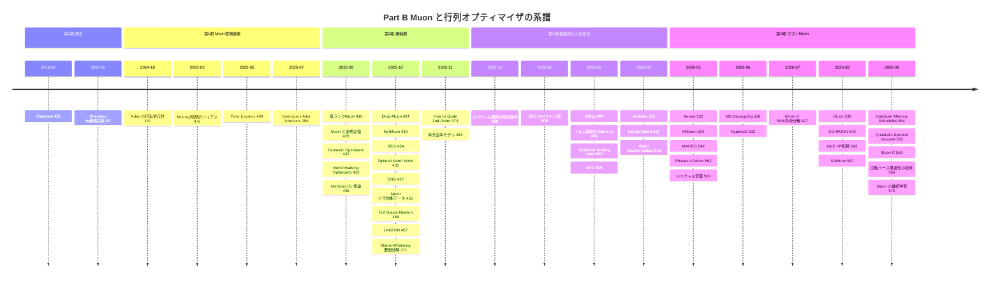
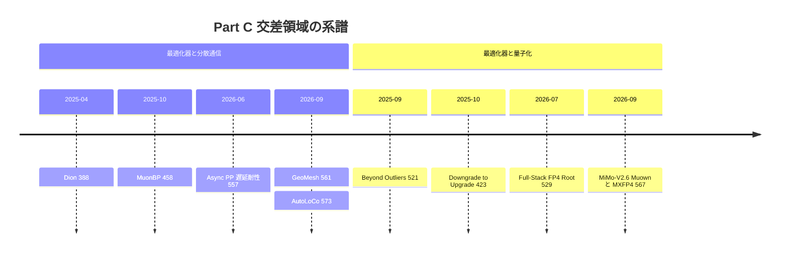

# 低精度学習と Muon・直交化/スペクトル系オプティマイザ：論文ノートに基づくサーベイ

> 対象：GitHub リポジトリ [Hiroki11x/Papers](https://github.com/Hiroki11x/Papers) の論文読みノート（issue）のうち、低精度学習（LPM ラベル系）と行列オプティマイザに関する **69件**（うち3組は同一論文の重複ノート：[#426](https://github.com/Hiroki11x/Papers/issues/426)/[#431](https://github.com/Hiroki11x/Papers/issues/431)、[#427](https://github.com/Hiroki11x/Papers/issues/427)/[#442](https://github.com/Hiroki11x/Papers/issues/442)、[#456](https://github.com/Hiroki11x/Papers/issues/456)/[#490](https://github.com/Hiroki11x/Papers/issues/490)。実質は66論文）
> 論文の公開時期：2018-02（Shampoo）〜 2026-09（AutoLoCo ほか）。issue の登録時期は 2020-10 〜 2026-09-30。
> 作成日：2026-09-30。2025〜2026年の論文は執筆者の記憶ではなく、ノートの記述を根拠にまとめています。

## 概要

このノート群が追っている問いは、大きく次の2つです。

1. **何ビットまで下げて LLM を学習できるか**（Part A 低精度学習）
   量子化は、CNN 向けの推論圧縮（PTQ/QAT）から始まり、2025年には FP8 で 20T トークンの事前学習（Nemotron Nano 2）、4bit の NVFP4 で 10T トークンの事前学習（NVFP4 論文）まで到達しました。2026年にはオプティマイザ状態や Attention まで FP4 化する「Full-Stack FP4」が現れています。この Part の中心的な問いは「FP4 の限界はどこにあり、どの部分を高精度に残すべきか」です。
2. **行列構造を使うオプティマイザ（Muon ほか）はなぜ・いつ AdamW に勝つのか**（Part B Muon・直交化/スペクトル系）
   Shampoo（2018）から始まる行列前処理の系譜は、Muon（勾配/モメンタムを Newton–Schulz 反復で直交化 $UV^\top$ する手法）の登場で一気に活発化しました。2025年後半〜2026年にかけて、理論的説明、高速化・改良、公正なベンチマーク、スケーリング則とハイパラ転移、ノルム制約（weight decay の置き換え）が並行して研究されています。この Part の中心的な論点は「Muon の優位はスケールとともに消えるのか」です（1.4倍→1.1倍に縮む vs. μP と正しい weight decay スケーリングで1.4倍を保つ）。
3. **両者の交差**（Part C）
   オプティマイザの選択が量子化耐性を左右すること（FP 精度では Muon が最良なのに PTQ 後は Shampoo が最も頑健）、そして Muon 系を分散・通信制約の下でどう実装するか（Dion、MuonBP、非同期パイプライン、1bit 通信、DiLoCo）を扱います。

件数の内訳は次のとおりです。

| Part | 件数 | 主な内容 |
|---|---|---|
| A 低精度学習 | 11 | 量子化の基礎/QAT、三値 LLM、FP8/NVFP4/Full-Stack FP4 事前学習、量子化耐性・安定化 |
| B Muon・直交化/スペクトル系 | 50 | Shampoo 系の源流、Muon の理論、改良・高速化、ベンチマーク・スケーリング則、ノルム制約、応用 |
| C 交差領域 | 8 | オプティマイザ×量子化、オプティマイザ×分散/通信 |

ノートの登録は 2025年7月以降に集中しており（69件中64件）、その大半が Part B です。このノート群が、Muon 登場後の「行列オプティマイザ・ブーム」をリアルタイムに追ったアーカイブになっていることが分かります。

## 目次

1. [背景と基本概念](#1-背景と基本概念)
2. [Part A 低精度学習：研究の系譜](#2-part-a-低精度学習研究の系譜)
3. [Part B Muon・直交化/スペクトル系オプティマイザ：研究の系譜](#3-part-b-muon直交化スペクトル系オプティマイザ研究の系譜)
4. [Part C 交差領域：研究の系譜](#4-part-c-交差領域研究の系譜)
5. [サブトピック別の整理](#5-サブトピック別の整理)
6. [論文一覧表](#6-論文一覧表全69件公開年月順)
7. [採択先（ベニュー）別の集計](#7-採択先ベニュー別の集計)
8. [各論文の詳細まとめ](#8-各論文の詳細まとめ)
9. [横断的な知見・未解決問題・実務上の示唆](#9-横断的な知見未解決問題実務上の示唆)
10. [関連論文（他カテゴリに分類されたもの）](#10-関連論文他カテゴリに分類されたもの)

---

## 1. 背景と基本概念

### 1.1 Part A：低精度学習の基本概念

**量子化（quantization）と2つの流儀.** ニューラルネットの重み・活性・勾配を低ビットで表現して、メモリ・帯域・演算コストを下げる技術です。Qualcomm のホワイトペーパー [#112](https://github.com/Hiroki11x/Papers/issues/112) は、主要アルゴリズムを次の2つに整理しています。

- **PTQ（Post-Training Quantization）**：学習済みモデルを再学習なしで量子化する方法です。8bit ならほぼ浮動小数点並みの精度が出ます。
- **QAT（Quantization-Aware Training）**：量子化を組み込んだ状態で（再）学習する方法です。より低ビットでも競争力のある精度が出ます。量子化関数は微分できないので、逆伝播では **STE（straight-through estimator）** を使い、潜在的な高精度重みを保持します（TriLM [#482](https://github.com/Hiroki11x/Papers/issues/482) も同じ方式です）。

**浮動小数点フォーマット.** LLM 事前学習で使われるのは主に次のフォーマットです（Nemotron Nano 2 [#442](https://github.com/Hiroki11x/Papers/issues/442) は FP8 E4M3 で事前学習したと記録されています）。

| フォーマット | 構成 | 特徴 |
|---|---|---|
| BF16 | 符号1・指数8・仮数7 | 学習のデフォルト。FP32 と同じダイナミックレンジ |
| FP8 E4M3 | 指数4・仮数3 | 精度寄り。順伝播の重み・活性でよく使われる |
| FP8 E5M2 | 指数5・仮数2 | レンジ寄り。勾配向きとされる |
| FP4（E2M1） | 4bit | 表現できる値が非常に少ないため、ブロック単位のスケールが必須 |
| INT8 | 整数8bit | 通信圧縮（AutoLoCo [#573](https://github.com/Hiroki11x/Papers/issues/573)）や8-bit Adam（[#423](https://github.com/Hiroki11x/Papers/issues/423)）で登場 |
| 三値 {-1,0,+1} | 約1.58bit | TriLM：重み三値＋共有スケール $\gamma$ |

**ブロックスケーリング（microscaling）.** 4bit の値そのものはレンジが極端に狭いので、小さなブロックごとにスケール係数を共有させます。

- **MXFP4**：32要素ブロックごとに、2のべき乗のスケールを共有します。
- **NVFP4**（[#444](https://github.com/Hiroki11x/Papers/issues/444)）：ブロックを **16要素** に縮め、ブロックスケールを **E4M3（FP8）** にし、さらに **テンソル単位の FP32 スケール** を重ねた2段スケーリングです。小さい値がゼロに潰れるのを防ぎつつ、外れ値の表現精度も上げます。同じ損失に到達するのに、MXFP4 は NVFP4 より約36%多いトークンを必要としました。

**外れ値（outlier）と回転.** 活性や勾配に巨大な値があると、ブロック最大値に合わせたスケールのせいで他の要素が潰れます。対策として次の技術が使われます。

- **Random Hadamard Transform（RHT）**：直交変換で外れ値のエネルギーをブロック全体に散らします（NVFP4 では重み勾配の入力に適用。Full-Stack FP4 [#529](https://github.com/Hiroki11x/Papers/issues/529) では Hadamard 変換を AdamW のモーメント量子化にも使用）。
- **2D ブロックスケーリング**：16×16 ブロックで量子化し、順伝播と逆伝播（転置）で量子化結果を一致させて、連鎖律の破れを避けます。
- 外れ値の指標としては **MMR（Max-to-Mean/Median Ratio）** や **Kurtosis** が使われてきました。ただし [#521](https://github.com/Hiroki11x/Papers/issues/521) は、これらでは PTQ 後の性能を予測できないと示しています（Part C 参照）。

**確率的丸め（stochastic rounding）.** 値を上下の表現可能値へ、距離に比例した確率で丸める方法です。期待値が不偏になるので、勾配の系統的なバイアスが減ります。NVFP4 事前学習では、勾配量子化に使うことが安定化に必須の4要素の1つでした。

**選択的高精度（mixed precision の設計）.** 「全部を 4bit にする」のではなく、敏感な箇所を BF16 で残すことが、どの研究でも鍵になっています。NVFP4 では最後の数層、Full-Stack FP4 では LoRA-SVD の低ランク主成分、Attention の $PV$・$P^\top dO$・$dO\,V^\top$ などを BF16 で残しています。

**量子化ノイズの次元依存性.** Full-Stack FP4 は、内積の量子化誤差の分散が隠れ次元 $N$ に対して $\mathrm{Var}(\delta Y)=\Theta(N)$ で増えることを指摘しています。モデルが大きいほど、また学習後半に最適化信号が小さくなるほど、量子化ノイズが信号を上回りやすくなります。

### 1.2 Part B：Muon と行列オプティマイザの基本概念

**要素ごと（対角）vs 行列前処理.** Adam は勾配の二次モーメントで要素ごとにスケーリングする **対角前処理** です。座標間の相関は使いません。これに対して、重み行列 $W\in\mathbb{R}^{m\times n}$ の構造を使う手法群があります。

**Shampoo（[#451](https://github.com/Hiroki11x/Papers/issues/451)）.** 左右の前処理行列 $L_t=\epsilon I+\sum_s G_sG_s^\top$、$R_t=\epsilon I+\sum_s G_s^\top G_s$ を保持し、次のように更新します。

$$W_{t+1}=W_t-\eta\,L_t^{-1/4}\,G_t\,R_t^{-1/4}$$

これはベクトル化すると $L_t^{1/4}\otimes R_t^{1/4}$ という **Kronecker 構造の前処理** に等価です。Full AdaGrad（メモリ $m^2n^2$）を、メモリ $m^2+n^2$・計算 $O(m^3+n^3)$ で近似します。

**Muon の更新式.** モメンタム $M_t=\mu M_{t-1}+G_t$ の特異値分解を $M_t=U\Sigma V^\top$ としたとき、Muon は特異値をすべて1にそろえた **極因子（polar factor）/ 行列符号（matrix sign）** で更新します。

$$W_{t+1}=W_t-\eta\,\mathrm{msgn}(M_t),\qquad \mathrm{msgn}(M)=UV^\top=(MM^\top)^{-1/2}M$$

SVD は高コストなので、実装では **Newton–Schulz 反復**（奇数次多項式 $X\leftarrow aX+b(XX^\top)X+c(XX^\top)^2X$ を数回。行列積だけで GPU 向き）で近似します。累積統計を持たない Shampoo（$\epsilon\to0$）が $UV^\top$ に一致することから、Muon は「Shampoo の瞬間版」と見ることもできます。Egalitarian GD（[#437](https://github.com/Hiroki11x/Papers/issues/437)）の $(GG^\top)^{-1/2}G$ も同じ形です。

**スペクトルノルム最急降下と LMO.** $\mathrm{msgn}(G)$ は、スペクトルノルム球上の線形最小化オラクル（LMO）

$$\arg\min_{\|\Delta\|_{\mathrm{op}}\le 1}\langle G,\Delta\rangle=-UV^\top$$

の解です。つまり Muon は「スペクトルノルムの幾何での最急降下」です。この見方を層ごとのノルム割り当てに一般化したのが、metrized deep learning / duality の枠組み（[#406](https://github.com/Hiroki11x/Papers/issues/406)）や **Scion**（入力層 $\ell_1\to$RMS、隠れ層 RMS$\to$RMS、出力層 RMS$\to\infty$、[#435](https://github.com/Hiroki11x/Papers/issues/435)）です。Drop-Muon（[#424](https://github.com/Hiroki11x/Papers/issues/424)）や LANTON（[#457](https://github.com/Hiroki11x/Papers/issues/457)）も LMO ベースの枠組みで定式化されています。

**適用範囲の慣行.** Muon/NorMuon を適用するのは隠れ層の2次元重み行列だけで、埋め込み・出力層（LM head）・バイアス・正規化パラメータには Adam を使うのが標準です（[#430](https://github.com/Hiroki11x/Papers/issues/430) の本人メモ、MiMo-V2.6 [#567](https://github.com/Hiroki11x/Papers/issues/567) でも router を含めて AdamW）。この慣行に理論的な裏付けを与えたのが [#488](https://github.com/Hiroki11x/Papers/issues/488) です。

**SOAP と「回転＋Adam」.** SOAP は Shampoo の固有基底に回転した空間で Adam を回す手法です。Adam が座標系（基底）に依存し、SVD 基底で性能が上がるという [#397](https://github.com/Hiroki11x/Papers/issues/397) の観察が、この発想の裏付けになっています。[#471](https://github.com/Hiroki11x/Papers/issues/471) は行列ホワイトニング型の手法を **スペクトル正規化** と **分散適応（variance adaptation）** の2要素に分解しました。[#566](https://github.com/Hiroki11x/Papers/issues/566) は SOAP・Conda・SPlus などの「回転ベース」手法の収束率を統一的に証明しています。

**muP とハイパラ転移.** μP（Maximal Update Parametrization）は、幅を変えても最適学習率が変わらないように初期化・学習率をスケーリングする方法です。Muon は幅を変えても最適学習率が安定すると報告されています（[#406](https://github.com/Hiroki11x/Papers/issues/406)、Dion [#388](https://github.com/Hiroki11x/Papers/issues/388)）。[#474](https://github.com/Hiroki11x/Papers/issues/474) は Shampoo/SOAP/Muon に対して μP、深さ方向の $1/L$ スケーリング、**weight decay の $1/\text{幅}$ スケーリング** を導出しました。[#543](https://github.com/Hiroki11x/Papers/issues/543) は μP+Muon の MoE で、幅方向とトークン数方向の2段階の転移を行っています。

**weight decay とノルム制御.** Muon に全層 weight decay を加えた D-Muon は大きく改善します（[#433](https://github.com/Hiroki11x/Papers/issues/433)）。一方、2026年に入ると「weight decay は正則化ではなく、重みノルムを通じて相対更新量（angular learning rate）を間接制御しているだけ」という見方を明示したのが Hyperball [#532](https://github.com/Hiroki11x/Papers/issues/532)（2026-06）です。同じ2026年には、重みと更新のノルムを直接拘束して weight decay をなくす手法が並行して相次いでいます（SSO [#508](https://github.com/Hiroki11x/Papers/issues/508)（2026-01）、MACRO [#549](https://github.com/Hiroki11x/Papers/issues/549)（2026-05）、MD Decoupling [#528](https://github.com/Hiroki11x/Papers/issues/528)（2026-06））。本人メモにも「勾配も重みもノルムをハードに制御して wd をなくす流れが最近の流行り」とあります。

**臨界バッチサイズ（CBS）.** これ以上バッチを大きくしてもステップ数が減らなくなる境界です。完全な Gauss-Newton 法は CBS を大きく広げます（[#456](https://github.com/Hiroki11x/Papers/issues/456)。ただし同論文では Muon は AdamW と同じく約12M トークンで頭打ち）。一方 MiMo-V2.6 [#567](https://github.com/Hiroki11x/Papers/issues/567) は「Muon 系は CBS を超える大バッチでもデータ効率を保つ」ことを導入理由に挙げています。CBS はベンチマーク結果のバッチサイズ依存性（[#432](https://github.com/Hiroki11x/Papers/issues/432) vs [#433](https://github.com/Hiroki11x/Papers/issues/433)）を解釈するうえでも鍵になります。

**安定ランク・nuclear rank・有効ランク.** Muon を理論的に説明する際の中心的な指標です。安定ランクは $\|A\|_F^2/\|A\|_2^2$、nuclear rank は $\|G\|_*^2/\|G\|_F^2$ です。[#488](https://github.com/Hiroki11x/Papers/issues/488) は「$\text{nuclear rank}(\nabla W)\ge\text{stable rank}(A_{\ell-1})$ のとき SpecGD が GD より1ステップで多く損失を減らす」ことを示しました。MSign（[#494](https://github.com/Hiroki11x/Papers/issues/494)）は、安定ランクの急落を学習崩壊の前兆として扱っています。

---

## 2. Part A 低精度学習：研究の系譜

### 2.1 時代区分

実データ（公開年月）に合わせると、Part A は次の3期に分けられます。間にある 2023〜2024年前半の空白は、ノート群が LLM 時代の量子化を追い始めるまでの間隔を反映しています。

| 時期 | 特徴 | 論文 |
|---|---|---|
| 第1期 2021〜2022 | CNN 向けの量子化理論と QAT の工夫 | [#112](https://github.com/Hiroki11x/Papers/issues/112), [#166](https://github.com/Hiroki11x/Papers/issues/166), [#330](https://github.com/Hiroki11x/Papers/issues/330), [#350](https://github.com/Hiroki11x/Papers/issues/350) |
| 第2期 2024-07〜2025-09 | LLM を「最初から低ビットで事前学習する」時代：三値、FP8、NVFP4 | [#482](https://github.com/Hiroki11x/Papers/issues/482), [#427](https://github.com/Hiroki11x/Papers/issues/427)/[#442](https://github.com/Hiroki11x/Papers/issues/442), [#444](https://github.com/Hiroki11x/Papers/issues/444) |
| 第3期 2026 | 線形層の先へ：オプティマイザ状態・Attention の FP4 化と、量子化耐性・安定化 | [#529](https://github.com/Hiroki11x/Papers/issues/529), [#540](https://github.com/Hiroki11x/Papers/issues/540), [#541](https://github.com/Hiroki11x/Papers/issues/541) |

### 2.2 第1期：推論圧縮のための量子化と QAT の工夫（2021〜2022）

出発点は Qualcomm のホワイトペーパー [#112](https://github.com/Hiroki11x/Papers/issues/112) です。ハードウェアの観点から量子化を説明し、「PTQ なら8bit でほぼ浮動小数点並み、より低ビットには QAT が必要」という基本構図を示しました。この時期の問いは **「量子化で失われる精度を学習でどう取り戻すか」** です。3本のノートはそれぞれ別の角度からこの問いに答えています。

- **損失地形の観点**：SAQ [#166](https://github.com/Hiroki11x/Papers/issues/166) は、SAM（Sharpness-Aware Minimization）を量子化モデルの学習に適用しました。さらに「平坦な層には低ビット、鋭い層には高ビット」を割り当てる混合ビット幅探索と組み合わせ、量子化 ResNet-18 で BOPs を 55.1倍削減しながら、全精度モデルを Top-1 で 0.7% 上回りました。
- **勾配の観点**：SQR/QSin [#330](https://github.com/Hiroki11x/Papers/issues/330)（ECCV 2022）は、低ビット学習の精度劣化の原因を「不適切な勾配」と見ました。量子化誤差と等価な平滑正則化器（SQR）を定義し、その具体例 QSin を提案しています。超解像での格子状アーチファクトも抑えました。
- **学習効率の観点**：LTS [#350](https://github.com/Hiroki11x/Papers/issues/350) は、「QAT では量子化重みの大部分が数エポックで最適な量子化レベルに到達する（部分的スクラッチオフ宝くじ）」ことを発見しました。到達した重みを凍結し、更新を 30〜60%、後退パスの FLOPs を 15〜30% 削減しています。

この3本はいずれも CNN と画像タスクが対象で、LLM や浮動小数点の低ビットフォーマットは登場しません。第1期はノートの本文も短く、概要の転記が中心です。

### 2.3 第2期：LLM を低ビットで「事前学習」する（2024-07〜2025-09）

第2期では問いが変わり、**「推論のための圧縮」から「最初から低ビットで事前学習する」** へ移ります。

**三値 LLM という極端.** TriLM [#482](https://github.com/Hiroki11x/Papers/issues/482)（ICLR 2025）は、全線形層の重みを {-1,0,+1} とスケールで表し、潜在 FP16 重みと STE で事前学習から三値化しました。99M〜3.9B の Spectra スイート（FloatLM・QuantLM を含む54モデル）で比較した主な結果は次のとおりです。

- 3.9B の TriLM は 3.9B の FloatLM と同等の性能で、ビットサイズ換算では 830M の FloatLM より小さくなります。
- スケーリング則 $L(N)\approx A\,N^{-0.26}+\varepsilon$ の指数は TriLM と FloatLM でほぼ一致し、大規模化するほど差が縮まります。

この論文は「PTQ は4bit 以下で急激に劣化するので、事前学習段階から低ビット化すべき」という動機を明示しています。第1期の「PTQ vs QAT」の構図を LLM に持ち込んだ形です。なお、学習後半でピーク LR を半減し weight decay を除くと収束が改善するという観察は、Part B の weight decay の議論とも響き合います。

**FP8 の実用化.** NVIDIA の Nemotron Nano 2 [#427](https://github.com/Hiroki11x/Papers/issues/427)/[#442](https://github.com/Hiroki11x/Papers/issues/442) は、12B のハイブリッド Mamba-Transformer を **20兆トークンにわたって FP8（E4M3）で事前学習** しました。論文の主眼はアーキテクチャと推論スループット（Qwen3-8B 比で最大 6.3倍）ですが、FP8 事前学習がフロンティア規模で「当たり前の選択肢」になったことを示す事例としてノートに残されています。

**4bit（NVFP4）への到達.** 同じ12B ハイブリッドモデルの系列を使い、NVFP4 論文 [#444](https://github.com/Hiroki11x/Papers/issues/444) は **10兆トークンの 4bit 事前学習** を行いました。検証損失は FP8 比で 1〜1.5% 以内、MMLU-Pro は 62.58% vs 62.62% です。アブレーションでは、次の4つの技術のどれを外しても損失が悪化しました。

1. 最後の数層を BF16 で保持する
2. 重み勾配の入力に Random Hadamard Transform を適用する
3. 16×16 の 2D ブロックスケーリングで順伝播と逆伝播の量子化を一致させる
4. 勾配に確率的丸めを使う

さらに MXFP4 との比較（8B・1Tトークン）では、NVFP4 の損失誤差 1.5% に対して MXFP4 は 2.5% で、同じ損失に達するのに 36% 多いトークンが必要でした。**フォーマット設計（ブロックサイズとスケールの精度）そのものが、事前学習のトークン効率を左右する** ことを示した点が重要です。

### 2.4 第3期：「線形層だけ」からの脱却と、量子化耐性・安定化（2026）

NVFP4 論文は今後の課題として「全線形層の FP4 化、Attention・通信経路への拡張」を挙げていました。**Full-Stack FP4** [#529](https://github.com/Hiroki11x/Papers/issues/529) はこの課題に応える形で、線形層に加えてオプティマイザの状態・内部計算と Attention まで NVFP4 化しました。失敗の原因をモジュールごとに次の3つに分け、それぞれ別の処方を当てています。

| 対象 | 失敗原因 | 処方 |
|---|---|---|
| 線形層 | 量子化誤差が次元に比例して増える $\Theta(N)$ | LoRA-SVD：主成分を BF16 の低ランク分岐に逃がし、4,000ステップごとに SVD で再整合 |
| AdamW の第2モーメント | 非負・heavy-tailed で、しかも分母に使われる | 平方根 → 平均除去 → Hadamard → NVFP4 という分布変換で相対 MSE を約60%削減 |
| Muon 系 Root の Newton–Schulz | 反復で丸め誤差が増幅される | 行列の形状に合わせて最適化した係数で誤差を抑制（Part C と接続） |
| Attention | $PV$ で simplex が崩れ、$dO\,V^\top$ で偽の勾配が生じる | $QK^\top$・$dS$ 系は FP4、$PV$・$P^\top dO$・$dO\,V^\top$ は BF16 に残す |

3B モデル・64Bトークンで BF16 との損失差は 1.47% でした。ただしノートは次の限界を明記しています。

- **fake quantization（8×A800）** による検証で、実機での速度向上は未検証です。
- BF16 の経路が残っており、「完全な all-FP4」ではありません。
- 64B トークンは Chinchilla の観点では短い学習です。

NVFP4 論文の「10T トークン・実機」と比べると、スケールと実機検証の点では後退しています。一方で、対象範囲を広げた点では前進しています。

同じ時期のノートには、低精度化の **周辺技術** が2本あります。

- **Jacobian 誘導ノイズ注入** [#540](https://github.com/Hiroki11x/Papers/issues/540)（ICML 2026 WS）：Softmax のヤコビアンを量子化安定性のボトルネックと特定し、そのフロベニウスノルムから決まる分散のノイズを注意ロジットに注入して学習します。これで低ビット PTQ への耐性が上がります（SigLIP の Top-1 で最大 +37%、WikiText の PPL で最大 40% の相対改善）。Full-Stack FP4 が「Attention の Softmax 周辺は低精度に弱い」と見て BF16 に逃がしたのに対し、こちらは **学習側で感度そのものを下げる** アプローチです。
- **GradientStabilizer** [#541](https://github.com/Hiroki11x/Papers/issues/541)（ICML 2026）：勾配の方向は保ったまま、更新の大きさを勾配ノルムの実行統計で置き換えます。FP16 事前学習や FP4 の量子化対応事前学習での発散を減らしました。本人メモは「スパイク時はスパイク方向の単位ベクトルで更新されるだけで、他の次元はほぼ無視されるのでは」と疑問を呈しています。

### 2.5 Part A の論点整理：限界ビット幅はどこか

- **重みだけなら約1.58bit まで下げられる**（TriLM）。ただし活性・勾配は高精度のまま、推論の効率化が主目的です。
- **重み・活性・勾配の GEMM は 4bit（NVFP4）が実証済みの下限**（10T トークン）。成立させるには、BF16 層の残置・RHT・2D スケーリング・確率的丸めを組み合わせる必要があります。フォーマットは MXFP4 より NVFP4 が有利です。
- **オプティマイザ状態と Attention の 4bit 化** は、分布変換と経路ごとの混合精度で「数値的には成立」しました（Full-Stack FP4）。ただし実機速度と長期学習での誤差の蓄積は未解決です。
- 量子化誤差は **モデルの次元と学習の進行に伴って悪化する**（Full-Stack FP4 の Figure 6）。この理論的指摘から、「学習初期は低精度、後半で高精度へ戻す」動的精度切替が示唆されています。
- **どのオプティマイザで学習したかが量子化耐性を決める**（[#521](https://github.com/Hiroki11x/Papers/issues/521)）という発見は、Part A と Part B を結ぶ最重要の接点です（→ Part C）。

---

## 3. Part B Muon・直交化/スペクトル系オプティマイザ：研究の系譜

### 3.1 時代区分

Part B の50件（重複2組を含む）は、公開年月で見ると次の5期に分けられます。公開年月が不明な論文は、issue 登録月で位置づけています。

| 時期 | 特徴 | 主な論文 |
|---|---|---|
| 第0期 2018〜2020 | 源流：Shampoo と大規模実装 | [#451](https://github.com/Hiroki11x/Papers/issues/451), [#52](https://github.com/Hiroki11x/Papers/issues/52) |
| 第1期 2024-10〜2025-07 | Muon 登場直後：基底依存性、暗黙的バイアス、Newton–Schulz の最適化、帰納バイアス | [#397](https://github.com/Hiroki11x/Papers/issues/397), [#476](https://github.com/Hiroki11x/Papers/issues/476), [#489](https://github.com/Hiroki11x/Papers/issues/489), [#386](https://github.com/Hiroki11x/Papers/issues/386) |
| 第2期 2025-09〜2025-11 | 爆発期：「なぜ効くか」の説明、改良版の乱立、公正なベンチマーク、μP | [#406](https://github.com/Hiroki11x/Papers/issues/406), [#410](https://github.com/Hiroki11x/Papers/issues/410), [#426](https://github.com/Hiroki11x/Papers/issues/426), [#432](https://github.com/Hiroki11x/Papers/issues/432), [#433](https://github.com/Hiroki11x/Papers/issues/433), [#424](https://github.com/Hiroki11x/Papers/issues/424), [#430](https://github.com/Hiroki11x/Papers/issues/430), [#434](https://github.com/Hiroki11x/Papers/issues/434), [#435](https://github.com/Hiroki11x/Papers/issues/435), [#437](https://github.com/Hiroki11x/Papers/issues/437), [#455](https://github.com/Hiroki11x/Papers/issues/455), [#456](https://github.com/Hiroki11x/Papers/issues/456), [#457](https://github.com/Hiroki11x/Papers/issues/457), [#471](https://github.com/Hiroki11x/Papers/issues/471), [#474](https://github.com/Hiroki11x/Papers/issues/474), [#483](https://github.com/Hiroki11x/Papers/issues/483) |
| 第3期 2025-12〜2026-03 | 理論の深化と安定化：有効条件、近似誤差、安定ランク、warmup、スケーリング則、スペクトル球 | [#488](https://github.com/Hiroki11x/Papers/issues/488), [#508](https://github.com/Hiroki11x/Papers/issues/508), [#494](https://github.com/Hiroki11x/Papers/issues/494), [#496](https://github.com/Hiroki11x/Papers/issues/496), [#503](https://github.com/Hiroki11x/Papers/issues/503), [#505](https://github.com/Hiroki11x/Papers/issues/505), [#515](https://github.com/Hiroki11x/Papers/issues/515), [#517](https://github.com/Hiroki11x/Papers/issues/517), [#519](https://github.com/Hiroki11x/Papers/issues/519) |
| 第4期 2026-05〜2026-09 | ポスト Muon：ノルム制約と weight decay の再解釈、「一様化しすぎ」の修正、二次情報との融合、応用 | [#522](https://github.com/Hiroki11x/Papers/issues/522), [#524](https://github.com/Hiroki11x/Papers/issues/524), [#549](https://github.com/Hiroki11x/Papers/issues/549), [#553](https://github.com/Hiroki11x/Papers/issues/553), [#560](https://github.com/Hiroki11x/Papers/issues/560), [#528](https://github.com/Hiroki11x/Papers/issues/528), [#532](https://github.com/Hiroki11x/Papers/issues/532), [#527](https://github.com/Hiroki11x/Papers/issues/527), [#539](https://github.com/Hiroki11x/Papers/issues/539), [#542](https://github.com/Hiroki11x/Papers/issues/542), [#543](https://github.com/Hiroki11x/Papers/issues/543), [#547](https://github.com/Hiroki11x/Papers/issues/547), [#554](https://github.com/Hiroki11x/Papers/issues/554), [#555](https://github.com/Hiroki11x/Papers/issues/555), [#559](https://github.com/Hiroki11x/Papers/issues/559), [#566](https://github.com/Hiroki11x/Papers/issues/566), [#570](https://github.com/Hiroki11x/Papers/issues/570) |

（注）[#406](https://github.com/Hiroki11x/Papers/issues/406)・[#474](https://github.com/Hiroki11x/Papers/issues/474)・[#483](https://github.com/Hiroki11x/Papers/issues/483)・[#517](https://github.com/Hiroki11x/Papers/issues/517)・[#527](https://github.com/Hiroki11x/Papers/issues/527)・[#539](https://github.com/Hiroki11x/Papers/issues/539) は公開年月が記録されていないため、issue 登録月の位置に置いています。

### 3.2 第0期：Shampoo という源流（2018〜2020）

Shampoo [#451](https://github.com/Hiroki11x/Papers/issues/451)（ICML 2018）は、Full AdaGrad の前処理を「テンソルの各モードの小さなフル行列の Kronecker 積」で近似しました。オンライン凸最適化で $O(\sqrt{T})$ の regret を証明し、1ステップの時間は Adam と同程度のまま、収束が速くなることを示しています。実装上の工夫（大きすぎるモードは Diagonal Shampoo にフォールバック、行列根は 20〜100ステップごとに再計算）は、「行列根の計算コストをどう償却するか」という、後の Muon 高速化研究まで続く課題の原型です。Anil ら [#52](https://github.com/Hiroki11x/Papers/issues/52) は Shampoo を深層学習で実用化するための研究ですが、原ノートはリンクと「言語タスクで試している」という一言のみで、手法や数値の記録はありません。

### 3.3 第1期：Muon 登場直後の基礎づけ（2024-10〜2025-07）

Muon 自体（Jordan et al., 2024）のノートはありません。ただし、Muon を理解するための **3つの基礎** がこの時期に置かれています。

1. **「Adam は座標系に依存する」**：[#397](https://github.com/Hiroki11x/Papers/issues/397)（NeurIPS 2025）は、パラメータ空間をランダムに回転すると GPT-2/ViT で Adam の性能が大きく落ちること、逆に勾配の SVD 基底へ回転すると改善することを示しました。既存の回転依存な仮定（$L_\infty$ 有界勾配、Hessian のブロック対角性、$L_\infty$ 平滑性）はどれもこの現象を十分に説明できない、という結論です。SOAP/Shampoo 系の「良い基底で Adam を回す」発想を実証面から支える結果です。
2. **「Muon はどの解に向かうか」**：[#476](https://github.com/Hiroki11x/Papers/issues/476)（NeurIPS 2025）は、多クラスの線形分離可能データで、正規化最急降下とそのモメンタム版の暗黙的バイアスを任意のノルムについて統一的に解析しました。Spectral Descent と Muon は **スペクトルノルムの最大マージン解** に、Adam（$\varepsilon=0$）は max-norm マージンに収束します。
3. **「直交化をどう速く正確に計算するか」**：Polar Express [#489](https://github.com/Hiroki11x/Papers/issues/489) は、各反復で現在の特異値区間に対する minimax 最適な奇数次多項式を貪欲に選び、その合成が全体としても minimax 最適であることを証明しました。bf16 でも安定に動作し、GPT-2 学習では Newton–Schulz 系（Jordan 法・You 法）より一貫して低い検証損失を得ています。

さらに Pascanu ら [#386](https://github.com/Hiroki11x/Papers/issues/386) のポジション論文は、「オプティマイザは収束速度だけでなく、解の質（帰納バイアス）を決める」と主張しました。Shampoo のような非対角前処理は有効ランクの低い局所的な表現を学び、連続学習での忘却を抑えます。この視点は第4期の「Muon は継続学習手法の代わりになる」[#570](https://github.com/Hiroki11x/Papers/issues/570) や、「Muon は本質理解型、AdamW は暗記型の表現を作る」[#560](https://github.com/Hiroki11x/Papers/issues/560) につながっていきます。

### 3.4 第2期：爆発期（2025-09〜2025-11）

ノートが最も密集している時期です。4つの流れが並行しています。

#### (a) 「なぜ Muon は Adam に勝つのか」：均等化仮説

複数の研究が、独立に **「Muon は全特異方向を等速で学習するので、弱い方向（少数派・tail・遅い方向）を取りこぼさない」** という説明に収束しました。

- **連想記憶の観点** [#426](https://github.com/Hiroki11x/Papers/issues/426)/[#431](https://github.com/Hiroki11x/Papers/issues/431)：Muon を VO（Value-Output）行列と FFN に適用するだけで、全層に適用した場合とほぼ同じ性能になります（QK への適用は効果が限定的）。Muon の重みは特異値分布がより等方的で、重尾分布の QA タスクでは tail クラスで Adam を大きく上回ります。
- **不均衡データの観点** [#455](https://github.com/Hiroki11x/Papers/issues/455)：SpecGD（更新 $UV^\top$）は不均衡なガウス混合で全主成分を等速で学習し、少数派クラスの汎化で GD に勝ちます。Colored-MNIST・CelebA・TinyStories（希少トークン）でも確認されました。
- **Grokking の観点** [#437](https://github.com/Hiroki11x/Papers/issues/437)：EGD（$(GG^\top)^{-1/2}G$）は、grokking の停滞の原因を勾配スペクトルの非対称性（遅い特異方向）に求め、モジュラー演算で数千エポックの停滞を数エポックに短縮しました。
- **metrized deep learning の観点** [#406](https://github.com/Hiroki11x/Papers/issues/406)：Bernstein 門下の修士論文です。duality を使って SGD/Adam/Shampoo/Muon を統一的に説明し、Muon が幅間で学習率を転移できることを示しました。重みノルムの制約で Lipschitz 制約付きの Transformer（Spectral Soft Cap/Hammer）も学習しています。この論文が扱う「重みノルム制約」は、第4期のノルム制約ブームの前触れです。

これに対して、**「完全な直交化は本当に最適か」** という問いも同じ時期に出ています。等方曲率モデル [#483](https://github.com/Hiroki11x/Papers/issues/483) は、1ステップの更新を凸問題として定式化しました。その結果、(i) 最適な更新は勾配と特異空間を共有する、(ii) 曲率が超二次で成長するなら特異値の **均質化** が最適で、完全な直交化 $UV^\top$ は曲率関数にキンクがある極限でのみ最適、となります。GPT-2 Small では $H(r)\approx r^{2.2}$ の超二次成長が実測されました。つまり「均等化は正しいが、1にそろえるのは極端」ということで、この論点は第4期の SAMuon [#547](https://github.com/Hiroki11x/Papers/issues/547) で具体的な手法になります。

#### (b) 改良版の乱立：Muon の弱点を補う

- **行（ニューロン）ノルムの不均一** → NorMuon [#430](https://github.com/Hiroki11x/Papers/issues/430)：直交化の後に二次モーメント統計で行ごとに正規化します。1.1B/5.4B で Adam 比 21.7%、Muon 比 11.3% の効率向上を得ました。この問題意識は第4期の Aurora [#522](https://github.com/Hiroki11x/Papers/issues/522)（縦長行列での leverage score の偏りとニューロン死）に引き継がれます。
- **計算コスト** → 低ランク Muon [#410](https://github.com/Hiroki11x/Papers/issues/410)：モメンタムの特異値が急減衰することを利用し、スケッチ＋QR で得た低次元部分空間でのみ直交化します。直交化は最大10倍以上速くなり、ヘビーテールノイズ下での収束も Muon 系で初めて示しました。Drop-Muon [#424](https://github.com/Hiroki11x/Papers/issues/424) は層の部分集合だけを更新し、全層更新が計算最適でない条件を理論的に示しています（ただし実験は CNN/MNIST 級です）。
- **学習率の粒度** → LANTON [#457](https://github.com/Hiroki11x/Papers/issues/457)：層ごとの勾配ノイズを双対ノルムで推定して学習率をスケーリングします。LLaMA-1.1B で D-Muon の 30B トークンに相当する損失へ 20B トークンで到達しました。
- **安定性・互換性** → REG [#434](https://github.com/Hiroki11x/Papers/issues/434)：行列符号の代わりに行・列スケーリング（RACS、行列平衡化）を使います。ただし評価は SFT 中心で、本人メモは「図で Muon と REG を直接比較していない」と指摘しています。

#### (c) 公正なベンチマーク：「2倍速」は本当か

2025年9月に、ほぼ同時に2つの大規模ベンチマークが出ました。**Muon の優位性がスケールとともに消えるのか** という、この分野で最も重要な論争の出発点です。

- **Wen ら [#432](https://github.com/Hiroki11x/Papers/issues/432)（Stanford）**：11手法を 0.1B〜1.2B、1〜8×Chinchilla で座標降下により丁寧にチューニングしました。既報の「2倍速」は主に AdamW の過小チューニングによるもので、AdamW も学習率の調整だけで2倍近く改善しうると指摘しています。行列ベースの手法（Muon/SOAP/Kron）はスカラー手法より一貫して速いものの、高速化は **0.1B で約1.4倍 → 1.2B で約1.1倍** に縮みます。8×Chinchilla の高データ比では Muon より SOAP/Kron が優位でした。
- **Semenov ら [#433](https://github.com/Hiroki11x/Papers/issues/433)（EPFL）**：124M〜720M と MoE で、手法の順位が **バッチサイズで入れ替わる** ことを示しました。小バッチでは D-Muon/SOAP、大バッチでは Signum/MARS/Lion が伸び、720M・1M トークンバッチの大規模設定では AdEMAMix と MARS が最良です。Muon に全層 weight decay を入れた D-Muon は大きく改善しました。

両者は行列系オプティマイザの評価で食い違っています。ノートに転記された [#432](https://github.com/Hiroki11x/Papers/issues/432) の論文の「関連研究への言及」節によると、主な原因は次の2点です（#432 の著者による説明）。

1. **バッチサイズの差**：Wen らは 0.4M トークン以上、Semenov らの主要実験は 0.02〜0.1M トークンです。分散低減型（MARS/AdEMAMix）はノイズの大きい小バッチで有利で、大バッチでは行列型が有利になります。ただし [#433](https://github.com/Hiroki11x/Papers/issues/433) 自身の 124M でのバッチ掃引では、小バッチで D-Muon/SOAP、大バッチで Signum/MARS/Lion が伸びており、この説明とは逆向きの傾向も報告されています。
2. **学習率スイープ範囲の差**：Wen らは 4e-3〜8e-3、Semenov らは小規模の設定を流用した 1e-3〜2e-3 です。

両研究とも「非ゼロの weight decay と、学習率を小さく減衰させるスケジュールは不可欠」という点では一致しています。

#### (d) スケーリング則とハイパラ転移：「縮小」をどう読むか

ベンチマークが示した「1.4倍→1.1倍」の縮小と並べて読むと示唆的なのが、NYU の [#474](https://github.com/Hiroki11x/Papers/issues/474)（NeurIPS 2025）です。[#474](https://github.com/Hiroki11x/Papers/issues/474) は [#432](https://github.com/Hiroki11x/Papers/issues/432) への応答として書かれたものではありません（公開年月は未記録で、ノートにも [#432](https://github.com/Hiroki11x/Papers/issues/432) への言及はない）が、**スケーリング則を正しく設定しないと二次法の利得が縮む** と主張しています。Shampoo/SOAP/Muon に対して μP、深さの $1/L$ スケーリング、weight decay の $1/\text{幅}$ スケーリングを導出し、計算最適な設定で **Muon は AdamW より約1.4倍の計算効率** を保つことを示しています。μP か $1/D$ スケーリングのどちらかを外すと、改善は約1.1倍に縮みます。これは [#432](https://github.com/Hiroki11x/Papers/issues/432) の 1.1倍という数字と整合的です。つまり **「優位性が縮む」という観測は、スケーリング規則の欠落で説明できる可能性がある** というのが、両者を並べたときの読みです。ただし [#474](https://github.com/Hiroki11x/Papers/issues/474) の検証も 1.4B パラメータまでです。

ノルムの観点からは、Scion を使った [#435](https://github.com/Hiroki11x/Papers/issues/435) が、最適な (η, B) では出力層の演算子ノルムが幅・深さ・データ量によらず一定（約 $2^7$）になる「ノルム転移」を見つけました。最適バッチサイズは $B^*\propto D^{0.45}$、最適学習率は $\eta^*\propto B^{0.62}D^{-0.56}$ で、Adam と同様の平方根則に従います。層別の学習率比は 入力:隠れ:出力 = 1:1/8:1 でした。本人メモは「動的なバッチサイズ（スケジュール）は試されていない」と指摘しています。

**上限の測定**としては、Full Gauss-Newton [#456](https://github.com/Hiroki11x/Papers/issues/456)/[#490](https://github.com/Hiroki11x/Papers/issues/490) が、JVP で実装した完全 GN（内側の最適化に Muon を使用）で近似二次法の天井を測りました。目標損失 3.25 への到達ステップは GN 54 / SOAP 292 / Muon 864 で、GN は臨界バッチサイズも大きく広げます（AdamW・Muon は約12M トークンで頭打ち、GN は 40M でも改善）。層単位の GN でも Full GN の 1.4倍のステップで同等の損失に達するので、**層内の正確な曲率が鍵で、層間の相関や高次項は重要でない** ことになります。本人メモは「Polar Express も同じ考え方ではないか」「Shampoo の damping や逆行列計算、Kronecker 因子分解はあまり良くないのでは」と推測しています。

要因分解として、Frans ら [#471](https://github.com/Hiroki11x/Papers/issues/471) は GPT-2 (160M) で行列ホワイトニングを「スペクトル正規化」と「分散適応」に分けました。Muon は最も正確にスペクトル正規化しますが SOAP に劣ります。Muon→AdaMuon の改善幅は Adam→Muon と同程度で、**分散適応はスペクトル正規化と同じくらい重要** です。分散適応はランク1近似（メモリ $O(m+n)$）でもほぼ劣化しません。本人メモは「論文よりブログ（kvfrans.com）を読むのが良い」と推奨しています。

### 3.5 第3期：理論の深化と安定化（2025-12〜2026-03）

- **いつ効くか** [#488](https://github.com/Hiroki11x/Papers/issues/488)：SpecGD が GD より有利になる条件を $\text{nuclear rank}(\nabla W)\ge\text{stable rank}(A_{\ell-1})$ として導出しました。ReLU 系 MLP や Transformer（RMSNorm 後・MLP 中間）の活性は、幅に依存しない低い安定ランクを持ちます。一方 SwiGLU では安定ランクが高く、SpecGD が有利にならない反例になります。**埋め込み層・出力層に Muon を使わない慣行** にも理論的な裏付けを与えました。
- **近似は大丈夫か** [#517](https://github.com/Hiroki11x/Papers/issues/517)：Newton–Schulz 近似を加法的誤差 δ としてモデル化し、近似 Muon の収束を初めて解析しました。近似が粗いほど、小さい学習率と大きいモメンタムが必要になります。高速化の側では、Gram Newton–Schulz [#519](https://github.com/Hiroki11x/Papers/issues/519)（Dao AI Lab のブログ）が計算を正方対称のグラム行列に移し、半精度での不安定性はリスタート戦略で抑え、Hopper/Blackwell 向けカーネルで Muon を最大約2倍速くしました（Kimi K2 級で最適化ステップ時間を最大50%削減）。Polar Express [#489](https://github.com/Hiroki11x/Papers/issues/489) の著者（Amsel）がここでも関わっており、「直交化の数値計算」の系譜が続いています。
- **安定化** [#494](https://github.com/Hiroki11x/Papers/issues/494) MSign：学習崩壊の前兆として、重みの安定ランクの急落と隣接層ヤコビアンの整列を特定しました。行列符号で安定ランクを周期的に回復させ、3B まで学習崩壊を防いでいます。[#496](https://github.com/Hiroki11x/Papers/issues/496) は、ノルム制約型（Muon など）でも warmup が必要なことを一般化平滑性から説明し、warmup を自動調整します。
- **スケーリング則の中に最適化器を入れる** [#503](https://github.com/Hiroki11x/Papers/issues/503)：オプティマイザごとに Chinchilla 則を独立にフィットすると係数と指数が強く相関して不安定になります。そこで指数を共有し、効率係数 $\rho_N,\rho_D$ だけをオプティマイザごとに変える形式を提案しました。OLMo 系では $\rho_D$ が Muon ≈ 2.08、Scion ≈ 1.99、SOAP ≈ 2.57 で、$\rho_N\approx1$ です。つまり **新世代のオプティマイザは主にデータ効率を改善する** という結論です。計算量版では Shampoo が不利でした。[#432](https://github.com/Hiroki11x/Papers/issues/432) の「高データ比では SOAP が優位」とも整合的です。
- **スペクトル球** [#508](https://github.com/Hiroki11x/Papers/issues/508) SSO：Adam は長期の学習で活性が大きくなり μP を満たさなくなります。Muon は更新ノルムは安定しますが、重みのドリフトが無視できません。SSO は重みと更新の両方をスペクトル球面上に制約して weight decay を廃し、Muon/Adam を上回る性能と μP 転移の改善を示しました（MoE の負荷バランス改善はノート中の MuonH への言及として記録されているのみです）。本人メモはこれを「最近の流行り」とし、Xi Wang の WS 論文（[#527](https://github.com/Hiroki11x/Papers/issues/527)）との関連を指摘しています。
- **圧縮との両立** [#515](https://github.com/Hiroki11x/Papers/issues/515) NuMuon：Muon で学習した重みは自然に低ランクになることを踏まえ、更新に核ノルム制約を課して SVD 圧縮への耐性を高めました。[#410](https://github.com/Hiroki11x/Papers/issues/410) の「モメンタムは低ランク」という観察と合わせると、「Muon は等方的なスペクトルを作る」（[#426](https://github.com/Hiroki11x/Papers/issues/426)）という主張との関係は、ノートの範囲では整理されていない論点です。
- [#505](https://github.com/Hiroki11x/Papers/issues/505) ARO は、タイトルは行列最適化ですが、ノートの要約はバッチランプアップと GNS の理論に焦点を当てています。対応関係はノートからは明確ではありません。

### 3.6 第4期：ポスト Muon（2026-05〜2026-09）

#### (a) weight decay の再解釈とノルム制約

Hyperball [#532](https://github.com/Hiroki11x/Papers/issues/532)（[#432](https://github.com/Hiroki11x/Papers/issues/432) と同じ Stanford のグループによる続編）は、weight decay の役割を「正則化」ではなく「weight decay → 重みノルム → 相対更新量（angular LR）」という **間接的な制御** と捉え直しました。重みノルムを固定し更新ノルムも正規化することで、angular LR を直接指定します（AdamW/Muon の両方に適用可能）。同じ時期の研究を並べると次のようになります。

| 手法 | 重みの扱い | 更新の扱い | コスト |
|---|---|---|---|
| SSO [#508](https://github.com/Hiroki11x/Papers/issues/508) | スペクトル球上に制約 | 接空間でラグランジュ乗数を反復で解く | 高め（Megatron 上でシャーディングとパイプライン化） |
| MD Decoupling [#528](https://github.com/Hiroki11x/Papers/issues/528) | 更新後に超球面へ単純射影 | AdamW/Muon の更新をそのまま使う | 低い（分散学習では通信とオーバーラップ可能） |
| MACRO [#549](https://github.com/Hiroki11x/Papers/issues/549) | 一定ノルムの多様体 | 接空間射影 → matrix sign → 相対ノルム正規化 → 再射影 | ノートに記載なし |
| Hyperball [#532](https://github.com/Hiroki11x/Papers/issues/532) | ノルム固定 | 更新ノルムを正規化 | ノートに記載なし |

本人メモの評価は分かれています。MD Decoupling には「MuonH（Hyperball）や SSO との違いは何か」と疑問を呈し、MACRO には「性能は上がっていないが、ノルム制約の役割を整理した点に価値がある」としています。

#### (b) 「一様化しすぎ」の修正と二次情報との融合

- **SAMuon** [#547](https://github.com/Hiroki11x/Papers/issues/547)：Muon が Adam に勝つのは SGD より「bulk」方向を活用できるからだと説明します。一方で、第1特異方向（Edge of Stability にある不安定な head）以外はもっと大きな更新に耐えるため、第1方向は1倍、残りは γ 倍（約7）に広げます。SAMuon-lite の追加計算は約0.5%です。これは等方曲率モデル [#483](https://github.com/Hiroki11x/Papers/issues/483) の「完全な直交化は極限ケース」という指摘を具体的な手法にしたものと読めます。本人メモは「SOAP に近いアイデアだがメモリ効率は高そう（表現力は SOAP が上）」「step 比のスケジューリングは K-FAC の Levenberg–Marquardt に近い」「SOAP との比較がないのが気になる」としています。
- **Aurora** [#522](https://github.com/Hiroki11x/Papers/issues/522)（Tilde Research のブログ）：縦長行列（MLP の up/gate）では Muon が行ごとの更新量の偏りを引き継ぎ、ニューロンが死ぬと指摘します。NorMuon [#430](https://github.com/Hiroki11x/Papers/issues/430) と違って直交化の精度を保ったまま leverage を均一化し、modded-nanoGPT の speedrun で SoTA を更新しました。
- **二次情報との融合**：GO-MUON [#542](https://github.com/Hiroki11x/Papers/issues/542) は、データ依存の左右前処理マップの下での重み付きスペクトルオラクルを厳密に解きます。幾何を複数ステップ再利用する lazy 更新は「ノイズ除去ではなく、計算と統計のトレードオフ」だとしています。Quadratic Spectral Descent [#555](https://github.com/Hiroki11x/Papers/issues/555) は、本人メモによると「Muon＋K-FAC のようなイメージ」です。Full GN [#456](https://github.com/Hiroki11x/Papers/issues/456) の「層内の正確な曲率が鍵」という示唆と合わせて読むと、**Muon（幾何）と Shampoo/K-FAC（曲率）を再統合する** 流れと見ることができます（これらのノートが [#456](https://github.com/Hiroki11x/Papers/issues/456) を引用しているわけではありません）。
- **sign との融合** OLion [#539](https://github.com/Hiroki11x/Papers/issues/539)：Lion 型のモメンタムを Newton–Schulz で直交化した後、要素ごとの sign を取り、スペクトル制約と $\ell_\infty$ 制約の交点（Hadamard 型集合）上の最急降下を近似します。モメンタム1本のメモリで AdamW/Muon と同等以上の性能を出し、AdamW で事前学習したモデルを微調整するときの optimizer mismatch も軽減します。本人メモは「Simplified SOAP、あるいは Lion on Muon」と表現しています。
- **構造への適合** Muon-C [#559](https://github.com/Hiroki11x/Papers/issues/559)：畳み込みカーネルを平坦化するのではなく、フーリエ基底で周波数ごとのチャンネル変換行列に分けて極分解します。CIFAR-10 のフローマッチングで、4万ステップ時点の FID は 9.87（展開型 22.26、Adam 51.31）でした。

#### (c) 理論の精緻化：優劣の「相図」

- **Phases of Muon** [#553](https://github.com/Hiroki11x/Papers/issues/553)：行列値の最小二乗問題で SignSVD（Muon）と SignSGD（Adam の代理）の決定論的ダイナミクスを導出しました。大バッチでは SignSVD がデータ共分散に対する平方根前処理として働き、小バッチでは小さい固有モードが SGD 的に振る舞って収束が遅れます。(α, β) 平面上には、SignSGD 有利・SignSVD 有利・トレードオフの **3つの相** があります。ベンチマークのバッチサイズ依存性（[#432](https://github.com/Hiroki11x/Papers/issues/432) vs [#433](https://github.com/Hiroki11x/Papers/issues/433)）に理論的な説明を与える候補です。
- **Overtraining 軸** [#554](https://github.com/Hiroki11x/Papers/issues/554)：短いホライズンでは Muon、長いホライズン（overtraining 領域）では SOAP やモメンタムを動的に変える ADANA が有利になります。[#432](https://github.com/Hiroki11x/Papers/issues/432)（8×Chinchilla で SOAP/Kron が優位）や [#503](https://github.com/Hiroki11x/Papers/issues/503)（SOAP の $\rho_D$ が最大）と同じ方向の結果です。
- **汎化** MiMuon [#524](https://github.com/Hiroki11x/Papers/issues/524)：特異値ギャップが小さいと直交化が特異ベクトルの摂動に敏感になり、安定性と汎化が悪化すると主張しています。「Muon は汎化に良い」とする [#455](https://github.com/Hiroki11x/Papers/issues/455)/[#426](https://github.com/Hiroki11x/Papers/issues/426) とは **反対側の主張** です。
- **収束解析の統一** [#566](https://github.com/Hiroki11x/Papers/issues/566)：SOAP/Conda/SPlus の収束率を初めて証明し、回転を単位行列にとると、要素ごとの Adam が核ノルムでの収束率で Shampoo と同等になることを示しました（本人メモ：「実験はなく理論のみ」）。
- **容量** [#560](https://github.com/Hiroki11x/Papers/issues/560)：FFN の幅を増やしたときに追加次元が有効なスペクトル容量としてどれだけ使われるかは、オプティマイザで異なります（Rényi エントロピーに基づく Soft/Hard Rank）。本人メモは「Muon ベースが主流になればアーキテクチャ設計も変わってくるかもしれない」としています。

#### (d) 応用：MoE・継続学習・大規模モデル

- [#527](https://github.com/Hiroki11x/Papers/issues/527)（ICML 2026 WS）：MoE で専門家の利用が偏る原因を、ルータに入る隠れ状態の collapse という幾何で説明します。Depth scaling は初期の collapse を抑え、Muon は router/expert の更新を直交化して学習中の均衡を保ちます（利用を直接均等化するのではなく、更新の幾何を通じた間接的な安定化です）。
- [#543](https://github.com/Hiroki11x/Papers/issues/543)（COLM 2026）：μP+MLA+Muon の MoE で、幅方向に最適学習率を転移し、さらにトークン数方向に線形回帰で外挿します（R²=0.95）。155B（アクティブ 17B）の MoE を最小限のアブレーションで学習しました。
- [#570](https://github.com/Hiroki11x/Papers/issues/570)（CoLLAs 2026 WIP）：LLM の継続学習で、O-LoRA や ELLA のような専用のペナルティなしに、Muon だけで破滅的忘却を十分に抑えられます。似たタスクが続いて干渉が強い場合に特に有効です。[#386](https://github.com/Hiroki11x/Papers/issues/386) の「Shampoo は忘却を抑える」を Muon と LLM で再確認した形です。

### 3.7 Part B の主要な対立軸

| 論点 | A 側の主張 | B 側の主張 | 読み |
|---|---|---|---|
| 優位はスケールで消えるか | 0.1B で1.4倍 → 1.2B で1.1倍に縮む（[#432](https://github.com/Hiroki11x/Papers/issues/432)） | μP と $1/D$ weight decay を入れれば1.4倍を維持（[#474](https://github.com/Hiroki11x/Papers/issues/474)）。改善は主にデータ効率 $\rho_D\approx2$（[#503](https://github.com/Hiroki11x/Papers/issues/503)） | スケーリング規則の有無で説明できる可能性。ただしどれも約1.5B 以下 |
| 最良の手法はどれか | 行列型（Muon/SOAP/Kron）がスカラー型に一貫して勝つ（[#432](https://github.com/Hiroki11x/Papers/issues/432)、大バッチ） | AdEMAMix/MARS が最良（[#433](https://github.com/Hiroki11x/Papers/issues/433)、小バッチ中心） | バッチサイズと LR 範囲の差（[#432](https://github.com/Hiroki11x/Papers/issues/432) の著者による説明。[#433](https://github.com/Hiroki11x/Papers/issues/433) 内のバッチ掃引は逆向きの傾向も示す）。理論的には [#553](https://github.com/Hiroki11x/Papers/issues/553) の相図 |
| Muon と SOAP | 短期・大バッチでは Muon が強い | 長期・高データ比では SOAP/Kron/ADANA（[#432](https://github.com/Hiroki11x/Papers/issues/432), [#554](https://github.com/Hiroki11x/Papers/issues/554)）。分散適応の欠如が Muon の弱点（[#471](https://github.com/Hiroki11x/Papers/issues/471)） | ホライズン依存 |
| 直交化は最適か | 全方向の均等化が本質（[#426](https://github.com/Hiroki11x/Papers/issues/426), [#455](https://github.com/Hiroki11x/Papers/issues/455), [#437](https://github.com/Hiroki11x/Papers/issues/437)） | 完全な直交化は極限ケース（[#483](https://github.com/Hiroki11x/Papers/issues/483)）。第1方向以外は大きくすべき（[#547](https://github.com/Hiroki11x/Papers/issues/547)） | 「均質化」は正しく、「1にそろえる」は過剰 |
| 汎化 | Muon は少数派・tail の汎化に良い（[#455](https://github.com/Hiroki11x/Papers/issues/455)） | 特異値ギャップが小さいと不安定で汎化が悪化（[#524](https://github.com/Hiroki11x/Papers/issues/524)） | 未決着 |
| 量子化耐性 | FP 精度では Muon が最良 | PTQ 後は Muon が大きく劣化し Shampoo が最も頑健（[#521](https://github.com/Hiroki11x/Papers/issues/521)） | → Part C |

---

## 4. Part C 交差領域：研究の系譜

Part C は、低精度（量子化・通信圧縮）とオプティマイザ設計が交わる8件です。2つの流れがあります。Full-Stack FP4 [#529](https://github.com/Hiroki11x/Papers/issues/529)（Part A）も、NVFP4 で実行する Newton–Schulz（Root）を含むので、この交差領域の代表例として参照します。

### 4.1 オプティマイザ×量子化：学習の仕方が量子化耐性を決める

**「FP 精度の最良 ≠ 量子化後の最良」.** Beyond Outliers [#521](https://github.com/Hiroki11x/Papers/issues/521)（ICLR 2026）は、50M〜1.5B のモデルを6種のオプティマイザで学習し、FP・PTQ・QAT の各設定で比較しました。

- FP 精度（1.5B）では Muon が最良です（zero-shot 69.19。AdamW 67.93、Shampoo 68.16）。
- PTQ 後は大きく入れ替わります（760M で AdamW 59.22、**Muon 50.00**、**Shampoo 59.26**、SOAP 46.22）。PTQ でも QAT でも、Shampoo が最も量子化に頑健でした。
- 従来の外れ値指標（MMR/Kurtosis）では説明できません。Shampoo は MMR が高いのに PTQ 後も良好で、Muon は MMR が低いのに大きく劣化します。
- 代わりに **ABC 分解** を提案しています。これは量子化誤差を、前の層から伝播・増幅された成分 $A_l$、その層で新たに生じた成分 $B_l$、両者の相互作用 $C_l$ に分けるものです。

この結果は Part A の「外れ値を潰せば量子化できる」という前提（RHT などの外れ値対策）を相対化し、Part B の「Muon は FP で最強」という評価に **量子化というもう1つの評価軸** を加えます。Muon の「全特異方向を均等に更新する」性質（[#426](https://github.com/Hiroki11x/Papers/issues/426)）が誤差の伝播にどう影響するのかは、ノートの範囲では未解明です。

**圧縮オプティマイザの意外な効用.** Downgrade to Upgrade [#423](https://github.com/Hiroki11x/Papers/issues/423) は、LLM のアンラーニングで、8-bit/1-bit Adam、符号ベースの圧縮、ゼロ次最適化といった **情報を削った最適化器ほど、量子化や再学習攻撃の後も忘却効果を保ちやすい** ことを示しました。アンラーニング後にモデルを量子化すると忘れたはずの知識が戻る、という脆弱性に対する処方です。一次（Adam）とゼロ次を交互に使う FO–ZO ハイブリッドで、忘却性能と頑健性を両立しています。「オプティマイザが解の性質（量子化耐性）を変える」という点で、[#521](https://github.com/Hiroki11x/Papers/issues/521) や [#386](https://github.com/Hiroki11x/Papers/issues/386) と同じ系譜です。

**産業規模での統合.** MiMo-V2.6 [#567](https://github.com/Hiroki11x/Papers/issues/567)（Xiaomi の技術報告）は、1.02T（アクティブ 42B）の MoE で次の構成をとっています。

- 事前学習は AdamW。
- mid-training から、隠れ層の行列を **Muown**（Muon に明示的な行ノルム制御を加えた変種）に切り替え、同時に **MXFP4 QAT** を開始。
- 1ステップ約 2.7〜3.7B トークンという超大バッチの RL でも Muown を継続。

導入理由は「Muon 系は臨界バッチサイズを超える大バッチ領域でもデータ効率を保つ」ことです（なお [#456](https://github.com/Hiroki11x/Papers/issues/456) の実験では、Muon の CBS は AdamW と同じく約12M トークンで頭打ちで、CBS を大きく広げたのは完全な Gauss-Newton 法でした）。既存研究が指摘する「AdamW で事前学習したモデルを Muon に切り替えたときの optimizer mismatch」（OLion [#539](https://github.com/Hiroki11x/Papers/issues/539) も扱う問題）については、loss spike は観測されなかったと報告しています。SFT→RL で FP32 マスター重みと Muown の行状態を引き継ぐのは MXFP4 学習の安定化のためで、**Muon 系オプティマイザと FP4 学習を同時に本番投入した実例** です。一方で、[#521](https://github.com/Hiroki11x/Papers/issues/521) が示した Muon の PTQ 劣化との関係（QAT なら問題ないのか）は、ノートには記録がありません。

**FP4 で Muon を動かす.** Full-Stack FP4 [#529](https://github.com/Hiroki11x/Papers/issues/529) は、Muon 系の Root の Newton–Schulz 反復内の行列積を NVFP4 で実行し、行列の形状に合わせて最適化した係数が丸め誤差の増幅を抑える「暗黙の誤差制御」として働くことを示しました。Polar Express [#489](https://github.com/Hiroki11x/Papers/issues/489)（bf16 での安定性）や Gram Newton–Schulz [#519](https://github.com/Hiroki11x/Papers/issues/519)（半精度の不安定性をリスタートで解消）と合わせると、**直交化の反復をどこまで低精度で回せるか** は独立した研究課題になりつつあります。

### 4.2 オプティマイザ×分散学習・通信

**Muon の分散実装の壁.** Muon の直交化には行列全体が必要なので、FSDP/TP で重みがシャードされていると all-gather が必要になります。Dion [#388](https://github.com/Hiroki11x/Papers/issues/388) は「405B モデルでは Muon の計算だけで278日以上の追加コスト」と試算しています。この問題への解は2種類です。

- **低ランク化**：Dion はパワー反復で低ランク近似し、QR/Cholesky で直交化します。シャードを unshard せずに更新を計算し、誤差フィードバックと分離モメンタムで通信を減らしました。3B で AdamW の2〜3倍の学習効率で、**大きなモデル・大きなバッチほど低ランクでも Muon に近づく** のが特徴です。モデルサイズ間で最適学習率がほぼ一定というハイパラ転移性もあります。[#410](https://github.com/Hiroki11x/Papers/issues/410) の低ランク Muon とは動機（分散通信 vs 計算量・ノイズ耐性）が異なりますが、どちらも「モメンタムは低ランク」という共通の観察に立っています。
- **ブロック化＋周期的な全体直交化**：MuonBP [#458](https://github.com/Hiroki11x/Papers/issues/458) は、デバイスのシャード単位でブロック直交化し、周期的に全体の直交化を挟みます。ブロックだけの直交化（BlockMuon）はパラメータノルムが急増して不安定になりますが、周期的な全直交化で安定性が戻ります。8B でスループットが約8%向上し、比較表では Dion のスループットが最も低い（45.64 TFLOP/s/GPU）という結果でした。NorMuon [#430](https://github.com/Hiroki11x/Papers/issues/430) も、FSDP2 上で直交化計算を GPU 間に分散して追加時間を 2.9% に抑えています（Part B）。

**非同期性への耐性.** [#557](https://github.com/Hiroki11x/Papers/issues/557)（Yandex）は、非同期パイプライン並列の1ステップ勾配遅延による劣化が **オプティマイザの選択に強く依存する** ことを示しました。AdamW/MARS は大きく劣化し、Muon・Adan・SOAP・NorMuon は頑健で、鍵は高いモメンタム係数です。更新レベルの Error Feedback で sync-async gap を 50〜70% 減らし、10B MoE・200B トークンで同期学習と同じ最終検証損失 1.906 を達成しました（PipeDream-2BW による固定遅延が重要）。Muon の利点が「データ効率」だけでなく「システムの非同期性への耐性」にも及ぶことを示した点で、Part B の評価軸を広げる結果です。

**通信の低ビット化.** GeoMesh [#561](https://github.com/Hiroki11x/Papers/issues/561)（EMNLP 2026 Findings）は、異種の複数データセンターにまたがる地理分散学習で、データセンターごとにバッチサイズとステップ数を調整して同期のタイミングをそろえます。さらに Lion を使うことで、**1bit の sign 圧縮通信** でも性能がほとんど落ちないことを示しました。sign 型オプティマイザは更新自体が sign なので、1bit 圧縮と相性が良いという発想です。AutoLoCo [#573](https://github.com/Hiroki11x/Papers/issues/573) は、DiLoCo の同期間隔 H をステップ数ではなく処理データ量に基づいて動的に変えます。外側オプティマイザのモメンタムと LR の補正（Appendix C で理論的に導出）と INT8 通信で効率を高めています。本人メモは「Muon は未使用」と明記しており、DiLoCo の外側オプティマイザに Muon 系を入れる余地があることを示唆しています。

---

## 5. サブトピック別の整理

### Part A 低精度学習（4グループ）

| グループ | 論文 | 共通の問い・要点 |
|---|---|---|
| A1 量子化の基礎と QAT（CNN 時代） | [#112](https://github.com/Hiroki11x/Papers/issues/112), [#166](https://github.com/Hiroki11x/Papers/issues/166), [#330](https://github.com/Hiroki11x/Papers/issues/330), [#350](https://github.com/Hiroki11x/Papers/issues/350) | PTQ（8bit で十分）と QAT（低ビット向け）の構図。平坦性（SAQ）、平滑正則化（SQR）、重み凍結による効率化（LTS）で QAT を改善 |
| A2 超低ビット（三値）LLM 事前学習 | [#482](https://github.com/Hiroki11x/Papers/issues/482) | 事前学習から三値化すれば、大規模になるほど FP16 との差が縮まる（スケーリング指数はほぼ一致） |
| A3 FP8/FP4 による LLM 事前学習 | [#427](https://github.com/Hiroki11x/Papers/issues/427), [#442](https://github.com/Hiroki11x/Papers/issues/442), [#444](https://github.com/Hiroki11x/Papers/issues/444), [#529](https://github.com/Hiroki11x/Papers/issues/529) | FP8 で 20T、NVFP4 で 10T トークン。安定化の4要素（BF16 層・RHT・2D スケーリング・確率的丸め）。オプティマイザと Attention まで FP4 化 |
| A4 量子化耐性・低精度学習の安定化 | [#540](https://github.com/Hiroki11x/Papers/issues/540), [#541](https://github.com/Hiroki11x/Papers/issues/541) | Softmax ヤコビアンを抑える学習で PTQ 耐性を上げる。勾配ノルムスパイクを抑えて FP16/FP4 学習の発散を減らす |

### Part B Muon・直交化/スペクトル系（6グループ）

| グループ | 論文 | 共通の問い・要点 |
|---|---|---|
| B1 源流：Shampoo 系の行列前処理と回転・基底 | [#451](https://github.com/Hiroki11x/Papers/issues/451), [#52](https://github.com/Hiroki11x/Papers/issues/52), [#397](https://github.com/Hiroki11x/Papers/issues/397), [#386](https://github.com/Hiroki11x/Papers/issues/386), [#566](https://github.com/Hiroki11x/Papers/issues/566) | Kronecker 前処理、Adam の基底依存性と SVD 回転、オプティマイザの帰納バイアス、回転ベース手法（SOAP など）の収束の統一理論 |
| B2 Muon の理論：なぜ・いつ効くか | [#406](https://github.com/Hiroki11x/Papers/issues/406), [#476](https://github.com/Hiroki11x/Papers/issues/476), [#426](https://github.com/Hiroki11x/Papers/issues/426), [#431](https://github.com/Hiroki11x/Papers/issues/431), [#455](https://github.com/Hiroki11x/Papers/issues/455), [#437](https://github.com/Hiroki11x/Papers/issues/437), [#483](https://github.com/Hiroki11x/Papers/issues/483), [#488](https://github.com/Hiroki11x/Papers/issues/488), [#517](https://github.com/Hiroki11x/Papers/issues/517), [#553](https://github.com/Hiroki11x/Papers/issues/553), [#547](https://github.com/Hiroki11x/Papers/issues/547), [#524](https://github.com/Hiroki11x/Papers/issues/524), [#560](https://github.com/Hiroki11x/Papers/issues/560) | 均等化仮説（連想記憶・不均衡データ・grokking）、暗黙的バイアス（スペクトルマージン）、有効条件（nuclear rank ≥ stable rank）、最適性（均質化 vs 完全直交化）、近似誤差、バッチの相図、汎化への反論、表現容量 |
| B3 Muon の改良・高速化・派生手法 | [#489](https://github.com/Hiroki11x/Papers/issues/489), [#410](https://github.com/Hiroki11x/Papers/issues/410), [#424](https://github.com/Hiroki11x/Papers/issues/424), [#430](https://github.com/Hiroki11x/Papers/issues/430), [#434](https://github.com/Hiroki11x/Papers/issues/434), [#457](https://github.com/Hiroki11x/Papers/issues/457), [#494](https://github.com/Hiroki11x/Papers/issues/494), [#515](https://github.com/Hiroki11x/Papers/issues/515), [#519](https://github.com/Hiroki11x/Papers/issues/519), [#522](https://github.com/Hiroki11x/Papers/issues/522), [#539](https://github.com/Hiroki11x/Papers/issues/539), [#542](https://github.com/Hiroki11x/Papers/issues/542), [#555](https://github.com/Hiroki11x/Papers/issues/555), [#559](https://github.com/Hiroki11x/Papers/issues/559) | 直交化の数値計算（Polar Express、Gram NS）、低ランク化・部分更新、行ノルム/leverage の補正（NorMuon、Aurora）、層別 LR、安定ランクの回復、核ノルム制約、sign との融合（OLion）、曲率との融合（GO-MUON、QSD）、畳み込みへの拡張 |
| B4 ベンチマーク・スケーリング則・ハイパラ転移 | [#432](https://github.com/Hiroki11x/Papers/issues/432), [#433](https://github.com/Hiroki11x/Papers/issues/433), [#474](https://github.com/Hiroki11x/Papers/issues/474), [#435](https://github.com/Hiroki11x/Papers/issues/435), [#456](https://github.com/Hiroki11x/Papers/issues/456), [#490](https://github.com/Hiroki11x/Papers/issues/490), [#471](https://github.com/Hiroki11x/Papers/issues/471), [#503](https://github.com/Hiroki11x/Papers/issues/503), [#505](https://github.com/Hiroki11x/Papers/issues/505), [#496](https://github.com/Hiroki11x/Papers/issues/496), [#543](https://github.com/Hiroki11x/Papers/issues/543), [#554](https://github.com/Hiroki11x/Papers/issues/554) | 公正な比較（1.4倍→1.1倍）、バッチサイズ依存、μP と $1/D$ weight decay、ノルム転移、二次法の上限と CBS、要因分解（分散適応）、オプティマイザを考慮したスケーリング則（$\rho_D$）、warmup、MoE での HP 外挿、overtraining 軸 |
| B5 ノルム制約・weight decay・多様体最適化 | [#508](https://github.com/Hiroki11x/Papers/issues/508), [#528](https://github.com/Hiroki11x/Papers/issues/528), [#532](https://github.com/Hiroki11x/Papers/issues/532), [#549](https://github.com/Hiroki11x/Papers/issues/549) | weight decay は angular LR の間接制御にすぎないという見方。重みと更新のノルムを直接拘束（スペクトル球、超球面射影、多様体） |
| B6 応用：MoE 負荷分散・継続学習 | [#527](https://github.com/Hiroki11x/Papers/issues/527), [#570](https://github.com/Hiroki11x/Papers/issues/570) | 更新の直交化で専門家の利用が均衡する。専用手法なしで破滅的忘却を抑える |

### Part C 交差領域（2グループ）

| グループ | 論文 | 共通の問い・要点 |
|---|---|---|
| C1 オプティマイザ×量子化・低精度 | [#521](https://github.com/Hiroki11x/Papers/issues/521), [#423](https://github.com/Hiroki11x/Papers/issues/423), [#567](https://github.com/Hiroki11x/Papers/issues/567)（参照：[#529](https://github.com/Hiroki11x/Papers/issues/529)） | 量子化耐性はオプティマイザで決まる（Shampoo は頑健、Muon は PTQ で劣化）。圧縮オプティマイザでアンラーニングが頑健になる。Muown と MXFP4 QAT の本番統合。Newton–Schulz の FP4 実行 |
| C2 オプティマイザ×分散学習・通信 | [#388](https://github.com/Hiroki11x/Papers/issues/388), [#458](https://github.com/Hiroki11x/Papers/issues/458), [#557](https://github.com/Hiroki11x/Papers/issues/557), [#561](https://github.com/Hiroki11x/Papers/issues/561), [#573](https://github.com/Hiroki11x/Papers/issues/573) | シャード環境での直交化（低ランク化、ブロック＋周期）、非同期遅延への耐性、1bit sign 通信、DiLoCo の適応的同期と INT8 |

## 6. 論文一覧表（全69件、公開年月順）

公開年月が不明な論文は末尾に issue 登録順で並べています。「根拠」は採択先情報の出所です（issue記載／arXivコメント／Web確認／Semantic Scholar確認／不明）。重複ノートは（重複）と表記しています。

| 公開年月 | Part | 論文 (issueリンク) | 著者/組織 | 採択先 | 根拠 | サブトピック |
|---|---|---|---|---|---|---|
| 2018-02 | B Muon/行列 | [#451](https://github.com/Hiroki11x/Papers/issues/451) Shampoo: Preconditioned Stochastic Tensor Optimization | Vineet Gupta, Tomer Koren, Yoram Singer / Google Brain | ICML 2018 | Semantic Scholar確認 | Kronecker構造前処理（Shampoo） |
| 2020-02 | B Muon/行列 | [#52](https://github.com/Hiroki11x/Papers/issues/52) Shampoo大規模実装: Towards Practical Second Order Optimization for Deep Learning | Rohan Anil, Vineet Gupta, Tomer Koren, et al. / Google | arXiv（プレプリント） | 不明 | Shampooの大規模実装 |
| 2021-06 | A 低精度 | [#112](https://github.com/Hiroki11x/Papers/issues/112) 量子化ホワイトペーパー: A White Paper on Neural Network Quantization | Markus Nagel, Marios Fournarakis ほか / Qualcomm AI Research | arXiv（プレプリント） | 不明 | 量子化（PTQ/QAT）の総説 |
| 2021-11 | A 低精度 | [#166](https://github.com/Hiroki11x/Papers/issues/166) SAQ: Sharpness-aware Quantization for Deep Neural Networks | Jing Liu, Jianfei Cai, Bohan Zhuang / Monash University | arXiv（プレプリント） | 不明 | SAMを用いた量子化学習 |
| 2022-10 | A 低精度 | [#330](https://github.com/Hiroki11x/Papers/issues/330) SQR/QSin: Towards Accurate Network Quantization with Equivalent Smooth Regularizer | Kirill Solodskikh, Vladimir Chikin ほか / Huawei | ECCV 2022 | issue記載 | 量子化学習の平滑正則化 |
| 2022-11 | A 低精度 | [#350](https://github.com/Hiroki11x/Papers/issues/350) LTS（QAT宝くじ）: Exploiting the Partly Scratch-off Lottery Ticket for Quantization-Aware Training | Yunshan Zhong, Gongrui Nan, Yuxin Zhang ほか / Xiamen University | arXiv（プレプリント） | 不明 | 量子化考慮学習（QAT）の効率化 |
| 2024-07 | A 低精度 | [#482](https://github.com/Hiroki11x/Papers/issues/482) TriLM: Surprising Effectiveness of Pretraining Ternary Language Models at Scale | Ayush Kaushal, Tejas Vaidhya, Irina Rish ほか / Mila / Nolano AI | ICLR 2025 | issue記載 | 三値（1.58bit）LLM事前学習 |
| 2024-10 | B Muon/行列 | [#397](https://github.com/Hiroki11x/Papers/issues/397) Adamの回転依存性: Understanding Adam Requires Better Rotation Dependent Assumptions | Tianyue H. Zhang, Lucas Maes ほか / Mila / Samsung SAIL | NeurIPS 2025 | arXivコメント | Adamの回転依存性とSVD基底（行列前処理の背景） |
| 2025-02 | B Muon/行列 | [#476](https://github.com/Hiroki11x/Papers/issues/476) Muonの暗黙的バイアス: Implicit Bias of Spectral Descent and Muon on Multiclass Separable Data | Chen Fan, Mark Schmidt ほか / UBC | NeurIPS 2025 | arXivコメント | Muonの暗黙的バイアス |
| 2025-04 | C 交差 | [#388](https://github.com/Hiroki11x/Papers/issues/388) Dion: Distributed Orthonormalized Updates | Kwangjun Ahn, Byron Xu, Natalie Abreu ほか / Microsoft Research | arXiv（プレプリント） | 不明 | Muonの分散・通信効率化 |
| 2025-05 | B Muon/行列 | [#489](https://github.com/Hiroki11x/Papers/issues/489) Polar Express: The Polar Express: Optimal Matrix Sign Methods and Their Application to the Muon Algorithm | Noah Amsel, David Persson, Christopher Musco ほか / NYU / Flatiron Institute | arXiv（プレプリント） | 不明 | Newton–Schulzの代替となる極分解反復 |
| 2025-07 | B Muon/行列 | [#386](https://github.com/Hiroki11x/Papers/issues/386) Optimizers Alter Solutions: Optimizers Qualitatively Alter Solutions And We Should Leverage This | Razvan Pascanu, Clare Lyle ほか / Google DeepMind | arXiv（プレプリント） | 不明 | オプティマイザの帰納バイアス（Shampoo等） |
| 2025-08 | A 低精度 | [#427](https://github.com/Hiroki11x/Papers/issues/427) Nemotron Nano 2: NVIDIA Nemotron Nano 2: An Accurate and Efficient Hybrid Mamba-Transformer Reasoning Model | NVIDIA (Aarti Basant, Abhijit Khairnar ほか) / NVIDIA | Tech Report (NVIDIA) | issue記載 | ハイブリッドMamba-Transformer LLM（FP8事前学習） |
| 2025-08 | A 低精度 | [#442](https://github.com/Hiroki11x/Papers/issues/442) Nemotron Nano 2（重複）: NVIDIA Nemotron Nano 2: An Accurate and Efficient Hybrid Mamba-Transformer Reasoning Model | NVIDIA | Tech Report (NVIDIA) | issue記載 | FP8事前学習を用いたハイブリッドLLMの技術報告 |
| 2025-09 | B Muon/行列 | [#410](https://github.com/Hiroki11x/Papers/issues/410) 低ランクMuon: Low-rank Orthogonalization for Large-scale Matrix Optimization with Applications to Foundation Model Training | Chuan He, Zhanwang Deng, Zhaosong Lu / University of Minnesota | arXiv（プレプリント） | 不明 | 低ランク直交化によるMuonの効率化 |
| 2025-09 | B Muon/行列 | [#426](https://github.com/Hiroki11x/Papers/issues/426) Muon×連想記憶: Muon Outperforms Adam in Tail-End Associative Memory Learning | Shuche Wang, Fengzhuo Zhang, Jiaxiang Li ほか / NUS / Sea AI Lab | arXiv（プレプリント） | 不明 | Muonの理論解析（連想記憶とテール学習） |
| 2025-09 | B Muon/行列 | [#431](https://github.com/Hiroki11x/Papers/issues/431) Muon×連想記憶（重複）: Muon Outperforms Adam in Tail-End Associative Memory Learning | Shuche Wang, Fengzhuo Zhang, Jiaxiang Li ほか / NUS / Sea AI Lab | arXiv（プレプリント） | 不明 | Muonの理論解析（連想記憶とテール学習） |
| 2025-09 | B Muon/行列 | [#432](https://github.com/Hiroki11x/Papers/issues/432) Fantastic Optimizers: Fantastic Pretraining Optimizers and Where to Find Them | Kaiyue Wen, David Hall, Tengyu Ma ほか / Stanford University | arXiv（プレプリント） | 不明 | 事前学習オプティマイザの公平なベンチマーク |
| 2025-09 | B Muon/行列 | [#433](https://github.com/Hiroki11x/Papers/issues/433) Benchmarking Optimizers for Large Language Model Pretraining | Andrei Semenov, Matteo Pagliardini ほか / EPFL | arXiv（プレプリント） | 不明 | 事前学習オプティマイザのベンチマーク（バッチサイズ依存性） |
| 2025-09 | A 低精度 | [#444](https://github.com/Hiroki11x/Papers/issues/444) NVFP4事前学習: Pretraining Large Language Models with NVFP4 | NVIDIA (Felix Abecassis, Anjulie Agrusa ほか) / NVIDIA | Tech Report (NVIDIA) | issue記載 | NVFP4による4bit事前学習 |
| 2025-09 | C 交差 | [#521](https://github.com/Hiroki11x/Papers/issues/521) Beyond Outliers: A Study of Optimizers Under Quantization | Georgios Vlassis, Saleh Ashkboos ほか / ISTA / ETH Zurich | ICLR 2026 | issue記載 | オプティマイザ選択と量子化耐性 |
| 2025-10 | C 交差 | [#423](https://github.com/Hiroki11x/Papers/issues/423) Downgrade to Upgrade: Optimizer Simplification Enhances Robustness in LLM Unlearning | Yicheng Lang, Yihua Zhang, Chongyu Fan ほか / Michigan State University / IBM Research | arXiv（プレプリント） | 不明 | 低精度・圧縮オプティマイザとアンラーニング頑健性 |
| 2025-10 | B Muon/行列 | [#424](https://github.com/Hiroki11x/Papers/issues/424) Drop-Muon: Update Less, Converge Faster | Kaja Gruntkowska, Yassine Maziane, Zheng Qu ほか / KAUST | arXiv（プレプリント） | 不明 | 層の部分更新によるMuonの効率化 |
| 2025-10 | B Muon/行列 | [#430](https://github.com/Hiroki11x/Papers/issues/430) NorMuon: Making Muon more efficient and scalable | Zichong Li, Liming Liu, Chen Liang ほか / Georgia Tech / Microsoft AI | arXiv（プレプリント） | 不明 | Muonとニューロン単位適応学習率の統合 |
| 2025-10 | B Muon/行列 | [#434](https://github.com/Hiroki11x/Papers/issues/434) REG: A Regularization Optimizer for Robust Training Dynamics | Zehua Liu, Han Wu, Xiaojin Fu, et al. / Huawei Noah's Ark Lab | arXiv（プレプリント） | 不明 | Muonの行列符号の代替（行列平衡化） |
| 2025-10 | B Muon/行列 | [#435](https://github.com/Hiroki11x/Papers/issues/435) Optimal Norm（Scion）: Optimal Scaling Needs Optimal Norm | Oleg Filatov, Jiangtao Wang, Jan Ebert ほか / Jülich Supercomputing Centre | arXiv（プレプリント） | 不明 | ノルム転移と最適LR・バッチサイズのスケーリング則（Scion） |
| 2025-10 | B Muon/行列 | [#437](https://github.com/Hiroki11x/Papers/issues/437) EGD: Egalitarian Gradient Descent: A Simple Approach to Accelerated Grokking | Ali Saheb Pasand, Elvis Dohmatob / Mila | arXiv（プレプリント） | 不明 | 勾配直交化（特異値均一化）によるGrokking加速 |
| 2025-10 | B Muon/行列 | [#455](https://github.com/Hiroki11x/Papers/issues/455) Muon×不均衡データ: How Muon's Spectral Design Benefits Generalization: A Study on Imbalanced Data | Bhavya Vasudeva, Puneesh Deora, Yize Zhao ほか / USC / UBC | arXiv（プレプリント） | 不明 | Muonの汎化の理論解析（不均衡データ） |
| 2025-10 | B Muon/行列 | [#456](https://github.com/Hiroki11x/Papers/issues/456) Full Gauss-Newton: The Potential of Second-Order Optimization for LLMs: A Study with Full Gauss-Newton | Natalie Abreu, Nikhil Vyas, Sham Kakade ほか / Harvard | arXiv（プレプリント） | 不明 | 完全Gauss-Newton法の性能上限と臨界バッチサイズ |
| 2025-10 | B Muon/行列 | [#457](https://github.com/Hiroki11x/Papers/issues/457) LANTON: Noise-Adaptive Layerwise Learning Rates: Accelerating Geometry-Aware Optimization for Deep Neural Network Training | Jie Hao, Xiaochuan Gong, Jie Xu, et al. / George Mason Univ. | arXiv（プレプリント） | 不明 | Muon系LMO最適化の層別ノイズ適応学習率 |
| 2025-10 | C 交差 | [#458](https://github.com/Hiroki11x/Papers/issues/458) MuonBP: Faster Muon via Block-Periodic Orthogonalization | Ahmed Khaled, Kaan Ozkara, Tao Yu, et al. / Princeton / AWS / UMN | arXiv（プレプリント） | 不明 | Muonの分散実装と通信削減 |
| 2025-10 | B Muon/行列 | [#471](https://github.com/Hiroki11x/Papers/issues/471) Matrix-Whitening要因分解: What Really Matters in Matrix-Whitening Optimizers? | Kevin Frans, Pieter Abbeel, Sergey Levine / UC Berkeley | arXiv（プレプリント） | 不明 | 行列ホワイトニング最適化の要因分解 |
| 2025-10 | B Muon/行列 | [#490](https://github.com/Hiroki11x/Papers/issues/490) Full Gauss-Newton（重複）: The Potential of Second-Order Optimization for LLMs: A Study with Full Gauss-Newton | Natalie Abreu, Nikhil Vyas, Sham Kakade ほか / Harvard / Kempner Institute | arXiv（プレプリント） | 不明 | 二次最適化の上限（Full Gauss-Newton） |
| 2025-12 | B Muon/行列 | [#488](https://github.com/Hiroki11x/Papers/issues/488) スペクトル更新の有効条件: When do spectral gradient updates help in deep learning? | Damek Davis, Dmitriy Drusvyatskiy / UPenn / UW | arXiv（プレプリント） | 不明 | Muon/スペクトル勾配法が有効な条件 |
| 2026-01 | B Muon/行列 | [#508](https://github.com/Hiroki11x/Papers/issues/508) SSO: Controlled LLM Training on Spectral Sphere | Tian Xie, Haoming Luo, Haoyu Tang, et al. | arXiv（プレプリント） | 不明 | スペクトル球面上の制約付き最適化（SSO） |
| 2026-02 | B Muon/行列 | [#494](https://github.com/Hiroki11x/Papers/issues/494) MSign: An Optimizer Preventing Training Instability in Large Language Models via Stable Rank Restoration | Lianhai Ren, Yucheng Ding, Xiao Liu, et al. / Microsoft Research | arXiv（プレプリント） | 不明 | 行列符号による学習安定化 |
| 2026-02 | B Muon/行列 | [#496](https://github.com/Hiroki11x/Papers/issues/496) ノルム制約とWarm-up: Where Does Warm-Up Come From? Adaptive Scheduling for Norm-Constrained Optimizers | Artem Riabinin, Andrey Veprikov ほか | arXiv（プレプリント） | 不明 | ノルム制約オプティマイザ（Muon等）のウォームアップ |
| 2026-02 | B Muon/行列 | [#503](https://github.com/Hiroki11x/Papers/issues/503) Optimizer Scaling Laws: Towards Robust Scaling Laws for Optimizers | Alexandra Volkova, Mher Safaryan ほか / ISTA | arXiv（プレプリント） | 不明 | オプティマイザ別スケーリング則（Muon/Shampoo/SOAP/Scion） |
| 2026-02 | B Muon/行列 | [#505](https://github.com/Hiroki11x/Papers/issues/505) ARO: A New Lens On Matrix Optimization For Large Models | Wenbo Gong, Javier Zazo, James Hensman ほか / Microsoft Research | arXiv（プレプリント） | 不明 | 行列最適化とバッチスケーリング |
| 2026-03 | B Muon/行列 | [#515](https://github.com/Hiroki11x/Papers/issues/515) NuMuon: Nuclear-Norm-Constrained Muon for Compressible LLM Training | Hadi Mohaghegh Dolatabadi ほか | arXiv（プレプリント） | 不明 | 核ノルム制約付きMuonと圧縮 |
| 2026-03 | B Muon/行列 | [#519](https://github.com/Hiroki11x/Papers/issues/519) Gram Newton-Schulz: A Fast, Hardware-Aware Newton-Schulz Algorithm for Muon | Noah Amsel, et al. (Tri Dao lab) / Dao AI Lab | Blog | issue記載 | Muonの高速化（Newton–Schulzの効率化） |
| 2026-05 | B Muon/行列 | [#522](https://github.com/Hiroki11x/Papers/issues/522) Aurora: A Leverage-Aware Optimizer for Rectangular Matrices | Alec Dewulf, Dhruv Pai, Li Yang, et al. / Tilde Research | Blog | issue記載 | Muonの改良（縦長行列とニューロン死） |
| 2026-05 | B Muon/行列 | [#524](https://github.com/Hiroki11x/Papers/issues/524) MiMuon: Mixed Muon Optimizer with Improved Generalization for Large Models | Feihu Huang, Yuning Luo, Songcan Chen | arXiv（プレプリント） | 不明 | Muonの汎化理論 |
| 2026-05 | B Muon/行列 | [#549](https://github.com/Hiroki11x/Papers/issues/549) MACRO: Demystifying Manifold Constraints in LLM Pre-training | Kang An, Jiaxiang Li, Donald Goldfarb ほか | arXiv（プレプリント） | 不明 | 多様体制約付きMuon |
| 2026-05 | B Muon/行列 | [#553](https://github.com/Hiroki11x/Papers/issues/553) Phases of Muon: When Muon Eclipses SignSGD | Elliot Paquette, Noah Marshall ほか / McGill / Google DeepMind | arXiv（プレプリント） | 不明 | Muonの理論解析（SignSVD vs SignSGD） |
| 2026-05 | B Muon/行列 | [#560](https://github.com/Hiroki11x/Papers/issues/560) Optimizer依存スペクトル容量: Same Architecture, Different Capacity: Optimizer-Induced Spectral Scaling Laws | Nandan Kumar Jha, Brandon Reagen / NYU | arXiv（プレプリント） | 不明 | オプティマイザ依存のスペクトル容量 |
| 2026-06 | B Muon/行列 | [#528](https://github.com/Hiroki11x/Papers/issues/528) MD Decoupling: Improving Neural Network Training by Decoupling the Magnitude and Direction of Weight Vectors | Alexander Hägele, Alejandro Hernández-Cano ほか / EPFL | arXiv（プレプリント） | 不明 | 重みの大きさ・方向の分離（超球面上の最適化） |
| 2026-06 | B Muon/行列 | [#532](https://github.com/Hiroki11x/Papers/issues/532) Hyperball: Fantastic Pretraining Optimizers and Where to Find Them II: Hyperball Optimization | Kaiyue Wen, Xingyu Dang, Kaifeng Lyu ほか / Stanford | arXiv（プレプリント） | 不明 | Weight decayの再解釈とHyperball最適化 |
| 2026-06 | C 交差 | [#557](https://github.com/Hiroki11x/Papers/issues/557) Async PP遅延耐性: One-Step Gradient Delay is Not a Barrier for Large-Scale Asynchronous Pipeline Parallel LLM Pretraining | Philip Zmushko, Egor Petrov ほか / Yandex | arXiv（プレプリント） | 不明 | 非同期パイプライン並列と勾配遅延耐性 |
| 2026-07 | A 低精度 | [#529](https://github.com/Hiroki11x/Papers/issues/529) Full-Stack FP4: Stable LLM Pretraining with Quantized Projections, Optimizers, and Attention | Siyu Ding, Mingchuan Ma, Jiabo Tong, et al. | arXiv（プレプリント） | 不明 | FP4事前学習（線形層・Optimizer・Attention） |
| 2026-08 | A 低精度 | [#540](https://github.com/Hiroki11x/Papers/issues/540) Jacobianノイズ注入: Jacobian-guided Noise Injection for Quantization Robustness in Large Language Models | Deepanshu Pandey, Arnav Chavan, Nahush Lele ほか | ICML 2026 Workshop (AdaptFM) | arXivコメント | 量子化耐性のための学習（ノイズ注入） |
| 2026-08 | B Muon/行列 | [#542](https://github.com/Hiroki11x/Papers/issues/542) GO-MUON: Second-Order Muon Done Right: A Principled Marriage of Spectral Geometry and Curvature | Tong Che | arXiv（プレプリント） | 不明 | Muonと2次情報（重み付きスペクトル幾何） |
| 2026-08 | B Muon/行列 | [#543](https://github.com/Hiroki11x/Papers/issues/543) MoE HP転移（μP+Muon）: Let's Scale Step by Step: Compute-Efficient Hyperparameter Transfer for Large-Scale Mixture-of-Experts | Nayeon Kim, Hojin Lee, Yunju Bak, et al. | COLM 2026 | arXivコメント | μP＋Muonによる学習率転送 |
| 2026-08 | B Muon/行列 | [#547](https://github.com/Hiroki11x/Papers/issues/547) SAMuon: Spectral Allocation: Why Muon Outperforms Adam, and How to Improve Muon | Xiaodong Wu, Wenyi Yu, Chao Zhang ほか / Univ. of Cambridge / Tsinghua | arXiv（プレプリント） | 不明 | Muonのスペクトル配分と改良 |
| 2026-09 | B Muon/行列 | [#554](https://github.com/Hiroki11x/Papers/issues/554) Optimizer Memory Schedules for Outscaling the Overtraining Axis | Katie Everett, Shikai Qiu | arXiv（プレプリント） | 不明 | オーバートレーニング（overtraining）領域でのオプティマイザ比較 |
| 2026-09 | B Muon/行列 | [#555](https://github.com/Hiroki11x/Papers/issues/555) Quadratic Spectral Descent: Beyond the Matrix Sign: Quadratic Spectral Descent | Qiaozhe Zhang, Jun Sun, Yingzhuang Liu | arXiv（プレプリント） | 不明 | matrix signを超えるスペクトル最適化 |
| 2026-09 | B Muon/行列 | [#559](https://github.com/Hiroki11x/Papers/issues/559) Muon-C: Operator-Aligned Muon for Convolutional Kernels | Jiaxin Qing, Lexin Li / UC Berkeley | arXiv（プレプリント） | 不明 | 畳み込みカーネル向けMuon |
| 2026-09 | C 交差 | [#561](https://github.com/Hiroki11x/Papers/issues/561) GeoMesh: Workload-Balanced and Sign-Compressed Geo-Distributed LLM Training | Changyong Shin, Jaerim Park, Minchul Kang ほか | EMNLP 2026 (Findings) | arXivコメント | 地理分散学習と1bit通信圧縮 |
| 2026-09 | B Muon/行列 | [#566](https://github.com/Hiroki11x/Papers/issues/566) 回転ベース最適化の収束: Convergence of Rotation-based Matrix Optimizers: A Unified Analysis of SOAP, Conda, and SPlus | Yiwen Sun, Huan Li, Zhouchen Lin / Peking Univ. | arXiv（プレプリント） | 不明 | 回転ベース行列オプティマイザの収束解析 |
| 2026-09 | B Muon/行列 | [#570](https://github.com/Hiroki11x/Papers/issues/570) Muon×継続学習: Muon Can Outperform Dedicated Continual Learning Methods | Sebastian George Sincari ほか | CoLLAs 2026 (Work-in-Progress Track) | arXivコメント | Muonと継続学習 |
| 2026-09 | C 交差 | [#573](https://github.com/Hiroki11x/Papers/issues/573) AutoLoCo: Communication Efficient Distributed LLM Training via Adaptive Synchronization | Pengyu He, Yan Zhang, Ruien Li, Guangwen Yang / Tsinghua | arXiv（プレプリント） | 不明 | DiLoCoの適応的同期間隔 |
| 不明（issue登録 2025-09） | B Muon/行列 | [#406](https://github.com/Hiroki11x/Papers/issues/406) Metrized DL修論: Duality, Weight Decay, and Metrized Deep Learning (Master's thesis) | Laker Newhouse (advised by Jeremy Bernstein ほか) / MIT | Thesis (MIT, Master's) | issue記載 | Muonとmetrized deep learningの体系化 |
| 不明（issue登録 2025-11） | B Muon/行列 | [#474](https://github.com/Hiroki11x/Papers/issues/474) How to Scale 2nd-Order: How to Scale Second-Order Optimization | Charlie Chen, Shikai Qiu ほか / NYU | NeurIPS 2025 | Web確認 | Shampoo/SOAP/MuonのμPスケーリング |
| 不明（issue登録 2025-11） | B Muon/行列 | [#483](https://github.com/Hiroki11x/Papers/issues/483) 等方曲率モデル: Isotropic Curvature Model for Understanding Deep Learning Optimization: Is Gradient Orthogonalization Optimal? | — | arXiv（プレプリント） | 不明 | Muon（勾配直交化）の最適性理論 |
| 不明（issue登録 2026-03） | B Muon/行列 | [#517](https://github.com/Hiroki11x/Papers/issues/517) Inexact Muon: Beyond the Ideal: Analyzing the Inexact Muon Update | — | arXiv（プレプリント） | 不明 | 近似Muon更新の収束解析 |
| 不明（issue登録 2026-07） | B Muon/行列 | [#527](https://github.com/Hiroki11x/Papers/issues/527) Muon×MoE負荷分散: Depth scaling and Muon enable balanced expert usage in MoE training | Xi Wang, Soufiane Hayou, Eric Nalisnick | ICML 2026 Workshop | issue記載 | MoEの負荷分散とMuon |
| 不明（issue登録 2026-08） | B Muon/行列 | [#539](https://github.com/Hiroki11x/Papers/issues/539) OLion: Approaching the Hadamard Ideal by Intersecting Spectral and ℓ∞ Implicit Biases | — | arXiv（プレプリント） | 不明 | Muonとsign更新の融合（Lion on Muon） |
| 不明（issue登録 2026-08） | A 低精度 | [#541](https://github.com/Hiroki11x/Papers/issues/541) GradientStabilizer: Fix the Norm, Not the Gradient | — | ICML 2026 | issue記載 | 勾配ノルムスパイクの安定化 |
| 不明（issue登録 2026-09） | C 交差 | [#567](https://github.com/Hiroki11x/Papers/issues/567) MiMo-V2.6: Scaling Reinforcement Learning Towards Self-Improvement | Xiaomi LLM-Core Team / Xiaomi | Tech Report (Xiaomi) | issue記載 | AdamW→Muown切替と大バッチRL |

## 7. 採択先（ベニュー）別の集計

| 採択先 | 件数 | 該当issue |
|---|---|---|
| arXiv（プレプリント） | 49 | [#52](https://github.com/Hiroki11x/Papers/issues/52), [#112](https://github.com/Hiroki11x/Papers/issues/112), [#166](https://github.com/Hiroki11x/Papers/issues/166), [#350](https://github.com/Hiroki11x/Papers/issues/350), [#386](https://github.com/Hiroki11x/Papers/issues/386), [#388](https://github.com/Hiroki11x/Papers/issues/388), [#410](https://github.com/Hiroki11x/Papers/issues/410), [#423](https://github.com/Hiroki11x/Papers/issues/423), [#424](https://github.com/Hiroki11x/Papers/issues/424), [#426](https://github.com/Hiroki11x/Papers/issues/426), [#430](https://github.com/Hiroki11x/Papers/issues/430), [#431](https://github.com/Hiroki11x/Papers/issues/431), [#432](https://github.com/Hiroki11x/Papers/issues/432), [#433](https://github.com/Hiroki11x/Papers/issues/433), [#434](https://github.com/Hiroki11x/Papers/issues/434), [#435](https://github.com/Hiroki11x/Papers/issues/435), [#437](https://github.com/Hiroki11x/Papers/issues/437), [#455](https://github.com/Hiroki11x/Papers/issues/455), [#456](https://github.com/Hiroki11x/Papers/issues/456), [#457](https://github.com/Hiroki11x/Papers/issues/457), [#458](https://github.com/Hiroki11x/Papers/issues/458), [#471](https://github.com/Hiroki11x/Papers/issues/471), [#483](https://github.com/Hiroki11x/Papers/issues/483), [#488](https://github.com/Hiroki11x/Papers/issues/488), [#489](https://github.com/Hiroki11x/Papers/issues/489), [#490](https://github.com/Hiroki11x/Papers/issues/490), [#494](https://github.com/Hiroki11x/Papers/issues/494), [#496](https://github.com/Hiroki11x/Papers/issues/496), [#503](https://github.com/Hiroki11x/Papers/issues/503), [#505](https://github.com/Hiroki11x/Papers/issues/505), [#508](https://github.com/Hiroki11x/Papers/issues/508), [#515](https://github.com/Hiroki11x/Papers/issues/515), [#517](https://github.com/Hiroki11x/Papers/issues/517), [#524](https://github.com/Hiroki11x/Papers/issues/524), [#528](https://github.com/Hiroki11x/Papers/issues/528), [#529](https://github.com/Hiroki11x/Papers/issues/529), [#532](https://github.com/Hiroki11x/Papers/issues/532), [#539](https://github.com/Hiroki11x/Papers/issues/539), [#542](https://github.com/Hiroki11x/Papers/issues/542), [#547](https://github.com/Hiroki11x/Papers/issues/547), [#549](https://github.com/Hiroki11x/Papers/issues/549), [#553](https://github.com/Hiroki11x/Papers/issues/553), [#554](https://github.com/Hiroki11x/Papers/issues/554), [#555](https://github.com/Hiroki11x/Papers/issues/555), [#557](https://github.com/Hiroki11x/Papers/issues/557), [#559](https://github.com/Hiroki11x/Papers/issues/559), [#560](https://github.com/Hiroki11x/Papers/issues/560), [#566](https://github.com/Hiroki11x/Papers/issues/566), [#573](https://github.com/Hiroki11x/Papers/issues/573) |
| NeurIPS 2025 | 3 | [#397](https://github.com/Hiroki11x/Papers/issues/397), [#474](https://github.com/Hiroki11x/Papers/issues/474), [#476](https://github.com/Hiroki11x/Papers/issues/476) |
| Tech Report (NVIDIA) | 3 | [#427](https://github.com/Hiroki11x/Papers/issues/427), [#442](https://github.com/Hiroki11x/Papers/issues/442), [#444](https://github.com/Hiroki11x/Papers/issues/444) |
| Blog | 2 | [#519](https://github.com/Hiroki11x/Papers/issues/519), [#522](https://github.com/Hiroki11x/Papers/issues/522) |
| COLM 2026 | 1 | [#543](https://github.com/Hiroki11x/Papers/issues/543) |
| CoLLAs 2026 (Work-in-Progress Track) | 1 | [#570](https://github.com/Hiroki11x/Papers/issues/570) |
| ECCV 2022 | 1 | [#330](https://github.com/Hiroki11x/Papers/issues/330) |
| EMNLP 2026 (Findings) | 1 | [#561](https://github.com/Hiroki11x/Papers/issues/561) |
| ICLR 2025 | 1 | [#482](https://github.com/Hiroki11x/Papers/issues/482) |
| ICLR 2026 | 1 | [#521](https://github.com/Hiroki11x/Papers/issues/521) |
| ICML 2018 | 1 | [#451](https://github.com/Hiroki11x/Papers/issues/451) |
| ICML 2026 | 1 | [#541](https://github.com/Hiroki11x/Papers/issues/541) |
| ICML 2026 Workshop | 1 | [#527](https://github.com/Hiroki11x/Papers/issues/527) |
| ICML 2026 Workshop (AdaptFM) | 1 | [#540](https://github.com/Hiroki11x/Papers/issues/540) |
| Tech Report (Xiaomi) | 1 | [#567](https://github.com/Hiroki11x/Papers/issues/567) |
| Thesis (MIT, Master's) | 1 | [#406](https://github.com/Hiroki11x/Papers/issues/406) |

大分類で見ると次のとおりです。

| 大分類 | 件数 |
|---|---|
| プレプリント（arXiv） | 49 |
| 本会議（ICML/NeurIPS/ICLR/ECCV/COLM/EMNLP Findings） | 10 |
| 技術報告・ブログ・学位論文 | 7 |
| ワークショップ・WIPトラック | 3 |

## 8. 各論文の詳細まとめ

Part別・公開年月順（公開年月不明はissue登録順で末尾）。「主な知見」のうち ▸ 付きの項目は原ノート本文から補ったものです。

---

**━━ Part A 低精度学習（11件）━━**

### [#112](https://github.com/Hiroki11x/Papers/issues/112) A White Paper on Neural Network Quantization

- **公開**: 2021-06　**採択先**: arXiv（プレプリント）（根拠: 不明）
- **著者/組織**: Markus Nagel, Marios Fournarakis, Rana Ali Amjad, et al. / Qualcomm AI Research
- **リンク**: [issue #112](https://github.com/Hiroki11x/Papers/issues/112) / [arXiv:2106.08295](https://arxiv.org/abs/2106.08295)
- **分類**: A1 量子化の基礎とQAT（CNN時代） ／ 量子化（PTQ/QAT）の総説

**要約**: ハードウェア観点からの量子化の基礎と、学習後量子化(PTQ)と量子化認識学習(QAT)の2つの主要アルゴリズムについて、検証済みパイプラインを示したホワイトペーパー。PTQは8ビットでほぼ浮動小数点精度、QATはより低ビットで競争力ある結果を得られる。

**主な知見**:
- PTQで8ビット量子化はほぼ浮動小数点精度
- QATは低ビット化で有効
- 標準的なPTQ/QATパイプラインを提示

### [#166](https://github.com/Hiroki11x/Papers/issues/166) Sharpness-aware Quantization for Deep Neural Networks

- **公開**: 2021-11　**採択先**: arXiv（プレプリント）（根拠: 不明）
- **著者/組織**: Jing Liu, Jianfei Cai, Bohan Zhuang / Monash University
- **リンク**: [issue #166](https://github.com/Hiroki11x/Papers/issues/166) / [arXiv:2111.12273](https://arxiv.org/abs/2111.12273)
- **分類**: A1 量子化の基礎とQAT（CNN時代） ／ SAMを用いた量子化学習

**要約**: SAMを量子化モデルの学習に適用するSAQを提案し、層ごとのシャープネスに応じてビット幅を自動決定（平坦な層は低ビット）することで積極的な量子化を可能にした。

**主な知見**:
- 量子化ResNet-18がBOPsを55.1倍削減しつつ全精度をTop-1で0.7%上回る

### [#330](https://github.com/Hiroki11x/Papers/issues/330) Towards Accurate Network Quantization with Equivalent Smooth Regularizer

- **公開**: 2022-10　**採択先**: ECCV 2022（根拠: issue記載）
- **著者/組織**: Kirill Solodskikh, Vladimir Chikin, Ruslan Aydarkhanov, et al. / Huawei
- **リンク**: [issue #330](https://github.com/Hiroki11x/Papers/issues/330)
- **分類**: A1 量子化の基礎とQAT（CNN時代） ／ 量子化学習の平滑正則化

**要約**: 低ビット量子化ネットワークの学習で不適切な勾配による精度劣化を緩和するため、量子化誤差と等価な平滑正則化器ファミリーSQRを定義し、その具体例QSinと整数重み・活性を学習するアルゴリズムを提案した。分類・超解像で他の量子化手法より高精度を達成した。

**主な知見**:
- SQR/QSin正則化で低ビット量子化の精度劣化を緩和
- 分類と超解像で既存量子化手法を上回る精度
- 超解像で量子化ネットの格子状アーチファクトを抑制

### [#350](https://github.com/Hiroki11x/Papers/issues/350) Exploiting the Partly Scratch-off Lottery Ticket for Quantization-Aware Training

- **公開**: 2022-11　**採択先**: arXiv（プレプリント）（根拠: 不明）
- **著者/組織**: Yunshan Zhong, Gongrui Nan, Yuxin Zhang, Fei Chao, Rongrong Ji / Xiamen University
- **リンク**: [issue #350](https://github.com/Hiroki11x/Papers/issues/350) / [arXiv:2211.08544](https://arxiv.org/abs/2211.08544)
- **分類**: A1 量子化の基礎とQAT（CNN時代） ／ 量子化考慮学習（QAT）の効率化

**要約**: QATでは量子化重みの大部分が数エポックで最適な量子化レベルに到達する「部分的スクラッチオフ宝くじ」現象を発見した。全精度重みと量子化レベルの距離が閾値未満になった重みを凍結するLottery Ticket Scratcher（LTS）を提案し、更新量とFLOPsを削減しつつ性能を維持・向上させた。

**主な知見**:
- 重み更新を30〜60%、後退パスFLOPsを15〜30%削減
- 2bit ResNet-18で精度+1.41%

### [#482](https://github.com/Hiroki11x/Papers/issues/482) Surprising Effectiveness of Pretraining Ternary Language Models at Scale

- **公開**: 2024-07　**採択先**: ICLR 2025（根拠: issue記載）
- **著者/組織**: Ayush Kaushal, Tejas Vaidhya, Irina Rish, et al. / Mila / Nolano AI
- **リンク**: [issue #482](https://github.com/Hiroki11x/Papers/issues/482) / [arXiv:2407.12327](https://arxiv.org/abs/2407.12327)
- **分類**: A2 超低ビット（三値）LLM事前学習 ／ 三値（1.58bit）LLM事前学習

**要約**: 全線形層の重みを{-1,0,+1}の三値とスケールで表現し、潜在FP16重みとSTEで事前学習から三値化するTriLMを提案した。99M〜3.9BのSpectra LLMスイート（FloatLM・QuantLM含む54モデル）で比較し、3.9B TriLMは同規模FP16モデルと同等の性能をビットサイズ1/6以下で達成した。

**主な知見**:
- 3.9B TriLMは3.9B FloatLMと同等性能、ビット換算で830M FloatLMより小さい
- TriLMとFloatLMのスケーリング指数はほぼ一致し大規模化で差が縮小
- 学習後半でピークLR半減・重み減衰除去が収束を改善
- ▸ SlimPajama 300Bトークンで統一学習。L(N) ≈ A·N^-0.26 + ε で TriLM (A=185, ε=1.76) / FloatLM (A=159, ε=1.67)
- ▸ 理論上、単一H100に300Bパラメータ収容、FloatLM比10倍・4bit QuantLM比2倍の推論高速化

### [#427](https://github.com/Hiroki11x/Papers/issues/427) NVIDIA Nemotron Nano 2: An Accurate and Efficient Hybrid Mamba-Transformer Reasoning Model

- **公開**: 2025-08　**採択先**: Tech Report (NVIDIA)（根拠: issue記載）
- **著者/組織**: NVIDIA (Aarti Basant, Abhijit Khairnar, et al.) / NVIDIA
- **リンク**: [issue #427](https://github.com/Hiroki11x/Papers/issues/427) / [arXiv:2508.14444](https://arxiv.org/abs/2508.14444)
- **分類**: A3 FP8/FP4（NVFP4）によるLLM事前学習 ／ ハイブリッドMamba-Transformer LLM（FP8事前学習）

**要約**: Mamba-2層主体のハイブリッドアーキテクチャの12Bベースモデルを20兆トークンでFP8事前学習し、アラインメント後にMinitronで9Bへ圧縮・蒸留した推論モデル。単一A10Gで128kトークン推論が可能で、Qwen3-8Bと同等以上の精度で最大6.3倍のスループットを達成した。

**主な知見**:
- 20Tトークン規模のFP8事前学習を実施
- 長い出力のシナリオでQwen3-8B比3.3〜6.3倍のスループット
- モデルと学習データの大部分を公開

### [#442](https://github.com/Hiroki11x/Papers/issues/442) NVIDIA Nemotron Nano 2: An Accurate and Efficient Hybrid Mamba-Transformer Reasoning Model

- **公開**: 2025-08　**採択先**: Tech Report (NVIDIA)（根拠: issue記載）
- **著者/組織**: NVIDIA
- **リンク**: [issue #442](https://github.com/Hiroki11x/Papers/issues/442) / [arXiv:2508.14444](https://arxiv.org/abs/2508.14444)
- **分類**: A3 FP8/FP4（NVFP4）によるLLM事前学習 ／ FP8事前学習を用いたハイブリッドLLMの技術報告
- **注記**: [#427](https://github.com/Hiroki11x/Papers/issues/427) と同一論文の重複ノート

**要約**: Mamba-2とTransformerのハイブリッド構造による推論特化モデルNemotron-Nano-9B-v2の技術報告。12Bベースモデルを20兆トークンでFP8（E4M3）事前学習し、SFT/DPO/GRPO/RLHF整合とMinitron圧縮で9B化した。Qwen3-8B比で最大6倍の推論スループットを同等以上の精度で達成した。

**主な知見**:
- 20兆トークン規模のFP8事前学習を実用
- Minitron圧縮で12B→9B、A10G単機で128k文脈推論
- Qwen3-8B比で3〜6倍のスループット
- ▸ 62層中、自己注意層は約8%で残りはMamba-2とFFN
- ▸ Minitron圧縮で層62→56、FFN 20480→15680、埋め込み5120→4480

### [#444](https://github.com/Hiroki11x/Papers/issues/444) Pretraining Large Language Models with NVFP4

- **公開**: 2025-09　**採択先**: Tech Report (NVIDIA)（根拠: issue記載）
- **著者/組織**: NVIDIA (Felix Abecassis, Anjulie Agrusa, et al.) / NVIDIA
- **リンク**: [issue #444](https://github.com/Hiroki11x/Papers/issues/444) / [arXiv:2509.25149](https://arxiv.org/abs/2509.25149)
- **分類**: A3 FP8/FP4（NVFP4）によるLLM事前学習 ／ NVFP4による4bit事前学習

**要約**: 16要素ブロック・E4M3スケール・テンソル単位FP32スケールの2段スケーリングを持つNVFP4形式で、12BハイブリッドMamba-Transformerを10兆トークン事前学習し、FP8とほぼ同等の損失・下流精度を得た。安定化には一部層のBF16保持、Random Hadamard Transform、2Dブロックスケーリング、勾配の確率的丸めの組合せが必要であることをアブレーションで示した。

**主な知見**:
- 10Tトークンで検証損失のFP8比差は1〜1.5%程度、MMLU-Pro 62.58% vs 62.62%
- 4つの安定化技術のいずれを外しても損失が悪化
- MXFP4はNVFP4と同等の損失に約36%多いトークンが必要
- ▸ NVFP4はMXFP4に対しブロック32→16要素、E4M3スケール＋テンソル単位FP32スケールの2段構成
- ▸ Blackwell Tensor CoreでFP4はFP8比2〜3倍の演算スループット
- ▸ 8B・1Tトークン比較で損失誤差はNVFP4 1.5% vs MXFP4 2.5%
- ▸ コーディング系タスクのみやや劣後（ノイズ要因と推測）

### [#529](https://github.com/Hiroki11x/Papers/issues/529) Full-Stack FP4: Stable LLM Pretraining with Quantized Projections, Optimizers, and Attention

- **公開**: 2026-07　**採択先**: arXiv（プレプリント）（根拠: 不明）
- **著者/組織**: Siyu Ding, Mingchuan Ma, Jiabo Tong, et al.
- **リンク**: [issue #529](https://github.com/Hiroki11x/Papers/issues/529) / [arXiv:2607.04422](https://arxiv.org/abs/2607.04422)
- **分類**: A3 FP8/FP4（NVFP4）によるLLM事前学習 ／ FP4事前学習（線形層・Optimizer・Attention）

**要約**: 線形層だけでなくOptimizer状態・計算およびAttentionまでNVFP4化するFull-Stack FP4を提案。LoRA-SVDによる主要成分のBF16分離、平方根・平均除去・Hadamard変換による量子化AdamW、NVFP4で実行するNewton–Schulz（Root）、経路別混合精度Attentionを組み合わせる。3B・64Bトークン学習でBF16との最終損失差1.47%に抑えた（ただしfake quantization）。

**主な知見**:
- 3B/64BトークンでBF16との損失差1.47%
- 第2モーメントの分布変換で量子化相対MSEを約60%削減
- Attentionの PV と dO·Vᵀ は低精度に弱くBF16維持が必要
- ▸ 1Bモデル・20Bトークンのアブレーション：線形層のみ4/6量子化で+1.40%、LoRA-SVDで+0.61%、Full-stack（Root込み）で+0.62%
- ▸ LoRA-SVDは線形層の出力・入力勾配の量子化誤差を約10%削減。4,000ステップごとにrandomized SVDで再整合
- ▸ 限界：8×A800上のfake quantizationで実機の速度向上は未検証、PV・P^T dO・dO V^Tなどは依然BF16

### [#540](https://github.com/Hiroki11x/Papers/issues/540) Jacobian-guided Noise Injection for Quantization Robustness in Large Language Models

- **公開**: 2026-08　**採択先**: ICML 2026 Workshop (AdaptFM)（根拠: arXivコメント）
- **著者/組織**: Deepanshu Pandey, Arnav Chavan, Nahush Lele, et al.
- **リンク**: [issue #540](https://github.com/Hiroki11x/Papers/issues/540) / [arXiv:2608.20988](https://arxiv.org/abs/2608.20988)
- **分類**: A4 量子化耐性・低精度学習の安定化 ／ 量子化耐性のための学習（ノイズ注入）

**要約**: Softmaxのヤコビアンが量子化安定性のボトルネックであることを示し、ヤコビアンのFrobeniusノルムから決まる分散のガウスノイズを注意ロジットに注入して学習することで量子化耐性を高める手法を提案。低ビットPTQ設定で一般的な手法より頑健性が向上した。

**主な知見**:
- ヤコビアンノルム抑制が量子化劣化を抑えることを理論的に示す
- SigLIPでTop-1最大+37%、WikiText PPL最大40%改善（相対）

### [#541](https://github.com/Hiroki11x/Papers/issues/541) GradientStabilizer: Fix the Norm, Not the Gradient

- **公開**: 不明（issue登録 2026-08）　**採択先**: ICML 2026（根拠: issue記載）
- **著者/組織**: —
- **リンク**: [issue #541](https://github.com/Hiroki11x/Papers/issues/541)
- **分類**: A4 量子化耐性・低精度学習の安定化 ／ 勾配ノルムスパイクの安定化

**要約**: 勾配の方向は保持しつつ、更新の大きさを実行中の勾配ノルム統計から得た安定化推定値で置き換えるGradientStabilizerを提案。スパイク時の更新が一様に有界になることを証明し、FP16 LLM事前学習やFP4量子化対応事前学習などで安定性と安定LR領域を改善した。

**主な知見**:
- スパイクの大きさに依らず更新ノルムが有界
- FP16/FP4事前学習を含む多様な設定で発散を低減
- Adamのweight decay強度への感度を大幅に低減

**本人のメモ**: スパイク時はスパイク方向に支配された単位ベクトルで更新されるだけで、他の次元はほぼ無視されるのではという疑問。

---

**━━ Part B Muon・直交化/スペクトル系オプティマイザ（50件）━━**

### [#451](https://github.com/Hiroki11x/Papers/issues/451) Shampoo: Preconditioned Stochastic Tensor Optimization

- **公開**: 2018-02　**採択先**: ICML 2018（根拠: Semantic Scholar確認）
- **著者/組織**: Vineet Gupta, Tomer Koren, Yoram Singer / Google Brain
- **リンク**: [issue #451](https://github.com/Hiroki11x/Papers/issues/451) / [arXiv:1802.09568](https://arxiv.org/abs/1802.09568)
- **分類**: B1 源流：Shampoo系行列前処理と回転・基底 ／ Kronecker構造前処理（Shampoo）

**要約**: テンソルの各モードごとに小さな前処理行列 L,R を保持し W ← W − η L^{-1/4} G R^{-1/4} と更新することで、Full AdaGradをKronecker構造で安価に近似するShampooを提案した。オンライン凸最適化でO(√T)のregret界を証明し、CIFAR/LM1Bで1ステップ時間はAdam同等のまま収束が速いことを示した。Muon/SOAPなど行列型最適化の源流にあたる。

**主な知見**:
- メモリ m^2+n^2・計算 O(m^3+n^3) でFull AdaGrad（m^2n^2）を近似
- 行列版・テンソル版ともO(√T) regret
- CIFAR-10/100・LM1BでAdam/AdaGrad/SGDより速い収束
- ▸ 大きすぎるモード（しきい値≈1200）はDiagonal Shampooにフォールバック、行列根は20〜100ステップおきに再計算
- ▸ K-FACとの違い：モデル構造にほぼ非依存で、オンライン凸最適化の理論保証を持つ

### [#52](https://github.com/Hiroki11x/Papers/issues/52) Towards Practical Second Order Optimization for Deep Learning

- **公開**: 2020-02　**採択先**: arXiv（プレプリント）（根拠: 不明）
- **著者/組織**: Rohan Anil, Vineet Gupta, Tomer Koren, et al. / Google
- **リンク**: [issue #52](https://github.com/Hiroki11x/Papers/issues/52) / [arXiv:2002.09018](https://arxiv.org/abs/2002.09018)
- **分類**: B1 源流：Shampoo系行列前処理と回転・基底 ／ Shampooの大規模実装

**要約**: Shampoo（クロネッカー因子の行列前処理）を深層学習で実用的に使うための研究（タイトルより）。原ノートはリンク（Papers with Code / OpenReview）と一言コメントのみで、手法・数値の記録はない。

**主な知見**:
- ▸ 原ノートの記録は「言語タスクで試している」という点のみ

### [#397](https://github.com/Hiroki11x/Papers/issues/397) Understanding Adam Requires Better Rotation Dependent Assumptions

- **公開**: 2024-10　**採択先**: NeurIPS 2025（根拠: arXivコメント）
- **著者/組織**: Tianyue H. Zhang, Lucas Maes, Alexia Jolicoeur-Martineau, et al. / Mila / Samsung SAIL
- **リンク**: [issue #397](https://github.com/Hiroki11x/Papers/issues/397) / [arXiv:2410.19964](https://arxiv.org/abs/2410.19964)
- **分類**: B1 源流：Shampoo系行列前処理と回転・基底 ／ Adamの回転依存性とSVD基底（行列前処理の背景）

**要約**: Adamは回転非同変であり、パラメータ空間をランダム回転すると（特にGPT-2/ViTで）性能が大きく劣化することを実証。一方、勾配のSVDから得た直交行列による構造化回転ではAdamの性能が向上することを示し、SOAP/Shampoo系の固有基底の発想を裏付ける。L∞有界勾配・Hessianブロック対角性・L∞平滑性などの既存の回転依存仮定はいずれも挙動を十分説明できないと結論づける。

**主な知見**:
- グローバルなランダム回転ほどAdamの性能劣化が大きい（ResNetでは小さい）
- SVD回転はAdamの収束を標準基底より改善
- 既存の回転依存仮定はどれも性能変化を完全には説明できない

### [#476](https://github.com/Hiroki11x/Papers/issues/476) Implicit Bias of Spectral Descent and Muon on Multiclass Separable Data

- **公開**: 2025-02　**採択先**: NeurIPS 2025（根拠: arXivコメント）
- **著者/組織**: Chen Fan, Mark Schmidt, Christos Thrampoulidis / UBC
- **リンク**: [issue #476](https://github.com/Hiroki11x/Papers/issues/476) / [arXiv:2502.04664](https://arxiv.org/abs/2502.04664)
- **分類**: B2 Muonの理論：なぜ・いつ効くか ／ Muonの暗黙的バイアス

**要約**: 多クラス線形分離可能データにおいて、正規化最急降下法（NSD）とそのモーメンタム版（NMD）の暗黙的バイアスを任意のエントリ単位p・Schattenノルムに対して統一的に解析した。Spectral DescentとMuonはスペクトルノルム最大マージン解に収束し、Adam（ε=0）はmax-normマージンに収束することを示した。

**主な知見**:
- NSDは対応ノルムの最大マージン解にO(t^{-1/2})で収束
- Muon（Schatten-∞版NMD）はスペクトルマージン最大化解に収束
- Adamはmax-normマージンにO(d log t / t^{1/3})で収束、ε>0では後期にL2マージンへ移行

### [#489](https://github.com/Hiroki11x/Papers/issues/489) The Polar Express: Optimal Matrix Sign Methods and Their Application to the Muon Algorithm

- **公開**: 2025-05　**採択先**: arXiv（プレプリント）（根拠: 不明）
- **著者/組織**: Noah Amsel, David Persson, Christopher Musco, Robert M. Gower / NYU / Flatiron Institute
- **リンク**: [issue #489](https://github.com/Hiroki11x/Papers/issues/489) / [arXiv:2505.16932](https://arxiv.org/abs/2505.16932)
- **分類**: B3 Muonの改良・高速化・派生手法 ／ Newton–Schulzの代替となる極分解反復

**要約**: 各反復で現在の特異値区間に対するminimax最適な奇数次多項式を貪欲に選ぶ極分解法Polar Expressを提案し、貪欲選択の合成が全体としてminimax最適であることを証明した。行列積のみでbfloat16でも安定に動作し、Muonに組み込むとGPT-2学習で既存のNewton–Schulz系（Jordan/You法）より一貫して低い検証損失を得た。

**主な知見**:
- 貪欲に選んだ多項式合成がminimax最適（Theorem 4.1）
- 次数3で二次収束、次数5で三次収束
- GPT-2 Small/Large（〜774M）で全学習率域でmuon-PolarExpが最良

### [#386](https://github.com/Hiroki11x/Papers/issues/386) Optimizers Qualitatively Alter Solutions And We Should Leverage This

- **公開**: 2025-07　**採択先**: arXiv（プレプリント）（根拠: 不明）
- **著者/組織**: Razvan Pascanu, Clare Lyle, Ionut-Vlad Modoranu, et al. / Google DeepMind
- **リンク**: [issue #386](https://github.com/Hiroki11x/Papers/issues/386) / [arXiv:2507.12224](https://arxiv.org/abs/2507.12224)
- **分類**: B1 源流：Shampoo系行列前処理と回転・基底 ／ オプティマイザの帰納バイアス（Shampoo等）

**要約**: オプティマイザは収束速度だけでなく学習される解の質的性質（帰納バイアス・実効表現力）を決めるため、積極的に設計に活用すべきと主張するポジション論文。Shampooのような非対角前処理は低ランクで局所的な表現を学習し、連続学習での破滅的忘却を抑えることを示した。

**主な知見**:
- Shampooは表現の有効ランクを下げ連続学習の忘却を抑制
- Power-propagationはスパース解を導く前処理と等価

### [#410](https://github.com/Hiroki11x/Papers/issues/410) Low-rank Orthogonalization for Large-scale Matrix Optimization with Applications to Foundation Model Training

- **公開**: 2025-09　**採択先**: arXiv（プレプリント）（根拠: 不明）
- **著者/組織**: Chuan He, Zhanwang Deng, Zhaosong Lu / University of Minnesota
- **リンク**: [issue #410](https://github.com/Hiroki11x/Papers/issues/410) / [arXiv:2509.11983](https://arxiv.org/abs/2509.11983)
- **分類**: B3 Muonの改良・高速化・派生手法 ／ 低ランク直交化によるMuonの効率化

**要約**: 勾配・モーメンタム行列が低ランクであることに着目し、ランダムスケッチとQR分解で得た低次元部分空間上でのみ直交化（行列符号計算）を行う低ランク直交化と、それを用いた低ランクMuonを提案。小さい特異値のノイズ方向を無視するためノイズ耐性も上がり、ヘビーテールノイズ下での最適収束率をMuon系で初めて示した。

**主な知見**:
- 直交化計算はNewton–Schulz/打ち切りSVDより最大10倍以上高速
- GPT-2/LLaMA（60M〜1B）でvanilla MuonやAdamWより低い検証パープレキシティ
- LLaMA学習中のモーメンタム行列の特異値が急減衰（低ランク）することを確認

### [#426](https://github.com/Hiroki11x/Papers/issues/426) Muon Outperforms Adam in Tail-End Associative Memory Learning

- **公開**: 2025-09　**採択先**: arXiv（プレプリント）（根拠: 不明）
- **著者/組織**: Shuche Wang, Fengzhuo Zhang, Jiaxiang Li, et al. (Vincent Y. F. Tan) / NUS / Sea AI Lab
- **リンク**: [issue #426](https://github.com/Hiroki11x/Papers/issues/426) / [arXiv:2509.26030](https://arxiv.org/abs/2509.26030)
- **分類**: B2 Muonの理論：なぜ・いつ効くか ／ Muonの理論解析（連想記憶とテール学習）

**要約**: MuonがAdamを上回る理由を連想記憶の観点から分析し、Value-Output行列とFFNにMuonを適用するだけでほぼFull-Muonの性能を再現することを示した。Muonは更新を全特異方向に均等化するため等方的なスペクトルを形成し、重尾分布データのtailクラス知識を均衡的に学習できることを、一層線形連想記憶モデルの理論でも裏付けた。

**主な知見**:
- VO+FFNのみのMuon適用でFull-Muonとほぼ同等の損失
- Muonは特異値分布がより等方的（SVDエントロピー・有効ランクが高い）
- 重尾QAタスクでhead性能は同等、tailクラスでAdamを大きく上回る

### [#431](https://github.com/Hiroki11x/Papers/issues/431) Muon Outperforms Adam in Tail-End Associative Memory Learning

- **公開**: 2025-09　**採択先**: arXiv（プレプリント）（根拠: 不明）
- **著者/組織**: Shuche Wang, Fengzhuo Zhang, Jiaxiang Li, et al. (Vincent Y. F. Tan) / NUS / Sea AI Lab
- **リンク**: [issue #431](https://github.com/Hiroki11x/Papers/issues/431) / [arXiv:2509.26030](https://arxiv.org/abs/2509.26030)
- **分類**: B2 Muonの理論：なぜ・いつ効くか ／ Muonの理論解析（連想記憶とテール学習）
- **注記**: [#426](https://github.com/Hiroki11x/Papers/issues/426) と同一論文の重複ノート

**要約**: #426と同一論文の重複ノート。TransformerのVO行列とFFNが連想記憶として機能し、Muonの外積構造に整合した等方的な更新が頻度に依存しない知識学習をもたらすことを、NanoGPTでのアブレーション・スペクトル解析・重尾QAタスク・一層モデルの理論で示した。

**主な知見**:
- QKブロックへのMuon適用の効果は限定的
- Llama3のFFN入出力埋め込みはほぼ直交（平均≈90°）
- Muonはクラス不均衡に対して均衡な学習誤差を理論保証

### [#432](https://github.com/Hiroki11x/Papers/issues/432) Fantastic Pretraining Optimizers and Where to Find Them

- **公開**: 2025-09　**採択先**: arXiv（プレプリント）（根拠: 不明）
- **著者/組織**: Kaiyue Wen, David Hall, Tengyu Ma, Percy Liang / Stanford University
- **リンク**: [issue #432](https://github.com/Hiroki11x/Papers/issues/432) / [arXiv:2509.02046](https://arxiv.org/abs/2509.02046)
- **分類**: B4 ベンチマーク・スケーリング則・ハイパラ転移 ／ 事前学習オプティマイザの公平なベンチマーク

**要約**: AdamWを含む11のオプティマイザを0.1B〜1.2B・1〜8×Chinchillaで厳密にチューニングして比較し、既報の「2倍速」は主にベースラインの過小チューニングによるものだと示した。Muon・Soap・Kronなど行列ベース手法は一貫してスカラー手法より速いが、高速化は最大1.4倍でモデルが大きくなると1.1倍まで減衰する。

**主な知見**:
- AdamWも学習率チューニングだけで2倍近く改善しうる
- 行列ベース手法の高速化は0.1Bで約1.4倍、1.2Bで約1.1倍
- 高データ比（8×Chinchilla）ではMuonよりSoap/Kronが優位
- ▸ Phase I（座標降下による精密チューニング）→ II（スケール依存HPの抽出）→ III（HPスケーリング則で1.2Bへ外挿）の3段プロトコル
- ▸ 学習率減衰中に学習曲線が交差するため、中間チェックポイントでの比較は誤判定を生む
- ▸ TPU v5 lite 128チップ上のJAX実装（marin）

**メモ**: 本人は JAX での実験量が非常に多い点に注目している。ノートに転記された論文の関連研究節では、Semenovら（#433）と行列系オプティマイザの評価が食い違う主な原因を、バッチサイズの差（本研究0.4Mトークン以上 vs 0.02〜0.1M）と学習率スイープ範囲の差としている。

### [#433](https://github.com/Hiroki11x/Papers/issues/433) Benchmarking Optimizers for Large Language Model Pretraining

- **公開**: 2025-09　**採択先**: arXiv（プレプリント）（根拠: 不明）
- **著者/組織**: Andrei Semenov, Matteo Pagliardini, Martin Jaggi / EPFL
- **リンク**: [issue #433](https://github.com/Hiroki11x/Papers/issues/433) / [arXiv:2509.01440](https://arxiv.org/abs/2509.01440)
- **分類**: B4 ベンチマーク・スケーリング則・ハイパラ転移 ／ 事前学習オプティマイザのベンチマーク（バッチサイズ依存性）

**要約**: AdamW・AdEMAMix・Lion・Signum・Muon・D-Muon・SOAP・Sophia・MARS等11手法を、124M〜720MのLLaMA系モデルとMoEで、バッチサイズ・学習トークン数を変えて統一条件下で比較した。手法の順位はバッチサイズによって入れ替わり、大規模設定ではAdEMAMixとMARSが最良となった。

**主な知見**:
- 小バッチではD-Muon/SOAP、大バッチではSignum・MARS・Lionが伸びる
- Muonに全層weight decayを適用したD-Muonが大きく改善
- 学習率は0.01×γmaxまで減衰させるのが有効、Cosineが最も安定
- ▸ LLaMA系124M/210M/583M/720MとMoE 520M、FineWeb、約2,900モデル・30,000 GPU時間
- ▸ weight decayは短期学習でλ=0.5、長期学習でλ=0.1が良い
- ▸ 720M・1Mトークンバッチの大規模設定ではAdEMAMixとMARSが最良、SignumとLionはスケールに弱い

### [#424](https://github.com/Hiroki11x/Papers/issues/424) Drop-Muon: Update Less, Converge Faster

- **公開**: 2025-10　**採択先**: arXiv（プレプリント）（根拠: 不明）
- **著者/組織**: Kaja Gruntkowska, Yassine Maziane, Zheng Qu, Peter Richtárik / KAUST
- **リンク**: [issue #424](https://github.com/Hiroki11x/Papers/issues/424) / [arXiv:2510.02239](https://arxiv.org/abs/2510.02239)
- **分類**: B3 Muonの改良・高速化・派生手法 ／ 層の部分更新によるMuonの効率化

**要約**: 毎ステップ全層を更新する慣習を見直し、層の部分集合をランダムに選んでスペクトルノルム球上のLMOで更新するDrop-Muonを提案。非ユークリッド・非滑らかな設定での収束を示し、滑らかさ定数の特定条件以外では全層更新は計算最適でないことを理論的に示した。

**主な知見**:
- MNIST等のCNNでMuon比最大1.4倍の壁時計時間高速化
- エポックに応じて浅い層→深い層へ重点を移すサンプリングが有効
- Muonを特殊ケースとして含む統一枠組み

### [#430](https://github.com/Hiroki11x/Papers/issues/430) NorMuon: Making Muon more efficient and scalable

- **公開**: 2025-10　**採択先**: arXiv（プレプリント）（根拠: 不明）
- **著者/組織**: Zichong Li, Liming Liu, Chen Liang, Weizhu Chen, Tuo Zhao / Georgia Tech / Microsoft AI
- **リンク**: [issue #430](https://github.com/Hiroki11x/Papers/issues/430) / [arXiv:2510.05491](https://arxiv.org/abs/2510.05491)
- **分類**: B3 Muonの改良・高速化・派生手法 ／ Muonとニューロン単位適応学習率の統合

**要約**: Muonで直交化した後も更新のニューロン（行）ごとのノルムが不均一で一部ニューロンが支配する問題に対し、直交化後に二次モーメント統計で行ごとに正規化するNorMuonを提案。FSDP2上で直交化計算をGPU間に分散する実装も与えた。

**主な知見**:
- 1.1B/5.4BモデルでAdam比21.7%、Muon比11.3%の学習効率向上
- メモリはAdamの約50%
- 分散実装の最適化で追加時間を2.9%に抑制
- ▸ アブレーション：Muon＋Adam型の座標単位正規化は効果限定的、直交化「後」の行正規化が最良
- ▸ 最適化しない分散実装では2.7倍遅延するところを負荷分散で+2.9%に抑制

**本人のメモ**: NorMuonでも依然として埋め込み・出力層・バイアスにはAdamを使っている点に注意。

### [#434](https://github.com/Hiroki11x/Papers/issues/434) REG: A Regularization Optimizer for Robust Training Dynamics

- **公開**: 2025-10　**採択先**: arXiv（プレプリント）（根拠: 不明）
- **著者/組織**: Zehua Liu, Han Wu, Xiaojin Fu, et al. / Huawei Noah's Ark Lab
- **リンク**: [issue #434](https://github.com/Hiroki11x/Papers/issues/434) / [arXiv:2510.03691](https://arxiv.org/abs/2510.03691)
- **分類**: B3 Muonの改良・高速化・派生手法 ／ Muonの行列符号の代替（行列平衡化）

**要約**: Muonの行列符号関数による直交化は不安定でAdamWとの互換性に欠けるとして、行・列ごとのスケーリング（RACS）で条件数を改善する正則化演算子を用いたREGを提案。行列平衡化理論に基づき、RMSスケーリングで更新量を安定させ、収束保証も与えた。

**主な知見**:
- Qwen2.5-Math-1.5BのSFTでMATH500 64.8%（AdamW 61.8%）
- 最適化モデリングタスクで平均51.19%とAdamW/Muonを上回る
- 埋め込み層のみAdamWを併用するハイブリッドがさらに有効
- ▸ MuonはGSM8Kで49.1%に低下（REGはAdamWとの互換性を保つと主張）
- ▸ RACSのpはp=2が最も高精度かつ効率的
- ▸ 評価はSFT段階が中心で、事前学習でのスケーリングは未検証

**本人のメモ**: 図でMuonとREGを直接比較していない点が気になる。

### [#435](https://github.com/Hiroki11x/Papers/issues/435) Optimal Scaling Needs Optimal Norm

- **公開**: 2025-10　**採択先**: arXiv（プレプリント）（根拠: 不明）
- **著者/組織**: Oleg Filatov, Jiangtao Wang, Jan Ebert, Stefan Kesselheim / Jülich Supercomputing Centre
- **リンク**: [issue #435](https://github.com/Hiroki11x/Papers/issues/435) / [arXiv:2510.03871](https://arxiv.org/abs/2510.03871)
- **分類**: B4 ベンチマーク・スケーリング則・ハイパラ転移 ／ ノルム転移と最適LR・バッチサイズのスケーリング則（Scion）

**要約**: Scionオプティマイザで最大1.3BのLlama3を学習し、最適な学習率・バッチサイズの組では出力層の演算子ノルムがモデル幅・深さ・データ量によらず一定値（約2^7）になる「ノルム転移」が最適スケーリングの必要条件であることを示した。最適バッチサイズ・学習率のデータ量に対するスケーリング則を測定し、Adamと同様の平方根則に従うことを確認した。

**主な知見**:
- B*(D) ∝ D^0.45、η*(B,D) ∝ B^0.62·D^-0.56
- 層別LR比 入力:隠れ:出力 = 1:1/8:1 で最大6%の損失改善
- 分散Scion実装Discoと2,000以上の学習ログを公開
- ▸ η*(D) ∝ D^-0.28も報告。69M〜1.3B、バッチ32〜2048、2^31〜2^37トークンのグリッド
- ▸ 出力層が最も学習率に敏感で、隠れ層ほど感度が低い

**本人のメモ**: 動的なバッチサイズ（バッチサイズスケジュール）は試されていない。

### [#437](https://github.com/Hiroki11x/Papers/issues/437) Egalitarian Gradient Descent: A Simple Approach to Accelerated Grokking

- **公開**: 2025-10　**採択先**: arXiv（プレプリント）（根拠: 不明）
- **著者/組織**: Ali Saheb Pasand, Elvis Dohmatob / Mila
- **リンク**: [issue #437](https://github.com/Hiroki11x/Papers/issues/437) / [arXiv:2510.04930](https://arxiv.org/abs/2510.04930)
- **分類**: B2 Muonの理論：なぜ・いつ効くか ／ 勾配直交化（特異値均一化）によるGrokking加速

**要約**: 各層の勾配行列を (GG^T)^{-1/2}G と変換して全特異値を1に揃える Egalitarian Gradient Descent (EGD) を提案（Muonの直交化更新と同形）。grokkingの停滞は勾配スペクトルの非対称性（遅い特異方向）に起因すると解析し、EGDでモジュラー演算やスパースパリティの汎化が数エポックで起こることを示した。

**主な知見**:
- Grokkingの停滞は勾配の特異方向ごとの収束速度差に起因
- EGDは条件数に依存しない収束をtoyモデルで理論的に保証
- モジュラー演算で数千エポックの停滞が数エポックに短縮

### [#455](https://github.com/Hiroki11x/Papers/issues/455) How Muon's Spectral Design Benefits Generalization: A Study on Imbalanced Data

- **公開**: 2025-10　**採択先**: arXiv（プレプリント）（根拠: 不明）
- **著者/組織**: Bhavya Vasudeva, Puneesh Deora, Yize Zhao, et al. / USC / UBC
- **リンク**: [issue #455](https://github.com/Hiroki11x/Papers/issues/455) / [arXiv:2510.22980](https://arxiv.org/abs/2510.22980)
- **分類**: B2 Muonの理論：なぜ・いつ効くか ／ Muonの汎化の理論解析（不均衡データ）

**要約**: Muonを抽象化したスペクトル勾配降下（SpecGD, 更新UV^T）を不均衡ガウス混合で解析し、GDが支配的主成分を優先して学習するのに対しSpecGDは全主成分を等速で学習するため少数派クラスの汎化に優れることを示した。Colored-MNIST・CIFAR不均衡・MultiNLI・CelebA・TinyStoriesでMuon/ShampooがSGD/Adamより均衡な学習を行うことを確認した。

**主な知見**:
- SpecGDは早期学習で少数派/バランス損失がGDより線形に改善
- 深さを増すとスペクトル成分間の学習完了時刻差が縮小
- Muonは暗黙的な再重み付け効果を持つ（希少トークンのTop-k精度向上）

### [#456](https://github.com/Hiroki11x/Papers/issues/456) The Potential of Second-Order Optimization for LLMs: A Study with Full Gauss-Newton

- **公開**: 2025-10　**採択先**: arXiv（プレプリント）（根拠: 不明）
- **著者/組織**: Natalie Abreu, Nikhil Vyas, Sham Kakade, Depen Morwani / Harvard
- **リンク**: [issue #456](https://github.com/Hiroki11x/Papers/issues/456) / [arXiv:2510.09378](https://arxiv.org/abs/2510.09378)
- **分類**: B4 ベンチマーク・スケーリング則・ハイパラ転移 ／ 完全Gauss-Newton法の性能上限と臨界バッチサイズ

**要約**: LLaMA系45M/150MモデルにJVPで実装した完全Gauss-Newton更新（内側最適化にMuon）を適用し、Shampoo/SOAP/Muonなど近似二次法の性能上限を測定した。GNはSOAP比5.4倍・Muon比16倍少ない反復で目標損失に到達し、臨界バッチサイズも大幅に拡大した。層単位GNでもFull GNの1.4倍のステップで同等損失に達し、層内の二次情報で大部分の効果が得られることを示した。

**主な知見**:
- 目標損失3.25到達ステップ: GN 54 / SOAP 292 / Muon 864
- AdamW・Muonは約12Mトークンのバッチで頭打ち、GNは40Mでも改善継続（CBS拡大）
- Layerwise GNはFull GNの1.4倍のステップで同等、高次項の寄与は小さい
- ▸ LLaMA系45M/150M、C4。GN-prox-linear（一次線形化のみ）との差は小さい

### [#457](https://github.com/Hiroki11x/Papers/issues/457) Noise-Adaptive Layerwise Learning Rates: Accelerating Geometry-Aware Optimization for Deep Neural Network Training

- **公開**: 2025-10　**採択先**: arXiv（プレプリント）（根拠: 不明）
- **著者/組織**: Jie Hao, Xiaochuan Gong, Jie Xu, et al. / George Mason Univ.
- **リンク**: [issue #457](https://github.com/Hiroki11x/Papers/issues/457) / [arXiv:2510.14009](https://arxiv.org/abs/2510.14009)
- **分類**: B3 Muonの改良・高速化・派生手法 ／ Muon系LMO最適化の層別ノイズ適応学習率

**要約**: Muon/D-MuonなどLMOベースのgeometry-aware最適化が同一ノルム群内で固定学習率を使う点に着目し、双対ノルムで測った層ごとの勾配ノイズを推定して学習率をスケーリングするLANTONを提案した。層ごとのノイズ上界に依存するより鋭い収束率を示し、GPT-2/LLaMAでD-Muon比約1.5倍の学習高速化を達成した。

**主な知見**:
- Transformerの層（QK/VO/MLP）間で勾配ノイズが大きく異質
- LLaMA-1.1B/C4で同等損失到達をD-Muonの30B→20Bトークンに短縮
- 計算オーバーヘッドはD-Muon比+4%程度
- ▸ LLaMA-1.1Bで全層ノイズ合計Σσ̄=3.65（一様ノイズ仮定では18.0）
- ▸ ノルム設計：隠れ層はRMS→RMS、Embedding/LM headはℓ1→ℓ∞

### [#471](https://github.com/Hiroki11x/Papers/issues/471) What Really Matters in Matrix-Whitening Optimizers?

- **公開**: 2025-10　**採択先**: arXiv（プレプリント）（根拠: 不明）
- **著者/組織**: Kevin Frans, Pieter Abbeel, Sergey Levine / UC Berkeley
- **リンク**: [issue #471](https://github.com/Hiroki11x/Papers/issues/471) / [arXiv:2510.25000](https://arxiv.org/abs/2510.25000)
- **分類**: B4 ベンチマーク・スケーリング則・ハイパラ転移 ／ 行列ホワイトニング最適化の要因分解

**要約**: Shampoo・SOAP・Muon・AdaMuonなど行列ホワイトニング型オプティマイザの性能要因を、GPT-2(160M)上で厳密に統制した比較により「スペクトル正規化」と「分散適応」に分解した。Muonは最も正確にスペクトル正規化するがSOAPに劣り、分散適応の寄与がスペクトル正規化と同程度に大きいことを示した。分散適応は低ランク（Adafactor型）近似しても性能がほぼ落ちない。

**主な知見**:
- 全行列ホワイトニング系手法がAdamを上回り、SOAPとAdaMuonが最良（val loss≈2.94-2.95）
- Muon→AdaMuonの改善幅はAdam→Muonと同程度で、分散適応が同等に重要
- 分散適応のランク1近似でメモリO(m+n)に削減しても性能劣化はほぼなし
- ▸ Lion型のlookahead近似による分散適応は不安定で有効でない

**本人のメモ**: 論文よりブログ（kvfrans.com）を読むのが良いとの推奨。

### [#490](https://github.com/Hiroki11x/Papers/issues/490) The Potential of Second-Order Optimization for LLMs: A Study with Full Gauss-Newton

- **公開**: 2025-10　**採択先**: arXiv（プレプリント）（根拠: 不明）
- **著者/組織**: Natalie Abreu, Nikhil Vyas, Sham Kakade, Depen Morwani / Harvard / Kempner Institute
- **リンク**: [issue #490](https://github.com/Hiroki11x/Papers/issues/490) / [arXiv:2510.09378](https://arxiv.org/abs/2510.09378)
- **分類**: B4 ベンチマーク・スケーリング則・ハイパラ転移 ／ 二次最適化の上限（Full Gauss-Newton）
- **注記**: [#456](https://github.com/Hiroki11x/Papers/issues/456) と同一論文の重複ノート

**要約**: Muon/Shampoo等の近似二次法と理想的な二次法の差を測るため、JVPを用いたフルGauss-Newton更新でLLMを学習し、ステップ数を大幅に削減し損失も改善できることを示した。段階的近似のアブレーションにより、高次の損失項は重要でなく層ごとのブロック対角近似でも十分で、層内の正確な曲率が重要であることを示した。

**主な知見**:
- フルGauss-Newtonで必要ステップ数を大幅削減・損失も改善
- 層間相関を無視したlayer-wiseブロック近似でも性能を保持
- 層ごとの正確な曲率情報が性能の鍵

**本人のメモ**: Polar Expressも同じ考え方ではないかと推測。Shampooのdamping・逆行列計算やクロネッカー因子分解はあまり良くないのではと疑問。

### [#488](https://github.com/Hiroki11x/Papers/issues/488) When do spectral gradient updates help in deep learning?

- **公開**: 2025-12　**採択先**: arXiv（プレプリント）（根拠: 不明）
- **著者/組織**: Damek Davis, Dmitriy Drusvyatskiy / UPenn / UW
- **リンク**: [issue #488](https://github.com/Hiroki11x/Papers/issues/488) / [arXiv:2512.04299](https://arxiv.org/abs/2512.04299)
- **分類**: B2 Muonの理論：なぜ・いつ効くか ／ Muon/スペクトル勾配法が有効な条件

**要約**: スペクトル勾配法（SpecGD/Muon）がGDより1ステップで損失を多く減らす条件を、勾配のnuclear rankが入力アクティベーションのstable rank以上であることとして導出した。ReLU系MLPやTransformer（RMSNorm後・MLP中間表現）のアクティベーションは幅に依存しない低stable rankを持ち、スパイク付きランダム特徴モデルでは勾配nuclear rankが次元に比例して成長・維持されることを示した。

**主な知見**:
- 条件: nuclear rank(∇W) ≥ stable rank(A_{l-1}) でSpecGDが有利
- NanoGPTの内部アクティベーションは一貫して低stable rank
- SwiGLUでは安定ランクが高くSpecGDが有利でない反例、埋め込み/出力層にMuonを使わない慣行を裏付け

### [#508](https://github.com/Hiroki11x/Papers/issues/508) Controlled LLM Training on Spectral Sphere

- **公開**: 2026-01　**採択先**: arXiv（プレプリント）（根拠: 不明）
- **著者/組織**: Tian Xie, Haoming Luo, Haoyu Tang, et al.
- **リンク**: [issue #508](https://github.com/Hiroki11x/Papers/issues/508) / [arXiv:2601.08393](https://arxiv.org/abs/2601.08393)
- **分類**: B5 ノルム制約・weight decay・多様体最適化 ／ スペクトル球面上の制約付き最適化（SSO）

**要約**: Adamは長期学習で活性化が大きくなりμPを満たさなくなり、Muonは更新ノルムは安定するが重みのドリフトが無視できないという問題に対し、重みと更新の両方をスペクトル球面上に制約し重み減衰を廃したSpectral Sphere Optimizer（SSO）を提案した。Megatron上でのラグランジュ乗数計算のオーバーヘッドをシャーディング・パイプライン化で抑え、MuonやAdamより良い性能とμP転移の改善を示した。

**主な知見**:
- 重み・更新ともにスペクトルノルムをハード制約し重み減衰を不要化
- MuonおよびAdamを上回る性能とμPハイパラ転移の改善
- ▸ MoEの負荷バランス改善は、ノート中では MuonH についてのコメントとして記録されている

**本人のメモ**: 勾配も重みもノルムをハードに制御してwdを無くす流れが最近の流行りと指摘。MuonHでMoEバランスが改善する点はXi Wangのワークショップ論文と関連しそうとコメント。

### [#494](https://github.com/Hiroki11x/Papers/issues/494) MSign: An Optimizer Preventing Training Instability in Large Language Models via Stable Rank Restoration

- **公開**: 2026-02　**採択先**: arXiv（プレプリント）（根拠: 不明）
- **著者/組織**: Lianhai Ren, Yucheng Ding, Xiao Liu, et al. / Microsoft Research
- **リンク**: [issue #494](https://github.com/Hiroki11x/Papers/issues/494) / [arXiv:2602.01734](https://arxiv.org/abs/2602.01734)
- **分類**: B3 Muonの改良・高速化・派生手法 ／ 行列符号による学習安定化

**要約**: LLM学習崩壊の前兆として重み行列の安定ランク急落と隣接層ヤコビアンの整列を特定し、両者が組み合わさると勾配が指数的に増大することを理論的に示した。特異値を補正して安定ランクを周期的に回復する行列符号ベースのオプティマイザMSignを提案し、3Bまでの実験で小さな計算負荷で学習失敗を防げることを示した。

**主な知見**:
- 安定ランクの急落とヤコビアン整列が勾配爆発を引き起こす
- MSignは安定ランクを周期的に回復し学習崩壊を防止
- 3Bパラメータまでの実験で低オーバーヘッドに安定収束

### [#496](https://github.com/Hiroki11x/Papers/issues/496) Where Does Warm-Up Come From? Adaptive Scheduling for Norm-Constrained Optimizers

- **公開**: 2026-02　**採択先**: arXiv（プレプリント）（根拠: 不明）
- **著者/組織**: Artem Riabinin, Andrey Veprikov, Martin Takáč, Aleksandr Beznosikov, et al.
- **リンク**: [issue #496](https://github.com/Hiroki11x/Papers/issues/496) / [arXiv:2602.05813](https://arxiv.org/abs/2602.05813)
- **分類**: B4 ベンチマーク・スケーリング則・ハイパラ転移 ／ ノルム制約オプティマイザ（Muon等）のウォームアップ

**要約**: Muonを含むノルム制約型オプティマイザでもウォームアップが必要であることを、主張し、ヒューリスティックではなく一般化平滑性に基づいてウォームアップ（学習率スケジュール）を自動調整する適応スケジューリングを提案した。

**主な知見**:
- Muonのようなノルム制約オプティマイザでもwarmupが必要
- 一般化平滑性に基づきwarmupを自動調整

### [#503](https://github.com/Hiroki11x/Papers/issues/503) Towards Robust Scaling Laws for Optimizers

- **公開**: 2026-02　**採択先**: arXiv（プレプリント）（根拠: 不明）
- **著者/組織**: Alexandra Volkova, Mher Safaryan, Christoph H. Lampert, Dan Alistarh / ISTA
- **リンク**: [issue #503](https://github.com/Hiroki11x/Papers/issues/503) / [arXiv:2602.07712](https://arxiv.org/abs/2602.07712)
- **分類**: B4 ベンチマーク・スケーリング則・ハイパラ転移 ／ オプティマイザ別スケーリング則（Muon/Shampoo/SOAP/Scion）

**要約**: オプティマイザごとに独立にChinchilla則をフィットすると係数と指数が強く相関し不安定になることを示し、指数を共有しつつパラメータ効率ρ_N・データ効率ρ_Dのみをオプティマイザごとに変える共有指数型スケーリング則を提案した。50M〜1.5Bで250以上の実験から、Muon・Scion・SOAPなどは主にデータ効率を改善することを示し、凸二次問題の理論からChinchilla型分解を導出した。

**主な知見**:
- OLMo系でρ_D: Muon≈2.08, Scion≈1.99, SOAP≈2.57、ρ_Nはほぼ1
- 提案則は1.5Bへの外挿MSEをナイーブ法の半分以下に
- 計算量版ではShampooは計算効率で不利、Scionはρ_N・ρ_Cとも高い
- ▸ 50M〜1.5B、D/N=30〜200、AdamW/Muon/Scion/Shampoo/SOAP

### [#505](https://github.com/Hiroki11x/Papers/issues/505) ARO: A New Lens On Matrix Optimization For Large Models

- **公開**: 2026-02　**採択先**: arXiv（プレプリント）（根拠: 不明）
- **著者/組織**: Wenbo Gong, Javier Zazo, James Hensman, Chao Ma, et al. / Microsoft Research
- **リンク**: [issue #505](https://github.com/Hiroki11x/Papers/issues/505) / [arXiv:2602.09006](https://arxiv.org/abs/2602.09006)
- **分類**: B4 ベンチマーク・スケーリング則・ハイパラ転移 ／ 行列最適化とバッチスケーリング

**注意**: ノートの要約内容（バッチランプアップと勾配ノイズスケールの理論）はタイトル（行列最適化の新しい見方）と一致せず、別論文の要約が混入している可能性がある。以下はノートの記載をそのまま整理したもので、本論文の内容としては未確認。

**要約**: タイトル上は大規模モデル向け行列最適化に新たな視点を与える研究。ノートの要約では、損失曲率と勾配分散（GNS）の観点から臨界バッチサイズの存在やバッチランプアップの有効性を理論的に導出し、LLM・Visionモデル実験で理論ベースのランプアップが最も計算効率的であることを示したとされる。

**主な知見**（ノートの記載。タイトルとの対応は未確認）:
- 学習初期はGNSが高く後半で低下し、バッチランプアップを支持
- 臨界バッチサイズを曲率支配領域とノイズ支配領域の境界として導出
- 理論に基づくバッチスケジュールがcompute効率で最良

### [#515](https://github.com/Hiroki11x/Papers/issues/515) NuMuon: Nuclear-Norm-Constrained Muon for Compressible LLM Training

- **公開**: 2026-03　**採択先**: arXiv（プレプリント）（根拠: 不明）
- **著者/組織**: Hadi Mohaghegh Dolatabadi, Thalaiyasingam Ajanthan, Sameera Ramasinghe, et al.
- **リンク**: [issue #515](https://github.com/Hiroki11x/Papers/issues/515) / [arXiv:2603.03597](https://arxiv.org/abs/2603.03597)
- **分類**: B3 Muonの改良・高速化・派生手法 ／ 核ノルム制約付きMuonと圧縮

**要約**: Muonで学習したモデルが自然に低ランク性を持つことに基づき、更新方向に核ノルム制約を課して重みを低ランク構造へ導くNuMuonを提案した。0.6B〜1.8BモデルでMuonと同等の収束を保ちつつSVD圧縮後の精度を高く維持し、収束保証とランダム化ブロックKrylov法による効率的実装を示した。

**主な知見**:
- Muon学習済み重みは自然に低ランク性を持つ
- NuMuonはMuon同等の収束でSVD圧縮耐性が向上
- 核ノルム制約下の収束保証を理論的に証明

### [#519](https://github.com/Hiroki11x/Papers/issues/519) Gram Newton-Schulz: A Fast, Hardware-Aware Newton-Schulz Algorithm for Muon

- **公開**: 2026-03　**採択先**: Blog（根拠: issue記載）
- **著者/組織**: Noah Amsel, et al. (Tri Dao lab) / Dao AI Lab
- **リンク**: [issue #519](https://github.com/Hiroki11x/Papers/issues/519)
- **分類**: B3 Muonの改良・高速化・派生手法 ／ Muonの高速化（Newton–Schulzの効率化）

**要約**: MuonのNewton–Schulz直交化は長方形行列で計算コストが大きい。提案のGram Newton–Schulzは計算を小さな正方対称のグラム行列上に移し、半精度での数値不安定性をリスタート戦略で抑える。Hopper/Blackwell向け対称行列積カーネルと組み合わせ、Muonを最大約2倍高速化した。

**主な知見**:
- 長方形行列積を正方対称行列積に置換して演算量を削減
- 半精度起因の不安定性をリスタート戦略で解消
- Kimi K2級モデルで最適化ステップ時間を最大50%削減
- ▸ 公式ブログ（dao-lab.ai）とX投稿が情報源

### [#522](https://github.com/Hiroki11x/Papers/issues/522) Aurora: A Leverage-Aware Optimizer for Rectangular Matrices

- **公開**: 2026-05　**採択先**: Blog（根拠: issue記載）
- **著者/組織**: Alec Dewulf, Dhruv Pai, Li Yang, et al. / Tilde Research
- **リンク**: [issue #522](https://github.com/Hiroki11x/Papers/issues/522)
- **分類**: B3 Muonの改良・高速化・派生手法 ／ Muonの改良（縦長行列とニューロン死）

**要約**: Muonはtall matrix（MLPのup/gate射影）で行ごとの更新量の偏りを引き継ぎ、一部ニューロンが早期に死ぬ問題があることを行leverage scoreの偏りとして説明。直交性と行ノルムの均一性を同時に満たす更新方向を求めるAuroraを提案した。modded-nanoGPT speedrunでSoTAを更新し、1.1B事前学習でもMuon/NorMuonより低い損失を達成。

**主な知見**:
- Muonはtall matrixで行leverageが不均一になりニューロン死を招く
- NorMuonと異なり直交化精度を保ったまま行leverageを均一化
- 1.1B事前学習と下流評価でMuon/NorMuonを上回る

### [#524](https://github.com/Hiroki11x/Papers/issues/524) MiMuon: Mixed Muon Optimizer with Improved Generalization for Large Models

- **公開**: 2026-05　**採択先**: arXiv（プレプリント）（根拠: 不明）
- **著者/組織**: Feihu Huang, Yuning Luo, Songcan Chen
- **リンク**: [issue #524](https://github.com/Hiroki11x/Papers/issues/524) / [arXiv:2605.19619](https://arxiv.org/abs/2605.19619)
- **分類**: B2 Muonの理論：なぜ・いつ効くか ／ Muonの汎化理論

**要約**: Muonの収束の速さに比べ汎化性能は理論的に未解明であった点に着目し、特異値ギャップが小さいと直交化が特異ベクトル摂動に敏感になり安定性・汎化が悪化すると主張。これを緩和する MiMuon（タイトル上は混合型）を提案したが、手法の詳細はノートに記録がない。

**主な知見**:
- 特異値ギャップが小さいとMuonの更新方向が不安定化
- アルゴリズム安定性の悪化が汎化劣化を招くと理論的に説明

### [#549](https://github.com/Hiroki11x/Papers/issues/549) Demystifying Manifold Constraints in LLM Pre-training

- **公開**: 2026-05　**採択先**: arXiv（プレプリント）（根拠: 不明）
- **著者/組織**: Kang An, Jiaxiang Li, Donald Goldfarb, Shiqian Ma
- **リンク**: [issue #549](https://github.com/Hiroki11x/Papers/issues/549) / [arXiv:2605.04418](https://arxiv.org/abs/2605.04418)
- **分類**: B5 ノルム制約・weight decay・多様体最適化 ／ 多様体制約付きMuon

**要約**: LLMの重み行列を一定ノルムの集合に拘束することで、RMSNormやweight decayが担ってきた安定化を幾何学的に説明・代替しようとする。Muonをリーマン多様体最適化に拡張し、接空間射影→matrix sign→相対ノルム正規化→制約面への再射影を行うMACROを提案した。

**主な知見**:
- Muonの更新方向を用いつつ重みを球面上で回転させる
- 性能向上は限定的だがノルム制約の役割を整理

**本人のメモ**: 性能は特に上がっていないが、ノルム制約について整理した点に価値があるという評価。

### [#553](https://github.com/Hiroki11x/Papers/issues/553) Phases of Muon: When Muon Eclipses SignSGD

- **公開**: 2026-05　**採択先**: arXiv（プレプリント）（根拠: 不明）
- **著者/組織**: Elliot Paquette, Noah Marshall, Lucas Benigni, et al. / McGill / Google DeepMind
- **リンク**: [issue #553](https://github.com/Hiroki11x/Papers/issues/553) / [arXiv:2605.09552](https://arxiv.org/abs/2605.09552)
- **分類**: B2 Muonの理論：なぜ・いつ効くか ／ Muonの理論解析（SignSVD vs SignSGD）

**要約**: 高次元の行列値最小二乗問題で、Muonが近似するSignSVDとAdamの代理であるSignSGDの決定論的ダイナミクスを導出。大バッチではSignSVDがデータ共分散に対して平方根前処理として働く一方、小バッチでは小さい固有モードがSGD的に振る舞い収束が遅れる。べき乗則共分散モデルで、どちらが有利かが分かれる3つのフェーズを示した。

**主な知見**:
- 大バッチでSignSVDは平方根前処理として機能
- 等方データでは両者は定数倍まで一致、異方データで差が出る
- (α, β)平面上にSignSGD有利・SignSVD有利・トレードオフの3相

### [#560](https://github.com/Hiroki11x/Papers/issues/560) Same Architecture, Different Capacity: Optimizer-Induced Spectral Scaling Laws

- **公開**: 2026-05　**採択先**: arXiv（プレプリント）（根拠: 不明）
- **著者/組織**: Nandan Kumar Jha, Brandon Reagen / NYU
- **リンク**: [issue #560](https://github.com/Hiroki11x/Papers/issues/560) / [arXiv:2605.21803](https://arxiv.org/abs/2605.21803)
- **分類**: B2 Muonの理論：なぜ・いつ効くか ／ オプティマイザ依存のスペクトル容量

**要約**: FFN中間層の幅を増やしたとき、追加次元がどれだけ有効なスペクトル容量として使われるかをRényiエントロピーに基づくSoft/Hard Rankで測定し、同じアーキテクチャでもオプティマイザ（AdamW vs Muon）によって容量のスケーリングが異なることを示した。

**主な知見**:
- FFN表現の有効容量はオプティマイザに依存
- AdamWは暗記的、Muonは本質理解的な表現を形成すると主張

**本人のメモ**: Muonベースが主流になればアーキテクチャ設計も変わってくるかもしれないという見解。

### [#528](https://github.com/Hiroki11x/Papers/issues/528) Improving Neural Network Training by Decoupling the Magnitude and Direction of Weight Vectors

- **公開**: 2026-06　**採択先**: arXiv（プレプリント）（根拠: 不明）
- **著者/組織**: Alexander Hägele, Alejandro Hernández-Cano, Atli Kosson, Martin Jaggi / EPFL
- **リンク**: [issue #528](https://github.com/Hiroki11x/Papers/issues/528) / [arXiv:2606.25971](https://arxiv.org/abs/2606.25971)
- **分類**: B5 ノルム制約・weight decay・多様体最適化 ／ 重みの大きさ・方向の分離（超球面上の最適化）

**要約**: 重みベクトルの大きさと方向を分離（MD decoupling）し、AdamやMuonの更新後に重みを超球面へ単純射影することで両者の干渉を取り除く手法を提案。射影のオーバーヘッドは分散学習では通信・計算とオーバーラップさせて実質ゼロにできるとしている。

**主な知見**:
- AdamW/Muonの更新後に単純なノルム射影で超球面へ戻す低コスト手法
- SSOのような接空間での制約付き最適化より計算が軽い

**本人のメモ**: MuonH（Hyperball）やSSOとの違いは何かという疑問。

### [#532](https://github.com/Hiroki11x/Papers/issues/532) Fantastic Pretraining Optimizers and Where to Find Them II: Hyperball Optimization

- **公開**: 2026-06　**採択先**: arXiv（プレプリント）（根拠: 不明）
- **著者/組織**: Kaiyue Wen, Xingyu Dang, Kaifeng Lyu, Tengyu Ma, Percy Liang / Stanford
- **リンク**: [issue #532](https://github.com/Hiroki11x/Papers/issues/532) / [arXiv:2606.16899](https://arxiv.org/abs/2606.16899)
- **分類**: B5 ノルム制約・weight decay・多様体最適化 ／ Weight decayの再解釈とHyperball最適化

**要約**: LLM事前学習におけるweight decayの役割を、正則化ではなく重み方向の変化速度（angular learning rate）の間接的な制御と捉え直す。重みノルムを固定し更新ノルムも正規化することでangular LRを直接制御するHyperballを提案し、AdamW/Muonに適用する。

**主な知見**:
- weight decay → 重みノルム → 相対更新量という間接制御を直接制御に置換
- 重みノルム固定＋更新ノルム正規化でangular LRを直接指定

### [#542](https://github.com/Hiroki11x/Papers/issues/542) Second-Order Muon Done Right: A Principled Marriage of Spectral Geometry and Curvature

- **公開**: 2026-08　**採択先**: arXiv（プレプリント）（根拠: 不明）
- **著者/組織**: Tong Che
- **リンク**: [issue #542](https://github.com/Hiroki11x/Papers/issues/542) / [arXiv:2608.09763](https://arxiv.org/abs/2608.09763)
- **分類**: B3 Muonの改良・高速化・派生手法 ／ Muonと2次情報（重み付きスペクトル幾何）

**要約**: Muonの極分解更新は重みなしスペクトル幾何に対して厳密であることを踏まえ、データ依存の左右前処理マップによる重み付きスペクトルオラクルを厳密に解くGO-MUONを提案。幾何を複数ステップ再利用するlazy更新は、ノイズ除去ではなく計算と統計のトレードオフであることを示した。

**主な知見**:
- 任意の正定値左右マップ下で重み付きスペクトルオラクルを厳密に解く
- softmax CEで観測ラベル因子がFisher/GGN因子に近づく条件を定量化

### [#543](https://github.com/Hiroki11x/Papers/issues/543) Let's Scale Step by Step: Compute-Efficient Hyperparameter Transfer for Large-Scale Mixture-of-Experts

- **公開**: 2026-08　**採択先**: COLM 2026（根拠: arXivコメント）
- **著者/組織**: Nayeon Kim, Hojin Lee, Yunju Bak, et al.
- **リンク**: [issue #543](https://github.com/Hiroki11x/Papers/issues/543) / [arXiv:2608.20061](https://arxiv.org/abs/2608.20061)
- **分類**: B4 ベンチマーク・スケーリング則・ハイパラ転移 ／ μP＋Muonによる学習率転送

**要約**: μPをMLA・Muonを用いたMoEに適用して幅方向に最適学習率を転送し、さらに小規模プロキシの最適値への線形回帰でトークン数方向（例：10兆トークン）へ外挿する2段階のハイパーパラメータ転送を提案。155B（アクティブ17B）MoEの事前学習で検証した。

**主な知見**:
- μP＋Muonで最適LRが幅方向に一貫して転送
- トークン数方向の外挿でR²=0.95
- 155B-A17B MoEを最小限のアブレーションで安定に学習

### [#547](https://github.com/Hiroki11x/Papers/issues/547) Spectral Allocation: Why Muon Outperforms Adam, and How to Improve Muon

- **公開**: 2026-08　**採択先**: arXiv（プレプリント）（根拠: 不明）
- **著者/組織**: Xiaodong Wu, Wenyi Yu, Chao Zhang, Philip Woodland / Univ. of Cambridge / Tsinghua
- **リンク**: [issue #547](https://github.com/Hiroki11x/Papers/issues/547) / [arXiv:2608.25990](https://arxiv.org/abs/2608.25990)
- **分類**: B2 Muonの理論：なぜ・いつ効くか ／ Muonのスペクトル配分と改良

**要約**: Muonが全特異方向を同じ大きさに揃えることでSGDより「bulk」方向を活用できる点がAdamに勝る理由だと説明。一方、第1特異方向（Edge of Stabilityにある不安定なhead）以外はより大きな更新に耐えられるため、第1方向は1倍・残りをγ倍（約7）に拡大するSAMuonを提案した。

**主な知見**:
- Muonの学習率は不安定な第1特異方向で制限されている
- SAMuon-liteはpower iterationのみで追加計算約0.5%
- 第1・第2方向の最適step比は時間とともに拡大しスケジューリングが有効
- ▸ 実験ではγ≈7.07が多く選ばれる。SAMuon（完全版）はrandomized低ランクSVDで約7.4%の追加時間

**本人のメモ**: SOAPに近いアイデアだがメモリ効率は高そう（表現力はSOAPが上）。step比のスケジューリングはK-FACのLevenberg–Marquardtにも近い。SOAPとの比較がないのが気になる。

### [#554](https://github.com/Hiroki11x/Papers/issues/554) Optimizer Memory Schedules for Outscaling the Overtraining Axis

- **公開**: 2026-09　**採択先**: arXiv（プレプリント）（根拠: 不明）
- **著者/組織**: Katie Everett, Shikai Qiu
- **リンク**: [issue #554](https://github.com/Hiroki11x/Papers/issues/554) / [arXiv:2609.04577](https://arxiv.org/abs/2609.04577)
- **分類**: B4 ベンチマーク・スケーリング則・ハイパラ転移 ／ オーバートレーニング（overtraining）領域でのオプティマイザ比較

**要約**: Overtraining領域ではオプティマイザの優劣が変わり、短いホライズンではMuonが有利だが、長いホライズンではSOAPやモメンタムを動的に変えるADANAが有利になることを示す。LRスケジュールもovertrainするかどうかに依存する。

**主な知見**:
- 短期ではMuon、長期ではSOAP/ADANAが優位
- モメンタム（optimizer memory）のスケジュールが重要

### [#555](https://github.com/Hiroki11x/Papers/issues/555) Beyond the Matrix Sign: Quadratic Spectral Descent

- **公開**: 2026-09　**採択先**: arXiv（プレプリント）（根拠: 不明）
- **著者/組織**: Qiaozhe Zhang, Jun Sun, Yingzhuang Liu
- **リンク**: [issue #555](https://github.com/Hiroki11x/Papers/issues/555) / [arXiv:2609.07597](https://arxiv.org/abs/2609.07597)
- **分類**: B3 Muonの改良・高速化・派生手法 ／ matrix signを超えるスペクトル最適化

**要約**: Muonのmatrix signによる更新を超え、2次（曲率）情報を取り込んだスペクトル降下法（Quadratic Spectral Descent）を提案する。ノートでは「Muon＋K-FAC」のようなイメージと要約されている。

### [#559](https://github.com/Hiroki11x/Papers/issues/559) Muon-C: Operator-Aligned Muon for Convolutional Kernels

- **公開**: 2026-09　**採択先**: arXiv（プレプリント）（根拠: 不明）
- **著者/組織**: Jiaxin Qing, Lexin Li / UC Berkeley
- **リンク**: [issue #559](https://github.com/Hiroki11x/Papers/issues/559) / [arXiv:2609.09676](https://arxiv.org/abs/2609.09676)
- **分類**: B3 Muonの改良・高速化・派生手法 ／ 畳み込みカーネル向けMuon

**要約**: 畳み込みカーネルを平坦化してMuonを適用する従来法は演算子本来の構造を反映しないため、フーリエ基底で周波数ごとのチャンネル変換行列に分解し、それぞれ独立に極分解するMuon-Cを提案。サンプル畳み込みノルム下で厳密なLMOとなり、フローマッチングや画像分類で展開型Muon・Adamを上回った。

**主な知見**:
- CIFAR-10フローマッチング4万ステップでFID 9.87（展開型22.26、Adam 51.31）
- 3×3カーネルで連続オラクル保証が1/3→9/25に向上
- 局所Gauss–Newton曲率を約半分に低減し大きな実効ステップを可能に
- ▸ チューニング予算を揃えた比較でCIFAR-10 FID 3.42（展開型3.54、Adam 3.83）、ImageNet-1k-32でFID 12.02
- ▸ ImageNet-100分類でResNet-34 80.22%（展開型79.64%、AdamW 79.74%）

### [#566](https://github.com/Hiroki11x/Papers/issues/566) Convergence of Rotation-based Matrix Optimizers: A Unified Analysis of SOAP, Conda, and SPlus

- **公開**: 2026-09　**採択先**: arXiv（プレプリント）（根拠: 不明）
- **著者/組織**: Yiwen Sun, Huan Li, Zhouchen Lin / Peking Univ.
- **リンク**: [issue #566](https://github.com/Hiroki11x/Papers/issues/566) / [arXiv:2609.24522](https://arxiv.org/abs/2609.24522)
- **分類**: B1 源流：Shampoo系行列前処理と回転・基底 ／ 回転ベース行列オプティマイザの収束解析

**要約**: SOAP・Conda・SPlusなど回転ベースの行列オプティマイザに対する統一的な収束解析フレームワークを提案し、これらの収束率を初めて証明した。回転を単位行列とすると行列パラメータのAdamについて核ノルムでの収束率が得られ、要素ごとのAdamがShampooと同等の収束率を持つことを示した。

**主な知見**:
- SOAP/Conda/SPlusの収束率を初めて証明
- Adamの核ノルムでの収束率を初めて証明しShampooと同等であることを示す

**本人のメモ**: 実験はなく理論のみ。

### [#570](https://github.com/Hiroki11x/Papers/issues/570) Muon Can Outperform Dedicated Continual Learning Methods

- **公開**: 2026-09　**採択先**: CoLLAs 2026 (Work-in-Progress Track)（根拠: arXivコメント）
- **著者/組織**: Sebastian George Sincari, Bogdan Alexandru Gheorghe, Antonio Barbalau
- **リンク**: [issue #570](https://github.com/Hiroki11x/Papers/issues/570) / [arXiv:2609.24678](https://arxiv.org/abs/2609.24678)
- **分類**: B6 応用：MoE負荷分散・継続学習 ／ Muonと継続学習

**要約**: LLMの継続学習で、O-LoRAやELLAのようなタスク特化の損失ペナルティを加えなくても、更新を直交化するMuonを使うだけで破滅的忘却を十分抑制できることを示した。

**主な知見**:
- Muonのみで専用の継続学習手法に匹敵・上回る
- 類似タスクが連続しタスク間干渉が強い場合に特に有効

### [#406](https://github.com/Hiroki11x/Papers/issues/406) Duality, Weight Decay, and Metrized Deep Learning (Master's thesis)

- **公開**: 不明（issue登録 2025-09）　**採択先**: Thesis (MIT, Master's)（根拠: issue記載）
- **著者/組織**: Laker Newhouse (advised by Jeremy Bernstein, Phillip Isola) / MIT
- **リンク**: [issue #406](https://github.com/Hiroki11x/Papers/issues/406)
- **分類**: B2 Muonの理論：なぜ・いつ効くか ／ Muonとmetrized deep learningの体系化

**要約**: 各層の重み・活性・勾配にノルムを割り当てるmetrized deep learningと双対性（duality）に基づき、SGD・Adam・Shampoo・Muonを統一的に説明する修士論文。奇数多項式反復で特異値を一様化するMuonの設計と、重みノルム制約によるLipschitz制約付きTransformer（Spectral Soft Cap/Spectral Hammer）の学習法を体系化した。

**主な知見**:
- Muonは幅を変えても最適学習率が安定（転移可能）
- CIFAR-10 MLPでMuon+Soft CapによりLipschitz定数を数百→15.2に低減しつつ精度維持
- NanoGPTでLipschitz制約付きモデルがAdamWベースラインに迫る
- ▸ Muonは奇数多項式反復で特異値を一様化、NanoGPTの速度記録更新と16B規模へのスケールに言及
- ▸ Shakespeare Transformerで4-Lipschitzモデルが60%精度、NanoGPT(145M)では600-Lipschitzで21%・制約緩和で39%

### [#474](https://github.com/Hiroki11x/Papers/issues/474) How to Scale Second-Order Optimization

- **公開**: 不明（issue登録 2025-11）　**採択先**: NeurIPS 2025（根拠: Web確認）
- **著者/組織**: Charlie Chen, Shikai Qiu, Andrew Gordon Wilson, et al. / NYU
- **リンク**: [issue #474](https://github.com/Hiroki11x/Papers/issues/474)
- **分類**: B4 ベンチマーク・スケーリング則・ハイパラ転移 ／ Shampoo/SOAP/MuonのμPスケーリング

**要約**: Shampoo・SOAP・Muonなど二次（行列）最適化法に対してμPによる学習率スケーリング、深さ方向1/Lスケーリング、重み減衰の1/幅スケーリングを導出・検証した。適切なスケーリングの下で最適ハイパーパラメータが幅間で転移し、計算最適設定でMuonはAdamWより約1.4倍高速となる。

**主な知見**:
- μP＋1/D重み減衰でMuonがAdamWに対し約1.4倍の計算効率
- Muon/ShampooはAdamの約半分のトークンで同等損失
- μPか1/Dスケーリングの一方を外すと改善は約1.1倍に縮小
- ▸ Frobeniusノルム正規化やSOAPでは素朴なμPでは学習率転移が崩れ、修正版スケーリング則を提案
- ▸ Token-per-parameterを20→7に減らすとさらに向上。検証は1.4Bパラメータまで

### [#483](https://github.com/Hiroki11x/Papers/issues/483) Isotropic Curvature Model for Understanding Deep Learning Optimization: Is Gradient Orthogonalization Optimal?

- **公開**: 不明（issue登録 2025-11）　**採択先**: arXiv（プレプリント）（根拠: 不明）
- **著者/組織**: —
- **リンク**: [issue #483](https://github.com/Hiroki11x/Papers/issues/483)
- **分類**: B2 Muonの理論：なぜ・いつ効くか ／ Muon（勾配直交化）の最適性理論

**要約**: 深層学習の1ステップ更新を、高次曲率が等方的と仮定した凸最適化問題（等方曲率モデル）として定式化し、Muonのような勾配直交化がいつ最適かを解析した。最適更新は勾配と特異空間を共有し、曲率が超二次成長する場合は特異値を均質化するのが最適で、完全直交化は曲率関数にキンクがある極限でのみ最適となる。GPT-2 Smallで超二次成長（H(r)≈r^{2.2}）を確認した。

**主な知見**:
- 最適更新の左右特異空間は勾配Gと一致（特異空間保持の正当化）
- 超二次曲率下では特異値の均質化が最適、完全直交化(UV^T)は極限ケース
- GPT-2 Smallで高次項の超二次成長（α≈0.2）を実測

### [#517](https://github.com/Hiroki11x/Papers/issues/517) Beyond the Ideal: Analyzing the Inexact Muon Update

- **公開**: 不明（issue登録 2026-03）　**採択先**: arXiv（プレプリント）（根拠: 不明）
- **著者/組織**: —
- **リンク**: [issue #517](https://github.com/Hiroki11x/Papers/issues/517)
- **分類**: B2 Muonの理論：なぜ・いつ効くか ／ 近似Muon更新の収束解析

**要約**: Newton–Schulz反復などによる近似直交化を加法的誤差δとしてモデル化し、Muonの近似更新に対する初の形式的収束解析を決定論的・確率的設定の両方で与えた。近似精度が低いほど小さいステップサイズと大きいモーメンタムが必要であることを示し、nanoGPTとCIFAR-10で誤差モデルの予測通り最適学習率が変化することを確認した。

**主な知見**:
- 近似誤差δを含むMuonの明示的な収束境界を導出
- 近似が粗いほど小さい学習率・大きいモーメンタムが必要
- nanoGPT/CIFAR-10で最適学習率の変化を確認

### [#527](https://github.com/Hiroki11x/Papers/issues/527) Depth scaling and Muon enable balanced expert usage in MoE training

- **公開**: 不明（issue登録 2026-07）　**採択先**: ICML 2026 Workshop（根拠: issue記載）
- **著者/組織**: Xi Wang, Soufiane Hayou, Eric Nalisnick
- **リンク**: [issue #527](https://github.com/Hiroki11x/Papers/issues/527)
- **分類**: B6 応用：MoE負荷分散・継続学習 ／ MoEの負荷分散とMuon

**要約**: MoEの専門家利用の偏りを、ルータに入る隠れ状態のrepresentation collapseという幾何から説明する。Depth scalingは初期の隠れ状態collapseを抑えてルーティングを均等化し、Muonはrouter/expert更新を直交化して学習中の均衡を維持する。

**主な知見**:
- 隠れ状態が似るとランダム線形ルータでも同じ専門家に集中
- Muonは各専門家のrouter行をほぼ同じノルムで直交方向に更新
- Muonは利用均等化を直接ではなく更新幾何を通じて間接的に安定化
- ▸ 関連として「The Myth of Expert Specialization in MoEs」（ルーティングは幾何を反映）にコメントで言及

### [#539](https://github.com/Hiroki11x/Papers/issues/539) OLion: Approaching the Hadamard Ideal by Intersecting Spectral and ℓ∞ Implicit Biases

- **公開**: 不明（issue登録 2026-08）　**採択先**: arXiv（プレプリント）（根拠: 不明）
- **著者/組織**: —
- **リンク**: [issue #539](https://github.com/Hiroki11x/Papers/issues/539)
- **分類**: B3 Muonの改良・高速化・派生手法 ／ Muonとsign更新の融合（Lion on Muon）

**要約**: Lion型のモメンタム方向をNewton–Schulzで近似的に直交化した後、要素ごとのsignを取ることで、スペクトル制約とℓ∞制約の交点（Hadamard型集合）上での最急降下を近似するOLionを提案。穏やかな仮定下で収束を証明し、GPT-2/Llama事前学習や画像・SFTでAdamW/Muonと同等以上の性能をモメンタム状態のみで達成した。

**主な知見**:
- 直交化＋signでHadamard idealの性質を近似
- モメンタム1本のメモリでAdamW/Muonと同等以上
- AdamW事前学習済みモデルの微調整時のoptimizer mismatchを軽減

**本人のメモ**: Simplified SOAP、あるいはLion on Muonと捉えられるというメモ。

---

**━━ Part C 交差領域（8件）━━**

### [#388](https://github.com/Hiroki11x/Papers/issues/388) Dion: Distributed Orthonormalized Updates

- **公開**: 2025-04　**採択先**: arXiv（プレプリント）（根拠: 不明）
- **著者/組織**: Kwangjun Ahn, Byron Xu, Natalie Abreu, John Langford, et al. / Microsoft Research
- **リンク**: [issue #388](https://github.com/Hiroki11x/Papers/issues/388) / [arXiv:2504.05295](https://arxiv.org/abs/2504.05295)
- **分類**: C2 最適化器×分散学習・通信圧縮 ／ Muonの分散・通信効率化

**要約**: Muonの全行列Newton–Schulz直交化はFSDP/TP環境で計算・通信コストが大きいという問題に対し、パワー反復による低ランク近似とQR/Cholesky分解で直交化するDionを提案した。シャード行列をunshardせずに更新を計算し、誤差フィードバックと分離された運動量で通信を削減する。3BモデルでMuonを上回りAdamWの2〜3倍の学習効率を示した。

**主な知見**:
- 3BモデルでAdamW比2〜3倍の学習効率
- 大モデル・大バッチほど低ランクでもMuonに近い性能
- モデルサイズ間で最適学習率がほぼ一定
- ▸ 動機：405BモデルではMuonの計算だけで278日以上の追加コストと試算
- ▸ 分散版アルゴリズムが中央集権版Dionと数学的に等価であることを証明（Theorem 4.1）
- ▸ 120M〜3BのGPT系で検証。更新密度が高い領域ではDeMoを上回る

### [#521](https://github.com/Hiroki11x/Papers/issues/521) Beyond Outliers: A Study of Optimizers Under Quantization

- **公開**: 2025-09　**採択先**: ICLR 2026（根拠: issue記載）
- **著者/組織**: Georgios Vlassis, Saleh Ashkboos, Dan Alistarh, et al. / ISTA / ETH Zurich
- **リンク**: [issue #521](https://github.com/Hiroki11x/Papers/issues/521) / [arXiv:2509.23500](https://arxiv.org/abs/2509.23500)
- **分類**: C1 最適化器×量子化・低精度 ／ オプティマイザ選択と量子化耐性

**要約**: LLMの量子化後性能が事前学習に用いたオプティマイザに強く依存することを、50M〜1.5Bモデル・6種のオプティマイザでFP/PTQ/QAT比較して示した。MMRやKurtosisといったoutlier指標はPTQ後の性能を説明できず、誤差の層間伝播を捉えるABC分解を提案。Shampooが量子化に最も頑健である。

**主な知見**:
- FP精度ではMuonが最良だがPTQ後に大きく劣化
- outlier指標（MMR/Kurtosis）はPTQ性能を予測できない
- PTQ・QATともにShampooが最も量子化に頑健
- ▸ 1.5BのFP精度（zero-shot）：AdamW 67.93 / Muon 69.19 / Shampoo 68.16
- ▸ 760MのPTQ後：AdamW 59.22 / Muon 50.00 / Shampoo 59.26 / SOAP 46.22
- ▸ ShampooはMMRが高いのにPTQ後も良好、Muonは低MMRなのに大きく劣化

### [#423](https://github.com/Hiroki11x/Papers/issues/423) Downgrade to Upgrade: Optimizer Simplification Enhances Robustness in LLM Unlearning

- **公開**: 2025-10　**採択先**: arXiv（プレプリント）（根拠: 不明）
- **著者/組織**: Yicheng Lang, Yihua Zhang, Chongyu Fan, et al. (Sijia Liu) / Michigan State University / IBM Research
- **リンク**: [issue #423](https://github.com/Hiroki11x/Papers/issues/423) / [arXiv:2510.00761](https://arxiv.org/abs/2510.00761)
- **分類**: C1 最適化器×量子化・低精度 ／ 低精度・圧縮オプティマイザとアンラーニング頑健性

**要約**: LLMアンラーニングの頑健性を最適化器の「グレード」（ゼロ次・一次・二次、勾配圧縮の有無）の観点から分析し、8-bit/1-bit Adamや符号ベース圧縮、ゼロ次最適化など情報を削った最適化器の方が量子化・再学習攻撃に強いことを示した。一次（Adam）とゼロ次を交互に用いるFO–ZOハイブリッドで忘却性能と頑健性を両立した。

**主な知見**:
- 圧縮版（8-bit/1-bit Adam）は量子化後も忘却効果を保持しやすい
- ゼロ次最適化はAdam系と異なる解に収束し再学習攻撃に強い
- FO–ZOハイブリッドがMUSE/WMDP/TOFUで一貫して有効

### [#458](https://github.com/Hiroki11x/Papers/issues/458) MuonBP: Faster Muon via Block-Periodic Orthogonalization

- **公開**: 2025-10　**採択先**: arXiv（プレプリント）（根拠: 不明）
- **著者/組織**: Ahmed Khaled, Kaan Ozkara, Tao Yu, et al. / Princeton / AWS / UMN
- **リンク**: [issue #458](https://github.com/Hiroki11x/Papers/issues/458) / [arXiv:2510.16981](https://arxiv.org/abs/2510.16981)
- **分類**: C2 最適化器×分散学習・通信圧縮 ／ Muonの分散実装と通信削減

**要約**: モデル並列下のMuonは直交化のための勾配all-gatherで5〜10%のスループット低下を招くため、各デバイスのシャード単位でブロック直交化を行い、周期的に全体直交化を挟むMuonBPを提案した。2種類の学習率を用いた非ユークリッド信頼領域の枠組みでBlockMuonとMuonの間を補間する収束保証を与え、8BモデルでMuon同等の精度のまま約8%のスループット向上を示した。

**主な知見**:
- ブロックのみの直交化（BlockMuon）はパラメータノルムが急増し不安定
- 周期的な全直交化で安定性を回復
- 8Bで約8%スループット向上、学習時間10〜13%短縮
- ▸ 検証損失/スループット（TFLOP/s/GPU）：MuonBP 3.34/51.40、Muon 3.36/50.90、BlockMuon 3.36/51.77、Dion 3.37/45.64、AdamW 3.62/52.80
- ▸ 今後の課題：周期Pの自動適応化、expert parallelismとの組合せ

### [#557](https://github.com/Hiroki11x/Papers/issues/557) One-Step Gradient Delay is Not a Barrier for Large-Scale Asynchronous Pipeline Parallel LLM Pretraining

- **公開**: 2026-06　**採択先**: arXiv（プレプリント）（根拠: 不明）
- **著者/組織**: Philip Zmushko, Egor Petrov, Nursultan Abdullaev, et al. / Yandex
- **リンク**: [issue #557](https://github.com/Hiroki11x/Papers/issues/557) / [arXiv:2606.30634](https://arxiv.org/abs/2606.30634)
- **分類**: C2 最適化器×分散学習・通信圧縮 ／ 非同期パイプライン並列と勾配遅延耐性

**要約**: 非同期パイプライン並列の1ステップ勾配遅延による劣化は不可避ではなく、オプティマイザ選択に強く依存することを示した。AdamW/MARSは大きく劣化する一方、Muon・Adan・SOAP・NorMuonは頑健で、高いモメンタム係数が鍵。更新レベルのError Feedbackを提案し、10B MoE・200Bトークンで同期学習と同一の検証損失を達成した。

**主な知見**:
- Muon等は1ステップ遅延に頑健、AdamWは大きく劣化
- Error Feedbackでsync-async gapを50〜70%削減
- 10B MoEで同期と同じ最終検証損失1.906（PipeDream-2BWの固定遅延が重要）

### [#561](https://github.com/Hiroki11x/Papers/issues/561) GeoMesh: Workload-Balanced and Sign-Compressed Geo-Distributed LLM Training

- **公開**: 2026-09　**採択先**: EMNLP 2026 (Findings)（根拠: arXivコメント）
- **著者/組織**: Changyong Shin, Jaerim Park, Minchul Kang, et al.
- **リンク**: [issue #561](https://github.com/Hiroki11x/Papers/issues/561) / [arXiv:2609.18388](https://arxiv.org/abs/2609.18388)
- **分類**: C2 最適化器×分散学習・通信圧縮 ／ 地理分散学習と1bit通信圧縮

**要約**: ヘテロな複数データセンターでの地理分散LLM学習において、データセンターごとにbatch sizeとstep数を調整して同期タイミングを揃え、Lionを用いることで1bitのsign圧縮勾配通信でも性能劣化を抑えるGeoMeshを提案した。

**主な知見**:
- DCごとのbatch size・step数調整で同期タイミングを揃える
- Lionと組み合わせると1bit勾配通信でも性能がほぼ落ちない

### [#573](https://github.com/Hiroki11x/Papers/issues/573) AutoLoCo: Communication Efficient Distributed LLM Training via Adaptive Synchronization

- **公開**: 2026-09　**採択先**: arXiv（プレプリント）（根拠: 不明）
- **著者/組織**: Pengyu He, Yan Zhang, Ruien Li, Guangwen Yang / Tsinghua
- **リンク**: [issue #573](https://github.com/Hiroki11x/Papers/issues/573) / [arXiv:2609.36662](https://arxiv.org/abs/2609.36662)
- **分類**: C2 最適化器×分散学習・通信圧縮 ／ DiLoCoの適応的同期間隔

**要約**: DiLoCoの同期間隔Hをステップ数ではなく処理データ量に基づいて動的に変えるAutoLoCoを提案。単純に変えるだけではうまくいかないため、外側オプティマイザのモメンタムや学習率を補正し（Appendix Cで理論的導出）、INT8も用いて通信効率を高める。

**主な知見**:
- 同期間隔Hを処理データ量に応じて適応的に変更
- 外側optimizerのモメンタム・LR補正が必要で理論的導出あり
- INT8を使用、Muonは未使用

**本人のメモ**: モメンタムやLR補正に理論的裏付けがあるかという疑問（Appendix Cで数理的導出があると確認）。

### [#567](https://github.com/Hiroki11x/Papers/issues/567) MiMo-V2.6: Scaling Reinforcement Learning Towards Self-Improvement

- **公開**: 不明（issue登録 2026-09）　**採択先**: Tech Report (Xiaomi)（根拠: issue記載）
- **著者/組織**: Xiaomi LLM-Core Team / Xiaomi
- **リンク**: [issue #567](https://github.com/Hiroki11x/Papers/issues/567)
- **分類**: C1 最適化器×量子化・低精度 ／ AdamW→Muown切替と大バッチRL

**要約**: 1.02T（アクティブ42B）MoEのオムニモーダルモデルMiMo-V2.6の技術報告。事前学習はAdamWで行い、mid-trainingから隠れ層行列をMuon変種Muown（行ノルム制御付き）に切り替え、MXFP4 QATも開始する。Muon系はクリティカルバッチサイズを超える大バッチ領域でもデータ効率を保つとして、1ステップ約2.7〜3.7Bトークンという超大バッチRLでもMuownを継続する。

**主な知見**:
- AdamW事前学習→Muown mid-trainingへ切替えてもloss spikeなし
- Muon系はCBSを超える大バッチでもデータ効率を維持するのが導入理由
- RLは約25K軌跡・2.7〜3.7Bトークン/ステップ、MXFP4学習
- ▸ Pro：総1.02T・アクティブ42B、Flash：総310B・アクティブ15B。事前学習トークンはFlash 48T、Pro 30T
- ▸ Embedding・LM head・MoE routerはAdamWのままのハイブリッド構成
- ▸ RL設定：LR 3e-6、WD 0、warmupなし、Newton–Schulz 10反復、momentum 0.95（Nesterov）
- ▸ SFT→RLでFP32マスター重みとMuownの行状態を引き継ぎ、MXFP4学習を安定化

---

## 9. 横断的な知見・未解決問題・実務上の示唆

### 9.1 横断的な知見

1. **「均等化」は両分野に共通するキーワード.** Part B では、特異値の均等化（Muon）、行ノルムの均等化（NorMuon・Aurora）、専門家利用の均衡化（[#527](https://github.com/Hiroki11x/Papers/issues/527)）が性能の源泉とされています。Part A では、Hadamard 変換による外れ値エネルギーの均等化が 4bit 化の鍵です。一方で「均等化しすぎ」への反省（[#483](https://github.com/Hiroki11x/Papers/issues/483)、[#547](https://github.com/Hiroki11x/Papers/issues/547)）も同時に進んでいます。
2. **一様な処理より、選択的な処理が勝つ.** 低精度では、BF16 層の残置（[#444](https://github.com/Hiroki11x/Papers/issues/444)）やモジュール別の精度設計（[#529](https://github.com/Hiroki11x/Papers/issues/529)）が重要でした。Muon でも、適用先を限定する（隠れ層のみ、[#488](https://github.com/Hiroki11x/Papers/issues/488)。VO+FFN で十分、[#426](https://github.com/Hiroki11x/Papers/issues/426)）ことや、ハイブリッド構成（MiMo-V2.6 の router や埋め込みは AdamW、REG の埋め込みは AdamW）が標準になっています。
3. **オプティマイザは解の性質を変える.** 収束速度だけでなく、量子化耐性（[#521](https://github.com/Hiroki11x/Papers/issues/521)、[#423](https://github.com/Hiroki11x/Papers/issues/423)）、忘却耐性（[#386](https://github.com/Hiroki11x/Papers/issues/386)、[#570](https://github.com/Hiroki11x/Papers/issues/570)）、圧縮耐性（[#515](https://github.com/Hiroki11x/Papers/issues/515)）、非同期耐性（[#557](https://github.com/Hiroki11x/Papers/issues/557)）、表現容量（[#560](https://github.com/Hiroki11x/Papers/issues/560)）が変わります。「FP の損失だけで最適化器を選ぶ」ことの危うさが、複数の角度から示されています。
4. **ノルムがスケーリングの不変量.** 出力層ノルムの一定性（[#435](https://github.com/Hiroki11x/Papers/issues/435)）、weight decay の angular LR としての再解釈（[#532](https://github.com/Hiroki11x/Papers/issues/532)）、スペクトル球（[#508](https://github.com/Hiroki11x/Papers/issues/508)）、$1/D$ weight decay（[#474](https://github.com/Hiroki11x/Papers/issues/474)）はいずれも、「重みと更新のノルムを正しく制御することがハイパラ転移と安定性の本体」という方向を指しています。
5. **バッチサイズとホライズンが優劣を決める.** 大バッチでは行列型、小バッチでは分散低減型（[#432](https://github.com/Hiroki11x/Papers/issues/432) の著者による [#432](https://github.com/Hiroki11x/Papers/issues/432)/[#433](https://github.com/Hiroki11x/Papers/issues/433) の比較の説明、理論は [#553](https://github.com/Hiroki11x/Papers/issues/553)。ただし [#433](https://github.com/Hiroki11x/Papers/issues/433) 内のバッチ掃引は逆向きの傾向も示しており、決着していません）。短いホライズンでは Muon、長いホライズンでは SOAP/ADANA（[#554](https://github.com/Hiroki11x/Papers/issues/554)）。CBS を超える領域では Muon 系が有利とする報告がある一方（[#567](https://github.com/Hiroki11x/Papers/issues/567)）、[#456](https://github.com/Hiroki11x/Papers/issues/456) では Muon の CBS は AdamW と同程度で、CBS を広げたのは完全な Gauss-Newton 法でした。

### 9.2 未解決問題

- **Muon の優位は 10B 超の事前学習でも残るか.** ノート内の比較研究（[#432](https://github.com/Hiroki11x/Papers/issues/432)、[#474](https://github.com/Hiroki11x/Papers/issues/474)、[#503](https://github.com/Hiroki11x/Papers/issues/503)）はいずれも約1.5B 以下です。大規模な実例（[#543](https://github.com/Hiroki11x/Papers/issues/543) の 155B MoE、[#557](https://github.com/Hiroki11x/Papers/issues/557) の 10B MoE）は AdamW との公正な比較を目的としていません。MiMo-V2.6（[#567](https://github.com/Hiroki11x/Papers/issues/567)）は、事前学習にはむしろ AdamW を選んでいます。
- **Muon で学習したモデルはなぜ PTQ に弱いのか**（[#521](https://github.com/Hiroki11x/Papers/issues/521)）。等方的なスペクトル（[#426](https://github.com/Hiroki11x/Papers/issues/426)）、低ランク性（[#515](https://github.com/Hiroki11x/Papers/issues/515)）、ABC 分解の誤差伝播のどれで説明できるのか。QAT を併用すれば解消するのか（[#567](https://github.com/Hiroki11x/Papers/issues/567) は QAT を使いますが、この比較は記録されていません）。
- **完全な直交化と均質化のどちらを採るか.** SAMuon の γ、等方曲率モデルの曲率成長率、SOAP の分散適応を統一的に扱う設計原理はまだありません（本人メモも「SAMuon と SOAP の比較がない」と指摘しています）。
- **Muon の汎化**：[#455](https://github.com/Hiroki11x/Papers/issues/455)（良い）と [#524](https://github.com/Hiroki11x/Papers/issues/524)（特異値ギャップが小さいと悪い）の対立。
- **ノルム制約手法どうしの比較**：SSO・Hyperball・MD Decoupling・MACRO の違いは、本人メモでも疑問のまま残っています（[#528](https://github.com/Hiroki11x/Papers/issues/528)）。
- **FP4 の実機検証とスケール**：Full-Stack FP4 は fake quantization、3B・64B トークンでの検証です。量子化誤差が次元と学習の進行とともに悪化するという指摘（[#529](https://github.com/Hiroki11x/Papers/issues/529)）は、10T トークン級（[#444](https://github.com/Hiroki11x/Papers/issues/444)）で FP4 の範囲を広げたときにどう効いてくるか。
- **動的なスケジュール**：バッチサイズのスケジュール（[#435](https://github.com/Hiroki11x/Papers/issues/435) の本人メモ、[#505](https://github.com/Hiroki11x/Papers/issues/505) のランプアップ。ただし #505 のノート要約はタイトルと内容が一致しておらず未確認）、モメンタムのスケジュール（[#554](https://github.com/Hiroki11x/Papers/issues/554)）、精度の動的切替（[#529](https://github.com/Hiroki11x/Papers/issues/529)）は、いずれも萌芽段階です。
- **分散オプティマイザと Muon の統合**：DiLoCo 系（[#573](https://github.com/Hiroki11x/Papers/issues/573)、Muon は未使用）や 1bit 通信（[#561](https://github.com/Hiroki11x/Papers/issues/561) は Lion）に、Muon 系をどう組み込むか。

### 9.3 実務上の示唆（ノートから読み取れるレシピ）

**FP8/FP4 事前学習**

- FP8（E4M3）の事前学習は 20T トークン規模で実用済みです（[#427](https://github.com/Hiroki11x/Papers/issues/427)/[#442](https://github.com/Hiroki11x/Papers/issues/442)）。
- FP4 なら **NVFP4 を選ぶ**（MXFP4 は同じ損失に約36%多いトークンが必要）。そのうえで、①最後の数層を BF16 に残す、②重み勾配の入力に RHT、③16×16 の 2D スケーリング、④勾配に確率的丸め、の4点セットを入れます（[#444](https://github.com/Hiroki11x/Papers/issues/444)）。
- オプティマイザ状態を低ビット化するなら、第2モーメントは直接量子化せず、平方根・平均除去・Hadamard で分布を変換してから量子化します。Attention の $PV$、$P^\top dO$、$dO\,V^\top$ は BF16 に残します（[#529](https://github.com/Hiroki11x/Papers/issues/529)）。
- 勾配スパイク対策としては、クリッピングの代わりにノルムを安定化推定値で置き換える方法（[#541](https://github.com/Hiroki11x/Papers/issues/541)）も選択肢です。

**Muon を使う場合**

- 適用は隠れ層の2次元行列に限り、埋め込み・LM head・バイアス・正規化・MoE router は AdamW にします（[#430](https://github.com/Hiroki11x/Papers/issues/430)、[#488](https://github.com/Hiroki11x/Papers/issues/488)、[#567](https://github.com/Hiroki11x/Papers/issues/567)）。
- **weight decay は必須**（D-Muon、[#433](https://github.com/Hiroki11x/Papers/issues/433)）。幅に対しては $1/D$ でスケーリングし、学習率は μP で転移させます（[#474](https://github.com/Hiroki11x/Papers/issues/474)、[#543](https://github.com/Hiroki11x/Papers/issues/543)）。層別の学習率比を調整すると最大6%改善します（Scion で 1:1/8:1、[#435](https://github.com/Hiroki11x/Papers/issues/435)）。
- 学習率は最終的に 0.01×γmax まで減衰させます。スケジュールは Cosine が安定です（[#433](https://github.com/Hiroki11x/Papers/issues/433)）。Muon でも warmup は必要です（[#496](https://github.com/Hiroki11x/Papers/issues/496)）。
- 直交化の近似は Polar Express（[#489](https://github.com/Hiroki11x/Papers/issues/489)）や Gram Newton–Schulz（[#519](https://github.com/Hiroki11x/Papers/issues/519)）で改善できます。近似が粗いなら、学習率を下げモメンタムを上げます（[#517](https://github.com/Hiroki11x/Papers/issues/517)）。
- 改良版の候補は、NorMuon（行正規化）、Aurora（縦長行列）、SAMuon-lite（追加コスト約0.5%）です。ただしいずれも、公正なベンチマーク（[#432](https://github.com/Hiroki11x/Papers/issues/432) 流）での再検証はノートにありません。
- **比較のときの注意**：AdamW 側も学習率を丁寧に調整すること、中間チェックポイントで判断しないこと（学習率の減衰で曲線が交差する）、バッチサイズとホライズンをそろえること（[#432](https://github.com/Hiroki11x/Papers/issues/432)）。

**分散学習**

- FSDP/TP では直交化の all-gather がボトルネックになります。対策は、低ランク化（Dion）、ブロック＋周期的な全直交化（MuonBP、8B で約8%のスループット向上）、直交化計算の GPU 間分散（NorMuon）です。
- 非同期パイプラインでは、AdamW をやめて Muon 系に高いモメンタムと Error Feedback を組み合わせ、固定遅延（PipeDream-2BW）にします（[#557](https://github.com/Hiroki11x/Papers/issues/557)）。
- 地理分散で 1bit 通信にするなら、sign 型（Lion）と組み合わせます（[#561](https://github.com/Hiroki11x/Papers/issues/561)）。

**量子化して配布するモデル**

- FP の損失だけでオプティマイザを選ばないこと。PTQ を前提にするなら Shampoo が頑健で、Muon は劣化しやすいです（[#521](https://github.com/Hiroki11x/Papers/issues/521)）。
- 外れ値指標（MMR/Kurtosis）より、層間の誤差伝播（ABC 分解）を見ます。学習時に Softmax ヤコビアンを抑えるノイズ注入（[#540](https://github.com/Hiroki11x/Papers/issues/540)）も有効です。

**大規模な本番パイプラインの一例**（MiMo-V2.6、[#567](https://github.com/Hiroki11x/Papers/issues/567)）

事前学習は AdamW → mid-training で Muown に切り替え、MXFP4 QAT を開始 → 超大バッチの RL でも Muown を継続し、FP32 マスター重みと行状態を引き継ぐ、という構成です。「Muon を事前学習の最初から使う」だけが選択肢ではない、という示唆になります。

---

## 10. 関連論文（他カテゴリに分類されたもの）

関連タグは付いているものの、別テーマのサーベイに主に分類されている論文です。

| issue | タイトル | サブトピック | 採択先 | 公開 |
|---|---|---|---|---|
| [#375](https://github.com/Hiroki11x/Papers/issues/375) | Heavy-Tailed Class Imbalance and Why Adam Outperforms Gradient Descent on Language Models | Adam と SGD の性能差 | NeurIPS 2024 | 2024-02 |
| [#376](https://github.com/Hiroki11x/Papers/issues/376) | Exact Risk Curves of signSGD in High-Dimensions: Quantifying Preconditioning and Noise-Compression Effects | signSGD の高次元理論 | ICML 2025 | 2024-11 |
| [#380](https://github.com/Hiroki11x/Papers/issues/380) | Simple Convergence Proof of Adam From a Sign-like Descent Perspective | Adam の収束解析 | arXiv（プレプリント） | 2025-07 |
| [#389](https://github.com/Hiroki11x/Papers/issues/389) | Surge Phenomenon in Optimal Learning Rate and Batch Size Scaling | Adam 系の最適 LR とバッチサイズの関係 | NeurIPS 2024 | 2024-05 |
| [#401](https://github.com/Hiroki11x/Papers/issues/401) | Beyond the Mean: Fisher-Orthogonal Projection for Natural Gradient Descent in Large Batch Training | 大バッチ学習向けの二次最適化（自然勾配） | AAAI 2026 | 2025-08 |
| [#419](https://github.com/Hiroki11x/Papers/issues/419) | Per-example gradients: a new frontier for understanding and improving optimizers | サンプルごとの勾配統計と最適化器設計（√B スケーリング則の再解釈） | arXiv（プレプリント） | 2025-09 |
| [#497](https://github.com/Hiroki11x/Papers/issues/497) | Decoupled Orthogonal Dynamics: Regularization for Deep Network Optimizers | weight decay と半径/接線方向の分離 | arXiv（プレプリント） | 2026-02 |
| [#516](https://github.com/Hiroki11x/Papers/issues/516) | PoLAR: Polar-Decomposed Low-Rank Adapter Representation | 極分解に基づく LoRA | NeurIPS 2025 | 2025-06 |
| [#520](https://github.com/Hiroki11x/Papers/issues/520) | Nexus: Same Pretraining Loss, Better Downstream Generalization via Common Minima | 内外ループ最適化と共通ミニマによる汎化 | arXiv（プレプリント） | 2026-04 |
| [#534](https://github.com/Hiroki11x/Papers/issues/534) | SNOO: Step-K Nesterov Outer Optimizer - The Surprising Effectiveness of Nesterov Momentum Applied to Pseudo-Gradients | 外側 Nesterov 最適化（非分散 DiLoCo） | arXiv（プレプリント） | 2025-10 |
| [#538](https://github.com/Hiroki11x/Papers/issues/538) | AdaGC: Enhancing LLM Pretraining Stability via Adaptive Gradient Clipping | 学習安定化と適応的勾配クリッピング | ICML 2026 | 2025-02 |

これらの本サーベイとの接点は次のとおりです。

- [#375](https://github.com/Hiroki11x/Papers/issues/375)（重尾のクラス不均衡で Adam が GD に勝つ）は、Muon の tail 学習に関する議論（[#426](https://github.com/Hiroki11x/Papers/issues/426)、[#455](https://github.com/Hiroki11x/Papers/issues/455)）の前段にあたります。
- [#376](https://github.com/Hiroki11x/Papers/issues/376) は、[#553](https://github.com/Hiroki11x/Papers/issues/553)（Phases of Muon）と同系統の高次元の決定論的ダイナミクス解析です。
- [#497](https://github.com/Hiroki11x/Papers/issues/497) は、Part B の B5（weight decay・ノルム制約）と直接関わります。
- [#516](https://github.com/Hiroki11x/Papers/issues/516) PoLAR は、極分解を LoRA に応用したものです。
- [#534](https://github.com/Hiroki11x/Papers/issues/534) SNOO は、Part C の DiLoCo 系（[#573](https://github.com/Hiroki11x/Papers/issues/573)）の外側オプティマイザと関わります。
- [#538](https://github.com/Hiroki11x/Papers/issues/538) AdaGC は、GradientStabilizer（[#541](https://github.com/Hiroki11x/Papers/issues/541)）と比較できる安定化手法です。

関連するサーベイ文書は次のとおりです。

- Adam 系・自然勾配・K-FAC などオプティマイザ設計全般（[#375](https://github.com/Hiroki11x/Papers/issues/375)、[#380](https://github.com/Hiroki11x/Papers/issues/380)、[#401](https://github.com/Hiroki11x/Papers/issues/401)、[#419](https://github.com/Hiroki11x/Papers/issues/419) など）：[オプティマイザ設計](../misc/07_optimizer_design.md)
- PTQ・QAT・量子化による圧縮（Part A の [#112](https://github.com/Hiroki11x/Papers/issues/112)、[#350](https://github.com/Hiroki11x/Papers/issues/350)、[#521](https://github.com/Hiroki11x/Papers/issues/521) など）：[正則化・データ拡張・圧縮](../misc/05_regularization_augmentation_compression.md)
- weight decay・学習率スケジュール・warmup（Part B の B5、[#497](https://github.com/Hiroki11x/Papers/issues/497)、[#496](https://github.com/Hiroki11x/Papers/issues/496)）：[学習率スケジュールと weight decay](../misc/08_lr_schedule_weight_decay.md)
- 臨界バッチサイズとバッチスケーリング（[#389](https://github.com/Hiroki11x/Papers/issues/389)、[#456](https://github.com/Hiroki11x/Papers/issues/456)、[#553](https://github.com/Hiroki11x/Papers/issues/553)）：[臨界バッチサイズ](./01_critical_batch_size.md)
- DiLoCo 系の外側オプティマイザ（[#534](https://github.com/Hiroki11x/Papers/issues/534)、[#573](https://github.com/Hiroki11x/Papers/issues/573)）：[半同期分散学習](./03_semi_synchronous_training.md)
